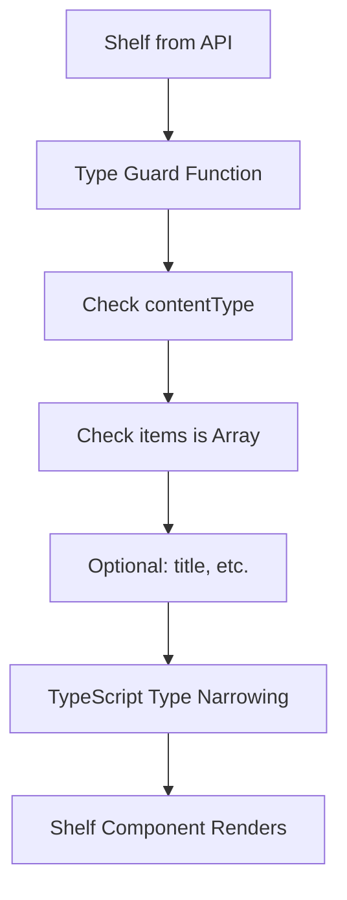
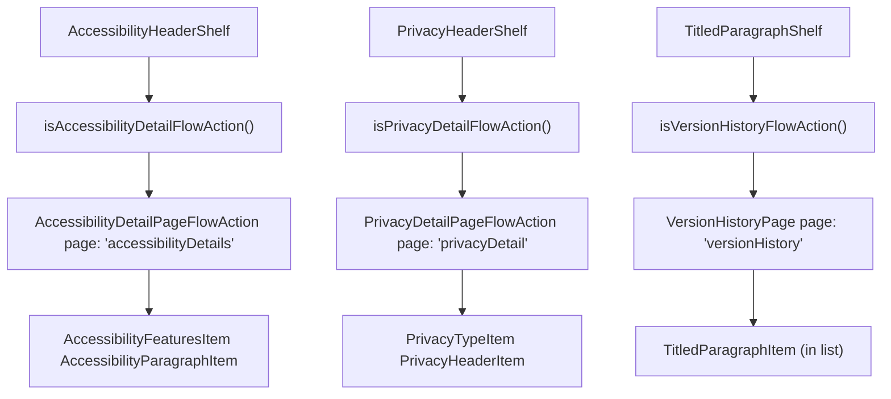

# 信息与合规货架 (Informational and Compliance Shelves)

-   [src/components/PageModal.svelte](https://github.com/Chesszyh/apps.apple.com/blob/279d0c4d/src/components/PageModal.svelte)
-   [src/components/Shelf/Wrapper.svelte](https://github.com/Chesszyh/apps.apple.com/blob/279d0c4d/src/components/Shelf/Wrapper.svelte)
-   [src/components/jet/shelf/AccessibilityHeaderShelf.svelte](https://github.com/Chesszyh/apps.apple.com/blob/279d0c4d/src/components/jet/shelf/AccessibilityHeaderShelf.svelte)
-   [src/components/jet/shelf/ArcadeFooterShelf.svelte](https://github.com/Chesszyh/apps.apple.com/blob/279d0c4d/src/components/jet/shelf/ArcadeFooterShelf.svelte)
-   [src/components/jet/shelf/PageHeaderShelf.svelte](https://github.com/Chesszyh/apps.apple.com/blob/279d0c4d/src/components/jet/shelf/PageHeaderShelf.svelte)
-   [src/components/jet/shelf/PrivacyFooterShelf.svelte](https://github.com/Chesszyh/apps.apple.com/blob/279d0c4d/src/components/jet/shelf/PrivacyFooterShelf.svelte)
-   [src/components/jet/shelf/PrivacyHeaderShelf.svelte](https://github.com/Chesszyh/apps.apple.com/blob/279d0c4d/src/components/jet/shelf/PrivacyHeaderShelf.svelte)
-   [src/components/jet/shelf/TitledParagraphShelf.svelte](https://github.com/Chesszyh/apps.apple.com/blob/279d0c4d/src/components/jet/shelf/TitledParagraphShelf.svelte)
-   [src/components/pages/DefaultPage.svelte](https://github.com/Chesszyh/apps.apple.com/blob/279d0c4d/src/components/pages/DefaultPage.svelte)
-   [src/jet/utils/handle-modal-presentation.ts](https://github.com/Chesszyh/apps.apple.com/blob/279d0c4d/src/jet/utils/handle-modal-presentation.ts)
-   [src/stores/modalPage.ts](https://github.com/Chesszyh/apps.apple.com/blob/279d0c4d/src/stores/modalPage.ts)

## 目的与范围 (Purpose and Scope)

本文档列出了用于在 App Store 页面上显示信息性、法律、合规性和结构性内容的货架 (shelf) 类型。这些货架通常呈现法规披露、无障碍特性、隐私政策、版本历史和页面元数据，而不是推广或产品内容。

有关推广和编辑内容货架，请参阅 [Editorial and Promotional Shelves](#7.1)。有关产品列表货架，请参阅 [Lockup and Grid Shelves](#7.2)。有关许多此类货架所使用的底层模态框呈现系统，请参阅 [Modal Presentation](#4.3)。

---

## 货架类型概览 (Overview of Shelf Types)

信息与合规货架在 App Store Web 应用程序中服务于不同的目的：

| 货架类型 | 内容类型 | 主要目的 | 模态框支持 |
| --- | --- | --- | --- |
| `AccessibilityHeaderShelf` | `accessibilityParagraph` | 显示 App 无障碍特性 | 是（详情页） |
| `PrivacyHeaderShelf` | `privacyHeader` | 显示 App 隐私信息 | 是（详情页） |
| `PrivacyFooterShelf` | `privacyFooter` | 显示隐私页脚链接 | 否 |
| `TitledParagraphShelf` | `titledParagraph` | 显示有标题的文本内容（例如版本历史） | 是（版本历史） |
| `PageHeaderShelf` | `pageHeader` | 显示页面级标题和副标题 | 否 |
| `ArcadeFooterShelf` | `arcadeFooter` | 显示 Arcade 订阅页脚 | 否 |

**来源：** [src/components/jet/shelf/AccessibilityHeaderShelf.svelte1-183](https://github.com/Chesszyh/apps.apple.com/blob/279d0c4d/src/components/jet/shelf/AccessibilityHeaderShelf.svelte#L1-L183) [src/components/jet/shelf/PrivacyHeaderShelf.svelte1-146](https://github.com/Chesszyh/apps.apple.com/blob/279d0c4d/src/components/jet/shelf/PrivacyHeaderShelf.svelte#L1-L146) [src/components/jet/shelf/TitledParagraphShelf.svelte1-119](https://github.com/Chesszyh/apps.apple.com/blob/279d0c4d/src/components/jet/shelf/TitledParagraphShelf.svelte#L1-L119) [src/components/jet/shelf/PageHeaderShelf.svelte1-35](https://github.com/Chesszyh/apps.apple.com/blob/279d0c4d/src/components/jet/shelf/PageHeaderShelf.svelte#L1-L35) [src/components/jet/shelf/PrivacyFooterShelf.svelte1-41](https://github.com/Chesszyh/apps.apple.com/blob/279d0c4d/src/components/jet/shelf/PrivacyFooterShelf.svelte#L1-L41) [src/components/jet/shelf/ArcadeFooterShelf.svelte1-33](https://github.com/Chesszyh/apps.apple.com/blob/279d0c4d/src/components/jet/shelf/ArcadeFooterShelf.svelte#L1-L33)

---

## 货架类型目录 (Shelf Type Catalog)

### AccessibilityHeaderShelf

#### 类型守卫与接口 (Type Guard and Interface)

`AccessibilityHeaderShelf` 显示 App 的无障碍特性，带有一个“查看全部”操作，该操作可打开包含详细信息的模态框。

```
interface AccessibilityHeaderShelf extends Shelf {    items: [AccessibilityParagraph];}function isAccessibilityHeaderShelf(shelf: Shelf): shelf is AccessibilityHeaderShelf
```
**类型守卫逻辑：**

-   `contentType === 'accessibilityParagraph'`
-   存在 `title`
-   `items` 为数组

#### 模态框呈现 (Modal Presentation)

当存在 `seeAllAction` 且为 `AccessibilityDetailPageFlowAction` 时，点击货架标题会打开包含以下内容的模态框：

```
interface AccessibilityDetailPage extends GenericPage {    shelves: (AccessibilityFeaturesShelf | AccessibilityParagraphShelf)[];}
```
模态框遍历货架并渲染：

-   针对段落货架渲染 `AccessibilityParagraphItem`
-   针对特性列表货架渲染 `AccessibilityFeaturesItem`（且 `isDetailView={true}`）

#### 布局特征 (Layout Characteristics)

-   使用 `ShelfWrapper`，具有可配置的 `withBottomPadding`（由 `getAccessibilityLayoutConfiguration` 决定）
-   在 medium+ 视口上，页眉容器宽度为 66%
-   模态框内容部分由 1px 边框分隔，间距为 20px

**来源：** [src/components/jet/shelf/AccessibilityHeaderShelf.svelte1-183](https://github.com/Chesszyh/apps.apple.com/blob/279d0c4d/src/components/jet/shelf/AccessibilityHeaderShelf.svelte#L1-L183)

---

### PrivacyHeaderShelf

#### 类型守卫与接口 (Type Guard and Interface)

`PrivacyHeaderShelf` 显示 App 的隐私信息，带有一个用于显示详细隐私做法的模态框。

```
interface PrivacyHeaderShelf extends Shelf {    items: [PrivacyHeader];}function isPrivacyHeaderShelf(shelf: Shelf): shelf is PrivacyHeaderShelf
```
**类型守卫逻辑：**

-   `contentType === 'privacyHeader'`
-   `items` 为数组

#### 模态框呈现 (Modal Presentation)

与 `AccessibilityHeaderShelf` 类似，该货架支持 `PrivacyDetailPageFlowAction`：

```
interface PrivacyDetailPage extends GenericPage {    shelves: (PrivacyTypeShelf | PrivacyHeaderShelf)[];}
```
模态框渲染：

-   针对页眉货架渲染 `PrivacyHeaderItem`
-   针对类型货架渲染 `PrivacyTypeItem`（且 `isDetailView={true}`）
-   使用 `APP_PRIVACY_MODAL_ID` 进行指标定位

#### 布局特征 (Layout Characteristics)

-   在 `ShelfWrapper` 上设置 `withBottomPadding={false}`
-   在 medium+ 视口上，页眉容器宽度为 66%
-   标题容器使用 `display: flex` 并具有 `justify-content: space-between`

**来源：** [src/components/jet/shelf/PrivacyHeaderShelf.svelte1-146](https://github.com/Chesszyh/apps.apple.com/blob/279d0c4d/src/components/jet/shelf/PrivacyHeaderShelf.svelte#L1-L146)

---

### TitledParagraphShelf

#### 类型守卫与接口 (Type Guard and Interface)

`TitledParagraphShelf` 显示有标题的段落，最常用于版本历史或“新功能”部分。

```
interface TitledParagraphShelf extends Shelf {    items: [TitledParagraph];}function isTitledParagraphShelf(shelf: Shelf): shelf is TitledParagraphShelf
```
**类型守卫逻辑：**

-   `contentType === 'titledParagraph'`
-   `items` 为数组

#### 版本历史模态框 (Version History Modal)

当 `seeAllAction` 为 `VersionHistoryFlowAction` 时，模态框显示完整的版本历史：

```
interface VersionHistoryPage extends FlowAction {    page: 'versionHistory';    pageData: GenericPage;}
```
该模态框：

-   使用 `VERSION_HISTORY_MODAL_ID` 进行指标分析
-   打开时调用 `perform(destination)`
-   在无序列表 (`<ul>`) 中渲染项目
-   使用 `isTitledParagraphItem` 类型守卫过滤项目

#### 项目渲染 (Item Rendering)

每个 `TitledParagraphItem` 都会在货架（折叠视图）和模态框（完整列表）中渲染。

**来源：** [src/components/jet/shelf/TitledParagraphShelf.svelte1-119](https://github.com/Chesszyh/apps.apple.com/blob/279d0c4d/src/components/jet/shelf/TitledParagraphShelf.svelte#L1-L119)

---

### PageHeaderShelf

#### 类型守卫与接口 (Type Guard and Interface)

`PageHeaderShelf` 作为货架组件提供页面级结构化元数据（标题和副标题）。

```
interface PageHeaderShelf extends Shelf {    items: [PageHeader];}function isPageHeaderShelf(shelf: Shelf): shelf is PageHeaderShelf
```
**类型守卫逻辑：**

-   `contentType === 'pageHeader'`
-   `items` 为数组

#### 渲染行为 (Rendering Behavior)

-   渲染带有 `item.title` 和 `item.subtitle` 的 `ShelfTitle`
-   在包装器上使用 `withBottomPadding={false}`
-   应用自定义 CSS 变量 `--shelf-title-font: var(--title-1-emphasized)` 以实现强调样式
-   使用 `display: contents` 以避免引入布局节点

该货架通常用于标题应作为货架系统的一部分而非独立 `<h1>` 元素渲染的页面。

**来源：** [src/components/jet/shelf/PageHeaderShelf.svelte1-35](https://github.com/Chesszyh/apps.apple.com/blob/279d0c4d/src/components/jet/shelf/PageHeaderShelf.svelte#L1-L35)

---

### PrivacyFooterShelf

#### 类型守卫与接口 (Type Guard and Interface)

`PrivacyFooterShelf` 显示包含可链接文本的页脚级隐私信息。

```
interface PrivacyFooterShelf extends Shelf {    items: [PrivacyFooter];}function isPrivacyFooterShelf(shelf: Shelf): shelf is PrivacyFooterShelf
```
**类型守卫逻辑：**

-   `contentType === 'privacyFooter'`
-   `items` 为数组

#### 渲染行为 (Rendering Behavior)

-   从第一个项目中提取 `bodyText`
-   使用 `LinkableTextItem` 组件渲染（支持内联链接）
-   在 `ShelfWrapper` 上使用 `centered` 属性
-   应用 `var(--body-tall)` 字体，并为链接使用 `var(--keyColor)`

**来源：** [src/components/jet/shelf/PrivacyFooterShelf.svelte1-41](https://github.com/Chesszyh/apps.apple.com/blob/279d0c4d/src/components/jet/shelf/PrivacyFooterShelf.svelte#L1-L41)

---

### ArcadeFooterShelf

#### 类型守卫与接口 (Type Guard and Interface)

`ArcadeFooterShelf` 显示特定于 Apple Arcade 订阅的页脚信息。

```
interface ArcadeFooterShelf extends Shelf {    items: [ArcadeFooter];}function isArcadeFooterShelf(shelf: Shelf): shelf is ArcadeFooterShelf
```
**类型守卫逻辑：**

-   `contentType === 'arcadeFooter'`
-   `items` 为数组

#### 渲染行为 (Rendering Behavior)

-   使用具有 `gridType="Spotlight"` 的 `HorizontalShelf`
-   支持来自货架数据的 `rowsPerColumn` 配置
-   使用 `ArcadeFooterItem` 组件渲染每个项目
-   在包装器上设置 `withBottomPadding={false}`

**来源：** [src/components/jet/shelf/ArcadeFooterShelf.svelte1-33](https://github.com/Chesszyh/apps.apple.com/blob/279d0c4d/src/components/jet/shelf/ArcadeFooterShelf.svelte#L1-L33)

---

## 模态框呈现架构 (Modal Presentation Architecture)

### 直接货架模态框模式 (Direct Shelf Modal Pattern)

几种信息类货架实现了其自己的模态框实例以显示详细内容。此模式由 `AccessibilityHeaderShelf`、`PrivacyHeaderShelf` 和 `TitledParagraphShelf` 使用。

**模态框呈现流程 (Modal Presentation Flow)**

> **[Mermaid sequence]**
> *(图表结构无法解析)*

**来源：** [src/components/jet/shelf/AccessibilityHeaderShelf.svelte74-91](https://github.com/Chesszyh/apps.apple.com/blob/279d0c4d/src/components/jet/shelf/AccessibilityHeaderShelf.svelte#L74-L91) [src/components/jet/shelf/PrivacyHeaderShelf.svelte55-71](https://github.com/Chesszyh/apps.apple.com/blob/279d0c4d/src/components/jet/shelf/PrivacyHeaderShelf.svelte#L55-L71) [src/components/jet/shelf/TitledParagraphShelf.svelte51-69](https://github.com/Chesszyh/apps.apple.com/blob/279d0c4d/src/components/jet/shelf/TitledParagraphShelf.svelte#L51-L69)

### 模态框组件生命周期 (Modal Component Lifecycle)

这些货架局部管理模态框状态：

1.  **状态变量：**
    -   `modalComponent: Modal | undefined` - 对模态框实例的引用
    -   `modalTriggerElement: HTMLElement | null` - 触发模态框的元素（用于焦点恢复）
2.  **事件处理器：**
    -   `handleOpenModalClick` - 存储触发元素并调用 `showModal()`
    -   `handleModalClose` - 调用模态框的 `close()` 方法
3.  **页面数据提取：**
    -   检查 `seeAllAction` 是否符合预期的 FlowAction 类型
    -   从操作中提取 `pageData` 作为模态框内容

**来源：** [src/components/jet/shelf/AccessibilityHeaderShelf.svelte74-91](https://github.com/Chesszyh/apps.apple.com/blob/279d0c4d/src/components/jet/shelf/AccessibilityHeaderShelf.svelte#L74-L91)

---

## 类型守卫系统 (Type Guard System)

### 类型守卫实现模式 (Type Guard Implementation Pattern)

所有信息类货架都遵循一致的类型守卫模式：


**通用类型守卫结构：**

1.  从货架中提取 `contentType` 和 `items`
2.  验证 `contentType` 是否匹配预期的字符串字面量
3.  验证 `items` 是否为数组（有时具有特定长度）
4.  可选：验证 `title` 或其他必填字段是否存在
5.  返回带有 TypeScript 类型谓词的布尔值

**来源：** [src/components/jet/shelf/AccessibilityHeaderShelf.svelte33-43](https://github.com/Chesszyh/apps.apple.com/blob/279d0c4d/src/components/jet/shelf/AccessibilityHeaderShelf.svelte#L33-L43) [src/components/jet/shelf/PrivacyHeaderShelf.svelte29-34](https://github.com/Chesszyh/apps.apple.com/blob/279d0c4d/src/components/jet/shelf/PrivacyHeaderShelf.svelte#L29-L34) [src/components/jet/shelf/TitledParagraphShelf.svelte20-26](https://github.com/Chesszyh/apps.apple.com/blob/279d0c4d/src/components/jet/shelf/TitledParagraphShelf.svelte#L20-L26) [src/components/jet/shelf/PageHeaderShelf.svelte8-11](https://github.com/Chesszyh/apps.apple.com/blob/279d0c4d/src/components/jet/shelf/PageHeaderShelf.svelte#L8-L11)

---

## 与全局模态框系统的集成 (Integration with Global Modal System)

### 全局 PageModal vs 直接模态框 (Global PageModal vs Direct Modals)

虽然信息类货架通常使用**直接模态框实例**，但应用程序也通过 `PageModal.svelte` 和 `modalPageStore` 支持**全局模态框系统**。

**对比：**

| 维度 | 直接货架模态框 | 全局 PageModal |
| --- | --- | --- |
| **Store 使用** | 无全局 store | `modalPageStore` |
| **生命周期** | 组件局部 | 应用程序全局 |
| **触发方法** | `handleOpenModalClick` | `handleModalPresentation()` |
| **用例** | 已知的模态框内容（无障碍、隐私、版本历史） | 动态内容（EULA 深层链接） |
| **文件位置** | 位于货架组件内 | `src/components/PageModal.svelte` |

### 全局模态框实现 (Global Modal Implementation)

全局模态框系统使用 Svelte store 管理模态框状态：

```
interface ModalPageStore extends Readable<Page | undefined> {    setPage: (page: Page) => void;    clearPage: () => void;}
```
`handleModalPresentation` 工具函数用于填充此 store：

```
export const handleModalPresentation = (    page: { promise: Promise<Page> },    log: Logger<unknown[]>,    pageDetail?: string,)
```
**来源：** [src/stores/modalPage.ts1-36](https://github.com/Chesszyh/apps.apple.com/blob/279d0c4d/src/stores/modalPage.ts#L1-L36) [src/jet/utils/handle-modal-presentation.ts1-30](https://github.com/Chesszyh/apps.apple.com/blob/279d0c4d/src/jet/utils/handle-modal-presentation.ts#L1-L30) [src/components/PageModal.svelte1-83](https://github.com/Chesszyh/apps.apple.com/blob/279d0c4d/src/components/PageModal.svelte#L1-L83)

---

## 代码实体映射 (Code Entity Mapping)

### 货架类型到代码符号引用 (Shelf Type to Code Symbol Reference)

```mermaid
flowchart TD
    CT_AP["contentType: 'accessibilityParagraph'"]
    CT_PH["contentType: 'privacyHeader'"]
    CT_PF["contentType: 'privacyFooter'"]
    CT_TP["contentType: 'titledParagraph'"]
    CT_PGH["contentType: 'pageHeader'"]
    CT_AF["contentType: 'arcadeFooter'"]
    TG_AHS["isAccessibilityHeaderShelf()"]
    TG_PHS["isPrivacyHeaderShelf()"]
    TG_PFS["isPrivacyFooterShelf()"]
    TG_TPS["isTitledParagraphShelf()"]
    TG_PGHS["isPageHeaderShelf()"]
    TG_AFS["isArcadeFooterShelf()"]
    C_AHS["AccessibilityHeaderShelf.svelte"]
    C_PHS["PrivacyHeaderShelf.svelte"]
    C_PFS["PrivacyFooterShelf.svelte"]
    C_TPS["TitledParagraphShelf.svelte"]
    C_PGHS["PageHeaderShelf.svelte"]
    C_AFS["ArcadeFooterShelf.svelte"]

    CT --> AP_TG_AHS
    TG --> AHS_C_AHS
    CT --> PH_TG_PHS
    TG --> PHS_C_PHS
    CT --> PF_TG_PFS
    TG --> PFS_C_PFS
    CT --> TP_TG_TPS
    TG --> TPS_C_TPS
    CT --> PGH_TG_PGHS
    TG --> PGHS_C_PGHS
    CT --> AF_TG_AFS
    TG --> AFS_C_AFS
```


**来源：** [src/components/jet/shelf/AccessibilityHeaderShelf.svelte33-43](https://github.com/Chesszyh/apps.apple.com/blob/279d0c4d/src/components/jet/shelf/AccessibilityHeaderShelf.svelte#L33-L43) [src/components/jet/shelf/PrivacyHeaderShelf.svelte29-34](https://github.com/Chesszyh/apps.apple.com/blob/279d0c4d/src/components/jet/shelf/PrivacyHeaderShelf.svelte#L29-L34) [src/components/jet/shelf/PrivacyFooterShelf.svelte8-14](https://github.com/Chesszyh/apps.apple.com/blob/279d0c4d/src/components/jet/shelf/PrivacyFooterShelf.svelte#L8-L14) [src/components/jet/shelf/TitledParagraphShelf.svelte20-26](https://github.com/Chesszyh/apps.apple.com/blob/279d0c4d/src/components/jet/shelf/TitledParagraphShelf.svelte#L20-L26) [src/components/jet/shelf/PageHeaderShelf.svelte8-11](https://github.com/Chesszyh/apps.apple.com/blob/279d0c4d/src/components/jet/shelf/PageHeaderShelf.svelte#L8-L11) [src/components/jet/shelf/ArcadeFooterShelf.svelte8-14](https://github.com/Chesszyh/apps.apple.com/blob/279d0c4d/src/components/jet/shelf/ArcadeFooterShelf.svelte#L8-L14)

### 启用模态框的货架：FlowAction 映射 (Modal-Enabled Shelves: FlowAction Mapping)


**来源：** [src/components/jet/shelf/AccessibilityHeaderShelf.svelte53-57](https://github.com/Chesszyh/apps.apple.com/blob/279d0c4d/src/components/jet/shelf/AccessibilityHeaderShelf.svelte#L53-L57) [src/components/jet/shelf/PrivacyHeaderShelf.svelte36-40](https://github.com/Chesszyh/apps.apple.com/blob/279d0c4d/src/components/jet/shelf/PrivacyHeaderShelf.svelte#L36-L40) [src/components/jet/shelf/TitledParagraphShelf.svelte28-32](https://github.com/Chesszyh/apps.apple.com/blob/279d0c4d/src/components/jet/shelf/TitledParagraphShelf.svelte#L28-L32)

---

## 通用布局模式 (Common Layout Patterns)

### ShelfWrapper 集成 (ShelfWrapper Integration)

所有信息类货架都使用 `ShelfWrapper` 以实现一致的间距和标题渲染：

| 货架 | `centered` | `withBottomPadding` | 自定义样式 |
| --- | --- | --- | --- |
| AccessibilityHeaderShelf | 否 | 可配置 | 在 medium+ 上宽度为 66% |
| PrivacyHeaderShelf | 否 | `false` | 在 medium+ 上宽度为 66% |
| PrivacyFooterShelf | 是 | 默认 (`true`) | 覆盖链接颜色 |
| TitledParagraphShelf | 否 | 默认 (`true`) | 无 |
| PageHeaderShelf | 否 | `false` | 覆盖 `--shelf-title-font` |
| ArcadeFooterShelf | 否 | `false` | `HorizontalShelf` 布局 |

### 标题容器模式 (Title Container Pattern)

支持模态框的货架使用一致的标题容器模式：

```
<div slot="title" class="title-container">    {#if shelf.title}        <button on:click={handleOpenModalClick}>            <ShelfTitle title={shelf.title} seeAllAction={destination} />        </button>    {/if}</div>
```
**CSS:**

```
.title-container {    display: flex;    justify-content: space-between;    padding-top: 16px;    padding-inline-end: var(--bodyGutter);}
```
此模式确保：

-   标题与“查看全部”操作水平拉开间距
-   可点击区域涵盖整个标题区域
-   与页面边距保持一致的内边距

**来源：** [src/components/jet/shelf/AccessibilityHeaderShelf.svelte93-107](https://github.com/Chesszyh/apps.apple.com/blob/279d0c4d/src/components/jet/shelf/AccessibilityHeaderShelf.svelte#L93-L107) [src/components/jet/shelf/PrivacyHeaderShelf.svelte74-81](https://github.com/Chesszyh/apps.apple.com/blob/279d0c4d/src/components/jet/shelf/PrivacyHeaderShelf.svelte#L74-L81) [src/components/jet/shelf/TitledParagraphShelf.svelte72-79](https://github.com/Chesszyh/apps.apple.com/blob/279d0c4d/src/components/jet/shelf/TitledParagraphShelf.svelte#L72-L79)

---

## 指标集成 (Metrics Integration)

### 模态框定位 (Modal Targeting)

几种货架为指标追踪指定了唯一的模态框 ID：

-   **APP\_PRIVACY\_MODAL\_ID**：由 `PrivacyHeaderShelf` 模态框使用 ([src/components/jet/shelf/PrivacyHeaderShelf.svelte89](https://github.com/Chesszyh/apps.apple.com/blob/279d0c4d/src/components/jet/shelf/PrivacyHeaderShelf.svelte#L89-L89))
-   **VERSION\_HISTORY\_MODAL\_ID**：由 `TitledParagraphShelf` 模态框使用 ([src/components/jet/shelf/TitledParagraphShelf.svelte86](https://github.com/Chesszyh/apps.apple.com/blob/279d0c4d/src/components/jet/shelf/TitledParagraphShelf.svelte#L86-L86))
-   **LICENSE\_AGREEMENT\_MODAL\_ID**：由全局 `PageModal` 用于 EULA 内容 ([src/components/PageModal.svelte18-21](https://github.com/Chesszyh/apps.apple.com/blob/279d0c4d/src/components/PageModal.svelte#L18-L21))

这些 ID 支持对模态框打开/关闭事件以及模态框内的用户交互进行追踪。有关这些 ID 如何在事件记录中使用的详情，请参阅 [Metrics Pipeline](#3.1)。

**来源：** [src/components/jet/shelf/PrivacyHeaderShelf.svelte51](https://github.com/Chesszyh/apps.apple.com/blob/279d0c4d/src/components/jet/shelf/PrivacyHeaderShelf.svelte#L51-L51) [src/components/jet/shelf/TitledParagraphShelf.svelte46](https://github.com/Chesszyh/apps.apple.com/blob/279d0c4d/src/components/jet/shelf/TitledParagraphShelf.svelte#L46-L46) [src/components/PageModal.svelte9](https://github.com/Chesszyh/apps.apple.com/blob/279d0c4d/src/components/PageModal.svelte#L9-L9)

---

## 总结 (Summary)

信息与合规货架提供了对法规、法律和元数据内容的结构化呈现。关键特征：

1.  **类型安全**：每个货架都有专门的 TypeScript 接口和类型守卫
2.  **模态框支持**：无障碍、隐私和有标题段落货架支持详细的模态框视图
3.  **一致布局**：全部使用 `ShelfWrapper`，具有可配置的内边距和居中设置
4.  **指标集成**：启用模态框的货架为分析追踪指定了唯一 ID
5.  **职责分离**：直接模态框用于已知内容，全局模态框用于动态内容

有关添加新货架类型的实现详情，请参阅 [Adding a New Shelf Type](#8.1)。有关模态框系统架构，请参阅 [Modal Presentation](#4.3)。
