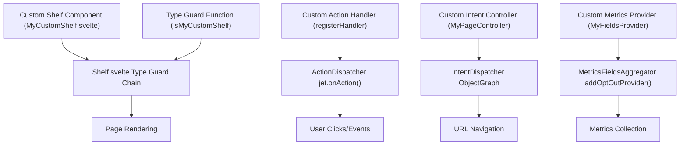
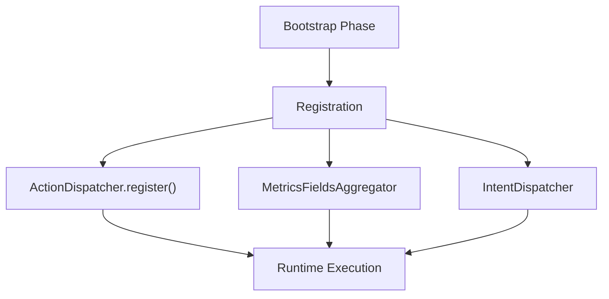
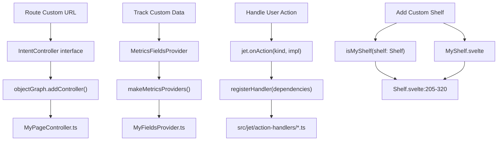
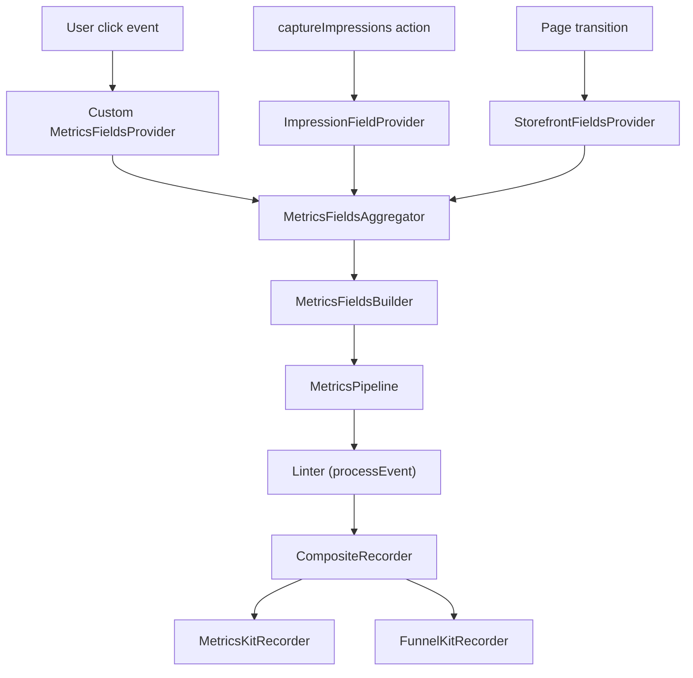
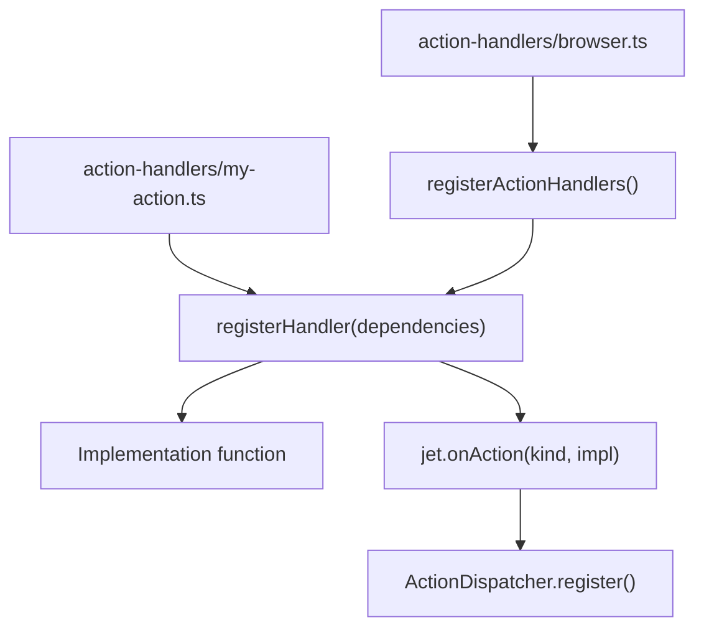

# 开发者指南 (Developer Guides)

-   [shared/metrics-8/src/impression-provider.ts](https://github.com/Chesszyh/apps.apple.com/blob/279d0c4d/shared/metrics-8/src/impression-provider.ts)
-   [shared/metrics-8/src/impression-snapshot-provider.ts](https://github.com/Chesszyh/apps.apple.com/blob/279d0c4d/shared/metrics-8/src/impression-snapshot-provider.ts)
-   [shared/metrics-8/src/impressions/index.ts](https://github.com/Chesszyh/apps.apple.com/blob/279d0c4d/shared/metrics-8/src/impressions/index.ts)
-   [shared/metrics-8/src/index.ts](https://github.com/Chesszyh/apps.apple.com/blob/279d0c4d/shared/metrics-8/src/index.ts)
-   [src/components/jet/shelf/Shelf.svelte](https://github.com/Chesszyh/apps.apple.com/blob/279d0c4d/src/components/jet/shelf/Shelf.svelte)
-   [src/jet/action-handlers/browser.ts](https://github.com/Chesszyh/apps.apple.com/blob/279d0c4d/src/jet/action-handlers/browser.ts)
-   [src/jet/action-handlers/compound-action.ts](https://github.com/Chesszyh/apps.apple.com/blob/279d0c4d/src/jet/action-handlers/compound-action.ts)
-   [src/jet/action-handlers/external-url-action.ts](https://github.com/Chesszyh/apps.apple.com/blob/279d0c4d/src/jet/action-handlers/external-url-action.ts)
-   [src/jet/jet.ts](https://github.com/Chesszyh/apps.apple.com/blob/279d0c4d/src/jet/jet.ts)
-   [src/jet/metrics/providers/StorefrontFieldsProvider.ts](https://github.com/Chesszyh/apps.apple.com/blob/279d0c4d/src/jet/metrics/providers/StorefrontFieldsProvider.ts)
-   [src/jet/metrics/providers/index.ts](https://github.com/Chesszyh/apps.apple.com/blob/279d0c4d/src/jet/metrics/providers/index.ts)
-   [src/jet/models/external-action.ts](https://github.com/Chesszyh/apps.apple.com/blob/279d0c4d/src/jet/models/external-action.ts)
-   [src/jet/svelte.ts](https://github.com/Chesszyh/apps.apple.com/blob/279d0c4d/src/jet/svelte.ts)

## 目的与范围 (Purpose and Scope)

本节为扩展和定制 App Store Web 应用程序的开发人员提供实用指南。这些指南涵盖了代码库中的主要扩展点，包括添加新的货架 (shelf) 类型、处理指标 (metrics)、创建自定义操作 (actions)、实现意图控制器 (intent controllers) 以及优化响应式图像。

有关全面的架构背景，请参阅 [Architecture](#2)。有关详细的组件文档，请参阅 [Component Library](#5) 和 [Shelf Type Reference](#7)。

## 扩展点概览 (Extension Points Overview)

该应用程序提供了四个主要的扩展点，开发人员可以在其中添加自定义功能：

| 扩展点 | 用途 | 主要接口 | 示例用例 |
| --- | --- | --- | --- |
| **货架组件 (Shelf Components)** | 显示自定义内容类型 | 类型守卫 + Svelte 组件 | 自定义推广布局 |
| **操作处理器 (Action Handlers)** | 处理用户交互 | `ActionImplementation<A>` | 第三方集成 |
| **意图控制器 (Intent Controllers)** | 将 URL 路由到页面 | `IntentController` | 自定义页面类型 |
| **指标提供程序 (Metrics Providers)** | 添加分析字段 | `MetricsFieldsProvider` | 自定义追踪数据 |

**来源：** [src/components/jet/shelf/Shelf.svelte1-321](https://github.com/Chesszyh/apps.apple.com/blob/279d0c4d/src/components/jet/shelf/Shelf.svelte#L1-L321) [src/jet/jet.ts248-260](https://github.com/Chesszyh/apps.apple.com/blob/279d0c4d/src/jet/jet.ts#L248-L260) [src/jet/metrics/providers/index.ts1-16](https://github.com/Chesszyh/apps.apple.com/blob/279d0c4d/src/jet/metrics/providers/index.ts#L1-L16)

## 系统集成架构 (System Integration Architecture)

下图展示了开发人员的代码如何在每个扩展点与框架集成：


**来源：** [src/components/jet/shelf/Shelf.svelte205-320](https://github.com/Chesszyh/apps.apple.com/blob/279d0c4d/src/components/jet/shelf/Shelf.svelte#L205-L320) [src/jet/jet.ts248-260](https://github.com/Chesszyh/apps.apple.com/blob/279d0c4d/src/jet/jet.ts#L248-L260) [src/jet/metrics/providers/index.ts6-15](https://github.com/Chesszyh/apps.apple.com/blob/279d0c4d/src/jet/metrics/providers/index.ts#L6-L15)

## 通用开发模式 (Common Development Patterns)

### 类型守卫模式 (Type Guard Pattern)

代码库广泛使用 TypeScript 类型守卫来实现多态渲染。此模式将泛型缩小为特定的实现：

```
// 标准类型守卫结构
export function isMyCustomShelf(shelf: Shelf): shelf is MyCustomShelf {
    return shelf.kind === 'myCustomShelf';
}
```
类型守卫使货架分发器能够将通用的 `Shelf` 模型路由到特定的组件，而无需进行运行时类型转换。

**来源：** [src/components/jet/shelf/Shelf.svelte5-174](https://github.com/Chesszyh/apps.apple.com/blob/279d0c4d/src/components/jet/shelf/Shelf.svelte#L5-L174)

### 注册模式 (Registration Pattern)

自定义功能在初始化期间向框架分发器注册：


这种模式确保了注册过程是类型安全的，并具有编译时检查。

**来源：** [src/jet/jet.ts248-260](https://github.com/Chesszyh/apps.apple.com/blob/279d0c4d/src/jet/jet.ts#L248-L260) [src/jet/action-handlers/browser.ts12-16](https://github.com/Chesszyh/apps.apple.com/blob/279d0c4d/src/jet/action-handlers/browser.ts#L12-L16) [src/jet/metrics/providers/index.ts6-15](https://github.com/Chesszyh/apps.apple.com/blob/279d0c4d/src/jet/metrics/providers/index.ts#L6-L15)

### 提供程序模式 (Provider Pattern)

指标提供程序使用构建器模式来添加上下文字段：

```
class CustomFieldsProvider implements MetricsFieldsProvider {
    addMetricsFields(
        builder: MetricsFieldsBuilder,
        _context: MetricsFieldsContext,
    ) {
        builder.addValue(customValue, 'fieldName');
    }
}
```
聚合器在事件处理之前收集所有已注册提供程序的字段。

**来源：** [src/jet/metrics/providers/StorefrontFieldsProvider.ts1-20](https://github.com/Chesszyh/apps.apple.com/blob/279d0c4d/src/jet/metrics/providers/StorefrontFieldsProvider.ts#L1-L20) [shared/metrics-8/src/impression-provider.ts9-27](https://github.com/Chesszyh/apps.apple.com/blob/279d0c4d/shared/metrics-8/src/impression-provider.ts#L9-L27)

## 框架集成流程 (Framework Integration Flow)

以下序列展示了自定义代码如何在框架生命周期内执行：

> **[Mermaid sequence]**
> *(图表结构无法解析)*

**来源：** [src/jet/jet.ts76-132](https://github.com/Chesszyh/apps.apple.com/blob/279d0c4d/src/jet/jet.ts#L76-L132) [src/jet/action-handlers/browser.ts12-16](https://github.com/Chesszyh/apps.apple.com/blob/279d0c4d/src/jet/action-handlers/browser.ts#L12-L16)

## 关键开发文件 (Key Development Files)

开发人员在扩展系统时通常会处理这些文件：

| 文件路径 | 用途 | 何时修改 |
| --- | --- | --- |
| `src/components/jet/shelf/Shelf.svelte` | 货架类型分发器 | 添加新货架类型 |
| `src/jet/action-handlers/browser.ts` | 操作处理器注册表 | 注册操作处理器 |
| `src/jet/metrics/providers/index.ts` | 指标提供程序注册表 | 添加指标提供程序 |
| `src/jet/bootstrap.ts` | 应用程序初始化 | 修改核心设置 |
| `src/jet/jet.ts` | 核心 Jet 接口 | 从不（使用扩展点） |

**来源：** [src/components/jet/shelf/Shelf.svelte1-321](https://github.com/Chesszyh/apps.apple.com/blob/279d0c4d/src/components/jet/shelf/Shelf.svelte#L1-L321) [src/jet/action-handlers/browser.ts1-17](https://github.com/Chesszyh/apps.apple.com/blob/279d0c4d/src/jet/action-handlers/browser.ts#L1-L17) [src/jet/metrics/providers/index.ts1-16](https://github.com/Chesszyh/apps.apple.com/blob/279d0c4d/src/jet/metrics/providers/index.ts#L1-L16)

## 代码实体图 (Code Entity Map)

此图将高层级概念映射到开发人员交互的具体代码实体：


**来源：** [src/components/jet/shelf/Shelf.svelte1-321](https://github.com/Chesszyh/apps.apple.com/blob/279d0c4d/src/components/jet/shelf/Shelf.svelte#L1-L321) [src/jet/jet.ts248-260](https://github.com/Chesszyh/apps.apple.com/blob/279d0c4d/src/jet/jet.ts#L248-L260) [src/jet/metrics/providers/index.ts1-16](https://github.com/Chesszyh/apps.apple.com/blob/279d0c4d/src/jet/metrics/providers/index.ts#L1-L16) [src/jet/action-handlers/browser.ts1-17](https://github.com/Chesszyh/apps.apple.com/blob/279d0c4d/src/jet/action-handlers/browser.ts#L1-L17)

## 指标集成点 (Metrics Integration Points)

指标系统为自定义分析提供了几个集成点：


**来源：** [shared/metrics-8/src/index.ts531-555](https://github.com/Chesszyh/apps.apple.com/blob/279d0c4d/shared/metrics-8/src/index.ts#L531-L555) [shared/metrics-8/src/impression-provider.ts9-27](https://github.com/Chesszyh/apps.apple.com/blob/279d0c4d/shared/metrics-8/src/impression-provider.ts#L9-L27) [src/jet/metrics/providers/StorefrontFieldsProvider.ts1-20](https://github.com/Chesszyh/apps.apple.com/blob/279d0c4d/src/jet/metrics/providers/StorefrontFieldsProvider.ts#L1-L20)

## 操作处理器注册 (Action Handler Registration)

操作处理器遵循一致的注册模式：


所有操作处理器都通过 `src/jet/action-handlers/browser.ts` 进行注册，以确保正确的初始化顺序。

**来源：** [src/jet/action-handlers/browser.ts1-17](https://github.com/Chesszyh/apps.apple.com/blob/279d0c4d/src/jet/action-handlers/browser.ts#L1-L17) [src/jet/action-handlers/flow-action.ts1-46](https://github.com/Chesszyh/apps.apple.com/blob/279d0c4d/src/jet/action-handlers/flow-action.ts#L1-L46) [src/jet/action-handlers/compound-action.ts1-34](https://github.com/Chesszyh/apps.apple.com/blob/279d0c4d/src/jet/action-handlers/compound-action.ts#L1-L34) [src/jet/action-handlers/external-url-action.ts1-20](https://github.com/Chesszyh/apps.apple.com/blob/279d0c4d/src/jet/action-handlers/external-url-action.ts#L1-L20)

## 依赖与上下文 (Dependencies and Context)

Jet 系统通过对象图 (object graph) 使用依赖注入：

| 依赖项 | 用途 | 访问模式 |
| --- | --- | --- |
| `Jet` | 核心框架实例 | 从 Svelte 上下文中获取 `getJet()` |
| `Metrics` | 分析流水线 | 从上下文中获取 `getMetrics()` |
| `Impressions` | 曝光追踪 | 从上下文中获取 `getImpressions()` |
| `LoggerFactory` | 日志基础设施 | 在依赖项中注入 |
| `ObjectGraph` | 依赖容器 | `jet.objectGraph` |

开发人员的代码通过构造函数注入或上下文函数接收依赖项。

**来源：** [src/jet/svelte.ts8-23](https://github.com/Chesszyh/apps.apple.com/blob/279d0c4d/src/jet/svelte.ts#L8-L23) [src/jet/jet.ts48-156](https://github.com/Chesszyh/apps.apple.com/blob/279d0c4d/src/jet/jet.ts#L48-L156) [shared/metrics-8/src/index.ts558-576](https://github.com/Chesszyh/apps.apple.com/blob/279d0c4d/shared/metrics-8/src/index.ts#L558-L576) [shared/metrics-8/src/impressions/index.ts209-234](https://github.com/Chesszyh/apps.apple.com/blob/279d0c4d/shared/metrics-8/src/impressions/index.ts#L209-L234)

## 快速入门清单 (Quick Start Checklist)

在扩展系统时，请遵循以下步骤：

1.  **确定扩展点**：确定要扩展哪个系统（货架、操作、意图、指标）。
2.  **查看现有示例**：在代码库中查找类似的实现。
3.  **实现类型守卫**：创建 TypeScript 类型守卫以确保类型安全。
4.  **在分发器中注册**：在相应的注册文件中添加注册代码。
5.  **测试集成**：验证运行时分发和类型缩小是否正常工作。
6.  **添加指标**：为新功能实现指标追踪。

有关详细的分步说明，请参阅子页面：

-   [Adding a New Shelf Type](#8.1)
-   [Working with Metrics](#8.2)
-   [Creating Custom Actions](#8.3)
-   [Creating Intent Controllers](#8.4)
-   [Responsive Image Best Practices](#8.5)

**来源：** [src/components/jet/shelf/Shelf.svelte1-321](https://github.com/Chesszyh/apps.apple.com/blob/279d0c4d/src/components/jet/shelf/Shelf.svelte#L1-L321) [src/jet/action-handlers/browser.ts1-17](https://github.com/Chesszyh/apps.apple.com/blob/279d0c4d/src/jet/action-handlers/browser.ts#L1-L17) [src/jet/metrics/providers/index.ts1-16](https://github.com/Chesszyh/apps.apple.com/blob/279d0c4d/src/jet/metrics/providers/index.ts#L1-L16)
