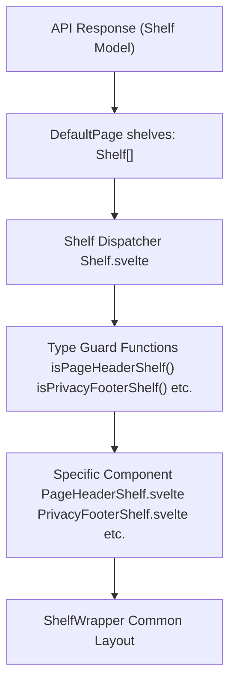
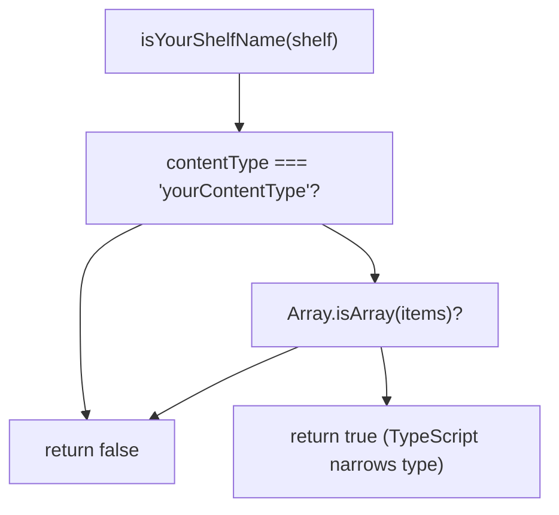
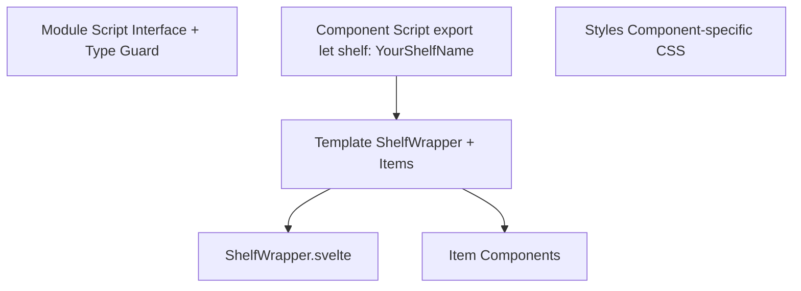
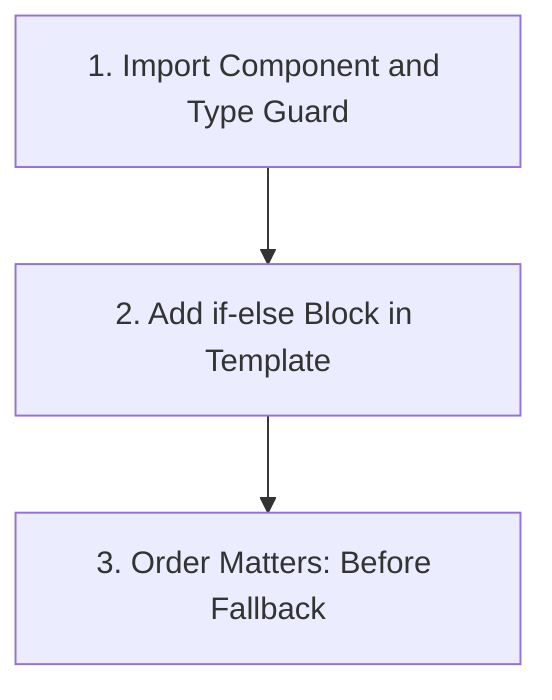

# 添加新货架类型 (Adding a New Shelf Type)

-   [src/components/Shelf/Wrapper.svelte](https://github.com/Chesszyh/apps.apple.com/blob/279d0c4d/src/components/Shelf/Wrapper.svelte)
-   [src/components/jet/shelf/ArcadeFooterShelf.svelte](https://github.com/Chesszyh/apps.apple.com/blob/279d0c4d/src/components/jet/shelf/ArcadeFooterShelf.svelte)
-   [src/components/jet/shelf/PageHeaderShelf.svelte](https://github.com/Chesszyh/apps.apple.com/blob/279d0c4d/src/components/jet/shelf/PageHeaderShelf.svelte)
-   [src/components/jet/shelf/PrivacyFooterShelf.svelte](https://github.com/Chesszyh/apps.apple.com/blob/279d0c4d/src/components/jet/shelf/PrivacyFooterShelf.svelte)
-   [src/components/jet/shelf/Shelf.svelte](https://github.com/Chesszyh/apps.apple.com/blob/279d0c4d/src/components/jet/shelf/Shelf.svelte)
-   [src/components/pages/DefaultPage.svelte](https://github.com/Chesszyh/apps.apple.com/blob/279d0c4d/src/components/pages/DefaultPage.svelte)

## 目的与范围 (Purpose and Scope)

本指南为向 App Store Web 应用程序添加新货架 (shelf) 类型提供了分步说明。它涵盖了从定义 TypeScript 接口到在分发器系统中注册货架的完整过程。

有关货架系统架构和类型守卫模式的概念性信息，请参阅 [Shelf System](#4.2)。有关现有货架类型的文档，请参阅 [Shelf Type Reference](#7)。有关 `ShelfWrapper` 提供的通用布局模式的信息，请参阅 [Shelf Wrapper and Common Layout](#4.4)。

---

## 货架系统概览 (Shelf System Overview)

货架系统使用分发器模式，其中 `Shelf` 组件 ([src/components/jet/shelf/Shelf.svelte195-320](https://github.com/Chesszyh/apps.apple.com/blob/279d0c4d/src/components/jet/shelf/Shelf.svelte#L1-L321)) 充当中央路由器。它从 API 接收通用的 `Shelf` 模型，并使用类型守卫函数缩小类型，然后将渲染委托给特定的组件。


**图表：货架渲染流程 (Shelf Rendering Flow)**

来源：[src/components/jet/shelf/Shelf.svelte1-321](https://github.com/Chesszyh/apps.apple.com/blob/279d0c4d/src/components/jet/shelf/Shelf.svelte#L1-L321) [src/components/pages/DefaultPage.svelte113-124](https://github.com/Chesszyh/apps.apple.com/blob/279d0c4d/src/components/pages/DefaultPage.svelte#L113-L124)

---

## 第 1 步：定义货架接口 (Step 1: Define the Shelf Interface)

每种货架类型都需要一个 TypeScript 接口，该接口扩展了基础 `Shelf` 模型并指定了预期的 `items` 结构。

### 接口模式 (Interface Pattern)

在组件文件的 `context="module"` 脚本块中创建接口：

```
interface YourShelfName extends Shelf {
    items: [YourItemType];
}
```
### 示例：PageHeaderShelf (Example: PageHeaderShelf)

`PageHeaderShelf` 接口定义了一个恰好包含一个 `PageHeader` 项目的货架：

[src/components/jet/shelf/PageHeaderShelf.svelte1-11](https://github.com/Chesszyh/apps.apple.com/blob/279d0c4d/src/components/jet/shelf/PageHeaderShelf.svelte#L1-L11)

### 示例：PrivacyFooterShelf (Example: PrivacyFooterShelf)

`PrivacyFooterShelf` 接口定义了一个恰好包含一个 `PrivacyFooter` 项目的货架：

[src/components/jet/shelf/PrivacyFooterShelf.svelte1-14](https://github.com/Chesszyh/apps.apple.com/blob/279d0c4d/src/components/jet/shelf/PrivacyFooterShelf.svelte#L1-L14)

### 关键考虑因素 (Key Considerations)

| 方面 | 准则 |
| --- | --- |
| **模块上下文** | 在 `<script lang="ts" context="module">` 中定义接口，以便进行类型级导出 |
| **基础扩展** | 始终扩展来自 `@jet-app/app-store/api/models` 的 `Shelf` |
| **项目类型** | 针对单个项目使用如 `[ItemType]` 的元组类型，针对数组使用 `ItemType[]` |
| **命名约定** | 遵循模式：`{Descriptor}{Purpose}Shelf` |

来源：[src/components/jet/shelf/PageHeaderShelf.svelte1-11](https://github.com/Chesszyh/apps.apple.com/blob/279d0c4d/src/components/jet/shelf/PageHeaderShelf.svelte#L1-L11) [src/components/jet/shelf/PrivacyFooterShelf.svelte1-14](https://github.com/Chesszyh/apps.apple.com/blob/279d0c4d/src/components/jet/shelf/PrivacyFooterShelf.svelte#L1-L14)

---

## 第 2 步：创建类型守卫函数 (Step 2: Create the Type Guard Function)

类型守卫函数使 TypeScript 能够将通用的 `Shelf` 类型缩小为特定的货架接口。它们必须从模块上下文中导出。

### 类型守卫模式 (Type Guard Pattern)

```
export function isYourShelfName(shelf: Shelf): shelf is YourShelfName {
    const { contentType, items } = shelf;
    return contentType === 'yourContentType' && Array.isArray(items);
}
```
### 类型守卫决策树 (Type Guard Decision Tree)


**图表：类型守卫评估流程 (Type Guard Evaluation Flow)**

### 示例实现 (Example Implementations)

**简单的类型守卫 (PageHeaderShelf)：**

[src/components/jet/shelf/PageHeaderShelf.svelte8-11](https://github.com/Chesszyh/apps.apple.com/blob/279d0c4d/src/components/jet/shelf/PageHeaderShelf.svelte#L8-L11)

**带有附加验证的类型守卫 (PrivacyFooterShelf)：**

[src/components/jet/shelf/PrivacyFooterShelf.svelte8-14](https://github.com/Chesszyh/apps.apple.com/blob/279d0c4d/src/components/jet/shelf/PrivacyFooterShelf.svelte#L8-L14)

### 类型守卫要求 (Type Guard Requirements)

| 要求 | 目的 |
| --- | --- |
| **导出函数** | 使其可在 `Shelf.svelte` 分发器中导入 |
| **返回类型注解** | 使用 `shelf is YourShelfName` 进行类型缩小 |
| **contentType 检查** | 与 API 的 `contentType` 字符串完全匹配 |
| **项目验证** | 验证 `items` 数组是否存在 |
| **附加检查** | 根据需要添加项目长度或属性检查 |

来源：[src/components/jet/shelf/PageHeaderShelf.svelte8-11](https://github.com/Chesszyh/apps.apple.com/blob/279d0c4d/src/components/jet/shelf/PageHeaderShelf.svelte#L8-L11) [src/components/jet/shelf/PrivacyFooterShelf.svelte8-14](https://github.com/Chesszyh/apps.apple.com/blob/279d0c4d/src/components/jet/shelf/PrivacyFooterShelf.svelte#L8-L14)

---

## 第 3 步：实现货架组件 (Step 3: Implement the Shelf Component)

创建一个 Svelte 组件，该组件接收类型化的货架属性 (prop) 并渲染其内容。

### 组件结构 (Component Structure)


**图表：货架组件架构 (Shelf Component Architecture)**

### 最小组件模板 (Minimal Component Template)

您的组件应遵循以下结构：

1.  **模块脚本 (Module Script)**：接口和类型守卫（见第 1-2 步）
2.  **组件脚本 (Component Script)**：接受类型化的货架属性并提取数据
3.  **模板 (Template)**：使用 `ShelfWrapper` 和项目组件进行渲染
4.  **样式 (Styles)**：组件特定的样式

### 示例：PageHeaderShelf (Example: PageHeaderShelf)

[src/components/jet/shelf/PageHeaderShelf.svelte14-35](https://github.com/Chesszyh/apps.apple.com/blob/279d0c4d/src/components/jet/shelf/PageHeaderShelf.svelte#L14-L35)

关键点：

-   类型化的货架属性：`export let shelf: PageHeaderShelf`
-   数据提取：`$: [item] = shelf.items`（响应式语句）
-   带有自定义标题插槽的 `ShelfWrapper` 用法
-   通过作用域 CSS 实现的自定义样式

### 示例：PrivacyFooterShelf (Example: PrivacyFooterShelf)

[src/components/jet/shelf/PrivacyFooterShelf.svelte17-41](https://github.com/Chesszyh/apps.apple.com/blob/279d0c4d/src/components/jet/shelf/PrivacyFooterShelf.svelte#L17-L41)

关键点：

-   直接访问项目：`$: bodyText = shelf.items[0].bodyText`
-   带有 `centered` 属性的 `ShelfWrapper`
-   委托给 `LinkableTextItem` 进行渲染
-   针对链接的全局样式定位

### 示例：ArcadeFooterShelf (Example: ArcadeFooterShelf)

[src/components/jet/shelf/ArcadeFooterShelf.svelte17-33](https://github.com/Chesszyh/apps.apple.com/blob/279d0c4d/src/components/jet/shelf/ArcadeFooterShelf.svelte#L17-L33)

关键点：

-   可选配置：`$: gridRows = shelf.rowsPerColumn ?? undefined`
-   与 `HorizontalShelf` 组合以实现滚动行为
-   用于项目遍历的 let 绑定：`let:item`

### ShelfWrapper 集成 (ShelfWrapper Integration)

大多数货架使用 `ShelfWrapper` 来提供一致的布局。常用属性：

| 属性 (Prop) | 类型 | 默认值 | 用途 |
| --- | --- | --- | --- |
| `shelf` | `Shelf | undefined` | `undefined` | 为标题/ID 提供货架数据 |
| `centered` | `boolean` | `false` | 约束宽度并居中内容 |
| `withTopBorder` | `boolean` | `false` | 添加顶部边框线 |
| `withTopMargin` | `boolean` | `false` | 添加顶部外边距间距 |
| `withPaddingTop` | `boolean` | `true` | 添加顶部内边距 |
| `withBottomPadding` | `boolean` | `true` | 添加底部内边距 |

来源：[src/components/jet/shelf/PageHeaderShelf.svelte14-35](https://github.com/Chesszyh/apps.apple.com/blob/279d0c4d/src/components/jet/shelf/PageHeaderShelf.svelte#L14-L35) [src/components/jet/shelf/PrivacyFooterShelf.svelte17-41](https://github.com/Chesszyh/apps.apple.com/blob/279d0c4d/src/components/jet/shelf/PrivacyFooterShelf.svelte#L17-L41) [src/components/jet/shelf/ArcadeFooterShelf.svelte17-33](https://github.com/Chesszyh/apps.apple.com/blob/279d0c4d/src/components/jet/shelf/ArcadeFooterShelf.svelte#L17-L33) [src/components/Shelf/Wrapper.svelte1-82](https://github.com/Chesszyh/apps.apple.com/blob/279d0c4d/src/components/Shelf/Wrapper.svelte#L1-L82)

---

## 第 4 步：在货架分发器中注册 (Step 4: Register with the Shelf Dispatcher)

最后一步是在 `Shelf.svelte` 中的中央分发器里注册您的货架类型。

### 注册过程 (Registration Process)


**图表：分发器注册步骤 (Dispatcher Registration Steps)**

### 1. 导入组件和类型守卫 (1. Import the Component and Type Guard)

在 `Shelf.svelte` 顶部添加导入：

```
import YourShelf, {
    isYourShelf,
} from '~/components/jet/shelf/YourShelf.svelte';
```
现有代码示例：

[src/components/jet/shelf/Shelf.svelte97-99](https://github.com/Chesszyh/apps.apple.com/blob/279d0c4d/src/components/jet/shelf/Shelf.svelte#L97-L99)

### 2. 在模板中添加条件块 (2. Add Conditional Block to Template)

在模板的 if-else 链中插入一个新的 `{:else if}` 块：

```
{:else if isYourShelf(shelf)}
    <YourShelf {shelf} />
```
现有代码示例：

[src/components/jet/shelf/Shelf.svelte270-271](https://github.com/Chesszyh/apps.apple.com/blob/279d0c4d/src/components/jet/shelf/Shelf.svelte#L270-L271)

### 3. 放置顺序 (3. Placement Order)

条件检查的顺序很重要：

| 位置 | 用途 |
| --- | --- |
| **顶部** | 性能考虑，放置最具体/最常见的货架 |
| **中部** | 标准货架类型 |
| **在 `isMarkerShelf` 之前** | 所有常规货架 |
| **在 `isFallbackShelf` 之前** | 全匹配项必须放在最后 |

当前分发器结构：

[src/components/jet/shelf/Shelf.svelte205-320](https://github.com/Chesszyh/apps.apple.com/blob/279d0c4d/src/components/jet/shelf/Shelf.svelte#L205-L320)

### 完整注册示例 (Complete Registration Example)

以下是 `PageHeaderShelf` 的注册方式：

**导入：** [src/components/jet/shelf/Shelf.svelte97-99](https://github.com/Chesszyh/apps.apple.com/blob/279d0c4d/src/components/jet/shelf/Shelf.svelte#L97-L99)

**条件：** [src/components/jet/shelf/Shelf.svelte270-271](https://github.com/Chesszyh/apps.apple.com/blob/279d0c4d/src/components/jet/shelf/Shelf.svelte#L270-L271)

来源：[src/components/jet/shelf/Shelf.svelte1-321](https://github.com/Chesszyh/apps.apple.com/blob/279d0c4d/src/components/jet/shelf/Shelf.svelte#L1-L321)

---

## 最佳实践 (Best Practices)

### 接口设计 (Interface Design)

| 实践 | 依据 |
| --- | --- |
| 针对单个项目使用元组类型 `[ItemType]` | 确保恰好只有一个项目，防止意外的数组操作 |
| 仅在需要时包含可选属性 | 保持接口最小化且可预测 |
| 扩展 API 模型中的 `Shelf` | 保持与 API 响应的兼容性 |
| 从模块上下文中导出 | 支持在其他文件中进行类型级导入 |

### 类型守卫实现 (Type Guard Implementation)

| 实践 | 依据 |
| --- | --- |
| 首先检查 `contentType` | 快速失败不匹配的货架 |
| 验证 `items` 是否为数组 | 防止迭代时的运行时错误 |
| 为固定大小数组添加长度检查 | 尽早捕获格式错误的 API 响应 |
| 使用 `const` 解构 | 提高可读性和性能 |

### 组件组织 (Component Organization)

| 实践 | 依据 |
| --- | --- |
| 针对派生数据使用响应式语句 (`$:`) | 确保数据与属性保持同步 |
| 尽早解构 `shelf.items` | 使模板代码更简洁 |
| 委托给项目组件 | 维持关注点分离 |
| 除非需要特殊布局，否则使用 `ShelfWrapper` | 确保一致的间距和标题渲染 |

### 文件命名 (File Naming)

遵循现有约定：

```
{Descriptor}{Purpose}Shelf.svelte
```
示例：

-   `PageHeaderShelf.svelte`
-   `PrivacyFooterShelf.svelte`
-   `ArcadeFooterShelf.svelte`
-   `ProductRatingsShelf.svelte`

来源：[src/components/jet/shelf/PageHeaderShelf.svelte1-35](https://github.com/Chesszyh/apps.apple.com/blob/279d0c4d/src/components/jet/shelf/PageHeaderShelf.svelte#L1-L35) [src/components/jet/shelf/PrivacyFooterShelf.svelte1-41](https://github.com/Chesszyh/apps.apple.com/blob/279d0c4d/src/components/jet/shelf/PrivacyFooterShelf.svelte#L1-L41) [src/components/Shelf/Wrapper.svelte1-82](https://github.com/Chesszyh/apps.apple.com/blob/279d0c4d/src/components/Shelf/Wrapper.svelte#L1-L82)

---

## 完整实现清单 (Complete Implementation Checklist)

使用此清单确保所有步骤都已完成：

### 定义阶段 (Definition Phase)

-   [ ]  创建新的货架组件文件，命名约定为 `{Descriptor}Shelf.svelte`。
-   [ ]  添加带有扩展自 `Shelf` 的 TypeScript 接口的模块脚本块。
-   [ ]  准确定义 `items` 类型（单个项目用元组，多个项目用数组）。
-   [ ]  创建并导出签名为 `(shelf: Shelf): shelf is YourShelf` 的类型守卫函数。

### 实现阶段 (Implementation Phase)

-   [ ]  添加带有类型化货架属性的组件脚本。
-   [ ]  使用响应式语句提取项目数据。
-   [ ]  选择合适的包装器（通常是 `ShelfWrapper`）。
-   [ ]  配置包装器属性（`centered`、`withBottomPadding` 等）。
-   [ ]  实现项目渲染（直接渲染或通过项目组件渲染）。
-   [ ]  如果需要，添加组件特定的样式。

### 注册阶段 (Registration Phase)

-   [ ]  在 `Shelf.svelte` 中导入组件和类型守卫。
-   [ ]  在正确位置添加 `{:else if isYourShelf(shelf)}` 块。
-   [ ]  验证位置是否在 `isMarkerShelf` 和 `isFallbackShelf` 之前。
-   [ ]  使用示例 API 数据进行测试。

### 验证阶段 (Validation Phase)

-   [ ]  验证类型守卫是否正确识别了您的货架。
-   [ ]  确认 TypeScript 提供了正确的类型缩小。
-   [ ]  针对各种视口尺寸测试渲染效果。
-   [ ]  验证无障碍性（键盘导航、屏幕阅读器）。
-   [ ]  如果货架追踪曝光，请检查指标集成。

来源：[src/components/jet/shelf/Shelf.svelte1-321](https://github.com/Chesszyh/apps.apple.com/blob/279d0c4d/src/components/jet/shelf/Shelf.svelte#L1-L321) [src/components/pages/DefaultPage.svelte113-124](https://github.com/Chesszyh/apps.apple.com/blob/279d0c4d/src/components/pages/DefaultPage.svelte#L113-L124)

---

## 示例：创建一个简单的货架 (Example: Creating a Simple Shelf)

以下是创建一个假设的 `QuoteShelf` 的完整过程：

### 1. 定义接口和类型守卫 (1. Define Interface and Type Guard)

```
<script lang="ts" context="module">
    import type { Quote, Shelf } from '@jet-app/app-store/api/models';
    interface QuoteShelf extends Shelf {
        items: [Quote];
    }
    export function isQuoteShelf(shelf: Shelf): shelf is QuoteShelf {
        const { contentType, items } = shelf;
        return contentType === 'quote' && Array.isArray(items);
    }
</script>
```
### 2. 实现组件 (2. Implement Component)

```
<script lang="ts">
    import ShelfWrapper from '~/components/Shelf/Wrapper.svelte';
    export let shelf: QuoteShelf;
    $: [quote] = shelf.items;
</script><ShelfWrapper {shelf} centered>
    <blockquote>
        <p>{quote.text}</p>
        {#if quote.attribution}
            <footer>— {quote.attribution}</footer>
        {/if}
    </blockquote></ShelfWrapper><style>
    blockquote {
        margin: 0;
        padding: 20px;
        font: var(--body-tall);
        font-style: italic;
    }
    footer {
        margin-top: 10px;
        font-style: normal;
        color: var(--systemSecondary);
    }
</style>
```
### 3. 在 Shelf.svelte 中注册 (3. Register in Shelf.svelte)

添加导入：

```
import QuoteShelf, {
    isQuoteShelf,
} from '~/components/jet/shelf/QuoteShelf.svelte';
```
添加条件判断：

```
{:else if isQuoteShelf(shelf)}
    <QuoteShelf {shelf} />
```
来源：[src/components/jet/shelf/PageHeaderShelf.svelte1-35](https://github.com/Chesszyh/apps.apple.com/blob/279d0c4d/src/components/jet/shelf/PageHeaderShelf.svelte#L1-L35) [src/components/Shelf/Wrapper.svelte1-82](https://github.com/Chesszyh/apps.apple.com/blob/279d0c4d/src/components/Shelf/Wrapper.svelte#L1-L82) [src/components/jet/shelf/Shelf.svelte1-321](https://github.com/Chesszyh/apps.apple.com/blob/279d0c4d/src/components/jet/shelf/Shelf.svelte#L1-L321)

---

## 相关模式 (Related Patterns)

### 具有多种项目类型的复杂货架 (Complex Shelves with Multiple Item Types)

一些货架遍历多个项目或具有复杂的布局要求。参考实现如下：

-   **HorizontalShelf 模式**：[ArcadeFooterShelf](https://github.com/Chesszyh/apps.apple.com/blob/279d0c4d/ArcadeFooterShelf) 使用 `HorizontalShelf` 实现可滚动的网格。
-   **轮播模式**：参见 [Hero and Carousel Components](#5.4)。
-   **网格模式**：参见 [Lockup and Grid Shelves](#7.2)。

### 具有自定义操作的货架 (Shelves with Custom Actions)

对于需要处理标准导航之外的用户交互的货架：

-   **模态框集成**：参见 [Modal Presentation](#4.3)。
-   **自定义操作**：参见 [Creating Custom Actions](#8.3)。

### 指标集成 (Metrics Integration)

要追踪曝光和交互：

-   **曝光追踪**：参见 [Impressions Tracking](#3.3)。
-   **自定义指标**：参见 [Working with Metrics](#8.2)。

来源：[src/components/jet/shelf/ArcadeFooterShelf.svelte17-33](https://github.com/Chesszyh/apps.apple.com/blob/279d0c4d/src/components/jet/shelf/ArcadeFooterShelf.svelte#L17-L33)
