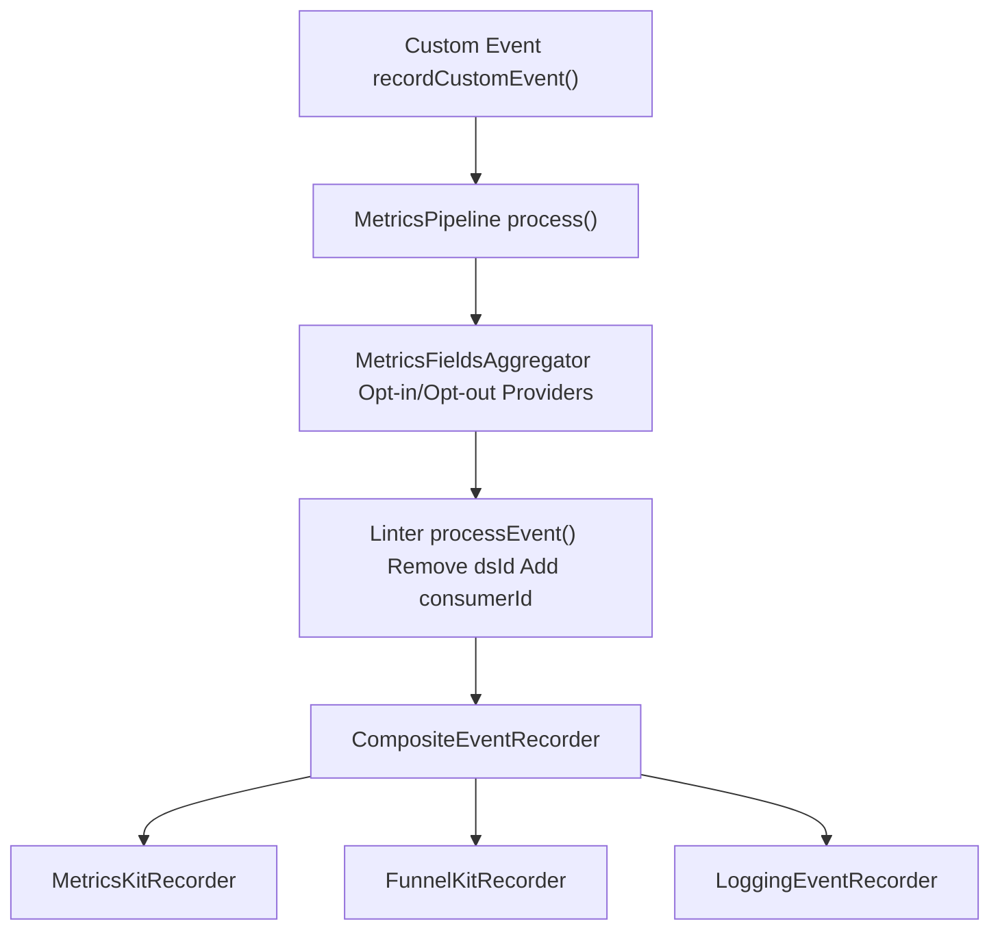
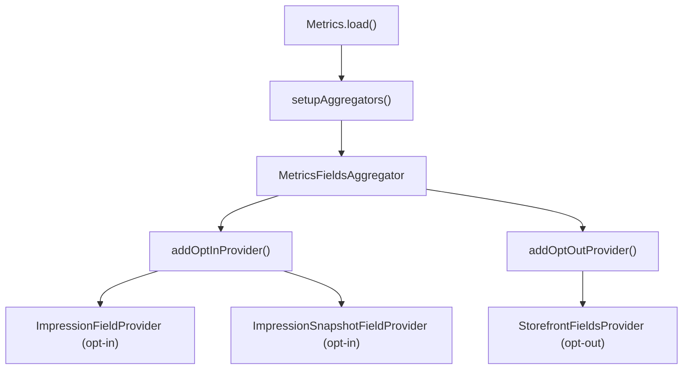
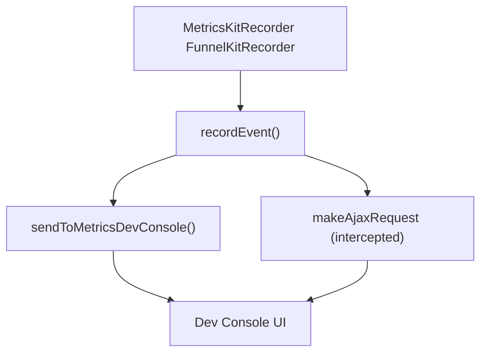

# 处理指标 (Working with Metrics)

-   [shared/metrics-8/src/impression-provider.ts](https://github.com/Chesszyh/apps.apple.com/blob/279d0c4d/shared/metrics-8/src/impression-provider.ts)
-   [shared/metrics-8/src/impression-snapshot-provider.ts](https://github.com/Chesszyh/apps.apple.com/blob/279d0c4d/shared/metrics-8/src/impression-snapshot-provider.ts)
-   [shared/metrics-8/src/impressions/index.ts](https://github.com/Chesszyh/apps.apple.com/blob/279d0c4d/shared/metrics-8/src/impressions/index.ts)
-   [shared/metrics-8/src/index.ts](https://github.com/Chesszyh/apps.apple.com/blob/279d0c4d/shared/metrics-8/src/index.ts)
-   [shared/metrics-8/src/recorder/composite.ts](https://github.com/Chesszyh/apps.apple.com/blob/279d0c4d/shared/metrics-8/src/recorder/composite.ts)
-   [shared/metrics-8/src/recorder/funnelkit.ts](https://github.com/Chesszyh/apps.apple.com/blob/279d0c4d/shared/metrics-8/src/recorder/funnelkit.ts)
-   [shared/metrics-8/src/recorder/logging.ts](https://github.com/Chesszyh/apps.apple.com/blob/279d0c4d/shared/metrics-8/src/recorder/logging.ts)
-   [shared/metrics-8/src/recorder/metricskit.ts](https://github.com/Chesszyh/apps.apple.com/blob/279d0c4d/shared/metrics-8/src/recorder/metricskit.ts)
-   [shared/metrics-8/src/recorder/void.ts](https://github.com/Chesszyh/apps.apple.com/blob/279d0c4d/shared/metrics-8/src/recorder/void.ts)
-   [src/jet/metrics/providers/StorefrontFieldsProvider.ts](https://github.com/Chesszyh/apps.apple.com/blob/279d0c4d/src/jet/metrics/providers/StorefrontFieldsProvider.ts)
-   [src/jet/metrics/providers/index.ts](https://github.com/Chesszyh/apps.apple.com/blob/279d0c4d/src/jet/metrics/providers/index.ts)

本指南为在 App Store Web 应用程序中使用指标 (metrics) 系统的开发人员提供实用说明。它涵盖了如何发出自定义指标事件、如何创建自定义指标提供程序以添加上下文字段，以及如何在开发过程中调试指标。

有关指标流水线的架构详情，请参阅 [Metrics Pipeline](#3.1)。有关曝光追踪 (impression tracking) 的具体信息，请参阅 [Impressions Tracking](#3.3)。有关事件记录器和交付机制的详情，请参阅 [Event Recorders](#3.2)。

## 指标流水线概览 (Metrics Pipeline Overview)

在处理指标之前，了解处理流程很有帮助。事件流经一个流水线，该流水线聚合字段、对数据进行 lint/归一化，并交付给多个记录器。


**关键类及其角色：**

| 类 | 位置 | 用途 |
| --- | --- | --- |
| `Metrics` | [shared/metrics-8/src/index.ts91-444](https://github.com/Chesszyh/apps.apple.com/blob/279d0c4d/shared/metrics-8/src/index.ts#L91-L444) | 协调指标系统的主要类 |
| `MetricsPipeline` | [shared/metrics-8/src/index.ts16](https://github.com/Chesszyh/apps.apple.com/blob/279d0c4d/shared/metrics-8/src/index.ts#L16-L16) 中引用 | 编排字段聚合和事件处理 |
| `MetricsFieldsAggregator` | [shared/metrics-8/src/index.ts13](https://github.com/Chesszyh/apps.apple.com/blob/279d0c4d/shared/metrics-8/src/index.ts#L13-L13) 中引用 | 合并来自多个提供程序的字段 |
| `CompositeEventRecorder` | [shared/metrics-8/src/recorder/composite.ts5-20](https://github.com/Chesszyh/apps.apple.com/blob/279d0c4d/shared/metrics-8/src/recorder/composite.ts#L5-L20) | 将事件分发到多个记录器 |
| `MetricsKitRecorder` | [shared/metrics-8/src/recorder/metricskit.ts29-239](https://github.com/Chesszyh/apps.apple.com/blob/279d0c4d/shared/metrics-8/src/recorder/metricskit.ts#L29-L239) | 将事件发送到 MetricsKit 服务 |
| `FunnelKitRecorder` | [shared/metrics-8/src/recorder/funnelkit.ts28-237](https://github.com/Chesszyh/apps.apple.com/blob/279d0c4d/shared/metrics-8/src/recorder/funnelkit.ts#L28-L237) | 将经过 PII 过滤的事件发送到 FunnelKit |
| `LoggingEventRecorder` | [shared/metrics-8/src/recorder/logging.ts6-21](https://github.com/Chesszyh/apps.apple.com/blob/279d0c4d/shared/metrics-8/src/recorder/logging.ts#L6-L21) | 将事件记录到控制台以供调试 |

来源：[shared/metrics-8/src/index.ts1-579](https://github.com/Chesszyh/apps.apple.com/blob/279d0c4d/shared/metrics-8/src/index.ts#L1-L579) [shared/metrics-8/src/recorder/composite.ts1-21](https://github.com/Chesszyh/apps.apple.com/blob/279d0c4d/shared/metrics-8/src/recorder/composite.ts#L1-L21)

## 发出自定义指标事件 (Emitting Custom Metrics Events)

### 访问 Metrics 实例 (Accessing the Metrics Instance)

`Metrics` 实例存储在 Svelte 上下文中，可以使用 `generateMetricsContextGetter` 辅助函数进行访问：

```
import { generateMetricsContextGetter } from '@amp/web-apps-metrics-8';
import { getContext } from 'svelte';
const getMetrics = generateMetricsContextGetter(getContext);
const metrics = getMetrics();
```
`generateMetricsContextGetter` 函数返回一个从上下文中检索 `Metrics` 实例并带有错误处理功能的 getter [shared/metrics-8/src/index.ts563-575](https://github.com/Chesszyh/apps.apple.com/blob/279d0c4d/shared/metrics-8/src/index.ts#L563-L575)。

来源：[shared/metrics-8/src/index.ts563-575](https://github.com/Chesszyh/apps.apple.com/blob/279d0c4d/shared/metrics-8/src/index.ts#L563-L575)

### 记录事件 (Recording Events)

要发出自定义指标事件，请使用 `recordCustomEvent` 方法：

```
await metrics.recordCustomEvent({
    eventType: 'click',
    actionType: 'navigate',
    targetId: 'featured-app-123',
    targetType: 'app',
    // ... 其他字段
});
```
`recordCustomEvent` 方法会自动将当前页面的指标字段与提供的字段合并 [shared/metrics-8/src/index.ts382-387](https://github.com/Chesszyh/apps.apple.com/blob/279d0c4d/shared/metrics-8/src/index.ts#L382-L387)：

> **[Mermaid sequence]**
> *(图表结构无法解析)*

来源：[shared/metrics-8/src/index.ts382-387](https://github.com/Chesszyh/apps.apple.com/blob/279d0c4d/shared/metrics-8/src/index.ts#L382-L387)

### 常用事件类型 (Common Event Types)

系统支持在 `METRICS_EVENT_TYPES` 中定义的几个标准事件类型：

| 事件类型 | 用途 | 必填字段 |
| --- | --- | --- |
| `enter` | 应用程序/页面进入 | `type` (launch, link, taskSwitch), `openUrl` |
| `exit` | 应用程序/页面退出 | `type` (close, taskSwitch) |
| `click` | 用户交互 | `actionType`, `targetId`, `targetType` |
| `navigate` | 页面导航 | `targetUrl`, `targetId` |
| `impressions` | 可见内容追踪 | `impressions` 数组 |

MetricsKit 记录器会验证事件类型并拒绝无效类型 [shared/metrics-8/src/recorder/metricskit.ts66-77](https://github.com/Chesszyh/apps.apple.com/blob/279d0c4d/shared/metrics-8/src/recorder/metricskit.ts#L66-L77)。

来源：[shared/metrics-8/src/recorder/metricskit.ts55-194](https://github.com/Chesszyh/apps.apple.com/blob/279d0c4d/shared/metrics-8/src/recorder/metricskit.ts#L55-L194)

### 页面转换事件 (Page Transition Events)

`Metrics` 类为页面转换提供了生命周期方法：

```
// 在页面更改之前
metrics.willPageTransition();
// 在进入新页面之后
await metrics.didEnterPage(page);
```
`willPageTransition` 方法在页面卸载前捕获曝光快照 (impression snapshots) [shared/metrics-8/src/index.ts284-286](https://github.com/Chesszyh/apps.apple.com/blob/279d0c4d/shared/metrics-8/src/index.ts#L284-L286)。`didEnterPage` 方法为前一个页面记录退出事件，并为新页面记录进入事件 [shared/metrics-8/src/index.ts288-311](https://github.com/Chesszyh/apps.apple.com/blob/279d0c4d/shared/metrics-8/src/index.ts#L288-L311)。

来源：[shared/metrics-8/src/index.ts284-311](https://github.com/Chesszyh/apps.apple.com/blob/279d0c4d/shared/metrics-8/src/index.ts#L284-L311)

## 创建自定义指标提供程序 (Creating Custom Metrics Providers)

指标提供程序向所有事件添加上下文字段。有两种类型：选择性加入 (opt-in) 提供程序（仅在明确请求时包含）和选择性退出 (opt-out) 提供程序（默认包含）。

### MetricsFieldsProvider 接口 (MetricsFieldsProvider Interface)

自定义提供程序实现 `MetricsFieldsProvider` 接口：

```
interface MetricsFieldsProvider {
    addMetricsFields(
        builder: MetricsFieldsBuilder,
        context: MetricsFieldsContext
    ): void;
}
```
提供程序接收一个用于添加字段的 `builder` 和一个用于运行时状态的 `context` 对象。

来源：在 [shared/metrics-8/src/index.ts3-19](https://github.com/Chesszyh/apps.apple.com/blob/279d0c4d/shared/metrics-8/src/index.ts#L3-L19) 中引用

### 示例：StorefrontFieldsProvider (Example: StorefrontFieldsProvider)

以下是代码库中的一个真实提供程序，用于添加店面 (storefront) 国家代码：

```
export class StorefrontFieldsProvider implements MetricsFieldsProvider {
    constructor(private readonly objectGraph: AppStoreObjectGraph) {}
    addMetricsFields(
        builder: MetricsFieldsBuilder,
        _context: MetricsFieldsContext,
    ) {
        const { storefront } = getLocale(this.objectGraph);
        builder.addValue(storefront, 'storeFrontCountryCode');
    }
}
```
此提供程序从区域设置系统中提取店面，并将其添加到所有事件中 [src/jet/metrics/providers/StorefrontFieldsProvider.ts9-19](https://github.com/Chesszyh/apps.apple.com/blob/279d0c4d/src/jet/metrics/providers/StorefrontFieldsProvider.ts#L9-L19)。

来源：[src/jet/metrics/providers/StorefrontFieldsProvider.ts1-20](https://github.com/Chesszyh/apps.apple.com/blob/279d0c4d/src/jet/metrics/providers/StorefrontFieldsProvider.ts#L1-L20)

### 注册提供程序 (Registering Providers)

提供程序在 `Metrics.load()` 初始化期间注册：


`setupAggregators` 函数将提供程序添加到聚合器中 [shared/metrics-8/src/index.ts531-555](https://github.com/Chesszyh/apps.apple.com/blob/279d0c4d/shared/metrics-8/src/index.ts#L531-L555)：

```
function setupAggregators(
    metricsFieldsProviders: MetricsProvider[],
    context: Map<string, unknown>,
): MetricsFieldsAggregator {
    const aggregator = MetricsFieldsAggregator.makeDefaultAggregator();
    // 选择性加入 (Opt-in) 提供程序（仅在请求时包含）
    aggregator.addOptInProvider(
        new ImpressionFieldProvider(context),
        'impressions',
    );
    aggregator.addOptInProvider(
        new ImpressionSnapshotFieldProvider(context),
        'impressionsSnapshot',
    );
    // 选择性退出 (Opt-out) 提供程序（默认包含）
    metricsFieldsProviders.forEach((metricsFields) => {
        aggregator.addOptOutProvider(
            metricsFields.provider,
            metricsFields.request,
        );
    });
    return aggregator;
}
```
来源：[shared/metrics-8/src/index.ts531-555](https://github.com/Chesszyh/apps.apple.com/blob/279d0c4d/shared/metrics-8/src/index.ts#L531-L555) [src/jet/metrics/providers/index.ts1-16](https://github.com/Chesszyh/apps.apple.com/blob/279d0c4d/src/jet/metrics/providers/index.ts#L1-L16)

### 提供程序注册模式 (Provider Registration Pattern)

要向您的应用程序添加自定义提供程序：

1.  **创建提供程序类**，实现 `MetricsFieldsProvider`。
2.  **从提供程序模块中将其导出**，例如 [src/jet/metrics/providers/index.ts6-15](https://github.com/Chesszyh/apps.apple.com/blob/279d0c4d/src/jet/metrics/providers/index.ts#L6-L15)。
3.  **将其传递给 `Metrics.load()`** 的 `listofMetricProviders` 参数。

```
const providers = makeMetricsProviders(objectGraph);
const metrics = Metrics.load(
    loggerFactory,
    context,
    processEvent,
    config,
    providers, // 您的自定义提供程序
    settings,
);
```
来源：[src/jet/metrics/providers/index.ts1-16](https://github.com/Chesszyh/apps.apple.com/blob/279d0c4d/src/jet/metrics/providers/index.ts#L1-L16) [shared/metrics-8/src/index.ts108-263](https://github.com/Chesszyh/apps.apple.com/blob/279d0c4d/shared/metrics-8/src/index.ts#L108-L263)

### 选择性加入 vs 选择性退出提供程序 (Opt-In vs Opt-Out Providers)

**选择性退出提供程序 (Opt-Out Providers)：**

-   默认情况下字段会被添加到所有事件中。
-   可以通过将提供程序的名称添加到 `MetricsData` 中的 `excludingFields` 来排除。
-   用于除非明确删除否则应存在的字段。
-   示例：`StorefrontFieldsProvider` 为所有事件添加店面信息。

**选择性加入提供程序 (Opt-In Providers)：**

-   字段仅在明确请求时才会添加。
-   必须通过将提供程序的名称添加到 `MetricsData` 中的 `includingFields` 来包含。
-   用于开销较大的计算，或者仅对特定事件类型需要的字段。
-   示例：`ImpressionFieldProvider` 仅在请求时添加曝光数据。

来源：[shared/metrics-8/src/index.ts531-555](https://github.com/Chesszyh/apps.apple.com/blob/279d0c4d/shared/metrics-8/src/index.ts#L531-L555)

## 调试指标 (Debugging Metrics)

### 将事件记录到控制台 (Logging Events to Console)

`LoggingEventRecorder` 会自动启用，并将所有指标事件记录到控制台 [shared/metrics-8/src/recorder/logging.ts6-21](https://github.com/Chesszyh/apps.apple.com/blob/279d0c4d/shared/metrics-8/src/recorder/logging.ts#L6-L21)：

```
export class LoggingEventRecorder implements MetricsEventRecorder {
    private readonly log: Logger;
    constructor(loggerFactory: LoggerFactory) {
        this.log = loggerFactory.loggerFor('LoggingEventRecorder');
    }
    record(event: LintedMetricsEvent, topic: Opt<string>): void {
        this.log.info('logged metrics event:', event, topic);
    }
}
```
事件将出现在浏览器控制台中，前缀为 "LoggingEventRecorder"。

来源：[shared/metrics-8/src/recorder/logging.ts1-22](https://github.com/Chesszyh/apps.apple.com/blob/279d0c4d/shared/metrics-8/src/recorder/logging.ts#L1-L22)

### 指标开发控制台 (Metrics Dev Console)

对于内部构建 (`APP_SCOPE === 'internal'`)，系统包含一个开发控制台，用于捕获发送到 MetricsKit 和 FunnelKit 网络服务的请求 [shared/metrics-8/src/index.ts458-473](https://github.com/Chesszyh/apps.apple.com/blob/279d0c4d/shared/metrics-8/src/index.ts#L458-L473)。

开发控制台会拦截网络调用，并为了便于检查而单独记录它们：


`sendToMetricsDevConsole` 函数在每次成功记录事件后被调用 [shared/metrics-8/src/recorder/metricskit.ts168-171](https://github.com/Chesszyh/apps.apple.com/blob/279d0c4d/shared/metrics-8/src/recorder/metricskit.ts#L168-L171)。

来源：[shared/metrics-8/src/index.ts458-473](https://github.com/Chesszyh/apps.apple.com/blob/279d0c4d/shared/metrics-8/src/index.ts#L458-L473) [shared/metrics-8/src/recorder/metricskit.ts110-113](https://github.com/Chesszyh/apps.apple.com/blob/279d0c4d/shared/metrics-8/src/recorder/metricskit.ts#L110-L113)

### 检查延迟事件 (Inspecting Deferred Events)

`MetricsKitRecorder` 和 `FunnelKitRecorder` 都会在底层服务初始化之前对事件进行排队。您可以检查这些队列：

```
class MetricsKitRecorder {
    private readonly deferredEvents: DeferredEvent[];
    
    record(event: LintedMetricsEvent, topic: Opt<string>): void {
        if (this.eventRecorder) {
            // 立即处理
        } else {
            // 排队待后续处理
            this.deferredEvents.push({ event, topic });
        }
    }
}
```
一旦调用了 `setupEventRecorder`，延迟事件就会被自动处理 [shared/metrics-8/src/recorder/metricskit.ts203-213](https://github.com/Chesszyh/apps.apple.com/blob/279d0c4d/shared/metrics-8/src/recorder/metricskit.ts#L203-L213)。

来源：[shared/metrics-8/src/recorder/metricskit.ts38-213](https://github.com/Chesszyh/apps.apple.com/blob/279d0c4d/shared/metrics-8/src/recorder/metricskit.ts#L38-L213) [shared/metrics-8/src/recorder/funnelkit.ts36-218](https://github.com/Chesszyh/apps.apple.com/blob/279d0c4d/shared/metrics-8/src/recorder/funnelkit.ts#L36-L218)

### 启用/禁用记录器 (Enabling/Disabling Recorders)

您可以动态启用或禁用单个记录器：

```
// 禁用 MetricsKit 事件
metrics.disableMetrics();
// 重新启用 MetricsKit 事件
metrics.enableMetrics();
// 启用 FunnelKit（如果已配置）
metrics.enableFunnelKit();
// 禁用 FunnelKit
metrics.disableFunnelKit();
```
`MetricsKitRecorder` 会在记录之前检查其启用状态 [shared/metrics-8/src/recorder/metricskit.ts57-63](https://github.com/Chesszyh/apps.apple.com/blob/279d0c4d/shared/metrics-8/src/recorder/metricskit.ts#L57-L63)：

```
record(event: LintedMetricsEvent, topic: Opt<string>): void {
    if (this.isDisabled()) {
        this.log.info(
            `topic ${this.config.topic} is disabled following event not captured:`,
            event,
        );
        return;
    }
    // ... 处理事件
}
```
来源：[shared/metrics-8/src/index.ts426-443](https://github.com/Chesszyh/apps.apple.com/blob/279d0c4d/shared/metrics-8/src/index.ts#L426-L443) [shared/metrics-8/src/recorder/metricskit.ts215-238](https://github.com/Chesszyh/apps.apple.com/blob/279d0c4d/shared/metrics-8/src/recorder/metricskit.ts#L215-L238)

### 验证事件字段 (Verifying Event Fields)

流水线中的 linter 会执行验证和归一化：

1.  **移除 `dsId` 字段** - 由其他系统添加，但 Web 端不需要 [shared/metrics-8/src/index.ts182-186](https://github.com/Chesszyh/apps.apple.com/blob/279d0c4d/shared/metrics-8/src/index.ts#L182-L186)。
2.  **添加 `consumerId`** - 在事件发生时为已认证用户动态获取 [shared/metrics-8/src/index.ts188-193](https://github.com/Chesszyh/apps.apple.com/blob/279d0c4d/shared/metrics-8/src/index.ts#L188-L193)。
3.  **验证 `eventType`** - MetricsKit 记录器会拒绝无效的事件类型 [shared/metrics-8/src/recorder/metricskit.ts68-77](https://github.com/Chesszyh/apps.apple.com/blob/279d0c4d/shared/metrics-8/src/recorder/metricskit.ts#L68-L77)。

要调试字段处理过程，请检查记录的事件，这些事件包含了在聚合和 linting 之后完全处理过的字段。

来源：[shared/metrics-8/src/index.ts178-199](https://github.com/Chesszyh/apps.apple.com/blob/279d0c4d/shared/metrics-8/src/index.ts#L178-L199) [shared/metrics-8/src/recorder/metricskit.ts55-84](https://github.com/Chesszyh/apps.apple.com/blob/279d0c4d/shared/metrics-8/src/recorder/metricskit.ts#L55-L84)

## 通用模式 (Common Patterns)

### 记录带有导航的点击事件 (Recording Click Events with Navigation)

当一次点击应导航到新页面时，请在导航前捕获曝光快照：

```
metrics.willPageTransition();
await metrics.recordCustomEvent({
    eventType: 'click',
    actionType: 'navigate',
    targetUrl: '/apps/app/123',
    targetId: '123',
    targetType: 'app',
});
```
`willPageTransition` 调用确保在正确的时刻捕获曝光数据 [shared/metrics-8/src/index.ts284-286](https://github.com/Chesszyh/apps.apple.com/blob/279d0c4d/shared/metrics-8/src/index.ts#L284-L286)。

来源：[shared/metrics-8/src/index.ts284-286](https://github.com/Chesszyh/apps.apple.com/blob/279d0c4d/shared/metrics-8/src/index.ts#L284-L286) [shared/metrics-8/src/recorder/metricskit.ts86-91](https://github.com/Chesszyh/apps.apple.com/blob/279d0c4d/shared/metrics-8/src/recorder/metricskit.ts#L86-L91)

### 页面退出时刷新事件 (Flushing Events on Page Exit)

退出事件会自动触发刷新未报告的事件，以确保数据不丢失 [shared/metrics-8/src/recorder/metricskit.ts184-189](https://github.com/Chesszyh/apps.apple.com/blob/279d0c4d/shared/metrics-8/src/recorder/metricskit.ts#L184-L189)：

```
// 在退出事件时，我们应该刷新所有指标
if (eventHandler === 'exit') {
    this.eventRecorder?.flushUnreportedEvents?.(true);
    sendToMetricsDevConsole(
        { metricsDevType: eventType.FLUSH, status: 'SUCCESS' },
        topic,
    );
}
```
这是自动处理的；您不需要为退出事件显式调用刷新。

来源：[shared/metrics-8/src/recorder/metricskit.ts184-190](https://github.com/Chesszyh/apps.apple.com/blob/279d0c4d/shared/metrics-8/src/recorder/metricskit.ts#L184-L190) [shared/metrics-8/src/recorder/funnelkit.ts181-190](https://github.com/Chesszyh/apps.apple.com/blob/279d0c4d/shared/metrics-8/src/recorder/funnelkit.ts#L181-L190)

### 服务器端渲染 (Server-Side Rendering)

在服务器上，通过创建一个丢弃所有事件的 `VoidEventRecorder` 来禁用指标 [shared/metrics-8/src/index.ts125-139](https://github.com/Chesszyh/apps.apple.com/blob/279d0c4d/shared/metrics-8/src/index.ts#L125-L139)：

```
if (typeof window === 'undefined' || suppressMetricsKit) {
    const recorder = new VoidEventRecorder();
    const metricsPipeline = new MetricsPipeline({
        aggregator: new MetricsFieldsAggregator(),
        linter: {
            async processEvent(fields: MetricsFields): Promise<LintedMetricsEvent> {
                return { fields };
            },
        },
        recorder,
    });
    return new Metrics(log, metricsPipeline, config);
}
```
`VoidEventRecorder` 会计算事件数量但不会发送到任何地方 [shared/metrics-8/src/recorder/void.ts5-17](https://github.com/Chesszyh/apps.apple.com/blob/279d0c4d/shared/metrics-8/src/recorder/void.ts#L5-L17)。

来源：[shared/metrics-8/src/index.ts124-140](https://github.com/Chesszyh/apps.apple.com/blob/279d0c4d/shared/metrics-8/src/index.ts#L124-L140) [shared/metrics-8/src/recorder/void.ts1-18](https://github.com/Chesszyh/apps.apple.com/blob/279d0c4d/shared/metrics-8/src/recorder/void.ts#L1-L18)

### 使用页面指标 (Working with Page Metrics)

当前页面的指标字段会通过 `currentPageMetrics` 自动包含在所有自定义事件中：

```
async recordCustomEvent(fields?: Opt<MetricsFields>) {
    await this.processEvent({
        ...this.currentPageMetrics?.pageMetrics?.pageFields,
        ...fields,
    });
}
```
`currentPageMetrics` 由 `didEnterPage` 更新，包含来自当前页面的 `pageId`、`pageType` 和 `pageContext` 等字段 [shared/metrics-8/src/index.ts296-301](https://github.com/Chesszyh/apps.apple.com/blob/279d0c4d/shared/metrics-8/src/index.ts#L296-L301)。

来源：[shared/metrics-8/src/index.ts382-387](https://github.com/Chesszyh/apps.apple.com/blob/279d0c4d/shared/metrics-8/src/index.ts#L382-L387) [shared/metrics-8/src/index.ts296-301](https://github.com/Chesszyh/apps.apple.com/blob/279d0c4d/shared/metrics-8/src/index.ts#L296-L301)
