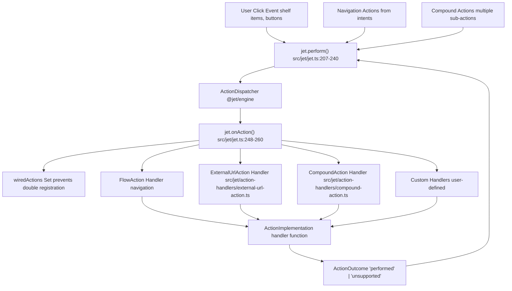
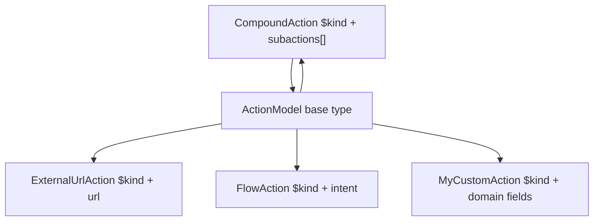
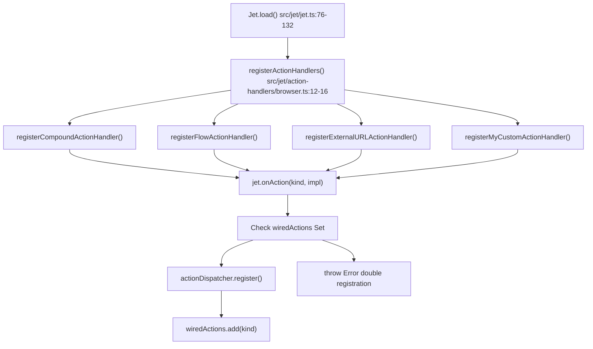
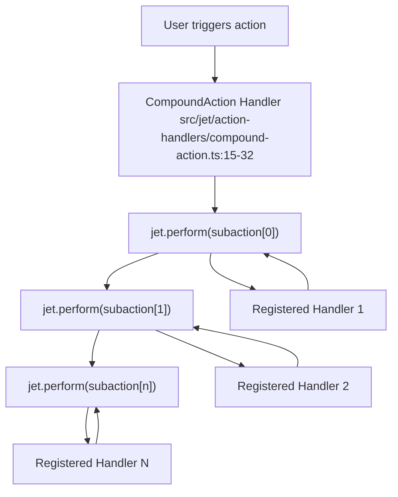
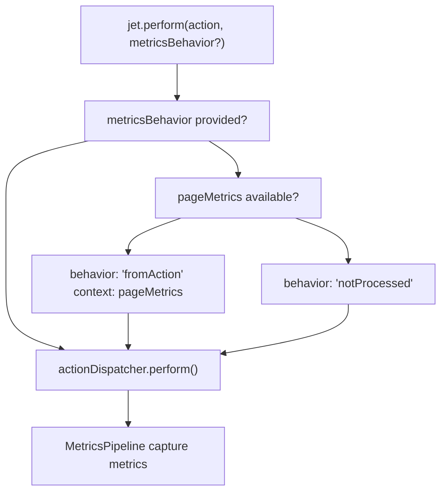

# 创建自定义操作 (Creating Custom Actions)

-   [src/jet/action-handlers/browser.ts](https://github.com/Chesszyh/apps.apple.com/blob/279d0c4d/src/jet/action-handlers/browser.ts)
-   [src/jet/action-handlers/compound-action.ts](https://github.com/Chesszyh/apps.apple.com/blob/279d0c4d/src/jet/action-handlers/compound-action.ts)
-   [src/jet/action-handlers/external-url-action.ts](https://github.com/Chesszyh/apps.apple.com/blob/279d0c4d/src/jet/action-handlers/external-url-action.ts)
-   [src/jet/bootstrap.ts](https://github.com/Chesszyh/apps.apple.com/blob/279d0c4d/src/jet/bootstrap.ts)
-   [src/jet/intents/route-url/route-url-controller.ts](https://github.com/Chesszyh/apps.apple.com/blob/279d0c4d/src/jet/intents/route-url/route-url-controller.ts)
-   [src/jet/intents/route-url/route-url-intent.ts](https://github.com/Chesszyh/apps.apple.com/blob/279d0c4d/src/jet/intents/route-url/route-url-intent.ts)
-   [src/jet/intents/static-message-pages/carrier-page-intent-controller.ts](https://github.com/Chesszyh/apps.apple.com/blob/279d0c4d/src/jet/intents/static-message-pages/carrier-page-intent-controller.ts)
-   [src/jet/intents/static-message-pages/contingent-price-page-intent-controller.ts](https://github.com/Chesszyh/apps.apple.com/blob/279d0c4d/src/jet/intents/static-message-pages/contingent-price-page-intent-controller.ts)
-   [src/jet/intents/static-message-pages/invoice-page-intent-controller.ts](https://github.com/Chesszyh/apps.apple.com/blob/279d0c4d/src/jet/intents/static-message-pages/invoice-page-intent-controller.ts)
-   [src/jet/jet.ts](https://github.com/Chesszyh/apps.apple.com/blob/279d0c4d/src/jet/jet.ts)
-   [src/jet/models/external-action.ts](https://github.com/Chesszyh/apps.apple.com/blob/279d0c4d/src/jet/models/external-action.ts)
-   [src/jet/svelte.ts](https://github.com/Chesszyh/apps.apple.com/blob/279d0c4d/src/jet/svelte.ts)

## 目的与范围 (Purpose and Scope) 

本指南介绍了如何在 App Store Web 应用程序中定义和实现自定义操作处理器 (action handlers)。操作代表了触发应用程序行为的用户交互和系统事件，例如导航、打开外部 URL 或按顺序执行多个操作。

有关使用意图在页面之间导航的信息，请参阅 [Intent and Action System](#2.2)。有关创建新页面类型的详情，请参阅 [Creating Intent Controllers](#8.4)。有关指标相关的操作，请参阅 [Working with Metrics](#8.2)。

---

## 操作系统架构 (Action System Architecture)

App Store Web 应用程序中的操作遵循集中式分发模式。`ActionDispatcher` 根据操作的 `$kind` 字段将操作模型路由到已注册的处理器实现。


**来源：** [src/jet/jet.ts1-320](https://github.com/Chesszyh/apps.apple.com/blob/279d0c4d/src/jet/jet.ts#L1-L320) [src/jet/action-handlers/browser.ts1-17](https://github.com/Chesszyh/apps.apple.com/blob/279d0c4d/src/jet/action-handlers/browser.ts#L1-L17)

### 关键组件 (Key Components)

| 组件 | 位置 | 用途 |
| --- | --- | --- |
| `Jet.perform()` | [src/jet/jet.ts207-240](https://github.com/Chesszyh/apps.apple.com/blob/279d0c4d/src/jet/jet.ts#L207-L240) | 执行操作的入口点 |
| `Jet.onAction()` | [src/jet/jet.ts248-260](https://github.com/Chesszyh/apps.apple.com/blob/279d0c4d/src/jet/jet.ts#L248-L260) | 在分发器中注册操作处理器 |
| `ActionDispatcher` | [src/jet/jet.ts111-116](https://github.com/Chesszyh/apps.apple.com/blob/279d0c4d/src/jet/jet.ts#L111-L116) | 将操作路由到已注册的处理器 |
| `wiredActions` | [src/jet/jet.ts71-259](https://github.com/Chesszyh/apps.apple.com/blob/279d0c4d/src/jet/jet.ts#L71-L259) | 追踪已注册的操作类型以防止重复 |
| `ActionImplementation<A>` | [src/jet/jet.ts19-250](https://github.com/Chesszyh/apps.apple.com/blob/279d0c4d/src/jet/jet.ts#L19-L250) | 处理器函数的类型签名 |
| `ActionOutcome` | [src/jet/jet.ts21-229](https://github.com/Chesszyh/apps.apple.com/blob/279d0c4d/src/jet/jet.ts#L21-L229) | 返回类型：`'performed'` 或 `'unsupported'` |

**来源：** [src/jet/jet.ts1-320](https://github.com/Chesszyh/apps.apple.com/blob/279d0c4d/src/jet/jet.ts#L1-L320)

---

## 定义操作模型 (Defining Action Models)

操作模型是描述要执行的操作的普通对象。所有操作必须包含一个标识操作类型的 `$kind` 字段。

### 基础操作模型结构 (Basic Action Model Structure)

```
export interface MyCustomAction extends ActionModel {
    $kind: 'MyCustomAction';
    
    // 操作特定的属性
    targetId: string;
    options?: {
        animated: boolean;
        delay?: number;
    };
}
```
### 操作模型模式 (Action Model Patterns)


**来源：** [src/jet/models/external-action.ts1-8](https://github.com/Chesszyh/apps.apple.com/blob/279d0c4d/src/jet/models/external-action.ts#L1-L8) [src/jet/action-handlers/compound-action.ts3-15](https://github.com/Chesszyh/apps.apple.com/blob/279d0c4d/src/jet/action-handlers/compound-action.ts#L3-L15)

### 类型守卫模式 (Type Guard Pattern)

定义一个类型守卫函数来安全地识别您的操作类型：

```
export function isMyCustomAction(
    action: ActionModel
): action is MyCustomAction {
    return action.$kind === 'MyCustomAction';
}
```
**来源：** [src/jet/models/external-action.ts3-7](https://github.com/Chesszyh/apps.apple.com/blob/279d0c4d/src/jet/models/external-action.ts#L3-L7)

---

## 实现操作处理器 (Implementing Action Handlers)

操作处理器是执行操作行为并返回 `ActionOutcome` 的异步函数。

### 处理器实现模式 (Handler Implementation Pattern)

> **[Mermaid sequence]**
> *(图表结构无法解析)*

**来源：** [src/jet/jet.ts207-240](https://github.com/Chesszyh/apps.apple.com/blob/279d0c4d/src/jet/jet.ts#L207-L240) [src/jet/action-handlers/external-url-action.ts15-18](https://github.com/Chesszyh/apps.apple.com/blob/279d0c4d/src/jet/action-handlers/external-url-action.ts#L15-L18)

### 处理器函数结构 (Handler Function Structure)

创建一个遵循既定模式的处理器注册函数：

```
// src/jet/action-handlers/my-custom-action.ts
import type { Jet } from '~/jet';
import type { LoggerFactory } from '@amp/web-apps-logger';
import type { MyCustomAction } from '~/jet/models';

export type Dependencies = {
    jet: Jet;
    logger: LoggerFactory;
};

export function registerHandler(dependencies: Dependencies) {
    const { jet, logger } = dependencies;
    const log = logger.loggerFor('jet/action-handlers/my-custom-action');

    jet.onAction('MyCustomAction', async (action: MyCustomAction) => {
        log.info('received MyCustomAction:', action);
        try {
            // 执行操作的任务
            await executeCustomLogic(action);
            
            return 'performed';
        } catch (error) {
            log.error('MyCustomAction failed:', error);
            // 决定是抛出错误还是返回 'unsupported'
            throw error;
        }
    });
}

async function executeCustomLogic(action: MyCustomAction): Promise<void> {
    // 实现细节
}
```
**来源：** [src/jet/action-handlers/external-url-action.ts1-20](https://github.com/Chesszyh/apps.apple.com/blob/279d0c4d/src/jet/action-handlers/external-url-action.ts#L1-L20) [src/jet/action-handlers/compound-action.ts1-34](https://github.com/Chesszyh/apps.apple.com/blob/279d0c4d/src/jet/action-handlers/compound-action.ts#L1-L34)

---

## 注册操作处理器 (Registering Action Handlers)

处理器必须在应用程序引导期间注册，且必须在执行任何操作之前完成。

### 注册流程 (Registration Flow)


**来源：** [src/jet/action-handlers/browser.ts1-17](https://github.com/Chesszyh/apps.apple.com/blob/279d0c4d/src/jet/action-handlers/browser.ts#L1-L17) [src/jet/jet.ts248-260](https://github.com/Chesszyh/apps.apple.com/blob/279d0c4d/src/jet/jet.ts#L248-L260)

### 第 1 步：将处理器添加到 Browser 注册 (Step 1: Add Handler to Browser Registration)

修改 [src/jet/action-handlers/browser.ts](https://github.com/Chesszyh/apps.apple.com/blob/279d0c4d/src/jet/action-handlers/browser.ts) 以导入并注册您的处理器：

```
// src/jet/action-handlers/browser.ts
import type { Dependencies } from './types';
import { registerHandler as registerFlowActionHandler } from '~/jet/action-handlers/flow-action';
import { registerHandler as registerExternalURLActionHandler } from '~/jet/action-handlers/external-url-action';
import { registerHandler as registerCompoundActionHandler } from '~/jet/action-handlers/compound-action';
import { registerHandler as registerMyCustomActionHandler } from '~/jet/action-handlers/my-custom-action';

export type { Dependencies };

export function registerActionHandlers(dependencies: Dependencies) {
    registerCompoundActionHandler(dependencies);
    registerFlowActionHandler(dependencies);
    registerExternalURLActionHandler(dependencies);
    registerMyCustomActionHandler(dependencies);  // 添加您的处理器
}
```
**来源：** [src/jet/action-handlers/browser.ts1-17](https://github.com/Chesszyh/apps.apple.com/blob/279d0c4d/src/jet/action-handlers/browser.ts#L1-L17)

### 第 2 步：验证单一注册 (Step 2: Verify Single Registration)

系统会自动防止重复注册。如果您尝试两次注册相同的操作 `$kind`，系统将抛出错误：

```
// src/jet/jet.ts:248-260
onAction<A extends ActionModel>(
    kind: string,
    implementation: ActionImplementation<A>,
): void {
    if (this.wiredActions.has(kind)) {
        throw new Error(
            `onAction called twice with the same action type: ${kind}`,
        );
    }
    this.actionDispatcher.register(kind, implementation);
    this.wiredActions.add(kind);
}
```
**来源：** [src/jet/jet.ts248-260](https://github.com/Chesszyh/apps.apple.com/blob/279d0c4d/src/jet/jet.ts#L248-L260)

---

## 递归与组合操作 (Recursive and Compound Actions)

某些操作可能需要触发其他操作。使用组合操作模式按顺序执行多个操作。

### CompoundAction 示例 (CompoundAction Example)


**来源：** [src/jet/action-handlers/compound-action.ts1-34](https://github.com/Chesszyh/apps.apple.com/blob/279d0c4d/src/jet/action-handlers/compound-action.ts#L1-L34)

### 实现递归操作逻辑 (Implementing Recursive Action Logic)

当您的自定义操作需要触发其他操作时，在处理器中使用 `jet.perform()`：

```
export function registerHandler(dependencies: Dependencies) {
    const { jet, logger } = dependencies;
    const log = logger.loggerFor('jet/action-handlers/my-compound-action');

    jet.onAction('MyCompoundAction', async (action: MyCompoundAction) => {
        log.info('executing compound action:', action);
        // 执行前置操作逻辑
        await setupRequiredState(action);
        
        // 按顺序执行子操作
        for (const subaction of action.steps) {
            const outcome = await jet.perform(subaction);
            
            if (outcome === 'unsupported') {
                log.error('sub-action not supported:', subaction);
                // 决定如何处理不支持的子操作
            }
        }
        
        // 执行后置操作清理
        await cleanupState(action);
        return 'performed';
    });
}
```
**来源：** [src/jet/action-handlers/compound-action.ts15-32](https://github.com/Chesszyh/apps.apple.com/blob/279d0c4d/src/jet/action-handlers/compound-action.ts#L15-L32)

---

## 访问系统依赖项 (Accessing System Dependencies)

操作处理器通过注册函数接收依赖项。常见的依赖项包括：

| 依赖项 | 用途 | 访问模式 |
| --- | --- | --- |
| `jet` | 分发意图和操作 | `jet.dispatch(intent)`, `jet.perform(action)` |
| `logger` | 结构化日志 | `logger.loggerFor('component-name')` |
| `jet.objectGraph` | 访问注入的服务 | `jet.objectGraph.get(ObjectGraphType.service)` |
| `jet.localization` | 本地化字符串 | `jet.localization.getString(key)` |
| `jet.pageMetrics` | 当前页面的指标 | `jet.pageMetrics?.pageFields` |

**来源：** [src/jet/jet.ts48-174](https://github.com/Chesszyh/apps.apple.com/blob/279d0c4d/src/jet/jet.ts#L48-L174) [src/jet/action-handlers/external-url-action.ts5-8](https://github.com/Chesszyh/apps.apple.com/blob/279d0c4d/src/jet/action-handlers/external-url-action.ts#L5-L8)

### 访问对象图 (Accessing the ObjectGraph)

```
export function registerHandler(dependencies: Dependencies) {
    const { jet, logger } = dependencies;
    
    jet.onAction('MyActionNeedingServices', async (action: MyAction) => {
        // 从对象图中访问服务
        const api = jet.objectGraph.apiClient;
        const locale = jet.objectGraph.activeLocale;
        
        // 在操作实现中使用服务
        const data = await api.fetch(action.endpoint);
        
        return 'performed';
    });
}
```
**来源：** [src/jet/jet.ts73-146](https://github.com/Chesszyh/apps.apple.com/blob/279d0c4d/src/jet/jet.ts#L73-L146)

---

## 指标集成 (Metrics Integration)

操作会自动与指标流水线集成。`metricsBehavior` 参数控制如何捕获指标。

### 指标行为流程 (Metrics Behavior Flow)


**来源：** [src/jet/jet.ts207-240](https://github.com/Chesszyh/apps.apple.com/blob/279d0c4d/src/jet/jet.ts#L207-L240)

### 默认指标行为 (Default Metrics Behavior)

默认情况下，操作使用当前页面指标作为上下文：

```
// src/jet/jet.ts:211-224
if (!metricsBehavior) {
    if (this.pageMetrics) {
        metricsBehavior = {
            behavior: 'fromAction',
            context: this.pageMetrics || {},
        };
    } else {
        this.log.warn(
            'No pageMetrics found for jet.perform action:',
            action,
        );
        metricsBehavior = { behavior: 'notProcessed' };
    }
}
```
**来源：** [src/jet/jet.ts211-224](https://github.com/Chesszyh/apps.apple.com/blob/279d0c4d/src/jet/jet.ts#L211-L224)

---

## 测试自定义操作 (Testing Custom Actions)

### 单元测试模式 (Unit Testing Pattern)

创建测试以在隔离状态下验证您的操作处理器的行为：

```
import { describe, it, expect, vi } from 'vitest';
import { registerHandler } from '~/jet/action-handlers/my-custom-action';
import type { MyCustomAction } from '~/jet/models';

describe('MyCustomAction Handler', () => {
    it('should register with correct action kind', () => {
        const mockJet = {
            onAction: vi.fn(),
        };
        const mockLogger = {
            loggerFor: vi.fn(() => ({ 
                info: vi.fn(),
                error: vi.fn(),
            })),
        };
        registerHandler({ jet: mockJet, logger: mockLogger });
        expect(mockJet.onAction).toHaveBeenCalledWith(
            'MyCustomAction',
            expect.any(Function)
        );
    });

    it('should execute action successfully', async () => {
        const handler = vi.fn().mockResolvedValue('performed');
        const mockJet = {
            onAction: (kind: string, impl: Function) => {
                if (kind === 'MyCustomAction') handler.mockImplementation(impl);
            },
        };
        registerHandler({ jet: mockJet, logger: mockLogger });
        const action: MyCustomAction = {
            $kind: 'MyCustomAction',
            targetId: 'test-123',
        };
        const result = await handler(action);
        expect(result).toBe('performed');
    });
});
```
### 集成测试 (Integration Testing)

测试从 `jet.perform()` 到您的处理器的完整流程：

```
it('should perform action through Jet instance', async () => {
    const jet = Jet.load({ /* dependencies */ });
    
    // 注册您的处理器
    registerMyCustomActionHandler({ jet, logger });
    
    const action: MyCustomAction = {
        $kind: 'MyCustomAction',
        targetId: 'integration-test',
    };
    
    const outcome = await jet.perform(action);
    expect(outcome).toBe('performed');
});
```
---

## 错误处理最佳实践 (Error Handling Best Practices)

### 模式 1：优雅降级 (Pattern 1: Graceful Degradation)

记录错误但返回 `'performed'` 以指示部分成功：

```
jet.onAction('MyAction', async (action: MyAction) => {
    try {
        await criticalOperation(action);
    } catch (error) {
        log.error('Critical operation failed:', error);
        // 回退到默认行为
        await fallbackOperation(action);
    }
    
    return 'performed';
});
```
**来源：** [src/jet/action-handlers/external-url-action.ts15-18](https://github.com/Chesszyh/apps.apple.com/blob/279d0c4d/src/jet/action-handlers/external-url-action.ts#L15-L18)

### 模式 2：错误传播 (Pattern 2: Error Propagation)

针对应该停止执行的失败抛出错误：

```
jet.onAction('MyAction', async (action: MyAction) => {
    try {
        await requiredOperation(action);
        return 'performed';
    } catch (error) {
        log.error('Required operation failed:', error);
        throw new Error(`MyAction failed: ${error}`);
    }
});
```
**来源：** [src/jet/action-handlers/compound-action.ts22-28](https://github.com/Chesszyh/apps.apple.com/blob/279d0c4d/src/jet/action-handlers/compound-action.ts#L22-L28)

### 模式 3：不支持的操作 (Pattern 3: Unsupported Actions)

当无法处理该操作时，返回 `'unsupported'`：

```
jet.onAction('ConditionalAction', async (action: ConditionalAction) => {
    if (!canHandleAction(action)) {
        log.warn('Action cannot be handled in current state:', action);
        return 'unsupported';
    }
    
    await handleAction(action);
    return 'performed';
});
```
**来源：** [src/jet/jet.ts231-237](https://github.com/Chesszyh/apps.apple.com/blob/279d0c4d/src/jet/jet.ts#L231-L237)

---

## 完整示例：自定义对话框操作 (Complete Example: Custom Dialog Action)

此示例展示了一个显示确认对话框的完整自定义操作实现。

### 第 1 步：定义操作模型 (Step 1: Define the Action Model)

```
// src/jet/models/dialog-action.ts
import type { ActionModel } from '~/jet/models';

export interface DialogAction extends ActionModel {
    $kind: 'DialogAction';
    
    title: string;
    message: string;
    confirmText?: string;
    cancelText?: string;
    onConfirm?: ActionModel;
    onCancel?: ActionModel;
}

export function isDialogAction(action: ActionModel): action is DialogAction {
    return action.$kind === 'DialogAction';
}
```
### 第 2 步：实现处理器 (Step 2: Implement the Handler)

```
// src/jet/action-handlers/dialog-action.ts
import type { Jet } from '~/jet';
import type { LoggerFactory } from '@amp/web-apps-logger';
import type { DialogAction } from '~/jet/models/dialog-action';

export type Dependencies = {
    jet: Jet;
    logger: LoggerFactory;
};

export function registerHandler(dependencies: Dependencies) {
    const { jet, logger } = dependencies;
    const log = logger.loggerFor('jet/action-handlers/dialog-action');

    jet.onAction('DialogAction', async (action: DialogAction) => {
        log.info('showing dialog:', action);
        const confirmed = await showNativeDialog(
            action.title,
            action.message,
            action.confirmText || 'OK',
            action.cancelText || 'Cancel'
        );

        if (confirmed && action.onConfirm) {
            await jet.perform(action.onConfirm);
        } else if (!confirmed && action.onCancel) {
            await jet.perform(action.onCancel);
        }

        return 'performed';
    });
}

async function showNativeDialog(
    title: string,
    message: string,
    confirmText: string,
    cancelText: string): Promise<boolean> {
    // 实现将使用浏览器对话框 API
    return window.confirm(`${title}\n\n${message}`);
}
```
### 第 3 步：注册处理器 (Step 3: Register the Handler)

```
// src/jet/action-handlers/browser.ts
import { registerHandler as registerDialogActionHandler } from '~/jet/action-handlers/dialog-action';

export function registerActionHandlers(dependencies: Dependencies) {
    registerCompoundActionHandler(dependencies);
    registerFlowActionHandler(dependencies);
    registerExternalURLActionHandler(dependencies);
    registerDialogActionHandler(dependencies);
}
```
### 第 4 步：使用该操作 (Step 4: Use the Action)

```
// 在组件或页面中
const action: DialogAction = {
    $kind: 'DialogAction',
    title: 'Confirm Purchase',
    message: 'Do you want to purchase this app?',
    confirmText: 'Purchase',
    cancelText: 'Not Now',
    onConfirm: {
        $kind: 'FlowAction',
        intent: { /* 导航到购买流程 */ }
    }
};

await jet.perform(action);
```
**来源：** [src/jet/action-handlers/external-url-action.ts1-20](https://github.com/Chesszyh/apps.apple.com/blob/279d0c4d/src/jet/action-handlers/external-url-action.ts#L1-L20) [src/jet/action-handlers/compound-action.ts1-34](https://github.com/Chesszyh/apps.apple.com/blob/279d0c4d/src/jet/action-handlers/compound-action.ts#L1-L34) [src/jet/action-handlers/browser.ts1-17](https://github.com/Chesszyh/apps.apple.com/blob/279d0c4d/src/jet/action-handlers/browser.ts#L1-L17)

---

## 总结清单 (Summary Checklist)

在创建自定义操作时，请确保：

-   [ ]  定义一个具有唯一 `$kind` 值的 `ActionModel` 接口
-   [ ]  创建一个类型守卫函数 (`isMyAction()`) 
-   [ ]  实现一个遵循依赖模式的 `registerHandler()` 函数
-   [ ]  使用 `jet.onAction(kind, implementation)` 注册处理器
-   [ ]  成功时返回 `'performed'`，失败时返回 `'unsupported'`
-   [ ]  将处理器注册添加到 [src/jet/action-handlers/browser.ts](https://github.com/Chesszyh/apps.apple.com/blob/279d0c4d/src/jet/action-handlers/browser.ts)
-   [ ]  包含使用 `logger.loggerFor()` 的结构化日志
-   [ ]  适当处理错误（抛出错误、优雅降级或返回 unsupported）
-   [ ]  编写操作处理器的单元测试
-   [ ]  记录操作的用途和预期行为

**来源：** [src/jet/jet.ts1-320](https://github.com/Chesszyh/apps.apple.com/blob/279d0c4d/src/jet/jet.ts#L1-L320) [src/jet/action-handlers/browser.ts1-17](https://github.com/Chesszyh/apps.apple.com/blob/279d0c4d/src/jet/action-handlers/browser.ts#L1-L17) [src/jet/action-handlers/external-url-action.ts1-20](https://github.com/Chesszyh/apps.apple.com/blob/279d0c4d/src/jet/action-handlers/external-url-action.ts#L1-L20)
