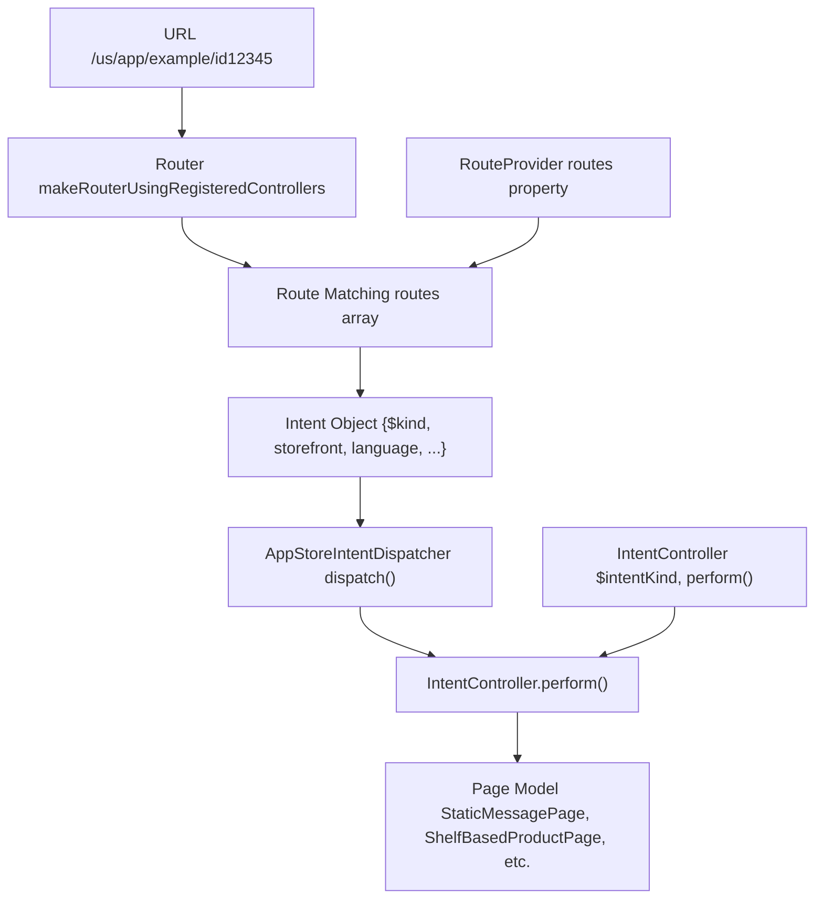
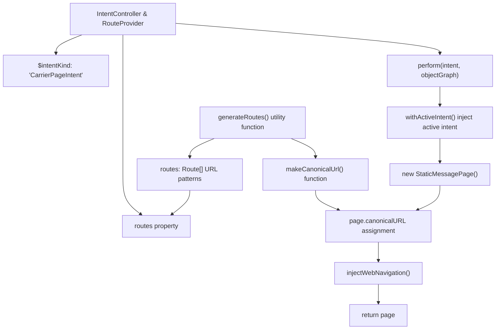
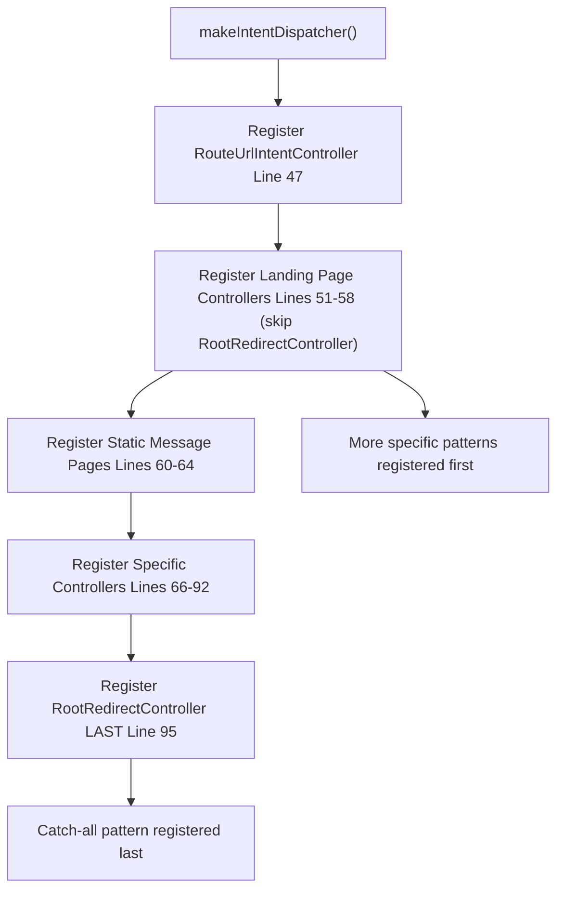

# 创建意图控制器 (Creating Intent Controllers)

-   [src/jet/bootstrap.ts](https://github.com/Chesszyh/apps.apple.com/blob/279d0c4d/src/jet/bootstrap.ts)
-   [src/jet/intents/route-url/route-url-controller.ts](https://github.com/Chesszyh/apps.apple.com/blob/279d0c4d/src/jet/intents/route-url/route-url-controller.ts)
-   [src/jet/intents/route-url/route-url-intent.ts](https://github.com/Chesszyh/apps.apple.com/blob/279d0c4d/src/jet/intents/route-url/route-url-intent.ts)
-   [src/jet/intents/static-message-pages/carrier-page-intent-controller.ts](https://github.com/Chesszyh/apps.apple.com/blob/279d0c4d/src/jet/intents/static-message-pages/carrier-page-intent-controller.ts)
-   [src/jet/intents/static-message-pages/contingent-price-page-intent-controller.ts](https://github.com/Chesszyh/apps.apple.com/blob/279d0c4d/src/jet/intents/static-message-pages/contingent-price-page-intent-controller.ts)
-   [src/jet/intents/static-message-pages/invoice-page-intent-controller.ts](https://github.com/Chesszyh/apps.apple.com/blob/279d0c4d/src/jet/intents/static-message-pages/invoice-page-intent-controller.ts)

## 目的与范围 (Purpose and Scope)

本指南介绍了如何实现新的 `IntentController` 和 `RouteProvider` 实例，以处理 App Store Web 应用程序中的自定义页面类型。意图控制器负责将意图 (intent)（请求显示特定类型的页面）转换为可由 UI 层渲染的页面模型。

有关更广泛的意图和操作系统架构的信息，请参阅 [Intent and Action System](#2.2)。有关意图如何在运行时分发的详情，请参阅 [Jet Application Core](#2.1)。本指南专门侧重于创建和注册新控制器的实际步骤。

## 意图控制器与路由提供程序概览 (Overview of Intent Controllers and Route Providers)

`IntentController` 处理特定意图类型的执行。分发意图时，将调用控制器的 `perform()` 方法来生成页面模型。`RouteProvider` 定义了映射到意图的 URL 模式，从而使路由能够将传入的 URL 转换为相应的意图对象。


**来源：** [src/jet/bootstrap.ts1-126](https://github.com/Chesszyh/apps.apple.com/blob/279d0c4d/src/jet/bootstrap.ts#L1-L126) [src/jet/intents/route-url/route-url-controller.ts1-29](https://github.com/Chesszyh/apps.apple.com/blob/279d0c4d/src/jet/intents/route-url/route-url-controller.ts#L1-L29)

## 核心接口 (Core Interfaces)

意图控制器通常实现两个接口：

| 接口 | 用途 | 必填成员 |
| --- | --- | --- |
| `IntentController<TIntent>` | 定义意图处理逻辑 | `$intentKind: string`<br>`perform(intent, objectGraph): Promise<TModel>` |
| `RouteProvider` | 定义 URL 路由规则 | `routes: Route[]` |

意图对象扩展了基础的 `Intent<TModel>` 接口，并且必须包含一个与控制器的 `$intentKind` 相匹配的 `$kind` 属性。

**来源：** [src/jet/intents/static-message-pages/carrier-page-intent-controller.ts18-22](https://github.com/Chesszyh/apps.apple.com/blob/279d0c4d/src/jet/intents/static-message-pages/carrier-page-intent-controller.ts#L18-L22)

## 意图控制器的解析 (Anatomy of an Intent Controller)

以下是典型意图控制器的结构，以 `CarrierPageIntentController` 为例：


**来源：** [src/jet/intents/static-message-pages/carrier-page-intent-controller.ts1-42](https://github.com/Chesszyh/apps.apple.com/blob/279d0c4d/src/jet/intents/static-message-pages/carrier-page-intent-controller.ts#L1-L42)

## 分步指南：创建一个简单的意图控制器 (Step-by-Step: Creating a Simple Intent Controller)

### 第 1 步：定义路由生成 (Step 1: Define Route Generation)

使用 `generateRoutes` 工具来创建路由定义和规范 (canonical) URL 生成器：

```
const { routes, makeCanonicalUrl } = generateRoutes(
    (opts) => ({
        ...opts,
        $kind: 'MyCustomPageIntent',
    }),
    '/my-custom-path',
);
```
第一个参数是一个根据路由选项创建意图对象的函数。第二个参数是 URL 模式。此模式支持像 `/path/{paramName}` 这样的路径参数。

**来源：** [src/jet/intents/static-message-pages/carrier-page-intent-controller.ts10-16](https://github.com/Chesszyh/apps.apple.com/blob/279d0c4d/src/jet/intents/static-message-pages/carrier-page-intent-controller.ts#L10-L16) [src/jet/intents/static-message-pages/contingent-price-page-intent-controller.ts10-24](https://github.com/Chesszyh/apps.apple.com/blob/279d0c4d/src/jet/intents/static-message-pages/contingent-price-page-intent-controller.ts#L10-L24)

### 第 2 步：实现控制器对象 (Step 2: Implement the Controller Object)

创建一个同时实现 `IntentController` 和 `RouteProvider` 的对象：

```
export const MyCustomPageIntentController: IntentController<any> & RouteProvider = {
    $intentKind: 'MyCustomPageIntent',
    
    routes,
    
    async perform(intent, objectGraphWithoutActiveIntent: AppStoreObjectGraph) {
        // 在此处实现
    },
};
```
`$intentKind` 必须与您的路由生成的意图对象中的 `$kind` 属性相匹配。

**来源：** [src/jet/intents/static-message-pages/invoice-page-intent-controller.ts18-22](https://github.com/Chesszyh/apps.apple.com/blob/279d0c4d/src/jet/intents/static-message-pages/invoice-page-intent-controller.ts#L18-L22)

### 第 3 步：实现 perform() 方法 (Step 3: Implement the perform() Method)

`perform()` 方法接收意图和对象图，并返回一个页面模型：

```
async perform(intent, objectGraphWithoutActiveIntent: AppStoreObjectGraph) {
    return await withActiveIntent(
        objectGraphWithoutActiveIntent,
        intent,
        async (objectGraph) => {
            const page = new StaticMessagePage({
                titleLocKey: 'MyApp.CustomPage.Title',
                contentType: 'custom',
            });
            
            page.canonicalURL = makeCanonicalUrl(objectGraph, intent);
            
            injectWebNavigation(objectGraph, page, intent.platform);
            return page;
        },
    );
}
```
**来源：** [src/jet/intents/static-message-pages/carrier-page-intent-controller.ts24-40](https://github.com/Chesszyh/apps.apple.com/blob/279d0c4d/src/jet/intents/static-message-pages/carrier-page-intent-controller.ts#L24-L40)

### 第 4 步：注册控制器 (Step 4: Register the Controller)

在 [src/jet/bootstrap.ts44-98](https://github.com/Chesszyh/apps.apple.com/blob/279d0c4d/src/jet/bootstrap.ts#L44-L98) 的 `makeIntentDispatcher()` 函数中注册您的控制器：

```
function makeIntentDispatcher(): AppStoreIntentDispatcher {
    const intentDispatcher = new AppStoreIntentDispatcher();
    
    // ... 现有的注册 ...
    
    intentDispatcher.register(MyCustomPageIntentController);
    
    // ... 其他注册 ...
    
    return intentDispatcher;
}
```
**来源：** [src/jet/bootstrap.ts44-98](https://github.com/Chesszyh/apps.apple.com/blob/279d0c4d/src/jet/bootstrap.ts#L44-L98)

## 完整意图控制器生命周期 (Complete Intent Controller Lifecycle)

> **[Mermaid sequence]**
> *(图表结构无法解析)*

**来源：** [src/jet/bootstrap.ts109-124](https://github.com/Chesszyh/apps.apple.com/blob/279d0c4d/src/jet/bootstrap.ts#L109-L124) [src/jet/intents/route-url/route-url-controller.ts12-27](https://github.com/Chesszyh/apps.apple.com/blob/279d0c4d/src/jet/intents/route-url/route-url-controller.ts#L12-L27)

## 路由生成模式 (Route Generation Patterns)

### 基础路由 (Basic Route)

针对不带参数的简单路径：

```
const { routes, makeCanonicalUrl } = generateRoutes(
    (opts) => ({ ...opts, $kind: 'InvoicePageIntent' }),
    '/invoice',
);
```
**来源：** [src/jet/intents/static-message-pages/invoice-page-intent-controller.ts10-16](https://github.com/Chesszyh/apps.apple.com/blob/279d0c4d/src/jet/intents/static-message-pages/invoice-page-intent-controller.ts#L10-L16)

### 参数化路由 (Parametrized Route)

针对具有动态段的路径：

```
const { routes, makeCanonicalUrl } = generateRoutes(
    (opts) => ({ ...opts, $kind: 'ContingentPriceIntent' }),
    '/contingent-price/{offerId}',
    [],
    {
        extraRules: [
            {
                regex: [/(?:\/[a-z]{2})?\/contingent-price/],
            },
        ],
    },
);
```
第三个参数用于查询参数定义，第四个参数允许使用自定义正则表达式规则以获得额外的匹配灵活性。

**来源：** [src/jet/intents/static-message-pages/contingent-price-page-intent-controller.ts10-24](https://github.com/Chesszyh/apps.apple.com/blob/279d0c4d/src/jet/intents/static-message-pages/contingent-price-page-intent-controller.ts#L10-L24)

## perform() 实现中的常见模式 (Common Patterns in perform() Implementation)

### 使用 withActiveIntent (Using withActiveIntent)

`withActiveIntent` 辅助函数将当前意图注入到对象图中，使其可供下游依赖项使用：

```
async perform(intent, objectGraphWithoutActiveIntent: AppStoreObjectGraph) {
    return await withActiveIntent(
        objectGraphWithoutActiveIntent,
        intent,
        async (objectGraph) => {
            // 现在对象图包含活动的意图
            // 可通过 objectGraph.activeIntent 访问
        },
    );
}
```
几乎所有的意图控制器都使用了这种模式，以确保在页面构建过程中活动的意图始终可用。

**来源：** [src/jet/intents/static-message-pages/carrier-page-intent-controller.ts25-28](https://github.com/Chesszyh/apps.apple.com/blob/279d0c4d/src/jet/intents/static-message-pages/carrier-page-intent-controller.ts#L25-L28)

### 设置规范 URL (Setting Canonical URL)

使用与您的路由一同生成的 `makeCanonicalUrl` 函数：

```
page.canonicalURL = makeCanonicalUrl(objectGraph, intent);
```
这确保了页面具有正确的 SEO 规范 URL，并考虑了店面和语言参数。

**来源：** [src/jet/intents/static-message-pages/carrier-page-intent-controller.ts34](https://github.com/Chesszyh/apps.apple.com/blob/279d0c4d/src/jet/intents/static-message-pages/carrier-page-intent-controller.ts#L34-L34)

### 注入 Web 导航 (Injecting Web Navigation)

对于应该显示导航元素的页面，请使用 `injectWebNavigation`：

```
injectWebNavigation(objectGraph, page, intent.platform);
```
这将为页面模型添加适合平台的导航标签页和其他 UI 框架。

**来源：** [src/jet/intents/static-message-pages/carrier-page-intent-controller.ts36](https://github.com/Chesszyh/apps.apple.com/blob/279d0c4d/src/jet/intents/static-message-pages/carrier-page-intent-controller.ts#L36-L36)

## 注册顺序很重要 (Registration Order Matters)

控制器的注册顺序会影响 URL 匹配行为。当多个模式可能匹配同一个 URL 时，较早注册的控制器具有优先级。

### 关键排序规则 (Critical Ordering Rules)

| 注册位置 | 控制器 | 原因 |
| --- | --- | --- |
| 第一位 | `RouteUrlIntentController` | 将 URL 解析为其他意图的元控制器 |
| 中间（具体的在通用的之前） | 落地页控制器、特定产品页面路由 | 更具体的模式必须在通用模式之前匹配 |
| 最后一位 | `RootRedirectController` | 通配模式 `/{sf}` 仅在没有其他模式匹配时才应生效 |

**来自 bootstrap.ts 的示例：**


**来源：** [src/jet/bootstrap.ts44-98](https://github.com/Chesszyh/apps.apple.com/blob/279d0c4d/src/jet/bootstrap.ts#L44-L98)

### 示例：产品页面路由 (Example: Product Page Routes)

产品页面系列演示了正确的排序方式：

```
// 更具体的路由放在前面
intentDispatcher.register(AppEventPageIntentController);      // /app/{id}/app-event/{eventId}
intentDispatcher.register(SeeAllPageIntentController);         // /app/{id}/see-all
intentDispatcher.register(ProductPageIntentController);        // /app/{id} (最通用的)
```
如果首先注册了 `ProductPageIntentController`，它的模式将匹配本该由更具体路由处理的 URL。

**来源：** [src/jet/bootstrap.ts86-90](https://github.com/Chesszyh/apps.apple.com/blob/279d0c4d/src/jet/bootstrap.ts#L86-L90)

## RouteUrlIntent 特例 (The RouteUrlIntent Special Case)

`RouteUrlIntentController` 是一个将 URL 转换为意图的元控制器。它本身不定义路由；相反，它使用路由来解析 URL：

```
async perform(intent: RouteUrlIntent, objectGraph: AppStoreObjectGraph) {
    const targetIntent = objectGraph.router.intentFor(intent.url);
    
    if (isSome(targetIntent) && isRoutableIntent(targetIntent)) {
        return {
            intent: targetIntent,
            action: makeFlowAction(targetIntent),
            storefront: targetIntent.storefront,
            language: targetIntent.language,
        };
    }
    
    return null;
}
```
此控制器主要用于深层链接和导航流程，在这些流程中您有一个 URL 字符串，需要将其解析为适当的页面意图。

**来源：** [src/jet/intents/route-url/route-url-controller.ts9-28](https://github.com/Chesszyh/apps.apple.com/blob/279d0c4d/src/jet/intents/route-url/route-url-controller.ts#L9-L28) [src/jet/intents/route-url/route-url-intent.ts1-49](https://github.com/Chesszyh/apps.apple.com/blob/279d0c4d/src/jet/intents/route-url/route-url-intent.ts#L1-L49)

## 完整示例：静态消息页面控制器 (Full Example: Static Message Page Controller)

以下是一个完整的、最小化的意图控制器实现：

**文件结构：** [src/jet/intents/static-message-pages/carrier-page-intent-controller.ts1-42](https://github.com/Chesszyh/apps.apple.com/blob/279d0c4d/src/jet/intents/static-message-pages/carrier-page-intent-controller.ts#L1-L42)

```
第 1-6 行:    导入
第 10-16 行:  使用 generateRoutes 工具生成路由
第 18-22 行:  带有接口的控制器对象声明
第 24-40 行:  perform() 方法实现
    - withActiveIntent 包装器
    - 页面模型构建
    - 规范 URL 赋值
    - Web 导航注入
```
**关键实现细节：**

| 行号范围 | 用途 |
| --- | --- |
| 10-16 | `generateRoutes('/carrier')` 创建路由和 `makeCanonicalUrl` |
| 18-22 | 控制器导出 `IntentController` 和 `RouteProvider` 接口 |
| 20 | `$intentKind` 与路由生成中的 `$kind` 匹配 |
| 22 | 来自 `generateRoutes` 的 `routes` 属性 |
| 25-27 | `withActiveIntent` 将意图注入对象图中 |
| 29-32 | 构建带有本地化键和内容类型的 `StaticMessagePage` |
| 34 | 使用生成的辅助函数设置规范 URL |
| 36 | 为平台特定 UI 注入 Web 导航 |

**来源：** [src/jet/intents/static-message-pages/carrier-page-intent-controller.ts1-42](https://github.com/Chesszyh/apps.apple.com/blob/279d0c4d/src/jet/intents/static-message-pages/carrier-page-intent-controller.ts#L1-L42)

## 总结清单 (Summary Checklist)

在创建新的意图控制器时：

-   [ ]  使用 `generateRoutes()` 定义 URL 模式和意图工厂
-   [ ]  实现带有 `$intentKind` 和 `perform()` 的 `IntentController<TIntent>`
-   [ ]  实现带有 `routes` 属性的 `RouteProvider`
-   [ ]  使用 `withActiveIntent()` 包装 `perform()` 实现
-   [ ]  在 `perform()` 中构建适当的页面模型
-   [ ]  使用 `makeCanonicalUrl()` 设置 `page.canonicalURL`
-   [ ]  如果页面需要导航框架，请调用 `injectWebNavigation()`
-   [ ]  在 [src/jet/bootstrap.ts44-98](https://github.com/Chesszyh/apps.apple.com/blob/279d0c4d/src/jet/bootstrap.ts#L44-L98) 的 `makeIntentDispatcher()` 中注册控制器
-   [ ]  考虑相对于其他控制器的注册顺序
-   [ ]  使用各种店面/语言组合测试 URL 匹配情况

**来源：** [src/jet/intents/static-message-pages/carrier-page-intent-controller.ts1-42](https://github.com/Chesszyh/apps.apple.com/blob/279d0c4d/src/jet/intents/static-message-pages/carrier-page-intent-controller.ts#L1-L42) [src/jet/intents/static-message-pages/invoice-page-intent-controller.ts1-42](https://github.com/Chesszyh/apps.apple.com/blob/279d0c4d/src/jet/intents/static-message-pages/invoice-page-intent-controller.ts#L1-L42) [src/jet/intents/static-message-pages/contingent-price-page-intent-controller.ts1-50](https://github.com/Chesszyh/apps.apple.com/blob/279d0c4d/src/jet/intents/static-message-pages/contingent-price-page-intent-controller.ts#L1-L50) [src/jet/bootstrap.ts44-98](https://github.com/Chesszyh/apps.apple.com/blob/279d0c4d/src/jet/bootstrap.ts#L44-L98)
