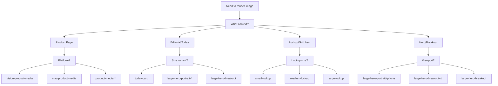
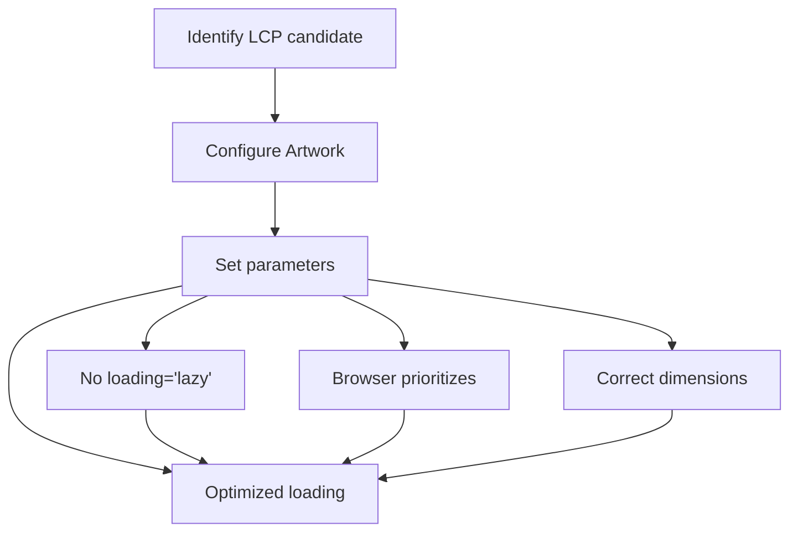
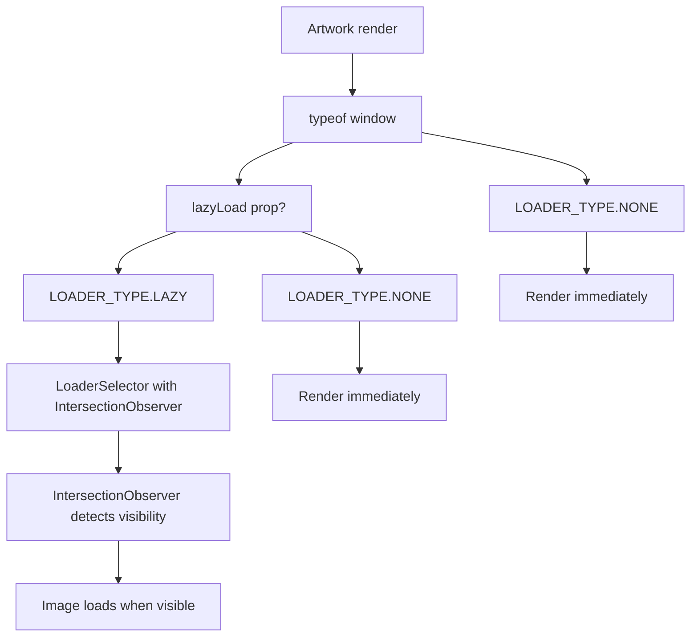
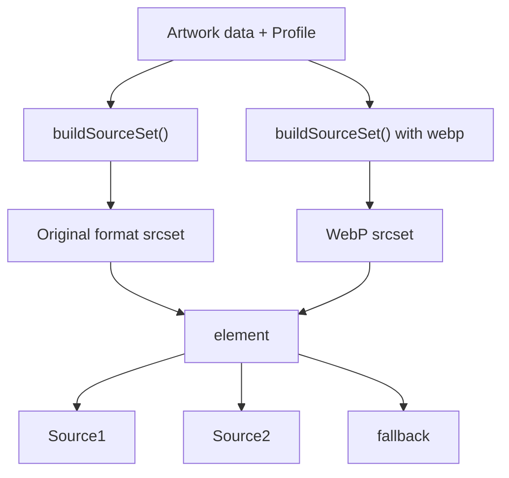
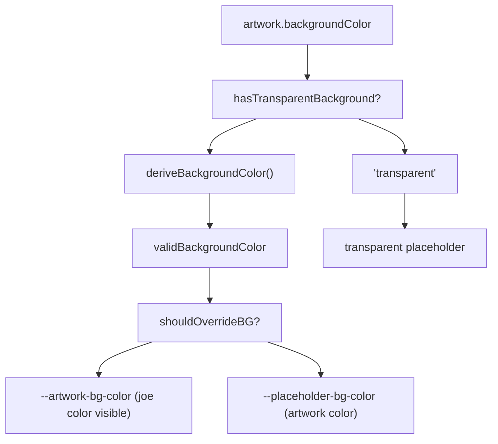

# 响应式图像最佳实践 (Responsive Image Best Practices)

-   [shared/components/src/components/Artwork/Artwork.svelte](https://github.com/Chesszyh/apps.apple.com/blob/279d0c4d/shared/components/src/components/Artwork/Artwork.svelte)
-   [src/components/Shelf/Title.svelte](https://github.com/Chesszyh/apps.apple.com/blob/279d0c4d/src/components/Shelf/Title.svelte)
-   [src/components/jet/item/LargeHeroBreakoutItem.svelte](https://github.com/Chesszyh/apps.apple.com/blob/279d0c4d/src/components/jet/item/LargeHeroBreakoutItem.svelte)
-   [src/components/jet/item/SmallBreakoutItem.svelte](https://github.com/Chesszyh/apps.apple.com/blob/279d0c4d/src/components/jet/item/SmallBreakoutItem.svelte)

## 目的与范围 (Purpose and Scope)

本指南为使用 `Artwork` 组件实现响应式图像提供了实用建议。它涵盖了配置文件选择、懒加载策略、LCP 优化、长宽比处理以及针对不同用例的常用模式。

有关 `Artwork` 组件架构和实现细节的全面技术文档，请参阅 [Artwork and Media System](#5.1)。有关创建使用 `Artwork` 的自定义货架类型的信息，请参阅 [Adding a New Shelf Type](#8.1)。

---

## 基于配置文件的图像渲染 (Profile-Based Image Rendering)

`Artwork` 组件使用**配置文件 (profiles)** 来确定不同视口和上下文中最佳的图像尺寸和长宽比。配置文件定义了视口特定的渲染参数，组件使用这些参数来构建响应式 `srcset` 属性。

### 配置文件选择决策树 (Profile Selection Decision Tree)


**来源：** [shared/components/src/components/Artwork/Artwork.svelte36-40](https://github.com/Chesszyh/apps.apple.com/blob/279d0c4d/shared/components/src/components/Artwork/Artwork.svelte#L36-L40) [src/components/jet/item/LargeHeroBreakoutItem.svelte47-52](https://github.com/Chesszyh/apps.apple.com/blob/279d0c4d/src/components/jet/item/LargeHeroBreakoutItem.svelte#L47-L52)

### 命名配置文件系统 (Named Profile System)

配置文件被定义为映射到视口特定配置的字符串常量。配置文件决定了：

| 方面 | 控制项 |
| --- | --- |
| 长宽比 | 配置文件定义 |
| 图像尺寸 | 视口断点 |
| Srcset 尺寸 | 配置文件 + 艺术资产宽度 |
| WebP 生成 | 始终启用 |

常用配置文件模式：

```
app-icon-*           → 正方形图标 (1:1)
small-lockup         → 列表项艺术资产
medium-lockup        → 网格项艺术资产
large-lockup         → 特色项艺术资产
today-card           → 编辑卡片背景
large-hero-*         → 全宽英雄图像
product-media-*      → 平台特定的产品屏幕截图
```
**来源：** [shared/components/src/components/Artwork/Artwork.svelte36-40](https://github.com/Chesszyh/apps.apple.com/blob/279d0c4d/shared/components/src/components/Artwork/Artwork.svelte#L36-L40) [src/components/jet/item/SmallBreakoutItem.svelte32-33](https://github.com/Chesszyh/apps.apple.com/blob/279d0c4d/src/components/jet/item/SmallBreakoutItem.svelte#L32-L33)

---

## LCP 优化策略 (LCP Optimization Strategy)

最大内容渲染 (LCP) 是一个关键的核心 Web 指标 (Core Web Vital)。作为 LCP 候选者的图像必须配置为使用高获取优先级的预加载。

### LCP 配置模式 (LCP Configuration Pattern)


### LCP 候选者识别 (LCP Candidate Identification)

可能作为 LCP 候选者的图像：

| 组件类型 | 视口 | 是否为 LCP 候选者 |
| --- | --- | --- |
| 英雄轮播首项 | 全部 | ✓ 是 |
| 产品媒体首个截图 | Small 及以上 | ✓ 是 |
| 货架中的首张 TodayCard | XSmall | ✓ 是 |
| 首屏上方的锁定项图像 | XSmall | ✓ 可能 |
| 首屏下方的内容 | 全部 | ✗ 否 |

### 实现示例 (Implementation Example)

对于 LCP 图像，按如下方式配置 `Artwork` 组件：

```
<Artwork
     {artwork}
     {profile}
    lazyLoad={false}
    fetchPriority="high"
/>
```
对于非 LCP 图像，使用默认的懒加载：

```
<Artwork
     {artwork}
     {profile}
    lazyLoad={true}
    fetchPriority="auto"
/>
```
**来源：** [shared/components/src/components/Artwork/Artwork.svelte52-60](https://github.com/Chesszyh/apps.apple.com/blob/279d0c4d/shared/components/src/components/Artwork/Artwork.svelte#L52-L60) [shared/components/src/components/Artwork/Artwork.svelte161-164](https://github.com/Chesszyh/apps.apple.com/blob/279d0c4d/shared/components/src/components/Artwork/Artwork.svelte#L161-L164)

---

## 长宽比处理 (Aspect Ratio Handling)

`Artwork` 组件实现了先进的长宽比管理，以处理艺术资产数据、配置文件和货架上下文之间的不匹配。

### 长宽比解析流程 (Aspect Ratio Resolution Flow)

> **[Mermaid sequence]**
> *(图表结构无法解析)*

### 货架长宽比上下文 (Shelf Aspect Ratio Context)

当货架中的多个图像具有不同的自然长宽比时，组件使用货架上下文来确定主导比例：

```
// 组件检查货架上下文
if (hasShelfAspectRatioContext()) {
    const { addProfile, shelfAspectRatio } = getShelfAspectRatioContext();
    addProfile(profile);
    localShelfAspectRatioStore = shelfAspectRatio;
}
```
`shouldOverrideBG` 响应式语句决定何时应用 joe color 背景：

| 条件 | 背景处理 |
| --- | --- |
| 图像匹配货架长宽比 | 透明或艺术资产背景 |
| 图像与货架比例不符 (>10%) | 使用 joe color 背景填充 |
| 无货架上下文 + 配置文件不匹配 | 使用 joe color 背景填充 |
| 透明背景设置 | 始终透明 |

**来源：** [shared/components/src/components/Artwork/Artwork.svelte104-110](https://github.com/Chesszyh/apps.apple.com/blob/279d0c4d/shared/components/src/components/Artwork/Artwork.svelte#L104-L110) [shared/components/src/components/Artwork/Artwork.svelte207-229](https://github.com/Chesszyh/apps.apple.com/blob/279d0c4d/shared/components/src/components/Artwork/Artwork.svelte#L207-L229) [shared/components/src/components/Artwork/Artwork.svelte231-251](https://github.com/Chesszyh/apps.apple.com/blob/279d0c4d/shared/components/src/components/Artwork/Artwork.svelte#L231-L251)

---

## 懒加载实现 (Lazy Loading Implementation)

该组件根据视口可见性和 LCP 要求实现了双模式加载策略。

### 加载策略矩阵 (Loading Strategy Matrix)

| 属性 | 值 | 行为 | 用例 |
| --- | --- | --- | --- |
| `lazyLoad` | `true` (默认) | 基于 IntersectionObserver | 首屏下方的图像 |
| `lazyLoad` | `false` | 预加载 (Eager load) | LCP 候选者、首屏上方 |
| 服务器端 | N/A | 始终预加载 | SSR/激活 (Hydration) |

### 加载器选择逻辑 (Loader Selection Logic)


### 透明度过渡处理 (Opacity Transition Handling)

组件通过透明度过渡来管理视觉加载状态：

```
// 透明度计算
opacity = `${imageIsLoading && typeof window !== 'undefined' ? 0 : 1}`;
```
-   **SSR**：透明度设置为 1，以便图像在 JS 加载前即可渲染。
-   **客户端加载**：加载期间透明度为 0，完成后过渡到 1。
-   **过渡结束**：`hasTransitionInEnded` 标志在淡入后移除背景。

**来源：** [shared/components/src/components/Artwork/Artwork.svelte159-164](https://github.com/Chesszyh/apps.apple.com/blob/279d0c4d/shared/components/src/components/Artwork/Artwork.svelte#L159-L164) [shared/components/src/components/Artwork/Artwork.svelte332-361](https://github.com/Chesszyh/apps.apple.com/blob/279d0c4d/shared/components/src/components/Artwork/Artwork.svelte#L332-L361) [shared/components/src/components/Artwork/Artwork.svelte253-263](https://github.com/Chesszyh/apps.apple.com/blob/279d0c4d/shared/components/src/components/Artwork/Artwork.svelte#L253-L263)

---

## Srcset 与 WebP 生成 (Srcset and WebP Generation)

该组件会自动为现代浏览器生成经过优化的、带有 WebP 变体的源集合 (source sets)。

### 源集合生成流水线 (Source Set Generation Pipeline)


### Picture 元素结构 (Picture Element Structure)

组件渲染一个带有多个源的 `<picture>` 元素：

```
<picture>
    <!-- 针对现代浏览器的 WebP -->
    <source sizes="..." srcset="..." type="image/webp" />
    
    <!-- 原始格式回退 -->
    <source sizes="..." srcset="..." type="image/jpeg" />
    
    <!-- 最终回退 -->
    
</picture>
```
`sizes` 属性是使用 `getImageSizes()` 根据配置文件和艺术资产宽度计算得出的。

### 文件类型配置 (File Type Configuration)

`imageSettings` 属性控制格式行为：

| 设置 | 默认值 | 用途 |
| --- | --- | --- |
| `fileType` | `'jpg'` | 原始格式 |
| `hasTransparentBackground` | `false` | 为透明 PNG 禁用 joe color |

无论原始格式如何，WebP 始终作为额外的优化源生成。

**来源：** [shared/components/src/components/Artwork/Artwork.svelte128-138](https://github.com/Chesszyh/apps.apple.com/blob/279d0c4d/shared/components/src/components/Artwork/Artwork.svelte#L128-L138) [shared/components/src/components/Artwork/Artwork.svelte166](https://github.com/Chesszyh/apps.apple.com/blob/279d0c4d/shared/components/src/components/Artwork/Artwork.svelte#L166-L166) [shared/components/src/components/Artwork/Artwork.svelte334-358](https://github.com/Chesszyh/apps.apple.com/blob/279d0c4d/shared/components/src/components/Artwork/Artwork.svelte#L334-L358)

---

## 背景颜色与 Joe Color 回退 (Background Color and Joe Color Fallbacks)

该组件实现了一套复杂的背景颜色系统，可处理透明度、长宽比不匹配和加载状态。

### 背景颜色解析 (Background Color Resolution)


### Joe Color 应用场景 (Joe Color Application Scenarios)

通用的 joe color (`--genericJoeColor`) 在以下几种情况下作为回退方案使用：

| 场景 | 背景处理 |
| --- | --- |
| 图像加载中 | Joe color 占位符 |
| 图像加载错误 | Joe color 占位符 |
| 长宽比不匹配 | Joe color 填充区域 |
| 缺少 backgroundColor 数据 | Joe color 回退 |
| 暗黑模式 | 自动切换到暗色 joe color |

### CSS 变量级联 (CSS Variable Cascade)

```
background-color: var(
    --override-placeholder-bg-color,
    var(--placeholder-bg-color, var(--genericJoeColor)));
```
此级联允许：

1.  组件使用者通过 `--override-placeholder-bg-color` 进行覆盖。
2.  内部逻辑根据状态设置 `--placeholder-bg-color`。
3.  全局 joe color 作为最终回退。

**来源：** [shared/components/src/components/Artwork/Artwork.svelte118-127](https://github.com/Chesszyh/apps.apple.com/blob/279d0c4d/shared/components/src/components/Artwork/Artwork.svelte#L118-L127) [shared/components/src/components/Artwork/Artwork.svelte168-194](https://github.com/Chesszyh/apps.apple.com/blob/279d0c4d/shared/components/src/components/Artwork/Artwork.svelte#L168-L194) [shared/components/src/components/Artwork/Artwork.svelte398-401](https://github.com/Chesszyh/apps.apple.com/blob/279d0c4d/shared/components/src/components/Artwork/Artwork.svelte#L398-L401)

---

## 平台特定的增强 (Platform-Specific Enhancements)

### 下巴配置（针对 TV 平台） (Chin Configuration (TV Platform))

`chinConfig` 属性可在艺术资产下方启用 TV 风格的反射效果：

```
export let chinConfig: ChinConfig | undefined = undefined;
```
配置后，下巴会影响：

-   **有效长宽比**：基础高度 + 下巴高度
-   **图像标签高度**：调整以包含下巴空间
-   **CSS 反射**：通过 `-webkit-box-reflect` 应用

### 下巴长宽比计算 (Chin Aspect Ratio Calculation)

```
const effectiveAspectRatio = (() => {
    const chinHeightValue = chinConfig?.height ?? 0;
    if (chinHeightValue === 0 || aspectRatio === null) {
        return aspectRatio;
    }
    
    const baseHeight = imageTagSizeObj.height;
    const baseWidth = imageTagSizeObj.width;
    const newHeight = baseHeight + chinHeightValue;
    return baseWidth / newHeight;
})();
```
### 边框渲染控制 (Border Rendering Control)

`withoutBorder` 属性用于禁用默认的边框/阴影处理：

```
<Artwork
     {artwork}
     {profile}
    withoutBorder={true}
  />
```
这在以下情况下很有用：

-   具有透明背景且不应有边框的图像
-   提供自身边框处理的自定义包装组件
-   延伸到容器边缘的艺术资产

**来源：** [shared/components/src/components/Artwork/Artwork.svelte74-79](https://github.com/Chesszyh/apps.apple.com/blob/279d0c4d/shared/components/src/components/Artwork/Artwork.svelte#L74-L79) [shared/components/src/components/Artwork/Artwork.svelte142-155](https://github.com/Chesszyh/apps.apple.com/blob/279d0c4d/shared/components/src/components/Artwork/Artwork.svelte#L142-L155) [shared/components/src/components/Artwork/Artwork.svelte101-102](https://github.com/Chesszyh/apps.apple.com/blob/279d0c4d/shared/components/src/components/Artwork/Artwork.svelte#L101-L102)

---

## 常见实现模式 (Common Implementation Patterns)

### 模式 1：带视频回退的编辑英雄位 (Pattern 1: Editorial Hero with Video Fallback)

大型英雄突显项目根据视口和区域设置有条件地渲染视频或艺术资产：

```
{#if video && $mediaQueries !== 'xsmall' && !canUseRTLArtwork}
    <Video {video} {profile} autoplay loop useControls={false} />
{:else if artwork}
    <Artwork {artwork} {profile} />
{/if}
```
配置文件选择逻辑：

```
profile = $mediaQueries === 'xsmall'
    ? 'large-hero-portrait-iphone'
    : canUseRTLArtwork
    ? 'large-hero-breakout-rtl'
    : 'large-hero-breakout';
```
**来源：** [src/components/jet/item/LargeHeroBreakoutItem.svelte47-52](https://github.com/Chesszyh/apps.apple.com/blob/279d0c4d/src/components/jet/item/LargeHeroBreakoutItem.svelte#L47-L52) [src/components/jet/item/LargeHeroBreakoutItem.svelte62-66](https://github.com/Chesszyh/apps.apple.com/blob/279d0c4d/src/components/jet/item/LargeHeroBreakoutItem.svelte#L62-L66)

### 模式 2：固定尺寸的 App 图标 (Pattern 2: Fixed-Size App Icons)

小型突显项目使用具有固定尺寸的 App 图标：

```
<AppIcon
    icon={iconArtwork}
    profile="app-icon-xlarge"
    fixedWidth={false}
/>
```
`fixedWidth={false}` 允许图标在保持长宽比的同时，在其容器内响应式缩放。

**来源：** [src/components/jet/item/SmallBreakoutItem.svelte29-35](https://github.com/Chesszyh/apps.apple.com/blob/279d0c4d/src/components/jet/item/SmallBreakoutItem.svelte#L29-L35)

### 模式 3：RTL 感知的艺术资产选择 (Pattern 3: RTL-Aware Artwork Selection)

组件可以为 RTL 区域设置提供备用艺术资产：

```
const canUseRTLArtwork = isRtl() && rtlArtwork;
artwork = (canUseRTLArtwork ? rtlArtwork : item.artwork) || video?.preview;
```
这允许编辑团队为从右到左的阅读环境提供镜像或重新设计的艺术资产。

**来源：** [src/components/jet/item/LargeHeroBreakoutItem.svelte35](https://github.com/Chesszyh/apps.apple.com/blob/279d0c4d/src/components/jet/item/LargeHeroBreakoutItem.svelte#L35-L35) [src/components/jet/item/LargeHeroBreakoutItem.svelte39-40](https://github.com/Chesszyh/apps.apple.com/blob/279d0c4d/src/components/jet/item/LargeHeroBreakoutItem.svelte#L39-L40)

---

## 常见问题排查 (Troubleshooting Common Issues)

### 图像未加载 (Image Not Loading)

**症状**：图像占位符一直可见，无错误状态。

**诊断步骤**：

1.  检查艺术资产数据结构：
    -   `artwork.template` 必须包含有效的 URL 模板。
    -   `artwork.width` 和 `artwork.height` 必须存在。
2.  验证配置文件是否存在于艺术资产配置文件定义中。
3.  检查浏览器控制台是否存在网络错误。
4.  检查 srcset 的生成情况：
    ```
    console.log(buildSourceSet(artwork, imageSettings, profile));
    ```

### 长宽比不匹配导致的填充 (Aspect Ratio Mismatch Padding)

**症状**：图像周围出现意外的 joe color 填充。

**根本原因**：

| 原因 | 解决方案 |
| --- | --- |
| 配置文件长宽比与艺术资产不符 | 为艺术资产类型使用正确的配置文件 |
| 货架包含混合长宽比 | 预期行为 - 确保网格一致性 |
| 艺术资产数据尺寸不正确 | 更新艺术资产服务数据 |

### LCP 性能问题 (LCP Performance Issues)

**症状**：LCP 分数较低，图像加载缓慢。

**优化清单**：

-   [ ]  验证 LCP 图像上是否设置了 `lazyLoad={false}`。
-   [ ]  确认设置了 `fetchPriority="high"`。
-   [ ]  检查配置文件是否为视口生成了合适的尺寸。
-   [ ]  确保为艺术资产域名发出了预连接提示。
-   [ ]  验证现代浏览器中是否正在使用 WebP 源。

### 暗黑模式背景问题 (Dark Mode Background Issues)

**症状**：暗黑模式下背景过亮。

**解决方案**：确保 joe color CSS 变量支持暗黑模式：

```
&[style*='#ebebeb'] {
    @media (prefers-color-scheme: dark) {
        background-color: swatch(genericJoeColor, dark);
    }
}
```
**来源：** [shared/components/src/components/Artwork/Artwork.svelte487-493](https://github.com/Chesszyh/apps.apple.com/blob/279d0c4d/shared/components/src/components/Artwork/Artwork.svelte#L487-L493)

---

## 性能监控 (Performance Monitoring)

### 关键追踪指标 (Key Metrics to Track)

| 指标 | 目标 | 测量点 |
| --- | --- | --- |
| LCP | < 2.5s | 首个英雄图像渲染 |
| 图像解码时间 | < 100ms | `onImageLoad` 事件 |
| 懒加载触发距离 | ~1000px | `IntersectionObserver` 阈值 |
| WebP 采用率 | > 90% | 现代浏览器使用情况 |

### 预连接优化 (Preconnect Optimization)

组件会自动追踪艺术资产域名以进行预连接优化：

```
const preconnectTracker = getPreconnectTracker();
$: {
    preconnectTracker?.trackUrl(template);
}
```
这使得引导系统能够为艺术资产 CDN 域名发出 `<link rel="preconnect">` 标签，减少 DNS 和连接建立时间。

**来源：** [shared/components/src/components/Artwork/Artwork.svelte16](https://github.com/Chesszyh/apps.apple.com/blob/279d0c4d/shared/components/src/components/Artwork/Artwork.svelte#L16-L16) [shared/components/src/components/Artwork/Artwork.svelte20](https://github.com/Chesszyh/apps.apple.com/blob/279d0c4d/shared/components/src/components/Artwork/Artwork.svelte#L20-L20) [shared/components/src/components/Artwork/Artwork.svelte196-198](https://github.com/Chesszyh/apps.apple.com/blob/279d0c4d/shared/components/src/components/Artwork/Artwork.svelte#L196-L198)

---

## 无障碍考虑因素 (Accessibility Considerations)

### 装饰性 vs 信息性图像 (Decorative vs Informative Images)

`isDecorative` 属性决定了 ARIA 角色：

```

```
默认行为：

-   如果提供了 `alt` 属性 → `isDecorative = false`
-   如果 `alt` 为空 → `isDecorative = true`

需要时进行覆盖：

```
<!-- 无法提供 alt 文本的信息性图像 -->
<Artwork {artwork} {profile} alt="" isDecorative={false} />

<!-- 恰好带有 alt 文本的装饰性图像 -->
<Artwork {artwork} {profile} alt="Background pattern" isDecorative={true} />
```
### Alt 文本最佳实践 (Alt Text Best Practices)

| 图像类型 | Alt 文本策略 |
| --- | --- |
| 产品屏幕截图 | 描述展示的功能 |
| 编辑艺术资产 | 描述编辑理念 |
| 装饰性背景 | 留空 alt，`role="presentation"` |
| 锁定项中的 App 图标 | 留空 alt（与相邻文本重复） |

**来源：** [shared/components/src/components/Artwork/Artwork.svelte29-30](https://github.com/Chesszyh/apps.apple.com/blob/279d0c4d/shared/components/src/components/Artwork/Artwork.svelte#L29-L30) [shared/components/src/components/Artwork/Artwork.svelte91-97](https://github.com/Chesszyh/apps.apple.com/blob/279d0c4d/shared/components/src/components/Artwork/Artwork.svelte#L91-L97) [shared/components/src/components/Artwork/Artwork.svelte344](https://github.com/Chesszyh/apps.apple.com/blob/279d0c4d/shared/components/src/components/Artwork/Artwork.svelte#L344-L344) [shared/components/src/components/Artwork/Artwork.svelte349](https://github.com/Chesszyh/apps.apple.com/blob/279d0c4d/shared/components/src/components/Artwork/Artwork.svelte#L349-L349)
