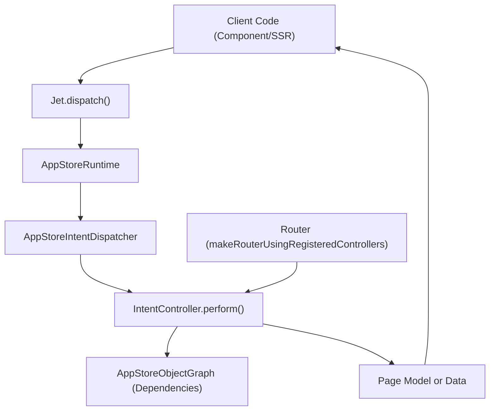
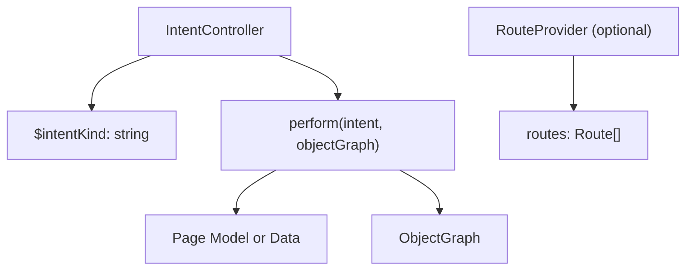
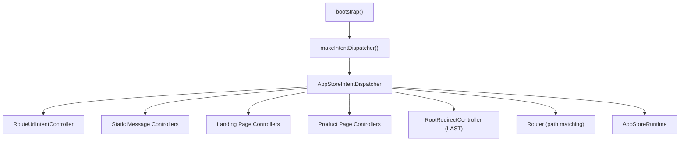

# 意图与操作系统 (Intent and Action System)

-   [src/jet/action-handlers/browser.ts](https://github.com/Chesszyh/apps.apple.com/blob/279d0c4d/src/jet/action-handlers/browser.ts)
-   [src/jet/action-handlers/compound-action.ts](https://github.com/Chesszyh/apps.apple.com/blob/279d0c4d/src/jet/action-handlers/compound-action.ts)
-   [src/jet/action-handlers/external-url-action.ts](https://github.com/Chesszyh/apps.apple.com/blob/279d0c4d/src/jet/action-handlers/external-url-action.ts)
-   [src/jet/bootstrap.ts](https://github.com/Chesszyh/apps.apple.com/blob/279d0c4d/src/jet/bootstrap.ts)
-   [src/jet/intents/route-url/route-url-controller.ts](https://github.com/Chesszyh/apps.apple.com/blob/279d0c4d/src/jet/intents/route-url/route-url-controller.ts)
-   [src/jet/intents/route-url/route-url-intent.ts](https://github.com/Chesszyh/apps.apple.com/blob/279d0c4d/src/jet/intents/route-url/route-url-intent.ts)
-   [src/jet/intents/static-message-pages/carrier-page-intent-controller.ts](https://github.com/Chesszyh/apps.apple.com/blob/279d0c4d/src/jet/intents/static-message-pages/carrier-page-intent-controller.ts)
-   [src/jet/intents/static-message-pages/contingent-price-page-intent-controller.ts](https://github.com/Chesszyh/apps.apple.com/blob/279d0c4d/src/jet/intents/static-message-pages/contingent-price-page-intent-controller.ts)
-   [src/jet/intents/static-message-pages/invoice-page-intent-controller.ts](https://github.com/Chesszyh/apps.apple.com/blob/279d0c4d/src/jet/intents/static-message-pages/invoice-page-intent-controller.ts)
-   [src/jet/jet.ts](https://github.com/Chesszyh/apps.apple.com/blob/279d0c4d/src/jet/jet.ts)
-   [src/jet/models/external-action.ts](https://github.com/Chesszyh/apps.apple.com/blob/279d0c4d/src/jet/models/external-action.ts)
-   [src/jet/svelte.ts](https://github.com/Chesszyh/apps.apple.com/blob/279d0c4d/src/jet/svelte.ts)

## 目的与范围 (Purpose and Scope)

意图与操作系统提供了支持应用程序导航和用户交互的核心分发机制。**意图 (Intents)** 代表对应用程序逻辑的请求（例如加载页面），而**操作 (Actions)** 代表用户交互（例如点击链接）。该系统将 URL 路由连接到页面渲染，并将用户事件连接到应用程序行为。

有关 Jet 应用程序初始化和依赖注入的信息，请参阅 [Jet Application Core](#2.1)。有关如何从货架 (shelf) 组合页面的详细信息，请参阅 [Component Architecture](#2.3)。

---

## 意图系统架构 (Intent System Architecture)

### 什么是意图？ (What are Intents?)

意图是类型化的请求，封装了执行应用程序逻辑所需的参数。每个意图都有一个 `$kind` 字段，用于标识其类型并确定由哪个控制器处理它。

**关键意图属性：**

-   `$kind`: 意图类型的字符串标识符（例如 `"ProductPageIntent"`, `"RouteUrlIntent"`）
-   意图特定参数（例如 `url`, `adamId`, `storefront`, `language`）
-   以泛型方式定义的返回类型：`Intent<ReturnType>`

**常见意图类型：**

| 意图种类 | 用途 | 控制器 |
| --- | --- | --- |
| `RouteUrlIntent` | 将 URL 转换为页面意图 | `RouteUrlIntentController` |
| `ProductPageIntent` | 加载产品详情页面 | `ProductPageIntentController` |
| `SearchResultsPageIntent` | 加载搜索结果 | `SearchResultsPageIntentController` |
| `EditorialPageIntent` | 加载编辑/今日 (today) 页面 | `EditorialPageIntentController` |
| 静态消息意图 | 加载静态页面（运营商、发票等） | 各种静态页面控制器 |

来源：[src/jet/intents/route-url/route-url-intent.ts29-36](https://github.com/Chesszyh/apps.apple.com/blob/279d0c4d/src/jet/intents/route-url/route-url-intent.ts#L29-L36) [src/jet/bootstrap.ts1-125](https://github.com/Chesszyh/apps.apple.com/blob/279d0c4d/src/jet/bootstrap.ts#L1-L125)

### 意图分发流程 (Intent Dispatching Flow)


**意图分发流程：**

1.  应用程序代码调用 `jet.dispatch(intent)`
2.  `Jet` 类委托给 `AppStoreRuntime.dispatch()` [src/jet/jet.ts182-198](https://github.com/Chesszyh/apps.apple.com/blob/279d0c4d/src/jet/jet.ts#L182-L198)
3.  运行时使用 `IntentDispatcher` 查找注册的控制器
4.  控制器的 `perform()` 方法使用意图和对象图执行
5.  控制器返回类型化的结果（通常是页面模型）

来源：[src/jet/jet.ts182-198](https://github.com/Chesszyh/apps.apple.com/blob/279d0c4d/src/jet/jet.ts#L182-L198) [src/jet/bootstrap.ts105-125](https://github.com/Chesszyh/apps.apple.com/blob/279d0c4d/src/jet/bootstrap.ts#L105-L125)

### 意图控制器 (Intent Controllers)

意图控制器实现 `IntentController<I>` 接口，并针对可进行 URL 路由的意图可选地实现 `RouteProvider`。

**意图控制器结构：**


**示例：静态消息页面控制器 (Example: Static Message Page Controller)**

[src/jet/intents/static-message-pages/carrier-page-intent-controller.ts18-41](https://github.com/Chesszyh/apps.apple.com/blob/279d0c4d/src/jet/intents/static-message-pages/carrier-page-intent-controller.ts#L18-L41) 演示了一个简单的控制器：

```
export const CarrierPageIntentController: IntentController<any> & RouteProvider = {    $intentKind: 'CarrierPageIntent',    routes,  // 根据 '/carrier' 模式生成        async perform(intent, objectGraphWithoutActiveIntent: AppStoreObjectGraph) {        return await withActiveIntent(            objectGraphWithoutActiveIntent,            intent,            async (objectGraph) => {                const page = new StaticMessagePage({                    titleLocKey: 'ASE.Web.AppStore.Carrier.Title',                    contentType: 'carrier',                });                page.canonicalURL = makeCanonicalUrl(objectGraph, intent);                injectWebNavigation(objectGraph, page, intent.platform);                return page;            },        );    },};
```
**控制器特征：**

-   实现返回页面模型的 `perform()` 方法
-   使用 `withActiveIntent()` 将意图注入对象图
-   通过对象图访问依赖项（区域设置、API 客户端等）
-   生成规范 (canonical) URL 并注入导航
-   可以是无状态对象或类实例

来源：[src/jet/intents/static-message-pages/carrier-page-intent-controller.ts18-41](https://github.com/Chesszyh/apps.apple.com/blob/279d0c4d/src/jet/intents/static-message-pages/carrier-page-intent-controller.ts#L18-L41) [src/jet/intents/static-message-pages/invoice-page-intent-controller.ts18-41](https://github.com/Chesszyh/apps.apple.com/blob/279d0c4d/src/jet/intents/static-message-pages/invoice-page-intent-controller.ts#L18-L41)

### 控制器注册 (Controller Registration)

控制器在引导期间注册到 `IntentDispatcher`。注册顺序对于 URL 路由很重要——更具体的模式必须在通用的全匹配 (catch-all) 模式之前注册。


**bootstrap.ts 中的注册：**

[src/jet/bootstrap.ts44-97](https://github.com/Chesszyh/apps.apple.com/blob/279d0c4d/src/jet/bootstrap.ts#L44-L97) 显示了注册顺序：

1.  `RouteUrlIntentController`（用于 URL 路由的元控制器）
2.  静态消息页面控制器
3.  平台落地页控制器（`RootRedirectController` 除外）
4.  特定页面控制器（Arcade, Bundle, Editorial, Search 等）
5.  产品相关控制器（具有特定的 URL 模式匹配顺序）
6.  `RootRedirectController`（作为 `/{sf}` 的全匹配模式最后注册）

**关键注册顺序：**

-   `ChartsHubPageIntentController` 在 `ChartsPageIntentController` 之前注册（重叠的 URL）
-   `AppEventPageIntentController` 和 `SeeAllPageIntentController` 在 `ProductPageIntentController` 之前注册
-   `RootRedirectController` 绝对放在最后，以避免匹配更具体的模式

来源：[src/jet/bootstrap.ts44-97](https://github.com/Chesszyh/apps.apple.com/blob/279d0c4d/src/jet/bootstrap.ts#L44-L97)

---

## RouteUrlIntent：URL 到意图解析 (RouteUrlIntent: URL to Intent Resolution)

`RouteUrlIntent` 是一个特殊的元意图，可将传入的 URL 转换为特定的页面意图。

### RouteUrlIntent 接口 (RouteUrlIntent Interface)

[src/jet/intents/route-url/route-url-intent.ts13-27](https://github.com/Chesszyh/apps.apple.com/blob/279d0c4d/src/jet/intents/route-url/route-url-intent.ts#L13-L27) 定义了响应结构：

| 字段 | 类型 | 用途 |
| --- | --- | --- |
| `intent` | `Intent<unknown>` | 要分发的已解析页面意图 |
| `action` | `FlowAction` | 用于客户端路由的导航操作 |
| `storefront` | `NormalizedStorefront` | 来自 URL 的区域设置店面 |
| `language` | `NormalizedLanguage` | 来自 URL 的区域设置语言 |

### RouteUrlController 实现 (RouteUrlController Implementation)

[src/jet/intents/route-url/route-url-controller.ts9-28](https://github.com/Chesszyh/apps.apple.com/blob/279d0c4d/src/jet/intents/route-url/route-url-controller.ts#L9-L28) 实现了 URL 解析：

```
export const RouteUrlIntentController: IntentController<RouteUrlIntent> = {    $intentKind: 'RouteUrlIntent',        async perform(intent: RouteUrlIntent, objectGraph: AppStoreObjectGraph) {        const targetIntent = objectGraph.router.intentFor(intent.url);                if (isSome(targetIntent) && isRoutableIntent(targetIntent)) {            return {                intent: targetIntent,                action: makeFlowAction(targetIntent),                storefront: targetIntent.storefront,                language: targetIntent.language,            };        }                return null;    },};
```
**关键行为：**

-   使用 `objectGraph.router` 将 URL 模式与注册的控制器进行匹配
-   对不可路由的 URL 返回 `null`
-   为客户端导航创建 `FlowAction`
-   从解析出的意图中提取区域设置信息

### URL 路由用法 (URL Routing Usage)

[src/jet/jet.ts263-285](https://github.com/Chesszyh/apps.apple.com/blob/279d0c4d/src/jet/jet.ts#L263-L285) 提供了 `routeUrl()` 便捷方法：

```
async routeUrl(url: string): Promise<RouterResponse | null> {    const routerResponse = await this.dispatch<RouteUrlIntent>(        makeRouteUrlIntent({ url }),    );        if (routerResponse && routerResponse.action) {        return routerResponse;    }        this.log.warn('url 没有解析为流操作 (flow action)...', url, routerResponse);    return null;}
```
来源：[src/jet/intents/route-url/route-url-controller.ts9-28](https://github.com/Chesszyh/apps.apple.com/blob/279d0c4d/src/jet/intents/route-url/route-url-controller.ts#L9-L28) [src/jet/intents/route-url/route-url-intent.ts13-48](https://github.com/Chesszyh/apps.apple.com/blob/279d0c4d/src/jet/intents/route-url/route-url-intent.ts#L13-L48) [src/jet/jet.ts263-285](https://github.com/Chesszyh/apps.apple.com/blob/279d0c4d/src/jet/jet.ts#L263-L285)

---

## 操作系统架构 (Action System Architecture)

### 什么是操作？ (What are Actions?)

操作代表用户交互和副作用。与返回数据的意图不同，执行操作是为了产生副作用（导航、打开模态框等），并返回 `ActionOutcome`。

**ActionModel 结构：**

-   `$kind`: 操作类型的字符串标识符
-   操作特定参数
-   返回 `ActionOutcome`: `'performed'` 或 `'unsupported'`

**常见操作类型：**

| 操作种类 | 用途 | 处理器位置 |
| --- | --- | --- |
| `FlowAction` | 导航到新页面/意图 | [src/jet/action-handlers/flow-action.ts](https://github.com/Chesszyh/apps.apple.com/blob/279d0c4d/src/jet/action-handlers/flow-action.ts) |
| `compoundAction` | 执行多个子操作 | [src/jet/action-handlers/compound-action.ts](https://github.com/Chesszyh/apps.apple.com/blob/279d0c4d/src/jet/action-handlers/compound-action.ts) |
| `ExternalUrlAction` | 打开外部 URL | [src/jet/action-handlers/external-url-action.ts](https://github.com/Chesszyh/apps.apple.com/blob/279d0c4d/shared/metrics-8/src/recorder/funnelkit.ts) |

来源：[src/jet/action-handlers/browser.ts1-16](https://github.com/Chesszyh/apps.apple.com/blob/279d0c4d/src/jet/action-handlers/browser.ts#L1-L16)

### 操作分发流程 (Action Dispatching Flow)

**操作分发过程：**

1.  用户交互触发组件代码
2.  组件调用 `jet.perform(action)` [src/jet/jet.ts207-240](https://github.com/Chesszyh/apps.apple.com/blob/279d0c4d/src/jet/jet.ts#L207-L240)
3.  `Jet` 添加指标行为 (metrics behavior) 上下文
4.  `ActionDispatcher` 路由到注册的处理器
5.  处理器执行并返回 `'performed'` 或 `'unsupported'`
6.  指标事件被自动处理

来源：[src/jet/jet.ts207-240](https://github.com/Chesszyh/apps.apple.com/blob/279d0c4d/src/jet/jet.ts#L207-L240) [src/jet/svelte.ts32-45](https://github.com/Chesszyh/apps.apple.com/blob/279d0c4d/src/jet/svelte.ts#L32-L45)

### ActionDispatcher 实现 (ActionDispatcher Implementation)

[src/jet/jet.ts207-240](https://github.com/Chesszyh/apps.apple.com/blob/279d0c4d/src/jet/jet.ts#L207-L240) 显示了 `perform()` 方法：

```
async perform(    action: ActionModel,    metricsBehavior?: MetricsBehavior,): Promise<ActionOutcome> {    if (!metricsBehavior) {        if (this.pageMetrics) {            metricsBehavior = {                behavior: 'fromAction',                context: this.pageMetrics || {},            };        } else {            this.log.warn('没有为 jet.perform 操作找到 pageMetrics:', action);            metricsBehavior = { behavior: 'notProcessed' };        }    }        const outcome = await this.actionDispatcher.perform(        action,        metricsBehavior,    );        if (outcome === 'unsupported') {        this.log.error('无法执行操作:', action, metricsBehavior);    }        return outcome;}
```
**关键特征：**

-   自动注入用于分析的 `pageMetrics` 上下文
-   针对不支持的操作记录警告
-   委托给内部 `ActionDispatcher` 实例
-   返回标准化的结果类型

来源：[src/jet/jet.ts207-240](https://github.com/Chesszyh/apps.apple.com/blob/279d0c4d/src/jet/jet.ts#L207-L240)

### 操作处理器注册 (Action Handler Registration)

操作处理器在应用程序初始化期间使用 `jet.onAction()` 进行注册。

**处理器注册模式：**

[src/jet/jet.ts242-260](https://github.com/Chesszyh/apps.apple.com/blob/279d0c4d/src/jet/jet.ts#L242-L260) 实现了 `onAction()`：

```
onAction<A extends ActionModel>(    kind: string,    implementation: ActionImplementation<A>,): void {    if (this.wiredActions.has(kind)) {        throw new Error(            `onAction 被同一种操作类型调用了两次: ${kind}`,        );    }        this.actionDispatcher.register(kind, implementation);    this.wiredActions.add(kind);}
```
**注册保护：**

-   维护 `wiredActions` 集合以防止重复注册
-   如果操作类型已注册，则抛出错误
-   确保每种操作类型只有一个处理器

[src/jet/action-handlers/browser.ts12-16](https://github.com/Chesszyh/apps.apple.com/blob/279d0c4d/src/jet/action-handlers/browser.ts#L12-L16) 编排了处理器注册：

```
export function registerActionHandlers(dependencies: Dependencies) {    registerCompoundActionHandler(dependencies);    registerFlowActionHandler(dependencies);    registerExternalURLActionHandler(dependencies);}
```
来源：[src/jet/jet.ts242-260](https://github.com/Chesszyh/apps.apple.com/blob/279d0c4d/src/jet/jet.ts#L242-L260) [src/jet/action-handlers/browser.ts12-16](https://github.com/Chesszyh/apps.apple.com/blob/279d0c4d/src/jet/action-handlers/browser.ts#L12-L16)

---

## 操作类型与处理器 (Action Types and Handlers)

### FlowAction 处理器 (FlowAction Handler)

`FlowAction` 是用于导航的主要操作类型。它包含一个应被分发以加载新页面的意图。

**处理器实现模式：**

```
jet.onAction('FlowAction', async (action: FlowAction) => {    // 从操作中提取意图    const { intent } = action;        // 分发意图以获取页面数据    const page = await jet.dispatch(intent);        // 更新浏览器状态 (URL, 历史记录)    navigate(page);        return 'performed';});
```
**FlowAction 特征：**

-   将操作连接到意图
-   触发客户端导航
-   更新浏览器历史记录和 URL
-   应用程序中最常见的操作类型

来源：[src/jet/action-handlers/flow-action.ts](https://github.com/Chesszyh/apps.apple.com/blob/279d0c4d/src/jet/action-handlers/flow-action.ts) (在 [src/jet/action-handlers/browser.ts6](https://github.com/Chesszyh/apps.apple.com/blob/279d0c4d/src/jet/action-handlers/browser.ts#L6-L6) 中被引用)

### CompoundAction 处理器 (CompoundAction Handler)

`CompoundAction` 通过按顺序执行多个子操作来实现组合。

[src/jet/action-handlers/compound-action.ts15-32](https://github.com/Chesszyh/apps.apple.com/blob/279d0c4d/src/jet/action-handlers/compound-action.ts#L15-L32) 显示了实现：

```
jet.onAction('compoundAction', async (action: CompoundAction) => {    log.info('收到 CompoundAction:', action);        const { subactions = [] } = action;        // 按顺序执行操作    for (const action of subactions) {        await jet.perform(action).catch((e) => {            // 抛出错误停止 for...of 的执行            throw new Error(                `处理 CompoundAction 时发生错误: ${e}`,            );        });    }        return 'performed';});
```
**CompoundAction 行为：**

-   遍历 `subactions` 数组
-   按顺序（非并行）执行每个操作
-   遇到第一个错误时停止执行
-   可递归：子操作也可以是 CompoundAction

**用法示例：** “查看全部”按钮可能会使用 CompoundAction 来：

1.  追踪分析事件
2.  打开包含内容的模态框

来源：[src/jet/action-handlers/compound-action.ts15-32](https://github.com/Chesszyh/apps.apple.com/blob/279d0c4d/src/jet/action-handlers/compound-action.ts#L15-L32)

### ExternalUrlAction 处理器 (ExternalUrlAction Handler)

`ExternalUrlAction` 代表导航到应用程序之外的外部 URL。

[src/jet/action-handlers/external-url-action.ts15-18](https://github.com/Chesszyh/apps.apple.com/blob/279d0c4d/src/jet/action-handlers/external-url-action.ts#L15-L18) 显示了处理器：

```
jet.onAction('ExternalUrlAction', async (action: ExternalUrlAction) => {    log.info('收到外部 URL 操作:', action);    return 'performed';});
```
**处理器职责：**

-   浏览器实现：在新的标签页/窗口中打开 URL
-   服务器实现：为 SSR 记录日志
-   包含带有目标目的地的 `url` 字段

[src/jet/models/external-action.ts3-7](https://github.com/Chesszyh/apps.apple.com/blob/279d0c4d/src/jet/models/external-action.ts#L3-L7) 提供了类型守卫：

```
export function isExternalUrlAction(    action: Action,): action is ExternalUrlAction {    return action.$kind === 'ExternalUrlAction';}
```
来源：[src/jet/action-handlers/external-url-action.ts15-18](https://github.com/Chesszyh/apps.apple.com/blob/279d0c4d/src/jet/action-handlers/external-url-action.ts#L15-L18) [src/jet/models/external-action.ts3-7](https://github.com/Chesszyh/apps.apple.com/blob/279d0c4d/src/jet/models/external-action.ts#L3-L7)

---

## Svelte 集成 (Svelte Integration)

### 在组件中访问 Jet (Accessing Jet in Components)

[src/jet/svelte.ts15-23](https://github.com/Chesszyh/apps.apple.com/blob/279d0c4d/src/jet/svelte.ts#L15-L23) 提供了上下文访问：

```
export function getJet(): Jet {    const jet = getContext<Opt<Jet>>(CONTEXT_NAME);        if (!jet) {        throw new Error('在 Jet.load 之前调用了 getJet');    }        return jet;}
```
**在组件中的用法：**

```
<script>    import { getJet } from '~/jet/svelte';    const jet = getJet();        async function handleClick() {        await jet.perform(someAction);    }</script>
```
### 从组件中执行操作 (Performing Actions from Components)

[src/jet/svelte.ts32-45](https://github.com/Chesszyh/apps.apple.com/blob/279d0c4d/src/jet/svelte.ts#L32-L45) 提供了执行操作的辅助函数：

```
export function getJetPerform(): (    action: ActionModel,) => Promise<ActionOutcome | ActionUndefined> {    const jet = getJet();        return (action: ActionModel) => {        if (!action) {            return Promise.resolve('noActionProvided');        }        return jet.perform(action);    };}
```
**优势：**

-   安全地处理缺失的操作
-   自动包含指标上下文
-   返回用于异步处理的 promise
-   执行操作的单一位置

来源：[src/jet/svelte.ts1-46](https://github.com/Chesszyh/apps.apple.com/blob/279d0c4d/src/jet/svelte.ts#L1-L46)

---

## 完整流程：URL 到渲染页面 (Complete Flow: URL to Rendered Page)

**分步流程：**

1.  **URL 路由阶段：**

    -   用户导航或点击链接
    -   调用 `jet.routeUrl(url)` [src/jet/jet.ts268-285](https://github.com/Chesszyh/apps.apple.com/blob/279d0c4d/src/jet/jet.ts#L268-L285)
    -   分发 `RouteUrlIntent`
    -   `RouteUrlController` 将 URL 解析为页面意图 [src/jet/intents/route-url/route-url-controller.ts12-27](https://github.com/Chesszyh/apps.apple.com/blob/279d0c4d/src/jet/intents/route-url/route-url-controller.ts#L12-L27)
    -   返回带有意图和操作的 `RouterResponse`
2.  **意图分发阶段：**

    -   客户端从响应中提取 `FlowAction`
    -   调用 `jet.perform(flowAction)`
    -   FlowAction 处理器提取页面意图
    -   分发页面意图（例如 `ProductPageIntent`）
    -   控制器获取数据并返回页面模型
3.  **渲染阶段：**

    -   页面组件接收页面模型
    -   遍历货架 (shelves) 数组
    -   渲染货架组件
    -   用户可以与页面交互

来源：[src/jet/jet.ts268-285](https://github.com/Chesszyh/apps.apple.com/blob/279d0c4d/src/jet/jet.ts#L268-L285) [src/jet/intents/route-url/route-url-controller.ts9-28](https://github.com/Chesszyh/apps.apple.com/blob/279d0c4d/src/jet/intents/route-url/route-url-controller.ts#L9-L28)

---

## 关键设计模式 (Key Design Patterns)

### 意图控制器模式 (Intent Controller Pattern)

**特征：**

-   实现 `IntentController<I>` 接口
-   无状态或单例实例
-   `perform()` 方法接受意图和对象图
-   返回类型化的数据（通常是页面模型）
-   针对可进行 URL 路由的意图可选实现 `RouteProvider`

**优势：**

-   类型安全的意图处理
-   通过对象图进行依赖注入
-   可隔离测试
-   清晰的职责分离

### 操作处理器模式 (Action Handler Pattern)

**特征：**

-   通过 `jet.onAction(kind, implementation)` 注册
-   接收操作模型和指标行为 (metrics behavior)
-   执行副作用
-   返回 `'performed'` 或 `'unsupported'`

**优势：**

-   集中式操作处理
-   自动指标集成
-   错误处理和日志记录
-   单一注册防止冲突

### 元控制器模式 (Meta-Controller Pattern - RouteUrlController)

**特征：**

-   分发到其他控制器的控制器
-   使用路由将 URL 解析为意图
-   返回用于客户端路由的操作和意图
-   支持使用基于 URL 的路由进行服务器端渲染

**优势：**

-   解耦 URL 结构与页面逻辑
-   支持无需硬编码路径的动态路由
-   支持区域特定的 URL 模式
-   SSR 和客户端使用相同的路由逻辑

来源：[src/jet/intents/route-url/route-url-controller.ts9-28](https://github.com/Chesszyh/apps.apple.com/blob/279d0c4d/src/jet/intents/route-url/route-url-controller.ts#L9-L28) [src/jet/bootstrap.ts44-97](https://github.com/Chesszyh/apps.apple.com/blob/279d0c4d/src/jet/bootstrap.ts#L44-L97)

---

## 总结 (Summary)

意图与操作系统提供了两种互补的分发机制：

**意图系统：**

-   请求驱动的数据获取
-   控制器返回页面模型或数据
-   用于导航和 SSR
-   通过 `jet.dispatch(intent)` 分发

**操作系统：**

-   交互驱动的副作用
-   处理器执行导航、模态框、外部链接
-   自动指标集成
-   通过 `jet.perform(action)` 分发

**关键集成点：**

-   `RouteUrlIntent` 连接 URL 到意图
-   `FlowAction` 连接操作到意图
-   `CompoundAction` 支持操作组合
-   所有操作都会自动追踪指标

该系统在维护整个系统的类型安全和可测试性的同时，实现了数据获取（意图）与用户交互（操作）之间的清晰分离。

来源：[src/jet/jet.ts1-320](https://github.com/Chesszyh/apps.apple.com/blob/279d0c4d/src/jet/jet.ts#L1-L320) [src/jet/bootstrap.ts1-125](https://github.com/Chesszyh/apps.apple.com/blob/279d0c4d/src/jet/bootstrap.ts#L1-L125)
