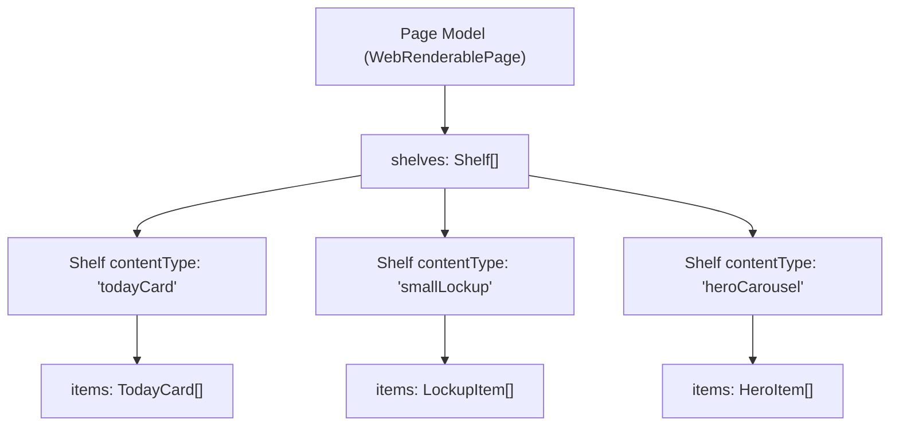
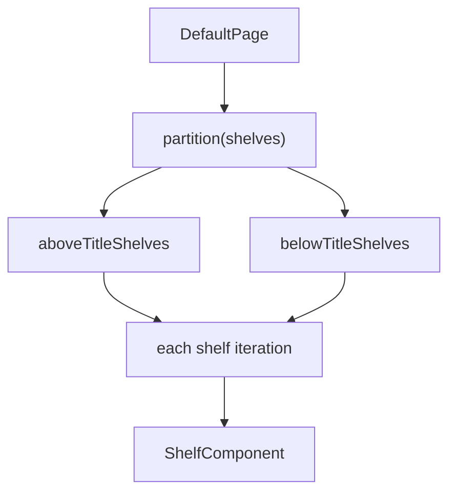
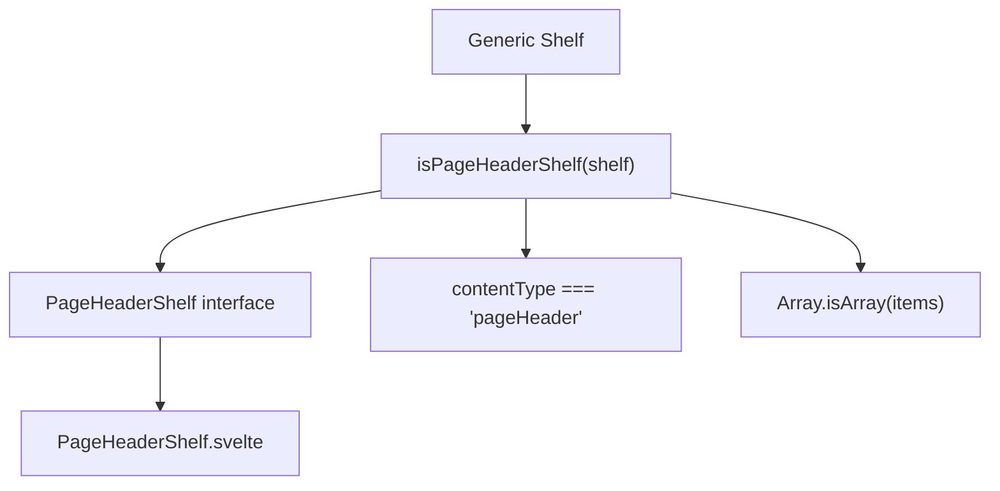
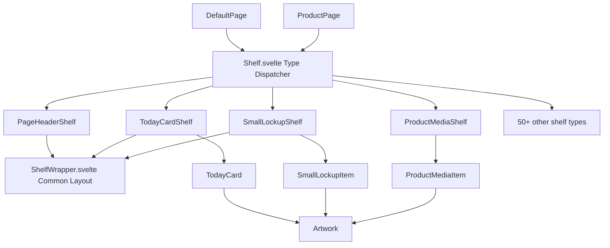
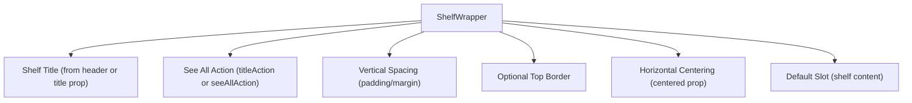
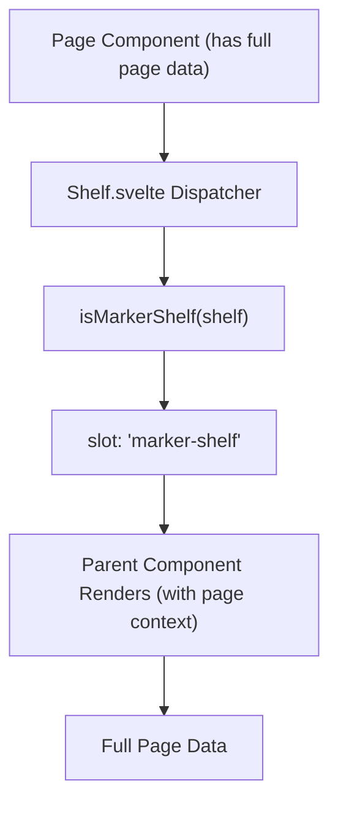
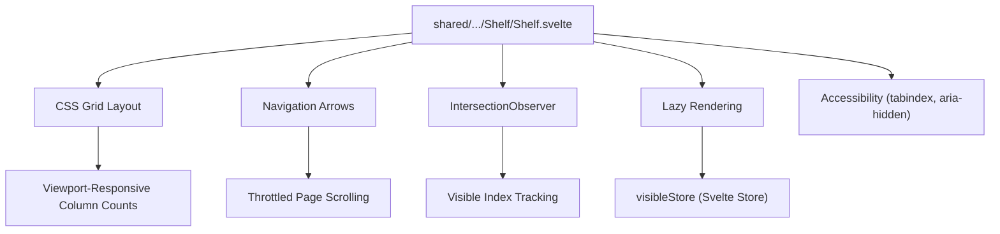
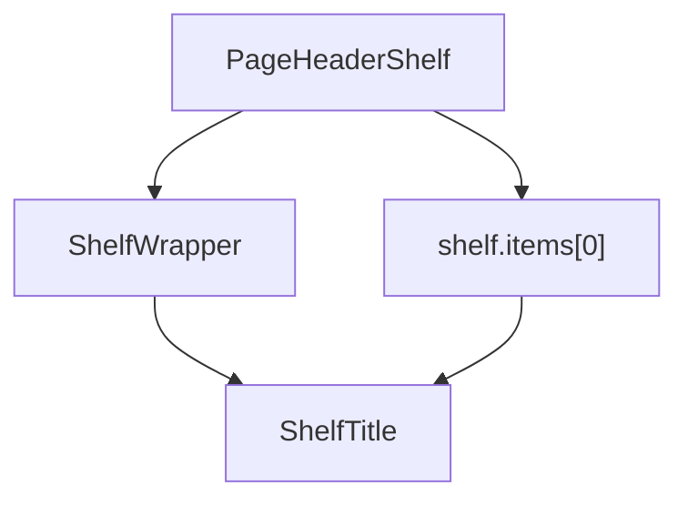

# 组件架构 (Component Architecture)

-   [shared/components/src/components/Shelf/Nav.svelte](https://github.com/Chesszyh/apps.apple.com/blob/279d0c4d/shared/components/src/components/Shelf/Nav.svelte)
-   [shared/components/src/components/Shelf/Shelf.svelte](https://github.com/Chesszyh/apps.apple.com/blob/279d0c4d/shared/components/src/components/Shelf/Shelf.svelte)
-   [src/components/Shelf/Wrapper.svelte](https://github.com/Chesszyh/apps.apple.com/blob/279d0c4d/src/components/Shelf/Wrapper.svelte)
-   [src/components/jet/action/ShelfBasedPageScrollAction.svelte](https://github.com/Chesszyh/apps.apple.com/blob/279d0c4d/src/components/jet/action/ShelfBasedPageScrollAction.svelte)
-   [src/components/jet/shelf/ArcadeFooterShelf.svelte](https://github.com/Chesszyh/apps.apple.com/blob/279d0c4d/src/components/jet/shelf/ArcadeFooterShelf.svelte)
-   [src/components/jet/shelf/PageHeaderShelf.svelte](https://github.com/Chesszyh/apps.apple.com/blob/279d0c4d/src/components/jet/shelf/PageHeaderShelf.svelte)
-   [src/components/jet/shelf/PrivacyFooterShelf.svelte](https://github.com/Chesszyh/apps.apple.com/blob/279d0c4d/src/components/jet/shelf/PrivacyFooterShelf.svelte)
-   [src/components/jet/shelf/Shelf.svelte](https://github.com/Chesszyh/apps.apple.com/blob/279d0c4d/src/components/jet/shelf/Shelf.svelte)
-   [src/components/pages/DefaultPage.svelte](https://github.com/Chesszyh/apps.apple.com/blob/279d0c4d/src/components/pages/DefaultPage.svelte)

## 目的与范围 (Purpose and Scope)

本文档提供了组件组合模式的架构概览，定义了 App Store Web 应用程序如何构建其用户界面。它涵盖了基于货架 (shelf-based) 的页面模型、用于多态渲染的类型守卫 (type guard) 模式，以及支持灵活的、数据驱动的 UI 组合的组件层级结构。

有关如何初始化页面并通过意图系统分发页面的详细信息，请参阅 [Jet Application Core](#2.1) 和 [Intent and Action System](#2.2)。有关特定货架类型和组件的实现详情，请参阅 [Shelf System](#4.2) 和 [Component Library](#5)。

---

## 基于货架的页面模型 (Shelf-Based Page Model)

应用程序遵循**基于货架的组合模型**，其中页面是包含 `Shelf` 对象数组的数据结构。每个货架代表一个水平的内容区域，可以显示各种类型的内容（应用程序、编辑卡片、锁定 (lockups) 等）。


**来源：** [src/components/pages/DefaultPage.svelte1-15](https://github.com/Chesszyh/apps.apple.com/blob/279d0c4d/src/components/pages/DefaultPage.svelte#L1-L15)

### 页面组件职责 (Page Component Responsibilities)

像 `DefaultPage` 这样的页面组件负责：

| 职责 | 实现 |
| --- | --- |
| **货架遍历** | 遍历 `page.shelves` 数组 |
| **标题渲染** | 使用定位逻辑显示页面标题 |
| **货架分区** | 根据呈现提示将货架分为标题上方/下方 |
| **插槽委托** | 将标记货架 (marker shelf) 渲染委托给父组件 |

`DefaultPage` 组件演示了这种模式：


**来源：** [src/components/pages/DefaultPage.svelte44-125](https://github.com/Chesszyh/apps.apple.com/blob/279d0c4d/src/components/pages/DefaultPage.svelte#L44-L125)

---

## 用于多态渲染的类型守卫模式 (Type Guard Pattern for Polymorphic Rendering)

应用程序使用 **TypeScript 类型守卫 (type guards)** 来实现多态组件渲染。类型守卫是一个函数，它将泛型缩小为特定的子类型，从而支持对专门组件进行类型安全的分发。

### 类型守卫结构 (Type Guard Structure)

每个货架类型定义：

1.  **TypeScript 接口** - 使用特定属性扩展基础 `Shelf` 类型
2.  **类型守卫函数** - 检查 `contentType` 和结构的运行时谓词
3.  **专门组件** - 渲染特定的货架类型


**示例类型守卫实现：**

该模式在所有货架类型中保持一致应用：

```
// 接口定义interface PageHeaderShelf extends Shelf {    items: [PageHeader];}// 类型守卫谓词export function isPageHeaderShelf(shelf: Shelf): shelf is PageHeaderShelf {    const { contentType, items } = shelf;    return contentType === 'pageHeader' && Array.isArray(items);}
```
**来源：** [src/components/jet/shelf/PageHeaderShelf.svelte1-11](https://github.com/Chesszyh/apps.apple.com/blob/279d0c4d/src/components/jet/shelf/PageHeaderShelf.svelte#L1-L11) [src/components/jet/shelf/PrivacyFooterShelf.svelte1-14](https://github.com/Chesszyh/apps.apple.com/blob/279d0c4d/src/components/jet/shelf/PrivacyFooterShelf.svelte#L1-L14) [src/components/jet/shelf/ArcadeFooterShelf.svelte1-14](https://github.com/Chesszyh/apps.apple.com/blob/279d0c4d/src/components/jet/shelf/ArcadeFooterShelf.svelte#L1-L14)

---

## 组件层级与组合 (Component Hierarchy and Composition)

应用程序实现了**四层组件层级结构**，从泛型组合到特定类型：


**来源：** [src/components/jet/shelf/Shelf.svelte1-320](https://github.com/Chesszyh/apps.apple.com/blob/279d0c4d/src/components/jet/shelf/Shelf.svelte#L1-L320) [src/components/Shelf/Wrapper.svelte1-82](https://github.com/Chesszyh/apps.apple.com/blob/279d0c4d/src/components/Shelf/Wrapper.svelte#L1-L82)

### 各层职责 (Layer Responsibilities)

| 层 | 职责 | 示例组件 |
| --- | --- | --- |
| **页面 (Pages)** | 编排货架数组，处理标题渲染，管理呈现选项 | `DefaultPage`, `ProductPage` |
| **货架分发器 (Shelf Dispatcher)** | 通过类型守卫将泛型货架路由到专门组件 | `Shelf.svelte` |
| **专门货架 (Specialized Shelves)** | 使用自定义布局和项目遍历渲染特定内容类型 | `TodayCardShelf`, `SmallLockupShelf`, `HeroCarouselShelf` |
| **内容项目 (Content Items)** | 使用视觉资产显示单个内容片段 | `TodayCard`, `SmallLockupItem`, `Artwork` |

---

## 货架分发器 (The Shelf Dispatcher)

`Shelf.svelte` 组件充当**中央类型分发器**，通过广泛的类型守卫 if-else 链将泛型 `Shelf` 模型路由到 50 多个专门实现。

### 分发器架构 (Dispatcher Architecture)

```mermaid
flowchart TD
    Input["Generic Shelf"]
    Dispatcher["Shelf.svelte Dispatcher"]
    AS["AccessibilityHeaderShelf"]
    AF["AccessibilityFeaturesShelf"]
    AC["ActionShelf"]
    AP["AppPromotionShelf"]
    BS["BrickShelf"]
    HC["HeroCarouselShelf"]
    SL["SmallLockupShelf"]
    ML["MediumLockupShelf"]
    LL["LargeLockupShelf"]
    PM["ProductMediaShelf"]
    TC["TodayCardShelf"]
    Others["40+ more shelf types"]
    Slot["slot: 'marker-shelf'"]
    Fallback["FallbackShelf"]

    Input --> Dispatcher
    Dispatcher --> AS
    Dispatcher --> AF
    Dispatcher --> AC
    Dispatcher --> AP
    Dispatcher --> BS
    Dispatcher --> HC
    Dispatcher --> SL
    Dispatcher --> ML
    Dispatcher --> LL
    Dispatcher --> PM
    Dispatcher --> TC
    Dispatcher --> Others
    Dispatcher --> Slot
    Dispatcher --> Fallback
```


**实现模式：**

分发器导入所有类型守卫和组件，然后使用 Svelte 的 `{#if}` / `{:else if}` 链进行基于类型的路由：

```
{#if isAccessibilityHeaderShelf(shelf)}    <AccessibilityHeaderShelf {shelf} />{:else if isAccessibilityFeaturesShelf(shelf)}    <AccessibilityFeaturesShelf {shelf} />{:else if isActionShelf(shelf)}    <ActionShelf {shelf} /><!-- ... 50+ 更多的类型检查 ... -->{:else if isMarkerShelf(shelf)}    <slot name="marker-shelf" {shelf} />{:else if isFallbackShelf(shelf)}    <FallbackShelf {shelf} />{/if}
```
**来源：** [src/components/jet/shelf/Shelf.svelte1-320](https://github.com/Chesszyh/apps.apple.com/blob/279d0c4d/src/components/jet/shelf/Shelf.svelte#L1-L320)

### 类型守卫顺序 (Type Guard Ordering)

分发器按**特定顺序**评估类型守卫，较具体的类型在较通用的类型之前检查。最后的守卫处理特殊情况：

| 位置 | 用途 | 示例 |
| --- | --- | --- |
| **早期** | 特定内容类型 | `isPageHeaderShelf`, `isProductMediaShelf` |
| **中期** | 常见货架类型 | Lockups, cards, bricks |
| **后期** | 泛型/回退类型 | `isUberShelf`, `isMarkerShelf` |
| **最后** | 全匹配 (Catch-all) | `isFallbackShelf` |

---

## ShelfWrapper 与通用布局模式 (ShelfWrapper and Common Layout Patterns)

`ShelfWrapper` 提供了大多数货架组件需要的**通用布局和样式**，实现了货架呈现的 DRY (Don't Repeat Yourself) 原则。

### ShelfWrapper 特性 (ShelfWrapper Features)


**来源：** [src/components/Shelf/Wrapper.svelte1-82](https://github.com/Chesszyh/apps.apple.com/blob/279d0c4d/src/components/Shelf/Wrapper.svelte#L1-L82)

### 可配置的布局选项 (Configurable Layout Options)

| 属性 | 类型 | 用途 | 默认值 |
| --- | --- | --- | --- |
| `centered` | `boolean` | 将货架约束在页面宽度内并水平居中 | `false` |
| `withTopBorder` | `boolean` | 在货架上方添加 1px 灰色边框 | `false` |
| `withTopMargin` | `boolean` | 在货架上方添加垂直外边距 | `false` |
| `withPaddingTop` | `boolean` | 在货架内容上方添加内边距 | `true` |
| `withBottomPadding` | `boolean` | 在货架内容下方添加内边距 | `true` |

### 使用模式 (Usage Pattern)

大多数货架组件使用 `ShelfWrapper` 包装其内容以继承通用布局：

```
<ShelfWrapper {shelf} centered withBottomPadding={false}>    <!-- 货架特定内容 --></ShelfWrapper>
```
**来源：** [src/components/jet/shelf/PageHeaderShelf.svelte23-27](https://github.com/Chesszyh/apps.apple.com/blob/279d0c4d/src/components/jet/shelf/PageHeaderShelf.svelte#L23-L27) [src/components/jet/shelf/PrivacyFooterShelf.svelte26-30](https://github.com/Chesszyh/apps.apple.com/blob/279d0c4d/src/components/jet/shelf/PrivacyFooterShelf.svelte#L26-L30) [src/components/jet/shelf/ArcadeFooterShelf.svelte28-32](https://github.com/Chesszyh/apps.apple.com/blob/279d0c4d/src/components/jet/shelf/ArcadeFooterShelf.svelte#L28-L32)

---

## 基于插槽的组件扩展 (Slot-Based Component Extension)

应用程序使用 **Svelte 插槽 (slots)** 作为组件扩展机制，用于需要来自父组件上下文的组件。

### 标记货架模式 (Marker Shelf Pattern)

`Shelf.svelte` 分发器为那些需要页面级数据（货架分发器层级无法获得）的货架定义了一个 `marker-shelf` 插槽：


**实现：**

分发器在遇到标记货架时将控制权交还给父组件：

```
<!-- 在 Shelf.svelte 中 -->{:else if isMarkerShelf(shelf)}    <slot name="marker-shelf" {shelf} />{/if}
```
页面组件处理该插槽：

```
<!-- 在 DefaultPage.svelte 中 --><ShelfComponent {shelf}>    <slot name="marker-shelf" slot="marker-shelf" let:shelf {shelf} /></ShelfComponent>
```
这种模式允许页面为需要访问页面级上下文的货架注入渲染逻辑（例如 `ProductPage` 的 `MarkerShelf` 需要产品平台信息）。

**来源：** [src/components/jet/shelf/Shelf.svelte176-190](https://github.com/Chesszyh/apps.apple.com/blob/279d0c4d/src/components/jet/shelf/Shelf.svelte#L176-L190) [src/components/pages/DefaultPage.svelte94-97](https://github.com/Chesszyh/apps.apple.com/blob/279d0c4d/src/components/pages/DefaultPage.svelte#L94-L97)

---

## 水平滚动货架组件 (Horizontal Scrolling Shelf Component)

对于显示可水平滚动内容的货架，一个单独的通用 `Shelf` 组件（区别于分发器）提供了滚动基础设施：


### 关键特性 (Key Features)

| 特性 | 实现 |
| --- | --- |
| **基于网格的布局** | 使用 CSS Grid，通过可配置的 `gridType` 确定每个视口的列数 |
| **交叉观察者 (Intersection Observer)** | 追踪可见项目，逐步加载屏幕外项目 |
| **导航箭头** | 左/右按钮用于内容分页（在 xsmall 视口隐藏） |
| **项目交互性** | 根据可见性管理 `tabindex` 和 `disabled` 属性 |
| **RTL 支持** | 自动为从右到左的区域设置调整滚动方向 |

**来源：** [shared/components/src/components/Shelf/Shelf.svelte1-536](https://github.com/Chesszyh/apps.apple.com/blob/279d0c4d/shared/components/src/components/Shelf/Shelf.svelte#L1-L536) [shared/components/src/components/Shelf/Nav.svelte1-200](https://github.com/Chesszyh/apps.apple.com/blob/279d0c4d/shared/components/src/components/Shelf/Nav.svelte#L1-L200)

### 泛型参数 (Generic Type Parameter)

水平货架使用 Svelte 的泛型参数提供类型安全的项目渲染：

```
<script lang="ts">    type T = $$Generic;    export let items: T[];</script>{#each items as item}    <slot name="item" item={cast(item)} />{/each}
```
这允许货架实现传递任何项目类型，同时保持插槽中的类型安全。

**来源：** [shared/components/src/components/Shelf/Shelf.svelte23-66](https://github.com/Chesszyh/apps.apple.com/blob/279d0c4d/shared/components/src/components/Shelf/Shelf.svelte#L23-L66)

---

## 通过组合实现组件复用 (Component Reusability Through Composition)

该架构强调**组合优于继承**，组件通过结合更小的、专注的组件来构建复杂的 UI。

### 组合示例：PageHeaderShelf (Composition Example: PageHeaderShelf)


`PageHeaderShelf` 组合了 `ShelfWrapper` 和 `ShelfTitle`，而没有重复布局或样式逻辑：

**来源：** [src/components/jet/shelf/PageHeaderShelf.svelte1-35](https://github.com/Chesszyh/apps.apple.com/blob/279d0c4d/src/components/jet/shelf/PageHeaderShelf.svelte#L1-L35)

### 组合架构的优势 (Benefits of Composition Architecture)

| 优势 | 描述 |
| --- | --- |
| **一致性** | 通用组件确保所有货架类型具有统一的外观 |
| **可维护性** | 对布局模式的更改会自动传播 |
| **灵活性** | 货架实现可以通过属性 (props) 选择启用/禁用通用功能 |
| **类型安全** | TypeScript 确保在整个组合链中正确传递属性 |
| **测试** | 更小的组件更容易进行隔离测试 |

---

## 总结 (Summary)

组件架构通过以下方式实现了一个**数据驱动的、类型安全的渲染系统**：

1.  **基于货架的页面模型** - 页面作为泛型货架对象的数组
2.  **类型守卫模式** - 用于多态分发的运行时类型缩小
3.  **中央分发器** - 针对 50 多种货架类型的单一路由点
4.  **分层体系结构** - 页面、货架和项目之间的清晰分离
5.  **通用布局组件** - 用于一致呈现的可复用包装器
6.  **插槽扩展机制** - 父组件可以注入特定于上下文的渲染

这种架构使应用程序能够通过一个统一的、可维护的组件系统来处理各种内容类型，该系统平衡了类型安全与渲染灵活性。
