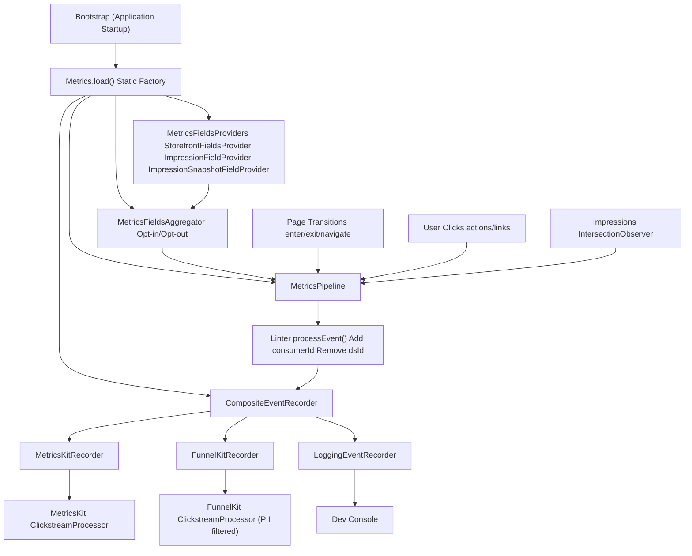
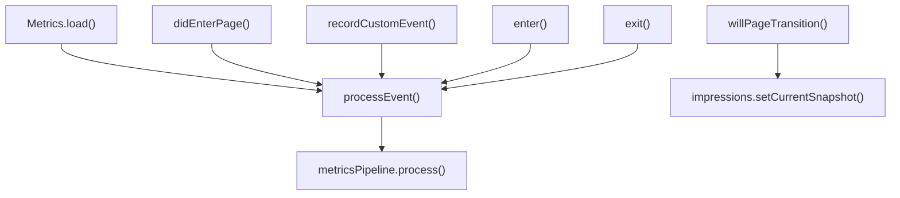
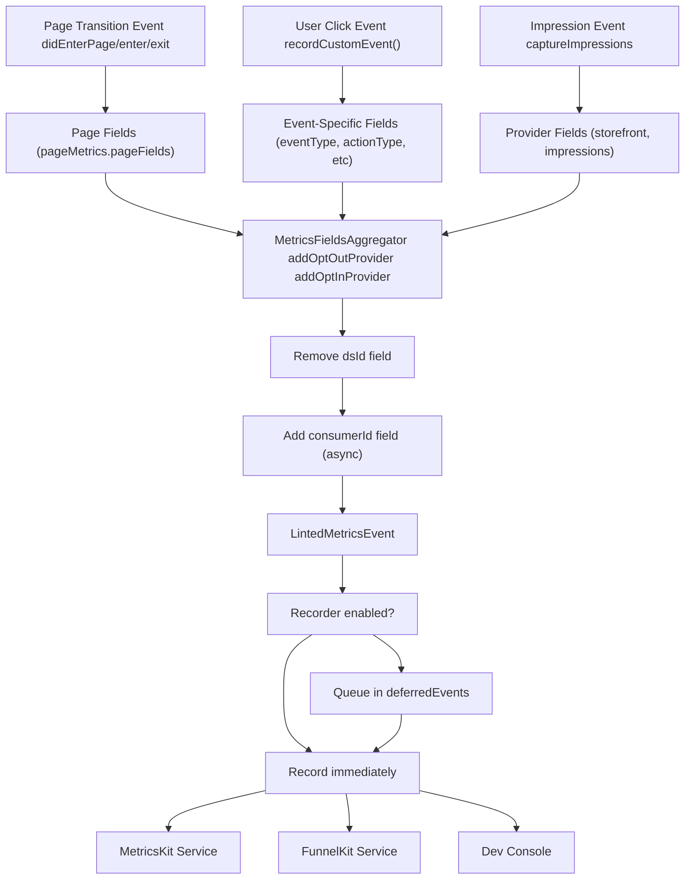
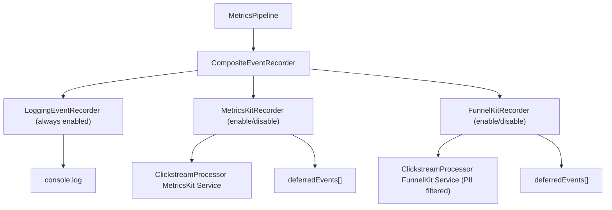
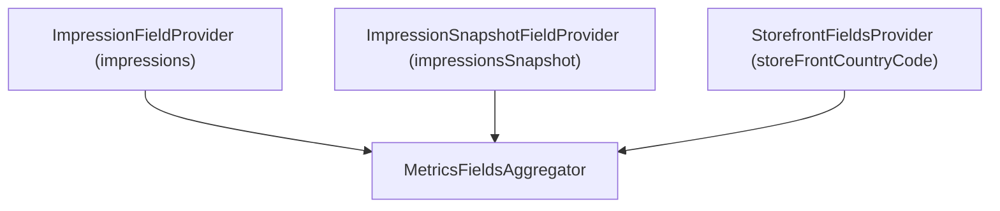
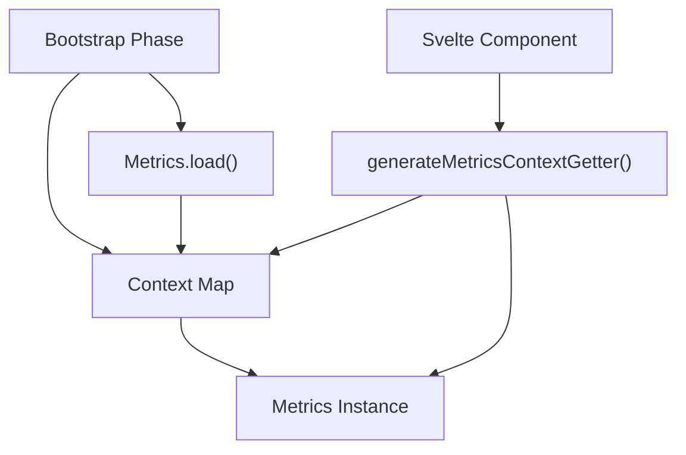

# 指标与分析 (Metrics and Analytics)

-   [shared/metrics-8/src/impression-provider.ts](https://github.com/Chesszyh/apps.apple.com/blob/279d0c4d/shared/metrics-8/src/impression-provider.ts)
-   [shared/metrics-8/src/impression-snapshot-provider.ts](https://github.com/Chesszyh/apps.apple.com/blob/279d0c4d/shared/metrics-8/src/impression-snapshot-provider.ts)
-   [shared/metrics-8/src/impressions/index.ts](https://github.com/Chesszyh/apps.apple.com/blob/279d0c4d/shared/metrics-8/src/impressions/index.ts)
-   [shared/metrics-8/src/index.ts](https://github.com/Chesszyh/apps.apple.com/blob/279d0c4d/shared/metrics-8/src/index.ts)
-   [shared/metrics-8/src/recorder/composite.ts](https://github.com/Chesszyh/apps.apple.com/blob/279d0c4d/shared/metrics-8/src/recorder/composite.ts)
-   [shared/metrics-8/src/recorder/funnelkit.ts](https://github.com/Chesszyh/apps.apple.com/blob/279d0c4d/shared/metrics-8/src/recorder/funnelkit.ts)
-   [shared/metrics-8/src/recorder/logging.ts](https://github.com/Chesszyh/apps.apple.com/blob/279d0c4d/shared/metrics-8/src/recorder/logging.ts)
-   [shared/metrics-8/src/recorder/metricskit.ts](https://github.com/Chesszyh/apps.apple.com/blob/279d0c4d/shared/metrics-8/src/recorder/metricskit.ts)
-   [shared/metrics-8/src/recorder/void.ts](https://github.com/Chesszyh/apps.apple.com/blob/279d0c4d/shared/metrics-8/src/recorder/void.ts)
-   [src/jet/metrics/providers/StorefrontFieldsProvider.ts](https://github.com/Chesszyh/apps.apple.com/blob/279d0c4d/src/jet/metrics/providers/StorefrontFieldsProvider.ts)
-   [src/jet/metrics/providers/index.ts](https://github.com/Chesszyh/apps.apple.com/blob/279d0c4d/src/jet/metrics/providers/index.ts)

## 目的与范围 (Purpose and Scope)

本文档全面介绍了指标与分析系统，该系统负责收集、处理并在整个应用程序中交付用户交互数据。该系统实现了一个先进的流水线架构，用于捕获页面转换、用户点击和元素曝光 (impressions)，然后将它们路由到包括 MetricsKit 和 FunnelKit 在内的多个分析服务。

有关特定子系统的详细信息：

-   流水线架构和事件处理：参见 [Metrics Pipeline](#3.1)
-   事件记录器实现和交付：参见 [Event Recorders](#3.2)
-   使用 IntersectionObserver 进行曝光追踪：参见 [Impressions Tracking](#3.3)
-   字段聚合和自定义提供程序：参见 [Metrics Providers](#3.4)

---

## 系统架构 (System Architecture)

指标系统在应用程序引导期间通过静态 `Metrics.load()` 工厂方法初始化，该方法构建了一个从提供程序到事件交付目的地的完整流水线。

**来源：**

-   [shared/metrics-8/src/index.ts108-263](https://github.com/Chesszyh/apps.apple.com/blob/279d0c4d/shared/metrics-8/src/index.ts#L108-L263)
-   [shared/metrics-8/src/recorder/composite.ts1-21](https://github.com/Chesszyh/apps.apple.com/blob/279d0c4d/shared/metrics-8/src/recorder/composite.ts#L1-L21)

---

## 核心组件 (Core Components)

### Metrics 类 (Metrics Class)

`Metrics` 类充当所有分析操作的中央编排器。它通过静态 `Metrics.load()` 方法实例化，并存储在应用程序上下文映射中。

| 属性 | 类型 | 用途 |
| --- | --- | --- |
| `metricsPipeline` | `MetricsPipeline` | 通过聚合、linting 和记录处理事件 |
| `currentPageMetrics` | `PageMetricsPresenter` | 追踪当前页面上下文和字段 |
| `impressions` | `Impressions` | 管理基于 IntersectionObserver 的曝光追踪 |
| `metricsKitRecorder` | `MetricsKitRecorder` | 记录到 MetricsKit 服务 |
| `funnelKitRecorder` | `FunnelKitRecorder` | 记录到 FunnelKit 服务（可选） |

**关键方法：**

**来源：**

-   [shared/metrics-8/src/index.ts91-444](https://github.com/Chesszyh/apps.apple.com/blob/279d0c4d/shared/metrics-8/src/index.ts#L91-L444)

---

## 初始化流程 (Initialization Flow)

`Metrics.load()` 方法遵循多阶段初始化过程，处理同步设置和异步依赖项加载。

> **[Mermaid sequence]**
> *(图表结构无法解析)*

**延迟事件队列 (Deferred Event Queue)：** 在异步依赖项加载之前，`MetricsKitRecorder` 和 `FunnelKitRecorder` 将事件排队在 `deferredEvents` 数组中。一旦调用了 `setupEventRecorder()`，排队的事件将被重放。

**来源：**

-   [shared/metrics-8/src/index.ts108-263](https://github.com/Chesszyh/apps.apple.com/blob/279d0c4d/shared/metrics-8/src/index.ts#L108-L263)
-   [shared/metrics-8/src/recorder/metricskit.ts29-213](https://github.com/Chesszyh/apps.apple.com/blob/279d0c4d/shared/metrics-8/src/recorder/metricskit.ts#L29-L213)
-   [shared/metrics-8/src/recorder/funnelkit.ts28-218](https://github.com/Chesszyh/apps.apple.com/blob/279d0c4d/shared/metrics-8/src/recorder/funnelkit.ts#L28-L218)

---

## 配置结构 (Configuration Structure)

`Metrics.load()` 方法接受一个具有以下结构的 `Config` 对象：

| 字段 | 类型 | 描述 |
| --- | --- | --- |
| `baseFields.appName` | `string` | 应用程序标识符 |
| `baseFields.delegateApp` | `string` | 委托应用程序名称 |
| `baseFields.appVersion` | `string` | 应用程序版本 |
| `baseFields.resourceRevNum` | `string` | 资源修订号 |
| `baseFields.storageObject` | `'sessionStorage' | 'localStorage'` | MetricsKit 的存储对象 |
| `clickstream` | `MetricKitConfig` | 具有主题和约束配置文件的 MetricsKit 配置 |
| `funnel` | `FunnelKitConfig` (可选) | FunnelKit 配置（若禁用则为 undefined） |
| `initialURL` | `string | null` | 启动时捕获的初始 URL |

**指标设置 (MetricSettings)：**

| 字段 | 类型 | 描述 |
| --- | --- | --- |
| `shouldEnableImpressions` | `() => boolean` | 是否启用曝光追踪 |
| `shouldEnableFunnelKit` | `() => boolean` | 是否启用 FunnelKit 记录器 |
| `getConsumerId` | `() => Promise<string>` | 获取消费者 ID 的异步函数 |
| `suppressMetricsKit` | `boolean` | 禁用 MetricsKit（服务器端渲染） |
| `impressions` | `ImpressionSettings` | 曝光特定的配置 |

**来源：**

-   [shared/metrics-8/src/index.ts55-86](https://github.com/Chesszyh/apps.apple.com/blob/279d0c4d/shared/metrics-8/src/index.ts#L55-L86)

---

## 事件生命周期 (Event Lifecycle)

事件在系统中按定义的顺序流动，从捕获、处理到交付。

**来源：**

-   [shared/metrics-8/src/index.ts371-387](https://github.com/Chesszyh/apps.apple.com/blob/279d0c4d/shared/metrics-8/src/index.ts#L371-L387)
-   [shared/metrics-8/src/index.ts176-199](https://github.com/Chesszyh/apps.apple.com/blob/279d0c4d/shared/metrics-8/src/index.ts#L176-L199)

---

## 事件类型 (Event Types)

系统处理几种不同的事件类型，每种类型都有特定的处理逻辑：

### 进入事件 (Enter Events)

在应用程序启动或从后台返回时触发。`enter()` 方法根据上下文确定事件子类型。

| 类型 | 触发器 | 特殊字段 |
| --- | --- | --- |
| `launch` | 首次页面加载，无引用页 (referrer) | 如果来自 PWA，则包含 `pwaDisplayMode` |
| `link` | 首次页面加载，有引用页 | `extRefUrl`, `refUrl` |
| `taskSwitch` | 可见性状态变为可见 (visible) | \- |

**来源：**

-   [shared/metrics-8/src/index.ts313-340](https://github.com/Chesszyh/apps.apple.com/blob/279d0c4d/shared/metrics-8/src/index.ts#L313-L340)
-   [shared/metrics-8/src/index.ts356-369](https://github.com/Chesszyh/apps.apple.com/blob/279d0c4d/shared/metrics-8/src/index.ts#L356-L369)

### 退出事件 (Exit Events)

在应用程序挂起或用户导航离开时触发。

| 类型 | 触发器 | 特殊行为 |
| --- | --- | --- |
| `taskSwitch` | 可见性状态变为隐藏 (hidden) | 刷新未报告的事件 |
| `navigate` | 页面转换 | 捕获累积的曝光 |

**来源：**

-   [shared/metrics-8/src/index.ts342-347](https://github.com/Chesszyh/apps.apple.com/blob/279d0c4d/shared/metrics-8/src/index.ts#L342-L347)
-   [shared/metrics-8/src/recorder/metricskit.ts86-122](https://github.com/Chesszyh/apps.apple.com/blob/279d0c4d/shared/metrics-8/src/recorder/metricskit.ts#L86-L122)

### 点击事件 (Click Events)

包含快照曝光 (snapshot impressions)（当前可见项目）的用户交互事件。

**来源：**

-   [shared/metrics-8/src/recorder/metricskit.ts126-137](https://github.com/Chesszyh/apps.apple.com/blob/279d0c4d/shared/metrics-8/src/recorder/metricskit.ts#L126-L137)

### 页面事件 (Page Events)

当页面加载/卸载时，通过 `PageMetricsPresenter` 自动生成。

**来源：**

-   [shared/metrics-8/src/index.ts289-311](https://github.com/Chesszyh/apps.apple.com/blob/279d0c4d/shared/metrics-8/src/index.ts#L289-L311)

### 曝光事件 (Impression Events)

在退出或导航事件中交付的累积曝光数据。详情参见 [Impressions Tracking](#3.3)。

**来源：**

-   [shared/metrics-8/src/recorder/metricskit.ts86-122](https://github.com/Chesszyh/apps.apple.com/blob/279d0c4d/shared/metrics-8/src/recorder/metricskit.ts#L86-L122)

---

## 记录器架构 (Recorder Architecture)

系统使用组合模式同时将事件发送到多个目的地。

### 服务器端渲染 (Server-Side Rendering)

在服务器上（当 `typeof window === 'undefined'` 或 `suppressMetricsKit === true` 时），系统实例化一个 `VoidEventRecorder`，该记录器会计数事件但不会将它们发送到任何地方。

**来源：**

-   [shared/metrics-8/src/index.ts125-139](https://github.com/Chesszyh/apps.apple.com/blob/279d0c4d/shared/metrics-8/src/index.ts#L125-L139)
-   [shared/metrics-8/src/recorder/void.ts1-18](https://github.com/Chesszyh/apps.apple.com/blob/279d0c4d/shared/metrics-8/src/recorder/void.ts#L1-L18)
-   [shared/metrics-8/src/recorder/composite.ts1-21](https://github.com/Chesszyh/apps.apple.com/blob/279d0c4d/shared/metrics-8/src/recorder/composite.ts#L1-L21)

---

## MetricsKit 与 FunnelKit (MetricsKit vs FunnelKit)

系统支持两种具有不同特征的分析服务：

| 方面 | MetricsKit | FunnelKit |
| --- | --- | --- |
| **主题 (Topic)** | `config.clickstream.topic` | `config.funnel.topic` |
| **PII 字段** | 允许 | 通过 `anonymous: true` 过滤掉 |
| **消费者 ID** | 包含 | 从 `IGNORED_FIELDS` 中移除 |
| **初始化** | 始终初始化 | 根据 `shouldEnableFunnelKit()` 有条件初始化 |
| **启用/禁用** | `enableMetrics()` / `disableMetrics()` | `enableFunnelKit()` / `disableFunnelKit()` |
| **交易事件** | 标准签名 | 具有不同参数的特殊处理 |

**FunnelKit PII 过滤：**

FunnelKit 记录器会移除 `IGNORED_FIELDS` 中列出的字段，并在事件记录器上设置 `anonymous: true`，以防止捕获 Cookie 和其他 PII。

**来源：**

-   [shared/metrics-8/src/recorder/funnelkit.ts16-26](https://github.com/Chesszyh/apps.apple.com/blob/279d0c4d/shared/metrics-8/src/recorder/funnelkit.ts#L16-L26)
-   [shared/metrics-8/src/recorder/funnelkit.ts160-162](https://github.com/Chesszyh/apps.apple.com/blob/279d0c4d/shared/metrics-8/src/recorder/funnelkit.ts#L160-L162)
-   [shared/metrics-8/src/index.ts392-443](https://github.com/Chesszyh/apps.apple.com/blob/279d0c4d/shared/metrics-8/src/index.ts#L392-L443)

---

## 指标提供程序模式 (Metrics Provider Pattern)

提供程序向事件添加上下文字段。系统区分选择性加入 (opt-in) 和选择性退出 (opt-out) 提供程序：

| 提供程序类型 | 行为 | 用途 |
| --- | --- | --- |
| **选择性退出 (Opt-Out)** | 字段始终包含在内，除非明确排除 | 默认上下文（店面等） |
| **选择性加入 (Opt-In)** | 仅在明确请求时才包含字段 | 开销较大或有条件的数据（曝光） |

### 内置提供程序 (Built-In Providers)

### ImpressionFieldProvider

针对 `captureType === 'jet'` 时的退出/导航事件，消耗累积的曝光（破坏性读取）。

**来源：**

-   [shared/metrics-8/src/impression-provider.ts1-28](https://github.com/Chesszyh/apps.apple.com/blob/279d0c4d/shared/metrics-8/src/impression-provider.ts#L1-L28)

### ImpressionSnapshotFieldProvider

针对点击事件，捕获当前曝光的快照（非破坏性读取）。

**来源：**

-   [shared/metrics-8/src/impression-snapshot-provider.ts1-28](https://github.com/Chesszyh/apps.apple.com/blob/279d0c4d/shared/metrics-8/src/impression-snapshot-provider.ts#L1-L28)

### StorefrontFieldsProvider

将当前店面国家代码添加到所有事件中。

**来源：**

-   [src/jet/metrics/providers/StorefrontFieldsProvider.ts1-20](https://github.com/Chesszyh/apps.apple.com/blob/279d0c4d/src/jet/metrics/providers/StorefrontFieldsProvider.ts#L1-L20)
-   [src/jet/metrics/providers/index.ts1-16](https://github.com/Chesszyh/apps.apple.com/blob/279d0c4d/src/jet/metrics/providers/index.ts#L1-L16)

---

## 页面转换处理 (Page Transition Handling)

系统通过一个协调的序列追踪页面更改：

> **[Mermaid sequence]**
> *(图表结构无法解析)*

**来源：**

-   [shared/metrics-8/src/index.ts284-311](https://github.com/Chesszyh/apps.apple.com/blob/279d0c4d/shared/metrics-8/src/index.ts#L284-L311)

---

## 开发控制台 (Development Console)

在内部构建中 (`APP_SCOPE === 'internal'`)，系统拦截网络请求，通过 `sendToMetricsDevConsole()` 将指标事件记录到浏览器控制台。

这使开发人员能够检查：

-   发送到 MetricsKit/FunnelKit 的事件负载
-   刷新 (flush) 操作
-   主题路由
-   字段转换

**来源：**

-   [shared/metrics-8/src/index.ts458-473](https://github.com/Chesszyh/apps.apple.com/blob/279d0c4d/shared/metrics-8/src/index.ts#L458-L473)
-   [shared/metrics-8/src/recorder/metricskit.ts110-113](https://github.com/Chesszyh/apps.apple.com/blob/279d0c4d/shared/metrics-8/src/recorder/metricskit.ts#L110-L113)
-   [shared/metrics-8/src/recorder/metricskit.ts168-171](https://github.com/Chesszyh/apps.apple.com/blob/279d0c4d/shared/metrics-8/src/recorder/metricskit.ts#L168-L171)

---

## 上下文访问 (Context Access)

`Metrics` 实例存储在应用程序上下文映射中，键为 `'metrics'`。组件可以使用 `generateMetricsContextGetter()` 工具检索它。

**来源：**

-   [shared/metrics-8/src/index.ts259-261](https://github.com/Chesszyh/apps.apple.com/blob/279d0c4d/shared/metrics-8/src/index.ts#L259-L261)
-   [shared/metrics-8/src/index.ts563-575](https://github.com/Chesszyh/apps.apple.com/blob/279d0c4d/shared/metrics-8/src/index.ts#L563-L575)

---

## 总结 (Summary)

指标与分析系统提供：

1.  **统一流水线**：从捕获、处理到交付的单一流程
2.  **多个目的地**：同时记录到 MetricsKit、FunnelKit 和开发控制台
3.  **可扩展的提供程序**：用于添加上下文字段的插件式架构
4.  **异步初始化**：带有事件排队的非阻塞依赖项加载
5.  **PII 保护**：针对隐私敏感目的地的自动过滤
6.  **曝光追踪**：基于 IntersectionObserver 的可见性检测
7.  **生命周期感知**：自动追踪页面转换和应用程序状态更改

有关每个子系统的实现细节，请参阅子页面 [3.1](#3.1), [3.2](#3.2), [3.3](#3.3), 和 [3.4](#3.4)。

**来源：**

-   [shared/metrics-8/src/index.ts1-579](https://github.com/Chesszyh/apps.apple.com/blob/279d0c4d/shared/metrics-8/src/index.ts#L1-L579)
