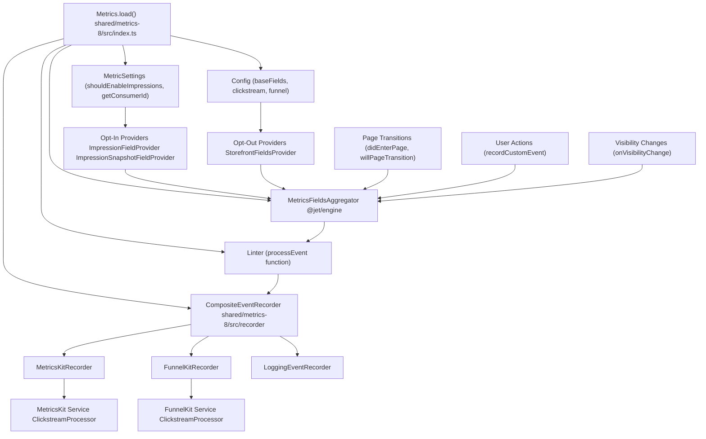
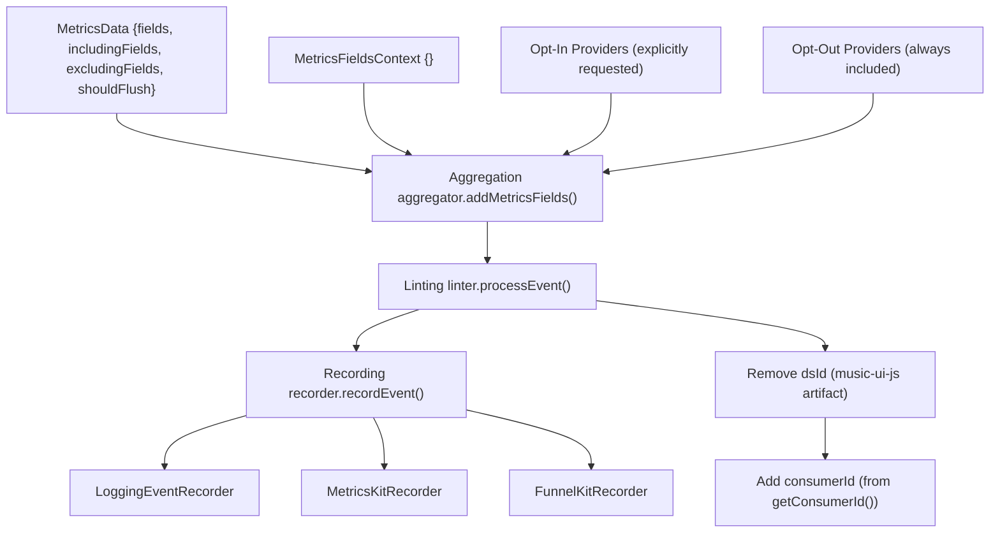
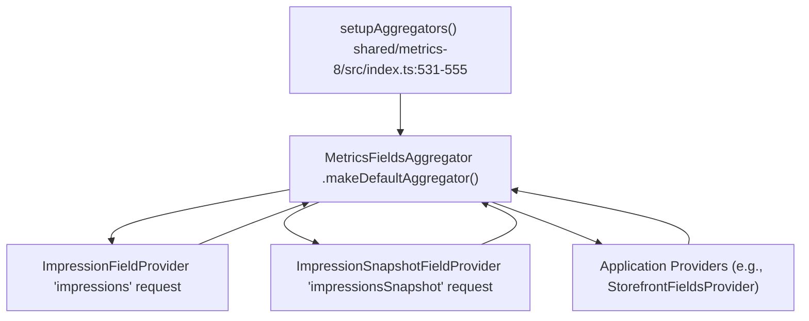
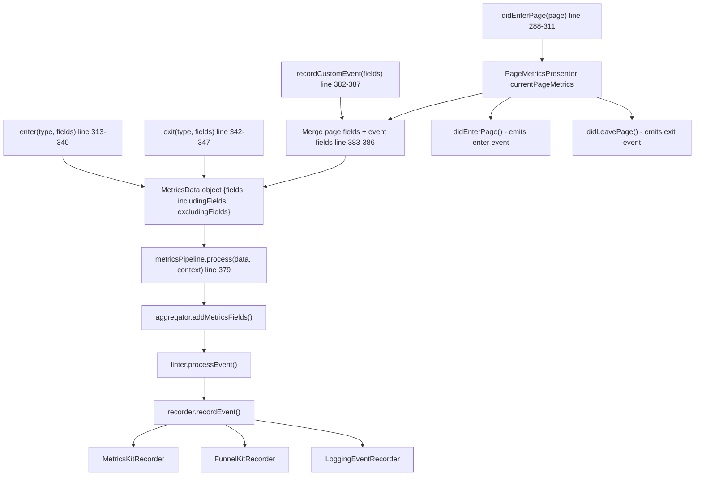

# 指标流水线 (Metrics Pipeline)

-   [shared/metrics-8/src/impression-provider.ts](https://github.com/Chesszyh/apps.apple.com/blob/279d0c4d/shared/metrics-8/src/impression-provider.ts)
-   [shared/metrics-8/src/impression-snapshot-provider.ts](https://github.com/Chesszyh/apps.apple.com/blob/279d0c4d/shared/metrics-8/src/impression-snapshot-provider.ts)
-   [shared/metrics-8/src/impressions/index.ts](https://github.com/Chesszyh/apps.apple.com/blob/279d0c4d/shared/metrics-8/src/impressions/index.ts)
-   [shared/metrics-8/src/index.ts](https://github.com/Chesszyh/apps.apple.com/blob/279d0c4d/shared/metrics-8/src/index.ts)
-   [src/jet/metrics/providers/StorefrontFieldsProvider.ts](https://github.com/Chesszyh/apps.apple.com/blob/279d0c4d/src/jet/metrics/providers/StorefrontFieldsProvider.ts)
-   [src/jet/metrics/providers/index.ts](https://github.com/Chesszyh/apps.apple.com/blob/279d0c4d/src/jet/metrics/providers/index.ts)

## 目的与范围 (Purpose and Scope)

本文档详细介绍了指标流水线架构，该架构处理从收集到交付的分析事件。它涵盖了 `Metrics.load` 初始化过程、`MetricsPipeline` 架构、通过 `MetricsFieldsAggregator` 进行的字段聚合、事件 linting 以及整体事件处理流程。

有关特定的记录器实现（MetricsKit, FunnelKit, Logging），请参阅 [Event Recorders](#3.2)。有关曝光追踪 (impressions tracking) 的详细信息，请参阅 [Impressions Tracking](#3.3)。有关创建自定义指标提供程序的信息，请参阅 [Metrics Providers](#3.4)。

---

## 系统概览 (System Overview)

指标流水线实现了一个三阶段处理架构：**聚合 (Aggregation) → Linting → 记录 (Recording)**。事件从数据源流经提供程序，提供程序使用上下文数据丰富事件，然后通过 linter 进行归一化，最后到达一个或多个记录器，将事件交付给外部分析服务。

### 流水线架构图 (Pipeline Architecture Diagram)


**来源：** [shared/metrics-8/src/index.ts91-444](https://github.com/Chesszyh/apps.apple.com/blob/279d0c4d/shared/metrics-8/src/index.ts#L91-L444)

---

## Metrics.load 初始化 (Metrics.load Initialization)

`Metrics.load` 静态方法是初始化指标系统的入口点。它执行环境检测、配置流水线，并异步加载 MetricsKit 依赖项。

### 初始化参数 (Initialization Parameters)

| 参数 | 类型 | 描述 |
| --- | --- | --- |
| `loggerFactory` | `LoggerFactory` | 为指标组件创建日志记录器实例 |
| `context` | `Map<string, unknown>` | 用于依赖注入的 Svelte 上下文映射 |
| `processEvent` | `(fields) => Promise<LintedMetricsEvent>` | 应用程序提供的 linting 函数 |
| `config` | `Config` | MetricsKit 和 FunnelKit 配置 |
| `listofMetricProviders` | `MetricsProvider[]` | 应用程序特定的字段提供程序 |
| `settings` | `MetricSettings` | 运行时设置和功能标志 |

**来源：** [shared/metrics-8/src/index.ts108-115](https://github.com/Chesszyh/apps.apple.com/blob/279d0c4d/shared/metrics-8/src/index.ts#L108-L115)

### 服务器与客户端初始化 (Server vs Client Initialization)

流水线检测执行环境并进行相应初始化：

**服务器端渲染：**

-   创建一个丢弃所有事件的 `VoidEventRecorder`
-   使用一个按原样返回字段的无操作 (no-op) linter
-   返回一个不包含 MetricsKit 依赖项的最小 `Metrics` 实例

**客户端：**

-   设置包含聚合器、linter 和组合记录器的完整流水线
-   通过动态导入异步加载 MetricsKit 依赖项
-   如果已启用，则初始化曝光追踪
-   配置 MetricsKit 并可选地配置 FunnelKit 记录器

**来源：** [shared/metrics-8/src/index.ts124-140](https://github.com/Chesszyh/apps.apple.com/blob/279d0c4d/shared/metrics-8/src/index.ts#L124-L140) [shared/metrics-8/src/index.ts142-262](https://github.com/Chesszyh/apps.apple.com/blob/279d0c4d/shared/metrics-8/src/index.ts#L142-L262)

### 初始化序列 (Initialization Sequence)

> **[Mermaid sequence]**
> *(图表结构无法解析)*

**来源：** [shared/metrics-8/src/index.ts108-263](https://github.com/Chesszyh/apps.apple.com/blob/279d0c4d/shared/metrics-8/src/index.ts#L108-L263) [shared/metrics-8/src/index.ts531-555](https://github.com/Chesszyh/apps.apple.com/blob/279d0c4d/shared/metrics-8/src/index.ts#L531-L555)

---

## MetricsPipeline 架构 (MetricsPipeline Architecture)

来自 `@jet/engine` 的 `MetricsPipeline` 类编排了三阶段事件处理工作流。`Metrics` 类使用三个关键组件实例化流水线：

### 流水线组件 (Pipeline Components)

| 组件 | 类型 | 职责 |
| --- | --- | --- |
| **聚合器 (Aggregator)** | `MetricsFieldsAggregator` | 收集所有注册提供程序的字段 |
| **Linter** | `{ processEvent }` | 归一化并丰富事件数据 |
| **记录器 (Recorder)** | `CompositeEventRecorder` | 将事件分发到多个目的地 |


**来源：** [shared/metrics-8/src/index.ts176-199](https://github.com/Chesszyh/apps.apple.com/blob/279d0c4d/shared/metrics-8/src/index.ts#L176-L199)

### 流水线实例化 (Pipeline Instantiation)

流水线在 `Metrics.load` 期间创建：

```
const metricsPipeline = new MetricsPipeline({    aggregator,    linter: {        processEvent: async (fields: MetricsFields) => {            const lintedEvent = await processEvent(fields);                        // 移除由 music-ui-js 添加的 dsId            if (lintedEvent.fields?.dsId) {                delete lintedEvent.fields.dsId;            }                        // 动态添加 consumerId            const consumerId = await getConsumerId();            if (consumerId) {                lintedEvent.fields.consumerId = consumerId;            }                        return lintedEvent;        },    },    recorder,});
```
**来源：** [shared/metrics-8/src/index.ts176-199](https://github.com/Chesszyh/apps.apple.com/blob/279d0c4d/shared/metrics-8/src/index.ts#L176-L199)

---

## 字段聚合系统 (Field Aggregation System)

`MetricsFieldsAggregator` 收集来自多个提供程序的字段，并将它们合并到单个事件负载中。系统区分**选择性加入 (opt-in)** 提供程序（仅在明确请求时才包含）和**选择性退出 (opt-out)** 提供程序（除非明确排除，否则始终包含）。

### setupAggregators 函数 (setupAggregators Function)

`setupAggregators` 函数使用默认和特定于应用程序的提供程序配置聚合器：


**来源：** [shared/metrics-8/src/index.ts531-555](https://github.com/Chesszyh/apps.apple.com/blob/279d0c4d/shared/metrics-8/src/index.ts#L531-L555)

### 提供程序注册 (Provider Registration)

**选择性加入提供程序 (Opt-In Providers)** (通过 `addOptInProvider` 添加)：

-   `ImpressionFieldProvider` - 消耗曝光数据以包含在事件中
-   `ImpressionSnapshotFieldProvider` - 捕获曝光快照

**选择性退出提供程序 (Opt-Out Providers)** (通过 `addOptOutProvider` 添加)：

-   来自 `listofMetricProviders` 参数的特定于应用程序的提供程序
-   示例：`StorefrontFieldsProvider` 添加 `storeFrontCountryCode`

**来源：** [shared/metrics-8/src/index.ts537-552](https://github.com/Chesszyh/apps.apple.com/blob/279d0c4d/shared/metrics-8/src/index.ts#L537-L552) [shared/metrics-8/src/impression-provider.ts9-27](https://github.com/Chesszyh/apps.apple.com/blob/279d0c4d/shared/metrics-8/src/impression-provider.ts#L9-L27) [shared/metrics-8/src/impression-snapshot-provider.ts9-27](https://github.com/Chesszyh/apps.apple.com/blob/279d0c4d/shared/metrics-8/src/impression-snapshot-provider.ts#L9-L27) [src/jet/metrics/providers/StorefrontFieldsProvider.ts9-19](https://github.com/Chesszyh/apps.apple.com/blob/279d0c4d/src/jet/metrics/providers/StorefrontFieldsProvider.ts#L9-L19)

### 提供程序接口 (Provider Interface)

所有提供程序都实现 `MetricsFieldsProvider` 接口：

```
interface MetricsFieldsProvider {    addMetricsFields(        builder: MetricsFieldsBuilder,        metricsContext: MetricsFieldsContext    ): void;}
```
提供程序使用 `builder` 将字段添加到事件中：

```
// 来自 StorefrontFieldsProvider 的示例addMetricsFields(builder: MetricsFieldsBuilder, _context: MetricsFieldsContext) {    const { storefront } = getLocale(this.objectGraph);    builder.addValue(storefront, 'storeFrontCountryCode');}
```
**来源：** [src/jet/metrics/providers/StorefrontFieldsProvider.ts9-19](https://github.com/Chesszyh/apps.apple.com/blob/279d0c4d/src/jet/metrics/providers/StorefrontFieldsProvider.ts#L9-L19)

---

## 事件 Linting (Event Linting)

linter 阶段通过移除不需要的字段并使用动态运行时数据丰富事件来归一化事件数据。linting 逻辑由应用程序通过 `processEvent` 函数参数提供。

### Linting 操作 (Linting Operations)

linter 执行两个关键操作：

**1. 移除 `dsId` 字段**

`dsId` 字段由 `music-ui-js` 代码添加，但对于 Web 应用程序来说是错误的。linter 会将其移除：

```
if (lintedEvent.fields?.dsId) {    delete lintedEvent.fields.dsId;}
```
**2. 添加 `consumerId` 字段**

`consumerId` 在事件处理时动态获取（而不是在初始化时），以支持登录后的场景：

```
const consumerId = await getConsumerId();if (consumerId) {    lintedEvent.fields.consumerId = consumerId;}
```
**来源：** [shared/metrics-8/src/index.ts179-196](https://github.com/Chesszyh/apps.apple.com/blob/279d0c4d/shared/metrics-8/src/index.ts#L179-L196)

### Linting 流程 (Linting Flow)

> **[Mermaid sequence]**
> *(图表结构无法解析)*

**来源：** [shared/metrics-8/src/index.ts179-196](https://github.com/Chesszyh/apps.apple.com/blob/279d0c4d/shared/metrics-8/src/index.ts#L179-L196)

---

## 事件处理流程 (Event Processing Flow)

事件通过 `processEvent` 和 `recordCustomEvent` 方法流经指标系统。这些方法构建 `MetricsData` 对象并将其传递给流水线。

### processEvent 方法 (processEvent Method)

`processEvent` 方法是事件处理的低级入口点：

```
async processEvent(metricsFields: MetricsFields) {    const metricsData: MetricsData = {        excludingFields: [],        includingFields: [],        shouldFlush: false,        fields: metricsFields,    };    const context: MetricsFieldsContext = {};    await this.metricsPipeline.process(metricsData, context);}
```
**来源：** [shared/metrics-8/src/index.ts371-380](https://github.com/Chesszyh/apps.apple.com/blob/279d0c4d/shared/metrics-8/src/index.ts#L371-L380)

### recordCustomEvent 方法 (recordCustomEvent Method)

`recordCustomEvent` 方法将页面级字段与特定于事件的字段合并：

```
async recordCustomEvent(fields?: Opt<MetricsFields>) {    await this.processEvent({        ...this.currentPageMetrics?.pageMetrics?.pageFields,        ...fields,    });}
```
这确保了每个事件都包含来自当前 `PageMetricsPresenter` 的页面上下文（例如 `pageId`, `pageType`）。

**来源：** [shared/metrics-8/src/index.ts382-387](https://github.com/Chesszyh/apps.apple.com/blob/279d0c4d/shared/metrics-8/src/index.ts#L382-L387)

### 完整事件流程图 (Complete Event Flow Diagram)


**来源：** [shared/metrics-8/src/index.ts288-387](https://github.com/Chesszyh/apps.apple.com/blob/279d0c4d/shared/metrics-8/src/index.ts#L288-L387)

### 页面转换处理 (Page Transition Handling)

`Metrics` 类管理页面转换和相关的指标事件：

**`willPageTransition()`** - 在导航之前调用：

-   捕获当前页面的曝光快照

**`didEnterPage(page)`** - 在导航之后调用：

-   退出前一个页面的指标（发出退出事件）
-   为当前页面创建一个新的 `PageMetricsPresenter`
-   为新页面发出进入事件
-   以 `launch` 或 `link` 类型记录第一个进入事件

**来源：** [shared/metrics-8/src/index.ts284-311](https://github.com/Chesszyh/apps.apple.com/blob/279d0c4d/shared/metrics-8/src/index.ts#L284-L311)

---

## MetricsKit 和 FunnelKit 设置 (MetricsKit and FunnelKit Setup)

指标系统配置了两个独立的点击流处理器：一个用于 MetricsKit（主要分析），另一个（可选）用于 FunnelKit（具有 PII 过滤的转换追踪）。

### setupMtkit 函数 (setupMtkit Function)

创建主要的 MetricsKit 点击流处理器：

**来源：** [shared/metrics-8/src/index.ts488-500](https://github.com/Chesszyh/apps.apple.com/blob/279d0c4d/shared/metrics-8/src/index.ts#L488-L500)

### setupFunnelKit 函数 (setupFunnelKit Function)

为具有 PII 过滤的 FunnelKit 创建一个单独的点击流处理器：

```
private setupFunnelKit(): void {    const { topic } = this.config.funnel;    const { clickstream, webDelegate } = setupStarkit(        this.ClickstreamProcessor,        this.WebDelegates,        this.config.funnel,        this.config.baseFields,    );        // 针对 funnel 主题禁用 PII 字段和 Cookie    webDelegate.eventRecorder.setProperties?.(topic, {        anonymous: true,    });        this.funnelKitRecorder?.setupEventRecorder(clickstream);}
```
**关键区别：** FunnelKit 设置 `anonymous: true` 以禁用 PII 收集和 Cookie 追踪。

**来源：** [shared/metrics-8/src/index.ts392-416](https://github.com/Chesszyh/apps.apple.com/blob/279d0c4d/shared/metrics-8/src/index.ts#L392-L416)

### 环境委托配置 (Environment Delegates Configuration)

两个点击流处理器都通过 `setupMtkitDelegates` 配置了应用程序元数据：

| 委托 | 值 | 用途 |
| --- | --- | --- |
| `app` | `appName` | 应用程序标识符 |
| `appVersion` | `appVersion` | 应用程序版本字符串 |
| `delegateApp` | `delegateApp` | 委托应用程序名称 |
| `resourceRevNum` | `resourceRevNum` | 资源修订号 |
| `localStorageObject` | `sessionStorage` (可选) | 存储机制覆盖 |

**来源：** [shared/metrics-8/src/index.ts502-529](https://github.com/Chesszyh/apps.apple.com/blob/279d0c4d/shared/metrics-8/src/index.ts#L502-L529)

### 异步依赖项加载 (Async Dependency Loading)

异步加载 MetricsKit 依赖项以避免阻塞初始页面渲染：

```
const metricsDependencies = [    import('@amp-metrics/mt-metricskit-processor-clickstream'),    import('@amp-metrics/mt-metricskit-delegates-web'),    impressions ? import('@amp-metrics/mt-impressions-observer') : undefined,] as const;const [{ ClickstreamProcessor }, { WebDelegates }, impressionsDependency] =     await Promise.all(metricsDependencies);
```
加载后，记录器将使用它们各自的点击流实例进行初始化。

**来源：** [shared/metrics-8/src/index.ts211-257](https://github.com/Chesszyh/apps.apple.com/blob/279d0c4d/shared/metrics-8/src/index.ts#L211-L257)

---

## 类职责总结 (Class Responsibilities Summary)

| 类 | 文件 | 职责 |
| --- | --- | --- |
| `Metrics` | [shared/metrics-8/src/index.ts91-444](https://github.com/Chesszyh/apps.apple.com/blob/279d0c4d/shared/metrics-8/src/index.ts#L91-L444) | 编排初始化，管理页面转换，处理进入/退出事件 |
| `MetricsPipeline` | `@jet/engine` | 协调“聚合 → linting → 记录”流程 |
| `MetricsFieldsAggregator` | `@jet/engine` | 收集来自选择性加入和选择性退出提供程序的字段 |
| `CompositeEventRecorder` | [shared/metrics-8/src/recorder](https://github.com/Chesszyh/apps.apple.com/blob/279d0c4d/shared/metrics-8/src/recorder) | 同时将事件分发到多个记录器 |
| `MetricsKitRecorder` | [shared/metrics-8/src/recorder](https://github.com/Chesszyh/apps.apple.com/blob/279d0c4d/shared/metrics-8/src/recorder) | 将事件记录到 MetricsKit ClickstreamProcessor |
| `FunnelKitRecorder` | [shared/metrics-8/src/recorder](https://github.com/Chesszyh/apps.apple.com/blob/279d0c4d/shared/metrics-8/src/recorder) | 将事件记录到 FunnelKit ClickstreamProcessor（经过 PII 过滤） |
| `LoggingEventRecorder` | [shared/metrics-8/src/recorder](https://github.com/Chesszyh/apps.apple.com/blob/279d0c4d/shared/metrics-8/src/recorder) | 将事件记录到开发人员控制台 |
| `ImpressionFieldProvider` | [shared/metrics-8/src/impression-provider.ts9-27](https://github.com/Chesszyh/apps.apple.com/blob/279d0c4d/shared/metrics-8/src/impression-provider.ts#L9-L27) | 向事件添加消耗的曝光数据 |
| `ImpressionSnapshotFieldProvider` | [shared/metrics-8/src/impression-snapshot-provider.ts9-27](https://github.com/Chesszyh/apps.apple.com/blob/279d0c4d/shared/metrics-8/src/impression-snapshot-provider.ts#L9-L27) | 向事件添加曝光快照 |
| `PageMetricsPresenter` | `@jet/engine` | 管理页面级指标并发出页面进入/退出事件 |

**来源：** [shared/metrics-8/src/index.ts1-579](https://github.com/Chesszyh/apps.apple.com/blob/279d0c4d/shared/metrics-8/src/index.ts#L1-L579)
