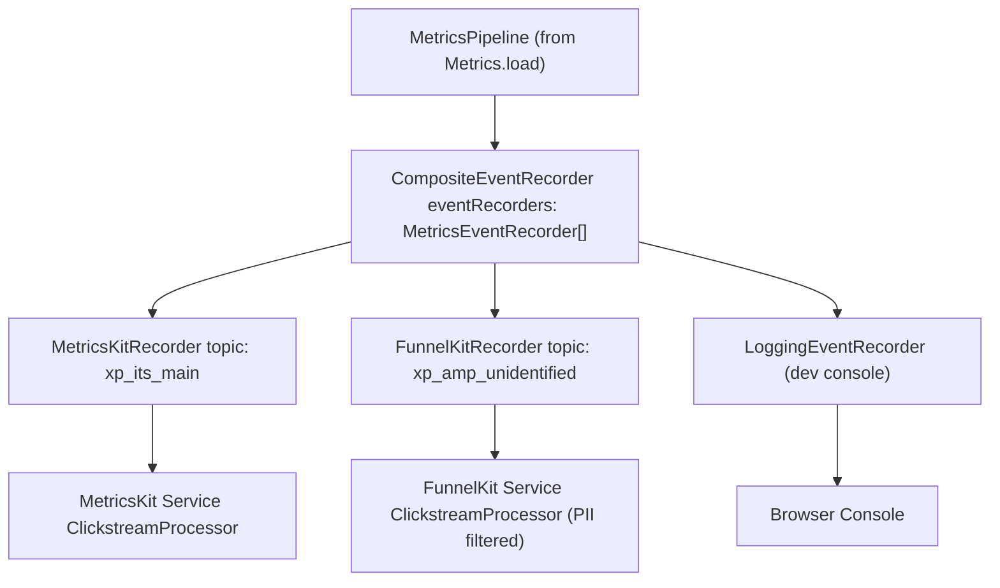
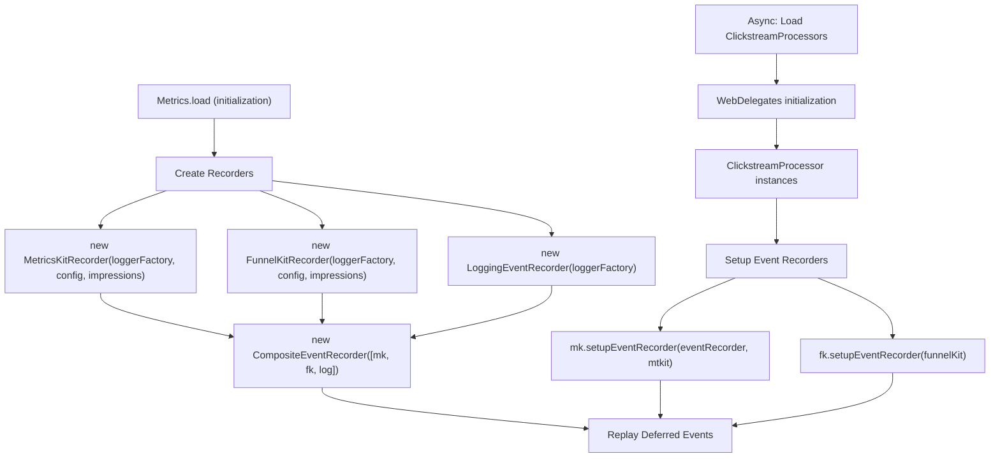

# 事件记录器 (Event Recorders)

-   [shared/metrics-8/src/recorder/composite.ts](https://github.com/Chesszyh/apps.apple.com/blob/279d0c4d/shared/metrics-8/src/recorder/composite.ts)
-   [shared/metrics-8/src/recorder/funnelkit.ts](https://github.com/Chesszyh/apps.apple.com/blob/279d0c4d/shared/metrics-8/src/recorder/funnelkit.ts)
-   [shared/metrics-8/src/recorder/logging.ts](https://github.com/Chesszyh/apps.apple.com/blob/279d0c4d/shared/metrics-8/src/recorder/logging.ts)
-   [shared/metrics-8/src/recorder/metricskit.ts](https://github.com/Chesszyh/apps.apple.com/blob/279d0c4d/shared/metrics-8/src/recorder/metricskit.ts)
-   [shared/metrics-8/src/recorder/void.ts](https://github.com/Chesszyh/apps.apple.com/blob/279d0c4d/shared/metrics-8/src/recorder/void.ts)

## 目的与范围 (Purpose and Scope)

事件记录器是指标流水线的最后阶段，负责将处理后的指标事件交付给外部分析服务。本文档涵盖了 `MetricsEventRecorder` 接口、组合模式架构，以及将事件发送到 MetricsKit、FunnelKit 和开发控制台的具体实现。

有关事件在到达记录器之前如何收集和处理的信息，请参阅 [Metrics Pipeline](#3.1)。有关与记录器集成的曝光追踪 (impression tracking) 详情，请参阅 [Impressions Tracking](#3.3)。

---

## MetricsEventRecorder 接口 (MetricsEventRecorder Interface)

所有事件记录器都实现来自 `@jet/engine` 的 `MetricsEventRecorder` 接口，该接口定义了两个核心操作：

```
interface MetricsEventRecorder {    record(event: LintedMetricsEvent, topic: Opt<string>): void;    flush(): Promise<number>;}
```
| 方法 | 参数 | 返回值 | 用途 |
| --- | --- | --- | --- |
| `record()` | `event: LintedMetricsEvent`
`topic: Opt<string>` | `void` | 接受 linted 事件和可选主题，然后将其交付给分析服务 |
| `flush()` | 无 | `Promise<number>` | 强制交付任何排队的事件，并返回刷新的事件计数 |

**来源：** [shared/metrics-8/src/recorder/composite.ts1-20](https://github.com/Chesszyh/apps.apple.com/blob/279d0c4d/shared/metrics-8/src/recorder/composite.ts#L1-L20) [shared/metrics-8/src/recorder/metricskit.ts1-4](https://github.com/Chesszyh/apps.apple.com/blob/279d0c4d/shared/metrics-8/src/recorder/metricskit.ts#L1-L4)

---

## 记录器架构 (Recorder Architecture)

### 组合模式实现 (Composite Pattern Implementation)

系统使用 **CompositeEventRecorder** 同时向多个记录器广播事件。这允许将指标并行发送到 MetricsKit、FunnelKit 和日志输出。


**图表：组合记录器模式 (Composite Recorder Pattern)**

`CompositeEventRecorder` 遍历其记录器数组并对每个记录器调用 `record()`：

[shared/metrics-8/src/recorder/composite.ts8-11](https://github.com/Chesszyh/apps.apple.com/blob/279d0c4d/shared/metrics-8/src/recorder/composite.ts#L8-L11)

**来源：** [shared/metrics-8/src/recorder/composite.ts1-20](https://github.com/Chesszyh/apps.apple.com/blob/279d0c4d/shared/metrics-8/src/recorder/composite.ts#L1-L20)

---

## MetricsKitRecorder

`MetricsKitRecorder` 使用 ClickstreamProcessor 将事件交付给 Apple 的 MetricsKit 服务。

### 配置 (Configuration)

[shared/metrics-8/src/recorder/metricskit.ts24-27](https://github.com/Chesszyh/apps.apple.com/blob/279d0c4d/shared/metrics-8/src/recorder/metricskit.ts#L24-L27)

| 字段 | 类型 | 用途 |
| --- | --- | --- |
| `topic` | `string` | 点击流主题（例如 `"xp_its_main"`） |
| `constraintProfiles` | `string[]` | 约束事件记录的配置文件 |

### 关键特性 (Key Features)

#### 事件类型验证 (Event Type Validation)

记录器验证事件是否包含一个有效的 `eventType` 字段，该字段应与 `METRICS_EVENT_TYPES` 中定义的受支持类型之一匹配：

[shared/metrics-8/src/recorder/metricskit.ts65-77](https://github.com/Chesszyh/apps.apple.com/blob/279d0c4d/shared/metrics-8/src/recorder/metricskit.ts#L65-L77)

#### 曝光集成 (Impressions Integration)

记录器以两种方式与曝光系统集成：

**累积曝光（退出/导航时）：** 当用户离开页面 (`exit` 事件) 或导航 (`click` 且 `actionType: 'navigate'`) 时，记录器消耗累积的曝光，并将其作为单独的曝光事件发送：

[shared/metrics-8/src/recorder/metricskit.ts86-122](https://github.com/Chesszyh/apps.apple.com/blob/279d0c4d/shared/metrics-8/src/recorder/metricskit.ts#L86-L122)

**快照曝光（点击时）：** 对于点击事件，记录器捕获当前曝光的快照，以包含在点击事件数据中：

[shared/metrics-8/src/recorder/metricskit.ts126-137](https://github.com/Chesszyh/apps.apple.com/blob/279d0c4d/shared/metrics-8/src/recorder/metricskit.ts#L126-L137)

#### 启用/禁用控制 (Enable/Disable Controls)

记录器可以在运行时启用或禁用：

[shared/metrics-8/src/recorder/metricskit.ts219-238](https://github.com/Chesszyh/apps.apple.com/blob/279d0c4d/shared/metrics-8/src/recorder/metricskit.ts#L219-L238)

禁用时，事件会被记录到日志，但不会发送到 MetricsKit。

**来源：** [shared/metrics-8/src/recorder/metricskit.ts1-240](https://github.com/Chesszyh/apps.apple.com/blob/279d0c4d/shared/metrics-8/src/recorder/metricskit.ts#L1-L240)

---

## FunnelKitRecorder

`FunnelKitRecorder` 将事件发送到 Apple 的 FunnelKit 服务进行漏斗分析。与 MetricsKit 不同，FunnelKit 有严格的 PII 过滤要求。

### PII 过滤 (PII Filtering)

FunnelKit 明确移除了被视为个人身份信息 (PII) 的字段：

[shared/metrics-8/src/recorder/funnelkit.ts22-26](https://github.com/Chesszyh/apps.apple.com/blob/279d0c4d/shared/metrics-8/src/recorder/funnelkit.ts#L22-L26)

在发送到 FunnelKit 之前，会移除由 linting 过程添加的 `consumerId` 字段：

[shared/metrics-8/src/recorder/funnelkit.ts160-162](https://github.com/Chesszyh/apps.apple.com/blob/279d0c4d/shared/metrics-8/src/recorder/funnelkit.ts#L160-L162)

### 主题处理 (Topic Handling)

FunnelKit 针对 Apple TV 具有特殊的主题处理逻辑：

[shared/metrics-8/src/recorder/funnelkit.ts57-63](https://github.com/Chesszyh/apps.apple.com/blob/279d0c4d/shared/metrics-8/src/recorder/funnelkit.ts#L57-L63)

这确保了 TV 指标始终使用未标识 (unidentified) 的主题。

### 交易事件 (Transaction Events)

FunnelKit 处理交易事件的方式与其他事件类型不同，使用不同的方法签名：

[shared/metrics-8/src/recorder/funnelkit.ts138-143](https://github.com/Chesszyh/apps.apple.com/blob/279d0c4d/shared/metrics-8/src/recorder/funnelkit.ts#L138-L143)

### 启用/禁用 (Enable/Disable)

FunnelKit 具有与 MetricsKit 独立的启用/禁用机制：

[shared/metrics-8/src/recorder/funnelkit.ts220-236](https://github.com/Chesszyh/apps.apple.com/blob/279d0c4d/shared/metrics-8/src/recorder/funnelkit.ts#L220-L236)

禁用时，事件会被记录到日志，但不会发送。

**来源：** [shared/metrics-8/src/recorder/funnelkit.ts1-238](https://github.com/Chesszyh/apps.apple.com/blob/279d0c4d/shared/metrics-8/src/recorder/funnelkit.ts#L1-L238)

---

## 辅助记录器 (Supporting Recorders)

### LoggingEventRecorder

`LoggingEventRecorder` 将所有事件输出到浏览器控制台，对开发和调试非常有用：

[shared/metrics-8/src/recorder/logging.ts6-21](https://github.com/Chesszyh/apps.apple.com/blob/279d0c4d/shared/metrics-8/src/recorder/logging.ts#L6-L21)

### VoidEventRecorder

`VoidEventRecorder` 静默地消耗事件而不将其发送到任何地方，仅追踪计数：

[shared/metrics-8/src/recorder/void.ts5-17](https://github.com/Chesszyh/apps.apple.com/blob/279d0c4d/shared/metrics-8/src/recorder/void.ts#L5-L17)

这在需要验证事件记录而不实际交付的测试场景中非常有用。

**来源：** [shared/metrics-8/src/recorder/logging.ts1-22](https://github.com/Chesszyh/apps.apple.com/blob/279d0c4d/shared/metrics-8/src/recorder/logging.ts#L1-L22) [shared/metrics-8/src/recorder/void.ts1-18](https://github.com/Chesszyh/apps.apple.com/blob/279d0c4d/shared/metrics-8/src/recorder/void.ts#L1-L18)

---

## 延迟事件处理 (Deferred Event Handling)

`MetricsKitRecorder` 和 `FunnelKitRecorder` 都实现了延迟事件处理，以对 ClickstreamProcessor 初始化之前到达的事件进行排队。

> **[Mermaid sequence]**
> *(图表结构无法解析)*

**图表：延迟事件模式 (Deferred Event Pattern)**

### 实现 (Implementation)

延迟事件队列声明为一个私有字段：

[shared/metrics-8/src/recorder/metricskit.ts41](https://github.com/Chesszyh/apps.apple.com/blob/279d0c4d/shared/metrics-8/src/recorder/metricskit.ts#L41-L41)

当 `eventRecorder` 尚不可用时，事件会被排队：

[shared/metrics-8/src/recorder/metricskit.ts191-193](https://github.com/Chesszyh/apps.apple.com/blob/279d0c4d/shared/metrics-8/src/recorder/metricskit.ts#L191-L193)

一旦调用了 `setupEventRecorder()`，所有排队的事件都会被重放：

[shared/metrics-8/src/recorder/metricskit.ts203-213](https://github.com/Chesszyh/apps.apple.com/blob/279d0c4d/shared/metrics-8/src/recorder/metricskit.ts#L203-L213)

同样的模式在 `FunnelKitRecorder` 中也得到了实现：

[shared/metrics-8/src/recorder/funnelkit.ts39](https://github.com/Chesszyh/apps.apple.com/blob/279d0c4d/shared/metrics-8/src/recorder/funnelkit.ts#L39-L39) [shared/metrics-8/src/recorder/funnelkit.ts196-198](https://github.com/Chesszyh/apps.apple.com/blob/279d0c4d/shared/metrics-8/src/recorder/funnelkit.ts#L196-L198) [shared/metrics-8/src/recorder/funnelkit.ts212-218](https://github.com/Chesszyh/apps.apple.com/blob/279d0c4d/shared/metrics-8/src/recorder/funnelkit.ts#L212-L218)

**来源：** [shared/metrics-8/src/recorder/metricskit.ts38-213](https://github.com/Chesszyh/apps.apple.com/blob/279d0c4d/shared/metrics-8/src/recorder/metricskit.ts#L38-L213) [shared/metrics-8/src/recorder/funnelkit.ts36-218](https://github.com/Chesszyh/apps.apple.com/blob/279d0c4d/shared/metrics-8/src/recorder/funnelkit.ts#L36-L218)

---

## 事件刷新 (Event Flushing)

### 退出时自动刷新 (Automatic Flushing on Exit)

两个记录器在处理 `exit` 事件时都会自动刷新未报告的事件：

**MetricsKit:** [shared/metrics-8/src/recorder/metricskit.ts183-190](https://github.com/Chesszyh/apps.apple.com/blob/279d0c4d/shared/metrics-8/src/recorder/metricskit.ts#L183-L190)

**FunnelKit:** [shared/metrics-8/src/recorder/funnelkit.ts180-190](https://github.com/Chesszyh/apps.apple.com/blob/279d0c4d/shared/metrics-8/src/recorder/funnelkit.ts#L180-L190)

### 手动刷新 (Manual Flushing)

`flush()` 方法强制交付排队的事件，并返回已刷新的事件计数：

**MetricsKit:** [shared/metrics-8/src/recorder/metricskit.ts196-201](https://github.com/Chesszyh/apps.apple.com/blob/279d0c4d/shared/metrics-8/src/recorder/metricskit.ts#L196-L201)

**FunnelKit:** [shared/metrics-8/src/recorder/funnelkit.ts201-210](https://github.com/Chesszyh/apps.apple.com/blob/279d0c4d/shared/metrics-8/src/recorder/funnelkit.ts#L201-L210)

`CompositeEventRecorder` 并行刷新所有子记录器，并返回最大计数：

[shared/metrics-8/src/recorder/composite.ts14-19](https://github.com/Chesszyh/apps.apple.com/blob/279d0c4d/shared/metrics-8/src/recorder/composite.ts#L14-L19)

**来源：** [shared/metrics-8/src/recorder/metricskit.ts183-201](https://github.com/Chesszyh/apps.apple.com/blob/279d0c4d/shared/metrics-8/src/recorder/metricskit.ts#L183-L201) [shared/metrics-8/src/recorder/funnelkit.ts180-210](https://github.com/Chesszyh/apps.apple.com/blob/279d0c4d/shared/metrics-8/src/recorder/funnelkit.ts#L180-210) [shared/metrics-8/src/recorder/composite.ts14-19](https://github.com/Chesszyh/apps.apple.com/blob/279d0c4d/shared/metrics-8/src/recorder/composite.ts#L14-L19)

---

## 记录器设置流程 (Recorder Setup Flow)


**图表：记录器初始化与设置 (Recorder Initialization and Setup)**

**来源：** [shared/metrics-8/src/recorder/metricskit.ts43-53](https://github.com/Chesszyh/apps.apple.com/blob/279d0c4d/shared/metrics-8/src/recorder/metricskit.ts#L43-L53) [shared/metrics-8/src/recorder/funnelkit.ts41-51](https://github.com/Chesszyh/apps.apple.com/blob/279d0c4d/shared/metrics-8/src/recorder/funnelkit.ts#L41-L51) [shared/metrics-8/src/recorder/composite.ts5-6](https://github.com/Chesszyh/apps.apple.com/blob/279d0c4d/shared/metrics-8/src/recorder/composite.ts#L5-L6)

---

## 事件类型支持矩阵 (Event Type Support Matrix)

| 事件类型 | MetricsKit | FunnelKit | 特殊处理 |
| --- | --- | --- | --- |
| `click` | ✓ | ✓ | 附加快照曝光 |
| `exit` | ✓ | ✓ | 消耗曝光，触发刷新 |
| `enter` | ✓ | ✓ | 标准页面事件 |
| `navigate` | ✓ | ✓ | 如果已配置，则消耗曝光 |
| `impressions` | ✓ | ✓ | 需要启用曝光系统 |
| `transaction` | ✓ | ✓ | FunnelKit 使用不同的签名 |

**来源：** [shared/metrics-8/src/recorder/metricskit.ts66-83](https://github.com/Chesszyh/apps.apple.com/blob/279d0c4d/shared/metrics-8/src/recorder/metricskit.ts#L66-L83) [shared/metrics-8/src/recorder/funnelkit.ts71-80](https://github.com/Chesszyh/apps.apple.com/blob/279d0c4d/shared/metrics-8/src/recorder/funnelkit.ts#L71-L80) [shared/metrics-8/src/recorder/funnelkit.ts138-143](https://github.com/Chesszyh/apps.apple.com/blob/279d0c4d/shared/metrics-8/src/recorder/funnelkit.ts#L138-L143)

---

## 运行时配置 (Runtime Configuration)

### MetricsKit 配置 (MetricsKit Configuration)

```
interface MetricKitConfig {    constraintProfiles: string[];    topic: string;}
```
### FunnelKit 配置 (FunnelKit Configuration)

```
interface FunnelKitConfig {    constraintProfiles: string[];    topic: string;}
```
### 动态控制 (Dynamic Control)

两个记录器都支持运行时启用/禁用：

```
// MetricsKitrecorder.enable();   // 启用事件记录recorder.disable();  // 抑制事件记录// FunnelKitrecorder.enableFunnelKit();   // 启用 FunnelKit 记录recorder.disableFunnelKit();  // 抑制 FunnelKit 记录
```
**来源：** [shared/metrics-8/src/recorder/metricskit.ts24-27](https://github.com/Chesszyh/apps.apple.com/blob/279d0c4d/shared/metrics-8/src/recorder/metricskit.ts#L24-L27) [shared/metrics-8/src/recorder/metricskit.ts215-238](https://github.com/Chesszyh/apps.apple.com/blob/279d0c4d/shared/metrics-8/src/recorder/metricskit.ts#L215-L238) [shared/metrics-8/src/recorder/funnelkit.ts16-19](https://github.com/Chesszyh/apps.apple.com/blob/279d0c4d/shared/metrics-8/src/recorder/funnelkit.ts#L16-L19) [shared/metrics-8/src/recorder/funnelkit.ts220-236](https://github.com/Chesszyh/apps.apple.com/blob/279d0c4d/shared/metrics-8/src/recorder/funnelkit.ts#L220-L236)
