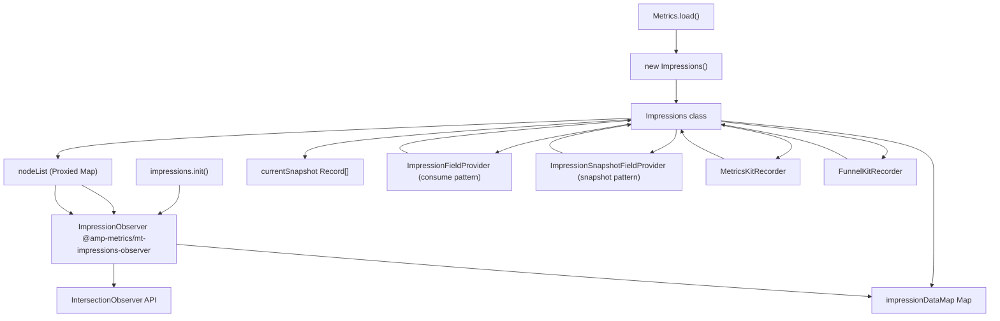
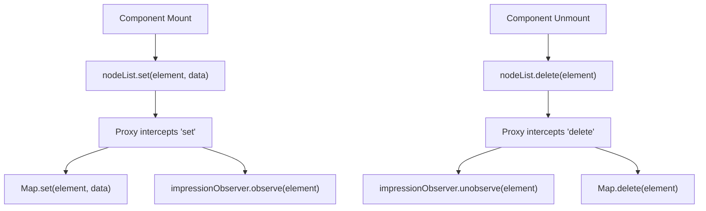
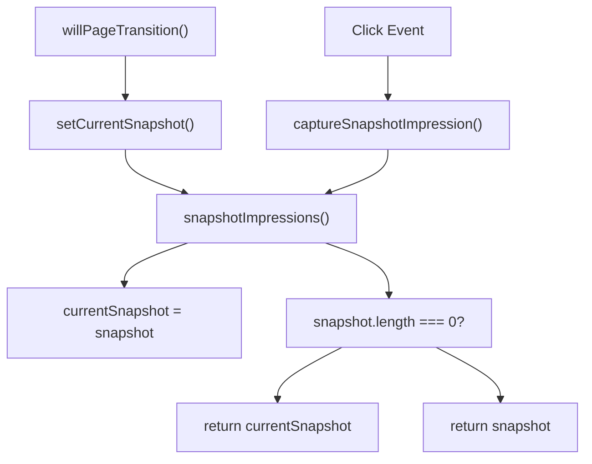

# 曝光追踪 (Impressions Tracking)

-   [shared/metrics-8/src/impression-provider.ts](https://github.com/Chesszyh/apps.apple.com/blob/279d0c4d/shared/metrics-8/src/impression-provider.ts)
-   [shared/metrics-8/src/impression-snapshot-provider.ts](https://github.com/Chesszyh/apps.apple.com/blob/279d0c4d/shared/metrics-8/src/impression-snapshot-provider.ts)
-   [shared/metrics-8/src/impressions/index.ts](https://github.com/Chesszyh/apps.apple.com/blob/279d0c4d/shared/metrics-8/src/impressions/index.ts)
-   [shared/metrics-8/src/index.ts](https://github.com/Chesszyh/apps.apple.com/blob/279d0c4d/shared/metrics-8/src/index.ts)
-   [shared/metrics-8/src/recorder/composite.ts](https://github.com/Chesszyh/apps.apple.com/blob/279d0c4d/shared/metrics-8/src/recorder/composite.ts)
-   [shared/metrics-8/src/recorder/funnelkit.ts](https://github.com/Chesszyh/apps.apple.com/blob/279d0c4d/shared/metrics-8/src/recorder/funnelkit.ts)
-   [shared/metrics-8/src/recorder/logging.ts](https://github.com/Chesszyh/apps.apple.com/blob/279d0c4d/shared/metrics-8/src/recorder/logging.ts)
-   [shared/metrics-8/src/recorder/metricskit.ts](https://github.com/Chesszyh/apps.apple.com/blob/279d0c4d/shared/metrics-8/src/recorder/metricskit.ts)
-   [shared/metrics-8/src/recorder/void.ts](https://github.com/Chesszyh/apps.apple.com/blob/279d0c4d/shared/metrics-8/src/recorder/void.ts)
-   [src/jet/metrics/providers/StorefrontFieldsProvider.ts](https://github.com/Chesszyh/apps.apple.com/blob/279d0c4d/src/jet/metrics/providers/StorefrontFieldsProvider.ts)
-   [src/jet/metrics/providers/index.ts](https://github.com/Chesszyh/apps.apple.com/blob/279d0c4d/src/jet/metrics/providers/index.ts)

## 目的与范围 (Purpose and Scope)

本文档解释了曝光追踪子系统，该系统监控 UI 元素何时对用户变得可见，并通过指标流水线报告此数据。该系统使用 IntersectionObserver 来检测元素可见性，维护可追踪节点的注册表，并集成了 MetricsKit 和 FunnelKit 记录器。

有关包括流水线处理和字段聚合在内的更广泛指标架构，请参阅 [Metrics Pipeline](#3.1)。有关如何将曝光数据交付给外部服务的详细信息，请参阅 [Event Recorders](#3.2)。有关创建自定义指标提供程序的信息，请参阅 [Metrics Providers](#3.4)。

## 架构概览 (Architecture Overview)

曝光系统由一个包装 MetricsKit 曝光观察者库的适配器类、一个自动观察/停止观察 DOM 节点的代理 Map，以及两个在不同事件处理阶段将曝光数据注入指标流水线的字段提供程序组成。


**来源：**

-   [shared/metrics-8/src/index.ts146-154](https://github.com/Chesszyh/apps.apple.com/blob/279d0c4d/shared/metrics-8/src/index.ts#L146-L154)
-   [shared/metrics-8/src/index.ts236-242](https://github.com/Chesszyh/apps.apple.com/blob/279d0c4d/shared/metrics-8/src/index.ts#L236-L242)
-   [shared/metrics-8/src/impressions/index.ts19-191](https://github.com/Chesszyh/apps.apple.com/blob/279d0c4d/shared/metrics-8/src/impressions/index.ts#L19-L191)
-   [shared/metrics-8/src/impression-provider.ts1-27](https://github.com/Chesszyh/apps.apple.com/blob/279d0c4d/shared/metrics-8/src/impression-provider.ts#L1-L27)
-   [shared/metrics-8/src/impression-snapshot-provider.ts1-27](https://github.com/Chesszyh/apps.apple.com/blob/279d0c4d/shared/metrics-8/src/impression-snapshot-provider.ts#L1-L27)

## Impressions 类 (Impressions Class)

`Impressions` 类充当应用程序与 MetricsKit 曝光观察者库之间的适配器。它分两个阶段初始化：在 `Metrics.load()` 期间进行同步构造，以及在 `@amp-metrics/mt-impressions-observer` 模块加载后进行异步初始化。

### 初始化 (Initialization)

| 阶段 | 方法 | 依赖项 | 用途 |
| --- | --- | --- | --- |
| **构造** | `new Impressions()` | LoggerFactory, 上下文映射, ImpressionSettings | 创建实例，存储在上下文中 |
| **异步初始化** | `impressions.init()` | newInstanceWithMetricsConfig, ClickstreamProcessor | 使用委托设置 ImpressionObserver |

构造函数将 Impressions 实例存储在应用程序上下文映射中，键为 `'impressions'`，从而使组件能够通过上下文检索进行访问。

> **[Mermaid sequence]**
> *(图表结构无法解析)*

**来源：**

-   [shared/metrics-8/src/index.ts146-154](https://github.com/Chesszyh/apps.apple.com/blob/279d0c4d/shared/metrics-8/src/index.ts#L146-L154)
-   [shared/metrics-8/src/impressions/index.ts27-86](https://github.com/Chesszyh/apps.apple.com/blob/279d0c4d/shared/metrics-8/src/impressions/index.ts#L27-L86)
-   [shared/metrics-8/src/index.ts211-242](https://github.com/Chesszyh/apps.apple.com/blob/279d0c4d/shared/metrics-8/src/index.ts#L211-L242)

### 曝光数据 Map (Impression Data Map)

`impressionDataMap` 是一个 `Map<HTMLElement, any>`，存储与每个被追踪 DOM 节点关联的指标数据。当一个节点被添加到这个 Map 中时，它将排队等待观察。一旦 ImpressionObserver 初始化完成，它将观察所有排队的节点。

`extractImpressionInfo` 委托从此 Map 中检索数据，并通过向上遍历 DOM 树、从同样被追踪的父节点收集位置数据来丰富位置信息。

**来源：**

-   [shared/metrics-8/src/impressions/index.ts23](https://github.com/Chesszyh/apps.apple.com/blob/279d0c4d/shared/metrics-8/src/impressions/index.ts#L23-L23)
-   [shared/metrics-8/src/impressions/index.ts54-76](https://github.com/Chesszyh/apps.apple.com/blob/279d0c4d/shared/metrics-8/src/impressions/index.ts#L54-L76)

## 代理 NodeList 模式 (Proxied NodeList Pattern)

曝光系统暴露了一个 `nodeList` getter，它返回一个围绕 `impressionDataMap` 的代理 (Proxy)。该代理拦截 `set()` 和 `delete()` 操作，以自动使用 ImpressionObserver 观察和取消观察节点。

### 代理行为 (Proxy Behavior)

| 操作 | 原始行为 | 代理行为 |
| --- | --- | --- |
| `nodeList.set(node, data)` | 添加到 Map | 添加到 Map + `observe(node)` |
| `nodeList.delete(node)` | 从 Map 中移除 | `unobserve(node)` + 从 Map 中移除 |
| `nodeList.get(node)` | 检索值 | 检索值（保持不变） |

这种模式确保了曝光追踪会在组件注册其 DOM 节点时自动开始，并在组件卸载时停止，而无需进行显式的观察生命周期管理。


**来源：**

-   [shared/metrics-8/src/impressions/index.ts141-190](https://github.com/Chesszyh/apps.apple.com/blob/279d0c4d/shared/metrics-8/src/impressions/index.ts#L141-L190)

### 实现细节 (Implementation Details)

代理是使用 JavaScript 的 `Proxy` API 实现的，具有 `get` 和 `set` 拦截器：

-   `get` 拦截器拦截属性访问，并为 `'set'` 和 `'delete'` 操作返回修改后的函数
-   当访问 `'set'` 时，返回的函数在初始化后会调用 `observe()`，然后委托给原始 Map 的 `set()` 方法
-   当访问 `'delete'` 时，返回的函数在初始化后会调用 `unobserve()`，然后委托给原始 Map 的 `delete()` 方法
-   所有其他操作都原样转发给原始 Map

**来源：**

-   [shared/metrics-8/src/impressions/index.ts144-189](https://github.com/Chesszyh/apps.apple.com/blob/279d0c4d/shared/metrics-8/src/impressions/index.ts#L144-L189)

## 捕获模式 (Capture Patterns)

曝光系统提供了两种不同的捕获曝光数据的模式：**消耗 (consume)** 和 **快照 (snapshot)**。这些模式服务于指标流水线中不同的用例。

### 消耗模式 (Consume Pattern)

消耗模式检索所有累积的曝光数据并清除内部状态。这是将曝光作为独立事件报告或在用户导航离开页面时报告的主要方法。

**方法：** `consumeImpressions(): Record<string, unknown>[] | undefined`

**行为：**

-   调用 `impressionObserver.consumeImpressions()`
-   返回累积的曝光数据
-   清除观察者的内部累积
-   如果尚未初始化则返回 `undefined`

**用例：**

-   记录页面退出事件的曝光
-   记录导航点击事件的曝光
-   生成独立的 "impressions" 事件类型

**来源：**

-   [shared/metrics-8/src/impressions/index.ts102-109](https://github.com/Chesszyh/apps.apple.com/blob/279d0c4d/shared/metrics-8/src/impressions/index.ts#L102-L109)

### 快照模式 (Snapshot Pattern)

快照模式捕获当前的曝光状态，而不清除累积。这允许将曝光数据附加到点击事件上，同时保留数据以便稍后在页面退出时消耗。

**方法：** `captureSnapshotImpression(): Record<string, unknown>[] | undefined`

**行为：**

-   调用 `impressionObserver.snapshotImpressions()`
-   返回当前的曝光状态
-   **不**清除内部累积
-   如果快照为空（页面已转换），则回退到 `currentSnapshot`

**用例：**

-   将曝光上下文附加到点击事件
-   在导航操作中包含曝光状态
-   在不消耗累积的情况下提供曝光数据

**来源：**

-   [shared/metrics-8/src/impressions/index.ts111-121](https://github.com/Chesszyh/apps.apple.com/blob/279d0c4d/shared/metrics-8/src/impressions/index.ts#L111-L121)

### 当前快照缓存 (Current Snapshot Cache)

`currentSnapshot` 属性缓存在页面转换期间拍摄的最新快照。该缓存由 `setCurrentSnapshot()` 填充，该方法由 `Metrics.willPageTransition()` 在页面更改之前调用。


**来源：**

-   [shared/metrics-8/src/impressions/index.ts131-139](https://github.com/Chesszyh/apps.apple.com/blob/279d0c4d/shared/metrics-8/src/impressions/index.ts#L131-L139)
-   [shared/metrics-8/src/index.ts284-286](https://github.com/Chesszyh/apps.apple.com/blob/279d0c4d/shared/metrics-8/src/index.ts#L284-L286)
-   [shared/metrics-8/src/impressions/index.ts111-121](https://github.com/Chesszyh/apps.apple.com/blob/279d0c4d/shared/metrics-8/src/impressions/index.ts#L111-L121)

## 与事件记录器的集成 (Integration with Event Recorders)

`MetricsKitRecorder` 和 `FunnelKitRecorder` 都集成了曝光系统，以便在事件生命周期的适当时间捕获和报告曝光数据。

### MetricsKit 集成 (MetricsKit Integration)

MetricsKitRecorder 在构造期间接收 Impressions 实例，并根据事件类型调用曝光捕获。

#### 退出/导航时消耗 (Consume on Exit/Navigate)

当记录 `exit` 事件或 `actionType: 'navigate'` 的 `click` 事件时，记录器会消耗累积的曝光，并将其作为单独的 "impressions" 事件记录：

**事件流：**

1.  检测退出事件或导航点击
2.  调用 `impressions.consumeImpressions()`
3.  通过 `eventHandlers['impressions'].metricsData()` 创建曝光事件
4.  记录带有主题的事件
5.  发送到 MetricsKit 服务

**来源：**

-   [shared/metrics-8/src/recorder/metricskit.ts86-122](https://github.com/Chesszyh/apps.apple.com/blob/279d0c4d/shared/metrics-8/src/recorder/metricskit.ts#L86-L122)

#### 点击/曝光时快照 (Snapshot on Click/Impressions)

在记录 `click` 或 `impressions` 事件时，记录器会捕获快照并将其附加到事件数据中，而不会消耗累积：

**事件流：**

1.  检测点击或曝光事件
2.  调用 `impressions.captureSnapshotImpression()`
3.  将快照合并到事件字段中：`{ ...eventFields, ...impressionsData }`
4.  使用丰富的数据记录事件

**来源：**

-   [shared/metrics-8/src/recorder/metricskit.ts126-137](https://github.com/Chesszyh/apps.apple.com/blob/279d0c4d/shared/metrics-8/src/recorder/metricskit.ts#L126-L137)
-   [shared/metrics-8/src/recorder/metricskit.ts142-155](https://github.com/Chesszyh/apps.apple.com/blob/279d0c4d/shared/metrics-8/src/recorder/metricskit.ts#L142-L155)

### FunnelKit 集成 (FunnelKit Integration)

FunnelKitRecorder 遵循与 MetricsKitRecorder 相同的模式，在退出/导航时消耗曝光，在点击/曝光事件上拍摄快照。主要区别在于主题处理和 PII 过滤。

**来源：**

-   [shared/metrics-8/src/recorder/funnelkit.ts83-118](https://github.com/Chesszyh/apps.apple.com/blob/279d0c4d/shared/metrics-8/src/recorder/funnelkit.ts#L83-L118)
-   [shared/metrics-8/src/recorder/funnelkit.ts122-135](https://github.com/Chesszyh/apps.apple.com/blob/279d0c4d/shared/metrics-8/src/recorder/funnelkit.ts#L122-L135)

### 事件类型矩阵 (Event Type Matrix)

| 事件类型 | 是否消耗曝光？ | 是否快照曝光？ | 备注 |
| --- | --- | --- | --- |
| `exit` | 是 | 否 | 将累积的曝光记录为单独事件 |
| `click` 且 `actionType: 'navigate'` | 是 | 是 | 消耗用于单独事件，快照用于点击事件 |
| `click` (其他) | 否 | 是 | 将快照附加到点击事件 |
| `impressions` | 否 | 是 | 将快照附加到曝光事件 |
| 其他事件 | 否 | 否 | 无曝光处理 |

**来源：**

-   [shared/metrics-8/src/recorder/metricskit.ts86-155](https://github.com/Chesszyh/apps.apple.com/blob/279d0c4d/shared/metrics-8/src/recorder/metricskit.ts#L86-L155)

## 字段提供程序 (Field Providers)

两个字段提供程序在指标流水线的不同阶段注入曝光数据，分别实现了消耗和快照模式。

### ImpressionFieldProvider

**用途：** 当启用 `captureType: 'jet'` 时，向指标事件添加消耗的曝光。

**模式：** 消耗

**调用：** 在选择加入 'impressions' 提供程序的事件的指标字段聚合期间调用。

**实现：**

```
if (impressionInstance?.settings?.captureType === 'jet') {
    let impressions = impressionInstance.consumeImpressions();
    builder.addValue(impressions, 'impressions');
}
```
**来源：**

-   [shared/metrics-8/src/impression-provider.ts9-27](https://github.com/Chesszyh/apps.apple.com/blob/279d0c4d/shared/metrics-8/src/impression-provider.ts#L9-L27)

### ImpressionSnapshotFieldProvider

**用途：** 当启用 `captureType: 'jet'` 时，向指标事件添加曝光快照。

**模式：** 快照

**调用：** 在选择加入 'impressionsSnapshot' 提供程序的事件的指标字段聚合期间调用。

**实现：**

```
if (impressionInstance?.settings?.captureType === 'jet') {
    let impressions = impressionInstance.captureSnapshotImpression();
    builder.addValue(impressions, 'impressions');
}
```
**来源：**

-   [shared/metrics-8/src/impression-snapshot-provider.ts9-27](https://github.com/Chesszyh/apps.apple.com/blob/279d0c4d/shared/metrics-8/src/impression-snapshot-provider.ts#L9-L27)

### 提供程序注册 (Provider Registration)

这两个提供程序在聚合器设置期间都被注册为选择性加入提供程序：

```
aggregator.addOptInProvider(
    new ImpressionFieldProvider(context),
    'impressions',
);

aggregator.addOptInProvider(
    new ImpressionSnapshotFieldProvider(context),
    'impressionsSnapshot',
);
```
**来源：**

-   [shared/metrics-8/src/index.ts537-545](https://github.com/Chesszyh/apps.apple.com/blob/279d0c4d/shared/metrics-8/src/index.ts#L537-L545)

## 配置与设置 (Configuration and Settings)

曝光系统通过传递给 `Metrics.load()` 的 `ImpressionSettings` 进行配置。

### ImpressionSettings 接口 (ImpressionSettings Interface)

| 属性 | 类型 | 用途 |
| --- | --- | --- |
| `captureType` | `'jet'` | 控制 Jet 是否通过提供程序管理曝光捕获 |
| `metricsKitEvents` | `Array<'click' | 'exit' | 'impressions'>` | 指定哪些事件触发曝光捕获 |

**来源：**

-   [shared/metrics-8/src/impressions/types.ts](https://github.com/Chesszyh/apps.apple.com/blob/279d0c4d/shared/metrics-8/src/impressions/types.ts)（引用）
-   [shared/metrics-8/src/index.ts60](https://github.com/Chesszyh/apps.apple.com/blob/279d0c4d/shared/metrics-8/src/index.ts#L60-L60)

### 启用/禁用逻辑 (Enable/Disable Logic)

`Impressions.isEnabled()` 方法确定是否应针对特定的事件类型进行曝光捕获：

**逻辑：**

-   如果 `captureType === 'jet'`：检查事件类型是否在 `metricsKitEvents` 数组中
-   否则：返回 `true`（对所有事件启用）

**在记录器中的用法：**

```
if (this.impressions?.isEnabled('exit') && eventHandler === 'exit') {
    const accumulatedImpressions = this.impressions.consumeImpressions();
    // ... 记录曝光事件
}
```
**来源：**

-   [shared/metrics-8/src/impressions/index.ts92-100](https://github.com/Chesszyh/apps.apple.com/blob/279d0c4d/shared/metrics-8/src/impressions/index.ts#L92-L100)
-   [shared/metrics-8/src/recorder/metricskit.ts87-88](https://github.com/Chesszyh/apps.apple.com/blob/279d0c4d/shared/metrics-8/src/recorder/metricskit.ts#L87-L88)

### 初始化闸门 (Initialization Gate)

仅当 `shouldEnableImpressions()` 返回 `true` 时，曝光系统才会初始化：

```
if (settings.shouldEnableImpressions?.() ?? false) {
    impressions = new Impressions(
        loggerFactory,
        context,
        settings?.impressions,
    );
}
```
如果未启用，`impressions` 将保持为 `undefined`，并跳过所有与曝光相关的逻辑。

**来源：**

-   [shared/metrics-8/src/index.ts148-154](https://github.com/Chesszyh/apps.apple.com/blob/279d0c4d/shared/metrics-8/src/index.ts#L148-L154)

## 数据流图 (Data Flow Diagram)

该图表说明了从 DOM 节点注册到曝光捕获再到事件记录的完整流程。

> **[Mermaid sequence]**
> *(图表结构无法解析)*

**来源：**

-   [shared/metrics-8/src/impressions/index.ts141-190](https://github.com/Chesszyh/apps.apple.com/blob/279d0c4d/shared/metrics-8/src/impressions/index.ts#L141-L190)
-   [shared/metrics-8/src/recorder/metricskit.ts86-122](https://github.com/Chesszyh/apps.apple.com/blob/279d0c4d/shared/metrics-8/src/recorder/metricskit.ts#L86-L122)
-   [shared/metrics-8/src/impressions/index.ts102-109](https://github.com/Chesszyh/apps.apple.com/blob/279d0c4d/shared/metrics-8/src/impressions/index.ts#L102-L109)

## 服务器端行为 (Server-Side Behavior)

在服务器端，曝光是被禁用的。`generateServerImpressionsContextGetter()` 函数返回一个具有空 WeakMap 和存根 (stub) 方法的无操作 (no-op) 实现。

**服务器实现：**

```
class ServerNoopImpressions implements ImpressionsInstance {
    readonly nodeList: WeakMap<any, any>;
    constructor() {
        this.nodeList = new WeakMap();
    }
    setCurrentSnapshot(): void {}
}
```
这确保了组件在服务器端渲染期间可以安全地调用与曝光相关的方法而不会出错，同时不会产生实际的曝光追踪。

**来源：**

-   [shared/metrics-8/src/impressions/index.ts196-202](https://github.com/Chesszyh/apps.apple.com/blob/279d0c4d/shared/metrics-8/src/impressions/index.ts#L196-L202)
-   [shared/metrics-8/src/impressions/index.ts240-252](https://github.com/Chesszyh/apps.apple.com/blob/279d0c4d/shared/metrics-8/src/impressions/index.ts#L240-L252)
