# Introduction to Dify

Relevant source files

-   [README.md](https://github.com/langgenius/dify/blob/92dbc94f/README.md)
-   [api/.env.example](https://github.com/langgenius/dify/blob/92dbc94f/api/.env.example)
-   [api/app.py](https://github.com/langgenius/dify/blob/92dbc94f/api/app.py)
-   [api/app\_factory.py](https://github.com/langgenius/dify/blob/92dbc94f/api/app_factory.py)
-   [api/commands.py](https://github.com/langgenius/dify/blob/92dbc94f/api/commands.py)
-   [api/configs/feature/\_\_init\_\_.py](https://github.com/langgenius/dify/blob/92dbc94f/api/configs/feature/__init__.py)
-   [api/configs/middleware/\_\_init\_\_.py](https://github.com/langgenius/dify/blob/92dbc94f/api/configs/middleware/__init__.py)
-   [api/configs/packaging/\_\_init\_\_.py](https://github.com/langgenius/dify/blob/92dbc94f/api/configs/packaging/__init__.py)
-   [api/controllers/console/datasets/datasets.py](https://github.com/langgenius/dify/blob/92dbc94f/api/controllers/console/datasets/datasets.py)
-   [api/core/rag/datasource/vdb/vector\_factory.py](https://github.com/langgenius/dify/blob/92dbc94f/api/core/rag/datasource/vdb/vector_factory.py)
-   [api/core/rag/datasource/vdb/vector\_type.py](https://github.com/langgenius/dify/blob/92dbc94f/api/core/rag/datasource/vdb/vector_type.py)
-   [api/extensions/ext\_storage.py](https://github.com/langgenius/dify/blob/92dbc94f/api/extensions/ext_storage.py)
-   [api/extensions/storage/storage\_type.py](https://github.com/langgenius/dify/blob/92dbc94f/api/extensions/storage/storage_type.py)
-   [api/pyproject.toml](https://github.com/langgenius/dify/blob/92dbc94f/api/pyproject.toml)
-   [api/tests/unit\_tests/configs/test\_dify\_config.py](https://github.com/langgenius/dify/blob/92dbc94f/api/tests/unit_tests/configs/test_dify_config.py)
-   [api/uv.lock](https://github.com/langgenius/dify/blob/92dbc94f/api/uv.lock)
-   [dev/pytest/pytest\_vdb.sh](https://github.com/langgenius/dify/blob/92dbc94f/dev/pytest/pytest_vdb.sh)
-   [docker/.env.example](https://github.com/langgenius/dify/blob/92dbc94f/docker/.env.example)
-   [docker/docker-compose-template.yaml](https://github.com/langgenius/dify/blob/92dbc94f/docker/docker-compose-template.yaml)
-   [docker/docker-compose.middleware.yaml](https://github.com/langgenius/dify/blob/92dbc94f/docker/docker-compose.middleware.yaml)
-   [docker/docker-compose.yaml](https://github.com/langgenius/dify/blob/92dbc94f/docker/docker-compose.yaml)
-   [docker/middleware.env.example](https://github.com/langgenius/dify/blob/92dbc94f/docker/middleware.env.example)
-   [web/package.json](https://github.com/langgenius/dify/blob/92dbc94f/web/package.json)

## Purpose and Scope

This document provides a high-level introduction to the Dify platform, covering its purpose, key features, deployment options, and fundamental architecture concepts. This overview establishes the context for understanding the detailed subsystems documented in subsequent pages.

For detailed information about specific areas, see:

-   System architecture details: [System Architecture Overview](/langgenius/dify/2-system-architecture-overview)
-   Docker orchestration and services: [Service Orchestration and Docker Compose](/langgenius/dify/2.1-service-topology-and-docker-compose)
-   Data models and relationships: [Core Data Models and Domain Entities](/langgenius/dify/2.2-core-data-models-and-domain-entities)
-   Knowledge base implementation: [Knowledge Base and RAG System](/langgenius/dify/4-knowledge-base-and-rag-system)
-   Workflow execution engine: [Workflow and Application Execution](/langgenius/dify/5-workflow-system-and-node-execution)
-   API integration patterns: [Service APIs and External Integration](/langgenius/dify/8-service-apis)
-   Frontend architecture: [Web Frontend Architecture](/langgenius/dify/9-web-frontend-architecture)

## What is Dify?

Dify is an open-source platform for developing LLM (Large Language Model) applications. It provides an intuitive interface that combines agentic AI workflows, RAG (Retrieval-Augmented Generation) pipelines, agent capabilities, model management, and observability features to help developers quickly move from prototype to production.

The platform is built on a multi-service architecture with clear separation of concerns:

| Component | Technology | Primary Location |
| --- | --- | --- |
| Backend API | Flask (Python 3.11+) | [api/](https://github.com/langgenius/dify/blob/92dbc94f/api/) |
| Async Workers | Celery | [api/tasks/](https://github.com/langgenius/dify/blob/92dbc94f/api/tasks/) |
| Frontend | Next.js 15 (React 19 + TypeScript) | [web/](https://github.com/langgenius/dify/blob/92dbc94f/web/) |
| Primary Database | PostgreSQL/MySQL | [api/models/](https://github.com/langgenius/dify/blob/92dbc94f/api/models/) |
| Cache & Queue | Redis | Configuration in [docker/docker-compose.yaml](https://github.com/langgenius/dify/blob/92dbc94f/docker/docker-compose.yaml) |
| Vector Storage | 30+ providers | [api/core/rag/datasource/vdb/](https://github.com/langgenius/dify/blob/92dbc94f/api/core/rag/datasource/vdb/) |
| File Storage | S3/Azure/Aliyun/OpenDAL | [api/extensions/storage/](https://github.com/langgenius/dify/blob/92dbc94f/api/extensions/storage/) |
| Code Sandbox | Dify Sandbox (Go) | [docker/docker-compose.yaml248-270](https://github.com/langgenius/dify/blob/92dbc94f/docker/docker-compose.yaml#L248-L270) |
| Plugin System | Plugin Daemon (Go) | [docker/docker-compose.yaml272-334](https://github.com/langgenius/dify/blob/92dbc94f/docker/docker-compose.yaml#L272-L334) |

Sources: [api/pyproject.toml4](https://github.com/langgenius/dify/blob/92dbc94f/api/pyproject.toml#L4-L4) [web/package.json116-122](https://github.com/langgenius/dify/blob/92dbc94f/web/package.json#L116-L122) [docker/docker-compose.yaml1-500](https://github.com/langgenius/dify/blob/92dbc94f/docker/docker-compose.yaml#L1-L500) [api/core/rag/datasource/vdb/vector\_type.py1-37](https://github.com/langgenius/dify/blob/92dbc94f/api/core/rag/datasource/vdb/vector_type.py#L1-L37)

## System Architecture Overview

The following diagram shows the deployment architecture with service topology, mapping to actual Docker services and code locations:

**Deployment Architecture and Service Topology:**

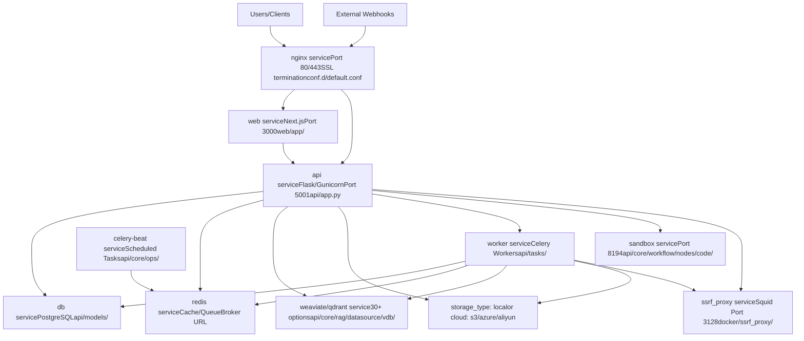
**Service Orchestration:**

The platform runs as Docker services defined in [docker/docker-compose.yaml](https://github.com/langgenius/dify/blob/92dbc94f/docker/docker-compose.yaml) The same `langgenius/dify-api` image runs in different modes via the `MODE` environment variable:

| Service Name | Image | Mode/Port | Purpose | Entry Point |
| --- | --- | --- | --- | --- |
| `api` | `langgenius/dify-api:1.11.4` | `MODE=api` Port 5001 | Flask API server with Gunicorn | [docker/entrypoint.sh](https://github.com/langgenius/dify/blob/92dbc94f/docker/entrypoint.sh) → [api/app.py](https://github.com/langgenius/dify/blob/92dbc94f/api/app.py) |
| `worker` | `langgenius/dify-api:1.11.4` | `MODE=worker` | Celery async task processing | [docker/entrypoint.sh](https://github.com/langgenius/dify/blob/92dbc94f/docker/entrypoint.sh) → `celery worker` |
| `worker_beat` | `langgenius/dify-api:1.11.4` | `MODE=beat` | Celery Beat scheduler | [docker/entrypoint.sh](https://github.com/langgenius/dify/blob/92dbc94f/docker/entrypoint.sh) → `celery beat` |
| `web` | `langgenius/dify-web:1.11.4` | Port 3000 | Next.js frontend | [web/docker/entrypoint.sh](https://github.com/langgenius/dify/blob/92dbc94f/web/docker/entrypoint.sh) |
| `db_postgres` | `postgres:15-alpine` | Port 5432 | PostgreSQL database | SQLAlchemy models in [api/models/](https://github.com/langgenius/dify/blob/92dbc94f/api/models/) |
| `redis` | `redis:6-alpine` | Port 6379 | Cache and Celery broker | `CELERY_BROKER_URL` in `.env` |
| `nginx` | `langgenius/dify-nginx` | Ports 80/443 | Reverse proxy | [docker/nginx/conf.d/default.conf](https://github.com/langgenius/dify/blob/92dbc94f/docker/nginx/conf.d/default.conf) |
| `weaviate` | `semitechnologies/weaviate` | Port 8080 | Vector database (default) | [api/core/rag/datasource/vdb/weaviate/](https://github.com/langgenius/dify/blob/92dbc94f/api/core/rag/datasource/vdb/weaviate/) |
| `sandbox` | `langgenius/dify-sandbox:0.2.12` | Port 8194 | Isolated code execution | [api/core/workflow/nodes/code/](https://github.com/langgenius/dify/blob/92dbc94f/api/core/workflow/nodes/code/) |
| `plugin_daemon` | `langgenius/dify-plugin-daemon:0.5.2` | Port 5002 | Plugin management and execution | [docker/docker-compose.yaml272-334](https://github.com/langgenius/dify/blob/92dbc94f/docker/docker-compose.yaml#L272-L334) |
| `ssrf_proxy` | `ubuntu/squid` | Port 3128 | SSRF protection proxy | [docker/ssrf\_proxy/squid.conf.template](https://github.com/langgenius/dify/blob/92dbc94f/docker/ssrf_proxy/squid.conf.template) |

**API Structure:**

The Flask application in [api/app.py](https://github.com/langgenius/dify/blob/92dbc94f/api/app.py) creates multiple blueprints:

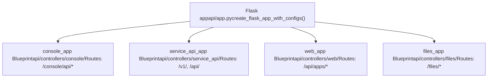
| Blueprint | URL Prefix | Authentication | Purpose |
| --- | --- | --- | --- |
| `console_app` | `/console/api` | Session-based | Admin/developer operations |
| `service_api_app` | `/v1`, `/api` | API key bearer token | Public app execution API |
| `web_app` | `/api/apps` | End-user token | Embedded app interface |
| `files_app` | `/files` | Signed URLs | File downloads |

Sources: [docker/docker-compose.yaml1-200](https://github.com/langgenius/dify/blob/92dbc94f/docker/docker-compose.yaml#L1-L200) [docker/entrypoint.sh1-50](https://github.com/langgenius/dify/blob/92dbc94f/docker/entrypoint.sh#L1-L50) [api/app.py1-150](https://github.com/langgenius/dify/blob/92dbc94f/api/app.py#L1-L150) [api/controllers/console/\_\_init\_\_.py1-50](https://github.com/langgenius/dify/blob/92dbc94f/api/controllers/console/__init__.py#L1-L50) [api/controllers/service\_api/\_\_init\_\_.py1-50](https://github.com/langgenius/dify/blob/92dbc94f/api/controllers/service_api/__init__.py#L1-L50)

## Core Data Models

The platform implements strict multi-tenancy where all major entities are scoped to a `Tenant`. The following diagram shows the primary domain models and their relationships:

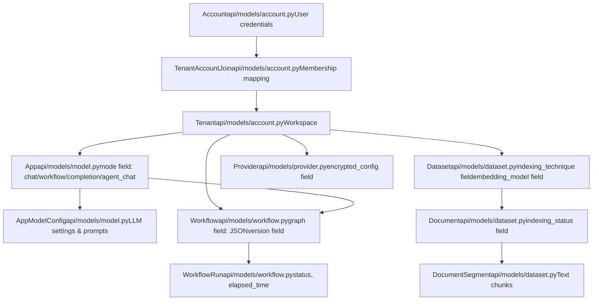
**Key Model Structures:**

| Model Class | Table Name | Key Fields | Purpose |
| --- | --- | --- | --- |
| `Account` | `accounts` | `email`, `password`, `interface_language` | User identity and credentials |
| `Tenant` | `tenants` | `name`, `encrypt_public_key` | Workspace/organization container |
| `TenantAccountJoin` | `tenant_account_joins` | `tenant_id`, `account_id`, `role`, `current` | Membership with RBAC roles |
| `App` | `apps` | `tenant_id`, `mode`, `name` | Application instance |
| `AppModelConfig` | `app_model_configs` | `app_id`, `model`, `configs` | LLM and prompt settings |
| `Dataset` | `datasets` | `tenant_id`, `indexing_technique`, `embedding_model` | Knowledge base configuration |
| `Document` | `documents` | `dataset_id`, `indexing_status`, `data_source_type` | Source document metadata |
| `DocumentSegment` | `document_segments` | `document_id`, `content`, `word_count`, `hit_count` | Indexed text chunks |
| `Workflow` | `workflows` | `tenant_id`, `app_id`, `graph`, `version` | Workflow graph definition |
| `WorkflowRun` | `workflow_runs` | `workflow_id`, `status`, `inputs`, `outputs`, `elapsed_time` | Execution tracking |
| `Provider` | `providers` | `tenant_id`, `provider_name`, `encrypted_config` | Model provider credentials |

For detailed model relationships and service layer implementations, see [Core Data Models and Domain Entities](/langgenius/dify/2.2-core-data-models-and-domain-entities).

Sources: [api/models/account.py1-200](https://github.com/langgenius/dify/blob/92dbc94f/api/models/account.py#L1-L200) [api/models/model.py1-200](https://github.com/langgenius/dify/blob/92dbc94f/api/models/model.py#L1-L200) [api/models/dataset.py1-300](https://github.com/langgenius/dify/blob/92dbc94f/api/models/dataset.py#L1-L300) [api/models/workflow.py1-200](https://github.com/langgenius/dify/blob/92dbc94f/api/models/workflow.py#L1-L200) [api/models/provider.py1-100](https://github.com/langgenius/dify/blob/92dbc94f/api/models/provider.py#L1-L100)

## Key Features and Capabilities

### 1\. Workflow System

Workflows are directed acyclic graphs (DAGs) stored in `Workflow.graph` as JSON. The execution engine is `GraphEngine`, which maintains state in `GraphEngineState` and processes nodes via a `WorkerPool`.

**Workflow Execution Architecture:**

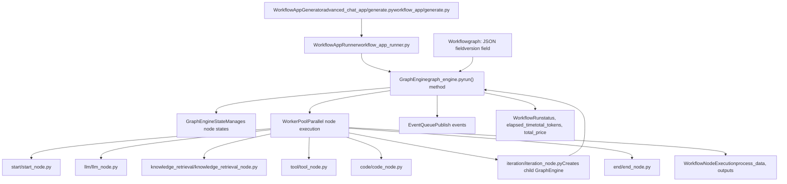
**Key Node Types:**

| Node Type | Module Path | Execution Method | Purpose |
| --- | --- | --- | --- |
| Start | [api/core/workflow/nodes/start/start\_node.py](https://github.com/langgenius/dify/blob/92dbc94f/api/core/workflow/nodes/start/start_node.py) | `_run()` | Graph entry point |
| LLM | [api/core/workflow/nodes/llm/llm\_node.py](https://github.com/langgenius/dify/blob/92dbc94f/api/core/workflow/nodes/llm/llm_node.py) | `_run()` | Text generation via ModelInstance |
| Knowledge Retrieval | [api/core/workflow/nodes/knowledge\_retrieval/knowledge\_retrieval\_node.py](https://github.com/langgenius/dify/blob/92dbc94f/api/core/workflow/nodes/knowledge_retrieval/knowledge_retrieval_node.py) | `_run()` | RAG using DatasetRetrieval |
| Code | [api/core/workflow/nodes/code/code\_node.py](https://github.com/langgenius/dify/blob/92dbc94f/api/core/workflow/nodes/code/code_node.py) | `_run()` | Python/JS in CodeExecutor sandbox |
| Tool | [api/core/workflow/nodes/tool/tool\_node.py](https://github.com/langgenius/dify/blob/92dbc94f/api/core/workflow/nodes/tool/tool_node.py) | `_run()` | Invoke ToolRuntime |
| If/Else | [api/core/workflow/nodes/if\_else/if\_else\_node.py](https://github.com/langgenius/dify/blob/92dbc94f/api/core/workflow/nodes/if_else/if_else_node.py) | `_run()` | Conditional routing |
| Iteration | [api/core/workflow/nodes/iteration/iteration\_node.py](https://github.com/langgenius/dify/blob/92dbc94f/api/core/workflow/nodes/iteration/iteration_node.py) | `_run()` | Loop creating child GraphEngine |
| End | [api/core/workflow/nodes/end/end\_node.py](https://github.com/langgenius/dify/blob/92dbc94f/api/core/workflow/nodes/end/end_node.py) | `_run()` | Graph exit point |

**State Management:**

The `GraphEngineState` in [api/core/workflow/graph\_engine/entities/graph\_engine\_state.py](https://github.com/langgenius/dify/blob/92dbc94f/api/core/workflow/graph_engine/entities/graph_engine_state.py) tracks:

-   `node_parallel_mapping`: Maps nodes to execution queues
-   `node_state_mapping`: Tracks `NodeRunState` for each node
-   `node_run_result_mapping`: Stores `NodeRunResult` outputs

For detailed workflow execution, see [Graph Engine and Workflow Orchestration](/langgenius/dify/5.1-workflow-definition-and-execution-model).

Sources: [api/core/workflow/graph\_engine/graph\_engine.py1-500](https://github.com/langgenius/dify/blob/92dbc94f/api/core/workflow/graph_engine/graph_engine.py#L1-L500) [api/core/workflow/nodes/](https://github.com/langgenius/dify/blob/92dbc94f/api/core/workflow/nodes/) [api/models/workflow.py1-200](https://github.com/langgenius/dify/blob/92dbc94f/api/models/workflow.py#L1-L200) [api/core/app/apps/workflow\_app\_runner.py1-100](https://github.com/langgenius/dify/blob/92dbc94f/api/core/app/apps/workflow_app_runner.py#L1-L100)

### 2\. Comprehensive Model Support

The platform integrates with 100+ LLM models through the `ModelManager` and `ProviderManager` abstractions:

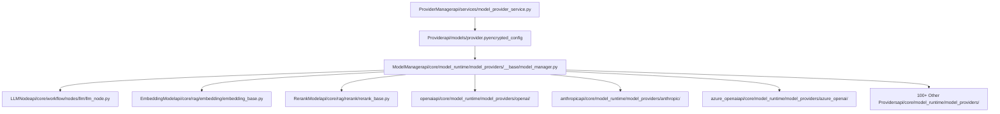
Each provider implements a standardized interface defined in [api/core/model\_runtime/model\_providers/\_\_base/](https://github.com/langgenius/dify/blob/92dbc94f/api/core/model_runtime/model_providers/__base/):

-   `__base/llm_model.py`: Text generation interface
-   `__base/text_embedding_model.py`: Embedding generation interface
-   `__base/rerank_model.py`: Reranking interface
-   `__base/speech2text_model.py`: Audio transcription interface
-   `__base/text2speech_model.py`: TTS interface
-   `__base/moderation_model.py`: Content moderation interface

For model integration details, see [Model Provider Integration](/langgenius/dify/6.3-model-provider-management).

Sources: [README.md90-93](https://github.com/langgenius/dify/blob/92dbc94f/README.md#L90-L93) [api/core/model\_runtime/model\_providers/\_\_base/](https://github.com/langgenius/dify/blob/92dbc94f/api/core/model_runtime/model_providers/__base/) [api/services/model\_provider\_service.py1-200](https://github.com/langgenius/dify/blob/92dbc94f/api/services/model_provider_service.py#L1-L200)

### 3\. RAG Pipeline

The RAG system implements indexing (ETL) and retrieval with multiple strategies:

**Indexing and Retrieval Architecture:**

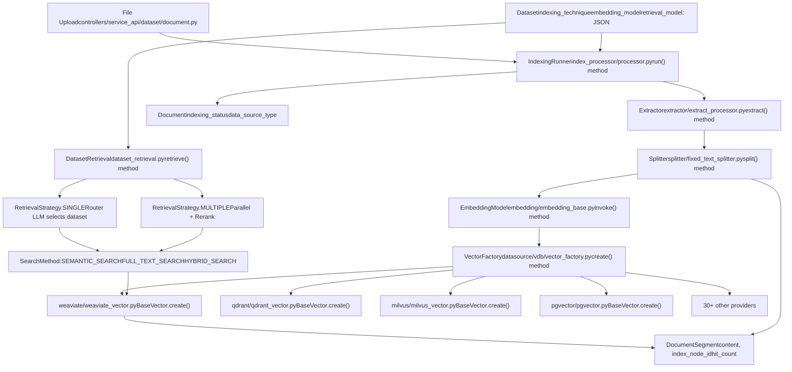
**Retrieval Strategies:**

The `retrieval_model` field in `Dataset` defines retrieval behavior:

| Strategy | Enum Value | Implementation | Behavior |
| --- | --- | --- | --- |
| Single | `SINGLE_RETRIEVAL` | [api/core/rag/retrieval/router/multi\_dataset\_function\_call\_router.py](https://github.com/langgenius/dify/blob/92dbc94f/api/core/rag/retrieval/router/multi_dataset_function_call_router.py) | LLM routes to one dataset |
| Multiple | `MULTIPLE_RETRIEVAL` | [api/core/rag/retrieval/dataset\_retrieval.py](https://github.com/langgenius/dify/blob/92dbc94f/api/core/rag/retrieval/dataset_retrieval.py) | Parallel search + reranking |

**Search Methods:**

| Method | Constant | Implementation Location |
| --- | --- | --- |
| Semantic | `SEMANTIC_SEARCH` | Vector similarity via embedding |
| Full-Text | `FULL_TEXT_SEARCH` | Keyword search (Jieba/BM25) |
| Hybrid | `HYBRID_SEARCH` | Combined semantic + keyword |

**Vector Database Integration:**

The `Vector` factory in [api/core/rag/datasource/vdb/vector\_factory.py](https://github.com/langgenius/dify/blob/92dbc94f/api/core/rag/datasource/vdb/vector_factory.py) supports 30+ providers:

| Provider | Module Path | Vector Type Constant |
| --- | --- | --- |
| Weaviate | [api/core/rag/datasource/vdb/weaviate/weaviate\_vector.py](https://github.com/langgenius/dify/blob/92dbc94f/api/core/rag/datasource/vdb/weaviate/weaviate_vector.py) | `VectorType.WEAVIATE` |
| Qdrant | [api/core/rag/datasource/vdb/qdrant/qdrant\_vector.py](https://github.com/langgenius/dify/blob/92dbc94f/api/core/rag/datasource/vdb/qdrant/qdrant_vector.py) | `VectorType.QDRANT` |
| Milvus | [api/core/rag/datasource/vdb/milvus/milvus\_vector.py](https://github.com/langgenius/dify/blob/92dbc94f/api/core/rag/datasource/vdb/milvus/milvus_vector.py) | `VectorType.MILVUS` |
| PGVector | [api/core/rag/datasource/vdb/pgvector/pgvector.py](https://github.com/langgenius/dify/blob/92dbc94f/api/core/rag/datasource/vdb/pgvector/pgvector.py) | `VectorType.PGVECTOR` |
| Elasticsearch | [api/core/rag/datasource/vdb/elasticsearch/elasticsearch\_vector.py](https://github.com/langgenius/dify/blob/92dbc94f/api/core/rag/datasource/vdb/elasticsearch/elasticsearch_vector.py) | `VectorType.ELASTICSEARCH` |
| Chroma | [api/core/rag/datasource/vdb/chroma/chroma\_vector.py](https://github.com/langgenius/dify/blob/92dbc94f/api/core/rag/datasource/vdb/chroma/chroma_vector.py) | `VectorType.CHROMA` |
| OpenSearch | [api/core/rag/datasource/vdb/opensearch/opensearch\_vector.py](https://github.com/langgenius/dify/blob/92dbc94f/api/core/rag/datasource/vdb/opensearch/opensearch_vector.py) | `VectorType.OPENSEARCH` |
| OceanBase | [api/core/rag/datasource/vdb/oceanbase/oceanbase\_vector.py](https://github.com/langgenius/dify/blob/92dbc94f/api/core/rag/datasource/vdb/oceanbase/oceanbase_vector.py) | `VectorType.OCEANBASE` |

Each implements the `BaseVector` interface from [api/core/rag/datasource/vdb/vector\_base.py](https://github.com/langgenius/dify/blob/92dbc94f/api/core/rag/datasource/vdb/vector_base.py) with methods:

-   `create()`: Index documents
-   `add_texts()`: Add document segments
-   `search_by_vector()`: Vector similarity search
-   `search_by_full_text()`: Keyword search
-   `delete()`: Remove indexed documents

For comprehensive RAG documentation, see [Knowledge Base and RAG System](/langgenius/dify/4-knowledge-base-and-rag-system).

Sources: [api/core/rag/index\_processor/processor.py1-500](https://github.com/langgenius/dify/blob/92dbc94f/api/core/rag/index_processor/processor.py#L1-L500) [api/core/rag/retrieval/dataset\_retrieval.py1-400](https://github.com/langgenius/dify/blob/92dbc94f/api/core/rag/retrieval/dataset_retrieval.py#L1-L400) [api/core/rag/datasource/vdb/vector\_factory.py38-164](https://github.com/langgenius/dify/blob/92dbc94f/api/core/rag/datasource/vdb/vector_factory.py#L38-L164) [api/core/rag/datasource/vdb/vector\_type.py1-37](https://github.com/langgenius/dify/blob/92dbc94f/api/core/rag/datasource/vdb/vector_type.py#L1-L37) [api/models/dataset.py1-300](https://github.com/langgenius/dify/blob/92dbc94f/api/models/dataset.py#L1-L300)

### 4\. Agent Capabilities

The platform provides tools through the `ToolManager` singleton and invokes them via agent runtimes:

**Tool System Architecture:**

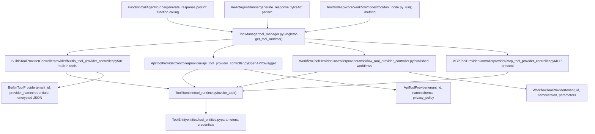
**Built-in Tool Categories:**

Tools are located in [api/core/tools/provider/builtin/](https://github.com/langgenius/dify/blob/92dbc94f/api/core/tools/provider/builtin/) with each provider in a subdirectory:

| Category | Provider Name | Key Tools | Location |
| --- | --- | --- | --- |
| Search | `google` | Google Search, News | [api/core/tools/provider/builtin/google/](https://github.com/langgenius/dify/blob/92dbc94f/api/core/tools/provider/builtin/google/) |
| Image Generation | `dalle`, `stable_diffusion` | DALL-E 3, SD API | [api/core/tools/provider/builtin/dalle/](https://github.com/langgenius/dify/blob/92dbc94f/api/core/tools/provider/builtin/dalle/) |
| Knowledge | `wikipedia`, `wolfram` | Wikipedia search, WolframAlpha | [api/core/tools/provider/builtin/wikipedia/](https://github.com/langgenius/dify/blob/92dbc94f/api/core/tools/provider/builtin/wikipedia/) |
| Productivity | `gmail`, `google_calendar` | Email, Calendar management | [api/core/tools/provider/builtin/gmail/](https://github.com/langgenius/dify/blob/92dbc94f/api/core/tools/provider/builtin/gmail/) |
| Development | `github`, `gitlab` | Repository management | [api/core/tools/provider/builtin/github/](https://github.com/langgenius/dify/blob/92dbc94f/api/core/tools/provider/builtin/github/) |
| Weather | `yahoo_weather` | Weather forecasts | [api/core/tools/provider/builtin/yahoo\_weather/](https://github.com/langgenius/dify/blob/92dbc94f/api/core/tools/provider/builtin/yahoo_weather/) |

Each tool provider contains:

-   `<provider>.yaml`: Provider manifest with display name, icon, credentials
-   `tools/<tool_name>.yaml`: Tool definition with parameters and outputs
-   `tools/<tool_name>.py`: Tool implementation class with `_invoke()` method

**Agent Execution:**

Agents in [api/core/app/apps/agent\_chat/generate\_response.py](https://github.com/langgenius/dify/blob/92dbc94f/api/core/app/apps/agent_chat/generate_response.py) invoke tools via:

1.  LLM decides which tool to call (function calling or ReAct pattern)
2.  `ToolManager.get_tool_runtime()` retrieves the `ToolRuntime`
3.  `ToolRuntime.invoke_tool()` executes with credentials and parameters
4.  Results returned to agent for next iteration

For tool system details, see [Tool Provider Architecture](/langgenius/dify/6.1-tool-provider-architecture).

Sources: [README.md101-102](https://github.com/langgenius/dify/blob/92dbc94f/README.md#L101-L102) [api/core/tools/tool\_manager.py1-200](https://github.com/langgenius/dify/blob/92dbc94f/api/core/tools/tool_manager.py#L1-L200) [api/core/tools/provider/builtin/](https://github.com/langgenius/dify/blob/92dbc94f/api/core/tools/provider/builtin/) [api/core/app/apps/agent\_chat/generate\_response.py1-500](https://github.com/langgenius/dify/blob/92dbc94f/api/core/app/apps/agent_chat/generate_response.py#L1-L500)

### 5\. Backend-as-a-Service APIs

All functionality is exposed via REST APIs with dual response modes:

**API Endpoints:**

| Endpoint | Blueprint | Purpose |
| --- | --- | --- |
| `POST /api/chat-messages` | [api/controllers/service\_api/app/chat.py](https://github.com/langgenius/dify/blob/92dbc94f/api/controllers/service_api/app/chat.py) | Send chat messages |
| `POST /api/completion-messages` | [api/controllers/service\_api/app/completion.py](https://github.com/langgenius/dify/blob/92dbc94f/api/controllers/service_api/app/completion.py) | Text completion |
| `POST /api/workflows/run` | [api/controllers/service\_api/workflow/workflow.py](https://github.com/langgenius/dify/blob/92dbc94f/api/controllers/service_api/workflow/workflow.py) | Execute workflow |
| `POST /api/files/upload` | [api/controllers/service\_api/file/file.py](https://github.com/langgenius/dify/blob/92dbc94f/api/controllers/service_api/file/file.py) | Upload files |
| `POST /api/messages/:id/feedbacks` | [api/controllers/service\_api/app/message.py](https://github.com/langgenius/dify/blob/92dbc94f/api/controllers/service_api/app/message.py) | Submit feedback |

**Response Modes:**

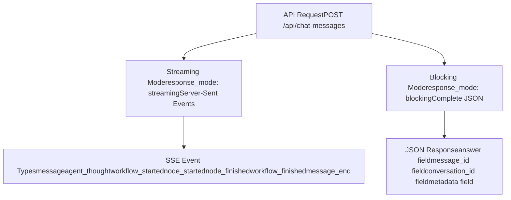
For API integration patterns, see [Service APIs and External Integration](/langgenius/dify/8-service-apis).

Sources: [README.md107-108](https://github.com/langgenius/dify/blob/92dbc94f/README.md#L107-L108) [api/controllers/service\_api/](https://github.com/langgenius/dify/blob/92dbc94f/api/controllers/service_api/)

### 6\. LLMOps and Observability

The platform tracks detailed metrics at multiple levels:

**Execution Tracking:**

| Model | Tracked Metrics | Location |
| --- | --- | --- |
| `WorkflowRun` | `total_tokens`, `total_price`, `elapsed_time`, `status` | [api/models/workflow.py](https://github.com/langgenius/dify/blob/92dbc94f/api/models/workflow.py) |
| `WorkflowNodeExecution` | `process_data`, `outputs`, `execution_metadata` | [api/models/workflow.py](https://github.com/langgenius/dify/blob/92dbc94f/api/models/workflow.py) |
| `Message` | `message_tokens`, `message_unit_price`, `message_price_unit` | [api/models/model.py](https://github.com/langgenius/dify/blob/92dbc94f/api/models/model.py) |
| `MessageFeedback` | `rating`, `content` | [api/models/model.py](https://github.com/langgenius/dify/blob/92dbc94f/api/models/model.py) |
| `MessageAnnotation` | `content`, `question`, `hit_count` | [api/models/model.py](https://github.com/langgenius/dify/blob/92dbc94f/api/models/model.py) |

**Monitoring Integration:**

Grafana dashboards can connect to the PostgreSQL database to visualize metrics. The `MessageAnnotation` model enables continuous improvement by storing admin corrections that can be used for fine-tuning.

For observability details, see [Observability and Monitoring](/langgenius/dify/3.3-storage-and-vector-database-configuration).

Sources: [README.md104-105](https://github.com/langgenius/dify/blob/92dbc94f/README.md#L104-L105) [api/models/workflow.py200-400](https://github.com/langgenius/dify/blob/92dbc94f/api/models/workflow.py#L200-L400) [api/models/model.py500-700](https://github.com/langgenius/dify/blob/92dbc94f/api/models/model.py#L500-L700)

## Deployment Options

### Quick Start with Docker Compose

**Minimum System Requirements:**

| Resource | Requirement |
| --- | --- |
| CPU | \>= 2 Core |
| RAM | \>= 4 GiB |
| Disk | \>= 10 GiB (more for datasets) |
| Docker | \>= 20.10 |
| Docker Compose | \>= 2.0 |

**Deployment Commands:**

```
cd dify
cd docker
cp .env.example .env
docker compose up -d
```
After deployment, access the dashboard at `http://localhost/install` to begin initialization.

**Network Topology:**

The nginx reverse proxy routes requests based on path prefixes defined in [docker/nginx/conf.d/default.conf](https://github.com/langgenius/dify/blob/92dbc94f/docker/nginx/conf.d/default.conf):

| URL Pattern | Upstream Service | Target Port | Purpose |
| --- | --- | --- | --- |
| `/` | `web:3000` | 3000 | Next.js frontend |
| `/console/api` | `api:5001` | 5001 | Console API |
| `/api` | `api:5001` | 5001 | Service API |
| `/v1` | `api:5001` | 5001 | Service API (OpenAI-compatible) |
| `/files` | `api:5001` | 5001 | File downloads |

**Service Port Mapping:**

| Service | Container Port | Host Port (exposed) | Description |
| --- | --- | --- | --- |
| `nginx` | 80, 443 | 80, 443 | Public HTTP/HTTPS |
| `api` | 5001 | \- | Internal only |
| `web` | 3000 | \- | Internal only |
| `db` | 5432 | 5432 (optional) | PostgreSQL direct access |
| `redis` | 6379 | 6379 (optional) | Redis direct access |
| `weaviate` | 8080 | 8080 (optional) | Vector DB management |
| `sandbox` | 8194 | \- | Internal only |
| `ssrf_proxy` | 3128 | \- | Internal only |

For deployment details, see [Service Orchestration and Docker Compose](/langgenius/dify/2.1-service-topology-and-docker-compose).

Sources: [README.md59-77](https://github.com/langgenius/dify/blob/92dbc94f/README.md#L59-L77) [docker/docker-compose.yaml1-500](https://github.com/langgenius/dify/blob/92dbc94f/docker/docker-compose.yaml#L1-L500) [docker/nginx/conf.d/default.conf1-100](https://github.com/langgenius/dify/blob/92dbc94f/docker/nginx/conf.d/default.conf#L1-L100)

### Advanced Deployment Options

**Cloud and Enterprise:**

| Option | Use Case | Link |
| --- | --- | --- |
| Dify Cloud | Zero setup, hosted service | [https://dify.ai](https://dify.ai) |
| Self-Hosted | Full control, custom infra | [Quick Start](https://github.com/langgenius/dify/blob/92dbc94f/Quick Start) |
| AWS Marketplace | Dify Premium AMI | AWS Marketplace listing |
| Enterprise | Custom branding, support | Contact [business@dify.ai](mailto:business@dify.ai) |

**Infrastructure as Code:**

The platform supports deployment via:

-   **Kubernetes**: Helm Charts for high availability
-   **Terraform**: Modules for Azure, Google Cloud
-   **AWS CDK**: EKS and ECS deployments
-   **Alibaba Cloud**: Computing Nest integration

For advanced deployment, see [Deployment and Operations](/langgenius/dify/3-deployment-and-operations).

Sources: [README.md110-185](https://github.com/langgenius/dify/blob/92dbc94f/README.md#L110-L185)

## Configuration System

Configuration flows from environment variables through a Pydantic-based validation system:

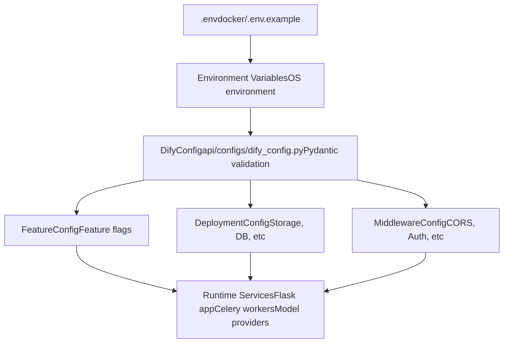
**Key Configuration Categories:**

| Category | Environment Variables | Purpose |
| --- | --- | --- |
| Edition | `EDITION` | `SELF_HOSTED`, `CLOUD`, or `ENTERPRISE` |
| Storage | `STORAGE_TYPE`, `S3_*`, `AZURE_*` | File storage backend |
| Vector DB | `VECTOR_STORE`, provider-specific vars | Vector database selection |
| Database | `DB_*`, `CELERY_BROKER_URL` | PostgreSQL and Redis connection |
| Security | `SECRET_KEY`, `CONSOLE_API_URL` | Encryption and CORS |
| Models | `MODEL_PROVIDER_*` | Default model provider API keys |
| Observability | `LOG_LEVEL`, `SENTRY_DSN` | Logging and error tracking |

The configuration is defined in [api/configs/dify\_config.py](https://github.com/langgenius/dify/blob/92dbc94f/api/configs/dify_config.py) and validated on startup. Invalid configuration causes the application to fail fast with detailed error messages.

For configuration details, see [Configuration System](/langgenius/dify/2.3-application-types-and-execution-modes) and [Environment Configuration](/langgenius/dify/3.2-environment-configuration-and-runtime-modes).

Sources: [docker/.env.example1-500](https://github.com/langgenius/dify/blob/92dbc94f/docker/.env.example#L1-L500) [api/configs/dify\_config.py1-200](https://github.com/langgenius/dify/blob/92dbc94f/api/configs/dify_config.py#L1-L200)

## Multi-Tenancy and Security

### Tenant Isolation

All resources are scoped by `tenant_id` foreign keys, enforced at the service layer:

**Multi-Tenant Data Model:**

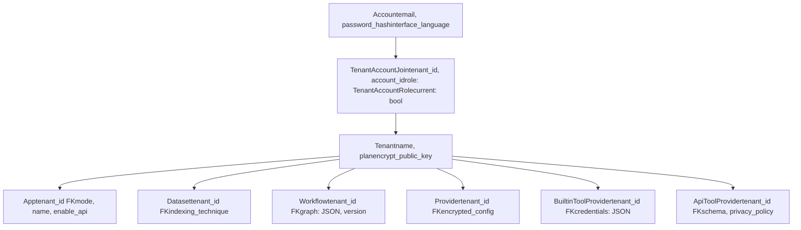
### Role-Based Access Control

The `TenantAccountRole` enum in [api/models/account.py](https://github.com/langgenius/dify/blob/92dbc94f/api/models/account.py) defines 5 roles:

| Role Constant | Database Value | Permissions | Service Layer Check |
| --- | --- | --- | --- |
| `TenantAccountRole.OWNER` | `'owner'` | Full control, transfer ownership | `AccountService._check_role()` |
| `TenantAccountRole.ADMIN` | `'admin'` | User/team management | `@cloud_edition_billing_resource_check` |
| `TenantAccountRole.EDITOR` | `'editor'` | Create/edit apps and workflows | Controller decorators |
| `TenantAccountRole.NORMAL` | `'normal'` | View-only access | Read-only endpoints |
| `TenantAccountRole.DATASET_OPERATOR` | `'dataset_operator'` | Dataset management only | `DatasetService` role check |

### Authentication Flow

**Session-Based Authentication (Console API):**

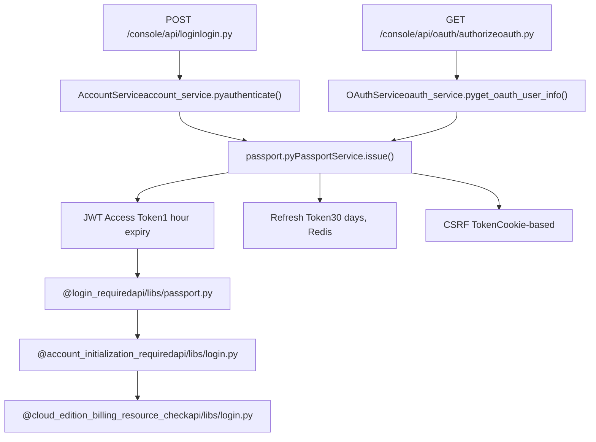
**API Key Authentication (Service API):**

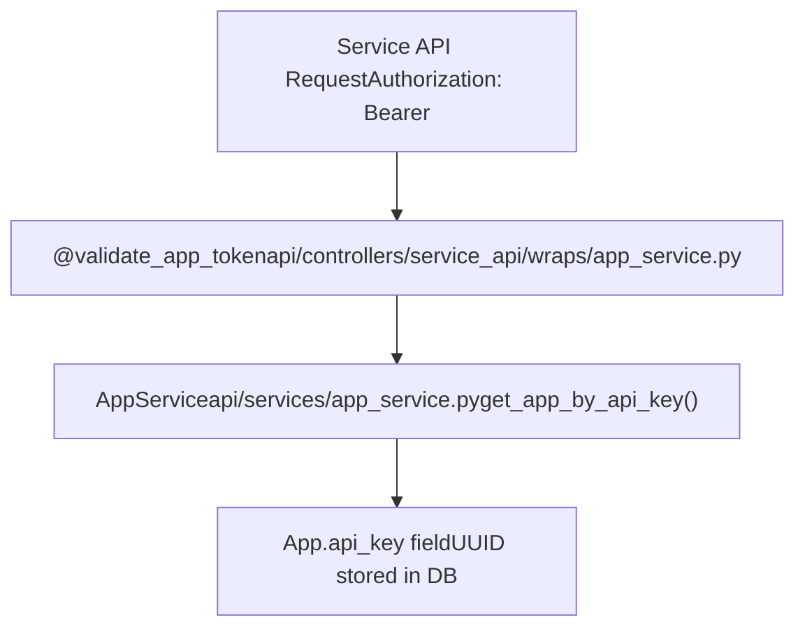
**Security Features:**

| Feature | Implementation File | Behavior |
| --- | --- | --- |
| Rate Limiting | [api/services/account\_service.py](https://github.com/langgenius/dify/blob/92dbc94f/api/services/account_service.py) | 5 failed login attempts lock account 24h |
| Credential Encryption | [api/core/helper/encrypter.py](https://github.com/langgenius/dify/blob/92dbc94f/api/core/helper/encrypter.py) | AES encryption using tenant's `encrypt_public_key` |
| OAuth Providers | [api/controllers/console/auth/oauth.py](https://github.com/langgenius/dify/blob/92dbc94f/api/controllers/console/auth/oauth.py) | GitHub, Google via `OAuthService` |
| CSRF Protection | [api/libs/passport.py](https://github.com/langgenius/dify/blob/92dbc94f/api/libs/passport.py) | `PassportService._generate_csrf_token()` |
| Password Hashing | [api/libs/password.py](https://github.com/langgenius/dify/blob/92dbc94f/api/libs/password.py) | bcrypt via `hash_password()` / `compare_password()` |

For comprehensive security documentation, see [Authentication and Authorization](/langgenius/dify/7-multi-tenancy-and-authorization).

Sources: [api/models/account.py1-300](https://github.com/langgenius/dify/blob/92dbc94f/api/models/account.py#L1-L300) [api/services/account\_service.py1-500](https://github.com/langgenius/dify/blob/92dbc94f/api/services/account_service.py#L1-L500) [api/libs/passport.py1-300](https://github.com/langgenius/dify/blob/92dbc94f/api/libs/passport.py#L1-L300) [api/libs/login.py1-200](https://github.com/langgenius/dify/blob/92dbc94f/api/libs/login.py#L1-L200) [api/core/helper/encrypter.py1-100](https://github.com/langgenius/dify/blob/92dbc94f/api/core/helper/encrypter.py#L1-L100)

## Development and Extension

### API Integration

The Service API provides programmatic access to all features:

**Endpoint Structure:**

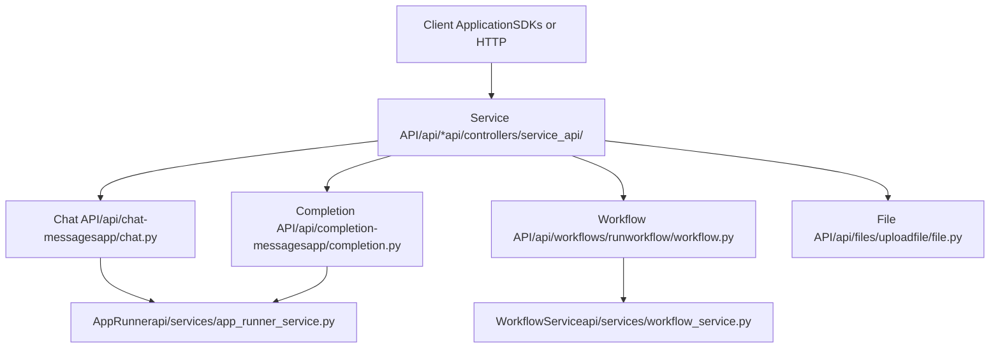
**Authentication:**

-   API Key in `Authorization: Bearer <token>` header
-   Configured in `App` model's `api_key` field
-   Validated via `api_based_extension_required` decorator

For API details, see [Service APIs and External Integration](/langgenius/dify/8-service-apis).

Sources: [api/controllers/service\_api/](https://github.com/langgenius/dify/blob/92dbc94f/api/controllers/service_api/)

### Tool Development

Developers can extend Dify with custom tools:

**Built-in Tool Example:**

Built-in tools are defined in [api/core/tools/provider/builtin/](https://github.com/langgenius/dify/blob/92dbc94f/api/core/tools/provider/builtin/) with the following structure:

```
builtin/
├── google/
│   ├── google.yaml          # Provider manifest
│   ├── tools/
│   │   ├── google_search.yaml   # Tool definition
│   │   └── google_search.py     # Tool implementation
```
**Custom API Tool:**

API tools are created via the Console UI by uploading an OpenAPI/Swagger specification. The `ApiToolProviderController` parses the spec and creates `ApiToolProvider` records.

**Workflow Tool:**

Any published workflow can be used as a tool by referencing it via `WorkflowToolProviderController`.

For tool development, see [Tool and Integration System](/langgenius/dify/6-tool-and-plugin-system).

Sources: [api/core/tools/provider/builtin/](https://github.com/langgenius/dify/blob/92dbc94f/api/core/tools/provider/builtin/) [api/core/tools/provider/api\_tool\_provider\_controller.py1-200](https://github.com/langgenius/dify/blob/92dbc94f/api/core/tools/provider/api_tool_provider_controller.py#L1-L200)

## Next Steps

This introduction established the foundational concepts of Dify. To explore specific subsystems in depth:

-   **Architecture**: [System Architecture Overview](/langgenius/dify/2-system-architecture-overview) for component interaction patterns
-   **Deployment**: [Deployment and Operations](/langgenius/dify/3-deployment-and-operations) for infrastructure setup
-   **Knowledge Base**: [Knowledge Base and RAG System](/langgenius/dify/4-knowledge-base-and-rag-system) for document processing and retrieval
-   **Workflows**: [Workflow and Application Execution](/langgenius/dify/5-workflow-system-and-node-execution) for workflow engine internals
-   **Tools**: [Tool and Integration System](/langgenius/dify/6-tool-and-plugin-system) for extending functionality
-   **Security**: [Authentication and Authorization](/langgenius/dify/7-multi-tenancy-and-authorization) for auth and multi-tenancy
-   **APIs**: [Service APIs and External Integration](/langgenius/dify/8-service-apis) for integration patterns
-   **Frontend**: [Web Frontend Architecture](/langgenius/dify/9-web-frontend-architecture) for UI components

For community support, see the [GitHub repository](https://github.com/langgenius/dify/blob/92dbc94f/GitHub repository) [Discord](https://discord.gg/FngNHpbcY7), and [documentation](https://docs.dify.ai).

Sources: [README.md193-199](https://github.com/langgenius/dify/blob/92dbc94f/README.md#L193-L199)
