# Development and CI/CD

Relevant source files

-   [.github/workflows/api-tests.yml](https://github.com/langgenius/dify/blob/92dbc94f/.github/workflows/api-tests.yml)
-   [.github/workflows/autofix.yml](https://github.com/langgenius/dify/blob/92dbc94f/.github/workflows/autofix.yml)
-   [.github/workflows/build-push.yml](https://github.com/langgenius/dify/blob/92dbc94f/.github/workflows/build-push.yml)
-   [.github/workflows/db-migration-test.yml](https://github.com/langgenius/dify/blob/92dbc94f/.github/workflows/db-migration-test.yml)
-   [.github/workflows/deploy-agent-dev.yml](https://github.com/langgenius/dify/blob/92dbc94f/.github/workflows/deploy-agent-dev.yml)
-   [.github/workflows/deploy-dev.yml](https://github.com/langgenius/dify/blob/92dbc94f/.github/workflows/deploy-dev.yml)
-   [.github/workflows/deploy-hitl.yml](https://github.com/langgenius/dify/blob/92dbc94f/.github/workflows/deploy-hitl.yml)
-   [.github/workflows/docker-build.yml](https://github.com/langgenius/dify/blob/92dbc94f/.github/workflows/docker-build.yml)
-   [.github/workflows/main-ci.yml](https://github.com/langgenius/dify/blob/92dbc94f/.github/workflows/main-ci.yml)
-   [.github/workflows/stale.yml](https://github.com/langgenius/dify/blob/92dbc94f/.github/workflows/stale.yml)
-   [.github/workflows/style.yml](https://github.com/langgenius/dify/blob/92dbc94f/.github/workflows/style.yml)
-   [.github/workflows/tool-test-sdks.yaml](https://github.com/langgenius/dify/blob/92dbc94f/.github/workflows/tool-test-sdks.yaml)
-   [.github/workflows/translate-i18n-claude.yml](https://github.com/langgenius/dify/blob/92dbc94f/.github/workflows/translate-i18n-claude.yml)
-   [.github/workflows/trigger-i18n-sync.yml](https://github.com/langgenius/dify/blob/92dbc94f/.github/workflows/trigger-i18n-sync.yml)
-   [.github/workflows/vdb-tests.yml](https://github.com/langgenius/dify/blob/92dbc94f/.github/workflows/vdb-tests.yml)
-   [.github/workflows/web-tests.yml](https://github.com/langgenius/dify/blob/92dbc94f/.github/workflows/web-tests.yml)
-   [api/Dockerfile](https://github.com/langgenius/dify/blob/92dbc94f/api/Dockerfile)
-   [api/migrations/README](https://github.com/langgenius/dify/blob/92dbc94f/api/migrations/README)
-   [web/.nvmrc](https://github.com/langgenius/dify/blob/92dbc94f/web/.nvmrc)
-   [web/Dockerfile](https://github.com/langgenius/dify/blob/92dbc94f/web/Dockerfile)
-   [web/README.md](https://github.com/langgenius/dify/blob/92dbc94f/web/README.md)
-   [web/i18n-config/README.md](https://github.com/langgenius/dify/blob/92dbc94f/web/i18n-config/README.md)

This page documents the development environment setup, continuous integration/deployment pipeline, and code quality standards for the Dify platform. It covers local development workflows, automated testing infrastructure, and the build/release process.

For deployment configuration details, see [Environment Configuration and Runtime Modes](/langgenius/dify/3.2-environment-configuration-and-runtime-modes). For frontend-specific testing, see [Testing Strategy and Quality Assurance](/langgenius/dify/9.4-chat-ui-components-and-audio-features).

---

## Development Environment Setup

Dify provides multiple development environment options: DevContainer for containerized development, local setup with middleware services, and debugging configurations for VS Code.

### DevContainer Configuration

The DevContainer provides a pre-configured Python 3.12 environment with all dependencies installed. The container is defined in [.devcontainer/devcontainer.json1-49](https://github.com/langgenius/dify/blob/92dbc94f/.devcontainer/devcontainer.json#L1-L49) and uses a custom Dockerfile at [.devcontainer/Dockerfile1-4](https://github.com/langgenius/dify/blob/92dbc94f/.devcontainer/Dockerfile#L1-L4)

**DevContainer Specification:**

| Component | Configuration |
| --- | --- |
| Base Image | `mcr.microsoft.com/devcontainers/python:3.12-bookworm` |
| Node.js | LTS version via `devcontainers/features/node` |
| Docker | Docker-in-Docker enabled with Buildx support |
| Python Packages | `gmpy2` dependencies (`libgmp-dev`, `libmpfr-dev`, `libmpc-dev`) |
| Volume Mounts | `/tmp` mounted as persistent volume (`dify-dev-tmp`) |
| VS Code Extensions | `ms-python.pylint`, `GitHub.copilot`, `ms-python.python` |

**Container Lifecycle:**

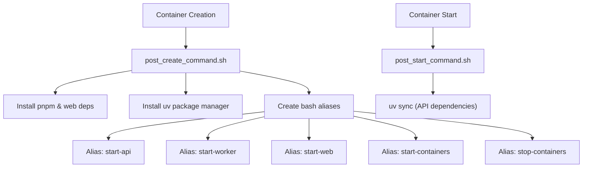
The setup scripts create convenient aliases for development:

-   `start-api`: Launches Flask development server on port 5001
-   `start-worker`: Starts Celery worker with all queues
-   `start-web`: Runs Next.js development server on port 3000
-   `start-containers`: Starts middleware services (PostgreSQL, Redis, Weaviate)
-   `stop-containers`: Stops middleware services

**Sources:** [.devcontainer/devcontainer.json1-49](https://github.com/langgenius/dify/blob/92dbc94f/.devcontainer/devcontainer.json#L1-L49) [.devcontainer/Dockerfile1-4](https://github.com/langgenius/dify/blob/92dbc94f/.devcontainer/Dockerfile#L1-L4) [.devcontainer/post\_create\_command.sh1-16](https://github.com/langgenius/dify/blob/92dbc94f/.devcontainer/post_create_command.sh#L1-L16) [.devcontainer/post\_start\_command.sh1-3](https://github.com/langgenius/dify/blob/92dbc94f/.devcontainer/post_start_command.sh#L1-L3)

### Local Development Workflow

For local development without DevContainer, the setup requires manual dependency installation and middleware orchestration.

**API Service Setup:**

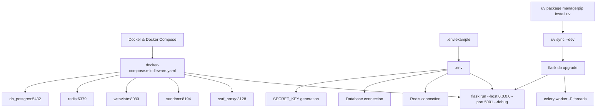
**Web Service Setup:**

The web service requires Node.js 22 with pnpm package manager:

1.  Install pnpm: `corepack enable && corepack install`
2.  Install dependencies: `pnpm install --frozen-lockfile`
3.  Configure environment: Copy [web/.env.example1-79](https://github.com/langgenius/dify/blob/92dbc94f/web/.env.example#L1-L79) to `.env`
4.  Start development server: `pnpm dev` (port 3000)

**Environment Variables:**

| Category | Key Variables | Purpose |
| --- | --- | --- |
| API Backend | `CONSOLE_API_URL`, `SERVICE_API_URL` | API endpoint URLs |
| Database | `DB_TYPE`, `DB_HOST`, `DB_PORT`, `DB_USERNAME`, `DB_PASSWORD` | Database connection |
| Cache | `REDIS_HOST`, `REDIS_PORT`, `CELERY_BROKER_URL` | Redis configuration |
| Storage | `STORAGE_TYPE`, `S3_BUCKET_NAME`, `OPENDAL_SCHEME` | File storage backend |
| Vector DB | `VECTOR_STORE`, `WEAVIATE_ENDPOINT` | Vector database selection |
| Security | `SECRET_KEY`, `COOKIE_DOMAIN` | Authentication & cookies |

**Sources:** [api/README.md1-117](https://github.com/langgenius/dify/blob/92dbc94f/api/README.md#L1-L117) [api/.env.example](https://github.com/langgenius/dify/blob/92dbc94f/api/.env.example) [web/.env.example1-79](https://github.com/langgenius/dify/blob/92dbc94f/web/.env.example#L1-L79) [.devcontainer/post\_create\_command.sh9-14](https://github.com/langgenius/dify/blob/92dbc94f/.devcontainer/post_create_command.sh#L9-L14)

### Debugging Configuration

VS Code launch configurations are provided for debugging API, worker, and web services.

**Launch Configuration Template:**

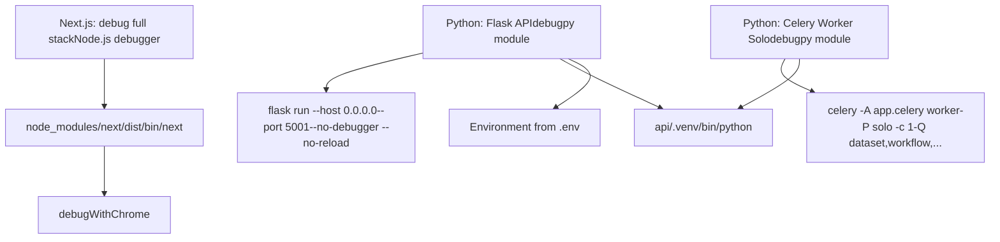
The Celery worker must use `-P solo` pool mode for debugging compatibility, as the default `gevent` or `threads` pools don't work well with debuggers.

**Sources:** [.vscode/launch.json.template1-66](https://github.com/langgenius/dify/blob/92dbc94f/.vscode/launch.json.template#L1-L66) [.devcontainer/post\_create\_command.sh9-10](https://github.com/langgenius/dify/blob/92dbc94f/.devcontainer/post_create_command.sh#L9-L10)

### Development Scripts

The `dev/` directory provides convenience scripts for starting services:

**API Service Script:**

[dev/start-api1-11](https://github.com/langgenius/dify/blob/92dbc94f/dev/start-api#L1-L11) provides a simple wrapper around `uv run flask run` with debugging enabled on port 5001.

**Worker Service Script:**

[dev/start-worker1-129](https://github.com/langgenius/dify/blob/92dbc94f/dev/start-worker#L1-L129) provides a sophisticated worker launch script with configurable queues, concurrency, and pool type:

```
# Start dataset queue worker with 2 processes
./dev/start-worker --queues dataset --concurrency 2

# Start workflow workers for cloud edition
./dev/start-worker --queues workflow_professional,workflow_team --concurrency 4

# Use prefork pool instead of gevent
./dev/start-worker --queues dataset --pool prefork
```
Available queue types include:

-   `dataset`, `priority_dataset`: RAG indexing and document processing
-   `workflow`, `workflow_professional`, `workflow_team`, `workflow_sandbox`: Workflow execution tiers
-   `schedule_poller`, `schedule_executor`: Scheduled task management
-   `triggered_workflow_dispatcher`, `trigger_refresh_executor`: Trigger handling
-   `mail`, `ops_trace`, `app_deletion`, `plugin`, `conversation`, `retention`: Supporting services

**Sources:** [dev/start-api1-11](https://github.com/langgenius/dify/blob/92dbc94f/dev/start-api#L1-L11) [dev/start-worker1-129](https://github.com/langgenius/dify/blob/92dbc94f/dev/start-worker#L1-L129) [api/docker/entrypoint.sh20-68](https://github.com/langgenius/dify/blob/92dbc94f/api/docker/entrypoint.sh#L20-L68)

---

## CI/CD Pipeline Architecture

The CI/CD system uses GitHub Actions with a hub-and-spoke architecture where a main orchestrator workflow delegates to specialized test workflows based on changed files.

### Pipeline Orchestration

**Main CI Workflow Structure:**

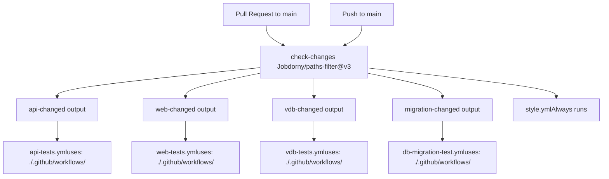
**Path Filter Configuration:**

The `check-changes` job uses `dorny/paths-filter@v3` to detect changes in specific paths:

| Filter ID | Paths | Triggers Workflow |
| --- | --- | --- |
| `api` | `api/**`, `docker/**`, `.github/workflows/api-tests.yml` | `api-tests.yml` |
| `web` | `web/**`, `.github/workflows/web-tests.yml` | `web-tests.yml` |
| `vdb` | `api/core/rag/datasource/**`, `docker/**`, `api/uv.lock`, `api/pyproject.toml` | `vdb-tests.yml` |
| `migration` | `api/migrations/**`, `.github/workflows/db-migration-test.yml` | `db-migration-test.yml` |

**Sources:** [.github/workflows/main-ci.yml1-80](https://github.com/langgenius/dify/blob/92dbc94f/.github/workflows/main-ci.yml#L1-L80)

### API Testing Pipeline

The API test workflow runs pytest with coverage reporting across Python 3.11 and 3.12.

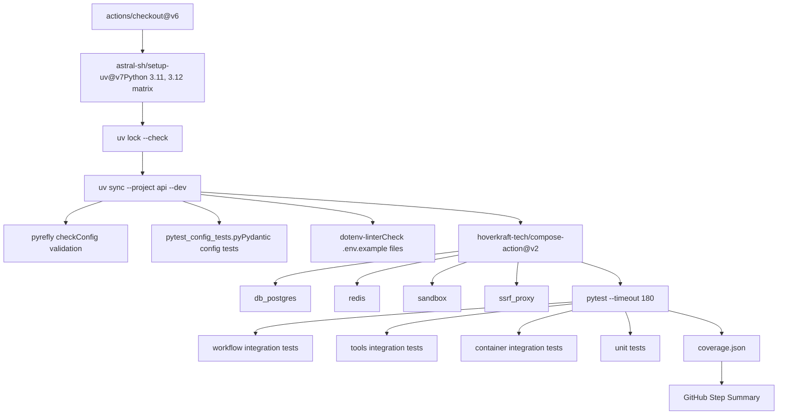
**Test Categories:**

The pytest execution targets specific test directories:

-   `api/tests/integration_tests/workflow`: Workflow engine integration tests
-   `api/tests/integration_tests/tools`: Tool provider integration tests
-   `api/tests/test_containers_integration_tests`: Container-based integration tests
-   `api/tests/unit_tests`: Unit tests for core logic

**Coverage Reporting:**

The workflow generates coverage reports in JSON format and displays them in the GitHub Actions summary, including:

-   Total coverage percentage
-   Per-file coverage with lowest-covered files highlighted
-   Line-level coverage details in expandable sections

**Sources:** [.github/workflows/api-tests.yml1-105](https://github.com/langgenius/dify/blob/92dbc94f/.github/workflows/api-tests.yml#L1-L105)

### Web Testing Pipeline

The web test workflow uses Vitest for component testing with Istanbul coverage reporting.

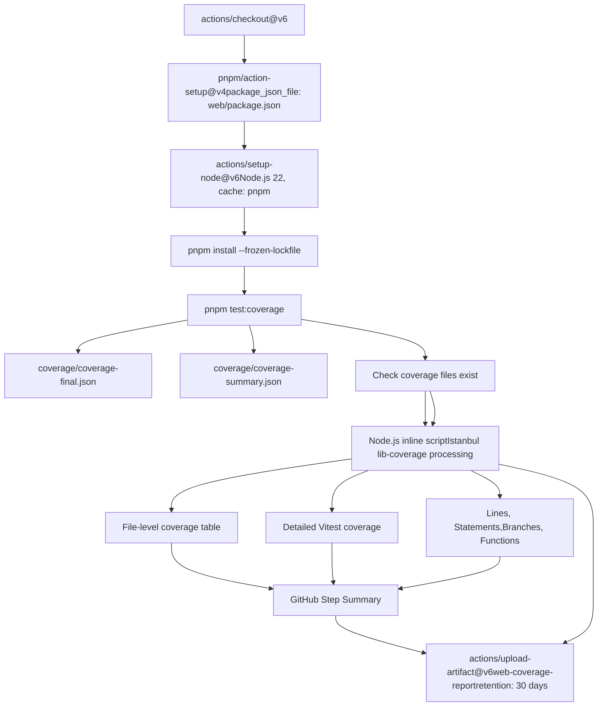
**Coverage Report Format:**

The workflow generates a comprehensive coverage table showing:

-   Overall metrics (statements, branches, functions, lines)
-   Per-file breakdown sorted by coverage percentage (lowest first)
-   Uncovered line numbers formatted as ranges (e.g., "10-15,20")
-   "All files" summary row for aggregate metrics

The inline Node.js script at [.github/workflows/web-tests.yml62-359](https://github.com/langgenius/dify/blob/92dbc94f/.github/workflows/web-tests.yml#L62-L359) processes Istanbul coverage data, handles both summary and final JSON formats, and generates formatted tables in GitHub-flavored Markdown.

**Sources:** [.github/workflows/web-tests.yml1-369](https://github.com/langgenius/dify/blob/92dbc94f/.github/workflows/web-tests.yml#L1-L369)

### Vector Database Testing

The VDB test workflow validates integration with 11+ vector database backends.

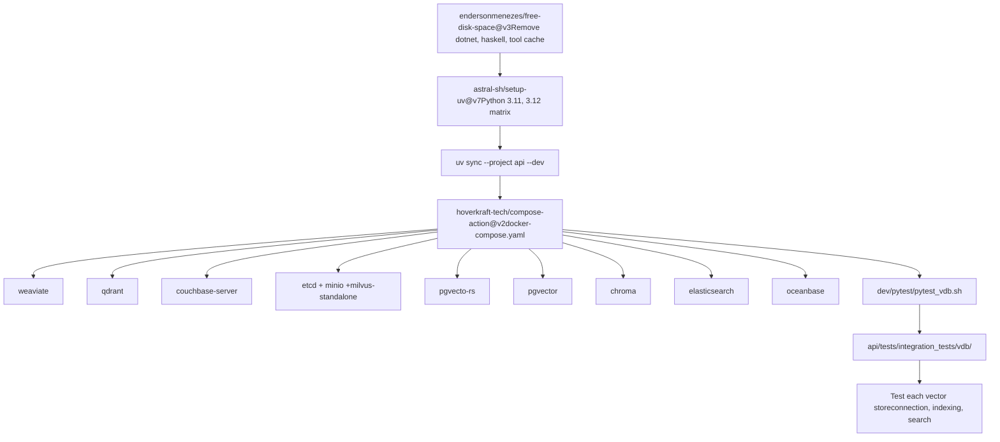
**Tested Vector Databases:**

The workflow tests integration with the following vector stores:

-   **Weaviate**: Cloud-native vector search engine
-   **Qdrant**: High-performance vector similarity search
-   **Milvus**: Distributed vector database (with etcd + MinIO dependencies)
-   **pgvector**: PostgreSQL extension for vector similarity
-   **PgVecto-RS**: Rust-based PostgreSQL vector extension
-   **Chroma**: AI-native open-source embedding database
-   **Elasticsearch**: Search engine with vector search capabilities
-   **Couchbase**: Distributed NoSQL database with vector search
-   **OceanBase**: Distributed database with vector support

The test script at `dev/pytest/pytest_vdb.sh` runs integration tests that verify:

1.  Connection establishment and authentication
2.  Collection/index creation
3.  Document insertion with embeddings
4.  Vector similarity search operations
5.  Metadata filtering
6.  Error handling and edge cases

**Sources:** [.github/workflows/vdb-tests.yml1-91](https://github.com/langgenius/dify/blob/92dbc94f/.github/workflows/vdb-tests.yml#L1-L91)

### Database Migration Testing

The migration test workflow validates SQL generation and live migration for both PostgreSQL and MySQL.

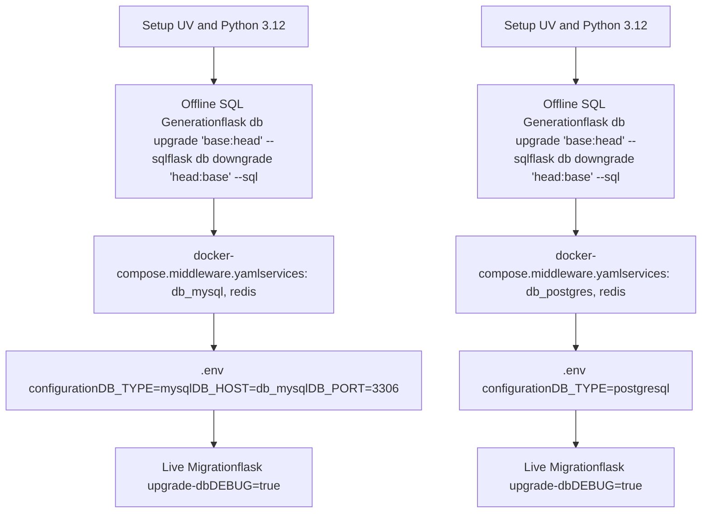
**Migration Test Phases:**

1.  **Offline SQL Generation**: Validates that all migrations can generate SQL without database connection:

    -   Upgrade from base to head: `flask db upgrade 'base:head' --sql`
    -   Downgrade from head to base: `flask db downgrade 'head:base' --sql`
2.  **Live Migration Execution**: Applies migrations to running database instances:

    -   PostgreSQL: Default configuration in `.env.example`
    -   MySQL: Requires `DB_TYPE`, `DB_HOST`, `DB_PORT`, `DB_USERNAME` overrides

This ensures migrations work for both database backends and support offline/online deployment scenarios.

**Sources:** [.github/workflows/db-migration-test.yml1-117](https://github.com/langgenius/dify/blob/92dbc94f/.github/workflows/db-migration-test.yml#L1-L117)

---

## Code Quality and Testing Standards

The codebase enforces quality standards through automated linting, type checking, and formatting across Python, TypeScript, and infrastructure files.

### Style Check Pipeline

The style check workflow runs on all pull requests and validates code quality without file-specific filtering (always runs).

```mermaid
flowchart TD
    CheckInfraFiles["tj-actions/changed-files@v47files: **.sh, **.yaml, **Dockerfile"]
    SuperLinter["super-linter/super-linter/slim@v8"]
    BashCheck["VALIDATE_BASHVALIDATE_BASH_EXECBASH_SEVERITY: warning"]
    DockerCheck["VALIDATE_DOCKERFILE_HADOLINT"]
    EditorConfig["VALIDATE_EDITORCONFIG"]
    YAMLCheck["VALIDATE_YAMLVALIDATE_XML"]
    CheckWebFiles["tj-actions/changed-files@v47files: web/**, .github/workflows/style.yml"]
    SetupWeb["pnpm/action-setup@v4Node.js 22"]
    InstallWeb["pnpm install --frozen-lockfile"]
    ESLint["pnpm run lintESLint validation"]
    TypeCheck["pnpm run type-check:tsgoTypeScript validation"]
    Knip["pnpm run knipDead code detection"]
    BuildCheck["pnpm run buildBuild validation"]
    CheckPyFiles["tj-actions/changed-files@v47files: api/**, .github/workflows/style.yml"]
    SetupPy["astral-sh/setup-uv@v7Python 3.12"]
    InstallPy["uv sync --project api --dev"]
    ImportLinter["uv run lint-importsValidate import structure"]
    Basedpyright["basedpyrightType checking"]
    Mypy["mypy --check-untyped-defsType checking"]
    DotenvLinter["dotenv-linter.env.example validation"]

    CheckInfraFiles --> SuperLinter
    SuperLinter --> BashCheck
    SuperLinter --> DockerCheck
    SuperLinter --> EditorConfig
    SuperLinter --> YAMLCheck
    CheckWebFiles --> SetupWeb
    SetupWeb --> InstallWeb
    InstallWeb --> ESLint
    InstallWeb --> TypeCheck
    InstallWeb --> Knip
    InstallWeb --> BuildCheck
    CheckPyFiles --> SetupPy
    SetupPy --> InstallPy
    InstallPy --> ImportLinter
    InstallPy --> Basedpyright
    InstallPy --> Mypy
    InstallPy --> DotenvLinter
```
**Python Linting Tools:**

| Tool | Purpose | Configuration |
| --- | --- | --- |
| `ruff` | Fast Python linter and formatter | Runs import sorting, formatting, and lint checks |
| `basedpyright` | Python type checker (fork of Pyright) | Validates type annotations and inference |
| `mypy` | Static type checker | Checks untyped function definitions (`--check-untyped-defs`) |
| `import-linter` | Validates import structure | Enforces architectural boundaries via `lint-imports` command |
| `dotenv-linter` | Environment file validation | Checks `.env.example` files for consistency |

**Web Linting Tools:**

| Tool | Purpose | Configuration |
| --- | --- | --- |
| ESLint | JavaScript/TypeScript linter | Configuration in `web/.eslintrc.json` |
| TypeScript Compiler | Type checking | `tsconfig.json` with strict mode |
| Knip | Dead code detection | Finds unused exports, dependencies, and files |
| Next.js Build | Production build validation | Ensures no build errors with `next build` |

**SuperLinter Validations:**

SuperLinter runs multiple specialized linters for infrastructure files:

-   **Bash**: Shell script validation with `shellcheck` (warning severity)
-   **Dockerfile**: Docker best practices via `hadolint`
-   **YAML**: YAML syntax validation
-   **EditorConfig**: Consistent code style via `.editorconfig`

The SuperLinter is configured to ignore gitignored files and generated files, with a filter regex to exclude specific paths like `pnpm-lock.yaml`.

**Sources:** [.github/workflows/style.yml1-165](https://github.com/langgenius/dify/blob/92dbc94f/.github/workflows/style.yml#L1-L165)

### Autofix Workflow

The autofix workflow automatically corrects common issues and commits fixes back to pull requests.

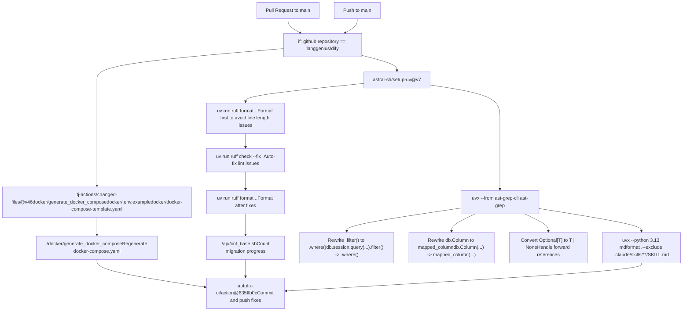
**AST-grep Rewrites:**

The autofix workflow uses `ast-grep` for advanced code transformations:

1.  **SQLAlchemy Query Modernization**:

    -   `db.session.query($WHATEVER).filter($HERE)` → `db.session.query($WHATEVER).where($HERE)`
    -   `session.query($WHATEVER).filter($HERE)` → `session.query($WHATEVER).where($HERE)`
2.  **SQLAlchemy 2.0 Column Syntax**:

    -   `$A = db.Column($$$B)` → `$A = mapped_column($$$B)`
    -   `$A : $T = db.Column($$$B)` → `$A : $T = mapped_column($$$B)`
3.  **Type Annotation Modernization**:

    -   `Optional[T]` → `T | None` (with special handling for forward references)
    -   Forward references like `"Type" | None` are preserved as `Optional["Type"]`

**Markdown Formatting:**

The workflow runs `mdformat` with Python 3.13 to format markdown files, excluding directories with YAML front matter (like `.claude/skills/**/SKILL.md`) to prevent breaking structured metadata.

**Sources:** [.github/workflows/autofix.yml1-88](https://github.com/langgenius/dify/blob/92dbc94f/.github/workflows/autofix.yml#L1-L88)

### Build and Push Workflow

The build workflow creates multi-architecture Docker images for API and web services.

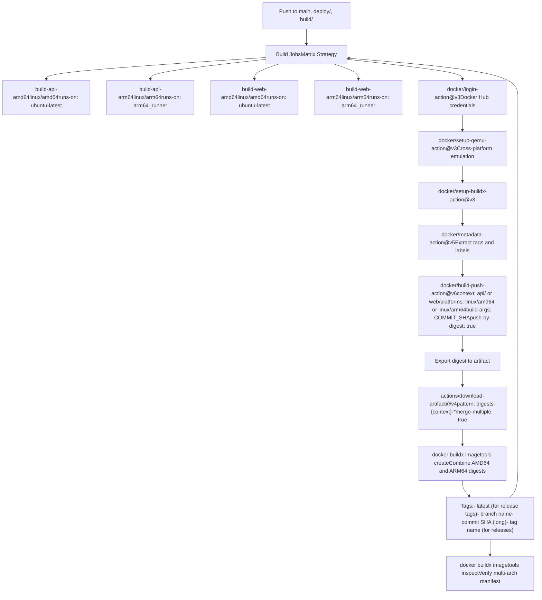
**Multi-Architecture Build Strategy:**

The workflow uses a two-phase approach:

1.  **Parallel Builds**: Each platform (AMD64, ARM64) builds independently for both API and web services

    -   AMD64 builds run on `ubuntu-latest` runners
    -   ARM64 builds run on dedicated `arm64_runner` self-hosted runners
    -   Each build exports a digest artifact
2.  **Manifest Creation**: After all builds complete, manifests combine digests

    -   API digests: `digests-api-linux-amd64` + `digests-api-linux-arm64` → `langgenius/dify-api` manifest
    -   Web digests: `digests-web-linux-amd64` + `digests-web-linux-arm64` → `langgenius/dify-web` manifest

**Image Tagging Strategy:**

The `docker/metadata-action@v5` generates tags based on the trigger event:

| Trigger | Generated Tags |
| --- | --- |
| Release tag (no pre-release) | `latest`, tag name, commit SHA |
| Pre-release tag | Tag name, commit SHA |
| Branch push | Branch name, commit SHA |
| Commit push | Commit SHA (long format) |

**Cache Strategy:**

Both build and manifest jobs use GitHub Actions cache:

-   `cache-from: type=gha,scope={service_name}`: Read from cache
-   `cache-to: type=gha,mode=max,scope={service_name}`: Write to cache (max mode preserves layers)

**Sources:** [.github/workflows/build-push.yml1-152](https://github.com/langgenius/dify/blob/92dbc94f/.github/workflows/build-push.yml#L1-L152)

### Testing Coverage Requirements

Coverage tracking is automated through the test workflows with inline reporting in GitHub Actions summaries.

**API Coverage Metrics:**

The API test workflow extracts coverage from `coverage.json` generated by pytest:

```
# Extract total coverage percentage
TOTAL_COVERAGE=$(python -c 'import json; print(json.load(open("coverage.json"))["totals"]["percent_covered_display"])')
```
The summary includes:

-   Overall coverage percentage
-   File-level breakdown with `coverage report -m`
-   Expandable details section in GitHub Actions summary

**Web Coverage Metrics:**

The web test workflow processes Istanbul coverage data from Vitest:

-   Parses `coverage/coverage-final.json` or `coverage/coverage-summary.json`
-   Calculates metrics for lines, statements, branches, and functions
-   Generates detailed tables with uncovered line numbers
-   Uploads full coverage report as artifact (30-day retention)

The inline Node.js script at [.github/workflows/web-tests.yml62-359](https://github.com/langgenius/dify/blob/92dbc94f/.github/workflows/web-tests.yml#L62-L359) handles fallback scenarios when `istanbul-lib-coverage` is not available, manually calculating coverage from statement maps.

**Coverage Artifact Retention:**

| Artifact | Retention | Purpose |
| --- | --- | --- |
| `web-coverage-report` | 30 days | Full HTML coverage report for debugging |

**Sources:** [.github/workflows/api-tests.yml87-104](https://github.com/langgenius/dify/blob/92dbc94f/.github/workflows/api-tests.yml#L87-L104) [.github/workflows/web-tests.yml44-368](https://github.com/langgenius/dify/blob/92dbc94f/.github/workflows/web-tests.yml#L44-L368)
