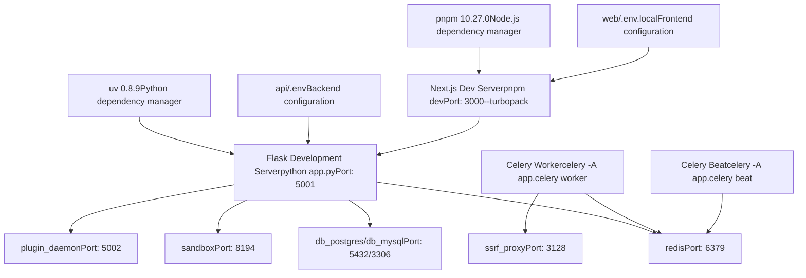
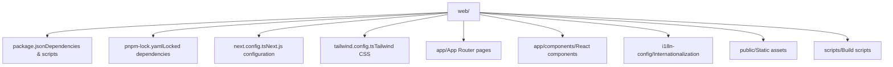
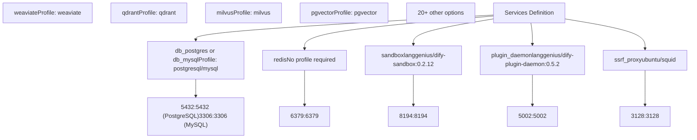

# Development Environment Setup

Relevant source files

-   [.github/workflows/api-tests.yml](https://github.com/langgenius/dify/blob/92dbc94f/.github/workflows/api-tests.yml)
-   [.github/workflows/autofix.yml](https://github.com/langgenius/dify/blob/92dbc94f/.github/workflows/autofix.yml)
-   [.github/workflows/build-push.yml](https://github.com/langgenius/dify/blob/92dbc94f/.github/workflows/build-push.yml)
-   [.github/workflows/db-migration-test.yml](https://github.com/langgenius/dify/blob/92dbc94f/.github/workflows/db-migration-test.yml)
-   [.github/workflows/deploy-agent-dev.yml](https://github.com/langgenius/dify/blob/92dbc94f/.github/workflows/deploy-agent-dev.yml)
-   [.github/workflows/deploy-dev.yml](https://github.com/langgenius/dify/blob/92dbc94f/.github/workflows/deploy-dev.yml)
-   [.github/workflows/deploy-hitl.yml](https://github.com/langgenius/dify/blob/92dbc94f/.github/workflows/deploy-hitl.yml)
-   [.github/workflows/docker-build.yml](https://github.com/langgenius/dify/blob/92dbc94f/.github/workflows/docker-build.yml)
-   [.github/workflows/main-ci.yml](https://github.com/langgenius/dify/blob/92dbc94f/.github/workflows/main-ci.yml)
-   [.github/workflows/stale.yml](https://github.com/langgenius/dify/blob/92dbc94f/.github/workflows/stale.yml)
-   [.github/workflows/style.yml](https://github.com/langgenius/dify/blob/92dbc94f/.github/workflows/style.yml)
-   [.github/workflows/tool-test-sdks.yaml](https://github.com/langgenius/dify/blob/92dbc94f/.github/workflows/tool-test-sdks.yaml)
-   [.github/workflows/translate-i18n-claude.yml](https://github.com/langgenius/dify/blob/92dbc94f/.github/workflows/translate-i18n-claude.yml)
-   [.github/workflows/trigger-i18n-sync.yml](https://github.com/langgenius/dify/blob/92dbc94f/.github/workflows/trigger-i18n-sync.yml)
-   [.github/workflows/vdb-tests.yml](https://github.com/langgenius/dify/blob/92dbc94f/.github/workflows/vdb-tests.yml)
-   [.github/workflows/web-tests.yml](https://github.com/langgenius/dify/blob/92dbc94f/.github/workflows/web-tests.yml)
-   [api/.env.example](https://github.com/langgenius/dify/blob/92dbc94f/api/.env.example)
-   [api/Dockerfile](https://github.com/langgenius/dify/blob/92dbc94f/api/Dockerfile)
-   [api/app.py](https://github.com/langgenius/dify/blob/92dbc94f/api/app.py)
-   [api/app\_factory.py](https://github.com/langgenius/dify/blob/92dbc94f/api/app_factory.py)
-   [api/commands.py](https://github.com/langgenius/dify/blob/92dbc94f/api/commands.py)
-   [api/configs/feature/\_\_init\_\_.py](https://github.com/langgenius/dify/blob/92dbc94f/api/configs/feature/__init__.py)
-   [api/configs/middleware/\_\_init\_\_.py](https://github.com/langgenius/dify/blob/92dbc94f/api/configs/middleware/__init__.py)
-   [api/configs/packaging/\_\_init\_\_.py](https://github.com/langgenius/dify/blob/92dbc94f/api/configs/packaging/__init__.py)
-   [api/controllers/console/datasets/datasets.py](https://github.com/langgenius/dify/blob/92dbc94f/api/controllers/console/datasets/datasets.py)
-   [api/core/rag/datasource/vdb/vector\_factory.py](https://github.com/langgenius/dify/blob/92dbc94f/api/core/rag/datasource/vdb/vector_factory.py)
-   [api/core/rag/datasource/vdb/vector\_type.py](https://github.com/langgenius/dify/blob/92dbc94f/api/core/rag/datasource/vdb/vector_type.py)
-   [api/extensions/ext\_storage.py](https://github.com/langgenius/dify/blob/92dbc94f/api/extensions/ext_storage.py)
-   [api/extensions/storage/storage\_type.py](https://github.com/langgenius/dify/blob/92dbc94f/api/extensions/storage/storage_type.py)
-   [api/migrations/README](https://github.com/langgenius/dify/blob/92dbc94f/api/migrations/README)
-   [api/pyproject.toml](https://github.com/langgenius/dify/blob/92dbc94f/api/pyproject.toml)
-   [api/tests/unit\_tests/configs/test\_dify\_config.py](https://github.com/langgenius/dify/blob/92dbc94f/api/tests/unit_tests/configs/test_dify_config.py)
-   [api/uv.lock](https://github.com/langgenius/dify/blob/92dbc94f/api/uv.lock)
-   [dev/pytest/pytest\_vdb.sh](https://github.com/langgenius/dify/blob/92dbc94f/dev/pytest/pytest_vdb.sh)
-   [docker/.env.example](https://github.com/langgenius/dify/blob/92dbc94f/docker/.env.example)
-   [docker/docker-compose-template.yaml](https://github.com/langgenius/dify/blob/92dbc94f/docker/docker-compose-template.yaml)
-   [docker/docker-compose.middleware.yaml](https://github.com/langgenius/dify/blob/92dbc94f/docker/docker-compose.middleware.yaml)
-   [docker/docker-compose.yaml](https://github.com/langgenius/dify/blob/92dbc94f/docker/docker-compose.yaml)
-   [docker/middleware.env.example](https://github.com/langgenius/dify/blob/92dbc94f/docker/middleware.env.example)
-   [web/.nvmrc](https://github.com/langgenius/dify/blob/92dbc94f/web/.nvmrc)
-   [web/Dockerfile](https://github.com/langgenius/dify/blob/92dbc94f/web/Dockerfile)
-   [web/README.md](https://github.com/langgenius/dify/blob/92dbc94f/web/README.md)
-   [web/i18n-config/README.md](https://github.com/langgenius/dify/blob/92dbc94f/web/i18n-config/README.md)
-   [web/package.json](https://github.com/langgenius/dify/blob/92dbc94f/web/package.json)

This document covers the complete setup process for developing Dify locally, including both the API backend (Python/Flask) and web frontend (Next.js), along with required middleware services. For deployment configuration, see [Environment Configuration and Runtime Modes](/langgenius/dify/3.2-environment-configuration-and-runtime-modes). For Docker-based production deployment, see [Docker Build Process and Multi-Architecture Images](/langgenius/dify/3.1-docker-build-process-and-multi-architecture-images).

---

## Overview

Dify's local development environment consists of three primary components:

1.  **API Backend** - Python 3.11/3.12 application using Flask, managed by `uv`
2.  **Web Frontend** - Next.js 15 application using React 19, managed by `pnpm`
3.  **Middleware Services** - PostgreSQL/MySQL, Redis, Sandbox, Plugin Daemon (via Docker Compose)

The development setup differs from production deployment by running API and web services directly on the host machine while using Docker Compose only for middleware dependencies.

---

## Development Environment Architecture


**Sources**: [docker/docker-compose.middleware.yaml1-250](https://github.com/langgenius/dify/blob/92dbc94f/docker/docker-compose.middleware.yaml#L1-L250) [api/app.py1-30](https://github.com/langgenius/dify/blob/92dbc94f/api/app.py#L1-L30) [web/package.json25-27](https://github.com/langgenius/dify/blob/92dbc94f/web/package.json#L25-L27) [api/Dockerfile6-9](https://github.com/langgenius/dify/blob/92dbc94f/api/Dockerfile#L6-L9) [.github/workflows/api-tests.yml29-40](https://github.com/langgenius/dify/blob/92dbc94f/.github/workflows/api-tests.yml#L29-L40)

---

## Prerequisites

### System Requirements

| Component | Requirement | Verification Command |
| --- | --- | --- |
| Python | 3.11 or 3.12 | `python --version` |
| Node.js | 22.x or 24.x | `node --version` |
| uv | 0.8.9+ | `uv --version` |
| pnpm | 10.27.0+ | `pnpm --version` |
| Docker | Latest stable | `docker --version` |
| Docker Compose | V2+ | `docker compose version` |

### Operating System Support

-   **Linux** - Primary development platform
-   **macOS** - Fully supported
-   **Windows** - Supported via WSL2 (Windows Subsystem for Linux)

**Sources**: [api/pyproject.toml4](https://github.com/langgenius/dify/blob/92dbc94f/api/pyproject.toml#L4-L4) [web/package.json6](https://github.com/langgenius/dify/blob/92dbc94f/web/package.json#L6-L6) [api/Dockerfile7-9](https://github.com/langgenius/dify/blob/92dbc94f/api/Dockerfile#L7-L9) [.github/workflows/style.yml36-40](https://github.com/langgenius/dify/blob/92dbc94f/.github/workflows/style.yml#L36-L40)

---

## Package Manager Installation

### Installing uv

```
# Install uv (Python package manager)
pip install uv==0.8.9

# Verify installation
uv --version
```
### Installing pnpm

```
# Enable corepack (comes with Node.js)
corepack enable

# pnpm will be automatically installed from package.json packageManager field
# which specifies: "pnpm@10.27.0+sha512.72d699da..."
```
**Sources**: [api/Dockerfile7-9](https://github.com/langgenius/dify/blob/92dbc94f/api/Dockerfile#L7-L9) [web/package.json6](https://github.com/langgenius/dify/blob/92dbc94f/web/package.json#L6-L6) [web/Dockerfile12](https://github.com/langgenius/dify/blob/92dbc94f/web/Dockerfile#L12-L12)

---

## API Backend Setup

### Directory Structure


```mermaid
flowchart TD
    APIRoot["api/"]
    PyProject["pyproject.tomlProject metadata"]
    UVLock["uv.lockLocked dependencies"]
    EnvExample[".env.exampleConfig template"]
    AppPy["app.pyApplication entry"]
    AppFactory["app_factory.pyFlask app factory"]
    Commands["commands.pyCLI commands"]
    Configs["configs/Configuration modules"]
    Controllers["controllers/API endpoints"]
    Core["core/Business logic"]
    Models["models/Database models"]
    Services["services/Service layer"]
    Tests["tests/Test suites"]

    APIRoot --> PyProject
    APIRoot --> UVLock
    APIRoot --> EnvExample
    APIRoot --> AppPy
    APIRoot --> AppFactory
    APIRoot --> Commands
    APIRoot --> Configs
    APIRoot --> Controllers
    APIRoot --> Core
    APIRoot --> Models
    APIRoot --> Services
    APIRoot --> Tests
```

**Sources**: [api/pyproject.toml1-231](https://github.com/langgenius/dify/blob/92dbc94f/api/pyproject.toml#L1-L231) [api/app.py1-30](https://github.com/langgenius/dify/blob/92dbc94f/api/app.py#L1-L30) [api/.env.example1-667](https://github.com/langgenius/dify/blob/92dbc94f/api/.env.example#L1-L667)

### Step 1: Clone Repository

```
# Clone the repository
git clone https://github.com/langgenius/dify.git
cd dify
```
### Step 2: Set Up Python Environment

```
cd api

# Create virtual environment and install dependencies
# This creates .venv/ and installs all dependencies from uv.lock
uv sync --dev

# Verify installation
uv run python --version
```
The `uv sync` command:

-   Creates a virtual environment in `api/.venv/`
-   Installs dependencies from dependency groups: `dev`, `storage`, `tools`, `vdb`
-   Locks to exact versions specified in [api/uv.lock1-10000](https://github.com/langgenius/dify/blob/92dbc94f/api/uv.lock#L1-L10000)

**Sources**: [api/pyproject.toml103-106](https://github.com/langgenius/dify/blob/92dbc94f/api/pyproject.toml#L103-L106) [api/uv.lock1-20](https://github.com/langgenius/dify/blob/92dbc94f/api/uv.lock#L1-L20) [.github/workflows/api-tests.yml39-40](https://github.com/langgenius/dify/blob/92dbc94f/.github/workflows/api-tests.yml#L39-L40)

### Step 3: Configure Environment Variables

```
# Copy example configuration
cp .env.example .env

# Edit .env with your settings
nano .env
```
#### Essential Environment Variables

| Variable | Description | Default | Required |
| --- | --- | --- | --- |
| `SECRET_KEY` | Session signing key | (generate via `openssl rand -base64 42`) | Yes |
| `DB_TYPE` | Database type | `postgresql` | Yes |
| `DB_HOST` | Database host | `localhost` | Yes |
| `DB_PORT` | Database port | `5432` | Yes |
| `DB_USERNAME` | Database user | `postgres` | Yes |
| `DB_PASSWORD` | Database password | `difyai123456` | Yes |
| `DB_DATABASE` | Database name | `dify` | Yes |
| `REDIS_HOST` | Redis host | `localhost` | Yes |
| `REDIS_PORT` | Redis port | `6379` | Yes |
| `REDIS_PASSWORD` | Redis password | `difyai123456` | Yes |
| `VECTOR_STORE` | Vector database type | `weaviate` | Yes |
| `STORAGE_TYPE` | File storage backend | `opendal` | Yes |
| `OPENDAL_SCHEME` | OpenDAL scheme | `fs` | If STORAGE\_TYPE=opendal |
| `OPENDAL_FS_ROOT` | Local storage path | `storage` | If OPENDAL\_SCHEME=fs |
| `CODE_EXECUTION_ENDPOINT` | Sandbox URL | `http://127.0.0.1:8194` | Yes |

**Sources**: [api/.env.example1-667](https://github.com/langgenius/dify/blob/92dbc94f/api/.env.example#L1-L667) [api/configs/feature/\_\_init\_\_.py19-65](https://github.com/langgenius/dify/blob/92dbc94f/api/configs/feature/__init__.py#L19-L65) [api/configs/middleware/\_\_init\_\_.py1-200](https://github.com/langgenius/dify/blob/92dbc94f/api/configs/middleware/__init__.py#L1-L200)

### Step 4: Set Up Database

```
# Start middleware services (see Middleware Services section)
# Then run migrations
uv run flask db upgrade

# Optional: Create initial admin account
uv run flask reset-password --email admin@example.com --new-password <password> --password-confirm <password>
```
**Sources**: [api/commands.py58-96](https://github.com/langgenius/dify/blob/92dbc94f/api/commands.py#L58-L96) [.github/workflows/db-migration-test.yml1-100](https://github.com/langgenius/dify/blob/92dbc94f/.github/workflows/db-migration-test.yml#L1-L100)

### Dependency Groups

The API uses three optional dependency groups defined in [api/pyproject.toml103-231](https://github.com/langgenius/dify/blob/92dbc94f/api/pyproject.toml#L103-L231):

| Group | Purpose | Key Packages |
| --- | --- | --- |
| `dev` | Development tools | `pytest`, `ruff`, `basedpyright`, `mypy` |
| `storage` | Storage backends | `boto3`, `azure-storage-blob`, `google-cloud-storage` |
| `tools` | Extraction tools | `cloudscraper`, `nltk` |
| `vdb` | Vector databases | `weaviate-client`, `qdrant-client`, `chromadb`, `pymilvus` |

Install all groups: `uv sync --dev`

Install specific group: `uv sync --group storage`

**Sources**: [api/pyproject.toml107-231](https://github.com/langgenius/dify/blob/92dbc94f/api/pyproject.toml#L107-L231)

---

## Web Frontend Setup

### Directory Structure


**Sources**: [web/package.json1-290](https://github.com/langgenius/dify/blob/92dbc94f/web/package.json#L1-L290) [web/README.md1-100](https://github.com/langgenius/dify/blob/92dbc94f/web/README.md#L1-L100)

### Step 1: Install Dependencies

```
cd web

# Install dependencies using pnpm
pnpm install --frozen-lockfile

# Verify installation
pnpm --version
```
The `--frozen-lockfile` flag ensures exact versions from `pnpm-lock.yaml` are installed, preventing version drift.

**Sources**: [web/package.json49](https://github.com/langgenius/dify/blob/92dbc94f/web/package.json#L49-L49) [web/Dockerfile29](https://github.com/langgenius/dify/blob/92dbc94f/web/Dockerfile#L29-L29) [.github/workflows/web-tests.yml26-42](https://github.com/langgenius/dify/blob/92dbc94f/.github/workflows/web-tests.yml#L26-L42)

### Step 2: Configure Environment Variables

```
# Create local environment file
cp .env.example .env.local

# Edit configuration
nano .env.local
```
#### Essential Frontend Variables

| Variable | Description | Default | Required |
| --- | --- | --- | --- |
| `CONSOLE_API_URL` | Backend API URL | `http://localhost:5001` | Yes |
| `APP_API_URL` | App API URL | `http://localhost:5001` | Yes |
| `NEXT_PUBLIC_COOKIE_DOMAIN` | Cookie domain | (empty for localhost) | No |

**Sources**: [api/.env.example12-43](https://github.com/langgenius/dify/blob/92dbc94f/api/.env.example#L12-L43) [web/Dockerfile44-52](https://github.com/langgenius/dify/blob/92dbc94f/web/Dockerfile#L44-L52)

### Step 3: Start Development Server

```
# Start Next.js development server with Turbopack
pnpm dev

# Server starts on http://localhost:3000
```
The `dev` script runs: `cross-env NODE_OPTIONS='--inspect' next dev --turbopack`

-   `--turbopack` enables faster incremental compilation
-   `--inspect` enables Node.js debugging
-   Hot module replacement (HMR) enabled by default

**Sources**: [web/package.json26](https://github.com/langgenius/dify/blob/92dbc94f/web/package.json#L26-L26)

---

## Middleware Services via Docker Compose

### Starting Middleware Services

```
# From repository root
cd docker

# Copy environment files
cp .env.example .env
cp middleware.env.example middleware.env

# Start required services
docker compose -f docker-compose.middleware.yaml up -d db_postgres redis sandbox plugin_daemon ssrf_proxy

# Verify services are running
docker compose -f docker-compose.middleware.yaml ps
```
### Service Configuration Map


**Sources**: [docker/docker-compose.middleware.yaml1-250](https://github.com/langgenius/dify/blob/92dbc94f/docker/docker-compose.middleware.yaml#L1-L250) [docker/middleware.env.example1-300](https://github.com/langgenius/dify/blob/92dbc94f/docker/middleware.env.example#L1-L300)

### Database Selection

#### PostgreSQL (Default)

```
# Start with PostgreSQL
docker compose --profile postgresql -f docker-compose.middleware.yaml up -d db_postgres
```
Configuration in `middleware.env`:

-   `DB_TYPE=postgresql`
-   `DB_USERNAME=postgres`
-   `DB_PASSWORD=difyai123456`
-   `DB_DATABASE=dify`
-   `POSTGRES_MAX_CONNECTIONS=100`

**Sources**: [docker/docker-compose.middleware.yaml3-42](https://github.com/langgenius/dify/blob/92dbc94f/docker/docker-compose.middleware.yaml#L3-L42) [docker/middleware.env.example1-40](https://github.com/langgenius/dify/blob/92dbc94f/docker/middleware.env.example#L1-L40)

#### MySQL (Alternative)

```
# Start with MySQL
docker compose --profile mysql -f docker-compose.middleware.yaml up -d db_mysql
```
Configuration in `middleware.env`:

-   `DB_TYPE=mysql`
-   `DB_USERNAME=root`
-   `DB_PASSWORD=difyai123456`
-   `MYSQL_MAX_CONNECTIONS=1000`

**Sources**: [docker/docker-compose.middleware.yaml43-75](https://github.com/langgenius/dify/blob/92dbc94f/docker/docker-compose.middleware.yaml#L43-L75) [docker/middleware.env.example306-328](https://github.com/langgenius/dify/blob/92dbc94f/docker/middleware.env.example#L306-L328)

### Vector Database Selection

Start optional vector databases using Docker Compose profiles:

```
# Weaviate (default)
docker compose --profile weaviate -f docker-compose.middleware.yaml up -d weaviate

# Qdrant
docker compose --profile qdrant -f docker-compose.middleware.yaml up -d qdrant

# Milvus (requires etcd and minio)
docker compose --profile milvus -f docker-compose.middleware.yaml up -d etcd minio milvus
```
Update `api/.env`:

```
VECTOR_STORE=weaviate  # or qdrant, milvus, pgvector, etc.
```
**Sources**: [docker/docker-compose.middleware.yaml200-450](https://github.com/langgenius/dify/blob/92dbc94f/docker/docker-compose.middleware.yaml#L200-L450) [api/.env.example532-647](https://github.com/langgenius/dify/blob/92dbc94f/api/.env.example#L532-L647)

### Service Health Checks

All middleware services include health checks:

| Service | Health Check | Interval |
| --- | --- | --- |
| `db_postgres` | `pg_isready -h db_postgres` | 1s |
| `db_mysql` | `mysqladmin ping` | 1s |
| `redis` | `redis-cli ping` | Default |
| `sandbox` | `curl -f http://localhost:8194/health` | Default |

```
# Check service health
docker compose -f docker-compose.middleware.yaml ps

# View logs
docker compose -f docker-compose.middleware.yaml logs -f sandbox
```
**Sources**: [docker/docker-compose.middleware.yaml27-42](https://github.com/langgenius/dify/blob/92dbc94f/docker/docker-compose.middleware.yaml#L27-L42) [docker/docker-compose.middleware.yaml62-75](https://github.com/langgenius/dify/blob/92dbc94f/docker/docker-compose.middleware.yaml#L62-L75)

---

## Running the Complete Development Environment

### Process Startup Sequence

> **[Mermaid sequence]**
> *(图表结构无法解析)*

**Sources**: [api/app.py28-30](https://github.com/langgenius/dify/blob/92dbc94f/api/app.py#L28-L30) [docker/docker-compose.middleware.yaml1-250](https://github.com/langgenius/dify/blob/92dbc94f/docker/docker-compose.middleware.yaml#L1-L250)

### Terminal 1: Start Middleware

```
cd docker
docker compose -f docker-compose.middleware.yaml up
```
### Terminal 2: Start API Backend

```
cd api

# Run database migrations (first time only)
uv run flask db upgrade

# Start Flask development server
uv run python app.py

# API will be available at http://localhost:5001
```
Alternative: Use gunicorn for production-like testing:

```
uv run gunicorn app:app --workers 1 --worker-class gevent --bind 0.0.0.0:5001 --timeout 360
```
**Sources**: [api/app.py28-30](https://github.com/langgenius/dify/blob/92dbc94f/api/app.py#L28-L30) [docker/docker-compose-template.yaml29-30](https://github.com/langgenius/dify/blob/92dbc94f/docker/docker-compose-template.yaml#L29-L30)

### Terminal 3: Start Celery Worker (Optional)

```
cd api

# Start Celery worker for background tasks
uv run celery -A app.celery worker --loglevel=info

# Start Celery beat for scheduled tasks (separate terminal)
uv run celery -A app.celery beat --loglevel=info
```
**Sources**: [docker/docker-compose-template.yaml71-72](https://github.com/langgenius/dify/blob/92dbc94f/docker/docker-compose-template.yaml#L71-L72)

### Terminal 4: Start Web Frontend

```
cd web

# Start Next.js development server
pnpm dev

# Frontend will be available at http://localhost:3000
```
**Sources**: [web/package.json26](https://github.com/langgenius/dify/blob/92dbc94f/web/package.json#L26-L26)

---

## Development Tools and Workflows

### Code Quality Tools

#### Python Linting and Formatting

```
cd api

# Format code
uv run ruff format .

# Check style
uv run ruff check .

# Fix auto-fixable issues
uv run ruff check --fix .

# Type checking with basedpyright
uv run basedpyright .

# Type checking with mypy
uv run mypy --exclude-gitignore --exclude 'tests/' --check-untyped-defs .
```
**Sources**: [.github/workflows/style.yml44-56](https://github.com/langgenius/dify/blob/92dbc94f/.github/workflows/style.yml#L44-L56) [api/pyproject.toml119-120](https://github.com/langgenius/dify/blob/92dbc94f/api/pyproject.toml#L119-L120)

#### JavaScript/TypeScript Linting

```
cd web

# Lint code
pnpm lint

# Fix auto-fixable issues
pnpm lint:fix

# Type check
pnpm type-check

# Type check with tsgo (faster)
pnpm type-check:tsgo
```
**Sources**: [web/package.json30-37](https://github.com/langgenius/dify/blob/92dbc94f/web/package.json#L30-L37) [.github/workflows/style.yml105-123](https://github.com/langgenius/dify/blob/92dbc94f/.github/workflows/style.yml#L105-L123)

### Testing

#### API Unit Tests

```
cd api

# Run all tests
uv run pytest

# Run specific test file
uv run pytest tests/unit_tests/configs/test_dify_config.py

# Run with coverage
uv run pytest --cov=. --cov-report=html

# Run integration tests (requires Docker services)
uv run pytest tests/integration_tests/
```
**Sources**: [.github/workflows/api-tests.yml74-79](https://github.com/langgenius/dify/blob/92dbc94f/.github/workflows/api-tests.yml#L74-L79) [api/tests/unit\_tests/configs/test\_dify\_config.py1-20](https://github.com/langgenius/dify/blob/92dbc94f/api/tests/unit_tests/configs/test_dify_config.py#L1-L20)

#### Web Tests

```
cd web

# Run tests
pnpm test

# Run with coverage
pnpm test:coverage

# Watch mode
pnpm test:watch
```
**Sources**: [web/package.json42-44](https://github.com/langgenius/dify/blob/92dbc94f/web/package.json#L42-L44) [.github/workflows/web-tests.yml1-50](https://github.com/langgenius/dify/blob/92dbc94f/.github/workflows/web-tests.yml#L1-L50)

### Database Migrations

```
cd api

# Create new migration
uv run flask db migrate -m "Description of changes"

# Apply migrations
uv run flask db upgrade

# Rollback migration
uv run flask db downgrade

# Show current revision
uv run flask db current
```
**Sources**: [.github/workflows/db-migration-test.yml1-100](https://github.com/langgenius/dify/blob/92dbc94f/.github/workflows/db-migration-test.yml#L1-L100)

### Debugging

#### API Debugging

The Flask development server in [api/app.py29](https://github.com/langgenius/dify/blob/92dbc94f/api/app.py#L29-L29) supports debugging:

```
# API runs with debug mode when started via app.py
if __name__ == "__main__":
    app.run(host="0.0.0.0", port=5001)
```
Enable debug flags in `api/.env`:

```
DEBUG=true
FLASK_DEBUG=true
ENABLE_REQUEST_LOGGING=True
```
**Sources**: [api/app.py28-30](https://github.com/langgenius/dify/blob/92dbc94f/api/app.py#L28-L30) [api/.env.example85-96](https://github.com/langgenius/dify/blob/92dbc94f/api/.env.example#L85-L96)

#### Web Debugging

Next.js dev server includes built-in debugging:

```
# Start with Node.js inspector
pnpm dev

# Debug port is exposed on default port
# Connect Chrome DevTools to chrome://inspect
```
The `dev` script in [web/package.json26](https://github.com/langgenius/dify/blob/92dbc94f/web/package.json#L26-L26) includes `NODE_OPTIONS='--inspect'`.

**Sources**: [web/package.json26](https://github.com/langgenius/dify/blob/92dbc94f/web/package.json#L26-L26)

---

## Common Development Tasks

### Adding Python Dependencies

```
cd api

# Add new dependency
uv add package-name

# Add to specific group
uv add --group dev pytest-mock

# Update uv.lock
uv lock
```
**Sources**: [api/pyproject.toml1-231](https://github.com/langgenius/dify/blob/92dbc94f/api/pyproject.toml#L1-L231)

### Adding JavaScript Dependencies

```
cd web

# Add production dependency
pnpm add package-name

# Add dev dependency
pnpm add -D package-name

# Update lockfile
pnpm install
```
**Sources**: [web/package.json53-155](https://github.com/langgenius/dify/blob/92dbc94f/web/package.json#L53-L155)

### Updating Docker Images

```
cd docker

# Pull latest images
docker compose -f docker-compose.middleware.yaml pull

# Rebuild and restart
docker compose -f docker-compose.middleware.yaml up -d --force-recreate
```
**Sources**: [docker/docker-compose.middleware.yaml100-150](https://github.com/langgenius/dify/blob/92dbc94f/docker/docker-compose.middleware.yaml#L100-L150)

### Environment Variables Hot Reload

Changes to environment variables require service restarts:

| Service | Restart Command | Hot Reload? |
| --- | --- | --- |
| Flask API | Restart `python app.py` | No |
| Celery Worker | Restart worker process | No |
| Next.js Web | Automatic (on `.env.local` save) | Yes |
| Docker services | `docker compose restart <service>` | No |

**Sources**: [api/app.py1-30](https://github.com/langgenius/dify/blob/92dbc94f/api/app.py#L1-L30) [web/README.md1-100](https://github.com/langgenius/dify/blob/92dbc94f/web/README.md#L1-L100)

---

## Troubleshooting

### Port Conflicts

If ports are already in use:

```
# Check what's using a port
lsof -i :5001  # API port
lsof -i :3000  # Web port
lsof -i :5432  # PostgreSQL port

# Stop conflicting services or change ports in .env files
```
### Database Connection Issues

```
# Test PostgreSQL connection
psql -h localhost -U postgres -d dify -W

# Test Redis connection
redis-cli -h localhost -p 6379 -a difyai123456 ping

# Check Docker service logs
docker compose -f docker/docker-compose.middleware.yaml logs db_postgres
```
### Dependency Installation Failures

```
# API: Clear uv cache
uv cache clean
rm -rf api/.venv
uv sync --dev

# Web: Clear pnpm cache
pnpm store prune
rm -rf web/node_modules
pnpm install --frozen-lockfile
```
**Sources**: [.github/workflows/api-tests.yml36-40](https://github.com/langgenius/dify/blob/92dbc94f/.github/workflows/api-tests.yml#L36-L40) [.github/workflows/web-tests.yml100-103](https://github.com/langgenius/dify/blob/92dbc94f/.github/workflows/web-tests.yml#L100-L103)

### Migration Failures

```
# Reset database (CAUTION: deletes all data)
cd api
uv run flask db downgrade base
uv run flask db upgrade

# Check migration status
uv run flask db current
uv run flask db history
```
**Sources**: [.github/workflows/db-migration-test.yml1-100](https://github.com/langgenius/dify/blob/92dbc94f/.github/workflows/db-migration-test.yml#L1-L100)

---

## Next Steps

After completing the development environment setup:

1.  **Explore the API** - See [API Architecture and Response Modes](/langgenius/dify/8.1-api-architecture-and-response-modes) for API structure
2.  **Understand Workflows** - See [Workflow Definition and Execution Model](/langgenius/dify/5.1-workflow-definition-and-execution-model) for workflow system
3.  **Review Configuration** - See [Configuration Management System](/langgenius/dify/2.4-configuration-management-system) for advanced config options
4.  **Set up Testing** - See [Testing Infrastructure](/langgenius/dify/10.3-testing-infrastructure) for comprehensive testing setup
5.  **Learn CI/CD** - See [CI/CD Pipeline Architecture](/langgenius/dify/10.2-cicd-pipeline-architecture) for automated workflows

**Sources**: [api/app.py1-30](https://github.com/langgenius/dify/blob/92dbc94f/api/app.py#L1-L30) [web/package.json1-290](https://github.com/langgenius/dify/blob/92dbc94f/web/package.json#L1-L290) [docker/docker-compose.middleware.yaml1-250](https://github.com/langgenius/dify/blob/92dbc94f/docker/docker-compose.middleware.yaml#L1-L250)
