# CI/CD Pipeline Architecture

Relevant source files

-   [.github/workflows/api-tests.yml](https://github.com/langgenius/dify/blob/92dbc94f/.github/workflows/api-tests.yml)
-   [.github/workflows/autofix.yml](https://github.com/langgenius/dify/blob/92dbc94f/.github/workflows/autofix.yml)
-   [.github/workflows/build-push.yml](https://github.com/langgenius/dify/blob/92dbc94f/.github/workflows/build-push.yml)
-   [.github/workflows/db-migration-test.yml](https://github.com/langgenius/dify/blob/92dbc94f/.github/workflows/db-migration-test.yml)
-   [.github/workflows/deploy-agent-dev.yml](https://github.com/langgenius/dify/blob/92dbc94f/.github/workflows/deploy-agent-dev.yml)
-   [.github/workflows/deploy-dev.yml](https://github.com/langgenius/dify/blob/92dbc94f/.github/workflows/deploy-dev.yml)
-   [.github/workflows/deploy-hitl.yml](https://github.com/langgenius/dify/blob/92dbc94f/.github/workflows/deploy-hitl.yml)
-   [.github/workflows/docker-build.yml](https://github.com/langgenius/dify/blob/92dbc94f/.github/workflows/docker-build.yml)
-   [.github/workflows/main-ci.yml](https://github.com/langgenius/dify/blob/92dbc94f/.github/workflows/main-ci.yml)
-   [.github/workflows/stale.yml](https://github.com/langgenius/dify/blob/92dbc94f/.github/workflows/stale.yml)
-   [.github/workflows/style.yml](https://github.com/langgenius/dify/blob/92dbc94f/.github/workflows/style.yml)
-   [.github/workflows/tool-test-sdks.yaml](https://github.com/langgenius/dify/blob/92dbc94f/.github/workflows/tool-test-sdks.yaml)
-   [.github/workflows/translate-i18n-claude.yml](https://github.com/langgenius/dify/blob/92dbc94f/.github/workflows/translate-i18n-claude.yml)
-   [.github/workflows/trigger-i18n-sync.yml](https://github.com/langgenius/dify/blob/92dbc94f/.github/workflows/trigger-i18n-sync.yml)
-   [.github/workflows/vdb-tests.yml](https://github.com/langgenius/dify/blob/92dbc94f/.github/workflows/vdb-tests.yml)
-   [.github/workflows/web-tests.yml](https://github.com/langgenius/dify/blob/92dbc94f/.github/workflows/web-tests.yml)
-   [api/Dockerfile](https://github.com/langgenius/dify/blob/92dbc94f/api/Dockerfile)
-   [api/migrations/README](https://github.com/langgenius/dify/blob/92dbc94f/api/migrations/README)
-   [web/.nvmrc](https://github.com/langgenius/dify/blob/92dbc94f/web/.nvmrc)
-   [web/Dockerfile](https://github.com/langgenius/dify/blob/92dbc94f/web/Dockerfile)
-   [web/README.md](https://github.com/langgenius/dify/blob/92dbc94f/web/README.md)
-   [web/i18n-config/README.md](https://github.com/langgenius/dify/blob/92dbc94f/web/i18n-config/README.md)

## Purpose and Scope

This document describes the Continuous Integration and Continuous Deployment (CI/CD) pipeline architecture for the Dify platform. It covers the GitHub Actions workflows that automate testing, code quality checks, and Docker image builds.

The pipeline implements a hub-and-spoke architecture where a main orchestrator workflow delegates to specialized workflows based on changed files. For information about the development environment setup, see [Development Environment Setup](/langgenius/dify/10.1-development-environment-setup). For details on code quality standards and testing strategies, see [Code Quality and Testing Standards](/langgenius/dify/10.3-testing-infrastructure).

**Sources:** [.github/workflows/main-ci.yml1-80](https://github.com/langgenius/dify/blob/92dbc94f/.github/workflows/main-ci.yml#L1-L80)

---

## Pipeline Architecture Overview

The CI/CD system uses a centralized orchestration model with intelligent path-based filtering to minimize unnecessary test execution.

### Main Orchestrator Workflow

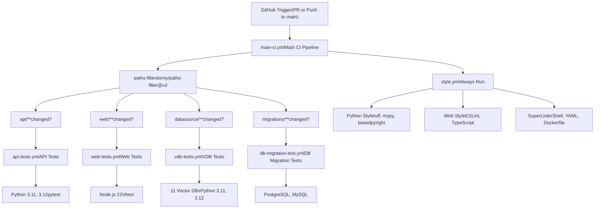
The `main-ci.yml` workflow acts as the orchestrator that determines which downstream workflows to execute based on file changes. The `check-changes` job uses `dorny/paths-filter@v3` to analyze modified files and outputs boolean flags for each test category.

**Sources:** [.github/workflows/main-ci.yml1-80](https://github.com/langgenius/dify/blob/92dbc94f/.github/workflows/main-ci.yml#L1-L80)

### Path Filter Configuration

| Output Flag | Triggers When | Downstream Workflow |
| --- | --- | --- |
| `api-changed` | `api/**`, `docker/**`, `.github/workflows/api-tests.yml` | `api-tests.yml` |
| `web-changed` | `web/**`, `.github/workflows/web-tests.yml` | `web-tests.yml` |
| `vdb-changed` | `api/core/rag/datasource/**`, `docker/**`, `api/uv.lock`, `api/pyproject.toml` | `vdb-tests.yml` |
| `migration-changed` | `api/migrations/**`, `.github/workflows/db-migration-test.yml` | `db-migration-test.yml` |

The style check workflow runs unconditionally on every PR and push to catch linting issues early.

**Sources:** [.github/workflows/main-ci.yml20-51](https://github.com/langgenius/dify/blob/92dbc94f/.github/workflows/main-ci.yml#L20-L51)

---

## Test Workflows

### API Tests Workflow

The `api-tests.yml` workflow executes unit and integration tests for the Python API backend.

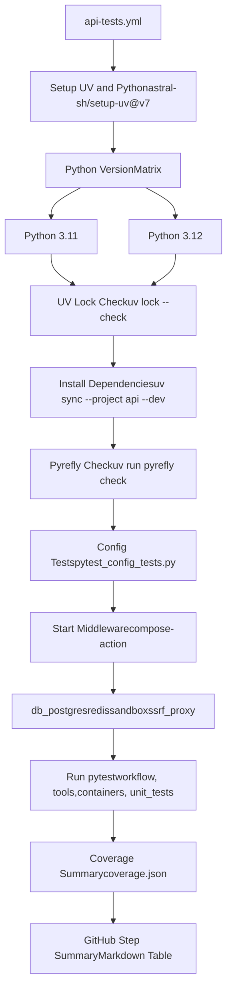
#### Test Execution Details

The workflow performs the following steps in sequence:

1.  **Environment Setup**: Installs UV package manager and Python using `astral-sh/setup-uv@v7` with caching enabled
2.  **Dependency Management**: Verifies `uv.lock` integrity and installs dependencies with `uv sync --project api --dev`
3.  **Static Analysis**: Runs `pyrefly check` for code quality validation
4.  **Configuration Tests**: Executes specialized config tests via `dev/pytest/pytest_config_tests.py`
5.  **Middleware Setup**: Starts PostgreSQL, Redis, Sandbox, and SSRF Proxy using `hoverkraft-tech/compose-action@v2`
6.  **Test Execution**: Runs pytest with 180-second timeout on:
    -   `api/tests/integration_tests/workflow`
    -   `api/tests/integration_tests/tools`
    -   `api/tests/test_containers_integration_tests`
    -   `api/tests/unit_tests`
7.  **Coverage Reporting**: Extracts coverage percentage from `coverage.json` and generates GitHub Step Summary

**Sources:** [.github/workflows/api-tests.yml1-105](https://github.com/langgenius/dify/blob/92dbc94f/.github/workflows/api-tests.yml#L1-L105)

#### Environment Configuration

```
# Storage configuration for tests
STORAGE_TYPE=opendal
OPENDAL_SCHEME=fs
OPENDAL_FS_ROOT=/tmp/dify-storage
```
Tests use OpenDAL with filesystem backend to avoid external dependencies during CI execution.

**Sources:** [.github/workflows/api-tests.yml76-79](https://github.com/langgenius/dify/blob/92dbc94f/.github/workflows/api-tests.yml#L76-L79)

### Web Tests Workflow

The `web-tests.yml` workflow validates the Next.js frontend using Vitest.

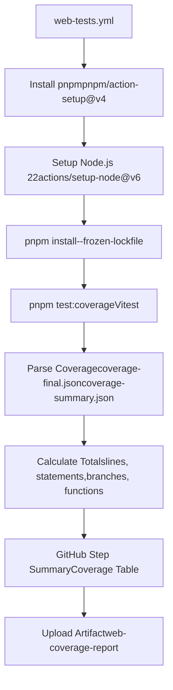
#### Coverage Processing Logic

The workflow includes sophisticated JavaScript code that processes Istanbul coverage data:

1.  **Coverage File Detection**: Checks for `coverage-summary.json` (preferred) or `coverage-final.json`
2.  **Metric Calculation**: Computes totals for lines, statements, branches, and functions
3.  **File-Level Analysis**: Generates per-file coverage percentages and identifies uncovered lines
4.  **Line Hit Calculation**: Falls back to statement-map-based line coverage if direct line hits unavailable
5.  **Output Formatting**: Creates Markdown tables with coverage metrics and uncovered line ranges

The coverage summary displays as a GitHub Step Summary with two expandable sections:

-   **Top-level summary**: Overall percentages and covered/total counts
-   **File coverage**: Lowest 25 files sorted by coverage percentage
-   **Vitest coverage table**: Complete file-by-file breakdown with uncovered line numbers

**Sources:** [.github/workflows/web-tests.yml1-369](https://github.com/langgenius/dify/blob/92dbc94f/.github/workflows/web-tests.yml#L1-L369)

### Vector Database Tests Workflow

The `vdb-tests.yml` workflow validates integration with 11 different vector database providers.

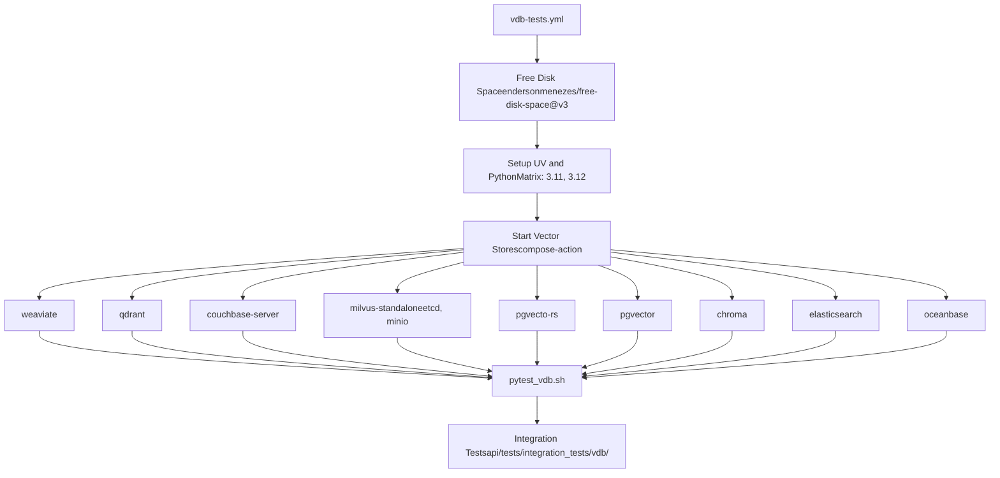
#### Vector Database Matrix

| Vector Database | Service Dependencies | Notes |
| --- | --- | --- |
| Weaviate | `weaviate` | Standalone service |
| Qdrant | `qdrant` | Standalone service |
| Couchbase | `couchbase-server` | Enterprise NoSQL with vector search |
| Milvus | `etcd`, `minio`, `milvus-standalone` | Requires object storage |
| PgVecto-RS | `pgvecto-rs` | PostgreSQL with Rust-based vectors |
| PgVector | `pgvector` | PostgreSQL with pgvector extension |
| Chroma | `chroma` | Standalone service |
| ElasticSearch | `elasticsearch` | Full-text with vector support |
| OceanBase | `oceanbase` | Distributed database |
| MyScale | Not in matrix | Commented out in workflow |
| TiDB | Not in matrix | Commented out in workflow |

The workflow uses `hoverkraft-tech/compose-action@v2.0.2` to orchestrate multiple Docker Compose services simultaneously. Tests are executed via `dev/pytest/pytest_vdb.sh`.

**Sources:** [.github/workflows/vdb-tests.yml1-91](https://github.com/langgenius/dify/blob/92dbc94f/.github/workflows/vdb-tests.yml#L1-L91)

### Database Migration Tests Workflow

The `db-migration-test.yml` workflow validates Flask-Migrate migrations for both PostgreSQL and MySQL.

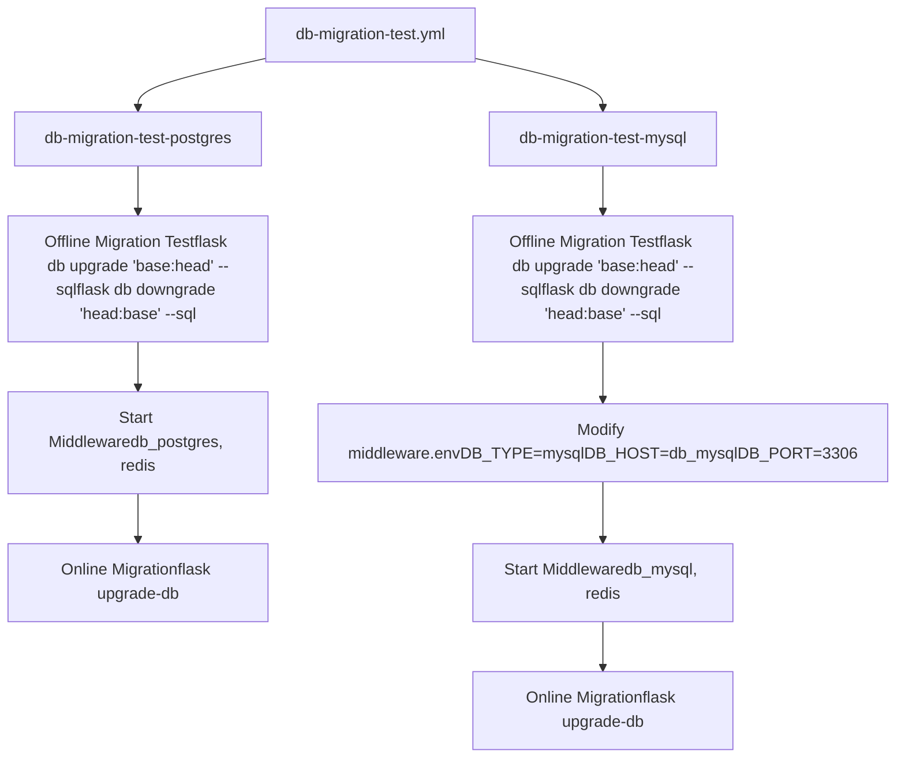
#### Migration Validation Strategy

The workflow validates migrations in two phases:

1.  **Offline Validation**: Generates SQL statements without connecting to a database

    -   Tests upgrade path: `flask db upgrade 'base:head' --sql`
    -   Tests downgrade path: `flask db downgrade 'head:base' --sql`
    -   Ensures migrations can be reviewed and applied manually if needed
2.  **Online Validation**: Applies migrations to running database instances

    -   PostgreSQL: Uses `db_postgres` service with default PostgreSQL settings
    -   MySQL: Uses `db_mysql` service with configuration overrides via `sed` commands

The MySQL job modifies `docker/middleware.env` to switch database type:

```
sed -i 's/DB_TYPE=postgresql/DB_TYPE=mysql/' middleware.env
sed -i 's/DB_HOST=db_postgres/DB_HOST=db_mysql/' middleware.env
sed -i 's/DB_PORT=5432/DB_PORT=3306/' middleware.env
sed -i 's/DB_USERNAME=postgres/DB_USERNAME=mysql/' middleware.env
```
**Sources:** [.github/workflows/db-migration-test.yml1-117](https://github.com/langgenius/dify/blob/92dbc94f/.github/workflows/db-migration-test.yml#L1-L117)

---

## Code Quality Workflows

### Style Check Workflow

The `style.yml` workflow enforces code quality standards across Python, JavaScript/TypeScript, and infrastructure files.

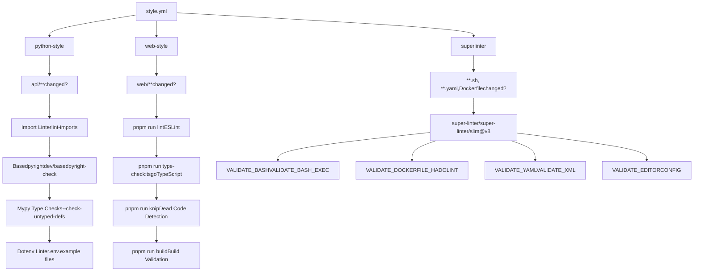
#### Python Style Checks

| Tool | Purpose | Configuration |
| --- | --- | --- |
| `lint-imports` | Validates import boundaries and architecture layers | Custom rules in project |
| `basedpyright` | Type checking with enhanced features | Executed via `dev/basedpyright-check` |
| `mypy` | Static type checking | `--exclude-gitignore --exclude tests/ --exclude migrations/ --check-untyped-defs` |
| `dotenv-linter` | Validates `.env.example` files | Checks `api/.env.example` and `web/.env.example` |

**Sources:** [.github/workflows/style.yml16-61](https://github.com/langgenius/dify/blob/92dbc94f/.github/workflows/style.yml#L16-L61)

#### Web Style Checks

| Tool | Purpose | Command |
| --- | --- | --- |
| ESLint | JavaScript/TypeScript linting | `pnpm run lint` |
| TypeScript Compiler | Type checking | `pnpm run type-check:tsgo` |
| Knip | Dead code detection | `pnpm run knip` |
| Build Validation | Ensures production build succeeds | `pnpm run build` |

The web checks run in the `web/` working directory with Node.js 22 and pnpm package manager.

**Sources:** [.github/workflows/style.yml62-122](https://github.com/langgenius/dify/blob/92dbc94f/.github/workflows/style.yml#L62-L122)

#### SuperLinter Configuration

SuperLinter validates shell scripts, YAML files, Dockerfiles, and EditorConfig compliance:

```
BASH_SEVERITY: warning
DEFAULT_BRANCH: origin/main
FILTER_REGEX_INCLUDE: pnpm-lock.yaml
IGNORE_GENERATED_FILES: true
IGNORE_GITIGNORED_FILES: true
VALIDATE_BASH: true
VALIDATE_BASH_EXEC: true
VALIDATE_DOCKERFILE_HADOLINT: true
VALIDATE_EDITORCONFIG: true
VALIDATE_XML: true
VALIDATE_YAML: true
```
Note: GitHub Actions workflow validation (`VALIDATE_GITHUB_ACTIONS`) is temporarily disabled pending fixes to `api-docker.yaml`'s run script for shellcheck compatibility.

**Sources:** [.github/workflows/style.yml123-165](https://github.com/langgenius/dify/blob/92dbc94f/.github/workflows/style.yml#L123-L165)

### Autofix Workflow

The `autofix.yml` workflow automatically corrects common code issues and commits fixes to pull requests.

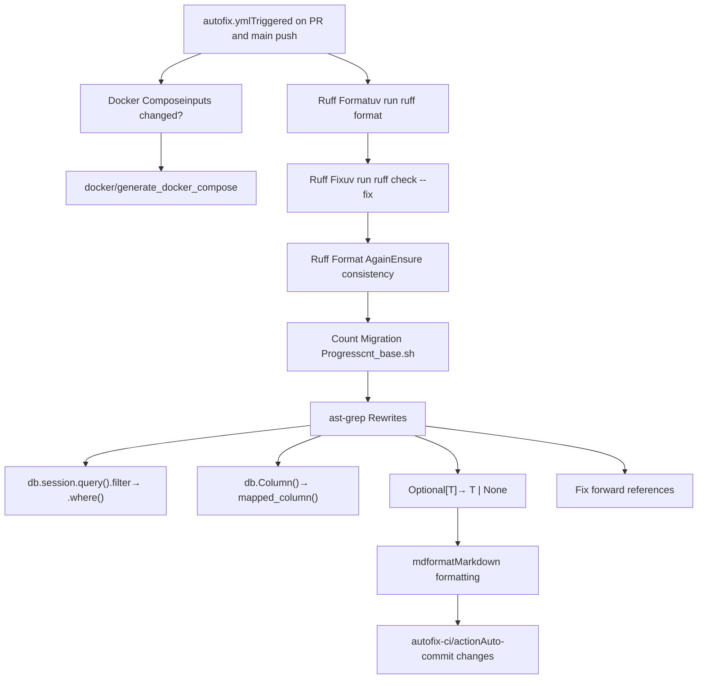
#### Automated Code Transformations

The workflow applies several automated code transformations using `ast-grep`:

1.  **SQLAlchemy 2.0 Migration**:

    -   `db.session.query($WHATEVER).filter($HERE)` → `db.session.query($WHATEVER).where($HERE)`
    -   `session.query($WHATEVER).filter($HERE)` → `session.query($WHATEVER).where($HERE)`
    -   `db.Column($$$B)` → `mapped_column($$$B)`
2.  **Type Annotation Modernization**:

    -   `Optional[T]` → `T | None` (using YAML rule definition)
    -   Handles forward references with special post-processing to avoid breaking quoted types
3.  **Markdown Formatting**:

    -   Runs `mdformat` on all markdown files except those with YAML front matter (`.claude/skills/**/SKILL.md`)

The workflow uses `autofix-ci/action@635ffb0c9798bd160680f18fd73371e355b85f27` to automatically commit changes back to the pull request.

**Sources:** [.github/workflows/autofix.yml1-88](https://github.com/langgenius/dify/blob/92dbc94f/.github/workflows/autofix.yml#L1-L88)

#### Docker Compose Generation

When Docker Compose template files change, the workflow regenerates `docker-compose.yaml`:

```
cd docker
./generate_docker_compose
```
This ensures the composed file stays in sync with templates and environment variable definitions.

**Sources:** [.github/workflows/autofix.yml17-36](https://github.com/langgenius/dify/blob/92dbc94f/.github/workflows/autofix.yml#L17-L36)

---

## Build and Deployment Pipeline

### Docker Build Workflow

The `build-push.yml` workflow builds multi-architecture Docker images and publishes them to Docker Hub.

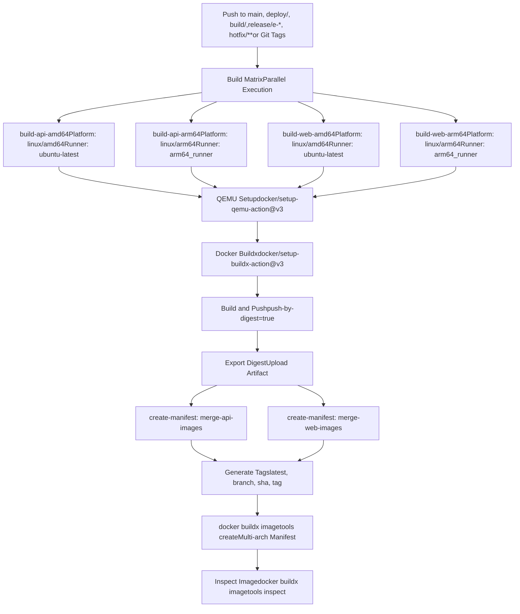
#### Build Matrix Configuration

| Service Name | Image Name Env | Context | Platforms | Runner |
| --- | --- | --- | --- | --- |
| `build-api-amd64` | `DIFY_API_IMAGE_NAME` | `api` | `linux/amd64` | `ubuntu-latest` |
| `build-api-arm64` | `DIFY_API_IMAGE_NAME` | `api` | `linux/arm64` | `arm64_runner` |
| `build-web-amd64` | `DIFY_WEB_IMAGE_NAME` | `web` | `linux/amd64` | `ubuntu-latest` |
| `build-web-arm64` | `DIFY_WEB_IMAGE_NAME` | `web` | `linux/arm64` | `arm64_runner` |

The workflow uses dedicated ARM64 runners (`arm64_runner`) for native ARM builds, which significantly improves build performance compared to QEMU emulation.

**Sources:** [.github/workflows/build-push.yml24-47](https://github.com/langgenius/dify/blob/92dbc94f/.github/workflows/build-push.yml#L24-L47)

#### Build Configuration

```
- name: Build Docker image
  uses: docker/build-push-action@v6
  with:
    context: "{{defaultContext}}:${{ matrix.context }}"
    platforms: ${{ matrix.platform }}
    build-args: COMMIT_SHA=${{ fromJSON(steps.meta.outputs.json).labels['org.opencontainers.image.revision'] }}
    labels: ${{ steps.meta.outputs.labels }}
    outputs: type=image,name=${{ env[matrix.image_name_env] }},push-by-digest=true,name-canonical=true,push=true
    cache-from: type=gha,scope=${{ matrix.service_name }}
    cache-to: type=gha,mode=max,scope=${{ matrix.service_name }}
```
Key configuration details:

-   **Build Context**: Uses `{{defaultContext}}` with context path appended
-   **Build Args**: Injects `COMMIT_SHA` from Git metadata
-   **Push Strategy**: Uses digest-based pushing (`push-by-digest=true`) for manifest creation
-   **Caching**: Leverages GitHub Actions cache with service-specific scope

**Sources:** [.github/workflows/build-push.yml72-83](https://github.com/langgenius/dify/blob/92dbc94f/.github/workflows/build-push.yml#L72-L83)

### Manifest Creation

The `create-manifest` job runs after all platform builds complete and merges them into multi-architecture manifests.

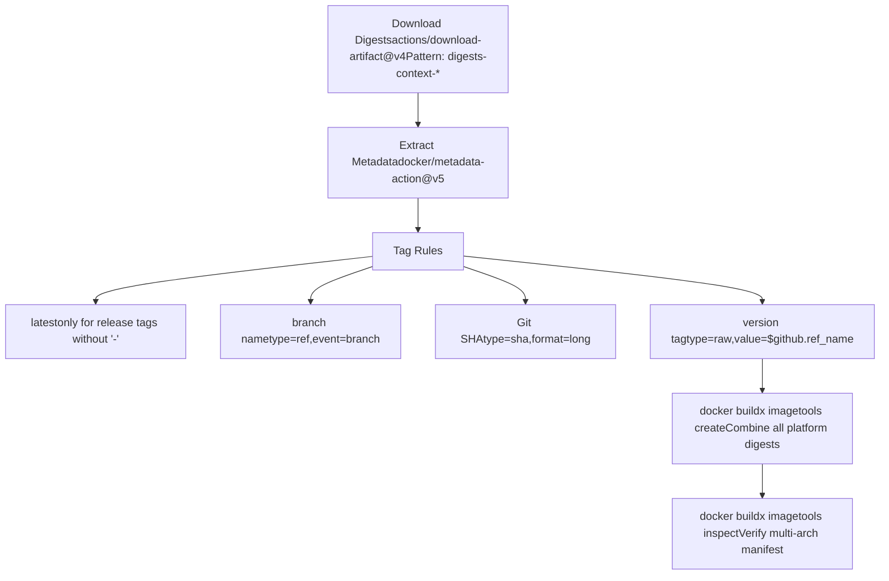
#### Tag Generation Rules

```
tags: |
  type=raw,value=latest,enable=${{ startsWith(github.ref, 'refs/tags/') && !contains(github.ref, '-') }}
  type=ref,event=branch
  type=sha,enable=true,priority=100,prefix=,suffix=,format=long
  type=raw,value=${{ github.ref_name }},enable=${{ startsWith(github.ref, 'refs/tags/') }}
```
The workflow generates four types of tags:

1.  **`latest`**: Only for release tags without hyphens (stable releases)
2.  **Branch name**: For branch pushes (e.g., `main`, `deploy/staging`)
3.  **Git SHA**: Long format SHA for precise version tracking
4.  **Version tag**: The exact tag name for Git tag pushes

**Sources:** [.github/workflows/build-push.yml100-152](https://github.com/langgenius/dify/blob/92dbc94f/.github/workflows/build-push.yml#L100-L152)

#### Manifest Creation Command

```
docker buildx imagetools create $(jq -cr '.tags | map("-t " + .) | join(" ")' <<< "$DOCKER_METADATA_OUTPUT_JSON") \
  $(printf "$IMAGE_NAME@sha256:%s " *)
```
This command:

1.  Extracts tags from `DOCKER_METADATA_OUTPUT_JSON` using `jq`
2.  Formats them as `-t` arguments
3.  Appends all digest files from `/tmp/digests/` directory
4.  Creates a manifest list referencing all platform-specific images

**Sources:** [.github/workflows/build-push.yml138-144](https://github.com/langgenius/dify/blob/92dbc94f/.github/workflows/build-push.yml#L138-L144)

---

## Additional Automation Workflows

### i18n Translation Workflow

The `translate-i18n-base-on-english.yml` workflow automatically generates translations when English source files change.

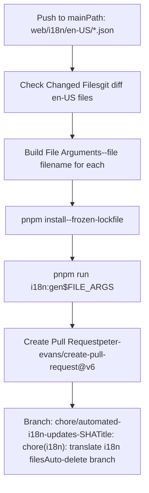
The workflow:

1.  Detects changes to `web/i18n/en-US/*.json` files
2.  Extracts changed filenames and builds `--file` arguments
3.  Runs `pnpm run i18n:gen` with specific file arguments
4.  Creates an automated PR with translated files for all locales
5.  Uses branch naming `chore/automated-i18n-updates-<SHA>` with auto-delete enabled

**Sources:** [.github/workflows/translate-i18n-base-on-english.yml1-86](https://github.com/langgenius/dify/blob/92dbc94f/.github/workflows/translate-i18n-base-on-english.yml#L1-L86)

### SDK Tests Workflow

The `tool-test-sdks.yaml` workflow validates the Node.js SDK across multiple Node.js versions.

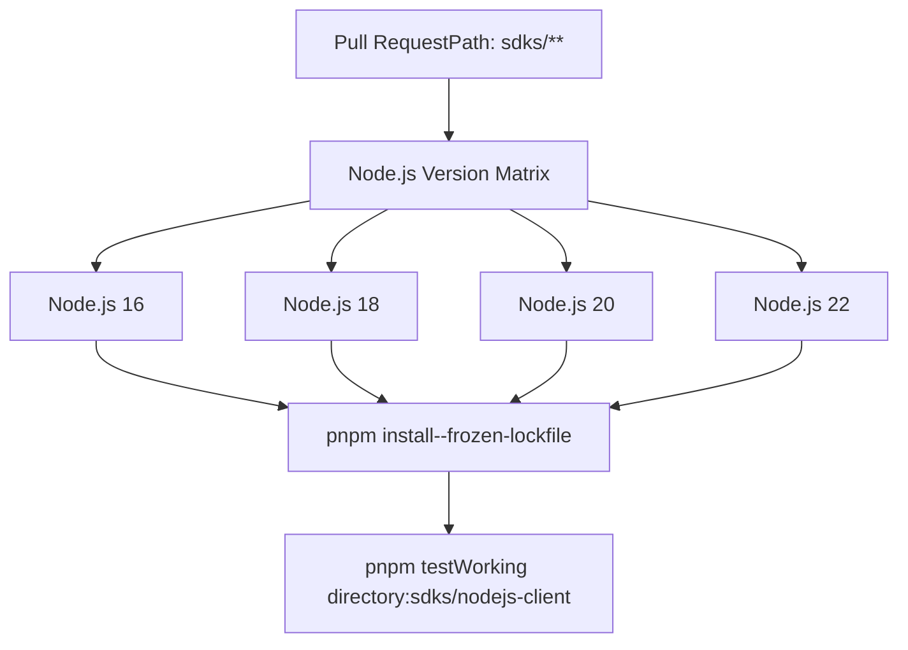
The workflow tests SDK compatibility across Node.js LTS versions (16, 18, 20) and the latest version (22), ensuring the SDK works across different runtime environments.

**Sources:** [.github/workflows/tool-test-sdks.yaml1-44](https://github.com/langgenius/dify/blob/92dbc94f/.github/workflows/tool-test-sdks.yaml#L1-L44)

---

## Workflow Trigger Summary

| Workflow | Trigger | Frequency | Scope |
| --- | --- | --- | --- |
| `main-ci.yml` | PR to main, push to main | Every PR and merge | Orchestrator for all tests |
| `style.yml` | Called by main-ci | Every PR and merge | Always runs |
| `api-tests.yml` | Called by main-ci | When `api/**` changes | Conditional |
| `web-tests.yml` | Called by main-ci | When `web/**` changes | Conditional |
| `vdb-tests.yml` | Called by main-ci | When datasource code changes | Conditional |
| `db-migration-test.yml` | Called by main-ci | When migrations change | Conditional |
| `autofix.yml` | PR to main, push to main | Every PR and merge | Auto-commits fixes |
| `build-push.yml` | Push to main, tags, special branches | On main merge, releases | Deployment |
| `translate-i18n-base-on-english.yml` | Push to main | When en-US i18n changes | Automation |
| `tool-test-sdks.yaml` | PR to main | When `sdks/**` changes | SDK validation |

---

## Concurrency Controls

All workflows implement concurrency controls to prevent redundant executions:

```
concurrency:
  group: workflow-name-${{ github.head_ref || github.run_id }}
  cancel-in-progress: true
```
This configuration:

-   Groups workflow runs by PR branch (`github.head_ref`) or unique run ID
-   Cancels in-progress runs when new commits are pushed
-   Reduces CI queue time and resource consumption

**Sources:** [.github/workflows/main-ci.yml15-17](https://github.com/langgenius/dify/blob/92dbc94f/.github/workflows/main-ci.yml#L15-L17) [.github/workflows/style.yml6-8](https://github.com/langgenius/dify/blob/92dbc94f/.github/workflows/style.yml#L6-L8) [.github/workflows/api-tests.yml6-8](https://github.com/langgenius/dify/blob/92dbc94f/.github/workflows/api-tests.yml#L6-L8) [.github/workflows/web-tests.yml6-8](https://github.com/langgenius/dify/blob/92dbc94f/.github/workflows/web-tests.yml#L6-L8)

---

## Performance Optimizations

### Caching Strategy

| Workflow | Cache Type | Scope | Benefits |
| --- | --- | --- | --- |
| API Tests | UV cache | `api/uv.lock` | Faster dependency installation |
| Web Tests | pnpm cache | `web/pnpm-lock.yaml` | Cached Node.js packages |
| Style Check | UV cache, pnpm cache | Lock files | Skip unchanged dependencies |
| Build Pipeline | GitHub Actions cache | Service name scoped | Docker layer caching |

### Conditional Execution

The path filter system significantly reduces unnecessary test execution:

-   **Before**: All tests run on every PR (>15 minutes)
-   **After**: Only relevant tests run based on changed files (as low as 3-5 minutes for single-domain changes)

### Parallel Execution

The build pipeline parallelizes multi-architecture builds:

-   AMD64 builds run on `ubuntu-latest` runners
-   ARM64 builds run on dedicated `arm64_runner` runners
-   Both architectures build simultaneously, reducing total build time by ~50%

**Sources:** [.github/workflows/build-push.yml26-27](https://github.com/langgenius/dify/blob/92dbc94f/.github/workflows/build-push.yml#L26-L27)
