# Testing Infrastructure

Relevant source files

-   [.github/workflows/api-tests.yml](https://github.com/langgenius/dify/blob/92dbc94f/.github/workflows/api-tests.yml)
-   [.github/workflows/autofix.yml](https://github.com/langgenius/dify/blob/92dbc94f/.github/workflows/autofix.yml)
-   [.github/workflows/build-push.yml](https://github.com/langgenius/dify/blob/92dbc94f/.github/workflows/build-push.yml)
-   [.github/workflows/db-migration-test.yml](https://github.com/langgenius/dify/blob/92dbc94f/.github/workflows/db-migration-test.yml)
-   [.github/workflows/deploy-agent-dev.yml](https://github.com/langgenius/dify/blob/92dbc94f/.github/workflows/deploy-agent-dev.yml)
-   [.github/workflows/deploy-dev.yml](https://github.com/langgenius/dify/blob/92dbc94f/.github/workflows/deploy-dev.yml)
-   [.github/workflows/deploy-hitl.yml](https://github.com/langgenius/dify/blob/92dbc94f/.github/workflows/deploy-hitl.yml)
-   [.github/workflows/docker-build.yml](https://github.com/langgenius/dify/blob/92dbc94f/.github/workflows/docker-build.yml)
-   [.github/workflows/main-ci.yml](https://github.com/langgenius/dify/blob/92dbc94f/.github/workflows/main-ci.yml)
-   [.github/workflows/stale.yml](https://github.com/langgenius/dify/blob/92dbc94f/.github/workflows/stale.yml)
-   [.github/workflows/style.yml](https://github.com/langgenius/dify/blob/92dbc94f/.github/workflows/style.yml)
-   [.github/workflows/tool-test-sdks.yaml](https://github.com/langgenius/dify/blob/92dbc94f/.github/workflows/tool-test-sdks.yaml)
-   [.github/workflows/translate-i18n-claude.yml](https://github.com/langgenius/dify/blob/92dbc94f/.github/workflows/translate-i18n-claude.yml)
-   [.github/workflows/trigger-i18n-sync.yml](https://github.com/langgenius/dify/blob/92dbc94f/.github/workflows/trigger-i18n-sync.yml)
-   [.github/workflows/vdb-tests.yml](https://github.com/langgenius/dify/blob/92dbc94f/.github/workflows/vdb-tests.yml)
-   [.github/workflows/web-tests.yml](https://github.com/langgenius/dify/blob/92dbc94f/.github/workflows/web-tests.yml)
-   [api/Dockerfile](https://github.com/langgenius/dify/blob/92dbc94f/api/Dockerfile)
-   [api/migrations/README](https://github.com/langgenius/dify/blob/92dbc94f/api/migrations/README)
-   [web/.nvmrc](https://github.com/langgenius/dify/blob/92dbc94f/web/.nvmrc)
-   [web/Dockerfile](https://github.com/langgenius/dify/blob/92dbc94f/web/Dockerfile)
-   [web/README.md](https://github.com/langgenius/dify/blob/92dbc94f/web/README.md)
-   [web/i18n-config/README.md](https://github.com/langgenius/dify/blob/92dbc94f/web/i18n-config/README.md)

This document describes the testing infrastructure in the Dify codebase, including test organization, execution environments, CI/CD integration, and coverage reporting. For information about local development setup, see [Development Environment Setup](/langgenius/dify/10.1-development-environment-setup). For CI/CD pipeline architecture, see [CI/CD Pipeline Architecture](/langgenius/dify/10.2-cicd-pipeline-architecture). For code quality tools and linting, see [Code Quality and Linting](/langgenius/dify/10.4-code-quality-and-linting).

## Overview

The Dify testing infrastructure consists of multiple test suites executed in parallel through GitHub Actions workflows:

-   **API Tests**: Unit tests, integration tests, and workflow/tool tests for the Python backend
-   **Web Tests**: Component and unit tests for the Next.js frontend using Vitest
-   **VDB Tests**: Integration tests for 10+ vector database implementations
-   **Migration Tests**: Database schema migration validation for PostgreSQL and MySQL
-   **Style Checks**: Linting, type checking, and code quality validation

All test workflows support Python 3.11 and 3.12, use UV for Python dependency management, and execute conditionally based on changed files to optimize CI/CD runtime.

---

## Test Suite Organization

```mermaid
flowchart TD
    UnitTests["Unit Testsapi/tests/unit_tests/"]
    IntegTests["Integration Testsworkflow/, tools/"]
    ContainerTests["Test Containerstest_containers_integration_tests/"]
    ConfigTests["Config Testsdev/pytest/pytest_config_tests.py"]
    ComponentTests["Component Tests*.spec.tsx"]
    UtilTests["Utility Tests*.spec.ts"]
    BuildTests["Build Validationpnpm run build"]
    WeaviateTest["Weaviate Tests"]
    QdrantTest["Qdrant Tests"]
    PGVectorTest["PGVector Tests"]
    MilvusTest["Milvus Tests"]
    ChromaTest["Chroma Tests"]
    ElasticTest["ElasticSearch Tests"]
    OtherVDB["8+ more VDB tests"]
    OfflineMigration["Offline MigrationSQL generation"]
    OnlineMigrationPG["Online MigrationPostgreSQL"]
    OnlineMigrationMySQL["Online MigrationMySQL"]
    PythonStyle["Python StyleRuff, Mypy, Basedpyright"]
    WebStyle["Web StyleESLint, TypeScript"]
    SuperLinter["Shell/YAML/DockerSuper-linter"]
    MainCI["main-ci.ymlOrchestrator"]

    MainCI --> UnitTests
    MainCI --> IntegTests
    MainCI --> ContainerTests
    MainCI --> ConfigTests
    MainCI --> ComponentTests
    MainCI --> UtilTests
    MainCI --> BuildTests
    MainCI --> WeaviateTest
    MainCI --> QdrantTest
    MainCI --> PGVectorTest
    MainCI --> OfflineMigration
    MainCI --> OnlineMigrationPG
    MainCI --> OnlineMigrationMySQL
    MainCI --> PythonStyle
    MainCI --> WebStyle
    MainCI --> SuperLinter
```
**Sources:** [.github/workflows/main-ci.yml1-80](https://github.com/langgenius/dify/blob/92dbc94f/.github/workflows/main-ci.yml#L1-L80) [.github/workflows/api-tests.yml1-99](https://github.com/langgenius/dify/blob/92dbc94f/.github/workflows/api-tests.yml#L1-L99) [.github/workflows/web-tests.yml1-414](https://github.com/langgenius/dify/blob/92dbc94f/.github/workflows/web-tests.yml#L1-L414) [.github/workflows/vdb-tests.yml1-91](https://github.com/langgenius/dify/blob/92dbc94f/.github/workflows/vdb-tests.yml#L1-L91) [.github/workflows/db-migration-test.yml1-117](https://github.com/langgenius/dify/blob/92dbc94f/.github/workflows/db-migration-test.yml#L1-L117)

---

## API Testing Infrastructure

### Test Runner Configuration

The API tests use `pytest` as the test runner with the following configuration:

| Configuration | Value | Purpose |
| --- | --- | --- |
| Test Runner | `uv run --project api pytest` | Executes tests with UV-managed dependencies |
| Timeout | `${PYTEST_TIMEOUT:-180}` seconds | Prevents hanging tests (default 3 minutes) |
| Python Versions | 3.11, 3.12 | Matrix testing for version compatibility |
| Coverage Output | `coverage.json` | JSON format for programmatic parsing |
| Storage Backend | `opendal` with `fs` scheme | File system storage for test isolation |

**Sources:** [.github/workflows/api-tests.yml74-79](https://github.com/langgenius/dify/blob/92dbc94f/.github/workflows/api-tests.yml#L74-L79)

### Test Categories

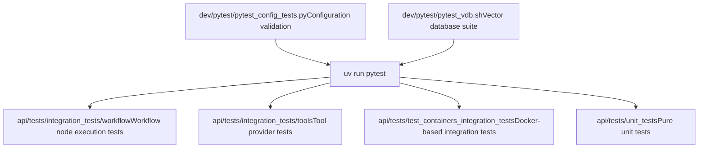
**Sources:** [.github/workflows/api-tests.yml42-79](https://github.com/langgenius/dify/blob/92dbc94f/.github/workflows/api-tests.yml#L42-L79) [.github/workflows/vdb-tests.yml89-90](https://github.com/langgenius/dify/blob/92dbc94f/.github/workflows/vdb-tests.yml#L89-L90)

### Test Environment Setup

The API test environment requires specific middleware services orchestrated through Docker Compose:

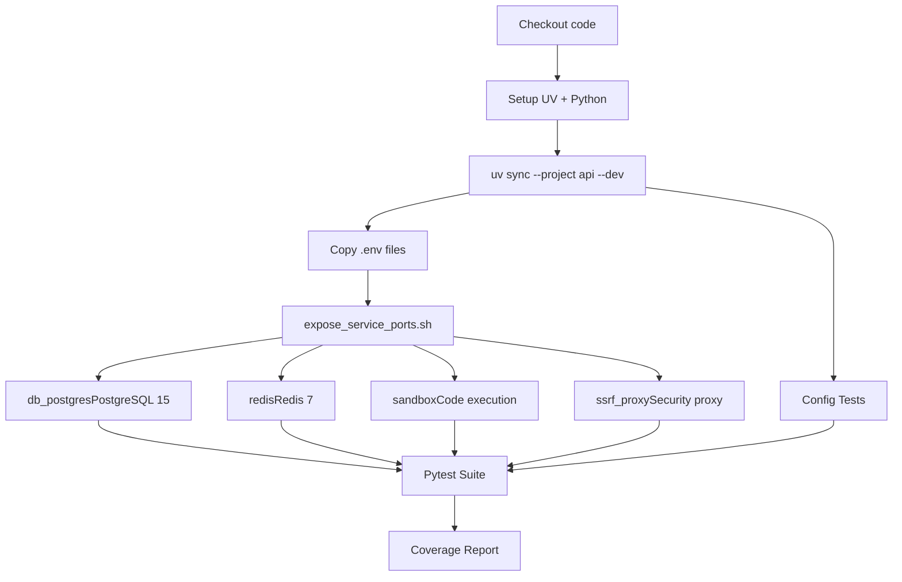
**Sources:** [.github/workflows/api-tests.yml23-79](https://github.com/langgenius/dify/blob/92dbc94f/.github/workflows/api-tests.yml#L23-L79)

The environment configuration includes:

-   **Environment Files**: Copied from `docker/.env.example` to `docker/.env` and `docker/middleware.env.example` to `docker/middleware.env`
-   **Test Configuration**: Copied from `api/tests/integration_tests/.env.example` to `api/tests/integration_tests/.env`
-   **Storage Setup**: `STORAGE_TYPE=opendal`, `OPENDAL_SCHEME=fs`, `OPENDAL_FS_ROOT=/tmp/dify-storage`

**Sources:** [.github/workflows/api-tests.yml45-72](https://github.com/langgenius/dify/blob/92dbc94f/.github/workflows/api-tests.yml#L45-L72)

---

## Web Testing Infrastructure

### Test Framework

The web frontend uses Vitest and React Testing Library for testing:

| Component | Tool | Purpose |
| --- | --- | --- |
| Test Runner | Vitest | Fast unit test execution with HMR |
| Component Testing | React Testing Library | User-centric component testing |
| Coverage | Istanbul (c8) | Code coverage measurement |
| Build Validation | Next.js build | Production build verification |

**Sources:** [web/README.md110-138](https://github.com/langgenius/dify/blob/92dbc94f/web/README.md#L110-L138)

### Test Execution

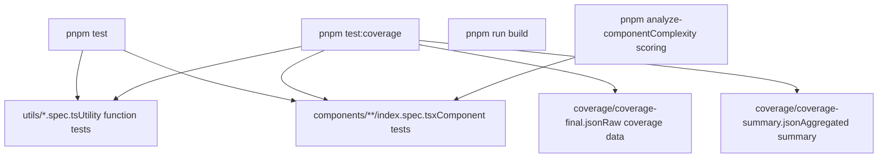
**Sources:** [web/README.md110-138](https://github.com/langgenius/dify/blob/92dbc94f/web/README.md#L110-L138) [.github/workflows/web-tests.yml19-43](https://github.com/langgenius/dify/blob/92dbc94f/.github/workflows/web-tests.yml#L19-L43)

### Coverage Reporting

The web test workflow generates detailed coverage reports with file-level granularity. The coverage calculation logic handles both `coverage-final.json` and `coverage-summary.json` formats:

**Line Coverage Calculation Methods** (in priority order):

1.  Pre-computed `lineHits` object (`entry.l`)
2.  Istanbul FileCoverage API (`fileCoverage.getLineCoverage()`)
3.  Statement map transformation (`getLineCoverageFromStatements`)

**Coverage Metrics Reported**:

-   Lines coverage
-   Statements coverage
-   Branches coverage
-   Functions coverage
-   Uncovered line ranges (formatted as `1-5,10,15-20`)

**Sources:** [.github/workflows/web-tests.yml44-359](https://github.com/langgenius/dify/blob/92dbc94f/.github/workflows/web-tests.yml#L44-L359)

---

## Vector Database Testing

### Supported Databases

The VDB test suite validates integration with 10+ vector database implementations:

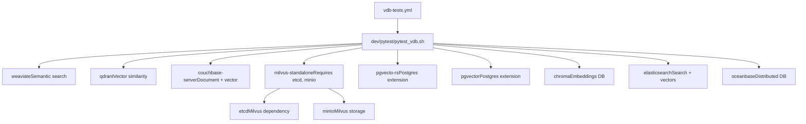
**Sources:** [.github/workflows/vdb-tests.yml62-78](https://github.com/langgenius/dify/blob/92dbc94f/.github/workflows/vdb-tests.yml#L62-L78)

### Test Environment

The VDB tests require additional disk space and run with specific optimizations:

| Configuration | Value | Purpose |
| --- | --- | --- |
| Disk Cleanup | `free-disk-space@v3` | Removes .NET, Haskell, tool cache |
| Python Matrix | 3.11, 3.12 | Multi-version validation |
| Services File | `docker/docker-compose.yaml` | VDB service definitions |
| Test Script | `dev/pytest/pytest_vdb.sh` | VDB-specific test runner |

**Sources:** [.github/workflows/vdb-tests.yml26-90](https://github.com/langgenius/dify/blob/92dbc94f/.github/workflows/vdb-tests.yml#L26-L90)

---

## Database Migration Testing

### Offline Migration Validation

Offline migration tests validate that migrations can be generated as SQL without database connectivity:

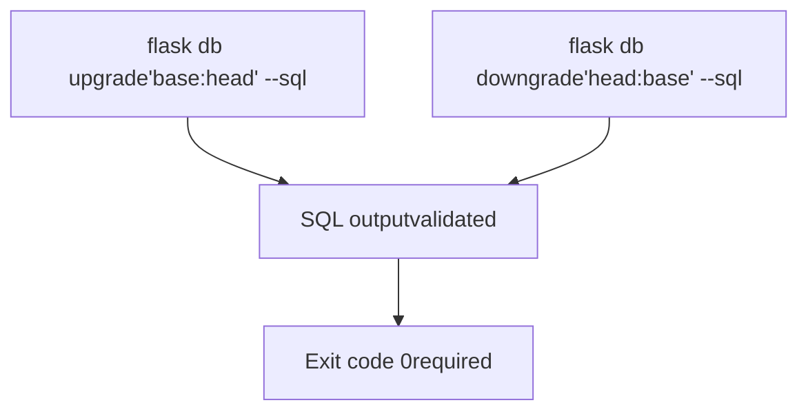
**Sources:** [.github/workflows/db-migration-test.yml30-35](https://github.com/langgenius/dify/blob/92dbc94f/.github/workflows/db-migration-test.yml#L30-L35)

### Online Migration Validation

Online migration tests execute migrations against real databases to ensure they succeed in production-like environments:

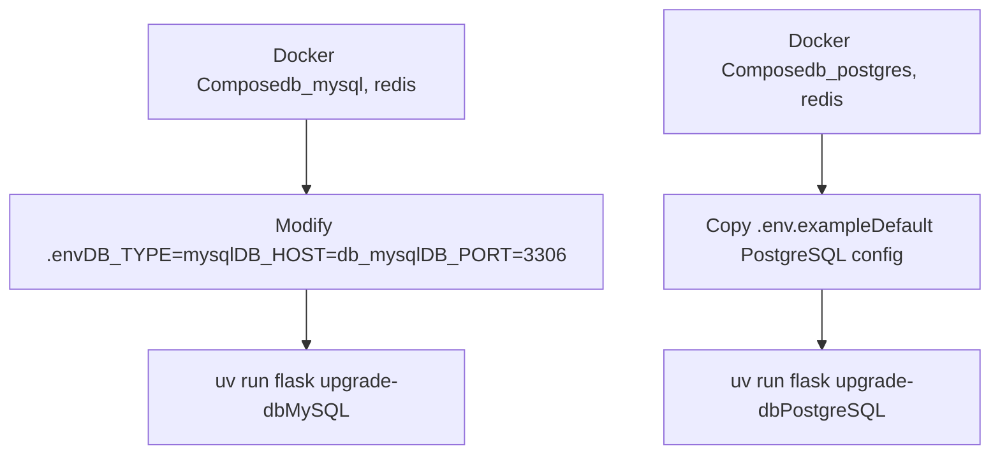
**Sources:** [.github/workflows/db-migration-test.yml37-116](https://github.com/langgenius/dify/blob/92dbc94f/.github/workflows/db-migration-test.yml#L37-L116)

### Configuration Transformations for MySQL

The MySQL migration test requires environment variable transformations:

```
# From docker/middleware.env
sed -i 's/DB_TYPE=postgresql/DB_TYPE=mysql/' middleware.env
sed -i 's/DB_HOST=db_postgres/DB_HOST=db_mysql/' middleware.env
sed -i 's/DB_PORT=5432/DB_PORT=3306/' middleware.env
sed -i 's/DB_USERNAME=postgres/DB_USERNAME=mysql/' middleware.env

# From api/.env
sed -i 's/DB_TYPE=postgresql/DB_TYPE=mysql/' .env
sed -i 's/DB_PORT=5432/DB_PORT=3306/' .env
sed -i 's/DB_USERNAME=postgres/DB_USERNAME=root/' .env
```
**Sources:** [.github/workflows/db-migration-test.yml87-111](https://github.com/langgenius/dify/blob/92dbc94f/.github/workflows/db-migration-test.yml#L87-L111)

---

## Code Quality and Linting

### Python Style Checks

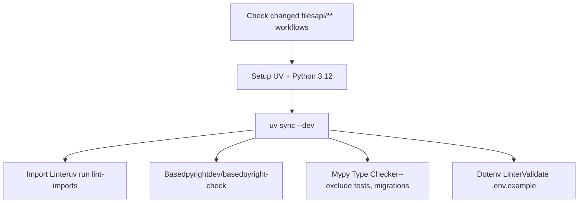
**Sources:** [.github/workflows/style.yml16-61](https://github.com/langgenius/dify/blob/92dbc94f/.github/workflows/style.yml#L16-L61)

**Mypy Configuration**:

-   Excludes: `tests/`, `migrations/`
-   Flags: `--check-untyped-defs`, `--disable-error-code=import-untyped`
-   Scope: All files matching `--exclude-gitignore`

**Sources:** [.github/workflows/style.yml54-56](https://github.com/langgenius/dify/blob/92dbc94f/.github/workflows/style.yml#L54-L56)

### Web Style Checks

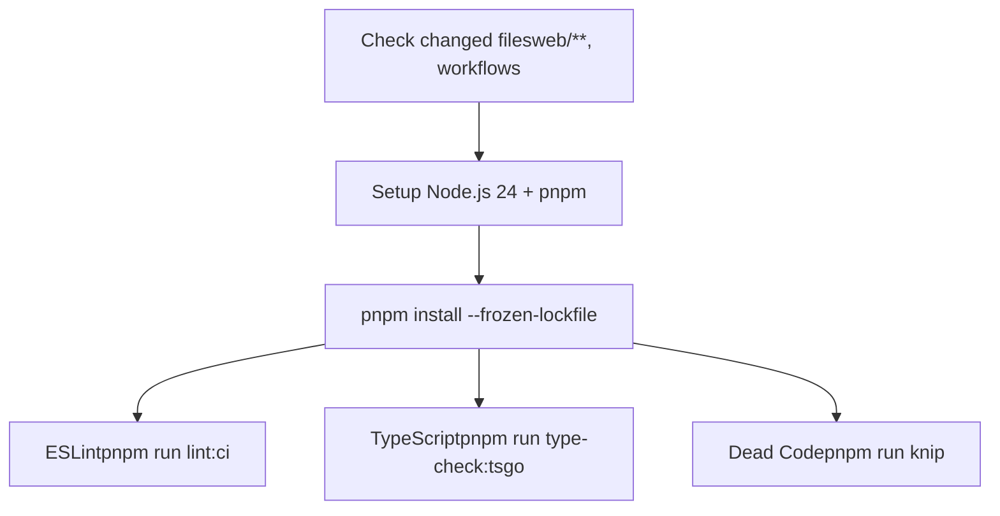
**Sources:** [.github/workflows/style.yml62-129](https://github.com/langgenius/dify/blob/92dbc94f/.github/workflows/style.yml#L62-L129)

### SuperLinter Configuration

SuperLinter validates shell scripts, YAML files, and Dockerfiles:

| Validator | Enabled | Severity |
| --- | --- | --- |
| BASH | ✓ | warning |
| BASH\_EXEC | ✓ | \- |
| DOCKERFILE\_HADOLINT | ✓ | \- |
| EDITORCONFIG | ✓ | \- |
| XML | ✓ | \- |
| YAML | ✓ | \- |

**File Filters**:

-   Includes: `**.sh`, `**.yaml`, `**.yml`, `**Dockerfile`, `dev/**`, `.editorconfig`
-   Excludes: Gitignored files, generated files

**Sources:** [.github/workflows/style.yml130-172](https://github.com/langgenius/dify/blob/92dbc94f/.github/workflows/style.yml#L130-L172)

---

## CI/CD Pipeline Integration

### Conditional Test Execution

The main CI pipeline uses path filtering to execute only relevant test suites:

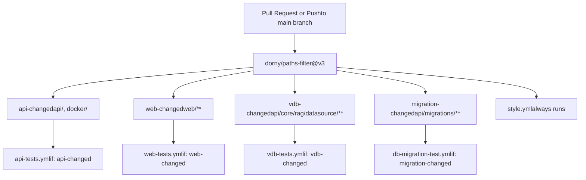
**Sources:** [.github/workflows/main-ci.yml20-79](https://github.com/langgenius/dify/blob/92dbc94f/.github/workflows/main-ci.yml#L20-L79)

### Concurrency Control

All test workflows implement concurrency control to cancel redundant runs:

```
concurrency:
  group: <workflow-name>-${{ github.head_ref || github.run_id }}
  cancel-in-progress: true
```
This pattern:

-   Groups by workflow name + branch/run ID
-   Cancels previous runs when new commits are pushed
-   Reduces CI/CD resource consumption

**Sources:** [.github/workflows/api-tests.yml6-8](https://github.com/langgenius/dify/blob/92dbc94f/.github/workflows/api-tests.yml#L6-L8) [.github/workflows/web-tests.yml6-8](https://github.com/langgenius/dify/blob/92dbc94f/.github/workflows/web-tests.yml#L6-L8) [.github/workflows/vdb-tests.yml6-8](https://github.com/langgenius/dify/blob/92dbc94f/.github/workflows/vdb-tests.yml#L6-L8)

---

## Coverage Reporting

### API Coverage Workflow

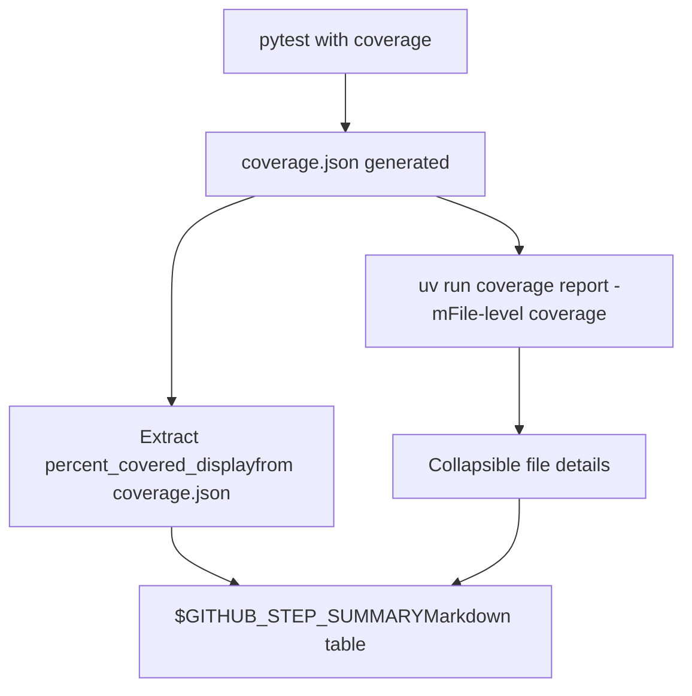
**Sources:** [.github/workflows/api-tests.yml81-98](https://github.com/langgenius/dify/blob/92dbc94f/.github/workflows/api-tests.yml#L81-L98)

**Coverage Summary Format**:

```
### Test Coverage Summary :test_tube:
Total Coverage: 85.42%

<details><summary>File-level coverage (click to expand)</summary>
```
\[detailed file-by-file coverage report\]

```
</details>
```
### Web Coverage Workflow

The web coverage workflow provides comprehensive metrics across multiple dimensions:

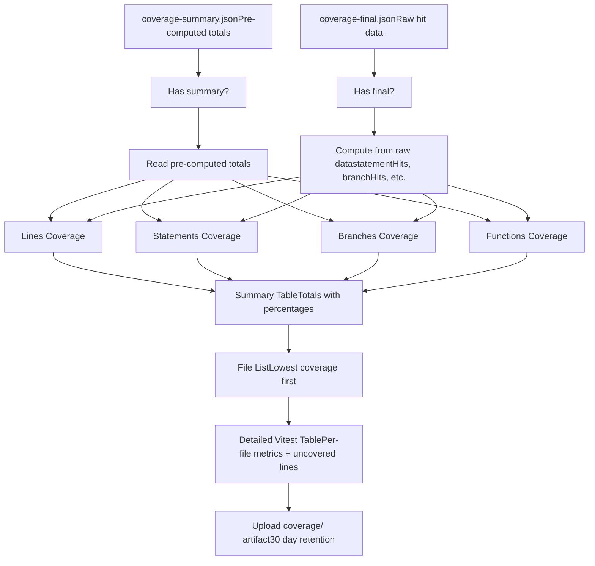
**Sources:** [.github/workflows/web-tests.yml44-368](https://github.com/langgenius/dify/blob/92dbc94f/.github/workflows/web-tests.yml#L44-L368)

**Uncovered Line Formatting**:

-   Detects uncovered lines from hit data
-   Formats as ranges: `1-5,10,15-20`
-   Handles edge cases (no line data, missing fileCoverage API)

**Sources:** [.github/workflows/web-tests.yml249-269](https://github.com/langgenius/dify/blob/92dbc94f/.github/workflows/web-tests.yml#L249-L269)

### Coverage Artifact Upload

Both API and web tests preserve coverage data as GitHub artifacts:

| Workflow | Artifact Name | Path | Retention |
| --- | --- | --- | --- |
| Web Tests | `web-coverage-report` | `web/coverage` | 30 days |
| API Tests | (Inline in summary) | \- | N/A |

**Sources:** [.github/workflows/web-tests.yml361-368](https://github.com/langgenius/dify/blob/92dbc94f/.github/workflows/web-tests.yml#L361-L368)

---

## Test Execution Commands

### API Test Commands

```
# Run config tests
uv run --project api dev/pytest/pytest_config_tests.py

# Run main test suite
uv run --project api pytest \
  --timeout 180 \
  api/tests/integration_tests/workflow \
  api/tests/integration_tests/tools \
  api/tests/test_containers_integration_tests \
  api/tests/unit_tests

# Run VDB tests
uv run --project api bash dev/pytest/pytest_vdb.sh

# Generate coverage report
uv run --project api coverage report -m
```
**Sources:** [.github/workflows/api-tests.yml42-95](https://github.com/langgenius/dify/blob/92dbc94f/.github/workflows/api-tests.yml#L42-L95) [.github/workflows/vdb-tests.yml90](https://github.com/langgenius/dify/blob/92dbc94f/.github/workflows/vdb-tests.yml#L90-L90)

### Web Test Commands

```
# Install dependencies
pnpm install --frozen-lockfile

# Run tests with coverage
pnpm test:coverage

# Validate production build
pnpm run build

# Analyze component complexity
pnpm analyze-component app/components/your-component/index.tsx
```
**Sources:** [.github/workflows/web-tests.yml39-42](https://github.com/langgenius/dify/blob/92dbc94f/.github/workflows/web-tests.yml#L39-L42) [web/README.md116-138](https://github.com/langgenius/dify/blob/92dbc94f/web/README.md#L116-L138)

### Migration Test Commands

```
# Offline migration validation
uv run --directory api flask db upgrade 'base:head' --sql
uv run --directory api flask db downgrade 'head:base' --sql

# Online migration execution
uv run --directory api flask upgrade-db
```
**Sources:** [.github/workflows/db-migration-test.yml30-59](https://github.com/langgenius/dify/blob/92dbc94f/.github/workflows/db-migration-test.yml#L30-L59)

---

## Test Container Management

### Docker Compose Service Definitions

The test infrastructure uses Docker Compose with profile-based service activation:

**API Tests Services**:

-   `db_postgres` - PostgreSQL 15 database
-   `redis` - Redis 7 cache/queue
-   `sandbox` - Code execution sandbox
-   `ssrf_proxy` - Security proxy (squid)

**VDB Tests Services**:

-   Base services (weaviate, qdrant, pgvector, etc.)
-   Supporting services (etcd, minio for Milvus)
-   Specialized databases (couchbase, elasticsearch, oceanbase)

**Sources:** [.github/workflows/api-tests.yml50-62](https://github.com/langgenius/dify/blob/92dbc94f/.github/workflows/api-tests.yml#L50-L62) [.github/workflows/vdb-tests.yml62-78](https://github.com/langgenius/dify/blob/92dbc94f/.github/workflows/vdb-tests.yml#L62-L78)

### Service Port Exposure

The `.github/workflows/expose_service_ports.sh` script makes containerized services accessible to test runners by mapping Docker network ports to localhost.

**Sources:** [.github/workflows/api-tests.yml50-51](https://github.com/langgenius/dify/blob/92dbc94f/.github/workflows/api-tests.yml#L50-L51)
