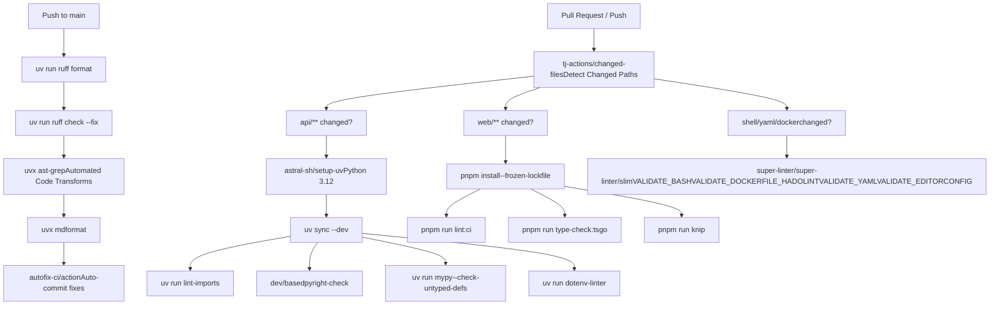
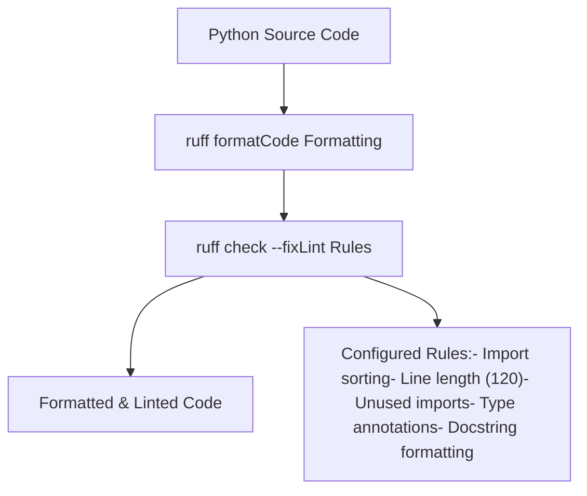
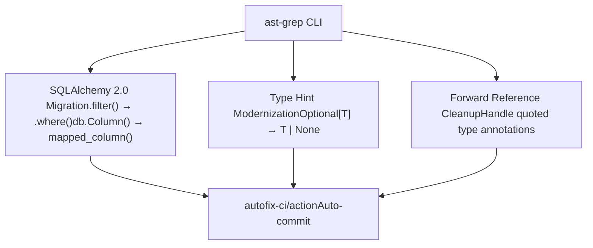
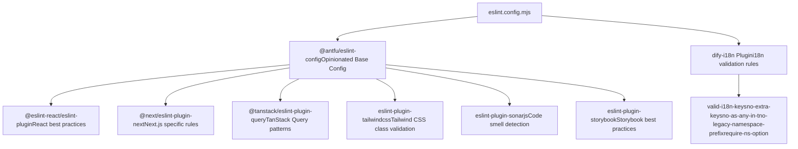
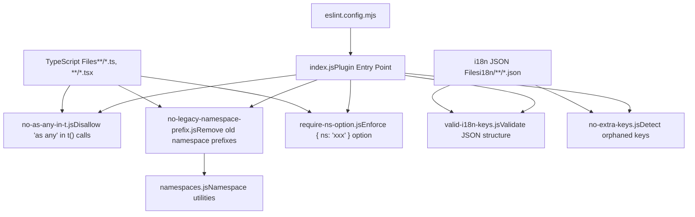
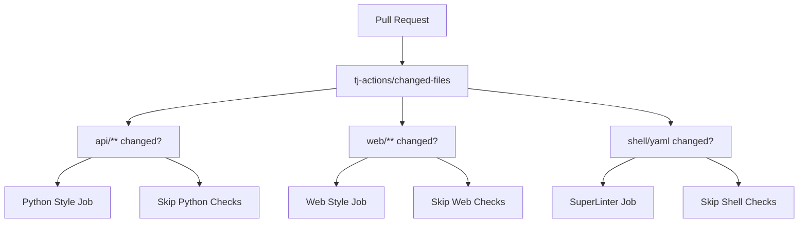

# Code Quality and Linting

Relevant source files

-   [.github/workflows/api-tests.yml](https://github.com/langgenius/dify/blob/92dbc94f/.github/workflows/api-tests.yml)
-   [.github/workflows/autofix.yml](https://github.com/langgenius/dify/blob/92dbc94f/.github/workflows/autofix.yml)
-   [.github/workflows/build-push.yml](https://github.com/langgenius/dify/blob/92dbc94f/.github/workflows/build-push.yml)
-   [.github/workflows/db-migration-test.yml](https://github.com/langgenius/dify/blob/92dbc94f/.github/workflows/db-migration-test.yml)
-   [.github/workflows/deploy-agent-dev.yml](https://github.com/langgenius/dify/blob/92dbc94f/.github/workflows/deploy-agent-dev.yml)
-   [.github/workflows/deploy-dev.yml](https://github.com/langgenius/dify/blob/92dbc94f/.github/workflows/deploy-dev.yml)
-   [.github/workflows/deploy-hitl.yml](https://github.com/langgenius/dify/blob/92dbc94f/.github/workflows/deploy-hitl.yml)
-   [.github/workflows/docker-build.yml](https://github.com/langgenius/dify/blob/92dbc94f/.github/workflows/docker-build.yml)
-   [.github/workflows/main-ci.yml](https://github.com/langgenius/dify/blob/92dbc94f/.github/workflows/main-ci.yml)
-   [.github/workflows/stale.yml](https://github.com/langgenius/dify/blob/92dbc94f/.github/workflows/stale.yml)
-   [.github/workflows/style.yml](https://github.com/langgenius/dify/blob/92dbc94f/.github/workflows/style.yml)
-   [.github/workflows/tool-test-sdks.yaml](https://github.com/langgenius/dify/blob/92dbc94f/.github/workflows/tool-test-sdks.yaml)
-   [.github/workflows/translate-i18n-claude.yml](https://github.com/langgenius/dify/blob/92dbc94f/.github/workflows/translate-i18n-claude.yml)
-   [.github/workflows/trigger-i18n-sync.yml](https://github.com/langgenius/dify/blob/92dbc94f/.github/workflows/trigger-i18n-sync.yml)
-   [.github/workflows/vdb-tests.yml](https://github.com/langgenius/dify/blob/92dbc94f/.github/workflows/vdb-tests.yml)
-   [.github/workflows/web-tests.yml](https://github.com/langgenius/dify/blob/92dbc94f/.github/workflows/web-tests.yml)
-   [api/Dockerfile](https://github.com/langgenius/dify/blob/92dbc94f/api/Dockerfile)
-   [api/migrations/README](https://github.com/langgenius/dify/blob/92dbc94f/api/migrations/README)
-   [web/.nvmrc](https://github.com/langgenius/dify/blob/92dbc94f/web/.nvmrc)
-   [web/Dockerfile](https://github.com/langgenius/dify/blob/92dbc94f/web/Dockerfile)
-   [web/README.md](https://github.com/langgenius/dify/blob/92dbc94f/web/README.md)
-   [web/app/(commonLayout)/app/(appDetailLayout)/layout.tsx](https://github.com/langgenius/dify/blob/92dbc94f/web/app/(commonLayout)/app/(appDetailLayout)/layout.tsx)/app/(appDetailLayout)/layout.tsx)
-   [web/app/(commonLayout)/datasets/(datasetDetailLayout)/\[datasetId\]/settings/page.tsx](web/app/(commonLayout)/datasets/(datasetDetailLayout)/%5BdatasetId%5D/settings/page.tsx)
-   [web/app/components/base/logo/logo-embedded-chat-avatar.tsx](https://github.com/langgenius/dify/blob/92dbc94f/web/app/components/base/logo/logo-embedded-chat-avatar.tsx)
-   [web/app/components/plugins/marketplace/description/index.spec.tsx](https://github.com/langgenius/dify/blob/92dbc94f/web/app/components/plugins/marketplace/description/index.spec.tsx)
-   [web/app/components/plugins/marketplace/description/index.tsx](https://github.com/langgenius/dify/blob/92dbc94f/web/app/components/plugins/marketplace/description/index.tsx)
-   [web/app/components/provider/serwist.tsx](https://github.com/langgenius/dify/blob/92dbc94f/web/app/components/provider/serwist.tsx)
-   [web/app/serwist/\[path\]/route.ts](web/app/serwist/%5Bpath%5D/route.ts)
-   [web/app/sw.ts](https://github.com/langgenius/dify/blob/92dbc94f/web/app/sw.ts)
-   [web/eslint-rules/rules/no-as-any-in-t.js](https://github.com/langgenius/dify/blob/92dbc94f/web/eslint-rules/rules/no-as-any-in-t.js)
-   [web/eslint-rules/rules/no-legacy-namespace-prefix.js](https://github.com/langgenius/dify/blob/92dbc94f/web/eslint-rules/rules/no-legacy-namespace-prefix.js)
-   [web/eslint-rules/rules/require-ns-option.js](https://github.com/langgenius/dify/blob/92dbc94f/web/eslint-rules/rules/require-ns-option.js)
-   [web/eslint-suppressions.json](https://github.com/langgenius/dify/blob/92dbc94f/web/eslint-suppressions.json)
-   [web/eslint.config.mjs](https://github.com/langgenius/dify/blob/92dbc94f/web/eslint.config.mjs)
-   [web/i18n-config/README.md](https://github.com/langgenius/dify/blob/92dbc94f/web/i18n-config/README.md)
-   [web/i18n-config/lib.client.ts](https://github.com/langgenius/dify/blob/92dbc94f/web/i18n-config/lib.client.ts)
-   [web/i18n-config/lib.server.ts](https://github.com/langgenius/dify/blob/92dbc94f/web/i18n-config/lib.server.ts)
-   [web/i18n-config/server.ts](https://github.com/langgenius/dify/blob/92dbc94f/web/i18n-config/server.ts)
-   [web/knip.config.ts](https://github.com/langgenius/dify/blob/92dbc94f/web/knip.config.ts)
-   [web/next.config.js](https://github.com/langgenius/dify/blob/92dbc94f/web/next.config.js)
-   [web/pnpm-lock.yaml](https://github.com/langgenius/dify/blob/92dbc94f/web/pnpm-lock.yaml)
-   [web/scripts/gen-icons.mjs](https://github.com/langgenius/dify/blob/92dbc94f/web/scripts/gen-icons.mjs)
-   [web/utils/server-only-context.ts](https://github.com/langgenius/dify/blob/92dbc94f/web/utils/server-only-context.ts)

This document describes the code quality and linting infrastructure in the Dify codebase, including style checkers, type checkers, formatters, and custom lint rules for both Python API and TypeScript web frontend. For information about testing infrastructure, see [10.3](/langgenius/dify/10.3-testing-infrastructure). For CI/CD pipeline architecture, see [10.2](/langgenius/dify/10.2-cicd-pipeline-architecture).

## Overview

Dify enforces code quality through multiple automated linting systems integrated into the CI/CD pipeline. The codebase is divided into two primary domains with distinct tooling:

| Domain | Primary Tools | Configuration Files |
| --- | --- | --- |
| **Python (API)** | Ruff, Basedpyright, Mypy, Import Linter | `api/pyproject.toml`, `api/uv.lock` |
| **Web (TypeScript)** | ESLint, TypeScript Compiler, Knip | `web/eslint.config.mjs`, `web/tsconfig.json`, `web/knip.config.ts` |
| **Cross-cutting** | SuperLinter, dotenv-linter, mdformat | `.github/workflows/style.yml`, `.github/workflows/autofix.yml` |

All style checks run on pull requests and pushes to main via GitHub Actions. The autofix workflow automatically applies formatting and certain lint fixes on push to main branches.

**Sources:** [.github/workflows/style.yml1-172](https://github.com/langgenius/dify/blob/92dbc94f/.github/workflows/style.yml#L1-L172) [.github/workflows/autofix.yml1-88](https://github.com/langgenius/dify/blob/92dbc94f/.github/workflows/autofix.yml#L1-L88)

## CI/CD Linting Pipeline


**Sources:** [.github/workflows/style.yml1-172](https://github.com/langgenius/dify/blob/92dbc94f/.github/workflows/style.yml#L1-L172) [.github/workflows/autofix.yml1-88](https://github.com/langgenius/dify/blob/92dbc94f/.github/workflows/autofix.yml#L1-L88)

## Python Linting and Type Checking

The API codebase uses a multi-layered approach to Python code quality:

### Ruff - Fast Python Linter and Formatter

Ruff serves as both linter and formatter, replacing Flake8, Black, isort, and other tools with a single Rust-based implementation.


**Configuration:** Ruff configuration is managed in `api/pyproject.toml` with rules for import sorting, line length limits, and code style. The autofix workflow runs `ruff format` before `ruff check --fix` to ensure consistent application order.

**Sources:** [.github/workflows/autofix.yml38-46](https://github.com/langgenius/dify/blob/92dbc94f/.github/workflows/autofix.yml#L38-L46) [.github/workflows/style.yml42-56](https://github.com/langgenius/dify/blob/92dbc94f/.github/workflows/style.yml#L42-L56)

### Type Checking - Basedpyright and Mypy

The codebase uses dual type checkers to ensure type safety:

| Tool | Purpose | Configuration |
| --- | --- | --- |
| **Basedpyright** | Modern Python type checker (Pyright fork) | `dev/basedpyright-check` script |
| **Mypy** | Traditional gradual type checker | `--check-untyped-defs --disable-error-code=import-untyped --exclude tests/ --exclude migrations/` |

**Invocation:**

```
# Basedpyright check
dev/basedpyright-check

# Mypy check
uv --directory api run mypy \
  --exclude-gitignore \
  --exclude 'tests/' \
  --exclude 'migrations/' \
  --check-untyped-defs \
  --disable-error-code=import-untyped .
```
**Sources:** [.github/workflows/style.yml50-56](https://github.com/langgenius/dify/blob/92dbc94f/.github/workflows/style.yml#L50-L56)

### Import Linter - Architectural Boundaries

Import Linter enforces architectural layer separation by preventing imports that violate defined boundaries.

**Invocation:**

```
uv run --directory api --dev lint-imports
```
This tool ensures that higher-level modules don't inappropriately depend on lower-level modules, maintaining clean architecture.

**Sources:** [.github/workflows/style.yml46-48](https://github.com/langgenius/dify/blob/92dbc94f/.github/workflows/style.yml#L46-L48)

### AST-Grep - Automated Code Transformations

The autofix workflow uses `ast-grep` (Abstract Syntax Tree search/replace) for automated refactoring patterns:


**Example patterns:**

```
# Convert SQLAlchemy 1.x to 2.0
ast-grep --pattern 'db.session.query($WHATEVER).filter($HERE)' \
         --rewrite 'db.session.query($WHATEVER).where($HERE)'

# Modernize type hints
ast-grep --pattern 'Optional[$T]' --rewrite '$T | None'
```
**Sources:** [.github/workflows/autofix.yml53-80](https://github.com/langgenius/dify/blob/92dbc94f/.github/workflows/autofix.yml#L53-L80)

### Dotenv Linter

Validates `.env.example` files for consistency between API and web:

```
uv run --project api dotenv-linter ./api/.env.example ./web/.env.example
```
**Sources:** [.github/workflows/style.yml58-60](https://github.com/langgenius/dify/blob/92dbc94f/.github/workflows/style.yml#L58-L60)

## Web Linting and Type Checking

The Next.js frontend uses ESLint with extensive plugins and custom rules:

### ESLint Configuration Architecture


**Key configuration decisions:**

| Setting | Value | Rationale |
| --- | --- | --- |
| `ts/no-explicit-any` | `error` | Enforce type safety, no escape hatches |
| `ts/consistent-type-definitions` | `type` over `interface` | Consistent type definition style |
| `react-compiler` | `false` | Performance - compiler rules are slow |
| `tailwindcss/classnames-order` | `warn` | Maintain consistent class ordering |
| `tailwindcss/no-custom-classname` | `off` | Performance issue with 1k+ line config |

**Sources:** [web/eslint.config.mjs1-136](https://github.com/langgenius/dify/blob/92dbc94f/web/eslint.config.mjs#L1-L136)

### ESLint Execution

```
# CI execution
pnpm run lint:ci

# Local development with autofix
pnpm run lint --fix
```
The `lint:ci` command runs ESLint with the `--max-warnings 0` flag to treat warnings as errors in CI.

**Sources:** [.github/workflows/style.yml108-109](https://github.com/langgenius/dify/blob/92dbc94f/.github/workflows/style.yml#L108-L109)

### TypeScript Type Checking

Type checking runs separately from ESLint using a custom TypeScript compiler wrapper:

```
pnpm run type-check:tsgo
```
This invokes `@typescript/native-preview` (tsgo), a faster native TypeScript compiler implementation that provides significant speed improvements over the standard `tsc` for type checking.

**Configuration:** [web/tsconfig.json](https://github.com/langgenius/dify/blob/92dbc94f/web/tsconfig.json) defines strict type checking rules including `strict: true`, `noImplicitAny: true`, and Next.js-specific compiler options.

**Sources:** [.github/workflows/style.yml120-123](https://github.com/langgenius/dify/blob/92dbc94f/.github/workflows/style.yml#L120-L123) [web/pnpm-lock.yaml475-477](https://github.com/langgenius/dify/blob/92dbc94f/web/pnpm-lock.yaml#L475-L477)

### Knip - Dead Code Detection

Knip identifies unused files, dependencies, and exports:

```
pnpm run knip
```
**Configuration in `web/knip.config.ts`:**

```
{
  entry: ['scripts/**/*.{js,ts,mjs}', 'bin/**/*.{js,ts,mjs}'],
  ignore: ['i18n/**', 'public/**'],
  rules: {
    files: 'warn',
    dependencies: 'warn',
    exports: 'warn',
    classMembers: 'warn',
    types: 'warn',
    duplicates: 'warn'
  }
}
```
All rules are set to `warn` level to report issues without failing the build.

**Sources:** [web/knip.config.ts1-37](https://github.com/langgenius/dify/blob/92dbc94f/web/knip.config.ts#L1-L37) [.github/workflows/style.yml125-128](https://github.com/langgenius/dify/blob/92dbc94f/.github/workflows/style.yml#L125-L128)

## Custom ESLint Rules for i18n

Dify implements custom ESLint rules to enforce i18n translation best practices and catch common errors:

### Custom Rule Architecture


**Sources:** [web/eslint.config.mjs107-135](https://github.com/langgenius/dify/blob/92dbc94f/web/eslint.config.mjs#L107-L135) [web/eslint-rules/](https://github.com/langgenius/dify/blob/92dbc94f/web/eslint-rules/)

### Rule: `no-as-any-in-t`

**Purpose:** Prevent loss of type safety in translation calls by disallowing `as any` type assertions.

**Example violation:**

```
// ❌ Bad - loses type safety
t('some.key' as any)

// ✅ Good - properly typed
t('common.submit')
```
**Configuration:**

-   Mode `any` (default): Only flag `as any`
-   Mode `all`: Flag all type assertions including `as string`, etc.

**Sources:** [web/eslint-rules/rules/no-as-any-in-t.js1-106](https://github.com/langgenius/dify/blob/92dbc94f/web/eslint-rules/rules/no-as-any-in-t.js#L1-L106)

### Rule: `no-legacy-namespace-prefix`

**Purpose:** Enforce modern namespace usage pattern where namespace is specified in `useTranslation()` hook rather than key prefix.

**Example violation:**

```
// ❌ Bad - legacy namespace prefix
const { t } = useTranslation()
t('common.submit')

// ✅ Good - namespace in hook
const { t } = useTranslation('common')
t('submit')
```
**Auto-fix capability:** This rule includes a complex fixer that:

1.  Extracts namespace from key prefixes
2.  Collects all namespaces used in a component
3.  Updates `useTranslation()` calls to include namespace
4.  Removes namespace prefixes from keys

**Sources:** [web/eslint-rules/rules/no-legacy-namespace-prefix.js1-321](https://github.com/langgenius/dify/blob/92dbc94f/web/eslint-rules/rules/no-legacy-namespace-prefix.js#L1-L321)

### Rule: `require-ns-option`

**Purpose:** Require explicit namespace specification when calling `t()` directly without context from `useTranslation()` hook.

**Example violation:**

```
// ❌ Bad - missing namespace
t('submit')

// ✅ Good - explicit namespace
t('submit', { ns: 'common' })
```
**Sources:** [web/eslint-rules/rules/require-ns-option.js1-52](https://github.com/langgenius/dify/blob/92dbc94f/web/eslint-rules/rules/require-ns-option.js#L1-L52)

### Rule: `valid-i18n-keys`

**Purpose:** Validate JSON structure of i18n files, ensuring keys are flat (no nested objects) and properly formatted.

**Enforces:**

-   Flat key structure with dot notation (e.g., `"dialog.title"`)
-   No nested objects
-   Proper JSON formatting
-   Placeholder syntax validation (`{{var}}`, `${var}`)

**Sources:** [web/eslint.config.mjs132](https://github.com/langgenius/dify/blob/92dbc94f/web/eslint.config.mjs#L132-L132)

### Rule: `no-extra-keys`

**Purpose:** Detect translation keys that exist in non-English locales but are missing from `en-US` (source of truth).

This prevents orphaned translations that are no longer used in the codebase.

**Sources:** [web/eslint.config.mjs133](https://github.com/langgenius/dify/blob/92dbc94f/web/eslint.config.mjs#L133-L133)

## Shell Script and Configuration Linting

SuperLinter validates non-code files using specialized linters:

### Linters Enabled

| Validator | Purpose | Files |
| --- | --- | --- |
| **VALIDATE\_BASH** | Shell script syntax and best practices | `**/*.sh` |
| **VALIDATE\_BASH\_EXEC** | Executable bit validation | Shell scripts |
| **VALIDATE\_DOCKERFILE\_HADOLINT** | Dockerfile best practices | `**/Dockerfile*` |
| **VALIDATE\_EDITORCONFIG** | Editor config compliance | All files per `.editorconfig` |
| **VALIDATE\_XML** | XML syntax | `**/*.xml` |
| **VALIDATE\_YAML** | YAML syntax | `**/*.yaml`, `**/*.yml` |

**Configuration:**

```
BASH_SEVERITY: warning
DEFAULT_BRANCH: origin/main
IGNORE_GENERATED_FILES: true
IGNORE_GITIGNORED_FILES: true
```
**Sources:** [.github/workflows/style.yml130-172](https://github.com/langgenius/dify/blob/92dbc94f/.github/workflows/style.yml#L130-L172)

### Markdown Formatting

The autofix workflow uses `mdformat` to enforce consistent markdown formatting:

```
uvx --python 3.13 mdformat . --exclude ".claude/skills/**"
```
This ensures consistent markdown style across documentation files while excluding certain directories with YAML front matter that mdformat breaks.

**Sources:** [.github/workflows/autofix.yml83-85](https://github.com/langgenius/dify/blob/92dbc94f/.github/workflows/autofix.yml#L83-L85)

## ESLint Suppressions

The web codebase uses an explicit suppression file to track known lint violations that cannot be immediately fixed:

```
{
  "file/path.tsx": {
    "ts/no-explicit-any": { "count": 5 },
    "react-hooks-extra/no-direct-set-state-in-use-effect": { "count": 2 }
  }
}
```
This file ([web/eslint-suppressions.json1-2500](https://github.com/langgenius/dify/blob/92dbc94f/web/eslint-suppressions.json#L1-L2500)) serves multiple purposes:

1.  **Transparency:** Makes technical debt visible and quantifiable
2.  **Ratcheting:** Prevents new violations from being introduced
3.  **Tracking:** Enables gradual reduction of violations over time

The suppression count is validated in CI - if the actual violation count exceeds the suppressed count, the build fails.

**Sources:** [web/eslint-suppressions.json1-100](https://github.com/langgenius/dify/blob/92dbc94f/web/eslint-suppressions.json#L1-L100)

## Docker Image Linting

Dockerfiles are validated during the build process and in CI:

### Build-time Validation

```
# .github/workflows/docker-build.yml
jobs:
  build-docker:
    strategy:
      matrix:
        - service_name: "api-amd64"
          platform: linux/amd64
          context: "api"
        - service_name: "web-amd64"
          platform: linux/amd64
          context: "web"
```
Docker builds run for both `api/` and `web/` contexts on both AMD64 and ARM64 architectures, ensuring Dockerfile syntax is valid before merge.

**Sources:** [.github/workflows/docker-build.yml1-49](https://github.com/langgenius/dify/blob/92dbc94f/.github/workflows/docker-build.yml#L1-L49)

### Hadolint Validation

SuperLinter runs Hadolint to validate Dockerfile best practices:

-   Layer optimization
-   Security vulnerabilities (e.g., running as root, exposed secrets)
-   Build cache efficiency
-   Image size optimization

**Sources:** [.github/workflows/style.yml168](https://github.com/langgenius/dify/blob/92dbc94f/.github/workflows/style.yml#L168-L168)

## Performance Considerations

Several linting tools are explicitly configured for performance:

| Tool | Optimization | Rationale |
| --- | --- | --- |
| **ESLint React Compiler** | Disabled | Rules are "pretty slow" per config comments |
| **Tailwind classnames validation** | Partially disabled | Performance issues with 1k+ line config |
| **Sonar plugin** | Manually curated rules | Full ruleset is slow, only useful rules enabled |
| **Changed files detection** | Conditional job execution | Only runs linters for changed code paths |

The CI pipeline uses `tj-actions/changed-files` to detect which paths changed and conditionally runs only relevant linting jobs. For example, Python linting only runs if `api/**` files changed.

**Sources:** [web/eslint.config.mjs12-14](https://github.com/langgenius/dify/blob/92dbc94f/web/eslint.config.mjs#L12-L14) [web/eslint.config.mjs61-67](https://github.com/langgenius/dify/blob/92dbc94f/web/eslint.config.mjs#L61-L67) [web/eslint.config.mjs95-99](https://github.com/langgenius/dify/blob/92dbc94f/web/eslint.config.mjs#L95-L99) [.github/workflows/style.yml26-33](https://github.com/langgenius/dify/blob/92dbc94f/.github/workflows/style.yml#L26-L33)

## Integration with CI/CD

### Conditional Execution


This approach minimizes CI time by only running relevant checks.

**Sources:** [.github/workflows/style.yml26-33](https://github.com/langgenius/dify/blob/92dbc94f/.github/workflows/style.yml#L26-L33)

### Autofix Integration

The autofix workflow runs on every push to `main` and automatically commits formatting and lint fixes:

```
- uses: autofix-ci/action@635ffb0c9798bd160680f18fd73371e355b85f27
```
This ensures that code merged to main is always properly formatted, reducing review burden and merge conflicts.

**Sources:** [.github/workflows/autofix.yml87](https://github.com/langgenius/dify/blob/92dbc94f/.github/workflows/autofix.yml#L87-L87)

### Status Reporting

All linting jobs report status to GitHub checks, appearing as individual checks on pull requests:

-   "Python Style"
-   "Web Style"
-   "SuperLinter"

Failed checks block merge when branch protection rules are enabled.

**Sources:** [.github/workflows/style.yml10-13](https://github.com/langgenius/dify/blob/92dbc94f/.github/workflows/style.yml#L10-L13)
