# System Architecture Overview

Relevant source files

-   [api/.env.example](https://github.com/langgenius/dify/blob/92dbc94f/api/.env.example)
-   [api/app.py](https://github.com/langgenius/dify/blob/92dbc94f/api/app.py)
-   [api/app\_factory.py](https://github.com/langgenius/dify/blob/92dbc94f/api/app_factory.py)
-   [api/commands.py](https://github.com/langgenius/dify/blob/92dbc94f/api/commands.py)
-   [api/configs/feature/\_\_init\_\_.py](https://github.com/langgenius/dify/blob/92dbc94f/api/configs/feature/__init__.py)
-   [api/configs/middleware/\_\_init\_\_.py](https://github.com/langgenius/dify/blob/92dbc94f/api/configs/middleware/__init__.py)
-   [api/configs/packaging/\_\_init\_\_.py](https://github.com/langgenius/dify/blob/92dbc94f/api/configs/packaging/__init__.py)
-   [api/controllers/console/datasets/datasets.py](https://github.com/langgenius/dify/blob/92dbc94f/api/controllers/console/datasets/datasets.py)
-   [api/core/rag/datasource/vdb/vector\_factory.py](https://github.com/langgenius/dify/blob/92dbc94f/api/core/rag/datasource/vdb/vector_factory.py)
-   [api/core/rag/datasource/vdb/vector\_type.py](https://github.com/langgenius/dify/blob/92dbc94f/api/core/rag/datasource/vdb/vector_type.py)
-   [api/extensions/ext\_storage.py](https://github.com/langgenius/dify/blob/92dbc94f/api/extensions/ext_storage.py)
-   [api/extensions/storage/storage\_type.py](https://github.com/langgenius/dify/blob/92dbc94f/api/extensions/storage/storage_type.py)
-   [api/models/account.py](https://github.com/langgenius/dify/blob/92dbc94f/api/models/account.py)
-   [api/models/api\_based\_extension.py](https://github.com/langgenius/dify/blob/92dbc94f/api/models/api_based_extension.py)
-   [api/models/dataset.py](https://github.com/langgenius/dify/blob/92dbc94f/api/models/dataset.py)
-   [api/models/model.py](https://github.com/langgenius/dify/blob/92dbc94f/api/models/model.py)
-   [api/models/oauth.py](https://github.com/langgenius/dify/blob/92dbc94f/api/models/oauth.py)
-   [api/models/provider.py](https://github.com/langgenius/dify/blob/92dbc94f/api/models/provider.py)
-   [api/models/source.py](https://github.com/langgenius/dify/blob/92dbc94f/api/models/source.py)
-   [api/models/task.py](https://github.com/langgenius/dify/blob/92dbc94f/api/models/task.py)
-   [api/models/tools.py](https://github.com/langgenius/dify/blob/92dbc94f/api/models/tools.py)
-   [api/models/trigger.py](https://github.com/langgenius/dify/blob/92dbc94f/api/models/trigger.py)
-   [api/models/web.py](https://github.com/langgenius/dify/blob/92dbc94f/api/models/web.py)
-   [api/models/workflow.py](https://github.com/langgenius/dify/blob/92dbc94f/api/models/workflow.py)
-   [api/pyproject.toml](https://github.com/langgenius/dify/blob/92dbc94f/api/pyproject.toml)
-   [api/tests/test\_containers\_integration\_tests/services/test\_advanced\_prompt\_template\_service.py](https://github.com/langgenius/dify/blob/92dbc94f/api/tests/test_containers_integration_tests/services/test_advanced_prompt_template_service.py)
-   [api/tests/test\_containers\_integration\_tests/services/test\_agent\_service.py](https://github.com/langgenius/dify/blob/92dbc94f/api/tests/test_containers_integration_tests/services/test_agent_service.py)
-   [api/tests/test\_containers\_integration\_tests/tasks/\_\_init\_\_.py](https://github.com/langgenius/dify/blob/92dbc94f/api/tests/test_containers_integration_tests/tasks/__init__.py)
-   [api/tests/test\_containers\_integration\_tests/tasks/test\_add\_document\_to\_index\_task.py](https://github.com/langgenius/dify/blob/92dbc94f/api/tests/test_containers_integration_tests/tasks/test_add_document_to_index_task.py)
-   [api/tests/unit\_tests/configs/test\_dify\_config.py](https://github.com/langgenius/dify/blob/92dbc94f/api/tests/unit_tests/configs/test_dify_config.py)
-   [api/tests/unit\_tests/core/test\_provider\_manager.py](https://github.com/langgenius/dify/blob/92dbc94f/api/tests/unit_tests/core/test_provider_manager.py)
-   [api/uv.lock](https://github.com/langgenius/dify/blob/92dbc94f/api/uv.lock)
-   [dev/pytest/pytest\_vdb.sh](https://github.com/langgenius/dify/blob/92dbc94f/dev/pytest/pytest_vdb.sh)
-   [docker/.env.example](https://github.com/langgenius/dify/blob/92dbc94f/docker/.env.example)
-   [docker/docker-compose-template.yaml](https://github.com/langgenius/dify/blob/92dbc94f/docker/docker-compose-template.yaml)
-   [docker/docker-compose.middleware.yaml](https://github.com/langgenius/dify/blob/92dbc94f/docker/docker-compose.middleware.yaml)
-   [docker/docker-compose.yaml](https://github.com/langgenius/dify/blob/92dbc94f/docker/docker-compose.yaml)
-   [docker/middleware.env.example](https://github.com/langgenius/dify/blob/92dbc94f/docker/middleware.env.example)
-   [web/package.json](https://github.com/langgenius/dify/blob/92dbc94f/web/package.json)

## Purpose and Scope

This document provides a comprehensive overview of Dify's system architecture, including its service topology, core components, data models, and deployment structure. It describes how the various layers of the platform interact to enable AI application development and execution.

For detailed information about specific subsystems, see:

-   Service deployment and Docker configuration: [Service Topology and Docker Compose](/langgenius/dify/2.1-service-topology-and-docker-compose)
-   Data models and domain entities: [Core Data Models and Domain Entities](/langgenius/dify/2.2-core-data-models-and-domain-entities)
-   Application execution patterns: [Application Types and Execution Modes](/langgenius/dify/2.3-application-types-and-execution-modes)
-   Configuration and environment setup: [Configuration Management System](/langgenius/dify/2.4-configuration-management-system)

---

## High-Level Architecture

Dify is a full-stack AI application development platform organized into distinct architectural layers. The system follows a clear separation of concerns across frontend, API, business logic, background processing, specialized services, and data persistence layers.

### Architecture Layers Diagram

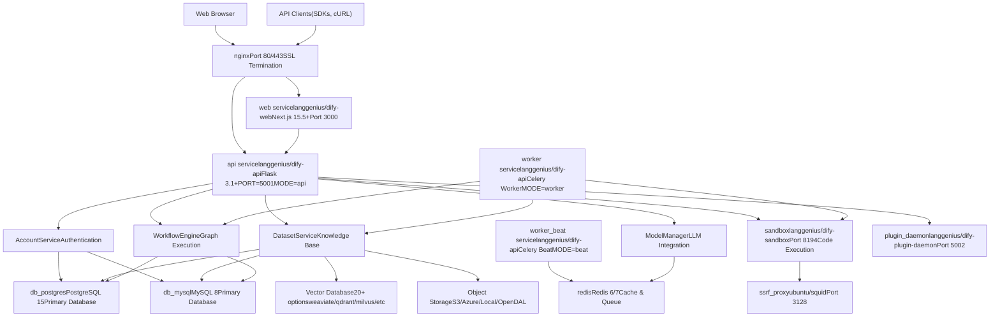
**Sources:** [docker/docker-compose.yaml1-690](https://github.com/langgenius/dify/blob/92dbc94f/docker/docker-compose.yaml#L1-L690) [docker/docker-compose-template.yaml1-316](https://github.com/langgenius/dify/blob/92dbc94f/docker/docker-compose-template.yaml#L1-L316) [api/app.py1-30](https://github.com/langgenius/dify/blob/92dbc94f/api/app.py#L1-L30) [api/app\_factory.py1-150](https://github.com/langgenius/dify/blob/92dbc94f/api/app_factory.py#L1-L150)

---

## Service Topology

### Container Architecture

Dify's Docker deployment consists of multiple interconnected services running in a shared `dify` network. The architecture uses a single API image (`langgenius/dify-api`) that runs in three different modes controlled by the `MODE` environment variable.

```mermaid
flowchart TD
    InitPerms["init_permissionsbusyboxUID: 1001Sets /app/api/storage permissions"]
    Nginx["nginxlanggenius/dify-nginxEXPOSE_NGINX_PORT:80EXPOSE_NGINX_SSL_PORT:443"]
    Web["weblanggenius/dify-web:1.11.4User: dify:1001PORT=3000"]
    API["apilanggenius/dify-api:1.11.4MODE=apiDIFY_PORT=5001User: dify:1001"]
    Worker["workerlanggenius/dify-api:1.11.4MODE=workerCELERY_WORKER_AMOUNTUser: dify:1001"]
    WorkerBeat["worker_beatlanggenius/dify-api:1.11.4MODE=beatUser: dify:1001"]
    Sandbox["sandboxlanggenius/dify-sandbox:0.2.12SANDBOX_PORT=8194API_KEY=SANDBOX_API_KEY"]
    PluginDaemon["plugin_daemonlanggenius/dify-plugin-daemon:0.5.2SERVER_PORT=5002SERVER_KEY=PLUGIN_DAEMON_KEY"]
    SSRFProxy["ssrf_proxyubuntu/squidSSRF_HTTP_PORT=3128"]
    DBPostgres["db_postgrespostgres:15-alpineProfile: postgresqlPGDATA volume"]
    DBMySQL["db_mysqlmysql:8.0Profile: mysqldata volume"]
    Redis["redisredis:6-alpineREDIS_PASSWORDdata volume"]
    Weaviate["weaviateProfile: weaviate"]
    Qdrant["qdrantProfile: qdrant"]
    Milvus["milvusProfile: milvus"]
    Others["20+ other VDB options"]
    EnvFile[".env fileshared-api-worker-env400+ variables"]

    InitPerms --> Web
    InitPerms --> API
    InitPerms --> Worker
    Nginx --> Web
    Nginx --> API
    Web --> API
    API --> DBPostgres
    API --> DBMySQL
    API --> Redis
    API --> Sandbox
    API --> PluginDaemon
    Worker --> DBPostgres
    Worker --> DBMySQL
    Worker --> Redis
    Worker --> Sandbox
    Worker --> SSRFProxy
    WorkerBeat --> Redis
    API --> Weaviate
    API --> Qdrant
    API --> Milvus
    API --> Others
    EnvFile --> API
    EnvFile --> Worker
    EnvFile --> WorkerBeat
    EnvFile --> Web
```
**Key Design Patterns:**

| Pattern | Implementation | Purpose |
| --- | --- | --- |
| **Shared Image** | `langgenius/dify-api` runs as `api`, `worker`, `worker_beat` | Single build, multiple deployment modes |
| **Mode Selection** | `MODE` environment variable (`api`, `worker`, `beat`) | Determines service behavior at runtime |
| **Non-root User** | All services run as `dify:1001` | Security hardening |
| **Init Container** | `init_permissions` runs once with busybox | Sets proper file ownership before main services start |
| **Profile-based VDB** | Docker Compose profiles for 20+ vector databases | Enable only required VDB, avoid resource waste |
| **Shared Environment** | `shared-api-worker-env` anchor in compose file | 400+ variables shared across API and worker services |

**Sources:** [docker/docker-compose.yaml1-690](https://github.com/langgenius/dify/blob/92dbc94f/docker/docker-compose.yaml#L1-L690) [docker/docker-compose-template.yaml1-316](https://github.com/langgenius/dify/blob/92dbc94f/docker/docker-compose-template.yaml#L1-L316) [docker/.env.example1-1000](https://github.com/langgenius/dify/blob/92dbc94f/docker/.env.example#L1-L1000)

### Service Dependencies

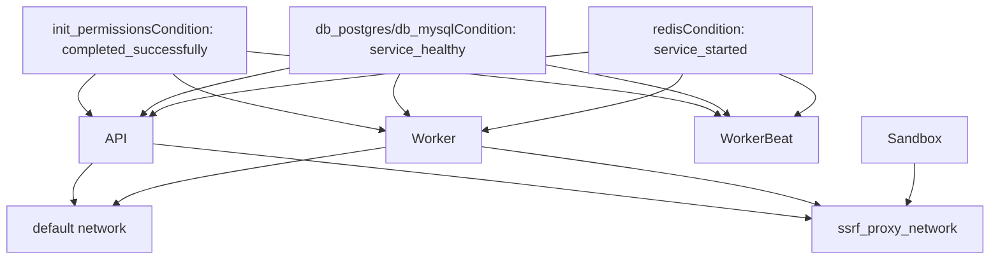
**Dependency Requirements:**

-   **api/worker/worker\_beat** depend on `init_permissions` completing successfully
-   **api/worker/worker\_beat** require database health check to pass (`service_healthy`)
-   **api/worker/worker\_beat** require Redis to start (`service_started`)
-   **sandbox** and **worker** share `ssrf_proxy_network` for secure outbound requests

**Sources:** [docker/docker-compose-template.yaml39-131](https://github.com/langgenius/dify/blob/92dbc94f/docker/docker-compose-template.yaml#L39-L131)

---

## Core Components

### Flask Application Factory

The API service uses an application factory pattern to create Flask apps with different configurations based on execution context.

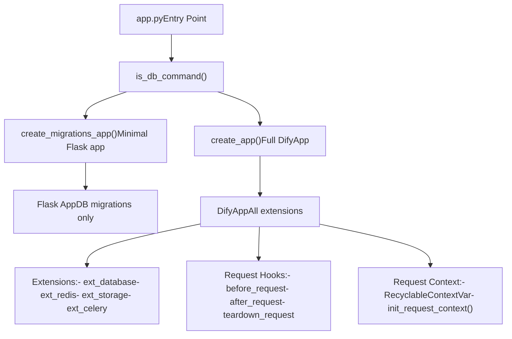
**Application Initialization Flow:**

| Step | Function | Purpose |
| --- | --- | --- |
| 1 | `is_db_command()` | Check if running Flask DB migration command |
| 2 | `create_migrations_app()` | Create minimal app for DB operations |
| 2 | `create_app()` | Create full DifyApp with all extensions |
| 3 | `DifyApp.__init__()` | Initialize Flask with config from `dify_config.model_dump()` |
| 4 | `before_request` hook | Initialize logging context, increment thread recycles |
| 5 | `after_request` hook | Add OpenTelemetry trace headers if enabled |

**Sources:** [api/app.py1-30](https://github.com/langgenius/dify/blob/92dbc94f/api/app.py#L1-L30) [api/app\_factory.py1-150](https://github.com/langgenius/dify/blob/92dbc94f/api/app_factory.py#L1-L150) [api/dify\_app.py1-200](https://github.com/langgenius/dify/blob/92dbc94f/api/dify_app.py#L1-L200)

### Business Logic Services

The core business logic is organized into service classes that encapsulate domain operations:

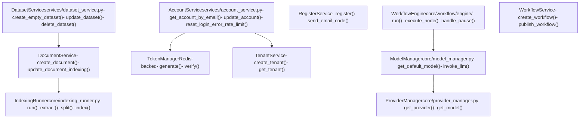
**Sources:** [api/services/account\_service.py1-500](https://github.com/langgenius/dify/blob/92dbc94f/api/services/account_service.py#L1-L500) [api/services/dataset\_service.py1-1000](https://github.com/langgenius/dify/blob/92dbc94f/api/services/dataset_service.py#L1-L1000) [api/core/workflow/engine/workflow\_engine.py1-800](https://github.com/langgenius/dify/blob/92dbc94f/api/core/workflow/engine/workflow_engine.py#L1-L800) [api/core/model\_manager.py1-600](https://github.com/langgenius/dify/blob/92dbc94f/api/core/model_manager.py#L1-L600)

---

## Data Models and Relationships

### Core Entity Relationship Diagram


### Key Model Classes

```mermaid
flowchart TD
    Provider["Provider- id: StringUUID- tenant_id: StringUUID- provider_name: String- provider_type: String- encrypted_config: LongText"]
    ProviderModel["ProviderModel- id: StringUUID- tenant_id: StringUUID- provider_name: String- model_name: String- model_type: ModelType- encrypted_config: LongText"]
    Dataset["Dataset- id: StringUUID- tenant_id: StringUUID- name: String- indexing_technique: String- embedding_model: String- retrieval_model: JSON"]
    Document["Document- id: StringUUID- dataset_id: StringUUID- data_source_type: String- indexing_status: String"]
    DocumentSegment["DocumentSegment- id: StringUUID- document_id: StringUUID- content: LongText- keywords: JSON- index_node_id: String"]
    Workflow["Workflow- id: StringUUID- tenant_id: StringUUID- app_id: StringUUID- type: WorkflowType- graph: LongText- version: String"]
    WorkflowRun["WorkflowRun- id: StringUUID- workflow_id: StringUUID- status: String- inputs: JSON- outputs: JSON"]
    WorkflowNodeExecution["WorkflowNodeExecution- id: StringUUID- workflow_run_id: StringUUID- node_id: String- node_type: NodeType- inputs: JSON- outputs: JSON"]
    App["App- id: StringUUID- tenant_id: StringUUID- mode: AppMode- app_model_config_id: StringUUID- workflow_id: StringUUID"]
    AppModelConfig["AppModelConfig- id: StringUUID- app_id: StringUUID- provider: String- model_id: String- configs: JSON"]
    Conversation["Conversation- id: StringUUID- app_id: StringUUID- from_source: String"]
    Message["Message- id: StringUUID- conversation_id: StringUUID- query: LongText- answer: LongText"]
    Account["Account- id: StringUUID- email: String- password: String- password_salt: String"]
    Tenant["Tenant- id: StringUUID- name: String- encrypt_public_key: LongText"]
    TenantAccountJoin["TenantAccountJoin- tenant_id: StringUUID- account_id: StringUUID- role: TenantAccountRole"]
```
**Table Naming Conventions:**

| Model Class | Table Name | Primary Key | Key Indexes |
| --- | --- | --- | --- |
| `Account` | `accounts` | `id` | `accounts_email_idx` |
| `Tenant` | `tenants` | `id` | \- |
| `TenantAccountJoin` | `tenant_account_joins` | `id` | `tenant_account_join_account_id_idx` |
| `App` | `apps` | `id` | `app_tenant_id_idx` |
| `AppModelConfig` | `app_model_configs` | `id` | `app_app_id_idx` |
| `Workflow` | `workflows` | `id` | `workflow_version_idx(tenant_id, app_id, version)` |
| `WorkflowRun` | `workflow_runs` | `id` | `workflow_run_tenant_idx`, `workflow_run_workflow_id_idx` |
| `Dataset` | `datasets` | `id` | `dataset_tenant_idx` |
| `Document` | `documents` | `id` | `document_dataset_id_idx` |
| `DocumentSegment` | `document_segments` | `id` | `document_segment_document_id_idx`, `document_segment_dataset_id_idx` |

**Sources:** [api/models/account.py1-500](https://github.com/langgenius/dify/blob/92dbc94f/api/models/account.py#L1-L500) [api/models/model.py1-2500](https://github.com/langgenius/dify/blob/92dbc94f/api/models/model.py#L1-L2500) [api/models/workflow.py1-2000](https://github.com/langgenius/dify/blob/92dbc94f/api/models/workflow.py#L1-L2000) [api/models/dataset.py1-2500](https://github.com/langgenius/dify/blob/92dbc94f/api/models/dataset.py#L1-L2500) [api/models/provider.py1-600](https://github.com/langgenius/dify/blob/92dbc94f/api/models/provider.py#L1-L600)

---

## Application Modes and Execution

### AppMode Enumeration

Dify supports multiple application modes, each with distinct execution patterns:

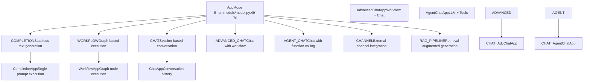
**Mode Determination Logic:**

The `App.is_agent` property dynamically checks if a chat app should be treated as an agent:

```
# From models/model.py:156-169
@property
def is_agent(self) -> bool:
    app_model_config = self.app_model_config
    if not app_model_config or not app_model_config.agent_mode:
        return False

    agent_mode_dict = app_model_config.agent_mode_dict
    if agent_mode_dict.get("enabled") and agent_mode_dict.get("strategy") in {"function_call", "react"}:
        self.mode = AppMode.AGENT_CHAT
        db.session.commit()
        return True
    return False
```
**Sources:** [api/models/model.py49-176](https://github.com/langgenius/dify/blob/92dbc94f/api/models/model.py#L49-L176)

### Execution Flow by Mode

> **[Mermaid sequence]**
> *(图表结构无法解析)*

**Sources:** [api/core/app/apps/completion/app.py1-300](https://github.com/langgenius/dify/blob/92dbc94f/api/core/app/apps/completion/app.py#L1-L300) [api/core/app/apps/workflow/app.py1-400](https://github.com/langgenius/dify/blob/92dbc94f/api/core/app/apps/workflow/app.py#L1-L400) [api/core/app/apps/chat/app.py1-500](https://github.com/langgenius/dify/blob/92dbc94f/api/core/app/apps/chat/app.py#L1-L500)

---

## Configuration Management

### DifyConfig System

The configuration system uses Pydantic settings with environment variable support:

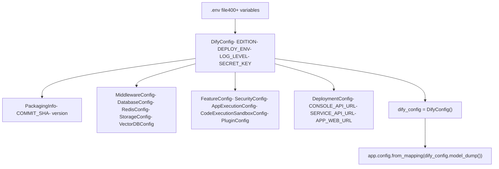
**Configuration Categories:**

| Category | Module | Key Settings |
| --- | --- | --- |
| **Packaging** | `configs/packaging/__init__.py` | `COMMIT_SHA`, `version` from pyproject.toml |
| **Middleware** | `configs/middleware/__init__.py` | Database, Redis, Storage, Vector DB connections |
| **Feature** | `configs/feature/__init__.py` | Security, execution limits, plugin settings |
| **Deployment** | `configs/deploy/__init__.py` | API URLs, file URLs, trigger URLs |

**Environment Variable Pattern:**

-   Database: `DB_TYPE`, `DB_USERNAME`, `DB_PASSWORD`, `DB_HOST`, `DB_PORT`, `DB_DATABASE`
-   Redis: `REDIS_HOST`, `REDIS_PORT`, `REDIS_PASSWORD`, `REDIS_DB`
-   Storage: `STORAGE_TYPE`, `OPENDAL_SCHEME`, `S3_ENDPOINT`, etc.
-   Vector: `VECTOR_STORE`, `WEAVIATE_ENDPOINT`, `QDRANT_URL`, etc.
-   Execution: `APP_MAX_EXECUTION_TIME`, `WORKFLOW_MAX_EXECUTION_STEPS`, `CODE_EXECUTION_ENDPOINT`

**Sources:** [api/configs/app\_config.py1-200](https://github.com/langgenius/dify/blob/92dbc94f/api/configs/app_config.py#L1-L200) [api/configs/packaging/\_\_init\_\_.py1-15](https://github.com/langgenius/dify/blob/92dbc94f/api/configs/packaging/__init__.py#L1-L15) [api/configs/middleware/\_\_init\_\_.py1-400](https://github.com/langgenius/dify/blob/92dbc94f/api/configs/middleware/__init__.py#L1-L400) [api/configs/feature/\_\_init\_\_.py1-800](https://github.com/langgenius/dify/blob/92dbc94f/api/configs/feature/__init__.py#L1-L800) [docker/.env.example1-1000](https://github.com/langgenius/dify/blob/92dbc94f/docker/.env.example#L1-L1000)

### Runtime Mode Configuration

The API service behavior is controlled by the `MODE` environment variable:

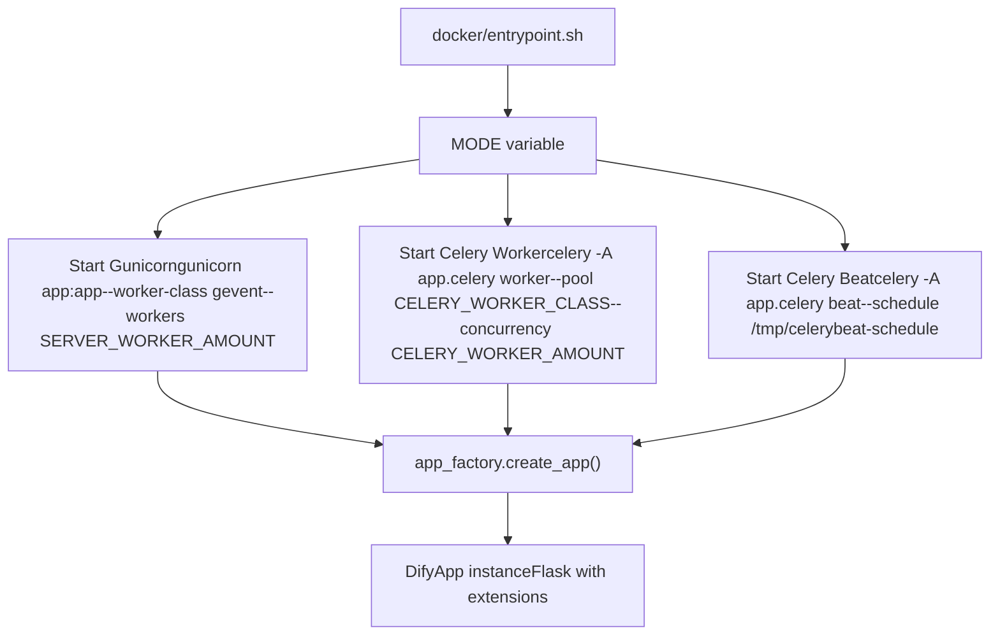
**Key Configuration Variables:**

| Variable | Mode | Default | Purpose |
| --- | --- | --- | --- |
| `MODE` | All | \- | Determines service type: `api`, `worker`, `beat` |
| `DIFY_PORT` | api | 5001 | API server port |
| `SERVER_WORKER_AMOUNT` | api | 1 | Number of Gunicorn workers |
| `SERVER_WORKER_CLASS` | api | gevent | Worker class (gevent/sync/solo) |
| `CELERY_WORKER_AMOUNT` | worker | \- | Number of Celery worker processes |
| `CELERY_WORKER_CLASS` | worker | \- | Worker pool class |
| `CELERY_BROKER_URL` | worker/beat | \- | Redis connection for Celery |

**Sources:** [docker/docker-compose-template.yaml22-131](https://github.com/langgenius/dify/blob/92dbc94f/docker/docker-compose-template.yaml#L22-L131) [docker/.env.example145-202](https://github.com/langgenius/dify/blob/92dbc94f/docker/.env.example#L145-L202) [api/app\_factory.py18-60](https://github.com/langgenius/dify/blob/92dbc94f/api/app_factory.py#L18-L60)

---

## Vector Database Integration

Dify supports 20+ vector databases through a factory pattern:

```mermaid
flowchart TD
    VectorFactory["Vectorcore/rag/datasource/vdb/vector_factory.py"]
    VectorType["VectorTypefrom dify_config.VECTOR_STORE"]
    Weaviate["WeaviateVectorWEAVIATE_ENDPOINT"]
    Qdrant["QdrantVectorQDRANT_URL"]
    Milvus["MilvusVectorMILVUS_URI"]
    PGVector["PGVectorVectorPGVECTOR_HOST"]
    Chroma["ChromaVectorCHROMA_HOST"]
    Elasticsearch["ElasticsearchVectorELASTICSEARCH_HOST"]
    OpenSearch["OpenSearchVectorOPENSEARCH_HOST"]
    AnalyticDB["AnalyticDBVectorANALYTICDB_HOST"]
    OceanBase["OceanBaseVectorOCEANBASE_VECTOR_HOST"]
    TiDB["TiDBVectorTIDB_VECTOR_HOST"]
    Others["15+ more options"]
    Create["create()Create collection"]
    Add["add_texts()Insert vectors"]
    Search["search_by_vector()Similarity search"]
    Delete["delete()Remove collection"]

    VectorFactory --> VectorType
    VectorType --> Weaviate
    VectorType --> Qdrant
    VectorType --> Milvus
    VectorType --> PGVector
    VectorType --> Chroma
    VectorType --> Elasticsearch
    VectorType --> OpenSearch
    VectorType --> AnalyticDB
    VectorType --> OceanBase
    VectorType --> TiDB
    VectorType --> Others
    Weaviate --> Create
    Weaviate --> Add
    Weaviate --> Search
    Weaviate --> Delete
```
**Supported Vector Databases:**

| Type | Environment Variable Prefix | Configuration |
| --- | --- | --- |
| Weaviate | `WEAVIATE_*` | `ENDPOINT`, `API_KEY`, `GRPC_ENDPOINT` |
| Qdrant | `QDRANT_*` | `URL`, `API_KEY`, `GRPC_ENABLED` |
| Milvus | `MILVUS_*` | `URI`, `TOKEN`, `USER`, `PASSWORD` |
| PGVector | `PGVECTOR_*` | `HOST`, `PORT`, `USER`, `PASSWORD`, `DATABASE` |
| Chroma | `CHROMA_*` | `HOST`, `PORT`, `TENANT`, `DATABASE` |
| ElasticSearch | `ELASTICSEARCH_*` | `HOST`, `PORT`, `USERNAME`, `PASSWORD` |
| OpenSearch | `OPENSEARCH_*` | `HOST`, `PORT`, `USER`, `PASSWORD` |

**Sources:** [api/core/rag/datasource/vdb/vector\_factory.py1-350](https://github.com/langgenius/dify/blob/92dbc94f/api/core/rag/datasource/vdb/vector_factory.py#L1-L350) [api/core/rag/datasource/vdb/vector\_type.py1-50](https://github.com/langgenius/dify/blob/92dbc94f/api/core/rag/datasource/vdb/vector_type.py#L1-L50) [docker/.env.example536-685](https://github.com/langgenius/dify/blob/92dbc94f/docker/.env.example#L536-L685)

---

## Storage Architecture

### Storage Type Configuration

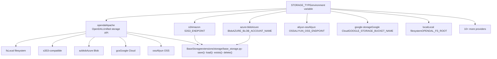
**Storage Configuration:**

| Storage Type | Primary Variables | Description |
| --- | --- | --- |
| `opendal` | `OPENDAL_SCHEME`, `OPENDAL_FS_ROOT` | Apache OpenDAL with multiple backend schemes |
| `s3` | `S3_ENDPOINT`, `S3_BUCKET_NAME`, `S3_ACCESS_KEY` | Amazon S3 or compatible services |
| `azure-blob` | `AZURE_BLOB_ACCOUNT_NAME`, `AZURE_BLOB_CONTAINER_NAME` | Azure Blob Storage |
| `aliyun-oss` | `ALIYUN_OSS_ENDPOINT`, `ALIYUN_OSS_BUCKET_NAME` | Alibaba Cloud OSS |
| `google-storage` | `GOOGLE_STORAGE_BUCKET_NAME`, `GOOGLE_STORAGE_SERVICE_ACCOUNT_JSON_BASE64` | Google Cloud Storage |

**Sources:** [api/extensions/ext\_storage.py1-150](https://github.com/langgenius/dify/blob/92dbc94f/api/extensions/ext_storage.py#L1-L150) [api/configs/middleware/storage/opendal\_storage\_config.py1-50](https://github.com/langgenius/dify/blob/92dbc94f/api/configs/middleware/storage/opendal_storage_config.py#L1-L50) [docker/.env.example410-529](https://github.com/langgenius/dify/blob/92dbc94f/docker/.env.example#L410-L529)

---

## Summary

Dify's architecture is designed for scalability, modularity, and flexibility:

1.  **Multi-service deployment** using Docker Compose with shared configuration
2.  **Unified API image** running in three modes (api, worker, beat) controlled by environment variables
3.  **Clear separation** between frontend (Next.js), backend (Flask), and specialized services (Sandbox, Plugin Daemon)
4.  **Flexible data layer** supporting PostgreSQL/MySQL for relational data, Redis for caching/queuing, 20+ vector databases for embeddings, and multiple object storage backends
5.  **Domain-driven design** with service classes encapsulating business logic (AccountService, DatasetService, WorkflowEngine)
6.  **Multiple execution modes** for different AI application types (Chat, Completion, Workflow, Agent)
7.  **Pydantic-based configuration** with extensive environment variable support
8.  **Security-first approach** with non-root containers, SSRF protection, and encrypted credentials

This architecture enables Dify to support diverse AI application development scenarios while maintaining operational simplicity through standardized deployment patterns.
