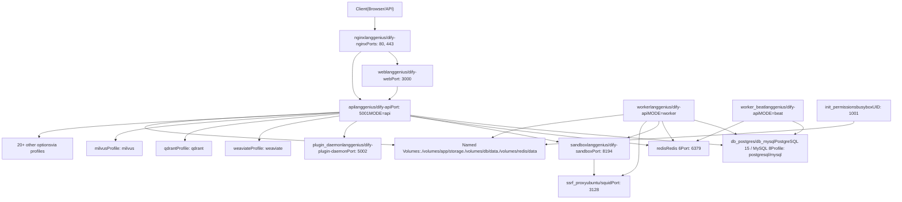
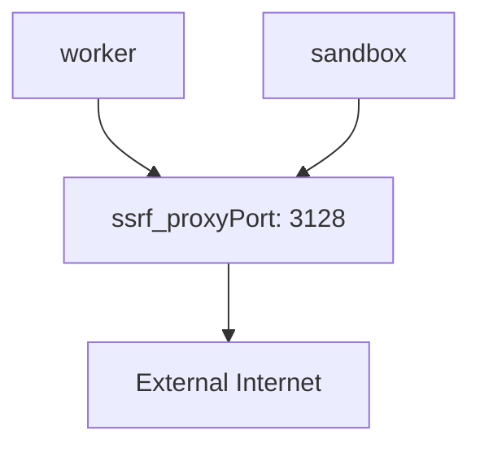
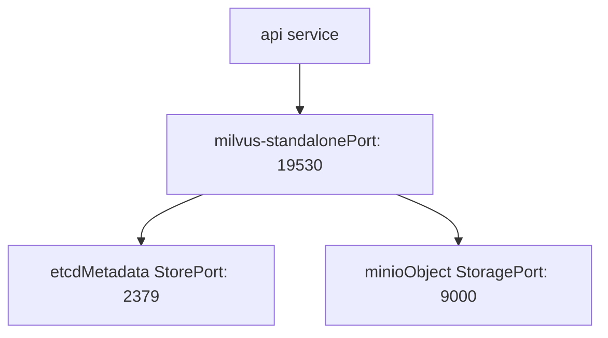
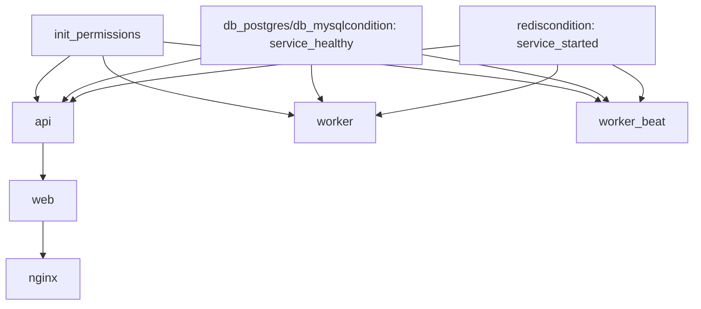
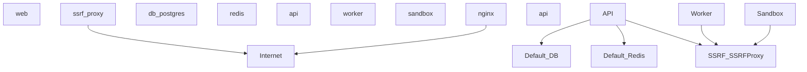
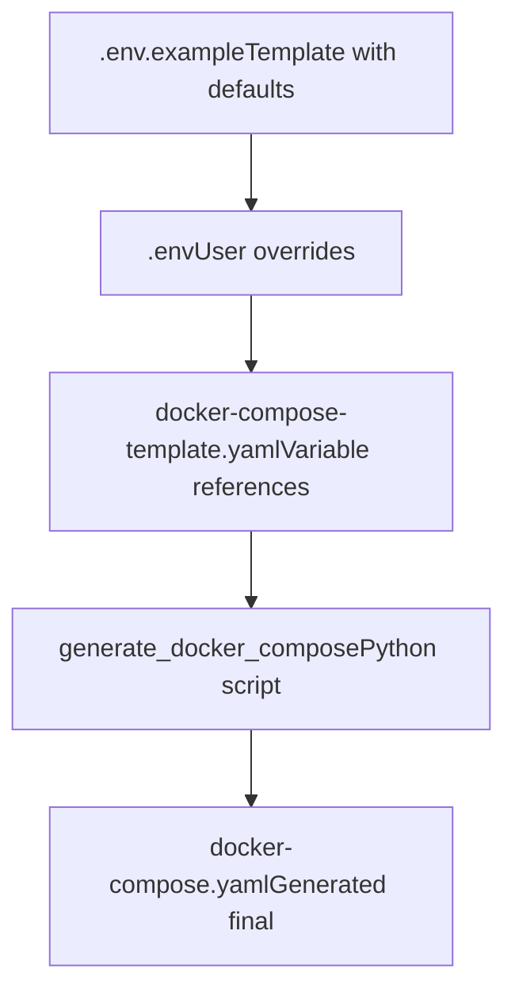

# Service Topology and Docker Compose

Relevant source files

-   [api/.env.example](https://github.com/langgenius/dify/blob/92dbc94f/api/.env.example)
-   [api/app.py](https://github.com/langgenius/dify/blob/92dbc94f/api/app.py)
-   [api/app\_factory.py](https://github.com/langgenius/dify/blob/92dbc94f/api/app_factory.py)
-   [api/commands.py](https://github.com/langgenius/dify/blob/92dbc94f/api/commands.py)
-   [api/configs/feature/\_\_init\_\_.py](https://github.com/langgenius/dify/blob/92dbc94f/api/configs/feature/__init__.py)
-   [api/configs/middleware/\_\_init\_\_.py](https://github.com/langgenius/dify/blob/92dbc94f/api/configs/middleware/__init__.py)
-   [api/configs/packaging/\_\_init\_\_.py](https://github.com/langgenius/dify/blob/92dbc94f/api/configs/packaging/__init__.py)
-   [api/controllers/console/datasets/datasets.py](https://github.com/langgenius/dify/blob/92dbc94f/api/controllers/console/datasets/datasets.py)
-   [api/core/rag/datasource/vdb/vector\_factory.py](https://github.com/langgenius/dify/blob/92dbc94f/api/core/rag/datasource/vdb/vector_factory.py)
-   [api/core/rag/datasource/vdb/vector\_type.py](https://github.com/langgenius/dify/blob/92dbc94f/api/core/rag/datasource/vdb/vector_type.py)
-   [api/extensions/ext\_storage.py](https://github.com/langgenius/dify/blob/92dbc94f/api/extensions/ext_storage.py)
-   [api/extensions/storage/storage\_type.py](https://github.com/langgenius/dify/blob/92dbc94f/api/extensions/storage/storage_type.py)
-   [api/pyproject.toml](https://github.com/langgenius/dify/blob/92dbc94f/api/pyproject.toml)
-   [api/tests/unit\_tests/configs/test\_dify\_config.py](https://github.com/langgenius/dify/blob/92dbc94f/api/tests/unit_tests/configs/test_dify_config.py)
-   [api/uv.lock](https://github.com/langgenius/dify/blob/92dbc94f/api/uv.lock)
-   [dev/pytest/pytest\_vdb.sh](https://github.com/langgenius/dify/blob/92dbc94f/dev/pytest/pytest_vdb.sh)
-   [docker/.env.example](https://github.com/langgenius/dify/blob/92dbc94f/docker/.env.example)
-   [docker/docker-compose-template.yaml](https://github.com/langgenius/dify/blob/92dbc94f/docker/docker-compose-template.yaml)
-   [docker/docker-compose.middleware.yaml](https://github.com/langgenius/dify/blob/92dbc94f/docker/docker-compose.middleware.yaml)
-   [docker/docker-compose.yaml](https://github.com/langgenius/dify/blob/92dbc94f/docker/docker-compose.yaml)
-   [docker/middleware.env.example](https://github.com/langgenius/dify/blob/92dbc94f/docker/middleware.env.example)
-   [web/package.json](https://github.com/langgenius/dify/blob/92dbc94f/web/package.json)

This document describes the Docker Compose deployment architecture for Dify, detailing how services are organized, how they communicate, and how the system uses Docker Compose features like profiles, health checks, and shared configurations to create a production-ready multi-container application.

For information about the build process that creates these images, see [Docker Build Process and Multi-Architecture Images](/langgenius/dify/3.1-docker-build-process-and-multi-architecture-images). For runtime configuration and environment variables, see [Environment Configuration and Runtime Modes](/langgenius/dify/3.2-environment-configuration-and-runtime-modes).

## Service Topology Overview

Dify's Docker Compose deployment consists of multiple service tiers that work together to provide a complete AI application platform. The architecture separates concerns across frontend, backend API, background workers, specialized services, and data stores.


**Services Overview:**

-   **Routing**: `nginx` terminates SSL and routes requests to backend services
-   **Frontend**: `web` serves the Next.js UI application
-   **Backend**: `api` handles HTTP requests via Flask/Gunicorn
-   **Workers**: `worker` processes async tasks, `worker_beat` schedules periodic jobs
-   **Sandbox**: `sandbox` provides isolated code execution environment
-   **Plugins**: `plugin_daemon` manages plugin lifecycle and execution
-   **Security**: `ssrf_proxy` prevents server-side request forgery attacks
-   **Data**: `db_postgres`/`db_mysql` for transactional data, `redis` for cache/queues
-   **Vector DBs**: Optional services for semantic search (profile-based)

**Sources:** [docker/docker-compose.yaml1-50](https://github.com/langgenius/dify/blob/92dbc94f/docker/docker-compose.yaml#L1-L50) [docker/docker-compose-template.yaml1-132](https://github.com/langgenius/dify/blob/92dbc94f/docker/docker-compose-template.yaml#L1-L132)

## Core Service Definitions

### API Service

The `api` service runs the Flask application that handles all HTTP API requests. It uses the same Docker image as the worker services but runs in a different mode.

```
api:
  image: langgenius/dify-api:1.11.4
  restart: always
  environment:
    MODE: api
    # Shared environment via <<: *shared-api-worker-env
  ports:
    - "5001:5001"
  depends_on:
    - init_permissions
    - db_postgres/db_mysql
    - redis
  volumes:
    - ./volumes/app/storage:/app/api/storage
  networks:
    - ssrf_proxy_network
    - default
```
**Key Configuration:**

-   `MODE=api` - Starts the Gunicorn WSGI server ([api/docker/entrypoint.sh33](https://github.com/langgenius/dify/blob/92dbc94f/api/docker/entrypoint.sh#L33-L33))
-   `DIFY_PORT=5001` - Default API port
-   `SERVER_WORKER_CLASS=gevent` - Uses gevent for async I/O
-   `SERVER_WORKER_AMOUNT=1` - Number of Gunicorn workers
-   User: `dify:1001` - Non-root execution for security

The API service connects to:

-   Database for persistence
-   Redis for caching and session management
-   Sandbox for code execution
-   Plugin daemon for plugin management

**Sources:** [docker/docker-compose-template.yaml22-62](https://github.com/langgenius/dify/blob/92dbc94f/docker/docker-compose-template.yaml#L22-L62) [docker/docker-compose.yaml23-61](https://github.com/langgenius/dify/blob/92dbc94f/docker/docker-compose.yaml#L23-L61)

### Worker Services

Dify uses Celery for asynchronous task processing with two worker-related services:

#### Worker (Task Processor)

```
worker:
  image: langgenius/dify-api:1.11.4
  environment:
    MODE: worker
  depends_on:
    - db_postgres/db_mysql
    - redis
```
The worker processes tasks from multiple Celery queues:

-   `dataset` - Document indexing and embedding generation
-   `mail` - Email sending operations
-   `ops_trace` - Operational tracing tasks
-   General task queue

Configuration:

-   `CELERY_WORKER_CLASS` - Worker class (defaults to gevent)
-   `CELERY_WORKER_AMOUNT` - Number of worker processes
-   `CELERY_AUTO_SCALE` - Enable autoscaling (min/max workers)
-   `CELERY_BROKER_URL` - Redis connection for job queue

**Sources:** [docker/docker-compose-template.yaml63-101](https://github.com/langgenius/dify/blob/92dbc94f/docker/docker-compose-template.yaml#L63-L101) [docker/.env.example186-213](https://github.com/langgenius/dify/blob/92dbc94f/docker/.env.example#L186-L213)

#### Worker Beat (Scheduler)

```
worker_beat:
  image: langgenius/dify-api:1.11.4
  environment:
    MODE: beat
```
The `worker_beat` service runs Celery Beat, which schedules periodic tasks:

-   Dataset cleanup
-   Workflow log retention
-   Plugin update checks
-   TiDB serverless status updates

Scheduled tasks are configured in [api/.env.example585-603](https://github.com/langgenius/dify/blob/92dbc94f/api/.env.example#L585-L603):

-   `ENABLE_WORKFLOW_SCHEDULE_POLLER_TASK` - Poll for scheduled workflows
-   `WORKFLOW_SCHEDULE_POLLER_INTERVAL` - Polling interval (default: 1 minute)
-   `ENABLE_CLEAN_MESSAGES` - Clean old message logs
-   `ENABLE_WORKFLOW_RUN_CLEANUP_TASK` - Clean workflow run logs

**Sources:** [docker/docker-compose-template.yaml102-132](https://github.com/langgenius/dify/blob/92dbc94f/docker/docker-compose-template.yaml#L102-L132) [api/.env.example585-603](https://github.com/langgenius/dify/blob/92dbc94f/api/.env.example#L585-L603)

### Web Service

The `web` service serves the Next.js frontend application:

```
web:
  image: langgenius/dify-web:1.11.4
  environment:
    CONSOLE_API_URL: ${CONSOLE_API_URL:-}
    APP_API_URL: ${APP_API_URL:-}
    NEXT_PUBLIC_COOKIE_DOMAIN: ${NEXT_PUBLIC_COOKIE_DOMAIN:-}
    PM2_INSTANCES: ${PM2_INSTANCES:-2}
```
The web service is built using Next.js and runs with PM2 process manager. It communicates with the backend API service for all data operations.

**Key Environment Variables:**

-   `CONSOLE_API_URL` - Backend API base URL
-   `APP_API_URL` - WebApp API base URL
-   `PM2_INSTANCES` - Number of Node.js instances (default: 2)
-   `MARKETPLACE_API_URL` - Plugin marketplace URL

The build process uses a standalone Next.js build ([web/package.json28](https://github.com/langgenius/dify/blob/92dbc94f/web/package.json#L28-L28)) optimized for Docker deployment.

**Sources:** [docker/docker-compose-template.yaml133-161](https://github.com/langgenius/dify/blob/92dbc94f/docker/docker-compose-template.yaml#L133-L161) [web/package.json26-29](https://github.com/langgenius/dify/blob/92dbc94f/web/package.json#L26-L29)

### Nginx Reverse Proxy

Nginx handles SSL termination and request routing:

```
nginx:
  image: langgenius/dify-nginx
  ports:
    - "${EXPOSE_NGINX_PORT:-80}:80"
    - "${EXPOSE_NGINX_SSL_PORT:-443}:443"
  environment:
    NGINX_SERVER_NAME: ${NGINX_SERVER_NAME:-_}
    NGINX_HTTPS_ENABLED: ${NGINX_HTTPS_ENABLED:-false}
    NGINX_SSL_CERT_FILENAME: ${NGINX_SSL_CERT_FILENAME:-dify.crt}
```
Configuration options ([docker/.env.example547-562](https://github.com/langgenius/dify/blob/92dbc94f/docker/.env.example#L547-L562)):

-   `NGINX_WORKER_PROCESSES=auto` - Worker process count
-   `NGINX_CLIENT_MAX_BODY_SIZE=100M` - Maximum upload size
-   `NGINX_PROXY_READ_TIMEOUT=3600s` - Long timeout for streaming
-   `NGINX_ENABLE_CERTBOT_CHALLENGE` - Enable Let's Encrypt support

**Sources:** [docker/docker-compose.yaml796-849](https://github.com/langgenius/dify/blob/92dbc94f/docker/docker-compose.yaml#L796-L849) [docker/.env.example547-562](https://github.com/langgenius/dify/blob/92dbc94f/docker/.env.example#L547-L562)

## Image Reuse Pattern: The MODE Variable

A key architectural pattern in Dify's Docker Compose setup is the reuse of the same `langgenius/dify-api` image for three different services, differentiated by the `MODE` environment variable:

| Service | MODE Value | Purpose | Entry Point |
| --- | --- | --- | --- |
| `api` | `api` | Flask/Gunicorn HTTP server | [api/docker/entrypoint.sh33](https://github.com/langgenius/dify/blob/92dbc94f/api/docker/entrypoint.sh#L33-L33) |
| `worker` | `worker` | Celery worker for async tasks | [api/docker/entrypoint.sh47](https://github.com/langgenius/dify/blob/92dbc94f/api/docker/entrypoint.sh#L47-L47) |
| `worker_beat` | `beat` | Celery beat scheduler | [api/docker/entrypoint.sh53](https://github.com/langgenius/dify/blob/92dbc94f/api/docker/entrypoint.sh#L53-L53) |

This pattern is implemented in the entrypoint script:

```
# api/docker/entrypoint.sh
case "${MODE}" in
  api)
    exec gunicorn 'app:app' --bind "${DIFY_BIND_ADDRESS}:${DIFY_PORT}" \
      --workers="${SERVER_WORKER_AMOUNT}" \
      --worker-class="${SERVER_WORKER_CLASS}"
    ;;
  worker)
    exec celery -A app.celery worker \
      --pool="${CELERY_WORKER_CLASS}" \
      --autoscale="${CELERY_MAX_WORKERS},${CELERY_MIN_WORKERS}"
    ;;
  beat)
    exec celery -A app.celery beat
    ;;
esac
```
**Benefits of this pattern:**

1.  **Single source of truth** - One image contains all backend code
2.  **Version consistency** - API and workers always use the same code version
3.  **Reduced build complexity** - Only one backend image to build and maintain
4.  **Shared dependencies** - All Python dependencies installed once

The shared environment variables are defined using YAML anchors ([docker/docker-compose.yaml7](https://github.com/langgenius/dify/blob/92dbc94f/docker/docker-compose.yaml#L7-L7)) and referenced by all three services:

```
x-shared-env: &shared-api-worker-env
  CONSOLE_API_URL: ${CONSOLE_API_URL:-}
  DB_TYPE: ${DB_TYPE:-postgresql}
  DB_USERNAME: ${DB_USERNAME:-postgres}
  # ... 600+ shared environment variables
```
**Sources:** [docker/docker-compose-template.yaml1-2](https://github.com/langgenius/dify/blob/92dbc94f/docker/docker-compose-template.yaml#L1-L2) [docker/docker-compose.yaml7-650](https://github.com/langgenius/dify/blob/92dbc94f/docker/docker-compose.yaml#L7-L650)

## Data Layer Services

### Database Services

Dify supports two primary database engines via Docker Compose profiles:

#### PostgreSQL (Default)

```
db_postgres:
  image: postgres:15-alpine
  profiles:
    - postgresql
  environment:
    POSTGRES_USER: ${DB_USERNAME:-postgres}
    POSTGRES_PASSWORD: ${DB_PASSWORD:-difyai123456}
    POSTGRES_DB: ${DB_DATABASE:-dify}
    PGDATA: ${PGDATA:-/var/lib/postgresql/data/pgdata}
  command: >
    postgres -c 'max_connections=${POSTGRES_MAX_CONNECTIONS:-100}'
             -c 'shared_buffers=${POSTGRES_SHARED_BUFFERS:-128MB}'
             -c 'work_mem=${POSTGRES_WORK_MEM:-4MB}'
  volumes:
    - ./volumes/db/data:/var/lib/postgresql/data
  healthcheck:
    test: ["CMD", "pg_isready", "-h", "db_postgres", "-U", "postgres", "-d", "dify"]
```
**Performance Tuning Parameters:**

-   `POSTGRES_MAX_CONNECTIONS=100` - Connection pool size
-   `POSTGRES_SHARED_BUFFERS=128MB` - Shared memory (recommend 25% of RAM)
-   `POSTGRES_WORK_MEM=4MB` - Per-operation memory
-   `POSTGRES_EFFECTIVE_CACHE_SIZE=4096MB` - Query planner hint

**Sources:** [docker/docker-compose-template.yaml162-198](https://github.com/langgenius/dify/blob/92dbc94f/docker/docker-compose-template.yaml#L162-L198) [docker/.env.example262-304](https://github.com/langgenius/dify/blob/92dbc94f/docker/.env.example#L262-L304)

#### MySQL (Alternative)

```
db_mysql:
  image: mysql:8.0
  profiles:
    - mysql
  environment:
    MYSQL_ROOT_PASSWORD: ${DB_PASSWORD:-difyai123456}
    MYSQL_DATABASE: ${DB_DATABASE:-dify}
  command: >
    --max_connections=1000
    --innodb_buffer_pool_size=${MYSQL_INNODB_BUFFER_POOL_SIZE:-512M}
    --innodb_log_file_size=${MYSQL_INNODB_LOG_FILE_SIZE:-128M}
  volumes:
    - ${MYSQL_HOST_VOLUME:-./volumes/mysql/data}:/var/lib/mysql
```
**MySQL-specific tuning:**

-   `MYSQL_MAX_CONNECTIONS=1000` - Higher default than PostgreSQL
-   `MYSQL_INNODB_BUFFER_POOL_SIZE=512M` - InnoDB cache (70-80% of RAM recommended)
-   `MYSQL_INNODB_FLUSH_LOG_AT_TRX_COMMIT=2` - Balanced durability/performance

**Sources:** [docker/docker-compose-template.yaml199-228](https://github.com/langgenius/dify/blob/92dbc94f/docker/docker-compose-template.yaml#L199-L228) [docker/.env.example306-327](https://github.com/langgenius/dify/blob/92dbc94f/docker/.env.example#L306-L327)

### Redis Cache and Message Broker

Redis serves dual purposes in Dify's architecture:

```
redis:
  image: redis:6-alpine
  environment:
    REDISCLI_AUTH: ${REDIS_PASSWORD:-difyai123456}
  volumes:
    - ./volumes/redis/data:/data
  command: redis-server --requirepass ${REDIS_PASSWORD:-difyai123456}
  healthcheck:
    test: ["CMD-SHELL", "redis-cli -a $REDIS_PASSWORD ping | grep -q PONG"]
```
**Redis Usage:**

1.  **Session cache** - User sessions and tokens ([extensions/ext\_redis.py](https://github.com/langgenius/dify/blob/92dbc94f/extensions/ext_redis.py))
2.  **Celery broker** - Job queue for `worker` service
3.  **Celery backend** - Task result storage
4.  **Application cache** - Dataset metadata, embeddings cache

**Configuration:**

-   `REDIS_DB=0` - Session and cache database
-   `CELERY_BROKER_URL=redis://:password@redis:6379/1` - Celery uses DB 1
-   `REDIS_USE_SENTINEL=false` - Optional HA mode
-   `REDIS_USE_CLUSTERS=false` - Optional cluster mode

Redis Sentinel and Cluster support is available for high availability deployments ([docker/.env.example350-366](https://github.com/langgenius/dify/blob/92dbc94f/docker/.env.example#L350-L366)).

**Sources:** [docker/docker-compose-template.yaml229-246](https://github.com/langgenius/dify/blob/92dbc94f/docker/docker-compose-template.yaml#L229-L246) [docker/.env.example329-386](https://github.com/langgenius/dify/blob/92dbc94f/docker/.env.example#L329-L386)

## Specialized Services

### Sandbox Service

The sandbox provides isolated code execution for workflow code nodes:

```
sandbox:
  image: langgenius/dify-sandbox:0.2.12
  environment:
    API_KEY: ${SANDBOX_API_KEY:-dify-sandbox}
    GIN_MODE: ${SANDBOX_GIN_MODE:-release}
    WORKER_TIMEOUT: ${SANDBOX_WORKER_TIMEOUT:-15}
    ENABLE_NETWORK: ${SANDBOX_ENABLE_NETWORK:-true}
    HTTP_PROXY: ${SANDBOX_HTTP_PROXY:-http://ssrf_proxy:3128}
    HTTPS_PROXY: ${SANDBOX_HTTPS_PROXY:-http://ssrf_proxy:3128}
    SANDBOX_PORT: ${SANDBOX_PORT:-8194}
  volumes:
    - ./volumes/sandbox/dependencies:/dependencies
    - ./volumes/sandbox/conf:/conf
  networks:
    - ssrf_proxy_network
```
**Security Features:**

-   Isolated execution environment
-   HTTP/HTTPS proxy enforcement via `ssrf_proxy`
-   Configurable network access
-   API key authentication

API services connect to sandbox via `CODE_EXECUTION_ENDPOINT=http://sandbox:8194` ([api/.env.example462](https://github.com/langgenius/dify/blob/92dbc94f/api/.env.example#L462-L462)).

**Sources:** [docker/docker-compose-template.yaml247-270](https://github.com/langgenius/dify/blob/92dbc94f/docker/docker-compose-template.yaml#L247-L270) [docker/.env.example461-478](https://github.com/langgenius/dify/blob/92dbc94f/docker/.env.example#L461-L478)

### Plugin Daemon

The plugin daemon manages plugin lifecycle and execution:

```
plugin_daemon:
  image: langgenius/dify-plugin-daemon:0.5.2-local
  environment:
    DB_DATABASE: ${DB_PLUGIN_DATABASE:-dify_plugin}
    SERVER_PORT: ${PLUGIN_DAEMON_PORT:-5002}
    SERVER_KEY: ${PLUGIN_DAEMON_KEY:-...}
    DIFY_INNER_API_URL: ${PLUGIN_DIFY_INNER_API_URL:-http://api:5001}
    DIFY_INNER_API_KEY: ${PLUGIN_DIFY_INNER_API_KEY:-...}
    PLUGIN_WORKING_PATH: ${PLUGIN_WORKING_PATH:-/app/storage/cwd}
    PLUGIN_MAX_EXECUTION_TIMEOUT: ${PLUGIN_MAX_EXECUTION_TIMEOUT:-600}
    PLUGIN_STORAGE_TYPE: ${PLUGIN_STORAGE_TYPE:-local}
```
**Plugin Storage:**

-   `PLUGIN_INSTALLED_PATH=plugin` - Installed plugin directory
-   `PLUGIN_PACKAGE_CACHE_PATH=plugin_packages` - Package cache
-   `PLUGIN_MEDIA_CACHE_PATH=assets` - Media assets

The daemon uses the same database, Redis, and storage configuration as the API service but maintains a separate database for plugin metadata (`dify_plugin` by default).

**Sources:** [docker/docker-compose-template.yaml271-389](https://github.com/langgenius/dify/blob/92dbc94f/docker/docker-compose-template.yaml#L271-L389) [docker/.env.example614-638](https://github.com/langgenius/dify/blob/92dbc94f/docker/.env.example#L614-L638)

### SSRF Proxy

The `ssrf_proxy` service provides protection against Server-Side Request Forgery attacks:

```
ssrf_proxy:
  image: ubuntu/squid:latest
  environment:
    SSRF_HTTP_PORT: ${SSRF_HTTP_PORT:-3128}
    SSRF_REVERSE_PROXY_PORT: ${SSRF_REVERSE_PROXY_PORT:-8194}
    SSRF_SANDBOX_HOST: ${SSRF_SANDBOX_HOST:-sandbox}
  networks:
    - ssrf_proxy_network
    - default
```
**Architecture:** The SSRF proxy sits between internal services and external networks, using a custom Docker network (`ssrf_proxy_network`) for isolation. Services that need external access (worker, sandbox) route through this proxy.

**Network Topology:**


Services configure proxy via environment variables:

-   `SSRF_PROXY_HTTP_URL=http://ssrf_proxy:3128`
-   `SSRF_PROXY_HTTPS_URL=http://ssrf_proxy:3128`
-   `SANDBOX_HTTP_PROXY=http://ssrf_proxy:3128`

**Sources:** [docker/docker-compose.yaml855-917](https://github.com/langgenius/dify/blob/92dbc94f/docker/docker-compose.yaml#L855-L917) [docker/.env.example563-573](https://github.com/langgenius/dify/blob/92dbc94f/docker/.env.example#L563-L573)

## Initialization and Permissions

### Init Permissions Container

Before services start, an init container sets up file permissions:

```
init_permissions:
  image: busybox:latest
  command:
    - sh
    - -c
    - |
      FLAG_FILE="/app/api/storage/.init_permissions"
      if [ -f "$${FLAG_FILE}" ]; then
        echo "Permissions already initialized. Exiting."
        exit 0
      fi
      echo "Initializing permissions for /app/api/storage"
      chown -R 1001:1001 /app/api/storage && touch "$${FLAG_FILE}"
      echo "Permissions initialized. Exiting."
  volumes:
    - ./volumes/app/storage:/app/api/storage
  restart: "no"
```
**Purpose:**

-   Sets ownership to `dify:1001` (UID/GID 1001)
-   Creates flag file to prevent re-initialization
-   Runs once and exits (`restart: "no"`)

All application services depend on this container completing successfully:

```
api:
  depends_on:
    init_permissions:
      condition: service_completed_successfully
```
**Sources:** [docker/docker-compose-template.yaml3-21](https://github.com/langgenius/dify/blob/92dbc94f/docker/docker-compose-template.yaml#L3-L21)

## Volume Persistence

Dify uses Docker volumes for data persistence:

| Volume Path | Purpose | Services |
| --- | --- | --- |
| `./volumes/app/storage` | Uploaded files, plugin data | api, worker, worker\_beat |
| `./volumes/db/data` | PostgreSQL/MySQL data | db\_postgres/db\_mysql |
| `./volumes/redis/data` | Redis persistence | redis |
| `./volumes/sandbox/dependencies` | Python dependencies cache | sandbox |
| `./volumes/sandbox/conf` | Sandbox configuration | sandbox |
| `./volumes/nginx/ssl` | SSL certificates | nginx |

**Storage Layout:**

```
volumes/
├── app/
│   └── storage/
│       ├── .init_permissions (flag file)
│       ├── uploads/
│       └── plugins/
├── db/
│   └── data/
│       └── pgdata/ (or mysql/)
├── redis/
│   └── data/
│       └── dump.rdb
├── sandbox/
│   ├── dependencies/
│   └── conf/
└── nginx/
    └── ssl/
```
All volumes use relative paths (`./volumes/*`) for portability across deployment environments.

**Sources:** [docker/docker-compose-template.yaml19-265](https://github.com/langgenius/dify/blob/92dbc94f/docker/docker-compose-template.yaml#L19-L265)

## Optional Services and Docker Compose Profiles

Dify uses Docker Compose profiles to enable optional services on-demand. This allows the base deployment to remain lightweight while supporting 20+ vector database options.

### Profile System

The profile system works by tagging services with profile names:

```
db_postgres:
  profiles:
    - postgresql
  # ...

weaviate:
  profiles:
    - weaviate
  # ...

qdrant:
  profiles:
    - qdrant
  # ...
```
**Activating Profiles:**

```
# Start with PostgreSQL only (default)
docker compose --profile postgresql up

# Add Weaviate vector database
docker compose --profile postgresql --profile weaviate up

# Multiple vector DBs simultaneously
docker compose --profile postgresql --profile weaviate --profile qdrant up
```
**Sources:** [docker/docker-compose.yaml165-1013](https://github.com/langgenius/dify/blob/92dbc94f/docker/docker-compose.yaml#L165-L1013)

### Vector Database Services

The following vector databases are available as optional services:

| Vector DB | Profile Name | Image | Port |
| --- | --- | --- | --- |
| Weaviate | `weaviate` | `weaviate/weaviate:1.28.5` | 8080, 50051 (gRPC) |
| Qdrant | `qdrant` | `qdrant/qdrant:v1.7.3` | 6333, 6334 (gRPC) |
| Milvus | `milvus` | Multiple (etcd, minio, milvus) | 19530, 9091 |
| Chroma | `chroma` | `chromadb/chroma:0.5.20` | 8000 |
| PGVector | `pgvector` | `pgvector/pgvector:pg16` | 5432 |
| PGVecto.rs | `pgvecto-rs` | `tensorchord/pgvecto-rs:pg16-v0.2.1` | 5432 |
| OpenSearch | `opensearch` | `opensearchproject/opensearch:latest` | 9200 |
| Elasticsearch | `elasticsearch` | `docker.elastic.co/elasticsearch/elasticsearch:8.14.3` | 9200 |
| Oracle | `oracle` | `container-registry.oracle.com/database/free:latest` | 1521 |

**Example Weaviate Configuration:**

```
weaviate:
  image: weaviate/weaviate:1.28.5
  profiles:
    - weaviate
  command:
    - --host
    - 0.0.0.0
    - --port
    - '8080'
    - --scheme
    - http
  environment:
    QUERY_DEFAULTS_LIMIT: ${WEAVIATE_QUERY_DEFAULTS_LIMIT:-25}
    AUTHENTICATION_ANONYMOUS_ACCESS_ENABLED: ${WEAVIATE_AUTHENTICATION_ANONYMOUS_ACCESS_ENABLED:-true}
    AUTHENTICATION_APIKEY_ENABLED: ${WEAVIATE_AUTHENTICATION_APIKEY_ENABLED:-true}
    AUTHENTICATION_APIKEY_ALLOWED_KEYS: ${WEAVIATE_AUTHENTICATION_APIKEY_ALLOWED_KEYS:-WVF5YThaHlkYwhGUSmCRgsX3tD5ngdN8pkih}
  volumes:
    - ./volumes/weaviate:/var/lib/weaviate
```
The application selects the vector database via `VECTOR_STORE` environment variable ([api/.env.example182](https://github.com/langgenius/dify/blob/92dbc94f/api/.env.example#L182-L182)):

```
# Options: weaviate, qdrant, milvus, chroma, pgvector, pgvecto-rs,
#          opensearch, elasticsearch, oracle, and 20+ more
VECTOR_STORE=weaviate
```
**Sources:** [docker/docker-compose.yaml918-1015](https://github.com/langgenius/dify/blob/92dbc94f/docker/docker-compose.yaml#L918-L1015) [core/rag/datasource/vdb/vector\_type.py1-37](https://github.com/langgenius/dify/blob/92dbc94f/core/rag/datasource/vdb/vector_type.py#L1-L37)

### Milvus Multi-Container Setup

Milvus requires multiple supporting services:


```
etcd:
  profiles:
    - milvus
  image: quay.io/coreos/etcd:v3.5.5
  environment:
    ETCD_AUTO_COMPACTION_MODE: ${ETCD_AUTO_COMPACTION_MODE:-revision}
    ETCD_AUTO_COMPACTION_RETENTION: ${ETCD_AUTO_COMPACTION_RETENTION:-1000}
    ETCD_QUOTA_BACKEND_BYTES: ${ETCD_QUOTA_BACKEND_BYTES:-4294967296}

minio:
  profiles:
    - milvus
  image: minio/minio:RELEASE.2023-03-20T20-16-18Z
  environment:
    MINIO_ACCESS_KEY: ${MINIO_ACCESS_KEY:-minioadmin}
    MINIO_SECRET_KEY: ${MINIO_SECRET_KEY:-minioadmin}
  volumes:
    - ./volumes/milvus/minio:/minio_data

milvus-standalone:
  profiles:
    - milvus
  image: milvusdb/milvus:v2.3.9
  depends_on:
    - etcd
    - minio
  environment:
    ETCD_ENDPOINTS: ${ETCD_ENDPOINTS:-etcd:2379}
    MINIO_ADDRESS: ${MINIO_ADDRESS:-minio:9000}
```
**Sources:** [docker/docker-compose.yaml1137-1276](https://github.com/langgenius/dify/blob/92dbc94f/docker/docker-compose.yaml#L1137-L1276)

### Certbot for SSL

Optional Let's Encrypt SSL certificate management:

```
certbot:
  image: certbot/certbot:latest
  profiles:
    - certbot
  environment:
    CERTBOT_EMAIL: ${CERTBOT_EMAIL:-your_email@example.com}
    CERTBOT_DOMAIN: ${CERTBOT_DOMAIN:-your_domain.com}
  volumes:
    - ./volumes/certbot/conf:/etc/letsencrypt
    - ./volumes/certbot/www:/var/www/certbot
    - ./volumes/certbot/logs:/var/log/letsencrypt
```
When enabled, nginx configuration includes:

```
NGINX_HTTPS_ENABLED=true
NGINX_ENABLE_CERTBOT_CHALLENGE=true
```
**Sources:** [docker/docker-compose.yaml850-860](https://github.com/langgenius/dify/blob/92dbc94f/docker/docker-compose.yaml#L850-L860)

## Service Dependencies and Health Checks

### Dependency Graph

Services declare dependencies using `depends_on` with health check conditions:


**Dependency Configuration:**

```
api:
  depends_on:
    init_permissions:
      condition: service_completed_successfully
    db_postgres:
      condition: service_healthy
      required: false  # Optional based on profile
    redis:
      condition: service_started
```
The `required: false` flag allows services to start even if optional profile-based services aren't running.

**Sources:** [docker/docker-compose-template.yaml39-55](https://github.com/langgenius/dify/blob/92dbc94f/docker/docker-compose-template.yaml#L39-L55)

### Health Check Definitions

Critical services define health checks to ensure they're ready before dependents start:

**PostgreSQL:**

```
healthcheck:
  test: ["CMD", "pg_isready", "-h", "db_postgres", "-U", "postgres", "-d", "dify"]
  interval: 1s
  timeout: 3s
  retries: 60
```
**MySQL:**

```
healthcheck:
  test: ["CMD", "mysqladmin", "ping", "-u", "root", "-p${DB_PASSWORD}"]
  interval: 1s
  timeout: 3s
  retries: 30
```
**Redis:**

```
healthcheck:
  test: ["CMD-SHELL", "redis-cli -a ${REDIS_PASSWORD} ping | grep -q PONG"]
```
**Sandbox:**

```
healthcheck:
  test: ["CMD", "curl", "-f", "http://localhost:8194/health"]
```
These health checks prevent cascading failures by ensuring dependencies are truly operational before dependent services connect.

**Sources:** [docker/docker-compose-template.yaml183-267](https://github.com/langgenius/dify/blob/92dbc94f/docker/docker-compose-template.yaml#L183-L267)

## Network Architecture

### Docker Networks

Dify uses custom Docker networks for service isolation:

```
networks:
  ssrf_proxy_network:
    driver: bridge
    name: dify_ssrf_proxy_network
  default:
    driver: bridge
    name: dify_default
```
**Network Assignments:**

| Service | Networks | Purpose |
| --- | --- | --- |
| api | default, ssrf\_proxy\_network | API needs both internal and proxied external access |
| worker | default, ssrf\_proxy\_network | Worker accesses external APIs via SSRF proxy |
| sandbox | ssrf\_proxy\_network | Isolated code execution with proxy |
| ssrf\_proxy | default, ssrf\_proxy\_network | Bridge between networks |
| db\_postgres | default | Internal only |
| redis | default | Internal only |
| web | default | Internal only |
| nginx | default | External-facing |

**Network Topology:**


Services that join both networks can communicate internally while also routing external requests through the SSRF proxy.

**Sources:** [docker/docker-compose.yaml1-269](https://github.com/langgenius/dify/blob/92dbc94f/docker/docker-compose.yaml#L1-L269)

## Configuration System

### Environment Variable Sources

Configuration flows through multiple layers:


1.  **[docker/.env.example](https://github.com/langgenius/dify/blob/92dbc94f/docker/.env.example)** - Template with all available variables and defaults
2.  **docker/.env** - User-created file with overrides
3.  **[docker/docker-compose-template.yaml](https://github.com/langgenius/dify/blob/92dbc94f/docker/docker-compose-template.yaml)** - Template with `${VAR:-default}` syntax
4.  **Generate script** - Processes template to create final compose file
5.  **[docker/docker-compose.yaml](https://github.com/langgenius/dify/blob/92dbc94f/docker/docker-compose.yaml)** - Generated file (auto-generated warning at top)

**Sources:** [docker/docker-compose.yaml1-5](https://github.com/langgenius/dify/blob/92dbc94f/docker/docker-compose.yaml#L1-L5) [docker/.env.example1-8](https://github.com/langgenius/dify/blob/92dbc94f/docker/.env.example#L1-L8)

### Shared Environment Variables

The `x-shared-env` YAML anchor defines 600+ environment variables shared across api, worker, and worker\_beat services:

```
x-shared-env: &shared-api-worker-env
  # Core URLs
  CONSOLE_API_URL: ${CONSOLE_API_URL:-}
  CONSOLE_WEB_URL: ${CONSOLE_WEB_URL:-}
  SERVICE_API_URL: ${SERVICE_API_URL:-}

  # Database
  DB_TYPE: ${DB_TYPE:-postgresql}
  DB_USERNAME: ${DB_USERNAME:-postgres}
  DB_PASSWORD: ${DB_PASSWORD:-difyai123456}
  DB_HOST: ${DB_HOST:-db_postgres}
  DB_PORT: ${DB_PORT:-5432}
  DB_DATABASE: ${DB_DATABASE:-dify}

  # Redis
  REDIS_HOST: ${REDIS_HOST:-redis}
  REDIS_PORT: ${REDIS_PORT:-6379}
  REDIS_PASSWORD: ${REDIS_PASSWORD:-difyai123456}

  # Celery
  CELERY_BROKER_URL: ${CELERY_BROKER_URL:-redis://:difyai123456@redis:6379/1}

  # Vector Store
  VECTOR_STORE: ${VECTOR_STORE:-weaviate}
  WEAVIATE_ENDPOINT: ${WEAVIATE_ENDPOINT:-http://weaviate:8080}

  # Storage
  STORAGE_TYPE: ${STORAGE_TYPE:-opendal}
  OPENDAL_SCHEME: ${OPENDAL_SCHEME:-fs}

  # ... 590+ more variables
```
Services reference this anchor:

```
api:
  environment:
    <<: *shared-api-worker-env
    MODE: api

worker:
  environment:
    <<: *shared-api-worker-env
    MODE: worker
```
This ensures consistent configuration across all backend services.

**Sources:** [docker/docker-compose.yaml7-650](https://github.com/langgenius/dify/blob/92dbc94f/docker/docker-compose.yaml#L7-L650) [docker/docker-compose-template.yaml1-72](https://github.com/langgenius/dify/blob/92dbc94f/docker/docker-compose-template.yaml#L1-L72)

### Service-Specific Environment Variables

Some services have unique environment variables not in the shared anchor:

**API Service:**

```
api:
  environment:
    <<: *shared-api-worker-env
    MODE: api
    SENTRY_DSN: ${API_SENTRY_DSN:-}
    PLUGIN_REMOTE_INSTALL_HOST: ${EXPOSE_PLUGIN_DEBUGGING_HOST:-localhost}
    PLUGIN_REMOTE_INSTALL_PORT: ${EXPOSE_PLUGIN_DEBUGGING_PORT:-5003}
```
**Web Service:**

```
web:
  environment:
    CONSOLE_API_URL: ${CONSOLE_API_URL:-}
    APP_API_URL: ${APP_API_URL:-}
    AMPLITUDE_API_KEY: ${AMPLITUDE_API_KEY:-}
    SENTRY_DSN: ${WEB_SENTRY_DSN:-}
    PM2_INSTANCES: ${PM2_INSTANCES:-2}
    CSP_WHITELIST: ${CSP_WHITELIST:-}
```
**Sandbox Service:**

```
sandbox:
  environment:
    API_KEY: ${SANDBOX_API_KEY:-dify-sandbox}
    GIN_MODE: ${SANDBOX_GIN_MODE:-release}
    WORKER_TIMEOUT: ${SANDBOX_WORKER_TIMEOUT:-15}
    HTTP_PROXY: ${SANDBOX_HTTP_PROXY:-http://ssrf_proxy:3128}
```
**Sources:** [docker/docker-compose-template.yaml31-262](https://github.com/langgenius/dify/blob/92dbc94f/docker/docker-compose-template.yaml#L31-L262)

## Middleware Development Setup

For local development, a separate compose file provides middleware services:

```
# File: docker/docker-compose.middleware.yaml
docker compose -f docker/docker-compose.middleware.yaml up
```
This file includes only data and specialized services, allowing developers to run api/worker/web locally while using Docker for dependencies:

```
# docker-compose.middleware.yaml services:
services:
  db_postgres:
    profiles: ["", "postgresql"]
    ports:
      - "${EXPOSE_POSTGRES_PORT:-5432}:5432"

  redis:
    ports:
      - "${EXPOSE_REDIS_PORT:-6379}:6379"

  sandbox:
    # Same config as production

  plugin_daemon:
    environment:
      DIFY_INNER_API_URL: ${PLUGIN_DIFY_INNER_API_URL:-http://host.docker.internal:5001}
```
Key differences:

-   Exposes ports for external access (db, redis)
-   Uses `host.docker.internal` to reach host-run services
-   No api/worker/web services (run those locally)
-   Empty string profile for db\_postgres makes it default-enabled

**Sources:** [docker/docker-compose.middleware.yaml1-200](https://github.com/langgenius/dify/blob/92dbc94f/docker/docker-compose.middleware.yaml#L1-L200) [docker/middleware.env.example1-100](https://github.com/langgenius/dify/blob/92dbc94f/docker/middleware.env.example#L1-L100)

## Summary

Dify's Docker Compose architecture demonstrates several production-ready patterns:

1.  **Image Reuse** - Single `dify-api` image serves three roles via MODE variable
2.  **Profile-Based Optionality** - 20+ vector databases available on-demand
3.  **Health-Checked Dependencies** - Startup order enforced via health checks
4.  **Network Isolation** - SSRF proxy protects against external threats
5.  **Non-Root Execution** - All services run as UID 1001
6.  **Configuration Templating** - YAML anchors reduce duplication
7.  **Volume Persistence** - Stateful data survives container restarts
8.  **Development Support** - Separate middleware compose for local dev

The architecture supports both simple single-server deployments and complex distributed setups with multiple vector databases, custom storage backends, and high-availability database configurations.

**Sources:** [docker/docker-compose.yaml](https://github.com/langgenius/dify/blob/92dbc94f/docker/docker-compose.yaml) [docker/docker-compose-template.yaml](https://github.com/langgenius/dify/blob/92dbc94f/docker/docker-compose-template.yaml) [docker/.env.example](https://github.com/langgenius/dify/blob/92dbc94f/docker/.env.example) [docker/docker-compose.middleware.yaml](https://github.com/langgenius/dify/blob/92dbc94f/docker/docker-compose.middleware.yaml)
