# Core Data Models and Domain Entities

Relevant source files

-   [api/models/account.py](https://github.com/langgenius/dify/blob/92dbc94f/api/models/account.py)
-   [api/models/api\_based\_extension.py](https://github.com/langgenius/dify/blob/92dbc94f/api/models/api_based_extension.py)
-   [api/models/dataset.py](https://github.com/langgenius/dify/blob/92dbc94f/api/models/dataset.py)
-   [api/models/model.py](https://github.com/langgenius/dify/blob/92dbc94f/api/models/model.py)
-   [api/models/oauth.py](https://github.com/langgenius/dify/blob/92dbc94f/api/models/oauth.py)
-   [api/models/provider.py](https://github.com/langgenius/dify/blob/92dbc94f/api/models/provider.py)
-   [api/models/source.py](https://github.com/langgenius/dify/blob/92dbc94f/api/models/source.py)
-   [api/models/task.py](https://github.com/langgenius/dify/blob/92dbc94f/api/models/task.py)
-   [api/models/tools.py](https://github.com/langgenius/dify/blob/92dbc94f/api/models/tools.py)
-   [api/models/trigger.py](https://github.com/langgenius/dify/blob/92dbc94f/api/models/trigger.py)
-   [api/models/web.py](https://github.com/langgenius/dify/blob/92dbc94f/api/models/web.py)
-   [api/models/workflow.py](https://github.com/langgenius/dify/blob/92dbc94f/api/models/workflow.py)
-   [api/tests/test\_containers\_integration\_tests/services/test\_advanced\_prompt\_template\_service.py](https://github.com/langgenius/dify/blob/92dbc94f/api/tests/test_containers_integration_tests/services/test_advanced_prompt_template_service.py)
-   [api/tests/test\_containers\_integration\_tests/services/test\_agent\_service.py](https://github.com/langgenius/dify/blob/92dbc94f/api/tests/test_containers_integration_tests/services/test_agent_service.py)
-   [api/tests/test\_containers\_integration\_tests/tasks/\_\_init\_\_.py](https://github.com/langgenius/dify/blob/92dbc94f/api/tests/test_containers_integration_tests/tasks/__init__.py)
-   [api/tests/test\_containers\_integration\_tests/tasks/test\_add\_document\_to\_index\_task.py](https://github.com/langgenius/dify/blob/92dbc94f/api/tests/test_containers_integration_tests/tasks/test_add_document_to_index_task.py)
-   [api/tests/unit\_tests/core/test\_provider\_manager.py](https://github.com/langgenius/dify/blob/92dbc94f/api/tests/unit_tests/core/test_provider_manager.py)

This document provides a comprehensive reference of Dify's SQLAlchemy data models and domain entities. It covers the primary database tables, their relationships, and key business logic properties. For information about how these models are used in specific subsystems, see [Workflow System and Node Execution](/langgenius/dify/5-workflow-system-and-node-execution), [Knowledge Base and RAG System](/langgenius/dify/4-knowledge-base-and-rag-system), and [Multi-Tenancy and Authorization](/langgenius/dify/7-multi-tenancy-and-authorization).

## Overview of Model Architecture

Dify's data model architecture follows a multi-tenant design organized into several functional layers. All models inherit from `Base` or `TypeBase` defined in [api/models/base.py](https://github.com/langgenius/dify/blob/92dbc94f/api/models/base.py) and use SQLAlchemy ORM for database interactions.

### Model Inheritance Structure

```mermaid
flowchart TD
    TypeBase["TypeBase(Dataclass-based ORM)"]
    Base["Base(Traditional ORM)"]
    Account["Account"]
    Tenant["Tenant"]
    TenantAccountJoin["TenantAccountJoin"]
    BuiltinToolProvider["BuiltinToolProvider"]
    ApiToolProvider["ApiToolProvider"]
    WorkflowToolProvider["WorkflowToolProvider"]
    MCPToolProvider["MCPToolProvider"]
    Provider["Provider"]
    ProviderModel["ProviderModel"]
    App["App"]
    AppModelConfig["AppModelConfig"]
    Conversation["Conversation"]
    Message["Message"]
    Workflow["Workflow"]
    WorkflowRun["WorkflowRun"]
    WorkflowNodeExecutionModel["WorkflowNodeExecutionModel"]
    Dataset["Dataset"]
    Document["Document"]
    DocumentSegment["DocumentSegment"]

    TypeBase --> Account
    TypeBase --> Tenant
    TypeBase --> TenantAccountJoin
    TypeBase --> BuiltinToolProvider
    TypeBase --> ApiToolProvider
    TypeBase --> WorkflowToolProvider
    TypeBase --> MCPToolProvider
    TypeBase --> Provider
    TypeBase --> ProviderModel
    Base --> App
    Base --> AppModelConfig
    Base --> Conversation
    Base --> Message
    Base --> Workflow
    Base --> WorkflowRun
    Base --> WorkflowNodeExecutionModel
    Base --> Dataset
    Base --> Document
    Base --> DocumentSegment
```
**Sources:** [api/models/base.py](https://github.com/langgenius/dify/blob/92dbc94f/api/models/base.py) [api/models/account.py](https://github.com/langgenius/dify/blob/92dbc94f/api/models/account.py) [api/models/model.py](https://github.com/langgenius/dify/blob/92dbc94f/api/models/model.py) [api/models/workflow.py](https://github.com/langgenius/dify/blob/92dbc94f/api/models/workflow.py) [api/models/dataset.py](https://github.com/langgenius/dify/blob/92dbc94f/api/models/dataset.py)

## Multi-Tenancy and Account Management

### Core Identity Models

The multi-tenancy system is built on three primary models that establish workspace boundaries and user relationships.

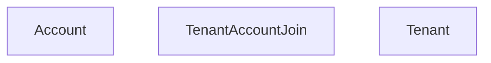
**Sources:** [api/models/account.py87-236](https://github.com/langgenius/dify/blob/92dbc94f/api/models/account.py#L87-L236) [api/models/account.py242-277](https://github.com/langgenius/dify/blob/92dbc94f/api/models/account.py#L242-L277) [api/models/account.py279-302](https://github.com/langgenius/dify/blob/92dbc94f/api/models/account.py#L279-L302)

#### Account Model

The `Account` model ([api/models/account.py87-236](https://github.com/langgenius/dify/blob/92dbc94f/api/models/account.py#L87-L236)) represents individual users in the system. Key features:

| Field | Type | Description |
| --- | --- | --- |
| `id` | StringUUID | Primary key |
| `email` | String(255) | User email, indexed |
| `password` | String(255) | Hashed password (nullable for OAuth users) |
| `interface_language` | String(255) | UI language preference |
| `status` | String(16) | Account status (pending, active, banned, closed) |
| `role` | TenantAccountRole | Current role in active tenant (runtime property) |

**Key Properties and Methods:**

-   `current_tenant` - Returns the active `Tenant` for this account
-   `is_admin_or_owner` - Check for privileged roles
-   `has_edit_permission` - Check for editing capabilities
-   `get_by_openid()` - Retrieve account by OAuth provider

#### Tenant Model

The `Tenant` model ([api/models/account.py242-277](https://github.com/langgenius/dify/blob/92dbc94f/api/models/account.py#L242-L277)) represents workspaces or organizations:

| Field | Type | Description |
| --- | --- | --- |
| `id` | StringUUID | Primary key |
| `name` | String(255) | Workspace name |
| `plan` | String(255) | Billing plan (basic, plus, pro) |
| `status` | String(255) | Tenant status (normal, archive) |
| `encrypt_public_key` | LongText | Public key for encryption |
| `custom_config` | LongText | JSON configuration |

**Key Methods:**

-   `get_accounts()` - Returns list of all member accounts
-   `custom_config_dict` - Property to access parsed JSON config

#### TenantAccountJoin Model

The `TenantAccountJoin` model ([api/models/account.py279-302](https://github.com/langgenius/dify/blob/92dbc94f/api/models/account.py#L279-L302)) manages membership relationships:

| Field | Type | Description |
| --- | --- | --- |
| `tenant_id` | StringUUID | Reference to tenant |
| `account_id` | StringUUID | Reference to account |
| `role` | String(16) | Member role (owner, admin, editor, normal, dataset\_operator) |
| `current` | Boolean | Whether this is the user's active workspace |
| `invited_by` | StringUUID | Account that invited this member |

**Role Hierarchy:**

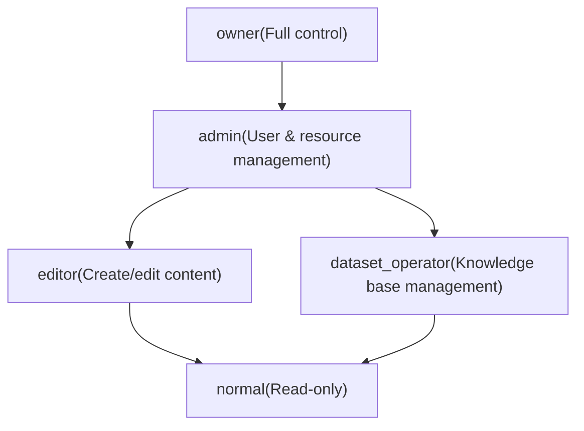
**Sources:** [api/models/account.py19-77](https://github.com/langgenius/dify/blob/92dbc94f/api/models/account.py#L19-L77)

### Related Identity Models

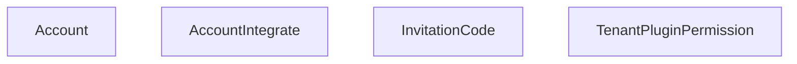
**Sources:** [api/models/account.py304-325](https://github.com/langgenius/dify/blob/92dbc94f/api/models/account.py#L304-L325) [api/models/account.py327-346](https://github.com/langgenius/dify/blob/92dbc94f/api/models/account.py#L327-L346) [api/models/account.py348-375](https://github.com/langgenius/dify/blob/92dbc94f/api/models/account.py#L348-L375)

## Application Layer Models

### Core Application Architecture

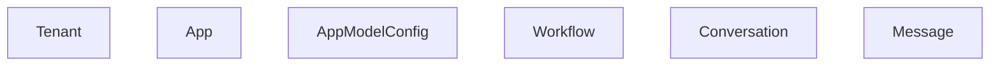
**Sources:** [api/models/model.py78-177](https://github.com/langgenius/dify/blob/92dbc94f/api/models/model.py#L78-L177) [api/models/model.py318-541](https://github.com/langgenius/dify/blob/92dbc94f/api/models/model.py#L318-L541) [api/models/model.py637-918](https://github.com/langgenius/dify/blob/92dbc94f/api/models/model.py#L637-L918) [api/models/model.py920-1548](https://github.com/langgenius/dify/blob/92dbc94f/api/models/model.py#L920-L1548)

### App Model

The `App` model ([api/models/model.py78-177](https://github.com/langgenius/dify/blob/92dbc94f/api/models/model.py#L78-L177)) is the central entity representing AI applications:

| Field | Type | Description |
| --- | --- | --- |
| `id` | StringUUID | Primary key |
| `tenant_id` | StringUUID | Workspace reference |
| `mode` | String(255) | Application type (see AppMode enum) |
| `app_model_config_id` | StringUUID | Current configuration reference |
| `workflow_id` | StringUUID | Reference to workflow (for workflow apps) |
| `enable_site` | Boolean | Whether WebApp is enabled |
| `enable_api` | Boolean | Whether API access is enabled |
| `api_rpm`, `api_rph` | Integer | Rate limiting configuration |
| `use_icon_as_answer_icon` | Boolean | Icon display setting |

#### AppMode Enumeration

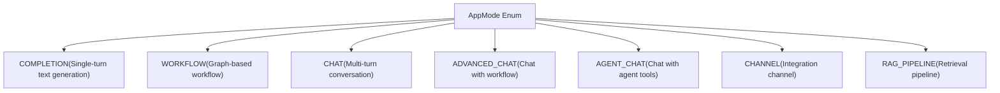
**Sources:** [api/models/model.py49-70](https://github.com/langgenius/dify/blob/92dbc94f/api/models/model.py#L49-L70)

**Key Properties:**

-   `app_model_config` - Returns the associated `AppModelConfig` instance
-   `workflow` - Returns the associated `Workflow` instance (if applicable)
-   `site` - Returns the published `Site` configuration
-   `is_agent` - Boolean indicating if app uses agent mode
-   `deleted_tools` - List of tools referenced but no longer available
-   `tags` - List of `Tag` objects associated with the app

### AppModelConfig Model

The `AppModelConfig` model ([api/models/model.py318-541](https://github.com/langgenius/dify/blob/92dbc94f/api/models/model.py#L318-L541)) stores application configuration and prompt settings:

| Field | Type | Description |
| --- | --- | --- |
| `app_id` | StringUUID | Reference to parent app |
| `provider` | String(255) | LLM provider name |
| `model_id` | String(255) | Model identifier |
| `pre_prompt` | LongText | System prompt/instructions |
| `agent_mode` | LongText | Agent configuration (JSON) |
| `user_input_form` | LongText | Input field definitions (JSON) |
| `dataset_configs` | LongText | Knowledge base settings (JSON) |
| `file_upload` | LongText | File upload configuration (JSON) |
| `prompt_type` | String(255) | Prompt format (simple/advanced) |

**JSON Field Properties:**

-   `agent_mode_dict` - Parsed agent configuration with `enabled`, `strategy`, `tools`, `prompt`
-   `dataset_configs_dict` - Retrieval settings including `retrieval_model`
-   `file_upload_dict` - Multimodal settings for image/file uploads
-   `speech_to_text_dict`, `text_to_speech_dict` - Audio feature configurations

**Sources:** [api/models/model.py353-495](https://github.com/langgenius/dify/blob/92dbc94f/api/models/model.py#L353-L495)

### Conversation and Message Models

#### Conversation Model

The `Conversation` model ([api/models/model.py637-918](https://github.com/langgenius/dify/blob/92dbc94f/api/models/model.py#L637-L918)) represents chat sessions:

| Field | Type | Description |
| --- | --- | --- |
| `id` | StringUUID | Primary key |
| `app_id` | StringUUID | Parent application |
| `mode` | String(255) | Conversation mode |
| `status` | String(255) | Conversation status |
| `from_source` | String(255) | Origin (api, console, etc.) |
| `from_end_user_id` | StringUUID | End user reference |
| `from_account_id` | StringUUID | Account reference |
| `inputs` | JSON | Input variables (with File object support) |
| `dialogue_count` | Integer | Number of message exchanges |

**Key Properties:**

-   `inputs` - Property with automatic File object deserialization
-   `model_config` - Returns effective configuration (may override app config)
-   `message_count` - Total number of messages
-   `user_feedback_stats`, `admin_feedback_stats` - Like/dislike counts
-   `status_count` - Workflow execution status breakdown

**Sources:** [api/models/model.py684-894](https://github.com/langgenius/dify/blob/92dbc94f/api/models/model.py#L684-L894)

#### Message Model

The `Message` model ([api/models/model.py920-1548](https://github.com/langgenius/dify/blob/92dbc94f/api/models/model.py#L920-L1548)) stores individual conversation turns:

| Field | Type | Description |
| --- | --- | --- |
| `id` | StringUUID | Primary key |
| `conversation_id` | StringUUID | Parent conversation |
| `query` | LongText | User input |
| `message` | JSON | Structured message content |
| `answer` | LongText | AI response |
| `workflow_run_id` | StringUUID | Associated workflow run |
| `message_tokens` | Integer | Input token count |
| `answer_tokens` | Integer | Output token count |
| `provider_response_latency` | Float | Generation time |
| `from_source` | String(255) | Message origin |

**Related Message Models:**

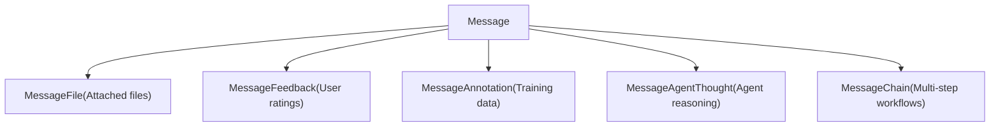
**Sources:** [api/models/model.py1550-1662](https://github.com/langgenius/dify/blob/92dbc94f/api/models/model.py#L1550-L1662) [api/models/model.py1665-1722](https://github.com/langgenius/dify/blob/92dbc94f/api/models/model.py#L1665-L1722) [api/models/model.py1725-1824](https://github.com/langgenius/dify/blob/92dbc94f/api/models/model.py#L1725-L1824) [api/models/model.py1827-1921](https://github.com/langgenius/dify/blob/92dbc94f/api/models/model.py#L1827-L1921) [api/models/model.py1924-1982](https://github.com/langgenius/dify/blob/92dbc94f/api/models/model.py#L1924-L1982)

### Supporting Application Models

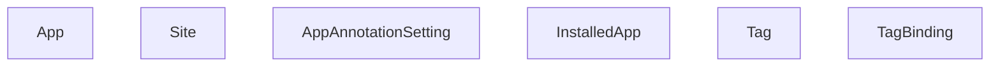
**Sources:** [api/models/model.py1985-2054](https://github.com/langgenius/dify/blob/92dbc94f/api/models/model.py#L1985-L2054) [api/models/model.py2218-2271](https://github.com/langgenius/dify/blob/92dbc94f/api/models/model.py#L2218-L2271) [api/models/model.py2274-2318](https://github.com/langgenius/dify/blob/92dbc94f/api/models/model.py#L2274-L2318)

## Workflow Layer Models

### Workflow Definition and Execution

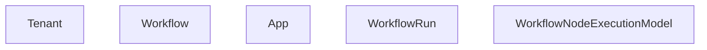
**Sources:** [api/models/workflow.py100-554](https://github.com/langgenius/dify/blob/92dbc94f/api/models/workflow.py#L100-L554) [api/models/workflow.py556-716](https://github.com/langgenius/dify/blob/92dbc94f/api/models/workflow.py#L556-L716) [api/models/workflow.py728-1014](https://github.com/langgenius/dify/blob/92dbc94f/api/models/workflow.py#L728-L1014)

### Workflow Model

The `Workflow` model ([api/models/workflow.py100-554](https://github.com/langgenius/dify/blob/92dbc94f/api/models/workflow.py#L100-L554)) stores workflow definitions:

| Field | Type | Description |
| --- | --- | --- |
| `id` | StringUUID | Primary key |
| `tenant_id`, `app_id` | StringUUID | Workspace and app references |
| `type` | String(255) | Workflow type (workflow, chat, rag-pipeline) |
| `version` | String(255) | Version identifier ("draft" or timestamp) |
| `graph` | LongText | Canvas configuration (JSON) |
| `features` | LongText | Feature settings (JSON) |
| `environment_variables` | LongText | Encrypted environment vars (JSON) |
| `conversation_variables` | LongText | Chat memory configuration (JSON) |
| `rag_pipeline_variables` | LongText | RAG pipeline settings (JSON) |

**WorkflowType Enumeration:**

| Value | Description |
| --- | --- |
| `WORKFLOW` | Standard workflow app |
| `CHAT` | Chat app with workflow mode |
| `RAG_PIPELINE` | Retrieval pipeline |

**Key Properties and Methods:**

-   `graph_dict` - Parsed graph structure with nodes and edges
-   `get_node_config_by_id(node_id)` - Extract individual node configuration
-   `walk_nodes(specific_node_type=None)` - Iterate through workflow nodes
-   `user_input_form()` - Returns start node variable definitions
-   `environment_variables` - Property with automatic encryption/decryption
-   `unique_hash` - Hash of graph and features for change detection

**Sources:** [api/models/workflow.py60-94](https://github.com/langgenius/dify/blob/92dbc94f/api/models/workflow.py#L60-L94) [api/models/workflow.py212-313](https://github.com/langgenius/dify/blob/92dbc94f/api/models/workflow.py#L212-L313)

### WorkflowRun Model

The `WorkflowRun` model ([api/models/workflow.py556-716](https://github.com/langgenius/dify/blob/92dbc94f/api/models/workflow.py#L556-L716)) tracks workflow executions:

| Field | Type | Description |
| --- | --- | --- |
| `workflow_id` | StringUUID | Source workflow |
| `triggered_from` | String(255) | Trigger context (debugging, app-run) |
| `version` | String(255) | Workflow version used |
| `status` | String(255) | Execution status (running, succeeded, failed, stopped, partial-succeeded) |
| `inputs`, `outputs` | LongText | Input/output data (JSON) |
| `error` | LongText | Error message if failed |
| `elapsed_time` | Float | Total execution time |
| `total_tokens` | BigInteger | LLM tokens consumed |
| `created_by_role` | String(255) | Creator type (account, end\_user) |

**Key Properties:**

-   `graph_dict`, `inputs_dict`, `outputs_dict` - Parsed JSON data
-   `message` - Associated Message if triggered from chat
-   `workflow` - Parent Workflow instance

**Sources:** [api/models/workflow.py632-690](https://github.com/langgenius/dify/blob/92dbc94f/api/models/workflow.py#L632-L690)

### WorkflowNodeExecutionModel

The `WorkflowNodeExecutionModel` ([api/models/workflow.py728-1014](https://github.com/langgenius/dify/blob/92dbc94f/api/models/workflow.py#L728-L1014)) provides granular execution logs:

| Field | Type | Description |
| --- | --- | --- |
| `workflow_run_id` | StringUUID | Parent run |
| `node_id` | String(255) | Node identifier from graph |
| `node_type` | String(255) | Node type (llm, http-request, etc.) |
| `index` | Integer | Execution sequence number |
| `predecessor_node_id` | String(255) | Previous node in path |
| `inputs`, `outputs` | LongText | Node I/O data (JSON) |
| `process_data` | LongText | Internal processing state (JSON) |
| `status` | String(255) | Execution result |
| `execution_metadata` | LongText | Token usage, pricing (JSON) |
| `elapsed_time` | Float | Node execution time |

**Execution Data Offloading:**

For large executions, data can be offloaded to object storage:

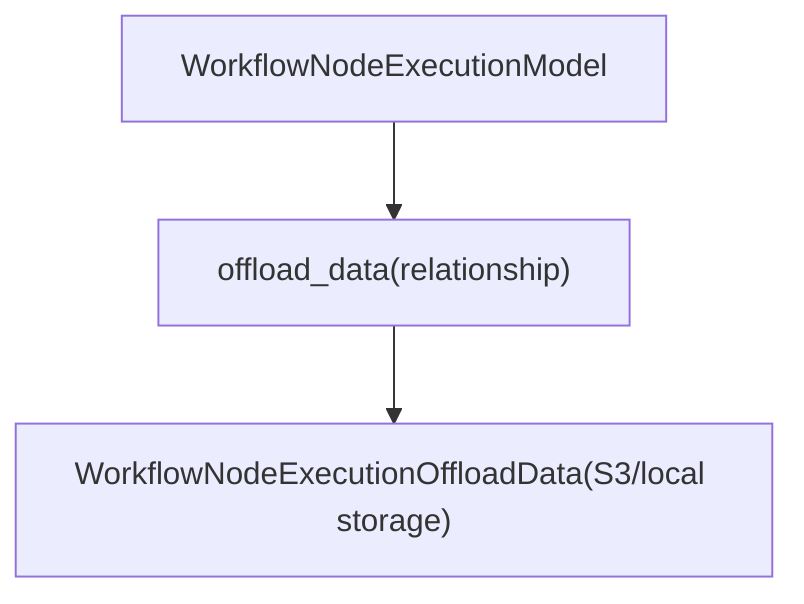
**Sources:** [api/models/workflow.py1017-1110](https://github.com/langgenius/dify/blob/92dbc94f/api/models/workflow.py#L1017-L1110)

### Workflow Pause System

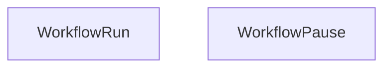
**Pause Reason Types:**

-   `HUMAN_INPUT_REQUIRED` - Waiting for user input
-   `SCHEDULING_PAUSE` - Timed delay

**Sources:** [api/models/workflow.py1113-1175](https://github.com/langgenius/dify/blob/92dbc94f/api/models/workflow.py#L1113-L1175)

## Knowledge Base Layer Models

### Dataset Structure Hierarchy

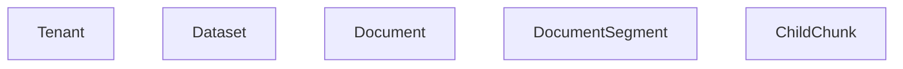
**Sources:** [api/models/dataset.py44-311](https://github.com/langgenius/dify/blob/92dbc94f/api/models/dataset.py#L44-L311) [api/models/dataset.py353-650](https://github.com/langgenius/dify/blob/92dbc94f/api/models/dataset.py#L353-L650) [api/models/dataset.py652-891](https://github.com/langgenius/dify/blob/92dbc94f/api/models/dataset.py#L652-L891) [api/models/dataset.py894-975](https://github.com/langgenius/dify/blob/92dbc94f/api/models/dataset.py#L894-L975)

### Dataset Model

The `Dataset` model ([api/models/dataset.py44-311](https://github.com/langgenius/dify/blob/92dbc94f/api/models/dataset.py#L44-L311)) represents knowledge bases:

| Field | Type | Description |
| --- | --- | --- |
| `id` | StringUUID | Primary key |
| `tenant_id` | StringUUID | Workspace reference |
| `name` | String(255) | Dataset name |
| `permission` | String(255) | Access control (only\_me, all\_team\_members, partial\_members) |
| `indexing_technique` | String(255) | Indexing method (high\_quality, economy) |
| `embedding_model` | String(255) | Embedding model name |
| `embedding_model_provider` | String(255) | Provider for embeddings |
| `retrieval_model` | JSON | Retrieval configuration |
| `built_in_field_enabled` | Boolean | Include system metadata fields |
| `chunk_structure` | String(255) | Chunking strategy |
| `is_multimodal` | Boolean | Support for images/audio |

**Permission Levels:**

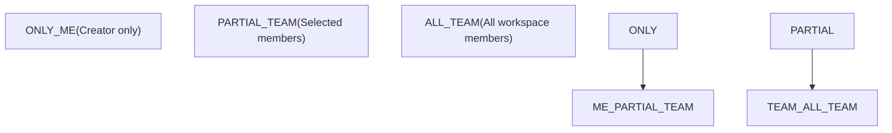
**Key Properties:**

-   `total_documents`, `total_available_documents` - Document counts
-   `retrieval_model_dict` - Parsed retrieval configuration with search method, reranking, top\_k
-   `doc_metadata` - List of custom and built-in metadata fields
-   `external_knowledge_info` - External API knowledge base configuration

**Sources:** [api/models/dataset.py38-42](https://github.com/langgenius/dify/blob/92dbc94f/api/models/dataset.py#L38-L42) [api/models/dataset.py83-306](https://github.com/langgenius/dify/blob/92dbc94f/api/models/dataset.py#L83-L306)

### Document Model

The `Document` model ([api/models/dataset.py353-650](https://github.com/langgenius/dify/blob/92dbc94f/api/models/dataset.py#L353-L650)) represents uploaded or imported files:

| Field | Type | Description |
| --- | --- | --- |
| `dataset_id` | StringUUID | Parent dataset |
| `data_source_type` | String(255) | Source (upload\_file, notion\_import, website\_crawl) |
| `name` | String(255) | Document name |
| `indexing_status` | String(255) | Processing state |
| `batch` | String(255) | Upload batch identifier |
| `word_count` | Integer | Total word count |
| `doc_form` | String(255) | Index structure (text\_model, qa\_model) |
| `doc_metadata` | JSON | Custom metadata fields |
| `enabled` | Boolean | Whether document is active |
| `archived` | Boolean | Soft delete flag |

**Indexing Status Flow:**

> **[Mermaid stateDiagram]**
> *(图表结构无法解析)*

**Built-in Metadata Fields:**

-   `document_name` - Document name
-   `uploader` - Creator account name
-   `upload_date` - Creation timestamp
-   `last_update_date` - Modification timestamp
-   `source` - Data source type

**Sources:** [api/models/dataset.py425-598](https://github.com/langgenius/dify/blob/92dbc94f/api/models/dataset.py#L425-L598)

### DocumentSegment Model

The `DocumentSegment` model ([api/models/dataset.py652-891](https://github.com/langgenius/dify/blob/92dbc94f/api/models/dataset.py#L652-L891)) stores text chunks:

| Field | Type | Description |
| --- | --- | --- |
| `document_id` | StringUUID | Parent document |
| `dataset_id` | StringUUID | Parent dataset |
| `position` | Integer | Order in document |
| `content` | LongText | Segment text |
| `word_count` | Integer | Word count |
| `tokens` | Integer | Token count |
| `index_node_id` | String(255) | Vector database node ID |
| `index_node_hash` | String(255) | Content hash |
| `enabled` | Boolean | Whether included in retrieval |
| `status` | String(255) | Processing status |
| `hit_count` | Integer | Retrieval frequency |

**Segment Relationships:**

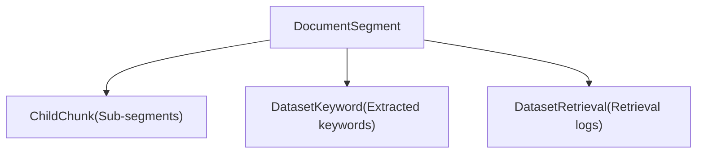
**Sources:** [api/models/dataset.py652-891](https://github.com/langgenius/dify/blob/92dbc94f/api/models/dataset.py#L652-L891)

### Dataset Configuration Models

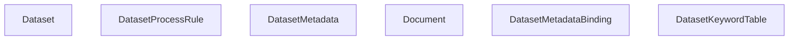
**DatasetProcessRule Modes:**

-   `automatic` - Default segmentation rules
-   `custom` - User-defined rules
-   `hierarchical` - Parent-child chunk structure

**Sources:** [api/models/dataset.py313-351](https://github.com/langgenius/dify/blob/92dbc94f/api/models/dataset.py#L313-L351) [api/models/dataset.py978-1026](https://github.com/langgenius/dify/blob/92dbc94f/api/models/dataset.py#L978-L1026) [api/models/dataset.py1029-1073](https://github.com/langgenius/dify/blob/92dbc94f/api/models/dataset.py#L1029-L1073)

## Provider and Model Integration

### Provider Architecture

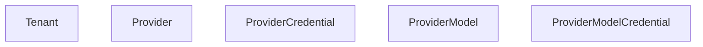
**Sources:** [api/models/provider.py49-128](https://github.com/langgenius/dify/blob/92dbc94f/api/models/provider.py#L49-L128) [api/models/provider.py129-177](https://github.com/langgenius/dify/blob/92dbc94f/api/models/provider.py#L129-L177) [api/models/provider.py314-338](https://github.com/langgenius/dify/blob/92dbc94f/api/models/provider.py#L314-L338) [api/models/provider.py340-372](https://github.com/langgenius/dify/blob/92dbc94f/api/models/provider.py#L340-L372)

### Provider Model

The `Provider` model ([api/models/provider.py49-128](https://github.com/langgenius/dify/blob/92dbc94f/api/models/provider.py#L49-L128)) represents LLM provider configurations:

| Field | Type | Description |
| --- | --- | --- |
| `provider_name` | String(255) | Provider identifier (openai, anthropic, etc.) |
| `provider_type` | String(40) | Type (custom, system) |
| `is_valid` | Boolean | Whether credentials are valid |
| `credential_id` | StringUUID | Reference to encrypted credentials |
| `quota_type` | String(40) | Quota category (paid, free, trial) |
| `quota_limit`, `quota_used` | BigInteger | Usage tracking |

**ProviderType Enumeration:**

-   `CUSTOM` - User-provided API keys
-   `SYSTEM` - Hosted/managed providers

**ProviderQuotaType Enumeration:**

-   `PAID` - Paid hosted quota
-   `FREE` - Third-party free tier
-   `TRIAL` - Hosted trial quota

**Key Properties:**

-   `credential` - Returns associated `ProviderCredential`
-   `is_enabled` - Combines `is_valid` and credential checks
-   `token_is_set` - Boolean indicating credential presence

**Sources:** [api/models/provider.py19-47](https://github.com/langgenius/dify/blob/92dbc94f/api/models/provider.py#L19-L47)

### Model Configuration Models

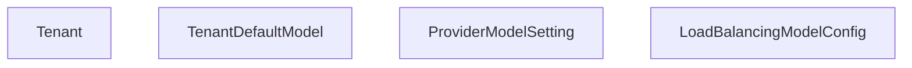
**Sources:** [api/models/provider.py179-199](https://github.com/langgenius/dify/blob/92dbc94f/api/models/provider.py#L179-L199) [api/models/provider.py253-281](https://github.com/langgenius/dify/blob/92dbc94f/api/models/provider.py#L253-L281) [api/models/provider.py283-312](https://github.com/langgenius/dify/blob/92dbc94f/api/models/provider.py#L283-L312)

## Tool Provider Models

### Tool Provider Type Hierarchy

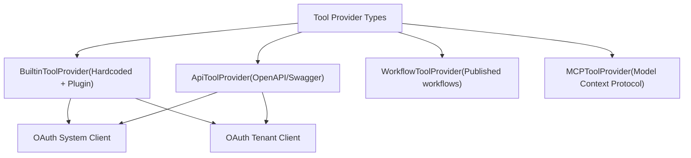
**Sources:** [api/models/tools.py68-118](https://github.com/langgenius/dify/blob/92dbc94f/api/models/tools.py#L68-L118) [api/models/tools.py120-192](https://github.com/langgenius/dify/blob/92dbc94f/api/models/tools.py#L120-L192) [api/models/tools.py216-281](https://github.com/langgenius/dify/blob/92dbc94f/api/models/tools.py#L216-L281) [api/models/tools.py283-369](https://github.com/langgenius/dify/blob/92dbc94f/api/models/tools.py#L283-L369)

### BuiltinToolProvider Model

The `BuiltinToolProvider` model ([api/models/tools.py68-118](https://github.com/langgenius/dify/blob/92dbc94f/api/models/tools.py#L68-L118)) stores credentials for built-in tools:

| Field | Type | Description |
| --- | --- | --- |
| `tenant_id` | StringUUID | Workspace reference |
| `provider` | String(256) | Tool provider identifier |
| `name` | String(256) | Configuration name |
| `encrypted_credentials` | LongText | Encrypted API keys/secrets |
| `credential_type` | String(32) | Type (api-key, oauth2) |
| `is_default` | Boolean | Whether this is the default config |
| `expires_at` | BigInteger | OAuth token expiration |

**Sources:** [api/models/tools.py68-118](https://github.com/langgenius/dify/blob/92dbc94f/api/models/tools.py#L68-L118)

### ApiToolProvider Model

The `ApiToolProvider` model ([api/models/tools.py120-192](https://github.com/langgenius/dify/blob/92dbc94f/api/models/tools.py#L120-L192)) represents OpenAPI-based tool integrations:

| Field | Type | Description |
| --- | --- | --- |
| `name` | String(255) | Provider name |
| `icon` | String(255) | Provider icon URL |
| `schema` | LongText | Original OpenAPI/Swagger schema |
| `schema_type_str` | String(40) | Schema format (openapi, swagger) |
| `tools_str` | LongText | Parsed tool definitions (JSON) |
| `credentials_str` | LongText | Credential requirements (JSON) |
| `description` | LongText | Provider description |

**Key Properties:**

-   `schema_type` - Parsed `ApiProviderSchemaType` enum
-   `tools` - List of `ApiToolBundle` objects
-   `credentials` - Parsed credential dictionary

**Sources:** [api/models/tools.py172-187](https://github.com/langgenius/dify/blob/92dbc94f/api/models/tools.py#L172-L187)

### WorkflowToolProvider Model

The `WorkflowToolProvider` model ([api/models/tools.py216-281](https://github.com/langgenius/dify/blob/92dbc94f/api/models/tools.py#L216-L281)) publishes workflows as reusable tools:

| Field | Type | Description |
| --- | --- | --- |
| `app_id` | StringUUID | Source workflow app |
| `name` | String(255) | Tool identifier |
| `label` | String(255) | Display name |
| `version` | String(255) | Workflow version |
| `parameter_configuration` | LongText | Input parameter definitions (JSON) |
| `description` | LongText | Tool description |

**Key Properties:**

-   `parameter_configurations` - List of `WorkflowToolParameterConfiguration` objects
-   `app` - Associated `App` instance

**Sources:** [api/models/tools.py272-280](https://github.com/langgenius/dify/blob/92dbc94f/api/models/tools.py#L272-L280)

### MCPToolProvider Model

The `MCPToolProvider` model ([api/models/tools.py283-369](https://github.com/langgenius/dify/blob/92dbc94f/api/models/tools.py#L283-L369)) integrates Model Context Protocol servers:

| Field | Type | Description |
| --- | --- | --- |
| `name` | String(40) | Provider name |
| `server_identifier` | String(64) | Unique server ID |
| `server_url` | LongText | Encrypted server endpoint |
| `server_url_hash` | String(64) | Hash for uniqueness |
| `encrypted_credentials` | LongText | Authentication credentials |
| `authed` | Boolean | Whether authenticated |
| `tools` | LongText | Available tools (JSON) |
| `timeout` | Float | Request timeout |
| `sse_read_timeout` | Float | SSE stream timeout |
| `encrypted_headers` | LongText | Custom HTTP headers |

**Sources:** [api/models/tools.py336-368](https://github.com/langgenius/dify/blob/92dbc94f/api/models/tools.py#L336-L368)

### Tool OAuth Models

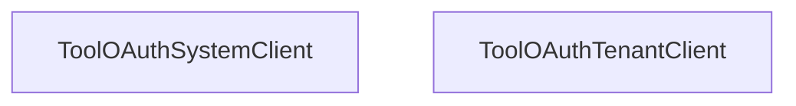
**Sources:** [api/models/tools.py28-42](https://github.com/langgenius/dify/blob/92dbc94f/api/models/tools.py#L28-L42) [api/models/tools.py45-66](https://github.com/langgenius/dify/blob/92dbc94f/api/models/tools.py#L45-L66)

## Trigger and Automation Models

### Trigger System Architecture

```mermaid
flowchart TD
    entity_Tenant_0["Tenant"]
    entity_TriggerSubscription_1["TriggerSubscription"]
    entity_App_2["App"]
    entity_WorkflowWebhookTrigger_3["WorkflowWebhookTrigger"]
    entity_WorkflowScheduleTrigger_4["WorkflowScheduleTrigger"]
    entity_WorkflowPluginTrigger_5["WorkflowPluginTrigger"]
    entity_WorkflowRun_6["WorkflowRun"]
    entity_WorkflowTriggerLog_7["WorkflowTriggerLog"]
```
**Sources:** [api/models/trigger.py27-106](https://github.com/langgenius/dify/blob/92dbc94f/api/models/trigger.py#L27-L106) [api/models/trigger.py282-364](https://github.com/langgenius/dify/blob/92dbc94f/api/models/trigger.py#L282-L364) [api/models/trigger.py367-468](https://github.com/langgenius/dify/blob/92dbc94f/api/models/trigger.py#L367-L468) [api/models/trigger.py169-280](https://github.com/langgenius/dify/blob/92dbc94f/api/models/trigger.py#L169-L280)

### TriggerSubscription Model

The `TriggerSubscription` model ([api/models/trigger.py27-106](https://github.com/langgenius/dify/blob/92dbc94f/api/models/trigger.py#L27-L106)) manages provider subscriptions:

| Field | Type | Description |
| --- | --- | --- |
| `provider_id` | String(255) | Provider identifier |
| `endpoint_id` | String(255) | Unique subscription endpoint (indexed) |
| `parameters` | JSON | Subscription configuration |
| `properties` | JSON | Provider-specific properties |
| `credentials` | JSON | Authentication data |
| `credential_type` | String(50) | Type (oauth, api\_key) |
| `credential_expires_at` | Integer | OAuth expiration timestamp |
| `expires_at` | Integer | Subscription expiration |

**Key Methods:**

-   `is_credential_expired()` - Check OAuth expiration (3-minute buffer)
-   `to_entity()` - Convert to domain `Subscription` object
-   `to_api_entity()` - Convert to API response entity

**Sources:** [api/models/trigger.py79-105](https://github.com/langgenius/dify/blob/92dbc94f/api/models/trigger.py#L79-L105)

### WorkflowTriggerLog Model

The `WorkflowTriggerLog` model ([api/models/trigger.py169-280](https://github.com/langgenius/dify/blob/92dbc94f/api/models/trigger.py#L169-L280)) tracks async trigger executions:

| Field | Type | Description |
| --- | --- | --- |
| `workflow_run_id` | StringUUID | Associated workflow run |
| `trigger_type` | String(50) | Type (webhook, schedule, plugin) |
| `trigger_metadata` | LongText | Trigger metadata (JSON) |
| `trigger_data` | LongText | Full trigger payload (JSON) |
| `inputs` | LongText | Workflow inputs (JSON) |
| `status` | String(50) | Execution status |
| `queue_name` | String(100) | Celery queue |
| `celery_task_id` | String(255) | Task ID for tracking |
| `retry_count` | Integer | Retry attempts |

**Trigger Types:**

-   `WEBHOOK` - HTTP webhook invocation
-   `SCHEDULE` - Cron-based scheduling
-   `PLUGIN` - Plugin event triggers

**Sources:** [api/models/trigger.py169-280](https://github.com/langgenius/dify/blob/92dbc94f/api/models/trigger.py#L169-L280) [api/models/enums.py](https://github.com/langgenius/dify/blob/92dbc94f/api/models/enums.py)

### Webhook and Schedule Triggers

```mermaid
flowchart TD
    App["App"]
    Webhook["WorkflowWebhookTrigger(HTTP endpoint)"]
    Schedule["WorkflowScheduleTrigger(Cron schedule)"]
    Plugin["WorkflowPluginTrigger(Plugin events)"]
    WebhookLog["Logs: WorkflowTriggerLog"]
    ScheduleLog["Logs: WorkflowTriggerLog"]
    PluginLog["Logs: WorkflowTriggerLog"]

    App --> Webhook
    App --> Schedule
    App --> Plugin
    Webhook --> WebhookLog
    Schedule --> ScheduleLog
    Plugin --> PluginLog
```
**WorkflowScheduleTrigger Fields:**

-   `cron_expression` - Cron syntax schedule
-   `timezone` - Execution timezone
-   `enabled` - Whether schedule is active

**WorkflowPluginTrigger Fields:**

-   `plugin_id` - Plugin identifier
-   `trigger_provider` - Provider within plugin
-   `trigger_subscription_id` - Subscription reference

**Sources:** [api/models/trigger.py367-468](https://github.com/langgenius/dify/blob/92dbc94f/api/models/trigger.py#L367-L468) [api/models/trigger.py471-552](https://github.com/langgenius/dify/blob/92dbc94f/api/models/trigger.py#L471-L552)

## Supporting and Utility Models

### File and Media Models

```mermaid
flowchart TD
    entity_Message_0["Message"]
    entity_MessageFile_1["MessageFile"]
    entity_ToolFile_2["ToolFile"]
    entity_UploadFile_3["UploadFile"]
```
**Sources:** [api/models/tools.py462-492](https://github.com/langgenius/dify/blob/92dbc94f/api/models/tools.py#L462-L492) [api/models/model.py2057-2124](https://github.com/langgenius/dify/blob/92dbc94f/api/models/model.py#L2057-L2124)

### Tag System

```mermaid
flowchart TD
    entity_Tenant_0["Tenant"]
    entity_Tag_1["Tag"]
    entity_TagBinding_2["TagBinding"]
```
**Tag Types:**

-   `app` - Application tags
-   `knowledge` - Dataset tags

**Sources:** [api/models/model.py2218-2271](https://github.com/langgenius/dify/blob/92dbc94f/api/models/model.py#L2218-L2271) [api/models/model.py2274-2318](https://github.com/langgenius/dify/blob/92dbc94f/api/models/model.py#L2274-L2318)

### Celery Task Models

```mermaid
flowchart TD
    entity_CeleryTask_0["CeleryTask"]
    entity_CeleryTaskSet_1["CeleryTaskSet"]
```
**Celery Task States:**

-   `PENDING` - Task waiting to execute
-   `STARTED` - Task has begun
-   `SUCCESS` - Task completed successfully
-   `FAILURE` - Task failed
-   `RETRY` - Task is being retried
-   `REVOKED` - Task was cancelled

**Sources:** [api/models/task.py14-54](https://github.com/langgenius/dify/blob/92dbc94f/api/models/task.py#L14-L54)

### Data Source OAuth Models

```mermaid
flowchart TD
    entity_Tenant_0["Tenant"]
    entity_DataSourceOauthBinding_1["DataSourceOauthBinding"]
    entity_DataSourceApiKeyAuthBinding_2["DataSourceApiKeyAuthBinding"]
```
**Data Source Providers:**

-   Notion (OAuth)
-   Website crawlers (API key)
-   Custom integrations

**Sources:** [api/models/source.py13-39](https://github.com/langgenius/dify/blob/92dbc94f/api/models/source.py#L13-L39) [api/models/source.py41-79](https://github.com/langgenius/dify/blob/92dbc94f/api/models/source.py#L41-L79)

### External Knowledge API Models

```mermaid
flowchart TD
    entity_Tenant_0["Tenant"]
    entity_ExternalKnowledgeApis_1["ExternalKnowledgeApis"]
    entity_Dataset_2["Dataset"]
    entity_ExternalKnowledgeBindings_3["ExternalKnowledgeBindings"]
```
**Sources:** [api/models/dataset.py1076-1127](https://github.com/langgenius/dify/blob/92dbc94f/api/models/dataset.py#L1076-L1127) [api/models/dataset.py1130-1168](https://github.com/langgenius/dify/blob/92dbc94f/api/models/dataset.py#L1130-L1168)

### Web-Specific Models

```mermaid
flowchart TD
    entity_EndUser_0["EndUser"]
    entity_SavedMessage_1["SavedMessage"]
    entity_PinnedConversation_2["PinnedConversation"]
```
**Sources:** [api/models/web.py14-38](https://github.com/langgenius/dify/blob/92dbc94f/api/models/web.py#L14-L38) [api/models/web.py40-64](https://github.com/langgenius/dify/blob/92dbc94f/api/models/web.py#L40-L64)

## Model Relationships and Access Patterns

### Cross-Layer Relationship Map

```mermaid
flowchart TD
    Tenant["Tenant"]
    Account["Account"]
    App["App"]
    Conversation["Conversation"]
    Message["Message"]
    Workflow["Workflow"]
    WorkflowRun["WorkflowRun"]
    Dataset["Dataset"]
    Document["Document"]
    Provider["Provider"]
    ToolProvider["Tool Providers"]

    Tenant --> App
    Tenant --> Workflow
    Tenant --> Dataset
    Tenant --> Provider
    Tenant --> ToolProvider
    App --> Conversation
    App --> Workflow
    App --> Dataset
    Conversation --> Message
    Message --> WorkflowRun
    Workflow --> WorkflowRun
```
### Common Query Patterns

**Tenant-scoped queries:**

```
# All queries filter by tenant_id for multi-tenancy isolation
apps = db.session.query(App).where(App.tenant_id == tenant_id).all()
datasets = db.session.query(Dataset).where(Dataset.tenant_id == tenant_id).all()
```
**Relationship traversal:**

```
# Navigate from App to related entities
app = db.session.get(App, app_id)
app_config = app.app_model_config  # Property lookup
workflow = app.workflow  # Property lookup
conversations = db.session.query(Conversation).where(Conversation.app_id == app.id).all()
```
**Indexed lookups:**

```
# Use indexed fields for performance
dataset_by_tenant = db.session.query(Dataset).where(Dataset.tenant_id == tenant_id).all()
messages_by_conversation = db.session.query(Message).where(
    Message.conversation_id == conv_id
).order_by(Message.created_at.asc()).all()
```
**Sources:** [api/models/model.py](https://github.com/langgenius/dify/blob/92dbc94f/api/models/model.py) [api/models/workflow.py](https://github.com/langgenius/dify/blob/92dbc94f/api/models/workflow.py) [api/models/dataset.py](https://github.com/langgenius/dify/blob/92dbc94f/api/models/dataset.py)

---

This document provides a comprehensive reference to Dify's data models. For workflow-specific execution logic, see [Workflow Definition and Execution Model](/langgenius/dify/5.1-workflow-definition-and-execution-model). For knowledge base indexing and retrieval, see [Dataset Service and Document Management](/langgenius/dify/4.1-dataset-service-and-document-management). For authentication and authorization flows, see [Tenant and Account Models](/langgenius/dify/7.1-tenant-and-account-models).
