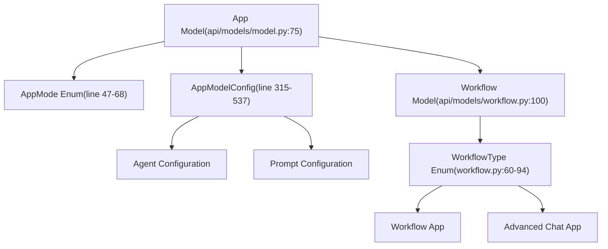
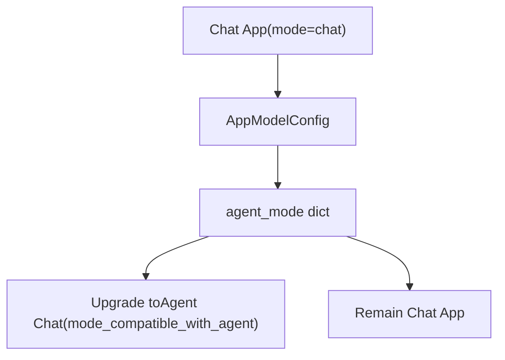
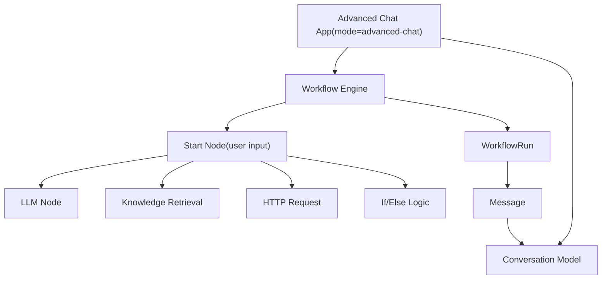
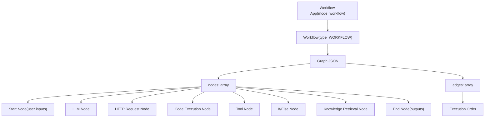
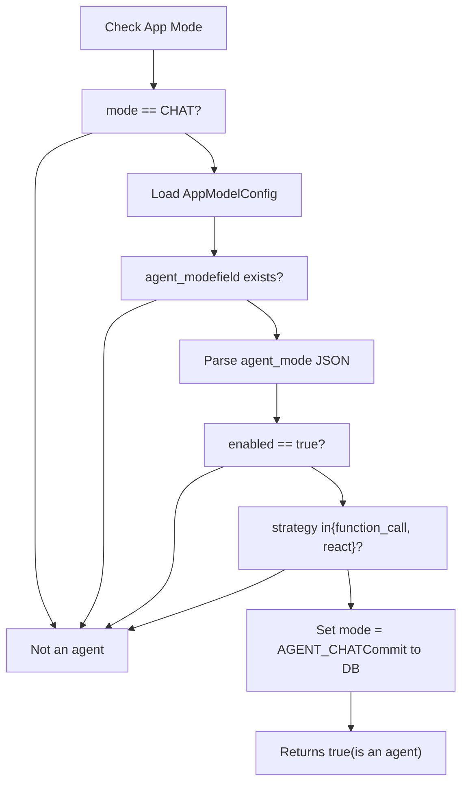
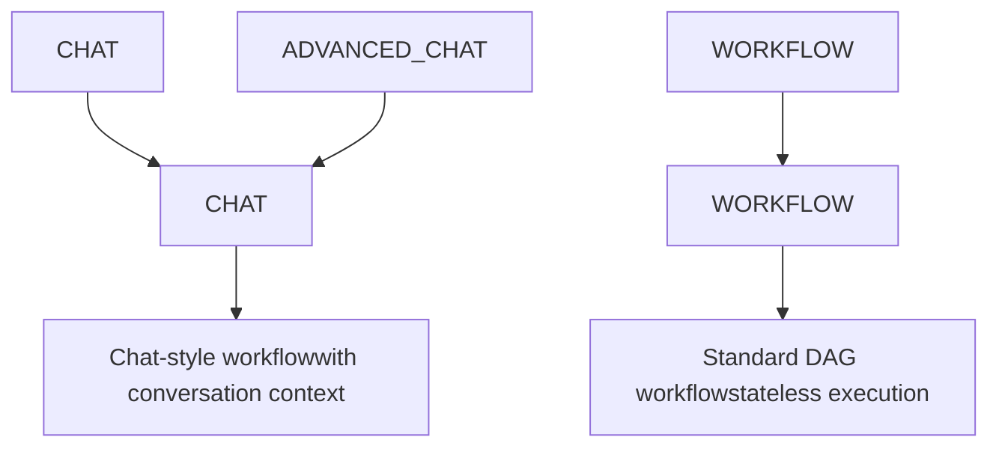
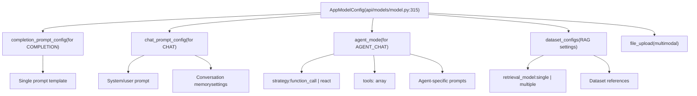
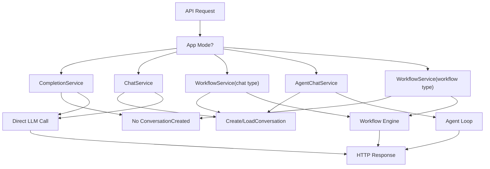
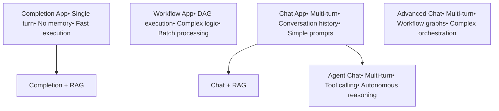

# Application Types and Execution Modes

Relevant source files

-   [api/models/account.py](https://github.com/langgenius/dify/blob/92dbc94f/api/models/account.py)
-   [api/models/api\_based\_extension.py](https://github.com/langgenius/dify/blob/92dbc94f/api/models/api_based_extension.py)
-   [api/models/dataset.py](https://github.com/langgenius/dify/blob/92dbc94f/api/models/dataset.py)
-   [api/models/model.py](https://github.com/langgenius/dify/blob/92dbc94f/api/models/model.py)
-   [api/models/oauth.py](https://github.com/langgenius/dify/blob/92dbc94f/api/models/oauth.py)
-   [api/models/provider.py](https://github.com/langgenius/dify/blob/92dbc94f/api/models/provider.py)
-   [api/models/source.py](https://github.com/langgenius/dify/blob/92dbc94f/api/models/source.py)
-   [api/models/task.py](https://github.com/langgenius/dify/blob/92dbc94f/api/models/task.py)
-   [api/models/tools.py](https://github.com/langgenius/dify/blob/92dbc94f/api/models/tools.py)
-   [api/models/trigger.py](https://github.com/langgenius/dify/blob/92dbc94f/api/models/trigger.py)
-   [api/models/web.py](https://github.com/langgenius/dify/blob/92dbc94f/api/models/web.py)
-   [api/models/workflow.py](https://github.com/langgenius/dify/blob/92dbc94f/api/models/workflow.py)
-   [api/tests/test\_containers\_integration\_tests/services/test\_advanced\_prompt\_template\_service.py](https://github.com/langgenius/dify/blob/92dbc94f/api/tests/test_containers_integration_tests/services/test_advanced_prompt_template_service.py)
-   [api/tests/test\_containers\_integration\_tests/services/test\_agent\_service.py](https://github.com/langgenius/dify/blob/92dbc94f/api/tests/test_containers_integration_tests/services/test_agent_service.py)
-   [api/tests/test\_containers\_integration\_tests/tasks/\_\_init\_\_.py](https://github.com/langgenius/dify/blob/92dbc94f/api/tests/test_containers_integration_tests/tasks/__init__.py)
-   [api/tests/test\_containers\_integration\_tests/tasks/test\_add\_document\_to\_index\_task.py](https://github.com/langgenius/dify/blob/92dbc94f/api/tests/test_containers_integration_tests/tasks/test_add_document_to_index_task.py)
-   [api/tests/unit\_tests/core/test\_provider\_manager.py](https://github.com/langgenius/dify/blob/92dbc94f/api/tests/unit_tests/core/test_provider_manager.py)
-   [web/app/components/develop/template/template.en.mdx](https://github.com/langgenius/dify/blob/92dbc94f/web/app/components/develop/template/template.en.mdx)
-   [web/app/components/develop/template/template.ja.mdx](https://github.com/langgenius/dify/blob/92dbc94f/web/app/components/develop/template/template.ja.mdx)
-   [web/app/components/develop/template/template.zh.mdx](https://github.com/langgenius/dify/blob/92dbc94f/web/app/components/develop/template/template.zh.mdx)
-   [web/app/components/develop/template/template\_advanced\_chat.en.mdx](https://github.com/langgenius/dify/blob/92dbc94f/web/app/components/develop/template/template_advanced_chat.en.mdx)
-   [web/app/components/develop/template/template\_advanced\_chat.ja.mdx](https://github.com/langgenius/dify/blob/92dbc94f/web/app/components/develop/template/template_advanced_chat.ja.mdx)
-   [web/app/components/develop/template/template\_advanced\_chat.zh.mdx](https://github.com/langgenius/dify/blob/92dbc94f/web/app/components/develop/template/template_advanced_chat.zh.mdx)
-   [web/app/components/develop/template/template\_chat.en.mdx](https://github.com/langgenius/dify/blob/92dbc94f/web/app/components/develop/template/template_chat.en.mdx)
-   [web/app/components/develop/template/template\_chat.ja.mdx](https://github.com/langgenius/dify/blob/92dbc94f/web/app/components/develop/template/template_chat.ja.mdx)
-   [web/app/components/develop/template/template\_chat.zh.mdx](https://github.com/langgenius/dify/blob/92dbc94f/web/app/components/develop/template/template_chat.zh.mdx)
-   [web/app/components/develop/template/template\_workflow.en.mdx](https://github.com/langgenius/dify/blob/92dbc94f/web/app/components/develop/template/template_workflow.en.mdx)
-   [web/app/components/develop/template/template\_workflow.ja.mdx](https://github.com/langgenius/dify/blob/92dbc94f/web/app/components/develop/template/template_workflow.ja.mdx)
-   [web/app/components/develop/template/template\_workflow.zh.mdx](https://github.com/langgenius/dify/blob/92dbc94f/web/app/components/develop/template/template_workflow.zh.mdx)

This page documents the five primary application types supported by Dify and their execution characteristics. Each application type defines a distinct interaction pattern and execution model optimized for specific use cases, from single-turn text completion to multi-step workflow orchestration.

For information about the data models underlying these applications, see [Core Data Models and Domain Entities](/langgenius/dify/2.2-core-data-models-and-domain-entities). For details on workflow node execution, see [Workflow System and Node Execution](/langgenius/dify/5-workflow-system-and-node-execution).

---

## Application Type Taxonomy

Dify supports five distinct application modes, each defined by the `AppMode` enum. These modes determine the execution pattern, state management, and capability set available to the application.

**AppMode Enumeration**

The application type is stored in the `mode` field of the `App` model:

| Mode Value | Description | Statefulness | Primary Use Case |
| --- | --- | --- | --- |
| `completion` | Single-turn text generation | Stateless | Text completion, translations, one-off tasks |
| `chat` | Conversational interactions | Stateful | Customer support, chatbots, Q&A |
| `advanced-chat` | Chat with workflow capabilities | Stateful | Complex conversational flows with orchestration |
| `agent-chat` | Tool-calling autonomous agents | Stateful | Task automation with external tool integration |
| `workflow` | Multi-step pipeline execution | Stateless per run | Data processing, batch operations, ETL |

Sources: [api/models/model.py47-68](https://github.com/langgenius/dify/blob/92dbc94f/api/models/model.py#L47-L68)

---

## Application Mode Implementation

### Mode Storage and Validation


**Mode Storage in App Model**

Sources: [api/models/model.py75-313](https://github.com/langgenius/dify/blob/92dbc94f/api/models/model.py#L75-L313)

---

## Detailed Application Type Specifications

### 1\. Completion App (`completion`)

**Characteristics:**

-   **Stateless**: Each request is independent
-   **Single-turn**: One input → one output
-   **No conversation history**: No memory between requests
-   **Configuration**: Uses `completion_prompt_config` from `AppModelConfig`

**Execution Flow:**

> **[Mermaid sequence]**
> *(图表结构无法解析)*

**Key Properties:**

-   No `Conversation` entity created
-   No message history maintained
-   Suitable for functional transformations
-   Supports file uploads if configured

Sources: [api/models/model.py47-48](https://github.com/langgenius/dify/blob/92dbc94f/api/models/model.py#L47-L48) [api/models/model.py315-349](https://github.com/langgenius/dify/blob/92dbc94f/api/models/model.py#L315-L349)

---

### 2\. Chat App (`chat`)

**Characteristics:**

-   **Stateful**: Maintains conversation history
-   **Multi-turn**: Continuous dialogue with context
-   **Memory**: Access to previous messages in conversation
-   **Configuration**: Uses `chat_prompt_config` from `AppModelConfig`

**Execution Flow:**

> **[Mermaid sequence]**
> *(图表结构无法解析)*

**State Management:**

-   Creates `Conversation` entity on first message
-   Each exchange stored as `Message` records
-   Supports conversation variables
-   Optional RAG integration via `retriever_resource`

**Agent Compatibility:**

The Chat app can automatically upgrade to Agent Chat mode if agent configuration is detected:


Sources: [api/models/model.py50](https://github.com/langgenius/dify/blob/92dbc94f/api/models/model.py#L50-L50) [api/models/model.py153-166](https://github.com/langgenius/dify/blob/92dbc94f/api/models/model.py#L153-L166) [api/models/model.py169-173](https://github.com/langgenius/dify/blob/92dbc94f/api/models/model.py#L169-L173)

---

### 3\. Advanced Chat App (`advanced-chat`)

**Characteristics:**

-   **Stateful**: Full conversation history
-   **Workflow-powered**: Backed by Workflow engine
-   **Complex orchestration**: Multi-node execution graphs
-   **Enhanced capabilities**: Access to all workflow node types

**Architecture:**


**Workflow Integration:**

-   App has `workflow_id` pointing to `Workflow` entity
-   Each message triggers a `WorkflowRun` execution
-   Workflow type is `WorkflowType.CHAT`
-   Conversation variables passed to workflow context
-   Workflow output becomes the message response

**Execution Lifecycle:**

1.  User sends message to conversation
2.  `Message` entity created with status `normal`
3.  `WorkflowRun` entity created with `triggered_from='app-run'`
4.  Workflow graph executed node-by-node
5.  Each node execution tracked in `WorkflowNodeExecutionModel`
6.  Final output stored in `Message.answer`
7.  `WorkflowRun` marked as `succeeded` or `failed`

Sources: [api/models/model.py51](https://github.com/langgenius/dify/blob/92dbc94f/api/models/model.py#L51-L51) [api/models/workflow.py100-202](https://github.com/langgenius/dify/blob/92dbc94f/api/models/workflow.py#L100-L202) [api/models/workflow.py556-715](https://github.com/langgenius/dify/blob/92dbc94f/api/models/workflow.py#L556-L715)

---

### 4\. Agent Chat App (`agent-chat`)

**Characteristics:**

-   **Tool-enabled**: Access to external tools and APIs
-   **Autonomous reasoning**: Uses ReAct or Function Calling strategies
-   **Multi-step**: Can execute multiple tool calls per turn
-   **Stateful**: Maintains conversation and agent thought chain

**Agent Mode Configuration:**

The `agent_mode` field in `AppModelConfig` determines agent behavior:

```
{
  "enabled": true,
  "strategy": "function_call",  // or "react"
  "tools": [
    {
      "provider_id": "google",
      "provider_type": "builtin",
      "tool_name": "google_search",
      "tool_parameters": {}
    }
  ],
  "prompt": {
    "first_prompt": "You are a helpful assistant...",
    "next_iteration": "Continue with the next step..."
  }
}
```
**Tool Provider Types:**

| Provider Type | Storage Table | Description |
| --- | --- | --- |
| `builtin` | `tool_builtin_providers` | Pre-built tools (Google, DALL-E, etc.) |
| `api` | `tool_api_providers` | Custom API integrations via OpenAPI schema |
| `workflow` | `tool_workflow_providers` | Other Dify workflows as tools |
| `mcp` | `tool_mcp_providers` | Model Context Protocol tools |

**Execution with Agent Thoughts:**

> **[Mermaid sequence]**
> *(图表结构无法解析)*

**Agent Detection Logic:**

The system automatically detects agent configuration:

Sources: [api/models/model.py52](https://github.com/langgenius/dify/blob/92dbc94f/api/models/model.py#L52-L52) [api/models/model.py153-166](https://github.com/langgenius/dify/blob/92dbc94f/api/models/model.py#L153-L166) [api/models/model.py427-432](https://github.com/langgenius/dify/blob/92dbc94f/api/models/model.py#L427-L432)

---

### 5\. Workflow App (`workflow`)

**Characteristics:**

-   **Stateless**: Each run is independent
-   **DAG execution**: Directed acyclic graph of nodes
-   **Batch-oriented**: Designed for data processing pipelines
-   **No conversation**: Pure input → processing → output

**Workflow Graph Structure:**


**Node Execution Tracking:**

Each workflow run creates detailed execution records:

| Entity | Purpose | Key Fields |
| --- | --- | --- |
| `WorkflowRun` | Overall execution record | `status`, `inputs`, `outputs`, `elapsed_time` |
| `WorkflowNodeExecutionModel` | Per-node execution details | `node_id`, `node_type`, `inputs`, `outputs`, `status` |
| `WorkflowNodeExecutionOffload` | Large execution data storage | Offloaded when data exceeds size threshold |

**Execution Flow:**

1.  API receives workflow run request with inputs
2.  `WorkflowRun` entity created with `triggered_from='app-run'`
3.  Workflow engine loads graph from `Workflow.graph`
4.  Nodes executed in topological order based on edges
5.  Each node creates `WorkflowNodeExecutionModel` record
6.  Variables passed between nodes via variable pool
7.  Final output collected from designated end node(s)
8.  `WorkflowRun` updated with final status and outputs

**Variable Types in Workflows:**

-   **User Input Variables**: Defined in Start node, provided at runtime
-   **Environment Variables**: Encrypted secrets accessible to all nodes
-   **Conversation Variables**: Only for chat workflows, not workflow apps
-   **System Variables**: Metadata like execution time, user info

Sources: [api/models/model.py49](https://github.com/langgenius/dify/blob/92dbc94f/api/models/model.py#L49-L49) [api/models/workflow.py60-94](https://github.com/langgenius/dify/blob/92dbc94f/api/models/workflow.py#L60-L94) [api/models/workflow.py100-554](https://github.com/langgenius/dify/blob/92dbc94f/api/models/workflow.py#L100-L554)

---

## Mode Transitions and Compatibility

### Agent Mode Auto-Detection

The `is_agent` property dynamically determines if a Chat app should behave as an Agent Chat app:


**Code Implementation:**

The `mode_compatible_with_agent` property provides the effective mode:

Sources: [api/models/model.py153-173](https://github.com/langgenius/dify/blob/92dbc94f/api/models/model.py#L153-L173)

---

## Workflow Type Mapping

The `WorkflowType` enum provides a parallel classification for workflow-based apps:


**Conversion Logic:**

The `WorkflowType.from_app_mode()` method maps application modes to workflow types:

```
# Simplified logic from api/models/workflow.py:82-93
if app_mode == AppMode.WORKFLOW:
    return WorkflowType.WORKFLOW
else:
    return WorkflowType.CHAT  # For CHAT, ADVANCED_CHAT, AGENT_CHAT
```
This distinction affects:

-   How conversation variables are handled
-   Whether conversation history is available
-   Node execution context setup
-   Output formatting expectations

Sources: [api/models/workflow.py60-94](https://github.com/langgenius/dify/blob/92dbc94f/api/models/workflow.py#L60-L94)

---

## Configuration Model Relationships

### AppModelConfig Structure

Different app modes utilize different configuration sections:


**Configuration Fields by Mode:**

| Field | Completion | Chat | Advanced Chat | Agent Chat | Workflow |
| --- | --- | --- | --- | --- | --- |
| `pre_prompt` | ✓ | ✓ | ✗ (in graph) | ✓ | ✗ (in graph) |
| `chat_prompt_config` | ✗ | ✓ | ✗ | ✓ | ✗ |
| `completion_prompt_config` | ✓ | ✗ | ✗ | ✗ | ✗ |
| `agent_mode` | ✗ | ✓\* | ✗ | ✓ | ✗ |
| `dataset_configs` | ✓ | ✓ | ✓ | ✓ | ✗ |
| `user_input_form` | ✓ | ✓ | ✗ (in graph) | ✓ | ✗ (in graph) |

\*Only when upgrading Chat to Agent Chat

Sources: [api/models/model.py315-537](https://github.com/langgenius/dify/blob/92dbc94f/api/models/model.py#L315-L537)

---

## Application Lifecycle States

### App Status Management

> **[Mermaid stateDiagram]**
> *(图表结构无法解析)*

**Status Field:**

-   Stored in `App.status` column (default: `'normal'`)
-   Controls app visibility and accessibility
-   Independent of app mode

**Publishing Flags:**

| Field | Type | Purpose |
| --- | --- | --- |
| `enable_site` | boolean | Allow WebApp access |
| `enable_api` | boolean | Allow API access |
| `api_rpm` | integer | Rate limit (requests per minute) |
| `api_rph` | integer | Rate limit (requests per hour) |

Sources: [api/models/model.py89-93](https://github.com/langgenius/dify/blob/92dbc94f/api/models/model.py#L89-L93)

---

## Execution Context Differences

### Request Handling by Mode


**State Persistence:**

-   **Stateless modes** (Completion, Workflow): No conversation, no message history
-   **Stateful modes** (Chat, Advanced Chat, Agent Chat): Conversation and messages persisted

**Execution Complexity:**

-   **Simple**: Completion, Chat (direct LLM)
-   **Complex**: Advanced Chat, Workflow (multi-node graphs)
-   **Autonomous**: Agent Chat (tool loop with reasoning)

Sources: [api/models/model.py47-68](https://github.com/langgenius/dify/blob/92dbc94f/api/models/model.py#L47-L68) [api/models/workflow.py60-94](https://github.com/langgenius/dify/blob/92dbc94f/api/models/workflow.py#L60-L94)

---

## Summary: Mode Selection Guide

### Decision Matrix

| Requirement | Recommended Mode |
| --- | --- |
| Single-turn text transformation | `completion` |
| Multi-turn conversation, no tools | `chat` |
| Conversation with complex logic | `advanced-chat` |
| Autonomous task execution with tools | `agent-chat` |
| Data pipeline, batch processing | `workflow` |
| RAG-powered Q&A | `chat` or `advanced-chat` with dataset configs |
| Function calling / API integration | `agent-chat` |
| Conditional branching in flow | `advanced-chat` or `workflow` |
| No state between requests | `completion` or `workflow` |

### Mode Characteristics Summary


Sources: [api/models/model.py47-68](https://github.com/langgenius/dify/blob/92dbc94f/api/models/model.py#L47-L68) [api/models/model.py153-173](https://github.com/langgenius/dify/blob/92dbc94f/api/models/model.py#L153-L173) [api/models/workflow.py60-94](https://github.com/langgenius/dify/blob/92dbc94f/api/models/workflow.py#L60-L94)
