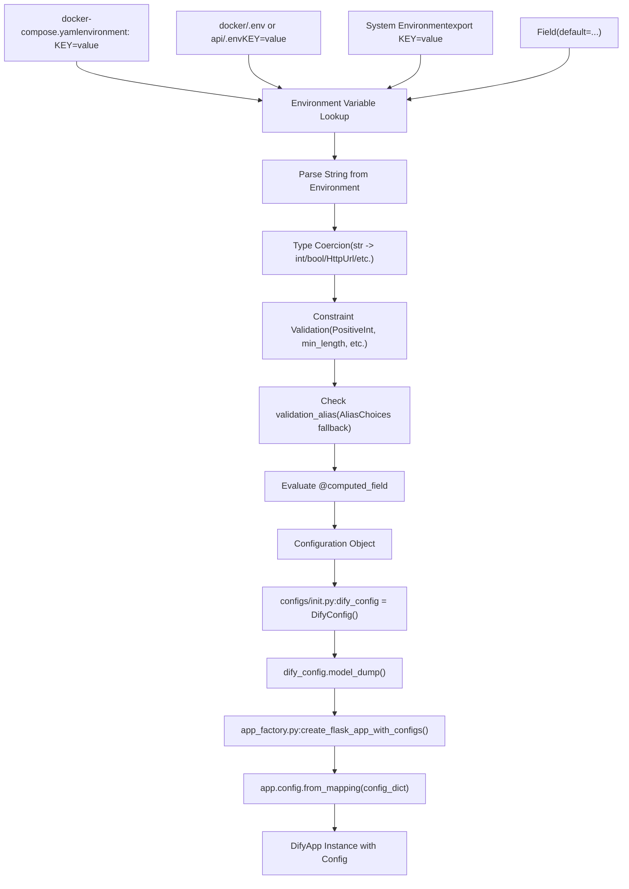
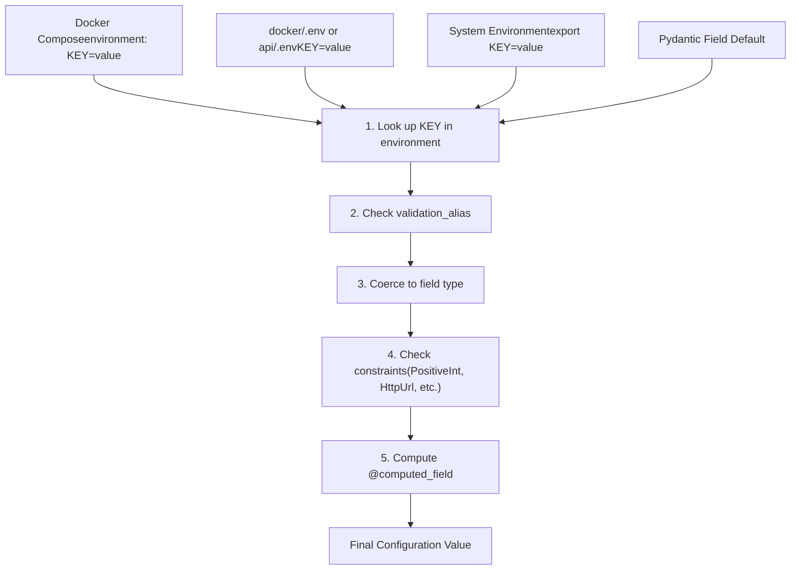
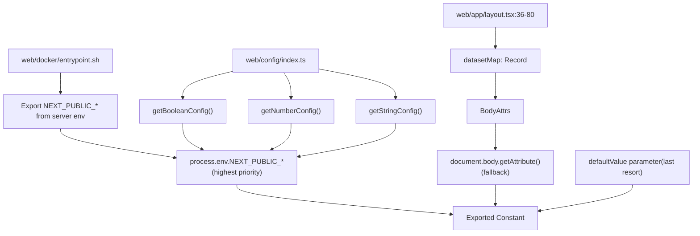

# Configuration System

Relevant source files

-   [api/.env.example](https://github.com/langgenius/dify/blob/92dbc94f/api/.env.example)
-   [api/app.py](https://github.com/langgenius/dify/blob/92dbc94f/api/app.py)
-   [api/app\_factory.py](https://github.com/langgenius/dify/blob/92dbc94f/api/app_factory.py)
-   [api/commands.py](https://github.com/langgenius/dify/blob/92dbc94f/api/commands.py)
-   [api/configs/feature/\_\_init\_\_.py](https://github.com/langgenius/dify/blob/92dbc94f/api/configs/feature/__init__.py)
-   [api/configs/middleware/\_\_init\_\_.py](https://github.com/langgenius/dify/blob/92dbc94f/api/configs/middleware/__init__.py)
-   [api/configs/packaging/\_\_init\_\_.py](https://github.com/langgenius/dify/blob/92dbc94f/api/configs/packaging/__init__.py)
-   [api/controllers/console/datasets/datasets.py](https://github.com/langgenius/dify/blob/92dbc94f/api/controllers/console/datasets/datasets.py)
-   [api/core/rag/datasource/vdb/vector\_factory.py](https://github.com/langgenius/dify/blob/92dbc94f/api/core/rag/datasource/vdb/vector_factory.py)
-   [api/core/rag/datasource/vdb/vector\_type.py](https://github.com/langgenius/dify/blob/92dbc94f/api/core/rag/datasource/vdb/vector_type.py)
-   [api/extensions/ext\_storage.py](https://github.com/langgenius/dify/blob/92dbc94f/api/extensions/ext_storage.py)
-   [api/extensions/storage/storage\_type.py](https://github.com/langgenius/dify/blob/92dbc94f/api/extensions/storage/storage_type.py)
-   [api/libs/helper.py](https://github.com/langgenius/dify/blob/92dbc94f/api/libs/helper.py)
-   [api/pyproject.toml](https://github.com/langgenius/dify/blob/92dbc94f/api/pyproject.toml)
-   [api/tests/unit\_tests/configs/test\_dify\_config.py](https://github.com/langgenius/dify/blob/92dbc94f/api/tests/unit_tests/configs/test_dify_config.py)
-   [api/tests/unit\_tests/libs/test\_helper.py](https://github.com/langgenius/dify/blob/92dbc94f/api/tests/unit_tests/libs/test_helper.py)
-   [api/uv.lock](https://github.com/langgenius/dify/blob/92dbc94f/api/uv.lock)
-   [dev/pytest/pytest\_vdb.sh](https://github.com/langgenius/dify/blob/92dbc94f/dev/pytest/pytest_vdb.sh)
-   [docker/.env.example](https://github.com/langgenius/dify/blob/92dbc94f/docker/.env.example)
-   [docker/docker-compose-template.yaml](https://github.com/langgenius/dify/blob/92dbc94f/docker/docker-compose-template.yaml)
-   [docker/docker-compose.middleware.yaml](https://github.com/langgenius/dify/blob/92dbc94f/docker/docker-compose.middleware.yaml)
-   [docker/docker-compose.yaml](https://github.com/langgenius/dify/blob/92dbc94f/docker/docker-compose.yaml)
-   [docker/middleware.env.example](https://github.com/langgenius/dify/blob/92dbc94f/docker/middleware.env.example)
-   [web/.env.example](https://github.com/langgenius/dify/blob/92dbc94f/web/.env.example)
-   [web/app/activate/activateForm.tsx](https://github.com/langgenius/dify/blob/92dbc94f/web/app/activate/activateForm.tsx)
-   [web/app/components/base/form/hooks/use-get-form-values.ts](https://github.com/langgenius/dify/blob/92dbc94f/web/app/components/base/form/hooks/use-get-form-values.ts)
-   [web/app/components/base/form/utils/zod-submit-validator.ts](https://github.com/langgenius/dify/blob/92dbc94f/web/app/components/base/form/utils/zod-submit-validator.ts)
-   [web/app/forgot-password/ForgotPasswordForm.spec.tsx](https://github.com/langgenius/dify/blob/92dbc94f/web/app/forgot-password/ForgotPasswordForm.spec.tsx)
-   [web/app/forgot-password/ForgotPasswordForm.tsx](https://github.com/langgenius/dify/blob/92dbc94f/web/app/forgot-password/ForgotPasswordForm.tsx)
-   [web/app/install/installForm.tsx](https://github.com/langgenius/dify/blob/92dbc94f/web/app/install/installForm.tsx)
-   [web/app/layout.tsx](https://github.com/langgenius/dify/blob/92dbc94f/web/app/layout.tsx)
-   [web/config/index.ts](https://github.com/langgenius/dify/blob/92dbc94f/web/config/index.ts)
-   [web/docker/entrypoint.sh](https://github.com/langgenius/dify/blob/92dbc94f/web/docker/entrypoint.sh)
-   [web/package.json](https://github.com/langgenius/dify/blob/92dbc94f/web/package.json)
-   [web/types/feature.ts](https://github.com/langgenius/dify/blob/92dbc94f/web/types/feature.ts)

This document describes Dify's configuration system, which manages application settings, feature flags, middleware connections, and deployment parameters across API, worker, and web services. The system uses Pydantic for type-safe configuration management in the backend and environment variables for deployment-time customization.

For information about service orchestration and Docker deployment, see [Service Orchestration and Docker Compose](/langgenius/dify/2.1-service-topology-and-docker-compose). For data model configurations, see [Core Data Models and Domain Entities](/langgenius/dify/2.2-core-data-models-and-domain-entities).

---

## Architecture Overview

Dify's configuration system uses Pydantic `BaseSettings` for type-safe backend configuration and a dual-source approach (environment variables + HTML data attributes) for frontend configuration.

### System-Wide Configuration Architecture

```mermaid
flowchart TD
    DotEnvFiles[".env Files(docker/.env, api/.env, web/.env)"]
    SystemEnv["System Environment Variables"]
    DockerComposeEnv["docker-compose.yamlenvironment: KEY=value"]
    PydanticDefaults["Pydantic Field Defaults(Field(default=...)"]
    DifyConfig["DifyConfig(BaseSettings)"]
    SecurityConfig["SecurityConfigSECRET_KEY, token expiry"]
    AppExecutionConfig["AppExecutionConfigAPP_MAX_EXECUTION_TIME"]
    CodeSandboxConfig["CodeExecutionSandboxConfigCODE_EXECUTION_ENDPOINT"]
    PluginConfig["PluginConfigPLUGIN_DAEMON_URL"]
    EndpointConfig["EndpointConfigCONSOLE_API_URL"]
    FileAccessConfig["FileAccessConfigFILES_URL"]
    DatabaseConfig["DatabaseConfigDB_TYPE, SQLALCHEMY_*"]
    RedisConfig["RedisConfigREDIS_HOST, sentinel, cluster"]
    CeleryConfig["CeleryConfigCELERY_BROKER_URL"]
    StorageConfig["StorageConfigSTORAGE_TYPE"]
    VectorStoreConfig["VectorStoreConfigVECTOR_STORE"]
    PackagingInfo["PackagingInfoCOMMIT_SHA, version"]
    CreateFlask["create_flask_app_with_configs()"]
    DifyApp["DifyApp Instance"]
    FlaskConfigDict["app.config.from_mapping(dify_config.model_dump())"]
    DockerEntrypoint["docker/entrypoint.shexport NEXT_PUBLIC_*"]
    LayoutTsx["app/layout.tsxdatasetMap injection"]
    ConfigIndex["config/index.tsgetBooleanConfig(), etc."]
    ExportedConstants["API_PREFIX, LOOP_NODE_MAX_COUNT,MAX_TOOLS_NUM, etc."]

    DifyConfig --> SecurityConfig
    DifyConfig --> AppExecutionConfig
    DifyConfig --> CodeSandboxConfig
    DifyConfig --> PluginConfig
    DifyConfig --> EndpointConfig
    DifyConfig --> FileAccessConfig
    DifyConfig --> DatabaseConfig
    DifyConfig --> RedisConfig
    DifyConfig --> CeleryConfig
    DifyConfig --> StorageConfig
    DifyConfig --> VectorStoreConfig
    DifyConfig --> PackagingInfo
    CreateFlask --> DifyApp
    DifyApp --> FlaskConfigDict
    DockerEntrypoint --> LayoutTsx
    LayoutTsx --> ConfigIndex
    ConfigIndex --> ExportedConstants
    DotEnvFiles --> SystemEnv
    DockerComposeEnv --> SystemEnv
    SystemEnv --> DifyConfig
    SystemEnv --> DockerEntrypoint
    PydanticDefaults --> DifyConfig
    DifyConfig --> CreateFlask
```


**Sources**: [api/configs/app\_config.py1-50](https://github.com/langgenius/dify/blob/92dbc94f/api/configs/app_config.py#L1-L50) [api/configs/feature/\_\_init\_\_.py1-800](https://github.com/langgenius/dify/blob/92dbc94f/api/configs/feature/__init__.py#L1-L800) [api/configs/middleware/\_\_init\_\_.py1-400](https://github.com/langgenius/dify/blob/92dbc94f/api/configs/middleware/__init__.py#L1-L400) [api/app\_factory.py18-25](https://github.com/langgenius/dify/blob/92dbc94f/api/app_factory.py#L18-L25) [web/config/index.ts1-60](https://github.com/langgenius/dify/blob/92dbc94f/web/config/index.ts#L1-L60) [web/docker/entrypoint.sh13-50](https://github.com/langgenius/dify/blob/92dbc94f/web/docker/entrypoint.sh#L13-L50)

---

## Backend Configuration Loading Process

The backend configuration system uses Pydantic `BaseSettings` with automatic environment variable parsing and validation.

### Three-Stage Configuration Loading


**Sources**: [api/configs/app\_config.py1-50](https://github.com/langgenius/dify/blob/92dbc94f/api/configs/app_config.py#L1-L50) [api/app\_factory.py18-25](https://github.com/langgenius/dify/blob/92dbc94f/api/app_factory.py#L18-L25) [docker/docker-compose.yaml7-28](https://github.com/langgenius/dify/blob/92dbc94f/docker/docker-compose.yaml#L7-L28)

### Docker Entrypoint Pre-Configuration

The API entrypoint script [api/docker/entrypoint.sh1-10](https://github.com/langgenius/dify/blob/92dbc94f/api/docker/entrypoint.sh#L1-L10) sets encoding environment variables before Python imports:

```
export LANG=${LANG:-en_US.UTF-8}
export LC_ALL=${LC_ALL:-en_US.UTF-8}
export PYTHONIOENCODING=${PYTHONIOENCODING:-utf-8}
```
This ensures UTF-8 encoding for all string operations, critical for multi-language support.

### Application Factory Pattern

The `create_flask_app_with_configs()` function [api/app\_factory.py18-25](https://github.com/langgenius/dify/blob/92dbc94f/api/app_factory.py#L18-L25) initializes the Flask app with Pydantic configuration:

```
def create_flask_app_with_configs() -> DifyApp:
    dify_app = DifyApp(__name__)
    dify_app.config.from_mapping(dify_config.model_dump())
    dify_app.config["RESTX_INCLUDE_ALL_MODELS"] = True
    return dify_app
```
The `dify_config.model_dump()` method serializes all Pydantic configuration objects into a dictionary suitable for Flask's config system.

**Sources**: [api/docker/entrypoint.sh1-10](https://github.com/langgenius/dify/blob/92dbc94f/api/docker/entrypoint.sh#L1-L10) [api/app\_factory.py18-25](https://github.com/langgenius/dify/blob/92dbc94f/api/app_factory.py#L18-L25) [api/configs/app\_config.py1-50](https://github.com/langgenius/dify/blob/92dbc94f/api/configs/app_config.py#L1-L50)

---

## Configuration Class Hierarchy

Dify organizes configuration into domain-specific Pydantic models that inherit from `BaseSettings`.

### Feature Configuration Classes

Located in [api/configs/feature/\_\_init\_\_.py](https://github.com/langgenius/dify/blob/92dbc94f/api/configs/feature/__init__.py) these classes manage application behavior:

| Class | Purpose | Key Fields |
| --- | --- | --- |
| `SecurityConfig` | Authentication and token management | `SECRET_KEY`, `RESET_PASSWORD_TOKEN_EXPIRY_MINUTES`, `LOGIN_DISABLED` |
| `AppExecutionConfig` | Application runtime limits | `APP_MAX_EXECUTION_TIME`, `APP_MAX_ACTIVE_REQUESTS` |
| `CodeExecutionSandboxConfig` | Code sandbox settings | `CODE_EXECUTION_ENDPOINT`, `CODE_EXECUTION_API_KEY`, timeout values |
| `TriggerConfig` | Webhook configuration | `WEBHOOK_REQUEST_BODY_MAX_SIZE` |
| `PluginConfig` | Plugin daemon settings | `PLUGIN_DAEMON_URL`, `PLUGIN_DAEMON_KEY`, size limits |
| `MarketplaceConfig` | Marketplace integration | `MARKETPLACE_ENABLED`, `MARKETPLACE_API_URL` |
| `EndpointConfig` | Service URLs | `CONSOLE_API_URL`, `SERVICE_API_URL`, `APP_WEB_URL` |
| `FileAccessConfig` | File handling | `FILES_URL`, `INTERNAL_FILES_URL`, `FILES_ACCESS_TIMEOUT` |

**Example configuration with validation** [api/configs/feature/\_\_init\_\_.py19-65](https://github.com/langgenius/dify/blob/92dbc94f/api/configs/feature/__init__.py#L19-L65):

```
class SecurityConfig(BaseSettings):
    SECRET_KEY: str = Field(
        description="Secret key for secure session cookie signing",
        default="",
    )

    RESET_PASSWORD_TOKEN_EXPIRY_MINUTES: PositiveInt = Field(
        description="Duration in minutes for password reset token validity",
        default=5,
    )
```
### Middleware Configuration Classes

Located in [api/configs/middleware/\_\_init\_\_.py](https://github.com/langgenius/dify/blob/92dbc94f/api/configs/middleware/__init__.py) these manage external service connections:

| Class | Purpose | Connection Details |
| --- | --- | --- |
| `DatabaseConfig` | Primary database | PostgreSQL/MySQL connection, pool settings |
| `RedisConfig` | Cache and message broker | Redis/Sentinel/Cluster configuration |
| `CeleryConfig` | Task queue | Celery broker URL, backend type |
| `StorageConfig` | File storage | S3, Azure Blob, Aliyun OSS, OpenDAL, etc. |
| `VectorDatabaseConfig` | Vector store selection | Weaviate, Qdrant, Milvus, PGVector, etc. |

**Vector database configuration example** [api/configs/middleware/\_\_init\_\_.py52-100](https://github.com/langgenius/dify/blob/92dbc94f/api/configs/middleware/__init__.py#L52-L100):

```
class VectorDatabaseConfig(BaseSettings):
    VECTOR_STORE: str = Field(
        description="Type of vector database",
        default="weaviate",
    )
```
The system supports 30+ vector database types through conditional configuration classes like `WeaviateConfig`, `QdrantConfig`, `MilvusConfig`, etc.

**Sources**: [api/configs/feature/\_\_init\_\_.py1-800](https://github.com/langgenius/dify/blob/92dbc94f/api/configs/feature/__init__.py#L1-L800) [api/configs/middleware/\_\_init\_\_.py1-200](https://github.com/langgenius/dify/blob/92dbc94f/api/configs/middleware/__init__.py#L1-L200)

---

## Environment Variable Resolution

Environment variables follow a hierarchical resolution strategy with type coercion and validation.


### Alias and Fallback Patterns

Configuration fields can use `validation_alias` with `AliasChoices` for backwards compatibility [api/configs/feature/\_\_init\_\_.py296-309](https://github.com/langgenius/dify/blob/92dbc94f/api/configs/feature/__init__.py#L296-L309):

```
FILES_URL: str = Field(
    description="Base URL for file preview or download",
    validation_alias=AliasChoices("FILES_URL", "CONSOLE_API_URL"),
    alias_priority=1,
    default="",
)
```
This allows `FILES_URL` to fall back to `CONSOLE_API_URL` if not explicitly set.

### Docker Compose Environment Variables

The [docker/docker-compose.yaml7-28](https://github.com/langgenius/dify/blob/92dbc94f/docker/docker-compose.yaml#L7-L28) uses YAML anchors to share environment variables across services:

```
x-shared-env: &shared-api-worker-env
  CONSOLE_API_URL: ${CONSOLE_API_URL:-}
  CONSOLE_WEB_URL: ${CONSOLE_WEB_URL:-}
  SERVICE_API_URL: ${SERVICE_API_URL:-}
  # ... hundreds of shared variables
```
Services reference this anchor [docker/docker-compose-template.yaml26-28](https://github.com/langgenius/dify/blob/92dbc94f/docker/docker-compose-template.yaml#L26-L28):

```
api:
  environment:
    <<: *shared-api-worker-env
```
**Sources**: [docker/docker-compose.yaml7-650](https://github.com/langgenius/dify/blob/92dbc94f/docker/docker-compose.yaml#L7-L650) [api/configs/feature/\_\_init\_\_.py296-309](https://github.com/langgenius/dify/blob/92dbc94f/api/configs/feature/__init__.py#L296-L309) [docker/docker-compose-template.yaml1-100](https://github.com/langgenius/dify/blob/92dbc94f/docker/docker-compose-template.yaml#L1-L100)

---

## Type Safety and Validation

Pydantic provides compile-time type checking and runtime validation with custom constraints.

### Field Types and Constraints

| Pydantic Type | Description | Example Usage |
| --- | --- | --- |
| `PositiveInt` | Integer > 0 | `APP_MAX_EXECUTION_TIME: PositiveInt = 1200` |
| `NonNegativeInt` | Integer >= 0 | `APP_MAX_ACTIVE_REQUESTS: NonNegativeInt = 0` |
| `PositiveFloat` | Float > 0.0 | `CODE_EXECUTION_POOL_KEEPALIVE_EXPIRY: PositiveFloat = 5.0` |
| `HttpUrl` | Validated URL | `CODE_EXECUTION_ENDPOINT: HttpUrl` |
| `NegativeInt` | Integer < 0 | `CODE_MIN_NUMBER: NegativeInt` |
| `Literal[...]` | Enum-like constraint | `STORAGE_TYPE: Literal["s3", "azure-blob", ...]` |

### Custom Validators

Field validators enforce domain-specific rules [api/controllers/console/datasets/datasets.py111-117](https://github.com/langgenius/dify/blob/92dbc94f/api/controllers/console/datasets/datasets.py#L111-L117):

```
@field_validator("indexing_technique")
@classmethod
def validate_indexing(cls, value: str | None) -> str | None:
    if value is None:
        return value
    if value not in Dataset.INDEXING_TECHNIQUE_LIST:
        raise ValueError("Invalid indexing technique.")
    return value
```
### Computed Fields

Derived configuration values use `@computed_field` [api/configs/middleware/\_\_init\_\_.py](https://github.com/langgenius/dify/blob/92dbc94f/api/configs/middleware/__init__.py#LNaN-LNaN):

```
@computed_field
@property
def SQLALCHEMY_DATABASE_URI(self) -> str:
    return self._get_database_uri()
```
**Sources**: [api/configs/feature/\_\_init\_\_.py19-175](https://github.com/langgenius/dify/blob/92dbc94f/api/configs/feature/__init__.py#L19-L175) [api/configs/middleware/\_\_init\_\_.py100-200](https://github.com/langgenius/dify/blob/92dbc94f/api/configs/middleware/__init__.py#L100-L200) [api/controllers/console/datasets/datasets.py111-117](https://github.com/langgenius/dify/blob/92dbc94f/api/controllers/console/datasets/datasets.py#L111-L117)

---

## Frontend Configuration System

The web frontend uses a dual-source configuration approach: Next.js build-time environment variables with runtime fallback to HTML document body `data-*` attributes.

### Frontend Configuration Resolution Flow


**Sources**: [web/config/index.ts9-54](https://github.com/langgenius/dify/blob/92dbc94f/web/config/index.ts#L9-L54) [web/app/layout.tsx36-80](https://github.com/langgenius/dify/blob/92dbc94f/web/app/layout.tsx#L36-L80) [web/docker/entrypoint.sh13-50](https://github.com/langgenius/dify/blob/92dbc94f/web/docker/entrypoint.sh#L13-L50)

### Configuration Helper Functions

Three type-specific helpers provide consistent resolution logic [web/config/index.ts9-54](https://github.com/langgenius/dify/blob/92dbc94f/web/config/index.ts#L9-L54):

```
const getBooleanConfig = (
  envVar: string | undefined,
  dataAttrKey: DatasetAttr,
  defaultValue: boolean = true,
) => {
  if (envVar !== undefined && envVar !== '') return envVar === 'true'
  const attrValue = globalThis.document?.body?.getAttribute(dataAttrKey)
  if (attrValue !== undefined && attrValue !== '') return attrValue === 'true'
  return defaultValue
}

const getNumberConfig = (
  envVar: string | undefined,
  dataAttrKey: DatasetAttr,
  defaultValue: number,
) => {
  // Parse and validate number from env or data attribute
}

const getStringConfig = (
  envVar: string | undefined,
  dataAttrKey: DatasetAttr,
  defaultValue: string,
) => {
  // Return first defined: env, data attribute, or default
}
```
### Dataset Attributes Enum

The `DatasetAttr` enum [web/types/feature.ts1-50](https://github.com/langgenius/dify/blob/92dbc94f/web/types/feature.ts#L1-L50) defines all supported HTML data attribute keys:

| DatasetAttr Constant | HTML Attribute | Purpose |
| --- | --- | --- |
| `DATA_API_PREFIX` | `data-api-prefix` | Console API base URL |
| `DATA_PUBLIC_API_PREFIX` | `data-public-api-prefix` | Public API base URL |
| `DATA_MARKETPLACE_API_PREFIX` | `data-marketplace-api-prefix` | Marketplace API URL |
| `DATA_PUBLIC_EDITION` | `data-public-edition` | Deployment edition (SELF\_HOSTED/CLOUD) |
| `DATA_PUBLIC_AMPLITUDE_API_KEY` | `data-public-amplitude-api-key` | Analytics key |
| `DATA_PUBLIC_COOKIE_DOMAIN` | `data-public-cookie-domain` | Cookie domain for cross-subdomain auth |
| `DATA_PUBLIC_SENTRY_DSN` | `data-public-sentry-dsn` | Sentry error tracking |
| `DATA_PUBLIC_TEXT_GENERATION_TIMEOUT_MS` | `data-public-text-generation-timeout-ms` | LLM timeout |
| `DATA_PUBLIC_MAX_TOOLS_NUM` | `data-public-max-tools-num` | Max tools in workflow |
| `DATA_PUBLIC_LOOP_NODE_MAX_COUNT` | `data-public-loop-node-max-count` | Max loop iterations |
| `DATA_PUBLIC_MAX_TREE_DEPTH` | `data-public-max-tree-depth` | Max workflow nesting |

### Server-Side Attribute Injection

The Next.js layout component [web/app/layout.tsx46-80](https://github.com/langgenius/dify/blob/92dbc94f/web/app/layout.tsx#L46-L80) maps server environment variables to HTML attributes:

```
const datasetMap: Record<DatasetAttr, string | undefined> = {
  [DatasetAttr.DATA_API_PREFIX]: process.env.NEXT_PUBLIC_API_PREFIX,
  [DatasetAttr.DATA_PUBLIC_API_PREFIX]: process.env.NEXT_PUBLIC_PUBLIC_API_PREFIX,
  [DatasetAttr.DATA_MARKETPLACE_API_PREFIX]: process.env.NEXT_PUBLIC_MARKETPLACE_API_PREFIX,
  [DatasetAttr.DATA_MARKETPLACE_URL_PREFIX]: process.env.NEXT_PUBLIC_MARKETPLACE_URL_PREFIX,
  [DatasetAttr.DATA_PUBLIC_EDITION]: process.env.NEXT_PUBLIC_EDITION,
  [DatasetAttr.DATA_PUBLIC_AMPLITUDE_API_KEY]: process.env.NEXT_PUBLIC_AMPLITUDE_API_KEY,
  [DatasetAttr.DATA_PUBLIC_COOKIE_DOMAIN]: process.env.NEXT_PUBLIC_COOKIE_DOMAIN,
  [DatasetAttr.DATA_PUBLIC_TEXT_GENERATION_TIMEOUT_MS]: process.env.NEXT_PUBLIC_TEXT_GENERATION_TIMEOUT_MS,
  [DatasetAttr.DATA_PUBLIC_MAX_TOOLS_NUM]: process.env.NEXT_PUBLIC_MAX_TOOLS_NUM,
  // ... additional mappings
}
```
These are rendered as `data-*` attributes on the `<body>` element during SSR, allowing runtime configuration changes without rebuilding the frontend bundle.

### Exported Configuration Constants

Configuration is exported as typed constants [web/config/index.ts56-150](https://github.com/langgenius/dify/blob/92dbc94f/web/config/index.ts#L56-L150):

```
export const API_PREFIX = getStringConfig(
  process.env.NEXT_PUBLIC_API_PREFIX,
  DatasetAttr.DATA_API_PREFIX,
  'http://localhost:5001/console/api',
)

export const PUBLIC_API_PREFIX = getStringConfig(
  process.env.NEXT_PUBLIC_PUBLIC_API_PREFIX,
  DatasetAttr.DATA_PUBLIC_API_PREFIX,
  'http://localhost:5001/api',
)

export const MARKETPLACE_API_PREFIX = getStringConfig(
  process.env.NEXT_PUBLIC_MARKETPLACE_API_PREFIX,
  DatasetAttr.DATA_MARKETPLACE_API_PREFIX,
  'http://localhost:5002/api',
)

export const LOOP_NODE_MAX_COUNT = getNumberConfig(
  process.env.NEXT_PUBLIC_LOOP_NODE_MAX_COUNT,
  DatasetAttr.DATA_PUBLIC_LOOP_NODE_MAX_COUNT,
  100,
)

export const MAX_TOOLS_NUM = getNumberConfig(
  process.env.NEXT_PUBLIC_MAX_TOOLS_NUM,
  DatasetAttr.DATA_PUBLIC_MAX_TOOLS_NUM,
  10,
)
```
### Docker Entrypoint Variable Export

The Docker entrypoint script [web/docker/entrypoint.sh13-50](https://github.com/langgenius/dify/blob/92dbc94f/web/docker/entrypoint.sh#L13-L50) exports backend configuration to `NEXT_PUBLIC_*` variables:

```
export NEXT_PUBLIC_DEPLOY_ENV=${DEPLOY_ENV}
export NEXT_PUBLIC_EDITION=${EDITION}
export NEXT_PUBLIC_API_PREFIX=${CONSOLE_API_URL}/console/api
export NEXT_PUBLIC_PUBLIC_API_PREFIX=${APP_API_URL}/api
export NEXT_PUBLIC_MARKETPLACE_API_PREFIX=${MARKETPLACE_API_URL}/api/v1
export NEXT_PUBLIC_TEXT_GENERATION_TIMEOUT_MS=${TEXT_GENERATION_TIMEOUT_MS}
export NEXT_PUBLIC_MAX_TOOLS_NUM=${MAX_TOOLS_NUM}
```
This ensures backend configuration (from `.env` or Docker Compose) flows to the frontend at container startup.

**Sources**: [web/config/index.ts1-150](https://github.com/langgenius/dify/blob/92dbc94f/web/config/index.ts#L1-L150) [web/app/layout.tsx36-80](https://github.com/langgenius/dify/blob/92dbc94f/web/app/layout.tsx#L36-L80) [web/types/feature.ts1-50](https://github.com/langgenius/dify/blob/92dbc94f/web/types/feature.ts#L1-L50) [web/docker/entrypoint.sh13-50](https://github.com/langgenius/dify/blob/92dbc94f/web/docker/entrypoint.sh#L13-L50)

---

## Feature Flags and Runtime Configuration

The system uses environment variables as feature flags to enable/disable functionality.

### Feature Flag Examples

| Environment Variable | Type | Purpose | Default |
| --- | --- | --- | --- |
| `MIGRATION_ENABLED` | boolean | Run database migrations on startup | `true` |
| `DEBUG` | boolean | Enable debug mode (disables gevent patching) | `false` |
| `MARKETPLACE_ENABLED` | boolean | Enable plugin marketplace integration | `true` |
| `ENABLE_CLEAN_EMBEDDING_CACHE_TASK` | boolean | Enable scheduled embedding cache cleanup | `false` |
| `ENABLE_WEBSITE_JINAREADER` | boolean | Enable Jina Reader website scraping | `true` |
| `CELERY_AUTO_SCALE` | boolean | Enable Celery worker autoscaling | `false` |

### Mode-Based Configuration

The [api/docker/entrypoint.sh10-50](https://github.com/langgenius/dify/blob/92dbc94f/api/docker/entrypoint.sh#L10-L50) script uses the `MODE` environment variable to determine service startup:

```
if [[ "${MODE}" == "worker" ]]; then
  # Start Celery worker
elif [[ "${MODE}" == "beat" ]]; then
  # Start Celery beat
elif [[ "${MODE}" == "api" ]]; then
  # Start Gunicorn API server
fi
```
This allows the same Docker image to run different services based on runtime configuration.

### Conditional Service Dependencies

Docker Compose uses profiles and conditional dependencies [docker/docker-compose-template.yaml42-47](https://github.com/langgenius/dify/blob/92dbc94f/docker/docker-compose-template.yaml#L42-L47):

```
depends_on:
  db_postgres:
    condition: service_healthy
    required: false
  db_mysql:
    condition: service_healthy
    required: false
```
The `required: false` flag allows services to start even if optional dependencies are unavailable.

**Sources**: [api/docker/entrypoint.sh10-50](https://github.com/langgenius/dify/blob/92dbc94f/api/docker/entrypoint.sh#L10-L50) [docker/docker-compose-template.yaml39-100](https://github.com/langgenius/dify/blob/92dbc94f/docker/docker-compose-template.yaml#L39-L100) [api/configs/feature/\_\_init\_\_.py250-290](https://github.com/langgenius/dify/blob/92dbc94f/api/configs/feature/__init__.py#L250-L290)

---

## Database and Connection Pool Configuration

Database configuration supports PostgreSQL and MySQL with extensive tuning options.

```mermaid
flowchart TD
    MySQLMaxConns["MYSQL_MAX_CONNECTIONSdefault: 1000"]
    InnoDBBuffer["MYSQL_INNODB_BUFFER_POOL_SIZEdefault: 512M"]
    LogFileSize["MYSQL_INNODB_LOG_FILE_SIZEdefault: 128M"]
    FlushLog["MYSQL_INNODB_FLUSH_LOG_AT_TRX_COMMITdefault: 2"]
    MaxConns["POSTGRES_MAX_CONNECTIONSdefault: 100"]
    SharedBuffers["POSTGRES_SHARED_BUFFERSdefault: 128MB"]
    WorkMem["POSTGRES_WORK_MEMdefault: 4MB"]
    EffectiveCache["POSTGRES_EFFECTIVE_CACHE_SIZEdefault: 4096MB"]
    DBType["DB_TYPE(postgresql | mysql)"]
    DBHost["DB_HOST"]
    DBPort["DB_PORT"]
    DBUser["DB_USERNAME"]
    DBPass["DB_PASSWORD"]
    DBName["DB_DATABASE"]
    ConnectionURI["SQLALCHEMY_DATABASE_URI(computed)"]
    PoolSize["SQLALCHEMY_POOL_SIZEdefault: 30"]
    MaxOverflow["SQLALCHEMY_MAX_OVERFLOWdefault: 10"]
    PoolRecycle["SQLALCHEMY_POOL_RECYCLEdefault: 3600s"]
    PoolPrePing["SQLALCHEMY_POOL_PRE_PINGdefault: false"]
    PoolLifo["SQLALCHEMY_POOL_USE_LIFOdefault: false"]
    PoolTimeout["SQLALCHEMY_POOL_TIMEOUTdefault: 30s"]

    DBType --> ConnectionURI
    DBHost --> ConnectionURI
    DBPort --> ConnectionURI
    DBUser --> ConnectionURI
    DBPass --> ConnectionURI
    DBName --> ConnectionURI
    ConnectionURI --> PoolSize
    ConnectionURI --> MaxOverflow
    ConnectionURI --> PoolRecycle
```


### PostgreSQL Configuration

PostgreSQL settings are passed as command-line arguments [docker/docker-compose-template.yaml173-180](https://github.com/langgenius/dify/blob/92dbc94f/docker/docker-compose-template.yaml#L173-L180):

```
command: >
  postgres -c 'max_connections=${POSTGRES_MAX_CONNECTIONS:-100}'
           -c 'shared_buffers=${POSTGRES_SHARED_BUFFERS:-128MB}'
           -c 'work_mem=${POSTGRES_WORK_MEM:-4MB}'
           -c 'effective_cache_size=${POSTGRES_EFFECTIVE_CACHE_SIZE:-4096MB}'
```
### MySQL Configuration

MySQL settings use similar command syntax [docker/docker-compose-template.yaml208-212](https://github.com/langgenius/dify/blob/92dbc94f/docker/docker-compose-template.yaml#L208-L212):

```
command: >
  --max_connections=1000
  --innodb_buffer_pool_size=${MYSQL_INNODB_BUFFER_POOL_SIZE:-512M}
  --innodb_log_file_size=${MYSQL_INNODB_LOG_FILE_SIZE:-128M}
```
**Sources**: [docker/docker-compose-template.yaml162-227](https://github.com/langgenius/dify/blob/92dbc94f/docker/docker-compose-template.yaml#L162-L227) [docker/.env.example227-326](https://github.com/langgenius/dify/blob/92dbc94f/docker/.env.example#L227-L326) [api/configs/middleware/\_\_init\_\_.py](https://github.com/langgenius/dify/blob/92dbc94f/api/configs/middleware/__init__.py#LNaN-LNaN)

---

## Redis and Celery Configuration

Redis configuration supports standalone, Sentinel, and Cluster modes with SSL options.

### Redis Connection Modes

```mermaid
flowchart TD
    ClusterFlag["REDIS_USE_CLUSTERS=true"]
    ClusterConfig["Cluster Configuration"]
    ClusterNodes["REDIS_CLUSTERShost1:port1,host2:port2"]
    ClusterPass["REDIS_CLUSTERS_PASSWORD"]
    SentinelFlag["REDIS_USE_SENTINEL=true"]
    SentinelURI["sentinel://:password@host:port/db"]
    SentinelNodes["REDIS_SENTINELShost1:port1,host2:port2"]
    SentinelService["REDIS_SENTINEL_SERVICE_NAME"]
    StandaloneHost["REDIS_HOST"]
    StandaloneURI["redis://:password@host:port/db"]
    StandalonePort["REDIS_PORT"]
    StandalonePass["REDIS_PASSWORD"]
    StandaloneDB["REDIS_DB"]

    ClusterFlag --> ClusterConfig
    SentinelFlag --> SentinelURI
    SentinelNodes --> SentinelURI
    StandaloneHost --> StandaloneURI
```


### Celery Broker Configuration

The Celery broker URL supports both standalone Redis and Sentinel [docker/.env.example370-376](https://github.com/langgenius/dify/blob/92dbc94f/docker/.env.example#L370-L376):

```
# Standalone Redis
CELERY_BROKER_URL=redis://:difyai123456@redis:6379/1

# Redis Sentinel (semicolon-separated for multiple sentinels)
CELERY_BROKER_URL=sentinel://:password@sentinel1:26379/1;sentinel://:password@sentinel2:26379/1
```
### Celery Worker Configuration

Worker configuration supports manual worker count or autoscaling [api/docker/entrypoint.sh20-40](https://github.com/langgenius/dify/blob/92dbc94f/api/docker/entrypoint.sh#L20-L40):

```
if [ "${CELERY_AUTO_SCALE,,}" = "true" ]; then
  AVAILABLE_CORES=$(nproc)
  MAX_WORKERS=${CELERY_MAX_WORKERS:-$AVAILABLE_CORES}
  MIN_WORKERS=${CELERY_MIN_WORKERS:-1}
  AUTOSCALE_OPTION="--autoscale=${MAX_WORKERS},${MIN_WORKERS}"
else
  CONCURRENCY=${CELERY_WORKER_AMOUNT:-1}
  CONCURRENCY_OPTION="--concurrency=${CONCURRENCY}"
fi
```
**Sources**: [docker/.env.example328-384](https://github.com/langgenius/dify/blob/92dbc94f/docker/.env.example#L328-L384) [api/docker/entrypoint.sh20-50](https://github.com/langgenius/dify/blob/92dbc94f/api/docker/entrypoint.sh#L20-L50) [api/configs/middleware/\_\_init\_\_.py](https://github.com/langgenius/dify/blob/92dbc94f/api/configs/middleware/__init__.py#LNaN-LNaN)

---

## Storage Backend Configuration

Dify supports multiple storage backends through a unified configuration interface.

### Storage Type Selection

The `STORAGE_TYPE` environment variable determines the active backend [api/configs/middleware/\_\_init\_\_.py52-67](https://github.com/langgenius/dify/blob/92dbc94f/api/configs/middleware/__init__.py#L52-L67):

```
STORAGE_TYPE: Literal[
    "opendal",
    "s3",
    "aliyun-oss",
    "azure-blob",
    "baidu-obs",
    "clickzetta-volume",
    "google-storage",
    "huawei-obs",
    "oci-storage",
    "tencent-cos",
    "volcengine-tos",
    "supabase",
    "local",
]
```
### Storage Configuration Classes

Each storage backend has a dedicated configuration class:

| Class | Backend | Key Configuration Fields |
| --- | --- | --- |
| `OpenDALStorageConfig` | OpenDAL (default) | `OPENDAL_SCHEME`, `OPENDAL_FS_ROOT` |
| `S3StorageConfig` | Amazon S3 / MinIO | `S3_ENDPOINT`, `S3_BUCKET_NAME`, `S3_ACCESS_KEY` |
| `AzureBlobStorageConfig` | Azure Blob | `AZURE_BLOB_ACCOUNT_NAME`, `AZURE_BLOB_CONTAINER_NAME` |
| `AliyunOSSStorageConfig` | Aliyun OSS | `ALIYUN_OSS_BUCKET_NAME`, `ALIYUN_OSS_ENDPOINT` |
| `TencentCloudCOSStorageConfig` | Tencent COS | `TENCENT_COS_BUCKET_NAME`, `TENCENT_COS_REGION` |

### OpenDAL Configuration

OpenDAL provides a universal interface to multiple storage services [docker/.env.example406-418](https://github.com/langgenius/dify/blob/92dbc94f/docker/.env.example#L406-L418):

```
STORAGE_TYPE=opendal
OPENDAL_SCHEME=fs  # or s3, azblob, gcs, oss, cos, etc.
OPENDAL_FS_ROOT=storage
```
The configuration follows the pattern `OPENDAL_<SCHEME_NAME>_<CONFIG_NAME>`, allowing scheme-specific settings to be automatically parsed.

**Sources**: [api/configs/middleware/\_\_init\_\_.py52-100](https://github.com/langgenius/dify/blob/92dbc94f/api/configs/middleware/__init__.py#L52-L100) [docker/.env.example403-515](https://github.com/langgenius/dify/blob/92dbc94f/docker/.env.example#L403-L515) [api/configs/middleware/storage/](https://github.com/langgenius/dify/blob/92dbc94f/api/configs/middleware/storage/)

---

## Vector Database Configuration

The system supports 30+ vector databases through conditional configuration loading.

### Vector Store Selection

```mermaid
flowchart TD
    VectorStore["VECTOR_STORE"]
    WeaviateConf["WeaviateConfigWEAVIATE_ENDPOINTWEAVIATE_API_KEY"]
    QdrantConf["QdrantConfigQDRANT_URLQDRANT_API_KEY"]
    MilvusConf["MilvusConfigMILVUS_URIMILVUS_TOKEN"]
    PGVectorConf["PGVectorConfigPGVECTOR_HOSTPGVECTOR_DATABASE"]
    ChromaConf["ChromaConfigCHROMA_HOSTCHROMA_PORT"]
    OceanBaseConf["OceanBaseVectorConfigOCEANBASE_VECTOR_HOST"]

    VectorStore --> WeaviateConf
    VectorStore --> QdrantConf
    VectorStore --> MilvusConf
    VectorStore --> PGVectorConf
    VectorStore --> ChromaConf
    VectorStore --> OceanBaseConf
```


### Vector Database Factory

The [api/core/rag/datasource/vdb/vector\_factory.py38-80](https://github.com/langgenius/dify/blob/92dbc94f/api/core/rag/datasource/vdb/vector_factory.py#L38-L80) implements a factory pattern to instantiate the appropriate vector database:

```
class Vector:
    def __init__(self, dataset: Dataset, attributes: list | None = None):
        self._dataset = dataset
        self._embeddings = self._get_embeddings()
        vector_type = dify_config.VECTOR_STORE
        # Factory instantiation based on vector_type
```
### Vector Store Types

The [api/core/rag/datasource/vdb/vector\_type.py1-30](https://github.com/langgenius/dify/blob/92dbc94f/api/core/rag/datasource/vdb/vector_type.py#L1-L30) enum defines all supported types:

```
class VectorType(StrEnum):
    ALIBABACLOUD_MYSQL = "alibabacloud_mysql"
    ANALYTICDB = "analyticdb"
    CHROMA = "chroma"
    CLICKZETTA = "clickzetta"
    COUCHBASE = "couchbase"
    ELASTICSEARCH = "elasticsearch"
    # ... 20+ more types
```
**Sources**: [api/configs/middleware/\_\_init\_\_.py](https://github.com/langgenius/dify/blob/92dbc94f/api/configs/middleware/__init__.py#LNaN-LNaN) [api/core/rag/datasource/vdb/vector\_type.py1-30](https://github.com/langgenius/dify/blob/92dbc94f/api/core/rag/datasource/vdb/vector_type.py#L1-L30) [api/core/rag/datasource/vdb/vector\_factory.py38-80](https://github.com/langgenius/dify/blob/92dbc94f/api/core/rag/datasource/vdb/vector_factory.py#L38-L80) [docker/.env.example516-700](https://github.com/langgenius/dify/blob/92dbc94f/docker/.env.example#L516-L700)

---

## Plugin and Marketplace Configuration

Plugin system configuration manages the plugin daemon, marketplace integration, and storage.

### Plugin Daemon Configuration

The plugin daemon runs as a separate Go service with its own configuration [docker/docker-compose-template.yaml271-298](https://github.com/langgenius/dify/blob/92dbc94f/docker/docker-compose-template.yaml#L271-L298):

```
plugin_daemon:
  environment:
    SERVER_PORT: ${PLUGIN_DAEMON_PORT:-5002}
    SERVER_KEY: ${PLUGIN_DAEMON_KEY:-...}
    MAX_PLUGIN_PACKAGE_SIZE: ${PLUGIN_MAX_PACKAGE_SIZE:-52428800}
    DIFY_INNER_API_URL: ${PLUGIN_DIFY_INNER_API_URL:-http://api:5001}
    DIFY_INNER_API_KEY: ${PLUGIN_DIFY_INNER_API_KEY:-...}
    PLUGIN_WORKING_PATH: ${PLUGIN_WORKING_PATH:-/app/storage/cwd}
```
### Marketplace Configuration

Marketplace settings control plugin discovery and installation [api/configs/feature/\_\_init\_\_.py247-260](https://github.com/langgenius/dify/blob/92dbc94f/api/configs/feature/__init__.py#L247-L260):

```
class MarketplaceConfig(BaseSettings):
    MARKETPLACE_ENABLED: bool = Field(
        description="Enable or disable marketplace",
        default=True,
    )

    MARKETPLACE_API_URL: HttpUrl = Field(
        description="Marketplace API URL",
        default=HttpUrl("https://marketplace.dify.ai"),
    )
```
### Plugin Storage Configuration

Plugins can use different storage backends [docker/.env.example596-624](https://github.com/langgenius/dify/blob/92dbc94f/docker/.env.example#L596-L624):

```
PLUGIN_STORAGE_TYPE=local  # or s3, azure, aliyun-oss, tencent-cos
PLUGIN_STORAGE_LOCAL_ROOT=/app/storage
PLUGIN_INSTALLED_PATH=plugin
PLUGIN_PACKAGE_CACHE_PATH=plugin_packages
```
**Sources**: [api/configs/feature/\_\_init\_\_.py204-260](https://github.com/langgenius/dify/blob/92dbc94f/api/configs/feature/__init__.py#L204-L260) [docker/docker-compose-template.yaml271-320](https://github.com/langgenius/dify/blob/92dbc94f/docker/docker-compose-template.yaml#L271-L320) [docker/.env.example596-624](https://github.com/langgenius/dify/blob/92dbc94f/docker/.env.example#L596-L624)

---

## Configuration Testing and Validation

The test suite validates configuration loading and type coercion.

### Configuration Test Suite

The [api/tests/unit\_tests/configs/test\_dify\_config.py1-100](https://github.com/langgenius/dify/blob/92dbc94f/api/tests/unit_tests/configs/test_dify_config.py#L1-L100) contains comprehensive tests:

```
def test_dify_config(monkeypatch: pytest.MonkeyPatch):
    # Tests environment variable loading
    # Tests type coercion
    # Tests validation constraints
    # Tests computed fields
```
### Common Validation Patterns

Configuration validation follows consistent patterns:

1.  **Type Validation**: Pydantic automatically coerces strings to appropriate types (int, bool, HttpUrl)
2.  **Constraint Validation**: Field constraints like `PositiveInt`, `min_length`, `max_length` are enforced
3.  **Cross-Field Validation**: Custom validators can check relationships between fields
4.  **Default Value Fallback**: Missing environment variables use field defaults

### Configuration Error Handling

Invalid configurations raise `ValidationError` at startup, preventing the application from running with incorrect settings. This fail-fast approach ensures configuration issues are caught before deployment.

**Sources**: [api/tests/unit\_tests/configs/test\_dify\_config.py1-100](https://github.com/langgenius/dify/blob/92dbc94f/api/tests/unit_tests/configs/test_dify_config.py#L1-L100) [api/configs/feature/\_\_init\_\_.py](https://github.com/langgenius/dify/blob/92dbc94f/api/configs/feature/__init__.py#LNaN-LNaN)

---

## Summary

Dify's configuration system provides:

1.  **Type Safety**: Pydantic-based validation ensures configuration correctness at runtime
2.  **Hierarchical Organization**: Domain-specific configuration classes (feature, middleware, packaging)
3.  **Flexible Sources**: Environment variables, `.env` files, Docker Compose, with clear precedence
4.  **Multi-Backend Support**: Storage, database, and vector database abstraction through configuration
5.  **Feature Flags**: Runtime behavior control through boolean environment variables
6.  **Frontend/Backend Separation**: Independent configuration systems with consistent patterns
7.  **Deployment Flexibility**: Same codebase supports multiple deployment modes via configuration

The configuration system is accessed through the `dify_config` singleton for backend services and exported constants for frontend components, providing a unified interface to all runtime settings.

**Sources**: [api/configs/app\_config.py](https://github.com/langgenius/dify/blob/92dbc94f/api/configs/app_config.py) [api/configs/feature/\_\_init\_\_.py1-800](https://github.com/langgenius/dify/blob/92dbc94f/api/configs/feature/__init__.py#L1-L800) [api/configs/middleware/\_\_init\_\_.py1-400](https://github.com/langgenius/dify/blob/92dbc94f/api/configs/middleware/__init__.py#L1-L400) [web/config/index.ts1-150](https://github.com/langgenius/dify/blob/92dbc94f/web/config/index.ts#L1-L150) [docker/.env.example1-700](https://github.com/langgenius/dify/blob/92dbc94f/docker/.env.example#L1-L700)
