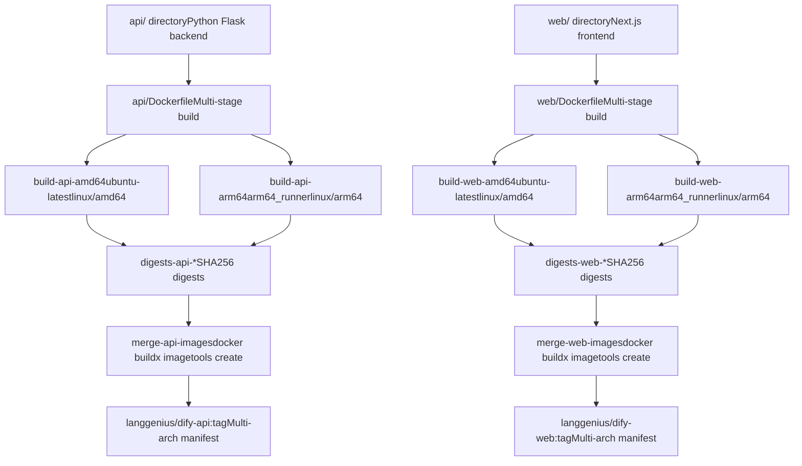
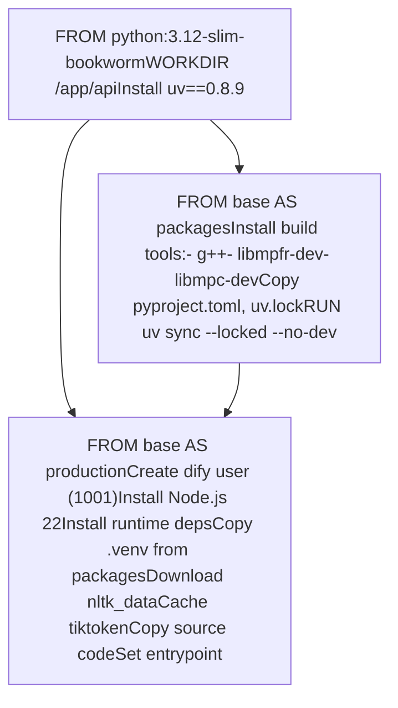
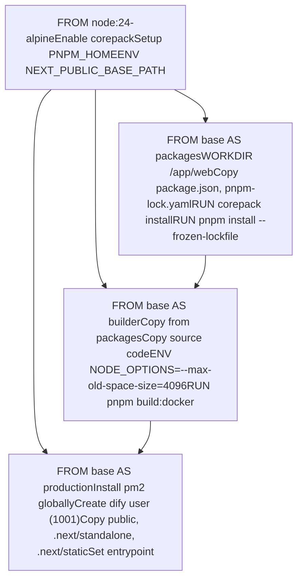
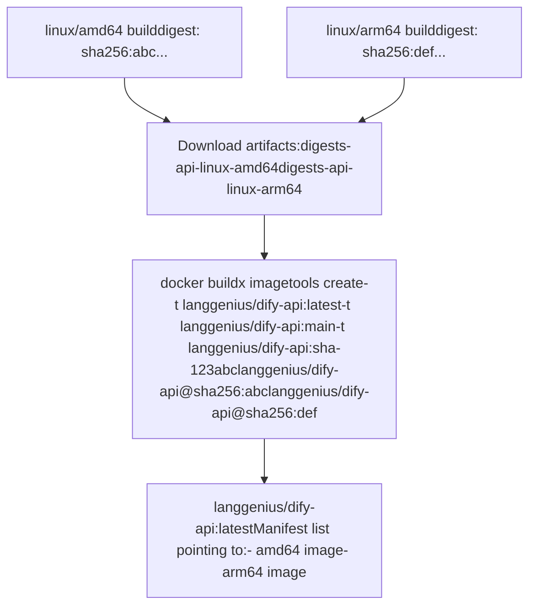

# Docker Build Process and Multi-Architecture Images

Relevant source files

-   [.github/workflows/api-tests.yml](https://github.com/langgenius/dify/blob/92dbc94f/.github/workflows/api-tests.yml)
-   [.github/workflows/autofix.yml](https://github.com/langgenius/dify/blob/92dbc94f/.github/workflows/autofix.yml)
-   [.github/workflows/build-push.yml](https://github.com/langgenius/dify/blob/92dbc94f/.github/workflows/build-push.yml)
-   [.github/workflows/db-migration-test.yml](https://github.com/langgenius/dify/blob/92dbc94f/.github/workflows/db-migration-test.yml)
-   [.github/workflows/deploy-agent-dev.yml](https://github.com/langgenius/dify/blob/92dbc94f/.github/workflows/deploy-agent-dev.yml)
-   [.github/workflows/deploy-dev.yml](https://github.com/langgenius/dify/blob/92dbc94f/.github/workflows/deploy-dev.yml)
-   [.github/workflows/deploy-hitl.yml](https://github.com/langgenius/dify/blob/92dbc94f/.github/workflows/deploy-hitl.yml)
-   [.github/workflows/docker-build.yml](https://github.com/langgenius/dify/blob/92dbc94f/.github/workflows/docker-build.yml)
-   [.github/workflows/main-ci.yml](https://github.com/langgenius/dify/blob/92dbc94f/.github/workflows/main-ci.yml)
-   [.github/workflows/stale.yml](https://github.com/langgenius/dify/blob/92dbc94f/.github/workflows/stale.yml)
-   [.github/workflows/style.yml](https://github.com/langgenius/dify/blob/92dbc94f/.github/workflows/style.yml)
-   [.github/workflows/tool-test-sdks.yaml](https://github.com/langgenius/dify/blob/92dbc94f/.github/workflows/tool-test-sdks.yaml)
-   [.github/workflows/translate-i18n-claude.yml](https://github.com/langgenius/dify/blob/92dbc94f/.github/workflows/translate-i18n-claude.yml)
-   [.github/workflows/trigger-i18n-sync.yml](https://github.com/langgenius/dify/blob/92dbc94f/.github/workflows/trigger-i18n-sync.yml)
-   [.github/workflows/vdb-tests.yml](https://github.com/langgenius/dify/blob/92dbc94f/.github/workflows/vdb-tests.yml)
-   [.github/workflows/web-tests.yml](https://github.com/langgenius/dify/blob/92dbc94f/.github/workflows/web-tests.yml)
-   [api/Dockerfile](https://github.com/langgenius/dify/blob/92dbc94f/api/Dockerfile)
-   [api/migrations/README](https://github.com/langgenius/dify/blob/92dbc94f/api/migrations/README)
-   [web/.nvmrc](https://github.com/langgenius/dify/blob/92dbc94f/web/.nvmrc)
-   [web/Dockerfile](https://github.com/langgenius/dify/blob/92dbc94f/web/Dockerfile)
-   [web/README.md](https://github.com/langgenius/dify/blob/92dbc94f/web/README.md)
-   [web/i18n-config/README.md](https://github.com/langgenius/dify/blob/92dbc94f/web/i18n-config/README.md)

This document explains how Dify builds Docker images for both the API backend and Web frontend services, including the multi-stage build process, multi-architecture support (amd64/arm64), and the CI/CD pipeline that automates image building and publishing.

For runtime configuration and deployment, see [Environment Configuration and Runtime Modes](/langgenius/dify/3.2-environment-configuration-and-runtime-modes). For the overall service topology, see [Service Topology and Docker Compose](/langgenius/dify/2.1-service-topology-and-docker-compose).

---

## Overview of Build Architecture

Dify uses separate Dockerfiles for API and Web services, each implementing multi-stage builds to optimize image size and build caching. The CI/CD pipeline builds images for both amd64 and arm64 architectures in parallel, then combines them into multi-architecture manifest lists.

### Build Pipeline Flow


**Sources:** [.github/workflows/build-push.yml1-152](https://github.com/langgenius/dify/blob/92dbc94f/.github/workflows/build-push.yml#L1-L152)

---

## Multi-Stage Build: API Service

The API service Dockerfile uses a three-stage build process to separate dependency installation from runtime concerns, resulting in smaller final images with only necessary runtime dependencies.

### API Build Stages


### Key Components

| Component | Purpose | Location |
| --- | --- | --- |
| **Base Image** | `python:3.12-slim-bookworm` | Debian 12 minimal Python runtime |
| **Package Manager** | `uv==0.8.9` | Fast Python package installer |
| **Build Dependencies** | `g++`, `libmpfr-dev`, `libmpc-dev` | Required for building gmpy2 |
| **Runtime Dependencies** | Node.js 22, fonts, libmagic, etc. | Required for PDF processing, tools |
| **User** | `dify:1001` | Non-root user for security |
| **Virtual Environment** | `/app/api/.venv` | Isolated Python dependencies |
| **Entrypoint** | `/entrypoint.sh` | Configurable startup script |

### Dependency Installation Process

The `packages` stage installs Python dependencies using `uv`, which reads from `pyproject.toml` and `uv.lock`:

**[api/Dockerfile12-26](https://github.com/langgenius/dify/blob/92dbc94f/api/Dockerfile#L12-L26)**

```
FROM base AS packages
RUN apt-get update \
    && apt-get install -y --no-install-recommends \
          g++ \
          libmpfr-dev libmpc-dev
COPY pyproject.toml uv.lock ./
RUN uv sync --locked --no-dev
```
The `--locked` flag ensures reproducible builds by using exact versions from `uv.lock`. The `--no-dev` flag excludes development dependencies.

**Sources:** [api/Dockerfile1-122](https://github.com/langgenius/dify/blob/92dbc94f/api/Dockerfile#L1-L122)

### Runtime Environment Setup

The production stage creates a non-root user and installs runtime dependencies:

**[api/Dockerfile52-58](https://github.com/langgenius/dify/blob/92dbc94f/api/Dockerfile#L52-L58)**

```
ARG dify_uid=1001
RUN groupadd -r -g ${dify_uid} dify && \
    useradd -r -u ${dify_uid} -g ${dify_uid} -s /bin/bash dify && \
    chown -R dify:dify /app
```
Node.js 22 is installed from nodesource repository with GPG key verification **[api/Dockerfile60-91](https://github.com/langgenius/dify/blob/92dbc94f/api/Dockerfile#L60-L91)**, required for certain tools and processors that execute JavaScript.

### Pre-Downloaded Resources

Two datasets are pre-cached during build to avoid runtime downloads:

1.  **NLTK Data**: Natural language processing datasets **[api/Dockerfile99-101](https://github.com/langgenius/dify/blob/92dbc94f/api/Dockerfile#L99-L101)**

    ```
    RUN mkdir -p /usr/local/share/nltk_data \
        && NLTK_DATA=/usr/local/share/nltk_data python -c "import nltk; ..."
    ```

2.  **Tiktoken Cache**: OpenAI tokenizer encoding data **[api/Dockerfile103-106](https://github.com/langgenius/dify/blob/92dbc94f/api/Dockerfile#L103-L106)**

    ```
    RUN python -c "import tiktoken; tiktoken.encoding_for_model('gpt2')" \
        && chown -R dify:dify ${TIKTOKEN_CACHE_DIR}
    ```


**Sources:** [api/Dockerfile29-122](https://github.com/langgenius/dify/blob/92dbc94f/api/Dockerfile#L29-L122)

---

## Multi-Stage Build: Web Service

The Web service Dockerfile uses a four-stage build optimized for Next.js applications, separating dependency installation, build artifacts, and production runtime.

### Web Build Stages


### Build Configuration

The builder stage uses increased memory limits for Next.js compilation:

**[web/Dockerfile32-38](https://github.com/langgenius/dify/blob/92dbc94f/web/Dockerfile#L32-L38)**

```
FROM base AS builder
WORKDIR /app/web
COPY --from=packages /app/web/ .
COPY . .
ENV NODE_OPTIONS="--max-old-space-size=4096"
RUN pnpm build:docker
```
The `pnpm build:docker` command compiles Next.js with the `standalone` output mode, which creates a minimal production bundle **[web/Dockerfile38](https://github.com/langgenius/dify/blob/92dbc94f/web/Dockerfile#L38-L38)**.

### Production Artifacts

The production stage only copies three directories from the builder:

**[web/Dockerfile75-77](https://github.com/langgenius/dify/blob/92dbc94f/web/Dockerfile#L75-L77)**

```
COPY --from=builder --chown=dify:dify /app/web/public ./public
COPY --from=builder --chown=dify:dify /app/web/.next/standalone ./
COPY --from=builder --chown=dify:dify /app/web/.next/static ./.next/static
```
| Artifact | Purpose |
| --- | --- |
| `public/` | Static assets (images, fonts, favicon) |
| `.next/standalone/` | Minimal production server with required dependencies |
| `.next/static/` | Compiled static assets (JS chunks, CSS) |

### Runtime Configuration

The production stage installs PM2 for process management:

**[web/Dockerfile61](https://github.com/langgenius/dify/blob/92dbc94f/web/Dockerfile#L61-L61)**

```
RUN pnpm add -g pm2
```
PM2 enables multi-instance deployment controlled by the `PM2_INSTANCES` environment variable **[web/Dockerfile53](https://github.com/langgenius/dify/blob/92dbc94f/web/Dockerfile#L53-L53)**, defaulting to 2 instances.

**Sources:** [web/Dockerfile1-87](https://github.com/langgenius/dify/blob/92dbc94f/web/Dockerfile#L1-L87)

---

## Multi-Architecture Build Strategy

Dify builds images for both `linux/amd64` and `linux/arm64` platforms using GitHub Actions matrix builds with platform-specific runners.

### Build Matrix Configuration

The build pipeline defines a matrix of 4 jobs:

**[.github/workflows/build-push.yml28-46](https://github.com/langgenius/dify/blob/92dbc94f/.github/workflows/build-push.yml#L28-L46)**

```
strategy:
  matrix:
    include:
      - service_name: "build-api-amd64"
        image_name_env: "DIFY_API_IMAGE_NAME"
        context: "api"
        platform: linux/amd64
      - service_name: "build-api-arm64"
        image_name_env: "DIFY_API_IMAGE_NAME"
        context: "api"
        platform: linux/arm64
      - service_name: "build-web-amd64"
        image_name_env: "DIFY_WEB_IMAGE_NAME"
        context: "web"
        platform: linux/amd64
      - service_name: "build-web-arm64"
        image_name_env: "DIFY_WEB_IMAGE_NAME"
        context: "web"
        platform: linux/arm64
```
### Runner Assignment

The pipeline uses conditional runner selection based on platform:

**[.github/workflows/build-push.yml26](https://github.com/langgenius/dify/blob/92dbc94f/.github/workflows/build-push.yml#L26-L26)**

```
runs-on: ${{ matrix.platform == 'linux/arm64' && 'arm64_runner' || 'ubuntu-latest' }}
```
| Platform | Runner | Architecture |
| --- | --- | --- |
| `linux/amd64` | `ubuntu-latest` | x86\_64 native build |
| `linux/arm64` | `arm64_runner` | ARM64 native build |

Native builds are faster and more reliable than QEMU emulation for production images.

**Sources:** [.github/workflows/build-push.yml25-47](https://github.com/langgenius/dify/blob/92dbc94f/.github/workflows/build-push.yml#L25-L47)

### Digest-Based Push

Each platform build pushes by digest rather than tag to avoid race conditions:

**[.github/workflows/build-push.yml72-82](https://github.com/langgenius/dify/blob/92dbc94f/.github/workflows/build-push.yml#L72-L82)**

```
- name: Build Docker image
  uses: docker/build-push-action@v6
  with:
    platforms: ${{ matrix.platform }}
    outputs: type=image,name=${{ env[matrix.image_name_env] }},push-by-digest=true,name-canonical=true,push=true
    cache-from: type=gha,scope=${{ matrix.service_name }}
    cache-to: type=gha,mode=max,scope=${{ matrix.service_name }}
```
The digest (content-addressable SHA256 hash) is extracted and uploaded as an artifact:

**[.github/workflows/build-push.yml84-98](https://github.com/langgenius/dify/blob/92dbc94f/.github/workflows/build-push.yml#L84-L98)**

```
- name: Export digest
  env:
    DIGEST: ${{ steps.build.outputs.digest }}
  run: |
    mkdir -p /tmp/digests
    sanitized_digest=${DIGEST#sha256:}
    touch "/tmp/digests/${sanitized_digest}"

- name: Upload digest
  uses: actions/upload-artifact@v6
  with:
    name: digests-${{ matrix.context }}-${{ env.PLATFORM_PAIR }}
    path: /tmp/digests/*
```
**Sources:** [.github/workflows/build-push.yml72-98](https://github.com/langgenius/dify/blob/92dbc94f/.github/workflows/build-push.yml#L72-L98)

### Manifest List Creation

After all platform builds complete, a separate job creates multi-architecture manifests:


**[.github/workflows/build-push.yml114-144](https://github.com/langgenius/dify/blob/92dbc94f/.github/workflows/build-push.yml#L114-L144)**

```
- name: Download digests
  uses: actions/download-artifact@v7
  with:
    path: /tmp/digests
    pattern: digests-${{ matrix.context }}-*
    merge-multiple: true

- name: Create manifest list and push
  working-directory: /tmp/digests
  run: |
    docker buildx imagetools create $(jq -cr '.tags | map("-t " + .) | join(" ")' <<< "$DOCKER_METADATA_OUTPUT_JSON") \
      $(printf "$IMAGE_NAME@sha256:%s " *)
```
**Sources:** [.github/workflows/build-push.yml100-151](https://github.com/langgenius/dify/blob/92dbc94f/.github/workflows/build-push.yml#L100-L151)

---

## CI/CD Pipeline Architecture

The build pipeline uses a two-stage architecture: parallel platform builds followed by manifest creation.

### Pipeline Triggers

The `build-push.yml` workflow triggers on:

**[.github/workflows/build-push.yml3-12](https://github.com/langgenius/dify/blob/92dbc94f/.github/workflows/build-push.yml#L3-L12)**

```
on:
  push:
    branches:
      - "main"
      - "deploy/**"
      - "build/**"
      - "release/e-*"
      - "hotfix/**"
    tags:
      - "*"
```
### Tag Strategy

Image tags are generated by `docker/metadata-action`:

**[.github/workflows/build-push.yml127-136](https://github.com/langgenius/dify/blob/92dbc94f/.github/workflows/build-push.yml#L127-L136)**

```
- name: Extract metadata for Docker
  id: meta
  uses: docker/metadata-action@v5
  with:
    images: ${{ env[matrix.image_name_env] }}
    tags: |
      type=raw,value=latest,enable=${{ startsWith(github.ref, 'refs/tags/') && !contains(github.ref, '-') }}
      type=ref,event=branch
      type=sha,enable=true,priority=100,prefix=,suffix=,format=long
      type=raw,value=${{ github.ref_name }},enable=${{ startsWith(github.ref, 'refs/tags/') }}
```
| Tag Type | Example | Condition |
| --- | --- | --- |
| `latest` | `langgenius/dify-api:latest` | Release tags without pre-release suffix |
| Branch name | `langgenius/dify-api:main` | All branch pushes |
| Commit SHA | `langgenius/dify-api:a1b2c3d4e5f6...` | All commits (long format) |
| Tag name | `langgenius/dify-api:v1.2.3` | Git tags |

**Sources:** [.github/workflows/build-push.yml1-152](https://github.com/langgenius/dify/blob/92dbc94f/.github/workflows/build-push.yml#L1-L152)

### Build Caching

GitHub Actions cache is used to speed up subsequent builds:

**[.github/workflows/build-push.yml81-82](https://github.com/langgenius/dify/blob/92dbc94f/.github/workflows/build-push.yml#L81-L82)**

```
cache-from: type=gha,scope=${{ matrix.service_name }}
cache-to: type=gha,mode=max,scope=${{ matrix.service_name }}
```
Each matrix job (e.g., `build-api-amd64`) has its own cache scope to avoid cache conflicts. The `mode=max` exports all intermediate layers for maximum cache reuse.

**Sources:** [.github/workflows/build-push.yml72-82](https://github.com/langgenius/dify/blob/92dbc94f/.github/workflows/build-push.yml#L72-L82)

### PR Build Validation

Pull requests trigger a build-only workflow that validates Dockerfiles without pushing:

**[.github/workflows/docker-build.yml1-49](https://github.com/langgenius/dify/blob/92dbc94f/.github/workflows/docker-build.yml#L1-L49)**

```
name: Build docker image
on:
  pull_request:
    branches: ["main"]
    paths:
      - api/Dockerfile
      - web/Dockerfile

jobs:
  build-docker:
    runs-on: ubuntu-latest
    strategy:
      matrix:
        include:
          - service_name: "api-amd64"
            platform: linux/amd64
            context: "api"
          # ... arm64 variants
    steps:
      - name: Set up QEMU
        uses: docker/setup-qemu-action@v3
      - name: Build Docker Image
        uses: docker/build-push-action@v6
        with:
          push: false
```
This workflow uses QEMU for ARM64 emulation on x86\_64 runners, which is acceptable for testing but slower than native builds.

**Sources:** [.github/workflows/docker-build.yml1-49](https://github.com/langgenius/dify/blob/92dbc94f/.github/workflows/docker-build.yml#L1-L49)

---

## Build Optimization Techniques

Several techniques optimize build speed and image size across both services.

### Multi-Stage Build Benefits

| Stage | Purpose | Artifacts Retained |
| --- | --- | --- |
| `base` | Common foundation | None (intermediate) |
| `packages` | Dependency compilation | Virtual environment only |
| `builder` | Application build | Production artifacts only |
| `production` | Minimal runtime | Source code, compiled assets, runtime deps |

Build tools and intermediate files are discarded between stages, reducing final image size by 50-70%.

### Layer Caching Strategy

Dockerfile instructions are ordered to maximize cache hits:

1.  **Least frequently changed first**: Base image, system packages
2.  **Dependency manifests**: `pyproject.toml`, `package.json` copied before source
3.  **Dependency installation**: Separate layer before source code copy
4.  **Source code**: Copied last, invalidates only final layers

**Example from API Dockerfile:**

```
COPY pyproject.toml uv.lock ./      # Changes infrequently
RUN uv sync --locked --no-dev       # Cached if above unchanged
COPY --chown=dify:dify . /app/api/  # Changes frequently
```
**Sources:** [api/Dockerfile25-109](https://github.com/langgenius/dify/blob/92dbc94f/api/Dockerfile#L25-L109) [web/Dockerfile24-38](https://github.com/langgenius/dify/blob/92dbc94f/web/Dockerfile#L24-L38)

### Lockfile-Based Installs

Both services use lockfiles to ensure reproducible builds:

| Service | Lockfile | Command |
| --- | --- | --- |
| API | `uv.lock` | `uv sync --locked --no-dev` |
| Web | `pnpm-lock.yaml` | `pnpm install --frozen-lockfile` |

The `--locked` and `--frozen-lockfile` flags fail the build if lockfiles are out of sync, preventing non-deterministic builds.

**Sources:** [api/Dockerfile26](https://github.com/langgenius/dify/blob/92dbc94f/api/Dockerfile#L26-L26) [web/Dockerfile29](https://github.com/langgenius/dify/blob/92dbc94f/web/Dockerfile#L29-L29)

### Build Context Optimization

The build context is limited to the service directory:

**[.github/workflows/build-push.yml76](https://github.com/langgenius/dify/blob/92dbc94f/.github/workflows/build-push.yml#L76-L76)**

```
context: "{{defaultContext}}:${{ matrix.context }}"
```
This prevents the entire repository (including `.git/`) from being sent to the Docker daemon, reducing context upload time from minutes to seconds.

**Sources:** [.github/workflows/build-push.yml74-80](https://github.com/langgenius/dify/blob/92dbc94f/.github/workflows/build-push.yml#L74-L80)

---

## Security Considerations

Both Dockerfiles implement security best practices for production deployments.

### Non-Root User Execution

All services run as a dedicated non-root user `dify` with UID 1001:

**API:** **[api/Dockerfile52-58](https://github.com/langgenius/dify/blob/92dbc94f/api/Dockerfile#L52-L58)**

```
ARG dify_uid=1001
RUN groupadd -r -g ${dify_uid} dify && \
    useradd -r -u ${dify_uid} -g ${dify_uid} -s /bin/bash dify && \
    chown -R dify:dify /app
USER dify
```
**Web:** **[web/Dockerfile65-70](https://github.com/langgenius/dify/blob/92dbc94f/web/Dockerfile#L65-L70)**

```
ARG dify_uid=1001
RUN addgroup -S -g ${dify_uid} dify && \
    adduser -S -u ${dify_uid} -G dify -s /bin/ash -h /home/dify dify && \
    mkdir /app && mkdir /.pm2 && \
    chown -R dify:dify /app /.pm2
USER dify
```
This prevents privilege escalation attacks and limits filesystem access.

**Sources:** [api/Dockerfile52-119](https://github.com/langgenius/dify/blob/92dbc94f/api/Dockerfile#L52-L119) [web/Dockerfile65-84](https://github.com/langgenius/dify/blob/92dbc94f/web/Dockerfile#L65-L84)

### Verified Dependencies

Node.js installation includes GPG key verification:

**[api/Dockerfile67-71](https://github.com/langgenius/dify/blob/92dbc94f/api/Dockerfile#L67-L71)**

```
curl -fsSL https://deb.nodesource.com/gpgkey/nodesource-repo.gpg.key -o /tmp/nodesource.gpg
gpg --show-keys --with-colons /tmp/nodesource.gpg \
    | awk -F: '/^fpr:/ {print $10}' \
    | grep -Fx "${NODESOURCE_KEY_FPR}"
gpg --dearmor -o /etc/apt/keyrings/nodesource.gpg /tmp/nodesource.gpg
```
The expected fingerprint `6F71F525282841EEDAF851B42F59B5F99B1BE0B4` is hardcoded **[api/Dockerfile55](https://github.com/langgenius/dify/blob/92dbc94f/api/Dockerfile#L55-L55)** to prevent man-in-the-middle attacks.

**Sources:** [api/Dockerfile60-91](https://github.com/langgenius/dify/blob/92dbc94f/api/Dockerfile#L60-L91)

### Pinned Security Updates

Critical security packages are explicitly pinned:

**[api/Dockerfile83](https://github.com/langgenius/dify/blob/92dbc94f/api/Dockerfile#L83-L83)**

```
expat libldap-2.5-0=2.5.13+dfsg-5 perl libsqlite3-0=3.40.1-2+deb12u2 zlib1g=1:1.2.13.dfsg-1
```
This ensures known vulnerabilities are patched while maintaining reproducibility.

**Sources:** [api/Dockerfile83](https://github.com/langgenius/dify/blob/92dbc94f/api/Dockerfile#L83-L83)

### Build Argument for Commit SHA

The commit SHA is passed as a build argument and embedded in the image:

**[api/Dockerfile115-116](https://github.com/langgenius/dify/blob/92dbc94f/api/Dockerfile#L115-L116)**

```
ARG COMMIT_SHA
ENV COMMIT_SHA=${COMMIT_SHA}
```
**[.github/workflows/build-push.yml78](https://github.com/langgenius/dify/blob/92dbc94f/.github/workflows/build-push.yml#L78-L78)**

```
build-args: COMMIT_SHA=${{ fromJSON(steps.meta.outputs.json).labels['org.opencontainers.image.revision'] }}
```
This enables runtime version introspection for debugging and audit purposes.

**Sources:** [api/Dockerfile115-116](https://github.com/langgenius/dify/blob/92dbc94f/api/Dockerfile#L115-L116) [web/Dockerfile81-82](https://github.com/langgenius/dify/blob/92dbc94f/web/Dockerfile#L81-L82) [.github/workflows/build-push.yml78](https://github.com/langgenius/dify/blob/92dbc94f/.github/workflows/build-push.yml#L78-L78)

### Hadolint Validation

Dockerfiles are validated by Hadolint in CI:

**[.github/workflows/style.yml154-171](https://github.com/langgenius/dify/blob/92dbc94f/.github/workflows/style.yml#L154-L171)**

```
- name: Super-linter
  uses: super-linter/super-linter/slim@v8
  if: steps.changed-files.outputs.any_changed == 'true'
  env:
    VALIDATE_DOCKERFILE_HADOLINT: true
```
This catches common mistakes like:

-   Missing `USER` instruction
-   Untagged base images
-   Insecure downloads
-   Inefficient layer usage

**Sources:** [.github/workflows/style.yml130-171](https://github.com/langgenius/dify/blob/92dbc94f/.github/workflows/style.yml#L130-L171)

---

## Related Configuration Files

| File | Purpose |
| --- | --- |
| `docker/entrypoint.sh` | Runtime mode selector (api/worker/beat) |
| `pyproject.toml` | Python dependencies and package metadata |
| `uv.lock` | Locked Python dependency versions |
| `web/package.json` | Node.js dependencies and scripts |
| `web/pnpm-lock.yaml` | Locked Node.js dependency versions |
| `docker/.env.example` | Container environment variables template |

**Sources:** [api/Dockerfile112](https://github.com/langgenius/dify/blob/92dbc94f/api/Dockerfile#L112-L112) [web/Dockerfile79](https://github.com/langgenius/dify/blob/92dbc94f/web/Dockerfile#L79-L79)
