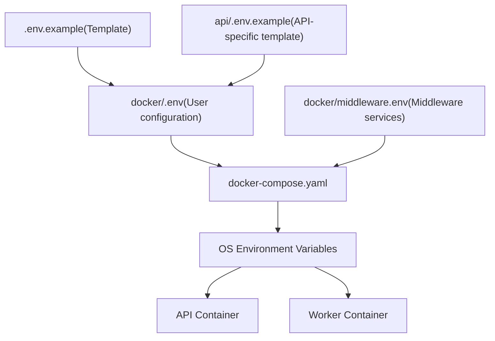
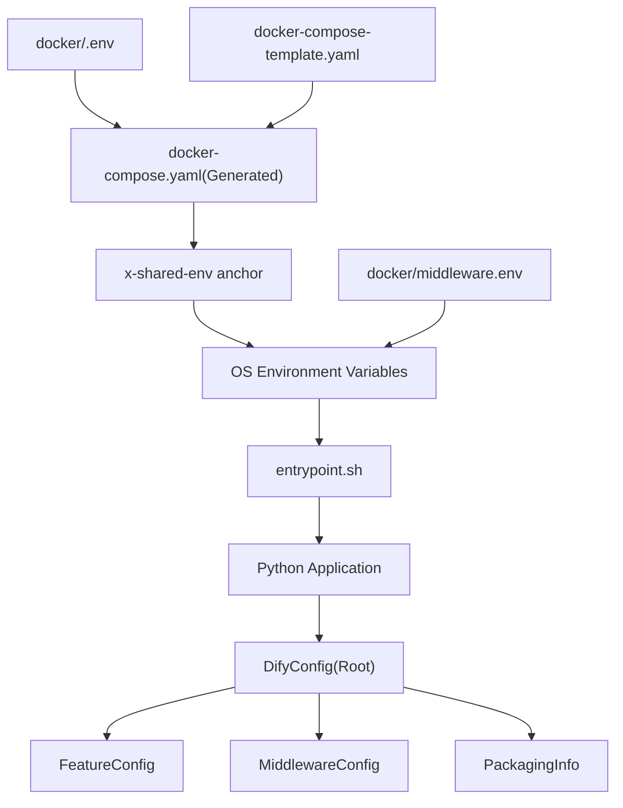
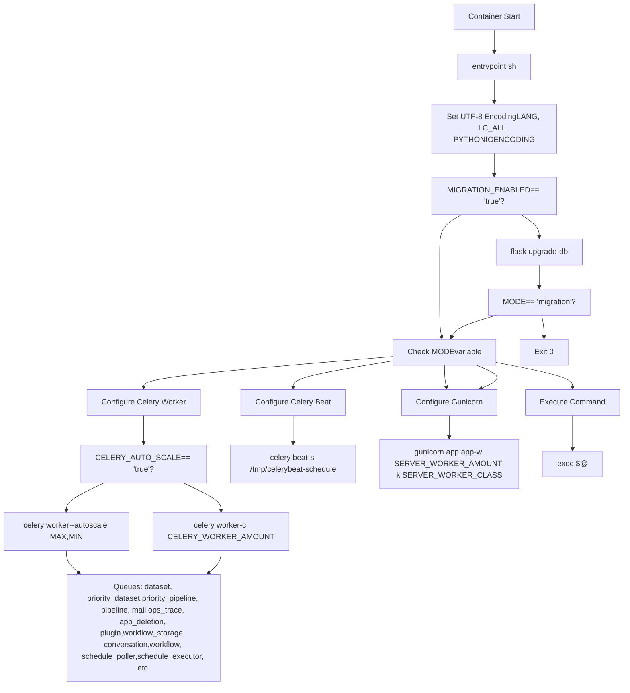
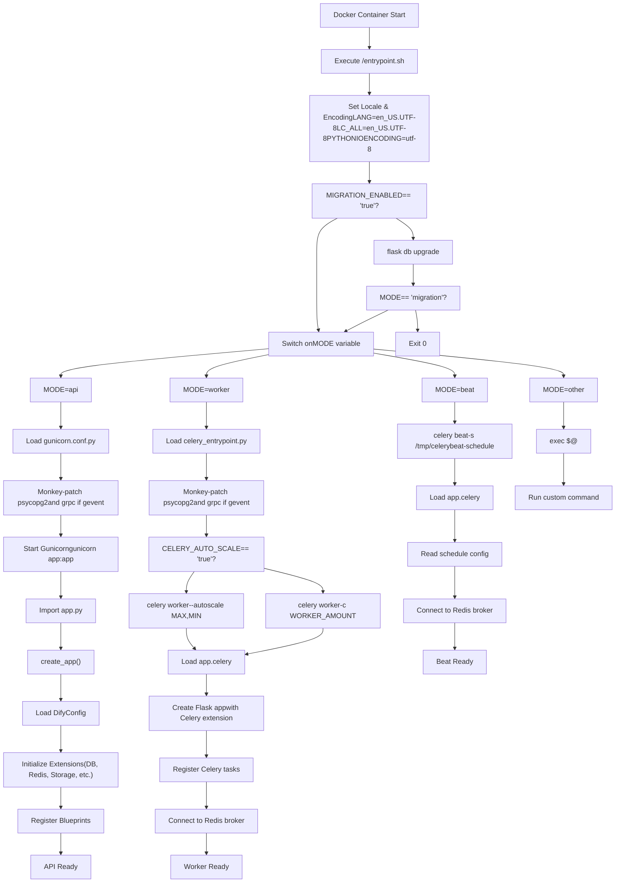
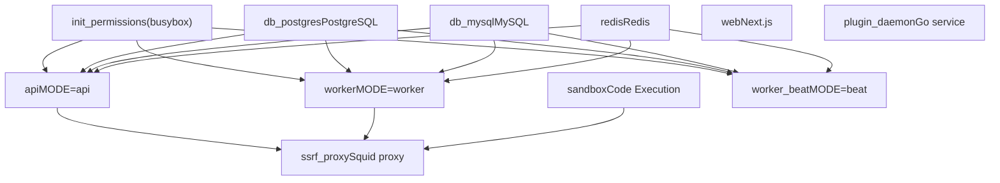

# Environment Configuration and Runtime Modes

Relevant source files

-   [api/.env.example](https://github.com/langgenius/dify/blob/92dbc94f/api/.env.example)
-   [api/app.py](https://github.com/langgenius/dify/blob/92dbc94f/api/app.py)
-   [api/app\_factory.py](https://github.com/langgenius/dify/blob/92dbc94f/api/app_factory.py)
-   [api/commands.py](https://github.com/langgenius/dify/blob/92dbc94f/api/commands.py)
-   [api/configs/feature/\_\_init\_\_.py](https://github.com/langgenius/dify/blob/92dbc94f/api/configs/feature/__init__.py)
-   [api/configs/middleware/\_\_init\_\_.py](https://github.com/langgenius/dify/blob/92dbc94f/api/configs/middleware/__init__.py)
-   [api/configs/packaging/\_\_init\_\_.py](https://github.com/langgenius/dify/blob/92dbc94f/api/configs/packaging/__init__.py)
-   [api/controllers/console/datasets/datasets.py](https://github.com/langgenius/dify/blob/92dbc94f/api/controllers/console/datasets/datasets.py)
-   [api/core/rag/datasource/vdb/vector\_factory.py](https://github.com/langgenius/dify/blob/92dbc94f/api/core/rag/datasource/vdb/vector_factory.py)
-   [api/core/rag/datasource/vdb/vector\_type.py](https://github.com/langgenius/dify/blob/92dbc94f/api/core/rag/datasource/vdb/vector_type.py)
-   [api/extensions/ext\_storage.py](https://github.com/langgenius/dify/blob/92dbc94f/api/extensions/ext_storage.py)
-   [api/extensions/storage/storage\_type.py](https://github.com/langgenius/dify/blob/92dbc94f/api/extensions/storage/storage_type.py)
-   [api/libs/helper.py](https://github.com/langgenius/dify/blob/92dbc94f/api/libs/helper.py)
-   [api/pyproject.toml](https://github.com/langgenius/dify/blob/92dbc94f/api/pyproject.toml)
-   [api/tests/unit\_tests/configs/test\_dify\_config.py](https://github.com/langgenius/dify/blob/92dbc94f/api/tests/unit_tests/configs/test_dify_config.py)
-   [api/tests/unit\_tests/libs/test\_helper.py](https://github.com/langgenius/dify/blob/92dbc94f/api/tests/unit_tests/libs/test_helper.py)
-   [api/uv.lock](https://github.com/langgenius/dify/blob/92dbc94f/api/uv.lock)
-   [dev/pytest/pytest\_vdb.sh](https://github.com/langgenius/dify/blob/92dbc94f/dev/pytest/pytest_vdb.sh)
-   [docker/.env.example](https://github.com/langgenius/dify/blob/92dbc94f/docker/.env.example)
-   [docker/docker-compose-template.yaml](https://github.com/langgenius/dify/blob/92dbc94f/docker/docker-compose-template.yaml)
-   [docker/docker-compose.middleware.yaml](https://github.com/langgenius/dify/blob/92dbc94f/docker/docker-compose.middleware.yaml)
-   [docker/docker-compose.yaml](https://github.com/langgenius/dify/blob/92dbc94f/docker/docker-compose.yaml)
-   [docker/middleware.env.example](https://github.com/langgenius/dify/blob/92dbc94f/docker/middleware.env.example)
-   [web/.env.example](https://github.com/langgenius/dify/blob/92dbc94f/web/.env.example)
-   [web/app/activate/activateForm.tsx](https://github.com/langgenius/dify/blob/92dbc94f/web/app/activate/activateForm.tsx)
-   [web/app/components/base/form/hooks/use-get-form-values.ts](https://github.com/langgenius/dify/blob/92dbc94f/web/app/components/base/form/hooks/use-get-form-values.ts)
-   [web/app/components/base/form/utils/zod-submit-validator.ts](https://github.com/langgenius/dify/blob/92dbc94f/web/app/components/base/form/utils/zod-submit-validator.ts)
-   [web/app/forgot-password/ForgotPasswordForm.spec.tsx](https://github.com/langgenius/dify/blob/92dbc94f/web/app/forgot-password/ForgotPasswordForm.spec.tsx)
-   [web/app/forgot-password/ForgotPasswordForm.tsx](https://github.com/langgenius/dify/blob/92dbc94f/web/app/forgot-password/ForgotPasswordForm.tsx)
-   [web/app/install/installForm.tsx](https://github.com/langgenius/dify/blob/92dbc94f/web/app/install/installForm.tsx)
-   [web/app/layout.tsx](https://github.com/langgenius/dify/blob/92dbc94f/web/app/layout.tsx)
-   [web/config/index.ts](https://github.com/langgenius/dify/blob/92dbc94f/web/config/index.ts)
-   [web/docker/entrypoint.sh](https://github.com/langgenius/dify/blob/92dbc94f/web/docker/entrypoint.sh)
-   [web/package.json](https://github.com/langgenius/dify/blob/92dbc94f/web/package.json)
-   [web/types/feature.ts](https://github.com/langgenius/dify/blob/92dbc94f/web/types/feature.ts)

This document covers how Dify manages environment configuration through `.env` files and environment variables, and how the API service supports multiple runtime modes using a single Docker image. For information about the Docker build process and multi-architecture images, see [Docker Build Process and Multi-Architecture Images](/langgenius/dify/3.1-docker-build-process-and-multi-architecture-images). For storage and vector database configuration specifics, see [Storage and Vector Database Configuration](/langgenius/dify/3.3-storage-and-vector-database-configuration).

## Purpose and Scope

Dify uses a flexible environment-based configuration system that allows a single Docker image to operate in multiple runtime modes. This design enables:

-   **Unified Configuration**: All services share the same environment variables through Docker Compose
-   **Multi-Mode Operation**: The same API image runs as API server, Celery worker, scheduler, or migration tool based on the `MODE` environment variable
-   **Type-Safe Configuration**: Pydantic-based configuration classes provide validation and type safety
-   **Environment Separation**: Development, testing, and production environments use different `.env` files

---

## Environment Variable Management

### Configuration File Hierarchy

Dify uses multiple `.env` files to organize environment variables:


**Sources**: [docker/.env.example1-900](https://github.com/langgenius/dify/blob/92dbc94f/docker/.env.example#L1-L900) [api/.env.example1-667](https://github.com/langgenius/dify/blob/92dbc94f/api/.env.example#L1-L667) [docker/docker-compose.yaml1-650](https://github.com/langgenius/dify/blob/92dbc94f/docker/docker-compose.yaml#L1-L650)

### Environment Variable Categories

The configuration system organizes environment variables into distinct categories:

| Category | Key Variables | Configuration Class | Purpose |
| --- | --- | --- | --- |
| **Common** | `CONSOLE_API_URL`, `CONSOLE_WEB_URL`, `SERVICE_API_URL`, `APP_WEB_URL`, `FILES_URL` | `EndpointConfig` | URL endpoints for different services |
| **Server** | `LOG_LEVEL`, `DEBUG`, `FLASK_DEBUG`, `SECRET_KEY`, `DEPLOY_ENV` | Various | Logging, debugging, and deployment settings |
| **Container Startup** | `DIFY_BIND_ADDRESS`, `DIFY_PORT`, `SERVER_WORKER_AMOUNT`, `SERVER_WORKER_CLASS` | Various | Gunicorn and container runtime configuration |
| **Database** | `DB_TYPE`, `DB_USERNAME`, `DB_PASSWORD`, `DB_HOST`, `DB_PORT`, `DB_DATABASE` | `DatabaseConfig` | Relational database connection |
| **Redis** | `REDIS_HOST`, `REDIS_PORT`, `REDIS_PASSWORD`, `REDIS_USE_SSL`, `REDIS_USE_SENTINEL` | `RedisConfig` | Cache and message broker configuration |
| **Celery** | `CELERY_BROKER_URL`, `CELERY_BACKEND`, `CELERY_WORKER_AMOUNT`, `CELERY_AUTO_SCALE` | Various | Asynchronous task processing |
| **Storage** | `STORAGE_TYPE`, `OPENDAL_SCHEME`, `S3_*`, `AZURE_BLOB_*` | `StorageConfig` | File storage backend selection |
| **Vector Store** | `VECTOR_STORE`, `WEAVIATE_*`, `QDRANT_*`, `MILVUS_*` | `VectorStoreConfig` | Vector database for embeddings |
| **Code Execution** | `CODE_EXECUTION_ENDPOINT`, `CODE_EXECUTION_API_KEY`, `CODE_MAX_*` | `CodeExecutionSandboxConfig` | Sandbox service configuration |
| **Workflow** | `WORKFLOW_MAX_EXECUTION_STEPS`, `WORKFLOW_MAX_EXECUTION_TIME`, `WORKFLOW_CALL_MAX_DEPTH` | `WorkflowConfig` | Workflow execution limits |
| **Plugin** | `PLUGIN_DAEMON_URL`, `PLUGIN_DAEMON_KEY`, `PLUGIN_MAX_PACKAGE_SIZE` | `PluginConfig` | Plugin system configuration |

**Sources**: [docker/.env.example1-900](https://github.com/langgenius/dify/blob/92dbc94f/docker/.env.example#L1-L900) [api/configs/feature/\_\_init\_\_.py1-600](https://github.com/langgenius/dify/blob/92dbc94f/api/configs/feature/__init__.py#L1-L600) [api/configs/middleware/\_\_init\_\_.py1-300](https://github.com/langgenius/dify/blob/92dbc94f/api/configs/middleware/__init__.py#L1-L300)

### Environment Variable Loading Process


**Sources**: [docker/docker-compose-template.yaml1-50](https://github.com/langgenius/dify/blob/92dbc94f/docker/docker-compose-template.yaml#L1-L50) [docker/docker-compose.yaml1-100](https://github.com/langgenius/dify/blob/92dbc94f/docker/docker-compose.yaml#L1-L100) [docker/entrypoint.sh1-80](https://github.com/langgenius/dify/blob/92dbc94f/docker/entrypoint.sh#L1-L80) [api/configs/app\_config.py1-50](https://github.com/langgenius/dify/blob/92dbc94f/api/configs/app_config.py#L1-L50)

The configuration loading follows this sequence:

1.  **Docker Compose Generation**: [docker/docker-compose-template.yaml1-650](https://github.com/langgenius/dify/blob/92dbc94f/docker/docker-compose-template.yaml#L1-L650) serves as a template, merged with environment variables to produce [docker/docker-compose.yaml1-650](https://github.com/langgenius/dify/blob/92dbc94f/docker/docker-compose.yaml#L1-L650)
2.  **Shared Environment Anchor**: The `x-shared-env` anchor [docker/docker-compose.yaml7-650](https://github.com/langgenius/dify/blob/92dbc94f/docker/docker-compose.yaml#L7-L650) defines environment variables shared across API and worker containers
3.  **OS Environment**: Docker Compose sets OS environment variables in containers
4.  **UTF-8 Encoding**: [docker/entrypoint.sh6-8](https://github.com/langgenius/dify/blob/92dbc94f/docker/entrypoint.sh#L6-L8) ensures UTF-8 encoding is set correctly
5.  **Pydantic Validation**: Python application loads configuration through Pydantic models that validate types and constraints

---

## Runtime Modes

### MODE Environment Variable

The `MODE` environment variable determines which service the API container runs. This is set in [docker/docker-compose-template.yaml22-111](https://github.com/langgenius/dify/blob/92dbc94f/docker/docker-compose-template.yaml#L22-L111):

```
MODE: api          # API service (line 30)
MODE: worker       # Celery worker (line 72)
MODE: beat         # Celery beat scheduler (line 111)
MODE: migration    # Database migration only (line 14)
MODE: job          # One-time command execution
```
### Runtime Mode Decision Flow


**Sources**: [docker/entrypoint.sh1-80](https://github.com/langgenius/dify/blob/92dbc94f/docker/entrypoint.sh#L1-L80) [docker/docker-compose-template.yaml22-132](https://github.com/langgenius/dify/blob/92dbc94f/docker/docker-compose-template.yaml#L22-L132)

### API Mode

**Purpose**: Runs the Flask application as a web server handling REST API requests.

**Configuration** [docker/entrypoint.sh50-80](https://github.com/langgenius/dify/blob/92dbc94f/docker/entrypoint.sh#L50-L80):

-   **Worker Class**: `SERVER_WORKER_CLASS` (default: `gevent`) determines concurrency model
-   **Worker Count**: `SERVER_WORKER_AMOUNT` (default: 1) sets number of Gunicorn workers
-   **Worker Connections**: `SERVER_WORKER_CONNECTIONS` (default: 10) for gevent worker
-   **Timeout**: `GUNICORN_TIMEOUT` (default: 360 seconds) for SSE support
-   **Bind Address**: `DIFY_BIND_ADDRESS:DIFY_PORT` (default: `0.0.0.0:5001`)

**Command Example**:

```
gunicorn app:app \
  --bind 0.0.0.0:5001 \
  --workers 1 \
  --worker-class gevent \
  --worker-connections 10 \
  --timeout 360 \
  --access-logfile - \
  --error-logfile -
```
**Environment Variables**:

| Variable | Default | Description |
| --- | --- | --- |
| `MODE` | `api` | Sets API server mode |
| `DIFY_BIND_ADDRESS` | `0.0.0.0` | Bind address |
| `DIFY_PORT` | `5001` | Bind port |
| `SERVER_WORKER_AMOUNT` | `1` | Number of workers |
| `SERVER_WORKER_CLASS` | `gevent` | Worker class (gevent/sync/solo) |
| `SERVER_WORKER_CONNECTIONS` | `10` | Connections per worker |
| `GUNICORN_TIMEOUT` | `360` | Request timeout in seconds |

**Sources**: [docker/entrypoint.sh50-80](https://github.com/langgenius/dify/blob/92dbc94f/docker/entrypoint.sh#L50-L80) [docker/.env.example143-182](https://github.com/langgenius/dify/blob/92dbc94f/docker/.env.example#L143-L182) [docker/docker-compose-template.yaml22-61](https://github.com/langgenius/dify/blob/92dbc94f/docker/docker-compose-template.yaml#L22-L61)

### Worker Mode

**Purpose**: Runs Celery workers to process asynchronous tasks including dataset indexing, workflow execution, and email sending.

**Configuration** [docker/entrypoint.sh20-48](https://github.com/langgenius/dify/blob/92dbc94f/docker/entrypoint.sh#L20-L48):

-   **Worker Amount**: `CELERY_WORKER_AMOUNT` sets fixed number of workers
-   **Auto-scaling**: `CELERY_AUTO_SCALE` enables dynamic worker scaling
    -   `CELERY_MAX_WORKERS`: Maximum workers when auto-scaling
    -   `CELERY_MIN_WORKERS`: Minimum workers when auto-scaling
-   **Worker Class**: `CELERY_WORKER_CLASS` can override concurrency (rarely needed)

**Queue List** [docker/entrypoint.sh41](https://github.com/langgenius/dify/blob/92dbc94f/docker/entrypoint.sh#L41-L41):

-   `dataset`: Dataset processing tasks
-   `priority_dataset`: High-priority dataset tasks
-   `priority_pipeline`: High-priority workflow tasks
-   `pipeline`: Standard workflow tasks
-   `mail`: Email sending tasks
-   `ops_trace`: Operational tracing tasks
-   `app_deletion`: Application cleanup tasks
-   `plugin`: Plugin management tasks
-   `workflow_storage`: Workflow persistence tasks
-   `conversation`: Conversation processing tasks
-   `workflow`: General workflow tasks
-   `schedule_poller`: Scheduled workflow polling
-   `schedule_executor`: Scheduled workflow execution
-   `triggered_workflow_dispatcher`: Trigger dispatching
-   `trigger_refresh_executor`: Trigger refresh tasks
-   `retention`: Data retention tasks

**Command Example (Fixed Workers)**:

```
celery -A app.celery worker \
  -P threads \
  -c 2 \
  --loglevel INFO \
  -Q dataset,priority_dataset,pipeline,mail,ops_trace
```
**Command Example (Auto-scaling)**:

```
celery -A app.celery worker \
  -P threads \
  --autoscale=10,2 \
  --loglevel INFO \
  -Q dataset,priority_dataset,pipeline,mail,ops_trace
```
**Environment Variables**:

| Variable | Default | Description |
| --- | --- | --- |
| `MODE` | `worker` | Sets worker mode |
| `CELERY_WORKER_AMOUNT` | (empty) | Fixed number of workers |
| `CELERY_AUTO_SCALE` | `false` | Enable auto-scaling |
| `CELERY_MAX_WORKERS` | (empty) | Max workers for auto-scaling |
| `CELERY_MIN_WORKERS` | (empty) | Min workers for auto-scaling |
| `CELERY_WORKER_CLASS` | (empty) | Override concurrency model |

**Sources**: [docker/entrypoint.sh20-48](https://github.com/langgenius/dify/blob/92dbc94f/docker/entrypoint.sh#L20-L48) [docker/.env.example183-210](https://github.com/langgenius/dify/blob/92dbc94f/docker/.env.example#L183-L210) [docker/docker-compose-template.yaml63-100](https://github.com/langgenius/dify/blob/92dbc94f/docker/docker-compose-template.yaml#L63-L100)

### Beat Mode

**Purpose**: Runs Celery beat scheduler to trigger periodic tasks at scheduled intervals.

**Configuration** [docker/entrypoint.sh49](https://github.com/langgenius/dify/blob/92dbc94f/docker/entrypoint.sh#L49-L49):

-   **Schedule File**: `/tmp/celerybeat-schedule` stores the schedule database
-   **No Workers**: Beat only schedules tasks; workers execute them
-   **Single Instance**: Only one beat instance should run per deployment

**Scheduled Tasks** (configured in application code):

-   `ENABLE_CLEAN_EMBEDDING_CACHE_TASK`: Clean stale embedding cache
-   `ENABLE_CLEAN_UNUSED_DATASETS_TASK`: Remove unused datasets
-   `ENABLE_CLEAN_MESSAGES`: Clean old messages
-   `ENABLE_WORKFLOW_SCHEDULE_POLLER_TASK`: Poll scheduled workflows
-   `ENABLE_CHECK_UPGRADABLE_PLUGIN_TASK`: Check plugin updates

**Command**:

```
celery -A app.celery beat \
  --loglevel INFO \
  -s /tmp/celerybeat-schedule
```
**Environment Variables**:

| Variable | Default | Description |
| --- | --- | --- |
| `MODE` | `beat` | Sets beat scheduler mode |
| `CELERY_BEAT_SCHEDULER_TIME` | `1` | Scheduler tick interval |
| `WORKFLOW_SCHEDULE_POLLER_INTERVAL` | `1` | Workflow poll interval (minutes) |

**Sources**: [docker/entrypoint.sh49](https://github.com/langgenius/dify/blob/92dbc94f/docker/entrypoint.sh#L49-L49) [api/.env.example577-594](https://github.com/langgenius/dify/blob/92dbc94f/api/.env.example#L577-L594) [docker/docker-compose-template.yaml102-131](https://github.com/langgenius/dify/blob/92dbc94f/docker/docker-compose-template.yaml#L102-L131)

### Migration Mode

**Purpose**: Runs database migrations and exits, useful for initialization containers or manual migration runs.

**Configuration** [docker/entrypoint.sh10-18](https://github.com/langgenius/dify/blob/92dbc94f/docker/entrypoint.sh#L10-L18):

-   **Enabled by**: `MIGRATION_ENABLED=true`
-   **Command**: `flask upgrade-db` (which runs `flask db upgrade`)
-   **Exit Behavior**: When `MODE=migration`, exits after migration completes

**Migration Flow**:

1.  Check `MIGRATION_ENABLED` environment variable
2.  Run `flask upgrade-db` command
3.  If `MODE=migration`, exit with code 0
4.  Otherwise, continue to start the service

**Use Cases**:

-   **Init Container**: [docker/docker-compose-template.yaml4-20](https://github.com/langgenius/dify/blob/92dbc94f/docker/docker-compose-template.yaml#L4-L20) shows `init_permissions` service pattern
-   **Manual Migration**: Run migration before deploying new version
-   **Zero-Downtime Deployment**: Migrate database before updating services

**Command**:

```
MODE=migration flask upgrade-db
```
**Environment Variables**:

| Variable | Default | Description |
| --- | --- | --- |
| `MODE` | `migration` | Sets migration-only mode |
| `MIGRATION_ENABLED` | `true` | Enable migrations on startup |

**Sources**: [docker/entrypoint.sh10-18](https://github.com/langgenius/dify/blob/92dbc94f/docker/entrypoint.sh#L10-L18) [docker/.env.example122-124](https://github.com/langgenius/dify/blob/92dbc94f/docker/.env.example#L122-L124) [api/app.py4-14](https://github.com/langgenius/dify/blob/92dbc94f/api/app.py#L4-L14)

### Job Mode

**Purpose**: Executes arbitrary commands in the container environment, useful for maintenance tasks and CLI commands.

**Configuration** [docker/entrypoint.sh80](https://github.com/langgenius/dify/blob/92dbc94f/docker/entrypoint.sh#L80-L80):

-   **Command Execution**: `exec "$@"` passes through all arguments
-   **Environment**: Full application environment is available
-   **Use Cases**: Management commands, data imports, cleanup scripts

**Examples**:

```
# Reset a user password
docker compose run --rm api flask reset-password --email user@example.com

# Generate encryption keys
docker compose run --rm api flask reset-encrypt-key-pair

# Run vector database migration
docker compose run --rm api flask vdb-migrate --scope all

# Create initial admin account
docker compose run --rm api flask register --email admin@example.com
```
**Available Commands** [api/commands.py53-600](https://github.com/langgenius/dify/blob/92dbc94f/api/commands.py#L53-L600):

-   `reset-password`: Reset account password
-   `reset-email`: Update account email
-   `reset-encrypt-key-pair`: Regenerate encryption keys
-   `vdb-migrate`: Migrate vector database data
-   `register`: Create new account

**Sources**: [docker/entrypoint.sh80](https://github.com/langgenius/dify/blob/92dbc94f/docker/entrypoint.sh#L80-L80) [api/commands.py1-600](https://github.com/langgenius/dify/blob/92dbc94f/api/commands.py#L1-L600)

---

## Pydantic Configuration System

### Configuration Architecture

Dify uses Pydantic for type-safe, validated configuration management:

```mermaid
flowchart TD
    DifyConfig["DifyConfigconfigs/app_config.py"]
    SecurityConfig["SecurityConfigSECRET_KEY, tokens"]
    AppExecutionConfig["AppExecutionConfigexecution limits"]
    CodeExecutionConfig["CodeExecutionSandboxConfigsandbox settings"]
    TriggerConfig["TriggerConfigwebhook settings"]
    PluginConfig["PluginConfigplugin daemon"]
    MarketplaceConfig["MarketplaceConfigmarketplace API"]
    EndpointConfig["EndpointConfigURLs"]
    WorkflowConfig["WorkflowConfigworkflow limits"]
    AsyncWorkflowConfig["AsyncWorkflowConfigscheduler"]
    HostedServiceConfig["HostedServiceConfigenterprise features"]
    DatabaseConfig["DatabaseConfigDB connection"]
    RedisConfig["RedisConfigcache & broker"]
    CeleryConfig["CeleryConfigtask queue"]
    StorageConfig["StorageConfigfile storage"]
    VectorStoreConfig["VectorStoreConfigvector DB"]
    CORSConfig["CORSConfigcross-origin"]
    InnerAPIConfig["InnerAPIConfiginternal auth"]
    MailConfig["MailConfigemail delivery"]
    PackagingInfo["PackagingInfoversion, commit"]
    PyProjectConfig["PyProjectTomlConfigfrom pyproject.toml"]
    ObservabilityConfig["ObservabilityConfigtracing, metrics"]
    OTelConfig["OTelConfigOpenTelemetry"]
    SentryConfig["SentryConfigerror tracking"]

    DifyConfig --> SecurityConfig
    DifyConfig --> AppExecutionConfig
    DifyConfig --> CodeExecutionConfig
    DifyConfig --> TriggerConfig
    DifyConfig --> PluginConfig
    DifyConfig --> MarketplaceConfig
    DifyConfig --> EndpointConfig
    DifyConfig --> WorkflowConfig
    DifyConfig --> AsyncWorkflowConfig
    DifyConfig --> HostedServiceConfig
    DifyConfig --> DatabaseConfig
    DifyConfig --> RedisConfig
    DifyConfig --> CeleryConfig
    DifyConfig --> StorageConfig
    DifyConfig --> VectorStoreConfig
    DifyConfig --> CORSConfig
    DifyConfig --> InnerAPIConfig
    DifyConfig --> MailConfig
    DifyConfig --> PackagingInfo
    PackagingInfo --> PyProjectConfig
    DifyConfig --> ObservabilityConfig
    ObservabilityConfig --> OTelConfig
    ObservabilityConfig --> SentryConfig
```


**Sources**: [api/configs/app\_config.py1-100](https://github.com/langgenius/dify/blob/92dbc94f/api/configs/app_config.py#L1-L100) [api/configs/feature/\_\_init\_\_.py1-600](https://github.com/langgenius/dify/blob/92dbc94f/api/configs/feature/__init__.py#L1-L600) [api/configs/middleware/\_\_init\_\_.py1-300](https://github.com/langgenius/dify/blob/92dbc94f/api/configs/middleware/__init__.py#L1-L300)

### Configuration Loading Sequence

> **[Mermaid sequence]**
> *(图表结构无法解析)*

**Sources**: [docker/entrypoint.sh1-80](https://github.com/langgenius/dify/blob/92dbc94f/docker/entrypoint.sh#L1-L80) [api/app.py1-30](https://github.com/langgenius/dify/blob/92dbc94f/api/app.py#L1-L30) [api/app\_factory.py1-100](https://github.com/langgenius/dify/blob/92dbc94f/api/app_factory.py#L1-L100)

### Example Configuration Classes

**SecurityConfig** [api/configs/feature/\_\_init\_\_.py19-65](https://github.com/langgenius/dify/blob/92dbc94f/api/configs/feature/__init__.py#L19-L65):

```
class SecurityConfig(BaseSettings):
    SECRET_KEY: str = Field(default="", description="...")
    RESET_PASSWORD_TOKEN_EXPIRY_MINUTES: PositiveInt = Field(default=5)
    LOGIN_DISABLED: bool = Field(default=False)
    ADMIN_API_KEY_ENABLE: bool = Field(default=False)
```
**DatabaseConfig** [api/configs/middleware/\_\_init\_\_.py60-150](https://github.com/langgenius/dify/blob/92dbc94f/api/configs/middleware/__init__.py#L60-L150):

```
class DatabaseConfig(BaseSettings):
    DB_TYPE: Literal["postgresql", "mysql"] = Field(default="postgresql")
    DB_HOST: str = Field(default="localhost")
    DB_PORT: PositiveInt = Field(default=5432)
    DB_USERNAME: str = Field(default="postgres")
    DB_PASSWORD: str = Field(default="")
    DB_DATABASE: str = Field(default="dify")
    SQLALCHEMY_POOL_SIZE: PositiveInt = Field(default=30)
    SQLALCHEMY_MAX_OVERFLOW: NonNegativeInt = Field(default=10)
```
**CodeExecutionSandboxConfig** [api/configs/feature/\_\_init\_\_.py86-175](https://github.com/langgenius/dify/blob/92dbc94f/api/configs/feature/__init__.py#L86-L175):

```
class CodeExecutionSandboxConfig(BaseSettings):
    CODE_EXECUTION_ENDPOINT: HttpUrl = Field(default=HttpUrl("http://sandbox:8194"))
    CODE_EXECUTION_API_KEY: str = Field(default="dify-sandbox")
    CODE_EXECUTION_CONNECT_TIMEOUT: float | None = Field(default=10.0)
    CODE_MAX_NUMBER: PositiveInt = Field(default=9223372036854775807)
    CODE_MAX_STRING_LENGTH: PositiveInt = Field(default=400_000)
```
**Sources**: [api/configs/feature/\_\_init\_\_.py1-600](https://github.com/langgenius/dify/blob/92dbc94f/api/configs/feature/__init__.py#L1-L600) [api/configs/middleware/\_\_init\_\_.py1-300](https://github.com/langgenius/dify/blob/92dbc94f/api/configs/middleware/__init__.py#L1-L300)

---

## Container Startup Flow

### Complete Initialization Sequence


**Sources**: [docker/entrypoint.sh1-80](https://github.com/langgenius/dify/blob/92dbc94f/docker/entrypoint.sh#L1-L80) [api/app.py1-30](https://github.com/langgenius/dify/blob/92dbc94f/api/app.py#L1-L30) [api/app\_factory.py1-100](https://github.com/langgenius/dify/blob/92dbc94f/api/app_factory.py#L1-L100)

### Worker Class and Concurrency Models

The `SERVER_WORKER_CLASS` (for API) and `CELERY_WORKER_CLASS` (for workers) determine the concurrency model:

| Worker Class | Concurrency Model | Use Case | Patching Required |
| --- | --- | --- | --- |
| **gevent** | Greenlet-based (coroutines) | Default, high concurrency | Yes - psycopg2, grpc |
| **threads** | Thread-based | Windows compatibility | No |
| **sync** | Synchronous | Simple, blocking I/O | No |
| **solo** | Single process | Debugging | No |

**Monkey Patching** [api/gunicorn.conf.py1-50](https://github.com/langgenius/dify/blob/92dbc94f/api/gunicorn.conf.py#L1-L50) [api/celery\_entrypoint.py1-50](https://github.com/langgenius/dify/blob/92dbc94f/api/celery_entrypoint.py#L1-L50):

-   **When**: `SERVER_WORKER_CLASS=gevent` or `CELERY_WORKER_CLASS=gevent`
-   **What**: Patches `psycopg2` and `grpc` to be gevent-compatible
-   **Where**: `gunicorn.conf.py` (API), `celery_entrypoint.py` (worker)
-   **Why**: PostgreSQL driver and gRPC need event loop awareness

**Warning** [docker/.env.example158-177](https://github.com/langgenius/dify/blob/92dbc94f/docker/.env.example#L158-L177):

> Changing worker class requires disabling patching and may decrease throughput. Strongly discouraged to change this parameter.

**Sources**: [docker/.env.example158-177](https://github.com/langgenius/dify/blob/92dbc94f/docker/.env.example#L158-L177) [api/gunicorn.conf.py1-50](https://github.com/langgenius/dify/blob/92dbc94f/api/gunicorn.conf.py#L1-L50) [api/celery\_entrypoint.py1-50](https://github.com/langgenius/dify/blob/92dbc94f/api/celery_entrypoint.py#L1-L50)

### Health Checks and Dependencies

Docker Compose defines service dependencies and health checks:


**Health Check Commands**:

-   **PostgreSQL**: `pg_isready -h db_postgres -U postgres -d dify` [docker/docker-compose-template.yaml184-197](https://github.com/langgenius/dify/blob/92dbc94f/docker/docker-compose-template.yaml#L184-L197)
-   **MySQL**: `mysqladmin ping -u root -p${DB_PASSWORD}` [docker/docker-compose-template.yaml216-227](https://github.com/langgenius/dify/blob/92dbc94f/docker/docker-compose-template.yaml#L216-L227)
-   **Redis**: `redis-cli -a ${REDIS_PASSWORD} ping | grep -q PONG` [docker/docker-compose-template.yaml241-245](https://github.com/langgenius/dify/blob/92dbc94f/docker/docker-compose-template.yaml#L241-L245)
-   **Sandbox**: `curl -f http://localhost:8194/health` [docker/docker-compose-template.yaml267](https://github.com/langgenius/dify/blob/92dbc94f/docker/docker-compose-template.yaml#L267-L267)

**Sources**: [docker/docker-compose-template.yaml39-98](https://github.com/langgenius/dify/blob/92dbc94f/docker/docker-compose-template.yaml#L39-L98) [docker/docker-compose-template.yaml183-246](https://github.com/langgenius/dify/blob/92dbc94f/docker/docker-compose-template.yaml#L183-L246)

---

## Development vs Production Configuration

### Development Environment

**Local Development** [api/README.md1-117](https://github.com/langgenius/dify/blob/92dbc94f/api/README.md#L1-L117):

1.  Copy `.env.example` to `.env`
2.  Generate `SECRET_KEY`: `openssl rand -base64 42`
3.  Start middleware: `docker compose -f docker-compose.middleware.yaml up`
4.  Install dependencies: `uv sync --dev`
5.  Run migrations: `uv run flask db upgrade`
6.  Start API: `uv run flask run --host 0.0.0.0 --port=5001 --debug`
7.  Start worker: `uv run celery -A app.celery worker -P threads -c 2`

**Development Settings** [api/.env.example1-100](https://github.com/langgenius/dify/blob/92dbc94f/api/.env.example#L1-L100):

```
DEBUG=true
FLASK_DEBUG=true
ENABLE_REQUEST_LOGGING=True
SQLALCHEMY_ECHO=true
DEPLOY_ENV=DEVELOPMENT
```
### Production Environment

**Docker Deployment** [docker/.env.example1-100](https://github.com/langgenius/dify/blob/92dbc94f/docker/.env.example#L1-L100):

```
DEBUG=false
FLASK_DEBUG=false
DEPLOY_ENV=PRODUCTION
LOG_LEVEL=INFO
MIGRATION_ENABLED=true
```
**Key Differences**:

| Aspect | Development | Production |
| --- | --- | --- |
| **Debug Mode** | `DEBUG=true` | `DEBUG=false` |
| **Flask Debug** | `FLASK_DEBUG=true` | `FLASK_DEBUG=false` |
| **SQL Logging** | `SQLALCHEMY_ECHO=true` | `SQLALCHEMY_ECHO=false` |
| **Log Level** | `DEBUG` | `INFO` or `WARNING` |
| **Worker Class** | `threads` (easier debugging) | `gevent` (better concurrency) |
| **Worker Count** | 1-2 | CPU cores × 2 + 1 |
| **Secret Key** | Any value | Strong random key |
| **CORS** | `*` (allow all) | Specific origins |

**Sources**: [api/README.md1-117](https://github.com/langgenius/dify/blob/92dbc94f/api/README.md#L1-L117) [api/.env.example1-667](https://github.com/langgenius/dify/blob/92dbc94f/api/.env.example#L1-L667) [docker/.env.example1-900](https://github.com/langgenius/dify/blob/92dbc94f/docker/.env.example#L1-L900)

---

## Configuration Best Practices

### Security Considerations

1.  **SECRET\_KEY Generation** [docker/.env.example96-99](https://github.com/langgenius/dify/blob/92dbc94f/docker/.env.example#L96-L99):

    ```
    # Generate strong key
    SECRET_KEY=$(openssl rand -base64 42)
    ```

2.  **Database Credentials** [docker/.env.example234-241](https://github.com/langgenius/dify/blob/92dbc94f/docker/.env.example#L234-L241):

    -   Use strong passwords for `DB_PASSWORD`
    -   Use strong passwords for `REDIS_PASSWORD`
    -   Avoid default passwords in production
3.  **API Keys** [docker/.env.example434-438](https://github.com/langgenius/dify/blob/92dbc94f/docker/.env.example#L434-L438):

    -   Generate unique `CODE_EXECUTION_API_KEY`
    -   Set strong `SANDBOX_API_KEY`
    -   Use different keys per environment

### Performance Tuning

**Database Connection Pool** [docker/.env.example243-258](https://github.com/langgenius/dify/blob/92dbc94f/docker/.env.example#L243-L258):

```
# Connection pool size (default: 30)
SQLALCHEMY_POOL_SIZE=30
# Max overflow connections (default: 10)
SQLALCHEMY_MAX_OVERFLOW=10
# Connection recycling time (default: 3600s)
SQLALCHEMY_POOL_RECYCLE=3600
# Connection timeout (default: 30s)
SQLALCHEMY_POOL_TIMEOUT=30
```
**PostgreSQL Configuration** [docker/.env.example260-302](https://github.com/langgenius/dify/blob/92dbc94f/docker/.env.example#L260-L302):

```
# Maximum connections
POSTGRES_MAX_CONNECTIONS=100
# Buffer pool size (25% of available memory)
POSTGRES_SHARED_BUFFERS=128MB
# Working memory per operation
POSTGRES_WORK_MEM=4MB
# Cache size estimate
POSTGRES_EFFECTIVE_CACHE_SIZE=4096MB
```
**Worker Scaling** [docker/.env.example183-210](https://github.com/langgenius/dify/blob/92dbc94f/docker/.env.example#L183-L210):

```
# Fixed worker count
CELERY_WORKER_AMOUNT=2

# Or use auto-scaling
CELERY_AUTO_SCALE=true
CELERY_MAX_WORKERS=10
CELERY_MIN_WORKERS=2
```
### Monitoring Configuration

**Logging** [docker/.env.example69-81](https://github.com/langgenius/dify/blob/92dbc94f/docker/.env.example#L69-L81):

```
LOG_LEVEL=INFO
LOG_FILE=/app/logs/server.log
LOG_FILE_MAX_SIZE=20  # MB
LOG_FILE_BACKUP_COUNT=5
LOG_DATEFORMAT=%Y-%m-%d %H:%M:%S
LOG_TZ=UTC
```
**OpenTelemetry** [api/.env.example633-648](https://github.com/langgenius/dify/blob/92dbc94f/api/.env.example#L633-L648):

```
ENABLE_OTEL=false
OTLP_BASE_ENDPOINT=http://localhost:4318
OTEL_EXPORTER_TYPE=otlp
OTEL_SAMPLING_RATE=0.1
OTEL_BATCH_EXPORT_SCHEDULE_DELAY=5000
```
**Sentry Error Tracking** [docker/.env.example406-412](https://github.com/langgenius/dify/blob/92dbc94f/docker/.env.example#L406-L412):

```
API_SENTRY_DSN=https://your-sentry-dsn
API_SENTRY_TRACES_SAMPLE_RATE=1.0
WEB_SENTRY_DSN=https://your-sentry-dsn
```
**Sources**: [docker/.env.example69-412](https://github.com/langgenius/dify/blob/92dbc94f/docker/.env.example#L69-L412) [api/.env.example633-648](https://github.com/langgenius/dify/blob/92dbc94f/api/.env.example#L633-L648) [api/configs/feature/\_\_init\_\_.py400-500](https://github.com/langgenius/dify/blob/92dbc94f/api/configs/feature/__init__.py#L400-L500)
