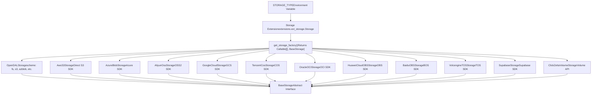
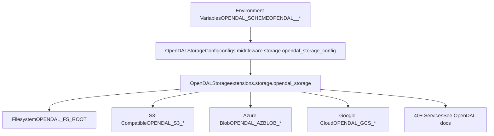
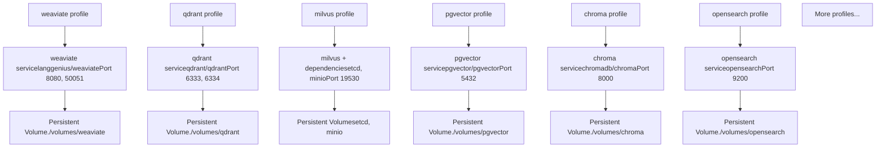
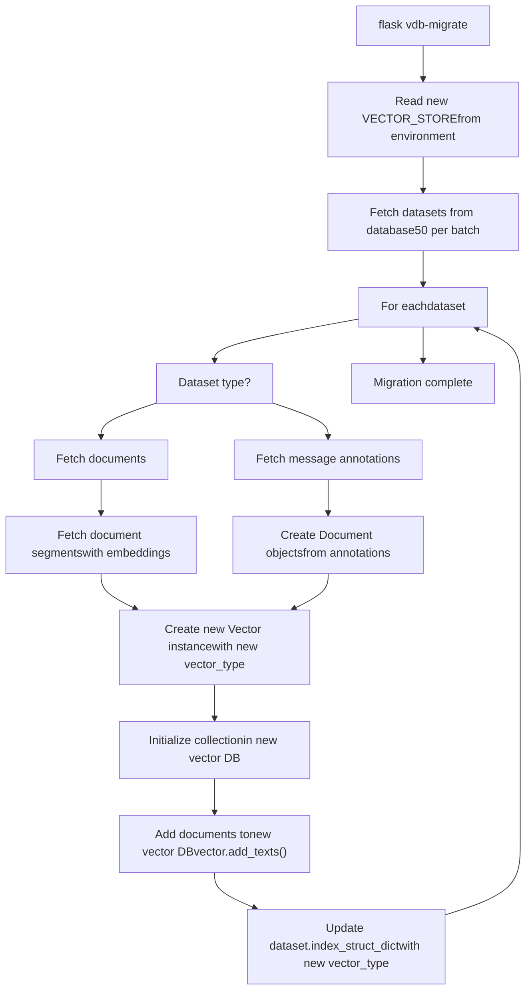
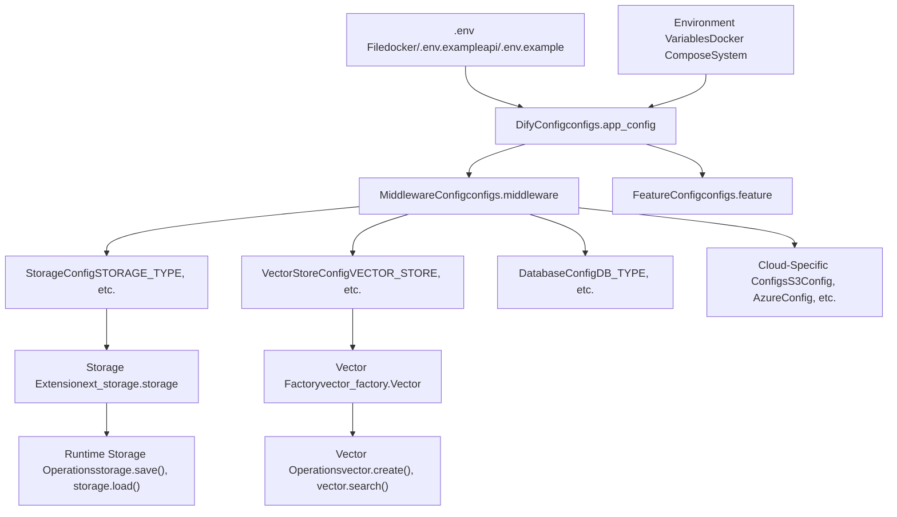

# Storage and Vector Database Configuration

Relevant source files

-   [api/.env.example](https://github.com/langgenius/dify/blob/92dbc94f/api/.env.example)
-   [api/app.py](https://github.com/langgenius/dify/blob/92dbc94f/api/app.py)
-   [api/app\_factory.py](https://github.com/langgenius/dify/blob/92dbc94f/api/app_factory.py)
-   [api/commands.py](https://github.com/langgenius/dify/blob/92dbc94f/api/commands.py)
-   [api/configs/feature/\_\_init\_\_.py](https://github.com/langgenius/dify/blob/92dbc94f/api/configs/feature/__init__.py)
-   [api/configs/middleware/\_\_init\_\_.py](https://github.com/langgenius/dify/blob/92dbc94f/api/configs/middleware/__init__.py)
-   [api/configs/packaging/\_\_init\_\_.py](https://github.com/langgenius/dify/blob/92dbc94f/api/configs/packaging/__init__.py)
-   [api/controllers/console/datasets/datasets.py](https://github.com/langgenius/dify/blob/92dbc94f/api/controllers/console/datasets/datasets.py)
-   [api/core/rag/datasource/vdb/vector\_factory.py](https://github.com/langgenius/dify/blob/92dbc94f/api/core/rag/datasource/vdb/vector_factory.py)
-   [api/core/rag/datasource/vdb/vector\_type.py](https://github.com/langgenius/dify/blob/92dbc94f/api/core/rag/datasource/vdb/vector_type.py)
-   [api/extensions/ext\_storage.py](https://github.com/langgenius/dify/blob/92dbc94f/api/extensions/ext_storage.py)
-   [api/extensions/storage/storage\_type.py](https://github.com/langgenius/dify/blob/92dbc94f/api/extensions/storage/storage_type.py)
-   [api/pyproject.toml](https://github.com/langgenius/dify/blob/92dbc94f/api/pyproject.toml)
-   [api/tests/unit\_tests/configs/test\_dify\_config.py](https://github.com/langgenius/dify/blob/92dbc94f/api/tests/unit_tests/configs/test_dify_config.py)
-   [api/uv.lock](https://github.com/langgenius/dify/blob/92dbc94f/api/uv.lock)
-   [dev/pytest/pytest\_vdb.sh](https://github.com/langgenius/dify/blob/92dbc94f/dev/pytest/pytest_vdb.sh)
-   [docker/.env.example](https://github.com/langgenius/dify/blob/92dbc94f/docker/.env.example)
-   [docker/docker-compose-template.yaml](https://github.com/langgenius/dify/blob/92dbc94f/docker/docker-compose-template.yaml)
-   [docker/docker-compose.middleware.yaml](https://github.com/langgenius/dify/blob/92dbc94f/docker/docker-compose.middleware.yaml)
-   [docker/docker-compose.yaml](https://github.com/langgenius/dify/blob/92dbc94f/docker/docker-compose.yaml)
-   [docker/middleware.env.example](https://github.com/langgenius/dify/blob/92dbc94f/docker/middleware.env.example)
-   [web/package.json](https://github.com/langgenius/dify/blob/92dbc94f/web/package.json)

This document covers the configuration of storage backends and vector databases in Dify. Storage backends handle file uploads, document processing artifacts, and plugin packages, while vector databases store embeddings for semantic search in the knowledge base system. For RAG pipeline details, see [Knowledge Base and RAG System](/langgenius/dify/4-knowledge-base-and-rag-system). For deployment infrastructure, see [Docker Build Process](/langgenius/dify/3.1-docker-build-process-and-multi-architecture-images) and [Environment Configuration](/langgenius/dify/3.2-environment-configuration-and-runtime-modes).

---

## Storage Architecture

Dify supports multiple storage backends through a factory pattern that abstracts the underlying storage implementation. All storage operations go through the `Storage` extension, which initializes the appropriate backend based on the `STORAGE_TYPE` environment variable.

### Storage Backend Factory Pattern


**Sources:** [api/extensions/ext\_storage.py15-84](https://github.com/langgenius/dify/blob/92dbc94f/api/extensions/ext_storage.py#L15-L84) [api/extensions/storage/storage\_type.py1-18](https://github.com/langgenius/dify/blob/92dbc94f/api/extensions/storage/storage_type.py#L1-L18)

### Supported Storage Backends

| Storage Type | Configuration Prefix | SDK/Library | Use Case |
| --- | --- | --- | --- |
| `opendal` (default) | `OPENDAL_*` | Apache OpenDAL | Unified interface for 40+ storage services |
| `s3` | `S3_*` | boto3 | AWS S3 and S3-compatible services |
| `azure-blob` | `AZURE_BLOB_*` | azure-storage-blob | Microsoft Azure Blob Storage |
| `aliyun-oss` | `ALIYUN_OSS_*` | oss2 | Alibaba Cloud OSS |
| `google-storage` | `GOOGLE_STORAGE_*` | google-cloud-storage | Google Cloud Storage |
| `tencent-cos` | `TENCENT_COS_*` | cos-python-sdk-v5 | Tencent Cloud COS |
| `oci-storage` | `OCI_*` | oci | Oracle Cloud Infrastructure |
| `huawei-obs` | `HUAWEI_OBS_*` | esdk-obs-python | Huawei Cloud OBS |
| `baidu-obs` | `BAIDU_OBS_*` | bce-python-sdk | Baidu Cloud BOS |
| `volcengine-tos` | `VOLCENGINE_TOS_*` | tos | Volcengine TOS |
| `supabase` | `SUPABASE_*` | supabase-py | Supabase Storage |
| `clickzetta-volume` | `CLICKZETTA_VOLUME_*` | Volume API | ClickZetta Volume Storage |
| `local` (deprecated) | `STORAGE_LOCAL_PATH` | Filesystem | Local filesystem (use `opendal` with `fs` scheme instead) |

**Sources:** [api/configs/middleware/\_\_init\_\_.py52-80](https://github.com/langgenius/dify/blob/92dbc94f/api/configs/middleware/__init__.py#L52-L80) [docker/.env.example406-529](https://github.com/langgenius/dify/blob/92dbc94f/docker/.env.example#L406-L529)

---

## OpenDAL Storage Configuration

OpenDAL is the recommended default storage backend as it provides a unified interface to 40+ storage services through a single configuration scheme. This reduces code complexity and makes it easier to switch between storage providers.

### OpenDAL Configuration Structure


**Configuration Example:**

```
# Use local filesystem storage (default)
STORAGE_TYPE=opendal
OPENDAL_SCHEME=fs
OPENDAL_FS_ROOT=storage

# Use S3-compatible storage via OpenDAL
STORAGE_TYPE=opendal
OPENDAL_SCHEME=s3
OPENDAL_S3_ENDPOINT=https://s3.amazonaws.com
OPENDAL_S3_REGION=us-east-1
OPENDAL_S3_BUCKET=my-bucket
OPENDAL_S3_ACCESS_KEY_ID=your-key
OPENDAL_S3_SECRET_ACCESS_KEY=your-secret
```
The `OpenDALStorage` class scans environment variables starting with `OPENDAL_<SCHEME_NAME>` and automatically applies them to the OpenDAL operator. This allows any OpenDAL service configuration to be passed through environment variables without code changes.

**Sources:** [docker/.env.example413-421](https://github.com/langgenius/dify/blob/92dbc94f/docker/.env.example#L413-L421) [api/configs/middleware/storage/opendal\_storage\_config.py1-50](https://github.com/langgenius/dify/blob/92dbc94f/api/configs/middleware/storage/opendal_storage_config.py#L1-L50)

---

## Cloud-Specific Storage Configuration

While OpenDAL is recommended, Dify also provides direct SDK integrations for major cloud providers with additional cloud-specific features.

### S3 Storage Configuration

Direct S3 integration supports AWS IAM roles and additional S3-specific features:

```
STORAGE_TYPE=s3
S3_ENDPOINT=https://s3.amazonaws.com
S3_REGION=us-east-1
S3_BUCKET_NAME=difyai
S3_ACCESS_KEY=your-access-key
S3_SECRET_KEY=your-secret-key
# Use AWS managed IAM roles instead of access keys
S3_USE_AWS_MANAGED_IAM=false
```
### Archive Storage (S3-Compatible)

Separate S3-compatible storage for workflow run logs and conversation archives:

```
ARCHIVE_STORAGE_ENABLED=false
ARCHIVE_STORAGE_ENDPOINT=
ARCHIVE_STORAGE_ARCHIVE_BUCKET=
ARCHIVE_STORAGE_EXPORT_BUCKET=
ARCHIVE_STORAGE_ACCESS_KEY=
ARCHIVE_STORAGE_SECRET_KEY=
ARCHIVE_STORAGE_REGION=auto
```
**Sources:** [docker/.env.example441-459](https://github.com/langgenius/dify/blob/92dbc94f/docker/.env.example#L441-L459) [api/configs/middleware/storage/amazon\_s3\_storage\_config.py1-50](https://github.com/langgenius/dify/blob/92dbc94f/api/configs/middleware/storage/amazon_s3_storage_config.py#L1-L50)

### Azure Blob Storage

```
STORAGE_TYPE=azure-blob
AZURE_BLOB_ACCOUNT_NAME=difyai
AZURE_BLOB_ACCOUNT_KEY=difyai
AZURE_BLOB_CONTAINER_NAME=difyai-container
AZURE_BLOB_ACCOUNT_URL=https://<your_account_name>.blob.core.windows.net
```
**Sources:** [docker/.env.example461-466](https://github.com/langgenius/dify/blob/92dbc94f/docker/.env.example#L461-L466) [api/configs/middleware/storage/azure\_blob\_storage\_config.py1-30](https://github.com/langgenius/dify/blob/92dbc94f/api/configs/middleware/storage/azure_blob_storage_config.py#L1-L30)

### Alibaba Cloud OSS

```
STORAGE_TYPE=aliyun-oss
ALIYUN_OSS_BUCKET_NAME=your-bucket-name
ALIYUN_OSS_ACCESS_KEY=your-access-key
ALIYUN_OSS_SECRET_KEY=your-secret-key
ALIYUN_OSS_ENDPOINT=https://oss-ap-southeast-1-internal.aliyuncs.com
ALIYUN_OSS_REGION=ap-southeast-1
ALIYUN_OSS_AUTH_VERSION=v4
# Don't start with '/'. OSS doesn't support leading slash in object names.
ALIYUN_OSS_PATH=your-path
ALIYUN_CLOUDBOX_ID=your-cloudbox-id
```
**Sources:** [docker/.env.example473-483](https://github.com/langgenius/dify/blob/92dbc94f/docker/.env.example#L473-L483) [api/configs/middleware/storage/aliyun\_oss\_storage\_config.py1-50](https://github.com/langgenius/dify/blob/92dbc94f/api/configs/middleware/storage/aliyun_oss_storage_config.py#L1-L50)

---

## Storage Initialization Flow

> **[Mermaid sequence]**
> *(图表结构无法解析)*

The storage extension is initialized in [api/app\_factory.py73-100](https://github.com/langgenius/dify/blob/92dbc94f/api/app_factory.py#L73-L100) as part of the `initialize_extensions()` function. The `Storage` class creates a singleton `storage_runner` instance that is accessible throughout the application via `extensions.ext_storage.storage`.

**Sources:** [api/app\_factory.py73-100](https://github.com/langgenius/dify/blob/92dbc94f/api/app_factory.py#L73-L100) [api/extensions/ext\_storage.py15-84](https://github.com/langgenius/dify/blob/92dbc94f/api/extensions/ext_storage.py#L15-L84)

---

## Vector Database Architecture

Dify supports 20+ vector databases for storing document embeddings used in semantic search. The vector database is configured per dataset and uses a factory pattern similar to storage backends.

### Vector Database Factory Pattern

```mermaid
flowchart TD
    Dataset["Dataset Modelindex_struct_dict['type']"]
    VectorConfig["VECTOR_STOREEnvironment Variable"]
    Vector["Vector Classcore.rag.datasource.vdb.vector_factory.Vector"]
    Factory["get_vector_factory()Returns AbstractVectorFactory"]
    Weaviate["WeaviateVectorFactoryDefault"]
    Qdrant["QdrantVectorFactory"]
    Milvus["MilvusVectorFactory"]
    PGVector["PGVectorFactory"]
    PGVectoRS["PGVectoRSVectorFactory"]
    Chroma["ChromaVectorFactory"]
    OpenSearch["OpenSearchVectorFactory"]
    Elasticsearch["ElasticsearchVectorFactory"]
    AnalyticDB["AnalyticdbVectorFactory"]
    TiDB["TiDBVectorFactory"]
    MyScale["MyScaleVectorFactory"]
    Oracle["OracleVectorFactory"]
    Tencent["TencentVectorFactory"]
    Baidu["BaiduVectorFactory"]
    Couchbase["CouchbaseVectorFactory"]
    OceanBase["OceanBaseVectorFactory"]
    More["17+ More Vector DBs..."]
    BaseVector["BaseVectorAbstract Interface"]

    Dataset --> Vector
    VectorConfig --> Vector
    Vector --> Factory
    Factory --> Weaviate
    Factory --> Qdrant
    Factory --> Milvus
    Factory --> PGVector
    Factory --> PGVectoRS
    Factory --> Chroma
    Factory --> OpenSearch
    Factory --> Elasticsearch
    Factory --> AnalyticDB
    Factory --> TiDB
    Factory --> MyScale
    Factory --> Oracle
    Factory --> Tencent
    Factory --> Baidu
    Factory --> Couchbase
    Factory --> OceanBase
    Factory --> More
    Weaviate --> BaseVector
    Qdrant --> BaseVector
    Milvus --> BaseVector
    PGVector --> BaseVector
    PGVectoRS --> BaseVector
    Chroma --> BaseVector
    OpenSearch --> BaseVector
    Elasticsearch --> BaseVector
```


**Sources:** [api/core/rag/datasource/vdb/vector\_factory.py38-158](https://github.com/langgenius/dify/blob/92dbc94f/api/core/rag/datasource/vdb/vector_factory.py#L38-L158) [api/core/rag/datasource/vdb/vector\_type.py1-37](https://github.com/langgenius/dify/blob/92dbc94f/api/core/rag/datasource/vdb/vector_type.py#L1-L37)

### Supported Vector Databases

| Vector Store | Configuration Prefix | Special Features |
| --- | --- | --- |
| `weaviate` | `WEAVIATE_*` | Default, gRPC support, tokenization options |
| `qdrant` | `QDRANT_*` | gRPC support, replication factor |
| `milvus` | `MILVUS_*` | Hybrid search, analyzer params |
| `pgvector` | `PGVECTOR_*` | PostgreSQL extension, pg\_bigm support |
| `pgvecto-rs` | `PGVECTO_RS_*` | Rust-based PostgreSQL extension |
| `chroma` | `CHROMA_*` | Token authentication, multi-tenant |
| `opensearch` | `OPENSEARCH_*` | AWS authentication, SSL verification |
| `elasticsearch` | `ELASTICSEARCH_*` | Cloud support, API key auth |
| `analyticdb` | `ANALYTICDB_*` | Alibaba Cloud managed |
| `tidb_vector` | `TIDB_VECTOR_*` | TiDB serverless vector extension |
| `tidb_on_qdrant` | `TIDB_ON_QDRANT_*` | TiDB + Qdrant hybrid |
| `myscale` | `MYSCALE_*` | Full-text search params |
| `oracle` | `ORACLE_*` | Autonomous database support, wallet config |
| `tencent` | `TENCENT_VECTOR_DB_*` | Tencent Cloud managed, hybrid search |
| `baidu` | `BAIDU_VECTOR_DB_*` | Baidu Cloud managed, inverted index |
| `couchbase` | `COUCHBASE_*` | NoSQL with vector search |
| `vikingdb` | `VIKINGDB_*` | Volcengine managed |
| `upstash` | `UPSTASH_VECTOR_*` | Serverless vector database |
| `oceanbase` | `OCEANBASE_*` | Hybrid search, fulltext parser options |
| `seekdb` | `SEEKDB_*` | OceanBase lite version |
| `opengauss` | `OPENGAUSS_*` | Product quantization support |
| `tablestore` | `TABLESTORE_*` | Alibaba Cloud TableStore |
| `vastbase` | `VASTBASE_*` | VastBase database |
| `matrixone` | `MATRIXONE_*` | MatrixOne database |
| `clickzetta` | `CLICKZETTA_*` | Inverted index, analyzer options |
| `alibabacloud_mysql` | `ALIBABACLOUD_MYSQL_*` | RDS MySQL with vector |
| `lindorm` | `LINDORM_*` | Alibaba Cloud Lindorm |
| `huawei_cloud` | `HUAWEI_CLOUD_*` | Huawei Cloud search |
| `relyt` | `RELYT_*` | PostgreSQL-compatible |
| `iris` | `IRIS_*` | InterSystems IRIS, text index support |

**Sources:** [docker/.env.example532-686](https://github.com/langgenius/dify/blob/92dbc94f/docker/.env.example#L532-L686) [api/core/rag/datasource/vdb/vector\_type.py4-37](https://github.com/langgenius/dify/blob/92dbc94f/api/core/rag/datasource/vdb/vector_type.py#L4-L37)

---

## Vector Database Configuration Examples

### Weaviate (Default)

```
VECTOR_STORE=weaviate
VECTOR_INDEX_NAME_PREFIX=Vector_index
WEAVIATE_ENDPOINT=http://weaviate:8080
WEAVIATE_API_KEY=WVF5YThaHlkYwhGUSmCRgsX3tD5ngdN8pkih
WEAVIATE_GRPC_ENDPOINT=grpc://weaviate:50051
WEAVIATE_TOKENIZATION=word
```
Weaviate is the default vector database and supports both HTTP and gRPC protocols. The `WEAVIATE_TOKENIZATION` option controls how text is tokenized for indexing.

**Sources:** [docker/.env.example541-545](https://github.com/langgenius/dify/blob/92dbc94f/docker/.env.example#L541-L545) [api/configs/middleware/vdb/weaviate\_config.py1-50](https://github.com/langgenius/dify/blob/92dbc94f/api/configs/middleware/vdb/weaviate_config.py#L1-L50)

### Qdrant

```
VECTOR_STORE=qdrant
QDRANT_URL=http://qdrant:6333
QDRANT_API_KEY=difyai123456
QDRANT_CLIENT_TIMEOUT=20
QDRANT_GRPC_ENABLED=false
QDRANT_GRPC_PORT=6334
QDRANT_REPLICATION_FACTOR=1
```
**Sources:** [docker/.env.example564-570](https://github.com/langgenius/dify/blob/92dbc94f/docker/.env.example#L564-L570) [api/configs/middleware/vdb/qdrant\_config.py1-50](https://github.com/langgenius/dify/blob/92dbc94f/api/configs/middleware/vdb/qdrant_config.py#L1-L50)

### Milvus

```
VECTOR_STORE=milvus
MILVUS_URI=http://host.docker.internal:19530
MILVUS_DATABASE=
MILVUS_TOKEN=
MILVUS_USER=
MILVUS_PASSWORD=
MILVUS_ENABLE_HYBRID_SEARCH=False
MILVUS_ANALYZER_PARAMS=
```
Milvus supports hybrid search combining vector and scalar filtering. The `MILVUS_ANALYZER_PARAMS` allows custom text analysis configuration.

**Sources:** [docker/.env.example572-580](https://github.com/langgenius/dify/blob/92dbc94f/docker/.env.example#L572-L580) [api/configs/middleware/vdb/milvus\_config.py1-50](https://github.com/langgenius/dify/blob/92dbc94f/api/configs/middleware/vdb/milvus_config.py#L1-L50)

### PGVector

```
VECTOR_STORE=pgvector
PGVECTOR_HOST=pgvector
PGVECTOR_PORT=5432
PGVECTOR_USER=postgres
PGVECTOR_PASSWORD=difyai123456
PGVECTOR_DATABASE=dify
PGVECTOR_MIN_CONNECTION=1
PGVECTOR_MAX_CONNECTION=5
# Enable pg_bigm extension for better Chinese/Japanese search
PGVECTOR_PG_BIGM=false
PGVECTOR_PG_BIGM_VERSION=1.2-20240606
```
**Sources:** [docker/.env.example600-609](https://github.com/langgenius/dify/blob/92dbc94f/docker/.env.example#L600-L609) [api/configs/middleware/vdb/pgvector\_config.py1-50](https://github.com/langgenius/dify/blob/92dbc94f/api/configs/middleware/vdb/pgvector_config.py#L1-L50)

### OceanBase (Hybrid Search)

```
VECTOR_STORE=oceanbase
OCEANBASE_VECTOR_HOST=oceanbase
OCEANBASE_VECTOR_PORT=2881
OCEANBASE_VECTOR_USER=root@test
OCEANBASE_VECTOR_PASSWORD=difyai123456
OCEANBASE_VECTOR_DATABASE=test
OCEANBASE_CLUSTER_NAME=difyai
OCEANBASE_MEMORY_LIMIT=6G
OCEANBASE_ENABLE_HYBRID_SEARCH=false
# Built-in parsers: ngram, beng, space, ngram2, ik
# External parsers (require plugin): japanese_ftparser, thai_ftparser
OCEANBASE_FULLTEXT_PARSER=ik
```
OceanBase can be used as both the metadata database (`DB_TYPE=oceanbase`) and vector database (`VECTOR_STORE=oceanbase`) simultaneously.

**Sources:** [docker/.env.example547-562](https://github.com/langgenius/dify/blob/92dbc94f/docker/.env.example#L547-L562) [api/configs/middleware/vdb/oceanbase\_config.py1-50](https://github.com/langgenius/dify/blob/92dbc94f/api/configs/middleware/vdb/oceanbase_config.py#L1-L50)

---

## Docker Compose Vector Database Services

Vector databases are included as optional services in the Docker Compose configuration using profiles. This allows enabling only the needed vector database without starting all services.

### Vector Database Service Topology


**Enabling a Vector Database:**

```
# Start with default Weaviate
docker compose --profile weaviate up -d

# Start with Qdrant
docker compose --profile qdrant up -d

# Start with Milvus (includes etcd and minio dependencies)
docker compose --profile milvus up -d

# Start with PGVector
docker compose --profile pgvector up -d
```
**Sources:** [docker/docker-compose-template.yaml1-900](https://github.com/langgenius/dify/blob/92dbc94f/docker/docker-compose-template.yaml#L1-L900) [docker/docker-compose.middleware.yaml1-400](https://github.com/langgenius/dify/blob/92dbc94f/docker/docker-compose.middleware.yaml#L1-L400)

---

## Vector Database Initialization and Migration

### Vector Initialization Flow

> **[Mermaid sequence]**
> *(图表结构无法解析)*

The `Vector` class in [api/core/rag/datasource/vdb/vector\_factory.py38-66](https://github.com/langgenius/dify/blob/92dbc94f/api/core/rag/datasource/vdb/vector_factory.py#L38-L66) handles vector database initialization. It reads the vector type from the dataset's `index_struct_dict` if available, otherwise uses the global `VECTOR_STORE` configuration.

**Sources:** [api/core/rag/datasource/vdb/vector\_factory.py38-158](https://github.com/langgenius/dify/blob/92dbc94f/api/core/rag/datasource/vdb/vector_factory.py#L38-L158)

### Vector Database Migration Command

The `vdb-migrate` command migrates existing datasets to a different vector database:

```
# Migrate all datasets (knowledge + annotation)
flask vdb-migrate --scope all

# Migrate only knowledge base datasets
flask vdb-migrate --scope knowledge

# Migrate only annotation datasets
flask vdb-migrate --scope annotation
```
**Migration Process:**


The migration command is implemented in [api/commands.py170-287](https://github.com/langgenius/dify/blob/92dbc94f/api/commands.py#L170-L287) and handles both knowledge base datasets and annotation datasets separately.

**Sources:** [api/commands.py170-287](https://github.com/langgenius/dify/blob/92dbc94f/api/commands.py#L170-L287)

---

## Configuration Hierarchy

### Configuration Loading Order


Configuration is loaded using Pydantic Settings with environment variable precedence. The hierarchy is:

1.  **Base Configuration**: `DifyConfig` in [api/configs/app\_config.py1-100](https://github.com/langgenius/dify/blob/92dbc94f/api/configs/app_config.py#L1-L100)
2.  **Middleware Configuration**: Storage, VectorDB, Database in [api/configs/middleware/\_\_init\_\_.py1-200](https://github.com/langgenius/dify/blob/92dbc94f/api/configs/middleware/__init__.py#L1-L200)
3.  **Feature Configuration**: Security, AppExecution, Plugins in [api/configs/feature/\_\_init\_\_.py1-400](https://github.com/langgenius/dify/blob/92dbc94f/api/configs/feature/__init__.py#L1-L400)
4.  **Runtime Initialization**: Extensions initialized in [api/app\_factory.py73-100](https://github.com/langgenius/dify/blob/92dbc94f/api/app_factory.py#L73-L100)

**Sources:** [api/configs/app\_config.py1-50](https://github.com/langgenius/dify/blob/92dbc94f/api/configs/app_config.py#L1-L50) [api/configs/middleware/\_\_init\_\_.py1-200](https://github.com/langgenius/dify/blob/92dbc94f/api/configs/middleware/__init__.py#L1-L200) [api/app\_factory.py73-100](https://github.com/langgenius/dify/blob/92dbc94f/api/app_factory.py#L73-L100)

---

## Testing Vector Databases

Vector database integration tests are located in [api/tests/integration\_tests/vdb/](https://github.com/langgenius/dify/blob/92dbc94f/api/tests/integration_tests/vdb/) with test containers for each supported database:

```
# Run all vector database integration tests
./dev/pytest/pytest_vdb.sh

# Test specific vector database
pytest api/tests/integration_tests/vdb/weaviate
pytest api/tests/integration_tests/vdb/qdrant
pytest api/tests/integration_tests/vdb/pgvector
```
The test script [dev/pytest/pytest\_vdb.sh1-24](https://github.com/langgenius/dify/blob/92dbc94f/dev/pytest/pytest_vdb.sh#L1-L24) runs integration tests for multiple vector databases including Chroma, Milvus, PGVector, Qdrant, Weaviate, Elasticsearch, VikingDB, Baidu, TcVectorDB, Upstash, Couchbase, OceanBase, TiDB Vector, and Huawei Cloud.

**Sources:** [dev/pytest/pytest\_vdb.sh1-24](https://github.com/langgenius/dify/blob/92dbc94f/dev/pytest/pytest_vdb.sh#L1-L24) [api/tests/integration\_tests/vdb/](https://github.com/langgenius/dify/blob/92dbc94f/api/tests/integration_tests/vdb/)

---

## Storage and Vector Database Configuration Reference

### Environment Variables Summary

| Category | Variable | Default | Description |
| --- | --- | --- | --- |
| **Storage** | `STORAGE_TYPE` | `opendal` | Storage backend type |
|  | `OPENDAL_SCHEME` | `fs` | OpenDAL service scheme |
|  | `OPENDAL_FS_ROOT` | `storage` | Filesystem root directory |
|  | `S3_BUCKET_NAME` | `difyai` | S3 bucket name |
|  | `AZURE_BLOB_CONTAINER_NAME` | `difyai-container` | Azure container |
| **Vector DB** | `VECTOR_STORE` | `weaviate` | Vector database type |
|  | `VECTOR_INDEX_NAME_PREFIX` | `Vector_index` | Collection name prefix |
|  | `WEAVIATE_ENDPOINT` | `http://weaviate:8080` | Weaviate HTTP endpoint |
|  | `QDRANT_URL` | `http://qdrant:6333` | Qdrant HTTP endpoint |
|  | `PGVECTOR_HOST` | `pgvector` | PGVector database host |
| **Archive** | `ARCHIVE_STORAGE_ENABLED` | `false` | Enable archive storage |
|  | `ARCHIVE_STORAGE_ARCHIVE_BUCKET` | \- | Archive bucket name |

**Sources:** [docker/.env.example406-686](https://github.com/langgenius/dify/blob/92dbc94f/docker/.env.example#L406-L686) [api/.env.example87-374](https://github.com/langgenius/dify/blob/92dbc94f/api/.env.example#L87-L374)

---

## Plugin Storage Configuration

Plugins can use separate storage configuration from the main application:

```
PLUGIN_STORAGE_TYPE=local  # or s3, azure, aliyun, tencent, volcengine
PLUGIN_STORAGE_LOCAL_ROOT=/app/storage
PLUGIN_INSTALLED_PATH=plugin
PLUGIN_PACKAGE_CACHE_PATH=plugin_packages
PLUGIN_MEDIA_CACHE_PATH=assets

# S3 configuration for plugins
PLUGIN_S3_ENDPOINT=
PLUGIN_S3_USE_AWS_MANAGED_IAM=false
PLUGIN_AWS_ACCESS_KEY=
PLUGIN_AWS_SECRET_KEY=
PLUGIN_AWS_REGION=

# Azure configuration for plugins
PLUGIN_AZURE_BLOB_STORAGE_CONNECTION_STRING=
PLUGIN_AZURE_BLOB_STORAGE_CONTAINER_NAME=

# Other cloud provider configs...
```
Plugin storage is managed by the plugin daemon service and can be configured independently of the main application storage to support different deployment architectures.

**Sources:** [docker/.env.example610-638](https://github.com/langgenius/dify/blob/92dbc94f/docker/.env.example#L610-L638) [docker/docker-compose-template.yaml292-321](https://github.com/langgenius/dify/blob/92dbc94f/docker/docker-compose-template.yaml#L292-L321)
