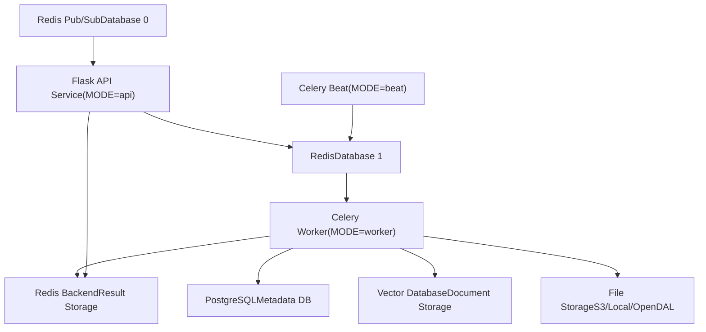
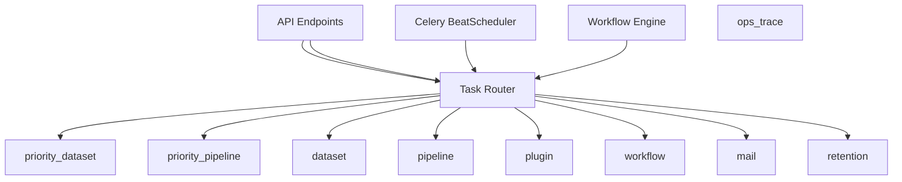
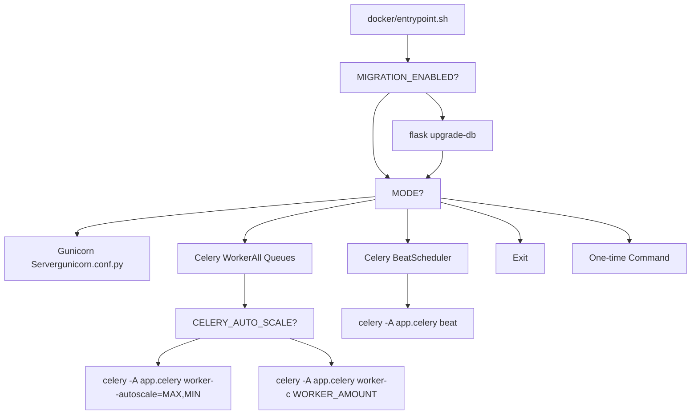
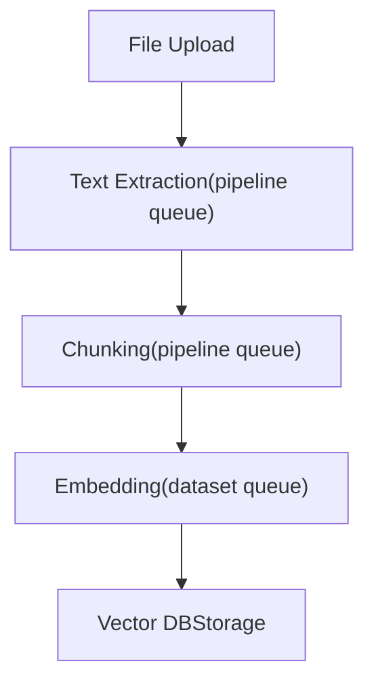
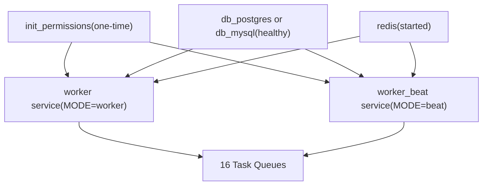

# Asynchronous Task Processing with Celery

Relevant source files

-   [api/.env.example](https://github.com/langgenius/dify/blob/92dbc94f/api/.env.example)
-   [api/app.py](https://github.com/langgenius/dify/blob/92dbc94f/api/app.py)
-   [api/app\_factory.py](https://github.com/langgenius/dify/blob/92dbc94f/api/app_factory.py)
-   [api/commands.py](https://github.com/langgenius/dify/blob/92dbc94f/api/commands.py)
-   [api/configs/feature/\_\_init\_\_.py](https://github.com/langgenius/dify/blob/92dbc94f/api/configs/feature/__init__.py)
-   [api/configs/middleware/\_\_init\_\_.py](https://github.com/langgenius/dify/blob/92dbc94f/api/configs/middleware/__init__.py)
-   [api/configs/packaging/\_\_init\_\_.py](https://github.com/langgenius/dify/blob/92dbc94f/api/configs/packaging/__init__.py)
-   [api/controllers/console/datasets/datasets.py](https://github.com/langgenius/dify/blob/92dbc94f/api/controllers/console/datasets/datasets.py)
-   [api/core/rag/datasource/vdb/vector\_factory.py](https://github.com/langgenius/dify/blob/92dbc94f/api/core/rag/datasource/vdb/vector_factory.py)
-   [api/core/rag/datasource/vdb/vector\_type.py](https://github.com/langgenius/dify/blob/92dbc94f/api/core/rag/datasource/vdb/vector_type.py)
-   [api/extensions/ext\_storage.py](https://github.com/langgenius/dify/blob/92dbc94f/api/extensions/ext_storage.py)
-   [api/extensions/storage/storage\_type.py](https://github.com/langgenius/dify/blob/92dbc94f/api/extensions/storage/storage_type.py)
-   [api/models/account.py](https://github.com/langgenius/dify/blob/92dbc94f/api/models/account.py)
-   [api/models/api\_based\_extension.py](https://github.com/langgenius/dify/blob/92dbc94f/api/models/api_based_extension.py)
-   [api/models/dataset.py](https://github.com/langgenius/dify/blob/92dbc94f/api/models/dataset.py)
-   [api/models/model.py](https://github.com/langgenius/dify/blob/92dbc94f/api/models/model.py)
-   [api/models/oauth.py](https://github.com/langgenius/dify/blob/92dbc94f/api/models/oauth.py)
-   [api/models/provider.py](https://github.com/langgenius/dify/blob/92dbc94f/api/models/provider.py)
-   [api/models/source.py](https://github.com/langgenius/dify/blob/92dbc94f/api/models/source.py)
-   [api/models/task.py](https://github.com/langgenius/dify/blob/92dbc94f/api/models/task.py)
-   [api/models/tools.py](https://github.com/langgenius/dify/blob/92dbc94f/api/models/tools.py)
-   [api/models/trigger.py](https://github.com/langgenius/dify/blob/92dbc94f/api/models/trigger.py)
-   [api/models/web.py](https://github.com/langgenius/dify/blob/92dbc94f/api/models/web.py)
-   [api/models/workflow.py](https://github.com/langgenius/dify/blob/92dbc94f/api/models/workflow.py)
-   [api/pyproject.toml](https://github.com/langgenius/dify/blob/92dbc94f/api/pyproject.toml)
-   [api/tests/test\_containers\_integration\_tests/services/test\_advanced\_prompt\_template\_service.py](https://github.com/langgenius/dify/blob/92dbc94f/api/tests/test_containers_integration_tests/services/test_advanced_prompt_template_service.py)
-   [api/tests/test\_containers\_integration\_tests/services/test\_agent\_service.py](https://github.com/langgenius/dify/blob/92dbc94f/api/tests/test_containers_integration_tests/services/test_agent_service.py)
-   [api/tests/test\_containers\_integration\_tests/tasks/\_\_init\_\_.py](https://github.com/langgenius/dify/blob/92dbc94f/api/tests/test_containers_integration_tests/tasks/__init__.py)
-   [api/tests/test\_containers\_integration\_tests/tasks/test\_add\_document\_to\_index\_task.py](https://github.com/langgenius/dify/blob/92dbc94f/api/tests/test_containers_integration_tests/tasks/test_add_document_to_index_task.py)
-   [api/tests/unit\_tests/configs/test\_dify\_config.py](https://github.com/langgenius/dify/blob/92dbc94f/api/tests/unit_tests/configs/test_dify_config.py)
-   [api/tests/unit\_tests/core/test\_provider\_manager.py](https://github.com/langgenius/dify/blob/92dbc94f/api/tests/unit_tests/core/test_provider_manager.py)
-   [api/uv.lock](https://github.com/langgenius/dify/blob/92dbc94f/api/uv.lock)
-   [dev/pytest/pytest\_vdb.sh](https://github.com/langgenius/dify/blob/92dbc94f/dev/pytest/pytest_vdb.sh)
-   [docker/.env.example](https://github.com/langgenius/dify/blob/92dbc94f/docker/.env.example)
-   [docker/docker-compose-template.yaml](https://github.com/langgenius/dify/blob/92dbc94f/docker/docker-compose-template.yaml)
-   [docker/docker-compose.middleware.yaml](https://github.com/langgenius/dify/blob/92dbc94f/docker/docker-compose.middleware.yaml)
-   [docker/docker-compose.yaml](https://github.com/langgenius/dify/blob/92dbc94f/docker/docker-compose.yaml)
-   [docker/middleware.env.example](https://github.com/langgenius/dify/blob/92dbc94f/docker/middleware.env.example)
-   [web/package.json](https://github.com/langgenius/dify/blob/92dbc94f/web/package.json)

## Purpose and Scope

This page documents Dify's Celery-based asynchronous task processing system, covering worker configuration, queue management, task routing, and operational modes. Celery handles background jobs including dataset indexing, document processing, workflow execution, and scheduled tasks.

For API service configuration, see [Environment Configuration and Runtime Modes](/langgenius/dify/3.2-environment-configuration-and-runtime-modes). For storage configuration used by tasks, see [Storage and Vector Database Configuration](/langgenius/dify/3.3-storage-and-vector-database-configuration).

**Sources:** [api/README.md84-94](https://github.com/langgenius/dify/blob/92dbc94f/api/README.md#L84-L94) [docker/docker-compose-template.yaml63-131](https://github.com/langgenius/dify/blob/92dbc94f/docker/docker-compose-template.yaml#L63-L131)

---

## System Architecture Overview

### Celery Component Topology


**Celery Components:**

-   **Broker:** Redis database 1 (`CELERY_BROKER_URL`) handles task queue and message routing
-   **Backend:** Redis stores task results and state information (`CELERY_BACKEND`)
-   **Workers:** Execute tasks across multiple queues with configurable concurrency
-   **Beat:** Scheduler for periodic tasks (cron-like scheduling)

**Sources:** [docker/docker-compose.yaml100-101](https://github.com/langgenius/dify/blob/92dbc94f/docker/docker-compose.yaml#L100-L101) [docker/.env.example370-384](https://github.com/langgenius/dify/blob/92dbc94f/docker/.env.example#L370-L384) [api/.env.example72-74](https://github.com/langgenius/dify/blob/92dbc94f/api/.env.example#L72-L74)

---

## Queue Structure and Task Routing

### Task Queues

Dify uses 16 specialized queues to organize work by priority and function:

| Queue Name | Purpose | Priority |
| --- | --- | --- |
| `priority_dataset` | High-priority dataset operations | High |
| `priority_pipeline` | High-priority pipeline processing | High |
| `dataset` | Standard dataset indexing and updates | Normal |
| `pipeline` | Document processing pipelines | Normal |
| `mail` | Email notifications | Normal |
| `ops_trace` | Operational tracing and metrics | Normal |
| `app_deletion` | Application cleanup tasks | Normal |
| `plugin` | Plugin installation and execution | Normal |
| `workflow_storage` | Workflow execution log storage | Normal |
| `conversation` | Conversation processing | Normal |
| `workflow` | Workflow execution tasks | Normal |
| `schedule_poller` | Poll scheduled workflows | Normal |
| `schedule_executor` | Execute scheduled workflows | Normal |
| `triggered_workflow_dispatcher` | Dispatch triggered workflows | Normal |
| `trigger_refresh_executor` | Refresh workflow triggers | Normal |
| `retention` | Data retention and cleanup | Low |

**Queue Declaration:** Workers consume from all queues unless specifically configured otherwise. The queue list is specified at worker startup.

**Sources:** [api/README.md87](https://github.com/langgenius/dify/blob/92dbc94f/api/README.md#L87-L87) [.devcontainer/post\_create\_command.sh10](https://github.com/langgenius/dify/blob/92dbc94f/.devcontainer/post_create_command.sh#L10-L10)

### Task Routing Flow


**Sources:** [api/README.md87](https://github.com/langgenius/dify/blob/92dbc94f/api/README.md#L87-L87)

---

## Worker Configuration

### Environment Variables

**Worker Scaling:**

```
# Fixed worker count
CELERY_WORKER_AMOUNT=         # Number of worker processes (default: based on CPU)

# Autoscaling mode
CELERY_AUTO_SCALE=false       # Enable dynamic worker scaling
CELERY_MAX_WORKERS=           # Maximum workers for autoscaling
CELERY_MIN_WORKERS=           # Minimum workers for autoscaling
```
**Worker Class:**

```
CELERY_WORKER_CLASS=          # Worker class: gevent, threads, prefork
                              # Default: empty (uses gevent in production)
```
**Concurrency:**

```
SERVER_WORKER_CONNECTIONS=10  # Gevent worker connections per process
```
**Sources:** [docker/.env.example184-210](https://github.com/langgenius/dify/blob/92dbc94f/docker/.env.example#L184-L210) [docker/docker-compose.yaml45-50](https://github.com/langgenius/dify/blob/92dbc94f/docker/docker-compose.yaml#L45-L50)

### Worker Pool Types

Dify supports three worker pool types:

1.  **Gevent (Default for Production):**

    -   Asynchronous I/O using greenlets
    -   Suitable for I/O-bound tasks (API calls, database queries)
    -   Configured via `SERVER_WORKER_CLASS=gevent`
    -   Used automatically in Docker deployments
2.  **Threads:**

    -   Python threading for concurrent execution
    -   Better for CPU-bound tasks
    -   Specified with `-P threads` flag
    -   Recommended for local development
3.  **Prefork:**

    -   Multiprocessing with separate OS processes
    -   Maximum isolation but higher memory usage
    -   Specified with `-P prefork`

**Sources:** [docker/.env.example158-178](https://github.com/langgenius/dify/blob/92dbc94f/docker/.env.example#L158-L178) [api/README.md87](https://github.com/langgenius/dify/blob/92dbc94f/api/README.md#L87-L87)

### Worker Startup Modes

The `entrypoint.sh` script supports multiple operational modes:


**Worker Mode Command (Autoscaling Disabled):**

```
celery -A app.celery worker \
  -P ${CELERY_WORKER_CLASS:-gevent} \
  -c ${CELERY_WORKER_AMOUNT:-1} \
  -l INFO \
  -Q dataset,priority_dataset,priority_pipeline,pipeline,mail,ops_trace,app_deletion,plugin,workflow_storage,conversation,workflow,schedule_poller,schedule_executor,triggered_workflow_dispatcher,trigger_refresh_executor,retention
```
**Worker Mode Command (Autoscaling Enabled):**

```
celery -A app.celery worker \
  -P ${CELERY_WORKER_CLASS:-gevent} \
  --autoscale=${CELERY_MAX_WORKERS},${CELERY_MIN_WORKERS} \
  -l INFO \
  -Q [all queues...]
```
**Sources:** [docker/entrypoint.sh20-52](https://github.com/langgenius/dify/blob/92dbc94f/docker/entrypoint.sh#L20-L52) [docker/entrypoint.sh54-58](https://github.com/langgenius/dify/blob/92dbc94f/docker/entrypoint.sh#L54-L58)

---

## Celery Beat Scheduler

### Purpose

Celery Beat is a scheduler that triggers periodic tasks at defined intervals. It runs as a separate service and enqueues tasks to worker queues based on schedule definitions.

### Configuration

```
# Beat scheduler time (seconds between schedule checks)
CELERY_BEAT_SCHEDULER_TIME=1

# Workflow schedule polling
WORKFLOW_SCHEDULE_POLLER_INTERVAL=1        # Minutes between polls
WORKFLOW_SCHEDULE_POLLER_BATCH_SIZE=100    # Max workflows per poll
WORKFLOW_SCHEDULE_MAX_DISPATCH_PER_TICK=0  # Max dispatches per tick (0=unlimited)
```
**Sources:** [api/.env.example577-594](https://github.com/langgenius/dify/blob/92dbc94f/api/.env.example#L577-L594)

### Scheduled Tasks

| Task | Queue | Default State | Purpose |
| --- | --- | --- | --- |
| `clean_embedding_cache_task` | `ops_trace` | Disabled | Clear expired embedding cache |
| `clean_unused_datasets_task` | `dataset` | Disabled | Remove unused datasets |
| `create_tidb_serverless_task` | `dataset` | Disabled | TiDB instance provisioning |
| `update_tidb_serverless_status_task` | `dataset` | Disabled | TiDB status updates |
| `clean_messages` | `conversation` | Disabled | Message retention cleanup |
| `mail_clean_document_notify_task` | `mail` | Disabled | Document cleanup notifications |
| `datasets_queue_monitor` | `ops_trace` | Disabled | Monitor dataset queue depth |
| `check_upgradable_plugin_task` | `plugin` | Enabled | Check for plugin updates |
| `workflow_schedule_poller_task` | `schedule_poller` | Enabled | Poll scheduled workflows |

**Enable/Disable Configuration:**

```
ENABLE_CLEAN_EMBEDDING_CACHE_TASK=false
ENABLE_CLEAN_UNUSED_DATASETS_TASK=false
ENABLE_CREATE_TIDB_SERVERLESS_TASK=false
ENABLE_UPDATE_TIDB_SERVERLESS_STATUS_TASK=false
ENABLE_CLEAN_MESSAGES=false
ENABLE_MAIL_CLEAN_DOCUMENT_NOTIFY_TASK=false
ENABLE_DATASETS_QUEUE_MONITOR=false
ENABLE_CHECK_UPGRADABLE_PLUGIN_TASK=true
ENABLE_WORKFLOW_SCHEDULE_POLLER_TASK=true
```
**Sources:** [api/.env.example580-594](https://github.com/langgenius/dify/blob/92dbc94f/api/.env.example#L580-L594)

### Beat Service Deployment

```
# Docker Compose Beat Service
worker_beat:
  image: langgenius/dify-api:1.11.2
  restart: always
  environment:
    MODE: beat
    # Shared environment with API and workers
  depends_on:
    - db_postgres (or db_mysql)
    - redis
```
**Sources:** [docker/docker-compose-template.yaml102-131](https://github.com/langgenius/dify/blob/92dbc94f/docker/docker-compose-template.yaml#L102-L131)

---

## Broker and Backend Configuration

### Redis Broker Configuration

**Connection String Format:**

```
redis://[username]:[password]@[host]:[port]/[database]
```
**Standard Configuration:**

```
CELERY_BROKER_URL=redis://:difyai123456@redis:6379/1
CELERY_BACKEND=redis
BROKER_USE_SSL=false
```
**High Availability with Redis Sentinel:**

```
CELERY_USE_SENTINEL=true
CELERY_SENTINEL_MASTER_NAME=mymaster
CELERY_SENTINEL_PASSWORD=sentinelpass
CELERY_SENTINEL_SOCKET_TIMEOUT=0.1

# Broker URL format for Sentinel:
# sentinel://[:password@]host1:port1[;sentinel://[:password@]host2:port2;...]
CELERY_BROKER_URL=sentinel://:password@sentinel1:26379/1;sentinel://:password@sentinel2:26379/1
```
**Sources:** [docker/.env.example370-384](https://github.com/langgenius/dify/blob/92dbc94f/docker/.env.example#L370-L384) [api/.env.example72-74](https://github.com/langgenius/dify/blob/92dbc94f/api/.env.example#L72-L74)

### Connection Pooling

Redis connection pooling is managed by the Celery client and configured through SQLAlchemy pool settings that also apply to Redis connections:

```
SQLALCHEMY_POOL_SIZE=30              # Base connection pool size
SQLALCHEMY_MAX_OVERFLOW=10           # Additional connections allowed
SQLALCHEMY_POOL_RECYCLE=3600         # Recycle connections after N seconds
SQLALCHEMY_POOL_TIMEOUT=30           # Connection checkout timeout
```
**Sources:** [docker/.env.example243-258](https://github.com/langgenius/dify/blob/92dbc94f/docker/.env.example#L243-L258)

---

## Task Types and Use Cases

### Dataset Indexing Tasks

**Queue:** `dataset`, `priority_dataset`

**Primary Tasks:**

-   `IndexingRunner.run()` - Process documents and create vector embeddings
-   `DatasetService.update_dataset_index()` - Update existing dataset indices
-   `DocumentService.batch_add_segments()` - Add document segments
-   `clean_unused_datasets_task()` - Periodic cleanup of unused datasets

**Priority Routing:** Urgent dataset operations (user-initiated actions) use `priority_dataset` queue; background updates use standard `dataset` queue.

**Sources:** [api/controllers/console/datasets/datasets.py](https://github.com/langgenius/dify/blob/92dbc94f/api/controllers/console/datasets/datasets.py)

### Pipeline Processing Tasks

**Queue:** `pipeline`, `priority_pipeline`

**Primary Tasks:**

-   Document extraction (PDF, DOCX, TXT, etc.)
-   Text chunking and segmentation
-   Metadata extraction
-   Format conversion

**Pipeline Flow:**


**Sources:** [api/controllers/console/datasets/datasets.py](https://github.com/langgenius/dify/blob/92dbc94f/api/controllers/console/datasets/datasets.py)

### Workflow Execution Tasks

**Queues:** `workflow`, `workflow_storage`, `schedule_poller`, `schedule_executor`, `triggered_workflow_dispatcher`

**Workflow Task Types:**

-   `workflow` - Execute workflow graphs
-   `workflow_storage` - Persist execution logs to object storage
-   `schedule_poller` - Poll database for scheduled workflows
-   `schedule_executor` - Execute scheduled workflow runs
-   `triggered_workflow_dispatcher` - Dispatch webhook-triggered workflows

**Sources:** [api/.env.example577-594](https://github.com/langgenius/dify/blob/92dbc94f/api/.env.example#L577-L594)

### Plugin and Tool Tasks

**Queue:** `plugin`

**Primary Tasks:**

-   Plugin installation and package extraction
-   Plugin runtime initialization
-   Tool invocation within plugins
-   Plugin package verification

**Sources:** [docker/docker-compose-template.yaml77](https://github.com/langgenius/dify/blob/92dbc94f/docker/docker-compose-template.yaml#L77-L77)

### Operational Tasks

**Queues:** `mail`, `ops_trace`, `retention`

**Task Examples:**

-   `mail` - Send email notifications (password reset, dataset completion)
-   `ops_trace` - Record operational metrics and traces
-   `retention` - Clean up old logs, expired tokens, temporary files
-   `app_deletion` - Delete applications and cascade cleanup

**Sources:** [api/.env.example580-594](https://github.com/langgenius/dify/blob/92dbc94f/api/.env.example#L580-L594)

---

## Local Development Setup

### Running Workers Locally

**Start Worker:**

```
cd api
uv run celery -A app.celery worker \
  -P threads \
  -c 2 \
  --loglevel INFO \
  -Q dataset,priority_dataset,priority_pipeline,pipeline,mail,ops_trace,app_deletion,plugin,workflow_storage,conversation,workflow,schedule_poller,schedule_executor,triggered_workflow_dispatcher,trigger_refresh_executor,retention
```
**Start Beat Scheduler:**

```
cd api
uv run celery -A app.celery beat
```
**Development Aliases:** The DevContainer includes convenient aliases:

```
start-worker   # Launch Celery worker
start-beat     # Launch Celery beat
```
**Sources:** [api/README.md86-94](https://github.com/langgenius/dify/blob/92dbc94f/api/README.md#L86-L94) [.devcontainer/post\_create\_command.sh10-11](https://github.com/langgenius/dify/blob/92dbc94f/.devcontainer/post_create_command.sh#L10-L11)

### Worker Configuration for Development

**Thread Pool Recommended:** Use `-P threads` for local development instead of gevent to avoid greenlet-related issues with debugging tools.

**Concurrency:** Start with `-c 1` or `-c 2` for easier debugging. Production uses higher concurrency based on CPU cores.

**Queue Filtering:** During development, you can limit queues to specific types:

```
# Only dataset processing
uv run celery -A app.celery worker -Q dataset,priority_dataset

# Only workflow execution
uv run celery -A app.celery worker -Q workflow,workflow_storage
```
**Sources:** [api/README.md86-94](https://github.com/langgenius/dify/blob/92dbc94f/api/README.md#L86-L94)

---

## Docker Compose Deployment

### Service Definitions

**Worker Service:**

```
worker:
  image: langgenius/dify-api:1.11.2
  restart: always
  environment:
    MODE: worker
    # All shared environment variables
  depends_on:
    init_permissions:
      condition: service_completed_successfully
    db_postgres:
      condition: service_healthy
    redis:
      condition: service_started
  volumes:
    - ./volumes/app/storage:/app/api/storage
```
**Beat Service:**

```
worker_beat:
  image: langgenius/dify-api:1.11.2
  restart: always
  environment:
    MODE: beat
    # All shared environment variables
  depends_on:
    init_permissions:
      condition: service_completed_successfully
    db_postgres:
      condition: service_healthy
    redis:
      condition: service_started
```
**Sources:** [docker/docker-compose-template.yaml63-131](https://github.com/langgenius/dify/blob/92dbc94f/docker/docker-compose-template.yaml#L63-L131)

### Service Dependencies


**Health Check Dependencies:**

-   PostgreSQL/MySQL must pass health check before workers start
-   Redis must be started (but no health check required)
-   `init_permissions` must complete successfully to ensure proper file permissions

**Sources:** [docker/docker-compose-template.yaml79-94](https://github.com/langgenius/dify/blob/92dbc94f/docker/docker-compose-template.yaml#L79-L94) [docker/docker-compose-template.yaml113-128](https://github.com/langgenius/dify/blob/92dbc94f/docker/docker-compose-template.yaml#L113-L128)

### Scaling Workers

**Horizontal Scaling:**

```
# Scale worker service to 3 replicas
docker compose up -d --scale worker=3

# Each replica runs with same configuration
# Redis handles task distribution across replicas
```
**Vertical Scaling:**

```
# Adjust per-worker concurrency in .env
CELERY_WORKER_AMOUNT=4  # or
CELERY_AUTO_SCALE=true
CELERY_MAX_WORKERS=8
CELERY_MIN_WORKERS=2
```
**Sources:** [docker/.env.example184-210](https://github.com/langgenius/dify/blob/92dbc94f/docker/.env.example#L184-L210)

---

## Monitoring and Operations

### Logging Configuration

**Log Levels:**

```
LOG_LEVEL=INFO                    # Celery worker log level
LOG_FILE=/app/logs/server.log     # Log file location
LOG_FILE_MAX_SIZE=20              # MB
LOG_FILE_BACKUP_COUNT=5           # Rotated file retention
```
**Log Output:** Workers log to both stdout (captured by Docker) and optionally to file if `LOG_FILE` is set.

**Sources:** [docker/.env.example69-81](https://github.com/langgenius/dify/blob/92dbc94f/docker/.env.example#L69-L81)

### Task Result Storage

**Result Backend:** Redis stores task results with configurable TTL:

```
CELERY_BACKEND=redis
# Results expire automatically after task completion
```
**Result Access Pattern:**

1.  API enqueues task, receives task ID
2.  Client polls for result using task ID
3.  Worker stores result in Redis backend
4.  API retrieves result and returns to client

**Sources:** [docker/.env.example377](https://github.com/langgenius/dify/blob/92dbc94f/docker/.env.example#L377-L377)

### Health Monitoring

**Worker Health:** Workers don't expose HTTP health endpoints. Monitor via:

-   Docker container status (`docker ps`)
-   Celery inspect commands
-   Task processing rate in Redis

**Celery Inspect Commands:**

```
# Check active workers
celery -A app.celery inspect active

# Check scheduled tasks
celery -A app.celery inspect scheduled

# Check registered tasks
celery -A app.celery inspect registered
```
**Sources:** [api/README.md86-94](https://github.com/langgenius/dify/blob/92dbc94f/api/README.md#L86-L94)

### Queue Monitoring

**Queue Monitor Task:** Optional scheduled task monitors queue depth:

```
ENABLE_DATASETS_QUEUE_MONITOR=true
QUEUE_MONITOR_THRESHOLD=200              # Alert threshold
QUEUE_MONITOR_ALERT_EMAILS=admin@example.com
QUEUE_MONITOR_INTERVAL=30                # Minutes
```
When queue depth exceeds threshold, sends email alerts to specified addresses.

**Sources:** [api/.env.example652-657](https://github.com/langgenius/dify/blob/92dbc94f/api/.env.example#L652-L657)

---

## Production Considerations

### Worker Autoscaling Strategy

**When to Use Autoscaling:**

-   Variable workload patterns
-   CPU-intensive tasks (document processing, embedding generation)
-   Cost optimization in cloud environments

**Configuration Example:**

```
CELERY_AUTO_SCALE=true
CELERY_MAX_WORKERS=10    # Scale up to 10 workers
CELERY_MIN_WORKERS=2     # Keep 2 workers minimum
```
**Scaling Behavior:**

-   Workers scale up when queue depth increases
-   Workers scale down after idle period
-   Each worker consumes additional memory (~200-500MB)

**Sources:** [docker/.env.example187-210](https://github.com/langgenius/dify/blob/92dbc94f/docker/.env.example#L187-L210)

### Worker Pool Selection

**Gevent (Production Default):**

-   **Pros:** High concurrency, low memory per task, efficient I/O handling
-   **Cons:** Not compatible with all libraries, requires monkey patching
-   **Use for:** API calls, database queries, vector database operations

**Threads:**

-   **Pros:** Standard library compatibility, easier debugging
-   **Cons:** Higher memory usage, GIL limitations
-   **Use for:** Local development, CPU-bound preprocessing

**Prefork:**

-   **Pros:** Maximum isolation, no GIL
-   **Cons:** Highest memory usage, slower startup
-   **Use for:** Resource-intensive plugins, untrusted code

**Sources:** [docker/.env.example158-178](https://github.com/langgenius/dify/blob/92dbc94f/docker/.env.example#L158-L178)

### Redis Sentinel for High Availability

**Setup:**

```
CELERY_USE_SENTINEL=true
CELERY_SENTINEL_MASTER_NAME=dify-master
CELERY_BROKER_URL=sentinel://:password@sentinel1:26379/1;sentinel://:password@sentinel2:26379/1;sentinel://:password@sentinel3:26379/1
```
**Benefits:**

-   Automatic failover if Redis master fails
-   Multiple Sentinel nodes for redundancy
-   No downtime during Redis maintenance

**Sources:** [docker/.env.example380-384](https://github.com/langgenius/dify/blob/92dbc94f/docker/.env.example#L380-L384)

### Task Retry and Error Handling

**Default Retry Behavior:** Tasks automatically retry on failure with exponential backoff. Configure per-task basis in task definitions.

**Dead Letter Queue:** Failed tasks after max retries are logged but not automatically requeued. Monitor logs for recurring failures.

**Sources:** [api/pyproject.toml14](https://github.com/langgenius/dify/blob/92dbc94f/api/pyproject.toml#L14-L14)

### Memory Management

**Worker Memory Limits:** Each worker process consumes:

-   Base: ~150MB (Python runtime + imports)
-   Per-task: ~50-200MB (depends on document size)
-   Gevent: Lower per-task overhead vs threads

**Memory Calculation:**

```
Total Memory = (Base Memory × Workers) + (Task Memory × Concurrent Tasks)
Example: (150MB × 4 workers) + (100MB × 8 tasks) = 1.4GB
```
**Sources:** [docker/.env.example45-50](https://github.com/langgenius/dify/blob/92dbc94f/docker/.env.example#L45-L50)

---

## Troubleshooting

### Worker Not Starting

**Check broker connectivity:**

```
redis-cli -h redis -p 6379 -a difyai123456 PING
```
**Verify database migrations:**

```
docker compose logs api | grep "Migration"
```
**Check worker logs:**

```
docker compose logs worker --tail=100
```
**Sources:** [docker/entrypoint.sh10-17](https://github.com/langgenius/dify/blob/92dbc94f/docker/entrypoint.sh#L10-L17)

### Tasks Not Processing

**Possible causes:**

1.  Worker not subscribed to correct queues
2.  Redis connection issues
3.  Worker crashed or hung

**Diagnosis:**

```
# Check queue lengths in Redis
redis-cli -h redis -a password LLEN celery

# Check worker status
celery -A app.celery inspect active

# Restart workers
docker compose restart worker
```
**Sources:** [api/README.md86-94](https://github.com/langgenius/dify/blob/92dbc94f/api/README.md#L86-L94)

### Slow Task Processing

**Common bottlenecks:**

1.  Insufficient worker concurrency
2.  Database connection pool exhaustion
3.  Vector database rate limits
4.  Network latency to external services

**Solutions:**

-   Increase `CELERY_WORKER_AMOUNT` or enable autoscaling
-   Increase `SQLALCHEMY_POOL_SIZE`
-   Add more worker replicas
-   Use priority queues for urgent tasks

**Sources:** [docker/.env.example243-258](https://github.com/langgenius/dify/blob/92dbc94f/docker/.env.example#L243-L258) [docker/.env.example45-50](https://github.com/langgenius/dify/blob/92dbc94f/docker/.env.example#L45-L50)
