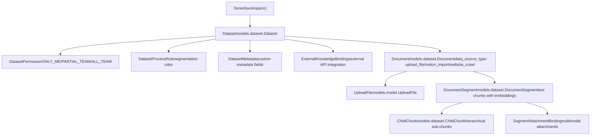
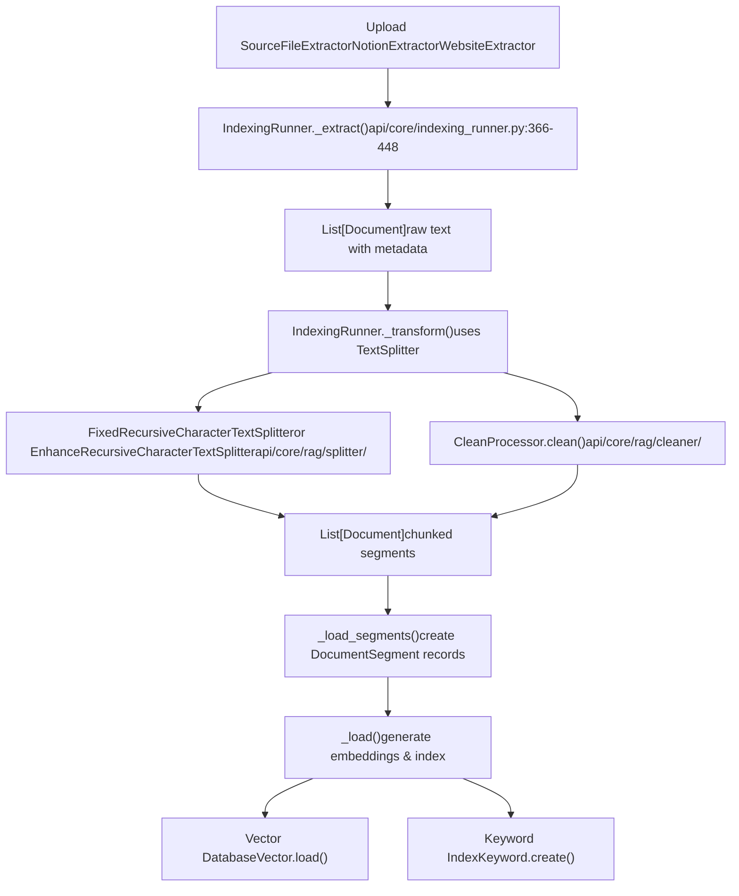
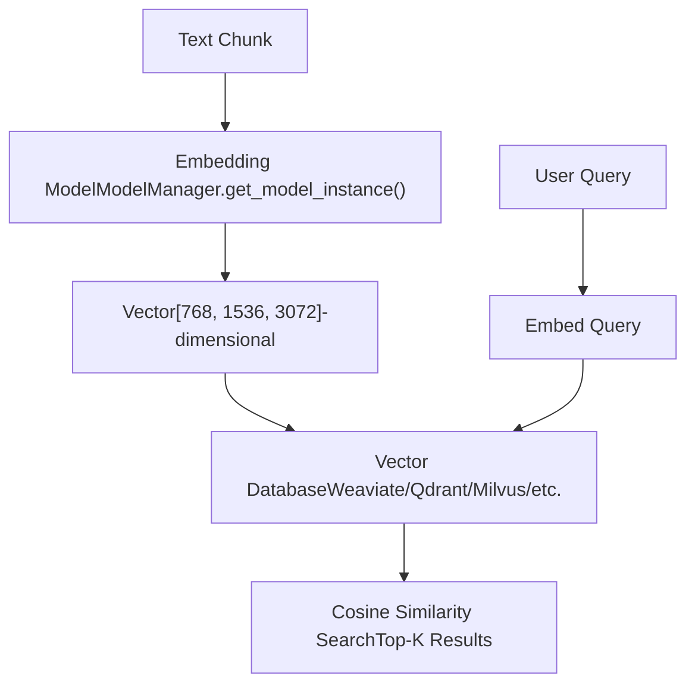
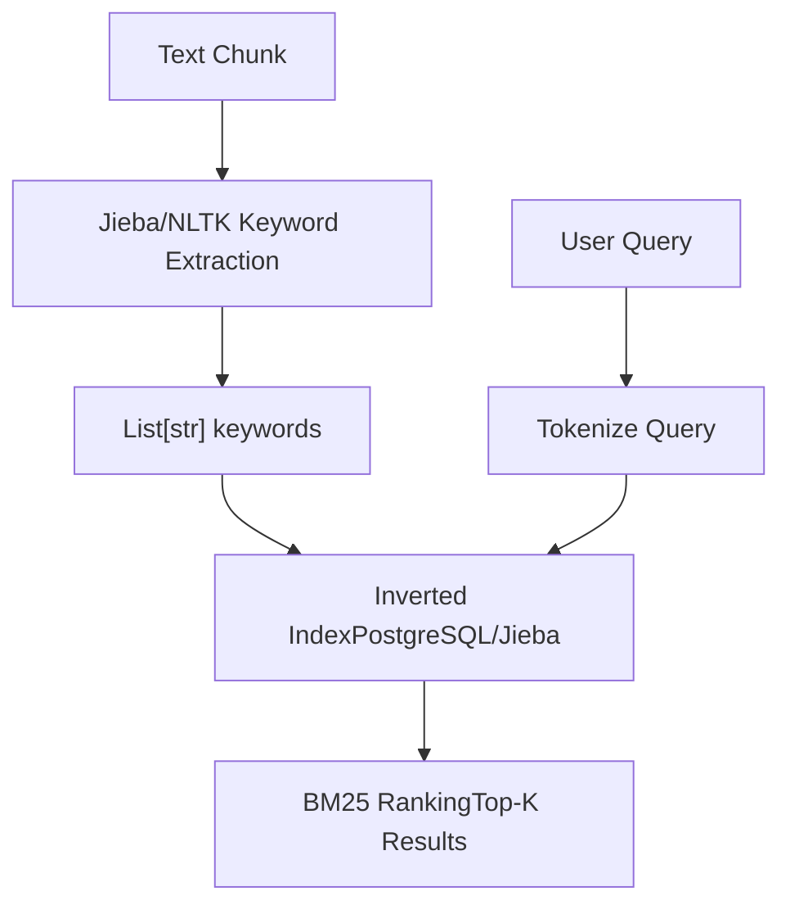
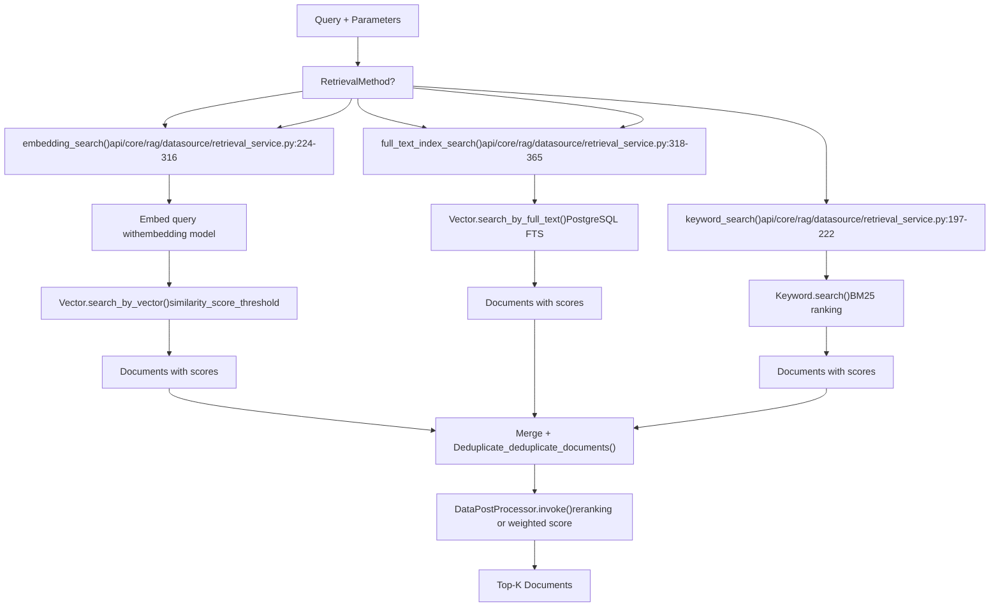
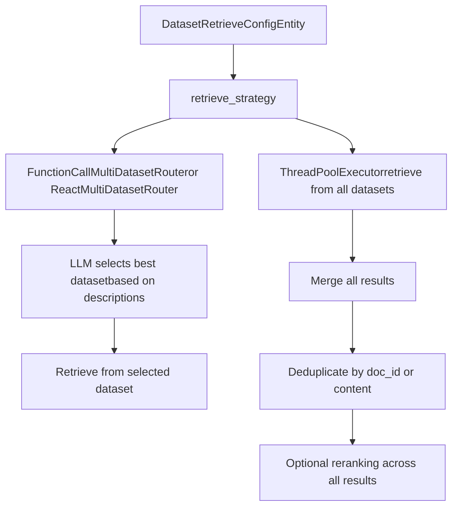
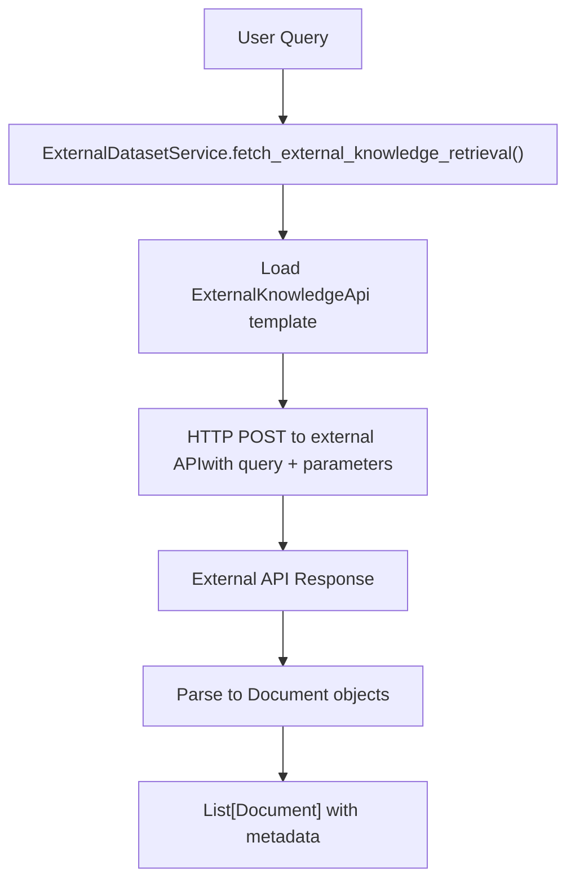
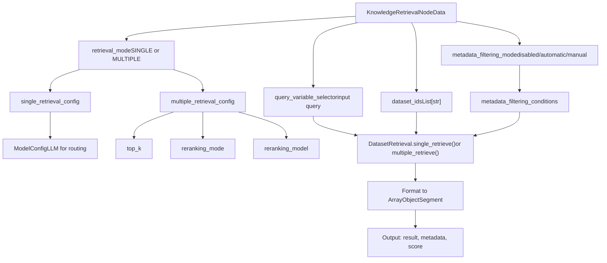
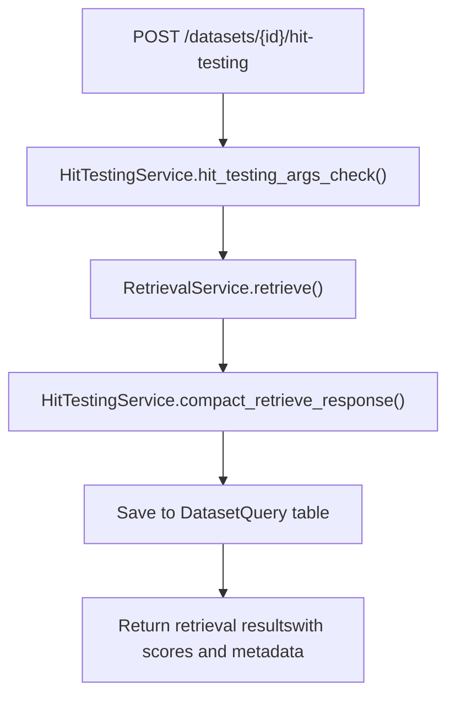
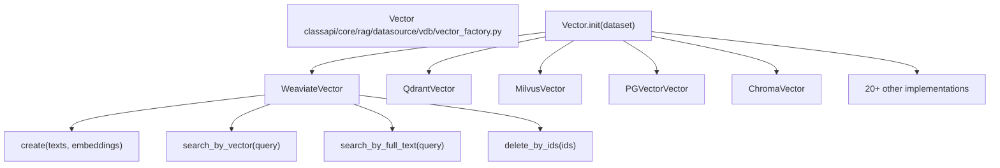

# Knowledge Base and RAG System

Relevant source files

-   [api/controllers/console/datasets/data\_source.py](https://github.com/langgenius/dify/blob/92dbc94f/api/controllers/console/datasets/data_source.py)
-   [api/controllers/console/datasets/datasets\_document.py](https://github.com/langgenius/dify/blob/92dbc94f/api/controllers/console/datasets/datasets_document.py)
-   [api/controllers/console/datasets/datasets\_segments.py](https://github.com/langgenius/dify/blob/92dbc94f/api/controllers/console/datasets/datasets_segments.py)
-   [api/controllers/console/datasets/external.py](https://github.com/langgenius/dify/blob/92dbc94f/api/controllers/console/datasets/external.py)
-   [api/controllers/console/datasets/hit\_testing.py](https://github.com/langgenius/dify/blob/92dbc94f/api/controllers/console/datasets/hit_testing.py)
-   [api/controllers/console/datasets/metadata.py](https://github.com/langgenius/dify/blob/92dbc94f/api/controllers/console/datasets/metadata.py)
-   [api/controllers/console/tag/tags.py](https://github.com/langgenius/dify/blob/92dbc94f/api/controllers/console/tag/tags.py)
-   [api/controllers/service\_api/\_\_init\_\_.py](https://github.com/langgenius/dify/blob/92dbc94f/api/controllers/service_api/__init__.py)
-   [api/controllers/service\_api/app/annotation.py](https://github.com/langgenius/dify/blob/92dbc94f/api/controllers/service_api/app/annotation.py)
-   [api/controllers/service\_api/dataset/dataset.py](https://github.com/langgenius/dify/blob/92dbc94f/api/controllers/service_api/dataset/dataset.py)
-   [api/controllers/service\_api/dataset/document.py](https://github.com/langgenius/dify/blob/92dbc94f/api/controllers/service_api/dataset/document.py)
-   [api/controllers/service\_api/dataset/metadata.py](https://github.com/langgenius/dify/blob/92dbc94f/api/controllers/service_api/dataset/metadata.py)
-   [api/controllers/service\_api/dataset/segment.py](https://github.com/langgenius/dify/blob/92dbc94f/api/controllers/service_api/dataset/segment.py)
-   [api/core/indexing\_runner.py](https://github.com/langgenius/dify/blob/92dbc94f/api/core/indexing_runner.py)
-   [api/core/rag/datasource/retrieval\_service.py](https://github.com/langgenius/dify/blob/92dbc94f/api/core/rag/datasource/retrieval_service.py)
-   [api/core/rag/entities/metadata\_entities.py](https://github.com/langgenius/dify/blob/92dbc94f/api/core/rag/entities/metadata_entities.py)
-   [api/core/rag/extractor/entity/extract\_setting.py](https://github.com/langgenius/dify/blob/92dbc94f/api/core/rag/extractor/entity/extract_setting.py)
-   [api/core/rag/extractor/notion\_extractor.py](https://github.com/langgenius/dify/blob/92dbc94f/api/core/rag/extractor/notion_extractor.py)
-   [api/core/rag/retrieval/dataset\_retrieval.py](https://github.com/langgenius/dify/blob/92dbc94f/api/core/rag/retrieval/dataset_retrieval.py)
-   [api/core/workflow/nodes/knowledge\_retrieval/entities.py](https://github.com/langgenius/dify/blob/92dbc94f/api/core/workflow/nodes/knowledge_retrieval/entities.py)
-   [api/core/workflow/nodes/knowledge\_retrieval/knowledge\_retrieval\_node.py](https://github.com/langgenius/dify/blob/92dbc94f/api/core/workflow/nodes/knowledge_retrieval/knowledge_retrieval_node.py)
-   [api/core/workflow/nodes/list\_operator/entities.py](https://github.com/langgenius/dify/blob/92dbc94f/api/core/workflow/nodes/list_operator/entities.py)
-   [api/core/workflow/nodes/list\_operator/exc.py](https://github.com/langgenius/dify/blob/92dbc94f/api/core/workflow/nodes/list_operator/exc.py)
-   [api/core/workflow/nodes/list\_operator/node.py](https://github.com/langgenius/dify/blob/92dbc94f/api/core/workflow/nodes/list_operator/node.py)
-   [api/core/workflow/nodes/question\_classifier/entities.py](https://github.com/langgenius/dify/blob/92dbc94f/api/core/workflow/nodes/question_classifier/entities.py)
-   [api/services/dataset\_service.py](https://github.com/langgenius/dify/blob/92dbc94f/api/services/dataset_service.py)
-   [api/services/hit\_testing\_service.py](https://github.com/langgenius/dify/blob/92dbc94f/api/services/hit_testing_service.py)
-   [api/tests/unit\_tests/controllers/console/datasets/\_\_init\_\_.py](https://github.com/langgenius/dify/blob/92dbc94f/api/tests/unit_tests/controllers/console/datasets/__init__.py)
-   [api/tests/unit\_tests/controllers/console/datasets/test\_external\_dataset\_payload.py](https://github.com/langgenius/dify/blob/92dbc94f/api/tests/unit_tests/controllers/console/datasets/test_external_dataset_payload.py)
-   [api/tests/unit\_tests/core/datasource/test\_notion\_provider.py](https://github.com/langgenius/dify/blob/92dbc94f/api/tests/unit_tests/core/datasource/test_notion_provider.py)
-   [api/tests/unit\_tests/core/rag/extractor/\_\_init\_\_.py](https://github.com/langgenius/dify/blob/92dbc94f/api/tests/unit_tests/core/rag/extractor/__init__.py)
-   [api/tests/unit\_tests/core/rag/extractor/test\_notion\_extractor.py](https://github.com/langgenius/dify/blob/92dbc94f/api/tests/unit_tests/core/rag/extractor/test_notion_extractor.py)
-   [api/tests/unit\_tests/core/rag/retrieval/\_\_init\_\_.py](https://github.com/langgenius/dify/blob/92dbc94f/api/tests/unit_tests/core/rag/retrieval/__init__.py)
-   [api/tests/unit\_tests/core/rag/retrieval/test\_dataset\_retrieval.py](https://github.com/langgenius/dify/blob/92dbc94f/api/tests/unit_tests/core/rag/retrieval/test_dataset_retrieval.py)
-   [api/tests/unit\_tests/core/workflow/nodes/test\_list\_operator.py](https://github.com/langgenius/dify/blob/92dbc94f/api/tests/unit_tests/core/workflow/nodes/test_list_operator.py)
-   [api/tests/unit\_tests/services/test\_metadata\_bug\_complete.py](https://github.com/langgenius/dify/blob/92dbc94f/api/tests/unit_tests/services/test_metadata_bug_complete.py)
-   [api/tests/unit\_tests/services/test\_metadata\_nullable\_bug.py](https://github.com/langgenius/dify/blob/92dbc94f/api/tests/unit_tests/services/test_metadata_nullable_bug.py)
-   [web/app/components/develop/ApiServer.tsx](https://github.com/langgenius/dify/blob/92dbc94f/web/app/components/develop/ApiServer.tsx)
-   [web/app/components/develop/doc.tsx](https://github.com/langgenius/dify/blob/92dbc94f/web/app/components/develop/doc.tsx)
-   [web/app/components/develop/index.tsx](https://github.com/langgenius/dify/blob/92dbc94f/web/app/components/develop/index.tsx)
-   [web/app/components/workflow/nodes/knowledge-retrieval/components/metadata/condition-list/utils.ts](https://github.com/langgenius/dify/blob/92dbc94f/web/app/components/workflow/nodes/knowledge-retrieval/components/metadata/condition-list/utils.ts)
-   [web/app/components/workflow/nodes/knowledge-retrieval/components/metadata/metadata-icon.tsx](https://github.com/langgenius/dify/blob/92dbc94f/web/app/components/workflow/nodes/knowledge-retrieval/components/metadata/metadata-icon.tsx)
-   [web/app/components/workflow/nodes/list-operator/components/extract-input.tsx](https://github.com/langgenius/dify/blob/92dbc94f/web/app/components/workflow/nodes/list-operator/components/extract-input.tsx)
-   [web/app/components/workflow/nodes/list-operator/components/filter-condition.tsx](https://github.com/langgenius/dify/blob/92dbc94f/web/app/components/workflow/nodes/list-operator/components/filter-condition.tsx)
-   [web/app/components/workflow/nodes/list-operator/default.ts](https://github.com/langgenius/dify/blob/92dbc94f/web/app/components/workflow/nodes/list-operator/default.ts)
-   [web/app/components/workflow/nodes/list-operator/panel.tsx](https://github.com/langgenius/dify/blob/92dbc94f/web/app/components/workflow/nodes/list-operator/panel.tsx)
-   [web/app/components/workflow/nodes/list-operator/types.ts](https://github.com/langgenius/dify/blob/92dbc94f/web/app/components/workflow/nodes/list-operator/types.ts)
-   [web/app/components/workflow/nodes/utils.ts](https://github.com/langgenius/dify/blob/92dbc94f/web/app/components/workflow/nodes/utils.ts)

This document describes the Retrieval-Augmented Generation (RAG) system in Dify, which enables applications to retrieve and use information from knowledge bases. It covers the data models for datasets and documents, the document indexing pipeline, retrieval strategies, metadata filtering, and integration points with workflows and APIs.

For information about workflow execution that consumes retrieved knowledge, see [Workflow System and Node Execution](/langgenius/dify/5-workflow-system-and-node-execution). For API endpoints that expose RAG functionality, see [Service APIs](/langgenius/dify/8-service-apis).

---

## Data Model Hierarchy

The knowledge base system uses a four-tier data structure organized as: **Dataset → Document → DocumentSegment → ChildChunk**.


**Sources**: [api/services/dataset\_service.py36-51](https://github.com/langgenius/dify/blob/92dbc94f/api/services/dataset_service.py#L36-L51) [api/models/dataset.py](https://github.com/langgenius/dify/blob/92dbc94f/api/models/dataset.py)

### Dataset Model

The `Dataset` model represents a knowledge base and contains the following key attributes:

| Attribute | Type | Description |
| --- | --- | --- |
| `indexing_technique` | `str` | `"high_quality"` (vector) or `"economy"` (keyword) |
| `embedding_model_provider` | `str` | Provider for embeddings (e.g., `"openai"`) |
| `embedding_model` | `str` | Model name (e.g., `"text-embedding-3-small"`) |
| `retrieval_model` | `dict` | Retrieval configuration (search method, top\_k, reranking) |
| `permission` | `DatasetPermissionEnum` | Access control: `ONLY_ME`, `PARTIAL_TEAM`, `ALL_TEAM` |
| `provider` | `str` | `"vendor"` (Dify-managed) or `"external"` (API-based) |
| `doc_form` | `str` | Document structure: `text_model`, `qa_model`, or `parent_child_index` |

**Sources**: [api/services/dataset\_service.py243-273](https://github.com/langgenius/dify/blob/92dbc94f/api/services/dataset_service.py#L243-L273) [api/models/dataset.py](https://github.com/langgenius/dify/blob/92dbc94f/api/models/dataset.py)

### Document Model

Each `Document` represents a single source file or import and tracks indexing progress:

| Attribute | Type | Description |
| --- | --- | --- |
| `data_source_type` | `str` | `"upload_file"`, `"notion_import"`, `"website_crawl"` |
| `indexing_status` | `str` | `"waiting"`, `"parsing"`, `"splitting"`, `"indexing"`, `"completed"`, `"error"` |
| `data_source_info` | `dict` | Source-specific metadata (file IDs, Notion page IDs, URLs) |
| `dataset_process_rule_id` | `str` | Links to processing rules (chunking strategy) |
| `doc_form` | `str` | Inherited from dataset; determines segment structure |

**Sources**: [api/core/indexing\_runner.py366-448](https://github.com/langgenius/dify/blob/92dbc94f/api/core/indexing_runner.py#L366-L448) [api/models/dataset.py](https://github.com/langgenius/dify/blob/92dbc94f/api/models/dataset.py)

### DocumentSegment Model

`DocumentSegment` represents indexed text chunks with their vector embeddings:

| Attribute | Type | Description |
| --- | --- | --- |
| `content` | `str` | The actual text chunk |
| `index_node_id` | `str` | Unique identifier for vector database |
| `index_node_hash` | `str` | Content hash for deduplication |
| `keywords` | `list[str]` | Extracted keywords for keyword search |
| `enabled` | `bool` | Whether segment is active in retrieval |
| `status` | `str` | `"waiting"`, `"indexing"`, `"completed"` |
| `hit_count` | `int` | Number of times retrieved |

**Sources**: [api/models/dataset.py](https://github.com/langgenius/dify/blob/92dbc94f/api/models/dataset.py) [api/core/rag/datasource/retrieval\_service.py372-527](https://github.com/langgenius/dify/blob/92dbc94f/api/core/rag/datasource/retrieval_service.py#L372-L527)

### ChildChunk Model (Hierarchical Indexing)

For `parent_child_index` mode, `ChildChunk` stores sub-segments of a parent segment:

| Attribute | Type | Description |
| --- | --- | --- |
| `segment_id` | `str` | Parent DocumentSegment ID |
| `content` | `str` | Child chunk text |
| `index_node_id` | `str` | Unique ID in vector database |
| `position` | `int` | Order within parent segment |

**Sources**: [api/models/dataset.py](https://github.com/langgenius/dify/blob/92dbc94f/api/models/dataset.py) [api/core/indexing\_runner.py231-246](https://github.com/langgenius/dify/blob/92dbc94f/api/core/indexing_runner.py#L231-L246)

---

## Document Indexing Pipeline

The `IndexingRunner` class orchestrates the ETL process from raw documents to searchable segments.


**Sources**: [api/core/indexing\_runner.py64-123](https://github.com/langgenius/dify/blob/92dbc94f/api/core/indexing_runner.py#L64-L123) [api/core/indexing\_runner.py366-448](https://github.com/langgenius/dify/blob/92dbc94f/api/core/indexing_runner.py#L366-L448) [api/core/indexing\_runner.py550-633](https://github.com/langgenius/dify/blob/92dbc94f/api/core/indexing_runner.py#L550-L633)

### Extract Phase

The extraction phase converts various data sources into raw `Document` objects:

**Supported Data Sources**:

-   **Upload File**: Handled by `FileExtractor` for PDFs, DOCX, TXT, Markdown, etc.
-   **Notion**: `NotionExtractor` retrieves pages/databases via Notion API with OAuth credentials
-   **Website**: Web crawler using Firecrawl or Jina APIs

The `_extract()` method in `IndexingRunner`:

1.  Determines data source type from `Document.data_source_type`
2.  Creates appropriate `ExtractSetting` entity
3.  Calls `index_processor.extract()` to get raw text
4.  Updates document status to `"splitting"`

**Sources**: [api/core/indexing\_runner.py366-448](https://github.com/langgenius/dify/blob/92dbc94f/api/core/indexing_runner.py#L366-L448) [api/core/rag/extractor/notion\_extractor.py69-88](https://github.com/langgenius/dify/blob/92dbc94f/api/core/rag/extractor/notion_extractor.py#L69-L88)

### Transform Phase

The transform phase splits raw text into chunks and cleans content:

**Text Splitting Strategies**:

| Mode | Splitter | Configuration |
| --- | --- | --- |
| `automatic` | `EnhanceRecursiveCharacterTextSplitter` | Default: 500 tokens, 50 overlap |
| `custom` | `FixedRecursiveCharacterTextSplitter` | User-defined: chunk\_size, separator, overlap |
| `hierarchical` | `FixedRecursiveCharacterTextSplitter` | Creates parent segments with child chunks |

The `_get_splitter()` method selects the appropriate splitter based on `DatasetProcessRule.mode`:

**Sources**: [api/core/indexing\_runner.py459-497](https://github.com/langgenius/dify/blob/92dbc94f/api/core/indexing_runner.py#L459-L497) [api/core/rag/splitter/fixed\_text\_splitter.py](https://github.com/langgenius/dify/blob/92dbc94f/api/core/rag/splitter/fixed_text_splitter.py)

**Text Cleaning**:

The `CleanProcessor` applies rules from `DatasetProcessRule`:

-   Remove extra spaces
-   Remove URLs and emails
-   Replace consecutive spaces/newlines
-   Custom regex patterns

**Sources**: [api/core/indexing\_runner.py530-541](https://github.com/langgenius/dify/blob/92dbc94f/api/core/indexing_runner.py#L530-L541) [api/core/rag/cleaner/clean\_processor.py](https://github.com/langgenius/dify/blob/92dbc94f/api/core/rag/cleaner/clean_processor.py)

### Load Phase

The load phase persists segments to the database and creates vector/keyword indices:

1.  **Create DocumentSegment Records**: `_load_segments()` saves each chunk with metadata
2.  **Generate Embeddings** (high\_quality mode): Calls embedding model API via `ModelManager`
3.  **Index in Vector Database**: `Vector.load()` stores embeddings in configured VDB
4.  **Create Keyword Index** (economy mode): `Keyword.create()` builds inverted index

**Concurrency**: The load phase uses `ThreadPoolExecutor` (max 10 workers) to parallelize embedding generation and vector indexing.

**Sources**: [api/core/indexing\_runner.py550-633](https://github.com/langgenius/dify/blob/92dbc94f/api/core/indexing_runner.py#L550-L633) [api/core/indexing\_runner.py660-704](https://github.com/langgenius/dify/blob/92dbc94f/api/core/indexing_runner.py#L660-L704)

---

## Indexing Techniques and Configuration

Dify supports two indexing techniques with different trade-offs:

### High Quality Indexing

**Technique**: `indexing_technique="high_quality"`

Uses vector embeddings for semantic search:


**Required Configuration**:

-   `embedding_model_provider`: e.g., `"openai"`, `"azure_openai"`
-   `embedding_model`: e.g., `"text-embedding-3-small"`

**Validation**: `DatasetService.check_embedding_model_setting()` verifies model availability before indexing.

**Sources**: [api/services/dataset\_service.py353-368](https://github.com/langgenius/dify/blob/92dbc94f/api/services/dataset_service.py#L353-L368) [api/core/indexing\_runner.py562-568](https://github.com/langgenius/dify/blob/92dbc94f/api/core/indexing_runner.py#L562-L568)

### Economy Indexing

**Technique**: `indexing_technique="economy"`

Uses keyword extraction and inverted index:


**No embedding model required**. Uses `JiebaKeywordTableHandler` for Chinese or standard tokenization for other languages.

**Sources**: [api/services/dataset\_service.py680-684](https://github.com/langgenius/dify/blob/92dbc94f/api/services/dataset_service.py#L680-L684) [api/core/indexing\_runner.py636-658](https://github.com/langgenius/dify/blob/92dbc94f/api/core/indexing_runner.py#L636-L658)

---

## Retrieval Methods and Strategies

The `RetrievalService` class implements multiple retrieval methods that can be combined.


**Sources**: [api/core/rag/datasource/retrieval\_service.py46-122](https://github.com/langgenius/dify/blob/92dbc94f/api/core/rag/datasource/retrieval_service.py#L46-L122) [api/core/rag/retrieval/retrieval\_methods.py](https://github.com/langgenius/dify/blob/92dbc94f/api/core/rag/retrieval/retrieval_methods.py)

### Retrieval Configuration

The `retrieval_model` dictionary stored in `Dataset.retrieval_model` configures search behavior:

```
{
    "search_method": "semantic_search",  # or "keyword_search", "full_text_search", "hybrid_search"
    "reranking_enable": True,
    "reranking_model": {
        "reranking_provider_name": "cohere",
        "reranking_model_name": "rerank-english-v3.0"
    },
    "top_k": 4,
    "score_threshold_enabled": True,
    "score_threshold": 0.7,
    "reranking_mode": "reranking_model"  # or "weighted_score"
}
```
**Sources**: [api/core/rag/retrieval/dataset\_retrieval.py68-74](https://github.com/langgenius/dify/blob/92dbc94f/api/core/rag/retrieval/dataset_retrieval.py#L68-L74) [api/core/rag/datasource/retrieval\_service.py32-38](https://github.com/langgenius/dify/blob/92dbc94f/api/core/rag/datasource/retrieval_service.py#L32-L38)

### Deduplication Strategy

The `_deduplicate_documents()` method handles duplicate chunks:

**Rules**:

1.  For Dify documents with `doc_id` metadata: Keep highest score among duplicates
2.  For content-based deduplication: Keep first occurrence by `(provider, page_content)` tuple
3.  Preserves first-seen order

**Sources**: [api/core/rag/datasource/retrieval\_service.py148-190](https://github.com/langgenius/dify/blob/92dbc94f/api/core/rag/datasource/retrieval_service.py#L148-L190)

### Reranking

**Two reranking modes**:

| Mode | Description | Implementation |
| --- | --- | --- |
| `reranking_model` | Uses external rerank API (Cohere, Jina, etc.) | `DataPostProcessor.invoke()` with `RerankMode.RERANKING_MODEL` |
| `weighted_score` | Combines vector and keyword scores with weights | `DataPostProcessor.invoke()` with `RerankMode.WEIGHTED_SCORE` |

**Weighted Score Formula**:

```
final_score = (vector_score * vector_weight) + (keyword_score * keyword_weight)
```
**Sources**: [api/core/rag/data\_post\_processor/data\_post\_processor.py](https://github.com/langgenius/dify/blob/92dbc94f/api/core/rag/data_post_processor/data_post_processor.py) [api/core/rag/datasource/retrieval\_service.py271-311](https://github.com/langgenius/dify/blob/92dbc94f/api/core/rag/datasource/retrieval_service.py#L271-L311)

---

## Dataset Permissions

Dify implements three-tier permission model via `DatasetPermissionEnum`:

### Permission Types

| Permission | Description | Access Control |
| --- | --- | --- |
| `ONLY_ME` | Private to creator | Only `created_by` user can access |
| `PARTIAL_TEAM` | Shared with specific users | Users in `DatasetPermission` table can access |
| `ALL_TEAM` | Shared with all workspace members | All tenant members can access |

**Sources**: [api/models/dataset.py](https://github.com/langgenius/dify/blob/92dbc94f/api/models/dataset.py) [api/services/dataset\_service.py99-167](https://github.com/langgenius/dify/blob/92dbc94f/api/services/dataset_service.py#L99-L167)

### Permission Checking

The `DatasetService.check_dataset_permission()` method enforces access control:

```
# api/services/dataset_service.py:855-931
def check_dataset_permission(dataset, user):
    if user.current_role == TenantAccountRole.DATASET_OPERATOR:
        # Dataset operators need explicit permission
        dataset_permission = db.session.query(DatasetPermission)\
            .filter_by(account_id=user.id, dataset_id=dataset.id).first()
        if not dataset_permission:
            raise NoPermissionError()
    elif dataset.permission == DatasetPermissionEnum.ONLY_ME:
        if dataset.created_by != user.id:
            raise NoPermissionError()
    elif dataset.permission == DatasetPermissionEnum.PARTIAL_TEAM:
        dataset_permission = db.session.query(DatasetPermission)\
            .filter_by(account_id=user.id, dataset_id=dataset.id).first()
        if not dataset_permission:
            raise NoPermissionError()
```
**Sources**: [api/services/dataset\_service.py855-931](https://github.com/langgenius/dify/blob/92dbc94f/api/services/dataset_service.py#L855-L931)

### Role Hierarchy

| Role | Dataset Creation | Read Access | Write Access |
| --- | --- | --- | --- |
| `OWNER` | ✓ | All datasets | All datasets |
| `ADMIN` | ✓ | Permission-based | Permission-based |
| `EDITOR` | ✓ | Permission-based | Permission-based |
| `NORMAL` | ✗ | Permission-based | ✗ |
| `DATASET_OPERATOR` | ✓ | Explicit permission only | Explicit permission only |

**Sources**: [api/services/dataset\_service.py99-167](https://github.com/langgenius/dify/blob/92dbc94f/api/services/dataset_service.py#L99-L167) [api/models/account.py](https://github.com/langgenius/dify/blob/92dbc94f/api/models/account.py)

---

## Metadata Filtering

Metadata filtering allows restricting retrieval to documents matching specific criteria. Two modes are supported:

### Manual Metadata Filtering

Users explicitly define metadata conditions in the retrieval configuration:

```
metadata_filtering_conditions = {
    "logical_operator": "and",  # or "or"
    "conditions": [
        {
            "name": "category",
            "comparison_operator": "is",  # contains, is, is not, in, not in, etc.
            "value": "technical"
        },
        {
            "name": "publish_date",
            "comparison_operator": ">=",
            "value": "2024-01-01"
        }
    ]
}
```
**Supported Operators**: `contains`, `not contains`, `is`, `is not`, `empty`, `not empty`, `in`, `not in`, `<`, `>`, `<=`, `>=`

**Sources**: [api/core/workflow/nodes/knowledge\_retrieval/entities.py67-92](https://github.com/langgenius/dify/blob/92dbc94f/api/core/workflow/nodes/knowledge_retrieval/entities.py#L67-L92) [api/core/rag/retrieval/dataset\_retrieval.py507-526](https://github.com/langgenius/dify/blob/92dbc94f/api/core/rag/retrieval/dataset_retrieval.py#L507-L526)

### Automatic Metadata Filtering

Uses LLM to extract metadata filters from user query:

**Process**:

1.  Query is sent to LLM with prompt containing available metadata fields
2.  LLM returns JSON with metadata conditions
3.  Conditions are parsed and applied to retrieval

**Prompt Templates**: Defined in `METADATA_FILTER_SYSTEM_PROMPT`, `METADATA_FILTER_USER_PROMPT_1`, etc.

**Sources**: [api/core/rag/retrieval/dataset\_retrieval.py539-669](https://github.com/langgenius/dify/blob/92dbc94f/api/core/rag/retrieval/dataset_retrieval.py#L539-L669) [api/core/rag/retrieval/template\_prompts.py](https://github.com/langgenius/dify/blob/92dbc94f/api/core/rag/retrieval/template_prompts.py)

### Metadata Storage

Custom metadata is stored in `DatasetMetadata` table:

| Field | Type | Description |
| --- | --- | --- |
| `dataset_id` | `str` | Associated dataset |
| `name` | `str` | Metadata field name |
| `type` | `str` | `string`, `number`, `date`, `boolean`, `select` |
| `options` | `list[str]` | For `select` type fields |
| `automatic_extraction` | `bool` | Whether LLM auto-extracts values during indexing |

**Sources**: [api/models/dataset.py](https://github.com/langgenius/dify/blob/92dbc94f/api/models/dataset.py) [api/services/metadata\_service.py](https://github.com/langgenius/dify/blob/92dbc94f/api/services/metadata_service.py)

---

## Multi-Dataset Retrieval

The `DatasetRetrieval` class supports querying multiple datasets simultaneously.


**Sources**: [api/core/rag/retrieval/dataset\_retrieval.py180-213](https://github.com/langgenius/dify/blob/92dbc94f/api/core/rag/retrieval/dataset_retrieval.py#L180-L213) [api/core/rag/retrieval/dataset\_retrieval.py464-587](https://github.com/langgenius/dify/blob/92dbc94f/api/core/rag/retrieval/dataset_retrieval.py#L464-L587)

### Single Dataset Strategy

Uses LLM routing to select the most relevant dataset:

**Router Types**:

1.  **FunctionCallMultiDatasetRouter**: Uses function calling to select dataset
2.  **ReactMultiDatasetRouter**: Uses ReAct prompting pattern

Each dataset's description is provided to the LLM as a tool/option, and the LLM selects which dataset to query.

**Sources**: [api/core/rag/retrieval/dataset\_retrieval.py332-462](https://github.com/langgenius/dify/blob/92dbc94f/api/core/rag/retrieval/dataset_retrieval.py#L332-L462) [api/core/rag/retrieval/router/multi\_dataset\_function\_call\_router.py](https://github.com/langgenius/dify/blob/92dbc94f/api/core/rag/retrieval/router/multi_dataset_function_call_router.py) [api/core/rag/retrieval/router/multi\_dataset\_react\_route.py](https://github.com/langgenius/dify/blob/92dbc94f/api/core/rag/retrieval/router/multi_dataset_react_route.py)

### Multiple Dataset Strategy

Retrieves from all datasets in parallel:

**Process**:

1.  Create thread for each dataset retrieval
2.  Execute retrievals concurrently via `ThreadPoolExecutor`
3.  Merge results from all datasets
4.  Deduplicate across datasets
5.  Optionally rerank combined results
6.  Select top-K from combined pool

**Weighted Score Requirements**: When using `weighted_score` reranking mode, all datasets must use the same embedding model.

**Sources**: [api/core/rag/retrieval/dataset\_retrieval.py464-587](https://github.com/langgenius/dify/blob/92dbc94f/api/core/rag/retrieval/dataset_retrieval.py#L464-L587)

---

## External Knowledge Bases

Dify supports integrating external knowledge base APIs as datasets with `provider="external"`.

### External Dataset Configuration

```
{
    "provider": "external",
    "external_knowledge_api_id": "uuid",  # Links to ExternalKnowledgeApi
    "external_knowledge_id": "string",     # External system's knowledge base ID
    "retrieval_model": {
        "top_k": 5,
        "score_threshold": 0.5,
        # ... external-specific parameters
    }
}
```
**Sources**: [api/services/dataset\_service.py257-273](https://github.com/langgenius/dify/blob/92dbc94f/api/services/dataset_service.py#L257-L273) [api/models/dataset.py](https://github.com/langgenius/dify/blob/92dbc94f/api/models/dataset.py)

### External Retrieval Flow


**API Request Format**:

```
{
    "knowledge_id": "external_kb_id",
    "query": "user query text",
    "retrieval_setting": {
        "top_k": 5,
        "score_threshold": 0.5
    }
}
```
**Expected Response Format**:

```
{
    "records": [
        {
            "content": "retrieved text",
            "score": 0.95,
            "title": "document title",
            "metadata": { ... }
        }
    ]
}
```
**Sources**: [api/services/external\_knowledge\_service.py](https://github.com/langgenius/dify/blob/92dbc94f/api/services/external_knowledge_service.py) [api/core/rag/retrieval/dataset\_retrieval.py384-403](https://github.com/langgenius/dify/blob/92dbc94f/api/core/rag/retrieval/dataset_retrieval.py#L384-L403)

---

## Workflow Integration

The `KnowledgeRetrievalNode` integrates RAG into workflows.


**Sources**: [api/core/workflow/nodes/knowledge\_retrieval/knowledge\_retrieval\_node.py123-221](https://github.com/langgenius/dify/blob/92dbc94f/api/core/workflow/nodes/knowledge_retrieval/knowledge_retrieval_node.py#L123-L221) [api/core/workflow/nodes/knowledge\_retrieval/entities.py](https://github.com/langgenius/dify/blob/92dbc94f/api/core/workflow/nodes/knowledge_retrieval/entities.py)

### Node Output Format

The node outputs an `ArrayObjectSegment` where each element contains:

```
{
    "metadata": {
        "_source": "knowledge",
        "dataset_id": "uuid",
        "dataset_name": "string",
        "document_id": "uuid",
        "document_name": "string",
        "segment_id": "uuid",
        "score": 0.95,
        "position": 1,
        "child_chunks": [...]  # for parent-child index
    },
    "title": "document name",
    "content": "retrieved text",
    "files": [...]  # for multimodal segments
}
```
**Sources**: [api/core/workflow/nodes/knowledge\_retrieval/knowledge\_retrieval\_node.py354-431](https://github.com/langgenius/dify/blob/92dbc94f/api/core/workflow/nodes/knowledge_retrieval/knowledge_retrieval_node.py#L354-L431)

### Rate Limiting

Knowledge retrieval is rate-limited via `FeatureService.get_knowledge_rate_limit()`:

**Implementation**:

-   Uses Redis sorted set with timestamps
-   Sliding window of 60 seconds
-   Limit varies by subscription plan
-   Records violations in `RateLimitLog` table

**Sources**: [api/core/workflow/nodes/knowledge\_retrieval/knowledge\_retrieval\_node.py161-182](https://github.com/langgenius/dify/blob/92dbc94f/api/core/workflow/nodes/knowledge_retrieval/knowledge_retrieval_node.py#L161-L182)

---

## API Endpoints

### Dataset Management APIs

**Console API** (`/console/api`):

| Endpoint | Method | Purpose |
| --- | --- | --- |
| `/datasets` | GET | List datasets with permissions |
| `/datasets` | POST | Create new dataset |
| `/datasets/<id>` | GET | Get dataset details |
| `/datasets/<id>` | PATCH | Update dataset configuration |
| `/datasets/<id>` | DELETE | Delete dataset |
| `/datasets/<id>/documents` | GET | List documents in dataset |
| `/datasets/<id>/documents` | POST | Upload/import documents |
| `/datasets/<id>/hit-testing` | POST | Test retrieval with query |

**Sources**: [api/controllers/console/datasets/datasets.py](https://github.com/langgenius/dify/blob/92dbc94f/api/controllers/console/datasets/datasets.py) [api/controllers/console/datasets/datasets\_document.py](https://github.com/langgenius/dify/blob/92dbc94f/api/controllers/console/datasets/datasets_document.py) [api/controllers/console/datasets/hit\_testing.py](https://github.com/langgenius/dify/blob/92dbc94f/api/controllers/console/datasets/hit_testing.py)

**Service API** (`/v1`):

Same endpoints available with API key authentication for programmatic access.

**Sources**: [api/controllers/service\_api/dataset/dataset.py](https://github.com/langgenius/dify/blob/92dbc94f/api/controllers/service_api/dataset/dataset.py) [api/controllers/service\_api/dataset/document.py](https://github.com/langgenius/dify/blob/92dbc94f/api/controllers/service_api/dataset/document.py) [api/controllers/service\_api/dataset/hit\_testing.py](https://github.com/langgenius/dify/blob/92dbc94f/api/controllers/service_api/dataset/hit_testing.py)

### Document Segment APIs

| Endpoint | Method | Purpose |
| --- | --- | --- |
| `/datasets/<id>/documents/<doc_id>/segments` | GET | List segments |
| `/datasets/<id>/documents/<doc_id>/segments` | POST | Create segments manually |
| `/datasets/<id>/documents/<doc_id>/segments/<seg_id>` | PATCH | Update segment |
| `/datasets/<id>/documents/<doc_id>/segments/<seg_id>` | DELETE | Delete segment |
| `/datasets/<id>/documents/<doc_id>/segment/<action>` | PATCH | Batch enable/disable segments |

**Actions**: `enable`, `disable`, `archive`, `un_archive`

**Sources**: [api/controllers/console/datasets/datasets\_segments.py](https://github.com/langgenius/dify/blob/92dbc94f/api/controllers/console/datasets/datasets_segments.py) [api/controllers/service\_api/dataset/segment.py](https://github.com/langgenius/dify/blob/92dbc94f/api/controllers/service_api/dataset/segment.py)

### Child Chunk APIs (Hierarchical Indexing)

| Endpoint | Method | Purpose |
| --- | --- | --- |
| `/datasets/<id>/documents/<doc_id>/segments/<seg_id>/child-chunks` | GET | List child chunks |
| `/datasets/<id>/documents/<doc_id>/segments/<seg_id>/child-chunks` | POST | Create child chunk |
| `/datasets/<id>/documents/<doc_id>/segments/<seg_id>/child-chunks/<chunk_id>` | PATCH | Update child chunk |
| `/datasets/<id>/documents/<doc_id>/segments/<seg_id>/child-chunks/<chunk_id>` | DELETE | Delete child chunk |

**Sources**: [api/controllers/console/datasets/datasets\_segments.py587-878](https://github.com/langgenius/dify/blob/92dbc94f/api/controllers/console/datasets/datasets_segments.py#L587-L878) [api/controllers/service\_api/dataset/segment.py232-392](https://github.com/langgenius/dify/blob/92dbc94f/api/controllers/service_api/dataset/segment.py#L232-L392)

### Metadata Management APIs

| Endpoint | Method | Purpose |
| --- | --- | --- |
| `/datasets/<id>/metadata` | GET | List metadata fields |
| `/datasets/<id>/metadata` | POST | Create metadata field |
| `/datasets/<id>/metadata/<metadata_id>` | PATCH | Update metadata field |
| `/datasets/<id>/metadata/<metadata_id>` | DELETE | Delete metadata field |
| `/datasets/<id>/documents/<doc_id>/metadata/<metadata_id>` | POST | Set document metadata value |

**Sources**: [api/controllers/console/datasets/metadata.py](https://github.com/langgenius/dify/blob/92dbc94f/api/controllers/console/datasets/metadata.py) [api/controllers/service\_api/dataset/metadata.py](https://github.com/langgenius/dify/blob/92dbc94f/api/controllers/service_api/dataset/metadata.py)

---

## Hit Testing

The hit testing feature allows testing retrieval without consuming quota from LLM calls.


**Request Payload**:

```
{
    "query": "search query text",
    "retrieval_model": {
        "search_method": "semantic_search",
        "top_k": 5,
        "score_threshold": 0.7
    }
}
```
**Response Format**:

```
{
    "query": {"content": "search query text"},
    "records": [
        {
            "segment": {
                "id": "uuid",
                "content": "retrieved text",
                "score": 0.95,
                "keywords": ["key", "words"]
            },
            "document": {
                "id": "uuid",
                "name": "document.pdf"
            },
            "dataset": {
                "id": "uuid",
                "name": "My Dataset"
            }
        }
    ]
}
```
**Sources**: [api/services/hit\_testing\_service.py28-108](https://github.com/langgenius/dify/blob/92dbc94f/api/services/hit_testing_service.py#L28-L108) [api/controllers/console/datasets/hit\_testing.py](https://github.com/langgenius/dify/blob/92dbc94f/api/controllers/console/datasets/hit_testing.py)

---

## Background Tasks

Document indexing and maintenance operations run asynchronously via Celery.

### Indexing Tasks

| Task | Purpose | Trigger |
| --- | --- | --- |
| `add_document_to_index_task` | Index new document | Document creation |
| `document_indexing_update_task` | Re-index updated document | Document content change |
| `retry_document_indexing_task` | Retry failed indexing | Manual retry |
| `recover_document_indexing_task` | Resume paused indexing | Resume operation |
| `remove_document_from_index_task` | Remove from index | Document deletion |
| `sync_website_document_indexing_task` | Sync website content | Scheduled sync |

**Sources**: [api/tasks/add\_document\_to\_index\_task.py](https://github.com/langgenius/dify/blob/92dbc94f/api/tasks/add_document_to_index_task.py) [api/tasks/document\_indexing\_update\_task.py](https://github.com/langgenius/dify/blob/92dbc94f/api/tasks/document_indexing_update_task.py) [api/tasks/retry\_document\_indexing\_task.py](https://github.com/langgenius/dify/blob/92dbc94f/api/tasks/retry_document_indexing_task.py)

### Segment Management Tasks

| Task | Purpose | Trigger |
| --- | --- | --- |
| `delete_segment_from_index_task` | Delete segment from index | Segment deletion |
| `enable_segments_to_index_task` | Re-enable segments | Batch enable |
| `disable_segments_from_index_task` | Disable segments | Batch disable |
| `batch_create_segment_to_index_task` | Batch create segments | Batch import |

**Sources**: [api/tasks/delete\_segment\_from\_index\_task.py](https://github.com/langgenius/dify/blob/92dbc94f/api/tasks/delete_segment_from_index_task.py) [api/tasks/enable\_segments\_to\_index\_task.py](https://github.com/langgenius/dify/blob/92dbc94f/api/tasks/enable_segments_to_index_task.py) [api/tasks/disable\_segments\_from\_index\_task.py](https://github.com/langgenius/dify/blob/92dbc94f/api/tasks/disable_segments_from_index_task.py)

### Dataset Maintenance Tasks

| Task | Purpose | Trigger |
| --- | --- | --- |
| `deal_dataset_vector_index_task` | Add/remove/update vector index | Indexing technique change |
| `deal_dataset_index_update_task` | Update index after config change | Dataset configuration update |
| `batch_clean_document_task` | Clean old document versions | Periodic cleanup |

**Sources**: [api/tasks/deal\_dataset\_vector\_index\_task.py](https://github.com/langgenius/dify/blob/92dbc94f/api/tasks/deal_dataset_vector_index_task.py) [api/tasks/deal\_dataset\_index\_update\_task.py](https://github.com/langgenius/dify/blob/92dbc94f/api/tasks/deal_dataset_index_update_task.py) [api/tasks/batch\_clean\_document\_task.py](https://github.com/langgenius/dify/blob/92dbc94f/api/tasks/batch_clean_document_task.py)

---

## Vector Database Support

Dify supports 20+ vector databases through a factory pattern.


**Configuration**: Vector database type is determined by environment variable `VECTOR_STORE` and dataset settings.

**Sources**: [api/core/rag/datasource/vdb/vector\_factory.py](https://github.com/langgenius/dify/blob/92dbc94f/api/core/rag/datasource/vdb/vector_factory.py) [api/core/rag/datasource/vdb/](https://github.com/langgenius/dify/blob/92dbc94f/api/core/rag/datasource/vdb/)

### Vector Database Operations

**Common Methods** (defined in `AbstractVector` base class):

| Method | Purpose | Parameters |
| --- | --- | --- |
| `create()` | Index documents with embeddings | `texts`, `embeddings`, `metadatas` |
| `add_texts()` | Add documents to existing index | `texts`, `embeddings`, `metadatas` |
| `search_by_vector()` | Semantic search | `query`, `top_k`, `score_threshold`, `filter` |
| `search_by_full_text()` | Full-text search | `query`, `top_k` |
| `delete_by_ids()` | Remove documents | `ids` |
| `delete()` | Delete entire collection | \- |
| `text_exists()` | Check if text already indexed | `text_hash` |

**Sources**: [api/core/rag/datasource/vdb/vector\_base.py](https://github.com/langgenius/dify/blob/92dbc94f/api/core/rag/datasource/vdb/vector_base.py)
