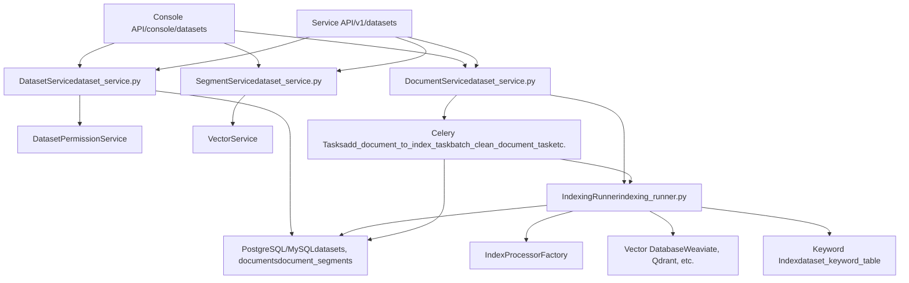
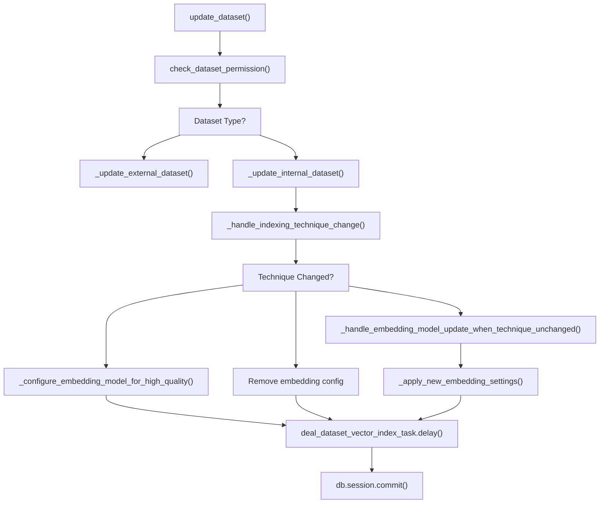
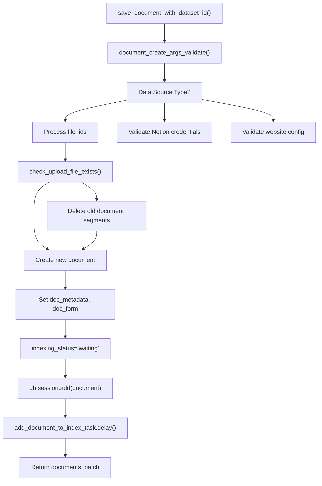
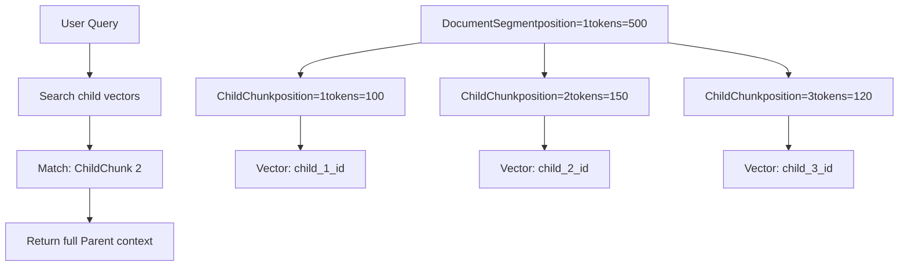
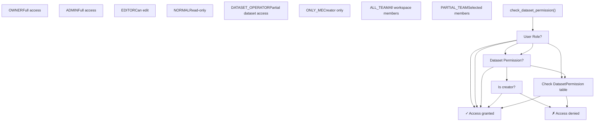
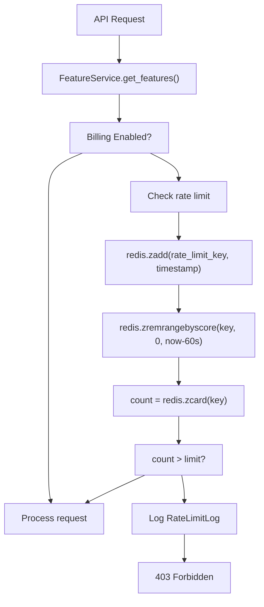
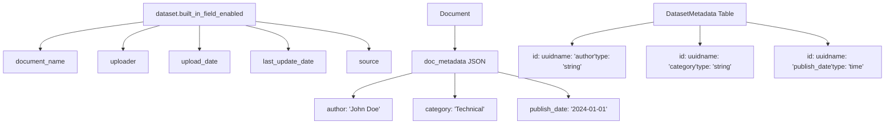
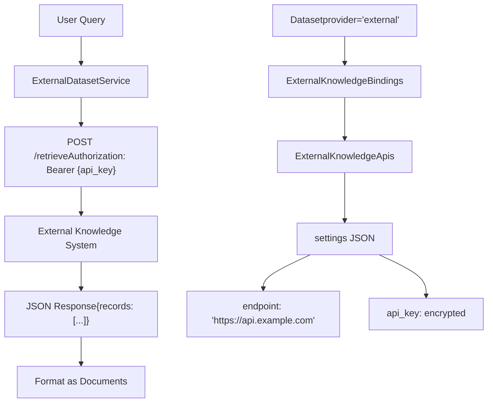

# Dataset Service and Document Management

Relevant source files

-   [api/controllers/console/datasets/data\_source.py](https://github.com/langgenius/dify/blob/92dbc94f/api/controllers/console/datasets/data_source.py)
-   [api/controllers/console/datasets/datasets\_document.py](https://github.com/langgenius/dify/blob/92dbc94f/api/controllers/console/datasets/datasets_document.py)
-   [api/controllers/console/datasets/datasets\_segments.py](https://github.com/langgenius/dify/blob/92dbc94f/api/controllers/console/datasets/datasets_segments.py)
-   [api/controllers/console/datasets/external.py](https://github.com/langgenius/dify/blob/92dbc94f/api/controllers/console/datasets/external.py)
-   [api/controllers/console/datasets/hit\_testing.py](https://github.com/langgenius/dify/blob/92dbc94f/api/controllers/console/datasets/hit_testing.py)
-   [api/controllers/console/datasets/metadata.py](https://github.com/langgenius/dify/blob/92dbc94f/api/controllers/console/datasets/metadata.py)
-   [api/controllers/console/tag/tags.py](https://github.com/langgenius/dify/blob/92dbc94f/api/controllers/console/tag/tags.py)
-   [api/controllers/service\_api/\_\_init\_\_.py](https://github.com/langgenius/dify/blob/92dbc94f/api/controllers/service_api/__init__.py)
-   [api/controllers/service\_api/app/annotation.py](https://github.com/langgenius/dify/blob/92dbc94f/api/controllers/service_api/app/annotation.py)
-   [api/controllers/service\_api/dataset/dataset.py](https://github.com/langgenius/dify/blob/92dbc94f/api/controllers/service_api/dataset/dataset.py)
-   [api/controllers/service\_api/dataset/document.py](https://github.com/langgenius/dify/blob/92dbc94f/api/controllers/service_api/dataset/document.py)
-   [api/controllers/service\_api/dataset/metadata.py](https://github.com/langgenius/dify/blob/92dbc94f/api/controllers/service_api/dataset/metadata.py)
-   [api/controllers/service\_api/dataset/segment.py](https://github.com/langgenius/dify/blob/92dbc94f/api/controllers/service_api/dataset/segment.py)
-   [api/core/indexing\_runner.py](https://github.com/langgenius/dify/blob/92dbc94f/api/core/indexing_runner.py)
-   [api/core/rag/extractor/entity/extract\_setting.py](https://github.com/langgenius/dify/blob/92dbc94f/api/core/rag/extractor/entity/extract_setting.py)
-   [api/core/rag/extractor/notion\_extractor.py](https://github.com/langgenius/dify/blob/92dbc94f/api/core/rag/extractor/notion_extractor.py)
-   [api/services/dataset\_service.py](https://github.com/langgenius/dify/blob/92dbc94f/api/services/dataset_service.py)
-   [api/tests/unit\_tests/controllers/console/datasets/\_\_init\_\_.py](https://github.com/langgenius/dify/blob/92dbc94f/api/tests/unit_tests/controllers/console/datasets/__init__.py)
-   [api/tests/unit\_tests/controllers/console/datasets/test\_external\_dataset\_payload.py](https://github.com/langgenius/dify/blob/92dbc94f/api/tests/unit_tests/controllers/console/datasets/test_external_dataset_payload.py)
-   [api/tests/unit\_tests/core/datasource/test\_notion\_provider.py](https://github.com/langgenius/dify/blob/92dbc94f/api/tests/unit_tests/core/datasource/test_notion_provider.py)
-   [api/tests/unit\_tests/core/rag/extractor/\_\_init\_\_.py](https://github.com/langgenius/dify/blob/92dbc94f/api/tests/unit_tests/core/rag/extractor/__init__.py)
-   [api/tests/unit\_tests/core/rag/extractor/test\_notion\_extractor.py](https://github.com/langgenius/dify/blob/92dbc94f/api/tests/unit_tests/core/rag/extractor/test_notion_extractor.py)
-   [api/tests/unit\_tests/services/test\_metadata\_bug\_complete.py](https://github.com/langgenius/dify/blob/92dbc94f/api/tests/unit_tests/services/test_metadata_bug_complete.py)
-   [api/tests/unit\_tests/services/test\_metadata\_nullable\_bug.py](https://github.com/langgenius/dify/blob/92dbc94f/api/tests/unit_tests/services/test_metadata_nullable_bug.py)
-   [web/app/components/develop/ApiServer.tsx](https://github.com/langgenius/dify/blob/92dbc94f/web/app/components/develop/ApiServer.tsx)
-   [web/app/components/develop/doc.tsx](https://github.com/langgenius/dify/blob/92dbc94f/web/app/components/develop/doc.tsx)
-   [web/app/components/develop/index.tsx](https://github.com/langgenius/dify/blob/92dbc94f/web/app/components/develop/index.tsx)

## Purpose and Scope

This page documents the service layer APIs and data models for managing knowledge base datasets and their documents in Dify. It covers the `DatasetService`, `DocumentService`, and `SegmentService` classes, which provide CRUD operations, permission management, and document lifecycle orchestration.

For information about the document indexing and embedding process, see [Document Indexing Pipeline](/langgenius/dify/4.2-document-indexing-pipeline). For retrieval strategies and search methods, see [Retrieval Strategies and Metadata Filtering](/langgenius/dify/4.3-retrieval-strategies-and-metadata-filtering). For vector database configuration, see [Vector Database Integration](/langgenius/dify/4.4-vector-database-integration).

---

## Core Data Models

### Dataset, Document, and Segment Hierarchy


**Dataset**: Represents a knowledge base with configuration for indexing technique (high\_quality/economy), embedding models, retrieval settings, and permissions. The `provider` field distinguishes between `vendor` (managed by Dify) and `external` (third-party API) datasets.

**Document**: Individual files or text entries within a dataset. Tracks data source type (`upload_file`, `notion_import`, `website_crawl`), indexing status, and processing metadata.

**DocumentSegment**: Chunks created from documents during text splitting. Each segment can be independently enabled/disabled and tracked for retrieval hit counts.

**ChildChunk**: For hierarchical chunking (`doc_form="parent_child_index"`), child chunks provide finer-grained context within parent segments.

Sources: [api/models/dataset.py44-311](https://github.com/langgenius/dify/blob/92dbc94f/api/models/dataset.py#L44-L311) [api/models/dataset.py353-513](https://github.com/langgenius/dify/blob/92dbc94f/api/models/dataset.py#L353-L513) [api/models/dataset.py564-716](https://github.com/langgenius/dify/blob/92dbc94f/api/models/dataset.py#L564-L716)

---

## DatasetService Architecture

### Service Layer Design


Sources: [api/services/dataset\_service.py97-273](https://github.com/langgenius/dify/blob/92dbc94f/api/services/dataset_service.py#L97-L273) [api/controllers/console/datasets/datasets\_document.py1-65](https://github.com/langgenius/dify/blob/92dbc94f/api/controllers/console/datasets/datasets_document.py#L1-L65) [api/controllers/service\_api/dataset/dataset.py1-99](https://github.com/langgenius/dify/blob/92dbc94f/api/controllers/service_api/dataset/dataset.py#L1-L99)

### DatasetService Core Methods

The `DatasetService` class provides dataset-level operations:

| Method | Purpose | Key Parameters |
| --- | --- | --- |
| `get_datasets()` | List datasets with filtering and pagination | `tenant_id`, `user`, `search`, `tag_ids`, `page`, `per_page` |
| `get_dataset()` | Retrieve single dataset by ID | `dataset_id` |
| `create_empty_dataset()` | Create new dataset with configuration | `tenant_id`, `name`, `indexing_technique`, `embedding_model_provider`, `embedding_model_name` |
| `update_dataset()` | Update dataset settings and trigger re-indexing | `dataset_id`, `data` (dict with updates), `user` |
| `check_dataset_permission()` | Validate user access to dataset | `dataset`, `user` |
| `check_dataset_model_setting()` | Verify embedding model availability | `dataset` |

**Dataset Creation Flow**:

> **[Mermaid sequence]**
> *(图表结构无法解析)*

Sources: [api/services/dataset\_service.py198-272](https://github.com/langgenius/dify/blob/92dbc94f/api/services/dataset_service.py#L198-L272) [api/services/dataset\_service.py407-444](https://github.com/langgenius/dify/blob/92dbc94f/api/services/dataset_service.py#L407-L444)

### Dataset Update and Re-indexing

When dataset configuration changes (especially embedding model), the system triggers re-indexing:


**Re-indexing Actions**:

-   `add`: Create vector index for documents (economy → high\_quality)
-   `remove`: Delete vector index (high\_quality → economy)
-   `update`: Re-embed with new model (model change)

Sources: [api/services/dataset\_service.py407-579](https://github.com/langgenius/dify/blob/92dbc94f/api/services/dataset_service.py#L407-L579) [api/services/dataset\_service.py664-853](https://github.com/langgenius/dify/blob/92dbc94f/api/services/dataset_service.py#L664-L853)

---

## DocumentService Operations

### Document Creation Pipeline

The `DocumentService` handles document ingestion and preparation for indexing:


**Key Methods**:

| Method | Purpose | Parameters |
| --- | --- | --- |
| `save_document_with_dataset_id()` | Main entry point for document creation | `dataset`, `knowledge_config`, `account`, `dataset_process_rule` |
| `document_create_args_validate()` | Validate creation parameters | `knowledge_config` |
| `check_upload_file_exists()` | Detect duplicate documents | `dataset_id`, `upload_file_id` |
| `get_document()` | Retrieve document by ID | `dataset_id`, `document_id` |
| `delete_documents()` | Delete documents and their indexes | `dataset`, `document_ids` |
| `retry_document()` | Retry failed indexing | `dataset`, `documents` |

Sources: [api/services/dataset\_service.py2008-2318](https://github.com/langgenius/dify/blob/92dbc94f/api/services/dataset_service.py#L2008-L2318) [api/services/dataset\_service.py1621-1708](https://github.com/langgenius/dify/blob/92dbc94f/api/services/dataset_service.py#L1621-L1708)

### Document Lifecycle States

> **[Mermaid stateDiagram]**
> *(图表结构无法解析)*

**Status Tracking Fields** (on `Document` model):

-   `indexing_status`: `waiting`, `parsing`, `splitting`, `indexing`, `completed`, `error`
-   `is_paused`: Boolean flag for user-initiated pause
-   `enabled`: Whether document participates in retrieval
-   `archived`: Soft deletion flag

**Timestamps**:

-   `processing_started_at`: When indexing begins
-   `parsing_completed_at`: Text extraction done
-   `splitting_completed_at`: Chunking done
-   `completed_at`: Full indexing complete
-   `stopped_at`: If error occurred

Sources: [api/models/dataset.py353-442](https://github.com/langgenius/dify/blob/92dbc94f/api/models/dataset.py#L353-L442) [api/core/indexing\_runner.py64-123](https://github.com/langgenius/dify/blob/92dbc94f/api/core/indexing_runner.py#L64-L123)

---

## SegmentService and Chunk Management

### Segment CRUD Operations

The `SegmentService` provides operations on individual document chunks:

```mermaid
flowchart TD
    CreateSegment["create_segment()"]
    UpdateSegment["update_segment()"]
    DeleteSegment["delete_segment()"]
    EnableSegment["enable_segment()"]
    DisableSegment["disable_segment()"]
    CreateChild["create_child_chunk()"]
    UpdateChild["update_child_chunk()"]
    DeleteChild["delete_child_chunk()"]
    BatchUpdateChildren["batch_update_child_chunks()"]
    AddToIndex["batch_create_segment_to_index_task"]
    UpdateIndex["update_segment_index"]
    RemoveFromIndex["delete_segment_from_index_task"]

    CreateSegment --> AddToIndex
    UpdateSegment --> UpdateIndex
    DeleteSegment --> RemoveFromIndex
    EnableSegment --> AddToIndex
    DisableSegment --> RemoveFromIndex
    CreateChild --> AddToIndex
    UpdateChild --> UpdateIndex
    DeleteChild --> RemoveFromIndex
```


**Segment Model Fields**:

| Field | Type | Purpose |
| --- | --- | --- |
| `content` | Text | Chunk text content |
| `position` | Integer | Order within document |
| `word_count` | Integer | Length in words |
| `tokens` | Integer | Token count for embedding |
| `status` | String | `completed`, `indexing`, `error` |
| `enabled` | Boolean | Whether included in retrieval |
| `disabled_at` | Timestamp | When disabled |
| `hit_count` | Integer | Retrieval usage counter |
| `keywords` | JSON | Extracted keywords (economy mode) |
| `index_node_id` | String | Vector DB document ID |
| `index_node_hash` | String | Content hash for deduplication |

Sources: [api/models/dataset.py564-716](https://github.com/langgenius/dify/blob/92dbc94f/api/models/dataset.py#L564-L716) [api/services/dataset\_service.py2835-3139](https://github.com/langgenius/dify/blob/92dbc94f/api/services/dataset_service.py#L2835-L3139)

### Hierarchical Chunking (Parent-Child)

For `doc_form="parent_child_index"`, segments contain child chunks:


**Child Chunk Operations**:

-   `create_child_chunk()`: Add child to existing segment [api/services/dataset\_service.py3141-3236](https://github.com/langgenius/dify/blob/92dbc94f/api/services/dataset_service.py#L3141-L3236)
-   `update_child_chunk()`: Modify child content and re-index [api/services/dataset\_service.py3238-3329](https://github.com/langgenius/dify/blob/92dbc94f/api/services/dataset_service.py#L3238-L3329)
-   `delete_child_chunk()`: Remove child from segment and vector DB [api/services/dataset\_service.py3331-3379](https://github.com/langgenius/dify/blob/92dbc94f/api/services/dataset_service.py#L3331-L3379)
-   `batch_update_child_chunks()`: Bulk update multiple children [api/services/dataset\_service.py3381-3502](https://github.com/langgenius/dify/blob/92dbc94f/api/services/dataset_service.py#L3381-L3502)

Sources: [api/models/dataset.py718-759](https://github.com/langgenius/dify/blob/92dbc94f/api/models/dataset.py#L718-L759) [api/services/dataset\_service.py3141-3502](https://github.com/langgenius/dify/blob/92dbc94f/api/services/dataset_service.py#L3141-L3502)

---

## API Endpoints

### Console API (Admin Interface)

The Console API provides full administrative access to datasets and documents:

**Dataset Endpoints**:

| Endpoint | Method | Purpose |
| --- | --- | --- |
| `/console/datasets` | GET | List datasets with filters |
| `/console/datasets` | POST | Create new dataset |
| `/console/datasets/<id>` | GET | Get dataset details |
| `/console/datasets/<id>` | PATCH | Update dataset configuration |
| `/console/datasets/<id>` | DELETE | Delete dataset |

**Document Endpoints**:

| Endpoint | Method | Purpose |
| --- | --- | --- |
| `/console/datasets/<id>/documents` | GET | List documents in dataset |
| `/console/datasets/<id>/documents` | POST | Create documents (upload/text/sync) |
| `/console/datasets/<id>/documents` | DELETE | Batch delete documents |
| `/console/datasets/<id>/documents/<doc_id>` | GET | Get document details |
| `/console/datasets/<id>/documents/<doc_id>` | PATCH | Update document metadata |
| `/console/datasets/<id>/documents/<doc_id>` | DELETE | Delete single document |
| `/console/datasets/<id>/documents/<doc_id>/status` | GET | Get indexing status |

**Segment Endpoints**:

| Endpoint | Method | Purpose |
| --- | --- | --- |
| `/console/datasets/<id>/documents/<doc_id>/segments` | GET | List segments with filters |
| `/console/datasets/<id>/documents/<doc_id>/segments` | POST | Create segment manually |
| `/console/datasets/<id>/documents/<doc_id>/segments/<seg_id>` | PATCH | Update segment content |
| `/console/datasets/<id>/documents/<doc_id>/segments/<seg_id>` | DELETE | Delete segment |
| `/console/datasets/<id>/documents/<doc_id>/segments/<seg_id>/enable` | POST | Enable segment |
| `/console/datasets/<id>/documents/<doc_id>/segments/<seg_id>/disable` | POST | Disable segment |

Sources: [api/controllers/console/datasets/datasets\_document.py206-393](https://github.com/langgenius/dify/blob/92dbc94f/api/controllers/console/datasets/datasets_document.py#L206-L393) [api/controllers/console/datasets/datasets\_segments.py95-450](https://github.com/langgenius/dify/blob/92dbc94f/api/controllers/console/datasets/datasets_segments.py#L95-L450)

### Service API (External Applications)

The Service API uses bearer token authentication for external integrations:

> **[Mermaid sequence]**
> *(图表结构无法解析)*

**Authentication**: Uses `@validate_dataset_token` decorator that:

1.  Extracts bearer token from `Authorization` header
2.  Validates token against `api_tokens` table (type='dataset')
3.  Logs in as tenant owner account
4.  Checks `dataset.enable_api` flag

**Key Service API Endpoints**:

| Endpoint | Purpose |
| --- | --- |
| `POST /v1/datasets` | Create dataset |
| `GET /v1/datasets` | List datasets |
| `GET /v1/datasets/<id>` | Get dataset |
| `PATCH /v1/datasets/<id>` | Update dataset |
| `DELETE /v1/datasets/<id>` | Delete dataset |
| `POST /v1/datasets/<id>/document/create_by_text` | Create document from text |
| `POST /v1/datasets/<id>/document/create_by_file` | Upload file as document |
| `POST /v1/datasets/<id>/documents/<doc_id>/update_by_text` | Update document text |
| `POST /v1/datasets/<id>/documents/<doc_id>/update_by_file` | Update document file |
| `POST /v1/datasets/<id>/documents/<doc_id>/segments` | Create segments |
| `PATCH /v1/datasets/<id>/documents/<doc_id>/segments/<seg_id>` | Update segment |
| `DELETE /v1/datasets/<id>/documents/<doc_id>/segments/<seg_id>` | Delete segment |

Sources: [api/controllers/service\_api/dataset/dataset.py102-338](https://github.com/langgenius/dify/blob/92dbc94f/api/controllers/service_api/dataset/dataset.py#L102-L338) [api/controllers/service\_api/dataset/document.py76-476](https://github.com/langgenius/dify/blob/92dbc94f/api/controllers/service_api/dataset/document.py#L76-L476) [api/controllers/service\_api/wraps.py219-294](https://github.com/langgenius/dify/blob/92dbc94f/api/controllers/service_api/wraps.py#L219-L294)

---

## Permission Management

### Dataset Permission Levels

Datasets support three permission models defined in `DatasetPermissionEnum`:


**DatasetPermission Table**: For `PARTIAL_TEAM`, explicit permissions are stored:

| Field | Purpose |
| --- | --- |
| `dataset_id` | Dataset identifier |
| `account_id` | User identifier |
| `tenant_id` | Workspace identifier |
| `has_permission` | Boolean flag |

**Permission Checking**:

```
def check_dataset_permission(dataset, user):
    if user.current_role in [TenantAccountRole.OWNER, TenantAccountRole.ADMIN]:
        return True

    if dataset.permission == DatasetPermissionEnum.ALL_TEAM:
        return True

    if dataset.permission == DatasetPermissionEnum.ONLY_ME:
        return dataset.created_by == user.id

    if dataset.permission == DatasetPermissionEnum.PARTIAL_TEAM:
        permission = db.session.query(DatasetPermission).filter_by(
            dataset_id=dataset.id, account_id=user.id
        ).first()
        return permission is not None

    return False
```
Sources: [api/models/dataset.py38-41](https://github.com/langgenius/dify/blob/92dbc94f/api/models/dataset.py#L38-L41) [api/services/dataset\_service.py1403-1476](https://github.com/langgenius/dify/blob/92dbc94f/api/services/dataset_service.py#L1403-L1476)

### Rate Limiting and Quotas

Knowledge base operations are rate-limited in cloud deployments:


**Quota Checks**:

-   `vector_space`: Check remaining vector storage capacity
-   `documents`: Check document upload quota
-   `knowledge` rate limit: Requests per minute for dataset operations

**Decorators**:

-   `@cloud_edition_billing_resource_check("vector_space")`: Check capacity before operation
-   `@cloud_edition_billing_rate_limit_check("knowledge")`: Rate limit requests

Sources: [api/controllers/console/wraps.py97-169](https://github.com/langgenius/dify/blob/92dbc94f/api/controllers/console/wraps.py#L97-L169) [api/controllers/service\_api/wraps.py130-216](https://github.com/langgenius/dify/blob/92dbc94f/api/controllers/service_api/wraps.py#L130-L216) [api/services/feature\_service.py1-270](https://github.com/langgenius/dify/blob/92dbc94f/api/services/feature_service.py#L1-L270)

---

## Document Processing Integration

### Triggering Background Indexing

Document creation queues asynchronous indexing tasks:

> **[Mermaid sequence]**
> *(图表结构无法解析)*

**Task Types**:

| Task | Purpose | Trigger |
| --- | --- | --- |
| `add_document_to_index_task` | Index new document | Document creation |
| `document_indexing_update_task` | Re-index after update | Document content change |
| `retry_document_indexing_task` | Retry failed indexing | User retry action |
| `remove_document_from_index_task` | Delete from vector DB | Document deletion |
| `batch_clean_document_task` | Cleanup batch documents | Batch operation |
| `sync_website_document_indexing_task` | Re-crawl website | Website document sync |
| `clean_notion_document_task` | Sync Notion pages | Notion integration |

Sources: [api/services/dataset\_service.py2298-2318](https://github.com/langgenius/dify/blob/92dbc94f/api/services/dataset_service.py#L2298-L2318) [api/core/indexing\_runner.py48-123](https://github.com/langgenius/dify/blob/92dbc94f/api/core/indexing_runner.py#L48-L123) [tasks/add\_document\_to\_index\_task.py](https://github.com/langgenius/dify/blob/92dbc94f/tasks/add_document_to_index_task.py)

### Data Source Types

Documents support three data source types:

**1\. Upload File** (`upload_file`):

```
{
  "data_source_type": "upload_file",
  "data_source_info": {
    "upload_file_id": "uuid"
  }
}
```
References `upload_files` table. Supports PDF, TXT, Markdown, DOCX, CSV, etc.

**2\. Notion Import** (`notion_import`):

```
{
  "data_source_type": "notion_import",
  "data_source_info": {
    "credential_id": "uuid",
    "notion_workspace_id": "workspace_id",
    "notion_page_id": "page_id",
    "type": "page"  // or "database"
  }
}
```
Uses `NotionExtractor` to fetch content via Notion API.

**3\. Website Crawl** (`website_crawl`):

```
{
  "data_source_type": "website_crawl",
  "data_source_info": {
    "provider": "firecrawl",
    "job_id": "job_id",
    "url": "https://example.com",
    "mode": "scrape",  // or "crawl"
    "only_main_content": true
  }
}
```
Integrates with website crawling services like Firecrawl or Jina.

Sources: [api/models/dataset.py423-424](https://github.com/langgenius/dify/blob/92dbc94f/api/models/dataset.py#L423-L424) [api/core/indexing\_runner.py366-448](https://github.com/langgenius/dify/blob/92dbc94f/api/core/indexing_runner.py#L366-L448) [api/core/rag/extractor/notion\_extractor.py31-177](https://github.com/langgenius/dify/blob/92dbc94f/api/core/rag/extractor/notion_extractor.py#L31-L177)

---

## Metadata and Custom Fields

### Document Metadata System

Documents support custom metadata fields for filtering:


**Metadata Field Types**:

-   `string`: Text values
-   `number`: Numeric values
-   `time`: ISO 8601 timestamps

**Built-in Fields**: When `dataset.built_in_field_enabled=true`, automatic fields are added:

-   `document_name`: Document filename
-   `uploader`: Creator account name
-   `upload_date`: Creation timestamp
-   `last_update_date`: Last modification timestamp
-   `source`: Data source type

**Metadata Usage**:

-   Filtering during retrieval (see [Retrieval Strategies](/langgenius/dify/4.3-retrieval-strategies-and-metadata-filtering))
-   Organizing documents within datasets
-   Custom business logic in RAG applications

Sources: [api/models/dataset.py256-305](https://github.com/langgenius/dify/blob/92dbc94f/api/models/dataset.py#L256-L305) [api/models/dataset.py761-815](https://github.com/langgenius/dify/blob/92dbc94f/api/models/dataset.py#L761-L815) [core/rag/index\_processor/constant/built\_in\_field.py](https://github.com/langgenius/dify/blob/92dbc94f/core/rag/index_processor/constant/built_in_field.py)

---

## External Knowledge Datasets

### External API Integration

Datasets with `provider="external"` delegate retrieval to third-party APIs:


**External Knowledge API Schema**:

```
{
  "endpoint": "https://api.example.com/retrieve",
  "api_key": "encrypted_key",
  "retrieval_model": {
    "top_k": 3,
    "score_threshold": 0.5
  }
}
```
**Request to External System**:

```
{
  "query": "user question",
  "retrieval_setting": {
    "top_k": 3,
    "score_threshold": 0.5
  }
}
```
**Expected Response**:

```
{
  "records": [
    {
      "content": "retrieved text",
      "score": 0.95,
      "title": "Document Title",
      "metadata": {...}
    }
  ]
}
```
External datasets skip local indexing and forward retrieval requests to configured endpoints.

Sources: [api/models/dataset.py225-245](https://github.com/langgenius/dify/blob/92dbc94f/api/models/dataset.py#L225-L245) [api/services/external\_knowledge\_service.py](https://github.com/langgenius/dify/blob/92dbc94f/api/services/external_knowledge_service.py) [api/services/dataset\_service.py458-532](https://github.com/langgenius/dify/blob/92dbc94f/api/services/dataset_service.py#L458-L532)
