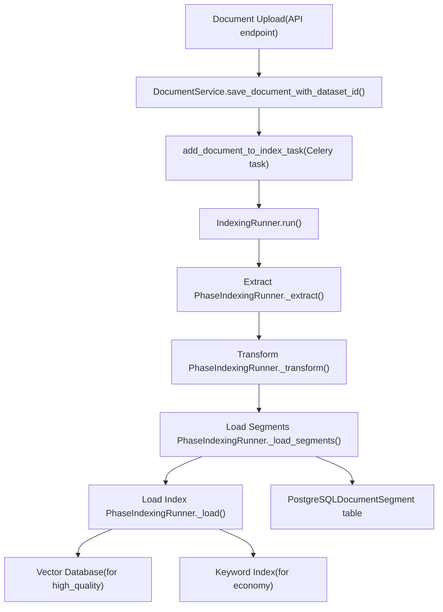
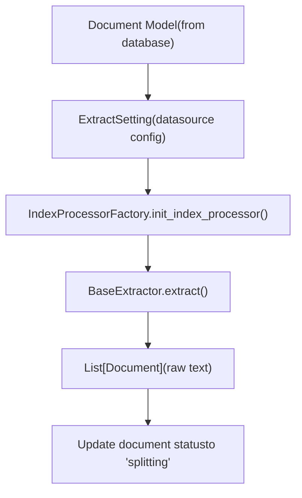
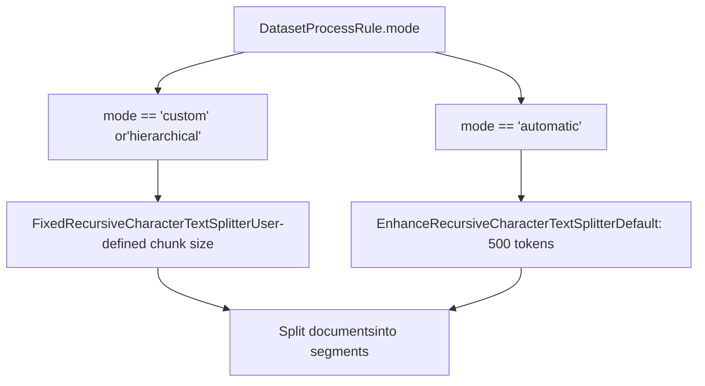
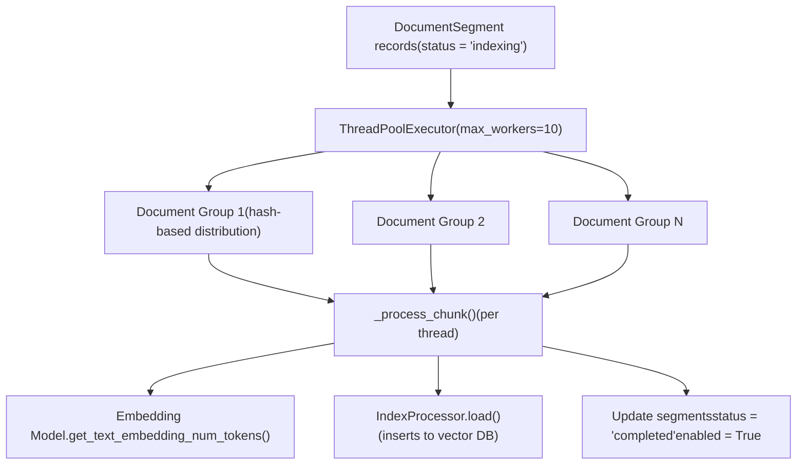
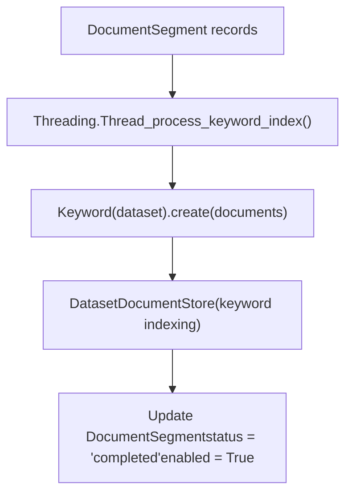
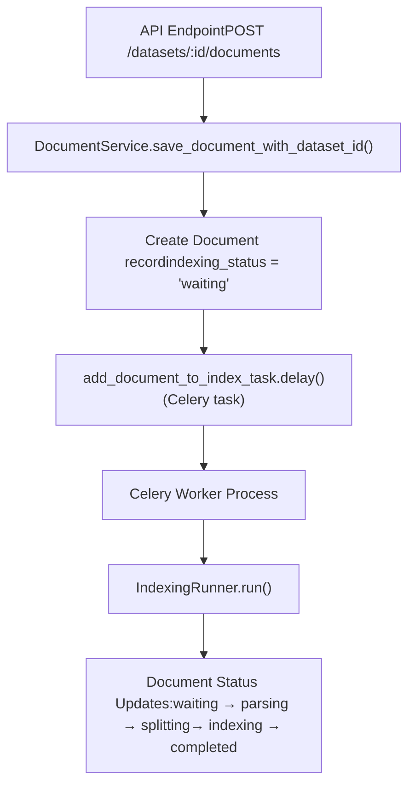
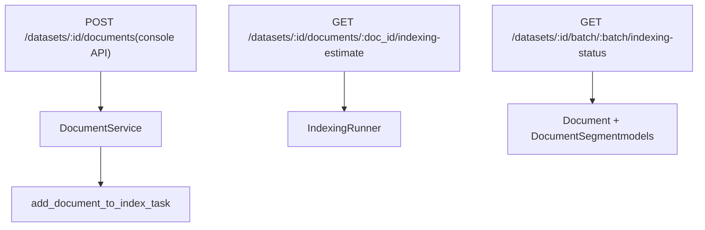

# Document Indexing Pipeline

Relevant source files

-   [api/controllers/console/datasets/data\_source.py](https://github.com/langgenius/dify/blob/92dbc94f/api/controllers/console/datasets/data_source.py)
-   [api/controllers/console/datasets/datasets\_document.py](https://github.com/langgenius/dify/blob/92dbc94f/api/controllers/console/datasets/datasets_document.py)
-   [api/controllers/console/datasets/datasets\_segments.py](https://github.com/langgenius/dify/blob/92dbc94f/api/controllers/console/datasets/datasets_segments.py)
-   [api/controllers/console/datasets/external.py](https://github.com/langgenius/dify/blob/92dbc94f/api/controllers/console/datasets/external.py)
-   [api/controllers/console/datasets/hit\_testing.py](https://github.com/langgenius/dify/blob/92dbc94f/api/controllers/console/datasets/hit_testing.py)
-   [api/controllers/console/datasets/metadata.py](https://github.com/langgenius/dify/blob/92dbc94f/api/controllers/console/datasets/metadata.py)
-   [api/controllers/console/tag/tags.py](https://github.com/langgenius/dify/blob/92dbc94f/api/controllers/console/tag/tags.py)
-   [api/controllers/service\_api/\_\_init\_\_.py](https://github.com/langgenius/dify/blob/92dbc94f/api/controllers/service_api/__init__.py)
-   [api/controllers/service\_api/app/annotation.py](https://github.com/langgenius/dify/blob/92dbc94f/api/controllers/service_api/app/annotation.py)
-   [api/controllers/service\_api/dataset/dataset.py](https://github.com/langgenius/dify/blob/92dbc94f/api/controllers/service_api/dataset/dataset.py)
-   [api/controllers/service\_api/dataset/document.py](https://github.com/langgenius/dify/blob/92dbc94f/api/controllers/service_api/dataset/document.py)
-   [api/controllers/service\_api/dataset/metadata.py](https://github.com/langgenius/dify/blob/92dbc94f/api/controllers/service_api/dataset/metadata.py)
-   [api/controllers/service\_api/dataset/segment.py](https://github.com/langgenius/dify/blob/92dbc94f/api/controllers/service_api/dataset/segment.py)
-   [api/core/indexing\_runner.py](https://github.com/langgenius/dify/blob/92dbc94f/api/core/indexing_runner.py)
-   [api/core/rag/extractor/entity/extract\_setting.py](https://github.com/langgenius/dify/blob/92dbc94f/api/core/rag/extractor/entity/extract_setting.py)
-   [api/core/rag/extractor/notion\_extractor.py](https://github.com/langgenius/dify/blob/92dbc94f/api/core/rag/extractor/notion_extractor.py)
-   [api/services/dataset\_service.py](https://github.com/langgenius/dify/blob/92dbc94f/api/services/dataset_service.py)
-   [api/tests/unit\_tests/controllers/console/datasets/\_\_init\_\_.py](https://github.com/langgenius/dify/blob/92dbc94f/api/tests/unit_tests/controllers/console/datasets/__init__.py)
-   [api/tests/unit\_tests/controllers/console/datasets/test\_external\_dataset\_payload.py](https://github.com/langgenius/dify/blob/92dbc94f/api/tests/unit_tests/controllers/console/datasets/test_external_dataset_payload.py)
-   [api/tests/unit\_tests/core/datasource/test\_notion\_provider.py](https://github.com/langgenius/dify/blob/92dbc94f/api/tests/unit_tests/core/datasource/test_notion_provider.py)
-   [api/tests/unit\_tests/core/rag/extractor/\_\_init\_\_.py](https://github.com/langgenius/dify/blob/92dbc94f/api/tests/unit_tests/core/rag/extractor/__init__.py)
-   [api/tests/unit\_tests/core/rag/extractor/test\_notion\_extractor.py](https://github.com/langgenius/dify/blob/92dbc94f/api/tests/unit_tests/core/rag/extractor/test_notion_extractor.py)
-   [api/tests/unit\_tests/services/test\_metadata\_bug\_complete.py](https://github.com/langgenius/dify/blob/92dbc94f/api/tests/unit_tests/services/test_metadata_bug_complete.py)
-   [api/tests/unit\_tests/services/test\_metadata\_nullable\_bug.py](https://github.com/langgenius/dify/blob/92dbc94f/api/tests/unit_tests/services/test_metadata_nullable_bug.py)
-   [web/app/components/develop/ApiServer.tsx](https://github.com/langgenius/dify/blob/92dbc94f/web/app/components/develop/ApiServer.tsx)
-   [web/app/components/develop/doc.tsx](https://github.com/langgenius/dify/blob/92dbc94f/web/app/components/develop/doc.tsx)
-   [web/app/components/develop/index.tsx](https://github.com/langgenius/dify/blob/92dbc94f/web/app/components/develop/index.tsx)

## Purpose and Scope

This document describes the document indexing pipeline in Dify, which processes uploaded documents and prepares them for semantic search and retrieval. The pipeline orchestrates extraction, text splitting, cleaning, segment creation, and vector/keyword indexing operations.

For information about document retrieval and search, see [Retrieval Strategies and Metadata Filtering](/langgenius/dify/4.3-retrieval-strategies-and-metadata-filtering). For vector database configuration, see [Vector Database Integration](/langgenius/dify/4.4-vector-database-integration). For the broader dataset management system, see [Dataset Service and Document Management](/langgenius/dify/4.1-dataset-service-and-document-management).

---

## Pipeline Architecture Overview

The document indexing pipeline is implemented by the `IndexingRunner` class, which orchestrates an ETL (Extract-Transform-Load) process. The pipeline executes asynchronously via Celery workers to handle long-running indexing operations without blocking API requests.

**High-Level Pipeline Flow**


**Sources:** [api/core/indexing\_runner.py48-123](https://github.com/langgenius/dify/blob/92dbc94f/api/core/indexing_runner.py#L48-L123) [api/services/dataset\_service.py56-92](https://github.com/langgenius/dify/blob/92dbc94f/api/services/dataset_service.py#L56-L92)

---

## ETL Pipeline Stages

The `IndexingRunner` class implements a three-stage ETL pipeline that processes documents from raw input to indexed, searchable segments.

### Stage 1: Extraction

The extraction phase retrieves document content from various data sources and converts it to a list of `Document` objects.

**Supported Data Source Types**

| Data Source Type | Extractor | Description |
| --- | --- | --- |
| `upload_file` | `FileExtractor` | Direct file uploads (PDF, DOCX, TXT, etc.) |
| `notion_import` | `NotionExtractor` | Notion pages and databases via OAuth |
| `website_crawl` | `WebExtractor` | Web pages via Firecrawl/Jina providers |

**Extraction Flow**


The extraction logic resides in `IndexingRunner._extract()`, which:

1.  Retrieves data source information from `Document.data_source_info_dict`
2.  Creates an `ExtractSetting` object based on the source type
3.  Delegates to the appropriate extractor (file, Notion, or website)
4.  Updates document status to `"splitting"` upon completion

**Sources:** [api/core/indexing\_runner.py366-448](https://github.com/langgenius/dify/blob/92dbc94f/api/core/indexing_runner.py#L366-L448) [api/core/rag/extractor/entity/extract\_setting.py1-47](https://github.com/langgenius/dify/blob/92dbc94f/api/core/rag/extractor/entity/extract_setting.py#L1-L47)

### Stage 2: Text Splitting and Transformation

The transformation phase splits documents into smaller segments, applies cleaning rules, and generates metadata for each segment.

**Text Splitter Selection**


**Splitter Configuration Parameters**

| Parameter | Custom Mode | Automatic Mode |
| --- | --- | --- |
| `chunk_size` | User-defined (50-2000 tokens) | 500 tokens |
| `chunk_overlap` | User-defined | Default from rules |
| `separator` | User-defined (e.g., `\n\n`) | `["\n\n", "。", ". ", " ", ""]` |
| `embedding_model_instance` | Used for token counting | Used for token counting |

**Transformation Process**

The `IndexingRunner._transform()` method (delegated to `IndexProcessor.transform()`) performs:

1.  **Document Cleaning**: Applies cleaning rules via `CleanProcessor.clean()`

    -   Removes extra whitespace
    -   Normalizes characters
    -   Applies custom preprocessing rules
2.  **Text Splitting**: Creates segments using the selected splitter

    -   Respects token limits
    -   Maintains context with overlap
    -   Preserves document hierarchy (for parent-child indexing)
3.  **Metadata Generation**: Assigns metadata to each segment

    -   `doc_id`: Unique segment identifier (UUID)
    -   `doc_hash`: Content hash for deduplication
    -   `document_id`: Reference to parent document
    -   `dataset_id`: Reference to parent dataset

**Sources:** [api/core/indexing\_runner.py450-548](https://github.com/langgenius/dify/blob/92dbc94f/api/core/indexing_runner.py#L450-L548) [api/core/rag/splitter/fixed\_text\_splitter.py1-31](https://github.com/langgenius/dify/blob/92dbc94f/api/core/rag/splitter/fixed_text_splitter.py#L1-L31)

### Stage 3: Segment Storage

The `_load_segments()` method persists transformed segments to the PostgreSQL database as `DocumentSegment` records.

**DocumentSegment Model Fields**

| Field | Type | Description |
| --- | --- | --- |
| `dataset_id` | UUID | Parent dataset reference |
| `document_id` | UUID | Parent document reference |
| `index_node_id` | String | Unique segment identifier (from `doc_id`) |
| `index_node_hash` | String | Content hash for deduplication |
| `position` | Integer | Segment order within document |
| `content` | Text | Segment text content |
| `word_count` | Integer | Number of words in segment |
| `tokens` | Integer | Number of tokens in segment |
| `keywords` | JSON | Extracted keywords (for economy mode) |
| `status` | String | `"indexing"` → `"completed"` |
| `enabled` | Boolean | Whether segment is active for retrieval |

**Sources:** [api/core/indexing\_runner.py730-763](https://github.com/langgenius/dify/blob/92dbc94f/api/core/indexing_runner.py#L730-L763) [models/dataset.py](https://github.com/langgenius/dify/blob/92dbc94f/models/dataset.py#LNaN-LNaN)

---

## Indexing Strategies

After segments are stored in the database, the pipeline indexes them based on the dataset's `indexing_technique` setting.

### High-Quality Indexing (Vector Embeddings)

For `indexing_technique == "high_quality"`, the pipeline generates embeddings using the configured embedding model and stores them in the vector database.

**Vector Indexing Flow**


The `IndexingRunner._load()` method:

1.  **Distributes segments** across multiple threads using hash-based grouping to prevent deadlocks
2.  **Generates embeddings** for each segment's text content
3.  **Inserts vectors** into the configured vector database (Weaviate, Qdrant, etc.)
4.  **Updates segment status** to `"completed"` and sets `enabled = True`

**Sources:** [api/core/indexing\_runner.py550-704](https://github.com/langgenius/dify/blob/92dbc94f/api/core/indexing_runner.py#L550-L704) [api/core/rag/index\_processor/index\_processor\_base.py](https://github.com/langgenius/dify/blob/92dbc94f/api/core/rag/index_processor/index_processor_base.py)

### Economy Indexing (Keyword Extraction)

For `indexing_technique == "economy"`, the pipeline extracts keywords using the `Keyword` class and creates a keyword-based search index.

**Keyword Indexing Flow**


The keyword indexing process:

1.  **Runs in a separate thread** to parallelize with other operations
2.  **Extracts keywords** from segment content
3.  **Stores keywords** in the `DocumentSegment.keywords` JSON field
4.  **Creates a keyword index** for BM25-style lexical search

**Sources:** [api/core/indexing\_runner.py573-659](https://github.com/langgenius/dify/blob/92dbc94f/api/core/indexing_runner.py#L573-L659) [api/core/rag/datasource/keyword/keyword\_factory.py](https://github.com/langgenius/dify/blob/92dbc94f/api/core/rag/datasource/keyword/keyword_factory.py)

---

## Background Processing with Celery

The indexing pipeline executes asynchronously via Celery tasks to handle long-running operations without blocking HTTP requests.

**Task Orchestration**


**Key Celery Tasks**

| Task Name | Purpose | Trigger |
| --- | --- | --- |
| `add_document_to_index_task` | Initial document indexing | Document upload/creation |
| `document_indexing_update_task` | Re-index after document update | Document content change |
| `retry_document_indexing_task` | Retry failed indexing | Manual retry action |
| `recover_document_indexing_task` | Resume paused indexing | Resume action |

**Sources:** [tasks/add\_document\_to\_index\_task.py](https://github.com/langgenius/dify/blob/92dbc94f/tasks/add_document_to_index_task.py) [api/services/dataset\_service.py56-92](https://github.com/langgenius/dify/blob/92dbc94f/api/services/dataset_service.py#L56-L92)

---

## Status Tracking and Error Handling

The indexing pipeline maintains detailed status information and handles errors gracefully to provide visibility into the indexing process.

### Document Status Lifecycle

> **[Mermaid stateDiagram]**
> *(图表结构无法解析)*

**Status Tracking in Code**

The `IndexingRunner._update_document_index_status()` method updates the document status at key transition points:

-   `parsing_completed_at`: Timestamp when extraction finishes
-   `splitting_completed_at`: Timestamp when splitting finishes
-   `completed_at`: Timestamp when indexing finishes
-   `indexing_latency`: Total time spent indexing (in seconds)
-   `tokens`: Total number of tokens processed
-   `error`: Error message if indexing fails

**Sources:** [api/core/indexing\_runner.py53-63](https://github.com/langgenius/dify/blob/92dbc94f/api/core/indexing_runner.py#L53-L63) [api/core/indexing\_runner.py434-440](https://github.com/langgenius/dify/blob/92dbc94f/api/core/indexing_runner.py#L434-L440) [api/core/indexing\_runner.py624-633](https://github.com/langgenius/dify/blob/92dbc94f/api/core/indexing_runner.py#L624-L633)

### Error Handling

The `IndexingRunner._handle_indexing_error()` method catches exceptions and updates document state:

1.  **Logs the exception** with full traceback
2.  **Updates document status** to `"error"`
3.  **Stores error message** in `Document.error` field
4.  **Sets stopped timestamp** in `Document.stopped_at`

Common error scenarios:

-   **ProviderTokenNotInitError**: Embedding model credentials not configured
-   **DocumentIsPausedError**: Document was paused during indexing
-   **ObjectDeletedError**: Document was deleted during indexing

**Sources:** [api/core/indexing\_runner.py53-63](https://github.com/langgenius/dify/blob/92dbc94f/api/core/indexing_runner.py#L53-L63) [api/core/indexing\_runner.py115-122](https://github.com/langgenius/dify/blob/92dbc94f/api/core/indexing_runner.py#L115-L122)

---

## API Integration Points

The indexing pipeline integrates with REST APIs that trigger and monitor indexing operations.

### Console API Endpoints


**Key Endpoints**

| Endpoint | Method | Purpose |
| --- | --- | --- |
| `/datasets/<dataset_id>/documents` | POST | Upload and index new document |
| `/datasets/<dataset_id>/documents/<document_id>/indexing-estimate` | GET | Estimate indexing cost and preview segments |
| `/datasets/<dataset_id>/batch/<batch>/indexing-status` | GET | Poll indexing status for batch uploads |

**Sources:** [api/controllers/console/datasets/datasets\_document.py215-404](https://github.com/langgenius/dify/blob/92dbc94f/api/controllers/console/datasets/datasets_document.py#L215-L404) [api/controllers/console/datasets/datasets\_document.py470-638](https://github.com/langgenius/dify/blob/92dbc94f/api/controllers/console/datasets/datasets_document.py#L470-L638)

### Service API Endpoints

The Service API provides similar functionality for programmatic access:

| Endpoint | Method | Purpose |
| --- | --- | --- |
| `/v1/datasets/<dataset_id>/document/create-by-text` | POST | Create document from text content |
| `/v1/datasets/<dataset_id>/document/create-by-file` | POST | Create document from file upload |
| `/v1/datasets/<dataset_id>/documents/<document_id>/update-by-text` | POST | Update document content |

**Sources:** [api/controllers/service\_api/dataset/document.py76-162](https://github.com/langgenius/dify/blob/92dbc94f/api/controllers/service_api/dataset/document.py#L76-L162) [api/controllers/service\_api/dataset/document.py242-349](https://github.com/langgenius/dify/blob/92dbc94f/api/controllers/service_api/dataset/document.py#L242-L349)

---

## Indexing Estimation

The `IndexingRunner.indexing_estimate()` method provides cost and segment preview before actual indexing.

**Estimation Process**

1.  **Extracts content** from the data source (without persisting)
2.  **Applies splitting rules** to generate preview segments
3.  **Counts tokens** if using high-quality indexing
4.  **Returns preview** of first 10 segments and total segment count

**Estimation Response Structure**

```
{
  "total_segments": 45,
  "tokens": 12000,
  "total_price": 0.012,
  "currency": "USD",
  "preview": [
    {
      "content": "First segment text...",
      "child_chunks": ["child 1", "child 2"]
    }
  ]
}
```
**Sources:** [api/core/indexing\_runner.py264-364](https://github.com/langgenius/dify/blob/92dbc94f/api/core/indexing_runner.py#L264-L364) [api/controllers/console/datasets/datasets\_document.py470-538](https://github.com/langgenius/dify/blob/92dbc94f/api/controllers/console/datasets/datasets_document.py#L470-L538)

---

## Configuration and Customization

### Processing Rules

Document processing behavior is configured via `DatasetProcessRule` records that define splitting and cleaning parameters.

**Processing Rule Structure**

```
{
  "mode": "custom",  # "automatic", "custom", or "hierarchical"
  "rules": {
    "segmentation": {
      "max_tokens": 1000,
      "chunk_overlap": 50,
      "separator": "\n\n"
    },
    "pre_processing_rules": [
      {"id": "remove_extra_spaces", "enabled": True},
      {"id": "remove_urls_emails", "enabled": False}
    ]
  }
}
```
**Default Rules**

The `DocumentService.DEFAULT_RULES` constant defines fallback values:

-   Mode: `"automatic"`
-   Max tokens: 500
-   Chunk overlap: 50

**Sources:** [api/services/dataset\_service.py170-185](https://github.com/langgenius/dify/blob/92dbc94f/api/services/dataset_service.py#L170-L185) [models/dataset.py](https://github.com/langgenius/dify/blob/92dbc94f/models/dataset.py#LNaN-LNaN)

### Indexing Technique Configuration

The dataset's `indexing_technique` field determines the indexing strategy:

| Technique | Embedding Model Required | Vector DB Required | Use Case |
| --- | --- | --- | --- |
| `high_quality` | Yes | Yes | Semantic search, complex queries |
| `economy` | No | No | Keyword search, lower cost |

**Sources:** [api/services/dataset\_service.py336-351](https://github.com/langgenius/dify/blob/92dbc94f/api/services/dataset_service.py#L336-L351) [models/dataset.py](https://github.com/langgenius/dify/blob/92dbc94f/models/dataset.py#LNaN-LNaN)

---

## Advanced Features

### Parent-Child Indexing

For `doc_form == "parent_child_index"`, the pipeline creates hierarchical segment structures:

1.  **Parent segments** store high-level content
2.  **Child chunks** (via `ChildChunk` model) store detailed sub-segments
3.  **Retrieval** returns parent context with child details

**Sources:** [api/core/indexing\_runner.py231-246](https://github.com/langgenius/dify/blob/92dbc94f/api/core/indexing_runner.py#L231-L246) [models/dataset.py](https://github.com/langgenius/dify/blob/92dbc94f/models/dataset.py#LNaN-LNaN)

### Multimodal Document Support

For multimodal embedding models, the pipeline indexes both text and attached images:

1.  **Detects multimodal model** via `DatasetService.check_is_multimodal_model()`
2.  **Extracts image attachments** from document content
3.  **Generates multimodal embeddings** for text+image pairs

**Sources:** [api/core/indexing\_runner.py678-686](https://github.com/langgenius/dify/blob/92dbc94f/api/core/indexing_runner.py#L678-L686) [api/services/dataset\_service.py369-389](https://github.com/langgenius/dify/blob/92dbc94f/api/services/dataset_service.py#L369-L389)

### Pause and Resume

Users can pause long-running indexing operations:

1.  **Pause**: Sets `Document.is_paused = True` and stores Redis flag
2.  **Check**: `IndexingRunner._check_document_paused_status()` checks Redis
3.  **Resume**: Clears Redis flag and re-enqueues task

**Sources:** [api/core/indexing\_runner.py706-711](https://github.com/langgenius/dify/blob/92dbc94f/api/core/indexing_runner.py#L706-L711) [tasks/recover\_document\_indexing\_task.py](https://github.com/langgenius/dify/blob/92dbc94f/tasks/recover_document_indexing_task.py)
