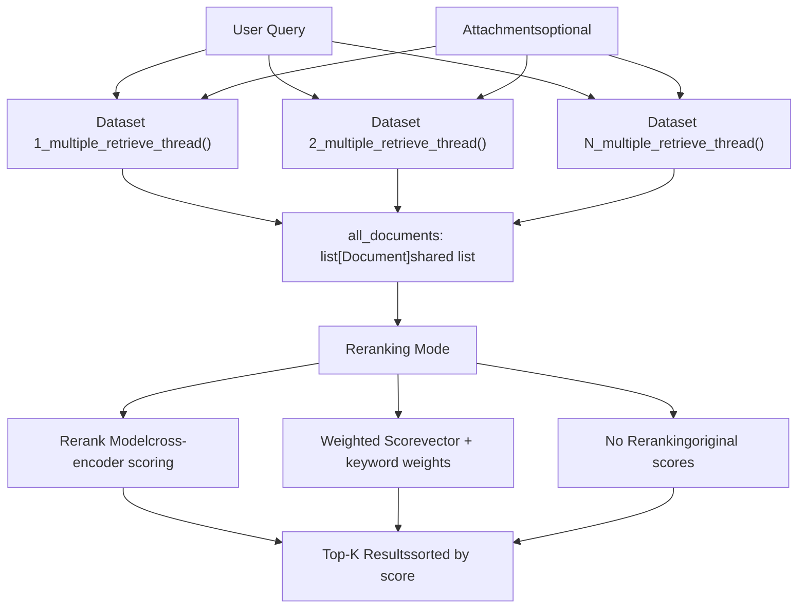

# Knowledge Retrieval Strategies and Metadata Filtering

Relevant source files

-   [api/core/rag/datasource/retrieval\_service.py](https://github.com/langgenius/dify/blob/92dbc94f/api/core/rag/datasource/retrieval_service.py)
-   [api/core/rag/entities/metadata\_entities.py](https://github.com/langgenius/dify/blob/92dbc94f/api/core/rag/entities/metadata_entities.py)
-   [api/core/rag/retrieval/dataset\_retrieval.py](https://github.com/langgenius/dify/blob/92dbc94f/api/core/rag/retrieval/dataset_retrieval.py)
-   [api/core/workflow/nodes/knowledge\_retrieval/entities.py](https://github.com/langgenius/dify/blob/92dbc94f/api/core/workflow/nodes/knowledge_retrieval/entities.py)
-   [api/core/workflow/nodes/knowledge\_retrieval/knowledge\_retrieval\_node.py](https://github.com/langgenius/dify/blob/92dbc94f/api/core/workflow/nodes/knowledge_retrieval/knowledge_retrieval_node.py)
-   [api/core/workflow/nodes/list\_operator/entities.py](https://github.com/langgenius/dify/blob/92dbc94f/api/core/workflow/nodes/list_operator/entities.py)
-   [api/core/workflow/nodes/list\_operator/exc.py](https://github.com/langgenius/dify/blob/92dbc94f/api/core/workflow/nodes/list_operator/exc.py)
-   [api/core/workflow/nodes/list\_operator/node.py](https://github.com/langgenius/dify/blob/92dbc94f/api/core/workflow/nodes/list_operator/node.py)
-   [api/core/workflow/nodes/question\_classifier/entities.py](https://github.com/langgenius/dify/blob/92dbc94f/api/core/workflow/nodes/question_classifier/entities.py)
-   [api/services/hit\_testing\_service.py](https://github.com/langgenius/dify/blob/92dbc94f/api/services/hit_testing_service.py)
-   [api/tests/unit\_tests/core/rag/retrieval/\_\_init\_\_.py](https://github.com/langgenius/dify/blob/92dbc94f/api/tests/unit_tests/core/rag/retrieval/__init__.py)
-   [api/tests/unit\_tests/core/rag/retrieval/test\_dataset\_retrieval.py](https://github.com/langgenius/dify/blob/92dbc94f/api/tests/unit_tests/core/rag/retrieval/test_dataset_retrieval.py)
-   [api/tests/unit\_tests/core/workflow/nodes/test\_list\_operator.py](https://github.com/langgenius/dify/blob/92dbc94f/api/tests/unit_tests/core/workflow/nodes/test_list_operator.py)
-   [web/app/components/workflow/nodes/knowledge-retrieval/components/metadata/condition-list/utils.ts](https://github.com/langgenius/dify/blob/92dbc94f/web/app/components/workflow/nodes/knowledge-retrieval/components/metadata/condition-list/utils.ts)
-   [web/app/components/workflow/nodes/knowledge-retrieval/components/metadata/metadata-icon.tsx](https://github.com/langgenius/dify/blob/92dbc94f/web/app/components/workflow/nodes/knowledge-retrieval/components/metadata/metadata-icon.tsx)
-   [web/app/components/workflow/nodes/list-operator/components/extract-input.tsx](https://github.com/langgenius/dify/blob/92dbc94f/web/app/components/workflow/nodes/list-operator/components/extract-input.tsx)
-   [web/app/components/workflow/nodes/list-operator/components/filter-condition.tsx](https://github.com/langgenius/dify/blob/92dbc94f/web/app/components/workflow/nodes/list-operator/components/filter-condition.tsx)
-   [web/app/components/workflow/nodes/list-operator/default.ts](https://github.com/langgenius/dify/blob/92dbc94f/web/app/components/workflow/nodes/list-operator/default.ts)
-   [web/app/components/workflow/nodes/list-operator/panel.tsx](https://github.com/langgenius/dify/blob/92dbc94f/web/app/components/workflow/nodes/list-operator/panel.tsx)
-   [web/app/components/workflow/nodes/list-operator/types.ts](https://github.com/langgenius/dify/blob/92dbc94f/web/app/components/workflow/nodes/list-operator/types.ts)
-   [web/app/components/workflow/nodes/utils.ts](https://github.com/langgenius/dify/blob/92dbc94f/web/app/components/workflow/nodes/utils.ts)

## Purpose and Scope

This document describes the knowledge retrieval system in Dify, focusing on how documents are retrieved from datasets and how metadata filtering is applied to narrow search results. The retrieval system supports multiple search methods (keyword, semantic, full-text), two orchestration strategies (single dataset routing vs. multiple dataset parallel retrieval), and three metadata filtering modes (disabled, manual, automatic LLM-based).

For information about how documents are initially indexed and stored, see [Document Indexing Pipeline](/langgenius/dify/4.2-document-indexing-pipeline). For details on vector database integration, see [Vector Database Integration](/langgenius/dify/4.4-vector-database-integration). For dataset management, see [Dataset Service and Document Management](/langgenius/dify/4.1-dataset-service-and-document-management).

---

## Retrieval System Architecture

The retrieval system is organized into three layers: orchestration, retrieval service, and search backends. The `KnowledgeRetrievalNode` serves as the workflow entry point, `DatasetRetrieval` orchestrates the retrieval strategy, and `RetrievalService` executes parallel searches across multiple methods.


**Sources:** [api/core/workflow/nodes/knowledge\_retrieval/knowledge\_retrieval\_node.py85-222](https://github.com/langgenius/dify/blob/92dbc94f/api/core/workflow/nodes/knowledge_retrieval/knowledge_retrieval_node.py#L85-L222) [api/core/rag/retrieval/dataset\_retrieval.py77-93](https://github.com/langgenius/dify/blob/92dbc94f/api/core/rag/retrieval/dataset_retrieval.py#L77-L93) [api/core/rag/datasource/retrieval\_service.py39-113](https://github.com/langgenius/dify/blob/92dbc94f/api/core/rag/datasource/retrieval_service.py#L39-L113)

---

## Retrieval Strategies

Dify supports two fundamental retrieval strategies: **Single Dataset Retrieval** (router-based selection) and **Multiple Dataset Retrieval** (parallel search and merge).

### Single Dataset Retrieval Strategy

Single retrieval uses an LLM-based router to select the most relevant dataset before searching. This reduces search scope and improves performance when multiple specialized datasets are available.


The router creates a `PromptMessageTool` for each available dataset, using the dataset's description as the tool description. The LLM then selects the most appropriate dataset based on the query.

**Sources:** [api/core/rag/retrieval/dataset\_retrieval.py329-459](https://github.com/langgenius/dify/blob/92dbc94f/api/core/rag/retrieval/dataset_retrieval.py#L329-L459)

### Multiple Dataset Retrieval Strategy

Multiple retrieval searches all available datasets in parallel and merges results. This is the default strategy and works well when the query may span multiple knowledge domains.


Each thread executes `RetrievalService.retrieve()` independently and appends results to a shared list. After all threads complete, results are deduplicated and optionally reranked.

**Sources:** [api/core/rag/retrieval/dataset\_retrieval.py461-587](https://github.com/langgenius/dify/blob/92dbc94f/api/core/rag/retrieval/dataset_retrieval.py#L461-L587) [api/core/rag/retrieval/dataset\_retrieval.py588-653](https://github.com/langgenius/dify/blob/92dbc94f/api/core/rag/retrieval/dataset_retrieval.py#L588-L653)

---

## Search Methods

The `RetrievalService` supports three search methods that can be executed independently or in parallel for hybrid search.

### Search Method Comparison

| Method | Index Type | Use Case | Configuration |
| --- | --- | --- | --- |
| `KEYWORD_SEARCH` | Economy (Jieba) | Exact term matching, multilingual | `indexing_technique: "economy"` |
| `SEMANTIC_SEARCH` | High Quality (Vector) | Meaning-based similarity | `search_method: "semantic_search"` |
| `FULL_TEXT_SEARCH` | High Quality (PostgreSQL FTS) | Natural language queries | `search_method: "full_text_search"` |
| `HYBRID_SEARCH` | High Quality (Vector + FTS) | Best of both worlds | `search_method: "hybrid_search"` |

### Keyword Search

Keyword search uses the Jieba keyword table handler for economy mode datasets. It performs exact token matching without semantic understanding.

**Implementation:** [api/core/rag/datasource/retrieval\_service.py178-202](https://github.com/langgenius/dify/blob/92dbc94f/api/core/rag/datasource/retrieval_service.py#L178-L202)

```
# Invoked by RetrievalService.keyword_search()
keyword = Keyword(dataset=dataset)
documents = keyword.search(
    cls.escape_query_for_search(query),
    top_k=top_k,
    document_ids_filter=document_ids_filter
)
```
### Semantic Search

Semantic search converts the query to an embedding vector and performs similarity search in the vector database. Supports optional reranking with cross-encoder models.

**Implementation:** [api/core/rag/datasource/retrieval\_service.py204-295](https://github.com/langgenius/dify/blob/92dbc94f/api/core/rag/datasource/retrieval_service.py#L204-L295)

```
# Invoked by RetrievalService.embedding_search()
vector = Vector(dataset=dataset)
documents = vector.search_by_vector(
    query,
    search_type="similarity_score_threshold",
    top_k=top_k,
    score_threshold=score_threshold,
    filter={"group_id": [dataset.id]},
    document_ids_filter=document_ids_filter,
)
```
### Full-Text Search

Full-text search uses PostgreSQL's native full-text search capabilities through the vector database interface. It tokenizes queries and matches against indexed documents.

**Implementation:** [api/core/rag/datasource/retrieval\_service.py297-343](https://github.com/langgenius/dify/blob/92dbc94f/api/core/rag/datasource/retrieval_service.py#L297-L343)

```
# Invoked by RetrievalService.full_text_index_search()
vector_processor = Vector(dataset=dataset)
documents = vector_processor.search_by_full_text(
    cls.escape_query_for_search(query),
    top_k=top_k,
    document_ids_filter=document_ids_filter
)
```
### Multi-threaded Execution

The `RetrievalService.retrieve()` method uses `ThreadPoolExecutor` to run multiple search methods in parallel:


**Sources:** [api/core/rag/datasource/retrieval\_service.py42-113](https://github.com/langgenius/dify/blob/92dbc94f/api/core/rag/datasource/retrieval_service.py#L42-L113)

---

## Metadata Filtering System

Metadata filtering narrows search results by applying conditions to the `Document.doc_metadata` JSONB field. Three modes are supported: disabled, manual (preset conditions), and automatic (LLM-extracted conditions).

### Metadata Filtering Architecture


**Sources:** [api/core/workflow/nodes/knowledge\_retrieval/knowledge\_retrieval\_node.py441-533](https://github.com/langgenius/dify/blob/92dbc94f/api/core/workflow/nodes/knowledge_retrieval/knowledge_retrieval_node.py#L441-L533)

### Manual Metadata Filtering

Manual mode uses preset conditions defined in the node configuration. Conditions support variable interpolation from the workflow variable pool.

**Supported Comparison Operators:**

| Operator | SQL Translation | Value Type |
| --- | --- | --- |
| `contains` | `LIKE '%value%'` | string |
| `not contains` | `NOT LIKE '%value%'` | string |
| `start with` | `LIKE 'value%'` | string |
| `end with` | `LIKE '%value'` | string |
| `is`, `=` | `= value` | string or number |
| `is not`, `≠` | `!= value` | string or number |
| `in` | `IN (value_list)` | comma-separated or list |
| `not in` | `NOT IN (value_list)` | comma-separated or list |
| `empty` | `IS NULL` | N/A |
| `not empty` | `IS NOT NULL` | N/A |
| `before`, `<` | `< value` | number |
| `after`, `>` | `> value` | number |
| `≤`, `<=` | `<= value` | number |
| `≥`, `>=` | `>= value` | number |

**Implementation:** [api/core/workflow/nodes/knowledge\_retrieval/knowledge\_retrieval\_node.py606-685](https://github.com/langgenius/dify/blob/92dbc94f/api/core/workflow/nodes/knowledge_retrieval/knowledge_retrieval_node.py#L606-L685)

**Example Configuration:**

```
metadata_filtering_conditions = {
    "logical_operator": "and",  # or "or"
    "conditions": [
        {
            "name": "author",
            "comparison_operator": "is",
            "value": "{{#sys.user_name#}}"  # interpolated
        },
        {
            "name": "publish_date",
            "comparison_operator": "after",
            "value": "2024-01-01"
        }
    ]
}
```
### Automatic Metadata Filtering (LLM-based)

Automatic mode uses an LLM to extract metadata field names, values, and comparison operators from the user query. This allows dynamic filtering based on natural language.

> **[Mermaid sequence]**
> *(图表结构无法解析)*

**Prompt Template Structure:**

The automatic filtering prompt follows a similar pattern to the question classifier, using system/user/assistant messages with examples:

**Sources:** [api/core/workflow/nodes/knowledge\_retrieval/template\_prompts.py1-49](https://github.com/langgenius/dify/blob/92dbc94f/api/core/workflow/nodes/knowledge_retrieval/template_prompts.py#L1-L49)

| Prompt Component | Purpose |
| --- | --- |
| `METADATA_FILTER_SYSTEM_PROMPT` | Defines extraction task and JSON format |
| `METADATA_FILTER_USER_PROMPT_1` | First example input (field list + query) |
| `METADATA_FILTER_ASSISTANT_PROMPT_1` | First example output (extracted filters) |
| `METADATA_FILTER_USER_PROMPT_2` | Second example input |
| `METADATA_FILTER_ASSISTANT_PROMPT_2` | Second example output |
| `METADATA_FILTER_USER_PROMPT_3` | Actual user query template |

**LLM Response Format:**

```
{
    "metadata_map": [
        {
            "metadata_field_name": "author",
            "metadata_field_value": "John Doe",
            "comparison_operator": "is"
        },
        {
            "metadata_field_name": "category",
            "metadata_field_value": "technical",
            "comparison_operator": "contains"
        }
    ]
}
```
**Implementation:** [api/core/workflow/nodes/knowledge\_retrieval/knowledge\_retrieval\_node.py535-604](https://github.com/langgenius/dify/blob/92dbc94f/api/core/workflow/nodes/knowledge_retrieval/knowledge_retrieval_node.py#L535-L604)

The system validates that extracted field names exist in the `DatasetMetadata` table before building SQL filters.

---

## Reranking

Reranking is a post-retrieval step that re-scores documents using a more sophisticated model (typically a cross-encoder). It improves relevance at the cost of additional latency.

### Reranking Modes

| Mode | Implementation | Use Case |
| --- | --- | --- |
| `reranking_model` | Cross-encoder model (e.g., Cohere, Jina) | Best relevance, slower |
| `weighted_score` | Weighted average of vector + keyword scores | Fast, no external API |
| `disabled` | Original search scores | Fastest, no reranking |

### DataPostProcessor

The `DataPostProcessor` class wraps reranking logic and is invoked after initial retrieval:

```
data_post_processor = DataPostProcessor(
    str(dataset.tenant_id),
    str(RerankMode.RERANKING_MODEL),
    reranking_model,
    None,
    False
)
reranked_docs = data_post_processor.invoke(
    query=query,
    documents=documents,
    score_threshold=score_threshold,
    top_n=len(documents),
    query_type=query_type,
)
```
**Sources:** [api/core/rag/datasource/retrieval\_service.py258-291](https://github.com/langgenius/dify/blob/92dbc94f/api/core/rag/datasource/retrieval_service.py#L258-L291) [api/core/rag/datasource/retrieval\_service.py329-339](https://github.com/langgenius/dify/blob/92dbc94f/api/core/rag/datasource/retrieval_service.py#L329-L339)

### Weighted Score Reranking

For weighted score mode, the system combines vector and keyword search scores:

```
weights = {
    "vector_setting": {
        "vector_weight": 0.7,
        "embedding_provider_name": "openai",
        "embedding_model_name": "text-embedding-3-small"
    },
    "keyword_setting": {
        "keyword_weight": 0.3
    }
}
```
The final score is: `score = (vector_score * vector_weight) + (keyword_score * keyword_weight)`

**Sources:** [api/core/workflow/nodes/knowledge\_retrieval/knowledge\_retrieval\_node.py315-332](https://github.com/langgenius/dify/blob/92dbc94f/api/core/workflow/nodes/knowledge_retrieval/knowledge_retrieval_node.py#L315-L332)

---

## Integration with Workflow Nodes

The `KnowledgeRetrievalNode` integrates the retrieval system into the workflow execution engine. It outputs an array of retrieval results with metadata.

### Node Execution Flow


**Sources:** [api/core/workflow/nodes/knowledge\_retrieval/knowledge\_retrieval\_node.py123-221](https://github.com/langgenius/dify/blob/92dbc94f/api/core/workflow/nodes/knowledge_retrieval/knowledge_retrieval_node.py#L123-L221)

### Output Structure

Each retrieval result includes:

```
{
    "metadata": {
        "_source": "knowledge",
        "dataset_id": "...",
        "dataset_name": "...",
        "document_id": "...",
        "document_name": "...",
        "data_source_type": "upload_file",
        "segment_id": "...",
        "retriever_from": "workflow",
        "score": 0.85,
        "child_chunks": [...],  # for parent-child index
        "segment_hit_count": 5,
        "segment_word_count": 150,
        "segment_position": 1,
        "segment_index_node_hash": "...",
        "doc_metadata": {...}
    },
    "title": "Document Title",
    "content": "Retrieved text content...",
    "files": [...]  # attachment files if any
}
```
**Sources:** [api/core/workflow/nodes/knowledge\_retrieval/knowledge\_retrieval\_node.py356-431](https://github.com/langgenius/dify/blob/92dbc94f/api/core/workflow/nodes/knowledge_retrieval/knowledge_retrieval_node.py#L356-L431)

---

## Hit Testing and Development Tools

The `HitTestingService` provides a development interface for testing retrieval configurations without running a full workflow.

### Hit Testing Architecture


**Key Features:**

-   Tests retrieval configuration before deploying to production
-   Records queries in `DatasetQuery` table for analysis
-   Supports manual metadata filtering conditions
-   Returns formatted results with segment details

**Sources:** [api/services/hit\_testing\_service.py28-194](https://github.com/langgenius/dify/blob/92dbc94f/api/services/hit_testing_service.py#L28-L194)

---

## External Knowledge Integration

External datasets bypass the internal indexing pipeline and delegate retrieval to external APIs. The system still supports metadata filtering through the `MetadataCondition` entity.


External datasets receive the `MetadataCondition` object serialized in the API request, allowing the external service to apply filters in its own retrieval logic.

**Sources:** [api/core/rag/retrieval/dataset\_retrieval.py381-400](https://github.com/langgenius/dify/blob/92dbc94f/api/core/rag/retrieval/dataset_retrieval.py#L381-L400) [api/core/rag/datasource/retrieval\_service.py115-137](https://github.com/langgenius/dify/blob/92dbc94f/api/core/rag/datasource/retrieval_service.py#L115-L137)

---

## Summary of Key Classes and Functions

| Component | Location | Purpose |
| --- | --- | --- |
| `KnowledgeRetrievalNode` | [api/core/workflow/nodes/knowledge\_retrieval/knowledge\_retrieval\_node.py85](https://github.com/langgenius/dify/blob/92dbc94f/api/core/workflow/nodes/knowledge_retrieval/knowledge_retrieval_node.py#L85-L85) | Workflow node for retrieval |
| `DatasetRetrieval` | [api/core/rag/retrieval/dataset\_retrieval.py77](https://github.com/langgenius/dify/blob/92dbc94f/api/core/rag/retrieval/dataset_retrieval.py#L77-L77) | Orchestrates retrieval strategies |
| `RetrievalService` | [api/core/rag/datasource/retrieval\_service.py39](https://github.com/langgenius/dify/blob/92dbc94f/api/core/rag/datasource/retrieval_service.py#L39-L39) | Executes multi-threaded searches |
| `_get_metadata_filter_condition()` | [api/core/workflow/nodes/knowledge\_retrieval/knowledge\_retrieval\_node.py441](https://github.com/langgenius/dify/blob/92dbc94f/api/core/workflow/nodes/knowledge_retrieval/knowledge_retrieval_node.py#L441-L441) | Builds metadata filters |
| `_automatic_metadata_filter_func()` | [api/core/workflow/nodes/knowledge\_retrieval/knowledge\_retrieval\_node.py535](https://github.com/langgenius/dify/blob/92dbc94f/api/core/workflow/nodes/knowledge_retrieval/knowledge_retrieval_node.py#L535-L535) | LLM-based filter extraction |
| `_process_metadata_filter_func()` | [api/core/workflow/nodes/knowledge\_retrieval/knowledge\_retrieval\_node.py606](https://github.com/langgenius/dify/blob/92dbc94f/api/core/workflow/nodes/knowledge_retrieval/knowledge_retrieval_node.py#L606-L606) | SQL filter construction |
| `single_retrieve()` | [api/core/rag/retrieval/dataset\_retrieval.py329](https://github.com/langgenius/dify/blob/92dbc94f/api/core/rag/retrieval/dataset_retrieval.py#L329-L329) | Router-based single dataset |
| `multiple_retrieve()` | [api/core/rag/retrieval/dataset\_retrieval.py461](https://github.com/langgenius/dify/blob/92dbc94f/api/core/rag/retrieval/dataset_retrieval.py#L461-L461) | Parallel multi-dataset |
| `keyword_search()` | [api/core/rag/datasource/retrieval\_service.py178](https://github.com/langgenius/dify/blob/92dbc94f/api/core/rag/datasource/retrieval_service.py#L178-L178) | Jieba keyword search |
| `embedding_search()` | [api/core/rag/datasource/retrieval\_service.py204](https://github.com/langgenius/dify/blob/92dbc94f/api/core/rag/datasource/retrieval_service.py#L204-L204) | Vector similarity search |
| `full_text_index_search()` | [api/core/rag/datasource/retrieval\_service.py297](https://github.com/langgenius/dify/blob/92dbc94f/api/core/rag/datasource/retrieval_service.py#L297-L297) | PostgreSQL FTS |
| `format_retrieval_documents()` | [api/core/rag/datasource/retrieval\_service.py349](https://github.com/langgenius/dify/blob/92dbc94f/api/core/rag/datasource/retrieval_service.py#L349-L349) | Converts to RetrievalSegments |
| `HitTestingService` | [api/services/hit\_testing\_service.py28](https://github.com/langgenius/dify/blob/92dbc94f/api/services/hit_testing_service.py#L28-L28) | Development testing interface |
