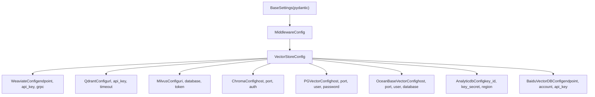
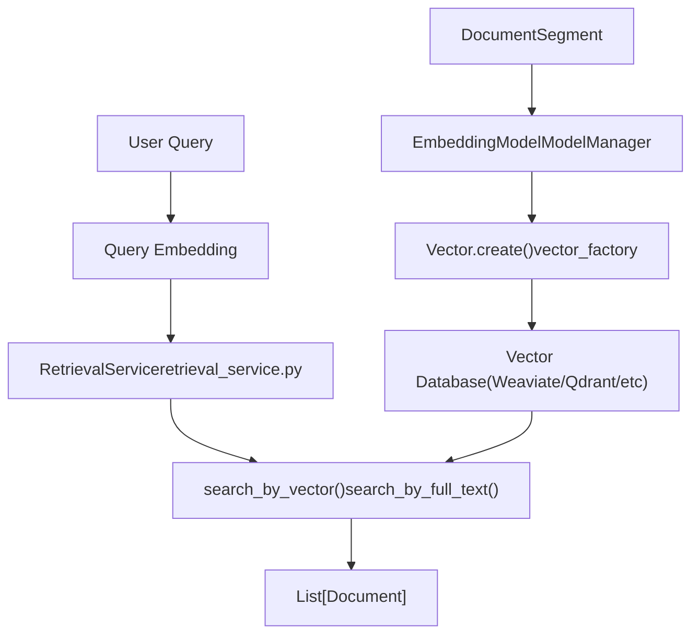
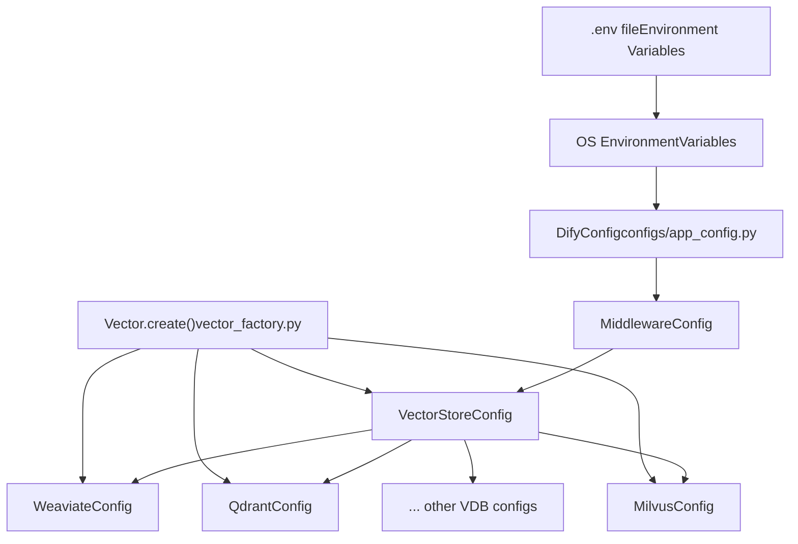

# Vector Database Integration

Relevant source files

-   [api/.env.example](https://github.com/langgenius/dify/blob/92dbc94f/api/.env.example)
-   [api/app.py](https://github.com/langgenius/dify/blob/92dbc94f/api/app.py)
-   [api/app\_factory.py](https://github.com/langgenius/dify/blob/92dbc94f/api/app_factory.py)
-   [api/commands.py](https://github.com/langgenius/dify/blob/92dbc94f/api/commands.py)
-   [api/configs/feature/\_\_init\_\_.py](https://github.com/langgenius/dify/blob/92dbc94f/api/configs/feature/__init__.py)
-   [api/configs/middleware/\_\_init\_\_.py](https://github.com/langgenius/dify/blob/92dbc94f/api/configs/middleware/__init__.py)
-   [api/configs/packaging/\_\_init\_\_.py](https://github.com/langgenius/dify/blob/92dbc94f/api/configs/packaging/__init__.py)
-   [api/controllers/console/datasets/datasets.py](https://github.com/langgenius/dify/blob/92dbc94f/api/controllers/console/datasets/datasets.py)
-   [api/core/rag/datasource/retrieval\_service.py](https://github.com/langgenius/dify/blob/92dbc94f/api/core/rag/datasource/retrieval_service.py)
-   [api/core/rag/datasource/vdb/vector\_factory.py](https://github.com/langgenius/dify/blob/92dbc94f/api/core/rag/datasource/vdb/vector_factory.py)
-   [api/core/rag/datasource/vdb/vector\_type.py](https://github.com/langgenius/dify/blob/92dbc94f/api/core/rag/datasource/vdb/vector_type.py)
-   [api/core/rag/entities/metadata\_entities.py](https://github.com/langgenius/dify/blob/92dbc94f/api/core/rag/entities/metadata_entities.py)
-   [api/core/rag/retrieval/dataset\_retrieval.py](https://github.com/langgenius/dify/blob/92dbc94f/api/core/rag/retrieval/dataset_retrieval.py)
-   [api/core/workflow/nodes/knowledge\_retrieval/entities.py](https://github.com/langgenius/dify/blob/92dbc94f/api/core/workflow/nodes/knowledge_retrieval/entities.py)
-   [api/core/workflow/nodes/knowledge\_retrieval/knowledge\_retrieval\_node.py](https://github.com/langgenius/dify/blob/92dbc94f/api/core/workflow/nodes/knowledge_retrieval/knowledge_retrieval_node.py)
-   [api/core/workflow/nodes/list\_operator/entities.py](https://github.com/langgenius/dify/blob/92dbc94f/api/core/workflow/nodes/list_operator/entities.py)
-   [api/core/workflow/nodes/list\_operator/exc.py](https://github.com/langgenius/dify/blob/92dbc94f/api/core/workflow/nodes/list_operator/exc.py)
-   [api/core/workflow/nodes/list\_operator/node.py](https://github.com/langgenius/dify/blob/92dbc94f/api/core/workflow/nodes/list_operator/node.py)
-   [api/core/workflow/nodes/question\_classifier/entities.py](https://github.com/langgenius/dify/blob/92dbc94f/api/core/workflow/nodes/question_classifier/entities.py)
-   [api/extensions/ext\_storage.py](https://github.com/langgenius/dify/blob/92dbc94f/api/extensions/ext_storage.py)
-   [api/extensions/storage/storage\_type.py](https://github.com/langgenius/dify/blob/92dbc94f/api/extensions/storage/storage_type.py)
-   [api/pyproject.toml](https://github.com/langgenius/dify/blob/92dbc94f/api/pyproject.toml)
-   [api/services/hit\_testing\_service.py](https://github.com/langgenius/dify/blob/92dbc94f/api/services/hit_testing_service.py)
-   [api/tests/unit\_tests/configs/test\_dify\_config.py](https://github.com/langgenius/dify/blob/92dbc94f/api/tests/unit_tests/configs/test_dify_config.py)
-   [api/tests/unit\_tests/core/rag/retrieval/\_\_init\_\_.py](https://github.com/langgenius/dify/blob/92dbc94f/api/tests/unit_tests/core/rag/retrieval/__init__.py)
-   [api/tests/unit\_tests/core/rag/retrieval/test\_dataset\_retrieval.py](https://github.com/langgenius/dify/blob/92dbc94f/api/tests/unit_tests/core/rag/retrieval/test_dataset_retrieval.py)
-   [api/tests/unit\_tests/core/workflow/nodes/test\_list\_operator.py](https://github.com/langgenius/dify/blob/92dbc94f/api/tests/unit_tests/core/workflow/nodes/test_list_operator.py)
-   [api/uv.lock](https://github.com/langgenius/dify/blob/92dbc94f/api/uv.lock)
-   [dev/pytest/pytest\_vdb.sh](https://github.com/langgenius/dify/blob/92dbc94f/dev/pytest/pytest_vdb.sh)
-   [docker/.env.example](https://github.com/langgenius/dify/blob/92dbc94f/docker/.env.example)
-   [docker/docker-compose-template.yaml](https://github.com/langgenius/dify/blob/92dbc94f/docker/docker-compose-template.yaml)
-   [docker/docker-compose.middleware.yaml](https://github.com/langgenius/dify/blob/92dbc94f/docker/docker-compose.middleware.yaml)
-   [docker/docker-compose.yaml](https://github.com/langgenius/dify/blob/92dbc94f/docker/docker-compose.yaml)
-   [docker/middleware.env.example](https://github.com/langgenius/dify/blob/92dbc94f/docker/middleware.env.example)
-   [web/app/components/workflow/nodes/knowledge-retrieval/components/metadata/condition-list/utils.ts](https://github.com/langgenius/dify/blob/92dbc94f/web/app/components/workflow/nodes/knowledge-retrieval/components/metadata/condition-list/utils.ts)
-   [web/app/components/workflow/nodes/knowledge-retrieval/components/metadata/metadata-icon.tsx](https://github.com/langgenius/dify/blob/92dbc94f/web/app/components/workflow/nodes/knowledge-retrieval/components/metadata/metadata-icon.tsx)
-   [web/app/components/workflow/nodes/list-operator/components/extract-input.tsx](https://github.com/langgenius/dify/blob/92dbc94f/web/app/components/workflow/nodes/list-operator/components/extract-input.tsx)
-   [web/app/components/workflow/nodes/list-operator/components/filter-condition.tsx](https://github.com/langgenius/dify/blob/92dbc94f/web/app/components/workflow/nodes/list-operator/components/filter-condition.tsx)
-   [web/app/components/workflow/nodes/list-operator/default.ts](https://github.com/langgenius/dify/blob/92dbc94f/web/app/components/workflow/nodes/list-operator/default.ts)
-   [web/app/components/workflow/nodes/list-operator/panel.tsx](https://github.com/langgenius/dify/blob/92dbc94f/web/app/components/workflow/nodes/list-operator/panel.tsx)
-   [web/app/components/workflow/nodes/list-operator/types.ts](https://github.com/langgenius/dify/blob/92dbc94f/web/app/components/workflow/nodes/list-operator/types.ts)
-   [web/app/components/workflow/nodes/utils.ts](https://github.com/langgenius/dify/blob/92dbc94f/web/app/components/workflow/nodes/utils.ts)
-   [web/package.json](https://github.com/langgenius/dify/blob/92dbc94f/web/package.json)

This document explains Dify's pluggable vector database architecture, which enables the platform to support 30+ different vector storage backends for document embeddings and semantic search. The system uses a factory pattern with environment-based configuration to abstract vendor-specific implementations behind a common interface.

For information about the broader RAG system that uses these vector databases, see [Knowledge Base and RAG System](/langgenius/dify/4-knowledge-base-and-rag-system). For details on document indexing and embedding generation, see [Document Indexing Pipeline](/langgenius/dify/4.2-document-indexing-pipeline).

---

## Supported Vector Databases

Dify supports a wide range of vector database backends through a unified abstraction layer. The `VectorType` enum defines all supported implementations:

**Vector Database Type Enumeration**

```mermaid
flowchart TD
    VectorType["VectorType(StrEnum)"]
    Weaviate["WEAVIATE"]
    Qdrant["QDRANT"]
    Milvus["MILVUS"]
    Chroma["CHROMA"]
    PGVector["PGVECTOR"]
    PGVectoRS["PGVECTO_RS"]
    OpenSearch["OPENSEARCH"]
    Elasticsearch["ELASTICSEARCH"]
    AlibabaMySQL["ALIBABACLOUD_MYSQL"]
    AnalyticDB["ANALYTICDB"]
    BaiduVector["BAIDU"]
    TencentVector["TENCENT"]
    Lindorm["LINDORM"]
    HuaweiCloud["HUAWEI_CLOUD"]
    ViKingDB["VIKINGDB"]
    Tablestore["TABLESTORE"]
    Upstash["UPSTASH"]
    OceanBase["OCEANBASE"]
    Matrixone["MATRIXONE"]
    TiDB["TIDB_VECTOR"]
    TiDBQdrant["TIDB_ON_QDRANT"]
    Couchbase["COUCHBASE"]
    Oracle["ORACLE"]
    MyScale["MYSCALE"]
    Relyt["RELYT"]
    OpenGauss["OPENGAUSS"]
    Vastbase["VASTBASE"]
    Iris["IRIS"]
    ClickZetta["CLICKZETTA"]

    VectorType --> Weaviate
    VectorType --> Qdrant
    VectorType --> Milvus
    VectorType --> Chroma
    VectorType --> PGVector
    VectorType --> AlibabaMySQL
    VectorType --> OceanBase
    VectorType --> TencentVector
```


Sources: [api/core/rag/datasource/vdb/vector\_type.py1-31](https://github.com/langgenius/dify/blob/92dbc94f/api/core/rag/datasource/vdb/vector_type.py#L1-L31)

The system categorizes vector databases into three groups:

| Category | Examples | Use Case |
| --- | --- | --- |
| **Open Source** | Weaviate, Qdrant, Milvus, Chroma, PGVector | Self-hosted deployments, full control |
| **Cloud Providers** | Alibaba Cloud, Tencent, Baidu, Huawei | Regional compliance, managed services |
| **Specialized** | OceanBase, TiDB, Couchbase, Oracle | Existing database infrastructure, hybrid workloads |

Sources: [api/core/rag/datasource/vdb/vector\_type.py1-31](https://github.com/langgenius/dify/blob/92dbc94f/api/core/rag/datasource/vdb/vector_type.py#L1-L31) [docker/.env.example529-687](https://github.com/langgenius/dify/blob/92dbc94f/docker/.env.example#L529-L687)

---

## Configuration Architecture

The vector database configuration system uses Pydantic models for type-safe, validated settings. Each vector database has its own configuration class inheriting from `BaseSettings`.

**Configuration Class Hierarchy**


Sources: [api/configs/middleware/\_\_init\_\_.py1-175](https://github.com/langgenius/dify/blob/92dbc94f/api/configs/middleware/__init__.py#L1-L175) [api/configs/middleware/vdb/weaviate\_config.py](https://github.com/langgenius/dify/blob/92dbc94f/api/configs/middleware/vdb/weaviate_config.py) [api/configs/middleware/vdb/qdrant\_config.py](https://github.com/langgenius/dify/blob/92dbc94f/api/configs/middleware/vdb/qdrant_config.py)

### VectorStoreConfig Class

The `VectorStoreConfig` class manages the global vector database selection and provides access to vendor-specific configurations:

```
class VectorStoreConfig(BaseSettings):
    VECTOR_STORE: str = Field(
        description="Vector store type (weaviate, qdrant, milvus, etc.)",
        default="weaviate"
    )
    VECTOR_INDEX_NAME_PREFIX: str = Field(
        description="Prefix for collection names in vector database",
        default="Vector_index"
    )
```
Key configuration attributes:

-   `VECTOR_STORE`: Selected vector database backend (must match `VectorType` enum)
-   `VECTOR_INDEX_NAME_PREFIX`: Prefix for collection/index names to avoid conflicts
-   Individual config objects for each supported database (e.g., `WEAVIATE`, `QDRANT`, `MILVUS`)

Sources: [api/configs/middleware/\_\_init\_\_.py90-175](https://github.com/langgenius/dify/blob/92dbc94f/api/configs/middleware/__init__.py#L90-L175)

### Example: Weaviate Configuration

```
class WeaviateConfig(BaseSettings):
    WEAVIATE_ENDPOINT: HttpUrl = Field(
        description="Weaviate instance URL",
        default="http://weaviate:8080"
    )
    WEAVIATE_API_KEY: str = Field(
        description="API key for authentication",
        default="WVF5YThaHlkYwhGUSmCRgsX3tD5ngdN8pkih"
    )
    WEAVIATE_GRPC_ENABLED: bool = Field(
        description="Enable gRPC for better performance",
        default=False
    )
    WEAVIATE_BATCH_SIZE: PositiveInt = Field(
        description="Batch size for bulk operations",
        default=100
    )
```
Sources: [docker/.env.example539-543](https://github.com/langgenius/dify/blob/92dbc94f/docker/.env.example#L539-L543) [docker/docker-compose.yaml176-179](https://github.com/langgenius/dify/blob/92dbc94f/docker/docker-compose.yaml#L176-L179)

---

## Vector Factory Pattern

The `Vector` class implements a factory pattern to instantiate the appropriate vector database client based on configuration. This abstraction allows the RAG system to work with any supported backend without code changes.

**Vector Factory Flow**

> **[Mermaid sequence]**
> *(图表结构无法解析)*

Sources: [api/core/rag/datasource/vdb/vector\_factory.py1-244](https://github.com/langgenius/dify/blob/92dbc94f/api/core/rag/datasource/vdb/vector_factory.py#L1-L244)

### Vector Factory Implementation

The factory provides two main methods:

**`Vector.create(dataset, attributes)` Method**

```
Inputs:
  - dataset: Dataset object with indexing configuration
  - attributes: List of metadata fields to store

Process:
  1. Determine vector type from dataset or global config
  2. Generate collection name with prefix
  3. Create cached embedding wrapper
  4. Instantiate vendor-specific vector class

Output:
  - BaseVector subclass instance (e.g., WeaviateVector)
```
Sources: [api/core/rag/datasource/vdb/vector\_factory.py51-109](https://github.com/langgenius/dify/blob/92dbc94f/api/core/rag/datasource/vdb/vector_factory.py#L51-L109)

### Collection Naming Convention

Collections are named using a deterministic pattern to ensure consistency:

```
def gen_collection_name_by_id(dataset_id: str) -> str:
    """
    Generate collection name with prefix and dataset ID.
    Format: {prefix}_{dataset_id}
    """
    prefix = dify_config.VECTOR_STORE.VECTOR_INDEX_NAME_PREFIX
    return f"{prefix}_{dataset_id}"
```
Sources: [api/core/rag/datasource/vdb/vector\_factory.py111-123](https://github.com/langgenius/dify/blob/92dbc94f/api/core/rag/datasource/vdb/vector_factory.py#L111-L123)

### BaseVector Interface

All vector database implementations must extend `BaseVector` and implement these core methods:

| Method | Purpose | Returns |
| --- | --- | --- |
| `create(texts, embeddings, metadatas)` | Create new collection and add documents | List of document IDs |
| `add_texts(texts, embeddings, metadatas)` | Add documents to existing collection | List of document IDs |
| `delete_by_ids(ids)` | Remove documents by ID | None |
| `delete_by_metadata_field(key, value)` | Remove documents matching metadata | None |
| `search_by_vector(query_vector, top_k)` | Semantic similarity search | List of Document objects |
| `search_by_full_text(query, top_k)` | Full-text keyword search | List of Document objects |
| `delete()` | Remove entire collection | None |

Sources: [api/core/rag/datasource/vdb/vector\_base.py](https://github.com/langgenius/dify/blob/92dbc94f/api/core/rag/datasource/vdb/vector_base.py)

---

## Integration with RAG Pipeline

Vector databases are used throughout Dify's RAG system for storing embeddings and retrieving relevant documents during query time.

**RAG Pipeline Vector Database Integration**


Sources: [api/core/rag/datasource/retrieval\_service.py1-526](https://github.com/langgenius/dify/blob/92dbc94f/api/core/rag/datasource/retrieval_service.py#L1-L526) [api/core/rag/datasource/vdb/vector\_factory.py51-244](https://github.com/langgenius/dify/blob/92dbc94f/api/core/rag/datasource/vdb/vector_factory.py#L51-L244)

### Indexing Pipeline Integration

When documents are indexed, the system creates embeddings and stores them in the configured vector database:

```
# From IndexingRunner
def _process_segments(dataset: Dataset, segments: list):
    # Get vector store instance
    vector = Vector.create(
        dataset=dataset,
        attributes=['doc_id', 'doc_hash', 'document_id', 'dataset_id']
    )

    # Generate embeddings
    embeddings = embedding_model.embed_documents(
        [segment.content for segment in segments]
    )

    # Store in vector database
    vector.add_texts(
        texts=[segment.content for segment in segments],
        embeddings=embeddings,
        metadatas=[segment.metadata for segment in segments]
    )
```
Sources: [api/core/indexing\_runner.py](https://github.com/langgenius/dify/blob/92dbc94f/api/core/indexing_runner.py) [api/core/rag/datasource/vdb/vector\_factory.py51-109](https://github.com/langgenius/dify/blob/92dbc94f/api/core/rag/datasource/vdb/vector_factory.py#L51-L109)

### Retrieval Service Usage

The `RetrievalService` class uses vector databases to find relevant documents:

```
class RetrievalService:
    @classmethod
    def retrieve(cls,
                 retrieval_method: RetrievalMethod,
                 dataset_id: str,
                 query: str,
                 top_k: int = 4,
                 score_threshold: float = 0.0):

        # Get vector instance for dataset
        vector = Vector.create_from_dataset(dataset)

        # Generate query embedding
        query_embedding = embedding_model.embed_query(query)

        # Search based on method
        if retrieval_method == RetrievalMethod.SEMANTIC_SEARCH:
            documents = vector.search_by_vector(
                query_vector=query_embedding,
                top_k=top_k
            )
        elif retrieval_method == RetrievalMethod.FULL_TEXT_SEARCH:
            documents = vector.search_by_full_text(
                query=query,
                top_k=top_k
            )
        # ... handle hybrid search

        return documents
```
Sources: [api/core/rag/datasource/retrieval\_service.py43-154](https://github.com/langgenius/dify/blob/92dbc94f/api/core/rag/datasource/retrieval_service.py#L43-L154)

### Search Method Support

Different vector databases support different search methods:

| Search Method | Description | Required VDB Feature |
| --- | --- | --- |
| `SEMANTIC_SEARCH` | Vector similarity search | Vector indexing (all VDBs) |
| `FULL_TEXT_SEARCH` | Keyword-based search | Full-text index (limited support) |
| `HYBRID` | Combined semantic + keyword | Both features (e.g., Weaviate, Qdrant, Milvus) |

Sources: [api/core/rag/retrieval/retrieval\_methods.py](https://github.com/langgenius/dify/blob/92dbc94f/api/core/rag/retrieval/retrieval_methods.py) [api/core/rag/datasource/retrieval\_service.py43-154](https://github.com/langgenius/dify/blob/92dbc94f/api/core/rag/datasource/retrieval_service.py#L43-L154)

---

## Environment Variables and Docker Configuration

### Environment Variable Patterns

Each vector database follows a consistent naming pattern for environment variables:

```
{VDB_NAME}_{PARAMETER}={value}

Examples:
WEAVIATE_ENDPOINT=http://weaviate:8080
WEAVIATE_API_KEY=your-api-key
QDRANT_URL=http://qdrant:6333
QDRANT_API_KEY=your-api-key
MILVUS_URI=http://milvus:19530
```
Sources: [docker/.env.example529-687](https://github.com/langgenius/dify/blob/92dbc94f/docker/.env.example#L529-L687) [api/.env.example180-377](https://github.com/langgenius/dify/blob/92dbc94f/api/.env.example#L180-L377)

### Common Configuration Parameters

| Parameter Type | Environment Variable | Purpose |
| --- | --- | --- |
| **Selection** | `VECTOR_STORE` | Choose vector database backend |
| **Collection Prefix** | `VECTOR_INDEX_NAME_PREFIX` | Namespace for collections |
| **Connection** | `{VDB}_HOST`, `{VDB}_PORT` | Network endpoint |
| **Authentication** | `{VDB}_API_KEY`, `{VDB}_USER`, `{VDB}_PASSWORD` | Access credentials |
| **Database** | `{VDB}_DATABASE` | Database/namespace name |
| **Performance** | `{VDB}_TIMEOUT`, `{VDB}_BATCH_SIZE` | Tuning parameters |

Sources: [docker/.env.example529-687](https://github.com/langgenius/dify/blob/92dbc94f/docker/.env.example#L529-L687)

### Docker Compose Configuration

Vector databases can be deployed as part of the Docker Compose stack using profiles:

```
services:
  # Weaviate service
  weaviate:
    image: semitechnologies/weaviate:1.28.3
    profiles:
      - weaviate
    environment:
      QUERY_DEFAULTS_LIMIT: 25
      AUTHENTICATION_ANONYMOUS_ACCESS_ENABLED: 'true'
      PERSISTENCE_DATA_PATH: '/var/lib/weaviate'
      DEFAULT_VECTORIZER_MODULE: 'none'
      AUTHENTICATION_APIKEY_ENABLED: 'true'
      AUTHENTICATION_APIKEY_ALLOWED_KEYS: ${WEAVIATE_API_KEY}
    volumes:
      - ./volumes/weaviate:/var/lib/weaviate
    ports:
      - "${WEAVIATE_PORT:-8080}:8080"
      - "${WEAVIATE_GRPC_PORT:-50051}:50051"
```
Sources: [docker/docker-compose.middleware.yaml179-242](https://github.com/langgenius/dify/blob/92dbc94f/docker/docker-compose.middleware.yaml#L179-L242)

### Activating Vector Database Services

To use a specific vector database in Docker Compose:

```
# Set COMPOSE_PROFILES to include the vector database
export COMPOSE_PROFILES=postgresql,weaviate

# Or specify in docker-compose command
docker-compose --profile weaviate up -d

# Or set in .env file
COMPOSE_PROFILES=postgresql,weaviate
```
Sources: [docker/README.md1-243](https://github.com/langgenius/dify/blob/92dbc94f/docker/README.md#L1-L243) [docker/docker-compose.middleware.yaml1-326](https://github.com/langgenius/dify/blob/92dbc94f/docker/docker-compose.middleware.yaml#L1-L326)

---

## Configuration Loading and Initialization

The vector database configuration is loaded through Dify's centralized configuration system:

**Configuration Loading Flow**


Sources: [api/configs/app\_config.py](https://github.com/langgenius/dify/blob/92dbc94f/api/configs/app_config.py) [api/configs/middleware/\_\_init\_\_.py1-175](https://github.com/langgenius/dify/blob/92dbc94f/api/configs/middleware/__init__.py#L1-L175) [api/core/rag/datasource/vdb/vector\_factory.py51-109](https://github.com/langgenius/dify/blob/92dbc94f/api/core/rag/datasource/vdb/vector_factory.py#L51-L109)

### Runtime Configuration Access

Vector database configurations are accessed through the `dify_config` singleton:

```
from configs import dify_config

# Get selected vector store type
vector_type = dify_config.VECTOR_STORE.VECTOR_STORE  # e.g., "weaviate"

# Get vector-specific config
if vector_type == "weaviate":
    config = dify_config.VECTOR_STORE.WEAVIATE
    endpoint = config.WEAVIATE_ENDPOINT
    api_key = config.WEAVIATE_API_KEY
elif vector_type == "qdrant":
    config = dify_config.VECTOR_STORE.QDRANT
    url = config.QDRANT_URL
    api_key = config.QDRANT_API_KEY
```
Sources: [api/core/rag/datasource/vdb/vector\_factory.py27-50](https://github.com/langgenius/dify/blob/92dbc94f/api/core/rag/datasource/vdb/vector_factory.py#L27-L50)

---

## Adding a New Vector Database

To add support for a new vector database backend:

### 1\. Add Vector Type Enum Value

```
# In api/core/rag/datasource/vdb/vector_type.py
class VectorType(StrEnum):
    # ... existing types
    NEW_VDB = "new_vdb"
```
Sources: [api/core/rag/datasource/vdb/vector\_type.py1-31](https://github.com/langgenius/dify/blob/92dbc94f/api/core/rag/datasource/vdb/vector_type.py#L1-L31)

### 2\. Create Configuration Class

```
# In api/configs/middleware/vdb/new_vdb_config.py
from pydantic import Field, HttpUrl
from pydantic_settings import BaseSettings

class NewVdbConfig(BaseSettings):
    NEW_VDB_ENDPOINT: HttpUrl = Field(
        description="New VDB endpoint URL",
        default=None
    )
    NEW_VDB_API_KEY: str = Field(
        description="API key for authentication",
        default=""
    )
    NEW_VDB_DATABASE: str = Field(
        description="Database name",
        default="dify"
    )
```
Sources: [api/configs/middleware/vdb/weaviate\_config.py](https://github.com/langgenius/dify/blob/92dbc94f/api/configs/middleware/vdb/weaviate_config.py) [api/configs/middleware/\_\_init\_\_.py90-175](https://github.com/langgenius/dify/blob/92dbc94f/api/configs/middleware/__init__.py#L90-L175)

### 3\. Add Configuration to VectorStoreConfig

```
# In api/configs/middleware/__init__.py
class VectorStoreConfig(BaseSettings):
    # ... existing configs
    NEW_VDB: NewVdbConfig = Field(default_factory=NewVdbConfig)
```
Sources: [api/configs/middleware/\_\_init\_\_.py90-175](https://github.com/langgenius/dify/blob/92dbc94f/api/configs/middleware/__init__.py#L90-L175)

### 4\. Implement BaseVector Interface

```
# In api/core/rag/datasource/vdb/new_vdb/new_vdb_vector.py
from core.rag.datasource.vdb.vector_base import BaseVector
from core.rag.models.document import Document

class NewVdbVector(BaseVector):
    def __init__(self, collection_name: str, config: NewVdbConfig):
        self._client = create_new_vdb_client(config)
        self._collection_name = collection_name

    def create(self, texts: list[str], embeddings: list,
               metadatas: list[dict]) -> list[str]:
        # Implement document creation
        pass

    def add_texts(self, texts: list[str], embeddings: list,
                  metadatas: list[dict]) -> list[str]:
        # Implement adding documents
        pass

    def search_by_vector(self, query_vector: list[float],
                        top_k: int = 4) -> list[Document]:
        # Implement vector search
        pass

    def delete_by_ids(self, ids: list[str]) -> None:
        # Implement deletion
        pass

    def delete(self) -> None:
        # Implement collection deletion
        pass
```
Sources: [api/core/rag/datasource/vdb/vector\_base.py](https://github.com/langgenius/dify/blob/92dbc94f/api/core/rag/datasource/vdb/vector_base.py)

### 5\. Register in Vector Factory

```
# In api/core/rag/datasource/vdb/vector_factory.py
def init_vector(self, dataset: Dataset, attributes: list,
                embeddings: Embeddings) -> BaseVector:
    vector_type = VectorType.value_of(dataset.index_struct_dict.get("type"))

    if vector_type == VectorType.NEW_VDB:
        from core.rag.datasource.vdb.new_vdb.new_vdb_vector import NewVdbVector
        config = dify_config.VECTOR_STORE.NEW_VDB
        return NewVdbVector(
            collection_name=collection_name,
            config=config
        )
    # ... handle other types
```
Sources: [api/core/rag/datasource/vdb/vector\_factory.py51-109](https://github.com/langgenius/dify/blob/92dbc94f/api/core/rag/datasource/vdb/vector_factory.py#L51-L109)

### 6\. Add Docker Compose Profile (Optional)

```
# In docker/docker-compose.middleware.yaml
services:
  new_vdb:
    image: newvdb/newvdb:latest
    profiles:
      - new_vdb
    environment:
      NEW_VDB_API_KEY: ${NEW_VDB_API_KEY}
    volumes:
      - ./volumes/new_vdb:/data
    ports:
      - "${NEW_VDB_PORT:-9999}:9999"
```
Sources: [docker/docker-compose.middleware.yaml1-326](https://github.com/langgenius/dify/blob/92dbc94f/docker/docker-compose.middleware.yaml#L1-L326)

### 7\. Add Environment Variables

```
# In docker/.env.example and api/.env.example
NEW_VDB_ENDPOINT=http://new_vdb:9999
NEW_VDB_API_KEY=your-api-key
NEW_VDB_DATABASE=dify
```
Sources: [docker/.env.example529-687](https://github.com/langgenius/dify/blob/92dbc94f/docker/.env.example#L529-L687) [api/.env.example180-377](https://github.com/langgenius/dify/blob/92dbc94f/api/.env.example#L180-L377)

### 8\. Add Python Dependencies

```
# In api/pyproject.toml
[dependency-groups]
vdb = [
    # ... existing dependencies
    "newvdb-client~=1.0.0",
]
```
Sources: [api/pyproject.toml200-230](https://github.com/langgenius/dify/blob/92dbc94f/api/pyproject.toml#L200-L230)

---

## Testing Vector Database Integration

The codebase includes comprehensive tests for vector database implementations:

```
# Run all vector database tests
./dev/pytest/pytest_vdb.sh

# Run specific VDB tests
pytest tests/integration_tests/vdb/test_weaviate.py
pytest tests/integration_tests/vdb/test_qdrant.py
pytest tests/integration_tests/vdb/test_milvus.py
```
Sources: [dev/pytest/pytest\_vdb.sh1-30](https://github.com/langgenius/dify/blob/92dbc94f/dev/pytest/pytest_vdb.sh#L1-L30)

### Test Coverage

Vector database tests verify:

-   Collection creation and deletion
-   Document insertion and retrieval
-   Vector similarity search
-   Full-text search (if supported)
-   Metadata filtering
-   Error handling and edge cases

Sources: [dev/pytest/pytest\_vdb.sh1-30](https://github.com/langgenius/dify/blob/92dbc94f/dev/pytest/pytest_vdb.sh#L1-L30) [.github/workflows/vdb-tests.yml](https://github.com/langgenius/dify/blob/92dbc94f/.github/workflows/vdb-tests.yml)

---

## Performance Considerations

### Connection Pooling

Vector database clients should implement connection pooling for production workloads:

```
# Example for PGVector
PGVECTOR_MIN_CONNECTION = 1
PGVECTOR_MAX_CONNECTION = 5
```
Sources: [docker/.env.example598-606](https://github.com/langgenius/dify/blob/92dbc94f/docker/.env.example#L598-L606)

### Batch Operations

Use batch operations for bulk indexing to improve performance:

```
# Weaviate batch size configuration
WEAVIATE_BATCH_SIZE = 100

# Used in vector_factory.py
vector.add_texts(
    texts=batch_texts,  # Process in batches
    embeddings=batch_embeddings,
    metadatas=batch_metadatas
)
```
Sources: [api/core/rag/datasource/vdb/vector\_factory.py51-109](https://github.com/langgenius/dify/blob/92dbc94f/api/core/rag/datasource/vdb/vector_factory.py#L51-L109)

### Hybrid Search Support

For databases supporting hybrid search (combining vector and keyword search), enable it for better retrieval quality:

```
# Milvus hybrid search
MILVUS_ENABLE_HYBRID_SEARCH = True

# OceanBase hybrid search
OCEANBASE_ENABLE_HYBRID_SEARCH = True
```
Sources: [docker/.env.example556-578](https://github.com/langgenius/dify/blob/92dbc94f/docker/.env.example#L556-L578)

---

## Summary

The vector database integration in Dify provides:

1.  **Unified Abstraction**: Factory pattern with `BaseVector` interface allows switching between 30+ vector databases without code changes
2.  **Type-Safe Configuration**: Pydantic-based config classes validate settings at startup
3.  **Flexible Deployment**: Docker Compose profiles enable easy local testing and production deployment
4.  **RAG Integration**: Seamless integration with document indexing and retrieval services
5.  **Extensibility**: Clear patterns for adding new vector database backends

The system prioritizes configurability and extensibility, allowing deployments to choose the vector database that best fits their infrastructure, compliance, and performance requirements.

Sources: [api/core/rag/datasource/vdb/vector\_factory.py1-244](https://github.com/langgenius/dify/blob/92dbc94f/api/core/rag/datasource/vdb/vector_factory.py#L1-L244) [api/core/rag/datasource/vdb/vector\_type.py1-31](https://github.com/langgenius/dify/blob/92dbc94f/api/core/rag/datasource/vdb/vector_type.py#L1-L31) [api/configs/middleware/\_\_init\_\_.py90-175](https://github.com/langgenius/dify/blob/92dbc94f/api/configs/middleware/__init__.py#L90-L175) [docker/.env.example529-687](https://github.com/langgenius/dify/blob/92dbc94f/docker/.env.example#L529-L687)
