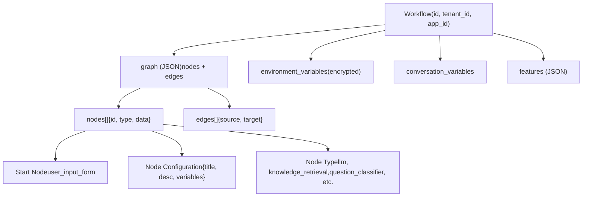
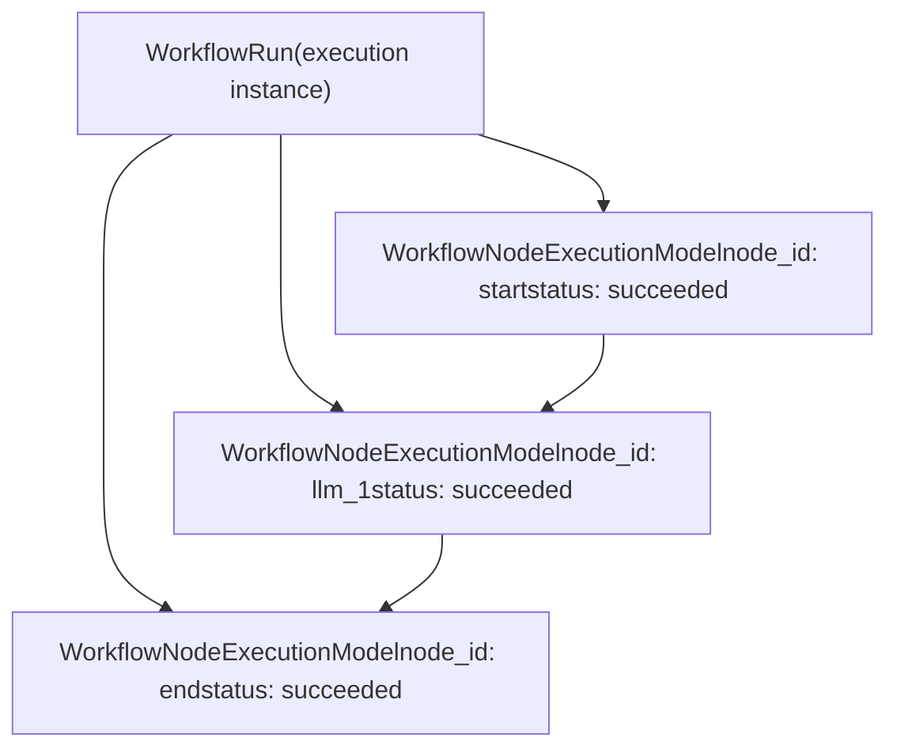
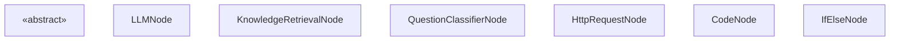
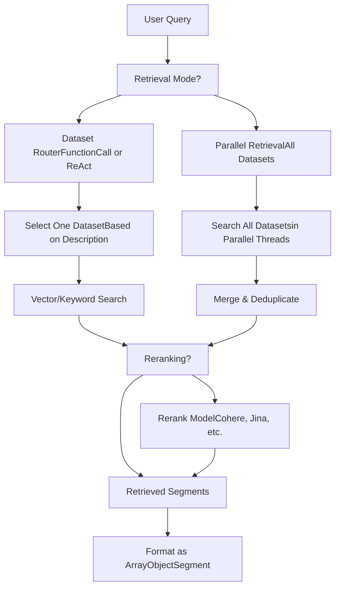
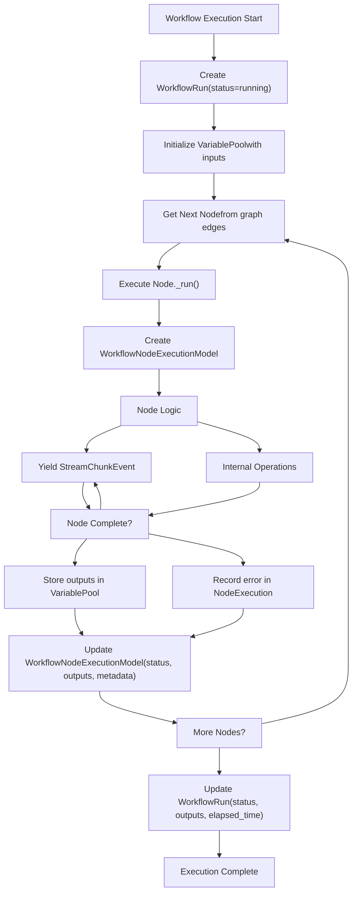
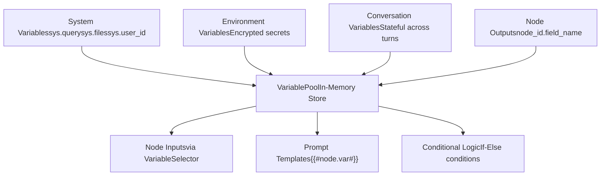

# Workflow System and Node Execution

Relevant source files

-   [api/core/rag/datasource/retrieval\_service.py](https://github.com/langgenius/dify/blob/92dbc94f/api/core/rag/datasource/retrieval_service.py)
-   [api/core/rag/entities/metadata\_entities.py](https://github.com/langgenius/dify/blob/92dbc94f/api/core/rag/entities/metadata_entities.py)
-   [api/core/rag/retrieval/dataset\_retrieval.py](https://github.com/langgenius/dify/blob/92dbc94f/api/core/rag/retrieval/dataset_retrieval.py)
-   [api/core/workflow/nodes/knowledge\_retrieval/entities.py](https://github.com/langgenius/dify/blob/92dbc94f/api/core/workflow/nodes/knowledge_retrieval/entities.py)
-   [api/core/workflow/nodes/knowledge\_retrieval/knowledge\_retrieval\_node.py](https://github.com/langgenius/dify/blob/92dbc94f/api/core/workflow/nodes/knowledge_retrieval/knowledge_retrieval_node.py)
-   [api/core/workflow/nodes/list\_operator/entities.py](https://github.com/langgenius/dify/blob/92dbc94f/api/core/workflow/nodes/list_operator/entities.py)
-   [api/core/workflow/nodes/list\_operator/exc.py](https://github.com/langgenius/dify/blob/92dbc94f/api/core/workflow/nodes/list_operator/exc.py)
-   [api/core/workflow/nodes/list\_operator/node.py](https://github.com/langgenius/dify/blob/92dbc94f/api/core/workflow/nodes/list_operator/node.py)
-   [api/core/workflow/nodes/question\_classifier/entities.py](https://github.com/langgenius/dify/blob/92dbc94f/api/core/workflow/nodes/question_classifier/entities.py)
-   [api/models/account.py](https://github.com/langgenius/dify/blob/92dbc94f/api/models/account.py)
-   [api/models/api\_based\_extension.py](https://github.com/langgenius/dify/blob/92dbc94f/api/models/api_based_extension.py)
-   [api/models/dataset.py](https://github.com/langgenius/dify/blob/92dbc94f/api/models/dataset.py)
-   [api/models/model.py](https://github.com/langgenius/dify/blob/92dbc94f/api/models/model.py)
-   [api/models/oauth.py](https://github.com/langgenius/dify/blob/92dbc94f/api/models/oauth.py)
-   [api/models/provider.py](https://github.com/langgenius/dify/blob/92dbc94f/api/models/provider.py)
-   [api/models/source.py](https://github.com/langgenius/dify/blob/92dbc94f/api/models/source.py)
-   [api/models/task.py](https://github.com/langgenius/dify/blob/92dbc94f/api/models/task.py)
-   [api/models/tools.py](https://github.com/langgenius/dify/blob/92dbc94f/api/models/tools.py)
-   [api/models/trigger.py](https://github.com/langgenius/dify/blob/92dbc94f/api/models/trigger.py)
-   [api/models/web.py](https://github.com/langgenius/dify/blob/92dbc94f/api/models/web.py)
-   [api/models/workflow.py](https://github.com/langgenius/dify/blob/92dbc94f/api/models/workflow.py)
-   [api/services/hit\_testing\_service.py](https://github.com/langgenius/dify/blob/92dbc94f/api/services/hit_testing_service.py)
-   [api/tests/test\_containers\_integration\_tests/services/test\_advanced\_prompt\_template\_service.py](https://github.com/langgenius/dify/blob/92dbc94f/api/tests/test_containers_integration_tests/services/test_advanced_prompt_template_service.py)
-   [api/tests/test\_containers\_integration\_tests/services/test\_agent\_service.py](https://github.com/langgenius/dify/blob/92dbc94f/api/tests/test_containers_integration_tests/services/test_agent_service.py)
-   [api/tests/test\_containers\_integration\_tests/tasks/\_\_init\_\_.py](https://github.com/langgenius/dify/blob/92dbc94f/api/tests/test_containers_integration_tests/tasks/__init__.py)
-   [api/tests/test\_containers\_integration\_tests/tasks/test\_add\_document\_to\_index\_task.py](https://github.com/langgenius/dify/blob/92dbc94f/api/tests/test_containers_integration_tests/tasks/test_add_document_to_index_task.py)
-   [api/tests/unit\_tests/core/rag/retrieval/\_\_init\_\_.py](https://github.com/langgenius/dify/blob/92dbc94f/api/tests/unit_tests/core/rag/retrieval/__init__.py)
-   [api/tests/unit\_tests/core/rag/retrieval/test\_dataset\_retrieval.py](https://github.com/langgenius/dify/blob/92dbc94f/api/tests/unit_tests/core/rag/retrieval/test_dataset_retrieval.py)
-   [api/tests/unit\_tests/core/test\_provider\_manager.py](https://github.com/langgenius/dify/blob/92dbc94f/api/tests/unit_tests/core/test_provider_manager.py)
-   [api/tests/unit\_tests/core/workflow/nodes/test\_list\_operator.py](https://github.com/langgenius/dify/blob/92dbc94f/api/tests/unit_tests/core/workflow/nodes/test_list_operator.py)
-   [web/app/components/workflow/nodes/knowledge-retrieval/components/metadata/condition-list/utils.ts](https://github.com/langgenius/dify/blob/92dbc94f/web/app/components/workflow/nodes/knowledge-retrieval/components/metadata/condition-list/utils.ts)
-   [web/app/components/workflow/nodes/knowledge-retrieval/components/metadata/metadata-icon.tsx](https://github.com/langgenius/dify/blob/92dbc94f/web/app/components/workflow/nodes/knowledge-retrieval/components/metadata/metadata-icon.tsx)
-   [web/app/components/workflow/nodes/list-operator/components/extract-input.tsx](https://github.com/langgenius/dify/blob/92dbc94f/web/app/components/workflow/nodes/list-operator/components/extract-input.tsx)
-   [web/app/components/workflow/nodes/list-operator/components/filter-condition.tsx](https://github.com/langgenius/dify/blob/92dbc94f/web/app/components/workflow/nodes/list-operator/components/filter-condition.tsx)
-   [web/app/components/workflow/nodes/list-operator/default.ts](https://github.com/langgenius/dify/blob/92dbc94f/web/app/components/workflow/nodes/list-operator/default.ts)
-   [web/app/components/workflow/nodes/list-operator/panel.tsx](https://github.com/langgenius/dify/blob/92dbc94f/web/app/components/workflow/nodes/list-operator/panel.tsx)
-   [web/app/components/workflow/nodes/list-operator/types.ts](https://github.com/langgenius/dify/blob/92dbc94f/web/app/components/workflow/nodes/list-operator/types.ts)
-   [web/app/components/workflow/nodes/utils.ts](https://github.com/langgenius/dify/blob/92dbc94f/web/app/components/workflow/nodes/utils.ts)

## Purpose and Scope

This document covers the workflow execution engine in Dify, which orchestrates multi-step AI pipelines by executing interconnected nodes. It details the workflow definition structure, node execution model, built-in node types, and the runtime variable pool that enables data flow between nodes.

For information about specific node configurations, see [Additional Workflow Node Types](/langgenius/dify/5.5-trigger-system-and-workflow-automation). For workflow-as-tool integration, see [Tool Provider Architecture](/langgenius/dify/6.1-tool-provider-architecture). For app-level workflow configuration, see [Application Types and Execution Modes](/langgenius/dify/2.3-application-types-and-execution-modes).

---

## Workflow Definition and Structure

### Workflow Model

The `Workflow` class [api/models/workflow.py100-554](https://github.com/langgenius/dify/blob/92dbc94f/api/models/workflow.py#L100-L554) represents a workflow definition stored in the database. Each workflow contains:

-   **Graph Structure**: JSON representation of nodes and edges defining the execution flow
-   **Type**: `workflow`, `chat`, or `rag-pipeline` [api/models/workflow.py60-93](https://github.com/langgenius/dify/blob/92dbc94f/api/models/workflow.py#L60-L93)
-   **Version**: `draft` for working version, timestamp for published versions [api/models/workflow.py166](https://github.com/langgenius/dify/blob/92dbc94f/api/models/workflow.py#L166-L166)
-   **Environment Variables**: Encrypted variables available to all nodes [api/models/workflow.py428-461](https://github.com/langgenius/dify/blob/92dbc94f/api/models/workflow.py#L428-L461)
-   **Conversation Variables**: State maintained across conversation turns [api/models/workflow.py518-532](https://github.com/langgenius/dify/blob/92dbc94f/api/models/workflow.py#L518-L532)
-   **Features**: Configuration for file upload, opening statements, etc. [api/models/workflow.py282-313](https://github.com/langgenius/dify/blob/92dbc94f/api/models/workflow.py#L282-L313)


**Sources:** [api/models/workflow.py100-554](https://github.com/langgenius/dify/blob/92dbc94f/api/models/workflow.py#L100-L554)

### Graph JSON Structure

The workflow graph is stored as a JSON blob containing nodes and edges [api/models/workflow.py212-231](https://github.com/langgenius/dify/blob/92dbc94f/api/models/workflow.py#L212-L231):

| Field | Type | Description |
| --- | --- | --- |
| `nodes` | Array | List of node configurations with id, type, and data |
| `edges` | Array | Connections between nodes defining execution order |
| `viewport` | Object | UI canvas position and zoom level |

Each node in the graph contains [api/models/workflow.py315-361](https://github.com/langgenius/dify/blob/92dbc94f/api/models/workflow.py#L315-L361):

```
{
  "id": "node_id",
  "data": {
    "type": "llm",
    "title": "LLM Node",
    "variables": [...],
    "model": {...},
    "prompt_template": [...]
  }
}
```
The `walk_nodes()` method [api/models/workflow.py315-361](https://github.com/langgenius/dify/blob/92dbc94f/api/models/workflow.py#L315-L361) provides iteration over all nodes, optionally filtered by type.

**Sources:** [api/models/workflow.py212-361](https://github.com/langgenius/dify/blob/92dbc94f/api/models/workflow.py#L212-L361)

---

## Workflow Execution Model

### WorkflowRun Entity

`WorkflowRun` [api/models/workflow.py556-715](https://github.com/langgenius/dify/blob/92dbc94f/api/models/workflow.py#L556-L715) represents a single execution instance of a workflow:

| Field | Type | Description |
| --- | --- | --- |
| `id` | UUID | Unique run identifier |
| `workflow_id` | UUID | Reference to workflow definition |
| `tenant_id` | UUID | Workspace identifier |
| `app_id` | UUID | Application identifier |
| `triggered_from` | String | `debugging` or `app-run` |
| `version` | String | Workflow version executed |
| `graph` | JSON | Snapshot of workflow graph at execution time |
| `inputs` | JSON | Input variables provided to workflow |
| `status` | String | `running`, `succeeded`, `failed`, `stopped`, `partial-succeeded` |
| `outputs` | JSON | Final output values |
| `error` | Text | Error message if failed |
| `elapsed_time` | Float | Total execution time in seconds |
| `total_tokens` | BigInt | Cumulative LLM tokens used |
| `total_steps` | Int | Number of nodes executed |
| `exceptions_count` | Int | Count of node failures |
| `created_by_role` | String | `account` or `end_user` |
| `created_at` | Timestamp | Execution start time |
| `finished_at` | Timestamp | Execution end time |

**Sources:** [api/models/workflow.py556-715](https://github.com/langgenius/dify/blob/92dbc94f/api/models/workflow.py#L556-L715)

### WorkflowNodeExecutionModel

Individual node executions are tracked in `WorkflowNodeExecutionModel` [api/models/workflow.py727-1078](https://github.com/langgenius/dify/blob/92dbc94f/api/models/workflow.py#L727-L1078):


Each node execution record contains [api/models/workflow.py727-896](https://github.com/langgenius/dify/blob/92dbc94f/api/models/workflow.py#L727-L896):

-   **Execution Context**: `workflow_run_id`, `node_id`, `node_type`, `index` (execution order)
-   **Inputs/Outputs**: Serialized JSON of variables consumed and produced
-   **Process Data**: LLM prompts, API responses, intermediate computations
-   **Status**: `running`, `succeeded`, `failed`, `stopped`
-   **Metrics**: `elapsed_time`, `execution_metadata` (tokens, price)
-   **Error Info**: `error`, `error_type` for failed executions
-   **Execution Type**: `single-step` (debugging) or `workflow-run`

**Sources:** [api/models/workflow.py727-1078](https://github.com/langgenius/dify/blob/92dbc94f/api/models/workflow.py#L727-L1078)

### Execution Status Flow

> **[Mermaid stateDiagram]**
> *(图表结构无法解析)*

**Sources:** [api/models/workflow.py610](https://github.com/langgenius/dify/blob/92dbc94f/api/models/workflow.py#L610-L610) [api/core/workflow/enums.py](https://github.com/langgenius/dify/blob/92dbc94f/api/core/workflow/enums.py)

---

## Node Architecture and Base Classes

### Node Class Hierarchy

All workflow nodes inherit from the abstract `Node` base class:


**Sources:** [api/core/workflow/nodes/base/node.py](https://github.com/langgenius/dify/blob/92dbc94f/api/core/workflow/nodes/base/node.py) [api/core/workflow/nodes/llm/node.py108-351](https://github.com/langgenius/dify/blob/92dbc94f/api/core/workflow/nodes/llm/node.py#L108-L351) [api/core/workflow/nodes/knowledge\_retrieval/knowledge\_retrieval\_node.py85-432](https://github.com/langgenius/dify/blob/92dbc94f/api/core/workflow/nodes/knowledge_retrieval/knowledge_retrieval_node.py#L85-L432) [api/core/workflow/nodes/question\_classifier/question\_classifier\_node.py46-232](https://github.com/langgenius/dify/blob/92dbc94f/api/core/workflow/nodes/question_classifier/question_classifier_node.py#L46-L232)

### Node Execution Types

Nodes have two execution types [api/core/workflow/enums.py](https://github.com/langgenius/dify/blob/92dbc94f/api/core/workflow/enums.py):

| Type | Description | Node Examples |
| --- | --- | --- |
| `SEQUENTIAL` | Standard linear execution | LLM, Knowledge Retrieval, HTTP Request, Code |
| `BRANCH` | Conditional routing with edge selection | Question Classifier, If-Else |

Branch nodes return an `edge_source_handle` in their `NodeRunResult` [api/core/workflow/nodes/question\_classifier/question\_classifier\_node.py206-218](https://github.com/langgenius/dify/blob/92dbc94f/api/core/workflow/nodes/question_classifier/question_classifier_node.py#L206-L218) to indicate which outgoing edge to follow.

**Sources:** [api/core/workflow/enums.py](https://github.com/langgenius/dify/blob/92dbc94f/api/core/workflow/enums.py) [api/core/workflow/nodes/question\_classifier/question\_classifier\_node.py46-232](https://github.com/langgenius/dify/blob/92dbc94f/api/core/workflow/nodes/question_classifier/question_classifier_node.py#L46-L232)

### NodeRunResult Structure

Every node's `_run()` method returns a `NodeRunResult` containing [api/core/workflow/node\_events.py](https://github.com/langgenius/dify/blob/92dbc94f/api/core/workflow/node_events.py):

```
{
    "status": WorkflowNodeExecutionStatus,  # SUCCEEDED, FAILED, STOPPED
    "inputs": dict,                         # Variables consumed by node
    "process_data": dict,                   # Intermediate data (prompts, responses)
    "outputs": dict,                        # Variables produced by node
    "metadata": dict,                       # Metrics (tokens, price, duration)
    "llm_usage": LLMUsage,                 # Token consumption details
    "error": str | None,                    # Error message if failed
    "error_type": str | None,               # Exception class name
    "edge_source_handle": str | None        # For branch nodes
}
```
**Sources:** [api/core/workflow/node\_events.py](https://github.com/langgenius/dify/blob/92dbc94f/api/core/workflow/node_events.py)

---

## Core Node Types

### LLM Node

The `LLMNode` [api/core/workflow/nodes/llm/node.py108-351](https://github.com/langgenius/dify/blob/92dbc94f/api/core/workflow/nodes/llm/node.py#L108-L351) executes language model inference:

#### Configuration

`LLMNodeData` [api/core/workflow/nodes/llm/entities.py61-91](https://github.com/langgenius/dify/blob/92dbc94f/api/core/workflow/nodes/llm/entities.py#L61-L91) defines the node configuration:

| Field | Type | Description |
| --- | --- | --- |
| `model` | `ModelConfig` | Provider, model name, completion parameters |
| `prompt_template` | Sequence | Chat messages or completion template |
| `prompt_config` | `PromptConfig` | Jinja2 variables for dynamic prompts |
| `memory` | `MemoryConfig` | Conversation history configuration |
| `context` | `ContextConfig` | Knowledge base context injection |
| `vision` | `VisionConfig` | Image input configuration |
| `structured_output` | Mapping | JSON schema for structured responses |
| `reasoning_format` | `"separated"` or `"tagged"` | How to handle `<think>` reasoning tags |

**Sources:** [api/core/workflow/nodes/llm/entities.py61-91](https://github.com/langgenius/dify/blob/92dbc94f/api/core/workflow/nodes/llm/entities.py#L61-L91)

#### Execution Flow

> **[Mermaid sequence]**
> *(图表结构无法解析)*

**Sources:** [api/core/workflow/nodes/llm/node.py149-351](https://github.com/langgenius/dify/blob/92dbc94f/api/core/workflow/nodes/llm/node.py#L149-L351)

#### Streaming and Output Processing

The node yields events during execution [api/core/workflow/nodes/llm/node.py255-283](https://github.com/langgenius/dify/blob/92dbc94f/api/core/workflow/nodes/llm/node.py#L255-L283):

1.  **StreamChunkEvent**: Incremental text chunks as they arrive from LLM
2.  **ModelInvokeCompletedEvent**: Final result with full text, usage, and finish\_reason
3.  **StreamCompletedEvent**: Wraps NodeRunResult with final outputs

For models supporting reasoning [api/core/workflow/nodes/llm/node.py266-277](https://github.com/langgenius/dify/blob/92dbc94f/api/core/workflow/nodes/llm/node.py#L266-L277):

-   `reasoning_format="tagged"`: Keeps `<think>` tags in output text (backward compatibility)
-   `reasoning_format="separated"`: Extracts thinking into separate `reasoning_content` field

**Sources:** [api/core/workflow/nodes/llm/node.py149-566](https://github.com/langgenius/dify/blob/92dbc94f/api/core/workflow/nodes/llm/node.py#L149-L566)

#### Structured Output

When `structured_output_enabled` is true [api/core/workflow/nodes/llm/node.py375-391](https://github.com/langgenius/dify/blob/92dbc94f/api/core/workflow/nodes/llm/node.py#L375-L391) the node:

1.  Generates a JSON schema from the `structured_output` configuration
2.  Invokes `invoke_llm_with_structured_output()` to enforce schema compliance
3.  Returns parsed JSON in `outputs["structured_output"]`

**Sources:** [api/core/workflow/nodes/llm/node.py375-411](https://github.com/langgenius/dify/blob/92dbc94f/api/core/workflow/nodes/llm/node.py#L375-L411) [api/core/llm\_generator/output\_parser/structured\_output.py](https://github.com/langgenius/dify/blob/92dbc94f/api/core/llm_generator/output_parser/structured_output.py)

---

### Knowledge Retrieval Node

The `KnowledgeRetrievalNode` [api/core/workflow/nodes/knowledge\_retrieval/knowledge\_retrieval\_node.py85-432](https://github.com/langgenius/dify/blob/92dbc94f/api/core/workflow/nodes/knowledge_retrieval/knowledge_retrieval_node.py#L85-L432) queries dataset knowledge bases:

#### Configuration

`KnowledgeRetrievalNodeData` defines [api/core/workflow/nodes/knowledge\_retrieval/entities.py](https://github.com/langgenius/dify/blob/92dbc94f/api/core/workflow/nodes/knowledge_retrieval/entities.py):

| Field | Type | Description |
| --- | --- | --- |
| `dataset_ids` | List\[str\] | Knowledge bases to query |
| `query_variable_selector` | VariableSelector | Reference to query text variable |
| `query_attachment_selector` | VariableSelector | Reference to file attachment variable |
| `retrieval_mode` | `SINGLE` or `MULTIPLE` | Query one or all datasets |
| `single_retrieval_config` | Config | Router model for dataset selection |
| `multiple_retrieval_config` | Config | top\_k, score\_threshold, reranking |

**Sources:** [api/core/workflow/nodes/knowledge\_retrieval/entities.py](https://github.com/langgenius/dify/blob/92dbc94f/api/core/workflow/nodes/knowledge_retrieval/entities.py)

#### Retrieval Strategies


**Sources:** [api/core/workflow/nodes/knowledge\_retrieval/knowledge\_retrieval\_node.py123-431](https://github.com/langgenius/dify/blob/92dbc94f/api/core/workflow/nodes/knowledge_retrieval/knowledge_retrieval_node.py#L123-L431) [api/core/rag/retrieval/dataset\_retrieval.py332-462](https://github.com/langgenius/dify/blob/92dbc94f/api/core/rag/retrieval/dataset_retrieval.py#L332-L462)

#### Execution Flow

> **[Mermaid sequence]**
> *(图表结构无法解析)*

**Sources:** [api/core/workflow/nodes/knowledge\_retrieval/knowledge\_retrieval\_node.py123-220](https://github.com/langgenius/dify/blob/92dbc94f/api/core/workflow/nodes/knowledge_retrieval/knowledge_retrieval_node.py#L123-L220)

#### Output Format

Retrieved documents are returned as `ArrayObjectSegment` [api/core/workflow/nodes/knowledge\_retrieval/knowledge\_retrieval\_node.py377-430](https://github.com/langgenius/dify/blob/92dbc94f/api/core/workflow/nodes/knowledge_retrieval/knowledge_retrieval_node.py#L377-L430) with structure:

```
{
  "result": [
    {
      "metadata": {
        "_source": "knowledge",
        "dataset_id": "uuid",
        "dataset_name": "string",
        "document_id": "uuid",
        "document_name": "string",
        "segment_id": "uuid",
        "score": 0.95,
        "position": 1
      },
      "title": "Document Name",
      "content": "Retrieved text content",
      "files": ["file1.png", "file2.jpg"]
    }
  ]
}
```
**Sources:** [api/core/workflow/nodes/knowledge\_retrieval/knowledge\_retrieval\_node.py377-431](https://github.com/langgenius/dify/blob/92dbc94f/api/core/workflow/nodes/knowledge_retrieval/knowledge_retrieval_node.py#L377-L431)

---

### Question Classifier Node

The `QuestionClassifierNode` [api/core/workflow/nodes/question\_classifier/question\_classifier\_node.py46-232](https://github.com/langgenius/dify/blob/92dbc94f/api/core/workflow/nodes/question_classifier/question_classifier_node.py#L46-L232) routes execution based on query classification:

#### Configuration

`QuestionClassifierNodeData` defines [api/core/workflow/nodes/question\_classifier/entities.py](https://github.com/langgenius/dify/blob/92dbc94f/api/core/workflow/nodes/question_classifier/entities.py):

| Field | Type | Description |
| --- | --- | --- |
| `query_variable_selector` | VariableSelector | Query text to classify |
| `model` | ModelConfig | LLM for classification |
| `classes` | List\[ClassConfig\] | Category definitions (id, name) |
| `instruction` | String | Classification guidelines |
| `memory` | MemoryConfig | Conversation history |
| `vision` | VisionConfig | Image input support |

**Sources:** [api/core/workflow/nodes/question\_classifier/entities.py](https://github.com/langgenius/dify/blob/92dbc94f/api/core/workflow/nodes/question_classifier/entities.py)

#### Classification Process

> **[Mermaid sequence]**
> *(图表结构无法解析)*

**Sources:** [api/core/workflow/nodes/question\_classifier/question\_classifier\_node.py82-231](https://github.com/langgenius/dify/blob/92dbc94f/api/core/workflow/nodes/question_classifier/question_classifier_node.py#L82-L231)

#### Prompt Template

The node uses a structured prompt [api/core/workflow/nodes/question\_classifier/template\_prompts.py1-76](https://github.com/langgenius/dify/blob/92dbc94f/api/core/workflow/nodes/question_classifier/template_prompts.py#L1-L76):

```
### Job Description
You are a text classification engine...

### Task
Assign ONE category from the provided list...

### Format
{"input_text": ["query"], "categories": [...], "classification_instructions": [...]}

### Example
User: {"input_text": ["I recently had a great experience..."]}
Assistant: {"category_id": "f5660049...", "category_name": "Customer Service"}
```
The LLM response is parsed as JSON and validated against the configured classes [api/core/workflow/nodes/question\_classifier/question\_classifier\_node.py172-189](https://github.com/langgenius/dify/blob/92dbc94f/api/core/workflow/nodes/question_classifier/question_classifier_node.py#L172-L189)

**Sources:** [api/core/workflow/nodes/question\_classifier/template\_prompts.py1-76](https://github.com/langgenius/dify/blob/92dbc94f/api/core/workflow/nodes/question_classifier/template_prompts.py#L1-L76) [api/core/workflow/nodes/question\_classifier/question\_classifier\_node.py172-189](https://github.com/langgenius/dify/blob/92dbc94f/api/core/workflow/nodes/question_classifier/question_classifier_node.py#L172-L189)

#### Branch Execution

As a branch node, it returns `edge_source_handle` matching the classified `category_id` [api/core/workflow/nodes/question\_classifier/question\_classifier\_node.py206-218](https://github.com/langgenius/dify/blob/92dbc94f/api/core/workflow/nodes/question_classifier/question_classifier_node.py#L206-L218):

```
return NodeRunResult(
    status=WorkflowNodeExecutionStatus.SUCCEEDED,
    outputs={
        "class_name": category_name,
        "class_id": category_id,
    },
    edge_source_handle=category_id,  # Routes to matching edge
)
```
**Sources:** [api/core/workflow/nodes/question\_classifier/question\_classifier\_node.py206-218](https://github.com/langgenius/dify/blob/92dbc94f/api/core/workflow/nodes/question_classifier/question_classifier_node.py#L206-L218)

---

## Node Execution Flow

### Runtime Execution Sequence


**Sources:** [api/models/workflow.py556-715](https://github.com/langgenius/dify/blob/92dbc94f/api/models/workflow.py#L556-L715) [api/models/workflow.py727-896](https://github.com/langgenius/dify/blob/92dbc94f/api/models/workflow.py#L727-L896)

### Event Streaming

Nodes yield events during execution [api/core/workflow/node\_events.py](https://github.com/langgenius/dify/blob/92dbc94f/api/core/workflow/node_events.py):

| Event Type | Purpose | Emitted By |
| --- | --- | --- |
| `StreamChunkEvent` | Incremental text output | LLM nodes during streaming |
| `ModelInvokeCompletedEvent` | Final LLM result | LLM invocation handler |
| `RunRetrieverResourceEvent` | Knowledge retrieval results | Knowledge nodes |
| `NodeRunResult` | Node execution completion | All nodes (via StreamCompletedEvent) |

**Sources:** [api/core/workflow/node\_events.py](https://github.com/langgenius/dify/blob/92dbc94f/api/core/workflow/node_events.py) [api/core/workflow/nodes/llm/node.py255-328](https://github.com/langgenius/dify/blob/92dbc94f/api/core/workflow/nodes/llm/node.py#L255-L328)

### Error Handling

When a node fails [api/core/workflow/nodes/llm/node.py329-351](https://github.com/langgenius/dify/blob/92dbc94f/api/core/workflow/nodes/llm/node.py#L329-L351):

1.  Exception is caught in `_run()` method
2.  `NodeRunResult` created with `status=FAILED`
3.  Error message and type stored in result
4.  LLM usage tracked even on failure
5.  WorkflowRun may continue (partial success) or abort depending on configuration

**Sources:** [api/core/workflow/nodes/llm/node.py329-351](https://github.com/langgenius/dify/blob/92dbc94f/api/core/workflow/nodes/llm/node.py#L329-L351) [api/core/workflow/nodes/knowledge\_retrieval/knowledge\_retrieval\_node.py202-220](https://github.com/langgenius/dify/blob/92dbc94f/api/core/workflow/nodes/knowledge_retrieval/knowledge_retrieval_node.py#L202-L220)

---

## Variable Pool and Data Flow

### VariablePool Architecture

The `VariablePool` manages data flow between nodes [api/core/workflow/runtime.py](https://github.com/langgenius/dify/blob/92dbc94f/api/core/workflow/runtime.py):


**Sources:** [api/core/workflow/runtime.py](https://github.com/langgenius/dify/blob/92dbc94f/api/core/workflow/runtime.py) [api/core/workflow/constants.py](https://github.com/langgenius/dify/blob/92dbc94f/api/core/workflow/constants.py)

### Variable Types

Variables are stored as typed segments [api/core/variables/](https://github.com/langgenius/dify/blob/92dbc94f/api/core/variables/):

| Segment Type | Python Type | Description |
| --- | --- | --- |
| `StringSegment` | str | Plain text values |
| `IntegerSegment` | int | Integer numbers |
| `FloatSegment` | float | Floating point numbers |
| `ObjectSegment` | dict | JSON objects |
| `ArraySegment` | list | Generic arrays |
| `ArrayStringSegment` | list\[str\] | String arrays |
| `ArrayNumberSegment` | list\[float\] | Number arrays |
| `ArrayObjectSegment` | list\[dict\] | Object arrays |
| `FileSegment` | File | Single file reference |
| `ArrayFileSegment` | list\[File\] | Multiple files |
| `SecretVariable` | str (encrypted) | Encrypted sensitive data |
| `NoneSegment` | None | Null/undefined value |

**Sources:** [api/core/variables/](https://github.com/langgenius/dify/blob/92dbc94f/api/core/variables/)

### Variable Selector Syntax

Nodes reference variables using `VariableSelector` [api/core/workflow/nodes/base/entities.py](https://github.com/langgenius/dify/blob/92dbc94f/api/core/workflow/nodes/base/entities.py):

```
# Format: [node_id, field_name, optional_nested_path]
query_selector = ["sys", "query"]           # System query
context_selector = ["knowledge_1", "result"]  # Node output
nested_selector = ["llm_1", "structured_output", "name"]  # Nested field
```
Example in LLM node configuration [api/core/workflow/nodes/llm/entities.py19-22](https://github.com/langgenius/dify/blob/92dbc94f/api/core/workflow/nodes/llm/entities.py#L19-L22):

```
context_config = ContextConfig(
    enabled=True,
    variable_selector=["knowledge_1", "result"]  # Uses retrieval output
)
```
**Sources:** [api/core/workflow/nodes/base/entities.py](https://github.com/langgenius/dify/blob/92dbc94f/api/core/workflow/nodes/base/entities.py) [api/core/workflow/nodes/llm/entities.py19-22](https://github.com/langgenius/dify/blob/92dbc94f/api/core/workflow/nodes/llm/entities.py#L19-L22)

### Template Variable Substitution

Prompt templates support variable injection [api/core/workflow/nodes/base/variable\_template\_parser.py](https://github.com/langgenius/dify/blob/92dbc94f/api/core/workflow/nodes/base/variable_template_parser.py):

```
# Template syntax
template = "Answer based on: {{#knowledge_1.result#}}"

# Parser extracts selectors
parser = VariableTemplateParser(template)
selectors = parser.extract_variable_selectors()
# Returns: [VariableSelector(["knowledge_1", "result"])]

# Pool substitutes values
converted = variable_pool.convert_template(template)
# Returns: "Answer based on: [Retrieved document text...]"
```
**Sources:** [api/core/workflow/nodes/base/variable\_template\_parser.py](https://github.com/langgenius/dify/blob/92dbc94f/api/core/workflow/nodes/base/variable_template_parser.py)

---

## Execution Tracking and Metadata

### Node Execution Metadata

Each node execution records detailed metrics [api/models/workflow.py839-896](https://github.com/langgenius/dify/blob/92dbc94f/api/models/workflow.py#L839-L896):

```
execution_metadata = {
    WorkflowNodeExecutionMetadataKey.TOTAL_TOKENS: 1250,
    WorkflowNodeExecutionMetadataKey.TOTAL_PRICE: 0.00125,
    WorkflowNodeExecutionMetadataKey.CURRENCY: "USD",
    # Additional metrics specific to node type
}
```
For LLM nodes [api/core/workflow/nodes/llm/node.py321-326](https://github.com/langgenius/dify/blob/92dbc94f/api/core/workflow/nodes/llm/node.py#L321-L326):

```
metadata = {
    "total_tokens": usage.total_tokens,
    "total_price": usage.total_price,
    "currency": usage.currency,
    "prompt_tokens": usage.prompt_tokens,
    "completion_tokens": usage.completion_tokens,
    "latency": usage.latency,
    "time_to_first_token": usage.time_to_first_token,
}
```
**Sources:** [api/models/workflow.py839-896](https://github.com/langgenius/dify/blob/92dbc94f/api/models/workflow.py#L839-L896) [api/core/workflow/nodes/llm/node.py321-326](https://github.com/langgenius/dify/blob/92dbc94f/api/core/workflow/nodes/llm/node.py#L321-L326)

### Process Data Storage

The `process_data` field [api/models/workflow.py897-975](https://github.com/langgenius/dify/blob/92dbc94f/api/models/workflow.py#L897-L975) stores execution details:

**LLM Node Process Data:**

```
{
  "model_mode": "chat",
  "prompts": [
    {"role": "system", "text": "You are a helpful assistant"},
    {"role": "user", "text": "Explain quantum computing"}
  ],
  "usage": {"prompt_tokens": 20, "completion_tokens": 150},
  "finish_reason": "stop",
  "model_provider": "openai",
  "model_name": "gpt-4"
}
```
**Knowledge Retrieval Process Data:**

```
{
  "usage": {"total_tokens": 0}
}
```
**Sources:** [api/models/workflow.py897-975](https://github.com/langgenius/dify/blob/92dbc94f/api/models/workflow.py#L897-L975) [api/core/workflow/nodes/llm/node.py286-295](https://github.com/langgenius/dify/blob/92dbc94f/api/core/workflow/nodes/llm/node.py#L286-L295)

### Workflow Aggregation

`WorkflowRun` aggregates metrics from all node executions [api/models/workflow.py614-620](https://github.com/langgenius/dify/blob/92dbc94f/api/models/workflow.py#L614-L620):

-   `total_tokens`: Sum of all LLM token usage across nodes
-   `total_steps`: Count of executed nodes
-   `elapsed_time`: Wall-clock time from start to finish
-   `exceptions_count`: Number of failed node executions

**Sources:** [api/models/workflow.py556-715](https://github.com/langgenius/dify/blob/92dbc94f/api/models/workflow.py#L556-L715)

---

**Document Sources:** [api/models/workflow.py100-1078](https://github.com/langgenius/dify/blob/92dbc94f/api/models/workflow.py#L100-L1078) [api/core/workflow/nodes/llm/node.py108-566](https://github.com/langgenius/dify/blob/92dbc94f/api/core/workflow/nodes/llm/node.py#L108-L566) [api/core/workflow/nodes/knowledge\_retrieval/knowledge\_retrieval\_node.py85-432](https://github.com/langgenius/dify/blob/92dbc94f/api/core/workflow/nodes/knowledge_retrieval/knowledge_retrieval_node.py#L85-L432) [api/core/workflow/nodes/question\_classifier/question\_classifier\_node.py46-232](https://github.com/langgenius/dify/blob/92dbc94f/api/core/workflow/nodes/question_classifier/question_classifier_node.py#L46-L232) [api/core/workflow/nodes/base/node.py](https://github.com/langgenius/dify/blob/92dbc94f/api/core/workflow/nodes/base/node.py) [api/core/workflow/node\_events.py](https://github.com/langgenius/dify/blob/92dbc94f/api/core/workflow/node_events.py) [api/core/workflow/nodes/base/entities.py](https://github.com/langgenius/dify/blob/92dbc94f/api/core/workflow/nodes/base/entities.py) [api/core/variables/](https://github.com/langgenius/dify/blob/92dbc94f/api/core/variables/) [api/core/rag/retrieval/dataset\_retrieval.py77-608](https://github.com/langgenius/dify/blob/92dbc94f/api/core/rag/retrieval/dataset_retrieval.py#L77-L608) [api/core/rag/datasource/retrieval\_service.py43-372](https://github.com/langgenius/dify/blob/92dbc94f/api/core/rag/datasource/retrieval_service.py#L43-L372)
