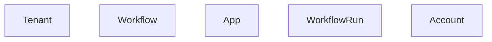
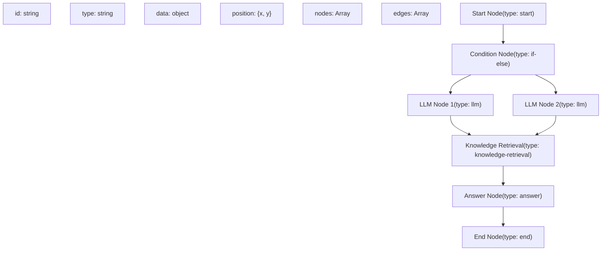
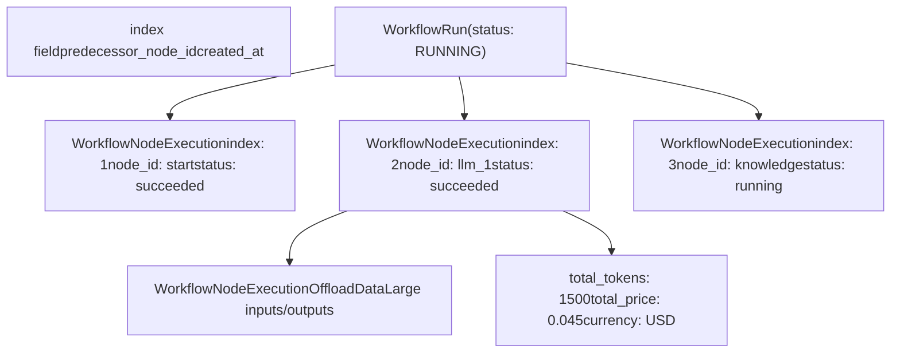
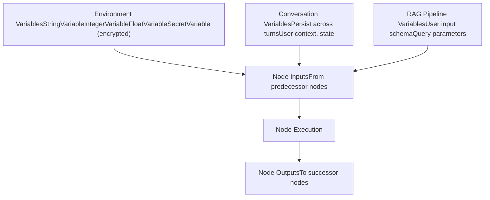

# Workflow Definition and Execution Model

Relevant source files

-   [api/models/account.py](https://github.com/langgenius/dify/blob/92dbc94f/api/models/account.py)
-   [api/models/api\_based\_extension.py](https://github.com/langgenius/dify/blob/92dbc94f/api/models/api_based_extension.py)
-   [api/models/dataset.py](https://github.com/langgenius/dify/blob/92dbc94f/api/models/dataset.py)
-   [api/models/model.py](https://github.com/langgenius/dify/blob/92dbc94f/api/models/model.py)
-   [api/models/oauth.py](https://github.com/langgenius/dify/blob/92dbc94f/api/models/oauth.py)
-   [api/models/provider.py](https://github.com/langgenius/dify/blob/92dbc94f/api/models/provider.py)
-   [api/models/source.py](https://github.com/langgenius/dify/blob/92dbc94f/api/models/source.py)
-   [api/models/task.py](https://github.com/langgenius/dify/blob/92dbc94f/api/models/task.py)
-   [api/models/tools.py](https://github.com/langgenius/dify/blob/92dbc94f/api/models/tools.py)
-   [api/models/trigger.py](https://github.com/langgenius/dify/blob/92dbc94f/api/models/trigger.py)
-   [api/models/web.py](https://github.com/langgenius/dify/blob/92dbc94f/api/models/web.py)
-   [api/models/workflow.py](https://github.com/langgenius/dify/blob/92dbc94f/api/models/workflow.py)
-   [api/tests/test\_containers\_integration\_tests/services/test\_advanced\_prompt\_template\_service.py](https://github.com/langgenius/dify/blob/92dbc94f/api/tests/test_containers_integration_tests/services/test_advanced_prompt_template_service.py)
-   [api/tests/test\_containers\_integration\_tests/services/test\_agent\_service.py](https://github.com/langgenius/dify/blob/92dbc94f/api/tests/test_containers_integration_tests/services/test_agent_service.py)
-   [api/tests/test\_containers\_integration\_tests/tasks/\_\_init\_\_.py](https://github.com/langgenius/dify/blob/92dbc94f/api/tests/test_containers_integration_tests/tasks/__init__.py)
-   [api/tests/test\_containers\_integration\_tests/tasks/test\_add\_document\_to\_index\_task.py](https://github.com/langgenius/dify/blob/92dbc94f/api/tests/test_containers_integration_tests/tasks/test_add_document_to_index_task.py)
-   [api/tests/unit\_tests/core/test\_provider\_manager.py](https://github.com/langgenius/dify/blob/92dbc94f/api/tests/unit_tests/core/test_provider_manager.py)

## Purpose and Scope

This document describes the workflow definition and execution model in Dify, covering how workflows are stored, versioned, executed, and monitored. It focuses on the data models (`Workflow`, `WorkflowRun`, `WorkflowNodeExecutionModel`) and their relationships, the graph-based workflow structure, version management, and execution logging mechanisms.

For information about specific node types and their implementations, see [LLM Nodes and Model Integration](/langgenius/dify/5.2-llm-nodes-and-model-integration), [Knowledge Retrieval and Question Classifier Nodes](/langgenius/dify/5.3-knowledge-retrieval-and-question-classifier-nodes), and [List Operator and Data Transformation Nodes](/langgenius/dify/5.4-list-operator-and-data-transformation-nodes). For workflow automation and triggering, see [Trigger System and Workflow Automation](/langgenius/dify/5.5-trigger-system-and-workflow-automation).

---

## Workflow Data Model

The `Workflow` model represents the definition of a workflow, which can power either a **Workflow App** or a **Chat App** in workflow mode. Each workflow is tied to a tenant (workspace) and an app.

### Workflow Table Structure

| Field | Type | Description |
| --- | --- | --- |
| `id` | UUID | Primary key |
| `tenant_id` | UUID | Workspace identifier |
| `app_id` | UUID | Associated app identifier |
| `type` | String | Workflow type: `"workflow"`, `"chat"`, or `"rag-pipeline"` |
| `version` | String | Version identifier: `"draft"` for drafts, timestamp for published versions |
| `graph` | LongText (JSON) | Complete workflow canvas configuration including nodes and edges |
| `features` | LongText (JSON) | Feature configurations (file upload, text-to-speech, etc.) |
| `environment_variables` | LongText (JSON) | Encrypted environment variables for the workflow |
| `conversation_variables` | LongText (JSON) | Variables that persist across conversation turns |
| `rag_pipeline_variables` | LongText (JSON) | Variables specific to RAG pipeline workflows |
| `marked_name` | String | Optional version label |
| `marked_comment` | String | Optional version description |
| `created_by` | UUID | Creator account ID |
| `updated_by` | UUID | Last updater account ID |

**Sources:** [api/models/workflow.py100-165](https://github.com/langgenius/dify/blob/92dbc94f/api/models/workflow.py#L100-L165)

### WorkflowType Enum

```
class WorkflowType(StrEnum):
    WORKFLOW = "workflow"      # For Workflow Apps
    CHAT = "chat"              # For Chat Apps in workflow mode
    RAG_PIPELINE = "rag-pipeline"  # For RAG pipeline workflows
```
The `WorkflowType.from_app_mode()` static method converts `AppMode` values to corresponding workflow types:

-   `AppMode.WORKFLOW` → `WorkflowType.WORKFLOW`
-   `AppMode.ADVANCED_CHAT`, `AppMode.CHAT`, `AppMode.AGENT_CHAT` → `WorkflowType.CHAT`

**Sources:** [api/models/workflow.py60-94](https://github.com/langgenius/dify/blob/92dbc94f/api/models/workflow.py#L60-L94)

### Workflow Model Diagram


**Sources:** [api/models/workflow.py100-165](https://github.com/langgenius/dify/blob/92dbc94f/api/models/workflow.py#L100-L165) [api/models/model.py78-144](https://github.com/langgenius/dify/blob/92dbc94f/api/models/model.py#L78-L144) [api/models/account.py242-278](https://github.com/langgenius/dify/blob/92dbc94f/api/models/account.py#L242-L278)

---

## Graph Structure

The `graph` field stores the complete workflow definition as a JSON object containing nodes and edges. This graph-based structure enables visual workflow design and execution.

### Graph JSON Schema

```
{
  "nodes": [
    {
      "id": "1748401971780start",
      "type": "start",
      "data": {
        "type": "start",
        "title": "Start",
        "variables": [...]
      },
      "position": {"x": 100, "y": 100}
    },
    {
      "id": "llm_node_1",
      "type": "llm",
      "data": {
        "type": "llm",
        "title": "LLM",
        "model": {
          "provider": "openai",
          "name": "gpt-4",
          "mode": "chat",
          "completion_params": {"temperature": 0.7}
        },
        "prompt_template": [
          {"role": "system", "text": "You are a helpful assistant"}
        ],
        "context": {"enabled": false},
        "vision": {"enabled": false},
        "memory": {...}
      },
      "position": {"x": 300, "y": 100}
    }
  ],
  "edges": [
    {
      "id": "edge_1",
      "source": "1748401971780start",
      "target": "llm_node_1"
    }
  ]
}
```
### Node Configuration Structure

Each node in the graph contains:

-   **`id`**: Unique node identifier
-   **`type`**: Visual node type (for UI rendering)
-   **`data`**: Node configuration object containing:
    -   **`type`**: Node execution type (e.g., `"start"`, `"llm"`, `"knowledge-retrieval"`, `"if-else"`)
    -   **`title`**: Display name
    -   **`desc`**: Optional description
    -   **Node-specific configuration fields** (varies by node type)

Special node properties for control flow:

-   **`isInIteration`**: Boolean indicating if node is inside an iteration block
-   **`iteration_id`**: Parent iteration node ID (if `isInIteration` is true)
-   **`isInLoop`**: Boolean indicating if node is inside a loop block
-   **`loop_id`**: Parent loop node ID (if `isInLoop` is true)

**Sources:** [api/models/workflow.py119-127](https://github.com/langgenius/dify/blob/92dbc94f/api/models/workflow.py#L119-L127) [api/models/workflow.py315-362](https://github.com/langgenius/dify/blob/92dbc94f/api/models/workflow.py#L315-L362)

### Accessing Graph Data

The `Workflow` model provides several methods to work with the graph:

| Method | Purpose | Returns |
| --- | --- | --- |
| `graph_dict` | Parse graph JSON to dictionary | `Mapping[str, Any]` |
| `get_node_config_by_id(node_id)` | Retrieve specific node configuration | `Mapping[str, Any]` |
| `get_node_type_from_node_config(node_config)` | Extract node type | `NodeType` enum |
| `get_enclosing_node_type_and_id(node_config)` | Get parent iteration/loop info | `tuple[NodeType, str]` or `None` |
| `walk_nodes(specific_node_type=None)` | Iterate through all nodes | Generator of `(id, data)` tuples |
| `user_input_form(to_old_structure=False)` | Extract start node variables | `list[Any]` |

**Example usage:**

```
workflow = db.session.query(Workflow).filter_by(id=workflow_id).first()

# Get all LLM nodes
for node_id, node_data in workflow.walk_nodes(specific_node_type=NodeType.LLM):
    model_config = node_data.get('model', {})
    print(f"LLM node {node_id} uses model: {model_config.get('name')}")

# Get specific node
node_config = workflow.get_node_config_by_id("llm_node_1")
node_type = Workflow.get_node_type_from_node_config(node_config)
```
**Sources:** [api/models/workflow.py212-253](https://github.com/langgenius/dify/blob/92dbc94f/api/models/workflow.py#L212-L253) [api/models/workflow.py315-390](https://github.com/langgenius/dify/blob/92dbc94f/api/models/workflow.py#L315-L390)

### Graph Traversal Diagram


**Sources:** [api/models/workflow.py315-362](https://github.com/langgenius/dify/blob/92dbc94f/api/models/workflow.py#L315-L362)

---

## Versioning System

Dify implements a dual-version system: one draft version and multiple published versions per workflow.

### Version Lifecycle

1.  **Draft Version (`version = "draft"`)**

    -   Only one draft exists per app at any time
    -   Editable and unpublished
    -   Used for development and testing
    -   Identified by constant `Workflow.VERSION_DRAFT`
2.  **Published Versions**

    -   Generated by publishing a draft
    -   Version string is a timestamp (e.g., `"2024-01-15 10:30:45"`)
    -   Immutable once published
    -   Multiple published versions can coexist
    -   Generated via `Workflow.version_from_datetime(datetime)` method

### Version Selection for Execution

When executing a workflow:

-   **Debugging**: Uses the draft version
-   **Production/API**: Uses the latest published version or a specific version if requested

**Sources:** [api/models/workflow.py166-167](https://github.com/langgenius/dify/blob/92dbc94f/api/models/workflow.py#L166-L167) [api/models/workflow.py551-553](https://github.com/langgenius/dify/blob/92dbc94f/api/models/workflow.py#L551-L553)

### Version Snapshot in WorkflowRun

Each `WorkflowRun` captures a complete snapshot of the workflow graph at execution time:

```
workflow_run = WorkflowRun(
    workflow_id=workflow.id,
    version=workflow.version,  # Version identifier
    graph=workflow.graph,      # Complete graph snapshot (JSON)
    # ... other fields
)
```
This ensures that execution records remain consistent even if the workflow definition is modified later. The snapshot includes:

-   All node configurations
-   All edge connections
-   Feature settings (if needed)

**Sources:** [api/models/workflow.py556-620](https://github.com/langgenius/dify/blob/92dbc94f/api/models/workflow.py#L556-L620) [api/models/workflow.py644-646](https://github.com/langgenius/dify/blob/92dbc94f/api/models/workflow.py#L644-L646)

### Versioning Workflow Diagram

> **[Mermaid stateDiagram]**
> *(图表结构无法解析)*

**Sources:** [api/models/workflow.py166-167](https://github.com/langgenius/dify/blob/92dbc94f/api/models/workflow.py#L166-L167) [api/models/workflow.py551-553](https://github.com/langgenius/dify/blob/92dbc94f/api/models/workflow.py#L551-L553)

---

## WorkflowRun Execution Model

`WorkflowRun` represents a single execution instance of a workflow. Each run is a complete, self-contained record of workflow execution.

### WorkflowRun Fields

| Field | Type | Description |
| --- | --- | --- |
| `id` | UUID | Unique run identifier |
| `tenant_id` | UUID | Workspace identifier |
| `app_id` | UUID | Associated app |
| `workflow_id` | UUID | Source workflow |
| `type` | String | Workflow type (workflow/chat/rag-pipeline) |
| `triggered_from` | String | Trigger source: `"debugging"` or `"app-run"` |
| `version` | String | Workflow version used for this run |
| `graph` | LongText (JSON) | Snapshot of workflow graph at execution |
| `inputs` | LongText (JSON) | Input parameters for the run |
| `status` | String | Execution status (see below) |
| `outputs` | LongText (JSON) | Final outputs |
| `error` | LongText | Error message if failed |
| `elapsed_time` | Float | Total execution time in seconds |
| `total_tokens` | BigInteger | Total tokens consumed |
| `total_steps` | Integer | Total number of steps executed |
| `exceptions_count` | Integer | Number of exceptions encountered |
| `created_by_role` | String | Creator role: `"account"` or `"end_user"` |
| `created_by` | UUID | Creator ID |
| `created_at` | DateTime | Run start time |
| `finished_at` | DateTime | Run completion time |

**Sources:** [api/models/workflow.py556-622](https://github.com/langgenius/dify/blob/92dbc94f/api/models/workflow.py#L556-L622)

### Execution Status Values

The `status` field can have the following values (defined in `core.workflow.enums.WorkflowExecutionStatus`):

-   **`RUNNING`**: Workflow is currently executing
-   **`SUCCEEDED`**: Completed successfully
-   **`FAILED`**: Execution failed with error
-   **`STOPPED`**: Manually stopped by user
-   **`PARTIAL_SUCCEEDED`**: Some nodes succeeded, some failed

**Sources:** [api/models/workflow.py611](https://github.com/langgenius/dify/blob/92dbc94f/api/models/workflow.py#L611-L611) [core/workflow/enums.py](https://github.com/langgenius/dify/blob/92dbc94f/core/workflow/enums.py) (referenced in imports)

### Triggered From Sources

The `triggered_from` field indicates how the workflow run was initiated:

-   **`"debugging"`**: Triggered from the canvas debugging interface
-   **`"app-run"`**: Triggered from published app execution (API, WebApp, or user interaction)

**Sources:** [api/models/workflow.py570-572](https://github.com/langgenius/dify/blob/92dbc94f/api/models/workflow.py#L570-L572)

### WorkflowRun Lifecycle Diagram

> **[Mermaid stateDiagram]**
> *(图表结构无法解析)*

**Sources:** [api/models/workflow.py556-622](https://github.com/langgenius/dify/blob/92dbc94f/api/models/workflow.py#L556-L622)

### WorkflowRun Methods

| Property/Method | Description | Returns |
| --- | --- | --- |
| `graph_dict` | Parse graph JSON | `Mapping[str, Any]` |
| `inputs_dict` | Parse inputs JSON | `Mapping[str, Any]` |
| `outputs_dict` | Parse outputs JSON | `Mapping[str, Any]` |
| `message` | Get associated message (if from chat) | `Message` or `None` |
| `workflow` | Get source workflow | `Workflow` |
| `created_by_account` | Get creator account | `Account` or `None` |
| `created_by_end_user` | Get end user creator | `EndUser` or `None` |
| `to_dict()` | Serialize to dictionary | `dict[str, Any]` |
| `from_dict(data)` | Deserialize from dictionary | `WorkflowRun` |

**Sources:** [api/models/workflow.py632-715](https://github.com/langgenius/dify/blob/92dbc94f/api/models/workflow.py#L632-L715)

---

## Node Execution Logging

The `WorkflowNodeExecutionModel` (table name: `workflow_node_executions`) tracks the execution of individual nodes within a workflow run, providing detailed execution logs and tracing capabilities.

### WorkflowNodeExecutionModel Structure

| Field | Type | Description |
| --- | --- | --- |
| `id` | UUID | Unique execution record ID |
| `tenant_id` | UUID | Workspace identifier |
| `app_id` | UUID | Associated app |
| `workflow_id` | UUID | Workflow identifier |
| `triggered_from` | String | `"single-step"`, `"workflow-run"`, or `"rag-pipeline-run"` |
| `workflow_run_id` | UUID | Parent workflow run (null for single-step debugging) |
| `index` | Integer | Execution sequence number for ordering |
| `predecessor_node_id` | String | Previous node in execution path |
| `node_execution_id` | String | Unique ID for this node execution instance |
| `node_id` | String | Node identifier from graph |
| `node_type` | String | Type of node (e.g., "llm", "knowledge-retrieval") |
| `title` | String | Node display name |
| `inputs` | LongText (JSON) | Input data passed to the node |
| `process_data` | LongText (JSON) | Intermediate processing data |
| `outputs` | LongText (JSON) | Output data from the node |
| `status` | String | Execution status: `"running"`, `"succeeded"`, `"failed"` |
| `error` | LongText | Error details if failed |
| `elapsed_time` | Float | Node execution time in seconds |
| `execution_metadata` | LongText (JSON) | Metadata including tokens, cost, currency |
| `created_by_role` | String | `"account"` or `"end_user"` |
| `created_by` | UUID | Executor ID |
| `created_at` | DateTime | Execution start time |
| `finished_at` | DateTime | Execution completion time |

**Sources:** [api/models/workflow.py728-866](https://github.com/langgenius/dify/blob/92dbc94f/api/models/workflow.py#L728-L866)

### Triggered From Types

The `WorkflowNodeExecutionTriggeredFrom` enum defines execution contexts:

-   **`SINGLE_STEP`**: Single-step debugging (no `workflow_run_id`)
-   **`WORKFLOW_RUN`**: Part of a complete workflow execution
-   **`RAG_PIPELINE_RUN`**: Execution within RAG pipeline

**Sources:** [api/models/workflow.py718-726](https://github.com/langgenius/dify/blob/92dbc94f/api/models/workflow.py#L718-L726)

### Execution Metadata Structure

The `execution_metadata` field stores cost and performance metrics:

```
{
  "total_tokens": 1500,
  "total_price": 0.045,
  "currency": "USD",
  "provider_response_latency": 1.23
}
```
**Sources:** [api/models/workflow.py757-763](https://github.com/langgenius/dify/blob/92dbc94f/api/models/workflow.py#L757-L763)

### Execution Data Offloading

For large execution data (inputs, outputs, process\_data), Dify implements an offloading mechanism to external storage:

1.  **WorkflowNodeExecutionOffloadData Model**

    -   Stores large data objects in external storage (S3, etc.)
    -   Fields: `workflow_node_execution_id`, `inputs`, `outputs`, `process_data`
    -   Linked 1:1 with `WorkflowNodeExecutionModel`
2.  **Offload Decision**

    -   Configured via `ExecutionOffLoadType` enum (see below)
    -   Data is offloaded when it exceeds size thresholds
    -   Original record keeps small reference/summary

**Sources:** [api/models/workflow.py1079-1154](https://github.com/langgenius/dify/blob/92dbc94f/api/models/workflow.py#L1079-L1154)

### ExecutionOffLoadType Enum

Controls when execution data should be offloaded:

-   **`NEVER`**: Never offload, store all data in database
-   **`ALWAYS`**: Always offload to external storage
-   **`SELECTIVE`**: Offload only when data exceeds threshold
-   **`SYNC_ONLY`**: Offload only for synchronous requests (to avoid blocking)

**Sources:** [api/models/enums.py](https://github.com/langgenius/dify/blob/92dbc94f/api/models/enums.py) (referenced in workflow.py imports)

### Node Execution Tracking Diagram


**Sources:** [api/models/workflow.py728-866](https://github.com/langgenius/dify/blob/92dbc94f/api/models/workflow.py#L728-L866) [api/models/workflow.py1079-1154](https://github.com/langgenius/dify/blob/92dbc94f/api/models/workflow.py#L1079-L1154)

### Querying Node Executions

**Get all executions for a workflow run:**

```
executions = db.session.query(WorkflowNodeExecutionModel)\
    .filter_by(workflow_run_id=run_id)\
    .order_by(WorkflowNodeExecutionModel.index)\
    .all()
```
**Get executions for a specific node:**

```
node_executions = db.session.query(WorkflowNodeExecutionModel)\
    .filter_by(
        tenant_id=tenant_id,
        app_id=app_id,
        workflow_id=workflow_id,
        node_id=node_id
    )\
    .order_by(WorkflowNodeExecutionModel.created_at.desc())\
    .all()
```
**Sources:** [api/models/workflow.py777-815](https://github.com/langgenius/dify/blob/92dbc94f/api/models/workflow.py#L777-L815) (index definitions)

---

## Variable Management

Workflows support three types of variables that persist across different scopes:

### Environment Variables

Environment variables are workflow-scoped configuration values accessible to all nodes:

**Supported Types:**

-   `StringVariable`
-   `IntegerVariable`
-   `FloatVariable`
-   `SecretVariable` (encrypted)

**Storage Format:**

```
{
  "api_key": {
    "id": "var_1",
    "name": "api_key",
    "type": "secret",
    "value": "<encrypted_value>"
  },
  "max_tokens": {
    "id": "var_2",
    "name": "max_tokens",
    "type": "number",
    "value": 2000
  }
}
```
**Encryption:**

-   Secret variables are encrypted using `encrypter.encrypt_token(tenant_id, token)`
-   Decrypted on access using `encrypter.decrypt_token(tenant_id, token)`
-   Encryption is tenant-specific for security isolation

**Access:**

```
workflow = db.session.query(Workflow).filter_by(id=workflow_id).first()
env_vars = workflow.environment_variables  # Returns decrypted variables

for var in env_vars:
    if isinstance(var, SecretVariable):
        # var.value is decrypted automatically
        print(f"{var.name}: {var.value}")
```
**Sources:** [api/models/workflow.py427-500](https://github.com/langgenius/dify/blob/92dbc94f/api/models/workflow.py#L427-L500)

### Conversation Variables

Conversation variables persist across multiple turns in chat-based workflows:

**Purpose:**

-   Store conversation context
-   Maintain state between messages
-   Enable memory-like behavior

**Storage:**

-   Stored in `_conversation_variables` field as JSON
-   Uses `variable_factory.build_conversation_variable_from_mapping()` to deserialize

**Access:**

```
workflow = db.session.query(Workflow).filter_by(id=workflow_id).first()
conv_vars = workflow.conversation_variables

# Set conversation variables
workflow.conversation_variables = [
    StringVariable(id="conv_1", name="user_name", value="Alice"),
    StringVariable(id="conv_2", name="topic", value="AI")
]
db.session.commit()
```
**Sources:** [api/models/workflow.py517-532](https://github.com/langgenius/dify/blob/92dbc94f/api/models/workflow.py#L517-L532)

### RAG Pipeline Variables

RAG pipeline variables are specific to RAG pipeline workflows and define the user input schema:

**Structure:**

```
[
  {
    "variable": "query",
    "type": "text-input",
    "label": "User Query",
    "required": true
  },
  {
    "variable": "filters",
    "type": "select",
    "label": "Category Filter",
    "options": ["tech", "business", "science"]
  }
]
```
**Access:**

```
workflow = db.session.query(Workflow).filter_by(
    type=WorkflowType.RAG_PIPELINE,
    id=workflow_id
).first()

input_form = workflow.rag_pipeline_user_input_form()
# Returns the variables list for building input forms
```
**Sources:** [api/models/workflow.py534-549](https://github.com/langgenius/dify/blob/92dbc94f/api/models/workflow.py#L534-L549) [api/models/workflow.py391-395](https://github.com/langgenius/dify/blob/92dbc94f/api/models/workflow.py#L391-L395)

### Variable Scope Diagram


**Sources:** [api/models/workflow.py427-549](https://github.com/langgenius/dify/blob/92dbc94f/api/models/workflow.py#L427-L549)

---

## Pause and Resume Mechanism

Workflows can be paused during execution for human input or scheduled delays. This is managed through the `WorkflowPause` model.

### WorkflowPause Model

Represents a paused workflow run waiting for resumption:

| Field | Type | Description |
| --- | --- | --- |
| `id` | UUID | Pause record ID |
| `tenant_id` | UUID | Workspace identifier |
| `app_id` | UUID | Associated app |
| `workflow_id` | UUID | Workflow identifier |
| `workflow_run_id` | UUID | Paused run (1:1 relationship) |
| `event_data` | LongText (JSON) | State snapshot for resumption |
| `pause_expires_at` | BigInteger | Unix timestamp when pause expires |
| `pause_metadata` | LongText (JSON) | Pause reason and details |
| `created_at` | DateTime | Pause start time |

**Sources:** [api/models/workflow.py1156-1211](https://github.com/langgenius/dify/blob/92dbc94f/api/models/workflow.py#L1156-L1211)

### Pause Reasons

The `pause_metadata` field stores structured pause reason information using `PauseReason` entities:

**HumanInputRequired:**

```
{
  "type": "human_input_required",
  "message": "Please review and approve the generated content",
  "timeout_seconds": 3600,
  "inputs_schema": {
    "approval": {"type": "select", "options": ["approve", "reject"]},
    "comments": {"type": "text-input", "required": false}
  }
}
```
**SchedulingPause:**

```
{
  "type": "scheduling_pause",
  "message": "Scheduled delay before sending email",
  "resume_at": 1705320000,
  "reason": "Rate limit throttling"
}
```
**Sources:** [core/workflow/entities/pause\_reason.py](https://github.com/langgenius/dify/blob/92dbc94f/core/workflow/entities/pause_reason.py) (referenced in imports at [api/models/workflow.py32](https://github.com/langgenius/dify/blob/92dbc94f/api/models/workflow.py#L32-L32))

### Pause/Resume Lifecycle

> **[Mermaid stateDiagram]**
> *(图表结构无法解析)*

**Sources:** [api/models/workflow.py1156-1211](https://github.com/langgenius/dify/blob/92dbc94f/api/models/workflow.py#L1156-L1211)

### Relationship to WorkflowRun

The `WorkflowRun` model has an optional 1:1 relationship with `WorkflowPause`:

```
class WorkflowRun(Base):
    # ... other fields ...

    pause: Mapped[Optional["WorkflowPause"]] = orm.relationship(
        "WorkflowPause",
        primaryjoin="WorkflowRun.id == foreign(WorkflowPause.workflow_run_id)",
        uselist=False,
        lazy="raise",  # Require explicit preloading
        back_populates="workflow_run",
    )
```
**Note:** The `lazy="raise"` configuration means the `pause` relationship must be explicitly loaded using `joinedload()` or `selectinload()` to avoid lazy-loading errors.

**Sources:** [api/models/workflow.py623-630](https://github.com/langgenius/dify/blob/92dbc94f/api/models/workflow.py#L623-L630)

---

## Summary

The Dify workflow system uses a comprehensive data model to manage workflow definitions, executions, and monitoring:

1.  **Workflow Model**: Stores workflow definitions with graph-based structure, versioning, and variables
2.  **Graph Structure**: JSON-based nodes and edges enabling visual workflow design
3.  **Versioning**: Draft and published version management with execution snapshots
4.  **WorkflowRun**: Complete execution records with status tracking and results
5.  **Node Execution Logging**: Detailed per-node execution logs with offloading for large data
6.  **Variable Management**: Three scopes of variables (environment, conversation, RAG pipeline)
7.  **Pause/Resume**: Support for human-in-the-loop and scheduled workflow pausing

This architecture provides complete traceability, reproducibility, and debugging capabilities for complex workflow executions.

**Sources:** [api/models/workflow.py1-1500](https://github.com/langgenius/dify/blob/92dbc94f/api/models/workflow.py#L1-L1500) [api/models/model.py78-316](https://github.com/langgenius/dify/blob/92dbc94f/api/models/model.py#L78-L316) [api/models/account.py242-278](https://github.com/langgenius/dify/blob/92dbc94f/api/models/account.py#L242-L278)
