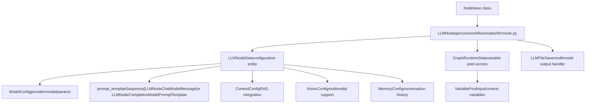
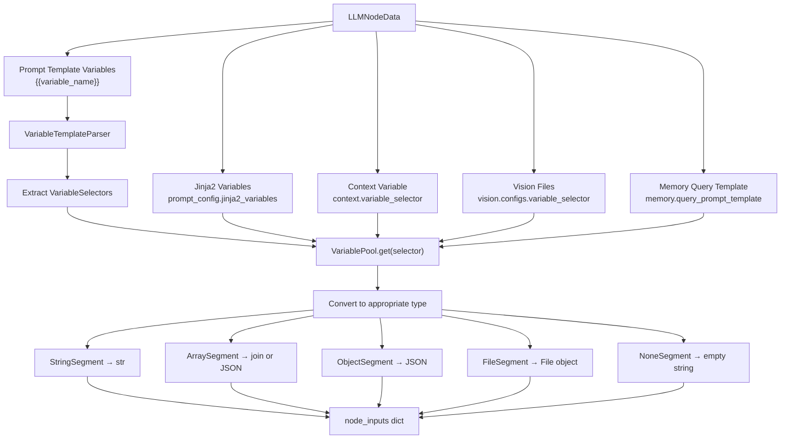
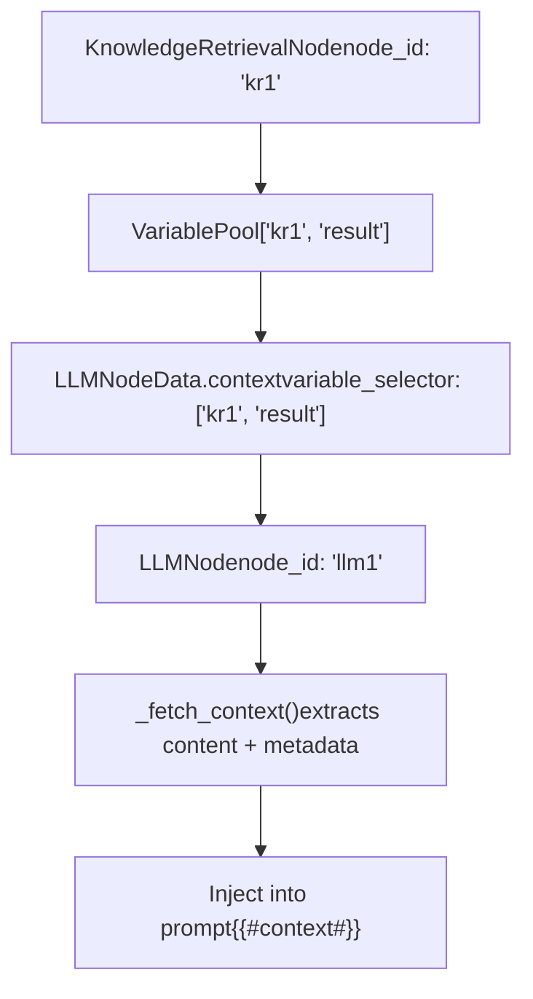
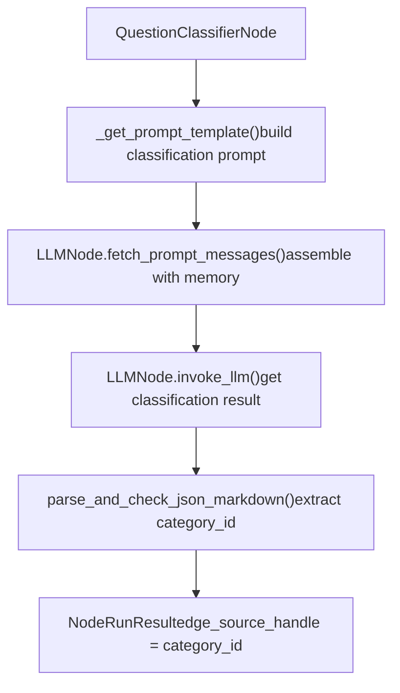

# LLM Nodes and Model Integration

Relevant source files

-   [api/models/account.py](https://github.com/langgenius/dify/blob/92dbc94f/api/models/account.py)
-   [api/models/api\_based\_extension.py](https://github.com/langgenius/dify/blob/92dbc94f/api/models/api_based_extension.py)
-   [api/models/dataset.py](https://github.com/langgenius/dify/blob/92dbc94f/api/models/dataset.py)
-   [api/models/model.py](https://github.com/langgenius/dify/blob/92dbc94f/api/models/model.py)
-   [api/models/oauth.py](https://github.com/langgenius/dify/blob/92dbc94f/api/models/oauth.py)
-   [api/models/provider.py](https://github.com/langgenius/dify/blob/92dbc94f/api/models/provider.py)
-   [api/models/source.py](https://github.com/langgenius/dify/blob/92dbc94f/api/models/source.py)
-   [api/models/task.py](https://github.com/langgenius/dify/blob/92dbc94f/api/models/task.py)
-   [api/models/tools.py](https://github.com/langgenius/dify/blob/92dbc94f/api/models/tools.py)
-   [api/models/trigger.py](https://github.com/langgenius/dify/blob/92dbc94f/api/models/trigger.py)
-   [api/models/web.py](https://github.com/langgenius/dify/blob/92dbc94f/api/models/web.py)
-   [api/models/workflow.py](https://github.com/langgenius/dify/blob/92dbc94f/api/models/workflow.py)
-   [api/tests/test\_containers\_integration\_tests/services/test\_advanced\_prompt\_template\_service.py](https://github.com/langgenius/dify/blob/92dbc94f/api/tests/test_containers_integration_tests/services/test_advanced_prompt_template_service.py)
-   [api/tests/test\_containers\_integration\_tests/services/test\_agent\_service.py](https://github.com/langgenius/dify/blob/92dbc94f/api/tests/test_containers_integration_tests/services/test_agent_service.py)
-   [api/tests/test\_containers\_integration\_tests/tasks/\_\_init\_\_.py](https://github.com/langgenius/dify/blob/92dbc94f/api/tests/test_containers_integration_tests/tasks/__init__.py)
-   [api/tests/test\_containers\_integration\_tests/tasks/test\_add\_document\_to\_index\_task.py](https://github.com/langgenius/dify/blob/92dbc94f/api/tests/test_containers_integration_tests/tasks/test_add_document_to_index_task.py)
-   [api/tests/unit\_tests/core/test\_provider\_manager.py](https://github.com/langgenius/dify/blob/92dbc94f/api/tests/unit_tests/core/test_provider_manager.py)

This document describes the LLM (Large Language Model) Node implementation in Dify's workflow system, covering model configuration, prompt construction, execution modes, and integration with other workflow components.

**Scope**: This page focuses on the `LLMNode` class and its integration with model providers. For knowledge retrieval nodes that fetch context for LLMs, see [5.3](/langgenius/dify/5.3-knowledge-retrieval-and-question-classifier-nodes). For general workflow execution concepts, see [5.1](/langgenius/dify/5.1-workflow-definition-and-execution-model). For HTTP-based external API integration, see [5.4](/langgenius/dify/5.4-list-operator-and-data-transformation-nodes).

---

## Core Architecture

### LLMNode Class Structure

The `LLMNode` class extends the base `Node` class to provide LLM invocation capabilities within workflows. It manages the complete lifecycle from prompt construction to response processing.


**Sources**: [api/core/workflow/nodes/llm/node.py108-144](https://github.com/langgenius/dify/blob/92dbc94f/api/core/workflow/nodes/llm/node.py#L108-L144) [api/core/workflow/nodes/llm/entities.py61-99](https://github.com/langgenius/dify/blob/92dbc94f/api/core/workflow/nodes/llm/entities.py#L61-L99)

### Key Data Structures

The `LLMNodeData` entity encapsulates all configuration for an LLM node:

| Field | Type | Purpose |
| --- | --- | --- |
| `model` | `ModelConfig` | Provider, model name, mode, completion parameters |
| `prompt_template` | `Sequence[LLMNodeChatModelMessage]` or `LLMNodeCompletionModelPromptTemplate` | Prompt structure (chat messages or completion text) |
| `prompt_config` | `PromptConfig` | Jinja2 variable selectors for advanced templating |
| `memory` | `MemoryConfig` or `None` | Conversation history configuration |
| `context` | `ContextConfig` | RAG context variable selector |
| `vision` | `VisionConfig` | Multimodal file input configuration |
| `structured_output` | `Mapping[str, Any]` or `None` | JSON schema for structured responses |
| `structured_output_switch_on` | `bool` | Enable structured output mode |
| `reasoning_format` | `"separated"` or `"tagged"` | How to handle \`\` tags. The `reasoning_format` field controls processing: |

| Format | Behavior | Output Fields |
| --- | --- | --- |
| `"tagged"` | Keep \` |  |
| \_THINK\_PATTERN = re.compile(r"<think\[^>\]*\>(.*?)", re.IGNORECASE | re.DOTALL) |  |

```
**Use case**: `"separated"` mode enables downstream nodes to access reasoning via `{{#node_id.reasoning_content#}}` while keeping clean text for user display.

**Sources**: <FileRef file-url="https://github.com/langgenius/dify/blob/92dbc94f/api/core/workflow/nodes/llm/node.py#L111-L112" min=111 max=112 file-path="api/core/workflow/nodes/llm/node.py">Hii</FileRef> <FileRef file-url="https://github.com/langgenius/dify/blob/92dbc94f/api/core/workflow/nodes/llm/node.py#L266-L271" min=266 max=271 file-path="api/core/workflow/nodes/llm/node.py">Hii</FileRef> <FileRef file-url="https://github.com/langgenius/dify/blob/92dbc94f/api/core/workflow/nodes/llm/node.py#L496-L523" min=496 max=523 file-path="api/core/workflow/nodes/llm/node.py">Hii</FileRef> <FileRef file-url="https://github.com/langgenius/dify/blob/92dbc94f/api/core/workflow/nodes/llm/node.py#L532-L565" min=532 max=565 file-path="api/core/workflow/nodes/llm/node.py">Hii</FileRef>

---

## Input/Output Processing

### Input Variable Fetching


**Sources**: [api/core/workflow/nodes/llm/node.py164-170](https://github.com/langgenius/dify/blob/92dbc94f/api/core/workflow/nodes/llm/node.py#L164-L170) [api/core/workflow/nodes/llm/node.py626-660](https://github.com/langgenius/dify/blob/92dbc94f/api/core/workflow/nodes/llm/node.py#L626-L660)

### Output Format

The `_run()` generator yields events culminating in a `StreamCompletedEvent` with `NodeRunResult`:

```
NodeRunResult(
    status=WorkflowNodeExecutionStatus.SUCCEEDED,
    inputs={
        # Variables used in prompt
        "variable1": "value1",
        "#context#": "retrieved context...",
        "#files#": [{"id": "...", "filename": "..."}],
    },
    process_data={
        "model_mode": "chat",
        "prompts": "formatted prompt for logging",
        "usage": {"prompt_tokens": 100, "completion_tokens": 50, ...},
        "finish_reason": "stop",
        "model_provider": "openai",
        "model_name": "gpt-4",
    },
    outputs={
        "text": "clean response text",
        "reasoning_content": "extracted <think> content (if separated mode)",
        "usage": {...},
        "finish_reason": "stop",
        "structured_output": {"field": "value"},  # if enabled
        "files": ArrayFileSegment([...])  # if multimodal output
    },
    metadata={
        WorkflowNodeExecutionMetadataKey.TOTAL_TOKENS: 150,
        WorkflowNodeExecutionMetadataKey.TOTAL_PRICE: 0.0025,
        WorkflowNodeExecutionMetadataKey.CURRENCY: "USD",
    },
    llm_usage=LLMUsage(...)
)
```
**Key output fields**:

-   `text`: Main response text (cleaned if `reasoning_format="separated"`)
-   `reasoning_content`: Extracted reasoning (empty if `reasoning_format="tagged"`)
-   `structured_output`: Parsed JSON object (if structured output enabled)
-   `files`: Multimodal outputs like generated images
-   `usage`: Token counts and pricing

**Sources**: [api/core/workflow/nodes/llm/node.py286-328](https://github.com/langgenius/dify/blob/92dbc94f/api/core/workflow/nodes/llm/node.py#L286-L328)

---

## Advanced Features

### Multimodal Output Handling

LLMs can generate multimodal content (e.g., images via DALL-E). The `LLMFileSaver` interface handles this:

**Image output example**:

-   Markdown: ``
-   File object stored with `FileTransferMethod.TOOL_FILE`

**Sources**: [api/core/workflow/nodes/llm/node.py463-479](https://github.com/langgenius/dify/blob/92dbc94f/api/core/workflow/nodes/llm/node.py#L463-L479) [api/core/workflow/nodes/llm/node.py527-530](https://github.com/langgenius/dify/blob/92dbc94f/api/core/workflow/nodes/llm/node.py#L527-L530)

### Usage Tracking and Quota

> **[Mermaid sequence]**
> *(图表结构无法解析)*

**Usage calculation**:

-   `prompt_tokens`: Input prompt size
-   `completion_tokens`: Generated response size
-   `total_tokens`: Sum of input + output
-   `total_price`: Calculated from model pricing config
-   `latency`: Total request time in seconds

**Sources**: [api/core/workflow/nodes/llm/node.py281](https://github.com/langgenius/dify/blob/92dbc94f/api/core/workflow/nodes/llm/node.py#L281-L281) [api/core/workflow/nodes/llm/node.py321-325](https://github.com/langgenius/dify/blob/92dbc94f/api/core/workflow/nodes/llm/node.py#L321-L325)

### Error Handling

Common exceptions and their handling:

| Exception | Cause | Handling |
| --- | --- | --- |
| `VariableNotFoundError` | Referenced variable not in pool | Node fails with error message |
| `ModelNotExistError` | Model not found or not available | Node fails with error message |
| `InvalidContextStructureError` | Malformed context array | Node fails with error message |
| `OutputParserError` | Structured output parsing failed | Converted to `LLMNodeError` |
| `QuotaExceededError` | Tenant quota exhausted | Node fails, usage not deducted |
| Generic `Exception` | Unexpected error | Caught, logged, node fails gracefully |

All errors result in a `StreamCompletedEvent` with `status=FAILED` and error details in `error` and `error_type` fields.

**Sources**: [api/core/workflow/nodes/llm/node.py329-351](https://github.com/langgenius/dify/blob/92dbc94f/api/core/workflow/nodes/llm/node.py#L329-L351) [api/core/workflow/nodes/llm/exc.py](https://github.com/langgenius/dify/blob/92dbc94f/api/core/workflow/nodes/llm/exc.py) (referenced but not provided)

---

## Integration Examples

### With Knowledge Retrieval Node


**Context array structure**:

```
[
    {
        "content": "Retrieved text...",
        "metadata": {
            "_source": "knowledge",
            "dataset_id": "...",
            "document_id": "...",
            "segment_id": "...",
            "score": 0.95
        }
    },
    ...
]
```
**Sources**: [api/core/workflow/nodes/llm/node.py662-719](https://github.com/langgenius/dify/blob/92dbc94f/api/core/workflow/nodes/llm/node.py#L662-L719)

### With Question Classifier Node

The `QuestionClassifierNode` uses `LLMNode.invoke_llm()` and `fetch_prompt_messages()` internally to perform classification:


This demonstrates code reuse: `QuestionClassifierNode` leverages `LLMNode`'s static methods for prompt assembly and invocation.

**Sources**: [api/core/workflow/nodes/question\_classifier/question\_classifier\_node.py132-163](https://github.com/langgenius/dify/blob/92dbc94f/api/core/workflow/nodes/question_classifier/question_classifier_node.py#L132-L163)
