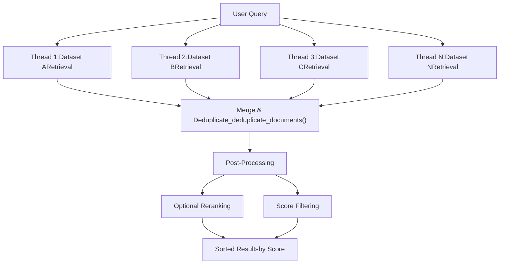
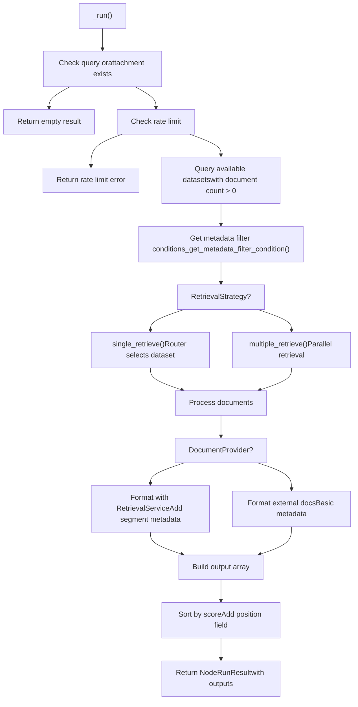
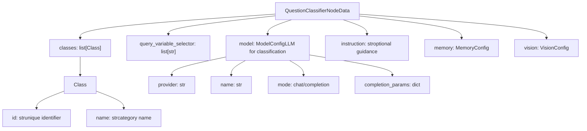
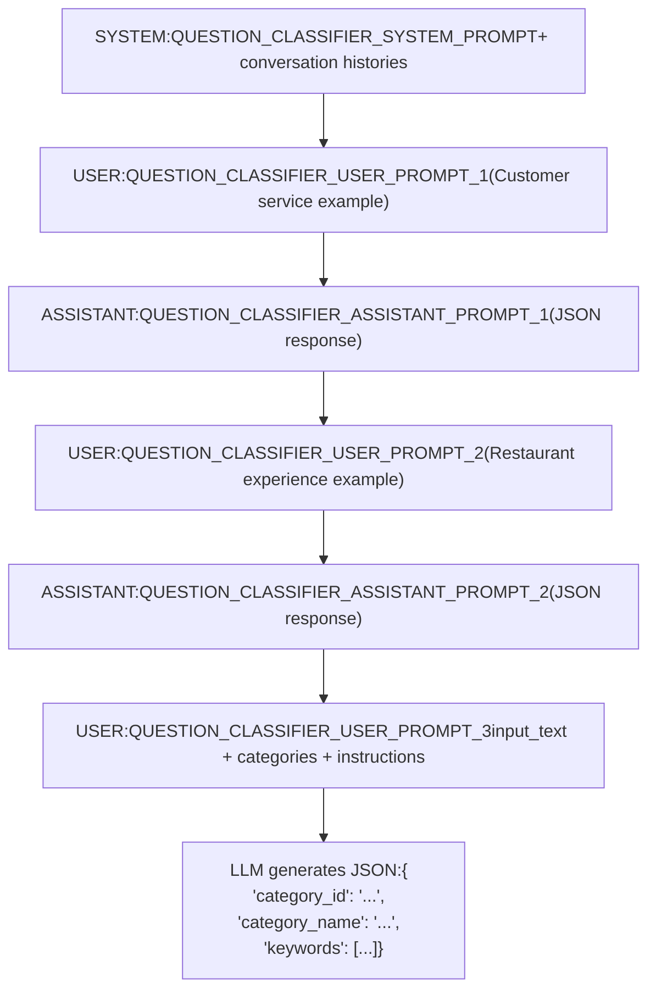
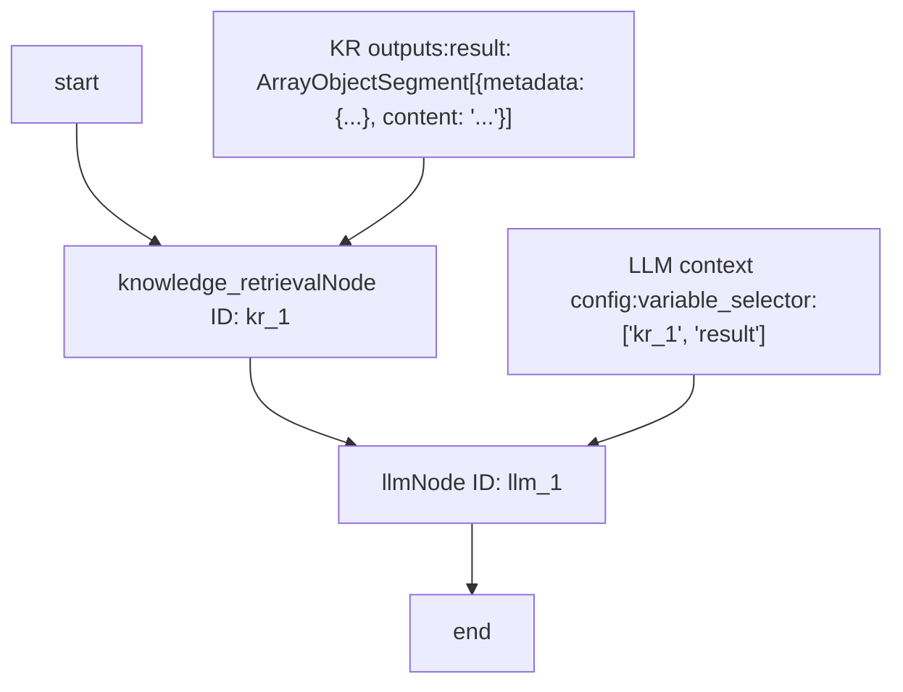
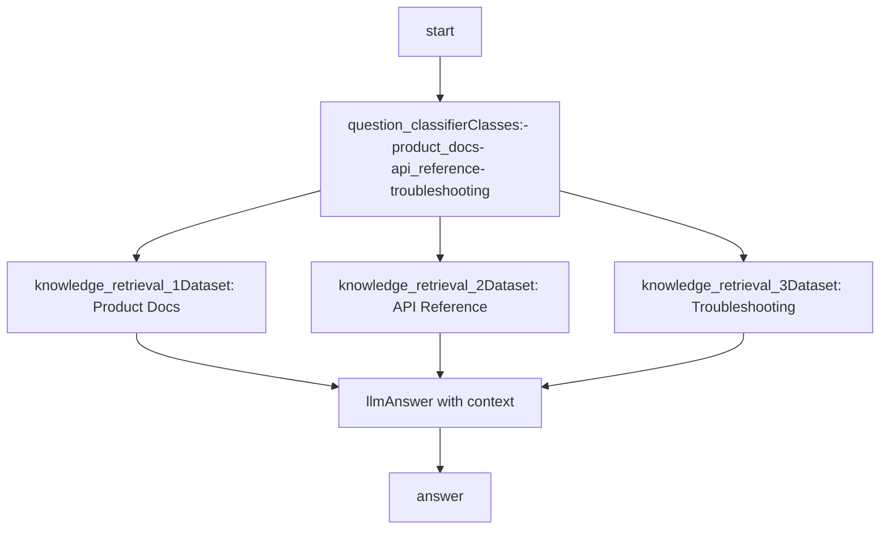

# Knowledge Retrieval and Question Classifier Nodes

Relevant source files

-   [api/core/rag/datasource/retrieval\_service.py](https://github.com/langgenius/dify/blob/92dbc94f/api/core/rag/datasource/retrieval_service.py)
-   [api/core/rag/entities/metadata\_entities.py](https://github.com/langgenius/dify/blob/92dbc94f/api/core/rag/entities/metadata_entities.py)
-   [api/core/rag/retrieval/dataset\_retrieval.py](https://github.com/langgenius/dify/blob/92dbc94f/api/core/rag/retrieval/dataset_retrieval.py)
-   [api/core/workflow/nodes/knowledge\_retrieval/entities.py](https://github.com/langgenius/dify/blob/92dbc94f/api/core/workflow/nodes/knowledge_retrieval/entities.py)
-   [api/core/workflow/nodes/knowledge\_retrieval/knowledge\_retrieval\_node.py](https://github.com/langgenius/dify/blob/92dbc94f/api/core/workflow/nodes/knowledge_retrieval/knowledge_retrieval_node.py)
-   [api/core/workflow/nodes/list\_operator/entities.py](https://github.com/langgenius/dify/blob/92dbc94f/api/core/workflow/nodes/list_operator/entities.py)
-   [api/core/workflow/nodes/list\_operator/exc.py](https://github.com/langgenius/dify/blob/92dbc94f/api/core/workflow/nodes/list_operator/exc.py)
-   [api/core/workflow/nodes/list\_operator/node.py](https://github.com/langgenius/dify/blob/92dbc94f/api/core/workflow/nodes/list_operator/node.py)
-   [api/core/workflow/nodes/question\_classifier/entities.py](https://github.com/langgenius/dify/blob/92dbc94f/api/core/workflow/nodes/question_classifier/entities.py)
-   [api/models/account.py](https://github.com/langgenius/dify/blob/92dbc94f/api/models/account.py)
-   [api/models/api\_based\_extension.py](https://github.com/langgenius/dify/blob/92dbc94f/api/models/api_based_extension.py)
-   [api/models/dataset.py](https://github.com/langgenius/dify/blob/92dbc94f/api/models/dataset.py)
-   [api/models/model.py](https://github.com/langgenius/dify/blob/92dbc94f/api/models/model.py)
-   [api/models/oauth.py](https://github.com/langgenius/dify/blob/92dbc94f/api/models/oauth.py)
-   [api/models/provider.py](https://github.com/langgenius/dify/blob/92dbc94f/api/models/provider.py)
-   [api/models/source.py](https://github.com/langgenius/dify/blob/92dbc94f/api/models/source.py)
-   [api/models/task.py](https://github.com/langgenius/dify/blob/92dbc94f/api/models/task.py)
-   [api/models/tools.py](https://github.com/langgenius/dify/blob/92dbc94f/api/models/tools.py)
-   [api/models/trigger.py](https://github.com/langgenius/dify/blob/92dbc94f/api/models/trigger.py)
-   [api/models/web.py](https://github.com/langgenius/dify/blob/92dbc94f/api/models/web.py)
-   [api/models/workflow.py](https://github.com/langgenius/dify/blob/92dbc94f/api/models/workflow.py)
-   [api/services/hit\_testing\_service.py](https://github.com/langgenius/dify/blob/92dbc94f/api/services/hit_testing_service.py)
-   [api/tests/test\_containers\_integration\_tests/services/test\_advanced\_prompt\_template\_service.py](https://github.com/langgenius/dify/blob/92dbc94f/api/tests/test_containers_integration_tests/services/test_advanced_prompt_template_service.py)
-   [api/tests/test\_containers\_integration\_tests/services/test\_agent\_service.py](https://github.com/langgenius/dify/blob/92dbc94f/api/tests/test_containers_integration_tests/services/test_agent_service.py)
-   [api/tests/test\_containers\_integration\_tests/tasks/\_\_init\_\_.py](https://github.com/langgenius/dify/blob/92dbc94f/api/tests/test_containers_integration_tests/tasks/__init__.py)
-   [api/tests/test\_containers\_integration\_tests/tasks/test\_add\_document\_to\_index\_task.py](https://github.com/langgenius/dify/blob/92dbc94f/api/tests/test_containers_integration_tests/tasks/test_add_document_to_index_task.py)
-   [api/tests/unit\_tests/core/rag/retrieval/\_\_init\_\_.py](https://github.com/langgenius/dify/blob/92dbc94f/api/tests/unit_tests/core/rag/retrieval/__init__.py)
-   [api/tests/unit\_tests/core/rag/retrieval/test\_dataset\_retrieval.py](https://github.com/langgenius/dify/blob/92dbc94f/api/tests/unit_tests/core/rag/retrieval/test_dataset_retrieval.py)
-   [api/tests/unit\_tests/core/test\_provider\_manager.py](https://github.com/langgenius/dify/blob/92dbc94f/api/tests/unit_tests/core/test_provider_manager.py)
-   [api/tests/unit\_tests/core/workflow/nodes/test\_list\_operator.py](https://github.com/langgenius/dify/blob/92dbc94f/api/tests/unit_tests/core/workflow/nodes/test_list_operator.py)
-   [web/app/components/workflow/nodes/knowledge-retrieval/components/metadata/condition-list/utils.ts](https://github.com/langgenius/dify/blob/92dbc94f/web/app/components/workflow/nodes/knowledge-retrieval/components/metadata/condition-list/utils.ts)
-   [web/app/components/workflow/nodes/knowledge-retrieval/components/metadata/metadata-icon.tsx](https://github.com/langgenius/dify/blob/92dbc94f/web/app/components/workflow/nodes/knowledge-retrieval/components/metadata/metadata-icon.tsx)
-   [web/app/components/workflow/nodes/list-operator/components/extract-input.tsx](https://github.com/langgenius/dify/blob/92dbc94f/web/app/components/workflow/nodes/list-operator/components/extract-input.tsx)
-   [web/app/components/workflow/nodes/list-operator/components/filter-condition.tsx](https://github.com/langgenius/dify/blob/92dbc94f/web/app/components/workflow/nodes/list-operator/components/filter-condition.tsx)
-   [web/app/components/workflow/nodes/list-operator/default.ts](https://github.com/langgenius/dify/blob/92dbc94f/web/app/components/workflow/nodes/list-operator/default.ts)
-   [web/app/components/workflow/nodes/list-operator/panel.tsx](https://github.com/langgenius/dify/blob/92dbc94f/web/app/components/workflow/nodes/list-operator/panel.tsx)
-   [web/app/components/workflow/nodes/list-operator/types.ts](https://github.com/langgenius/dify/blob/92dbc94f/web/app/components/workflow/nodes/list-operator/types.ts)
-   [web/app/components/workflow/nodes/utils.ts](https://github.com/langgenius/dify/blob/92dbc94f/web/app/components/workflow/nodes/utils.ts)

This document covers two specialized workflow nodes for intelligent content retrieval and query routing:

-   **Knowledge Retrieval Node**: Retrieves relevant documents from configured datasets (knowledge bases) using semantic search, keyword search, or hybrid approaches
-   **Question Classifier Node**: Routes workflow execution by classifying user queries into predefined categories using LLM-based classification

For information about general workflow execution and other node types, see [Workflow Definition and Execution Model](/langgenius/dify/5.1-workflow-definition-and-execution-model). For LLM node details, see [LLM Nodes and Model Integration](/langgenius/dify/5.2-llm-nodes-and-model-integration).

---

## Knowledge Retrieval Node Overview

The `KnowledgeRetrievalNode` queries datasets (knowledge bases) to retrieve relevant document segments based on user input. It supports both text queries and image attachments, with configurable retrieval strategies and metadata filtering.

### Node Characteristics

| Property | Value |
| --- | --- |
| Node Type | `NodeType.KNOWLEDGE_RETRIEVAL` |
| Execution Type | Sequential |
| Primary Class | `KnowledgeRetrievalNode` |
| Input Variables | Query text (string), attachments (files) |
| Output Format | Array of objects with segment content, metadata, and scores |

**Sources:** [api/core/workflow/nodes/knowledge\_retrieval/knowledge\_retrieval\_node.py85-86](https://github.com/langgenius/dify/blob/92dbc94f/api/core/workflow/nodes/knowledge_retrieval/knowledge_retrieval_node.py#L85-L86)

### Knowledge Retrieval Data Model and Configuration

```mermaid
flowchart TD
    KRNodeData["KnowledgeRetrievalNodeData"]
    dataset_ids["dataset_ids: list[str]"]
    query_selector["query_variable_selector: list[str]"]
    attachment_selector["query_attachment_selector: list[str]"]
    retrieval_mode["retrieval_mode: RetrieveStrategy"]
    metadata_filtering["metadata_filtering_mode: str"]
    single_config["single_retrieval_config"]
    multiple_config["multiple_retrieval_config"]
    single["SINGLE: Router-baseddataset selection"]
    multiple["MULTIPLE: Parallelretrieval from all datasets"]
    disabled["disabled"]
    manual["manual: User-defined filters"]
    automatic["automatic: LLM-generated filters"]
    model["model: ModelConfigfor router LLM"]
    top_k["top_k: int"]
    score_threshold["score_threshold: float"]
    reranking["reranking_enable: bool"]
    rerank_mode["reranking_mode: str"]
    weights["weights: dict"]

    KRNodeData --> dataset_ids
    KRNodeData --> query_selector
    KRNodeData --> attachment_selector
    KRNodeData --> retrieval_mode
    KRNodeData --> metadata_filtering
    KRNodeData --> single_config
    KRNodeData --> multiple_config
    retrieval --> mode_single
    retrieval --> mode_multiple
    metadata --> filtering_disabled
    metadata --> filtering_manual
    metadata --> filtering_automatic
    single --> config_model
    multiple --> config_top_k
    multiple --> config_score_threshold
    multiple --> config_reranking
    multiple --> config_rerank_mode
    multiple --> config_weights
```


**Sources:** [api/core/workflow/nodes/knowledge\_retrieval/knowledge\_retrieval\_node.py60](https://github.com/langgenius/dify/blob/92dbc94f/api/core/workflow/nodes/knowledge_retrieval/knowledge_retrieval_node.py#L60-L60) [api/core/app/app\_config/entities.py](https://github.com/langgenius/dify/blob/92dbc94f/api/core/app/app_config/entities.py)

### Retrieval Strategies: Single vs Multiple

The node supports two distinct retrieval strategies configured via `retrieval_mode`:

#### Single Retrieval Strategy

When `retrieval_mode` is `SINGLE`, the system uses an LLM-based router to select the most relevant dataset before retrieval:

> **[Mermaid sequence]**
> *(图表结构无法解析)*

The router can use either:

-   **Function Calling** (if model supports `TOOL_CALL` or `MULTI_TOOL_CALL` features)
-   **ReAct** (fallback for models without tool calling support)

**Sources:** [api/core/workflow/nodes/knowledge\_retrieval/knowledge\_retrieval\_node.py271-302](https://github.com/langgenius/dify/blob/92dbc94f/api/core/workflow/nodes/knowledge_retrieval/knowledge_retrieval_node.py#L271-L302) [api/core/rag/retrieval/dataset\_retrieval.py332-462](https://github.com/langgenius/dify/blob/92dbc94f/api/core/rag/retrieval/dataset_retrieval.py#L332-L462)

#### Multiple Retrieval Strategy

When `retrieval_mode` is `MULTIPLE`, the system queries all configured datasets in parallel:


The system uses `ThreadPoolExecutor` to parallelize retrieval and implements fail-fast behavior - if any thread encounters an exception, all threads are cancelled.

**Sources:** [api/core/workflow/nodes/knowledge\_retrieval/knowledge\_retrieval\_node.py303-351](https://github.com/langgenius/dify/blob/92dbc94f/api/core/workflow/nodes/knowledge_retrieval/knowledge_retrieval_node.py#L303-L351) [api/core/rag/retrieval/dataset\_retrieval.py464-608](https://github.com/langgenius/dify/blob/92dbc94f/api/core/rag/retrieval/dataset_retrieval.py#L464-L608)

### Metadata Filtering Mechanisms

The Knowledge Retrieval Node supports three metadata filtering modes:

| Mode | Description | Implementation |
| --- | --- | --- |
| `disabled` | No metadata filtering applied | Returns `None` for filter conditions |
| `manual` | User-defined filter conditions | Filters defined in node configuration, supports variable interpolation |
| `automatic` | LLM-generated filters from query | Uses LLM to analyze query and extract filter conditions dynamically |

#### Automatic Metadata Filtering Flow

> **[Mermaid sequence]**
> *(图表结构无法解析)*

The automatic filtering uses prompt templates to instruct the LLM to extract relevant metadata filters:

**Sources:** [api/core/workflow/nodes/knowledge\_retrieval/knowledge\_retrieval\_node.py535-604](https://github.com/langgenius/dify/blob/92dbc94f/api/core/workflow/nodes/knowledge_retrieval/knowledge_retrieval_node.py#L535-L604) [api/core/workflow/nodes/knowledge\_retrieval/template\_prompts.py42-50](https://github.com/langgenius/dify/blob/92dbc94f/api/core/workflow/nodes/knowledge_retrieval/template_prompts.py#L42-L50)

### Knowledge Retrieval Execution Flow


The output structure for each retrieved segment:

```
{
  "metadata": {
    "_source": "knowledge",
    "dataset_id": "...",
    "dataset_name": "...",
    "document_id": "...",
    "document_name": "...",
    "segment_id": "...",
    "score": 0.95,
    "position": 1,
    "data_source_type": "upload_file",
    "retriever_from": "workflow",
    "child_chunks": [...],
    "doc_metadata": {...}
  },
  "title": "Document Title",
  "content": "Retrieved segment content...",
  "files": [...]  // Optional image attachments
}
```
**Sources:** [api/core/workflow/nodes/knowledge\_retrieval/knowledge\_retrieval\_node.py123-221](https://github.com/langgenius/dify/blob/92dbc94f/api/core/workflow/nodes/knowledge_retrieval/knowledge_retrieval_node.py#L123-L221) [api/core/workflow/nodes/knowledge\_retrieval/knowledge\_retrieval\_node.py356-431](https://github.com/langgenius/dify/blob/92dbc94f/api/core/workflow/nodes/knowledge_retrieval/knowledge_retrieval_node.py#L356-L431)

---

## Question Classifier Node Overview

The `QuestionClassifierNode` classifies user queries into predefined categories using LLM inference, then routes workflow execution based on the classification result. This enables conditional branching in workflows.

### Node Characteristics

| Property | Value |
| --- | --- |
| Node Type | `NodeType.QUESTION_CLASSIFIER` |
| Execution Type | `NodeExecutionType.BRANCH` |
| Primary Class | `QuestionClassifierNode` |
| Branching | Yes - routes based on `edge_source_handle` |
| Input Variables | Query text, optional instruction |
| Output Format | `class_name`, `class_id`, `usage` |

**Sources:** [api/core/workflow/nodes/question\_classifier/question\_classifier\_node.py46-48](https://github.com/langgenius/dify/blob/92dbc94f/api/core/workflow/nodes/question_classifier/question_classifier_node.py#L46-L48)

### Question Classifier Data Model


**Sources:** [api/core/workflow/nodes/question\_classifier/entities.py](https://github.com/langgenius/dify/blob/92dbc94f/api/core/workflow/nodes/question_classifier/entities.py) [api/core/workflow/nodes/llm/entities.py12-17](https://github.com/langgenius/dify/blob/92dbc94f/api/core/workflow/nodes/llm/entities.py#L12-L17)

### Classification Process and Prompting

The Question Classifier uses carefully constructed prompts to guide the LLM toward accurate classification:

#### Chat Model Prompt Structure

For models in `chat` mode, the prompt includes:

1.  **System Message**: Sets the classification task context with conversation history
2.  **Few-shot Examples**: Two user-assistant exchanges demonstrating classification
3.  **User Query**: The actual classification request with categories


**Sources:** [api/core/workflow/nodes/question\_classifier/question\_classifier\_node.py311-376](https://github.com/langgenius/dify/blob/92dbc94f/api/core/workflow/nodes/question_classifier/question_classifier_node.py#L311-L376) [api/core/workflow/nodes/question\_classifier/template\_prompts.py1-76](https://github.com/langgenius/dify/blob/92dbc94f/api/core/workflow/nodes/question_classifier/template_prompts.py#L1-L76)

#### Completion Model Prompt Structure

For models in `completion` mode, a single comprehensive prompt is used that includes:

-   Task description
-   Formatting requirements
-   Few-shot examples embedded in the prompt
-   Conversation history
-   Input text and categories

**Sources:** [api/core/workflow/nodes/question\_classifier/question\_classifier\_node.py364-372](https://github.com/langgenius/dify/blob/92dbc94f/api/core/workflow/nodes/question_classifier/question_classifier_node.py#L364-L372)

### Classification Execution Flow

> **[Mermaid sequence]**
> *(图表结构无法解析)*

**Sources:** [api/core/workflow/nodes/question\_classifier/question\_classifier\_node.py82-231](https://github.com/langgenius/dify/blob/92dbc94f/api/core/workflow/nodes/question_classifier/question_classifier_node.py#L82-L231)

### Branching Behavior

The Question Classifier's branching capability is implemented through the `edge_source_handle` field in `NodeRunResult`:

```
# From _run() method
return NodeRunResult(
    status=WorkflowNodeExecutionStatus.SUCCEEDED,
    outputs={"class_name": category_name, "class_id": category_id, ...},
    edge_source_handle=category_id,  # This determines which edge to follow
    ...
)
```
The workflow engine uses `edge_source_handle` to select which outgoing edge to follow. Each class defined in the node configuration becomes a potential branch path.

**Example configuration:**

```
{
  "classes": [
    {"id": "technical_support", "name": "Technical Support"},
    {"id": "billing_inquiry", "name": "Billing Inquiry"},
    {"id": "general_question", "name": "General Question"}
  ]
}
```
The workflow designer connects different edges from the Question Classifier node, each labeled with a `category_id`. When classification completes, only the edge matching the returned `category_id` is followed.

**Sources:** [api/core/workflow/nodes/question\_classifier/question\_classifier\_node.py206-218](https://github.com/langgenius/dify/blob/92dbc94f/api/core/workflow/nodes/question_classifier/question_classifier_node.py#L206-L218) [api/core/workflow/enums.py](https://github.com/langgenius/dify/blob/92dbc94f/api/core/workflow/enums.py)

---

## Integration and Usage Patterns

### Knowledge Retrieval Output as LLM Context

A common pattern is connecting the Knowledge Retrieval node output to an LLM node's context:


The LLM node's context configuration references the Knowledge Retrieval output using the variable selector `[node_id, 'result']`. The LLM node automatically extracts content from the array of objects.

**Sources:** [api/core/workflow/nodes/llm/node.py662-720](https://github.com/langgenius/dify/blob/92dbc94f/api/core/workflow/nodes/llm/node.py#L662-L720) [api/core/workflow/nodes/knowledge\_retrieval/knowledge\_retrieval\_node.py188-199](https://github.com/langgenius/dify/blob/92dbc94f/api/core/workflow/nodes/knowledge_retrieval/knowledge_retrieval_node.py#L188-L199)

### Question Classifier for Conditional Retrieval

Route queries to different knowledge bases based on classification:


This pattern allows specialized retrieval strategies per category.

**Sources:** [api/core/workflow/nodes/question\_classifier/question\_classifier\_node.py46-48](https://github.com/langgenius/dify/blob/92dbc94f/api/core/workflow/nodes/question_classifier/question_classifier_node.py#L46-L48)

### Metadata Filtering with Variable Interpolation

Manual metadata filtering supports dynamic values from workflow variables:

```
{
  "metadata_filtering_mode": "manual",
  "metadata_filtering_conditions": {
    "logical_operator": "and",
    "conditions": [
      {
        "name": "department",
        "comparison_operator": "equals",
        "value": "{{#start.department#}}"
      },
      {
        "name": "access_level",
        "comparison_operator": "greater_than",
        "value": "{{#start.user_level#}}"
      }
    ]
  }
}
```
The node converts template variables using `variable_pool.convert_template()` before applying filters.

**Sources:** [api/core/workflow/nodes/knowledge\_retrieval/knowledge\_retrieval\_node.py484-517](https://github.com/langgenius/dify/blob/92dbc94f/api/core/workflow/nodes/knowledge_retrieval/knowledge_retrieval_node.py#L484-L517)

### Rate Limiting

The Knowledge Retrieval node enforces subscription-based rate limits using Redis:

> **[Mermaid sequence]**
> *(图表结构无法解析)*

Rate limit tracking uses Redis sorted sets with timestamps as both score and value. This allows efficient removal of expired entries and counting current requests.

**Sources:** [api/core/workflow/nodes/knowledge\_retrieval/knowledge\_retrieval\_node.py161-182](https://github.com/langgenius/dify/blob/92dbc94f/api/core/workflow/nodes/knowledge_retrieval/knowledge_retrieval_node.py#L161-L182)

---

## Variable Pool Integration

Both nodes read inputs from and write outputs to the workflow's `VariablePool`:

### Reading Inputs

```
# Knowledge Retrieval Node
variable = variable_pool.get(node_data.query_variable_selector)
query = variable.value  # StringSegment

# Question Classifier Node
variable = variable_pool.get(node_data.query_variable_selector)
query = variable.value
```
### Writing Outputs

```
# Knowledge Retrieval outputs
outputs = {
    "result": ArrayObjectSegment(value=retrieval_resource_list)
}

# Question Classifier outputs
outputs = {
    "class_name": category_name,
    "class_id": category_id,
    "usage": jsonable_encoder(usage)
}
```
Other nodes reference these outputs using variable selectors like `["node_id", "result"]` or `["node_id", "class_name"]`.

**Sources:** [api/core/workflow/nodes/knowledge\_retrieval/knowledge\_retrieval\_node.py134-157](https://github.com/langgenius/dify/blob/92dbc94f/api/core/workflow/nodes/knowledge_retrieval/knowledge_retrieval_node.py#L134-L157) [api/core/workflow/nodes/question\_classifier/question\_classifier\_node.py87-89](https://github.com/langgenius/dify/blob/92dbc94f/api/core/workflow/nodes/question_classifier/question_classifier_node.py#L87-L89) [api/core/workflow/nodes/question\_classifier/question\_classifier\_node.py200-204](https://github.com/langgenius/dify/blob/92dbc94f/api/core/workflow/nodes/question_classifier/question_classifier_node.py#L200-L204)
