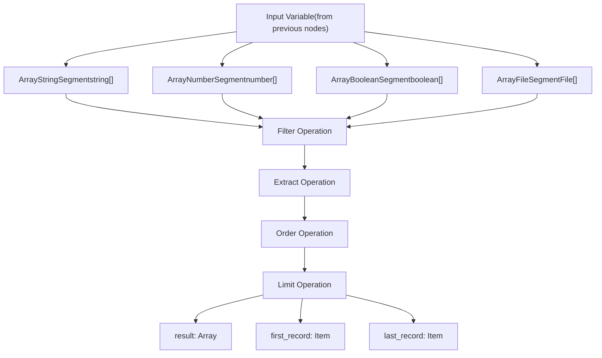
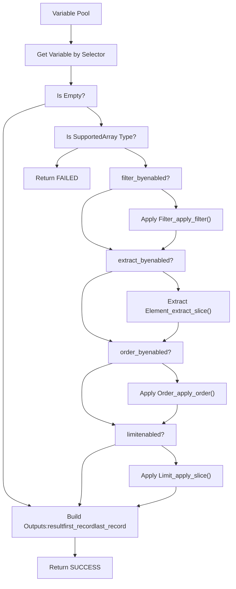
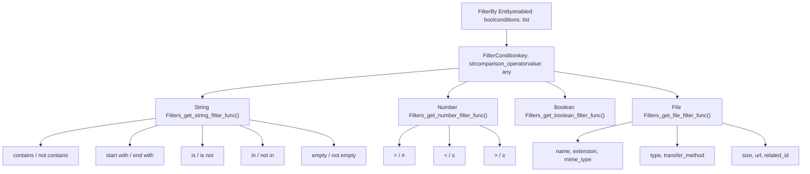
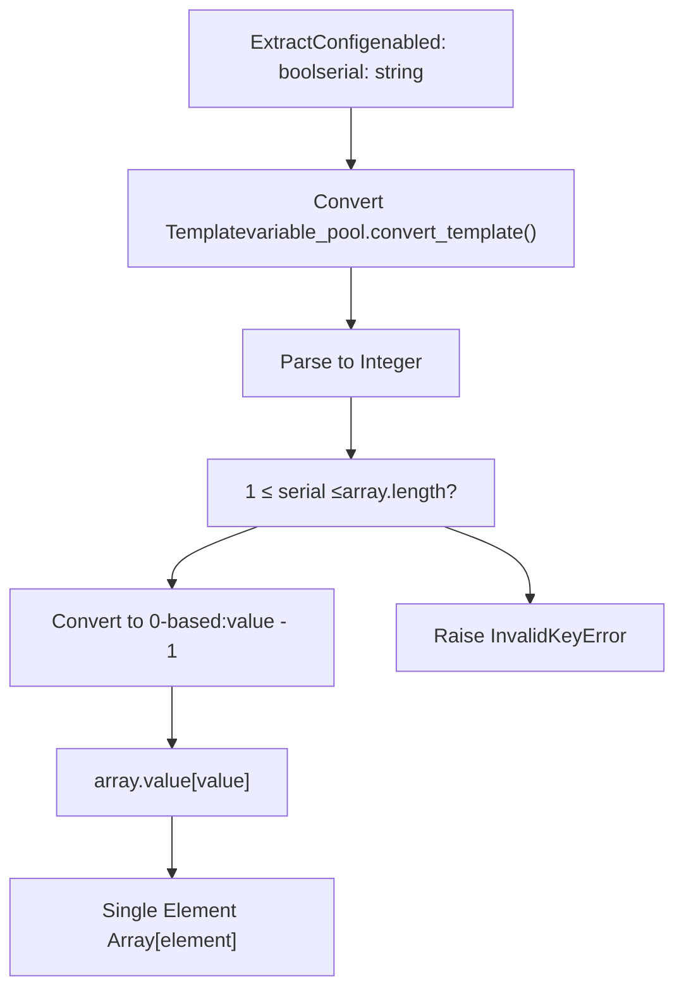
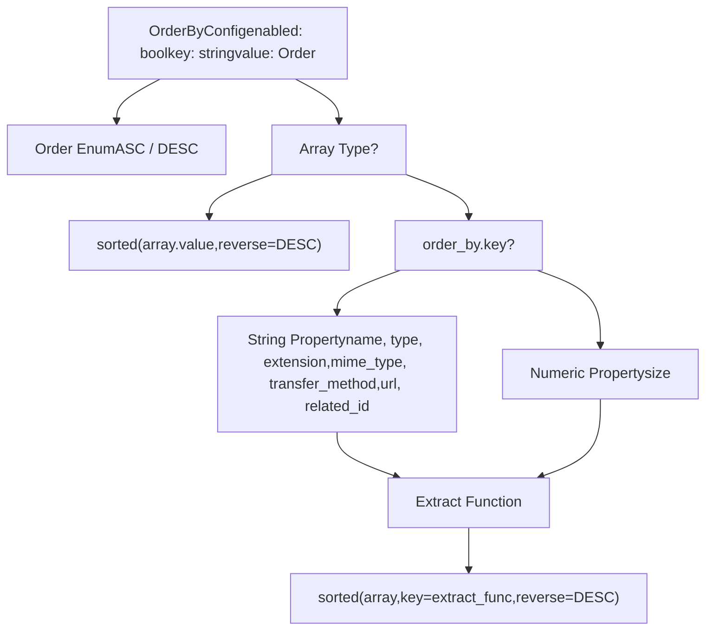
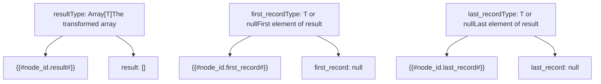
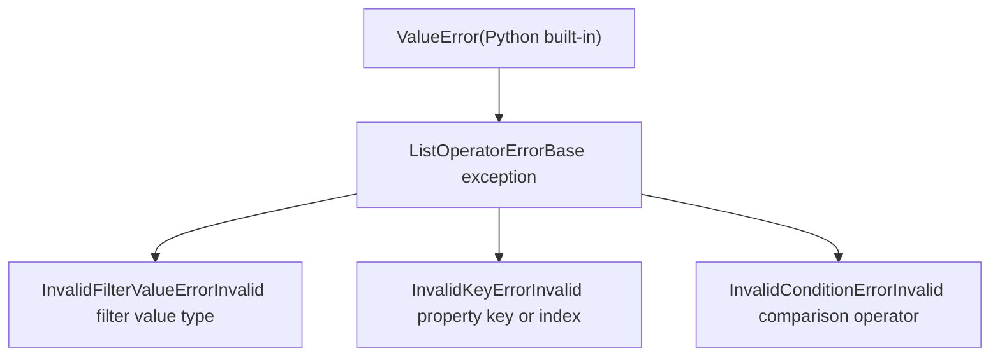
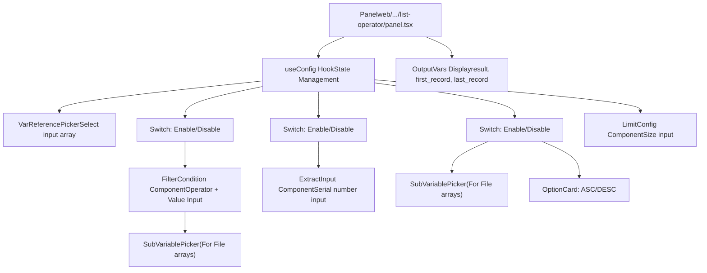
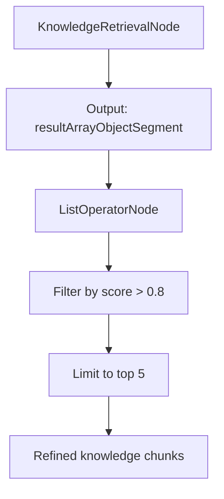

# List Operator and Data Transformation Nodes

Relevant source files

-   [api/core/rag/datasource/retrieval\_service.py](https://github.com/langgenius/dify/blob/92dbc94f/api/core/rag/datasource/retrieval_service.py)
-   [api/core/rag/entities/metadata\_entities.py](https://github.com/langgenius/dify/blob/92dbc94f/api/core/rag/entities/metadata_entities.py)
-   [api/core/rag/retrieval/dataset\_retrieval.py](https://github.com/langgenius/dify/blob/92dbc94f/api/core/rag/retrieval/dataset_retrieval.py)
-   [api/core/workflow/nodes/knowledge\_retrieval/entities.py](https://github.com/langgenius/dify/blob/92dbc94f/api/core/workflow/nodes/knowledge_retrieval/entities.py)
-   [api/core/workflow/nodes/knowledge\_retrieval/knowledge\_retrieval\_node.py](https://github.com/langgenius/dify/blob/92dbc94f/api/core/workflow/nodes/knowledge_retrieval/knowledge_retrieval_node.py)
-   [api/core/workflow/nodes/list\_operator/entities.py](https://github.com/langgenius/dify/blob/92dbc94f/api/core/workflow/nodes/list_operator/entities.py)
-   [api/core/workflow/nodes/list\_operator/exc.py](https://github.com/langgenius/dify/blob/92dbc94f/api/core/workflow/nodes/list_operator/exc.py)
-   [api/core/workflow/nodes/list\_operator/node.py](https://github.com/langgenius/dify/blob/92dbc94f/api/core/workflow/nodes/list_operator/node.py)
-   [api/core/workflow/nodes/question\_classifier/entities.py](https://github.com/langgenius/dify/blob/92dbc94f/api/core/workflow/nodes/question_classifier/entities.py)
-   [api/services/hit\_testing\_service.py](https://github.com/langgenius/dify/blob/92dbc94f/api/services/hit_testing_service.py)
-   [api/tests/unit\_tests/core/rag/retrieval/\_\_init\_\_.py](https://github.com/langgenius/dify/blob/92dbc94f/api/tests/unit_tests/core/rag/retrieval/__init__.py)
-   [api/tests/unit\_tests/core/rag/retrieval/test\_dataset\_retrieval.py](https://github.com/langgenius/dify/blob/92dbc94f/api/tests/unit_tests/core/rag/retrieval/test_dataset_retrieval.py)
-   [api/tests/unit\_tests/core/workflow/nodes/test\_list\_operator.py](https://github.com/langgenius/dify/blob/92dbc94f/api/tests/unit_tests/core/workflow/nodes/test_list_operator.py)
-   [web/app/components/workflow/nodes/knowledge-retrieval/components/metadata/condition-list/utils.ts](https://github.com/langgenius/dify/blob/92dbc94f/web/app/components/workflow/nodes/knowledge-retrieval/components/metadata/condition-list/utils.ts)
-   [web/app/components/workflow/nodes/knowledge-retrieval/components/metadata/metadata-icon.tsx](https://github.com/langgenius/dify/blob/92dbc94f/web/app/components/workflow/nodes/knowledge-retrieval/components/metadata/metadata-icon.tsx)
-   [web/app/components/workflow/nodes/list-operator/components/extract-input.tsx](https://github.com/langgenius/dify/blob/92dbc94f/web/app/components/workflow/nodes/list-operator/components/extract-input.tsx)
-   [web/app/components/workflow/nodes/list-operator/components/filter-condition.tsx](https://github.com/langgenius/dify/blob/92dbc94f/web/app/components/workflow/nodes/list-operator/components/filter-condition.tsx)
-   [web/app/components/workflow/nodes/list-operator/default.ts](https://github.com/langgenius/dify/blob/92dbc94f/web/app/components/workflow/nodes/list-operator/default.ts)
-   [web/app/components/workflow/nodes/list-operator/panel.tsx](https://github.com/langgenius/dify/blob/92dbc94f/web/app/components/workflow/nodes/list-operator/panel.tsx)
-   [web/app/components/workflow/nodes/list-operator/types.ts](https://github.com/langgenius/dify/blob/92dbc94f/web/app/components/workflow/nodes/list-operator/types.ts)
-   [web/app/components/workflow/nodes/utils.ts](https://github.com/langgenius/dify/blob/92dbc94f/web/app/components/workflow/nodes/utils.ts)

The List Operator node provides array manipulation capabilities within Dify workflows, enabling filtering, extraction, ordering, and limiting operations on array-type variables. This node is essential for data preprocessing, result refinement, and conditional data flow control.

For knowledge base retrieval operations, see [Knowledge Retrieval and Question Classifier Nodes](/langgenius/dify/5.3-knowledge-retrieval-and-question-classifier-nodes). For general workflow structure and execution, see [Workflow Definition and Execution Model](/langgenius/dify/5.1-workflow-definition-and-execution-model).

## Overview

The `ListOperatorNode` class ([api/core/workflow/nodes/list\_operator/node.py37-184](https://github.com/langgenius/dify/blob/92dbc94f/api/core/workflow/nodes/list_operator/node.py#L37-L184)) processes array variables through a configurable pipeline of four sequential operations:

1.  **Filter** - Apply conditional filtering to array elements
2.  **Extract** - Select a specific element by index position
3.  **Order** - Sort elements in ascending or descending order
4.  **Limit** - Restrict the number of elements in the result

Each operation can be independently enabled or disabled, and operations execute in the fixed order listed above.

**Sources:** [api/core/workflow/nodes/list\_operator/node.py37-118](https://github.com/langgenius/dify/blob/92dbc94f/api/core/workflow/nodes/list_operator/node.py#L37-L118)

## Supported Array Types


The node validates input types at runtime ([api/core/workflow/nodes/list\_operator/node.py69-73](https://github.com/langgenius/dify/blob/92dbc94f/api/core/workflow/nodes/list_operator/node.py#L69-L73)):

| Type | Class | Use Case |
| --- | --- | --- |
| `ArrayStringSegment` | String arrays | Text lists, categories, tags |
| `ArrayNumberSegment` | Numeric arrays | Scores, counts, measurements |
| `ArrayBooleanSegment` | Boolean arrays | Flags, binary states |
| `ArrayFileSegment` | File arrays | Multimodal processing, document batches |

**Sources:** [api/core/workflow/nodes/list\_operator/node.py14-21](https://github.com/langgenius/dify/blob/92dbc94f/api/core/workflow/nodes/list_operator/node.py#L14-L21) [api/core/workflow/nodes/list\_operator/entities.py1-70](https://github.com/langgenius/dify/blob/92dbc94f/api/core/workflow/nodes/list_operator/entities.py#L1-L70)

## Operation Execution Pipeline

### Pipeline Architecture


The execution flow ([api/core/workflow/nodes/list\_operator/node.py82-109](https://github.com/langgenius/dify/blob/92dbc94f/api/core/workflow/nodes/list_operator/node.py#L82-L109)):

1.  **Variable retrieval** from `variable_pool` using selector
2.  **Empty array handling** - immediate success with empty result
3.  **Sequential operation application** - operations modify the array in-place
4.  **Output construction** - `result`, `first_record`, `last_record`

**Sources:** [api/core/workflow/nodes/list\_operator/node.py44-118](https://github.com/langgenius/dify/blob/92dbc94f/api/core/workflow/nodes/list_operator/node.py#L44-L118)

## Filter Operation

### Filter Condition System


### Filter Implementation

The `_apply_filter` method ([api/core/workflow/nodes/list\_operator/node.py119-157](https://github.com/langgenius/dify/blob/92dbc94f/api/core/workflow/nodes/list_operator/node.py#L119-L157)) processes conditions based on array element type:

| Array Type | Filter Logic | Example |
| --- | --- | --- |
| `ArrayStringSegment` | Text matching operators | `contains`, `start with`, `is` |
| `ArrayNumberSegment` | Numeric comparison | `=`, `<`, `>`, `≤`, `≥`, `≠` |
| `ArrayBooleanSegment` | Boolean equality | `is`, `is not` |
| `ArrayFileSegment` | Property extraction + comparison | Filter by `type`, `size`, `extension` |

**File Filtering:**

For `ArrayFileSegment`, the system first extracts properties using key-based accessors ([api/core/workflow/nodes/list\_operator/node.py186-212](https://github.com/langgenius/dify/blob/92dbc94f/api/core/workflow/nodes/list_operator/node.py#L186-L212)):

```
# String properties
_get_file_extract_string_func(key="name")      # Returns filename
_get_file_extract_string_func(key="type")      # Returns file type
_get_file_extract_string_func(key="extension") # Returns extension

# Numeric properties
_get_file_extract_number_func(key="size")      # Returns file size
```
Then applies appropriate comparison operators ([api/core/workflow/nodes/list\_operator/node.py278-291](https://github.com/langgenius/dify/blob/92dbc94f/api/core/workflow/nodes/list_operator/node.py#L278-L291)).

**Negation Pattern:**

The `_negation` helper ([api/core/workflow/nodes/list\_operator/node.py26-34](https://github.com/langgenius/dify/blob/92dbc94f/api/core/workflow/nodes/list_operator/node.py#L26-L34)) wraps any filter function to create its logical inverse, enabling `not contains`, `is not`, `not in` operators.

**Sources:** [api/core/workflow/nodes/list\_operator/node.py119-157](https://github.com/langgenius/dify/blob/92dbc94f/api/core/workflow/nodes/list_operator/node.py#L119-L157) [api/core/workflow/nodes/list\_operator/node.py214-291](https://github.com/langgenius/dify/blob/92dbc94f/api/core/workflow/nodes/list_operator/node.py#L214-L291) [api/core/workflow/nodes/list\_operator/entities.py9-28](https://github.com/langgenius/dify/blob/92dbc94f/api/core/workflow/nodes/list_operator/entities.py#L9-L28)

## Extract Operation

The extract operation selects a single element from the array by 1-based serial position ([api/core/workflow/nodes/list\_operator/node.py175-184](https://github.com/langgenius/dify/blob/92dbc94f/api/core/workflow/nodes/list_operator/node.py#L175-L184)):


**Key Characteristics:**

-   **1-based indexing** for user-friendliness (converted to 0-based internally)
-   **Variable template support** - `serial` can reference workflow variables
-   **Validation** - raises `InvalidKeyError` if index is out of bounds
-   **Result** - Returns array with single element, not the element itself

**Sources:** [api/core/workflow/nodes/list\_operator/node.py175-184](https://github.com/langgenius/dify/blob/92dbc94f/api/core/workflow/nodes/list_operator/node.py#L175-L184) [api/core/workflow/nodes/list\_operator/entities.py59-62](https://github.com/langgenius/dify/blob/92dbc94f/api/core/workflow/nodes/list_operator/entities.py#L59-L62)

## Order Operation

### Ordering Logic


The `_apply_order` method ([api/core/workflow/nodes/list\_operator/node.py159-169](https://github.com/langgenius/dify/blob/92dbc94f/api/core/workflow/nodes/list_operator/node.py#L159-L169)) uses Python's `sorted()` function:

**Simple Types (String, Number, Boolean):**

-   Direct sorting with `reverse` parameter for DESC order
-   No key function needed

**File Arrays:**

-   Requires `order_by.key` to specify which property to sort by
-   Uses extraction functions ([api/core/workflow/nodes/list\_operator/node.py186-212](https://github.com/langgenius/dify/blob/92dbc94f/api/core/workflow/nodes/list_operator/node.py#L186-L212))
-   Supports sorting by: `name`, `type`, `extension`, `mime_type`, `transfer_method`, `url`, `related_id`, `size`
-   Implementation in `_order_file` ([api/core/workflow/nodes/list\_operator/node.py337-347](https://github.com/langgenius/dify/blob/92dbc94f/api/core/workflow/nodes/list_operator/node.py#L337-L347))

**Sources:** [api/core/workflow/nodes/list\_operator/node.py159-169](https://github.com/langgenius/dify/blob/92dbc94f/api/core/workflow/nodes/list_operator/node.py#L159-L169) [api/core/workflow/nodes/list\_operator/node.py337-347](https://github.com/langgenius/dify/blob/92dbc94f/api/core/workflow/nodes/list_operator/node.py#L337-L347) [api/core/workflow/nodes/list\_operator/entities.py30-33](https://github.com/langgenius/dify/blob/92dbc94f/api/core/workflow/nodes/list_operator/entities.py#L30-L33)

## Limit Operation

The limit operation restricts the result array to the first N elements ([api/core/workflow/nodes/list\_operator/node.py171-173](https://github.com/langgenius/dify/blob/92dbc94f/api/core/workflow/nodes/list_operator/node.py#L171-L173)):

```
def _apply_slice(self, variable: _SUPPORTED_TYPES_ALIAS) -> _SUPPORTED_TYPES_ALIAS:
    result = variable.value[: self.node_data.limit.size]
    return variable.model_copy(update={"value": result})
```
**Configuration:**

| Property | Type | Description |
| --- | --- | --- |
| `enabled` | `bool` | Whether to apply limit |
| `size` | `int` | Maximum number of elements to return |

**Behavior:**

-   Uses Python slice notation `[:size]`
-   If `size` exceeds array length, returns entire array
-   If `size` is 0 or negative, returns empty array

**Sources:** [api/core/workflow/nodes/list\_operator/node.py171-173](https://github.com/langgenius/dify/blob/92dbc94f/api/core/workflow/nodes/list_operator/node.py#L171-L173) [api/core/workflow/nodes/list\_operator/entities.py54-57](https://github.com/langgenius/dify/blob/92dbc94f/api/core/workflow/nodes/list_operator/entities.py#L54-L57)

## Output Variables

### Output Structure


The node produces three output variables ([api/core/workflow/nodes/list\_operator/node.py99-103](https://github.com/langgenius/dify/blob/92dbc94f/api/core/workflow/nodes/list_operator/node.py#L99-L103)):

| Variable | Type | Description | Empty Array Value |
| --- | --- | --- | --- |
| `result` | `Array[T]` | Complete transformed array | `[]` |
| `first_record` | `T | null` | First element of result array | `null` |
| `last_record` | `T | null` | Last element of result array | `null` |

Where `T` is the element type (`string`, `number`, `boolean`, or `File`).

**Type Preservation:**

The output `result` preserves the input array type using `model_copy`:

```
outputs = {
    "result": variable,  # Still ArrayStringSegment, ArrayNumberSegment, etc.
    "first_record": variable.value[0] if variable.value else None,
    "last_record": variable.value[-1] if variable.value else None,
}
```
**Sources:** [api/core/workflow/nodes/list\_operator/node.py99-103](https://github.com/langgenius/dify/blob/92dbc94f/api/core/workflow/nodes/list_operator/node.py#L99-L103) [api/core/workflow/nodes/list\_operator/node.py55-68](https://github.com/langgenius/dify/blob/92dbc94f/api/core/workflow/nodes/list_operator/node.py#L55-L68)

## Exception Handling

### Exception Hierarchy


Exception classes are defined in [api/core/workflow/nodes/list\_operator/exc.py1-17](https://github.com/langgenius/dify/blob/92dbc94f/api/core/workflow/nodes/list_operator/exc.py#L1-L17):

| Exception | Trigger Condition | Example |
| --- | --- | --- |
| `InvalidFilterValueError` | Wrong type for filter value | Boolean value for string filter |
| `InvalidKeyError` | Invalid property key or out-of-bounds index | `key="invalid_prop"` or `serial=999` |
| `InvalidConditionError` | Unsupported comparison operator | Unknown operator string |

All exceptions are caught in the `_run` method ([api/core/workflow/nodes/list\_operator/node.py110-117](https://github.com/langgenius/dify/blob/92dbc94f/api/core/workflow/nodes/list_operator/node.py#L110-L117)) and converted to failed node results with error messages.

**Sources:** [api/core/workflow/nodes/list\_operator/exc.py1-17](https://github.com/langgenius/dify/blob/92dbc94f/api/core/workflow/nodes/list_operator/exc.py#L1-L17) [api/core/workflow/nodes/list\_operator/node.py110-117](https://github.com/langgenius/dify/blob/92dbc94f/api/core/workflow/nodes/list_operator/node.py#L110-L117)

## Frontend Configuration

### UI Panel Architecture


The frontend panel ([web/app/components/workflow/nodes/list-operator/panel.tsx21-188](https://github.com/langgenius/dify/blob/92dbc94f/web/app/components/workflow/nodes/list-operator/panel.tsx#L21-L188)) provides a visual interface for configuring all operations:

**Component Structure:**

| Section | Components | Purpose |
| --- | --- | --- |
| Input Variable | `VarReferencePicker` | Select source array from workflow variables |
| Filter Condition | `Switch`, `FilterCondition` | Configure conditional filtering |
| Extract | `Switch`, `ExtractInput` | Configure element extraction by index |
| Order By | `Switch`, `SubVariablePicker`, `OptionCard` | Configure sorting direction and property |
| Limit | `LimitConfig` | Configure result size limit |
| Output | `OutputVars` | Display available output variables |

**Type-Aware UI:**

The `FilterCondition` component ([web/app/components/workflow/nodes/list-operator/components/filter-condition.tsx40-188](https://github.com/langgenius/dify/blob/92dbc94f/web/app/components/workflow/nodes/list-operator/components/filter-condition.tsx#L40-L188)) adapts to the array element type:

-   **String/Number arrays**: Direct comparison input
-   **Boolean arrays**: `BoolValue` toggle component
-   **File arrays**:
    -   `SubVariablePicker` for property selection (`key`)
    -   Type-specific operators (e.g., `in` for `type`, numeric comparisons for `size`)
    -   Select dropdowns for enum values (`FILE_TYPE_OPTIONS`, `TRANSFER_METHOD`)

**Variable Template Support:**

Input fields support variable references using the `Input` component with `nodesOutputVars` and `availableNodes` props, enabling dynamic values from previous workflow nodes.

**Sources:** [web/app/components/workflow/nodes/list-operator/panel.tsx21-188](https://github.com/langgenius/dify/blob/92dbc94f/web/app/components/workflow/nodes/list-operator/panel.tsx#L21-L188) [web/app/components/workflow/nodes/list-operator/components/filter-condition.tsx40-188](https://github.com/langgenius/dify/blob/92dbc94f/web/app/components/workflow/nodes/list-operator/components/filter-condition.tsx#L40-L188) [web/app/components/workflow/nodes/list-operator/components/extract-input.tsx19-53](https://github.com/langgenius/dify/blob/92dbc94f/web/app/components/workflow/nodes/list-operator/components/extract-input.tsx#L19-L53)

## Validation Rules

The frontend validation ([web/app/components/workflow/nodes/list-operator/default.ts38-61](https://github.com/langgenius/dify/blob/92dbc94f/web/app/components/workflow/nodes/list-operator/default.ts#L38-L61)) enforces:

| Field | Validation Rule | Error Condition |
| --- | --- | --- |
| `variable` | Required | Empty selector array |
| `filter_by.key` | Required if File array and filter enabled | Missing property key for File filtering |
| `filter_by.comparison_operator` | Required if filter enabled | Missing operator |
| `filter_by.value` | Required if operator requires value | Missing value for non-empty operators |

The `comparisonOperatorNotRequireValue` function checks if operators like `empty`, `not empty` skip value validation.

**Sources:** [web/app/components/workflow/nodes/list-operator/default.ts38-61](https://github.com/langgenius/dify/blob/92dbc94f/web/app/components/workflow/nodes/list-operator/default.ts#L38-L61)

## Integration with Knowledge Retrieval

The List Operator node is commonly used to process results from Knowledge Retrieval nodes. The KnowledgeRetrievalNode outputs `ArrayObjectSegment` ([api/core/workflow/nodes/knowledge\_retrieval/knowledge\_retrieval\_node.py188-200](https://github.com/langgenius/dify/blob/92dbc94f/api/core/workflow/nodes/knowledge_retrieval/knowledge_retrieval_node.py#L188-L200)):


**Common Patterns:**

1.  **Score filtering**: Filter retrieval results by relevance score threshold
2.  **Result limiting**: Take only top-K most relevant chunks after reranking
3.  **Source filtering**: Filter by dataset or document metadata

**Note:** While `ArrayObjectSegment` is not listed in `_SUPPORTED_TYPES_TUPLE`, the variable pool conversion system may handle object arrays through the `ArrayAnySegment` fallback ([api/core/workflow/nodes/list\_operator/node.py61](https://github.com/langgenius/dify/blob/92dbc94f/api/core/workflow/nodes/list_operator/node.py#L61-L61)).

**Sources:** [api/core/workflow/nodes/knowledge\_retrieval/knowledge\_retrieval\_node.py188-200](https://github.com/langgenius/dify/blob/92dbc94f/api/core/workflow/nodes/knowledge_retrieval/knowledge_retrieval_node.py#L188-L200) [api/core/workflow/nodes/list\_operator/node.py58-62](https://github.com/langgenius/dify/blob/92dbc94f/api/core/workflow/nodes/list_operator/node.py#L58-L62)

## Testing

The test suite ([api/tests/unit\_tests/core/workflow/nodes/test\_list\_operator.py1-183](https://github.com/langgenius/dify/blob/92dbc94f/api/tests/unit_tests/core/workflow/nodes/test_list_operator.py#L1-L183)) validates:

**File Filtering Tests** ([api/tests/unit\_tests/core/workflow/nodes/test\_list\_operator.py65-138](https://github.com/langgenius/dify/blob/92dbc94f/api/tests/unit_tests/core/workflow/nodes/test_list_operator.py#L65-L138)):

-   Filter files by `type` using `in` operator
-   Verify correct files are selected (IMAGE, DOCUMENT) while excluding others (AUDIO)

**Property Extraction Tests** ([api/tests/unit\_tests/core/workflow/nodes/test\_list\_operator.py140-183](https://github.com/langgenius/dify/blob/92dbc94f/api/tests/unit_tests/core/workflow/nodes/test_list_operator.py#L140-L183)):

-   Test all file property extractors (`name`, `type`, `extension`, `mime_type`, `transfer_method`, `url`, `related_id`)
-   Validate empty value handling (returns empty string for null properties)
-   Verify `InvalidKeyError` for invalid keys

**Test Fixtures:**

```
@pytest.fixture
def list_operator_node():
    config = {
        "variable": ["test_variable"],
        "filter_by": FilterBy(enabled=True, conditions=[...]),
        "order_by": OrderByConfig(enabled=False),
        "limit": Limit(enabled=False),
        "extract_by": ExtractConfig(enabled=False)
    }
```
**Sources:** [api/tests/unit\_tests/core/workflow/nodes/test\_list\_operator.py23-183](https://github.com/langgenius/dify/blob/92dbc94f/api/tests/unit_tests/core/workflow/nodes/test_list_operator.py#L23-L183)
