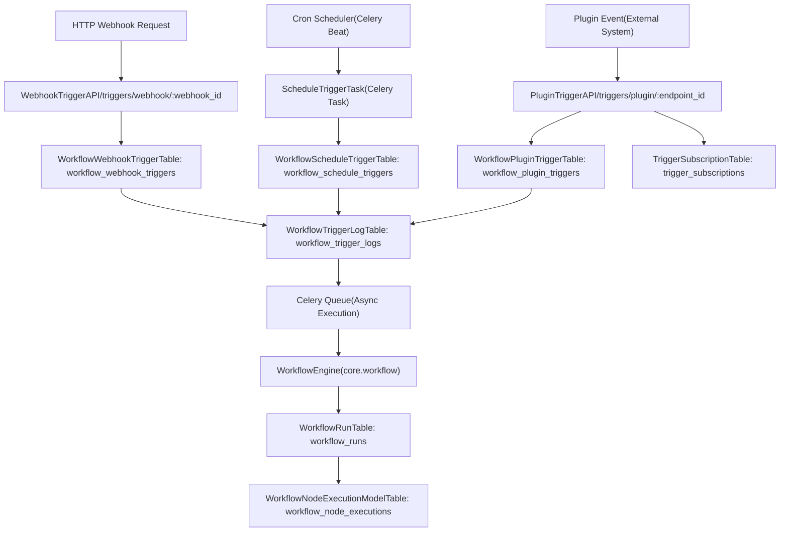
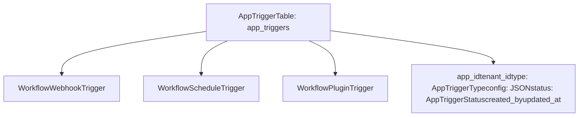
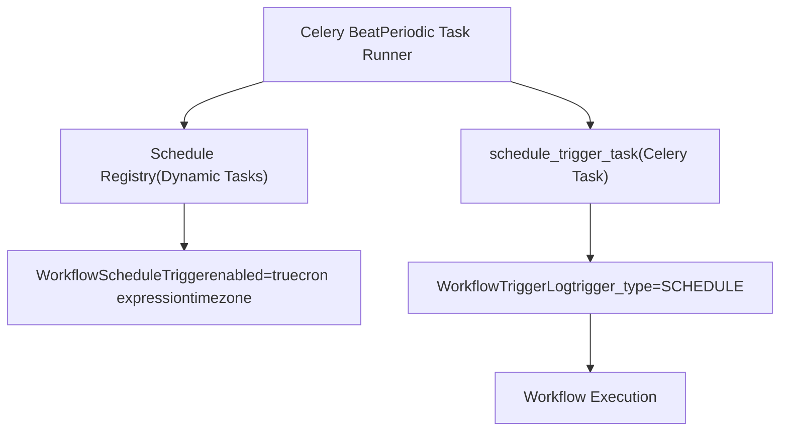
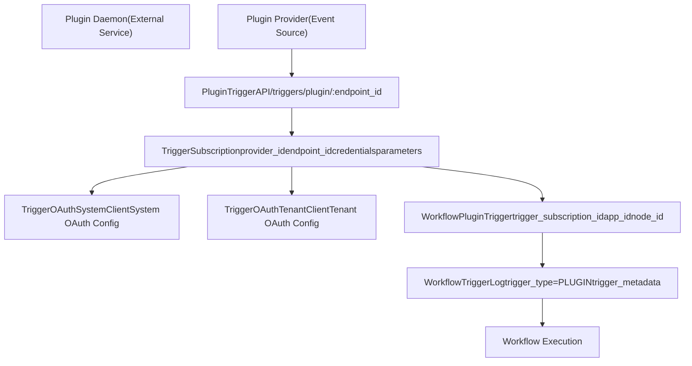
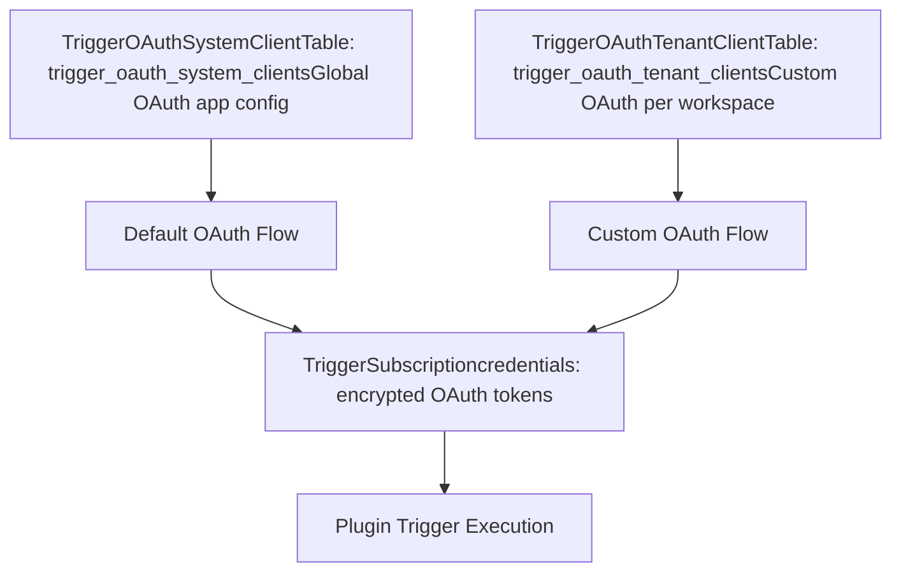
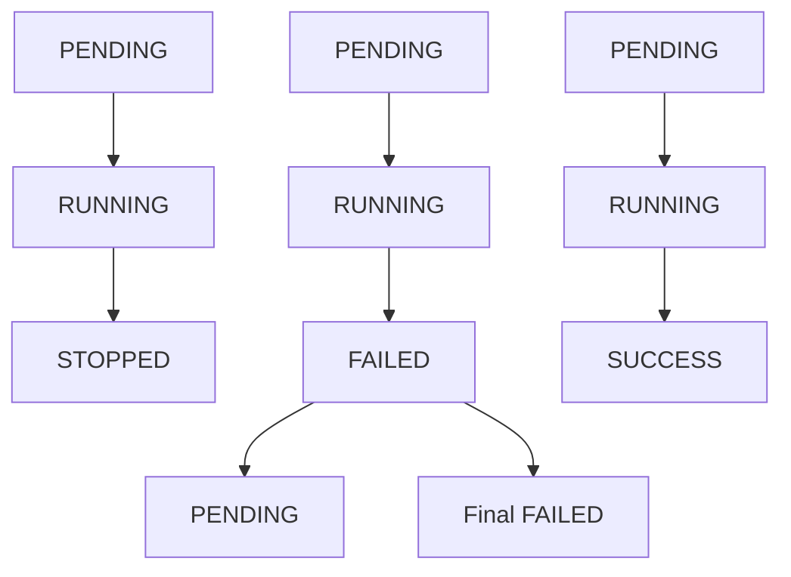

# Trigger System and Workflow Automation

Relevant source files

-   [api/models/account.py](https://github.com/langgenius/dify/blob/92dbc94f/api/models/account.py)
-   [api/models/api\_based\_extension.py](https://github.com/langgenius/dify/blob/92dbc94f/api/models/api_based_extension.py)
-   [api/models/dataset.py](https://github.com/langgenius/dify/blob/92dbc94f/api/models/dataset.py)
-   [api/models/model.py](https://github.com/langgenius/dify/blob/92dbc94f/api/models/model.py)
-   [api/models/oauth.py](https://github.com/langgenius/dify/blob/92dbc94f/api/models/oauth.py)
-   [api/models/provider.py](https://github.com/langgenius/dify/blob/92dbc94f/api/models/provider.py)
-   [api/models/source.py](https://github.com/langgenius/dify/blob/92dbc94f/api/models/source.py)
-   [api/models/task.py](https://github.com/langgenius/dify/blob/92dbc94f/api/models/task.py)
-   [api/models/tools.py](https://github.com/langgenius/dify/blob/92dbc94f/api/models/tools.py)
-   [api/models/trigger.py](https://github.com/langgenius/dify/blob/92dbc94f/api/models/trigger.py)
-   [api/models/web.py](https://github.com/langgenius/dify/blob/92dbc94f/api/models/web.py)
-   [api/models/workflow.py](https://github.com/langgenius/dify/blob/92dbc94f/api/models/workflow.py)
-   [api/tests/test\_containers\_integration\_tests/services/test\_advanced\_prompt\_template\_service.py](https://github.com/langgenius/dify/blob/92dbc94f/api/tests/test_containers_integration_tests/services/test_advanced_prompt_template_service.py)
-   [api/tests/test\_containers\_integration\_tests/services/test\_agent\_service.py](https://github.com/langgenius/dify/blob/92dbc94f/api/tests/test_containers_integration_tests/services/test_agent_service.py)
-   [api/tests/test\_containers\_integration\_tests/tasks/\_\_init\_\_.py](https://github.com/langgenius/dify/blob/92dbc94f/api/tests/test_containers_integration_tests/tasks/__init__.py)
-   [api/tests/test\_containers\_integration\_tests/tasks/test\_add\_document\_to\_index\_task.py](https://github.com/langgenius/dify/blob/92dbc94f/api/tests/test_containers_integration_tests/tasks/test_add_document_to_index_task.py)
-   [api/tests/unit\_tests/core/test\_provider\_manager.py](https://github.com/langgenius/dify/blob/92dbc94f/api/tests/unit_tests/core/test_provider_manager.py)

## Purpose and Scope

The Trigger System enables automated workflow execution in response to external events, scheduled times, or plugin-based triggers. This system allows workflows to run without direct user interaction through three primary mechanisms: **webhooks** (HTTP endpoints), **schedules** (cron-based), and **plugin triggers** (event-driven).

For information about workflow definition and execution, see [Workflow Definition and Execution Model](/langgenius/dify/5.1-workflow-definition-and-execution-model). For details on how workflows process LLM calls and tools, see [LLM Nodes and Model Integration](/langgenius/dify/5.2-llm-nodes-and-model-integration).

---

## Trigger Architecture Overview

The trigger system consists of several key components that work together to enable automated workflow execution:

### System Components Diagram


**Sources:** [api/models/trigger.py1-600](https://github.com/langgenius/dify/blob/92dbc94f/api/models/trigger.py#L1-L600)

---

## Trigger Types and Configuration

### Trigger Type Enumeration

The system supports three trigger types defined in `AppTriggerType`:

| Trigger Type | Enum Value | Use Case |
| --- | --- | --- |
| Webhook | `WEBHOOK` | HTTP endpoint for external integrations |
| Schedule | `SCHEDULE` | Time-based execution (cron) |
| Plugin | `PLUGIN` | Event-driven execution from external plugins |

**Sources:** [api/models/enums.py1-100](https://github.com/langgenius/dify/blob/92dbc94f/api/models/enums.py#L1-L100)

---

## Data Model Architecture

### Core Trigger Tables

```mermaid
flowchart TD
    entity_App_0["App"]
    entity_WorkflowWebhookTrigger_1["WorkflowWebhookTrigger"]
    entity_WorkflowScheduleTrigger_2["WorkflowScheduleTrigger"]
    entity_WorkflowPluginTrigger_3["WorkflowPluginTrigger"]
    entity_Workflow_4["Workflow"]
    entity_TriggerSubscription_5["TriggerSubscription"]
    entity_WorkflowTriggerLog_6["WorkflowTriggerLog"]
    entity_WorkflowRun_7["WorkflowRun"]
```


**Sources:** [api/models/trigger.py27-106](https://github.com/langgenius/dify/blob/92dbc94f/api/models/trigger.py#L27-L106) [api/models/trigger.py169-280](https://github.com/langgenius/dify/blob/92dbc94f/api/models/trigger.py#L169-L280) [api/models/trigger.py282-400](https://github.com/langgenius/dify/blob/92dbc94f/api/models/trigger.py#L282-L400)

### AppTrigger Relationship

The `AppTrigger` model provides a unified interface across all trigger types:


**Sources:** [api/models/trigger.py402-500](https://github.com/langgenius/dify/blob/92dbc94f/api/models/trigger.py#L402-L500)

---

## Webhook Triggers

### Webhook Trigger Flow

> **[Mermaid sequence]**
> *(图表结构无法解析)*

### Webhook Trigger Model Structure

The `WorkflowWebhookTrigger` table stores webhook configurations:

| Field | Type | Description |
| --- | --- | --- |
| `id` | UUID | Primary key |
| `app_id` | UUID | Foreign key to App |
| `node_id` | VARCHAR(255) | Start node ID in workflow graph |
| `tenant_id` | UUID | Workspace identifier |
| `webhook_id` | VARCHAR(255) | **Unique** endpoint identifier used in URL |
| `created_by` | VARCHAR(255) | User ID of creator |
| `created_at` | TIMESTAMP | Creation timestamp |
| `updated_at` | TIMESTAMP | Last update timestamp |

**Endpoint URL Pattern:**

```
https://{API_HOST}/triggers/webhook/{webhook_id}
```
**Sources:** [api/models/trigger.py282-340](https://github.com/langgenius/dify/blob/92dbc94f/api/models/trigger.py#L282-L340)

### Webhook ID Generation

The `webhook_id` is generated using the `generate_webhook_trigger_endpoint()` utility function, which creates a URL-safe unique identifier for each webhook trigger.

**Sources:** [core/trigger/utils/endpoint.py1-50](https://github.com/langgenius/dify/blob/92dbc94f/core/trigger/utils/endpoint.py#L1-L50)

---

## Schedule Triggers

### Schedule Trigger Architecture


### Schedule Trigger Model

The `WorkflowScheduleTrigger` table stores cron-based schedules:

| Field | Type | Description |
| --- | --- | --- |
| `id` | UUID | Primary key |
| `app_id` | UUID | Foreign key to App |
| `node_id` | VARCHAR(255) | Start node ID in workflow |
| `tenant_id` | UUID | Workspace identifier |
| `cron` | VARCHAR(255) | Cron expression (e.g., `"0 9 * * *"`) |
| `timezone` | VARCHAR(255) | IANA timezone (e.g., `"America/New_York"`) |
| `enabled` | BOOLEAN | Active status |
| `created_by` | VARCHAR(255) | User ID of creator |
| `created_at` | TIMESTAMP | Creation timestamp |
| `updated_at` | TIMESTAMP | Last update timestamp |
| `last_triggered_at` | TIMESTAMP | Last successful trigger time |

**Cron Expression Format:**

```
┌───────────── minute (0 - 59)
│ ┌───────────── hour (0 - 23)
│ │ ┌───────────── day of month (1 - 31)
│ │ │ ┌───────────── month (1 - 12)
│ │ │ │ ┌───────────── day of week (0 - 6) (Sunday to Saturday)
│ │ │ │ │
* * * * *
```
**Sources:** [api/models/trigger.py342-400](https://github.com/langgenius/dify/blob/92dbc94f/api/models/trigger.py#L342-L400)

### Timezone Handling

Schedule triggers support IANA timezone identifiers (e.g., `"UTC"`, `"America/New_York"`, `"Europe/London"`). The Celery Beat scheduler converts cron expressions to the specified timezone before execution.

**Sources:** [api/models/trigger.py350-360](https://github.com/langgenius/dify/blob/92dbc94f/api/models/trigger.py#L350-L360)

---

## Plugin Triggers

### Plugin Trigger Architecture


### TriggerSubscription Model

The `TriggerSubscription` table manages plugin event subscriptions:

| Field | Type | Description |
| --- | --- | --- |
| `id` | UUID | Primary key |
| `name` | VARCHAR(255) | Subscription instance name |
| `tenant_id` | UUID | Workspace identifier |
| `user_id` | UUID | User who created subscription |
| `provider_id` | VARCHAR(255) | Plugin identifier (e.g., `"plugin_id/provider_name"`) |
| `endpoint_id` | VARCHAR(255) | **Unique** endpoint for receiving events |
| `parameters` | JSON | Subscription configuration parameters |
| `properties` | JSON | Subscription properties |
| `credentials` | JSON | Encrypted credentials (OAuth token, API key) |
| `credential_type` | VARCHAR(50) | `"oauth"` or `"api_key"` |
| `credential_expires_at` | INTEGER | OAuth token expiration timestamp (`-1` for never) |
| `expires_at` | INTEGER | Subscription expiration timestamp (`-1` for never) |
| `created_at` | TIMESTAMP | Creation timestamp |
| `updated_at` | TIMESTAMP | Last update timestamp |

**Indexed Fields:**

-   `endpoint_id` (unique index for O(1) endpoint lookup)
-   `(tenant_id, provider_id)` (composite index for provider queries)

**Sources:** [api/models/trigger.py27-106](https://github.com/langgenius/dify/blob/92dbc94f/api/models/trigger.py#L27-L106)

### Plugin Trigger Credential Management

Plugin triggers support two credential types:

#### API Key Credentials

```
{
  "credential_type": "api_key",
  "credentials": {
    "api_key": "encrypted_value"
  },
  "credential_expires_at": -1
}
```
#### OAuth Credentials

```
{
  "credential_type": "oauth",
  "credentials": {
    "access_token": "encrypted_token",
    "refresh_token": "encrypted_refresh",
    "token_type": "Bearer"
  },
  "credential_expires_at": 1704067200
}
```
**OAuth Refresh Logic:**

The `is_credential_expired()` method checks if OAuth tokens need refresh with a 3-minute buffer:

```
def is_credential_expired(self) -> bool:
    if self.credential_expires_at == -1:
        return False
    # Check if token expires in next 3 minutes
    return (self.credential_expires_at - 180) < int(time.time())
```
**Sources:** [api/models/trigger.py79-84](https://github.com/langgenius/dify/blob/92dbc94f/api/models/trigger.py#L79-L84)

### Plugin Endpoint URL Generation

Plugin trigger endpoints follow this pattern:

```
https://{API_HOST}/triggers/plugin/{endpoint_id}
```
The `endpoint_id` is a unique identifier generated by `generate_plugin_trigger_endpoint_url()`.

**Sources:** [core/trigger/utils/endpoint.py1-50](https://github.com/langgenius/dify/blob/92dbc94f/core/trigger/utils/endpoint.py#L1-L50)

---

## Workflow Trigger Execution

### Trigger Log Lifecycle

> **[Mermaid stateDiagram]**
> *(图表结构无法解析)*

### WorkflowTriggerLog Model

The `WorkflowTriggerLog` table tracks all trigger executions:

| Field | Type | Description |
| --- | --- | --- |
| `id` | UUID | Primary key (used as `workflow_trigger_log_id`) |
| `tenant_id` | UUID | Workspace identifier |
| `app_id` | UUID | App identifier |
| `workflow_id` | UUID | Workflow identifier |
| `workflow_run_id` | UUID | Associated WorkflowRun (NULL until execution starts) |
| `root_node_id` | VARCHAR(255) | Custom starting node ID (optional) |
| `trigger_metadata` | TEXT | Trigger-specific metadata (JSON) |
| `trigger_type` | VARCHAR(50) | `WEBHOOK`, `SCHEDULE`, or `PLUGIN` |
| `trigger_data` | TEXT | Full trigger data including inputs (JSON) |
| `inputs` | TEXT | Input parameters for easy viewing (JSON) |
| `outputs` | TEXT | Output content (JSON, NULL until complete) |
| `status` | VARCHAR(50) | Execution status (see lifecycle) |
| `error` | TEXT | Error message if failed |
| `queue_name` | VARCHAR(100) | Celery queue used for execution |
| `celery_task_id` | VARCHAR(255) | Celery task ID for tracking |
| `retry_count` | INTEGER | Number of retry attempts |
| `elapsed_time` | FLOAT | Time consumption in seconds |
| `total_tokens` | INTEGER | Total tokens used (LLM calls) |
| `created_by_role` | VARCHAR(255) | `"account"` or `"end_user"` |
| `created_by` | VARCHAR(255) | Creator ID |
| `created_at` | TIMESTAMP | Creation time |
| `triggered_at` | TIMESTAMP | When actually triggered (execution started) |
| `finished_at` | TIMESTAMP | Completion time |

**Indexed Fields:**

-   `(tenant_id, app_id)` for app-specific queries
-   `status` for filtering by execution state
-   `created_at` for chronological ordering
-   `workflow_run_id` for linking to WorkflowRun
-   `workflow_id` for workflow-specific queries

**Sources:** [api/models/trigger.py169-280](https://github.com/langgenius/dify/blob/92dbc94f/api/models/trigger.py#L169-L280)

### Trigger Execution Flow with Re-invocation

> **[Mermaid sequence]**
> *(图表结构无法解析)*

**Sources:** [api/models/trigger.py253-279](https://github.com/langgenius/dify/blob/92dbc94f/api/models/trigger.py#L253-L279)

### Trigger Data Structure

The `trigger_data` field stores the complete trigger context as JSON:

```
{
  "type": "webhook",
  "source": {
    "ip": "192.168.1.100",
    "user_agent": "curl/7.68.0"
  },
  "inputs": {
    "user_input": "Hello, world!",
    "parameter1": "value1"
  },
  "metadata": {
    "webhook_id": "abc123",
    "received_at": "2024-01-15T10:30:00Z"
  }
}
```
For **schedule triggers**, metadata includes:

```
{
  "type": "schedule",
  "metadata": {
    "cron": "0 9 * * *",
    "timezone": "America/New_York",
    "scheduled_time": "2024-01-15T09:00:00-05:00"
  },
  "inputs": {
    // Start node inputs
  }
}
```
For **plugin triggers**, metadata includes:

```
{
  "type": "plugin",
  "metadata": {
    "provider_id": "github_webhook",
    "endpoint_id": "xyz789",
    "event_type": "push",
    "subscription_id": "sub_123"
  },
  "inputs": {
    // Extracted from plugin event payload
  }
}
```
**Sources:** [api/models/trigger.py219-223](https://github.com/langgenius/dify/blob/92dbc94f/api/models/trigger.py#L219-L223)

---

## OAuth Configuration for Triggers

### System-Level and Tenant-Level OAuth

Plugin triggers support OAuth authentication at two levels:


### TriggerOAuthSystemClient Model

System-level OAuth configuration for plugin providers:

| Field | Type | Description |
| --- | --- | --- |
| `id` | UUID | Primary key |
| `plugin_id` | VARCHAR(255) | Plugin identifier |
| `provider` | VARCHAR(255) | Provider name within plugin |
| `encrypted_oauth_params` | TEXT | Encrypted OAuth client credentials (JSON) |
| `created_at` | TIMESTAMP | Creation timestamp |
| `updated_at` | TIMESTAMP | Last update timestamp |

**Unique Constraint:** `(plugin_id, provider)`

**Sources:** [api/models/trigger.py108-133](https://github.com/langgenius/dify/blob/92dbc94f/api/models/trigger.py#L108-L133)

### TriggerOAuthTenantClient Model

Tenant-specific OAuth configuration (overrides system-level):

| Field | Type | Description |
| --- | --- | --- |
| `id` | UUID | Primary key |
| `tenant_id` | UUID | Workspace identifier |
| `plugin_id` | VARCHAR(255) | Plugin identifier |
| `provider` | VARCHAR(255) | Provider name within plugin |
| `enabled` | BOOLEAN | Active status |
| `encrypted_oauth_params` | TEXT | Encrypted OAuth client credentials (JSON) |
| `created_at` | TIMESTAMP | Creation timestamp |
| `updated_at` | TIMESTAMP | Last update timestamp |

**Unique Constraint:** `(tenant_id, plugin_id, provider)`

**OAuth Params Structure:**

```
{
  "client_id": "tenant_custom_client_id",
  "client_secret": "encrypted_secret",
  "authorize_url": "https://provider.com/oauth/authorize",
  "token_url": "https://provider.com/oauth/token",
  "scopes": ["read", "write"]
}
```
**Sources:** [api/models/trigger.py135-167](https://github.com/langgenius/dify/blob/92dbc94f/api/models/trigger.py#L135-L167)

---

## Trigger Status Management

### Trigger Status Enumerations

#### AppTriggerStatus

Controls whether a trigger is actively processing events:

| Status | Description |
| --- | --- |
| `ACTIVE` | Trigger is enabled and processing events |
| `PAUSED` | Trigger is disabled, events are ignored |

**Sources:** [api/models/enums.py1-50](https://github.com/langgenius/dify/blob/92dbc94f/api/models/enums.py#L1-L50)

#### WorkflowTriggerStatus

Tracks individual trigger execution state:

| Status | Description |
| --- | --- |
| `PENDING` | Trigger queued, waiting for worker |
| `RUNNING` | Currently executing workflow |
| `SUCCESS` | Workflow completed successfully |
| `FAILED` | Workflow execution failed |
| `STOPPED` | Execution manually stopped |

**Sources:** [api/models/enums.py51-100](https://github.com/langgenius/dify/blob/92dbc94f/api/models/enums.py#L51-L100)

### Status Transition Rules


**Sources:** [api/models/trigger.py225-240](https://github.com/langgenius/dify/blob/92dbc94f/api/models/trigger.py#L225-L240)

---

## Trigger Entity Conversions

The `TriggerSubscription` model provides conversion methods to domain entities:

### to\_entity() Method

Converts to core `Subscription` entity for workflow execution:

```
def to_entity(self) -> Subscription:
    return Subscription(
        expires_at=self.expires_at,
        endpoint=generate_plugin_trigger_endpoint_url(self.endpoint_id),
        parameters=self.parameters,
        properties=self.properties,
    )
```
**Sources:** [api/models/trigger.py86-92](https://github.com/langgenius/dify/blob/92dbc94f/api/models/trigger.py#L86-L92)

### to\_api\_entity() Method

Converts to API entity for client responses:

```
def to_api_entity(self) -> TriggerProviderSubscriptionApiEntity:
    return TriggerProviderSubscriptionApiEntity(
        id=self.id,
        name=self.name,
        provider=self.provider_id,
        endpoint=generate_plugin_trigger_endpoint_url(self.endpoint_id),
        parameters=self.parameters,
        properties=self.properties,
        credential_type=CredentialType(self.credential_type),
        credentials=self.credentials,
        workflows_in_use=-1,
    )
```
**Sources:** [api/models/trigger.py94-105](https://github.com/langgenius/dify/blob/92dbc94f/api/models/trigger.py#L94-L105)

---

## Trigger Queue Management

### Celery Queue Configuration

Trigger executions are distributed across Celery queues based on configuration:

| Queue Name | Purpose |
| --- | --- |
| `default` | Standard trigger executions |
| `high_priority` | Time-sensitive schedule triggers |
| `plugin_triggers` | Plugin-based event processing |

The `queue_name` field in `WorkflowTriggerLog` records which queue processed the trigger.

**Sources:** [api/models/trigger.py228](https://github.com/langgenius/dify/blob/92dbc94f/api/models/trigger.py#L228-L228)

### Task Retry Configuration

Failed trigger executions can be retried automatically:

```
# Pseudo-configuration (actual values in Celery settings)
MAX_RETRIES = 3
RETRY_DELAY_SECONDS = 60  # Exponential backoff
```
The `retry_count` field tracks retry attempts. After max retries, the trigger remains in `FAILED` status.

**Sources:** [api/models/trigger.py232](https://github.com/langgenius/dify/blob/92dbc94f/api/models/trigger.py#L232-L232)

---

## Integration with Workflow Execution

### Workflow Triggered From Enum

The `WorkflowNodeExecutionTriggeredFrom` enum distinguishes trigger sources:

```
class WorkflowNodeExecutionTriggeredFrom(StrEnum):
    SINGLE_STEP = "single-step"        # Manual single-step debugging
    WORKFLOW_RUN = "workflow-run"      # Standard workflow execution
    RAG_PIPELINE_RUN = "rag-pipeline-run"  # RAG pipeline execution
```
Trigger-initiated workflows use `WORKFLOW_RUN` as their triggered source.

**Sources:** [api/models/workflow.py718-725](https://github.com/langgenius/dify/blob/92dbc94f/api/models/workflow.py#L718-L725)

### Linking Triggers to WorkflowRun

When a trigger executes a workflow:

1.  **WorkflowTriggerLog** is created with `status=PENDING`
2.  Worker picks up task, updates `status=RUNNING`, sets `triggered_at`
3.  **WorkflowEngine** creates **WorkflowRun** with `triggered_from="app-run"`
4.  **WorkflowTriggerLog.workflow\_run\_id** is populated with the run ID
5.  Upon completion, `status=SUCCESS/FAILED`, `outputs` and `finished_at` are set

This bidirectional link enables:

-   Finding all triggers for a workflow run
-   Re-executing workflows from trigger logs
-   Monitoring trigger performance metrics

**Sources:** [api/models/trigger.py217](https://github.com/langgenius/dify/blob/92dbc94f/api/models/trigger.py#L217-L217) [api/models/workflow.py556-691](https://github.com/langgenius/dify/blob/92dbc94f/api/models/workflow.py#L556-L691)

---

## Monitoring and Observability

### Trigger Metrics

The `WorkflowTriggerLog` table provides metrics for monitoring:

| Metric | Field | Description |
| --- | --- | --- |
| Execution Time | `elapsed_time` | Total seconds from trigger to completion |
| Token Usage | `total_tokens` | Aggregate LLM token consumption |
| Retry Count | `retry_count` | Number of retry attempts |
| Queue Latency | `triggered_at - created_at` | Time waiting in queue |

### Query Examples

**Find failed triggers for an app:**

```
SELECT * FROM workflow_trigger_logs
WHERE app_id = :app_id
  AND status = 'FAILED'
ORDER BY created_at DESC;
```
**Calculate average execution time:**

```
SELECT AVG(elapsed_time) as avg_time
FROM workflow_trigger_logs
WHERE status = 'SUCCESS'
  AND workflow_id = :workflow_id;
```
**Sources:** [api/models/trigger.py233-234](https://github.com/langgenius/dify/blob/92dbc94f/api/models/trigger.py#L233-L234)

---

## Trigger Log Dictionary Serialization

The `to_dict()` method converts trigger log records to API-friendly dictionaries:

```
def to_dict(self) -> dict[str, Any]:
    return {
        "id": self.id,
        "tenant_id": self.tenant_id,
        "app_id": self.app_id,
        "workflow_id": self.workflow_id,
        "workflow_run_id": self.workflow_run_id,
        "root_node_id": self.root_node_id,
        "trigger_metadata": json.loads(self.trigger_metadata) if self.trigger_metadata else None,
        "trigger_type": self.trigger_type,
        "trigger_data": json.loads(self.trigger_data),
        "inputs": json.loads(self.inputs),
        "outputs": json.loads(self.outputs) if self.outputs else None,
        "status": self.status,
        "error": self.error,
        "queue_name": self.queue_name,
        "celery_task_id": self.celery_task_id,
        "retry_count": self.retry_count,
        "elapsed_time": self.elapsed_time,
        "total_tokens": self.total_tokens,
        "created_by_role": self.created_by_role,
        "created_by": self.created_by,
        "created_at": self.created_at.isoformat() if self.created_at else None,
        "triggered_at": self.triggered_at.isoformat() if self.triggered_at else None,
        "finished_at": self.finished_at.isoformat() if self.finished_at else None,
    }
```
**Sources:** [api/models/trigger.py253-279](https://github.com/langgenius/dify/blob/92dbc94f/api/models/trigger.py#L253-L279)

---

**Summary:** The Trigger System provides three distinct automation mechanisms (webhooks, schedules, and plugin events) that all converge on a unified execution model through `WorkflowTriggerLog`. This architecture enables reliable async workflow execution, retry logic, comprehensive logging, and re-invocation capabilities while maintaining clear separation between trigger configuration, subscription management, and execution tracking.
