# Tool and Plugin System

Relevant source files

-   [api/.env.example](https://github.com/langgenius/dify/blob/92dbc94f/api/.env.example)
-   [api/app.py](https://github.com/langgenius/dify/blob/92dbc94f/api/app.py)
-   [api/app\_factory.py](https://github.com/langgenius/dify/blob/92dbc94f/api/app_factory.py)
-   [api/commands.py](https://github.com/langgenius/dify/blob/92dbc94f/api/commands.py)
-   [api/configs/feature/\_\_init\_\_.py](https://github.com/langgenius/dify/blob/92dbc94f/api/configs/feature/__init__.py)
-   [api/configs/middleware/\_\_init\_\_.py](https://github.com/langgenius/dify/blob/92dbc94f/api/configs/middleware/__init__.py)
-   [api/configs/packaging/\_\_init\_\_.py](https://github.com/langgenius/dify/blob/92dbc94f/api/configs/packaging/__init__.py)
-   [api/controllers/console/datasets/datasets.py](https://github.com/langgenius/dify/blob/92dbc94f/api/controllers/console/datasets/datasets.py)
-   [api/core/rag/datasource/vdb/vector\_factory.py](https://github.com/langgenius/dify/blob/92dbc94f/api/core/rag/datasource/vdb/vector_factory.py)
-   [api/core/rag/datasource/vdb/vector\_type.py](https://github.com/langgenius/dify/blob/92dbc94f/api/core/rag/datasource/vdb/vector_type.py)
-   [api/extensions/ext\_storage.py](https://github.com/langgenius/dify/blob/92dbc94f/api/extensions/ext_storage.py)
-   [api/extensions/storage/storage\_type.py](https://github.com/langgenius/dify/blob/92dbc94f/api/extensions/storage/storage_type.py)
-   [api/models/account.py](https://github.com/langgenius/dify/blob/92dbc94f/api/models/account.py)
-   [api/models/api\_based\_extension.py](https://github.com/langgenius/dify/blob/92dbc94f/api/models/api_based_extension.py)
-   [api/models/dataset.py](https://github.com/langgenius/dify/blob/92dbc94f/api/models/dataset.py)
-   [api/models/model.py](https://github.com/langgenius/dify/blob/92dbc94f/api/models/model.py)
-   [api/models/oauth.py](https://github.com/langgenius/dify/blob/92dbc94f/api/models/oauth.py)
-   [api/models/provider.py](https://github.com/langgenius/dify/blob/92dbc94f/api/models/provider.py)
-   [api/models/source.py](https://github.com/langgenius/dify/blob/92dbc94f/api/models/source.py)
-   [api/models/task.py](https://github.com/langgenius/dify/blob/92dbc94f/api/models/task.py)
-   [api/models/tools.py](https://github.com/langgenius/dify/blob/92dbc94f/api/models/tools.py)
-   [api/models/trigger.py](https://github.com/langgenius/dify/blob/92dbc94f/api/models/trigger.py)
-   [api/models/web.py](https://github.com/langgenius/dify/blob/92dbc94f/api/models/web.py)
-   [api/models/workflow.py](https://github.com/langgenius/dify/blob/92dbc94f/api/models/workflow.py)
-   [api/pyproject.toml](https://github.com/langgenius/dify/blob/92dbc94f/api/pyproject.toml)
-   [api/tests/test\_containers\_integration\_tests/services/test\_advanced\_prompt\_template\_service.py](https://github.com/langgenius/dify/blob/92dbc94f/api/tests/test_containers_integration_tests/services/test_advanced_prompt_template_service.py)
-   [api/tests/test\_containers\_integration\_tests/services/test\_agent\_service.py](https://github.com/langgenius/dify/blob/92dbc94f/api/tests/test_containers_integration_tests/services/test_agent_service.py)
-   [api/tests/test\_containers\_integration\_tests/tasks/\_\_init\_\_.py](https://github.com/langgenius/dify/blob/92dbc94f/api/tests/test_containers_integration_tests/tasks/__init__.py)
-   [api/tests/test\_containers\_integration\_tests/tasks/test\_add\_document\_to\_index\_task.py](https://github.com/langgenius/dify/blob/92dbc94f/api/tests/test_containers_integration_tests/tasks/test_add_document_to_index_task.py)
-   [api/tests/unit\_tests/configs/test\_dify\_config.py](https://github.com/langgenius/dify/blob/92dbc94f/api/tests/unit_tests/configs/test_dify_config.py)
-   [api/tests/unit\_tests/core/test\_provider\_manager.py](https://github.com/langgenius/dify/blob/92dbc94f/api/tests/unit_tests/core/test_provider_manager.py)
-   [api/uv.lock](https://github.com/langgenius/dify/blob/92dbc94f/api/uv.lock)
-   [dev/pytest/pytest\_vdb.sh](https://github.com/langgenius/dify/blob/92dbc94f/dev/pytest/pytest_vdb.sh)
-   [docker/.env.example](https://github.com/langgenius/dify/blob/92dbc94f/docker/.env.example)
-   [docker/docker-compose-template.yaml](https://github.com/langgenius/dify/blob/92dbc94f/docker/docker-compose-template.yaml)
-   [docker/docker-compose.middleware.yaml](https://github.com/langgenius/dify/blob/92dbc94f/docker/docker-compose.middleware.yaml)
-   [docker/docker-compose.yaml](https://github.com/langgenius/dify/blob/92dbc94f/docker/docker-compose.yaml)
-   [docker/middleware.env.example](https://github.com/langgenius/dify/blob/92dbc94f/docker/middleware.env.example)
-   [web/package.json](https://github.com/langgenius/dify/blob/92dbc94f/web/package.json)

This document describes the Tool and Plugin System, which enables Dify applications to integrate with external services and execute custom functionality. The system supports four types of tool providers: **built-in tools**, **API-based tools** (OpenAPI/Swagger), **workflow-as-tool**, and **MCP (Model Context Protocol) tools**. A separate **Plugin Daemon** service manages plugin lifecycle, installation, and execution in isolated environments.

For information about how tools are invoked within workflow execution, see [Workflow System and Node Execution](/langgenius/dify/5-workflow-system-and-node-execution). For information about LLM function calling and agent reasoning with tools, see [LLM Nodes and Model Integration](/langgenius/dify/5.2-llm-nodes-and-model-integration).

---

## System Architecture Overview

The tool and plugin system consists of multiple cooperating components distributed across API, worker, and plugin daemon services.

**Architecture: Tool and Plugin System Components**

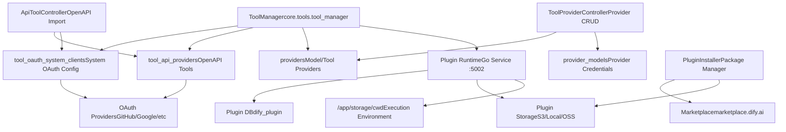
**Sources:** [docker/docker-compose.yaml271-300](https://github.com/langgenius/dify/blob/92dbc94f/docker/docker-compose.yaml#L271-L300) [api/configs/feature/\_\_init\_\_.py204-225](https://github.com/langgenius/dify/blob/92dbc94f/api/configs/feature/__init__.py#L204-L225) [api/models/tools.py1-50](https://github.com/langgenius/dify/blob/92dbc94f/api/models/tools.py#L1-L50) [api/models/provider.py1-50](https://github.com/langgenius/dify/blob/92dbc94f/api/models/provider.py#L1-L50)

---

## Tool Provider Types

Dify supports four distinct tool provider types, each with different integration patterns and use cases.

**Tool Provider Type Hierarchy**

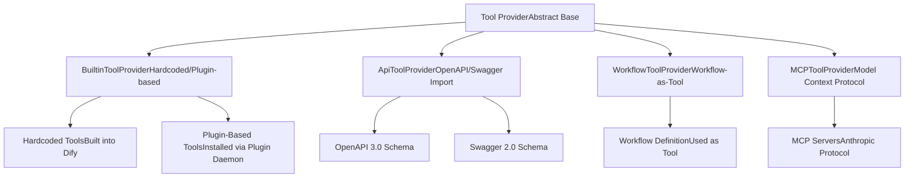
**Sources:** [api/models/tools.py15-21](https://github.com/langgenius/dify/blob/92dbc94f/api/models/tools.py#L15-L21) [api/models/model.py179-290](https://github.com/langgenius/dify/blob/92dbc94f/api/models/model.py#L179-L290)

### Built-in Tool Providers

Built-in tool providers come in two varieties: **hardcoded** tools that are compiled into Dify, and **plugin-based** tools installed dynamically.

| Provider Type | Storage | Verification | Example |
| --- | --- | --- | --- |
| Hardcoded | Source code | Code review | Core utility tools |
| Plugin-based | Plugin daemon | Signature verification | Community plugins from marketplace |

The `ToolManager` distinguishes between these types using `GenericProviderID.is_hardcoded` flag. Hardcoded providers are checked via `ToolManager.get_hardcoded_provider()`, while plugin-based providers are verified through `PluginService.check_tools_existence()`.

**Sources:** [api/models/model.py210-252](https://github.com/langgenius/dify/blob/92dbc94f/api/models/model.py#L210-L252)

### API Tool Providers

API tool providers enable integration with external services via OpenAPI/Swagger specifications. The system imports API schemas, generates tool definitions, and handles OAuth authentication flows.

**API Tool Configuration Schema**

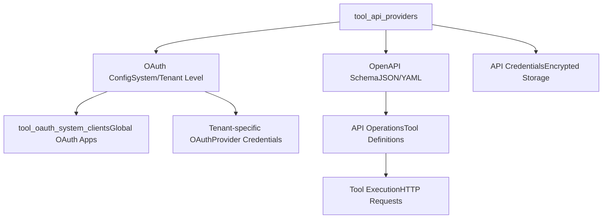
The `ApiToolProvider` table stores:

-   OpenAPI/Swagger schema (JSON/YAML)
-   Provider name and description (I18n)
-   Authentication type (none, api\_key, oauth)
-   OAuth configuration references

**Sources:** [api/models/tools.py1-100](https://github.com/langgenius/dify/blob/92dbc94f/api/models/tools.py#L1-L100) [api/controllers/console/datasets/datasets.py1-50](https://github.com/langgenius/dify/blob/92dbc94f/api/controllers/console/datasets/datasets.py#L1-L50)

---

## Plugin Daemon Architecture

The Plugin Daemon is a separate Go-based service that manages plugin lifecycle, execution isolation, and security enforcement.

**Plugin Daemon Service Configuration**

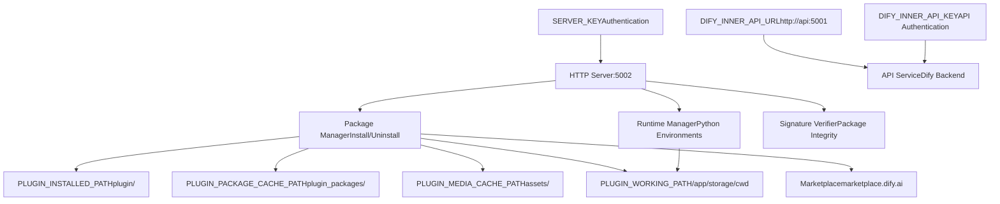
**Key Configuration Parameters:**

| Parameter | Default | Description |
| --- | --- | --- |
| `PLUGIN_DAEMON_PORT` | 5002 | HTTP server port |
| `PLUGIN_DAEMON_KEY` | (generated) | Authentication key for API→Daemon |
| `PLUGIN_MAX_PACKAGE_SIZE` | 52428800 (50MB) | Maximum plugin package size |
| `PLUGIN_PYTHON_ENV_INIT_TIMEOUT` | 120s | Python environment initialization timeout |
| `PLUGIN_MAX_EXECUTION_TIMEOUT` | 600s | Maximum plugin execution time |
| `FORCE_VERIFYING_SIGNATURE` | true | Enforce package signature verification |
| `ENFORCE_LANGGENIUS_PLUGIN_SIGNATURES` | true | Require official Dify signatures |

**Sources:** [docker/docker-compose.yaml271-300](https://github.com/langgenius/dify/blob/92dbc94f/docker/docker-compose.yaml#L271-L300) [docker/.env.example586-615](https://github.com/langgenius/dify/blob/92dbc94f/docker/.env.example#L586-L615) [api/configs/feature/\_\_init\_\_.py204-225](https://github.com/langgenius/dify/blob/92dbc94f/api/configs/feature/__init__.py#L204-L225)

### Plugin Installation Flow

The plugin installation process involves multiple verification steps and database migrations.

**Plugin Installation Sequence**

> **[Mermaid sequence]**
> *(图表结构无法解析)*

The `PluginInstaller` class ([api/commands.py21](https://github.com/langgenius/dify/blob/92dbc94f/api/commands.py#L21-L21)) and `PluginService` ([api/commands.py49](https://github.com/langgenius/dify/blob/92dbc94f/api/commands.py#L49-L49)) coordinate the installation process, while `PluginDataMigration` ([api/commands.py47](https://github.com/langgenius/dify/blob/92dbc94f/api/commands.py#L47-L47)) handles data structure updates after installation.

**Sources:** [docker/docker-compose.yaml271-290](https://github.com/langgenius/dify/blob/92dbc94f/docker/docker-compose.yaml#L271-L290) [api/commands.py21-53](https://github.com/langgenius/dify/blob/92dbc94f/api/commands.py#L21-L53)

### Plugin Storage Backends

The plugin system supports multiple storage backends for plugin packages and media assets.

| Storage Type | Configuration Prefix | Use Case |
| --- | --- | --- |
| Local | `PLUGIN_STORAGE_LOCAL_ROOT` | Development/single-instance |
| AWS S3 | `PLUGIN_S3_*` | Production cloud deployment |
| Azure Blob | `PLUGIN_AZURE_BLOB_STORAGE_*` | Azure cloud deployment |
| Aliyun OSS | `PLUGIN_ALIYUN_OSS_*` | Alibaba Cloud deployment |
| Tencent COS | `PLUGIN_TENCENT_COS_*` | Tencent Cloud deployment |
| Volcengine TOS | `PLUGIN_VOLCENGINE_TOS_*` | Volcengine deployment |

Storage is configured via `PLUGIN_STORAGE_TYPE` environment variable. All storage backends support the same directory structure:

-   `PLUGIN_INSTALLED_PATH` (default: `plugin/`) - Installed plugin code
-   `PLUGIN_PACKAGE_CACHE_PATH` (default: `plugin_packages/`) - Downloaded packages
-   `PLUGIN_MEDIA_CACHE_PATH` (default: `assets/`) - Media files

**Sources:** [docker/.env.example610-638](https://github.com/langgenius/dify/blob/92dbc94f/docker/.env.example#L610-L638)

---

## API Tool Integration and OAuth

API tool providers require authentication configuration. The system supports three authentication methods: none, API key, and OAuth 2.0.

### OAuth Configuration Hierarchy

OAuth configuration exists at two levels: **system-level** for shared OAuth apps, and **tenant-level** for workspace-specific credentials.

**OAuth Configuration Model**

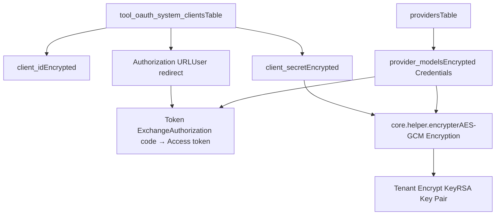
The `ToolOAuthSystemClient` table schema:

| Column | Type | Description |
| --- | --- | --- |
| `id` | uuid | Primary key |
| `provider` | string | Tool provider name |
| `tenant_id` | uuid | Workspace ID (null for system-level) |
| `client_id` | text | Encrypted OAuth client ID |
| `client_secret` | text | Encrypted OAuth client secret |
| `created_at` | timestamp | Creation time |
| `updated_at` | timestamp | Last update time |

**Sources:** [api/models/tools.py28-50](https://github.com/langgenius/dify/blob/92dbc94f/api/models/tools.py#L28-L50) [api/commands.py26](https://github.com/langgenius/dify/blob/92dbc94f/api/commands.py#L26-L26)

### OAuth Flow Implementation

The OAuth authentication flow for API tools follows the standard OAuth 2.0 authorization code grant.

**OAuth 2.0 Authorization Flow**

> **[Mermaid sequence]**
> *(图表结构无法解析)*

System OAuth credentials are managed via `encrypt_system_oauth_params()` function, which uses AES-GCM encryption with tenant-specific keys generated by `generate_key_pair()` ([api/commands.py26-27](https://github.com/langgenius/dify/blob/92dbc94f/api/commands.py#L26-L27)).

**Sources:** [api/models/tools.py28-50](https://github.com/langgenius/dify/blob/92dbc94f/api/models/tools.py#L28-L50) [api/commands.py26-27](https://github.com/langgenius/dify/blob/92dbc94f/api/commands.py#L26-L27) [api/models/provider.py1-50](https://github.com/langgenius/dify/blob/92dbc94f/api/models/provider.py#L1-L50)

---

## Tool Provider Configuration and Management

Tool providers, including both model providers and tool providers, share a unified configuration system stored in the `providers` and `provider_models` tables.

### Provider and ProviderModel Schema

**Provider Configuration Data Model**

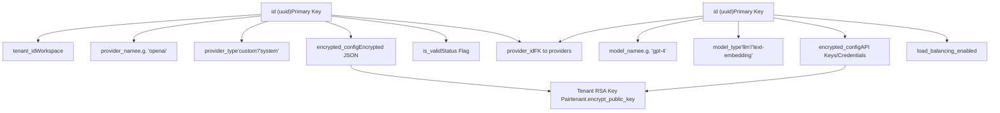
Each tenant has a unique RSA key pair for encrypting sensitive configuration. The public key is stored in `tenants.encrypt_public_key`, and the private key is managed securely. The `reset-encrypt-key-pair` command ([api/commands.py129-168](https://github.com/langgenius/dify/blob/92dbc94f/api/commands.py#L129-L168)) demonstrates the encryption architecture:

1.  Generate new RSA key pair per tenant
2.  Clear all provider and provider\_model records
3.  Require users to re-enter credentials

**Sources:** [api/models/provider.py1-50](https://github.com/langgenius/dify/blob/92dbc94f/api/models/provider.py#L1-L50) [api/commands.py129-168](https://github.com/langgenius/dify/blob/92dbc94f/api/commands.py#L129-L168)

### Provider Discovery and Tool Enumeration

The `ToolManager` class coordinates tool provider discovery across different provider types.

**Tool Discovery Process**

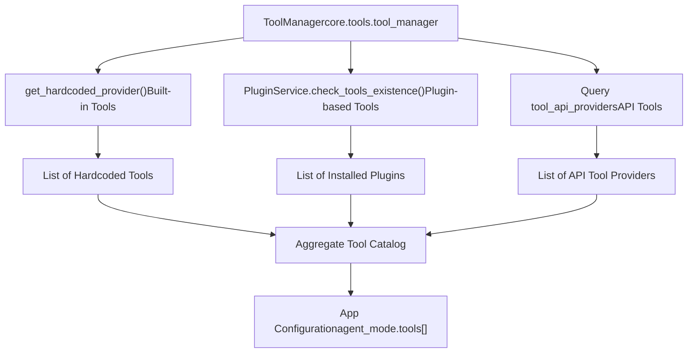
When an application retrieves its tool catalog, the `deleted_tools` property ([api/models/model.py179-290](https://github.com/langgenius/dify/blob/92dbc94f/api/models/model.py#L179-L290)) checks for:

-   Missing API providers: Query `tool_api_providers` by ID
-   Missing builtin providers: Check both hardcoded tools and plugin existence
-   Mark tools as deleted if provider no longer exists

**Sources:** [api/models/model.py179-290](https://github.com/langgenius/dify/blob/92dbc94f/api/models/model.py#L179-L290) [api/commands.py48-49](https://github.com/langgenius/dify/blob/92dbc94f/api/commands.py#L48-L49)

---

## Tool Position and Ordering

Dify supports configuring the display order of tools and providers in the UI through position configuration environment variables.

| Variable | Description | Format |
| --- | --- | --- |
| `POSITION_TOOL_PINS` | Pinned tools (always on top) | Comma-separated provider names |
| `POSITION_TOOL_INCLUDES` | Explicitly included tools | Comma-separated provider names |
| `POSITION_TOOL_EXCLUDES` | Hidden tools | Comma-separated provider names |
| `POSITION_PROVIDER_PINS` | Pinned providers | Comma-separated provider names |
| `POSITION_PROVIDER_INCLUDES` | Explicitly included providers | Comma-separated provider names |
| `POSITION_PROVIDER_EXCLUDES` | Hidden providers | Comma-separated provider names |

Example configuration:

```
POSITION_TOOL_PINS=google_search,web_scraper
POSITION_TOOL_EXCLUDES=deprecated_tool,internal_tool
```
**Sources:** [docker/.env.example576-581](https://github.com/langgenius/dify/blob/92dbc94f/docker/.env.example#L576-L581) [api/.env.example606-612](https://github.com/langgenius/dify/blob/92dbc94f/api/.env.example#L606-L612)

---

## Marketplace Integration

The plugin marketplace enables discovery and installation of community-contributed plugins.

**Marketplace Integration Architecture**

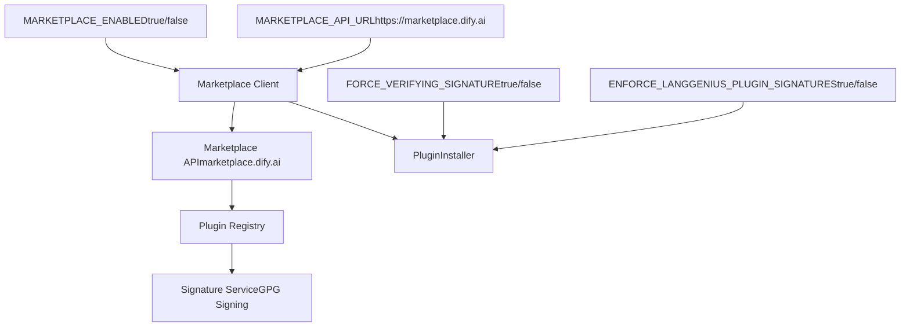
Marketplace configuration:

-   `MARKETPLACE_ENABLED=true` - Enable/disable marketplace access
-   `MARKETPLACE_API_URL=https://marketplace.dify.ai` - Marketplace endpoint
-   `FORCE_VERIFYING_SIGNATURE=true` - Require signature verification on all plugins
-   `ENFORCE_LANGGENIUS_PLUGIN_SIGNATURES=true` - Only allow officially signed plugins

The signature verification process ensures:

1.  Plugin package integrity (no tampering)
2.  Official approval from Dify team (if `ENFORCE_LANGGENIUS_PLUGIN_SIGNATURES=true`)
3.  Version consistency with manifest

**Sources:** [docker/.env.example600-603](https://github.com/langgenius/dify/blob/92dbc94f/docker/.env.example#L600-L603) [api/.env.example622-624](https://github.com/langgenius/dify/blob/92dbc94f/api/.env.example#L622-L624) [docker/docker-compose.yaml288-289](https://github.com/langgenius/dify/blob/92dbc94f/docker/docker-compose.yaml#L288-L289)

---

## Tool Execution and Timeouts

Tool execution is subject to configurable timeout limits to prevent runaway processes.

| Configuration | Default | Description |
| --- | --- | --- |
| `API_TOOL_DEFAULT_CONNECT_TIMEOUT` | 10s | TCP connection timeout for API tools |
| `API_TOOL_DEFAULT_READ_TIMEOUT` | 60s | HTTP read timeout for API tools |
| `PLUGIN_MAX_EXECUTION_TIMEOUT` | 600s | Maximum plugin execution time |
| `CODE_EXECUTION_READ_TIMEOUT` | 60s | Sandbox code execution timeout |

API tools ([docker/.env.example215-216](https://github.com/langgenius/dify/blob/92dbc94f/docker/.env.example#L215-L216)) use separate connect and read timeouts for HTTP requests to external services. Plugin executions ([docker/.env.example607](https://github.com/langgenius/dify/blob/92dbc94f/docker/.env.example#L607-L607)) have a maximum wall-clock time limit enforced by the plugin daemon.

**Sources:** [docker/.env.example215-216](https://github.com/langgenius/dify/blob/92dbc94f/docker/.env.example#L215-L216) [docker/.env.example607](https://github.com/langgenius/dify/blob/92dbc94f/docker/.env.example#L607-L607) [api/.env.example479-481](https://github.com/langgenius/dify/blob/92dbc94f/api/.env.example#L479-L481)

---

## Plugin Daemon Communication Protocol

The API service communicates with the Plugin Daemon via HTTP/JSON RPC using mutual authentication.

**API ↔ Plugin Daemon Authentication**

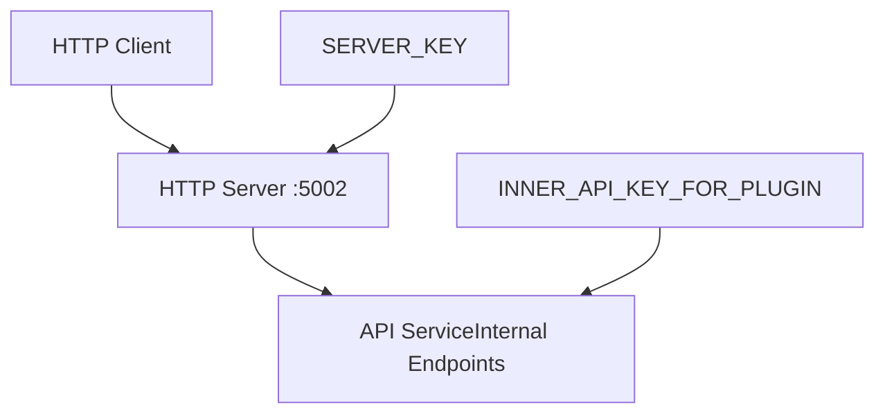
**Bidirectional Authentication:**

1.  **API → Plugin Daemon**: Uses `PLUGIN_DAEMON_KEY` as Bearer token
2.  **Plugin Daemon → API**: Uses `INNER_API_KEY_FOR_PLUGIN` as API key for callbacks

Configuration parameters:

-   `PLUGIN_DAEMON_URL=http://plugin_daemon:5002` - Daemon endpoint
-   `PLUGIN_DAEMON_KEY` - Shared secret for API→Daemon authentication
-   `INNER_API_KEY_FOR_PLUGIN` - Shared secret for Daemon→API callbacks
-   `PLUGIN_DAEMON_TIMEOUT=600.0` - Request timeout in seconds

**Sources:** [docker/docker-compose.yaml280-284](https://github.com/langgenius/dify/blob/92dbc94f/docker/docker-compose.yaml#L280-L284) [docker/.env.example586-598](https://github.com/langgenius/dify/blob/92dbc94f/docker/.env.example#L586-L598) [api/configs/feature/\_\_init\_\_.py204-225](https://github.com/langgenius/dify/blob/92dbc94f/api/configs/feature/__init__.py#L204-L225)

---

## Plugin Database Schema

The Plugin Daemon maintains its own separate database (`dify_plugin`) for plugin metadata and runtime state.

| Database | Purpose | Connection |
| --- | --- | --- |
| `dify` (main) | Application data, users, workflows | API, Worker services |
| `dify_plugin` | Plugin metadata, installations | Plugin Daemon only |

The separation ensures:

-   **Isolation**: Plugin failures don't corrupt application database
-   **Performance**: Plugin queries don't compete with application queries
-   **Security**: Plugin daemon has limited database access scope

Database configuration for plugin daemon:

```
DB_DATABASE=dify_plugin  # Separate database name
DB_HOST=db_postgres      # Same database server
DB_PORT=5432
```
**Sources:** [docker/docker-compose.yaml278](https://github.com/langgenius/dify/blob/92dbc94f/docker/docker-compose.yaml#L278-L278) [docker/docker-compose-template.yaml278](https://github.com/langgenius/dify/blob/92dbc94f/docker/docker-compose-template.yaml#L278-L278)

---

## File Access Configuration for Plugins

Plugins that process files require access to the Dify file storage system. This is configured via `FILES_URL` and `INTERNAL_FILES_URL`.

**File Access Architecture for Plugins**

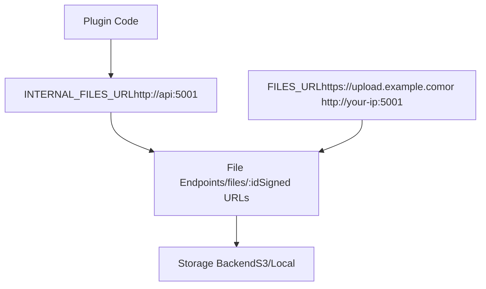
Configuration rules:

-   `FILES_URL` - External URL for file access (must be publicly accessible)

    -   For HTTPS: `FILES_URL=https://example.com`
    -   For HTTP: `FILES_URL=http://example.com`
    -   With port: `FILES_URL=http://<your-ip>:5001`
    -   Recommended: Use dedicated subdomain like `https://upload.example.com`
-   `INTERNAL_FILES_URL` - Internal Docker network URL for plugin daemon

    -   Example: `INTERNAL_FILES_URL=http://api:5001`
    -   Plugin daemon uses this for file downloads within Docker network

File URLs are signed with expiration time (`FILES_ACCESS_TIMEOUT=300` seconds default) using `sign_upload_file()` or `sign_tool_file()` functions.

**Sources:** [docker/.env.example44-58](https://github.com/langgenius/dify/blob/92dbc94f/docker/.env.example#L44-L58) [api/.env.example22-28](https://github.com/langgenius/dify/blob/92dbc94f/api/.env.example#L22-L28) [api/models/dataset.py24](https://github.com/langgenius/dify/blob/92dbc94f/api/models/dataset.py#L24-L24)

---

## Plugin Working Directory and Isolation

Each plugin execution runs in an isolated working directory with a dedicated Python virtual environment.

**Plugin Execution Isolation**

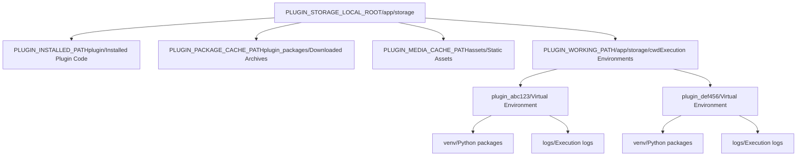
Directory structure:

```
/app/storage/
├── plugin/                    # Installed plugin code
│   ├── plugin_provider_1/
│   └── plugin_provider_2/
├── plugin_packages/           # Downloaded .zip packages
│   ├── plugin_1_v1.0.0.zip
│   └── plugin_2_v2.1.0.zip
├── assets/                    # Plugin media files
│   ├── icons/
│   └── screenshots/
└── cwd/                       # Working directories
    ├── plugin_abc123/
    │   ├── venv/             # Virtual environment
    │   └── __pycache__/
    └── plugin_def456/
        └── venv/
```
Python virtual environment initialization:

-   Timeout: `PLUGIN_PYTHON_ENV_INIT_TIMEOUT=120` seconds
-   PIP mirror: `PIP_MIRROR_URL` (optional, for faster installs)
-   Each plugin gets isolated dependencies

**Sources:** [docker/.env.example610-615](https://github.com/langgenius/dify/blob/92dbc94f/docker/.env.example#L610-L615) [docker/docker-compose.yaml287](https://github.com/langgenius/dify/blob/92dbc94f/docker/docker-compose.yaml#L287-L287) [api/.env.example617-619](https://github.com/langgenius/dify/blob/92dbc94f/api/.env.example#L617-L619)

---

## Plugin Development and Debugging

Dify supports remote plugin development with debugging capabilities.

**Remote Plugin Installation Flow**

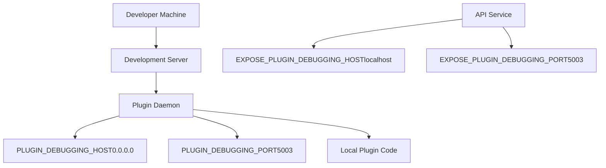
Development configuration:

-   `PLUGIN_DEBUGGING_HOST=0.0.0.0` - Bind address for remote install endpoint
-   `PLUGIN_DEBUGGING_PORT=5003` - Port for remote plugin installation
-   `EXPOSE_PLUGIN_DEBUGGING_HOST=localhost` - External hostname for API to communicate
-   `EXPOSE_PLUGIN_DEBUGGING_PORT=5003` - External port mapping

Remote installation allows developers to:

1.  Run plugin code locally
2.  Expose plugin endpoint to Dify
3.  Install plugin via HTTP URL instead of marketplace
4.  Iterate quickly without packaging

**Sources:** [docker/.env.example592-596](https://github.com/langgenius/dify/blob/92dbc94f/docker/.env.example#L592-L596) [docker/docker-compose.yaml285-286](https://github.com/langgenius/dify/blob/92dbc94f/docker/docker-compose.yaml#L285-L286) [api/.env.example617-618](https://github.com/langgenius/dify/blob/92dbc94f/api/.env.example#L617-L618)

---

## Tool Visibility and Deletion Detection

Applications track which tools are configured, and the system detects when tools become unavailable.

**Tool Deletion Detection Algorithm**

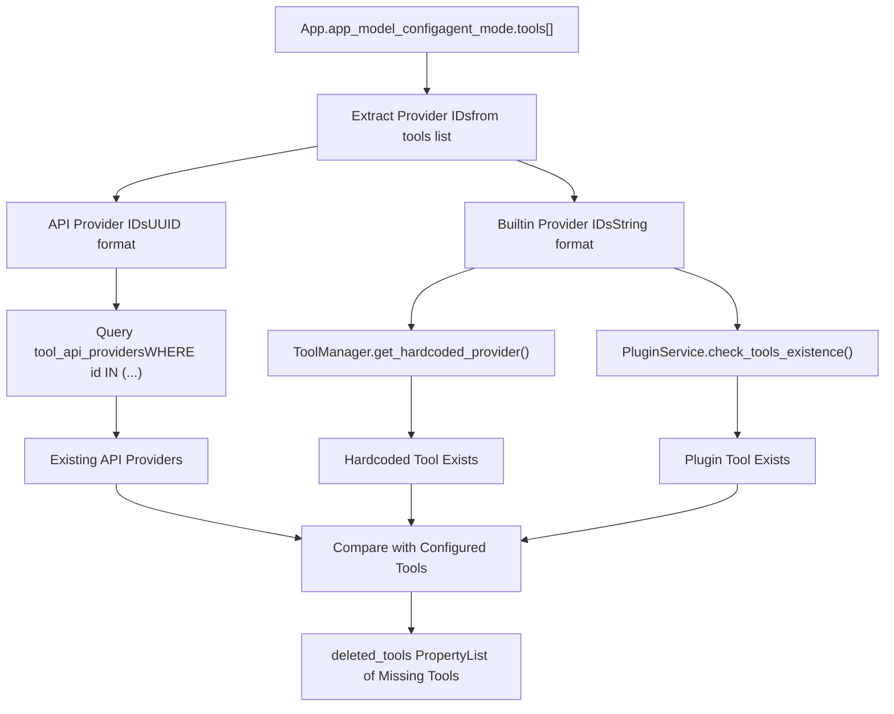
The `App.deleted_tools` property ([api/models/model.py179-290](https://github.com/langgenius/dify/blob/92dbc94f/api/models/model.py#L179-L290)) implements this detection:

1.  Parse `agent_mode.tools` from app configuration
2.  Extract provider IDs and types (API vs. Builtin)
3.  For API tools: Query database for existence
4.  For Builtin tools:
    -   Check if hardcoded (always available)
    -   Check plugin existence via `PluginService`
5.  Return list of tools that no longer exist

Deleted tool structure:

```
{
  "type": "api|builtin",
  "tool_name": "tool_name",
  "provider_id": "uuid_or_string"
}
```
**Sources:** [api/models/model.py179-290](https://github.com/langgenius/dify/blob/92dbc94f/api/models/model.py#L179-L290)

---

## Security Considerations

The tool and plugin system implements multiple security layers:

### Package Signature Verification

| Setting | Value | Security Level |
| --- | --- | --- |
| `FORCE_VERIFYING_SIGNATURE=true` | Enabled | High - Reject unsigned packages |
| `FORCE_VERIFYING_SIGNATURE=false` | Disabled | Low - Allow any package |
| `ENFORCE_LANGGENIUS_PLUGIN_SIGNATURES=true` | Enabled | Highest - Only official plugins |

### Credential Encryption

All sensitive credentials are encrypted at rest:

1.  **Tool OAuth Credentials**: `tool_oauth_system_clients.client_secret` encrypted with tenant key
2.  **Provider Credentials**: `provider_models.encrypted_config` encrypted per tenant
3.  **API Keys**: All API keys encrypted using `core.helper.encrypter` with AES-GCM

### Execution Isolation

Plugins execute in isolated environments:

-   Separate Python virtual environments per plugin
-   Working directory isolation (`PLUGIN_WORKING_PATH`)
-   Network access control via `SANDBOX_ENABLE_NETWORK`
-   Proxy routing through SSRF protection proxy
-   Timeout limits to prevent resource exhaustion

### API Authentication

Bidirectional authentication between services:

-   API → Plugin Daemon: Bearer token (`PLUGIN_DAEMON_KEY`)
-   Plugin Daemon → API: API key (`INNER_API_KEY_FOR_PLUGIN`)
-   Both keys should be cryptographically strong (generated via `openssl rand -base64 42`)

**Sources:** [docker/.env.example602-603](https://github.com/langgenius/dify/blob/92dbc94f/docker/.env.example#L602-L603) [docker/docker-compose.yaml288-289](https://github.com/langgenius/dify/blob/92dbc94f/docker/docker-compose.yaml#L288-L289) [api/commands.py26](https://github.com/langgenius/dify/blob/92dbc94f/api/commands.py#L26-L26) [api/models/tools.py28-50](https://github.com/langgenius/dify/blob/92dbc94f/api/models/tools.py#L28-L50)
