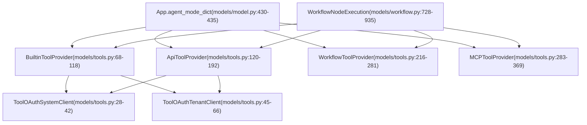
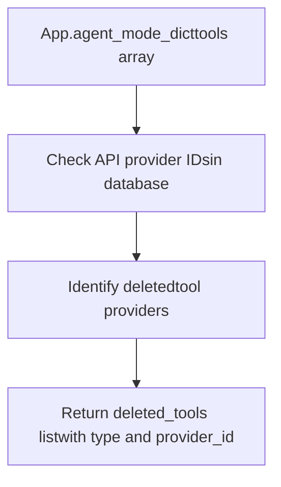
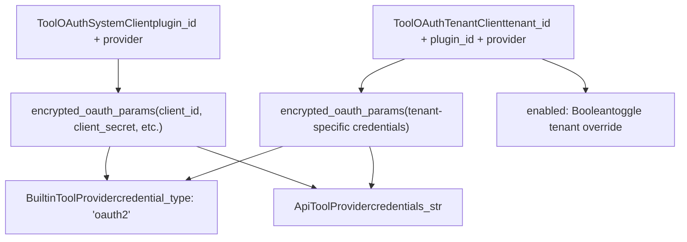
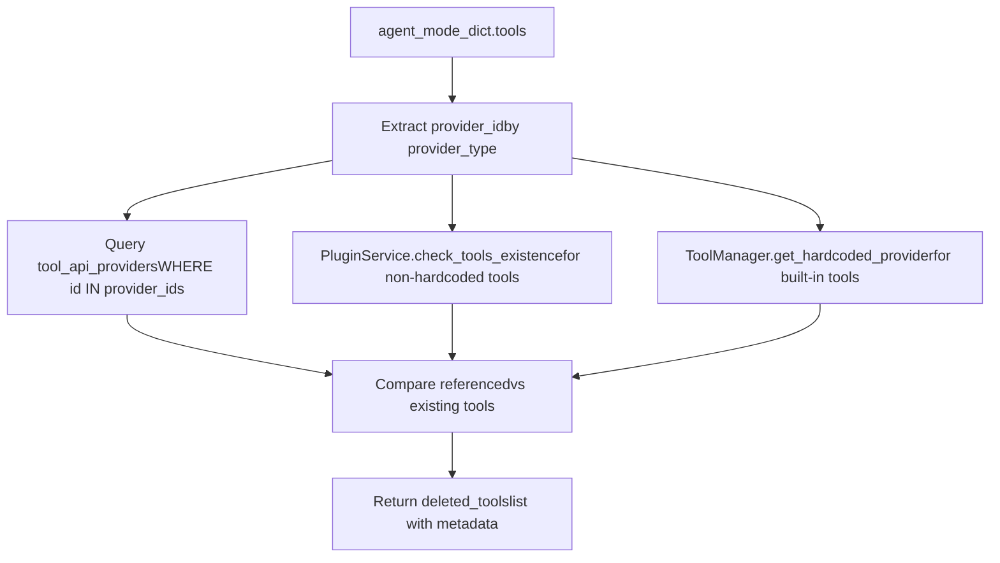
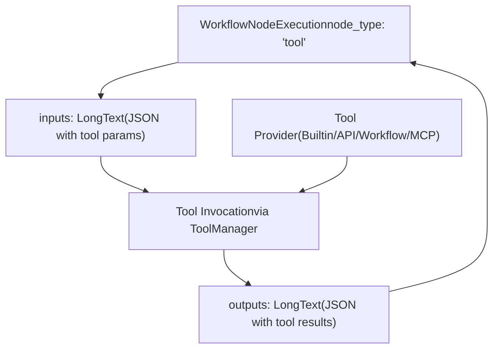

# Tool Provider Architecture

Relevant source files

-   [api/models/account.py](https://github.com/langgenius/dify/blob/92dbc94f/api/models/account.py)
-   [api/models/api\_based\_extension.py](https://github.com/langgenius/dify/blob/92dbc94f/api/models/api_based_extension.py)
-   [api/models/dataset.py](https://github.com/langgenius/dify/blob/92dbc94f/api/models/dataset.py)
-   [api/models/model.py](https://github.com/langgenius/dify/blob/92dbc94f/api/models/model.py)
-   [api/models/oauth.py](https://github.com/langgenius/dify/blob/92dbc94f/api/models/oauth.py)
-   [api/models/provider.py](https://github.com/langgenius/dify/blob/92dbc94f/api/models/provider.py)
-   [api/models/source.py](https://github.com/langgenius/dify/blob/92dbc94f/api/models/source.py)
-   [api/models/task.py](https://github.com/langgenius/dify/blob/92dbc94f/api/models/task.py)
-   [api/models/tools.py](https://github.com/langgenius/dify/blob/92dbc94f/api/models/tools.py)
-   [api/models/trigger.py](https://github.com/langgenius/dify/blob/92dbc94f/api/models/trigger.py)
-   [api/models/web.py](https://github.com/langgenius/dify/blob/92dbc94f/api/models/web.py)
-   [api/models/workflow.py](https://github.com/langgenius/dify/blob/92dbc94f/api/models/workflow.py)
-   [api/tests/test\_containers\_integration\_tests/services/test\_advanced\_prompt\_template\_service.py](https://github.com/langgenius/dify/blob/92dbc94f/api/tests/test_containers_integration_tests/services/test_advanced_prompt_template_service.py)
-   [api/tests/test\_containers\_integration\_tests/services/test\_agent\_service.py](https://github.com/langgenius/dify/blob/92dbc94f/api/tests/test_containers_integration_tests/services/test_agent_service.py)
-   [api/tests/test\_containers\_integration\_tests/tasks/\_\_init\_\_.py](https://github.com/langgenius/dify/blob/92dbc94f/api/tests/test_containers_integration_tests/tasks/__init__.py)
-   [api/tests/test\_containers\_integration\_tests/tasks/test\_add\_document\_to\_index\_task.py](https://github.com/langgenius/dify/blob/92dbc94f/api/tests/test_containers_integration_tests/tasks/test_add_document_to_index_task.py)
-   [api/tests/unit\_tests/core/test\_provider\_manager.py](https://github.com/langgenius/dify/blob/92dbc94f/api/tests/unit_tests/core/test_provider_manager.py)

## Purpose and Scope

This document describes the tool provider architecture in Dify, which enables external tool integration for workflows and agent applications. The system supports four distinct provider types: built-in tools, API-based tools (OpenAPI/Swagger), workflow-as-tool, and MCP (Model Context Protocol) tools. This architecture provides a unified interface for tool authentication, configuration, and execution.

For information about how tools are invoked within workflow nodes, see [Workflow System and Node Execution](/langgenius/dify/5-workflow-system-and-node-execution). For model provider configuration, see [Model Provider Management](/langgenius/dify/6.3-model-provider-management).

---

## Tool Provider Type System

The Dify tool system supports four distinct provider types, each with its own data model and lifecycle management:


**Sources:** [api/models/tools.py1-511](https://github.com/langgenius/dify/blob/92dbc94f/api/models/tools.py#L1-L511) [api/models/model.py78-316](https://github.com/langgenius/dify/blob/92dbc94f/api/models/model.py#L78-L316) [api/models/workflow.py728-935](https://github.com/langgenius/dify/blob/92dbc94f/api/models/workflow.py#L728-L935)

---

## Built-in Tool Providers

Built-in tool providers represent pre-packaged tools that ship with Dify. Each tenant can configure multiple credential instances for the same provider, enabling multiple configurations (e.g., different API keys).

### Data Model

| Field | Type | Description |
| --- | --- | --- |
| `id` | StringUUID | Unique identifier |
| `tenant_id` | StringUUID | Workspace ID (nullable for global tools) |
| `user_id` | StringUUID | Creator user ID |
| `provider` | String(256) | Tool provider name |
| `name` | String(256) | Instance name (default: "API KEY 1") |
| `encrypted_credentials` | LongText | Encrypted credential JSON |
| `credential_type` | String(32) | Credential type: "api-key" or "oauth2" |
| `is_default` | Boolean | Default instance flag |
| `expires_at` | BigInteger | Token expiration timestamp (-1 for never) |

The `credentials` property [api/models/tools.py113-117](https://github.com/langgenius/dify/blob/92dbc94f/api/models/tools.py#L113-L117) provides decrypted access to the stored credentials dictionary.

### Credential Management

Built-in tools support two authentication patterns:

1.  **API Key Authentication**: Simple key-based authentication stored in `encrypted_credentials`
2.  **OAuth2 Authentication**: Token-based authentication with refresh support

The uniqueness constraint `unique_builtin_tool_provider` ensures one provider+name combination per tenant [api/models/tools.py76](https://github.com/langgenius/dify/blob/92dbc94f/api/models/tools.py#L76-L76)

**Sources:** [api/models/tools.py68-118](https://github.com/langgenius/dify/blob/92dbc94f/api/models/tools.py#L68-L118)

---

## API Tool Providers (OpenAPI/Swagger)

API tool providers enable integration of external APIs through OpenAPI or Swagger specifications. These are tenant-specific and support dynamic tool discovery.

### Data Model

| Field | Type | Description |
| --- | --- | --- |
| `id` | StringUUID | Unique identifier |
| `tenant_id` | StringUUID | Workspace ID |
| `user_id` | StringUUID | Creator user ID |
| `name` | String(255) | Provider instance name |
| `icon` | String(255) | Provider icon URL |
| `schema` | LongText | OpenAPI/Swagger schema (JSON) |
| `schema_type_str` | String(40) | Schema type identifier |
| `description` | LongText | Provider description |
| `tools_str` | LongText | Parsed tools array (JSON) |
| `credentials_str` | LongText | API credentials (JSON) |
| `privacy_policy` | String(255) | Privacy policy URL (nullable) |
| `custom_disclaimer` | LongText | Custom disclaimer text |

### Schema Processing

The `schema_type` property [api/models/tools.py171-173](https://github.com/langgenius/dify/blob/92dbc94f/api/models/tools.py#L171-L173) converts the stored string to an `ApiProviderSchemaType` enum, while the `tools` property [api/models/tools.py175-177](https://github.com/langgenius/dify/blob/92dbc94f/api/models/tools.py#L175-L177) deserializes the tools array into `ApiToolBundle` objects.

### Tool Deletion Tracking

The `App.deleted_tools` property [api/models/model.py179-290](https://github.com/langgenius/dify/blob/92dbc94f/api/models/model.py#L179-L290) tracks when API tool providers are deleted but still referenced in app configurations. This prevents runtime errors by identifying missing tools during app initialization:


**Sources:** [api/models/tools.py120-192](https://github.com/langgenius/dify/blob/92dbc94f/api/models/tools.py#L120-L192) [api/models/model.py179-290](https://github.com/langgenius/dify/blob/92dbc94f/api/models/model.py#L179-L290)

---

## Workflow Tool Providers

Workflow tool providers allow published workflows to be exposed as tools, enabling workflow composition and reuse.

### Data Model

| Field | Type | Description |
| --- | --- | --- |
| `id` | StringUUID | Unique identifier |
| `tenant_id` | StringUUID | Workspace ID |
| `user_id` | StringUUID | Creator user ID |
| `app_id` | StringUUID | Source workflow app ID |
| `name` | String(255) | Tool provider name |
| `label` | String(255) | Display label |
| `icon` | String(255) | Tool icon URL |
| `version` | String(255) | Workflow version |
| `description` | LongText | Tool description |
| `parameter_configuration` | LongText | Input parameter config (JSON) |
| `privacy_policy` | String(255) | Privacy policy URL (nullable) |

### Parameter Configuration

The `parameter_configurations` property [api/models/tools.py272-276](https://github.com/langgenius/dify/blob/92dbc94f/api/models/tools.py#L272-L276) deserializes the stored JSON into `WorkflowToolParameterConfiguration` objects, defining the tool's input interface.

### Uniqueness Constraints

Two constraints ensure data integrity:

1.  `unique_workflow_tool_provider`: One name per tenant [api/models/tools.py224](https://github.com/langgenius/dify/blob/92dbc94f/api/models/tools.py#L224-L224)
2.  `unique_workflow_tool_provider_app_id`: One tool per app [api/models/tools.py225](https://github.com/langgenius/dify/blob/92dbc94f/api/models/tools.py#L225-L225)

**Sources:** [api/models/tools.py216-281](https://github.com/langgenius/dify/blob/92dbc94f/api/models/tools.py#L216-L281)

---

## MCP Tool Providers

MCP (Model Context Protocol) providers enable integration with external MCP servers, supporting dynamic tool discovery and invocation.

### Data Model

| Field | Type | Description |
| --- | --- | --- |
| `id` | StringUUID | Unique identifier |
| `tenant_id` | StringUUID | Workspace ID |
| `user_id` | StringUUID | Creator user ID |
| `name` | String(40) | Provider name |
| `server_identifier` | String(64) | Server identifier |
| `server_url` | LongText | Encrypted server URL |
| `server_url_hash` | String(64) | URL hash for uniqueness check |
| `icon` | String(255) | Provider icon (nullable) |
| `encrypted_credentials` | LongText | Encrypted credentials (nullable) |
| `encrypted_headers` | LongText | Encrypted HTTP headers (nullable) |
| `authed` | Boolean | Authentication status |
| `tools` | LongText | Available tools array (JSON) |
| `timeout` | Float | Request timeout (default: 30s) |
| `sse_read_timeout` | Float | SSE read timeout (default: 300s) |

### URL Hashing for Uniqueness

The `server_url_hash` field [api/models/tools.py306](https://github.com/langgenius/dify/blob/92dbc94f/api/models/tools.py#L306-L306) stores a hash of the encrypted URL to enforce the `unique_mcp_provider_server_url` constraint [api/models/tools.py291](https://github.com/langgenius/dify/blob/92dbc94f/api/models/tools.py#L291-L291) without exposing the actual URL.

### Entity Conversion

The `to_entity()` method [api/models/tools.py364-368](https://github.com/langgenius/dify/blob/92dbc94f/api/models/tools.py#L364-L368) converts the database model to a domain entity `MCPProviderEntity`, decoupling persistence from business logic.

**Sources:** [api/models/tools.py283-369](https://github.com/langgenius/dify/blob/92dbc94f/api/models/tools.py#L283-L369)

---

## OAuth Configuration Architecture

OAuth authentication is supported at two levels: system-wide and tenant-specific, enabling both centralized management and per-tenant customization.


### System-Level OAuth Client

The `ToolOAuthSystemClient` model [api/models/tools.py28-42](https://github.com/langgenius/dify/blob/92dbc94f/api/models/tools.py#L28-L42) stores global OAuth configurations shared across all tenants:

| Field | Type | Description |
| --- | --- | --- |
| `id` | StringUUID | Unique identifier |
| `plugin_id` | String(512) | Plugin identifier |
| `provider` | String(255) | Tool provider name |
| `encrypted_oauth_params` | LongText | OAuth credentials (client\_id, client\_secret, etc.) |

The unique constraint `tool_oauth_system_client_plugin_id_provider_idx` [api/models/tools.py32](https://github.com/langgenius/dify/blob/92dbc94f/api/models/tools.py#L32-L32) ensures one configuration per plugin+provider combination.

### Tenant-Level OAuth Client

The `ToolOAuthTenantClient` model [api/models/tools.py45-66](https://github.com/langgenius/dify/blob/92dbc94f/api/models/tools.py#L45-L66) allows tenants to override system defaults:

| Field | Type | Description |
| --- | --- | --- |
| `id` | StringUUID | Unique identifier |
| `tenant_id` | StringUUID | Workspace ID |
| `plugin_id` | String(255) | Plugin identifier |
| `provider` | String(255) | Tool provider name |
| `enabled` | Boolean | Override enabled flag |
| `encrypted_oauth_params` | LongText | Tenant-specific OAuth credentials |

The `oauth_params` property [api/models/tools.py64-65](https://github.com/langgenius/dify/blob/92dbc94f/api/models/tools.py#L64-L65) deserializes the encrypted parameters for use.

**Sources:** [api/models/tools.py28-66](https://github.com/langgenius/dify/blob/92dbc94f/api/models/tools.py#L28-L66)

---

## Tool Label Bindings

Tool label bindings provide categorization and tagging for tool discovery and filtering.

### Data Model

| Field | Type | Description |
| --- | --- | --- |
| `id` | StringUUID | Unique identifier |
| `tool_id` | String(64) | Tool identifier |
| `tool_type` | String(40) | Tool provider type |
| `label_name` | String(40) | Label/tag name |

The unique constraint `unique_tool_label_bind` [api/models/tools.py202](https://github.com/langgenius/dify/blob/92dbc94f/api/models/tools.py#L202-L202) ensures one label per tool.

**Sources:** [api/models/tools.py194-213](https://github.com/langgenius/dify/blob/92dbc94f/api/models/tools.py#L194-L213)

---

## Tool Invocation Logging

The `ToolModelInvoke` model [api/models/tools.py371-418](https://github.com/langgenius/dify/blob/92dbc94f/api/models/tools.py#L371-L418) captures detailed metrics for tool executions that involve LLM model calls:

| Field | Type | Description |
| --- | --- | --- |
| `id` | StringUUID | Unique identifier |
| `user_id` | StringUUID | Invoking user ID |
| `tenant_id` | StringUUID | Workspace ID |
| `provider` | String(255) | Model provider |
| `tool_type` | String(40) | Tool provider type |
| `tool_name` | String(128) | Tool name |
| `model_parameters` | LongText | Model configuration (JSON) |
| `prompt_messages` | LongText | Input messages (JSON) |
| `model_response` | LongText | Model output (JSON) |
| `prompt_tokens` | Integer | Input token count |
| `answer_tokens` | Integer | Output token count |
| `answer_unit_price` | Decimal(10,4) | Cost per token |
| `answer_price_unit` | Decimal(10,7) | Price unit multiplier |
| `provider_response_latency` | Float | Response time (seconds) |
| `total_price` | Decimal(10,7) | Total cost |
| `currency` | String(255) | Currency code |

This enables cost tracking and performance monitoring for tools that leverage LLMs internally.

**Sources:** [api/models/tools.py371-418](https://github.com/langgenius/dify/blob/92dbc94f/api/models/tools.py#L371-L418)

---

## Tool File Management

Tools can create files during execution (e.g., image generation, document creation). The `ToolFile` model [api/models/tools.py462-492](https://github.com/langgenius/dify/blob/92dbc94f/api/models/tools.py#L462-L492) stores metadata for these generated files:

| Field | Type | Description |
| --- | --- | --- |
| `id` | StringUUID | Unique identifier |
| `user_id` | StringUUID | User ID |
| `tenant_id` | StringUUID | Workspace ID |
| `conversation_id` | StringUUID | Associated conversation (nullable) |
| `file_key` | String(255) | Storage key |
| `mimetype` | String(255) | File MIME type |
| `original_url` | String(2048) | Original file URL (nullable) |
| `name` | String(255) | File name |
| `size` | Integer | File size in bytes |

The index `tool_file_conversation_id_idx` [api/models/tools.py470](https://github.com/langgenius/dify/blob/92dbc94f/api/models/tools.py#L470-L470) enables efficient retrieval of all files generated within a conversation.

**Sources:** [api/models/tools.py462-492](https://github.com/langgenius/dify/blob/92dbc94f/api/models/tools.py#L462-L492)

---

## Tool Configuration in App Agent Mode

Agent-mode applications store tool configurations in the `AppModelConfig.agent_mode` field [api/models/model.py343](https://github.com/langgenius/dify/blob/92dbc94f/api/models/model.py#L343-L343) which contains a JSON structure defining enabled tools and their parameters.

### Agent Mode Structure

The `agent_mode_dict` property [api/models/model.py430-435](https://github.com/langgenius/dify/blob/92dbc94f/api/models/model.py#L430-L435) returns a dictionary with the following structure:

```
{
    "enabled": bool,
    "strategy": str,  # "function_call" or "react"
    "tools": [
        {
            "provider_id": str,
            "provider_type": str,  # "builtin", "api", "workflow", "mcp"
            "tool_name": str,
            "tool_parameters": dict
        }
    ],
    "prompt": str  # Optional custom system prompt
}
```
### Tool Reference Resolution

The `deleted_tools` property [api/models/model.py179-290](https://github.com/langgenius/dify/blob/92dbc94f/api/models/model.py#L179-L290) validates tool references by checking:

1.  **API Tool Providers**: Queries `tool_api_providers` table for existence [api/models/model.py228-237](https://github.com/langgenius/dify/blob/92dbc94f/api/models/model.py#L228-L237)
2.  **Built-in Providers**: Checks plugin service for tool availability [api/models/model.py239-258](https://github.com/langgenius/dify/blob/92dbc94f/api/models/model.py#L239-L258)
3.  **Deletion Detection**: Returns list of missing tools with type and provider\_id [api/models/model.py260-290](https://github.com/langgenius/dify/blob/92dbc94f/api/models/model.py#L260-L290)


This validation prevents runtime errors when tools are removed but still referenced in app configurations.

**Sources:** [api/models/model.py179-290](https://github.com/langgenius/dify/blob/92dbc94f/api/models/model.py#L179-L290) [api/models/model.py343](https://github.com/langgenius/dify/blob/92dbc94f/api/models/model.py#L343-L343) [api/models/model.py430-435](https://github.com/langgenius/dify/blob/92dbc94f/api/models/model.py#L430-L435)

---

## Database Relationships and Constraints

The tool provider system enforces several key constraints to maintain data integrity:

| Model | Constraint | Purpose |
| --- | --- | --- |
| `ToolOAuthSystemClient` | `tool_oauth_system_client_plugin_id_provider_idx` | Unique plugin+provider combination |
| `ToolOAuthTenantClient` | `unique_tool_oauth_tenant_client` | Unique tenant+plugin+provider combination |
| `BuiltinToolProvider` | `unique_builtin_tool_provider` | Unique tenant+provider+name combination |
| `ApiToolProvider` | `unique_api_tool_provider` | Unique name per tenant |
| `WorkflowToolProvider` | `unique_workflow_tool_provider` | Unique name per tenant |
| `WorkflowToolProvider` | `unique_workflow_tool_provider_app_id` | One tool per workflow app |
| `MCPToolProvider` | `unique_mcp_provider_server_url` | Unique server URL hash per tenant |
| `MCPToolProvider` | `unique_mcp_provider_name` | Unique name per tenant |
| `MCPToolProvider` | `unique_mcp_provider_server_identifier` | Unique server identifier per tenant |
| `ToolLabelBinding` | `unique_tool_label_bind` | One label per tool |

These constraints ensure that tool providers are uniquely identifiable and prevent duplicate configurations.

**Sources:** [api/models/tools.py28-511](https://github.com/langgenius/dify/blob/92dbc94f/api/models/tools.py#L28-L511)

---

## Integration with Workflow Execution

Tool providers are referenced during workflow node execution. The `WorkflowNodeExecution` model [api/models/workflow.py728-935](https://github.com/langgenius/dify/blob/92dbc94f/api/models/workflow.py#L728-L935) stores execution metadata including tool invocations.

The relationship between tool providers and workflow execution:


The `process_data` field [api/models/workflow.py830](https://github.com/langgenius/dify/blob/92dbc94f/api/models/workflow.py#L830-L830) stores intermediate execution state, while `execution_metadata` [api/models/workflow.py844](https://github.com/langgenius/dify/blob/92dbc94f/api/models/workflow.py#L844-L844) captures token usage and cost information for tool invocations that use LLMs.

**Sources:** [api/models/workflow.py728-935](https://github.com/langgenius/dify/blob/92dbc94f/api/models/workflow.py#L728-L935)
