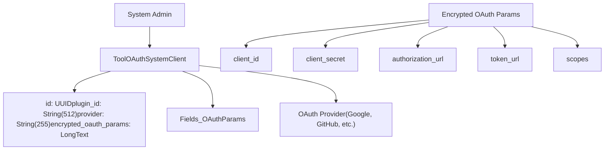
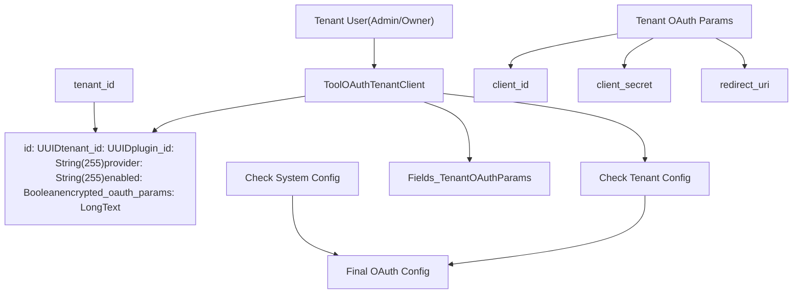
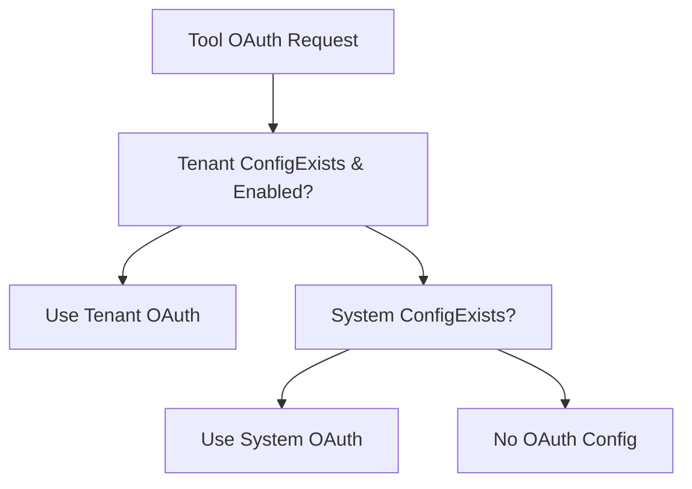
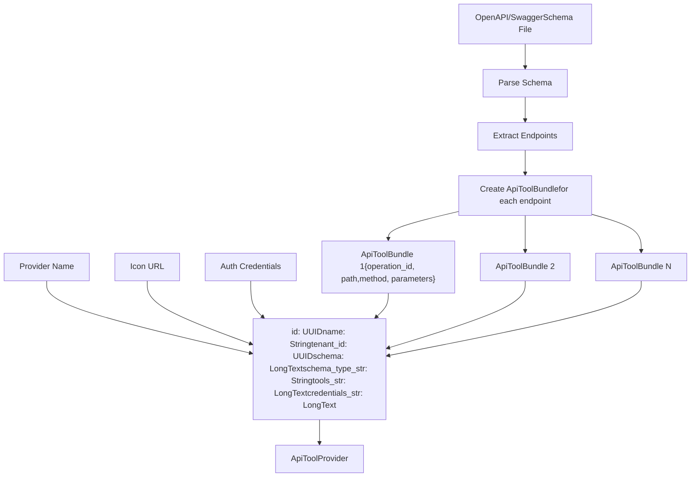
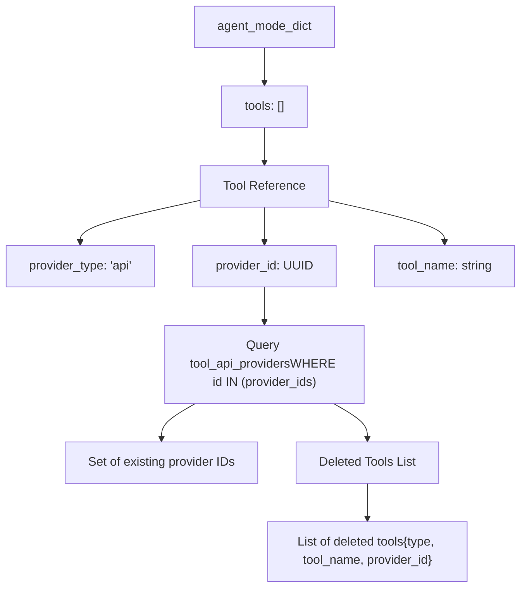

# API Tool Integration and OAuth

Relevant source files

-   [api/models/account.py](https://github.com/langgenius/dify/blob/92dbc94f/api/models/account.py)
-   [api/models/api\_based\_extension.py](https://github.com/langgenius/dify/blob/92dbc94f/api/models/api_based_extension.py)
-   [api/models/dataset.py](https://github.com/langgenius/dify/blob/92dbc94f/api/models/dataset.py)
-   [api/models/model.py](https://github.com/langgenius/dify/blob/92dbc94f/api/models/model.py)
-   [api/models/oauth.py](https://github.com/langgenius/dify/blob/92dbc94f/api/models/oauth.py)
-   [api/models/provider.py](https://github.com/langgenius/dify/blob/92dbc94f/api/models/provider.py)
-   [api/models/source.py](https://github.com/langgenius/dify/blob/92dbc94f/api/models/source.py)
-   [api/models/task.py](https://github.com/langgenius/dify/blob/92dbc94f/api/models/task.py)
-   [api/models/tools.py](https://github.com/langgenius/dify/blob/92dbc94f/api/models/tools.py)
-   [api/models/trigger.py](https://github.com/langgenius/dify/blob/92dbc94f/api/models/trigger.py)
-   [api/models/web.py](https://github.com/langgenius/dify/blob/92dbc94f/api/models/web.py)
-   [api/models/workflow.py](https://github.com/langgenius/dify/blob/92dbc94f/api/models/workflow.py)
-   [api/tests/test\_containers\_integration\_tests/services/test\_advanced\_prompt\_template\_service.py](https://github.com/langgenius/dify/blob/92dbc94f/api/tests/test_containers_integration_tests/services/test_advanced_prompt_template_service.py)
-   [api/tests/test\_containers\_integration\_tests/services/test\_agent\_service.py](https://github.com/langgenius/dify/blob/92dbc94f/api/tests/test_containers_integration_tests/services/test_agent_service.py)
-   [api/tests/test\_containers\_integration\_tests/tasks/\_\_init\_\_.py](https://github.com/langgenius/dify/blob/92dbc94f/api/tests/test_containers_integration_tests/tasks/__init__.py)
-   [api/tests/test\_containers\_integration\_tests/tasks/test\_add\_document\_to\_index\_task.py](https://github.com/langgenius/dify/blob/92dbc94f/api/tests/test_containers_integration_tests/tasks/test_add_document_to_index_task.py)
-   [api/tests/unit\_tests/core/test\_provider\_manager.py](https://github.com/langgenius/dify/blob/92dbc94f/api/tests/unit_tests/core/test_provider_manager.py)

## Purpose and Scope

This document describes the API tool integration system in Dify, focusing on how external API services are integrated as tools through OpenAPI/Swagger specifications and how OAuth 2.0 authentication is configured and managed. This covers the `ApiToolProvider` architecture, the two-tier OAuth configuration system (system-level and tenant-level), and credential management.

For information about the broader tool provider architecture including built-in, workflow, and MCP tools, see [Tool Provider Architecture](/langgenius/dify/6.1-tool-provider-architecture). For model provider credential management, see [Model Provider Management](/langgenius/dify/6.3-model-provider-management).

---

## API Tool Integration Overview

API tools in Dify enable integration with external HTTP APIs through standardized OpenAPI or Swagger schema definitions. Unlike built-in tools that are hardcoded in the application, API tools are dynamically configured by users to call arbitrary external services.

### ApiToolProvider Model

The `ApiToolProvider` model stores API provider configurations at the tenant level. Each provider represents a collection of related API endpoints defined by a single OpenAPI/Swagger schema.

**Core Components:**

| Field | Type | Purpose |
| --- | --- | --- |
| `id` | StringUUID | Unique identifier for the provider |
| `name` | String(255) | User-defined provider name |
| `tenant_id` | StringUUID | Workspace isolation |
| `schema` | LongText | Original OpenAPI/Swagger specification |
| `schema_type_str` | String(40) | Schema format: `openapi` or `swagger` |
| `tools_str` | LongText | JSON array of parsed tool definitions |
| `credentials_str` | LongText | JSON object containing authentication credentials |
| `icon` | String(255) | Provider icon URL |
| `description` | LongText | Provider description |
| `privacy_policy` | String(255) | Optional privacy policy URL |

**Sources:** [api/models/tools.py120-192](https://github.com/langgenius/dify/blob/92dbc94f/api/models/tools.py#L120-L192)

### Tool Schema Types

The system supports two schema formats via the `ApiProviderSchemaType` enum:

```
class ApiProviderSchemaType(StrEnum):
    OPENAPI = "openapi"  # OpenAPI 3.x specifications
    SWAGGER = "swagger"  # Swagger 2.0 specifications
```
When an OpenAPI/Swagger schema is uploaded, the system parses it to extract individual tool (endpoint) definitions, which are stored in the `tools_str` field as `ApiToolBundle` objects.

**Sources:** [api/models/tools.py172-182](https://github.com/langgenius/dify/blob/92dbc94f/api/models/tools.py#L172-L182)

---

## OAuth Configuration Architecture

Dify implements a two-tier OAuth configuration system to support both centrally-managed and tenant-specific OAuth applications. This enables flexible deployment scenarios where administrators can provide shared OAuth apps while allowing individual tenants to configure their own.

### System-Level OAuth Configuration

**Diagram: System-Level OAuth Architecture**


The `ToolOAuthSystemClient` table stores globally-shared OAuth client credentials configured by system administrators. These credentials are available to all tenants but can be overridden by tenant-specific configurations.

**Key Characteristics:**

-   **Unique Constraint:** `(plugin_id, provider)` ensures one system-level OAuth config per provider
-   **Encrypted Storage:** OAuth credentials are encrypted in the `encrypted_oauth_params` field
-   **Index:** Optimized lookup via `tool_oauth_system_client_plugin_id_provider_idx`

**Sources:** [api/models/tools.py28-42](https://github.com/langgenius/dify/blob/92dbc94f/api/models/tools.py#L28-L42)

### Tenant-Level OAuth Configuration

**Diagram: Tenant-Level OAuth Architecture**


The `ToolOAuthTenantClient` table allows individual tenants to configure their own OAuth applications. When enabled, these override system-level configurations for that tenant.

**Key Characteristics:**

-   **Unique Constraint:** `(tenant_id, plugin_id, provider)` ensures one tenant config per provider
-   **Enable/Disable:** The `enabled` flag controls whether tenant config overrides system config
-   **Workspace Isolation:** Each tenant maintains independent OAuth configurations

**Sources:** [api/models/tools.py45-66](https://github.com/langgenius/dify/blob/92dbc94f/api/models/tools.py#L45-L66)

### OAuth Configuration Hierarchy


**Priority Order:**

1.  **Tenant-level configuration** (if `enabled=true`)
2.  **System-level configuration** (fallback)
3.  **Error** (no configuration available)

**Sources:** [api/models/tools.py28-66](https://github.com/langgenius/dify/blob/92dbc94f/api/models/tools.py#L28-L66)

---

## API Tool Provider Management

### Tool Definition and Storage

When an API provider is created, the system performs the following operations:

**Diagram: API Tool Provider Creation Flow**


**Sources:** [api/models/tools.py120-192](https://github.com/langgenius/dify/blob/92dbc94f/api/models/tools.py#L120-L192)

### ApiToolBundle Structure

Each API endpoint is converted to an `ApiToolBundle` object containing:

```
interface ApiToolBundle {
  operation_id: string;        // Unique identifier for the operation
  operation: string;           // HTTP method (GET, POST, etc.)
  path: string;                // API endpoint path
  summary: string;             // Brief description
  description: string;         // Detailed description
  parameters: Parameter[];     // Input parameters
  responses: Response[];       // Expected responses
  author: string;              // Tool author
  server_url: string;          // Base URL for the API
}
```
These bundles are serialized to JSON and stored in the `tools_str` field. The `tools` property provides deserialized access:

```
@property
def tools(self) -> list[ApiToolBundle]:
    return [ApiToolBundle.model_validate(tool) for tool in json.loads(self.tools_str)]
```
**Sources:** [api/models/tools.py175-177](https://github.com/langgenius/dify/blob/92dbc94f/api/models/tools.py#L175-L177)

### Credential Management

API tool credentials are stored encrypted in the `credentials_str` field and accessed via the `credentials` property:

```
@property
def credentials(self) -> dict[str, Any]:
    return dict<FileRef file-url="https://github.com/langgenius/dify/blob/92dbc94f/str, Any" undefined  file-path="str, Any">Hii</FileRef>)
```
**Credential Types:**

-   **API Key:** Simple bearer token or header-based authentication
-   **OAuth 2.0:** Access tokens obtained through OAuth flow
-   **Basic Auth:** Username and password combinations
-   **Custom:** Provider-specific authentication schemes

**Sources:** [api/models/tools.py179-181](https://github.com/langgenius/dify/blob/92dbc94f/api/models/tools.py#L179-L181)

---

## Tool Authentication Flow

### OAuth 2.0 Authentication Flow

**Diagram: Complete OAuth 2.0 Tool Authentication Flow**

> **[Mermaid sequence]**
> *(图表结构无法解析)*

**Sources:** [api/models/tools.py28-66](https://github.com/langgenius/dify/blob/92dbc94f/api/models/tools.py#L28-L66) [api/models/tools.py120-192](https://github.com/langgenius/dify/blob/92dbc94f/api/models/tools.py#L120-L192)

### API Key Authentication Flow

For simpler API key-based authentication:

> **[Mermaid sequence]**
> *(图表结构无法解析)*

**Sources:** [api/models/tools.py120-192](https://github.com/langgenius/dify/blob/92dbc94f/api/models/tools.py#L120-L192)

---

## Integration with Workflows and Agents

### Tool Configuration in Agent Mode

API tools are referenced in the `agent_mode` configuration of `AppModelConfig`:

```
agent_mode_dict = {
    "enabled": True,
    "strategy": "function_call",  # or "react"
    "tools": [
        {
            "provider_type": "api",
            "provider_id": "uuid-of-api-tool-provider",
            "tool_name": "operation_id_from_schema",
            "enabled": True
        }
    ]
}
```
The system validates tool availability by checking if the referenced `ApiToolProvider` exists:

**Sources:** [api/models/model.py194-290](https://github.com/langgenius/dify/blob/92dbc94f/api/models/model.py#L194-L290)

### Tool Validation and Deleted Tools Detection

The `App.deleted_tools` property identifies tools that have been deleted but are still referenced in the app configuration:

**Diagram: Tool Validation Flow**


This validation runs when accessing `app.deleted_tools` and helps prevent runtime errors from missing tool providers.

**Sources:** [api/models/model.py179-290](https://github.com/langgenius/dify/blob/92dbc94f/api/models/model.py#L179-L290)

### Tool Execution in Workflows

API tools can be invoked in workflow nodes through the tool node type. The execution flow:

1.  **Tool Selection:** User selects API tool from available providers
2.  **Parameter Binding:** Workflow variables mapped to tool parameters
3.  **Credential Resolution:** System retrieves OAuth token or API key
4.  **HTTP Invocation:** Tool executor makes HTTP request per OpenAPI spec
5.  **Response Handling:** API response parsed and made available to subsequent nodes

**Sources:** [api/models/model.py179-290](https://github.com/langgenius/dify/blob/92dbc94f/api/models/model.py#L179-L290) [api/models/tools.py120-192](https://github.com/langgenius/dify/blob/92dbc94f/api/models/tools.py#L120-L192)

---

## Database Schema Reference

### Table: tool\_oauth\_system\_clients

**Purpose:** Store system-level OAuth client configurations for tool providers.

| Column | Type | Constraints | Description |
| --- | --- | --- | --- |
| `id` | UUID | Primary Key | Unique identifier |
| `plugin_id` | String(512) | Not Null | Plugin identifier |
| `provider` | String(255) | Not Null | Provider name |
| `encrypted_oauth_params` | LongText | Not Null | Encrypted OAuth credentials |

**Indexes:**

-   `tool_oauth_system_client_pkey`: Primary key on `id`
-   `tool_oauth_system_client_plugin_id_provider_idx`: Unique on `(plugin_id, provider)`

**Sources:** [api/models/tools.py28-42](https://github.com/langgenius/dify/blob/92dbc94f/api/models/tools.py#L28-L42)

### Table: tool\_oauth\_tenant\_clients

**Purpose:** Store tenant-specific OAuth client configurations that can override system defaults.

| Column | Type | Constraints | Description |
| --- | --- | --- | --- |
| `id` | UUID | Primary Key | Unique identifier |
| `tenant_id` | UUID | Not Null | Workspace ID |
| `plugin_id` | String(255) | Not Null | Plugin identifier |
| `provider` | String(255) | Not Null | Provider name |
| `enabled` | Boolean | Not Null, Default: true | Whether tenant config is active |
| `encrypted_oauth_params` | LongText | Not Null | Encrypted OAuth credentials |

**Indexes:**

-   `tool_oauth_tenant_client_pkey`: Primary key on `id`
-   `unique_tool_oauth_tenant_client`: Unique on `(tenant_id, plugin_id, provider)`

**Sources:** [api/models/tools.py45-66](https://github.com/langgenius/dify/blob/92dbc94f/api/models/tools.py#L45-L66)

### Table: tool\_api\_providers

**Purpose:** Store API tool provider definitions including OpenAPI schemas and credentials.

| Column | Type | Constraints | Description |
| --- | --- | --- | --- |
| `id` | UUID | Primary Key | Unique identifier |
| `name` | String(255) | Not Null | User-defined provider name |
| `tenant_id` | UUID | Not Null | Workspace ID |
| `user_id` | UUID | Not Null | Creator user ID |
| `icon` | String(255) | Not Null | Provider icon URL |
| `schema` | LongText | Not Null | Original OpenAPI/Swagger schema |
| `schema_type_str` | String(40) | Not Null | Schema format (openapi/swagger) |
| `tools_str` | LongText | Not Null | JSON array of tool definitions |
| `credentials_str` | LongText | Not Null | JSON object with credentials |
| `description` | LongText | Not Null | Provider description |
| `privacy_policy` | String(255) | Nullable | Privacy policy URL |
| `custom_disclaimer` | LongText | Default: "" | Custom disclaimer text |

**Indexes:**

-   `tool_api_provider_pkey`: Primary key on `id`
-   `unique_api_tool_provider`: Unique on `(name, tenant_id)`

**Sources:** [api/models/tools.py120-192](https://github.com/langgenius/dify/blob/92dbc94f/api/models/tools.py#L120-L192)

---

## Security Considerations

### Credential Encryption

All sensitive credentials are encrypted before storage:

-   **OAuth tokens** in `ToolOAuthSystemClient.encrypted_oauth_params`
-   **OAuth tokens** in `ToolOAuthTenantClient.encrypted_oauth_params`
-   **API keys and tokens** in `ApiToolProvider.credentials_str`

The encryption is handled by the `core.helper.encrypter` module using tenant-specific encryption keys.

### Tenant Isolation

API tool providers are strictly isolated by `tenant_id`:

-   Each tenant can only access their own `ApiToolProvider` configurations
-   OAuth tenant clients are scoped to individual tenants
-   System-level OAuth configs are shared but tenant configs take precedence

### OAuth Token Refresh

OAuth tokens stored in tool credentials may expire. The system should implement token refresh logic:

1.  Check token expiration before tool invocation
2.  Use refresh token to obtain new access token
3.  Update stored credentials with new token
4.  Retry failed requests after token refresh

**Sources:** [api/models/tools.py28-192](https://github.com/langgenius/dify/blob/92dbc94f/api/models/tools.py#L28-L192)

---

## Summary

The API tool integration system in Dify provides a flexible framework for integrating external HTTP APIs through OpenAPI/Swagger specifications. The two-tier OAuth configuration system (system-level and tenant-level) enables both centralized management and tenant-specific customization. Tool credentials are securely encrypted and isolated by tenant, ensuring data security and multi-tenancy support.

Key models:

-   **`ToolOAuthSystemClient`**: System-level OAuth configurations
-   **`ToolOAuthTenantClient`**: Tenant-specific OAuth configurations with override capability
-   **`ApiToolProvider`**: API tool definitions with schema parsing and credential storage

**Sources:** [api/models/tools.py28-192](https://github.com/langgenius/dify/blob/92dbc94f/api/models/tools.py#L28-L192) [api/models/model.py179-290](https://github.com/langgenius/dify/blob/92dbc94f/api/models/model.py#L179-L290)
