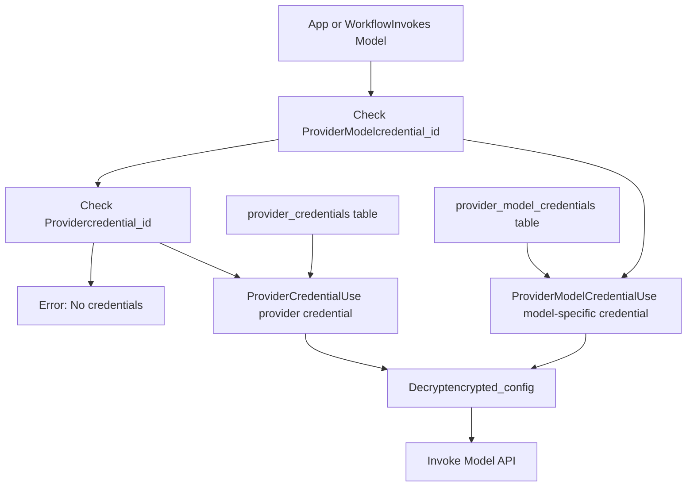
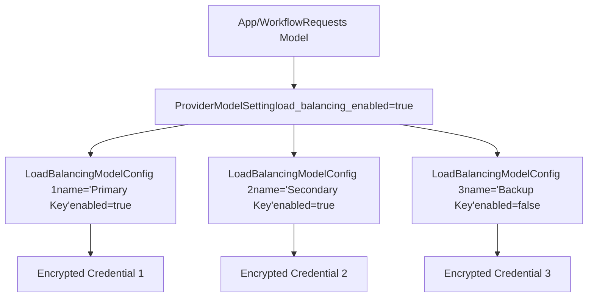
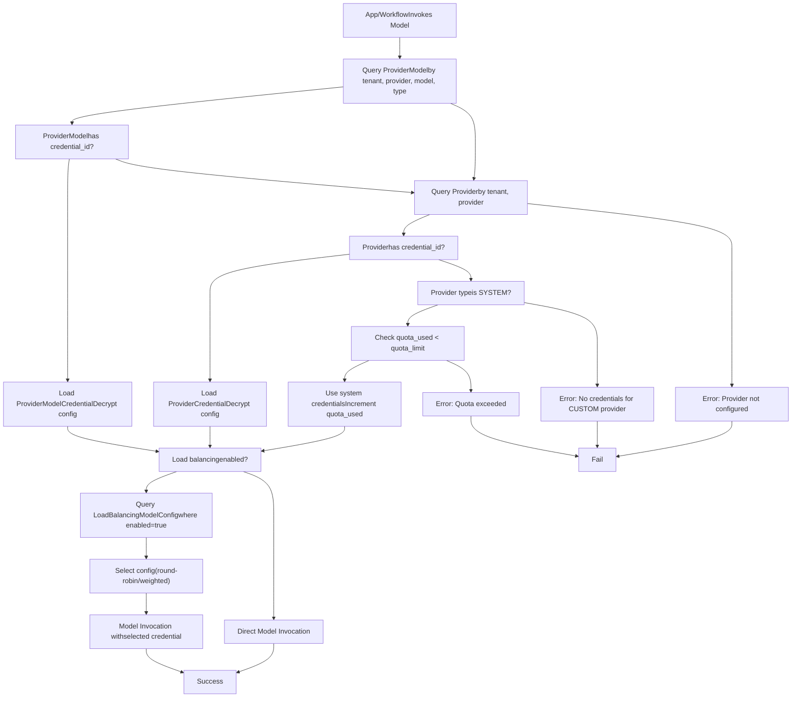

# Model Provider Management

Relevant source files

-   [api/models/account.py](https://github.com/langgenius/dify/blob/92dbc94f/api/models/account.py)
-   [api/models/api\_based\_extension.py](https://github.com/langgenius/dify/blob/92dbc94f/api/models/api_based_extension.py)
-   [api/models/dataset.py](https://github.com/langgenius/dify/blob/92dbc94f/api/models/dataset.py)
-   [api/models/model.py](https://github.com/langgenius/dify/blob/92dbc94f/api/models/model.py)
-   [api/models/oauth.py](https://github.com/langgenius/dify/blob/92dbc94f/api/models/oauth.py)
-   [api/models/provider.py](https://github.com/langgenius/dify/blob/92dbc94f/api/models/provider.py)
-   [api/models/source.py](https://github.com/langgenius/dify/blob/92dbc94f/api/models/source.py)
-   [api/models/task.py](https://github.com/langgenius/dify/blob/92dbc94f/api/models/task.py)
-   [api/models/tools.py](https://github.com/langgenius/dify/blob/92dbc94f/api/models/tools.py)
-   [api/models/trigger.py](https://github.com/langgenius/dify/blob/92dbc94f/api/models/trigger.py)
-   [api/models/web.py](https://github.com/langgenius/dify/blob/92dbc94f/api/models/web.py)
-   [api/models/workflow.py](https://github.com/langgenius/dify/blob/92dbc94f/api/models/workflow.py)
-   [api/tests/test\_containers\_integration\_tests/services/test\_advanced\_prompt\_template\_service.py](https://github.com/langgenius/dify/blob/92dbc94f/api/tests/test_containers_integration_tests/services/test_advanced_prompt_template_service.py)
-   [api/tests/test\_containers\_integration\_tests/services/test\_agent\_service.py](https://github.com/langgenius/dify/blob/92dbc94f/api/tests/test_containers_integration_tests/services/test_agent_service.py)
-   [api/tests/test\_containers\_integration\_tests/tasks/\_\_init\_\_.py](https://github.com/langgenius/dify/blob/92dbc94f/api/tests/test_containers_integration_tests/tasks/__init__.py)
-   [api/tests/test\_containers\_integration\_tests/tasks/test\_add\_document\_to\_index\_task.py](https://github.com/langgenius/dify/blob/92dbc94f/api/tests/test_containers_integration_tests/tasks/test_add_document_to_index_task.py)
-   [api/tests/unit\_tests/core/test\_provider\_manager.py](https://github.com/langgenius/dify/blob/92dbc94f/api/tests/unit_tests/core/test_provider_manager.py)

## Purpose and Scope

Model Provider Management is the system responsible for configuring, authenticating, and managing connections to Large Language Model (LLM) providers in Dify. This includes managing credentials, quotas, load balancing, and default model selections for tenants. The system enables multi-tenant access to both system-provided (hosted) models and custom (user-configured) models.

For information about how tools use model providers during agent execution, see [Tool Provider Architecture](/langgenius/dify/6.1-tool-provider-architecture). For information about how workflows invoke LLM nodes, see [LLM Nodes and Model Integration](/langgenius/dify/5.2-llm-nodes-and-model-integration).

**Sources:** [api/models/provider.py1-370](https://github.com/langgenius/dify/blob/92dbc94f/api/models/provider.py#L1-L370)

---

## Core Data Models

The provider management system consists of several interconnected models that work together to enable flexible, multi-tenant model configuration.

### Model Relationship Diagram

```mermaid
flowchart TD
    entity_Tenant_0["Tenant"]
    entity_Provider_1["Provider"]
    entity_ProviderModel_2["ProviderModel"]
    entity_TenantDefaultModel_3["TenantDefaultModel"]
    entity_TenantPreferredModelProvider_4["TenantPreferredModelProvider"]
    entity_ProviderCredential_5["ProviderCredential"]
    entity_ProviderModelCredential_6["ProviderModelCredential"]
    entity_ProviderModelSetting_7["ProviderModelSetting"]
    entity_LoadBalancingModelConfig_8["LoadBalancingModelConfig"]
```


**Sources:** [api/models/provider.py47-369](https://github.com/langgenius/dify/blob/92dbc94f/api/models/provider.py#L47-L369)

---

## Provider Types and Quota Types

The system distinguishes between two fundamental provider types and three quota types for hosted services.

### Provider Types

The `ProviderType` enum defines provider categorization:

| Type | Description | Use Case |
| --- | --- | --- |
| `SYSTEM` | Hosted models provided by Dify platform | Free/trial quotas, hosted OpenAI, Anthropic, etc. |
| `CUSTOM` | User-configured external providers | User brings their own API keys |

**Sources:** [api/models/provider.py17-27](https://github.com/langgenius/dify/blob/92dbc94f/api/models/provider.py#L17-L27)

### Quota Types

The `ProviderQuotaType` enum defines quota categories for system providers:

| Type | Description | Behavior |
| --- | --- | --- |
| `PAID` | Hosted paid quota | Purchased quota from Dify platform |
| `FREE` | Third-party free quota | Free tier from external providers |
| `TRIAL` | Hosted trial quota | Limited trial quota from Dify |

The `Provider` model tracks quota usage through `quota_limit`, `quota_used`, and `quota_type` fields. When a system provider is used, the `quota_used` counter increments based on token consumption.

**Sources:** [api/models/provider.py29-45](https://github.com/langgenius/dify/blob/92dbc94f/api/models/provider.py#L29-L45) [api/models/provider.py76-86](https://github.com/langgenius/dify/blob/92dbc94f/api/models/provider.py#L76-L86)

---

## Provider and Model Configuration

### Provider Model

The `Provider` model represents a configured provider instance for a tenant:

```
# Key fields from Provider model
tenant_id: str              # Workspace/tenant identifier
provider_name: str          # e.g., "openai", "anthropic", "azure_openai"
provider_type: str          # "custom" or "system"
is_valid: bool              # Whether credentials are validated
credential_id: str | None   # Reference to ProviderCredential
quota_type: str | None      # For system providers: "paid", "free", "trial"
quota_limit: int | None     # Maximum quota (tokens/requests)
quota_used: int             # Current quota usage
last_used: datetime | None  # Last usage timestamp
```
The model includes validation logic:

-   `is_enabled` property: Returns `True` if provider is valid and (for custom providers) credentials are set
-   `token_is_set` property: Checks if `encrypted_config` exists

**Sources:** [api/models/provider.py47-125](https://github.com/langgenius/dify/blob/92dbc94f/api/models/provider.py#L47-L125)

### ProviderModel Model

The `ProviderModel` model represents specific models available under a provider:

```
# Key fields from ProviderModel model
tenant_id: str              # Workspace identifier
provider_name: str          # Parent provider
model_name: str             # e.g., "gpt-4", "claude-3-opus"
model_type: str             # e.g., "llm", "text-embedding", "speech2text", "tts", "rerank", "moderation"
credential_id: str | None   # Model-specific credential override
is_valid: bool              # Validation status
```
This allows model-specific credential overrides, enabling different API keys for different models from the same provider.

**Sources:** [api/models/provider.py127-175](https://github.com/langgenius/dify/blob/92dbc94f/api/models/provider.py#L127-L175)

---

## Credential Management Architecture

Dify implements a two-tier credential system: provider-level credentials and model-level credentials. This enables flexible authentication patterns while maintaining security through encryption.

### Credential Hierarchy


### ProviderCredential Model

The `ProviderCredential` model stores named credentials for a provider:

```
# Key fields from ProviderCredential
id: str                    # Credential ID (UUID v7)
tenant_id: str             # Workspace identifier
provider_name: str         # Provider identifier
credential_name: str       # User-friendly name (e.g., "Production API Key")
encrypted_config: str      # Encrypted JSON credential data
```
Multiple credentials can exist for the same provider under a tenant, enabling credential rotation and load balancing.

**Sources:** [api/models/provider.py312-336](https://github.com/langgenius/dify/blob/92dbc94f/api/models/provider.py#L312-L336)

### ProviderModelCredential Model

The `ProviderModelCredential` model stores model-specific credentials:

```
# Key fields from ProviderModelCredential
id: str                    # Credential ID (UUID v7)
tenant_id: str             # Workspace identifier
provider_name: str         # Provider identifier
model_name: str            # Specific model
model_type: str            # Model type (llm, embedding, etc.)
credential_name: str       # User-friendly name
encrypted_config: str      # Encrypted JSON credential data
```
This granularity allows different credentials for different models, useful when:

-   Using different API tiers for different models
-   Isolating costs per model
-   Testing new models with separate trial keys

**Sources:** [api/models/provider.py338-369](https://github.com/langgenius/dify/blob/92dbc94f/api/models/provider.py#L338-L369)

### Credential Access Pattern

Both `Provider` and `ProviderModel` use cached properties to access credentials:

```
# Provider.credential property
@cached_property
def credential(self):
    if self.credential_id:
        return db.session.query(ProviderCredential).where(
            ProviderCredential.id == self.credential_id
        ).first()

# Provider.encrypted_config property
@property
def encrypted_config(self):
    credential = self.credential
    return credential.encrypted_config if credential else None
```
**Sources:** [api/models/provider.py94-108](https://github.com/langgenius/dify/blob/92dbc94f/api/models/provider.py#L94-L108) [api/models/provider.py157-175](https://github.com/langgenius/dify/blob/92dbc94f/api/models/provider.py#L157-L175)

---

## Load Balancing Configuration

Load balancing distributes requests across multiple credentials for the same model, improving reliability and rate limit management.

### Load Balancing Models


### ProviderModelSetting Model

The `ProviderModelSetting` model controls model availability and load balancing:

```
# Key fields from ProviderModelSetting
tenant_id: str                      # Workspace identifier
provider_name: str                  # Provider identifier
model_name: str                     # Model name
model_type: str                     # Model type
enabled: bool = True                # Whether model is available
load_balancing_enabled: bool = False # Enable load balancing
```
When `load_balancing_enabled` is `True`, the system uses `LoadBalancingModelConfig` entries to distribute requests.

**Sources:** [api/models/provider.py251-278](https://github.com/langgenius/dify/blob/92dbc94f/api/models/provider.py#L251-L278)

### LoadBalancingModelConfig Model

The `LoadBalancingModelConfig` model defines individual load balancing configurations:

```
# Key fields from LoadBalancingModelConfig
tenant_id: str                      # Workspace identifier
provider_name: str                  # Provider identifier
model_name: str                     # Model name
model_type: str                     # Model type
name: str                           # Configuration name
encrypted_config: str | None        # Direct encrypted credential
credential_id: str | None           # Reference to ProviderCredential or ProviderModelCredential
credential_source_type: str | None  # Source type indicator
enabled: bool = True                # Whether this config is active
```
Load balancing configurations can store credentials in two ways:

1.  **Direct storage**: `encrypted_config` contains the credential
2.  **Reference**: `credential_id` points to a `ProviderCredential` or `ProviderModelCredential`

**Sources:** [api/models/provider.py281-309](https://github.com/langgenius/dify/blob/92dbc94f/api/models/provider.py#L281-L309)

### Load Balancing Strategy

When multiple enabled `LoadBalancingModelConfig` entries exist for a model:

1.  The system queries all enabled configs
2.  Requests are distributed across credentials (typically round-robin or weighted)
3.  Failed requests can fail over to alternate credentials
4.  Disabled configs are skipped

This provides:

-   **Rate limit distribution**: Spread requests across multiple API keys
-   **Fault tolerance**: Automatic failover on credential failure
-   **Cost management**: Use different billing accounts

**Sources:** [api/models/provider.py281-309](https://github.com/langgenius/dify/blob/92dbc94f/api/models/provider.py#L281-L309)

---

## Default Model Configuration

Tenants can configure default models for different model types, streamlining application creation.

### TenantDefaultModel Model

The `TenantDefaultModel` model stores default model selections:

```
# Key fields from TenantDefaultModel
tenant_id: str         # Workspace identifier
provider_name: str     # Default provider
model_name: str        # Default model
model_type: str        # Model type (llm, text-embedding, rerank, tts, speech2text, moderation)
```
Common model types:

-   `llm`: Language models for chat and completion
-   `text-embedding`: Embedding models for RAG
-   `rerank`: Reranking models for retrieval
-   `tts`: Text-to-speech models
-   `speech2text`: Speech recognition models
-   `moderation`: Content moderation models

**Sources:** [api/models/provider.py177-196](https://github.com/langgenius/dify/blob/92dbc94f/api/models/provider.py#L177-L196)

### TenantPreferredModelProvider Model

The `TenantPreferredModelProvider` model indicates preferred provider type when multiple providers offer the same model:

```
# Key fields from TenantPreferredModelProvider
tenant_id: str                    # Workspace identifier
provider_name: str                # Provider name
preferred_provider_type: str      # "custom" or "system"
```
This resolves ambiguity when both system and custom providers are available. For example, if a tenant has both:

-   System OpenAI provider (hosted by Dify)
-   Custom OpenAI provider (user's own API key)

The preferred provider type determines which to use by default.

**Sources:** [api/models/provider.py199-217](https://github.com/langgenius/dify/blob/92dbc94f/api/models/provider.py#L199-L217)

---

## Integration with Applications and Workflows

Model providers are used throughout the Dify system in various contexts.

### Application Model Configuration

The `AppModelConfig` model in applications references providers:

```
# From AppModelConfig model
provider: str | None      # Provider name (e.g., "openai")
model_id: str | None      # Model name (e.g., "gpt-4")
model: str                # JSON with full model configuration
```
The `model_dict` property deserializes the model configuration:

```
@property
def model_dict(self) -> dict[str, Any]:
    return json.loads(self.model) if self.model else {}
```
This dictionary contains:

-   `provider`: Provider name (format: `plugin_id/provider_name/deployment_name` or just `provider_name`)
-   `name`: Model name
-   `mode`: Model mode (e.g., "chat", "completion")
-   `completion_params`: Parameters like temperature, max\_tokens, etc.

**Sources:** [api/models/model.py315-358](https://github.com/langgenius/dify/blob/92dbc94f/api/models/model.py#L315-L358)

### Dataset Embedding Configuration

Datasets store embedding model configuration for indexing:

```
# From Dataset model
embedding_model: str | None           # Model name
embedding_model_provider: str | None  # Provider name
```
This determines which embedding model is used for:

-   Document chunking and indexing
-   Query embedding during retrieval
-   Vector similarity search

**Sources:** [api/models/dataset.py70-71](https://github.com/langgenius/dify/blob/92dbc94f/api/models/dataset.py#L70-L71)

### Conversation Model Tracking

The `Conversation` model tracks which provider/model was used:

```
# From Conversation model
model_provider: str | None    # Provider used
model_id: str | None          # Model used
```
This enables:

-   Cost tracking per conversation
-   Analytics on model usage
-   Debugging model-specific issues

**Sources:** [api/models/model.py644-646](https://github.com/langgenius/dify/blob/92dbc94f/api/models/model.py#L644-L646)

---

## Provider Order and Payment

For hosted (system) providers, the `ProviderOrder` model tracks payment transactions.

### ProviderOrder Model

```
# Key fields from ProviderOrder
tenant_id: str                # Workspace identifier
provider_name: str            # Provider being purchased
account_id: str               # Purchasing account
payment_product_id: str       # Product being purchased
payment_id: str | None        # Payment processor ID
transaction_id: str | None    # Transaction identifier
quantity: int                 # Quantity purchased
currency: str | None          # Currency (USD, EUR, etc.)
total_amount: int | None      # Total amount in cents
payment_status: str           # "wait_pay", "paid", "failed", "refunded"
paid_at: datetime | None      # Payment timestamp
```
Payment statuses:

-   `wait_pay`: Awaiting payment
-   `paid`: Payment successful, quota added
-   `failed`: Payment failed
-   `refunded`: Payment refunded

**Sources:** [api/models/provider.py220-248](https://github.com/langgenius/dify/blob/92dbc94f/api/models/provider.py#L220-L248)

---

## Usage Example: Model Resolution

When an application or workflow invokes a model, the system resolves credentials through this process:


**Sources:** [api/models/provider.py47-369](https://github.com/langgenius/dify/blob/92dbc94f/api/models/provider.py#L47-L369)

---

## Database Schema Summary

The provider management system uses these tables:

| Table | Purpose | Key Constraints |
| --- | --- | --- |
| `providers` | Provider configurations per tenant | Unique: (tenant\_id, provider\_name, provider\_type, quota\_type) |
| `provider_models` | Model registrations under providers | Unique: (tenant\_id, provider\_name, model\_name, model\_type) |
| `provider_credentials` | Named credentials for providers | Indexed: (tenant\_id, provider\_name) |
| `provider_model_credentials` | Model-specific credentials | Indexed: (tenant\_id, provider\_name, model\_name, model\_type) |
| `provider_model_settings` | Model enable/disable and load balancing | Indexed: (tenant\_id, provider\_name, model\_type) |
| `load_balancing_model_configs` | Load balancing configurations | Indexed: (tenant\_id, provider\_name, model\_type) |
| `tenant_default_models` | Default model selections per tenant | Indexed: (tenant\_id, provider\_name, model\_type) |
| `tenant_preferred_model_providers` | Preferred provider type per tenant | Indexed: (tenant\_id, provider\_name) |
| `provider_orders` | Payment/order records for hosted providers | Indexed: (tenant\_id, provider\_name) |

All tables use UUID identifiers and include `created_at` and `updated_at` timestamps.

**Sources:** [api/models/provider.py47-369](https://github.com/langgenius/dify/blob/92dbc94f/api/models/provider.py#L47-L369)
