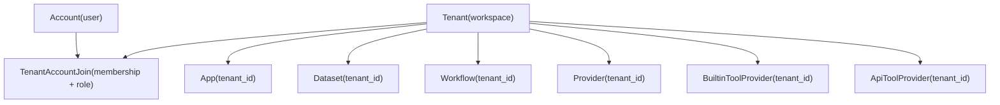
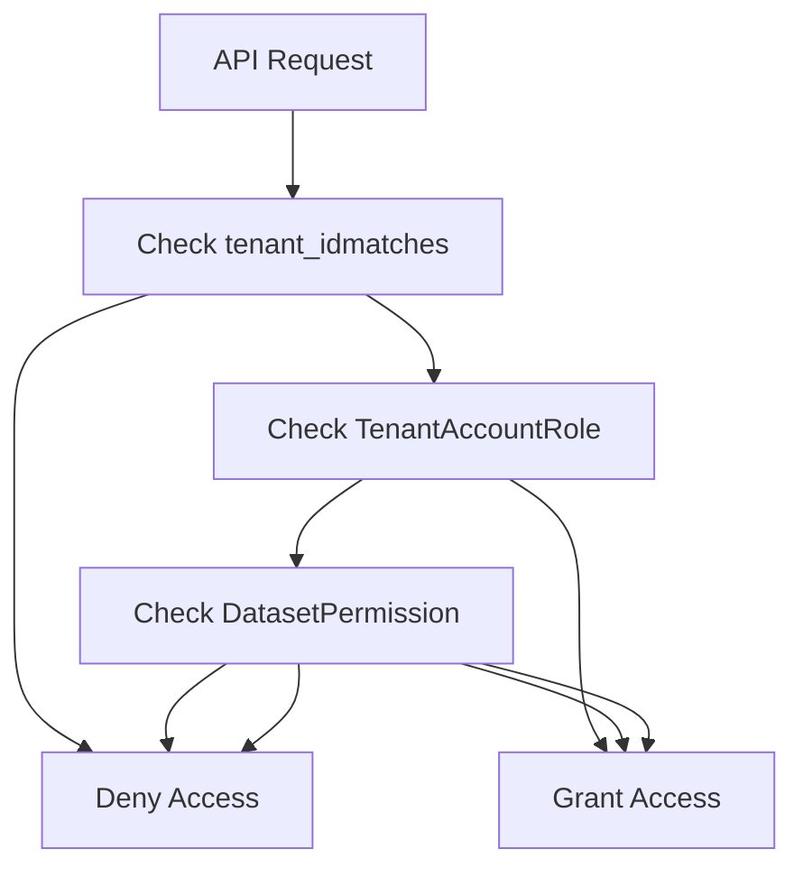
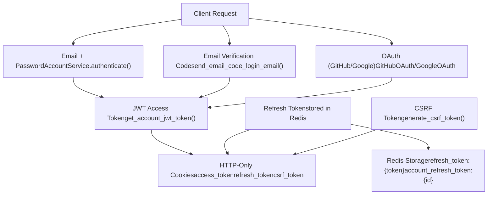
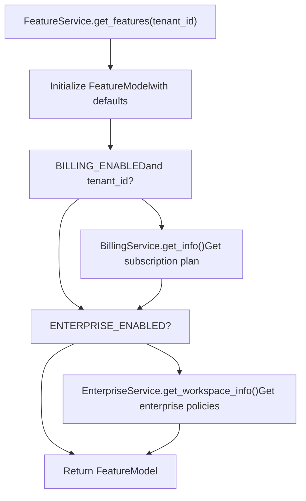

# Multi-Tenancy and Authorization

Relevant source files

-   [api/controllers/console/\_\_init\_\_.py](https://github.com/langgenius/dify/blob/92dbc94f/api/controllers/console/__init__.py)
-   [api/controllers/console/auth/activate.py](https://github.com/langgenius/dify/blob/92dbc94f/api/controllers/console/auth/activate.py)
-   [api/controllers/console/auth/email\_register.py](https://github.com/langgenius/dify/blob/92dbc94f/api/controllers/console/auth/email_register.py)
-   [api/controllers/console/auth/error.py](https://github.com/langgenius/dify/blob/92dbc94f/api/controllers/console/auth/error.py)
-   [api/controllers/console/auth/forgot\_password.py](https://github.com/langgenius/dify/blob/92dbc94f/api/controllers/console/auth/forgot_password.py)
-   [api/controllers/console/auth/login.py](https://github.com/langgenius/dify/blob/92dbc94f/api/controllers/console/auth/login.py)
-   [api/controllers/console/auth/oauth.py](https://github.com/langgenius/dify/blob/92dbc94f/api/controllers/console/auth/oauth.py)
-   [api/controllers/console/billing/billing.py](https://github.com/langgenius/dify/blob/92dbc94f/api/controllers/console/billing/billing.py)
-   [api/controllers/console/billing/compliance.py](https://github.com/langgenius/dify/blob/92dbc94f/api/controllers/console/billing/compliance.py)
-   [api/controllers/console/error.py](https://github.com/langgenius/dify/blob/92dbc94f/api/controllers/console/error.py)
-   [api/controllers/console/feature.py](https://github.com/langgenius/dify/blob/92dbc94f/api/controllers/console/feature.py)
-   [api/controllers/console/init\_validate.py](https://github.com/langgenius/dify/blob/92dbc94f/api/controllers/console/init_validate.py)
-   [api/controllers/console/setup.py](https://github.com/langgenius/dify/blob/92dbc94f/api/controllers/console/setup.py)
-   [api/controllers/console/version.py](https://github.com/langgenius/dify/blob/92dbc94f/api/controllers/console/version.py)
-   [api/controllers/console/workspace/account.py](https://github.com/langgenius/dify/blob/92dbc94f/api/controllers/console/workspace/account.py)
-   [api/controllers/console/workspace/agent\_providers.py](https://github.com/langgenius/dify/blob/92dbc94f/api/controllers/console/workspace/agent_providers.py)
-   [api/controllers/console/workspace/members.py](https://github.com/langgenius/dify/blob/92dbc94f/api/controllers/console/workspace/members.py)
-   [api/controllers/console/workspace/model\_providers.py](https://github.com/langgenius/dify/blob/92dbc94f/api/controllers/console/workspace/model_providers.py)
-   [api/controllers/console/workspace/models.py](https://github.com/langgenius/dify/blob/92dbc94f/api/controllers/console/workspace/models.py)
-   [api/controllers/console/workspace/workspace.py](https://github.com/langgenius/dify/blob/92dbc94f/api/controllers/console/workspace/workspace.py)
-   [api/controllers/console/wraps.py](https://github.com/langgenius/dify/blob/92dbc94f/api/controllers/console/wraps.py)
-   [api/controllers/service\_api/wraps.py](https://github.com/langgenius/dify/blob/92dbc94f/api/controllers/service_api/wraps.py)
-   [api/libs/encryption.py](https://github.com/langgenius/dify/blob/92dbc94f/api/libs/encryption.py)
-   [api/libs/workspace\_permission.py](https://github.com/langgenius/dify/blob/92dbc94f/api/libs/workspace_permission.py)
-   [api/models/account.py](https://github.com/langgenius/dify/blob/92dbc94f/api/models/account.py)
-   [api/models/api\_based\_extension.py](https://github.com/langgenius/dify/blob/92dbc94f/api/models/api_based_extension.py)
-   [api/models/dataset.py](https://github.com/langgenius/dify/blob/92dbc94f/api/models/dataset.py)
-   [api/models/model.py](https://github.com/langgenius/dify/blob/92dbc94f/api/models/model.py)
-   [api/models/oauth.py](https://github.com/langgenius/dify/blob/92dbc94f/api/models/oauth.py)
-   [api/models/provider.py](https://github.com/langgenius/dify/blob/92dbc94f/api/models/provider.py)
-   [api/models/source.py](https://github.com/langgenius/dify/blob/92dbc94f/api/models/source.py)
-   [api/models/task.py](https://github.com/langgenius/dify/blob/92dbc94f/api/models/task.py)
-   [api/models/tools.py](https://github.com/langgenius/dify/blob/92dbc94f/api/models/tools.py)
-   [api/models/trigger.py](https://github.com/langgenius/dify/blob/92dbc94f/api/models/trigger.py)
-   [api/models/web.py](https://github.com/langgenius/dify/blob/92dbc94f/api/models/web.py)
-   [api/models/workflow.py](https://github.com/langgenius/dify/blob/92dbc94f/api/models/workflow.py)
-   [api/services/account\_service.py](https://github.com/langgenius/dify/blob/92dbc94f/api/services/account_service.py)
-   [api/services/billing\_service.py](https://github.com/langgenius/dify/blob/92dbc94f/api/services/billing_service.py)
-   [api/services/enterprise/enterprise\_service.py](https://github.com/langgenius/dify/blob/92dbc94f/api/services/enterprise/enterprise_service.py)
-   [api/services/feature\_service.py](https://github.com/langgenius/dify/blob/92dbc94f/api/services/feature_service.py)
-   [api/services/operation\_service.py](https://github.com/langgenius/dify/blob/92dbc94f/api/services/operation_service.py)
-   [api/templates/change\_mail\_confirm\_old\_template\_zh-CN.html](https://github.com/langgenius/dify/blob/92dbc94f/api/templates/change_mail_confirm_old_template_zh-CN.html)
-   [api/templates/transfer\_workspace\_owner\_confirm\_template\_en-US.html](https://github.com/langgenius/dify/blob/92dbc94f/api/templates/transfer_workspace_owner_confirm_template_en-US.html)
-   [api/templates/without-brand/transfer\_workspace\_owner\_confirm\_template\_en-US.html](https://github.com/langgenius/dify/blob/92dbc94f/api/templates/without-brand/transfer_workspace_owner_confirm_template_en-US.html)
-   [api/tests/test\_containers\_integration\_tests/services/test\_advanced\_prompt\_template\_service.py](https://github.com/langgenius/dify/blob/92dbc94f/api/tests/test_containers_integration_tests/services/test_advanced_prompt_template_service.py)
-   [api/tests/test\_containers\_integration\_tests/services/test\_agent\_service.py](https://github.com/langgenius/dify/blob/92dbc94f/api/tests/test_containers_integration_tests/services/test_agent_service.py)
-   [api/tests/test\_containers\_integration\_tests/tasks/\_\_init\_\_.py](https://github.com/langgenius/dify/blob/92dbc94f/api/tests/test_containers_integration_tests/tasks/__init__.py)
-   [api/tests/test\_containers\_integration\_tests/tasks/test\_add\_document\_to\_index\_task.py](https://github.com/langgenius/dify/blob/92dbc94f/api/tests/test_containers_integration_tests/tasks/test_add_document_to_index_task.py)
-   [api/tests/unit\_tests/controllers/console/auth/test\_account\_activation.py](https://github.com/langgenius/dify/blob/92dbc94f/api/tests/unit_tests/controllers/console/auth/test_account_activation.py)
-   [api/tests/unit\_tests/controllers/console/auth/test\_authentication\_security.py](https://github.com/langgenius/dify/blob/92dbc94f/api/tests/unit_tests/controllers/console/auth/test_authentication_security.py)
-   [api/tests/unit\_tests/controllers/console/auth/test\_email\_verification.py](https://github.com/langgenius/dify/blob/92dbc94f/api/tests/unit_tests/controllers/console/auth/test_email_verification.py)
-   [api/tests/unit\_tests/controllers/console/auth/test\_login\_logout.py](https://github.com/langgenius/dify/blob/92dbc94f/api/tests/unit_tests/controllers/console/auth/test_login_logout.py)
-   [api/tests/unit\_tests/controllers/console/auth/test\_oauth.py](https://github.com/langgenius/dify/blob/92dbc94f/api/tests/unit_tests/controllers/console/auth/test_oauth.py)
-   [api/tests/unit\_tests/controllers/console/auth/test\_password\_reset.py](https://github.com/langgenius/dify/blob/92dbc94f/api/tests/unit_tests/controllers/console/auth/test_password_reset.py)
-   [api/tests/unit\_tests/controllers/console/auth/test\_token\_refresh.py](https://github.com/langgenius/dify/blob/92dbc94f/api/tests/unit_tests/controllers/console/auth/test_token_refresh.py)
-   [api/tests/unit\_tests/controllers/test\_compare\_versions.py](https://github.com/langgenius/dify/blob/92dbc94f/api/tests/unit_tests/controllers/test_compare_versions.py)
-   [api/tests/unit\_tests/core/test\_provider\_manager.py](https://github.com/langgenius/dify/blob/92dbc94f/api/tests/unit_tests/core/test_provider_manager.py)
-   [api/tests/unit\_tests/libs/test\_encryption.py](https://github.com/langgenius/dify/blob/92dbc94f/api/tests/unit_tests/libs/test_encryption.py)
-   [api/tests/unit\_tests/libs/test\_oauth\_clients.py](https://github.com/langgenius/dify/blob/92dbc94f/api/tests/unit_tests/libs/test_oauth_clients.py)
-   [api/tests/unit\_tests/libs/test\_workspace\_permission.py](https://github.com/langgenius/dify/blob/92dbc94f/api/tests/unit_tests/libs/test_workspace_permission.py)

This document describes Dify's multi-tenant architecture, account management, and role-based access control (RBAC) system. It covers how workspaces (tenants) are isolated, how users are assigned roles within tenants, and how permissions are enforced throughout the codebase.

For information about API-level authentication mechanisms (API keys, JWT tokens, OAuth), see section 7.3. For details on feature gating and billing integration, see section 7.4.

---

## Multi-Tenancy Architecture Overview

Dify implements a **workspace-based multi-tenancy model** where each tenant represents an isolated workspace. All major resources (apps, datasets, workflows, providers, tools) are scoped to a specific tenant using a `tenant_id` foreign key.

### Core Concepts

| Concept | Description | Database Model |
| --- | --- | --- |
| **Tenant** | A workspace that owns all resources | `tenants` table |
| **Account** | A user who can be a member of multiple tenants | `accounts` table |
| **Membership** | The relationship between an account and a tenant with an assigned role | `tenant_account_joins` table |
| **Role** | Defines what permissions an account has within a specific tenant | `TenantAccountRole` enum |

**Tenant-Scoped Resources**

The following entities are scoped to a tenant (contain a `tenant_id` field):

-   Applications (`App`)
-   Datasets (`Dataset`)
-   Workflows (`Workflow`, `WorkflowRun`)
-   LLM Providers (`Provider`, `ProviderModel`)
-   Tool Providers (`BuiltinToolProvider`, `ApiToolProvider`, `WorkflowToolProvider`, `MCPToolProvider`)
-   Conversations (`Conversation` via `App.tenant_id`)
-   Documents (`Document`)

**Entity Relationship Diagram**


Sources: [api/models/account.py242-277](https://github.com/langgenius/dify/blob/92dbc94f/api/models/account.py#L242-L277) [api/models/model.py75-313](https://github.com/langgenius/dify/blob/92dbc94f/api/models/model.py#L75-L313) [api/models/dataset.py44-311](https://github.com/langgenius/dify/blob/92dbc94f/api/models/dataset.py#L44-L311) [api/models/workflow.py100-202](https://github.com/langgenius/dify/blob/92dbc94f/api/models/workflow.py#L100-L202) [api/models/provider.py47-125](https://github.com/langgenius/dify/blob/92dbc94f/api/models/provider.py#L47-L125) [api/models/tools.py66-116](https://github.com/langgenius/dify/blob/92dbc94f/api/models/tools.py#L66-L116)

---

## Account Service and Tenant Management

The `AccountService` and `TenantService` classes in [api/services/account\_service.py](https://github.com/langgenius/dify/blob/92dbc94f/api/services/account_service.py) provide core functionality for account and tenant management.

### Key Service Classes

**AccountService Methods:**

| Method | Purpose | Location |
| --- | --- | --- |
| `create_account()` | Creates a new account with password hashing | [api/services/account\_service.py229-279](https://github.com/langgenius/dify/blob/92dbc94f/api/services/account_service.py#L229-L279) |
| `authenticate()` | Validates email/password credentials | [api/services/account\_service.py176-204](https://github.com/langgenius/dify/blob/92dbc94f/api/services/account_service.py#L176-L204) |
| `login()` | Generates JWT and refresh tokens | [api/services/account\_service.py398-412](https://github.com/langgenius/dify/blob/92dbc94f/api/services/account_service.py#L398-L412) |
| `load_user()` | Loads account and sets current tenant | [api/services/account\_service.py127-159](https://github.com/langgenius/dify/blob/92dbc94f/api/services/account_service.py#L127-L159) |
| `update_account_password()` | Updates password with current password validation | [api/services/account\_service.py207-226](https://github.com/langgenius/dify/blob/92dbc94f/api/services/account_service.py#L207-L226) |

**TenantService Methods:**

The `TenantService` class (referenced throughout the codebase) provides:

-   `create_owner_tenant_if_not_exist()` - Creates default workspace for new accounts
-   `get_join_tenants()` - Retrieves all tenants an account belongs to
-   `get_tenant_members()` - Lists all members of a tenant
-   `remove_member_from_tenant()` - Removes member with permission checks
-   `update_member_role()` - Changes member's role with RBAC enforcement

Sources: [api/services/account\_service.py88-792](https://github.com/langgenius/dify/blob/92dbc94f/api/services/account_service.py#L88-L792) [api/controllers/console/workspace/members.py84-220](https://github.com/langgenius/dify/blob/92dbc94f/api/controllers/console/workspace/members.py#L84-L220)

---

## Tenant and Account Models

### Tenant Model

The `Tenant` model represents a workspace. Each tenant has its own isolated set of resources.

**Key Fields:**

| Field | Type | Description |
| --- | --- | --- |
| `id` | StringUUID | Primary key |
| `name` | String(255) | Workspace name |
| `plan` | String(255) | Subscription plan (default: 'basic') |
| `status` | String(255) | Status: 'normal' or 'archive' |
| `encrypt_public_key` | LongText | Public key for encryption |
| `custom_config` | LongText | JSON custom configuration |

**Tenant Status:**

```
class TenantStatus(enum.StrEnum):
    NORMAL = "normal"
    ARCHIVE = "archive"
```
Sources: [api/models/account.py242-277](https://github.com/langgenius/dify/blob/92dbc94f/api/models/account.py#L242-L277) [api/models/account.py237-240](https://github.com/langgenius/dify/blob/92dbc94f/api/models/account.py#L237-L240)

### Account Model

The `Account` model represents a user in the system. An account can be a member of multiple tenants with different roles in each.

**Key Fields:**

| Field | Type | Description |
| --- | --- | --- |
| `id` | StringUUID | Primary key |
| `name` | String(255) | User name |
| `email` | String(255) | Unique email address |
| `password` | String(255) | Hashed password (nullable) |
| `status` | String(16) | Account status |
| `interface_language` | String(255) | UI language preference |
| `timezone` | String(255) | User timezone |
| `last_login_at` | DateTime | Last login timestamp |

**Account Status:**

```
class AccountStatus(enum.StrEnum):
    PENDING = "pending"
    UNINITIALIZED = "uninitialized"
    ACTIVE = "active"
    BANNED = "banned"
    CLOSED = "closed"
```
**Current Tenant Context:**

The `Account` model maintains the current tenant context in runtime using the `_current_tenant` and `role` attributes:

-   `_current_tenant`: The currently active `Tenant` object
-   `role`: The account's role in the current tenant (`TenantAccountRole`)

These are set by calling `account.current_tenant = tenant` or `account.set_tenant_id(tenant_id)`.

Sources: [api/models/account.py87-182](https://github.com/langgenius/dify/blob/92dbc94f/api/models/account.py#L87-L182) [api/models/account.py79-85](https://github.com/langgenius/dify/blob/92dbc94f/api/models/account.py#L79-L85)

### TenantAccountJoin Model

The `TenantAccountJoin` model represents the many-to-many relationship between tenants and accounts, storing the role assignment.

**Key Fields:**

| Field | Type | Description |
| --- | --- | --- |
| `id` | StringUUID | Primary key |
| `tenant_id` | StringUUID | Foreign key to Tenant |
| `account_id` | StringUUID | Foreign key to Account |
| `role` | String(16) | Role within the tenant |
| `current` | Boolean | Whether this is the user's current active tenant |
| `invited_by` | StringUUID | Account ID of the inviter |

**Unique Constraint:**

The table enforces a unique constraint on `(tenant_id, account_id)`, ensuring an account can only have one role per tenant.

Sources: [api/models/account.py279-302](https://github.com/langgenius/dify/blob/92dbc94f/api/models/account.py#L279-L302)

---

## Role-Based Access Control

Dify implements RBAC using the `TenantAccountRole` enum, which defines five distinct roles with hierarchical permissions.

### TenantAccountRole Enum

```
class TenantAccountRole(enum.StrEnum):
    OWNER = "owner"
    ADMIN = "admin"
    EDITOR = "editor"
    NORMAL = "normal"
    DATASET_OPERATOR = "dataset_operator"
```
**Role Hierarchy and Permissions:**

| Role | Can Manage Team | Can Edit Apps | Can Edit Datasets | Can View Only | Special Purpose |
| --- | --- | --- | --- | --- | --- |
| `OWNER` | ✓ | ✓ | ✓ | \- | Workspace creator, highest privileges |
| `ADMIN` | ✓ | ✓ | ✓ | \- | Full administrative access |
| `EDITOR` | \- | ✓ | ✓ | \- | Can create and modify resources |
| `NORMAL` | \- | \- | \- | ✓ | Read-only access |
| `DATASET_OPERATOR` | \- | \- | ✓ | \- | Specialized role for dataset management |

Sources: [api/models/account.py19-77](https://github.com/langgenius/dify/blob/92dbc94f/api/models/account.py#L19-L77)

### Permission Check Methods

The `TenantAccountRole` enum provides static methods for checking permissions:

**Privileged Roles (Owner or Admin):**

```
@staticmethod
def is_privileged_role(role: Optional["TenantAccountRole"]) -> bool:
    return role in {TenantAccountRole.OWNER, TenantAccountRole.ADMIN}
```
Used for: Team management, billing, workspace settings

**Editing Roles (Owner, Admin, Editor):**

```
@staticmethod
def is_editing_role(role: Optional["TenantAccountRole"]) -> bool:
    return role in {TenantAccountRole.OWNER, TenantAccountRole.ADMIN, TenantAccountRole.EDITOR}
```
Used for: Creating/modifying apps, workflows, and general resources

**Dataset Editing Roles (Owner, Admin, Editor, Dataset Operator):**

```
@staticmethod
def is_dataset_edit_role(role: Optional["TenantAccountRole"]) -> bool:
    return role in {
        TenantAccountRole.OWNER,
        TenantAccountRole.ADMIN,
        TenantAccountRole.EDITOR,
        TenantAccountRole.DATASET_OPERATOR,
    }
```
Used for: Creating/modifying datasets and documents

Sources: [api/models/account.py38-77](https://github.com/langgenius/dify/blob/92dbc94f/api/models/account.py#L38-L77)

### Account Permission Properties

The `Account` model provides convenience properties for permission checks within the current tenant context:

| Property | Description | Returns True When |
| --- | --- | --- |
| `is_admin_or_owner` | Checks if user is admin or owner | `role in {OWNER, ADMIN}` |
| `is_admin` | Checks if user is admin specifically | `role == ADMIN` |
| `has_edit_permission` | Checks if user can edit resources | `role in {OWNER, ADMIN, EDITOR}` |
| `is_dataset_editor` | Checks if user can edit datasets | `role in {OWNER, ADMIN, EDITOR, DATASET_OPERATOR}` |
| `is_dataset_operator` | Checks if user is dataset operator | `role == DATASET_OPERATOR` |

**Example Usage:**

```
# In service code
if not account.is_admin_or_owner:
    raise Forbidden("Only admins and owners can perform this action")

if not account.has_edit_permission:
    raise Forbidden("You don't have permission to edit this resource")
```
Sources: [api/models/account.py194-235](https://github.com/langgenius/dify/blob/92dbc94f/api/models/account.py#L194-L235)

---

## Dataset-Specific Permissions

In addition to tenant-level RBAC, datasets have their own permission model that controls visibility within a tenant.

### DatasetPermissionEnum

```
class DatasetPermissionEnum(enum.StrEnum):
    ONLY_ME = "only_me"
    ALL_TEAM = "all_team_members"
    PARTIAL_TEAM = "partial_members"
```
**Permission Levels:**

| Permission | Visibility | Use Case |
| --- | --- | --- |
| `ONLY_ME` | Only the creator can access | Private datasets |
| `ALL_TEAM` | All tenant members can access | Shared team knowledge bases |
| `PARTIAL_TEAM` | Specific members can access | Selective sharing within workspace |

The `Dataset` model includes a `permission` field that stores this value:

```
permission: Mapped[str] = mapped_column(String(255), server_default=sa.text("'only_me'"))
```
**Permission Flow:**


Sources: [api/models/dataset.py38-42](https://github.com/langgenius/dify/blob/92dbc94f/api/models/dataset.py#L38-L42) [api/models/dataset.py44-311](https://github.com/langgenius/dify/blob/92dbc94f/api/models/dataset.py#L44-L311)

---

## Authorization Patterns in the Codebase

### Tenant Scoping Pattern

All queries for tenant-scoped resources must filter by `tenant_id` to ensure proper isolation:

**Standard Query Pattern:**

```
# Always include tenant_id filter
app = db.session.query(App).where(
    App.id == app_id,
    App.tenant_id == current_user.current_tenant_id
).first()
```
**Anti-Pattern (NEVER do this):**

```
# WRONG: Missing tenant_id check
app = db.session.query(App).where(App.id == app_id).first()
```
This pattern applies to all major entities:

-   `App.tenant_id`
-   `Dataset.tenant_id`
-   `Workflow.tenant_id`
-   `Provider.tenant_id`
-   `BuiltinToolProvider.tenant_id`
-   `ApiToolProvider.tenant_id`
-   `WorkflowToolProvider.tenant_id`

Sources: [api/models/model.py75-313](https://github.com/langgenius/dify/blob/92dbc94f/api/models/model.py#L75-L313) [api/models/dataset.py44-311](https://github.com/langgenius/dify/blob/92dbc94f/api/models/dataset.py#L44-L311) [api/models/workflow.py100-202](https://github.com/langgenius/dify/blob/92dbc94f/api/models/workflow.py#L100-L202)

### Setting Current Tenant Context

The `Account.current_tenant` setter loads the tenant and role information:

```
@current_tenant.setter
def current_tenant(self, tenant: "Tenant"):
    with Session(db.engine, expire_on_commit=False) as session:
        tenant_join_query = select(TenantAccountJoin).where(
            TenantAccountJoin.tenant_id == tenant.id,
            TenantAccountJoin.account_id == self.id
        )
        tenant_join = session.scalar(tenant_join_query)
        # ...
        if tenant_join:
            self.role = TenantAccountRole(tenant_join.role)
            self._current_tenant = tenant_reloaded
```
This ensures that:

1.  The account is actually a member of the tenant
2.  The correct role is loaded for permission checks
3.  The tenant object is available for the request lifetime

Sources: [api/models/account.py130-155](https://github.com/langgenius/dify/blob/92dbc94f/api/models/account.py#L130-L155)

### Current User Context Loading

The `AccountService.load_user()` method is the primary entry point for loading authenticated accounts:

```
@staticmethod
def load_user(user_id: str) -> None | Account:
    account = db.session.query(Account).filter_by(id=user_id).first()
    if not account:
        return None

    if account.status == AccountStatus.BANNED:
        raise Unauthorized("Account is banned.")

    # Load current tenant
    current_tenant = db.session.query(TenantAccountJoin).filter_by(
        account_id=account.id, current=True
    ).first()

    if current_tenant:
        account.set_tenant_id(current_tenant.tenant_id)
    # ... fallback to first tenant if no current tenant set
```
This method:

1.  Validates account exists and is not banned
2.  Loads the user's current active tenant
3.  Sets the `current_tenant` and `role` on the account object
4.  Updates `last_active_at` timestamp

Sources: [api/services/account\_service.py127-159](https://github.com/langgenius/dify/blob/92dbc94f/api/services/account_service.py#L127-L159)

### Resource Ownership Pattern

Many entities track their creator using `created_by` fields:

```
# App model
created_by = mapped_column(StringUUID, nullable=True)

# Dataset model
created_by = mapped_column(StringUUID, nullable=False)

# Workflow model
created_by: Mapped[str] = mapped_column(StringUUID, nullable=False)
```
This enables:

-   Checking if a user is the resource creator
-   Implementing `ONLY_ME` permissions
-   Audit logging and tracking

Sources: [api/models/model.py99](https://github.com/langgenius/dify/blob/92dbc94f/api/models/model.py#L99-L99) [api/models/dataset.py64](https://github.com/langgenius/dify/blob/92dbc94f/api/models/dataset.py#L64-L64) [api/models/workflow.py148](https://github.com/langgenius/dify/blob/92dbc94f/api/models/workflow.py#L148-L148)

---

## Permission Enforcement with Decorators

Dify uses decorators extensively to enforce permissions at the API endpoint level. These decorators wrap Flask-RESTX `Resource` methods.

### Console API Permission Decorators

Located in [api/controllers/console/wraps.py](https://github.com/langgenius/dify/blob/92dbc94f/api/controllers/console/wraps.py) these decorators protect console management endpoints:

**Core Decorators:**

| Decorator | Purpose | Implementation |
| --- | --- | --- |
| `@setup_required` | Ensures system setup is complete | Checks `DifySetup` table |
| `@login_required` | Requires authenticated session | Uses Flask-Login |
| `@account_initialization_required` | Ensures account is not in UNINITIALIZED status | Checks `AccountStatus` |
| `@is_admin_or_owner_required` | Requires ADMIN or OWNER role | Checks `account.is_admin_or_owner` |
| `@cloud_edition_billing_resource_check(resource)` | Enforces billing limits | Calls `FeatureService.get_features()` |

**Usage Example:**

```
@console_ns.route("/workspaces/current/members")
class MemberListApi(Resource):
    @setup_required
    @login_required
    @account_initialization_required
    def get(self):
        current_user, _ = current_account_with_tenant()
        if not current_user.current_tenant:
            raise ValueError("No current tenant")
        members = TenantService.get_tenant_members(current_user.current_tenant)
        return {"result": "success", "accounts": members}, 200
```
Sources: [api/controllers/console/wraps.py39-158](https://github.com/langgenius/dify/blob/92dbc94f/api/controllers/console/wraps.py#L39-L158) [api/controllers/console/workspace/members.py72-86](https://github.com/langgenius/dify/blob/92dbc94f/api/controllers/console/workspace/members.py#L72-L86)

### Service API Permission Decorators

Located in [api/controllers/service\_api/wraps.py](https://github.com/langgenius/dify/blob/92dbc94f/api/controllers/service_api/wraps.py) these decorators protect programmatic API endpoints:

**API Token Validation:**

```
@validate_app_token(fetch_user_arg=FetchUserArg(fetch_from=WhereisUserArg.JSON, required=True))
def decorated_view(*args, **kwargs):
    # Validates API token from Authorization header
    # Loads app_model and tenant context
    # Optionally loads end_user if fetch_user_arg provided
    pass
```
The `validate_and_get_api_token()` function:

1.  Extracts Bearer token from `Authorization` header
2.  Queries `ApiToken` table for matching token
3.  Updates `last_used_at` timestamp
4.  Returns token object or raises `Unauthorized`

**Dataset API Protection:**

```
class DatasetApiResource(Resource):
    method_decorators = [validate_dataset_token]

    def get_dataset(self, dataset_id: str, tenant_id: str) -> Dataset:
        dataset = db.session.query(Dataset).where(
            Dataset.id == dataset_id,
            Dataset.tenant_id == tenant_id
        ).first()
        # ...
```
Sources: [api/controllers/service\_api/wraps.py50-295](https://github.com/langgenius/dify/blob/92dbc94f/api/controllers/service_api/wraps.py#L50-L295) [api/controllers/service\_api/wraps.py336-346](https://github.com/langgenius/dify/blob/92dbc94f/api/controllers/service_api/wraps.py#L336-L346)

### Billing and Feature Gating

The `@cloud_edition_billing_resource_check` decorator enforces subscription limits:

```
@cloud_edition_billing_resource_check("members")
def post(self):
    # Checks if tenant has reached member limit
    # Raises 403 if limit exceeded
    pass
```
Resources that can be gated:

-   `"members"` - Team member count
-   `"apps"` - Application count
-   `"vector_space"` - Vector storage capacity
-   `"documents"` - Document upload quota
-   `"annotation"` - Annotation quota

Sources: [api/controllers/console/wraps.py97-158](https://github.com/langgenius/dify/blob/92dbc94f/api/controllers/console/wraps.py#L97-L158)

---

## Multi-Tenancy Data Model

### Complete Entity Relationship Diagram

```mermaid
flowchart TD
    entity_tenants_0["tenants"]
    entity_tenant_account_joins_1["tenant_account_joins"]
    entity_accounts_2["accounts"]
    entity_apps_3["apps"]
    entity_datasets_4["datasets"]
    entity_workflows_5["workflows"]
    entity_providers_6["providers"]
    entity_tool_builtin_providers_7["tool_builtin_providers"]
    entity_tool_api_providers_8["tool_api_providers"]
    entity_tool_workflow_providers_9["tool_workflow_providers"]
    entity_conversations_10["conversations"]
    entity_workflow_runs_11["workflow_runs"]
    entity_documents_12["documents"]
```


Sources: [api/models/account.py242-302](https://github.com/langgenius/dify/blob/92dbc94f/api/models/account.py#L242-L302) [api/models/model.py75-313](https://github.com/langgenius/dify/blob/92dbc94f/api/models/model.py#L75-L313) [api/models/dataset.py44-311](https://github.com/langgenius/dify/blob/92dbc94f/api/models/dataset.py#L44-L311) [api/models/workflow.py100-202](https://github.com/langgenius/dify/blob/92dbc94f/api/models/workflow.py#L100-L202)

---

## Authorization Flow Examples

### Example 1: Checking App Access

> **[Mermaid sequence]**
> *(图表结构无法解析)*

### Example 2: Creating a Dataset with Permission

> **[Mermaid sequence]**
> *(图表结构无法解析)*

### Example 3: Tenant Member Invitation

> **[Mermaid sequence]**
> *(图表结构无法解析)*

Sources: Based on patterns in [api/models/account.py87-235](https://github.com/langgenius/dify/blob/92dbc94f/api/models/account.py#L87-L235) [api/models/dataset.py44-311](https://github.com/langgenius/dify/blob/92dbc94f/api/models/dataset.py#L44-L311) [api/models/model.py75-313](https://github.com/langgenius/dify/blob/92dbc94f/api/models/model.py#L75-L313)

---

## Authentication and Token Management

Dify implements multiple authentication methods managed by `AccountService`.

### Authentication Methods

**Diagram: Authentication Flow**


Sources: [api/services/account\_service.py176-440](https://github.com/langgenius/dify/blob/92dbc94f/api/services/account_service.py#L176-L440) [api/controllers/console/auth/login.py82-148](https://github.com/langgenius/dify/blob/92dbc94f/api/controllers/console/auth/login.py#L82-L148)

### JWT Token Structure

Generated by `AccountService.get_account_jwt_token()`:

```
payload = {
    "user_id": account.id,
    "exp": exp,  # Expiration timestamp
    "iss": dify_config.EDITION,  # Issuer (SELF_HOSTED/CLOUD/ENTERPRISE)
    "sub": "Console API Passport",
}
token = PassportService().issue(payload)
```
**Token Expiration:**

-   Access token: Configured by `ACCESS_TOKEN_EXPIRE_MINUTES` (default varies by edition)
-   Refresh token: Configured by `REFRESH_TOKEN_EXPIRE_DAYS` (stored in Redis)

Sources: [api/services/account\_service.py162-173](https://github.com/langgenius/dify/blob/92dbc94f/api/services/account_service.py#L162-L173) [api/services/account\_service.py83-86](https://github.com/langgenius/dify/blob/92dbc94f/api/services/account_service.py#L83-L86)

### Refresh Token Storage

Refresh tokens are stored in Redis with dual keys for bi-directional lookup:

```
# Key: refresh_token:{token} -> Value: account_id
redis_client.setex(
    f"refresh_token:{refresh_token}",
    REFRESH_TOKEN_EXPIRY,
    account_id
)

# Key: account_refresh_token:{account_id} -> Value: refresh_token
redis_client.setex(
    f"account_refresh_token:{account_id}",
    REFRESH_TOKEN_EXPIRY,
    refresh_token
)
```
This dual-key structure enables:

1.  Token validation during refresh
2.  Token revocation by account ID during logout
3.  Preventing multiple concurrent sessions (last token wins)

Sources: [api/services/account\_service.py83-125](https://github.com/langgenius/dify/blob/92dbc94f/api/services/account_service.py#L83-L125)

### Rate Limiting

`AccountService` implements rate limiters using the `RateLimiter` helper class:

| Rate Limiter | Max Attempts | Time Window | Purpose |
| --- | --- | --- | --- |
| `reset_password_rate_limiter` | 1 | 60 seconds | Password reset emails |
| `email_register_rate_limiter` | 1 | 60 seconds | Registration emails |
| `email_code_login_rate_limiter` | 3 | 300 seconds | Login code emails |
| `email_code_account_deletion_rate_limiter` | 1 | 60 seconds | Account deletion codes |

Additional rate limiting:

-   `LOGIN_MAX_ERROR_LIMITS = 5` - Failed login attempts before lockout
-   Stored in Redis with keys like `login_error_rate_limit:{email}`

Sources: [api/services/account\_service.py89-99](https://github.com/langgenius/dify/blob/92dbc94f/api/services/account_service.py#L89-L99) [api/services/account\_service.py799-827](https://github.com/langgenius/dify/blob/92dbc94f/api/services/account_service.py#L799-L827)

---

## Feature Gating and Edition-Based Controls

The `FeatureService` provides tenant-specific feature availability based on edition and subscription.

### Edition Types

Dify supports three editions controlled by `dify_config.EDITION`:

1.  **SELF\_HOSTED** - On-premise deployment, all features enabled by default
2.  **CLOUD** - SaaS deployment with `BillingService` integration
3.  **ENTERPRISE** - Enterprise deployment with `EnterpriseService` integration

### FeatureService.get\_features()

Returns a `FeatureModel` containing:

```
class FeatureModel(BaseModel):
    billing: BillingModel  # Subscription plan and limits
    members: LimitationModel  # Team member limits
    apps: LimitationModel  # App count limits
    vector_space: LimitationModel  # Vector storage limits
    documents_upload_quota: LimitationModel  # Document upload limits
    workspace_members: LicenseLimitationModel  # Enterprise workspace member limits
    model_load_balancing_enabled: bool  # Load balancing feature
    dataset_operator_enabled: bool  # Dataset operator role
    is_allow_transfer_workspace: bool  # Workspace transfer permission
```
**Feature Resolution Logic:**


Sources: [api/services/feature\_service.py175-247](https://github.com/langgenius/dify/blob/92dbc94f/api/services/feature_service.py#L175-L247)

### Billing Integration (Cloud Edition)

The `BillingService` communicates with an external billing API for CLOUD edition:

**Key Methods:**

| Method | Purpose | Returns |
| --- | --- | --- |
| `get_info(tenant_id)` | Retrieves subscription details | Plan, status, limits |
| `get_tenant_feature_plan_usage_info(tenant_id)` | Current usage statistics | Usage counts |
| `update_tenant_feature_plan_usage(tenant_id, feature_key, delta)` | Increments/decrements usage | History ID for refunds |
| `refund_tenant_feature_plan_usage(history_id)` | Reverses a usage charge | Success status |

**Caching:**

Billing info is cached in Redis to reduce API calls:

-   Key pattern: `tenant:{tenant_id}:billing_info`
-   Used in batch operations via `get_plan_bulk_with_cache()`

Sources: [api/services/billing\_service.py29-393](https://github.com/langgenius/dify/blob/92dbc94f/api/services/billing_service.py#L29-L393)

### Enterprise Policies (Enterprise Edition)

The `EnterpriseService` enforces organization-wide policies:

**Workspace Permissions:**

```
class WorkspacePermission(BaseModel):
    workspace_id: str
    allow_member_invite: bool  # Can members invite others?
    allow_owner_transfer: bool  # Can ownership be transferred?
```
Example enforcement in member invitation:

```
from libs.workspace_permission import check_workspace_member_invite_permission

check_workspace_member_invite_permission(tenant_id)
# Raises Forbidden if enterprise policy disallows member invites
```
Sources: [api/services/enterprise/enterprise\_service.py8-125](https://github.com/langgenius/dify/blob/92dbc94f/api/services/enterprise/enterprise_service.py#L8-L125) [api/controllers/console/workspace/members.py112-114](https://github.com/langgenius/dify/blob/92dbc94f/api/controllers/console/workspace/members.py#L112-L114)

---

## Summary

Dify's multi-tenancy and authorization system provides:

1.  **Workspace Isolation**: All resources are strictly scoped to tenants via `tenant_id` foreign keys
2.  **Flexible Membership**: Accounts can belong to multiple tenants with different roles in each
3.  **Five-Role RBAC**: Owner, Admin, Editor, Normal, and Dataset Operator roles with clear permission boundaries
4.  **Dataset Granularity**: Additional permission controls at the dataset level (only\_me, all\_team, partial\_team)
5.  **Audit Trail**: Creator tracking on all major resources via `created_by` fields

**Key Implementation Points:**

-   Always filter queries by `tenant_id` to ensure tenant isolation
-   Use `Account.current_tenant` and `Account.role` for permission checks
-   Leverage helper methods like `is_admin_or_owner`, `has_edit_permission`, `is_dataset_editor`
-   Respect dataset-specific permissions for knowledge base access
-   Load tenant context early in request processing

This architecture enables secure multi-tenant operation while maintaining clean separation of concerns and straightforward permission logic.

Sources: [api/models/account.py19-302](https://github.com/langgenius/dify/blob/92dbc94f/api/models/account.py#L19-L302) [api/models/model.py75-313](https://github.com/langgenius/dify/blob/92dbc94f/api/models/model.py#L75-L313) [api/models/dataset.py38-311](https://github.com/langgenius/dify/blob/92dbc94f/api/models/dataset.py#L38-L311) [api/models/workflow.py100-202](https://github.com/langgenius/dify/blob/92dbc94f/api/models/workflow.py#L100-L202) [api/models/provider.py47-125](https://github.com/langgenius/dify/blob/92dbc94f/api/models/provider.py#L47-L125) [api/models/tools.py66-367](https://github.com/langgenius/dify/blob/92dbc94f/api/models/tools.py#L66-L367)
