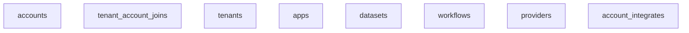
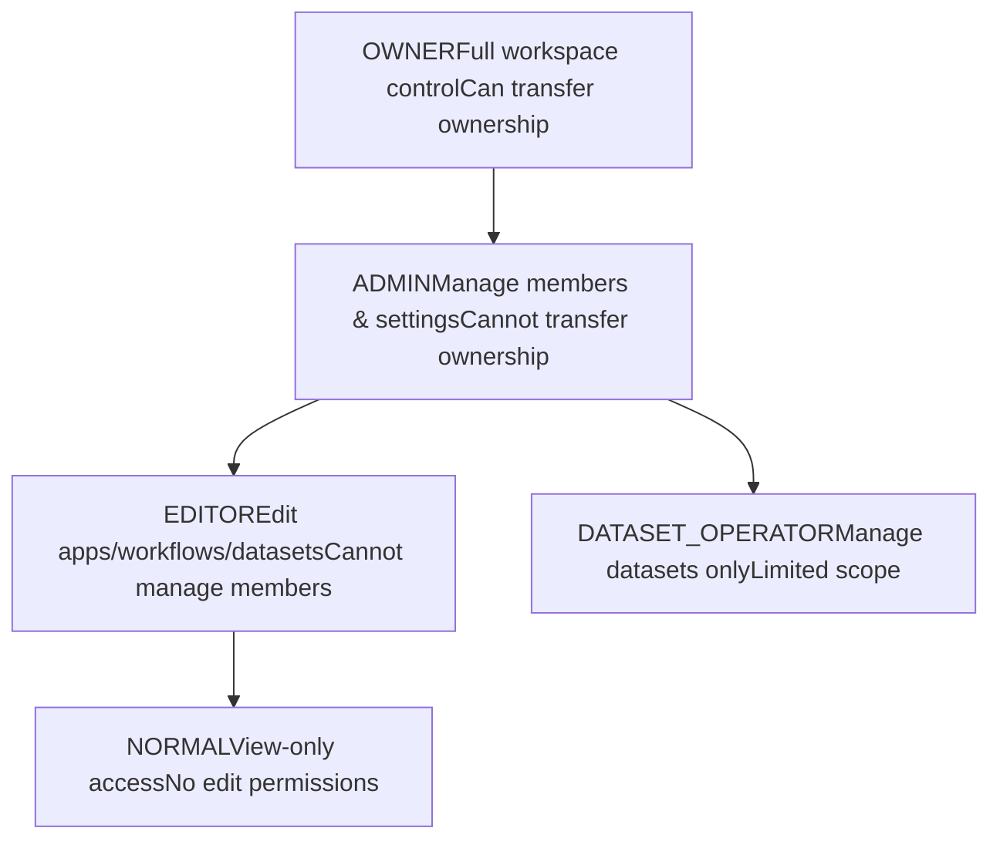
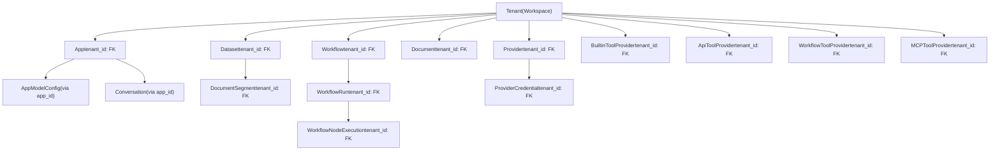

# Tenant and Account Models

Relevant source files

-   [api/controllers/console/\_\_init\_\_.py](https://github.com/langgenius/dify/blob/92dbc94f/api/controllers/console/__init__.py)
-   [api/controllers/console/auth/activate.py](https://github.com/langgenius/dify/blob/92dbc94f/api/controllers/console/auth/activate.py)
-   [api/controllers/console/auth/email\_register.py](https://github.com/langgenius/dify/blob/92dbc94f/api/controllers/console/auth/email_register.py)
-   [api/controllers/console/auth/error.py](https://github.com/langgenius/dify/blob/92dbc94f/api/controllers/console/auth/error.py)
-   [api/controllers/console/auth/forgot\_password.py](https://github.com/langgenius/dify/blob/92dbc94f/api/controllers/console/auth/forgot_password.py)
-   [api/controllers/console/auth/login.py](https://github.com/langgenius/dify/blob/92dbc94f/api/controllers/console/auth/login.py)
-   [api/controllers/console/auth/oauth.py](https://github.com/langgenius/dify/blob/92dbc94f/api/controllers/console/auth/oauth.py)
-   [api/controllers/console/billing/billing.py](https://github.com/langgenius/dify/blob/92dbc94f/api/controllers/console/billing/billing.py)
-   [api/controllers/console/billing/compliance.py](https://github.com/langgenius/dify/blob/92dbc94f/api/controllers/console/billing/compliance.py)
-   [api/controllers/console/error.py](https://github.com/langgenius/dify/blob/92dbc94f/api/controllers/console/error.py)
-   [api/controllers/console/feature.py](https://github.com/langgenius/dify/blob/92dbc94f/api/controllers/console/feature.py)
-   [api/controllers/console/init\_validate.py](https://github.com/langgenius/dify/blob/92dbc94f/api/controllers/console/init_validate.py)
-   [api/controllers/console/setup.py](https://github.com/langgenius/dify/blob/92dbc94f/api/controllers/console/setup.py)
-   [api/controllers/console/version.py](https://github.com/langgenius/dify/blob/92dbc94f/api/controllers/console/version.py)
-   [api/controllers/console/workspace/account.py](https://github.com/langgenius/dify/blob/92dbc94f/api/controllers/console/workspace/account.py)
-   [api/controllers/console/workspace/agent\_providers.py](https://github.com/langgenius/dify/blob/92dbc94f/api/controllers/console/workspace/agent_providers.py)
-   [api/controllers/console/workspace/members.py](https://github.com/langgenius/dify/blob/92dbc94f/api/controllers/console/workspace/members.py)
-   [api/controllers/console/workspace/model\_providers.py](https://github.com/langgenius/dify/blob/92dbc94f/api/controllers/console/workspace/model_providers.py)
-   [api/controllers/console/workspace/models.py](https://github.com/langgenius/dify/blob/92dbc94f/api/controllers/console/workspace/models.py)
-   [api/controllers/console/workspace/workspace.py](https://github.com/langgenius/dify/blob/92dbc94f/api/controllers/console/workspace/workspace.py)
-   [api/controllers/console/wraps.py](https://github.com/langgenius/dify/blob/92dbc94f/api/controllers/console/wraps.py)
-   [api/controllers/service\_api/wraps.py](https://github.com/langgenius/dify/blob/92dbc94f/api/controllers/service_api/wraps.py)
-   [api/libs/encryption.py](https://github.com/langgenius/dify/blob/92dbc94f/api/libs/encryption.py)
-   [api/libs/workspace\_permission.py](https://github.com/langgenius/dify/blob/92dbc94f/api/libs/workspace_permission.py)
-   [api/models/account.py](https://github.com/langgenius/dify/blob/92dbc94f/api/models/account.py)
-   [api/models/api\_based\_extension.py](https://github.com/langgenius/dify/blob/92dbc94f/api/models/api_based_extension.py)
-   [api/models/dataset.py](https://github.com/langgenius/dify/blob/92dbc94f/api/models/dataset.py)
-   [api/models/model.py](https://github.com/langgenius/dify/blob/92dbc94f/api/models/model.py)
-   [api/models/oauth.py](https://github.com/langgenius/dify/blob/92dbc94f/api/models/oauth.py)
-   [api/models/provider.py](https://github.com/langgenius/dify/blob/92dbc94f/api/models/provider.py)
-   [api/models/source.py](https://github.com/langgenius/dify/blob/92dbc94f/api/models/source.py)
-   [api/models/task.py](https://github.com/langgenius/dify/blob/92dbc94f/api/models/task.py)
-   [api/models/tools.py](https://github.com/langgenius/dify/blob/92dbc94f/api/models/tools.py)
-   [api/models/trigger.py](https://github.com/langgenius/dify/blob/92dbc94f/api/models/trigger.py)
-   [api/models/web.py](https://github.com/langgenius/dify/blob/92dbc94f/api/models/web.py)
-   [api/models/workflow.py](https://github.com/langgenius/dify/blob/92dbc94f/api/models/workflow.py)
-   [api/services/account\_service.py](https://github.com/langgenius/dify/blob/92dbc94f/api/services/account_service.py)
-   [api/services/billing\_service.py](https://github.com/langgenius/dify/blob/92dbc94f/api/services/billing_service.py)
-   [api/services/enterprise/enterprise\_service.py](https://github.com/langgenius/dify/blob/92dbc94f/api/services/enterprise/enterprise_service.py)
-   [api/services/feature\_service.py](https://github.com/langgenius/dify/blob/92dbc94f/api/services/feature_service.py)
-   [api/services/operation\_service.py](https://github.com/langgenius/dify/blob/92dbc94f/api/services/operation_service.py)
-   [api/templates/change\_mail\_confirm\_old\_template\_zh-CN.html](https://github.com/langgenius/dify/blob/92dbc94f/api/templates/change_mail_confirm_old_template_zh-CN.html)
-   [api/templates/transfer\_workspace\_owner\_confirm\_template\_en-US.html](https://github.com/langgenius/dify/blob/92dbc94f/api/templates/transfer_workspace_owner_confirm_template_en-US.html)
-   [api/templates/without-brand/transfer\_workspace\_owner\_confirm\_template\_en-US.html](https://github.com/langgenius/dify/blob/92dbc94f/api/templates/without-brand/transfer_workspace_owner_confirm_template_en-US.html)
-   [api/tests/test\_containers\_integration\_tests/services/test\_advanced\_prompt\_template\_service.py](https://github.com/langgenius/dify/blob/92dbc94f/api/tests/test_containers_integration_tests/services/test_advanced_prompt_template_service.py)
-   [api/tests/test\_containers\_integration\_tests/services/test\_agent\_service.py](https://github.com/langgenius/dify/blob/92dbc94f/api/tests/test_containers_integration_tests/services/test_agent_service.py)
-   [api/tests/test\_containers\_integration\_tests/tasks/\_\_init\_\_.py](https://github.com/langgenius/dify/blob/92dbc94f/api/tests/test_containers_integration_tests/tasks/__init__.py)
-   [api/tests/test\_containers\_integration\_tests/tasks/test\_add\_document\_to\_index\_task.py](https://github.com/langgenius/dify/blob/92dbc94f/api/tests/test_containers_integration_tests/tasks/test_add_document_to_index_task.py)
-   [api/tests/unit\_tests/controllers/console/auth/test\_account\_activation.py](https://github.com/langgenius/dify/blob/92dbc94f/api/tests/unit_tests/controllers/console/auth/test_account_activation.py)
-   [api/tests/unit\_tests/controllers/console/auth/test\_authentication\_security.py](https://github.com/langgenius/dify/blob/92dbc94f/api/tests/unit_tests/controllers/console/auth/test_authentication_security.py)
-   [api/tests/unit\_tests/controllers/console/auth/test\_email\_verification.py](https://github.com/langgenius/dify/blob/92dbc94f/api/tests/unit_tests/controllers/console/auth/test_email_verification.py)
-   [api/tests/unit\_tests/controllers/console/auth/test\_login\_logout.py](https://github.com/langgenius/dify/blob/92dbc94f/api/tests/unit_tests/controllers/console/auth/test_login_logout.py)
-   [api/tests/unit\_tests/controllers/console/auth/test\_oauth.py](https://github.com/langgenius/dify/blob/92dbc94f/api/tests/unit_tests/controllers/console/auth/test_oauth.py)
-   [api/tests/unit\_tests/controllers/console/auth/test\_password\_reset.py](https://github.com/langgenius/dify/blob/92dbc94f/api/tests/unit_tests/controllers/console/auth/test_password_reset.py)
-   [api/tests/unit\_tests/controllers/console/auth/test\_token\_refresh.py](https://github.com/langgenius/dify/blob/92dbc94f/api/tests/unit_tests/controllers/console/auth/test_token_refresh.py)
-   [api/tests/unit\_tests/controllers/test\_compare\_versions.py](https://github.com/langgenius/dify/blob/92dbc94f/api/tests/unit_tests/controllers/test_compare_versions.py)
-   [api/tests/unit\_tests/core/test\_provider\_manager.py](https://github.com/langgenius/dify/blob/92dbc94f/api/tests/unit_tests/core/test_provider_manager.py)
-   [api/tests/unit\_tests/libs/test\_encryption.py](https://github.com/langgenius/dify/blob/92dbc94f/api/tests/unit_tests/libs/test_encryption.py)
-   [api/tests/unit\_tests/libs/test\_oauth\_clients.py](https://github.com/langgenius/dify/blob/92dbc94f/api/tests/unit_tests/libs/test_oauth_clients.py)
-   [api/tests/unit\_tests/libs/test\_workspace\_permission.py](https://github.com/langgenius/dify/blob/92dbc94f/api/tests/unit_tests/libs/test_workspace_permission.py)

This page documents the core data models that implement Dify's multi-tenancy architecture: `Account` (users), `Tenant` (workspaces), and `TenantAccountJoin` (membership relationships with roles). These models provide the foundation for workspace isolation and user management throughout the system.

For role-based permissions and access control details, see page 7.2. For API authentication and security mechanisms, see page 7.3.

## Purpose and Scope

This page documents the core data models that implement Dify's multi-tenancy architecture. The system uses three primary models:

-   **`Account`** - Individual user records with authentication credentials
-   **`Tenant`** - Workspace entities that serve as resource isolation boundaries
-   **`TenantAccountJoin`** - Many-to-many relationship mapping users to workspaces with role assignments

All major resources (apps, datasets, workflows, tools, providers) include a `tenant_id` foreign key to enforce workspace isolation. The page covers:

-   Data model definitions and relationships
-   Workspace membership and role hierarchy
-   Member management operations (invite, update role, remove)
-   Workspace switching and current workspace tracking
-   Ownership transfer workflow
-   Resource scoping patterns
-   Credential encryption per tenant

For detailed role-based permission checks and access control logic, see page 7.2. For authentication mechanisms including JWT tokens and OAuth, see page 7.3.

**Key Files:**

-   [api/models/account.py19-296](https://github.com/langgenius/dify/blob/92dbc94f/api/models/account.py#L19-L296) - `Account`, `Tenant`, `TenantAccountJoin`, `TenantAccountRole` models
-   [api/services/account\_service.py860-1318](https://github.com/langgenius/dify/blob/92dbc94f/api/services/account_service.py#L860-L1318) - `TenantService` and `RegisterService` implementations </old\_str>

<old\_str>

## Current Workspace Tracking

The `TenantAccountJoin.current` boolean flag tracks each user's active workspace. At most one join record per user has `current=True`.

**On Login:**

1.  `AccountService.load_user()` queries for `current=True` join
2.  If found, loads that tenant and role into `Account` object
3.  If not found, selects first available workspace and marks it current
4.  Updates `Account.last_active_at` every 10 minutes

**Workspace Switch Flow:**

1.  Validate user is member of target workspace
2.  Set all user's joins to `current=False`
3.  Set target join to `current=True`
4.  Commit transaction atomically

**Implementation:**

```
# In AccountService.load_user()
current_tenant = db.session.query(TenantAccountJoin)\
    .filter_by(account_id=account.id, current=True)\
    .first()

if current_tenant:
    account.set_tenant_id(current_tenant.tenant_id)
else:
    # Auto-select first workspace
    available_ta = db.session.query(TenantAccountJoin)\
        .filter_by(account_id=account.id)\
        .order_by(TenantAccountJoin.id.asc())\
        .first()
    if available_ta:
        account.set_tenant_id(available_ta.tenant_id)
        available_ta.current = True
        db.session.commit()
```
Sources: [api/services/account\_service.py126-159](https://github.com/langgenius/dify/blob/92dbc94f/api/services/account_service.py#L126-L159) [api/models/account.py124-174](https://github.com/langgenius/dify/blob/92dbc94f/api/models/account.py#L124-L174)

---

## Database Schema

### Entity Relationship Diagram


**Diagram: Multi-Tenancy Core Schema**

Sources: [api/models/account.py87-325](https://github.com/langgenius/dify/blob/92dbc94f/api/models/account.py#L87-L325) [api/models/model.py78-143](https://github.com/langgenius/dify/blob/92dbc94f/api/models/model.py#L78-L143) [api/models/dataset.py44-78](https://github.com/langgenius/dify/blob/92dbc94f/api/models/dataset.py#L44-L78) [api/models/workflow.py100-140](https://github.com/langgenius/dify/blob/92dbc94f/api/models/workflow.py#L100-L140) [api/models/provider.py49-88](https://github.com/langgenius/dify/blob/92dbc94f/api/models/provider.py#L49-L88)

---

### Table Definitions

**`accounts`** [api/models/account.py87-235](https://github.com/langgenius/dify/blob/92dbc94f/api/models/account.py#L87-L235)

-   **Primary key:** `id` (StringUUID)
-   **Unique:** `email`
-   **Indexes:** `account_email_idx` on `email`
-   **Key columns:**
    -   `email` - Authentication identifier
    -   `password` - Hashed password (nullable for OAuth users)
    -   `password_salt` - Password salt
    -   `status` - `pending`, `uninitialized`, `active`, `banned`, `closed`
    -   `last_login_at`, `last_login_ip` - Login tracking
    -   `last_active_at` - Updated every 10 minutes during session

**`tenants`** [api/models/account.py242-277](https://github.com/langgenius/dify/blob/92dbc94f/api/models/account.py#L242-L277)

-   **Primary key:** `id` (StringUUID)
-   **No unique constraints** - Multiple workspaces can have identical names
-   **Key columns:**
    -   `name` - Workspace display name
    -   `plan` - Subscription plan (default: `'basic'`)
    -   `status` - `normal` or `archive`
    -   `encrypt_public_key` - RSA public key for encrypting tenant credentials
    -   `custom_config` - JSON configuration blob

**`tenant_account_joins`** [api/models/account.py279-301](https://github.com/langgenius/dify/blob/92dbc94f/api/models/account.py#L279-L301)

-   **Primary key:** `id` (StringUUID)
-   **Unique:** `(tenant_id, account_id)` via `unique_tenant_account_join`
-   **Indexes:**
    -   `tenant_account_join_account_id_idx` on `account_id`
    -   `tenant_account_join_tenant_id_idx` on `tenant_id`
-   **Foreign keys:**
    -   `tenant_id` → `tenants.id`
    -   `account_id` → `accounts.id`
    -   `invited_by` → `accounts.id` (nullable)
-   **Key columns:**
    -   `role` - `owner`, `admin`, `editor`, `normal`, `dataset_operator`
    -   `current` - Boolean flag for active workspace (one per user)
    -   `invited_by` - Account ID of inviter (nullable)

**`account_integrates`** [api/models/account.py304-325](https://github.com/langgenius/dify/blob/92dbc94f/api/models/account.py#L304-L325)

-   **Primary key:** `id` (StringUUID)
-   **Unique constraints:**
    -   `(account_id, provider)` via `unique_account_provider`
    -   `(provider, open_id)` via `unique_provider_open_id`
-   **Purpose:** Links OAuth provider accounts (GitHub, Google) to Dify accounts

### Tenant-Scoped Resource Tables

All major resource tables enforce workspace isolation via `tenant_id`:

| Table | Tenant Index | Model Location |
| --- | --- | --- |
| `apps` | `app_tenant_id_idx` | [api/models/model.py78-143](https://github.com/langgenius/dify/blob/92dbc94f/api/models/model.py#L78-L143) |
| `datasets` | `dataset_tenant_idx` | [api/models/dataset.py44-78](https://github.com/langgenius/dify/blob/92dbc94f/api/models/dataset.py#L44-L78) |
| `documents` | `document_tenant_idx` | [api/models/dataset.py353-422](https://github.com/langgenius/dify/blob/92dbc94f/api/models/dataset.py#L353-L422) |
| `document_segments` | (composite) | [api/models/dataset.py643-746](https://github.com/langgenius/dify/blob/92dbc94f/api/models/dataset.py#L643-L746) |
| `workflows` | `workflow_version_idx` (includes `tenant_id`) | [api/models/workflow.py100-140](https://github.com/langgenius/dify/blob/92dbc94f/api/models/workflow.py#L100-L140) |
| `workflow_runs` | `workflow_run_triggerd_from_idx` (includes `tenant_id`) | [api/models/workflow.py556-620](https://github.com/langgenius/dify/blob/92dbc94f/api/models/workflow.py#L556-L620) |
| `tool_builtin_providers` | `unique_builtin_tool_provider` (composite) | [api/models/tools.py68-112](https://github.com/langgenius/dify/blob/92dbc94f/api/models/tools.py#L68-L112) |
| `tool_api_providers` | `unique_api_tool_provider` (composite) | [api/models/tools.py120-169](https://github.com/langgenius/dify/blob/92dbc94f/api/models/tools.py#L120-L169) |
| `tool_workflow_providers` | `unique_workflow_tool_provider` (composite) | [api/models/tools.py216-260](https://github.com/langgenius/dify/blob/92dbc94f/api/models/tools.py#L216-L260) |
| `providers` | `provider_tenant_id_provider_idx` | [api/models/provider.py49-88](https://github.com/langgenius/dify/blob/92dbc94f/api/models/provider.py#L49-L88) |
| `provider_credentials` | `provider_credential_tenant_id_idx` | [api/models/provider.py128-188](https://github.com/langgenius/dify/blob/92dbc94f/api/models/provider.py#L128-L188) |

Sources: [api/models/account.py87-325](https://github.com/langgenius/dify/blob/92dbc94f/api/models/account.py#L87-L325) [api/models/model.py78](https://github.com/langgenius/dify/blob/92dbc94f/api/models/model.py#L78-L78) [api/models/dataset.py44-746](https://github.com/langgenius/dify/blob/92dbc94f/api/models/dataset.py#L44-L746) [api/models/workflow.py100-620](https://github.com/langgenius/dify/blob/92dbc94f/api/models/workflow.py#L100-L620) [api/models/tools.py68-260](https://github.com/langgenius/dify/blob/92dbc94f/api/models/tools.py#L68-L260) [api/models/provider.py49-188](https://github.com/langgenius/dify/blob/92dbc94f/api/models/provider.py#L49-L188) </old\_str> <new\_str>

## TenantAccountRole Enum

The `TenantAccountRole` enum [api/models/account.py19-77](https://github.com/langgenius/dify/blob/92dbc94f/api/models/account.py#L19-L77) defines five hierarchical roles stored in `tenant_account_joins.role`:

| Role | String Value | Capabilities |
| --- | --- | --- |
| **OWNER** | `"owner"` | Full workspace control, ownership transfer, member management, all edit permissions |
| **ADMIN** | `"admin"` | Member management (except owner), settings, all edit permissions |
| **EDITOR** | `"editor"` | Create/edit apps, workflows, datasets (no member management) |
| **NORMAL** | `"normal"` | View-only access to workspace resources |
| **DATASET\_OPERATOR** | `"dataset_operator"` | Specialized role for dataset management only |

### Static Validation Methods

```
class TenantAccountRole(enum.StrEnum):
    @staticmethod
    def is_privileged_role(role) -> bool
        # Returns True for OWNER or ADMIN

    @staticmethod
    def is_editing_role(role) -> bool
        # Returns True for OWNER, ADMIN, or EDITOR

    @staticmethod
    def is_dataset_edit_role(role) -> bool
        # Returns True for OWNER, ADMIN, EDITOR, or DATASET_OPERATOR

    @staticmethod
    def is_non_owner_role(role) -> bool
        # Returns True for all roles except OWNER (used in invitations)
```
These methods are used throughout the codebase for permission checks. See page 7.2 for detailed access control implementation.

Sources: [api/models/account.py19-77](https://github.com/langgenius/dify/blob/92dbc94f/api/models/account.py#L19-L77) </old\_str>

<old\_str>

## Role-Based Access Control

### Permission Hierarchy


**Diagram: Role Permission Hierarchy**

Sources: [api/models/account.py19-77](https://github.com/langgenius/dify/blob/92dbc94f/api/models/account.py#L19-L77)

---

### Permission Check Implementation

Controllers use decorators and inline checks to enforce role-based permissions:

**Decorator-Based Checks:**

```
@login_required
@account_initialization_required
def post(self):
    current_user, _ = current_account_with_tenant()
    if not current_user.is_admin_or_owner:
        raise Forbidden()
    # Perform privileged operation
```
**Service-Layer Enforcement:**

The `TenantService` class in `AccountService` enforces permissions when modifying membership:

```
@staticmethod
def update_member_role(tenant, member, new_role, operator):
    # Check if operator has permission
    operator_join = get_tenant_account_join(tenant.id, operator.id)
    if operator_join.role not in ['owner', 'admin']:
        raise NoPermissionError()

    # Prevent non-owners from changing owner role
    member_join = get_tenant_account_join(tenant.id, member.id)
    if member_join.role == 'owner' and operator_join.role != 'owner':
        raise NoPermissionError()
```
Sources: [api/services/account\_service.py1034-1129](https://github.com/langgenius/dify/blob/92dbc94f/api/services/account_service.py#L1034-L1129) [api/controllers/console/workspace/members.py152-182](https://github.com/langgenius/dify/blob/92dbc94f/api/controllers/console/workspace/members.py#L152-L182)

---

### Role-Specific Capabilities

| Capability | Owner | Admin | Editor | Dataset Operator | Normal |
| --- | --- | --- | --- | --- | --- |
| Transfer ownership | ✓ | ✗ | ✗ | ✗ | ✗ |
| Add/remove members | ✓ | ✓ | ✗ | ✗ | ✗ |
| Change member roles | ✓ | ✓ (non-owners) | ✗ | ✗ | ✗ |
| Configure workspace settings | ✓ | ✓ | ✗ | ✗ | ✗ |
| Create/edit apps | ✓ | ✓ | ✓ | ✗ | ✗ |
| Create/edit workflows | ✓ | ✓ | ✓ | ✗ | ✗ |
| Create/edit datasets | ✓ | ✓ | ✓ | ✓ | ✗ |
| View resources | ✓ | ✓ | ✓ | ✓ | ✓ |

Sources: [api/models/account.py38-77](https://github.com/langgenius/dify/blob/92dbc94f/api/models/account.py#L38-L77)

---

## TenantService Operations

The `TenantService` class provides workspace management. It is implemented as a nested class within `AccountService` at [api/services/account\_service.py860-1318](https://github.com/langgenius/dify/blob/92dbc94f/api/services/account_service.py#L860-L1318)

### Creating Workspaces

> **[Mermaid sequence]**
> *(图表结构无法解析)*

**Diagram: Workspace Creation Flow with Event System**

**Implementation in TenantService:**

```
@staticmethod
def create_tenant(name: str) -> Tenant:
    """Create new tenant with default plan and status."""
    tenant = Tenant(name=name)
    db.session.add(tenant)
    db.session.commit()
    return tenant

@staticmethod
def create_tenant_member(tenant: Tenant, account: Account, role: str = 'normal') -> TenantAccountJoin:
    """Add account to tenant with specified role."""
    ta = TenantAccountJoin(
        tenant_id=tenant.id,
        account_id=account.id,
        role=role,
        current=True
    )
    db.session.add(ta)
    db.session.commit()
    return ta

@staticmethod
def create_owner_tenant_if_not_exist(account: Account) -> Tenant:
    """Create default workspace for new account if none exists."""
    available_ta = db.session.query(TenantAccountJoin)\
        .filter_by(account_id=account.id)\
        .first()

    if available_ta:
        return db.session.query(Tenant)\
            .where(Tenant.id == available_ta.tenant_id)\
            .first()

    # Create new tenant
    tenant = TenantService.create_tenant(f"{account.name}'s Workspace")
    TenantService.create_tenant_member(tenant, account, role='owner')
    account.current_tenant = tenant

    tenant_was_created.send(tenant)
    return tenant
```
Sources: [api/services/account\_service.py860-911](https://github.com/langgenius/dify/blob/92dbc94f/api/services/account_service.py#L860-L911) [api/controllers/console/workspace/workspace.py97-148](https://github.com/langgenius/dify/blob/92dbc94f/api/controllers/console/workspace/workspace.py#L97-L148)

---

### Switching Workspaces

Users switch between workspaces by updating the `current` flag in `TenantAccountJoin`. Only one workspace can be `current=true` per user at a time.

**Endpoint:** `POST /console/api/workspaces/switch`

**Request Body:** `{"tenant_id": "<uuid>"}`

**Implementation Flow:**

> **[Mermaid sequence]**
> *(图表结构无法解析)*

**Diagram: Workspace Switching Transaction**

**TenantService.switch\_tenant() Implementation:**

```
@staticmethod
def switch_tenant(account: Account, tenant_id: str):
    """Switch user's current workspace."""
    # Verify membership
    tenant_account_join = db.session.query(TenantAccountJoin)\
        .filter_by(account_id=account.id, tenant_id=tenant_id)\
        .first()

    if not tenant_account_join:
        raise AccountNotLinkTenantError('Tenant not found for user.')

    # Clear all current flags
    db.session.query(TenantAccountJoin)\
        .filter_by(account_id=account.id)\
        .update({'current': False})

    # Set new current
    tenant_account_join.current = True
    db.session.commit()
```
**Controller Implementation:**

```
class SwitchWorkspaceApi(Resource):
    @console_ns.expect(console_ns.models['SwitchWorkspacePayload'])
    @setup_required
    @login_required
    @account_initialization_required
    def post(self):
        current_user, _ = current_account_with_tenant()
        args = SwitchWorkspacePayload.model_validate(console_ns.payload)

        try:
            TenantService.switch_tenant(current_user, args.tenant_id)
        except Exception:
            raise AccountNotLinkTenantError("Account not link tenant")

        new_tenant = db.session.query(Tenant).get(args.tenant_id)
        return {"result": "success", "new_tenant": marshal(...)}
```
Sources: [api/services/account\_service.py913-970](https://github.com/langgenius/dify/blob/92dbc94f/api/services/account_service.py#L913-L970) [api/controllers/console/workspace/workspace.py179-201](https://github.com/langgenius/dify/blob/92dbc94f/api/controllers/console/workspace/workspace.py#L179-L201)

---

## Member Management

### Inviting Members

Member invitations use token-based email verification. The workflow handles both new users and existing accounts.

**Endpoint:** `POST /console/api/workspaces/current/members/invite-email`

**Request Body:**

```
{
  "emails": ["user@example.com"],
  "role": "editor",
  "language": "en-US"
}
```
**Flow:**

> **[Mermaid sequence]**
> *(图表结构无法解析)*

**Diagram: Member Invitation Workflow with Token Flow**

**RegisterService.invite\_new\_member() Implementation:**

```
@staticmethod
def invite_new_member(
    tenant: Tenant,
    email: str,
    language: str,
    role: str = 'normal',
    inviter: Account | None = None
) -> str:
    """Generate invitation token and send email."""
    # Check if account exists
    account = db.session.query(Account).filter_by(email=email).first()

    if account:
        # Check existing membership
        existing_join = db.session.query(TenantAccountJoin)\
            .filter_by(tenant_id=tenant.id, account_id=account.id)\
            .first()
        if existing_join:
            raise AccountAlreadyInTenantError(
                'The account has already joined the workspace.'
            )

    # Generate token with invitation data
    token = TokenManager.generate_token(
        email=email,
        token_type='invitation',
        additional_data={
            'tenant_id': tenant.id,
            'role': role,
            'inviter_id': inviter.id if inviter else None
        }
    )

    # Queue email task
    send_invite_member_mail_task.delay(
        language=language,
        to=email,
        token=token,
        inviter_name=inviter.name if inviter else None,
        workspace_name=tenant.name
    )

    return token
```
**Controller with Billing Check:**

```
class MemberInviteEmailApi(Resource):
    @console_ns.expect(console_ns.models['MemberInvitePayload'])
    @setup_required
    @login_required
    @account_initialization_required
    @cloud_edition_billing_resource_check("members")  # Check workspace member limit
    def post(self):
        args = MemberInvitePayload.model_validate(console_ns.payload)
        current_user, _ = current_account_with_tenant()

        # Validate role
        if not TenantAccountRole.is_non_owner_role(args.role):
            return {"code": "invalid-role"}, 400

        # Check member limit
        workspace_members = FeatureService.get_features(
            tenant_id=current_user.current_tenant.id
        ).workspace_members

        if not workspace_members.is_available(len(args.emails)):
            raise WorkspaceMembersLimitExceeded()

        # Process invitations
        invitation_results = []
        for email in args.emails:
            try:
                token = RegisterService.invite_new_member(
                    current_user.current_tenant, email, args.language,
                    role=args.role, inviter=current_user
                )
                invitation_results.append({
                    "status": "success",
                    "email": email,
                    "url": f"{console_web_url}/activate?email={email}&token={token}"
                })
            except AccountAlreadyInTenantError:
                invitation_results.append({"status": "success", "email": email})
            except Exception as e:
                invitation_results.append({"status": "failed", "email": email})

        return {"result": "success", "invitation_results": invitation_results}, 201
```
Sources: [api/services/account\_service.py1221-1318](https://github.com/langgenius/dify/blob/92dbc94f/api/services/account_service.py#L1221-L1318) [api/controllers/console/workspace/members.py88-145](https://github.com/langgenius/dify/blob/92dbc94f/api/controllers/console/workspace/members.py#L88-L145)

---

### Updating Member Roles

**Endpoint:** `PUT /console/api/workspaces/current/members/<member_id>/update-role`

**Request Body:** `{"role": "editor"}`

**Validation Rules:**

-   Only `OWNER` and `ADMIN` can update roles
-   Non-owners cannot modify `OWNER` role
-   Cannot assign `OWNER` role (use ownership transfer instead)
-   Cannot modify your own role
-   Role must be valid: `admin`, `editor`, `normal`, or `dataset_operator`

**TenantService.update\_member\_role() Implementation:**

```
@staticmethod
def update_member_role(
    tenant: Tenant,
    member: Account,
    new_role: str,
    operator: Account
):
    """Update member's role with permission checks."""
    # Get operator's join record
    operator_join = db.session.query(TenantAccountJoin)\
        .filter_by(tenant_id=tenant.id, account_id=operator.id)\
        .first()

    if not operator_join or operator_join.role not in ['owner', 'admin']:
        raise NoPermissionError('Only owners and admins can update roles')

    # Prevent self-modification
    if member.id == operator.id:
        raise CannotOperateSelfError()

    # Get member's join record
    member_join = db.session.query(TenantAccountJoin)\
        .filter_by(tenant_id=tenant.id, account_id=member.id)\
        .first()

    if not member_join:
        raise MemberNotInTenantError()

    # Prevent non-owners from modifying owner
    if member_join.role == 'owner' and operator_join.role != 'owner':
        raise NoPermissionError('Only owner can modify owner role')

    # Prevent assigning owner role (use transfer_ownership instead)
    if new_role == 'owner':
        raise InvalidActionError('Use ownership transfer to assign owner role')

    # Check if role is already assigned
    if member_join.role == new_role:
        raise RoleAlreadyAssignedError()

    # Update role
    member_join.role = new_role
    db.session.commit()
```
**Controller Implementation:**

```
class MemberUpdateRoleApi(Resource):
    @console_ns.expect(console_ns.models['MemberRoleUpdatePayload'])
    @setup_required
    @login_required
    @account_initialization_required
    def put(self, member_id):
        args = MemberRoleUpdatePayload.model_validate(console_ns.payload)

        # Validate role
        if not TenantAccountRole.is_valid_role(args.role):
            return {"code": "invalid-role", "message": "Invalid role"}, 400

        current_user, _ = current_account_with_tenant()
        member = db.session.get(Account, str(member_id))

        if not member:
            abort(404)

        try:
            TenantService.update_member_role(
                current_user.current_tenant,
                member,
                args.role,
                current_user
            )
        except Exception as e:
            raise ValueError(str(e))

        return {"result": "success"}
```
Sources: [api/services/account\_service.py1034-1129](https://github.com/langgenius/dify/blob/92dbc94f/api/services/account_service.py#L1034-L1129) [api/controllers/console/workspace/members.py179-210](https://github.com/langgenius/dify/blob/92dbc94f/api/controllers/console/workspace/members.py#L179-L210)

---

### Removing Members

**Endpoint:** `DELETE /console/api/workspaces/current/members/<member_id>`

**Rules:**

-   Only `OWNER` and `ADMIN` can remove members
-   Cannot remove yourself
-   Cannot remove the workspace owner
-   Removing a member deletes their `TenantAccountJoin` record

**TenantService.remove\_member\_from\_tenant() Implementation:**

```
@staticmethod
def remove_member_from_tenant(
    tenant: Tenant,
    member: Account,
    operator: Account
):
    """Remove member from workspace."""
    # Get operator's join record
    operator_join = db.session.query(TenantAccountJoin)\
        .filter_by(tenant_id=tenant.id, account_id=operator.id)\
        .first()

    if not operator_join or operator_join.role not in ['owner', 'admin']:
        raise NoPermissionError('Only owners and admins can remove members')

    # Prevent self-removal
    if member.id == operator.id:
        raise CannotOperateSelfError('Cannot remove yourself')

    # Get member's join record
    member_join = db.session.query(TenantAccountJoin)\
        .filter_by(tenant_id=tenant.id, account_id=member.id)\
        .first()

    if not member_join:
        raise MemberNotInTenantError('Member not found in workspace')

    # Prevent removing owner
    if member_join.role == 'owner':
        raise NoPermissionError('Cannot remove workspace owner')

    # Delete join record (cascades will handle related data)
    db.session.delete(member_join)
    db.session.commit()
```
**Controller Implementation:**

```
class MemberCancelInviteApi(Resource):
    @setup_required
    @login_required
    @account_initialization_required
    def delete(self, member_id):
        current_user, _ = current_account_with_tenant()
        member = db.session.query(Account).where(Account.id == str(member_id)).first()

        if member is None:
            abort(404)

        try:
            TenantService.remove_member_from_tenant(
                current_user.current_tenant,
                member,
                current_user
            )
        except services.errors.account.CannotOperateSelfError as e:
            return {"code": "cannot-operate-self", "message": str(e)}, 400
        except services.errors.account.NoPermissionError as e:
            return {"code": "forbidden", "message": str(e)}, 403
        except services.errors.account.MemberNotInTenantError as e:
            return {"code": "member-not-found", "message": str(e)}, 404
        except Exception as e:
            raise ValueError(str(e))

        return {"result": "success", "tenant_id": current_user.current_tenant.id}, 200
```
Sources: [api/services/account\_service.py972-1032](https://github.com/langgenius/dify/blob/92dbc94f/api/services/account_service.py#L972-L1032) [api/controllers/console/workspace/members.py148-177](https://github.com/langgenius/dify/blob/92dbc94f/api/controllers/console/workspace/members.py#L148-L177)

---

## Ownership Transfer

Ownership transfer uses a three-step verification process to prevent accidental transfers:

1.  **Request:** Owner requests email verification code
2.  **Verify:** Owner enters 6-digit code to get verified token
3.  **Transfer:** Owner submits verified token with new owner's ID

> **[Mermaid sequence]**
> *(图表结构无法解析)*

**Diagram: Three-Step Ownership Transfer with Token Verification**

Sources: [api/services/account\_service.py1131-1219](https://github.com/langgenius/dify/blob/92dbc94f/api/services/account_service.py#L1131-L1219) [api/controllers/console/workspace/members.py228-366](https://github.com/langgenius/dify/blob/92dbc94f/api/controllers/console/workspace/members.py#L228-L366)

---

### Phase 1: Request Verification Code

**Endpoint:** `POST /console/api/workspaces/current/members/send-owner-transfer-confirm-email`

**Request Body:** `{"language": "en-US"}`

The owner requests a 6-digit verification code sent to their email:

**AccountService.send\_owner\_transfer\_email() Implementation:**

```
@classmethod
def send_owner_transfer_email(
    cls,
    account: Account | None = None,
    email: str | None = None,
    language: str = "en-US",
    workspace_name: str | None = ""
) -> str:
    """Generate verification code and send email."""
    account_email = account.email if account else email
    if account_email is None:
        raise ValueError("Email must be provided.")

    # Rate limiting: 1 request per 60 seconds
    if cls.owner_transfer_rate_limiter.is_rate_limited(account_email):
        raise OwnerTransferRateLimitExceededError(
            int(cls.owner_transfer_rate_limiter.time_window / 60)
        )

    # Generate 6-digit code
    code, token = cls.generate_owner_transfer_token(account_email, account)

    # Queue email task
    send_owner_transfer_confirm_task.delay(
        language=language,
        to=account_email,
        code=code,
        workspace=workspace_name or ""
    )

    cls.owner_transfer_rate_limiter.increment_rate_limit(account_email)
    return token

@classmethod
def generate_owner_transfer_token(
    cls,
    email: str,
    account: Account | None = None,
    code: str | None = None,
    additional_data: dict[str, Any] = {}
) -> tuple[str, str]:
    """Generate token with embedded verification code."""
    if not code:
        code = ''.join([str(secrets.randbelow(10)) for _ in range(6)])

    additional_data['code'] = code
    token = TokenManager.generate_token(
        account=account,
        email=email,
        token_type='owner_transfer',
        additional_data=additional_data
    )
    return code, token
```
**Controller Implementation:**

```
class SendOwnerTransferEmailApi(Resource):
    @console_ns.expect(console_ns.models['OwnerTransferEmailPayload'])
    @setup_required
    @login_required
    @account_initialization_required
    @is_allow_transfer_owner  # Checks feature flag
    def post(self):
        args = OwnerTransferEmailPayload.model_validate(console_ns.payload)

        # Check IP-based rate limiting
        ip_address = extract_remote_ip(request)
        if AccountService.is_email_send_ip_limit(ip_address):
            raise EmailSendIpLimitError()

        current_user, _ = current_account_with_tenant()

        # Verify current user is owner
        if not TenantService.is_owner(current_user, current_user.current_tenant):
            raise NotOwnerError()

        # Send verification email
        token = AccountService.send_owner_transfer_email(
            account=current_user,
            email=current_user.email,
            language=args.language or "en-US",
            workspace_name=current_user.current_tenant.name
        )

        return {"result": "success", "data": token}
```
Sources: [api/services/account\_service.py560-690](https://github.com/langgenius/dify/blob/92dbc94f/api/services/account_service.py#L560-L690) [api/controllers/console/workspace/members.py228-265](https://github.com/langgenius/dify/blob/92dbc94f/api/controllers/console/workspace/members.py#L228-L265)

---

### Phase 2: Verify Code

**Endpoint:** `POST /console/api/workspaces/current/members/owner-transfer-check`

**Request Body:** `{"code": "123456", "token": "token_from_phase1"}`

The owner verifies the code to receive a validated token:

```
class OwnerTransferCheckApi(Resource):
    @console_ns.expect(console_ns.models['OwnerTransferCheckPayload'])
    @setup_required
    @login_required
    @account_initialization_required
    @is_allow_transfer_owner
    def post(self):
        args = OwnerTransferCheckPayload.model_validate(console_ns.payload)
        current_user, _ = current_account_with_tenant()

        # Verify owner
        if not TenantService.is_owner(current_user, current_user.current_tenant):
            raise NotOwnerError()

        user_email = current_user.email

        # Check error rate limit (max 5 attempts)
        if AccountService.is_owner_transfer_error_rate_limit(user_email):
            raise OwnerTransferLimitError()

        # Verify token and code
        token_data = AccountService.get_owner_transfer_data(args.token)
        if token_data is None:
            raise InvalidTokenError()

        if user_email != token_data.get('email'):
            raise InvalidEmailError()

        if args.code != token_data.get('code'):
            AccountService.add_owner_transfer_error_rate_limit(user_email)
            raise EmailCodeError()

        # Code is valid - revoke old token and generate new verified token
        AccountService.revoke_owner_transfer_token(args.token)
        _, new_token = AccountService.generate_owner_transfer_token(
            user_email, code=args.code, additional_data={}
        )

        AccountService.reset_owner_transfer_error_rate_limit(user_email)
        return {
            "is_valid": True,
            "email": token_data.get('email'),
            "token": new_token
        }
```
Sources: [api/controllers/console/workspace/members.py267-309](https://github.com/langgenius/dify/blob/92dbc94f/api/controllers/console/workspace/members.py#L267-L309)

---

### Phase 3: Execute Transfer

**Endpoint:** `POST /console/api/workspaces/current/members/<member_id>/owner-transfer`

**Request Body:** `{"token": "verified_token_from_phase2"}`

The owner completes the transfer with the verified token:

**Controller Implementation:**

```
class OwnerTransfer(Resource):
    @console_ns.expect(console_ns.models['OwnerTransferPayload'])
    @setup_required
    @login_required
    @account_initialization_required
    @is_allow_transfer_owner
    def post(self, member_id):
        args = OwnerTransferPayload.model_validate(console_ns.payload)
        current_user, _ = current_account_with_tenant()

        # Verify owner
        if not TenantService.is_owner(current_user, current_user.current_tenant):
            raise NotOwnerError()

        # Cannot transfer to self
        if current_user.id == str(member_id):
            raise CannotTransferOwnerToSelfError()

        # Verify token
        transfer_token_data = AccountService.get_owner_transfer_data(args.token)
        if not transfer_token_data:
            raise InvalidTokenError()

        if transfer_token_data.get('email') != current_user.email:
            raise InvalidEmailError()

        # Revoke token (single use)
        AccountService.revoke_owner_transfer_token(args.token)

        # Get new owner
        member = db.session.get(Account, str(member_id))
        if not member:
            abort(404)

        # Verify new owner is member
        if not TenantService.is_member(member, current_user.current_tenant):
            raise MemberNotInTenantError()

        # Execute transfer
        TenantService.update_member_role(
            current_user.current_tenant,
            member,
            'owner',
            current_user
        )

        # Send notifications
        AccountService.send_new_owner_transfer_notify_email(
            account=member,
            email=member.email,
            workspace_name=current_user.current_tenant.name
        )

        AccountService.send_old_owner_transfer_notify_email(
            account=current_user,
            email=current_user.email,
            workspace_name=current_user.current_tenant.name,
            new_owner_email=member.email
        )

        return {"result": "success"}
```
**TenantService - Special Handling for Owner Role:**

The `update_member_role()` method allows changing to `owner` role during transfers, despite the normal restriction. The atomic database transaction ensures consistency:

```
# In update_member_role() when new_role == 'owner':
# 1. Find current owner
current_owner_join = db.session.query(TenantAccountJoin)\
    .filter_by(tenant_id=tenant.id, role='owner')\
    .first()

# 2. Atomic update (transaction)
if current_owner_join:
    current_owner_join.role = 'admin'  # Downgrade old owner

member_join.role = 'owner'  # Upgrade new owner
db.session.commit()
```
Sources: [api/services/account\_service.py1131-1219](https://github.com/langgenius/dify/blob/92dbc94f/api/services/account_service.py#L1131-L1219) [api/controllers/console/workspace/members.py311-366](https://github.com/langgenius/dify/blob/92dbc94f/api/controllers/console/workspace/members.py#L311-L366)

---

## Core Data Models

### Entity Relationship Overview

The multi-tenancy system uses three primary models: `Account` (users), `Tenant` (workspaces), and `TenantAccountJoin` (membership with roles). All major resources reference `tenant_id` for workspace isolation.

**Diagram: Multi-Tenancy Database Schema**

Sources: [api/models/account.py87-295](https://github.com/langgenius/dify/blob/92dbc94f/api/models/account.py#L87-L295) [api/models/model.py75-313](https://github.com/langgenius/dify/blob/92dbc94f/api/models/model.py#L75-L313) [api/models/dataset.py44-311](https://github.com/langgenius/dify/blob/92dbc94f/api/models/dataset.py#L44-L311) [api/models/workflow.py100-201](https://github.com/langgenius/dify/blob/92dbc94f/api/models/workflow.py#L100-L201) [api/models/tools.py66-367](https://github.com/langgenius/dify/blob/92dbc94f/api/models/tools.py#L66-L367)

---

### Account Model

The `Account` model represents individual users. The class extends `UserMixin` for Flask-Login integration and `TypeBase` for SQLAlchemy dataclass support.

**Table:** `accounts`

**Key Columns:**

-   **`id`**: `StringUUID`, primary key
-   **`email`**: `String(255)`, indexed, unique identifier for authentication
-   **`password`**: `String(255)`, nullable (OAuth users may not have password)
-   **`password_salt`**: `String(255)`, nullable
-   **`status`**: `String(16)`, values: `pending`, `uninitialized`, `active`, `banned`, `closed`
-   **`last_login_at`**: `DateTime`, nullable
-   **`last_active_at`**: `DateTime`, auto-updated every 10 minutes

**Runtime Properties (not stored):**

-   **`role`**: `TenantAccountRole | None`, populated from current `TenantAccountJoin.role`
-   **`_current_tenant`**: `Tenant | None`, loaded via `set_tenant_id()`

**Key Methods:**

```
def set_tenant_id(self, tenant_id: str):
    # Loads tenant and role from TenantAccountJoin
    # Sets self.role and self._current_tenant
```
```
@property
def current_tenant(self) -> Tenant | None:
    return self._current_tenant

@current_tenant.setter
def current_tenant(self, tenant: Tenant):
    # Updates internal state and reloads with expire_on_commit=False
```
```
@property
def is_admin_or_owner(self) -> bool:
    return TenantAccountRole.is_privileged_role(self.role)

@property
def has_edit_permission(self) -> bool:
    return TenantAccountRole.is_editing_role(self.role)

@property
def is_dataset_editor(self) -> bool:
    return TenantAccountRole.is_dataset_edit_role(self.role)
```
Sources: [api/models/account.py87-229](https://github.com/langgenius/dify/blob/92dbc94f/api/models/account.py#L87-L229)

---

### Tenant Model

The `Tenant` model represents a workspace. Each tenant has isolated resources (apps, datasets, workflows) and member list.

**Table:** `tenants`

**Key Columns:**

-   **`id`**: `StringUUID`, primary key
-   **`name`**: `String(255)`, workspace display name (not unique)
-   **`plan`**: `String(255)`, default `'basic'` (e.g., `basic`, `professional`)
-   **`status`**: `String(255)`, default `'normal'` (values: `normal`, `archive`)
-   **`encrypt_public_key`**: `LongText`, RSA public key for encrypting tenant-specific credentials
-   **`custom_config`**: `LongText`, JSON blob for tenant configuration
-   **`created_at`**: `DateTime`, auto-populated
-   **`updated_at`**: `DateTime`, auto-updated

**Key Methods:**

```
def get_accounts(self) -> list[Account]:
    # Queries: SELECT accounts.* FROM accounts
    #          JOIN tenant_account_joins ON accounts.id = tenant_account_joins.account_id
    #          WHERE tenant_account_joins.tenant_id = self.id
    return list(db.session.scalars(
        select(Account).where(
            Account.id == TenantAccountJoin.account_id,
            TenantAccountJoin.tenant_id == self.id
        )
    ).all())

@property
def custom_config_dict(self) -> dict[str, Any]:
    return json.loads(self.custom_config) if self.custom_config else {}
```
Sources: [api/models/account.py236-271](https://github.com/langgenius/dify/blob/92dbc94f/api/models/account.py#L236-L271)

---

### TenantAccountJoin Model

The `TenantAccountJoin` model implements the many-to-many relationship between `Account` and `Tenant`, storing role assignments and tracking the current workspace.

**Table:** `tenant_account_joins`

**Key Columns:**

-   **`id`**: `StringUUID`, primary key
-   **`tenant_id`**: `StringUUID`, foreign key to `tenants.id`
-   **`account_id`**: `StringUUID`, foreign key to `accounts.id`
-   **`role`**: `String(16)`, default `'normal'` (values: `owner`, `admin`, `editor`, `normal`, `dataset_operator`)
-   **`current`**: `Boolean`, default `false`, indicates user's active workspace
-   **`invited_by`**: `StringUUID`, nullable, references `accounts.id`
-   **`created_at`**: `DateTime`
-   **`updated_at`**: `DateTime`

**Table Constraints:**

-   **Unique:** `(tenant_id, account_id)` via `unique_tenant_account_join` - user has exactly one role per workspace
-   **Index:** `tenant_account_join_account_id_idx` on `account_id`
-   **Index:** `tenant_account_join_tenant_id_idx` on `tenant_id`

**Usage Pattern:**

```
# Find user's current workspace
current_join = db.session.query(TenantAccountJoin)\
    .filter_by(account_id=user.id, current=True)\
    .first()

# Switch workspace: clear all current flags, set new one
db.session.query(TenantAccountJoin)\
    .filter_by(account_id=user.id)\
    .update({'current': False})
target_join.current = True
```
Sources: [api/models/account.py273-296](https://github.com/langgenius/dify/blob/92dbc94f/api/models/account.py#L273-L296)

---

### TenantAccountRole Enum

The `TenantAccountRole` enum defines five hierarchical permission levels:

| Role | Permissions |
| --- | --- |
| **`OWNER`** | Full control including member management, settings, billing, and ownership transfer |
| **`ADMIN`** | Manage members (except owner), configure settings, manage all resources |
| **`EDITOR`** | Create and edit apps, workflows, datasets (cannot manage members) |
| **`NORMAL`** | View-only access to workspace resources |
| **`DATASET_OPERATOR`** | Specialized role for managing datasets only |

**Role Checking Methods:**

The enum provides static methods for permission checks:

```
@staticmethod
def is_privileged_role(role) -> bool
    # Returns True for OWNER or ADMIN

@staticmethod
def is_editing_role(role) -> bool
    # Returns True for OWNER, ADMIN, or EDITOR

@staticmethod
def is_dataset_edit_role(role) -> bool
    # Returns True for OWNER, ADMIN, EDITOR, or DATASET_OPERATOR
```
Sources: [api/models/account.py19-77](https://github.com/langgenius/dify/blob/92dbc94f/api/models/account.py#L19-L77)

---

## Resource Scoping Architecture

All major entities in Dify contain a `tenant_id` foreign key that enforces workspace isolation. This pattern ensures complete data separation between tenants.


**Diagram: Tenant-Scoped Resource Hierarchy**

Sources: [api/models/model.py71-143](https://github.com/langgenius/dify/blob/92dbc94f/api/models/model.py#L71-L143) [api/models/dataset.py42-78](https://github.com/langgenius/dify/blob/92dbc94f/api/models/dataset.py#L42-L78) [api/models/workflow.py89-156](https://github.com/langgenius/dify/blob/92dbc94f/api/models/workflow.py#L89-L156) [api/models/tools.py64-335](https://github.com/langgenius/dify/blob/92dbc94f/api/models/tools.py#L64-L335) [api/models/provider.py44-118](https://github.com/langgenius/dify/blob/92dbc94f/api/models/provider.py#L44-L118)

---

### Implementation Pattern

Service classes consistently enforce tenant scoping by filtering queries with `tenant_id`:

**Example from DatasetService:**

```
# All dataset queries filter by tenant_id
datasets = db.session.query(Dataset)\
    .filter(Dataset.tenant_id == tenant_id)\
    .all()
```
**Example from App creation:**

```
app = App(
    tenant_id=tenant_id,  # Required for all resources
    name=name,
    mode=mode,
    # ... other fields
)
```
The `tenant_id` field is:

-   **Non-nullable** on all major entity models
-   **Indexed** for query performance
-   **Validated** at service layer before database operations
-   **Automatically extracted** from `current_user.current_tenant_id` in API controllers

Sources: [api/models/model.py76](https://github.com/langgenius/dify/blob/92dbc94f/api/models/model.py#L76-L76) [api/models/dataset.py54](https://github.com/langgenius/dify/blob/92dbc94f/api/models/dataset.py#L54-L54) [api/models/workflow.py129](https://github.com/langgenius/dify/blob/92dbc94f/api/models/workflow.py#L129-L129)

---

## Role-Based Access Control

### Permission Hierarchy


**Diagram: Role Permission Hierarchy**

Sources: [api/models/account.py19-77](https://github.com/langgenius/dify/blob/92dbc94f/api/models/account.py#L19-L77)

---

### Permission Check Implementation

Controllers use decorators and inline checks to enforce role-based permissions:

**Decorator-Based Checks:**

```
@login_required
@account_initialization_required
def post(self):
    current_user, _ = current_account_with_tenant()
    if not current_user.is_admin_or_owner:
        raise Forbidden()
    # Perform privileged operation
```
**Service-Layer Enforcement:**

The `TenantService` class in `AccountService` enforces permissions when modifying membership:

```
@staticmethod
def update_member_role(tenant, member, new_role, operator):
    # Check if operator has permission
    operator_join = get_tenant_account_join(tenant.id, operator.id)
    if operator_join.role not in ['owner', 'admin']:
        raise NoPermissionError()

    # Prevent non-owners from changing owner role
    member_join = get_tenant_account_join(tenant.id, member.id)
    if member_join.role == 'owner' and operator_join.role != 'owner':
        raise NoPermissionError()
```
Sources: [api/services/account\_service.py1034-1129](https://github.com/langgenius/dify/blob/92dbc94f/api/services/account_service.py#L1034-L1129) [api/controllers/console/workspace/members.py152-182](https://github.com/langgenius/dify/blob/92dbc94f/api/controllers/console/workspace/members.py#L152-L182)

---

### Role-Specific Capabilities

| Capability | Owner | Admin | Editor | Dataset Operator | Normal |
| --- | --- | --- | --- | --- | --- |
| Transfer ownership | ✓ | ✗ | ✗ | ✗ | ✗ |
| Add/remove members | ✓ | ✓ | ✗ | ✗ | ✗ |
| Change member roles | ✓ | ✓ (non-owners) | ✗ | ✗ | ✗ |
| Configure workspace settings | ✓ | ✓ | ✗ | ✗ | ✗ |
| Create/edit apps | ✓ | ✓ | ✓ | ✗ | ✗ |
| Create/edit workflows | ✓ | ✓ | ✓ | ✗ | ✗ |
| Create/edit datasets | ✓ | ✓ | ✓ | ✓ | ✗ |
| View resources | ✓ | ✓ | ✓ | ✓ | ✓ |

Sources: [api/models/account.py38-77](https://github.com/langgenius/dify/blob/92dbc94f/api/models/account.py#L38-L77)

---

## TenantService Operations

The `TenantService` class provides workspace management. It is implemented as a nested class within `AccountService` at [api/services/account\_service.py860-1318](https://github.com/langgenius/dify/blob/92dbc94f/api/services/account_service.py#L860-L1318)

### Creating Workspaces

> **[Mermaid sequence]**
> *(图表结构无法解析)*

**Diagram: Workspace Creation Flow with Event System**

**Implementation in TenantService:**

```
@staticmethod
def create_tenant(name: str) -> Tenant:
    """Create new tenant with default plan and status."""
    tenant = Tenant(name=name)
    db.session.add(tenant)
    db.session.commit()
    return tenant

@staticmethod
def create_tenant_member(tenant: Tenant, account: Account, role: str = 'normal') -> TenantAccountJoin:
    """Add account to tenant with specified role."""
    ta = TenantAccountJoin(
        tenant_id=tenant.id,
        account_id=account.id,
        role=role,
        current=True
    )
    db.session.add(ta)
    db.session.commit()
    return ta

@staticmethod
def create_owner_tenant_if_not_exist(account: Account) -> Tenant:
    """Create default workspace for new account if none exists."""
    available_ta = db.session.query(TenantAccountJoin)\
        .filter_by(account_id=account.id)\
        .first()

    if available_ta:
        return db.session.query(Tenant)\
            .where(Tenant.id == available_ta.tenant_id)\
            .first()

    # Create new tenant
    tenant = TenantService.create_tenant(f"{account.name}'s Workspace")
    TenantService.create_tenant_member(tenant, account, role='owner')
    account.current_tenant = tenant

    tenant_was_created.send(tenant)
    return tenant
```
Sources: [api/services/account\_service.py860-911](https://github.com/langgenius/dify/blob/92dbc94f/api/services/account_service.py#L860-L911) [api/controllers/console/workspace/workspace.py97-148](https://github.com/langgenius/dify/blob/92dbc94f/api/controllers/console/workspace/workspace.py#L97-L148)

---

### Switching Workspaces

Users switch between workspaces by updating the `current` flag in `TenantAccountJoin`. Only one workspace can be `current=true` per user at a time.

**Endpoint:** `POST /console/api/workspaces/switch`

**Request Body:** `{"tenant_id": "<uuid>"}`

**Implementation Flow:**

> **[Mermaid sequence]**
> *(图表结构无法解析)*

**Diagram: Workspace Switching Transaction**

**TenantService.switch\_tenant() Implementation:**

```
@staticmethod
def switch_tenant(account: Account, tenant_id: str):
    """Switch user's current workspace."""
    # Verify membership
    tenant_account_join = db.session.query(TenantAccountJoin)\
        .filter_by(account_id=account.id, tenant_id=tenant_id)\
        .first()

    if not tenant_account_join:
        raise AccountNotLinkTenantError('Tenant not found for user.')

    # Clear all current flags
    db.session.query(TenantAccountJoin)\
        .filter_by(account_id=account.id)\
        .update({'current': False})

    # Set new current
    tenant_account_join.current = True
    db.session.commit()
```
**Controller Implementation:**

```
class SwitchWorkspaceApi(Resource):
    @console_ns.expect(console_ns.models['SwitchWorkspacePayload'])
    @setup_required
    @login_required
    @account_initialization_required
    def post(self):
        current_user, _ = current_account_with_tenant()
        args = SwitchWorkspacePayload.model_validate(console_ns.payload)

        try:
            TenantService.switch_tenant(current_user, args.tenant_id)
        except Exception:
            raise AccountNotLinkTenantError("Account not link tenant")

        new_tenant = db.session.query(Tenant).get(args.tenant_id)
        return {"result": "success", "new_tenant": marshal(...)}
```
Sources: [api/services/account\_service.py913-970](https://github.com/langgenius/dify/blob/92dbc94f/api/services/account_service.py#L913-L970) [api/controllers/console/workspace/workspace.py179-201](https://github.com/langgenius/dify/blob/92dbc94f/api/controllers/console/workspace/workspace.py#L179-L201)

---

## Member Management

### Inviting Members

Member invitations use token-based email verification. The workflow handles both new users and existing accounts.

**Endpoint:** `POST /console/api/workspaces/current/members/invite-email`

**Request Body:**

```
{
  "emails": ["user@example.com"],
  "role": "editor",
  "language": "en-US"
}
```
**Flow:**

> **[Mermaid sequence]**
> *(图表结构无法解析)*

**Diagram: Member Invitation Workflow with Token Flow**

**RegisterService.invite\_new\_member() Implementation:**

```
@staticmethod
def invite_new_member(
    tenant: Tenant,
    email: str,
    language: str,
    role: str = 'normal',
    inviter: Account | None = None
) -> str:
    """Generate invitation token and send email."""
    # Check if account exists
    account = db.session.query(Account).filter_by(email=email).first()

    if account:
        # Check existing membership
        existing_join = db.session.query(TenantAccountJoin)\
            .filter_by(tenant_id=tenant.id, account_id=account.id)\
            .first()
        if existing_join:
            raise AccountAlreadyInTenantError(
                'The account has already joined the workspace.'
            )

    # Generate token with invitation data
    token = TokenManager.generate_token(
        email=email,
        token_type='invitation',
        additional_data={
            'tenant_id': tenant.id,
            'role': role,
            'inviter_id': inviter.id if inviter else None
        }
    )

    # Queue email task
    send_invite_member_mail_task.delay(
        language=language,
        to=email,
        token=token,
        inviter_name=inviter.name if inviter else None,
        workspace_name=tenant.name
    )

    return token
```
**Controller with Billing Check:**

```
class MemberInviteEmailApi(Resource):
    @console_ns.expect(console_ns.models['MemberInvitePayload'])
    @setup_required
    @login_required
    @account_initialization_required
    @cloud_edition_billing_resource_check("members")  # Check workspace member limit
    def post(self):
        args = MemberInvitePayload.model_validate(console_ns.payload)
        current_user, _ = current_account_with_tenant()

        # Validate role
        if not TenantAccountRole.is_non_owner_role(args.role):
            return {"code": "invalid-role"}, 400

        # Check member limit
        workspace_members = FeatureService.get_features(
            tenant_id=current_user.current_tenant.id
        ).workspace_members

        if not workspace_members.is_available(len(args.emails)):
            raise WorkspaceMembersLimitExceeded()

        # Process invitations
        invitation_results = []
        for email in args.emails:
            try:
                token = RegisterService.invite_new_member(
                    current_user.current_tenant, email, args.language,
                    role=args.role, inviter=current_user
                )
                invitation_results.append({
                    "status": "success",
                    "email": email,
                    "url": f"{console_web_url}/activate?email={email}&token={token}"
                })
            except AccountAlreadyInTenantError:
                invitation_results.append({"status": "success", "email": email})
            except Exception as e:
                invitation_results.append({"status": "failed", "email": email})

        return {"result": "success", "invitation_results": invitation_results}, 201
```
Sources: [api/services/account\_service.py1221-1318](https://github.com/langgenius/dify/blob/92dbc94f/api/services/account_service.py#L1221-L1318) [api/controllers/console/workspace/members.py88-145](https://github.com/langgenius/dify/blob/92dbc94f/api/controllers/console/workspace/members.py#L88-L145)

---

### Updating Member Roles

**Endpoint:** `PUT /console/api/workspaces/current/members/<member_id>/update-role`

**Request Body:** `{"role": "editor"}`

**Validation Rules:**

-   Only `OWNER` and `ADMIN` can update roles
-   Non-owners cannot modify `OWNER` role
-   Cannot assign `OWNER` role (use ownership transfer instead)
-   Cannot modify your own role
-   Role must be valid: `admin`, `editor`, `normal`, or `dataset_operator`

**TenantService.update\_member\_role() Implementation:**

```
@staticmethod
def update_member_role(
    tenant: Tenant,
    member: Account,
    new_role: str,
    operator: Account
):
    """Update member's role with permission checks."""
    # Get operator's join record
    operator_join = db.session.query(TenantAccountJoin)\
        .filter_by(tenant_id=tenant.id, account_id=operator.id)\
        .first()

    if not operator_join or operator_join.role not in ['owner', 'admin']:
        raise NoPermissionError('Only owners and admins can update roles')

    # Prevent self-modification
    if member.id == operator.id:
        raise CannotOperateSelfError()

    # Get member's join record
    member_join = db.session.query(TenantAccountJoin)\
        .filter_by(tenant_id=tenant.id, account_id=member.id)\
        .first()

    if not member_join:
        raise MemberNotInTenantError()

    # Prevent non-owners from modifying owner
    if member_join.role == 'owner' and operator_join.role != 'owner':
        raise NoPermissionError('Only owner can modify owner role')

    # Prevent assigning owner role (use transfer_ownership instead)
    if new_role == 'owner':
        raise InvalidActionError('Use ownership transfer to assign owner role')

    # Check if role is already assigned
    if member_join.role == new_role:
        raise RoleAlreadyAssignedError()

    # Update role
    member_join.role = new_role
    db.session.commit()
```
**Controller Implementation:**

```
class MemberUpdateRoleApi(Resource):
    @console_ns.expect(console_ns.models['MemberRoleUpdatePayload'])
    @setup_required
    @login_required
    @account_initialization_required
    def put(self, member_id):
        args = MemberRoleUpdatePayload.model_validate(console_ns.payload)

        # Validate role
        if not TenantAccountRole.is_valid_role(args.role):
            return {"code": "invalid-role", "message": "Invalid role"}, 400

        current_user, _ = current_account_with_tenant()
        member = db.session.get(Account, str(member_id))

        if not member:
            abort(404)

        try:
            TenantService.update_member_role(
                current_user.current_tenant,
                member,
                args.role,
                current_user
            )
        except Exception as e:
            raise ValueError(str(e))

        return {"result": "success"}
```
Sources: [api/services/account\_service.py1034-1129](https://github.com/langgenius/dify/blob/92dbc94f/api/services/account_service.py#L1034-L1129) [api/controllers/console/workspace/members.py179-210](https://github.com/langgenius/dify/blob/92dbc94f/api/controllers/console/workspace/members.py#L179-L210)

---

### Removing Members

**Endpoint:** `DELETE /console/api/workspaces/current/members/<member_id>`

**Rules:**

-   Only `OWNER` and `ADMIN` can remove members
-   Cannot remove yourself
-   Cannot remove the workspace owner
-   Removing a member deletes their `TenantAccountJoin` record

**TenantService.remove\_member\_from\_tenant() Implementation:**

```
@staticmethod
def remove_member_from_tenant(
    tenant: Tenant,
    member: Account,
    operator: Account
):
    """Remove member from workspace."""
    # Get operator's join record
    operator_join = db.session.query(TenantAccountJoin)\
        .filter_by(tenant_id=tenant.id, account_id=operator.id)\
        .first()

    if not operator_join or operator_join.role not in ['owner', 'admin']:
        raise NoPermissionError('Only owners and admins can remove members')

    # Prevent self-removal
    if member.id == operator.id:
        raise CannotOperateSelfError('Cannot remove yourself')

    # Get member's join record
    member_join = db.session.query(TenantAccountJoin)\
        .filter_by(tenant_id=tenant.id, account_id=member.id)\
        .first()

    if not member_join:
        raise MemberNotInTenantError('Member not found in workspace')

    # Prevent removing owner
    if member_join.role == 'owner':
        raise NoPermissionError('Cannot remove workspace owner')

    # Delete join record (cascades will handle related data)
    db.session.delete(member_join)
    db.session.commit()
```
**Controller Implementation:**

```
class MemberCancelInviteApi(Resource):
    @setup_required
    @login_required
    @account_initialization_required
    def delete(self, member_id):
        current_user, _ = current_account_with_tenant()
        member = db.session.query(Account).where(Account.id == str(member_id)).first()

        if member is None:
            abort(404)

        try:
            TenantService.remove_member_from_tenant(
                current_user.current_tenant,
                member,
                current_user
            )
        except services.errors.account.CannotOperateSelfError as e:
            return {"code": "cannot-operate-self", "message": str(e)}, 400
        except services.errors.account.NoPermissionError as e:
            return {"code": "forbidden", "message": str(e)}, 403
        except services.errors.account.MemberNotInTenantError as e:
            return {"code": "member-not-found", "message": str(e)}, 404
        except Exception as e:
            raise ValueError(str(e))

        return {"result": "success", "tenant_id": current_user.current_tenant.id}, 200
```
Sources: [api/services/account\_service.py972-1032](https://github.com/langgenius/dify/blob/92dbc94f/api/services/account_service.py#L972-L1032) [api/controllers/console/workspace/members.py148-177](https://github.com/langgenius/dify/blob/92dbc94f/api/controllers/console/workspace/members.py#L148-L177)

---

## Ownership Transfer

Ownership transfer uses a three-step verification process to prevent accidental transfers:

1.  **Request:** Owner requests email verification code
2.  **Verify:** Owner enters 6-digit code to get verified token
3.  **Transfer:** Owner submits verified token with new owner's ID

> **[Mermaid sequence]**
> *(图表结构无法解析)*

**Diagram: Three-Step Ownership Transfer with Token Verification**

Sources: [api/services/account\_service.py1131-1219](https://github.com/langgenius/dify/blob/92dbc94f/api/services/account_service.py#L1131-L1219) [api/controllers/console/workspace/members.py228-366](https://github.com/langgenius/dify/blob/92dbc94f/api/controllers/console/workspace/members.py#L228-L366)

---

### Phase 1: Request Verification Code

**Endpoint:** `POST /console/api/workspaces/current/members/send-owner-transfer-confirm-email`

**Request Body:** `{"language": "en-US"}`

The owner requests a 6-digit verification code sent to their email:

**AccountService.send\_owner\_transfer\_email() Implementation:**

```
@classmethod
def send_owner_transfer_email(
    cls,
    account: Account | None = None,
    email: str | None = None,
    language: str = "en-US",
    workspace_name: str | None = ""
) -> str:
    """Generate verification code and send email."""
    account_email = account.email if account else email
    if account_email is None:
        raise ValueError("Email must be provided.")

    # Rate limiting: 1 request per 60 seconds
    if cls.owner_transfer_rate_limiter.is_rate_limited(account_email):
        raise OwnerTransferRateLimitExceededError(
            int(cls.owner_transfer_rate_limiter.time_window / 60)
        )

    # Generate 6-digit code
    code, token = cls.generate_owner_transfer_token(account_email, account)

    # Queue email task
    send_owner_transfer_confirm_task.delay(
        language=language,
        to=account_email,
        code=code,
        workspace=workspace_name or ""
    )

    cls.owner_transfer_rate_limiter.increment_rate_limit(account_email)
    return token

@classmethod
def generate_owner_transfer_token(
    cls,
    email: str,
    account: Account | None = None,
    code: str | None = None,
    additional_data: dict[str, Any] = {}
) -> tuple[str, str]:
    """Generate token with embedded verification code."""
    if not code:
        code = ''.join([str(secrets.randbelow(10)) for _ in range(6)])

    additional_data['code'] = code
    token = TokenManager.generate_token(
        account=account,
        email=email,
        token_type='owner_transfer',
        additional_data=additional_data
    )
    return code, token
```
**Controller Implementation:**

```
class SendOwnerTransferEmailApi(Resource):
    @console_ns.expect(console_ns.models['OwnerTransferEmailPayload'])
    @setup_required
    @login_required
    @account_initialization_required
    @is_allow_transfer_owner  # Checks feature flag
    def post(self):
        args = OwnerTransferEmailPayload.model_validate(console_ns.payload)

        # Check IP-based rate limiting
        ip_address = extract_remote_ip(request)
        if AccountService.is_email_send_ip_limit(ip_address):
            raise EmailSendIpLimitError()

        current_user, _ = current_account_with_tenant()

        # Verify current user is owner
        if not TenantService.is_owner(current_user, current_user.current_tenant):
            raise NotOwnerError()

        # Send verification email
        token = AccountService.send_owner_transfer_email(
            account=current_user,
            email=current_user.email,
            language=args.language or "en-US",
            workspace_name=current_user.current_tenant.name
        )

        return {"result": "success", "data": token}
```
Sources: [api/services/account\_service.py560-690](https://github.com/langgenius/dify/blob/92dbc94f/api/services/account_service.py#L560-L690) [api/controllers/console/workspace/members.py228-265](https://github.com/langgenius/dify/blob/92dbc94f/api/controllers/console/workspace/members.py#L228-L265)

---

### Phase 2: Verify Code

**Endpoint:** `POST /console/api/workspaces/current/members/owner-transfer-check`

**Request Body:** `{"code": "123456", "token": "token_from_phase1"}`

The owner verifies the code to receive a validated token:

```
class OwnerTransferCheckApi(Resource):
    @console_ns.expect(console_ns.models['OwnerTransferCheckPayload'])
    @setup_required
    @login_required
    @account_initialization_required
    @is_allow_transfer_owner
    def post(self):
        args = OwnerTransferCheckPayload.model_validate(console_ns.payload)
        current_user, _ = current_account_with_tenant()

        # Verify owner
        if not TenantService.is_owner(current_user, current_user.current_tenant):
            raise NotOwnerError()

        user_email = current_user.email

        # Check error rate limit (max 5 attempts)
        if AccountService.is_owner_transfer_error_rate_limit(user_email):
            raise OwnerTransferLimitError()

        # Verify token and code
        token_data = AccountService.get_owner_transfer_data(args.token)
        if token_data is None:
            raise InvalidTokenError()

        if user_email != token_data.get('email'):
            raise InvalidEmailError()

        if args.code != token_data.get('code'):
            AccountService.add_owner_transfer_error_rate_limit(user_email)
            raise EmailCodeError()

        # Code is valid - revoke old token and generate new verified token
        AccountService.revoke_owner_transfer_token(args.token)
        _, new_token = AccountService.generate_owner_transfer_token(
            user_email, code=args.code, additional_data={}
        )

        AccountService.reset_owner_transfer_error_rate_limit(user_email)
        return {
            "is_valid": True,
            "email": token_data.get('email'),
            "token": new_token
        }
```
Sources: [api/controllers/console/workspace/members.py267-309](https://github.com/langgenius/dify/blob/92dbc94f/api/controllers/console/workspace/members.py#L267-L309)

---

### Phase 3: Execute Transfer

**Endpoint:** `POST /console/api/workspaces/current/members/<member_id>/owner-transfer`

**Request Body:** `{"token": "verified_token_from_phase2"}`

The owner completes the transfer with the verified token:

**Controller Implementation:**

```
class OwnerTransfer(Resource):
    @console_ns.expect(console_ns.models['OwnerTransferPayload'])
    @setup_required
    @login_required
    @account_initialization_required
    @is_allow_transfer_owner
    def post(self, member_id):
        args = OwnerTransferPayload.model_validate(console_ns.payload)
        current_user, _ = current_account_with_tenant()

        # Verify owner
        if not TenantService.is_owner(current_user, current_user.current_tenant):
            raise NotOwnerError()

        # Cannot transfer to self
        if current_user.id == str(member_id):
            raise CannotTransferOwnerToSelfError()

        # Verify token
        transfer_token_data = AccountService.get_owner_transfer_data(args.token)
        if not transfer_token_data:
            raise InvalidTokenError()

        if transfer_token_data.get('email') != current_user.email:
            raise InvalidEmailError()

        # Revoke token (single use)
        AccountService.revoke_owner_transfer_token(args.token)

        # Get new owner
        member = db.session.get(Account, str(member_id))
        if not member:
            abort(404)

        # Verify new owner is member
        if not TenantService.is_member(member, current_user.current_tenant):
            raise MemberNotInTenantError()

        # Execute transfer
        TenantService.update_member_role(
            current_user.current_tenant,
            member,
            'owner',
            current_user
        )

        # Send notifications
        AccountService.send_new_owner_transfer_notify_email(
            account=member,
            email=member.email,
            workspace_name=current_user.current_tenant.name
        )

        AccountService.send_old_owner_transfer_notify_email(
            account=current_user,
            email=current_user.email,
            workspace_name=current_user.current_tenant.name,
            new_owner_email=member.email
        )

        return {"result": "success"}
```
**TenantService - Special Handling for Owner Role:**

The `update_member_role()` method allows changing to `owner` role during transfers, despite the normal restriction. The atomic database transaction ensures consistency:

```
# In update_member_role() when new_role == 'owner':
# 1. Find current owner
current_owner_join = db.session.query(TenantAccountJoin)\
    .filter_by(tenant_id=tenant.id, role='owner')\
    .first()

# 2. Atomic update (transaction)
if current_owner_join:
    current_owner_join.role = 'admin'  # Downgrade old owner

member_join.role = 'owner'  # Upgrade new owner
db.session.commit()
```
Sources: [api/services/account\_service.py1131-1219](https://github.com/langgenius/dify/blob/92dbc94f/api/services/account_service.py#L1131-L1219) [api/controllers/console/workspace/members.py311-366](https://github.com/langgenius/dify/blob/92dbc94f/api/controllers/console/workspace/members.py#L311-L366)

---

## Implementation Patterns

### Loading Current User and Tenant

Controllers use `@login_required` decorator with `current_account_with_tenant()` helper to access authenticated user and active workspace:

```
from libs.login import current_account_with_tenant, login_required
from controllers.console.wraps import setup_required, account_initialization_required

@console_ns.route("/apps")
class AppListApi(Resource):
    @setup_required
    @login_required
    @account_initialization_required
    def get(self):
        current_user, tenant_id = current_account_with_tenant()

        # current_user.current_tenant is loaded Tenant object
        tenant = current_user.current_tenant

        # current_user.role is populated from TenantAccountJoin
        role = current_user.role  # TenantAccountRole enum value

        # Query resources scoped to tenant
        apps = db.session.query(App)\
            .filter(App.tenant_id == tenant_id)\
            .all()
```
**Account.set\_tenant\_id() - Loads Tenant and Role:**

Called by `AccountService.load_user()` to populate workspace context:

```
def set_tenant_id(self, tenant_id: str):
    """Load tenant and user's role from TenantAccountJoin."""
    query = (
        select(Tenant, TenantAccountJoin)
        .where(Tenant.id == tenant_id)
        .where(TenantAccountJoin.tenant_id == Tenant.id)
        .where(TenantAccountJoin.account_id == self.id)
    )
    with Session(db.engine, expire_on_commit=False) as session:
        tenant_account_join = session.execute(query).first()
        if not tenant_account_join:
            return
        tenant, join = tenant_account_join
        self.role = TenantAccountRole(join.role)
        self._current_tenant = tenant
```
**AccountService.load\_user() - Session Management:**

```
@staticmethod
def load_user(user_id: str) -> None | Account:
    """Load account with current tenant context."""
    account = db.session.query(Account).filter_by(id=user_id).first()
    if not account:
        return None

    if account.status == AccountStatus.BANNED:
        raise Unauthorized("Account is banned.")

    # Find current workspace (current=True in TenantAccountJoin)
    current_tenant = db.session.query(TenantAccountJoin)\
        .filter_by(account_id=account.id, current=True)\
        .first()

    if current_tenant:
        account.set_tenant_id(current_tenant.tenant_id)
    else:
        # No current tenant - select first available
        available_ta = db.session.query(TenantAccountJoin)\
            .filter_by(account_id=account.id)\
            .order_by(TenantAccountJoin.id.asc())\
            .first()

        if not available_ta:
            return None

        account.set_tenant_id(available_ta.tenant_id)
        available_ta.current = True
        db.session.commit()

    # Update last_active_at every 10 minutes
    if naive_utc_now() - account.last_active_at > timedelta(minutes=10):
        account.last_active_at = naive_utc_now()
        db.session.commit()

    # Refresh to prevent DetachedInstanceError
    db.session.refresh(account)
    db.session.close()
    return account
```
Sources: [api/models/account.py154-168](https://github.com/langgenius/dify/blob/92dbc94f/api/models/account.py#L154-L168) [api/services/account\_service.py126-159](https://github.com/langgenius/dify/blob/92dbc94f/api/services/account_service.py#L126-L159) [api/libs/login.py22-51](https://github.com/langgenius/dify/blob/92dbc94f/api/libs/login.py#L22-L51)

---

### Tenant-Scoped Queries

All service methods that query resources must filter by `tenant_id`:

**Example from ToolCommonService:**

```
def list_tool_providers(user_id: str, tenant_id: str, provider_type: str = None):
    # Query builtin tools for this tenant
    builtin_providers = db.session.query(BuiltinToolProvider)\
        .filter(BuiltinToolProvider.tenant_id == tenant_id)\
        .all()

    # Query API tools for this tenant
    api_providers = db.session.query(ApiToolProvider)\
        .filter(ApiToolProvider.tenant_id == tenant_id)\
        .all()

    # Query workflow tools for this tenant
    workflow_providers = db.session.query(WorkflowToolProvider)\
        .filter(WorkflowToolProvider.tenant_id == tenant_id)\
        .all()
```
**Example from DatasetService:**

```
def get_dataset_by_id(dataset_id: str, tenant_id: str):
    dataset = db.session.query(Dataset)\
        .filter(
            Dataset.id == dataset_id,
            Dataset.tenant_id == tenant_id  # ALWAYS filter by tenant
        )\
        .first()

    if not dataset:
        raise DatasetNotFoundError()

    return dataset
```
This pattern prevents cross-tenant data leakage by ensuring queries only return resources belonging to the specified workspace.

Sources: [api/services/tools/tools\_manage\_service.py](https://github.com/langgenius/dify/blob/92dbc94f/api/services/tools/tools_manage_service.py) [api/services/dataset\_service.py](https://github.com/langgenius/dify/blob/92dbc94f/api/services/dataset_service.py)

---

### Credential Encryption Per Tenant

Sensitive credentials (API keys, OAuth tokens) are encrypted using tenant-specific RSA keys. Each tenant has a unique `encrypt_public_key` in the `tenants` table.

**Encryption Flow:**

```
from core.helper import encrypter

# Store encrypted credentials
encrypted_credentials = encrypter.encrypt_token(
    tenant_id=tenant_id,
    token=json.dumps(credentials_dict)  # Serialize to string first
)

# Example: Storing builtin tool provider credentials
builtin_provider = BuiltinToolProvider(
    tenant_id=tenant_id,
    provider='google',
    encrypted_credentials=encrypted_credentials
)
db.session.add(builtin_provider)
db.session.commit()

# Retrieve and decrypt credentials
encrypted = builtin_provider.encrypted_credentials
decrypted = encrypter.decrypt_token(
    tenant_id=tenant_id,
    token=encrypted
)
credentials_dict = json.loads(decrypted)
```
**Security Properties:**

-   Each tenant has a unique RSA key pair
-   Cross-tenant credential access is impossible even with database access
-   Encryption key is stored in `Tenant.encrypt_public_key` column
-   Used for: model provider credentials, tool API keys, OAuth tokens, dataset API credentials

**Example Usage in BuiltinToolProvider:**

```
class BuiltinToolProvider(TypeBase):
    __tablename__ = "tool_builtin_providers"

    id: Mapped[str] = mapped_column(StringUUID, ...)
    tenant_id: Mapped[str | None] = mapped_column(StringUUID, nullable=True)
    encrypted_credentials: Mapped[str | None] = mapped_column(LongText, nullable=True)

    @property
    def credentials(self) -> dict[str, Any]:
        """Decrypt and return credentials."""
        if not self.encrypted_credentials:
            return {}
        return cast(dict[str, Any], json.loads(self.encrypted_credentials))
```
Sources: [api/core/helper/encrypter.py1-100](https://github.com/langgenius/dify/blob/92dbc94f/api/core/helper/encrypter.py#L1-L100) [api/models/tools.py66-116](https://github.com/langgenius/dify/blob/92dbc94f/api/models/tools.py#L66-L116) [api/models/provider.py94-114](https://github.com/langgenius/dify/blob/92dbc94f/api/models/provider.py#L94-L114)

---

## Multi-Workspace User Flow

### User Journey Across Multiple Workspaces

> **[Mermaid stateDiagram]**
> *(图表结构无法解析)*

**Diagram: Multi-Workspace User State Machine**

**Current Workspace Tracking:**

The system tracks which workspace a user is currently operating in using the `current` flag in `TenantAccountJoin`:

1.  On login, the system finds the join record with `current=True`
2.  If none exists, it selects the first workspace and sets it as current
3.  When switching workspaces, all joins are set to `current=False`, then the target is set to `current=True`
4.  The `Account.current_tenant` property loads the current workspace on access

Sources: [api/services/account\_service.py126-159](https://github.com/langgenius/dify/blob/92dbc94f/api/services/account_service.py#L126-L159) [api/models/account.py124-168](https://github.com/langgenius/dify/blob/92dbc94f/api/models/account.py#L124-L168)

---

## Key Service Methods Reference

### TenantService (Nested Class in AccountService)

**Location:** [api/services/account\_service.py860-1318](https://github.com/langgenius/dify/blob/92dbc94f/api/services/account_service.py#L860-L1318)

| Method | Signature | Purpose |
| --- | --- | --- |
| `create_tenant(name)` | `(name: str) -> Tenant` | Create new workspace |
| `create_tenant_member(tenant, account, role)` | `(tenant: Tenant, account: Account, role: str) -> TenantAccountJoin` | Add member to workspace |
| `create_owner_tenant_if_not_exist(account)` | `(account: Account) -> Tenant` | Initialize default workspace |
| `get_join_tenants(account)` | `(account: Account) -> list[Tenant]` | Get user's workspaces |
| `get_tenant_members(tenant)` | `(tenant: Tenant) -> list[Account]` | Get workspace members |
| `get_dataset_operator_members(tenant)` | `(tenant: Tenant) -> list[Account]` | Get members with dataset operator role |
| `switch_tenant(account, tenant_id)` | `(account: Account, tenant_id: str) -> None` | Change active workspace |
| `has_roles(tenant, roles)` | `(tenant: Tenant, roles: list[TenantAccountRole]) -> bool` | Check if user has any role |
| `is_member(account, tenant)` | `(account: Account, tenant: Tenant) -> bool` | Check membership |
| `is_owner(account, tenant)` | `(account: Account, tenant: Tenant) -> bool` | Check owner role |
| `remove_member_from_tenant(tenant, member, operator)` | `(tenant: Tenant, member: Account, operator: Account) -> None` | Remove member |
| `update_member_role(tenant, member, new_role, operator)` | `(tenant: Tenant, member: Account, new_role: str, operator: Account) -> None` | Update role |

### RegisterService (Nested Class in AccountService)

**Location:** [api/services/account\_service.py1221-1318](https://github.com/langgenius/dify/blob/92dbc94f/api/services/account_service.py#L1221-L1318)

| Method | Signature | Purpose |
| --- | --- | --- |
| `invite_new_member(tenant, email, language, role, inviter)` | `(tenant: Tenant, email: str, language: str, role: str, inviter: Account | None) -> str` | Send invitation email, returns token |
| `get_invitation_if_token_valid(workspace_id, email, token)` | `(workspace_id: str | None, email: str, token: str) -> dict | None` | Validate invitation token |

### AccountService (User Operations)

**Location:** [api/services/account\_service.py88-859](https://github.com/langgenius/dify/blob/92dbc94f/api/services/account_service.py#L88-L859)

| Method | Signature | Purpose |
| --- | --- | --- |
| `load_user(user_id)` | `(user_id: str) -> Account | None` | Load account with current tenant |
| `authenticate(email, password, invite_token)` | `(email: str, password: str, invite_token: str | None) -> Account` | Email/password authentication |
| `login(account, ip_address)` | `(account: Account, ip_address: str | None) -> TokenPair` | Generate access/refresh tokens |
| `logout(account)` | `(account: Account) -> None` | Invalidate refresh token |
| `create_account(email, name, interface_language, password, ...)` | `(...) -> Account` | Create account without workspace |
| `create_account_and_tenant(email, name, interface_language, password)` | `(...) -> Account` | Create account with default workspace |

Sources: [api/services/account\_service.py88-1318](https://github.com/langgenius/dify/blob/92dbc94f/api/services/account_service.py#L88-L1318)

---

### Permission Checking Patterns

**Using Account Properties:**

```
from werkzeug.exceptions import Forbidden
from services.errors.account import NoPermissionError

# Check privileged roles (OWNER or ADMIN)
if not current_user.is_admin_or_owner:
    raise Forbidden("Admin or owner privileges required")

# Check edit permission (OWNER, ADMIN, or EDITOR)
if not current_user.has_edit_permission:
    raise NoPermissionError("Edit permission required")

# Check dataset edit permission (includes DATASET_OPERATOR)
if not current_user.is_dataset_editor:
    raise NoPermissionError("Dataset edit permission required")

# Check specific role
if current_user.role == TenantAccountRole.OWNER:
    # Owner-only operation
    pass

# Check if dataset operator
if current_user.is_dataset_operator:
    # Limited to dataset operations
    pass
```
**Using TenantAccountRole Static Methods:**

```
from models.account import TenantAccountRole

# Check privileged (owner or admin)
if TenantAccountRole.is_privileged_role(current_user.role):
    # Can manage members and settings
    pass

# Check editing roles (owner, admin, editor)
if TenantAccountRole.is_editing_role(current_user.role):
    # Can create/edit apps and workflows
    pass

# Check dataset edit roles (includes dataset_operator)
if TenantAccountRole.is_dataset_edit_role(current_user.role):
    # Can manage datasets
    pass

# Check non-owner roles (for validation)
if TenantAccountRole.is_non_owner_role(role):
    # Valid for assignment in invitations
    pass
```
**Decorator-Based Checks:**

```
from controllers.console.wraps import is_admin_or_owner_required

@console_ns.route("/settings")
class WorkspaceSettingsApi(Resource):
    @setup_required
    @login_required
    @account_initialization_required
    @is_admin_or_owner_required  # Raises 403 if not admin/owner
    def post(self):
        # Admin/owner operation
        pass
```
**Service-Layer Permission Validation:**

```
# In TenantService methods
def update_member_role(tenant, member, new_role, operator):
    # Get operator's role
    operator_join = db.session.query(TenantAccountJoin)\
        .filter_by(tenant_id=tenant.id, account_id=operator.id)\
        .first()

    # Validate permission
    if not operator_join or operator_join.role not in ['owner', 'admin']:
        raise NoPermissionError('Only owners and admins can update roles')

    # Additional checks...
```
Sources: [api/models/account.py38-228](https://github.com/langgenius/dify/blob/92dbc94f/api/models/account.py#L38-L228) [api/controllers/console/wraps.py100-130](https://github.com/langgenius/dify/blob/92dbc94f/api/controllers/console/wraps.py#L100-L130) [api/controllers/console/workspace/members.py152-177](https://github.com/langgenius/dify/blob/92dbc94f/api/controllers/console/workspace/members.py#L152-L177)

---

## Database Schema Summary

### Core Tables

**`accounts`**

-   Primary key: `id` (UUID)
-   Unique: `email`
-   Indexes: `account_email_idx`

**`tenants`**

-   Primary key: `id` (UUID)
-   No unique constraints on `name` (multiple workspaces can have same name)

**`tenant_account_joins`**

-   Primary key: `id` (UUID)
-   Unique: `(tenant_id, account_id)`
-   Indexes: `tenant_account_join_account_id_idx`, `tenant_account_join_tenant_id_idx`
-   Foreign keys: `tenant_id` → `tenants.id`, `account_id` → `accounts.id`

**Resource Tables (tenant-scoped)**

All major resource tables include:

-   `tenant_id` column (UUID, non-nullable)
-   Index on `tenant_id` for query performance
-   Foreign key constraint to `tenants.id`

Examples:

-   `apps.tenant_id` (indexed: `app_tenant_id_idx`)
-   `datasets.tenant_id` (indexed: `dataset_tenant_idx`)
-   `workflows.tenant_id` (indexed: `workflow_version_idx` includes `tenant_id`)
-   `tool_builtin_providers.tenant_id`
-   `tool_api_providers.tenant_id`
-   `providers.tenant_id` (indexed: `provider_tenant_id_provider_idx`)

Sources: [api/models/account.py88-295](https://github.com/langgenius/dify/blob/92dbc94f/api/models/account.py#L88-L295) [api/models/model.py73](https://github.com/langgenius/dify/blob/92dbc94f/api/models/model.py#L73-L73) [api/models/dataset.py46](https://github.com/langgenius/dify/blob/92dbc94f/api/models/dataset.py#L46-L46) [api/models/workflow.py124-126](https://github.com/langgenius/dify/blob/92dbc94f/api/models/workflow.py#L124-L126) [api/models/tools.py72-140](https://github.com/langgenius/dify/blob/92dbc94f/api/models/tools.py#L72-L140)
