# Role-Based Access Control

Relevant source files

-   [api/controllers/console/\_\_init\_\_.py](https://github.com/langgenius/dify/blob/92dbc94f/api/controllers/console/__init__.py)
-   [api/controllers/console/auth/activate.py](https://github.com/langgenius/dify/blob/92dbc94f/api/controllers/console/auth/activate.py)
-   [api/controllers/console/auth/email\_register.py](https://github.com/langgenius/dify/blob/92dbc94f/api/controllers/console/auth/email_register.py)
-   [api/controllers/console/auth/error.py](https://github.com/langgenius/dify/blob/92dbc94f/api/controllers/console/auth/error.py)
-   [api/controllers/console/auth/forgot\_password.py](https://github.com/langgenius/dify/blob/92dbc94f/api/controllers/console/auth/forgot_password.py)
-   [api/controllers/console/auth/login.py](https://github.com/langgenius/dify/blob/92dbc94f/api/controllers/console/auth/login.py)
-   [api/controllers/console/auth/oauth.py](https://github.com/langgenius/dify/blob/92dbc94f/api/controllers/console/auth/oauth.py)
-   [api/controllers/console/billing/billing.py](https://github.com/langgenius/dify/blob/92dbc94f/api/controllers/console/billing/billing.py)
-   [api/controllers/console/billing/compliance.py](https://github.com/langgenius/dify/blob/92dbc94f/api/controllers/console/billing/compliance.py)
-   [api/controllers/console/error.py](https://github.com/langgenius/dify/blob/92dbc94f/api/controllers/console/error.py)
-   [api/controllers/console/feature.py](https://github.com/langgenius/dify/blob/92dbc94f/api/controllers/console/feature.py)
-   [api/controllers/console/init\_validate.py](https://github.com/langgenius/dify/blob/92dbc94f/api/controllers/console/init_validate.py)
-   [api/controllers/console/setup.py](https://github.com/langgenius/dify/blob/92dbc94f/api/controllers/console/setup.py)
-   [api/controllers/console/version.py](https://github.com/langgenius/dify/blob/92dbc94f/api/controllers/console/version.py)
-   [api/controllers/console/workspace/account.py](https://github.com/langgenius/dify/blob/92dbc94f/api/controllers/console/workspace/account.py)
-   [api/controllers/console/workspace/agent\_providers.py](https://github.com/langgenius/dify/blob/92dbc94f/api/controllers/console/workspace/agent_providers.py)
-   [api/controllers/console/workspace/members.py](https://github.com/langgenius/dify/blob/92dbc94f/api/controllers/console/workspace/members.py)
-   [api/controllers/console/workspace/model\_providers.py](https://github.com/langgenius/dify/blob/92dbc94f/api/controllers/console/workspace/model_providers.py)
-   [api/controllers/console/workspace/models.py](https://github.com/langgenius/dify/blob/92dbc94f/api/controllers/console/workspace/models.py)
-   [api/controllers/console/workspace/workspace.py](https://github.com/langgenius/dify/blob/92dbc94f/api/controllers/console/workspace/workspace.py)
-   [api/controllers/console/wraps.py](https://github.com/langgenius/dify/blob/92dbc94f/api/controllers/console/wraps.py)
-   [api/controllers/service\_api/wraps.py](https://github.com/langgenius/dify/blob/92dbc94f/api/controllers/service_api/wraps.py)
-   [api/libs/encryption.py](https://github.com/langgenius/dify/blob/92dbc94f/api/libs/encryption.py)
-   [api/libs/workspace\_permission.py](https://github.com/langgenius/dify/blob/92dbc94f/api/libs/workspace_permission.py)
-   [api/services/account\_service.py](https://github.com/langgenius/dify/blob/92dbc94f/api/services/account_service.py)
-   [api/services/billing\_service.py](https://github.com/langgenius/dify/blob/92dbc94f/api/services/billing_service.py)
-   [api/services/enterprise/enterprise\_service.py](https://github.com/langgenius/dify/blob/92dbc94f/api/services/enterprise/enterprise_service.py)
-   [api/services/feature\_service.py](https://github.com/langgenius/dify/blob/92dbc94f/api/services/feature_service.py)
-   [api/services/operation\_service.py](https://github.com/langgenius/dify/blob/92dbc94f/api/services/operation_service.py)
-   [api/templates/change\_mail\_confirm\_old\_template\_zh-CN.html](https://github.com/langgenius/dify/blob/92dbc94f/api/templates/change_mail_confirm_old_template_zh-CN.html)
-   [api/templates/transfer\_workspace\_owner\_confirm\_template\_en-US.html](https://github.com/langgenius/dify/blob/92dbc94f/api/templates/transfer_workspace_owner_confirm_template_en-US.html)
-   [api/templates/without-brand/transfer\_workspace\_owner\_confirm\_template\_en-US.html](https://github.com/langgenius/dify/blob/92dbc94f/api/templates/without-brand/transfer_workspace_owner_confirm_template_en-US.html)
-   [api/tests/unit\_tests/controllers/console/auth/test\_account\_activation.py](https://github.com/langgenius/dify/blob/92dbc94f/api/tests/unit_tests/controllers/console/auth/test_account_activation.py)
-   [api/tests/unit\_tests/controllers/console/auth/test\_authentication\_security.py](https://github.com/langgenius/dify/blob/92dbc94f/api/tests/unit_tests/controllers/console/auth/test_authentication_security.py)
-   [api/tests/unit\_tests/controllers/console/auth/test\_email\_verification.py](https://github.com/langgenius/dify/blob/92dbc94f/api/tests/unit_tests/controllers/console/auth/test_email_verification.py)
-   [api/tests/unit\_tests/controllers/console/auth/test\_login\_logout.py](https://github.com/langgenius/dify/blob/92dbc94f/api/tests/unit_tests/controllers/console/auth/test_login_logout.py)
-   [api/tests/unit\_tests/controllers/console/auth/test\_oauth.py](https://github.com/langgenius/dify/blob/92dbc94f/api/tests/unit_tests/controllers/console/auth/test_oauth.py)
-   [api/tests/unit\_tests/controllers/console/auth/test\_password\_reset.py](https://github.com/langgenius/dify/blob/92dbc94f/api/tests/unit_tests/controllers/console/auth/test_password_reset.py)
-   [api/tests/unit\_tests/controllers/console/auth/test\_token\_refresh.py](https://github.com/langgenius/dify/blob/92dbc94f/api/tests/unit_tests/controllers/console/auth/test_token_refresh.py)
-   [api/tests/unit\_tests/controllers/test\_compare\_versions.py](https://github.com/langgenius/dify/blob/92dbc94f/api/tests/unit_tests/controllers/test_compare_versions.py)
-   [api/tests/unit\_tests/libs/test\_encryption.py](https://github.com/langgenius/dify/blob/92dbc94f/api/tests/unit_tests/libs/test_encryption.py)
-   [api/tests/unit\_tests/libs/test\_oauth\_clients.py](https://github.com/langgenius/dify/blob/92dbc94f/api/tests/unit_tests/libs/test_oauth_clients.py)
-   [api/tests/unit\_tests/libs/test\_workspace\_permission.py](https://github.com/langgenius/dify/blob/92dbc94f/api/tests/unit_tests/libs/test_workspace_permission.py)

This document describes the Role-Based Access Control (RBAC) system in Dify, covering the five-tier role hierarchy, permission check mechanisms, dataset-level permissions, and authorization enforcement through decorators and service-layer checks.

## Overview of RBAC System

The Dify RBAC system implements a five-tier role hierarchy with fine-grained permissions for workspace resources. Access control is enforced through decorators, service-layer checks, and per-resource permission models.

**Role Hierarchy**: Five distinct roles (`owner`, `admin`, `editor`, `dataset_operator`, `normal`) with cascading permissions from most to least privileged.

**Permission Enforcement**: Decorators like `@is_admin_or_owner_required` and service-layer checks via `TenantService.has_roles()` enforce authorization before resource access.

**Dataset Permissions**: Three-level permission model (`only_me`, `all_team_members`, `partial_members`) controls dataset access at the resource level.

**Resource Isolation**: All resources (Apps, Datasets, Plugins, Models) are scoped to tenants with role-based access restrictions enforced at the API layer.

Sources: [api/models/account.py200-250](https://github.com/langgenius/dify/blob/92dbc94f/api/models/account.py#L200-L250) [api/services/account\_service.py972-1100](https://github.com/langgenius/dify/blob/92dbc94f/api/services/account_service.py#L972-L1100) [api/controllers/console/wraps.py1-50](https://github.com/langgenius/dify/blob/92dbc94f/api/controllers/console/wraps.py#L1-L50)

## Role Hierarchy and Permissions

### Five-Tier Role System

Dify implements five roles with cascading permissions defined in the `TenantAccountRole` enum:

**Role Hierarchy** (most to least privileged):

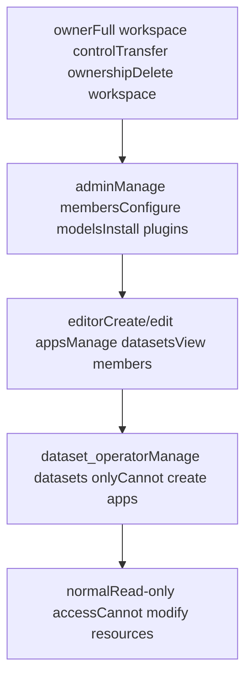
**Role Permission Matrix**:

| Operation | owner | admin | editor | dataset\_operator | normal |
| --- | --- | --- | --- | --- | --- |
| Transfer ownership | ✓ | ✗ | ✗ | ✗ | ✗ |
| Delete workspace | ✓ | ✗ | ✗ | ✗ | ✗ |
| Manage members | ✓ | ✓ | ✗ | ✗ | ✗ |
| Install plugins | ✓ | ✓ | ✗ | ✗ | ✗ |
| Configure models | ✓ | ✓ | ✗ | ✗ | ✗ |
| Create/edit apps | ✓ | ✓ | ✓ | ✗ | ✗ |
| Manage datasets | ✓ | ✓ | ✓ | ✓ | ✗ |
| View resources | ✓ | ✓ | ✓ | ✓ | ✓ |

Sources: [api/models/account.py200-250](https://github.com/langgenius/dify/blob/92dbc94f/api/models/account.py#L200-L250) [api/services/account\_service.py1130-1180](https://github.com/langgenius/dify/blob/92dbc94f/api/services/account_service.py#L1130-L1180)

### Role Check Methods

The `TenantService` provides role validation methods:

**TenantService Role Checks**:

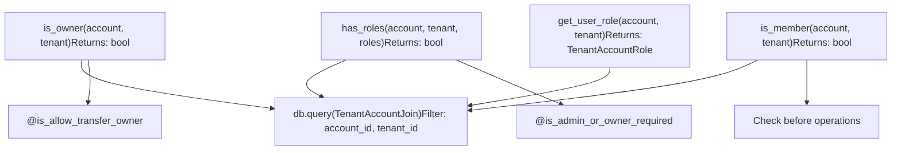
Sources: [api/services/account\_service.py1130-1180](https://github.com/langgenius/dify/blob/92dbc94f/api/services/account_service.py#L1130-L1180) [api/controllers/console/wraps.py40-80](https://github.com/langgenius/dify/blob/92dbc94f/api/controllers/console/wraps.py#L40-L80)

## Permission Check System

### Decorator-Based Authorization

Controller endpoints use decorators to enforce role requirements before handler execution:

**Authorization Decorator Flow**:

> **[Mermaid sequence]**
> *(图表结构无法解析)*

**Common Authorization Decorators**:

| Decorator | Required Roles | Usage | File Location |
| --- | --- | --- | --- |
| `@is_admin_or_owner_required` | `owner`, `admin` | Model config, member management | [api/controllers/console/wraps.py40-60](https://github.com/langgenius/dify/blob/92dbc94f/api/controllers/console/wraps.py#L40-L60) |
| `@is_allow_transfer_owner` | `owner` only | Workspace ownership transfer | [api/controllers/console/wraps.py80-100](https://github.com/langgenius/dify/blob/92dbc94f/api/controllers/console/wraps.py#L80-L100) |
| `@plugin_permission_required` | Based on settings | Plugin install/debug | [api/controllers/console/workspace/\_\_init\_\_.py30-60](https://github.com/langgenius/dify/blob/92dbc94f/api/controllers/console/workspace/__init__.py#L30-L60) |
| `@cloud_edition_billing_resource_check` | Based on plan | Feature access | [api/controllers/console/wraps.py120-150](https://github.com/langgenius/dify/blob/92dbc94f/api/controllers/console/wraps.py#L120-L150) |

Sources: [api/controllers/console/wraps.py40-150](https://github.com/langgenius/dify/blob/92dbc94f/api/controllers/console/wraps.py#L40-L150) [api/controllers/console/workspace/members.py180-210](https://github.com/langgenius/dify/blob/92dbc94f/api/controllers/console/workspace/members.py#L180-L210)

### Service-Layer Permission Checks

Beyond decorators, services perform inline permission checks:

**TenantService Permission Enforcement**:

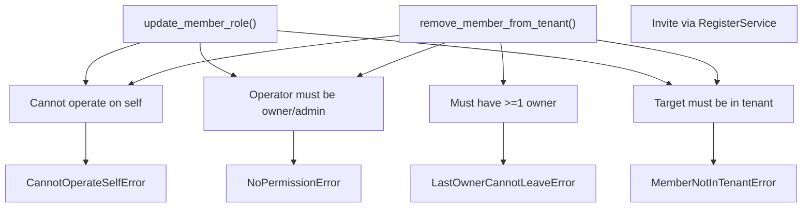
Sources: [api/services/account\_service.py1181-1280](https://github.com/langgenius/dify/blob/92dbc94f/api/services/account_service.py#L1181-L1280) [api/controllers/console/workspace/members.py148-177](https://github.com/langgenius/dify/blob/92dbc94f/api/controllers/console/workspace/members.py#L148-L177)

## Dataset-Level Permissions

### Dataset Permission Model

Datasets support fine-grained access control independent of workspace roles through the `DatasetPermission` model:

**Dataset Permission Levels**:

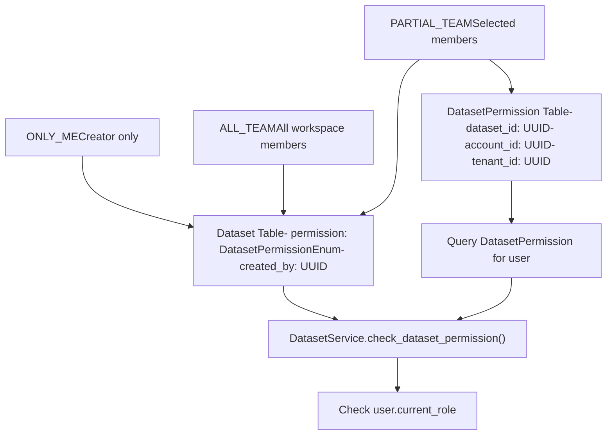
**Permission Level Behavior**:

| Permission | Creator Access | Other Members | Dataset Operators | Enforcement |
| --- | --- | --- | --- | --- |
| `ONLY_ME` | Full access | No access | No access | Checked in API layer |
| `ALL_TEAM` | Full access | Full access | Full access | Workspace-scoped |
| `PARTIAL_TEAM` | Full access | Via `DatasetPermission` | Via `DatasetPermission` | Database join |

Sources: [api/models/dataset.py1-100](https://github.com/langgenius/dify/blob/92dbc94f/api/models/dataset.py#L1-L100) [api/services/dataset\_service.py98-166](https://github.com/langgenius/dify/blob/92dbc94f/api/services/dataset_service.py#L98-L166)

### DatasetPermission Service

The `DatasetPermissionService` manages partial team member lists:

**DatasetPermissionService Methods**:

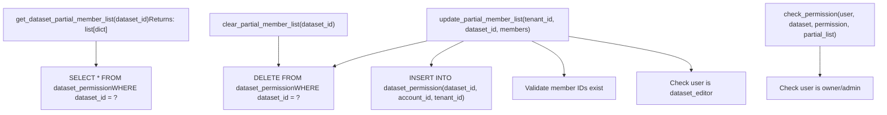
Sources: [api/services/dataset\_service.py2668-2790](https://github.com/langgenius/dify/blob/92dbc94f/api/services/dataset_service.py#L2668-L2790)

### Dataset Permission Check Flow

When accessing a dataset, the system performs permission validation:

**Dataset Access Validation**:

> **[Mermaid sequence]**
> *(图表结构无法解析)*

Sources: [api/services/dataset\_service.py98-166](https://github.com/langgenius/dify/blob/92dbc94f/api/services/dataset_service.py#L98-L166) [api/controllers/console/datasets/datasets\_document.py118-127](https://github.com/langgenius/dify/blob/92dbc94f/api/controllers/console/datasets/datasets_document.py#L118-L127)

## Role Assignment and Management

### Adding and Removing Members

The `TenantService` handles workspace membership operations:

**Member Management Flow**:

> **[Mermaid sequence]**
> *(图表结构无法解析)*

Sources: [api/controllers/console/workspace/members.py88-145](https://github.com/langgenius/dify/blob/92dbc94f/api/controllers/console/workspace/members.py#L88-L145) [api/services/account\_service.py1055-1128](https://github.com/langgenius/dify/blob/92dbc94f/api/services/account_service.py#L1055-L1128)

### Updating Member Roles

Role updates enforce permission requirements:

**Role Update Flow**:

> **[Mermaid sequence]**
> *(图表结构无法解析)*

**Role Update Restrictions**:

| Current Role | Can Update To | Updater Must Be |
| --- | --- | --- |
| `normal` | `editor`, `dataset_operator` | `owner` or `admin` |
| `dataset_operator` | `editor`, `normal` | `owner` or `admin` |
| `editor` | `admin`, `normal`, `dataset_operator` | `owner` or `admin` |
| `admin` | `editor`, `normal` | `owner` only |
| `owner` | Cannot change via API | Transfer ownership flow |

Sources: [api/services/account\_service.py1181-1250](https://github.com/langgenius/dify/blob/92dbc94f/api/services/account_service.py#L1181-L1250) [api/controllers/console/workspace/members.py179-210](https://github.com/langgenius/dify/blob/92dbc94f/api/controllers/console/workspace/members.py#L179-L210)

### Owner Transfer Flow

Workspace ownership transfer requires email verification:

**Owner Transfer Sequence**:

> **[Mermaid sequence]**
> *(图表结构无法解析)*

**Security Measures**:

1.  Email verification code required
2.  Rate limiting: 1 attempt per 60 seconds
3.  Error tracking: Max 5 failed verifications
4.  Token expires after 5 minutes
5.  Cannot transfer to self

Sources: [api/controllers/console/workspace/members.py228-372](https://github.com/langgenius/dify/blob/92dbc94f/api/controllers/console/workspace/members.py#L228-L372) [api/services/account\_service.py561-628](https://github.com/langgenius/dify/blob/92dbc94f/api/services/account_service.py#L561-L628)

## Decorators and Middleware

### Controller-Level Authorization

Several decorators enforce authorization before handler execution:

**Common Authorization Decorators**:

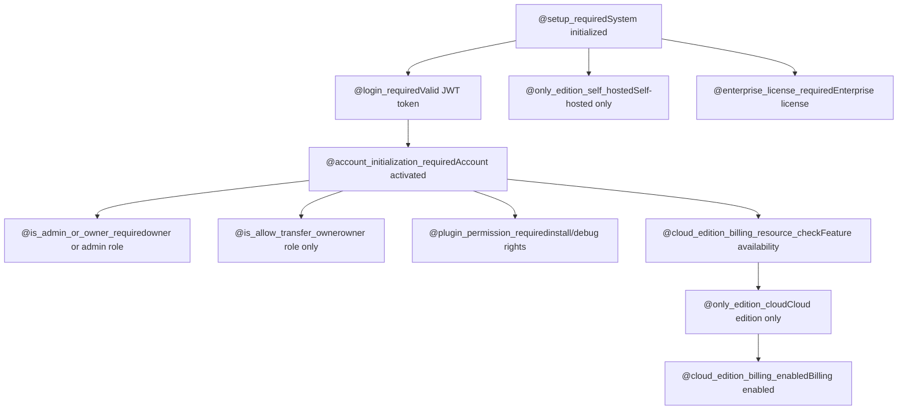
**Decorator Implementation Details**:

| Decorator | File Location | Check Performed |
| --- | --- | --- |
| `@setup_required` | [api/controllers/console/wraps.py15-30](https://github.com/langgenius/dify/blob/92dbc94f/api/controllers/console/wraps.py#L15-L30) | Verifies `DifySetup` exists |
| `@login_required` | [libs/login.py30-60](https://github.com/langgenius/dify/blob/92dbc94f/libs/login.py#L30-L60) | Validates JWT from cookie |
| `@account_initialization_required` | [api/controllers/console/wraps.py35-50](https://github.com/langgenius/dify/blob/92dbc94f/api/controllers/console/wraps.py#L35-L50) | Checks `account.status == ACTIVE` |
| `@is_admin_or_owner_required` | [api/controllers/console/wraps.py55-75](https://github.com/langgenius/dify/blob/92dbc94f/api/controllers/console/wraps.py#L55-L75) | Verifies role in \[`owner`, `admin`\] |
| `@cloud_edition_billing_resource_check` | [api/controllers/console/wraps.py120-160](https://github.com/langgenius/dify/blob/92dbc94f/api/controllers/console/wraps.py#L120-L160) | Calls `FeatureService.get_features()` |

Sources: [api/controllers/console/wraps.py1-180](https://github.com/langgenius/dify/blob/92dbc94f/api/controllers/console/wraps.py#L1-L180) [libs/login.py1-80](https://github.com/langgenius/dify/blob/92dbc94f/libs/login.py#L1-L80)

### Plugin Permission System

Plugin operations require special permissions configured per tenant:

**Plugin Permission Model**:

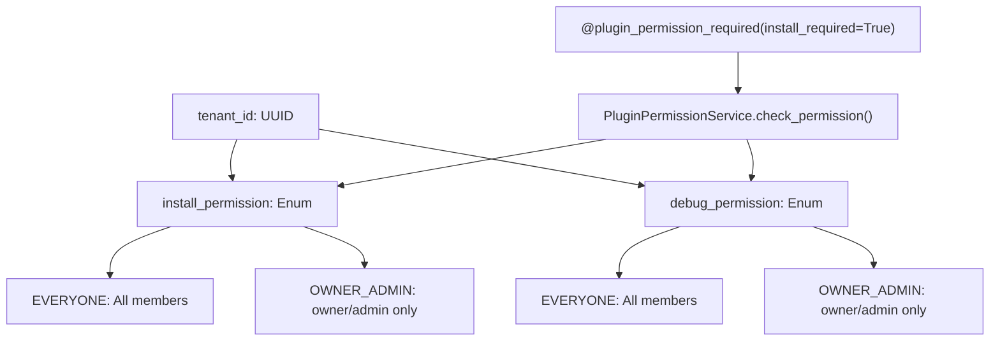
**Plugin Permission Check Flow**:

```
@plugin_permission_required(install_required=True, debug_required=False)
def post(self):
    # Handler executes only if user has install permission
    # based on tenant's install_permission setting
```
Sources: [api/controllers/console/workspace/\_\_init\_\_.py30-80](https://github.com/langgenius/dify/blob/92dbc94f/api/controllers/console/workspace/__init__.py#L30-L80) [api/services/plugin/plugin\_permission\_service.py1-100](https://github.com/langgenius/dify/blob/92dbc94f/api/services/plugin/plugin_permission_service.py#L1-L100) [api/models/account.py150-180](https://github.com/langgenius/dify/blob/92dbc94f/api/models/account.py#L150-L180)

## RBAC Implementation Summary

### Code Entity Map

The following table maps high-level concepts to concrete code entities:

**RBAC Core Components**:

| Concept | Code Entity | Location |
| --- | --- | --- |
| Role enum | `TenantAccountRole` | [api/models/account.py200-210](https://github.com/langgenius/dify/blob/92dbc94f/api/models/account.py#L200-L210) |
| Membership table | `TenantAccountJoin` | [api/models/account.py220-250](https://github.com/langgenius/dify/blob/92dbc94f/api/models/account.py#L220-L250) |
| Permission settings | `TenantPluginPermission` | [api/models/account.py150-180](https://github.com/langgenius/dify/blob/92dbc94f/api/models/account.py#L150-L180) |
| Role checks | `TenantService.has_roles()` | [api/services/account\_service.py1130-1160](https://github.com/langgenius/dify/blob/92dbc94f/api/services/account_service.py#L1130-L1160) |
| Owner check | `TenantService.is_owner()` | [api/services/account\_service.py1165-1180](https://github.com/langgenius/dify/blob/92dbc94f/api/services/account_service.py#L1165-L1180) |
| Member operations | `TenantService.remove_member_from_tenant()` | [api/services/account\_service.py1181-1230](https://github.com/langgenius/dify/blob/92dbc94f/api/services/account_service.py#L1181-L1230) |
| Role updates | `TenantService.update_member_role()` | [api/services/account\_service.py1231-1280](https://github.com/langgenius/dify/blob/92dbc94f/api/services/account_service.py#L1231-L1280) |

**Authorization Decorators**:

| Decorator | Implementation | Usage Example |
| --- | --- | --- |
| `@is_admin_or_owner_required` | [api/controllers/console/wraps.py55-75](https://github.com/langgenius/dify/blob/92dbc94f/api/controllers/console/wraps.py#L55-L75) | Model provider config |
| `@is_allow_transfer_owner` | [api/controllers/console/wraps.py80-100](https://github.com/langgenius/dify/blob/92dbc94f/api/controllers/console/wraps.py#L80-L100) | Owner transfer endpoints |
| `@plugin_permission_required` | [api/controllers/console/workspace/\_\_init\_\_.py30-60](https://github.com/langgenius/dify/blob/92dbc94f/api/controllers/console/workspace/__init__.py#L30-L60) | Plugin install/debug |
| `@cloud_edition_billing_resource_check` | [api/controllers/console/wraps.py120-160](https://github.com/langgenius/dify/blob/92dbc94f/api/controllers/console/wraps.py#L120-L160) | Member invitation |

**Dataset Permissions**:

| Concept | Code Entity | Location |
| --- | --- | --- |
| Permission enum | `DatasetPermissionEnum` | [api/models/dataset.py30-40](https://github.com/langgenius/dify/blob/92dbc94f/api/models/dataset.py#L30-L40) |
| Permission table | `DatasetPermission` | [api/models/dataset.py200-220](https://github.com/langgenius/dify/blob/92dbc94f/api/models/dataset.py#L200-L220) |
| Permission service | `DatasetPermissionService` | [api/services/dataset\_service.py2668-2790](https://github.com/langgenius/dify/blob/92dbc94f/api/services/dataset_service.py#L2668-L2790) |
| Permission check | `DatasetService.check_dataset_permission()` | [api/services/dataset\_service.py98-166](https://github.com/langgenius/dify/blob/92dbc94f/api/services/dataset_service.py#L98-L166) |
| Get partial members | `get_dataset_partial_member_list()` | [api/services/dataset\_service.py2668-2700](https://github.com/langgenius/dify/blob/92dbc94f/api/services/dataset_service.py#L2668-L2700) |
| Update partial members | `update_partial_member_list()` | [api/services/dataset\_service.py2701-2756](https://github.com/langgenius/dify/blob/92dbc94f/api/services/dataset_service.py#L2701-L2756) |

Sources: [api/models/account.py1-300](https://github.com/langgenius/dify/blob/92dbc94f/api/models/account.py#L1-L300) [api/services/account\_service.py972-1280](https://github.com/langgenius/dify/blob/92dbc94f/api/services/account_service.py#L972-L1280) [api/controllers/console/wraps.py1-180](https://github.com/langgenius/dify/blob/92dbc94f/api/controllers/console/wraps.py#L1-L180)

### Permission Check Best Practices

**When to Use Decorators vs Service Checks**:

1.  **Use Decorators** for endpoint-level authorization:

    -   Entire endpoint requires specific role
    -   Consistent permission across all operations in handler
    -   Example: Model provider configuration
2.  **Use Service Checks** for operation-specific validation:

    -   Different operations in same handler need different permissions
    -   Dynamic permission based on resource state
    -   Example: Member removal (must check for last owner)
3.  **Use Dataset Permission Checks** for dataset resource access:

    -   Check `check_dataset_permission()` before dataset operations
    -   Combine role checks with dataset-level permissions
    -   Example: Document upload, segment creation

**Common Error Patterns**:

| Error | Cause | HTTP Status |
| --- | --- | --- |
| `NoPermissionError` | User lacks required role or dataset permission | 403 Forbidden |
| `MemberNotInTenantError` | Target member not in workspace | 404 Not Found |
| `CannotOperateSelfError` | User attempted self-operation | 400 Bad Request |
| `RoleAlreadyAssignedError` | Role unchanged | 400 Bad Request |

Sources: [api/services/errors/account.py1-100](https://github.com/langgenius/dify/blob/92dbc94f/api/services/errors/account.py#L1-L100) [api/controllers/console/error.py1-50](https://github.com/langgenius/dify/blob/92dbc94f/api/controllers/console/error.py#L1-L50)

## Service API Permission System

### API Token Validation

Service API endpoints use API tokens scoped to apps or datasets:

**API Token Types and Scoping**:

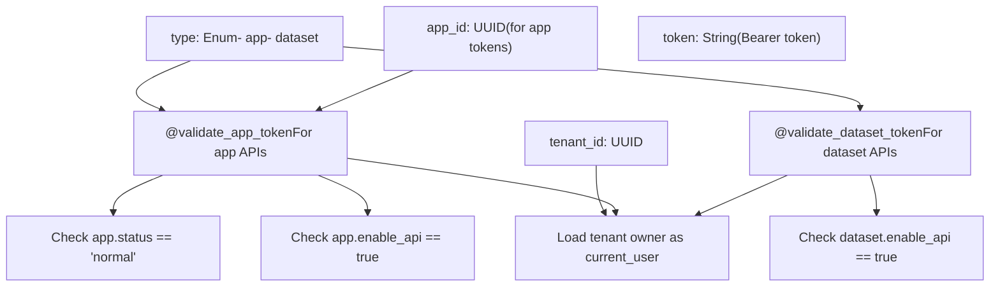
Sources: [api/controllers/service\_api/wraps.py50-128](https://github.com/langgenius/dify/blob/92dbc94f/api/controllers/service_api/wraps.py#L50-L128) [api/controllers/service\_api/wraps.py219-295](https://github.com/langgenius/dify/blob/92dbc94f/api/controllers/service_api/wraps.py#L219-L295)

### Dataset API Permission Flow

Dataset Service APIs enforce additional permission checks:

**Dataset Service API Authorization**:

> **[Mermaid sequence]**
> *(图表结构无法解析)*

**Service API Permission Decorators**:

| Decorator | Scope | Permission Check | Usage |
| --- | --- | --- | --- |
| `@validate_app_token` | App-specific | `app.enable_api`, `app.status` | Chat, completion APIs |
| `@validate_dataset_token` | Tenant-wide | `dataset.enable_api` per dataset | Dataset operations |
| `@cloud_edition_billing_resource_check` | Tenant-wide | Billing limits | Document upload, segment creation |
| `@cloud_edition_billing_rate_limit_check` | Tenant-wide | Rate limits | Knowledge operations |

Sources: [api/controllers/service\_api/wraps.py50-295](https://github.com/langgenius/dify/blob/92dbc94f/api/controllers/service_api/wraps.py#L50-L295) [api/controllers/service\_api/dataset/document.py76-161](https://github.com/langgenius/dify/blob/92dbc94f/api/controllers/service_api/dataset/document.py#L76-L161)

### Permission Override for Service APIs

Service API calls execute with tenant owner privileges:

**Owner Context Loading**:

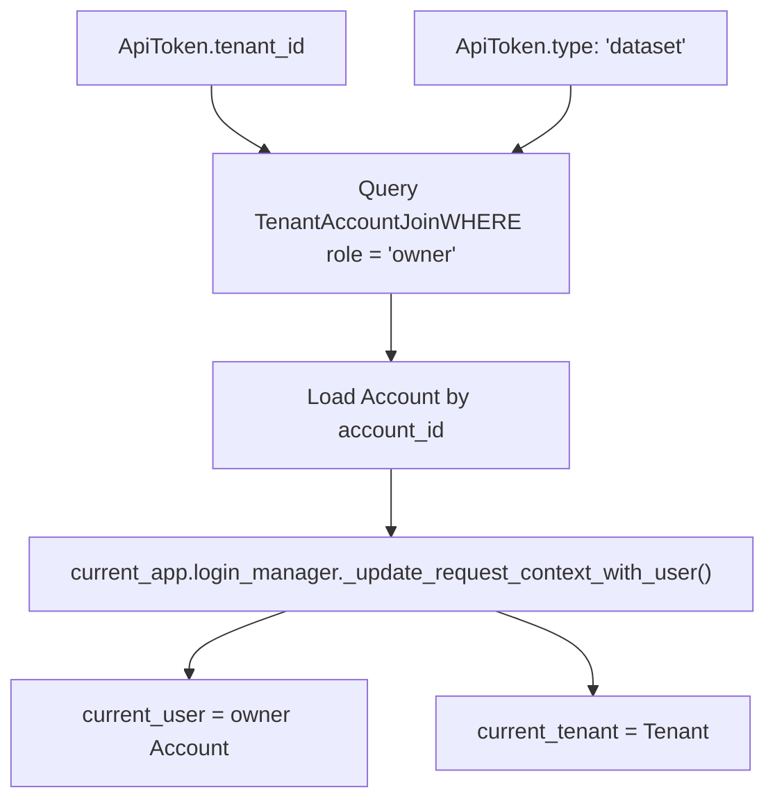
**Implications**:

-   Service API operations execute as workspace owner
-   Dataset permission checks use owner's context
-   `ONLY_ME` datasets accessible if owner created them
-   `PARTIAL_TEAM` datasets accessible if owner in permission list

Sources: [api/controllers/service\_api/wraps.py98-118](https://github.com/langgenius/dify/blob/92dbc94f/api/controllers/service_api/wraps.py#L98-L118) [api/controllers/service\_api/wraps.py265-284](https://github.com/langgenius/dify/blob/92dbc94f/api/controllers/service_api/wraps.py#L265-L284)

## SSL/TLS Configuration

### Nginx SSL Termination

The Nginx reverse proxy handles SSL/TLS termination:

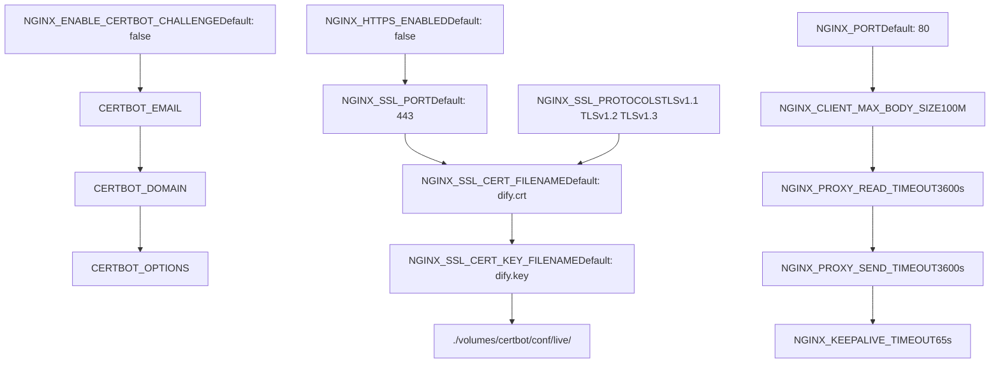
**SSL Setup Process**:

1.  Set `NGINX_HTTPS_ENABLED=true`
2.  Place certificate files in `./volumes/certbot/conf/live/`
3.  Configure `NGINX_SSL_CERT_FILENAME` and `NGINX_SSL_CERT_KEY_FILENAME`
4.  Optionally enable Certbot for automatic certificate renewal

Sources: [docker/docker-compose.yaml510-525](https://github.com/langgenius/dify/blob/92dbc94f/docker/docker-compose.yaml#L510-L525) [docker/.env.example510-525](https://github.com/langgenius/dify/blob/92dbc94f/docker/.env.example#L510-L525)

### Database SSL Configuration

Both Redis and PostgreSQL support SSL connections:

**Redis SSL**:

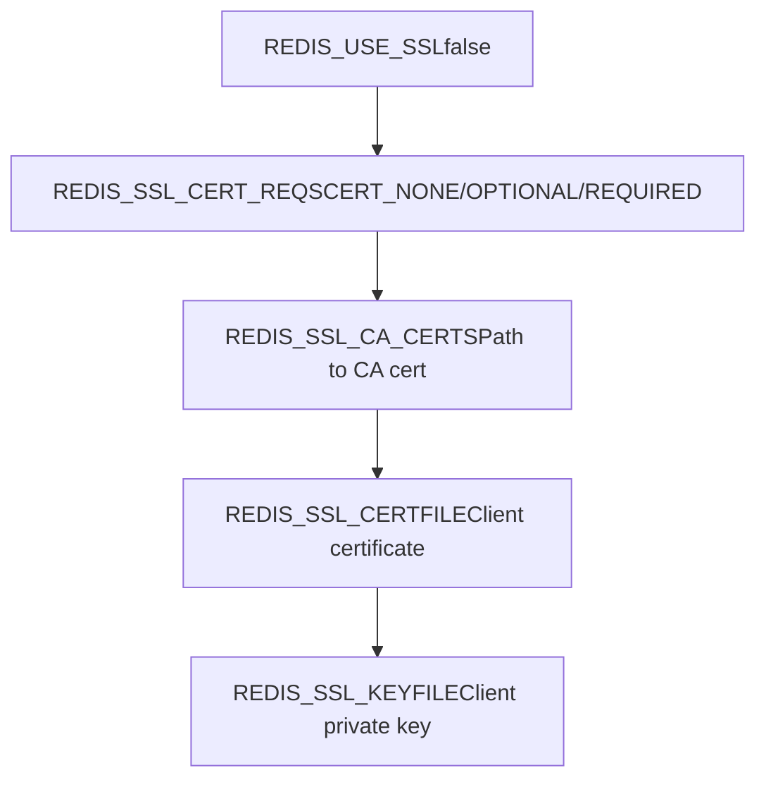
Sources: [docker/docker-compose.yaml85-89](https://github.com/langgenius/dify/blob/92dbc94f/docker/docker-compose.yaml#L85-L89) [api/.env.example47-56](https://github.com/langgenius/dify/blob/92dbc94f/api/.env.example#L47-L56)

## HTTP Security Headers

### CORS Configuration

Cross-Origin Resource Sharing (CORS) is configurable for both console and web APIs:

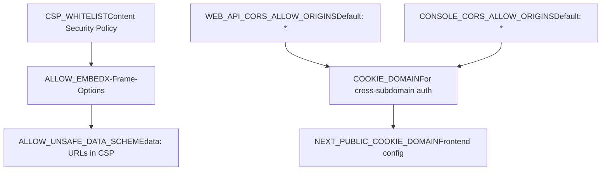
**CORS Configuration Table**:

| Variable | Purpose | Default | Security Impact |
| --- | --- | --- | --- |
| `WEB_API_CORS_ALLOW_ORIGINS` | Allowed origins for Web API | `*` | `*` allows all origins (permissive) |
| `CONSOLE_CORS_ALLOW_ORIGINS` | Allowed origins for Console API | `*` | `*` allows all origins (permissive) |
| `COOKIE_DOMAIN` | Cookie domain for cross-subdomain | Empty | Set for subdomain auth |
| `CSP_WHITELIST` | Content Security Policy whitelist | Empty | Restrict resource loading |
| `ALLOW_EMBED` | Allow iframe embedding | `false` | Prevents clickjacking |
| `ALLOW_UNSAFE_DATA_SCHEME` | Allow data: URLs | `false` | Prevents XSS via data URLs |

**Production Recommendation**: Set specific origins instead of `*` for production environments.

Sources: [docker/docker-compose.yaml107-110](https://github.com/langgenius/dify/blob/92dbc94f/docker/docker-compose.yaml#L107-L110) [docker/docker-compose.yaml545](https://github.com/langgenius/dify/blob/92dbc94f/docker/docker-compose.yaml#L545-L545) [docker/docker-compose.yaml118-120](https://github.com/langgenius/dify/blob/92dbc94f/docker/docker-compose.yaml#L118-L120) [api/.env.example162-166](https://github.com/langgenius/dify/blob/92dbc94f/api/.env.example#L162-L166) [api/.env.example618-619](https://github.com/langgenius/dify/blob/92dbc94f/api/.env.example#L618-L619)

### X-Forward Headers

The system can respect reverse proxy headers when configured:

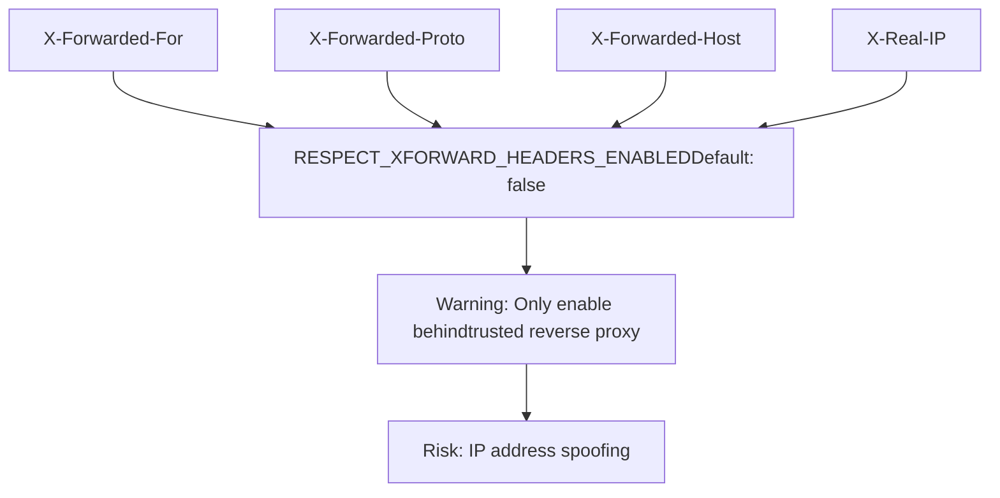
**Security Warning**: Enabling `RESPECT_XFORWARD_HEADERS_ENABLED` without a trusted proxy allows clients to spoof their IP addresses, bypassing rate limits and IP-based security controls.

Sources: [docker/docker-compose.yaml448](https://github.com/langgenius/dify/blob/92dbc94f/docker/docker-compose.yaml#L448-L448) [api/.env.example481](https://github.com/langgenius/dify/blob/92dbc94f/api/.env.example#L481-L481)

## Token Management

### JWT Token Structure

The system uses JWT tokens for API authentication:

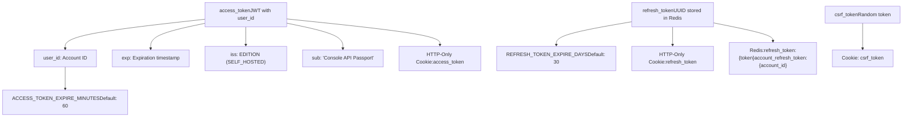
**Token Lifecycle**:

1.  **Access Token**: Short-lived JWT (60 minutes) for API authentication
2.  **Refresh Token**: Long-lived UUID (30 days) stored in Redis, used to obtain new access tokens
3.  **CSRF Token**: Random token preventing cross-site request forgery

Sources: [api/services/account\_service.py77-86](https://github.com/langgenius/dify/blob/92dbc94f/api/services/account_service.py#L77-L86) [api/services/account\_service.py162-173](https://github.com/langgenius/dify/blob/92dbc94f/api/services/account_service.py#L162-L173) [docker/docker-compose.yaml35-36](https://github.com/langgenius/dify/blob/92dbc94f/docker/docker-compose.yaml#L35-L36)

### Token Refresh Flow

> **[Mermaid sequence]**
> *(图表结构无法解析)*

Sources: [api/services/account\_service.py107-124](https://github.com/langgenius/dify/blob/92dbc94f/api/services/account_service.py#L107-L124) [api/controllers/console/auth/login.py200-250](https://github.com/langgenius/dify/blob/92dbc94f/api/controllers/console/auth/login.py#L200-L250)

## Admin API Authentication

### Admin API Key

The system supports optional admin API key authentication for privileged operations:

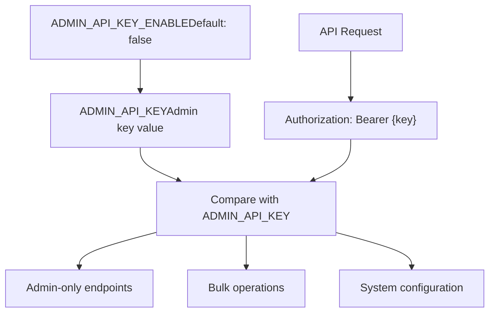
**Usage**: When `ADMIN_API_KEY_ENABLE=true`, protected admin endpoints require the `Authorization: Bearer {ADMIN_API_KEY}` header.

Sources: [api/configs/feature/\_\_init\_\_.py56-64](https://github.com/langgenius/dify/blob/92dbc94f/api/configs/feature/__init__.py#L56-L64)

## Security Best Practices Summary

### Production Security Checklist

| Security Area | Configuration | Recommended Setting |
| --- | --- | --- |
| **Secret Keys** | `SECRET_KEY` | Generate with `openssl rand -base64 42` |
|  | `SANDBOX_API_KEY` | Strong random key |
|  | `PLUGIN_DAEMON_KEY` | Strong random key |
| **CORS** | `WEB_API_CORS_ALLOW_ORIGINS` | Specific origins, not `*` |
|  | `CONSOLE_CORS_ALLOW_ORIGINS` | Specific origins, not `*` |
| **SSL/TLS** | `NGINX_HTTPS_ENABLED` | `true` |
|  | `NGINX_SSL_PROTOCOLS` | `TLSv1.2 TLSv1.3` only |
| **Proxy Headers** | `RESPECT_XFORWARD_HEADERS_ENABLED` | `false` unless behind trusted proxy |
| **Rate Limiting** | All rate limiters | Keep enabled |
| **SSRF Protection** | `SSRF_PROXY_HTTP_URL` | Configure and enable |
| **Sandbox** | `SANDBOX_ENABLE_NETWORK` | `true` with proxy only |
| **Monitoring** | `ENABLE_OTEL` or `SENTRY_DSN` | Enable one or both |
| **Embeddings** | `ALLOW_EMBED` | `false` unless required |
| **Data Schemes** | `ALLOW_UNSAFE_DATA_SCHEME` | `false` |
| **Admin API** | `ADMIN_API_KEY_ENABLE` | Only if needed |

### Defense in Depth Layers

The Dify security infrastructure implements defense in depth:

1.  **Perimeter**: Nginx SSL termination, CORS policy, rate limiting
2.  **Application**: CSRF tokens, JWT authentication, session management
3.  **Authorization**: Role-based access control, tenant isolation
4.  **Execution**: Sandboxed code execution, SSRF proxy filtering
5.  **Data**: Encrypted credentials, secure cookie flags, secret key management
6.  **Monitoring**: Error tracking, distributed tracing, audit logs

Sources: [api/configs/feature/\_\_init\_\_.py19-65](https://github.com/langgenius/dify/blob/92dbc94f/api/configs/feature/__init__.py#L19-L65) [docker/docker-compose.yaml510-536](https://github.com/langgenius/dify/blob/92dbc94f/docker/docker-compose.yaml#L510-L536) [api/services/account\_service.py89-105](https://github.com/langgenius/dify/blob/92dbc94f/api/services/account_service.py#L89-L105)
