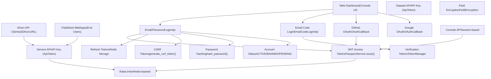
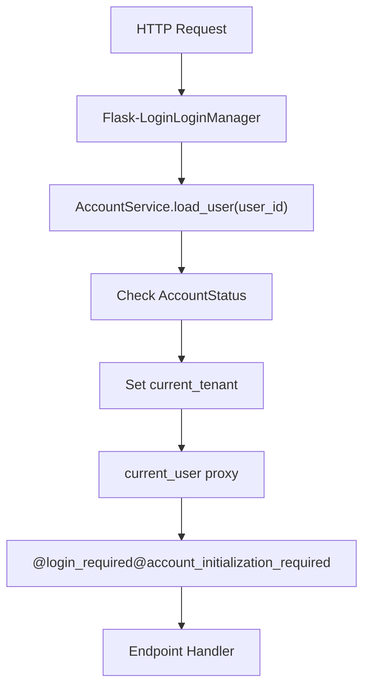
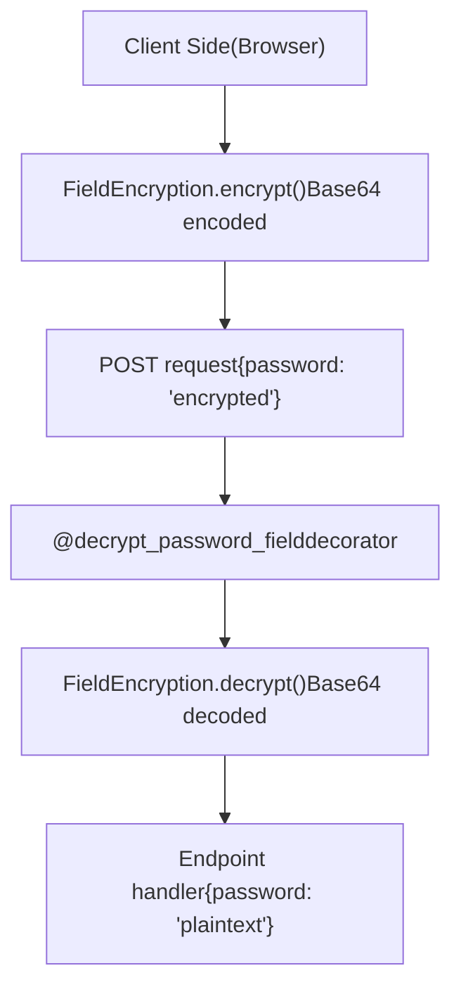
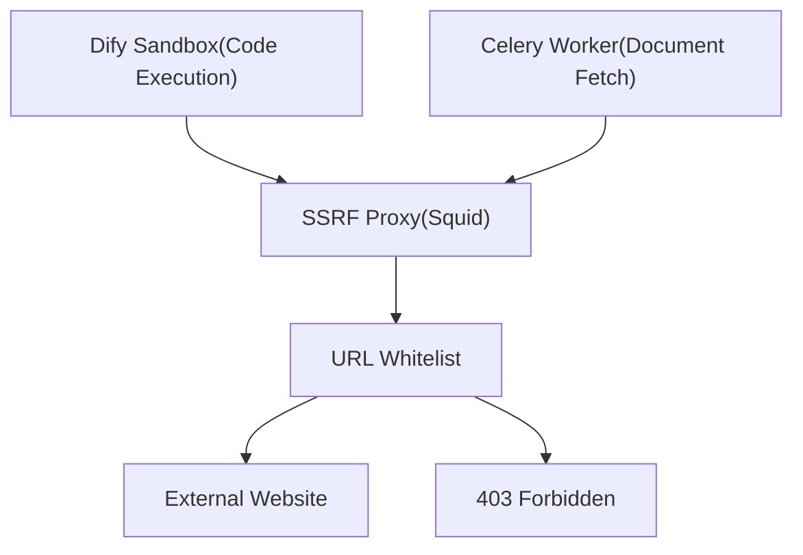

# Authentication and Security

Relevant source files

-   [api/controllers/console/\_\_init\_\_.py](https://github.com/langgenius/dify/blob/92dbc94f/api/controllers/console/__init__.py)
-   [api/controllers/console/auth/activate.py](https://github.com/langgenius/dify/blob/92dbc94f/api/controllers/console/auth/activate.py)
-   [api/controllers/console/auth/email\_register.py](https://github.com/langgenius/dify/blob/92dbc94f/api/controllers/console/auth/email_register.py)
-   [api/controllers/console/auth/error.py](https://github.com/langgenius/dify/blob/92dbc94f/api/controllers/console/auth/error.py)
-   [api/controllers/console/auth/forgot\_password.py](https://github.com/langgenius/dify/blob/92dbc94f/api/controllers/console/auth/forgot_password.py)
-   [api/controllers/console/auth/login.py](https://github.com/langgenius/dify/blob/92dbc94f/api/controllers/console/auth/login.py)
-   [api/controllers/console/auth/oauth.py](https://github.com/langgenius/dify/blob/92dbc94f/api/controllers/console/auth/oauth.py)
-   [api/controllers/console/billing/billing.py](https://github.com/langgenius/dify/blob/92dbc94f/api/controllers/console/billing/billing.py)
-   [api/controllers/console/billing/compliance.py](https://github.com/langgenius/dify/blob/92dbc94f/api/controllers/console/billing/compliance.py)
-   [api/controllers/console/error.py](https://github.com/langgenius/dify/blob/92dbc94f/api/controllers/console/error.py)
-   [api/controllers/console/feature.py](https://github.com/langgenius/dify/blob/92dbc94f/api/controllers/console/feature.py)
-   [api/controllers/console/init\_validate.py](https://github.com/langgenius/dify/blob/92dbc94f/api/controllers/console/init_validate.py)
-   [api/controllers/console/setup.py](https://github.com/langgenius/dify/blob/92dbc94f/api/controllers/console/setup.py)
-   [api/controllers/console/version.py](https://github.com/langgenius/dify/blob/92dbc94f/api/controllers/console/version.py)
-   [api/controllers/console/workspace/account.py](https://github.com/langgenius/dify/blob/92dbc94f/api/controllers/console/workspace/account.py)
-   [api/controllers/console/workspace/agent\_providers.py](https://github.com/langgenius/dify/blob/92dbc94f/api/controllers/console/workspace/agent_providers.py)
-   [api/controllers/console/workspace/members.py](https://github.com/langgenius/dify/blob/92dbc94f/api/controllers/console/workspace/members.py)
-   [api/controllers/console/workspace/model\_providers.py](https://github.com/langgenius/dify/blob/92dbc94f/api/controllers/console/workspace/model_providers.py)
-   [api/controllers/console/workspace/models.py](https://github.com/langgenius/dify/blob/92dbc94f/api/controllers/console/workspace/models.py)
-   [api/controllers/console/workspace/workspace.py](https://github.com/langgenius/dify/blob/92dbc94f/api/controllers/console/workspace/workspace.py)
-   [api/controllers/console/wraps.py](https://github.com/langgenius/dify/blob/92dbc94f/api/controllers/console/wraps.py)
-   [api/controllers/service\_api/wraps.py](https://github.com/langgenius/dify/blob/92dbc94f/api/controllers/service_api/wraps.py)
-   [api/libs/encryption.py](https://github.com/langgenius/dify/blob/92dbc94f/api/libs/encryption.py)
-   [api/libs/workspace\_permission.py](https://github.com/langgenius/dify/blob/92dbc94f/api/libs/workspace_permission.py)
-   [api/services/account\_service.py](https://github.com/langgenius/dify/blob/92dbc94f/api/services/account_service.py)
-   [api/services/billing\_service.py](https://github.com/langgenius/dify/blob/92dbc94f/api/services/billing_service.py)
-   [api/services/enterprise/enterprise\_service.py](https://github.com/langgenius/dify/blob/92dbc94f/api/services/enterprise/enterprise_service.py)
-   [api/services/feature\_service.py](https://github.com/langgenius/dify/blob/92dbc94f/api/services/feature_service.py)
-   [api/services/operation\_service.py](https://github.com/langgenius/dify/blob/92dbc94f/api/services/operation_service.py)
-   [api/templates/change\_mail\_confirm\_old\_template\_zh-CN.html](https://github.com/langgenius/dify/blob/92dbc94f/api/templates/change_mail_confirm_old_template_zh-CN.html)
-   [api/templates/transfer\_workspace\_owner\_confirm\_template\_en-US.html](https://github.com/langgenius/dify/blob/92dbc94f/api/templates/transfer_workspace_owner_confirm_template_en-US.html)
-   [api/templates/without-brand/transfer\_workspace\_owner\_confirm\_template\_en-US.html](https://github.com/langgenius/dify/blob/92dbc94f/api/templates/without-brand/transfer_workspace_owner_confirm_template_en-US.html)
-   [api/tests/unit\_tests/controllers/console/auth/test\_account\_activation.py](https://github.com/langgenius/dify/blob/92dbc94f/api/tests/unit_tests/controllers/console/auth/test_account_activation.py)
-   [api/tests/unit\_tests/controllers/console/auth/test\_authentication\_security.py](https://github.com/langgenius/dify/blob/92dbc94f/api/tests/unit_tests/controllers/console/auth/test_authentication_security.py)
-   [api/tests/unit\_tests/controllers/console/auth/test\_email\_verification.py](https://github.com/langgenius/dify/blob/92dbc94f/api/tests/unit_tests/controllers/console/auth/test_email_verification.py)
-   [api/tests/unit\_tests/controllers/console/auth/test\_login\_logout.py](https://github.com/langgenius/dify/blob/92dbc94f/api/tests/unit_tests/controllers/console/auth/test_login_logout.py)
-   [api/tests/unit\_tests/controllers/console/auth/test\_oauth.py](https://github.com/langgenius/dify/blob/92dbc94f/api/tests/unit_tests/controllers/console/auth/test_oauth.py)
-   [api/tests/unit\_tests/controllers/console/auth/test\_password\_reset.py](https://github.com/langgenius/dify/blob/92dbc94f/api/tests/unit_tests/controllers/console/auth/test_password_reset.py)
-   [api/tests/unit\_tests/controllers/console/auth/test\_token\_refresh.py](https://github.com/langgenius/dify/blob/92dbc94f/api/tests/unit_tests/controllers/console/auth/test_token_refresh.py)
-   [api/tests/unit\_tests/controllers/test\_compare\_versions.py](https://github.com/langgenius/dify/blob/92dbc94f/api/tests/unit_tests/controllers/test_compare_versions.py)
-   [api/tests/unit\_tests/libs/test\_encryption.py](https://github.com/langgenius/dify/blob/92dbc94f/api/tests/unit_tests/libs/test_encryption.py)
-   [api/tests/unit\_tests/libs/test\_oauth\_clients.py](https://github.com/langgenius/dify/blob/92dbc94f/api/tests/unit_tests/libs/test_oauth_clients.py)
-   [api/tests/unit\_tests/libs/test\_workspace\_permission.py](https://github.com/langgenius/dify/blob/92dbc94f/api/tests/unit_tests/libs/test_workspace_permission.py)

## Purpose and Scope

This document describes the authentication and security mechanisms in Dify, including user authentication methods, token management, API authentication, rate limiting, and password security. It covers how users authenticate to the Console API (admin/management interface) and how external clients authenticate to the Service API (programmatic access).

For information about role-based access control and workspace permissions, see [Role-Based Access Control](/langgenius/dify/7.2-role-based-access-control). For tenant/workspace management, see [Tenant and Account Models](/langgenius/dify/7.1-tenant-and-account-models). For billing and feature-based access control, see [Billing and Feature Management](/langgenius/dify/7.4-billing-and-feature-management).

---

## Authentication Architecture Overview

Dify supports multiple authentication methods for different use cases and implements comprehensive security controls including token management, rate limiting, and password security.

### Authentication System Components


**Sources:** [api/services/account\_service.py88-444](https://github.com/langgenius/dify/blob/92dbc94f/api/services/account_service.py#L88-L444) [api/controllers/console/auth/login.py82-323](https://github.com/langgenius/dify/blob/92dbc94f/api/controllers/console/auth/login.py#L82-L323) [api/controllers/console/auth/oauth.py56-236](https://github.com/langgenius/dify/blob/92dbc94f/api/controllers/console/auth/oauth.py#L56-L236) [api/controllers/service\_api/wraps.py50-334](https://github.com/langgenius/dify/blob/92dbc94f/api/controllers/service_api/wraps.py#L50-L334)

---

## Authentication Methods

Dify provides multiple authentication methods for different user types and security requirements.

### Email/Password Authentication

The primary authentication method uses email and password credentials with JWT token-based sessions.

#### Login Flow

> **[Mermaid sequence]**
> *(图表结构无法解析)*

**Key Classes and Functions:**

-   **`AccountService.authenticate(email, password, invite_token)`** [api/services/account\_service.py176-204](https://github.com/langgenius/dify/blob/92dbc94f/api/services/account_service.py#L176-L204) - Validates credentials and returns Account
-   **`AccountService.login(account, ip_address)`** [api/services/account\_service.py398-412](https://github.com/langgenius/dify/blob/92dbc94f/api/services/account_service.py#L398-L412) - Generates token pair and updates login info
-   **`AccountService.get_account_jwt_token(account)`** [api/services/account\_service.py162-173](https://github.com/langgenius/dify/blob/92dbc94f/api/services/account_service.py#L162-L173) - Creates JWT with `PassportService`
-   **`LoginApi.post()`** [api/controllers/console/auth/login.py88-148](https://github.com/langgenius/dify/blob/92dbc94f/api/controllers/console/auth/login.py#L88-L148) - Login endpoint implementation

**Password Validation:**

The `compare_password()` function [api/libs/password.py](https://github.com/langgenius/dify/blob/92dbc94f/api/libs/password.py) verifies passwords using PBKDF2-HMAC-SHA256 with per-user salts stored in `Account.password_salt`.

**Token Storage:**

```
# Refresh tokens stored in Redis with two keys for bidirectional lookup
REFRESH_TOKEN_PREFIX = "refresh_token:"  # token -> account_id
ACCOUNT_REFRESH_TOKEN_PREFIX = "account_refresh_token:"  # account_id -> token
REFRESH_TOKEN_EXPIRY = timedelta(days=30)  # Configurable via REFRESH_TOKEN_EXPIRE_DAYS
```
**Rate Limiting:**

Login attempts are rate-limited to prevent brute force attacks:

-   **5 failed login attempts** trigger temporary lockout [api/services/account\_service.py100](https://github.com/langgenius/dify/blob/92dbc94f/api/services/account_service.py#L100-L100)
-   Lockout duration configured via `LOGIN_LOCKOUT_DURATION` environment variable [api/services/account\_service.py807](https://github.com/langgenius/dify/blob/92dbc94f/api/services/account_service.py#L807-L807)
-   Rate limit key: `login_error_rate_limit:{email}` in Redis

**Sources:** [api/services/account\_service.py176-204](https://github.com/langgenius/dify/blob/92dbc94f/api/services/account_service.py#L176-L204) [api/services/account\_service.py398-412](https://github.com/langgenius/dify/blob/92dbc94f/api/services/account_service.py#L398-L412) [api/controllers/console/auth/login.py82-148](https://github.com/langgenius/dify/blob/92dbc94f/api/controllers/console/auth/login.py#L82-L148) [api/libs/password.py](https://github.com/langgenius/dify/blob/92dbc94f/api/libs/password.py)

---

### OAuth Authentication

Dify supports OAuth 2.0 authentication with GitHub and Google providers.

#### OAuth Configuration

OAuth providers are configured via environment variables and instantiated in `get_oauth_providers()`:

| Provider | Client ID Variable | Client Secret Variable | Redirect URI |
| --- | --- | --- | --- |
| GitHub | `GITHUB_CLIENT_ID` | `GITHUB_CLIENT_SECRET` | `/console/api/oauth/authorize/github` |
| Google | `GOOGLE_CLIENT_ID` | `GOOGLE_CLIENT_SECRET` | `/console/api/oauth/authorize/google` |

**Sources:** [api/controllers/console/auth/oauth.py33-53](https://github.com/langgenius/dify/blob/92dbc94f/api/controllers/console/auth/oauth.py#L33-L53)

#### OAuth Flow

> **[Mermaid sequence]**
> *(图表结构无法解析)*

**Key Components:**

-   **`OAuthLogin.get(provider)`** [api/controllers/console/auth/oauth.py65-74](https://github.com/langgenius/dify/blob/92dbc94f/api/controllers/console/auth/oauth.py#L65-L74) - Initiates OAuth flow
-   **`OAuthCallback.get(provider)`** [api/controllers/console/auth/oauth.py90-172](https://github.com/langgenius/dify/blob/92dbc94f/api/controllers/console/auth/oauth.py#L90-L172) - Handles OAuth callback
-   **`_generate_account(provider, user_info)`** [api/controllers/console/auth/oauth.py185-235](https://github.com/langgenius/dify/blob/92dbc94f/api/controllers/console/auth/oauth.py#L185-L235) - Creates or links account
-   **`GitHubOAuth`** and **`GoogleOAuth`** [api/libs/oauth.py](https://github.com/langgenius/dify/blob/92dbc94f/api/libs/oauth.py) - OAuth client implementations

**Account Linking:**

OAuth accounts are linked via the `AccountIntegrate` table:

```
class AccountIntegrate:
    account_id: str       # Foreign key to Account
    provider: str         # "github" or "google"
    open_id: str          # Provider's unique user ID
    encrypted_token: str  # OAuth access token (encrypted)
```
**Sources:** [api/controllers/console/auth/oauth.py56-236](https://github.com/langgenius/dify/blob/92dbc94f/api/controllers/console/auth/oauth.py#L56-L236) [api/libs/oauth.py](https://github.com/langgenius/dify/blob/92dbc94f/api/libs/oauth.py) [api/services/account\_service.py333-357](https://github.com/langgenius/dify/blob/92dbc94f/api/services/account_service.py#L333-L357)

---

### Email Code (Passwordless) Login

Users can authenticate using a 6-digit verification code sent to their email.

#### Email Code Flow

> **[Mermaid sequence]**
> *(图表结构无法解析)*

**Rate Limiting:**

Email code login has multiple rate limit layers:

| Rate Limit Type | Limit | Time Window | Key Pattern |
| --- | --- | --- | --- |
| Email sending per email | 3 attempts | 5 minutes | `email_code_login_rate_limit` |
| Email sending per IP (per minute) | Configurable | 1 minute | `email_send_ip_limit_minute:{ip}` |
| Email sending per IP (per hour) | Configurable | 1 hour | `email_send_ip_limit_hour:{ip}` |

**Sources:** [api/controllers/console/auth/login.py200-298](https://github.com/langgenius/dify/blob/92dbc94f/api/controllers/console/auth/login.py#L200-L298) [api/services/account\_service.py725-772](https://github.com/langgenius/dify/blob/92dbc94f/api/services/account_service.py#L725-L772)

---

## Token Management

Dify uses multiple token types for different security purposes.

### Token Types and Their Purposes

| Token Type | Storage | Lifetime | Purpose |
| --- | --- | --- | --- |
| JWT Access Token | HTTP-only cookie | Configurable (default 30 min) | API authentication |
| Refresh Token | Redis + HTTP-only cookie | 30 days | Token renewal |
| CSRF Token | Cookie (non-HTTP-only) | Session | CSRF protection |
| Email Verification Token | Redis | 10 minutes | Email verification codes |
| Password Reset Token | Redis | 10 minutes | Password reset codes |
| Invitation Token | Database | Until used | Account activation |

**Sources:** [api/services/account\_service.py77-86](https://github.com/langgenius/dify/blob/92dbc94f/api/services/account_service.py#L77-L86) [api/libs/helper.py](https://github.com/langgenius/dify/blob/92dbc94f/api/libs/helper.py)

### JWT Access Tokens

JWT access tokens are issued by `PassportService` and contain user identity claims.

**Token Structure:**

```
payload = {
    "user_id": account.id,
    "exp": expiration_timestamp,
    "iss": dify_config.EDITION,  # "SELF_HOSTED", "CLOUD", or "ENTERPRISE"
    "sub": "Console API Passport"
}
```
**Token Generation:**

-   **`AccountService.get_account_jwt_token(account)`** [api/services/account\_service.py162-173](https://github.com/langgenius/dify/blob/92dbc94f/api/services/account_service.py#L162-L173)
-   **`PassportService().issue(payload)`** [api/libs/passport.py](https://github.com/langgenius/dify/blob/92dbc94f/api/libs/passport.py)

**Token Expiration:**

Configured via `ACCESS_TOKEN_EXPIRE_MINUTES` environment variable (default 30 minutes).

**Sources:** [api/services/account\_service.py162-173](https://github.com/langgenius/dify/blob/92dbc94f/api/services/account_service.py#L162-L173) [api/libs/passport.py](https://github.com/langgenius/dify/blob/92dbc94f/api/libs/passport.py)

### Refresh Tokens

Refresh tokens enable long-lived sessions without storing sensitive credentials.

**Storage Pattern:**

```
# Bidirectional Redis keys for efficient lookup
refresh_token_key = f"refresh_token:{refresh_token}"      # Maps to account_id
account_refresh_key = f"account_refresh_token:{account_id}"  # Maps to refresh_token

# Storage
redis_client.setex(refresh_token_key, REFRESH_TOKEN_EXPIRY, account_id)
redis_client.setex(account_refresh_key, REFRESH_TOKEN_EXPIRY, refresh_token)
```
**Refresh Flow:**

> **[Mermaid sequence]**
> *(图表结构无法解析)*

**Key Functions:**

-   **`AccountService.refresh_token(refresh_token)`** [api/services/account\_service.py421-439](https://github.com/langgenius/dify/blob/92dbc94f/api/services/account_service.py#L421-L439)
-   **`AccountService._store_refresh_token(token, account_id)`** [api/services/account\_service.py115-119](https://github.com/langgenius/dify/blob/92dbc94f/api/services/account_service.py#L115-L119)
-   **`AccountService._delete_refresh_token(token, account_id)`** [api/services/account\_service.py122-124](https://github.com/langgenius/dify/blob/92dbc94f/api/services/account_service.py#L122-L124)

**Sources:** [api/services/account\_service.py83-86](https://github.com/langgenius/dify/blob/92dbc94f/api/services/account_service.py#L83-L86) [api/services/account\_service.py421-439](https://github.com/langgenius/dify/blob/92dbc94f/api/services/account_service.py#L421-L439) [api/controllers/console/auth/login.py301-322](https://github.com/langgenius/dify/blob/92dbc94f/api/controllers/console/auth/login.py#L301-L322)

### CSRF Protection

Cross-Site Request Forgery (CSRF) tokens protect against unauthorized state-changing requests.

**Token Generation:**

-   **`generate_csrf_token(account_id)`** [api/libs/token.py](https://github.com/langgenius/dify/blob/92dbc94f/api/libs/token.py) - Creates HMAC-based CSRF token
-   Tokens are bound to user session and validated on state-changing operations

**Cookie Configuration:**

CSRF tokens are stored in non-HTTP-only cookies so they can be read by JavaScript and included in request headers.

**Sources:** [api/libs/token.py](https://github.com/langgenius/dify/blob/92dbc94f/api/libs/token.py) [api/services/account\_service.py408](https://github.com/langgenius/dify/blob/92dbc94f/api/services/account_service.py#L408-L408)

### Verification Tokens (TokenManager)

The `TokenManager` class handles short-lived verification tokens for email verification, password reset, and other operations.

**Supported Token Types:**

-   `reset_password` - Password reset verification
-   `email_register` - Email registration verification
-   `email_code_login` - Passwordless login verification
-   `change_email` - Email change verification
-   `owner_transfer` - Workspace owner transfer verification
-   `account_deletion` - Account deletion verification

**Token Structure in Redis:**

```
# Key pattern
key = f"verify_token:{token_type}:{token_hash}"

# Value (JSON)
{
    "account_id": "...",  # Optional
    "email": "...",       # Optional
    "code": "123456",     # 6-digit verification code
    "created_at": 1234567890,
    # ... additional_data
}
```
**Key Functions:**

-   **`TokenManager.generate_token(account, email, token_type, additional_data)`** [api/libs/helper.py](https://github.com/langgenius/dify/blob/92dbc94f/api/libs/helper.py)
-   **`TokenManager.get_token_data(token, token_type)`** [api/libs/helper.py](https://github.com/langgenius/dify/blob/92dbc94f/api/libs/helper.py)
-   **`TokenManager.revoke_token(token, token_type)`** [api/libs/helper.py](https://github.com/langgenius/dify/blob/92dbc94f/api/libs/helper.py)

**Expiration:**

All verification tokens expire after 10 minutes.

**Sources:** [api/libs/helper.py](https://github.com/langgenius/dify/blob/92dbc94f/api/libs/helper.py) [api/services/account\_service.py295-300](https://github.com/langgenius/dify/blob/92dbc94f/api/services/account_service.py#L295-L300) [api/services/account\_service.py630-723](https://github.com/langgenius/dify/blob/92dbc94f/api/services/account_service.py#L630-L723)

---

## API Authentication

Dify exposes multiple API interfaces with different authentication mechanisms.

### Console API Authentication

The Console API uses session-based authentication with JWT tokens stored in HTTP-only cookies.

**Authentication Flow:**


**Required Decorators:**

-   **`@setup_required`** - Ensures system has been initialized [api/controllers/console/wraps.py217-232](https://github.com/langgenius/dify/blob/92dbc94f/api/controllers/console/wraps.py#L217-L232)
-   **`@login_required`** - Validates user is authenticated [api/libs/login.py](https://github.com/langgenius/dify/blob/92dbc94f/api/libs/login.py)
-   **`@account_initialization_required`** - Ensures account status is ACTIVE [api/controllers/console/wraps.py39-49](https://github.com/langgenius/dify/blob/92dbc94f/api/controllers/console/wraps.py#L39-L49)

**User Loading:**

The `load_user()` function is called on each request to load the authenticated user:

```
@staticmethod
def load_user(user_id: str) -> None | Account:
    account = db.session.query(Account).filter_by(id=user_id).first()

    # Check if banned
    if account.status == AccountStatus.BANNED:
        raise Unauthorized("Account is banned.")

    # Load current tenant
    current_tenant = db.session.query(TenantAccountJoin)\
        .filter_by(account_id=account.id, current=True).first()

    if current_tenant:
        account.set_tenant_id(current_tenant.tenant_id)

    # Update last_active_at every 10 minutes
    if naive_utc_now() - account.last_active_at > timedelta(minutes=10):
        account.last_active_at = naive_utc_now()
        db.session.commit()

    return account
```
**Sources:** [api/services/account\_service.py127-159](https://github.com/langgenius/dify/blob/92dbc94f/api/services/account_service.py#L127-L159) [api/libs/login.py](https://github.com/langgenius/dify/blob/92dbc94f/api/libs/login.py) [api/controllers/console/wraps.py39-49](https://github.com/langgenius/dify/blob/92dbc94f/api/controllers/console/wraps.py#L39-L49)

### Service API Authentication

The Service API uses API key-based authentication for programmatic access to apps and workflows.

#### API Token Structure

API tokens are stored in the `ApiToken` table with the following schema:

```
class ApiToken:
    id: str
    app_id: str           # Foreign key to App
    tenant_id: str        # Foreign key to Tenant
    type: str             # "app" or "dataset"
    token: str            # The actual API key (unique)
    last_used_at: datetime
    created_at: datetime
```
**Sources:** [api/models/model.py](https://github.com/langgenius/dify/blob/92dbc94f/api/models/model.py)

#### Validation Flow

> **[Mermaid sequence]**
> *(图表结构无法解析)*

**Key Functions:**

-   **`validate_and_get_api_token(scope)`** [api/controllers/service\_api/wraps.py297-333](https://github.com/langgenius/dify/blob/92dbc94f/api/controllers/service_api/wraps.py#L297-L333) - Core token validation
-   **`@validate_app_token`** decorator [api/controllers/service\_api/wraps.py50-127](https://github.com/langgenius/dify/blob/92dbc94f/api/controllers/service_api/wraps.py#L50-L127) - Validates app API tokens
-   **`@validate_dataset_token`** decorator [api/controllers/service\_api/wraps.py219-294](https://github.com/langgenius/dify/blob/92dbc94f/api/controllers/service_api/wraps.py#L219-L294) - Validates dataset API tokens

**Authorization Header Format:**

```
Authorization: Bearer {api_token}
```
**Token Scope Validation:**

The `scope` parameter must match the token's `type` field:

-   `"app"` - For application execution endpoints
-   `"dataset"` - For dataset query endpoints

**Last Used Tracking:**

API tokens track usage with 1-minute granularity to avoid excessive database writes:

```
cutoff_time = current_time - timedelta(minutes=1)
update_stmt = update(ApiToken).where(
    ApiToken.token == auth_token,
    (ApiToken.last_used_at.is_(None) | (ApiToken.last_used_at < cutoff_time)),
    ApiToken.type == scope,
).values(last_used_at=current_time)
```
**Sources:** [api/controllers/service\_api/wraps.py50-333](https://github.com/langgenius/dify/blob/92dbc94f/api/controllers/service_api/wraps.py#L50-L333) [api/models/model.py](https://github.com/langgenius/dify/blob/92dbc94f/api/models/model.py)

### Dataset API Authentication

Dataset API tokens enable direct access to knowledge base query endpoints.

**Key Differences from App API:**

1.  Token type must be `"dataset"`
2.  Validates dataset exists and has `enable_api=True`
3.  Requires tenant owner credentials
4.  Returns `tenant_id` as first parameter to endpoint handlers

**Decorator Usage:**

```
@validate_dataset_token
def get(self, dataset_id: str, tenant_id: str):
    # tenant_id is injected by decorator
    dataset = self.get_dataset(dataset_id, tenant_id)
    # ...
```
**Sources:** [api/controllers/service\_api/wraps.py219-294](https://github.com/langgenius/dify/blob/92dbc94f/api/controllers/service_api/wraps.py#L219-L294)

---

## Rate Limiting and Abuse Prevention

Dify implements comprehensive rate limiting to prevent abuse and ensure fair usage.

### RateLimiter Implementation

The `RateLimiter` class provides Redis-backed sliding window rate limiting.

**Class Definition:**

```
class RateLimiter:
    def __init__(self, prefix: str, max_attempts: int, time_window: int):
        self.prefix = prefix              # Redis key prefix
        self.max_attempts = max_attempts  # Maximum allowed attempts
        self.time_window = time_window    # Time window in seconds

    def is_rate_limited(self, key: str) -> bool:
        """Check if key has exceeded rate limit"""
        redis_key = f"{self.prefix}:{key}"
        count = redis_client.get(redis_key)
        return int(count or 0) > self.max_attempts

    def increment_rate_limit(self, key: str):
        """Increment rate limit counter"""
        redis_key = f"{self.prefix}:{key}"
        count = int(redis_client.get(redis_key) or 0) + 1
        redis_client.setex(redis_key, self.time_window, count)
```
**Redis Fallback:**

All rate limiting operations use the `@redis_fallback` decorator to gracefully handle Redis unavailability:

```
@redis_fallback(default_return=False)
def is_rate_limited(self, key: str) -> bool:
    # ... implementation
```
**Sources:** [api/libs/helper.py](https://github.com/langgenius/dify/blob/92dbc94f/api/libs/helper.py) [api/extensions/ext\_redis.py](https://github.com/langgenius/dify/blob/92dbc94f/api/extensions/ext_redis.py)

### Operation-Specific Rate Limits

The `AccountService` defines rate limiters for various operations:

| Operation | Prefix | Max Attempts | Time Window | Limiter Instance |
| --- | --- | --- | --- | --- |
| Password reset email | `reset_password_rate_limit` | 1 | 60 seconds | `reset_password_rate_limiter` |
| Email registration | `email_register_rate_limit` | 1 | 60 seconds | `email_register_rate_limiter` |
| Email code login | `email_code_login_rate_limit` | 3 | 300 seconds | `email_code_login_rate_limiter` |
| Account deletion email | `email_code_account_deletion_rate_limit` | 1 | 60 seconds | `email_code_account_deletion_rate_limiter` |
| Email change | `change_email_rate_limit` | 1 | 60 seconds | `change_email_rate_limiter` |
| Owner transfer | `owner_transfer_rate_limit` | 1 | 60 seconds | `owner_transfer_rate_limiter` |

**Declaration:**

```
class AccountService:
    reset_password_rate_limiter = RateLimiter(
        prefix="reset_password_rate_limit",
        max_attempts=1,
        time_window=60 * 1
    )
    email_code_login_rate_limiter = RateLimiter(
        prefix="email_code_login_rate_limit",
        max_attempts=3,
        time_window=300 * 1
    )
    # ... more rate limiters
```
**Usage Pattern:**

```
if cls.reset_password_rate_limiter.is_rate_limited(email):
    raise PasswordResetRateLimitExceededError(
        int(cls.reset_password_rate_limiter.time_window / 60)
    )

# Send email
send_reset_password_mail_task.delay(email, code)

cls.reset_password_rate_limiter.increment_rate_limit(email)
```
**Sources:** [api/services/account\_service.py89-98](https://github.com/langgenius/dify/blob/92dbc94f/api/services/account_service.py#L89-L98) [api/services/account\_service.py446-477](https://github.com/langgenius/dify/blob/92dbc94f/api/services/account_service.py#L446-L477)

### Error Rate Limiting

Error rate limiting prevents brute force attacks by tracking failed attempts.

**Login Error Rate Limiting:**

```
LOGIN_MAX_ERROR_LIMITS = 5  # Maximum failed login attempts

@staticmethod
def add_login_error_rate_limit(email: str):
    key = f"login_error_rate_limit:{email}"
    count = int(redis_client.get(key) or 0) + 1
    redis_client.setex(key, dify_config.LOGIN_LOCKOUT_DURATION, count)

@staticmethod
def is_login_error_rate_limit(email: str) -> bool:
    key = f"login_error_rate_limit:{email}"
    count = int(redis_client.get(key) or 0)
    return count > AccountService.LOGIN_MAX_ERROR_LIMITS
```
**Error Rate Limit Types:**

| Operation | Max Errors | Key Pattern | Lockout Duration Config |
| --- | --- | --- | --- |
| Login | 5 | `login_error_rate_limit:{email}` | `LOGIN_LOCKOUT_DURATION` |
| Password reset | 5 | `forgot_password_error_rate_limit:{email}` | `FORGOT_PASSWORD_LOCKOUT_DURATION` |
| Email registration | 5 | `email_register_error_rate_limit:{email}` | `EMAIL_REGISTER_LOCKOUT_DURATION` |
| Email change | 5 | `change_email_error_rate_limit:{email}` | `CHANGE_EMAIL_LOCKOUT_DURATION` |
| Owner transfer | 5 | `owner_transfer_error_rate_limit:{email}` | `OWNER_TRANSFER_LOCKOUT_DURATION` |

**Reset on Success:**

Error counters are cleared on successful operations:

```
AccountService.reset_login_error_rate_limit(normalized_email)
```
**Sources:** [api/services/account\_service.py100-104](https://github.com/langgenius/dify/blob/92dbc94f/api/services/account_service.py#L100-L104) [api/services/account\_service.py800-939](https://github.com/langgenius/dify/blob/92dbc94f/api/services/account_service.py#L800-L939)

### IP-Based Rate Limiting

Email sending operations are rate-limited by IP address to prevent spam.

**Multi-Tier IP Rate Limiting:**

```
def is_email_send_ip_limit(ip_address: str) -> bool:
    minute_key = f"email_send_ip_limit_minute:{ip_address}"
    freeze_key = f"email_send_ip_limit_freeze:{ip_address}"
    hour_limit_key = f"email_send_ip_limit_hour:{ip_address}"

    # Check if IP is frozen (1 hour ban)
    if redis_client.get(freeze_key):
        return True

    # Check per-minute limit
    current_minute_count = int(redis_client.get(minute_key) or 0)
    if current_minute_count > dify_config.EMAIL_SEND_IP_LIMIT_PER_MINUTE:
        # Check if already warned this hour
        hour_limit_count = int(redis_client.get(hour_limit_key) or 0)
        if hour_limit_count >= 1:
            # Second violation in hour -> freeze IP
            redis_client.setex(freeze_key, 60 * 60, 1)
            return True
        else:
            # First violation -> 10 minute warning
            redis_client.setex(hour_limit_key, 60 * 10, hour_limit_count + 1)
        return True

    # Increment minute counter
    redis_client.setex(minute_key, 60, current_minute_count + 1)
    return False
```
**Three-Tier Protection:**

1.  **Per-minute limit** - Configurable via `EMAIL_SEND_IP_LIMIT_PER_MINUTE`
2.  **First violation** - 10-minute warning period
3.  **Second violation** - 1-hour IP freeze

**Sources:** [api/services/account\_service.py943-980](https://github.com/langgenius/dify/blob/92dbc94f/api/services/account_service.py#L943-L980)

---

## Password Security

Dify implements industry-standard password security practices.

### Password Hashing

Passwords are hashed using PBKDF2-HMAC-SHA256 with per-user salts.

**Hash Generation:**

```
def hash_password(password: str, salt: bytes) -> bytes:
    """
    Hash password using PBKDF2-HMAC-SHA256

    Parameters:
    - password: Plain text password
    - salt: 16-byte random salt

    Returns:
    - 32-byte password hash
    """
    return hashlib.pbkdf2_hmac(
        'sha256',
        password.encode('utf-8'),
        salt,
        iterations=10000,  # OWASP recommended minimum
        dklen=32
    )
```
**Storage Format:**

```
# Generate salt
salt = secrets.token_bytes(16)
base64_salt = base64.b64encode(salt).decode()

# Hash password
password_hashed = hash_password(password, salt)
base64_password_hashed = base64.b64encode(password_hashed).decode()

# Store in Account model
account.password = base64_password_hashed
account.password_salt = base64_salt
```
**Verification:**

```
def compare_password(password: str, stored_hash: str, stored_salt: str) -> bool:
    """Verify password against stored hash"""
    salt = base64.b64decode(stored_salt.encode('utf-8'))
    password_hash = hash_password(password, salt)
    encoded_hash = base64.b64encode(password_hash).decode()
    return encoded_hash == stored_hash
```
**Sources:** [api/libs/password.py](https://github.com/langgenius/dify/blob/92dbc94f/api/libs/password.py) [api/services/account\_service.py188-193](https://github.com/langgenius/dify/blob/92dbc94f/api/services/account_service.py#L188-L193)

### Password Validation

Password strength requirements are enforced during registration and password changes.

**Validation Rules:**

```
def valid_password(password: str) -> str:
    """
    Validate password meets security requirements

    Requirements:
    - Minimum 8 characters
    - Maximum 64 characters
    - At least one uppercase letter
    - At least one lowercase letter
    - At least one digit

    Raises:
    - ValueError: If password doesn't meet requirements
    """
    if len(password) < 8:
        raise ValueError("Password must be at least 8 characters long")
    if len(password) > 64:
        raise ValueError("Password must not exceed 64 characters")
    if not re.search(r'[A-Z]', password):
        raise ValueError("Password must contain at least one uppercase letter")
    if not re.search(r'[a-z]', password):
        raise ValueError("Password must contain at least one lowercase letter")
    if not re.search(r'\d', password):
        raise ValueError("Password must contain at least one digit")
    return password
```
**Usage in Account Creation:**

```
@staticmethod
def create_account(email: str, name: str, interface_language: str,
                  password: str | None = None, ...):
    if password:
        valid_password(password)  # Raises ValueError if invalid

        salt = secrets.token_bytes(16)
        password_hashed = hash_password(password, salt)
        # ... store hashed password
```
**Sources:** [api/libs/password.py](https://github.com/langgenius/dify/blob/92dbc94f/api/libs/password.py) [api/services/account\_service.py229-279](https://github.com/langgenius/dify/blob/92dbc94f/api/services/account_service.py#L229-L279)

### Password Reset Flow

The password reset mechanism uses time-limited verification codes sent via email.

> **[Mermaid sequence]**
> *(图表结构无法解析)*

**Three-Step Process:**

1.  **Send Code** - Generate verification code and email it
2.  **Verify Code** - Validate code and issue phase-2 token
3.  **Reset Password** - Update password with phase-2 token

**Security Features:**

-   Tokens expire after 10 minutes
-   Verification codes are 6 random digits
-   Error rate limiting prevents brute force code guessing
-   Tokens are single-use (revoked after successful verification)
-   Two-phase process prevents token replay

**Sources:** [api/controllers/console/auth/forgot\_password.py56-200](https://github.com/langgenius/dify/blob/92dbc94f/api/controllers/console/auth/forgot_password.py#L56-L200) [api/services/account\_service.py446-477](https://github.com/langgenius/dify/blob/92dbc94f/api/services/account_service.py#L446-L477) [api/services/account\_service.py630-644](https://github.com/langgenius/dify/blob/92dbc94f/api/services/account_service.py#L630-L644)

---

## Account Security

### Account Status Management

Accounts have a status field that controls access and capabilities.

**Account Status Enum:**

```
class AccountStatus(str, Enum):
    UNINITIALIZED = "uninitialized"  # Account created but not set up
    PENDING = "pending"              # Invited but not activated
    ACTIVE = "active"                # Normal active account
    BANNED = "banned"                # Banned from system
    CLOSED = "closed"                # Account closed by user
```
**Status Checks:**

The `load_user()` function validates account status on every request:

```
if account.status == AccountStatus.BANNED:
    raise Unauthorized("Account is banned.")
```
The `@account_initialization_required` decorator prevents access for uninitialized accounts:

```
def account_initialization_required(view):
    @wraps(view)
    def decorated(*args, **kwargs):
        current_user, _ = current_account_with_tenant()
        if current_user.status == AccountStatus.UNINITIALIZED:
            raise AccountNotInitializedError()
        return view(*args, **kwargs)
    return decorated
```
**Status Transitions:**

> **[Mermaid stateDiagram]**
> *(图表结构无法解析)*

**Sources:** [api/models/account.py](https://github.com/langgenius/dify/blob/92dbc94f/api/models/account.py) [api/services/account\_service.py127-159](https://github.com/langgenius/dify/blob/92dbc94f/api/services/account_service.py#L127-L159) [api/controllers/console/wraps.py39-49](https://github.com/langgenius/dify/blob/92dbc94f/api/controllers/console/wraps.py#L39-L49)

### Account Deletion

Account deletion is a two-step process requiring email verification.

**Deletion Flow:**

> **[Mermaid sequence]**
> *(图表结构无法解析)*

**Key Functions:**

-   **`generate_account_deletion_verification_code(account)`** [api/services/account\_service.py295-300](https://github.com/langgenius/dify/blob/92dbc94f/api/services/account_service.py#L295-L300)
-   **`verify_account_deletion_code(token, code)`** [api/services/account\_service.py317-325](https://github.com/langgenius/dify/blob/92dbc94f/api/services/account_service.py#L317-L325)
-   **`delete_account(account)`** [api/services/account\_service.py328-330](https://github.com/langgenius/dify/blob/92dbc94f/api/services/account_service.py#L328-L330)

**Deletion Task:**

The actual deletion is performed asynchronously by `delete_account_task` to prevent blocking the request:

```
@app_celery.task(queue="dataset")
def delete_account_task(account_id: str):
    # Delete account and all associated data
    # - Tenant memberships
    # - API tokens
    # - Datasets owned
    # - Apps owned
    # - Conversations
    # - etc.
```
**Frozen Account Period (Cloud Edition):**

In CLOUD edition, deleted account emails are marked as "frozen" for 30 days to prevent immediate re-registration:

```
if dify_config.BILLING_ENABLED and BillingService.is_email_in_freeze(email):
    raise AccountRegisterError(
        description=(
            "This email account has been deleted within the past "
            "30 days and is temporarily unavailable for new account registration"
        )
    )
```
**Sources:** [api/controllers/console/workspace/account.py392-423](https://github.com/langgenius/dify/blob/92dbc94f/api/controllers/console/workspace/account.py#L392-L423) [api/services/account\_service.py295-330](https://github.com/langgenius/dify/blob/92dbc94f/api/services/account_service.py#L295-L330) [api/tasks/delete\_account\_task.py](https://github.com/langgenius/dify/blob/92dbc94f/api/tasks/delete_account_task.py)

### Frozen Account Detection

The billing service tracks recently deleted accounts to prevent abuse.

**Detection Function:**

```
@classmethod
def is_email_in_freeze(cls, email: str) -> bool:
    params = {"email": email}
    try:
        response = cls._send_request("GET", "/account/in-freeze", params=params)
        return bool(response.get("data", False))
    except Exception:
        return False  # Fail open to not block legitimate users
```
**Usage in Registration:**

```
def create_account(email: str, name: str, ...):
    if dify_config.BILLING_ENABLED and BillingService.is_email_in_freeze(email):
        raise AccountRegisterError(
            description=(
                "This email account has been deleted within the past "
                "30 days and is temporarily unavailable for new account registration"
            )
        )
    # ... create account
```
**Sources:** [api/services/billing\_service.py171-177](https://github.com/langgenius/dify/blob/92dbc94f/api/services/billing_service.py#L171-L177) [api/services/account\_service.py243-249](https://github.com/langgenius/dify/blob/92dbc94f/api/services/account_service.py#L243-L249)

---

## Security Features

### Field Encryption

Sensitive data can be encrypted before transmission using the `FieldEncryption` utility.

**Encryption Workflow:**


**Decryption Decorators:**

```
@decrypt_password_field
def post(self):
    args = LoginPayload.model_validate(console_ns.payload)
    # args.password is now decrypted plaintext
```
Available decorators:

-   **`@decrypt_password_field`** - Decrypts `password` field [api/controllers/console/wraps.py461-480](https://github.com/langgenius/dify/blob/92dbc94f/api/controllers/console/wraps.py#L461-L480)
-   **`@decrypt_code_field`** - Decrypts `code` field [api/controllers/console/wraps.py483-502](https://github.com/langgenius/dify/blob/92dbc94f/api/controllers/console/wraps.py#L483-L502)

**Implementation:**

The `_decrypt_field()` helper modifies the request payload in-place:

```
def _decrypt_field(field_name: str, error_class: type[Exception], error_message: str):
    if not request or not request.is_json:
        return

    payload = request.get_json()  # Cached mutable dict
    if not payload or field_name not in payload:
        return

    encoded_value = payload[field_name]
    decoded_value = FieldEncryption.decrypt_field(encoded_value)

    if decoded_value is None:
        raise error_class(error_message)

    # Update in-place so subsequent access sees decrypted value
    payload[field_name] = decoded_value
```
**Configuration:**

Encryption is controlled by the `FIELD_ENCRYPTION_ENABLED` environment variable. If disabled, fields pass through unchanged.

**Sources:** [api/controllers/console/wraps.py433-502](https://github.com/langgenius/dify/blob/92dbc94f/api/controllers/console/wraps.py#L433-L502) [api/libs/encryption.py](https://github.com/langgenius/dify/blob/92dbc94f/api/libs/encryption.py)

### Secure Cookie Handling

Tokens are stored in HTTP-only cookies to prevent XSS attacks.

**Cookie Configuration:**

```
def set_access_token_to_cookie(request, response, access_token: str):
    response.set_cookie(
        key='access_token',
        value=access_token,
        max_age=ACCESS_TOKEN_EXPIRE_SECONDS,
        httponly=True,        # Not accessible via JavaScript
        secure=True,          # Only sent over HTTPS
        samesite='Lax',       # CSRF protection
        domain=get_cookie_domain(request)
    )

def set_refresh_token_to_cookie(request, response, refresh_token: str):
    response.set_cookie(
        key='refresh_token',
        value=refresh_token,
        max_age=REFRESH_TOKEN_EXPIRE_SECONDS,
        httponly=True,
        secure=True,
        samesite='Lax',
        domain=get_cookie_domain(request)
    )

def set_csrf_token_to_cookie(request, response, csrf_token: str):
    response.set_cookie(
        key='csrf_token',
        value=csrf_token,
        max_age=ACCESS_TOKEN_EXPIRE_SECONDS,
        httponly=False,       # Must be readable by JavaScript
        secure=True,
        samesite='Lax',
        domain=get_cookie_domain(request)
    )
```
**Cookie Attributes:**

| Attribute | Access Token | Refresh Token | CSRF Token | Purpose |
| --- | --- | --- | --- | --- |
| `httponly` | `True` | `True` | `False` | Prevent XSS access to tokens |
| `secure` | `True` | `True` | `True` | Only send over HTTPS |
| `samesite` | `Lax` | `Lax` | `Lax` | CSRF protection |
| `domain` | Configured | Configured | Configured | Cookie scope |

**Domain Configuration:**

The cookie domain is determined by `COOKIE_DOMAIN` environment variable or extracted from the request host.

**Sources:** [api/libs/token.py](https://github.com/langgenius/dify/blob/92dbc94f/api/libs/token.py)

### SSRF Protection

The SSRF Proxy service protects against Server-Side Request Forgery attacks when the system makes external HTTP requests.

**Architecture:**


**Configuration:**

The SSRF proxy is configured in the Docker Compose deployment as a Squid proxy container that filters outbound requests.

**Usage Context:**

-   Document fetching from external URLs
-   Web crawling operations
-   Plugin external calls
-   Webhook deliveries

For detailed information about the SSRF proxy configuration, see the Docker Compose deployment documentation.

**Sources:** [docker/docker-compose.yaml](https://github.com/langgenius/dify/blob/92dbc94f/docker/docker-compose.yaml) [api/controllers/service\_api/wraps.py89](https://github.com/langgenius/dify/blob/92dbc94f/api/controllers/service_api/wraps.py#L89-L89)

---

## Security Best Practices Summary

### Password Security

-   PBKDF2-HMAC-SHA256 hashing with 10,000 iterations
-   16-byte random salts per user
-   Minimum 8 characters with complexity requirements
-   Base64 encoding for storage

### Token Security

-   JWT tokens with short expiration (30 minutes default)
-   Refresh tokens for long-lived sessions (30 days)
-   CSRF tokens for state-changing operations
-   Single-use verification tokens with 10-minute TTL
-   HTTP-only cookies for sensitive tokens

### Rate Limiting

-   Email sending: IP-based multi-tier limits
-   Login attempts: 5 failures trigger lockout
-   Email operations: 1-3 attempts per time window
-   API usage: Configurable rate limits per tenant

### Account Protection

-   Account status validation on every request
-   Banned accounts immediately blocked
-   30-day freeze period for deleted accounts (Cloud)
-   Two-step verification for account deletion

### API Security

-   Bearer token authentication for Service API
-   Token scope validation ("app" vs "dataset")
-   Tenant owner impersonation for API requests
-   Last-used tracking with 1-minute granularity

**Sources:** [api/services/account\_service.py](https://github.com/langgenius/dify/blob/92dbc94f/api/services/account_service.py) [api/controllers/console/auth/](https://github.com/langgenius/dify/blob/92dbc94f/api/controllers/console/auth/) [api/controllers/service\_api/wraps.py](https://github.com/langgenius/dify/blob/92dbc94f/api/controllers/service_api/wraps.py) [api/libs/helper.py](https://github.com/langgenius/dify/blob/92dbc94f/api/libs/helper.py)
