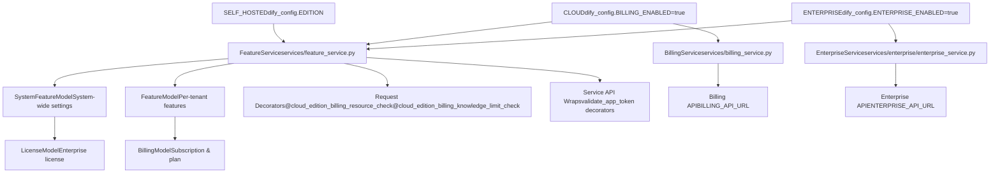
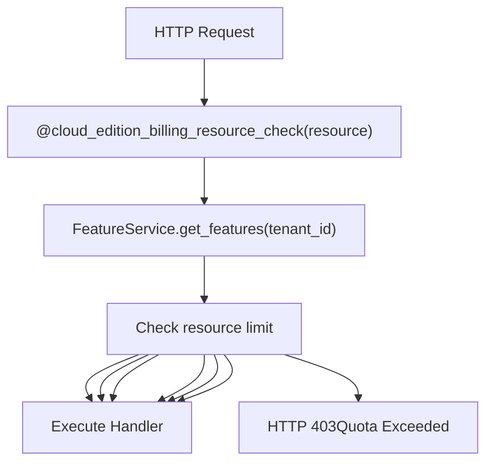
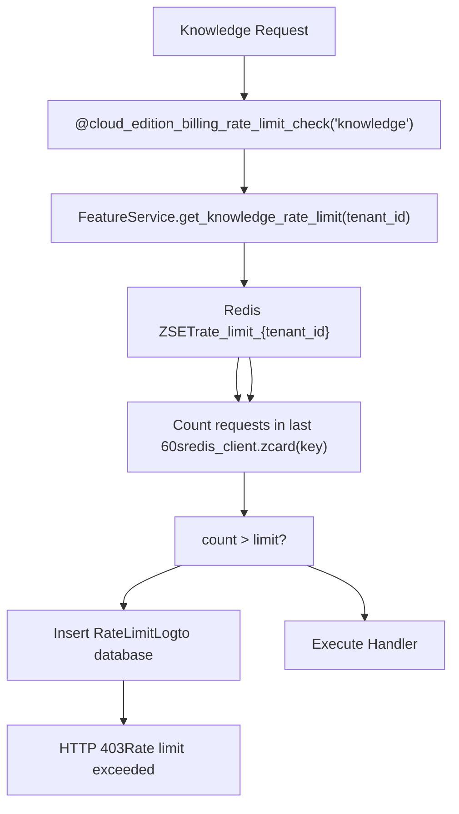
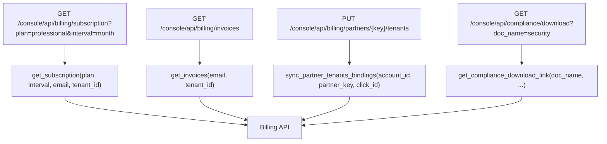

# Billing and Feature Management

Relevant source files

-   [api/controllers/console/\_\_init\_\_.py](https://github.com/langgenius/dify/blob/92dbc94f/api/controllers/console/__init__.py)
-   [api/controllers/console/auth/activate.py](https://github.com/langgenius/dify/blob/92dbc94f/api/controllers/console/auth/activate.py)
-   [api/controllers/console/auth/email\_register.py](https://github.com/langgenius/dify/blob/92dbc94f/api/controllers/console/auth/email_register.py)
-   [api/controllers/console/auth/error.py](https://github.com/langgenius/dify/blob/92dbc94f/api/controllers/console/auth/error.py)
-   [api/controllers/console/auth/forgot\_password.py](https://github.com/langgenius/dify/blob/92dbc94f/api/controllers/console/auth/forgot_password.py)
-   [api/controllers/console/auth/login.py](https://github.com/langgenius/dify/blob/92dbc94f/api/controllers/console/auth/login.py)
-   [api/controllers/console/auth/oauth.py](https://github.com/langgenius/dify/blob/92dbc94f/api/controllers/console/auth/oauth.py)
-   [api/controllers/console/billing/billing.py](https://github.com/langgenius/dify/blob/92dbc94f/api/controllers/console/billing/billing.py)
-   [api/controllers/console/billing/compliance.py](https://github.com/langgenius/dify/blob/92dbc94f/api/controllers/console/billing/compliance.py)
-   [api/controllers/console/error.py](https://github.com/langgenius/dify/blob/92dbc94f/api/controllers/console/error.py)
-   [api/controllers/console/feature.py](https://github.com/langgenius/dify/blob/92dbc94f/api/controllers/console/feature.py)
-   [api/controllers/console/init\_validate.py](https://github.com/langgenius/dify/blob/92dbc94f/api/controllers/console/init_validate.py)
-   [api/controllers/console/setup.py](https://github.com/langgenius/dify/blob/92dbc94f/api/controllers/console/setup.py)
-   [api/controllers/console/version.py](https://github.com/langgenius/dify/blob/92dbc94f/api/controllers/console/version.py)
-   [api/controllers/console/workspace/account.py](https://github.com/langgenius/dify/blob/92dbc94f/api/controllers/console/workspace/account.py)
-   [api/controllers/console/workspace/agent\_providers.py](https://github.com/langgenius/dify/blob/92dbc94f/api/controllers/console/workspace/agent_providers.py)
-   [api/controllers/console/workspace/members.py](https://github.com/langgenius/dify/blob/92dbc94f/api/controllers/console/workspace/members.py)
-   [api/controllers/console/workspace/model\_providers.py](https://github.com/langgenius/dify/blob/92dbc94f/api/controllers/console/workspace/model_providers.py)
-   [api/controllers/console/workspace/models.py](https://github.com/langgenius/dify/blob/92dbc94f/api/controllers/console/workspace/models.py)
-   [api/controllers/console/workspace/workspace.py](https://github.com/langgenius/dify/blob/92dbc94f/api/controllers/console/workspace/workspace.py)
-   [api/controllers/console/wraps.py](https://github.com/langgenius/dify/blob/92dbc94f/api/controllers/console/wraps.py)
-   [api/controllers/service\_api/wraps.py](https://github.com/langgenius/dify/blob/92dbc94f/api/controllers/service_api/wraps.py)
-   [api/libs/encryption.py](https://github.com/langgenius/dify/blob/92dbc94f/api/libs/encryption.py)
-   [api/libs/workspace\_permission.py](https://github.com/langgenius/dify/blob/92dbc94f/api/libs/workspace_permission.py)
-   [api/services/account\_service.py](https://github.com/langgenius/dify/blob/92dbc94f/api/services/account_service.py)
-   [api/services/billing\_service.py](https://github.com/langgenius/dify/blob/92dbc94f/api/services/billing_service.py)
-   [api/services/enterprise/enterprise\_service.py](https://github.com/langgenius/dify/blob/92dbc94f/api/services/enterprise/enterprise_service.py)
-   [api/services/feature\_service.py](https://github.com/langgenius/dify/blob/92dbc94f/api/services/feature_service.py)
-   [api/services/operation\_service.py](https://github.com/langgenius/dify/blob/92dbc94f/api/services/operation_service.py)
-   [api/templates/change\_mail\_confirm\_old\_template\_zh-CN.html](https://github.com/langgenius/dify/blob/92dbc94f/api/templates/change_mail_confirm_old_template_zh-CN.html)
-   [api/templates/transfer\_workspace\_owner\_confirm\_template\_en-US.html](https://github.com/langgenius/dify/blob/92dbc94f/api/templates/transfer_workspace_owner_confirm_template_en-US.html)
-   [api/templates/without-brand/transfer\_workspace\_owner\_confirm\_template\_en-US.html](https://github.com/langgenius/dify/blob/92dbc94f/api/templates/without-brand/transfer_workspace_owner_confirm_template_en-US.html)
-   [api/tests/unit\_tests/controllers/console/auth/test\_account\_activation.py](https://github.com/langgenius/dify/blob/92dbc94f/api/tests/unit_tests/controllers/console/auth/test_account_activation.py)
-   [api/tests/unit\_tests/controllers/console/auth/test\_authentication\_security.py](https://github.com/langgenius/dify/blob/92dbc94f/api/tests/unit_tests/controllers/console/auth/test_authentication_security.py)
-   [api/tests/unit\_tests/controllers/console/auth/test\_email\_verification.py](https://github.com/langgenius/dify/blob/92dbc94f/api/tests/unit_tests/controllers/console/auth/test_email_verification.py)
-   [api/tests/unit\_tests/controllers/console/auth/test\_login\_logout.py](https://github.com/langgenius/dify/blob/92dbc94f/api/tests/unit_tests/controllers/console/auth/test_login_logout.py)
-   [api/tests/unit\_tests/controllers/console/auth/test\_oauth.py](https://github.com/langgenius/dify/blob/92dbc94f/api/tests/unit_tests/controllers/console/auth/test_oauth.py)
-   [api/tests/unit\_tests/controllers/console/auth/test\_password\_reset.py](https://github.com/langgenius/dify/blob/92dbc94f/api/tests/unit_tests/controllers/console/auth/test_password_reset.py)
-   [api/tests/unit\_tests/controllers/console/auth/test\_token\_refresh.py](https://github.com/langgenius/dify/blob/92dbc94f/api/tests/unit_tests/controllers/console/auth/test_token_refresh.py)
-   [api/tests/unit\_tests/controllers/test\_compare\_versions.py](https://github.com/langgenius/dify/blob/92dbc94f/api/tests/unit_tests/controllers/test_compare_versions.py)
-   [api/tests/unit\_tests/libs/test\_encryption.py](https://github.com/langgenius/dify/blob/92dbc94f/api/tests/unit_tests/libs/test_encryption.py)
-   [api/tests/unit\_tests/libs/test\_oauth\_clients.py](https://github.com/langgenius/dify/blob/92dbc94f/api/tests/unit_tests/libs/test_oauth_clients.py)
-   [api/tests/unit\_tests/libs/test\_workspace\_permission.py](https://github.com/langgenius/dify/blob/92dbc94f/api/tests/unit_tests/libs/test_workspace_permission.py)

This document describes the billing integration, feature flag system, and quota enforcement mechanisms in Dify. The system supports three deployment editions (SELF\_HOSTED, CLOUD, ENTERPRISE), each with different feature availability and enforcement strategies. For authentication and workspace management, see [Multi-Tenancy and Authorization](/langgenius/dify/7-multi-tenancy-and-authorization). For API-level access control, see [Service APIs](/langgenius/dify/8-service-apis).

## System Architecture

Dify implements a three-tier feature management system that adapts based on deployment edition:

**Edition Architecture**


Sources: [api/services/feature\_service.py1-368](https://github.com/langgenius/dify/blob/92dbc94f/api/services/feature_service.py#L1-L368) [api/services/billing\_service.py1-393](https://github.com/langgenius/dify/blob/92dbc94f/api/services/billing_service.py#L1-L393) [api/services/enterprise/enterprise\_service.py1-142](https://github.com/langgenius/dify/blob/92dbc94f/api/services/enterprise/enterprise_service.py#L1-L142) [api/configs/dify\_config.py](https://github.com/langgenius/dify/blob/92dbc94f/api/configs/dify_config.py)

## Edition Comparison

| Feature | SELF\_HOSTED | CLOUD | ENTERPRISE |
| --- | --- | --- | --- |
| Billing Integration | ❌ | ✅ | ❌ |
| Plan-based Quotas | ❌ | ✅ (Sandbox/Professional/Team) | ❌ |
| License Validation | ❌ | ❌ | ✅ |
| Workspace Limits | ❌ | Via Billing API | Via License |
| SSO Enforcement | ❌ | ❌ | ✅ |
| Branding Customization | Via ENV | Via Plan | ✅ |
| Workspace Policies | ❌ | ❌ | ✅ |

Sources: [api/services/feature\_service.py175-219](https://github.com/langgenius/dify/blob/92dbc94f/api/services/feature_service.py#L175-L219) [api/controllers/console/wraps.py52-95](https://github.com/langgenius/dify/blob/92dbc94f/api/controllers/console/wraps.py#L52-L95)

## BillingService Architecture

The `BillingService` class provides integration with an external billing API for CLOUD edition deployments. It handles subscription management, quota tracking, and resource usage reporting.

**BillingService Component Diagram**

```mermaid
flowchart TD
    GetInfo["get_info(tenant_id)Subscription & quotas"]
    GetUsageInfo["get_tenant_feature_plan_usage_info(tenant_id)Current usage"]
    UpdateUsage["update_tenant_feature_plan_usage(tenant_id, feature_key, delta)Usage tracking"]
    RefundUsage["refund_tenant_feature_plan_usage(history_id)Rollback"]
    GetPlanBulk["get_plan_bulk(tenant_ids)Batch fetch plans"]
    GetPlanCache["get_plan_bulk_with_cache(tenant_ids)Cached batch fetch"]
    KnowledgeRateLimit["get_knowledge_rate_limit(tenant_id)Rate limit info"]
    IsEmailFreeze["is_email_in_freeze(email)Account freeze check"]
    PlanCache["Plan Cachetenant_plan:{tenant_id}TTL: 600s"]
    SubInfo["/subscription/info"]
    TenantUsage["/tenant-feature-usage/info"]
    UpdateEndpoint["/tenant-feature-usage/usage"]
    RefundEndpoint["/tenant-feature-usage/refund"]
    PlanBatch["/subscription/plan/batch"]
    KnowledgeLimit["/subscription/knowledge-rate-limit"]
    FreezeCheck["/account/in-freeze"]

    GetInfo --> SubInfo
    GetUsageInfo --> TenantUsage
    UpdateUsage --> UpdateEndpoint
    RefundUsage --> RefundEndpoint
    GetPlanBulk --> PlanBatch
    KnowledgeRateLimit --> KnowledgeLimit
    IsEmailFreeze --> FreezeCheck
    GetPlanCache --> PlanCache
    GetPlanCache --> GetPlanBulk
    UpdateEndpoint --> UpdateUsage
    UpdateUsage --> RefundUsage
```


Sources: [api/services/billing\_service.py29-393](https://github.com/langgenius/dify/blob/92dbc94f/api/services/billing_service.py#L29-L393)

### BillingService Key Methods

**Subscription and Plan Management**

```
# Get complete billing information for tenant
billing_info = BillingService.get_info(tenant_id)
# Returns: {
#   "enabled": bool,
#   "subscription": {"plan": str, "interval": str},
#   "members": {"size": int, "limit": int},
#   "apps": {"size": int, "limit": int},
#   "vector_space": {"size": int, "limit": int},
#   ...
# }
```
Sources: [api/services/billing\_service.py40-45](https://github.com/langgenius/dify/blob/92dbc94f/api/services/billing_service.py#L40-L45)

**Bulk Plan Fetching with Cache**

The billing service implements a two-tier caching strategy for batch operations:

```
# Fetch plans for multiple tenants with Redis cache
plans = BillingService.get_plan_bulk_with_cache(['tenant1', 'tenant2'])
# Returns: {"tenant1": {"plan": "professional", "expiration_date": 1234567890}, ...}
```
1.  **First-tier**: Check Redis cache (`tenant_plan:{tenant_id}`, 10-minute TTL)
2.  **Second-tier**: Batch fetch cache misses from billing API (max 200 per request)
3.  **Backfill**: Cache results for future requests

Sources: [api/services/billing\_service.py295-383](https://github.com/langgenius/dify/blob/92dbc94f/api/services/billing_service.py#L295-L383)

**Usage Tracking and Refunds**

```
# Increment usage for a feature
result = BillingService.update_tenant_feature_plan_usage(
    tenant_id="tenant_123",
    feature_key="trigger",
    delta=1  # Positive to consume, negative to add
)
# Returns: {"result": "success", "history_id": "uuid"}

# Refund a previous charge
BillingService.refund_tenant_feature_plan_usage(history_id="uuid")
```
Sources: [api/services/billing\_service.py85-117](https://github.com/langgenius/dify/blob/92dbc94f/api/services/billing_service.py#L85-L117)

**Education Identity Management**

The system supports special pricing for verified educational institutions:

```
# Verify education email
BillingService.EducationIdentity.verify(account_id, account_email)

# Activate education benefits
BillingService.EducationIdentity.activate(account, token, institution, role)

# Check education status
status = BillingService.EducationIdentity.status(account_id)
```
Sources: [api/services/billing\_service.py185-226](https://github.com/langgenius/dify/blob/92dbc94f/api/services/billing_service.py#L185-L226) [api/controllers/console/workspace/account.py439-494](https://github.com/langgenius/dify/blob/92dbc94f/api/controllers/console/workspace/account.py#L439-L494)

## FeatureService and Feature Models

The `FeatureService` aggregates feature flags from multiple sources and returns unified models that controllers use for authorization decisions.

**Feature Model Hierarchy**

```mermaid
flowchart TD
    SystemFeatureModel["SystemFeatureModelservices/feature_service.py:156-173"]
    SSOEnforced["sso_enforced_for_signin: bool"]
    EnableMarketplace["enable_marketplace: bool"]
    EmailLogin["enable_email_code_login: boolenable_email_password_login: bool"]
    AllowRegister["is_allow_register: boolis_allow_create_workspace: bool"]
    LicenseInfo["license: LicenseModel"]
    BrandingInfo["branding: BrandingModel"]
    PluginPermission["plugin_installation_permission: PluginInstallationPermissionModel"]
    FeatureModel["FeatureModelservices/feature_service.py:122-144"]
    BillingInfo["billing: BillingModelenabled, subscription"]
    ResourceLimits["members: LimitationModelapps: LimitationModelvector_space: LimitationModel"]
    QuotaLimits["documents_upload_quota: LimitationModelannotation_quota_limit: LimitationModel"]
    FeatureFlags["can_replace_logo: boolmodel_load_balancing_enabled: boolwebapp_copyright_enabled: bool"]
    UsageQuotas["trigger_event: Quotaapi_rate_limit: Quota"]
    WorkspaceMembers["workspace_members: LicenseLimitationModel"]
    GetSystemFeatures["get_system_features()Returns SystemFeatureModel"]
    GetFeatures["get_features(tenant_id)Returns FeatureModel"]

    SystemFeatureModel --> SSOEnforced
    SystemFeatureModel --> EnableMarketplace
    SystemFeatureModel --> EmailLogin
    SystemFeatureModel --> AllowRegister
    SystemFeatureModel --> LicenseInfo
    SystemFeatureModel --> BrandingInfo
    SystemFeatureModel --> PluginPermission
    FeatureModel --> BillingInfo
    FeatureModel --> ResourceLimits
    FeatureModel --> QuotaLimits
    FeatureModel --> FeatureFlags
    FeatureModel --> UsageQuotas
    FeatureModel --> WorkspaceMembers
    GetSystemFeatures --> SystemFeatureModel
    GetFeatures --> FeatureModel
```


Sources: [api/services/feature\_service.py11-173](https://github.com/langgenius/dify/blob/92dbc94f/api/services/feature_service.py#L11-L173)

### Feature Resolution Flow

> **[Mermaid sequence]**
> *(图表结构无法解析)*

Sources: [api/services/feature\_service.py175-307](https://github.com/langgenius/dify/blob/92dbc94f/api/services/feature_service.py#L175-L307)

### LimitationModel and Quota Checking

The system uses two models for resource limits:

**LimitationModel** - Simple size/limit tracking:

```
class LimitationModel(BaseModel):
    size: int = 0    # Current usage
    limit: int = 0   # Maximum allowed (0 = unlimited)
```
**LicenseLimitationModel** - Enhanced with availability check:

```
class LicenseLimitationModel(BaseModel):
    enabled: bool = False  # Whether limit is enforced
    size: int = 0          # Current usage
    limit: int = 0         # Maximum allowed (0 = unlimited)

    def is_available(self, required: int = 1) -> bool:
        """Check if required amount can be allocated"""
        if not self.enabled or self.limit == 0:
            return True  # No limit enforced
        return (self.limit - self.size) >= required
```
Sources: [api/services/feature\_service.py26-55](https://github.com/langgenius/dify/blob/92dbc94f/api/services/feature_service.py#L26-L55)

## Resource Quota Enforcement

Quota enforcement occurs at two levels: Console API (admin actions) and Service API (programmatic access).

### Console API Enforcement

The `@cloud_edition_billing_resource_check` decorator enforces quotas on admin operations:


Sources: [api/controllers/console/wraps.py97-137](https://github.com/langgenius/dify/blob/92dbc94f/api/controllers/console/wraps.py#L97-L137)

**Example Usage**:

```
@console_ns.route("/workspaces/current/members/invite-email")
class MemberInviteEmailApi(Resource):
    @cloud_edition_billing_resource_check("members")
    def post(self):
        # This endpoint is protected by member quota check
        # Will return 403 if member limit reached
        ...
```
Sources: [api/controllers/console/workspace/members.py88-156](https://github.com/langgenius/dify/blob/92dbc94f/api/controllers/console/workspace/members.py#L88-L156)

### Service API Enforcement

The Service API implements similar checks for API token-based access:

```
@cloud_edition_billing_resource_check(resource: str, api_token_type: str)
def decorator(view):
    api_token = validate_and_get_api_token(api_token_type)
    features = FeatureService.get_features(api_token.tenant_id)

    if features.billing.enabled:
        # Check resource-specific limits
        if resource == "members" and 0 < members.limit <= members.size:
            raise Forbidden("Member limit exceeded")
        elif resource == "documents" and 0 < documents.limit <= documents.size:
            raise Forbidden("Document limit exceeded")
        # ... additional checks
```
Sources: [api/controllers/service\_api/wraps.py130-158](https://github.com/langgenius/dify/blob/92dbc94f/api/controllers/service_api/wraps.py#L130-L158)

### Quota Types

| Resource | Check Location | Enforcement |
| --- | --- | --- |
| `members` | Member invite | Console + Service API |
| `apps` | App creation | Console + Service API |
| `vector_space` | Document indexing | Console + Service API |
| `documents` | Document upload | Console + Service API |
| `workspace_custom` | Logo replacement | Console only |
| `annotation` | Annotation import | Console only |

Sources: [api/controllers/console/wraps.py97-137](https://github.com/langgenius/dify/blob/92dbc94f/api/controllers/console/wraps.py#L97-L137) [api/controllers/service\_api/wraps.py130-158](https://github.com/langgenius/dify/blob/92dbc94f/api/controllers/service_api/wraps.py#L130-L158)

## Rate Limiting

### Knowledge Base Rate Limiting

Knowledge base operations are rate-limited using Redis sorted sets (ZSET) with sliding window:


Sources: [api/controllers/console/wraps.py162-196](https://github.com/langgenius/dify/blob/92dbc94f/api/controllers/console/wraps.py#L162-L196) [api/controllers/service\_api/wraps.py182-217](https://github.com/langgenius/dify/blob/92dbc94f/api/controllers/service_api/wraps.py#L182-L217)

**Implementation Details**:

```
# Get rate limit from billing API (CLOUD) or default to 10
knowledge_rate_limit = FeatureService.get_knowledge_rate_limit(tenant_id)
# Returns: {"enabled": bool, "limit": int, "subscription_plan": str}

# Redis sliding window check
current_time = int(time.time() * 1000)
key = f"rate_limit_{tenant_id}"

redis_client.zadd(key, {current_time: current_time})
redis_client.zremrangebyscore(key, 0, current_time - 60000)  # Remove old entries
request_count = redis_client.zcard(key)

if request_count > knowledge_rate_limit.limit:
    # Log to database for analytics
    rate_limit_log = RateLimitLog(
        tenant_id=tenant_id,
        subscription_plan=knowledge_rate_limit.subscription_plan,
        operation="knowledge"
    )
    db.session.add(rate_limit_log)
    db.session.commit()

    raise Forbidden("Rate limit exceeded")
```
Sources: [api/controllers/console/wraps.py162-196](https://github.com/langgenius/dify/blob/92dbc94f/api/controllers/console/wraps.py#L162-L196) [api/services/feature\_service.py192-200](https://github.com/langgenius/dify/blob/92dbc94f/api/services/feature_service.py#L192-L200)

### Annotation Import Rate Limiting

Annotation imports use dual-tier rate limiting:

| Tier | Limit | Window | Redis Key |
| --- | --- | --- | --- |
| Short-term | 5 requests | 1 minute | `annotation_import_rate_limit:{tenant_id}:1min` |
| Long-term | 20 requests | 1 hour | `annotation_import_rate_limit:{tenant_id}:1hour` |

**Concurrency Control**:

```
@annotation_import_concurrency_limit
def import_annotations():
    # Track active jobs in Redis
    active_jobs_key = f"annotation_import_active:{tenant_id}"
    active_count = redis_client.zcard(active_jobs_key)

    if active_count >= ANNOTATION_IMPORT_MAX_CONCURRENT:
        abort(429, "Too many concurrent imports")
```
Sources: [api/controllers/console/wraps.py345-431](https://github.com/langgenius/dify/blob/92dbc94f/api/controllers/console/wraps.py#L345-L431)

## License Management (Enterprise Edition)

Enterprise deployments validate licenses through the `EnterpriseService`:

**License Status Flow**

> **[Mermaid stateDiagram]**
> *(图表结构无法解析)*

Sources: [api/services/feature\_service.py63-76](https://github.com/langgenius/dify/blob/92dbc94f/api/services/feature_service.py#L63-L76)

**License Model**:

```
class LicenseModel(BaseModel):
    status: LicenseStatus  # none/inactive/active/expiring/expired/lost
    expired_at: str
    workspaces: LicenseLimitationModel  # Workspace count limit
```
**Enforcement**:

```
@enterprise_license_required
def protected_endpoint():
    settings = FeatureService.get_system_features()
    if settings.license.status in [LicenseStatus.INACTIVE,
                                   LicenseStatus.EXPIRED,
                                   LicenseStatus.LOST]:
        raise UnauthorizedAndForceLogout("Invalid license")
```
Sources: [api/controllers/console/wraps.py235-244](https://github.com/langgenius/dify/blob/92dbc94f/api/controllers/console/wraps.py#L235-L244)

### Workspace Policy Enforcement

Enterprise edition supports workspace-level permission policies:

```
class WorkspacePermission(BaseModel):
    workspace_id: str
    allow_member_invite: bool = False
    allow_owner_transfer: bool = False
```
**Permission Check Helper**:

```
def check_workspace_member_invite_permission(workspace_id: str):
    """
    Check at two levels:
    1. Billing/plan level (SANDBOX cannot invite)
    2. Enterprise policy level (admin-configured)
    """
    features = FeatureService.get_features(workspace_id)

    # Level 1: Plan-based check (CLOUD)
    if not features.workspace_members.is_available():
        raise Forbidden("Workspace member limit exceeded")

    # Level 2: Policy-based check (ENTERPRISE)
    if dify_config.ENTERPRISE_ENABLED:
        permission = EnterpriseService.WorkspacePermissionService.get_permission(workspace_id)
        if not permission.allow_member_invite:
            raise Forbidden("Member invitations disabled by policy")
```
Sources: [api/libs/workspace\_permission.py21-55](https://github.com/langgenius/dify/blob/92dbc94f/api/libs/workspace_permission.py#L21-L55) [api/services/enterprise/enterprise\_service.py16-31](https://github.com/langgenius/dify/blob/92dbc94f/api/services/enterprise/enterprise_service.py#L16-L31)

## Billing API Endpoints

The Console API exposes billing management endpoints for CLOUD edition:

**Billing Endpoints**


Sources: [api/controllers/console/billing/billing.py1-87](https://github.com/langgenius/dify/blob/92dbc94f/api/controllers/console/billing/billing.py#L1-L87) [api/controllers/console/billing/compliance.py1-45](https://github.com/langgenius/dify/blob/92dbc94f/api/controllers/console/billing/compliance.py#L1-L45)

**Subscription Management Example**:

```
@console_ns.route("/billing/subscription")
class Subscription(Resource):
    @only_edition_cloud
    def get(self):
        current_user, current_tenant_id = current_account_with_tenant()
        args = SubscriptionQuery.model_validate(request.args)

        # Verify user is owner or admin
        BillingService.is_tenant_owner_or_admin(current_user)

        # Get payment link from billing API
        return BillingService.get_subscription(
            args.plan,      # "professional" or "team"
            args.interval,  # "month" or "year"
            current_user.email,
            current_tenant_id
        )
```
Sources: [api/controllers/console/billing/billing.py31-42](https://github.com/langgenius/dify/blob/92dbc94f/api/controllers/console/billing/billing.py#L31-L42)

## Feature API Endpoints

Clients retrieve feature configuration through dedicated endpoints:

```
@console_ns.route("/features")
class FeatureApi(Resource):
    @login_required
    @account_initialization_required
    def get(self):
        """Get per-tenant feature configuration"""
        _, current_tenant_id = current_account_with_tenant()
        return FeatureService.get_features(current_tenant_id).model_dump()

@console_ns.route("/system-features")
class SystemFeatureApi(Resource):
    def get(self):
        """Get system-wide feature configuration (no auth required)"""
        return FeatureService.get_system_features().model_dump()
```
Sources: [api/controllers/console/feature.py1-44](https://github.com/langgenius/dify/blob/92dbc94f/api/controllers/console/feature.py#L1-L44)

**Example Response Structure**:

```
{
  "billing": {
    "enabled": true,
    "subscription": {
      "plan": "professional",
      "interval": "month"
    }
  },
  "members": {"size": 5, "limit": 10},
  "apps": {"size": 3, "limit": 50},
  "vector_space": {"size": 1024, "limit": 5120},
  "documents_upload_quota": {"size": 100, "limit": 1000},
  "can_replace_logo": true,
  "model_load_balancing_enabled": true,
  "trigger_event": {"usage": 150, "limit": 3000, "reset_date": 1735689600},
  "workspace_members": {"enabled": true, "size": 5, "limit": 10}
}
```
## Account Freeze Mechanism

The billing system implements a 30-day account freeze after deletion:

> **[Mermaid sequence]**
> *(图表结构无法解析)*

Sources: [api/services/billing\_service.py171-178](https://github.com/langgenius/dify/blob/92dbc94f/api/services/billing_service.py#L171-L178) [api/services/account\_service.py237-249](https://github.com/langgenius/dify/blob/92dbc94f/api/services/account_service.py#L237-L249) [api/controllers/console/auth/login.py93-98](https://github.com/langgenius/dify/blob/92dbc94f/api/controllers/console/auth/login.py#L93-L98)

## Integration Points

### Account Creation

```
# api/services/account_service.py:229-279
def create_account(email: str, ...):
    if not FeatureService.get_system_features().is_allow_register:
        raise AccountNotFound()

    # Check if email is frozen (CLOUD only)
    if dify_config.BILLING_ENABLED and BillingService.is_email_in_freeze(email):
        raise AccountRegisterError("Email deleted within 30 days")

    # Create account...
```
Sources: [api/services/account\_service.py229-279](https://github.com/langgenius/dify/blob/92dbc94f/api/services/account_service.py#L229-L279)

### Workspace Creation

```
# api/services/account_service.py:989-1003
def create_tenant(name: str, is_setup: bool = False):
    if not FeatureService.get_system_features().is_allow_create_workspace:
        raise NotAllowedCreateWorkspace()

    # Check workspace limit (ENTERPRISE)
    system_features = FeatureService.get_system_features()
    if not system_features.license.workspaces.is_available():
        raise WorkspacesLimitExceeded()

    # Create tenant...
```
Sources: [api/services/account\_service.py989-1003](https://github.com/langgenius/dify/blob/92dbc94f/api/services/account_service.py#L989-L1003)

### Workspace Display

```
# api/controllers/console/workspace/workspace.py:102-128
@console_ns.route("/workspaces")
class TenantListApi(Resource):
    def get(self):
        tenants = TenantService.get_join_tenants(current_user)

        for tenant in tenants:
            features = FeatureService.get_features(tenant.id)
            tenant_dict = {
                "id": tenant.id,
                "name": tenant.name,
                "plan": features.billing.subscription.plan if features.billing.enabled
                        else CloudPlan.SANDBOX
            }
```
Sources: [api/controllers/console/workspace/workspace.py102-128](https://github.com/langgenius/dify/blob/92dbc94f/api/controllers/console/workspace/workspace.py#L102-L128)

## Configuration

### Environment Variables

```
# Edition control
EDITION=SELF_HOSTED|CLOUD  # Deployment edition

# Billing integration (CLOUD)
BILLING_ENABLED=true
BILLING_API_URL=https://billing.example.com
BILLING_API_SECRET_KEY=secret_key_here

# Enterprise features
ENTERPRISE_ENABLED=true
ENTERPRISE_API_URL=https://enterprise.example.com
ENTERPRISE_API_SECRET_KEY=secret_key_here

# Feature flags
CAN_REPLACE_LOGO=true
MODEL_LB_ENABLED=true
DATASET_OPERATOR_ENABLED=false
EDUCATION_ENABLED=false
```
Sources: [api/configs/dify\_config.py](https://github.com/langgenius/dify/blob/92dbc94f/api/configs/dify_config.py)

### Redis Keys

| Key Pattern | Purpose | TTL |
| --- | --- | --- |
| `tenant_plan:{tenant_id}` | Cached subscription plan | 600s |
| `rate_limit_{tenant_id}` | Knowledge request timestamps | N/A (ZSET) |
| `annotation_import_rate_limit:{tenant_id}:1min` | Annotation import 1-min window | 120s |
| `annotation_import_rate_limit:{tenant_id}:1hour` | Annotation import 1-hour window | 7200s |
| `annotation_import_active:{tenant_id}` | Active import job tracking | N/A (ZSET) |

Sources: [api/services/billing\_service.py35-38](https://github.com/langgenius/dify/blob/92dbc94f/api/services/billing_service.py#L35-L38) [api/controllers/console/wraps.py162-431](https://github.com/langgenius/dify/blob/92dbc94f/api/controllers/console/wraps.py#L162-L431)

This billing and feature management system provides flexible, edition-aware resource control while maintaining a unified API surface for clients through the `FeatureService` abstraction layer.
