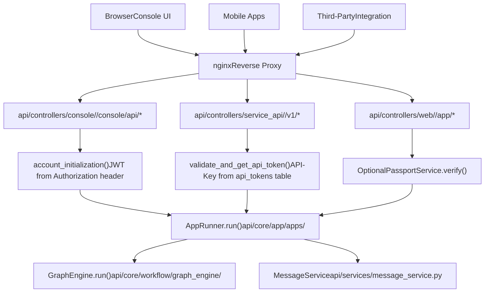

# Service APIs and External Integration

Relevant source files

-   [web/app/components/develop/template/template.en.mdx](https://github.com/langgenius/dify/blob/92dbc94f/web/app/components/develop/template/template.en.mdx)
-   [web/app/components/develop/template/template.ja.mdx](https://github.com/langgenius/dify/blob/92dbc94f/web/app/components/develop/template/template.ja.mdx)
-   [web/app/components/develop/template/template.zh.mdx](https://github.com/langgenius/dify/blob/92dbc94f/web/app/components/develop/template/template.zh.mdx)
-   [web/app/components/develop/template/template\_advanced\_chat.en.mdx](https://github.com/langgenius/dify/blob/92dbc94f/web/app/components/develop/template/template_advanced_chat.en.mdx)
-   [web/app/components/develop/template/template\_advanced\_chat.ja.mdx](https://github.com/langgenius/dify/blob/92dbc94f/web/app/components/develop/template/template_advanced_chat.ja.mdx)
-   [web/app/components/develop/template/template\_advanced\_chat.zh.mdx](https://github.com/langgenius/dify/blob/92dbc94f/web/app/components/develop/template/template_advanced_chat.zh.mdx)
-   [web/app/components/develop/template/template\_chat.en.mdx](https://github.com/langgenius/dify/blob/92dbc94f/web/app/components/develop/template/template_chat.en.mdx)
-   [web/app/components/develop/template/template\_chat.ja.mdx](https://github.com/langgenius/dify/blob/92dbc94f/web/app/components/develop/template/template_chat.ja.mdx)
-   [web/app/components/develop/template/template\_chat.zh.mdx](https://github.com/langgenius/dify/blob/92dbc94f/web/app/components/develop/template/template_chat.zh.mdx)
-   [web/app/components/develop/template/template\_workflow.en.mdx](https://github.com/langgenius/dify/blob/92dbc94f/web/app/components/develop/template/template_workflow.en.mdx)
-   [web/app/components/develop/template/template\_workflow.ja.mdx](https://github.com/langgenius/dify/blob/92dbc94f/web/app/components/develop/template/template_workflow.ja.mdx)
-   [web/app/components/develop/template/template\_workflow.zh.mdx](https://github.com/langgenius/dify/blob/92dbc94f/web/app/components/develop/template/template_workflow.zh.mdx)

This document details the external-facing Service APIs that enable integration with Dify applications. These APIs provide programmatic access to chat, completion, and workflow execution capabilities, supporting both real-time streaming and blocking response modes.

For information about internal Console APIs used by the web UI for administration, see [API Architecture and Response Modes](/langgenius/dify/8.1-api-architecture-and-response-modes). For authentication and multi-tenancy concepts, see [Authentication and Authorization](/langgenius/dify/7-multi-tenancy-and-authorization).

---

## API Architecture Overview

Dify exposes three distinct API surfaces, each serving different access patterns and authentication requirements.

### API Surface Classification

Dify exposes three API surfaces with distinct authentication and routing patterns. All routes are handled by the Flask application on port 5001, with Nginx acting as a reverse proxy.


The Service API routes are mounted at `/v1` and `/api` prefixes, with controllers organized by application type. API keys are validated against the `api_tokens` table, which stores keys in the format `app-{random_string}`.

**Sources:** [web/app/components/develop/template/template\_chat.en.mdx1-30](https://github.com/langgenius/dify/blob/92dbc94f/web/app/components/develop/template/template_chat.en.mdx#L1-L30) [web/app/components/develop/template/template\_workflow.en.mdx1-30](https://github.com/langgenius/dify/blob/92dbc94f/web/app/components/develop/template/template_workflow.en.mdx#L1-L30)

### API Endpoint Structure

| API Surface | Base Path | Authentication | Purpose | Controller Location |
| --- | --- | --- | --- | --- |
| **Console API** | `/console/api/*` | OAuth2 (JWT) | Admin operations: dataset management, app configuration, model settings | `api/controllers/console/` |
| **Service API** | `/v1/*` `/api/*` | API-Key (Bearer) | Application execution: chat, completion, workflow runs | `api/controllers/service_api/` |
| **Public API** | `/app/*` | Optional API-Key | Publicly shared applications with optional authentication | `api/controllers/web/` |

The Service API is the primary integration point for external systems. Each endpoint is documented in MDX template files within `web/app/components/develop/template/` for display in the web UI. API keys are scoped to specific applications and stored in the `api_tokens` table with `app_id` foreign key. The key format is `app-{random_string}` and must be included in the `Authorization` header as `Bearer {API_KEY}`.

**Key Service API Endpoints:**

-   `POST /v1/chat-messages` - Chat application endpoint ([service\_api/app/chat.py](https://github.com/langgenius/dify/blob/92dbc94f/service_api/app/chat.py))
-   `POST /v1/completion-messages` - Completion application endpoint ([service\_api/app/completion.py](https://github.com/langgenius/dify/blob/92dbc94f/service_api/app/completion.py))
-   `POST /v1/workflows/run` - Workflow execution endpoint ([service\_api/app/workflow.py](https://github.com/langgenius/dify/blob/92dbc94f/service_api/app/workflow.py))
-   `POST /v1/files/upload` - File upload for multimodal inputs ([service\_api/app/file.py](https://github.com/langgenius/dify/blob/92dbc94f/service_api/app/file.py))
-   `GET /v1/messages` - Retrieve conversation history ([service\_api/app/conversation.py](https://github.com/langgenius/dify/blob/92dbc94f/service_api/app/conversation.py))

**Sources:** [web/app/components/develop/template/template\_chat.en.mdx12-20](https://github.com/langgenius/dify/blob/92dbc94f/web/app/components/develop/template/template_chat.en.mdx#L12-L20) [web/app/components/develop/template/template\_workflow.en.mdx12-20](https://github.com/langgenius/dify/blob/92dbc94f/web/app/components/develop/template/template_workflow.en.mdx#L12-L20)

### Response Mode Architecture

Service APIs support two response modes that fundamentally change how results are delivered:


**Streaming Mode** (recommended):

-   Uses Server-Sent Events (SSE) protocol
-   Implements typewriter-like progressive output
-   Avoids Cloudflare 100-second timeout
-   Events prefixed with `data:`, separated by `\n\n`
-   Supports rich event taxonomy for real-time feedback

**Blocking Mode**:

-   Returns complete result after execution
-   May be interrupted on long-running requests
-   Simpler integration but less user-friendly
-   Not supported for Agent Assistant applications

**Sources:** [web/app/components/develop/template/template\_chat.en.mdx44-50](https://github.com/langgenius/dify/blob/92dbc94f/web/app/components/develop/template/template_chat.en.mdx#L44-L50) [web/app/components/develop/template/template\_workflow.en.mdx54-57](https://github.com/langgenius/dify/blob/92dbc94f/web/app/components/develop/template/template_workflow.en.mdx#L54-L57)

---

## Chat Application APIs

Chat applications maintain conversation state, enabling context-aware multi-turn dialogues. The primary endpoint is `POST /chat-messages`.

### Chat Message Endpoint

The `POST /v1/chat-messages` endpoint handles conversational interactions with session state management. The endpoint is implemented in [api/controllers/service\_api/app/chat.py](https://github.com/langgenius/dify/blob/92dbc94f/api/controllers/service_api/app/chat.py)


**Advanced Chat Applications:** Advanced Chat apps (those with workflow orchestration enabled) emit additional workflow execution events including `workflow_started`, `node_started`, `node_finished`, and `workflow_finished`. These events provide detailed tracing of the workflow execution graph.

**Sources:** [web/app/components/develop/template/template\_chat.en.mdx24-91](https://github.com/langgenius/dify/blob/92dbc94f/web/app/components/develop/template/template_chat.en.mdx#L24-L91) [web/app/components/develop/template/template\_chat.en.mdx106-178](https://github.com/langgenius/dify/blob/92dbc94f/web/app/components/develop/template/template_chat.en.mdx#L106-L178) [web/app/components/develop/template/template\_advanced\_chat.en.mdx24-230](https://github.com/langgenius/dify/blob/92dbc94f/web/app/components/develop/template/template_advanced_chat.en.mdx#L24-L230)

### Request Body Structure

The chat message request body contains the following fields:

| Parameter | Type | Required | Description | Example Value |
| --- | --- | --- | --- | --- |
| `query` | string | Yes | User input/question content | `"What are the specs of iPhone 13?"` |
| `inputs` | object | No | Variable values defined by app | `{"name": "John"}` (default: `{}`) |
| `conversation_id` | string | No | Continue existing conversation | `"45701982-8118-4bc5-8e9b-64562b4555f2"` |
| `response_mode` | string | Yes | Response delivery mode | `"streaming"` or `"blocking"` |
| `user` | string | Yes | End-user identifier | `"abc-123"` |
| `files` | array\[object\] | No | Multimodal file inputs | See file object structure below |
| `auto_generate_name` | bool | No | Auto-generate conversation title | `true` (default) |
| `workflow_id` | string | No | Workflow version UUID | `"dfjasklfjdslag"` |
| `trace_id` | string | No | Distributed tracing ID | `"trace-12345"` |

**File Object Structure:**

Each file object in the `files` array contains:

```
{
  "type": "image",
  "transfer_method": "remote_url",
  "url": "https://example.com/image.png"
}
```
Or for uploaded files:

```
{
  "type": "document",
  "transfer_method": "local_file",
  "upload_file_id": "72fa9618-8f89-4a37-9b33-7e1178a24a67"
}
```
**Supported File Types:**

-   `type: "document"` - TXT, MD, MARKDOWN, MDX, PDF, HTML, XLSX, XLS, DOCX, CSV, PPTX, PPT, XML, EPUB
-   `type: "image"` - JPG, JPEG, PNG, GIF, WEBP, SVG
-   `type: "audio"` - MP3, M4A, WAV, WEBM, MPGA
-   `type: "video"` - MP4, MOV, MPEG, WEBM
-   `type: "custom"` - Other file types

**Sources:** [web/app/components/develop/template/template\_chat.en.mdx36-86](https://github.com/langgenius/dify/blob/92dbc94f/web/app/components/develop/template/template_chat.en.mdx#L36-L86) [web/app/components/develop/template/template\_chat.en.mdx58-71](https://github.com/langgenius/dify/blob/92dbc94f/web/app/components/develop/template/template_chat.en.mdx#L58-L71)

### Streaming Event Types

When `response_mode` is `streaming`, the API returns Server-Sent Events with the following event types:

#### Text Generation Events

**`event: message`** - LLM text chunk

```
{
  "event": "message",
  "task_id": "900bbd43-dc0b-4383-a372-aa6e6c414227",
  "message_id": "663c5084-a254-4040-8ad3-51f2a3c1a77c",
  "conversation_id": "45701982-8118-4bc5-8e9b-64562b4555f2",
  "answer": " Hello",
  "created_at": 1705398420
}
```
**`event: agent_message`** - Agent mode text chunk (only in Agent Assistant mode)

```
{
  "event": "agent_message",
  "task_id": "...",
  "message_id": "...",
  "conversation_id": "...",
  "answer": " thinking...",
  "created_at": 1705398420
}
```
**Sources:** [web/app/components/develop/template/template\_chat.en.mdx115-126](https://github.com/langgenius/dify/blob/92dbc94f/web/app/components/develop/template/template_chat.en.mdx#L115-L126)

#### Agent Reasoning Events

**`event: agent_thought`** - Agent reasoning and tool invocation (Agent mode only)

```
{
  "event": "agent_thought",
  "id": "592c84cf-07ee-441c-9dcc-ffc66c033469",
  "task_id": "...",
  "message_id": "...",
  "position": 1,
  "thought": "I need to search for information",
  "observation": "Search results: ...",
  "tool": "google_search;dalle3",
  "tool_input": "{\"google_search\": {\"query\": \"cat\"}}",
  "created_at": 1705395332,
  "message_files": ["file_id_1"],
  "conversation_id": "..."
}
```
**Sources:** [web/app/components/develop/template/template\_chat.en.mdx137-150](https://github.com/langgenius/dify/blob/92dbc94f/web/app/components/develop/template/template_chat.en.mdx#L137-L150)

#### File Events

**`event: message_file`** - File generated by tool or uploaded

```
{
  "event": "message_file",
  "id": "d75b7a5c-ce5e-442e-ab1b-d6a5e5b557b0",
  "type": "image",
  "belongs_to": "assistant",
  "url": "http://example.com/files/tools/xyz.png",
  "conversation_id": "..."
}
```
**Sources:** [web/app/components/develop/template/template\_chat.en.mdx150-155](https://github.com/langgenius/dify/blob/92dbc94f/web/app/components/develop/template/template_chat.en.mdx#L150-L155)

#### Audio Events

**`event: tts_message`** - Text-to-speech audio chunk (when auto-play enabled)

```
{
  "event": "tts_message",
  "task_id": "...",
  "message_id": "...",
  "audio": "base64_encoded_mp3_chunk",
  "created_at": 1705395332
}
```
**`event: tts_message_end`** - Audio stream end marker

```
{
  "event": "tts_message_end",
  "task_id": "...",
  "message_id": "...",
  "audio": "",
  "created_at": 1705395332
}
```
**Sources:** [web/app/components/develop/template/template\_chat.en.mdx127-143](https://github.com/langgenius/dify/blob/92dbc94f/web/app/components/develop/template/template_chat.en.mdx#L127-L143)

#### Completion Events

**`event: message_end`** - Stream completion with metadata

```
{
  "event": "message_end",
  "task_id": "...",
  "message_id": "...",
  "conversation_id": "...",
  "metadata": {
    "usage": {
      "prompt_tokens": 1033,
      "completion_tokens": 135,
      "total_tokens": 1168,
      "total_price": "0.0013030",
      "currency": "USD",
      "latency": 1.381760165997548
    },
    "retriever_resources": [
      {
        "position": 1,
        "dataset_id": "...",
        "dataset_name": "iPhone",
        "document_id": "...",
        "segment_id": "...",
        "score": 0.98457545,
        "content": "..."
      }
    ]
  }
}
```
**Sources:** [web/app/components/develop/template/template\_chat.en.mdx156-162](https://github.com/langgenius/dify/blob/92dbc94f/web/app/components/develop/template/template_chat.en.mdx#L156-L162)

#### Control Events

**`event: message_replace`** - Content moderation replacement

```
{
  "event": "message_replace",
  "task_id": "...",
  "message_id": "...",
  "conversation_id": "...",
  "answer": "I cannot help with that request.",
  "created_at": 1705395332
}
```
**`event: error`** - Exception during streaming

```
{
  "event": "error",
  "task_id": "...",
  "message_id": "...",
  "status": 400,
  "code": "provider_quota_exceeded",
  "message": "Model invocation quota insufficient"
}
```
**`event: ping`** - Keepalive (every 10 seconds)

**Sources:** [web/app/components/develop/template/template\_chat.en.mdx163-177](https://github.com/langgenius/dify/blob/92dbc94f/web/app/components/develop/template/template_chat.en.mdx#L163-L177)

### Conversation Management

Chat conversations persist across multiple messages, maintaining context and history.

**Conversation Lifecycle:**

1.  First message: omit `conversation_id`, system creates new conversation
2.  Subsequent messages: include `conversation_id` from previous response
3.  Conversation stored in `conversations` table with summary and name
4.  Messages linked via `conversation_id` foreign key

**Conversation History Endpoint:**

```
GET /messages?conversation_id={id}&user={user}&first_id={id}&limit=20
```
Returns paginated message history in reverse chronological order with:

-   Message inputs and query
-   Answer content
-   Agent thoughts (if Agent mode)
-   Message files
-   Retriever resources (RAG citations)
-   Feedback ratings

**Sources:** [web/app/components/develop/template/template\_chat.en.mdx660-717](https://github.com/langgenius/dify/blob/92dbc94f/web/app/components/develop/template/template_chat.en.mdx#L660-L717)

### Stop Generation Endpoint

For streaming mode, generation can be stopped mid-stream:

```
POST /chat-messages/:task_id/stop
Body: {"user": "abc-123"}
Response: {"result": "success"}
```
The `task_id` is provided in streaming event responses. This endpoint cancels the ongoing generation and cleans up resources.

**Sources:** [web/app/components/develop/template/template\_chat.en.mdx442-467](https://github.com/langgenius/dify/blob/92dbc94f/web/app/components/develop/template/template_chat.en.mdx#L442-L467)

### Error Responses

Service APIs return consistent error structures in both blocking and streaming modes.

**Blocking Mode Error Response:**

```
{
  "code": "provider_quota_exceeded",
  "message": "Model invocation quota insufficient",
  "status": 400
}
```
**Streaming Mode Error Event:**

```
data: {"event": "error", "task_id": "...", "message_id": "...", "status": 400, "code": "provider_quota_exceeded", "message": "Model invocation quota insufficient"}
```
**Common Error Codes:**

| HTTP Status | Error Code | Description |
| --- | --- | --- |
| 404 | \- | Conversation does not exist |
| 400 | `invalid_param` | Abnormal parameter input |
| 400 | `app_unavailable` | App configuration unavailable |
| 400 | `provider_not_initialize` | No available model credential configuration |
| 400 | `provider_quota_exceeded` | Model invocation quota insufficient |
| 400 | `model_currently_not_support` | Current model unavailable |
| 400 | `workflow_not_found` | Specified workflow version not found |
| 400 | `draft_workflow_error` | Cannot use draft workflow version |
| 400 | `workflow_id_format_error` | Invalid workflow\_id format (expected UUID) |
| 400 | `completion_request_error` | Text generation failed |
| 400 | `workflow_request_error` | Workflow execution failed |
| 500 | \- | Internal server error |

**Sources:** [web/app/components/develop/template/template\_chat.en.mdx179-190](https://github.com/langgenius/dify/blob/92dbc94f/web/app/components/develop/template/template_chat.en.mdx#L179-L190) [web/app/components/develop/template/template\_chat.en.mdx170-177](https://github.com/langgenius/dify/blob/92dbc94f/web/app/components/develop/template/template_chat.en.mdx#L170-L177) [web/app/components/develop/template/template\_workflow.en.mdx166-173](https://github.com/langgenius/dify/blob/92dbc94f/web/app/components/develop/template/template_workflow.en.mdx#L166-L173)

---

## Completion Application APIs

Completion applications are stateless, suitable for single-turn tasks like translation, summarization, or text generation. Unlike chat applications, they do not maintain conversation history.

### Completion Message Endpoint

The `POST /v1/completion-messages` endpoint handles stateless text generation requests without conversation history. The endpoint is implemented in [api/controllers/service\_api/app/completion.py](https://github.com/langgenius/dify/blob/92dbc94f/api/controllers/service_api/app/completion.py)


**Key Differences from Chat:**

-   No `conversation_id` parameter or state management
-   `inputs` object must contain at least one key/value pair
-   Messages stored without conversation linkage (`conversation_id = NULL`)
-   No agent-related events (`agent_thought`, `agent_message`)

**Sources:** [web/app/components/develop/template/template.en.mdx24-73](https://github.com/langgenius/dify/blob/92dbc94f/web/app/components/develop/template/template.en.mdx#L24-L73)

### Request Structure

The completion endpoint requires at least one key/value pair in `inputs`, typically including `query`:

```
{
  "inputs": {
    "query": "Translate this to French: Hello, world!"
  },
  "response_mode": "streaming",
  "user": "abc-123",
  "files": []
}
```
Key differences from chat endpoint:

-   No `conversation_id` parameter
-   `inputs` must contain at least one key/value pair
-   Typically uses `query` key for input text
-   Each request is independent

**Sources:** [web/app/components/develop/template/template.en.mdx36-69](https://github.com/langgenius/dify/blob/92dbc94f/web/app/components/develop/template/template.en.mdx#L36-L69)

### Streaming Events

Completion applications support a subset of chat events:

**`event: message`** - Text chunk

```
{
  "event": "message",
  "task_id": "900bbd43-...",
  "message_id": "663c5084-...",
  "answer": " Bonjour",
  "created_at": 1705398420
}
```
**`event: message_end`** - Completion with metadata

```
{
  "event": "message_end",
  "task_id": "...",
  "message_id": "...",
  "metadata": {
    "usage": {...},
    "retriever_resources": [...]
  }
}
```
**Note:** Completion applications do not emit `agent_thought`, `agent_message`, or `conversation_id` events since they are stateless.

**Sources:** [web/app/components/develop/template/template.en.mdx93-104](https://github.com/langgenius/dify/blob/92dbc94f/web/app/components/develop/template/template.en.mdx#L93-L104)

---

## Workflow Application APIs

Workflow applications execute directed acyclic graphs (DAGs) of nodes, supporting complex multi-step processes. Two endpoints are available for workflow execution.

### Workflow Execution Architecture

Workflow applications execute directed acyclic graphs (DAGs) with two endpoint variations. The primary endpoint is `POST /v1/workflows/run`, implemented in [api/controllers/service\_api/app/workflow.py](https://github.com/langgenius/dify/blob/92dbc94f/api/controllers/service_api/app/workflow.py)


**Workflow Graph Structure:** Workflows are stored as JSON in the `workflows.graph` column, containing:

-   `nodes`: Array of node definitions with `id`, `type`, `data`
-   `edges`: Array of connections between nodes
-   `viewport`: Canvas display metadata

The `GraphEngine` ([api/core/workflow/graph\_engine/graph\_engine.py](https://github.com/langgenius/dify/blob/92dbc94f/api/core/workflow/graph_engine/graph_engine.py)) parses this structure and executes nodes in dependency order.

**Sources:** [web/app/components/develop/template/template\_workflow.en.mdx24-89](https://github.com/langgenius/dify/blob/92dbc94f/web/app/components/develop/template/template_workflow.en.mdx#L24-L89) [web/app/components/develop/template/template\_workflow.zh.mdx22-173](https://github.com/langgenius/dify/blob/92dbc94f/web/app/components/develop/template/template_workflow.zh.mdx#L22-L173) [web/app/components/develop/template/template\_workflow.en.mdx98-154](https://github.com/langgenius/dify/blob/92dbc94f/web/app/components/develop/template/template_workflow.en.mdx#L98-L154)

### Default Workflow Endpoint

Execute the published workflow version:

```
POST /workflows/run
```
**Request Body:**

```
{
  "inputs": {
    "user_query": "Analyze this document",
    "file_list": [
      {
        "type": "document",
        "transfer_method": "local_file",
        "upload_file_id": "uuid",
        "type": "document"
      }
    ]
  },
  "response_mode": "streaming",
  "user": "abc-123",
  "trace_id": "optional-trace-id"
}
```
**Key Features:**

-   `inputs` can contain file array variables for document processing
-   File arrays support document, image, audio, video, and custom types
-   Each file specified by `transfer_method` (`remote_url` or `local_file`)
-   Uses default published workflow version

**Sources:** [web/app/components/develop/template/template\_workflow.en.mdx34-68](https://github.com/langgenius/dify/blob/92dbc94f/web/app/components/develop/template/template_workflow.en.mdx#L34-L68)

### Specific Version Endpoint

Execute a specific workflow version by UUID:

```
POST /workflows/:workflow_id/run
```
The `workflow_id` path parameter is obtained from the version history interface in the web UI. This allows executing specific workflow versions for testing or rollback scenarios.

Request body structure is identical to `/workflows/run`, but the workflow version is specified via the URL path rather than using the default published version.

**Sources:** [web/app/components/develop/template/template\_workflow.zh.mdx324-369](https://github.com/langgenius/dify/blob/92dbc94f/web/app/components/develop/template/template_workflow.zh.mdx#L324-L369)

### Streaming Event Flow

Workflow execution emits a rich event stream that tracks progress through the graph:

#### Workflow Lifecycle Events

**`event: workflow_started`** - Execution begins

```
{
  "event": "workflow_started",
  "task_id": "5ad4cb98-f0c7-4085-b384-88c403be6290",
  "workflow_run_id": "5ad498-f0c7-4085-b384-88cbe6290",
  "data": {
    "id": "5ad498-f0c7-4085-b384-88cbe6290",
    "workflow_id": "dfjasklfjdslag",
    "created_at": 1679586595
  }
}
```
**`event: workflow_finished`** - Execution complete

```
{
  "event": "workflow_finished",
  "task_id": "...",
  "workflow_run_id": "...",
  "data": {
    "id": "...",
    "workflow_id": "...",
    "status": "succeeded",  // or "failed", "stopped"
    "outputs": {"result": "..."},
    "error": null,
    "elapsed_time": 5.234,
    "total_tokens": 3562,
    "total_steps": 8,
    "created_at": 1679586595,
    "finished_at": 1679586600
  }
}
```
**Sources:** [web/app/components/develop/template/template\_workflow.en.mdx99-107](https://github.com/langgenius/dify/blob/92dbc94f/web/app/components/develop/template/template_workflow.en.mdx#L99-L107) [web/app/components/develop/template/template\_workflow.en.mdx194-209](https://github.com/langgenius/dify/blob/92dbc94f/web/app/components/develop/template/template_workflow.en.mdx#L194-L209)

#### Node Execution Events

**`event: node_started`** - Node begins execution

```
{
  "event": "node_started",
  "task_id": "...",
  "workflow_run_id": "...",
  "data": {
    "id": "...",
    "node_id": "dfjasklfjdslag",
    "node_type": "llm",
    "title": "Text Generator",
    "index": 3,
    "predecessor_node_id": "previous-node-id",
    "inputs": {"prompt": "Generate text about..."},
    "created_at": 1679586595
  }
}
```
**`event: node_finished`** - Node completes

```
{
  "event": "node_finished",
  "task_id": "...",
  "workflow_run_id": "...",
  "data": {
    "id": "...",
    "node_id": "...",
    "node_type": "llm",
    "title": "Text Generator",
    "index": 3,
    "inputs": {...},
    "process_data": {...},
    "outputs": {"text": "Generated content..."},
    "status": "succeeded",
    "error": null,
    "elapsed_time": 2.341,
    "execution_metadata": {
      "total_tokens": 1234,
      "total_price": "0.0123",
      "currency": "USD"
    },
    "created_at": 1679586595
  }
}
```
**Sources:** [web/app/components/develop/template/template\_workflow.en.mdx108-148](https://github.com/langgenius/dify/blob/92dbc94f/web/app/components/develop/template/template_workflow.en.mdx#L108-L148)

#### Text Streaming Event

**`event: text_chunk`** - Progressive text output

```
{
  "event": "text_chunk",
  "task_id": "...",
  "workflow_run_id": "...",
  "data": {
    "text": "Generated text...",
    "from_variable_selector": ["node_id", "output_variable"]
  }
}
```
The `from_variable_selector` array identifies the source node and variable that produced the text, enabling developers to trace output origins.

**Sources:** [web/app/components/develop/template/template\_workflow.en.mdx120-127](https://github.com/langgenius/dify/blob/92dbc94f/web/app/components/develop/template/template_workflow.en.mdx#L120-L127)

### Blocking Mode Response

When `response_mode` is `blocking`, the API returns a single JSON response after workflow completion:

```
{
  "workflow_run_id": "djflajgkldjgd",
  "task_id": "9da23599-e713-473b-982c-4328d4f5c78a",
  "data": {
    "id": "fdlsjfjejkghjda",
    "workflow_id": "fldjaslkfjlsda",
    "status": "succeeded",
    "outputs": {
      "text": "Final output",
      "summary": "Document summary..."
    },
    "error": null,
    "elapsed_time": 8.456,
    "total_tokens": 5432,
    "total_steps": 12,
    "created_at": 1705407629,
    "finished_at": 1705407637
  }
}
```
**Note:** Blocking mode may timeout after 100 seconds due to Cloudflare restrictions. Streaming mode is recommended for production use.

**Sources:** [web/app/components/develop/template/template\_workflow.en.mdx74-89](https://github.com/langgenius/dify/blob/92dbc94f/web/app/components/develop/template/template_workflow.en.mdx#L74-L89)

### Error Handling

Workflow-specific error codes:

| Status | Code | Description |
| --- | --- | --- |
| 400 | `invalid_param` | Abnormal parameter input |
| 400 | `app_unavailable` | App configuration unavailable |
| 400 | `provider_not_initialize` | No available model credentials |
| 400 | `provider_quota_exceeded` | Model quota insufficient |
| 400 | `model_currently_not_support` | Current model unavailable |
| 400 | `workflow_not_found` | Specified workflow version not found |
| 400 | `draft_workflow_error` | Cannot use draft workflow version |
| 400 | `workflow_id_format_error` | Invalid workflow\_id (must be UUID) |
| 400 | `workflow_request_error` | Workflow execution failed |
| 500 | \- | Internal server error |

**Sources:** [web/app/components/develop/template/template\_workflow.zh.mdx475-485](https://github.com/langgenius/dify/blob/92dbc94f/web/app/components/develop/template/template_workflow.zh.mdx#L475-L485)

---

## File Upload and Multimodal APIs

File upload enables multimodal understanding by allowing users to submit images, documents, audio, and video alongside text queries.

### File Upload Flow

Files can be uploaded and referenced in chat or workflow requests for multimodal processing. The upload endpoint is `POST /v1/files/upload`, implemented in [api/controllers/service\_api/app/file.py](https://github.com/langgenius/dify/blob/92dbc94f/api/controllers/service_api/app/file.py)


**Storage Implementation:** The `StorageService` ([api/core/file/file\_manager.py](https://github.com/langgenius/dify/blob/92dbc94f/api/core/file/file_manager.py)) provides a unified interface for multiple storage backends:

-   `S3Storage` - AWS S3 or S3-compatible services
-   `AzureStorage` - Azure Blob Storage
-   `AliyunStorage` - Alibaba Cloud OSS
-   `LocalStorage` - Local filesystem storage

Storage backend is configured via `STORAGE_TYPE` environment variable and corresponding credentials.

**Sources:** [web/app/components/develop/template/template\_chat.en.mdx293-362](https://github.com/langgenius/dify/blob/92dbc94f/web/app/components/develop/template/template_chat.en.mdx#L293-L362) [web/app/components/develop/template/template\_chat.en.mdx365-439](https://github.com/langgenius/dify/blob/92dbc94f/web/app/components/develop/template/template_chat.en.mdx#L365-L439) [web/app/components/develop/template/template\_workflow.en.mdx34-52](https://github.com/langgenius/dify/blob/92dbc94f/web/app/components/develop/template/template_workflow.en.mdx#L34-L52)

### File Upload Endpoint

Upload files for use in subsequent message or workflow requests:

```
POST /files/upload
Content-Type: multipart/form-data
```
**Request:**

```
curl -X POST 'https://api.dify.ai/v1/files/upload' \
  --header 'Authorization: Bearer {api_key}' \
  --form 'file=@localfile.png;type=image/png' \
  --form 'user=abc-123'
```
**Response:**

```
{
  "id": "72fa9618-8f89-4a37-9b33-7e1178a24a67",
  "name": "example.png",
  "size": 1024,
  "extension": "png",
  "mime_type": "image/png",
  "created_by": "6ad1ab0a-73ff-4ac1-b9e4-cdb312f71f13",
  "created_at": 1577836800
}
```
The returned `id` is used as `upload_file_id` in subsequent API calls.

**Sources:** [web/app/components/develop/template/template\_chat.en.mdx298-360](https://github.com/langgenius/dify/blob/92dbc94f/web/app/components/develop/template/template_chat.en.mdx#L298-L360)

### Supported File Types

The `/files/upload` endpoint and `files` parameter support multiple file categories.

| File Type | Supported Extensions | Use Case |
| --- | --- | --- |
| **document** | TXT, MD, MARKDOWN, MDX, PDF, HTML, XLSX, XLS, VTT, PROPERTIES, DOC, DOCX, CSV, EML, MSG, PPTX, PPT, XML, EPUB | Document parsing and text extraction |
| **image** | JPG, JPEG, PNG, GIF, WEBP, SVG | Vision models and image understanding |
| **audio** | MP3, M4A, WAV, WEBM, MPGA | Speech-to-text and audio analysis |
| **video** | MP4, MOV, MPEG, WEBM | Video understanding models |
| **custom** | Other file types | Custom processing workflows |

**Model Capability Requirements:**

-   Vision capabilities required for image processing
-   Audio transcription models required for audio files
-   Video understanding models required for video files
-   Document parsing available for all models

File type validation occurs during upload. Unsupported types return `415` status with `unsupported_file_type` error code.

**Sources:** [web/app/components/develop/template/template\_chat.en.mdx59-66](https://github.com/langgenius/dify/blob/92dbc94f/web/app/components/develop/template/template_chat.en.mdx#L59-L66) [web/app/components/develop/template/template\_workflow.en.mdx38-47](https://github.com/langgenius/dify/blob/92dbc94f/web/app/components/develop/template/template_workflow.en.mdx#L38-L47)

### File Transfer Methods

Files can be referenced in API calls using two methods:

**1\. Local File Upload:**

```
{
  "files": [
    {
      "type": "image",
      "transfer_method": "local_file",
      "upload_file_id": "72fa9618-8f89-4a37-9b33-7e1178a24a67"
    }
  ]
}
```
**2\. Remote URL:**

```
{
  "files": [
    {
      "type": "image",
      "transfer_method": "remote_url",
      "url": "https://example.com/image.png"
    }
  ]
}
```
Remote URLs allow direct file references without uploading to Dify storage.

**Sources:** [web/app/components/develop/template/template\_chat.en.mdx67-71](https://github.com/langgenius/dify/blob/92dbc94f/web/app/components/develop/template/template_chat.en.mdx#L67-L71)

### File Preview Endpoint

Access uploaded files for display or download:

```
GET /files/:file_id/preview
GET /files/:file_id/preview?as_attachment=true
```
**Access Control:**

-   Files can only be accessed if they belong to messages within the requesting application
-   Scoped by application API key
-   User cannot access files from other applications

**Response Headers:**

```
Content-Type: image/png
Content-Length: 1024
Cache-Control: public, max-age=3600
Accept-Ranges: bytes  // for audio/video
```
For download mode (`as_attachment=true`):

```
Content-Disposition: attachment; filename*=UTF-8''example.png
```
**Sources:** [web/app/components/develop/template/template\_chat.en.mdx365-437](https://github.com/langgenius/dify/blob/92dbc94f/web/app/components/develop/template/template_chat.en.mdx#L365-L437)

### File Upload Errors

File upload operations return specific error codes for different failure scenarios.

| HTTP Status | Error Code | Description | Common Cause |
| --- | --- | --- | --- |
| 400 | `no_file_uploaded` | A file must be provided | Missing file in multipart request |
| 400 | `too_many_files` | Currently only one file is accepted | Multiple files in single request |
| 400 | `unsupported_preview` | File does not support preview | File type cannot be displayed |
| 400 | `unsupported_estimate` | File does not support estimation | Cannot estimate processing requirements |
| 413 | `file_too_large` | File exceeds size limit | File size exceeds configured limit |
| 415 | `unsupported_file_type` | Unsupported extension | Extension not in allowed list |
| 503 | `s3_connection_failed` | Cannot connect to S3 service | S3 storage configuration error |
| 503 | `s3_permission_denied` | No permission to upload to S3 | Invalid S3 credentials or IAM policy |
| 503 | `s3_file_too_large` | File exceeds S3 size limit | File larger than S3 bucket policy |
| 500 | \- | Internal server error | Unexpected server error |

**File Size Limits:**

-   Default document limit: 15 MB
-   Default image limit: 10 MB
-   Default audio limit: 50 MB
-   Default video limit: 100 MB

Size limits are configured via `system_parameters` and can be retrieved from the `/parameters` endpoint.

**Sources:** [web/app/components/develop/template/template\_chat.en.mdx321-331](https://github.com/langgenius/dify/blob/92dbc94f/web/app/components/develop/template/template_chat.en.mdx#L321-L331) [web/app/components/develop/template/template.zh.mdx646-651](https://github.com/langgenius/dify/blob/92dbc94f/web/app/components/develop/template/template.zh.mdx#L646-L651)

---

## Supporting APIs

### Message Feedback and Annotation

Enable quality improvement through user feedback and admin corrections.

**Message Feedback Endpoint:**

```
POST /messages/:message_id/feedbacks
```
**Request:**

```
{
  "rating": "like",  // "like", "dislike", or null to revoke
  "user": "abc-123",
  "content": "Helpful response, thank you!"
}
```
**Use Cases:**

-   User upvote/downvote on message quality
-   Optional text feedback for context
-   Null rating revokes previous feedback

**Get Application Feedbacks:**

```
GET /app/feedbacks?page=1&limit=20
```
Returns paginated list of all feedbacks for the application, including:

-   `app_id`, `conversation_id`, `message_id`
-   `rating` ("like" or "dislike")
-   `content` (feedback text)
-   `from_source` ("user" or "admin")
-   `from_end_user_id` or `from_account_id`
-   `created_at`, `updated_at`

**Sources:** [web/app/components/develop/template/template\_chat.en.mdx484-542](https://github.com/langgenius/dify/blob/92dbc94f/web/app/components/develop/template/template_chat.en.mdx#L484-L542) [web/app/components/develop/template/template\_chat.en.mdx546-603](https://github.com/langgenius/dify/blob/92dbc94f/web/app/components/develop/template/template_chat.en.mdx#L546-L603)

### Suggested Questions

Retrieve follow-up question suggestions for the current message:

```
GET /messages/:message_id/suggested?user={user}
```
**Response:**

```
{
  "result": "success",
  "data": [
    "Tell me more about X",
    "What about Y?",
    "How does Z work?"
  ]
}
```
Suggestions are generated based on conversation context and can be used to guide users toward relevant follow-up queries.

**Sources:** [web/app/components/develop/template/template\_chat.en.mdx606-656](https://github.com/langgenius/dify/blob/92dbc94f/web/app/components/develop/template/template_chat.en.mdx#L606-L656)

### Conversation History

Retrieve paginated message history with scrolling load:

```
GET /messages?conversation_id={id}&user={user}&first_id={id}&limit=20
```
**Parameters:**

-   `conversation_id` (required): Conversation identifier
-   `user` (required): User identifier
-   `first_id` (optional): First message ID on current page (for pagination)
-   `limit` (optional): Messages per page (default: 20)

**Response Structure:**

```
{
  "limit": 20,
  "has_more": false,
  "data": [
    {
      "id": "message-id",
      "conversation_id": "conv-id",
      "inputs": {"name": "value"},
      "query": "User question",
      "answer": "Assistant response",
      "message_files": [...],
      "agent_thoughts": [...],  // Only in Agent mode
      "feedback": {"rating": "like"},
      "retriever_resources": [...],  // RAG citations
      "created_at": 1705569239
    }
  ]
}
```
Messages are returned in reverse chronological order (newest first on page 1).

**Sources:** [web/app/components/develop/template/template\_chat.en.mdx660-764](https://github.com/langgenius/dify/blob/92dbc94f/web/app/components/develop/template/template_chat.en.mdx#L660-L764)

### Text-to-Speech

Convert message text to audio:

```
POST /text-to-audio
```
**Request:**

```
{
  "message_id": "5ad4cb98-f0c7-4085-b384-88c403be6290",  // Use message content
  "text": "Custom text to convert",  // Or provide custom text
  "user": "abc-123"
}
```
Priority: If `message_id` is provided, it takes precedence over `text` field.

**Response:**

-   `Content-Type: audio/wav`
-   Binary audio file (MP3 or WAV format)

**Note:** This endpoint is primarily used for completion applications. Chat applications typically use the `tts_message` streaming events for real-time audio generation during message streaming.

**Sources:** [web/app/components/develop/template/template.zh.mdx490-538](https://github.com/langgenius/dify/blob/92dbc94f/web/app/components/develop/template/template.zh.mdx#L490-L538)

### Application Information

Retrieve basic application metadata:

```
GET /info
```
**Response:**

```
{
  "name": "My Application",
  "description": "Application description",
  "tags": ["tag1", "tag2"],
  "mode": "chat",  // or "completion", "workflow"
  "author_name": "Developer Name"
}
```
Used to display application information in client interfaces without requiring Console API access.

**Sources:** [web/app/components/develop/template/template.zh.mdx542-568](https://github.com/langgenius/dify/blob/92dbc94f/web/app/components/develop/template/template.zh.mdx#L542-L568)

### Trace ID Support

All Service APIs support distributed tracing via `trace_id` for integration with existing observability systems.

**Three Methods to Provide Trace ID (by priority):**

1.  **HTTP Header** (highest priority):

    ```
    X-Trace-Id: your-trace-id-here
    ```

2.  **Query Parameter:**

    ```
    /chat-messages?trace_id=your-trace-id-here
    ```

3.  **Request Body:**

    ```
    {
      "trace_id": "your-trace-id-here",
      ...
    }
    ```


If not provided, the system auto-generates a `trace_id` for request tracking. The trace ID propagates through the entire request lifecycle, including workflow execution, node processing, and external API calls.

**Sources:** [web/app/components/develop/template/template\_chat.en.mdx80-85](https://github.com/langgenius/dify/blob/92dbc94f/web/app/components/develop/template/template_chat.en.mdx#L80-L85) [web/app/components/develop/template/template\_workflow.en.mdx64-68](https://github.com/langgenius/dify/blob/92dbc94f/web/app/components/develop/template/template_workflow.en.mdx#L64-L68)
