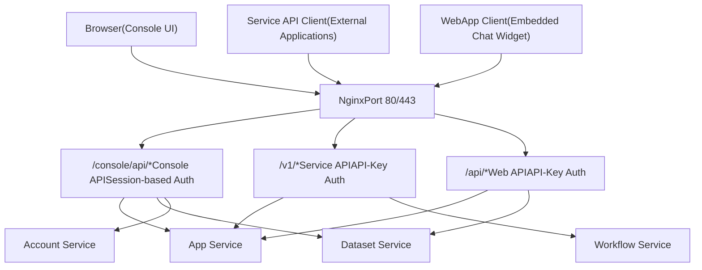
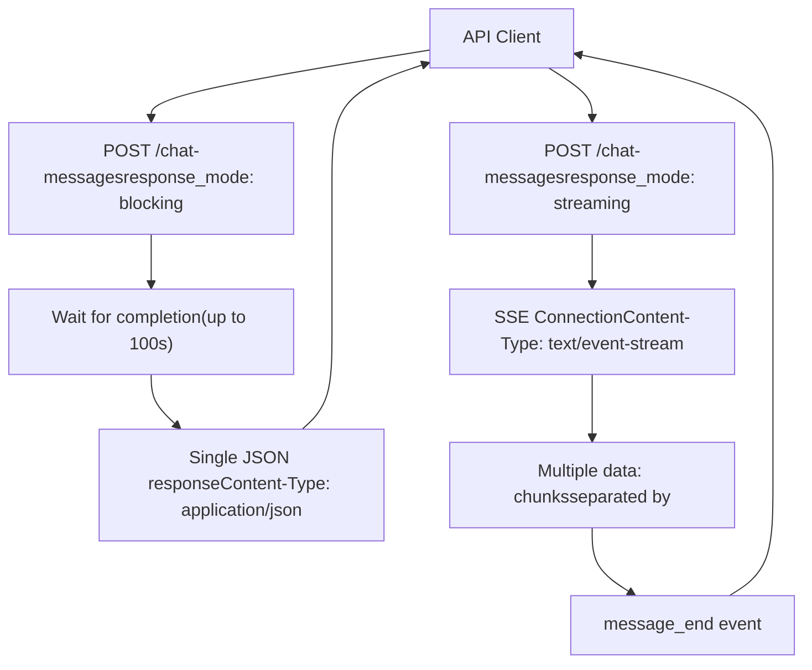
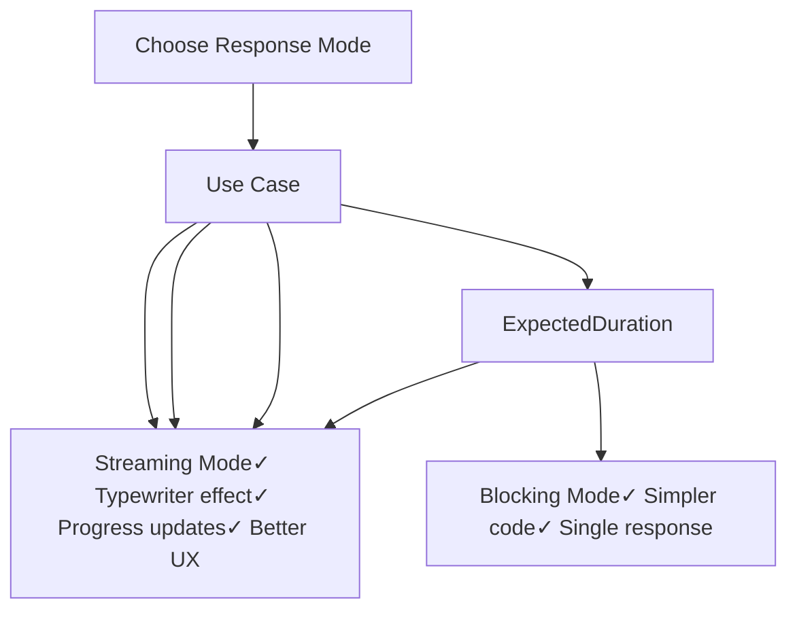

# API Architecture and Response Modes

Relevant source files

-   [web/app/components/develop/template/template.en.mdx](https://github.com/langgenius/dify/blob/92dbc94f/web/app/components/develop/template/template.en.mdx)
-   [web/app/components/develop/template/template.ja.mdx](https://github.com/langgenius/dify/blob/92dbc94f/web/app/components/develop/template/template.ja.mdx)
-   [web/app/components/develop/template/template.zh.mdx](https://github.com/langgenius/dify/blob/92dbc94f/web/app/components/develop/template/template.zh.mdx)
-   [web/app/components/develop/template/template\_advanced\_chat.en.mdx](https://github.com/langgenius/dify/blob/92dbc94f/web/app/components/develop/template/template_advanced_chat.en.mdx)
-   [web/app/components/develop/template/template\_advanced\_chat.ja.mdx](https://github.com/langgenius/dify/blob/92dbc94f/web/app/components/develop/template/template_advanced_chat.ja.mdx)
-   [web/app/components/develop/template/template\_advanced\_chat.zh.mdx](https://github.com/langgenius/dify/blob/92dbc94f/web/app/components/develop/template/template_advanced_chat.zh.mdx)
-   [web/app/components/develop/template/template\_chat.en.mdx](https://github.com/langgenius/dify/blob/92dbc94f/web/app/components/develop/template/template_chat.en.mdx)
-   [web/app/components/develop/template/template\_chat.ja.mdx](https://github.com/langgenius/dify/blob/92dbc94f/web/app/components/develop/template/template_chat.ja.mdx)
-   [web/app/components/develop/template/template\_chat.zh.mdx](https://github.com/langgenius/dify/blob/92dbc94f/web/app/components/develop/template/template_chat.zh.mdx)
-   [web/app/components/develop/template/template\_workflow.en.mdx](https://github.com/langgenius/dify/blob/92dbc94f/web/app/components/develop/template/template_workflow.en.mdx)
-   [web/app/components/develop/template/template\_workflow.ja.mdx](https://github.com/langgenius/dify/blob/92dbc94f/web/app/components/develop/template/template_workflow.ja.mdx)
-   [web/app/components/develop/template/template\_workflow.zh.mdx](https://github.com/langgenius/dify/blob/92dbc94f/web/app/components/develop/template/template_workflow.zh.mdx)

## Purpose and Scope

This document describes the architecture of Dify's external APIs, focusing on the structural patterns, authentication mechanisms, and response delivery modes that are consistent across all API endpoints. It covers the three API layers (Console, Service, and Web), the dual response mode system (streaming vs. blocking), and the Server-Sent Events (SSE) protocol used for real-time streaming.

For specific endpoint documentation, see:

-   **Chat and Completion APIs**: [Chat and Completion APIs](/langgenius/dify/8.2-chat-and-completion-apis)
-   **Workflow Execution APIs**: [Workflow Execution APIs](/langgenius/dify/8.3-workflow-execution-apis)
-   **File Upload and Dataset APIs**: [File Upload and Dataset APIs](/langgenius/dify/8.4-file-upload-and-management-apis)

For authentication and authorization details beyond API key usage, see [Account Service and Authentication Flows](/langgenius/dify/7.1-tenant-and-account-models).

---

## API Layer Architecture

Dify exposes three distinct API layers, each serving different use cases and authentication models:


**API Layer Comparison**

| Layer | Path Prefix | Authentication | Purpose | Typical Users |
| --- | --- | --- | --- | --- |
| **Console API** | `/console/api/*` | Session cookies + CSRF token | App configuration and management | Console web UI |
| **Service API** | `/v1/*` | API-Key in Authorization header | External application integration | Backend services, mobile apps |
| **Web API** | `/api/*` | API-Key in Authorization header | Embedded chat widgets | WebApp embeds, public apps |

The **Service API** is the primary focus of this document, as it provides the programmatic interface for external integrations. All three layers share common response modes and error handling patterns.

**Sources:** [web/app/components/develop/template/template\_chat.en.mdx8-20](https://github.com/langgenius/dify/blob/92dbc94f/web/app/components/develop/template/template_chat.en.mdx#L8-L20) [web/app/components/develop/template/template\_workflow.en.mdx8-20](https://github.com/langgenius/dify/blob/92dbc94f/web/app/components/develop/template/template_workflow.en.mdx#L8-L20)

---

## Authentication

### API-Key Authentication

All Service API and Web API requests require an API key passed in the `Authorization` HTTP header using the Bearer token scheme:

```
Authorization: Bearer {API_KEY}
```
**Security Recommendations:**

-   Store API keys server-side only; never expose them in client-side code
-   Use environment variables or secure key management systems
-   Rotate keys periodically
-   Implement rate limiting on the client side

### API Key Types

| Key Type | Path | Scope | Lifecycle |
| --- | --- | --- | --- |
| **App API Key** | Service API (`/v1/*`) | Single application access | Generated per app, revocable |
| **Web API Key** | Web API (`/api/*`) | Public app access | Tied to published apps |

The Console API uses session-based authentication with cookies and CSRF tokens, which is handled automatically by the browser-based Console UI.

**Sources:** [web/app/components/develop/template/template\_chat.en.mdx12-19](https://github.com/langgenius/dify/blob/92dbc94f/web/app/components/develop/template/template_chat.en.mdx#L12-L19) [web/app/components/develop/template/template\_workflow.en.mdx13-19](https://github.com/langgenius/dify/blob/92dbc94f/web/app/components/develop/template/template_workflow.en.mdx#L13-L19)

---

## Response Modes

Dify APIs support two response delivery modes: **blocking** and **streaming**. The mode is specified via the `response_mode` parameter in the request body.


**Sources:** [web/app/components/develop/template/template\_chat.en.mdx44-50](https://github.com/langgenius/dify/blob/92dbc94f/web/app/components/develop/template/template_chat.en.mdx#L44-L50) [web/app/components/develop/template/template\_workflow.en.mdx47-57](https://github.com/langgenius/dify/blob/92dbc94f/web/app/components/develop/template/template_workflow.en.mdx#L47-L57)

---

### Blocking Mode

In blocking mode, the API waits until the entire response is generated, then returns a single JSON object.

**Characteristics:**

-   `Content-Type: application/json`
-   Single HTTP response after completion
-   Request timeout: 100 seconds (Cloudflare limitation)
-   Suitable for: Short-running operations, batch processing

**Example Request:**

```
{
  "query": "What is Dify?",
  "response_mode": "blocking",
  "user": "user-123"
}
```
**Example Response:**

```
{
  "event": "message",
  "task_id": "c3800678-a077-43df-a102-53f23ed20b88",
  "message_id": "9da23599-e713-473b-982c-4328d4f5c78a",
  "conversation_id": "45701982-8118-4bc5-8e9b-64562b4555f2",
  "mode": "chat",
  "answer": "Dify is an LLM application development platform...",
  "metadata": {
    "usage": {
      "total_tokens": 150,
      "total_price": "0.0001"
    }
  },
  "created_at": 1705395332
}
```
**Limitations:**

-   Not supported in Agent mode (due to potentially long execution times)
-   May be interrupted if processing exceeds 100 seconds
-   Cannot provide progress updates during execution

**Sources:** [web/app/components/develop/template/template\_chat.en.mdx89-104](https://github.com/langgenius/dify/blob/92dbc94f/web/app/components/develop/template/template_chat.en.mdx#L89-L104) [web/app/components/develop/template/template.zh.mdx70-83](https://github.com/langgenius/dify/blob/92dbc94f/web/app/components/develop/template/template.zh.mdx#L70-L83)

---

### Streaming Mode (Recommended)

Streaming mode uses Server-Sent Events (SSE) to deliver responses incrementally, enabling real-time typewriter-style output.

**Characteristics:**

-   `Content-Type: text/event-stream`
-   Multiple events streamed over a persistent connection
-   Each event starts with `data:` and is separated by `\n\n` (two newlines)
-   Supports progress tracking via workflow events
-   No timeout limitation (connection kept alive with periodic `ping` events)

**Example Request:**

```
{
  "query": "Write a poem",
  "response_mode": "streaming",
  "user": "user-123"
}
```
**Example Streaming Response:**

```
data: {"event": "message", "message_id": "abc-123", "answer": "In", "created_at": 1705395332}

data: {"event": "message", "message_id": "abc-123", "answer": " fields", "created_at": 1705395333}

data: {"event": "message", "message_id": "abc-123", "answer": " of", "created_at": 1705395334}

data: {"event": "message_end", "message_id": "abc-123", "metadata": {"usage": {"total_tokens": 50}}}
```
**Connection Keep-Alive:** Every 10 seconds, a `ping` event is sent to maintain the connection:

```
data: {"event": "ping"}
```
**Sources:** [web/app/components/develop/template/template\_chat.en.mdx106-113](https://github.com/langgenius/dify/blob/92dbc94f/web/app/components/develop/template/template_chat.en.mdx#L106-L113) [web/app/components/develop/template/template\_workflow.zh.mdx82-89](https://github.com/langgenius/dify/blob/92dbc94f/web/app/components/develop/template/template_workflow.zh.mdx#L82-L89)

---

## SSE Event Protocol

### Event Structure

Each SSE event follows this format:

```
data: {JSON_PAYLOAD}
```
The JSON payload always contains:

-   `event` (string): Event type identifier
-   `task_id` (string): Unique task identifier for tracking and cancellation
-   Additional fields specific to the event type

### Connection Lifecycle

> **[Mermaid sequence]**
> *(图表结构无法解析)*

**Sources:** [web/app/components/develop/template/template\_chat.en.mdx106-178](https://github.com/langgenius/dify/blob/92dbc94f/web/app/components/develop/template/template_chat.en.mdx#L106-L178)

---

## Event Types by Application Mode

Different application modes emit different event types. The following sections detail the events available for each mode.

### Chat and Completion Events

Used by Chat applications (basic and advanced) and Completion applications.

| Event | Description | When Emitted |
| --- | --- | --- |
| `message` | LLM text chunk | During text generation (streaming) |
| `agent_message` | Agent text chunk | During agent response (Agent mode only) |
| `agent_thought` | Agent reasoning step | During tool execution (Agent mode only) |
| `message_file` | File generated by tool | When tool creates a file (Agent mode) |
| `message_end` | Response complete | After all text is generated |
| `message_replace` | Content moderation replacement | When output is flagged by content moderation |
| `tts_message` | TTS audio chunk (base64) | During speech synthesis (if enabled) |
| `tts_message_end` | TTS complete | After all audio is generated |
| `error` | Error occurred | On any error during execution |
| `ping` | Keep-alive | Every 10 seconds |

**Chat `message` Event:**

```
{
  "event": "message",
  "task_id": "900bbd43-dc0b-4383-a372-aa6e6c414227",
  "message_id": "663c5084-a254-4040-8ad3-51f2a3c1a77c",
  "conversation_id": "45701982-8118-4bc5-8e9b-64562b4555f2",
  "answer": " Hello",
  "created_at": 1705398420
}
```
**Agent `agent_thought` Event:**

```
{
  "event": "agent_thought",
  "id": "592c84cf-07ee-441c-9dcc-ffc66c033469",
  "task_id": "900bbd43-dc0b-4383-a372-aa6e6c414227",
  "message_id": "d35e006c-7c4d-458f-9142-be4930abdf94",
  "position": 1,
  "thought": "I need to search for information",
  "observation": "Search results: ...",
  "tool": "google_search",
  "tool_input": "{\"query\": \"Dify platform\"}",
  "created_at": 1705988186,
  "message_files": ["file-id-123"],
  "conversation_id": "45701982-8118-4bc5-8e9b-64562b4555f2"
}
```
**`message_end` Event:**

```
{
  "event": "message_end",
  "task_id": "900bbd43-dc0b-4383-a372-aa6e6c414227",
  "message_id": "663c5084-a254-4040-8ad3-51f2a3c1a77c",
  "conversation_id": "45701982-8118-4bc5-8e9b-64562b4555f2",
  "metadata": {
    "usage": {
      "prompt_tokens": 1033,
      "completion_tokens": 135,
      "total_tokens": 1168,
      "total_price": "0.0013030",
      "currency": "USD"
    },
    "retriever_resources": [
      {
        "position": 1,
        "dataset_id": "101b4c97-fc2e-463c-90b1-5261a4cdcafb",
        "dataset_name": "iPhone",
        "document_id": "8dd1ad74-0b5f-4175-b735-7d98bbbb4e00",
        "segment_id": "ed599c7f-2766-4294-9d1d-e5235a61270a",
        "score": 0.98457545,
        "content": "Model info..."
      }
    ]
  }
}
```
**Sources:** [web/app/components/develop/template/template\_chat.en.mdx114-178](https://github.com/langgenius/dify/blob/92dbc94f/web/app/components/develop/template/template_chat.en.mdx#L114-L178) [web/app/components/develop/template/template\_chat.zh.mdx114-178](https://github.com/langgenius/dify/blob/92dbc94f/web/app/components/develop/template/template_chat.zh.mdx#L114-L178)

---

### Workflow Events

Used by Workflow applications and Advanced Chat applications (which are workflow-based).

| Event | Description | Timing |
| --- | --- | --- |
| `workflow_started` | Workflow execution begins | At workflow start |
| `node_started` | Node begins execution | Before each node runs |
| `node_finished` | Node completes execution | After each node completes |
| `text_chunk` | Text output fragment | During node text generation |
| `workflow_finished` | Workflow execution complete | After all nodes complete |
| `error` | Error occurred | On any error |
| `ping` | Keep-alive | Every 10 seconds |

**Event Flow Diagram:**

> **[Mermaid sequence]**
> *(图表结构无法解析)*

**`workflow_started` Event:**

```
{
  "event": "workflow_started",
  "task_id": "5ad4cb98-f0c7-4085-b384-88c403be6290",
  "workflow_run_id": "5ad498-f0c7-4085-b384-88cbe6290",
  "data": {
    "id": "5ad498-f0c7-4085-b384-88cbe6290",
    "workflow_id": "dfjasklfjdslag",
    "created_at": 1679586595
  }
}
```
**`node_started` Event:**

```
{
  "event": "node_started",
  "task_id": "5ad4cb98-f0c7-4085-b384-88c403be6290",
  "workflow_run_id": "5ad498-f0c7-4085-b384-88cbe6290",
  "data": {
    "id": "5ad498-f0c7-4085-b384-88cbe6290",
    "node_id": "llm-node-1",
    "node_type": "llm",
    "title": "Generate Summary",
    "index": 1,
    "predecessor_node_id": "start-node",
    "inputs": {
      "query": "Summarize this text..."
    },
    "created_at": 1679586595
  }
}
```
**`node_finished` Event:**

```
{
  "event": "node_finished",
  "task_id": "5ad4cb98-f0c7-4085-b384-88c403be6290",
  "workflow_run_id": "5ad498-f0c7-4085-b384-88cbe6290",
  "data": {
    "id": "5ad498-f0c7-4085-b384-88cbe6290",
    "node_id": "llm-node-1",
    "node_type": "llm",
    "title": "Generate Summary",
    "index": 1,
    "predecessor_node_id": "start-node",
    "inputs": {},
    "outputs": {
      "text": "This is a summary..."
    },
    "status": "succeeded",
    "elapsed_time": 1.234,
    "execution_metadata": {
      "total_tokens": 150,
      "total_price": "0.00015",
      "currency": "USD"
    },
    "created_at": 1679586595
  }
}
```
**`text_chunk` Event:**

```
{
  "event": "text_chunk",
  "task_id": "bd029338-b068-4d34-a331-fc85478922c2",
  "workflow_run_id": "b85e5fc5-751b-454d-b14e-dc5f240b0a31",
  "data": {
    "text": "Hello ",
    "from_variable_selector": ["1745912968134", "text"]
  }
}
```
**`workflow_finished` Event:**

```
{
  "event": "workflow_finished",
  "task_id": "5ad4cb98-f0c7-4085-b384-88c403be6290",
  "workflow_run_id": "5ad498-f0c7-4085-b384-88cbe6290",
  "data": {
    "id": "5ad498-f0c7-4085-b384-88cbe6290",
    "workflow_id": "dfjasklfjdslag",
    "status": "succeeded",
    "outputs": {
      "result": "Final output text"
    },
    "elapsed_time": 3.456,
    "total_tokens": 500,
    "total_steps": 3,
    "created_at": 1679586595,
    "finished_at": 1679586598
  }
}
```
**Node Status Values:**

-   `running`: Node is currently executing
-   `succeeded`: Node completed successfully
-   `failed`: Node encountered an error
-   `stopped`: Node was manually stopped

**Sources:** [web/app/components/develop/template/template\_workflow.en.mdx98-148](https://github.com/langgenius/dify/blob/92dbc94f/web/app/components/develop/template/template_workflow.en.mdx#L98-L148) [web/app/components/develop/template/template\_advanced\_chat.en.mdx151-209](https://github.com/langgenius/dify/blob/92dbc94f/web/app/components/develop/template/template_advanced_chat.en.mdx#L151-L209)

---

### Error Events

Error events are emitted when an exception occurs during streaming execution. Receiving an error event terminates the stream.

```
{
  "event": "error",
  "task_id": "900bbd43-dc0b-4383-a372-aa6e6c414227",
  "message_id": "663c5084-a254-4040-8ad3-51f2a3c1a77c",
  "status": 400,
  "code": "provider_quota_exceeded",
  "message": "Model invocation quota exceeded"
}
```
**Error Structure:**

-   `status` (int): HTTP status code
-   `code` (string): Machine-readable error code
-   `message` (string): Human-readable error description

**Sources:** [web/app/components/develop/template/template\_chat.en.mdx170-177](https://github.com/langgenius/dify/blob/92dbc94f/web/app/components/develop/template/template_chat.en.mdx#L170-L177) [web/app/components/develop/template/template\_workflow.zh.mdx165-173](https://github.com/langgenius/dify/blob/92dbc94f/web/app/components/develop/template/template_workflow.zh.mdx#L165-L173)

---

## Common Response Objects

### Usage Object

The `Usage` object appears in the `metadata` field of completion responses and provides token consumption and cost information.

```
{
  "usage": {
    "prompt_tokens": 1033,
    "prompt_unit_price": "0.001",
    "prompt_price_unit": "0.001",
    "prompt_price": "0.0010330",
    "completion_tokens": 128,
    "completion_unit_price": "0.002",
    "completion_price_unit": "0.001",
    "completion_price": "0.0002560",
    "total_tokens": 1161,
    "total_price": "0.0012890",
    "currency": "USD",
    "latency": 0.7682376249867957
  }
}
```
**Fields:**

-   `prompt_tokens` (int): Tokens used in the prompt/input
-   `completion_tokens` (int): Tokens generated in the response
-   `total_tokens` (int): Sum of prompt and completion tokens
-   `prompt_price` (string): Cost of prompt tokens
-   `completion_price` (string): Cost of completion tokens
-   `total_price` (string): Total cost for this request
-   `currency` (string): Currency code (e.g., `USD`, `RMB`)
-   `latency` (float): Response time in seconds

**Sources:** [web/app/components/develop/template/template\_chat.en.mdx228-242](https://github.com/langgenius/dify/blob/92dbc94f/web/app/components/develop/template/template_chat.en.mdx#L228-L242)

---

### RetrieverResource Object

The `RetrieverResource` object appears in responses when knowledge retrieval is used, providing citation and attribution information.

```
{
  "retriever_resources": [
    {
      "position": 1,
      "dataset_id": "101b4c97-fc2e-463c-90b1-5261a4cdcafb",
      "dataset_name": "iPhone",
      "document_id": "8dd1ad74-0b5f-4175-b735-7d98bbbb4e00",
      "document_name": "iPhone List",
      "segment_id": "ed599c7f-2766-4294-9d1d-e5235a61270a",
      "score": 0.98457545,
      "content": "Model,Release Date,Display Size..."
    }
  ]
}
```
**Fields:**

-   `position` (int): Ranking position in retrieval results (1-based)
-   `dataset_id` (string): UUID of the dataset
-   `dataset_name` (string): Display name of the dataset
-   `document_id` (string): UUID of the source document
-   `document_name` (string): Display name of the document
-   `segment_id` (string): UUID of the specific segment/chunk
-   `score` (float): Relevance score (0.0 to 1.0)
-   `content` (string): Retrieved text content

This information enables applications to display citations and allow users to trace answers back to source documents.

**Sources:** [web/app/components/develop/template/template\_chat.en.mdx243-254](https://github.com/langgenius/dify/blob/92dbc94f/web/app/components/develop/template/template_chat.en.mdx#L243-L254)

---

### Metadata Structure

The `metadata` object in completion responses aggregates usage and retrieval information:

```
{
  "metadata": {
    "usage": {
      "total_tokens": 1168,
      "total_price": "0.0013030",
      "currency": "USD"
    },
    "retriever_resources": [
      {
        "position": 1,
        "dataset_name": "Knowledge Base",
        "score": 0.95,
        "content": "..."
      }
    ]
  }
}
```
For workflow executions, the `execution_metadata` field in `node_finished` events provides per-node metrics:

```
{
  "execution_metadata": {
    "total_tokens": 150,
    "total_price": "0.00015",
    "currency": "USD"
  }
}
```
**Sources:** [web/app/components/develop/template/template\_chat.en.mdx228-255](https://github.com/langgenius/dify/blob/92dbc94f/web/app/components/develop/template/template_chat.en.mdx#L228-L255) [web/app/components/develop/template/template\_workflow.en.mdx144-147](https://github.com/langgenius/dify/blob/92dbc94f/web/app/components/develop/template/template_workflow.en.mdx#L144-L147)

---

## Error Handling

### Common Error Codes

Dify APIs return standard HTTP status codes along with structured error information. In streaming mode, errors are delivered as SSE events; in blocking mode, they are returned as JSON responses.

**Error Response Structure (Blocking Mode):**

```
{
  "code": "provider_quota_exceeded",
  "message": "Model invocation quota insufficient",
  "status": 400
}
```
**Error Response Structure (Streaming Mode):**

```
{
  "event": "error",
  "task_id": "900bbd43-dc0b-4383-a372-aa6e6c414227",
  "message_id": "663c5084-a254-4040-8ad3-51f2a3c1a77c",
  "status": 400,
  "code": "provider_quota_exceeded",
  "message": "Model invocation quota insufficient"
}
```
**Common Error Codes:**

| HTTP Status | Error Code | Description |
| --- | --- | --- |
| 400 | `invalid_param` | Request parameter validation failed |
| 400 | `app_unavailable` | Application configuration is unavailable |
| 400 | `provider_not_initialize` | No model credentials configured |
| 400 | `provider_quota_exceeded` | Model API quota exceeded |
| 400 | `model_currently_not_support` | Requested model is unavailable |
| 400 | `completion_request_error` | Text generation failed |
| 400 | `workflow_request_error` | Workflow execution failed |
| 400 | `workflow_not_found` | Specified workflow version not found |
| 400 | `draft_workflow_error` | Cannot execute draft workflow |
| 400 | `workflow_id_format_error` | Invalid workflow ID format |
| 404 | `conversation_not_exists` | Conversation ID not found |
| 413 | `file_too_large` | Uploaded file exceeds size limit |
| 415 | `unsupported_file_type` | File type not supported |
| 503 | `s3_connection_failed` | Storage service unavailable |
| 503 | `s3_permission_denied` | Storage permission denied |
| 500 | (no code) | Internal server error |

**Sources:** [web/app/components/develop/template/template\_chat.en.mdx179-190](https://github.com/langgenius/dify/blob/92dbc94f/web/app/components/develop/template/template_chat.en.mdx#L179-L190) [web/app/components/develop/template/template\_workflow.en.mdx166-173](https://github.com/langgenius/dify/blob/92dbc94f/web/app/components/develop/template/template_workflow.en.mdx#L166-L173)

---

## Trace ID Support

All API endpoints support distributed tracing through the `trace_id` parameter, enabling integration with existing observability systems.

**Priority Order (highest to lowest):**

1.  **HTTP Header**: `X-Trace-Id` (recommended)
2.  **Query Parameter**: `?trace_id=...`
3.  **Request Body**: `"trace_id": "..."`

**Example with Header:**

```
POST /v1/chat-messages HTTP/1.1
Host: api.dify.ai
Authorization: Bearer {api_key}
X-Trace-Id: my-custom-trace-id-12345
Content-Type: application/json

{
  "query": "Hello",
  "response_mode": "streaming",
  "user": "user-123"
}
```
If no `trace_id` is provided, the system automatically generates one. The trace ID is included in all log entries and can be used to correlate API requests with internal workflow execution, LLM calls, and database operations.

**Sources:** [web/app/components/develop/template/template\_chat.en.mdx80-85](https://github.com/langgenius/dify/blob/92dbc94f/web/app/components/develop/template/template_chat.en.mdx#L80-L85) [web/app/components/develop/template/template\_workflow.en.mdx64-68](https://github.com/langgenius/dify/blob/92dbc94f/web/app/components/develop/template/template_workflow.en.mdx#L64-L68)

---

## Response Mode Selection Guide


**Recommendations:**

**Use Streaming When:**

-   Building interactive chat interfaces
-   Execution time may exceed 90 seconds
-   Using Agent mode (required)
-   User needs progress feedback
-   Executing workflows with multiple nodes

**Use Blocking When:**

-   Implementing batch processing jobs
-   Execution time is predictable and short
-   Integration simplicity is paramount
-   Consuming API from systems that don't support SSE

**Sources:** [web/app/components/develop/template/template\_chat.en.mdx44-50](https://github.com/langgenius/dify/blob/92dbc94f/web/app/components/develop/template/template_chat.en.mdx#L44-L50) [web/app/components/develop/template/template\_workflow.en.mdx54-57](https://github.com/langgenius/dify/blob/92dbc94f/web/app/components/develop/template/template_workflow.en.mdx#L54-L57)
